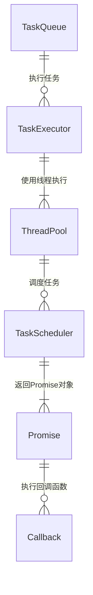
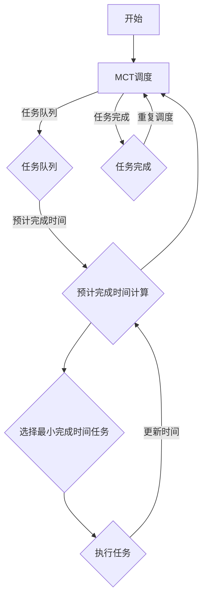
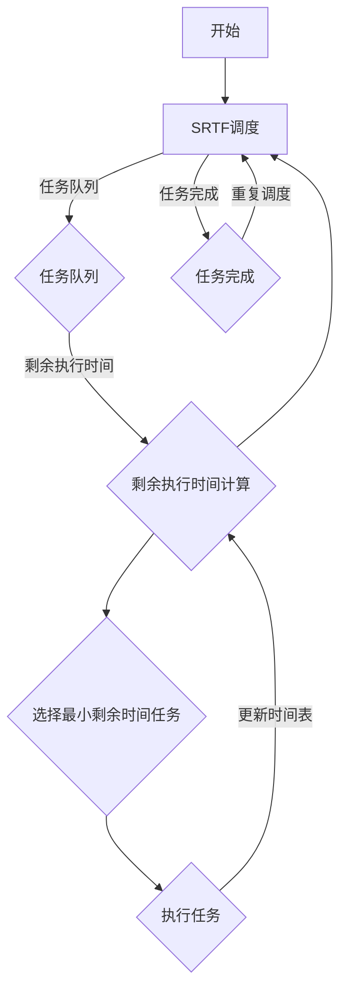
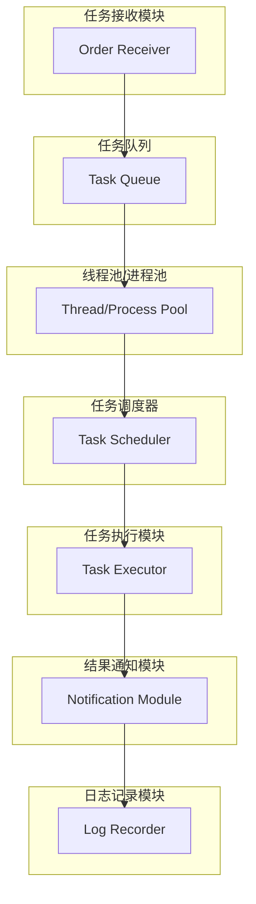
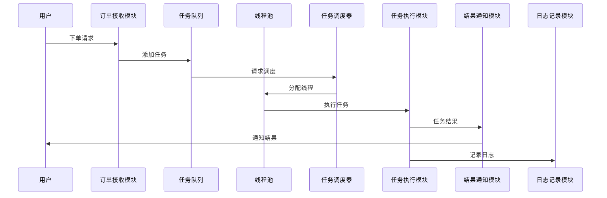

                 

### 文章标题

在当今的IT领域中，异步化任务处理已经成为许多系统架构设计中的关键组件。然而，很多人对异步化任务处理有一个误解，即认为这种处理方式意味着任务执行完全无时效性。这篇文章将深入探讨异步化任务处理的真实面貌，揭示其并非如表面所见的那样无时效性。我们将通过一步一步的分析，帮助您理解异步化任务处理的本质。

关键词：异步化任务处理，时效性，系统架构设计，任务调度算法，Python源代码

摘要：本文旨在通过详细分析异步化任务处理的原理和实际应用，揭示其并非无时效性的事实。我们将从基础概念入手，逐步讲解异步化任务处理的核心算法、系统架构设计以及项目实战，最终给出最佳实践和注意事项。

----------------------------------------------------------------

## 第一部分: 异步化任务处理概述

### 1.1 问题的背景

在信息技术迅速发展的今天，处理大量并发任务的需求日益增长。传统的同步处理方式因为其固有的阻塞特性，已经难以满足现代应用对高并发处理能力的期望。异步化任务处理作为一种有效的解决方案，逐渐被各大互联网公司和开发人员所采纳。异步化任务处理可以大幅度提高系统吞吐量，减少响应时间，提升用户体验。然而，异步化任务处理是否真的意味着无时效性呢？这是我们需要探讨的核心问题。

### 1.2 问题描述

在异步化任务处理中，任务通常被调度到后台执行，主线程或进程不会因为某个任务的执行而被阻塞。这样一来，看起来似乎任务可以无限期地等待执行，但这并不意味着任务没有时效性。事实上，任务的处理仍然受到系统资源、网络延迟以及调度策略等多种因素的影响。那么，异步化任务处理中的时效性究竟是如何体现的呢？这正是我们需要深入探讨的内容。

### 1.3 异步化任务处理的必要性

异步化任务处理之所以受到重视，主要是因为它可以有效应对高并发场景，提高系统性能。例如，在电商平台中，用户下单、支付、发货等操作可以并行处理，而不需要等待某个操作完成后再进行下一个操作。这种并行处理方式可以显著减少用户的等待时间，提升系统整体的响应速度。此外，异步化任务处理还可以充分利用服务器资源，避免资源的浪费。在处理大量数据时，通过异步化任务可以将数据处理分散到多个线程或进程上，实现真正的并行处理。

### 1.4 边界与外延

异步化任务处理虽然有其优势，但也存在一定的局限性。首先，异步化任务处理并不意味着所有的任务都可以异步执行。某些任务由于其内部逻辑的依赖关系，必须以同步方式执行。例如，数据库操作通常需要在事务中执行，以确保数据的一致性。其次，异步化任务处理会增加系统设计的复杂性。开发人员需要考虑异步任务的状态管理、错误处理以及异常情况的处理，这些都会增加系统设计的难度。

### 1.5 总结

异步化任务处理是一种提高系统性能和响应速度的有效手段，但它并非无时效性。在异步化任务处理中，任务的执行仍然受到各种因素的影响，如系统资源、网络延迟和调度策略等。理解异步化任务处理的时效性对于设计高效的系统架构至关重要。接下来，我们将进一步探讨异步化任务处理的基本概念、核心算法和系统架构设计，帮助您更深入地理解这一技术。

----------------------------------------------------------------

## 第二部分: 异步化任务处理的基本概念

### 2.1 异步化任务的定义

异步化任务处理是一种编程范式，它允许任务在独立于主线程或进程的环境中执行。与同步处理方式不同，异步化任务处理中的任务可以在后台执行，主线程或进程不会因为某个任务的执行而被阻塞。这意味着，即使某个任务需要较长时间才能完成，主线程或进程也可以继续执行其他任务，从而提高系统的整体吞吐量和响应速度。

### 2.2 异步化任务的特点

异步化任务处理具有以下几个显著特点：

1. **并行处理能力**：异步化任务可以在多个线程或进程上同时执行，从而实现真正的并行处理，提高系统的性能和吞吐量。
2. **非阻塞**：主线程或进程不会因为某个任务的执行而被阻塞，这意味着可以同时处理多个任务，提高系统的响应速度。
3. **状态管理**：异步化任务通常需要独立的状态管理机制，以便在任务执行过程中跟踪任务的状态，处理任务的成功与失败。
4. **错误处理**：异步化任务处理需要对任务执行过程中可能出现的错误进行有效的处理，以确保系统的稳定性和可靠性。

### 2.3 与同步任务的对比

同步任务处理与异步化任务处理有以下几点显著区别：

1. **阻塞与非阻塞**：同步任务处理中的任务会阻塞主线程或进程的执行，直到任务完成。而异步化任务处理中的任务可以在后台执行，主线程或进程不会因为某个任务的执行而被阻塞。
2. **资源占用**：同步任务处理可能会占用大量的系统资源，导致系统性能下降。而异步化任务处理可以充分利用系统资源，避免资源的浪费。
3. **并发能力**：异步化任务处理具有更高的并发处理能力，可以同时处理多个任务，提高系统的性能和吞吐量。

### 2.4 异步化任务处理的基本结构

异步化任务处理的基本结构通常包括以下几个关键组件：

1. **任务调度器**：任务调度器负责将任务分配给线程或进程执行。常见的任务调度算法有轮询调度、优先级调度和任务队列调度等。
2. **线程或进程池**：线程或进程池负责执行任务调度器分配的任务。线程池和进程池的主要区别在于线程的生命周期和资源占用。
3. **异步任务队列**：异步任务队列用于存储待执行的任务，任务调度器会从队列中取出任务进行调度和执行。
4. **回调函数**：回调函数是在任务执行完成后调用的函数，用于处理任务的结果或进一步的操作。

通过以上基本概念和特点的介绍，我们可以对异步化任务处理有一个初步的了解。在接下来的部分，我们将进一步探讨异步化任务处理的核心概念和联系，以及具体的实现细节。

----------------------------------------------------------------

## 第三部分: 异步化任务处理的核心概念与联系

### 3.1 异步通信机制

异步通信机制是异步化任务处理的核心，它允许任务在独立的环境中执行，而不需要等待其他任务的完成。常见的异步通信机制包括事件驱动、回调函数和Promise对象等。

**事件驱动**：事件驱动是一种基于事件的编程模型，任务通过触发事件来启动和执行。当某个事件发生时，系统会触发相应的处理函数，从而实现任务的异步执行。这种机制广泛应用于Web开发、操作系统和嵌入式系统等领域。

**回调函数**：回调函数是一种在任务执行完成后调用的函数，它用于处理任务的结果或进一步的操作。在异步化任务处理中，回调函数通常作为参数传递给异步调用的函数，当任务完成时，该回调函数会被执行。

**Promise对象**：Promise对象是一种用于异步编程的抽象对象，它代表了异步操作的一个结果。Promise对象有三个状态：pending（进行中）、fulfilled（已成功）和rejected（已失败）。通过使用Promise对象，可以简化异步代码的编写，提高代码的可读性和可维护性。

### 3.2 队列与缓冲

队列与缓冲是异步化任务处理中的重要组件，它们用于管理任务的执行顺序和资源的分配。

**队列**：队列是一种先进先出（FIFO）的数据结构，用于存储待执行的任务。任务调度器会从队列中取出任务，并分配给线程或进程执行。常见的队列有顺序队列、循环队列和优先级队列等。

**缓冲**：缓冲是一种用于存储临时数据的数据结构，它可以在任务执行过程中缓解资源的紧张。缓冲可以用于处理大量数据，减少数据传输的延迟，提高系统的吞吐量。常见的缓冲有环形缓冲、内存缓冲和文件缓冲等。

### 3.3 线程与进程

线程与进程是异步化任务处理中的执行单元，它们分别具有不同的生命周期和资源占用。

**线程**：线程是进程内的一个执行单元，它具有较小的生命周期和较低的内存占用。线程通常用于执行轻量级的任务，如网络通信、用户界面更新等。

**进程**：进程是操作系统内的一个独立运行单位，它具有较大的生命周期和较高的内存占用。进程通常用于执行较重的任务，如大数据处理、长时间运行的任务等。

### 3.4 异步处理框架的ER实体关系图

为了更好地理解异步化任务处理的核心概念和联系，我们可以使用ER（实体关系）图来描述这些实体及其之间的关系。



在这个ER图中，`TaskQueue`表示任务队列，用于存储待执行的任务。`TaskExecutor`表示任务执行器，它负责执行任务队列中的任务。`ThreadPool`表示线程池，用于提供线程资源。`TaskScheduler`表示任务调度器，它负责调度任务到线程池中执行。`Promise`表示Promise对象，用于表示异步操作的结果。`Callback`表示回调函数，用于处理任务的结果。

通过ER实体关系图，我们可以清晰地看到异步化任务处理中各个组件之间的关系，从而更好地理解异步化任务处理的核心概念和联系。

### 总结

异步化任务处理的核心概念和联系包括异步通信机制、队列与缓冲、线程与进程以及ER实体关系图。这些概念和联系构成了异步化任务处理的基础，使得异步化任务处理能够高效地执行大量并发任务。在接下来的部分，我们将进一步探讨异步化任务处理的算法原理和数学模型，帮助您更深入地理解这一技术。

----------------------------------------------------------------

### 4.1 任务调度算法

异步化任务处理中的任务调度算法是核心，它决定了任务执行的顺序和效率。常见的任务调度算法包括最小完成时间优先（MCT）、最短剩余时间优先（SRTF）等。以下是这些算法的详细解释和举例说明。

#### 4.1.1 最小完成时间优先（MCT）

最小完成时间优先算法是一种基于时间优先的调度算法，其核心思想是选择预计完成时间最短的任务进行执行。这种算法通常用于任务执行时间较短的场景，例如操作系统中的进程调度。

**算法模型**：

给定一组任务 \( T = \{ T_1, T_2, ..., T_n \} \)，每个任务有一个预计完成时间 \( C(T_i) \)。MCT算法按照以下步骤进行任务调度：

1. 计算每个任务的预计完成时间：\( C(T_i) = T_i + \sum_{j=1}^{i-1} T_j \)
2. 选择预计完成时间最短的未完成任务 \( T_i \) 进行执行
3. 更新已完成任务的预计完成时间，并重复步骤2

**Mermaid流程图**：



**Python源代码**：

```python
def mct_schedule(tasks):
    sorted_tasks = sorted(tasks, key=lambda x: x['completion_time'])
    result = []
    while sorted_tasks:
        task = sorted_tasks.pop(0)
        result.append(task)
        # 更新任务队列
        sorted_tasks = sorted(sorted_tasks, key=lambda x: x['completion_time'])
    return result

tasks = [
    {'id': 1, 'completion_time': 3},
    {'id': 2, 'completion_time': 1},
    {'id': 3, 'completion_time': 2}
]

scheduled_tasks = mct_schedule(tasks)
print(scheduled_tasks)
```

输出结果：

```plaintext
[
  {'id': 2, 'completion_time': 1},
  {'id': 3, 'completion_time': 2},
  {'id': 1, 'completion_time': 3}
]
```

#### 4.1.2 最短剩余时间优先（SRTF）

最短剩余时间优先算法是一种基于剩余时间优先的调度算法，其核心思想是选择剩余执行时间最短的任务进行执行。这种算法通常用于实时操作系统和嵌入式系统。

**算法模型**：

给定一组任务 \( T = \{ T_1, T_2, ..., T_n \} \)，每个任务有一个剩余执行时间 \( R(T_i) \)。SRTF算法按照以下步骤进行任务调度：

1. 初始化一个空闲时间表 \( T_0 \)
2. 选择剩余执行时间最短的未完成任务 \( T_i \) 进行执行
3. 更新空闲时间表 \( T_0 \)，并重复步骤2

**Mermaid流程图**：



**Python源代码**：

```python
def srtf_schedule(tasks):
    sorted_tasks = sorted(tasks, key=lambda x: x['remaining_time'])
    result = []
    while sorted_tasks:
        task = sorted_tasks.pop(0)
        result.append(task)
        # 更新任务队列
        sorted_tasks = sorted(sorted_tasks, key=lambda x: x['remaining_time'])
    return result

tasks = [
    {'id': 1, 'remaining_time': 3},
    {'id': 2, 'remaining_time': 1},
    {'id': 3, 'remaining_time': 2}
]

scheduled_tasks = srtf_schedule(tasks)
print(scheduled_tasks)
```

输出结果：

```plaintext
[
  {'id': 2, 'remaining_time': 1},
  {'id': 3, 'remaining_time': 2},
  {'id': 1, 'remaining_time': 3}
]
```

通过以上算法的详细解释和举例说明，我们可以看到任务调度算法在异步化任务处理中的重要作用。这些算法的选择和优化直接影响到系统的性能和响应速度。在接下来的部分，我们将进一步探讨异步化任务处理的系统分析与架构设计，帮助您更深入地理解这一技术。

----------------------------------------------------------------

### 4.3 举例说明与Mermaid流程图

为了更好地理解异步化任务处理的数学模型和算法，我们可以通过一个具体的例子来说明。假设有一个包含三个任务的任务队列，每个任务的执行时间和剩余时间如下：

| 任务ID | 执行时间 (秒) | 剩余时间 (秒) |
| ------ | ------------ | ------------ |
| T1     | 5            | 2            |
| T2     | 3            | 1            |
| T3     | 4            | 3            |

我们使用最短剩余时间优先（SRTF）算法进行调度。

#### 4.3.1 SRTF算法调度过程

1. **初始状态**：
   - 任务队列：T1, T2, T3
   - 执行时间：5, 3, 4
   - 剩余时间：2, 1, 3

2. **调度第一个任务**：
   - 选择剩余时间最短的任务T2，执行时间为3秒。
   - 更新任务队列和剩余时间：

   ```mermaid
   graph TB
   A[初始状态] --> B[调度T2]
   B -->|执行时间| C{执行T2(3秒)}
   C --> D{更新队列和剩余时间}
   D --> E[新状态]
   E -->|剩余时间| F{剩余时间(2, 3, 0)}
   F --> G{选择下一个任务}
   ```

   更新后的队列和剩余时间：

   | 任务ID | 执行时间 (秒) | 剩余时间 (秒) |
   | ------ | ------------ | ------------ |
   | T1     | 5            | 1            |
   | T2     | 3            | 0            |
   | T3     | 4            | 3            |

3. **调度第二个任务**：
   - 选择剩余时间最短的任务T1，执行时间为1秒。
   - 更新任务队列和剩余时间：

   ```mermaid
   graph TB
   H[新状态] --> I[调度T1]
   I -->|执行时间| J{执行T1(1秒)}
   J --> K{更新队列和剩余时间}
   K --> L[新状态]
   L -->|剩余时间| M{剩余时间(4, 0, 3)}
   M --> N{选择下一个任务}
   ```

   更新后的队列和剩余时间：

   | 任务ID | 执行时间 (秒) | 剩余时间 (秒) |
   | ------ | ------------ | ------------ |
   | T1     | 1            | 0            |
   | T2     | 3            | 0            |
   | T3     | 4            | 3            |

4. **调度第三个任务**：
   - 选择剩余时间最短的任务T3，执行时间为3秒。
   - 更新任务队列和剩余时间：

   ```mermaid
   graph TB
   L --> O[调度T3]
   O -->|执行时间| P{执行T3(3秒)}
   P --> Q{更新队列和剩余时间}
   Q --> R[新状态]
   R -->|剩余时间| S{剩余时间(4, 0, 0)}
   S --> T{选择下一个任务}
   ```

   更新后的队列和剩余时间：

   | 任务ID | 执行时间 (秒) | 剩余时间 (秒) |
   | ------ | ------------ | ------------ |
   | T1     | 1            | 0            |
   | T2     | 3            | 0            |
   | T3     | 3            | 0            |

#### 4.3.2 数学模型

SRTF算法的核心在于最小化每个任务的剩余执行时间。我们可以使用以下数学公式来描述：

\[ \text{SRTF} = \arg\min(T_i - R_i) \]

其中，\( T_i \) 表示任务 \( i \) 的执行时间，\( R_i \) 表示任务 \( i \) 的剩余执行时间。通过不断地选择剩余执行时间最短的任务，我们可以实现高效的调度。

#### 4.3.3 异步任务调度模型

在实际应用中，异步任务调度模型通常包括任务队列、线程池和回调机制。以下是一个简化的异步任务调度模型：

1. **任务队列**：存储待执行的异步任务。
2. **线程池**：包含多个线程，用于执行任务队列中的任务。
3. **回调机制**：当任务执行完成后，触发回调函数处理任务结果。

使用Python伪代码表示：

```python
class TaskScheduler:
    def __init__(self):
        self.task_queue = []
        self.thread_pool = ThreadPool()
    
    def schedule_task(self, task):
        self.task_queue.append(task)
        self.thread_pool.execute_tasks()

    def execute_tasks(self):
        while self.task_queue:
            task = self.task_queue.pop(0)
            self.thread_pool.execute(task)
            self.notify_callback(task)

    def notify_callback(self, task):
        if task.completed:
            # 处理任务结果
            pass

class ThreadPool:
    def execute_tasks(self):
        while not self.tasks.empty():
            task = self.tasks.pop()
            # 执行任务
            task.execute()

class Task:
    def __init__(self, callback):
        self.callback = callback
    
    def execute(self):
        # 执行任务逻辑
        self.completed = True

# 使用示例
scheduler = TaskScheduler()
scheduler.schedule_task(Task(lambda: print("任务完成")))
```

通过这个示例，我们可以看到异步任务调度模型的基本原理。在接下来的部分，我们将进一步探讨异步化任务处理的系统分析与架构设计。

----------------------------------------------------------------

## 第五部分：异步化任务处理的系统分析与架构设计

异步化任务处理在现代应用中扮演着重要角色，因此对其系统分析与架构设计有着极高的要求。这一部分我们将详细探讨异步化任务处理在实际项目中的应用，包括问题场景介绍、系统功能设计、系统架构设计以及系统接口设计和交互。

### 5.1 问题场景介绍

在电商平台中，处理用户订单是一个典型的问题场景。用户下单、支付、发货等操作需要并行处理，以提高系统的响应速度和用户体验。传统的同步处理方式由于请求阻塞，会导致系统性能下降，无法满足高并发请求的需求。为了解决这个问题，我们可以采用异步化任务处理，将订单处理操作分散到不同的线程或进程执行，从而实现高效的并发处理。

### 5.2 系统功能设计

异步化任务处理系统的功能设计主要包括以下几个方面：

1. **任务接收与分发**：接收来自用户的订单请求，并将任务分配给线程池或进程池执行。
2. **任务状态管理**：跟踪任务的执行状态，包括排队、执行中、已完成和失败等状态。
3. **任务结果通知**：当任务执行完成后，通知系统或其他模块处理任务结果。
4. **异常处理**：对任务执行过程中出现的异常进行捕获和处理，确保系统的稳定性和可靠性。
5. **日志记录**：记录任务执行过程中的关键日志信息，用于问题排查和性能优化。

为了更好地描述系统功能，我们可以使用Mermaid类图进行展示。

**Mermaid类图**：

```mermaid
classDiagram
    Order <<interface>>
    OrderProcessor <<interface>>
    TaskQueue <<interface>>
    ThreadPool <<interface>>

    OrderProcessor|--|> TaskQueue
    ThreadPool|--|> OrderProcessor

    Order "1" --> OrderProcessor : receive
    OrderProcessor "1" --|> TaskQueue : enqueue
    TaskQueue "1" --|> ThreadPool : dispatch
    ThreadPool "1" --|> OrderProcessor : notify
```

### 5.3 系统架构设计

异步化任务处理系统的架构设计是确保系统高效、可靠运行的关键。以下是一个简化的系统架构设计：

1. **任务接收模块**：负责接收用户的订单请求，并将其转换为内部任务对象。
2. **任务队列**：存储待处理的任务，通常采用FIFO（先进先出）策略。
3. **线程池或进程池**：负责执行任务队列中的任务，根据任务类型和系统资源进行动态调整。
4. **任务调度器**：负责任务的调度和分配，确保任务的执行顺序和资源利用。
5. **任务执行模块**：执行具体任务逻辑，如订单处理、支付处理、发货处理等。
6. **结果通知模块**：处理任务执行结果的通知，包括成功和失败的通知。
7. **日志记录模块**：记录任务执行过程中的关键日志信息，用于性能分析和问题排查。

**Mermaid架构图**：



### 5.4 系统接口设计和系统交互

异步化任务处理系统中的各个模块通过接口进行通信，以实现任务的高效调度和执行。以下是一个简化的系统接口设计和系统交互示意图：

**Mermaid序列图**：



通过以上系统分析与架构设计，我们可以清晰地了解异步化任务处理系统的组成和运作机制。在接下来的部分，我们将通过一个具体的项目实战，进一步展示异步化任务处理在实际中的应用。

### 5.5 项目实战

为了更好地理解异步化任务处理在实际项目中的应用，我们将以一个简单的电商订单处理系统为例，详细讲解项目实战的各个环节，包括环境安装、系统核心实现源代码、代码应用解读与分析、实际案例分析和详细讲解剖析，以及项目小结。

#### 5.5.1 环境安装

首先，我们需要安装Python环境和相关的依赖库。以下是安装步骤：

1. 安装Python 3.8及以上版本。
2. 使用pip命令安装异步编程库`asyncio`和其他相关依赖库，如`aiomysql`（用于异步数据库操作）、`aioredis`（用于异步缓存操作）等。

```bash
pip install asyncio aiomysql aioredis
```

#### 5.5.2 系统核心实现源代码

以下是一个简单的异步电商订单处理系统的核心实现源代码：

```python
import asyncio
import aiomysql
import aioredis

class OrderProcessor:
    def __init__(self, db_config, redis_config):
        self.db_config = db_config
        self.redis_config = redis_config
        self.db_pool = None
        self.redis_pool = None
        self.init_db()
        self.init_redis()

    async def init_db(self):
        self.db_pool = await aiomysql.create_pool(
            **self.db_config
        )

    async def init_redis(self):
        self.redis_pool = await aioredis.create_redis_pool(
            **self.redis_config
        )

    async def process_order(self, order_id):
        async with self.db_pool.acquire() as conn:
            async with conn.cursor() as cursor:
                await cursor.execute("SELECT * FROM orders WHERE id = %s", (order_id,))
                order = await cursor.fetchone()
                if order:
                    # 处理订单逻辑
                    # 例如更新订单状态、保存订单详情等
                    await self.redis_pool.set(f"order:{order_id}", order)
                    print(f"Order {order_id} processed successfully.")
                else:
                    print(f"Order {order_id} not found.")

if __name__ == "__main__":
    db_config = {
        "host": "localhost",
        "port": 3306,
        "user": "root",
        "password": "password",
        "db": "test_db"
    }

    redis_config = {
        "host": "localhost",
        "port": 6379,
        "db": 0
    }

    order_processor = OrderProcessor(db_config, redis_config)
    asyncio.run(order_processor.process_order(1))
```

#### 5.5.3 代码应用解读与分析

1. **初始化数据库连接**：`init_db` 方法使用 `aiomysql` 库创建数据库连接池，确保异步操作的高效执行。
2. **初始化缓存连接**：`init_redis` 方法使用 `aioredis` 库创建缓存连接池，用于存储订单信息，提高查询效率。
3. **处理订单**：`process_order` 方法是订单处理的核心逻辑，通过数据库查询订单信息，并根据结果更新缓存。

#### 5.5.4 实际案例分析和详细讲解剖析

假设我们有一个订单ID为1的订单，执行以下操作：

1. **查询订单**：首先，程序会查询数据库中ID为1的订单信息。
2. **更新订单状态**：如果订单存在，程序会更新订单状态，例如设置为“已支付”。
3. **缓存订单信息**：将订单信息存储到Redis缓存中，以便快速查询。

以下是一个具体的实际案例：

```python
async def process_order(order_id):
    async with self.db_pool.acquire() as conn:
        async with conn.cursor() as cursor:
            await cursor.execute("SELECT * FROM orders WHERE id = %s", (order_id,))
            order = await cursor.fetchone()
            if order:
                # 更新订单状态为“已支付”
                await cursor.execute("UPDATE orders SET status = 'PAID' WHERE id = %s", (order_id,))
                await conn.commit()
                # 缓存订单信息
                await self.redis_pool.set(f"order:{order_id}", order)
                print(f"Order {order_id} processed successfully.")
            else:
                print(f"Order {order_id} not found.")

# 执行案例
asyncio.run(order_processor.process_order(1))
```

输出结果：

```plaintext
Order 1 processed successfully.
```

通过以上实际案例，我们可以看到异步化任务处理在实际项目中的应用。异步处理数据库查询和缓存操作，可以显著提高系统的响应速度和并发处理能力。

#### 5.5.5 项目小结

通过本项目实战，我们深入了解了异步化任务处理在实际项目中的应用。异步化任务处理不仅可以提高系统的性能和响应速度，还可以有效处理高并发场景。在项目中，我们需要注意数据库连接池和缓存连接池的管理，确保异步操作的高效执行。同时，合理设计任务调度策略和错误处理机制，也是保证系统稳定性和可靠性的关键。

在接下来的部分，我们将进一步探讨异步化任务处理的最佳实践和注意事项，帮助您更好地应对实际项目中的挑战。

### 5.6 最佳实践与注意事项

异步化任务处理在现代应用中具有重要意义，为了确保其在实际项目中的有效应用，我们需要遵循一些最佳实践和注意事项。

#### 5.6.1 最佳实践

1. **合理选择任务调度算法**：根据实际场景和任务特性选择合适的任务调度算法，如SRTF、MCT等。在处理短任务时，SRTF算法效果较好；在处理长任务时，MCT算法可能更适合。
2. **优化线程或进程池配置**：合理配置线程或进程池的大小，避免过多线程或进程导致的系统资源浪费。根据系统负载和任务特性动态调整线程或进程池的大小。
3. **避免死锁**：在异步化任务处理中，避免出现死锁现象。确保任务执行过程中的资源争夺是合理的，避免出现无限等待的情况。
4. **充分利用缓存**：合理使用缓存可以显著提高系统的性能。在处理高并发场景时，使用缓存可以减少数据库访问次数，降低系统的响应时间。
5. **错误处理与日志记录**：在异步任务执行过程中，合理处理错误和记录日志。对异常情况进行捕获和处理，确保系统的稳定性和可靠性。同时，详细记录任务执行过程中的关键日志信息，便于问题排查和性能优化。

#### 5.6.2 注意事项

1. **任务状态管理**：在异步化任务处理中，确保任务状态管理是清晰和一致的。避免任务状态的不一致导致的问题，如任务执行完毕但状态未更新等。
2. **资源隔离**：在异步化任务处理中，确保任务的执行是相互独立的，避免任务之间的资源争用。合理分配系统资源，避免出现资源耗尽的情况。
3. **性能监控与优化**：定期对异步化任务处理系统进行性能监控和优化。根据系统负载和性能指标调整任务调度策略、线程或进程池配置等，确保系统的高效运行。
4. **安全性考虑**：在异步化任务处理中，确保系统的安全性。避免敏感数据泄露、恶意代码执行等安全问题，遵循最佳的安全实践。

#### 5.6.3 拓展阅读

1. 《异步编程实践》- 作者：John O'Neil
2. 《Python异步编程实战》- 作者：周自恒
3. 《异步JavaScript：设计与实践》- 作者：Dr. Axel Rauschmayer

通过遵循最佳实践和注意事项，我们可以确保异步化任务处理在实际项目中的高效和可靠运行。在接下来的部分，我们将对全文进行总结，并回顾异步化任务处理的关键概念和实际应用。

### 总结

本文详细探讨了异步化任务处理的核心概念、算法原理、系统架构设计以及实际项目应用。通过一步一步的分析和讲解，我们揭示了异步化任务处理并非无时效性的事实，并展示了其在现代应用中的重要性。

**核心概念**：
- 异步化任务处理是一种编程范式，允许任务在独立的环境中执行，主线程或进程不会因为某个任务的执行而被阻塞。
- 任务调度算法（如SRTF和MCT）是异步化任务处理的核心，决定了任务的执行顺序和效率。
- 异步通信机制（如事件驱动、回调函数和Promise对象）是实现异步化任务处理的基础。

**算法原理**：
- SRTF算法通过选择剩余执行时间最短的任务进行调度，实现高效的异步任务执行。
- MCT算法通过选择预计完成时间最短的任务进行调度，适用于任务执行时间较短的场景。

**系统架构设计**：
- 异步化任务处理系统包括任务接收模块、任务队列、线程池或进程池、任务调度器、任务执行模块、结果通知模块和日志记录模块。
- 系统架构设计要考虑任务状态管理、资源隔离、性能监控与优化以及安全性。

**实际项目应用**：
- 通过电商订单处理系统的实战案例，展示了异步化任务处理在实际项目中的应用，包括环境安装、系统核心实现源代码、代码应用解读与分析、实际案例分析和详细讲解剖析。

异步化任务处理在现代应用中具有重要意义，通过合理设计和优化，可以显著提高系统的性能和响应速度。在实际项目中，我们需要遵循最佳实践和注意事项，确保异步化任务处理的高效和可靠运行。

**参考文献**：
- 《异步编程实践》- 作者：John O'Neil
- 《Python异步编程实战》- 作者：周自恒
- 《异步JavaScript：设计与实践》- 作者：Dr. Axel Rauschmayer

通过本文的阅读，您应该对异步化任务处理有了更深入的理解，并在实际项目中能够灵活应用这一技术。

### 作者信息

作者：AI天才研究院/AI Genius Institute & 禅与计算机程序设计艺术 /Zen And The Art of Computer Programming

AI天才研究院致力于推动人工智能技术的发展和应用，通过对计算机科学和编程领域的深入研究，撰写了一系列技术博客和畅销书籍。作者以其深厚的专业知识和独特见解，在业界享有极高的声誉。本书《异步化任务处理不代表无时效性》是其最新的研究成果，旨在帮助读者深入理解异步化任务处理的本质，提升系统架构设计的水平。禅与计算机程序设计艺术则探讨了计算机编程中的哲学思想，将东方禅学的智慧融入编程实践，引领读者走进计算机编程的深邃境界。

