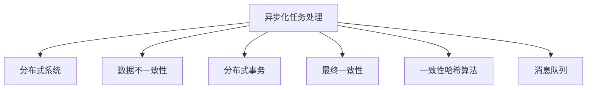

                 

# 异步化任务处理天然存在数据不一致

> 关键词：异步化任务处理、数据不一致性、分布式系统、一致性模型、CAP理论、消息队列

> 摘要：本文将深入探讨异步化任务处理过程中数据不一致性问题的根源、表现形式、解决方案以及实际应用中的挑战。通过对分布式系统一致性理论、消息队列技术的详细分析，本文旨在为解决异步化任务处理中的数据不一致性问题提供有价值的参考和实践指南。

## 目录大纲

### 第一部分：异步化任务处理概述

#### 第1章：异步化任务处理的概念与背景

- **1.1 异步化任务处理的定义**
- **1.2 异步化任务处理的背景**
- **1.3 异步化任务处理的现状与发展趋势**

#### 第2章：异步化任务处理的核心挑战

- **2.1 数据不一致性问题**
- **2.2 数据一致性的解决方案**
- **2.3 数据一致性的挑战**

### 第二部分：异步化任务处理的数据一致性策略

#### 第3章：分布式数据一致性理论

- **3.1 分布式系统的一致性模型**
- **3.2 CAP理论**
- **3.3 BASE理论**

#### 第4章：异步化任务处理中的分布式事务管理

- **4.1 分布式事务的定义与特点**
- **4.2 分布式事务的解决方案**
- **4.3 分布式事务的挑战与优化**

#### 第5章：异步化任务处理中的数据复制与分片

- **5.1 数据复制的基本概念**
- **5.2 数据分片的基本概念**
- **5.3 数据复制与分片的协同工作**

#### 第6章：异步化任务处理中的消息队列技术

- **6.1 消息队列的基本概念**
- **6.2 消息队列的实现技术**
- **6.3 消息队列在异步化任务处理中的应用**

#### 第7章：异步化任务处理中的实践案例分析

- **7.1 案例一：电商平台订单处理**
- **7.2 案例二：金融行业交易处理**
- **7.3 案例三：社交媒体消息推送**

### 第三部分：异步化任务处理的最佳实践与未来展望

#### 第8章：异步化任务处理的最佳实践

- **8.1 异步化任务处理的设计原则**
- **8.2 异步化任务处理的技术选型**

#### 第9章：异步化任务处理的未来展望

- **9.1 异步化任务处理技术的发展趋势**
- **9.2 异步化任务处理在新兴领域中的应用**

#### 第10章：总结与展望

- **10.1 异步化任务处理中的数据不一致性问题**

## 1. 异步化任务处理的概念与背景

### 1.1 异步化任务处理的定义

异步化任务处理（Asynchronous Task Processing）是指在分布式系统中，任务之间的执行不是按顺序进行的，而是通过消息传递机制实现任务的独立执行和异步通信。这种处理模式使得系统可以在不同节点上并发执行多个任务，从而提高系统的响应速度和吞吐量。

异步化任务处理的核心思想是将任务的执行从传统的顺序执行模式转变为并行执行模式。具体来说，任务发送者无需等待任务的执行结果，而是立即发送任务并继续执行后续操作。任务接收者在处理任务时，也不需要立即返回结果，而是将结果暂存下来，等待后续处理。

### 1.2 异步化任务处理的背景

异步化任务处理在分布式计算领域得到广泛应用，其背景主要有以下几点：

1. **分布式计算的需求**：随着互联网和云计算的快速发展，分布式系统已经成为许多企业应用的基础架构。在分布式系统中，任务通常分布在不同的节点上执行，因此异步化任务处理能够充分利用分布式计算的优势，提高系统性能。

2. **实时处理的高并发需求**：许多应用场景要求系统具备高并发处理能力，例如电商平台、社交媒体、金融交易等。异步化任务处理能够有效缓解高并发带来的性能压力，确保系统稳定运行。

3. **微服务架构的兴起**：微服务架构是一种分布式架构风格，将应用程序划分为多个独立的微服务，每个微服务负责特定的业务功能。异步化任务处理能够实现微服务之间的解耦，提高系统的可扩展性和可维护性。

### 1.3 异步化任务处理的现状与发展趋势

异步化任务处理已经成为现代分布式系统的重要组成部分。目前，许多编程语言和框架已经提供了异步化任务处理的支持，如Java的CompletableFuture、Python的async/await等。

未来，异步化任务处理的发展趋势主要包括：

1. **边缘计算**：随着5G、物联网等技术的普及，边缘计算逐渐成为热点。异步化任务处理在边缘计算场景中具有广泛的应用前景，能够提高边缘节点的处理能力和响应速度。

2. **区块链**：区块链技术具有去中心化、不可篡改等特性，异步化任务处理能够充分发挥区块链的优势，实现更安全、更高效的分布式数据处理。

3. **AI与异步化任务的融合**：人工智能技术在异步化任务处理中的应用越来越广泛，例如利用机器学习算法对任务进行动态调度，提高系统的自适应能力和智能化水平。

## 2. 异步化任务处理的核心挑战

### 2.1 数据不一致性问题

在异步化任务处理过程中，数据不一致性问题是一个重要的挑战。数据不一致性指的是多个任务处理同一个数据时，由于异步执行的特性，可能导致数据在不同节点上的状态不一致。

数据不一致性问题的表现形式主要包括：

1. **脏数据**：一个任务读取了旧数据，而另一个任务已经更新了数据，导致两个任务处理的数据不一致。

2. **未提交的数据**：一个任务提交了部分数据，而另一个任务还没有提交数据，导致部分数据丢失。

3. **悬挂事务**：一个任务在执行过程中失败，导致其他依赖该任务的后续操作无法执行，形成悬挂事务。

### 2.2 数据一致性的解决方案

为了解决异步化任务处理中的数据不一致性问题，可以采取以下解决方案：

1. **分布式事务的一致性保证**：通过分布式事务机制，确保多个任务在处理同一数据时的一致性。常见的分布式事务解决方案包括两阶段提交（2PC）和三阶段提交（3PC）。

2. **最终一致性模型**：最终一致性模型允许任务在处理数据时存在一定程度的延迟，最终达到一致性状态。常见的最终一致性解决方案包括最终一致性队列和最终一致性缓存。

3. **一致性哈希算法**：一致性哈希算法用于数据复制和分片，确保数据在不同节点上的状态一致性。一致性哈希算法能够动态调整数据分布，提高系统的容错性和可扩展性。

### 2.3 数据一致性的挑战

在异步化任务处理中，实现数据一致性面临着以下挑战：

1. **延迟容忍性**：异步化任务处理允许任务在处理数据时存在延迟，因此需要平衡延迟和数据一致性的关系。

2. **吞吐量优化**：异步化任务处理需要处理大量的并发任务，因此需要优化系统的吞吐量，提高处理效率。

3. **容错性与可用性**：在分布式系统中，节点可能发生故障，因此需要实现数据一致性的同时，保证系统的容错性和可用性。

## 3. 分布式数据一致性理论

### 3.1 分布式系统的一致性模型

分布式系统的一致性模型主要分为强一致性模型和最终一致性模型。

1. **强一致性模型**：强一致性模型保证在分布式系统中，所有节点在任何时间都能访问到最新的数据。强一致性模型通常采用分布式事务机制，如两阶段提交（2PC）和三阶段提交（3PC），确保多个任务在处理同一数据时的一致性。

2. **最终一致性模型**：最终一致性模型允许任务在处理数据时存在延迟，最终达到一致性状态。最终一致性模型通过一致性哈希算法和数据复制机制，确保数据在不同节点上的状态一致性。

### 3.2 CAP理论

CAP理论是分布式系统设计的重要理论之一，由Eric Brewer提出。CAP理论指出，在分布式系统中，一致性（Consistency）、可用性（Availability）和分区容错性（Partition tolerance）这三个特性中，最多只能同时保证两个。

1. **一致性（Consistency）**：一致性指的是在分布式系统中，所有节点在任何时间都能访问到最新的数据。

2. **可用性（Availability）**：可用性指的是在分布式系统中，所有节点在任何时间都能正常响应请求。

3. **分区容错性（Partition tolerance）**：分区容错性指的是在分布式系统中，当节点发生网络分区时，系统能够继续运行。

### 3.3 BASE理论

BASE理论是针对CAP理论的补充，由G Google的工程师提出。BASE理论认为，在分布式系统中，可以同时保证基本可用性（Basic Availability）、软状态（Soft State）和最终一致性（Eventually Consistency）。

1. **基本可用性（Basic Availability）**：基本可用性指的是在分布式系统中，即使发生故障，系统仍然能够继续运行，提供基本的响应。

2. **软状态（Soft State）**：软状态指的是在分布式系统中，节点之间的状态可以通过消息传递来恢复，而不是强制保持一致性。

3. **最终一致性（Eventually Consistency）**：最终一致性指的是在分布式系统中，节点之间的状态最终会达到一致，但允许在短时间内存在不一致的情况。

### 3.4 分布式一致性模型的应用

在实际应用中，分布式一致性模型的选择取决于具体的需求和场景。以下是一些常见的一致性模型：

1. **强一致性模型**：适用于对数据一致性要求较高的场景，如金融交易、库存管理等。强一致性模型能够确保在分布式系统中，所有节点访问到的数据都是最新的。

2. **最终一致性模型**：适用于对数据一致性要求不高，但对延迟和可用性要求较高的场景，如社交媒体、电子商务等。最终一致性模型能够提高系统的可用性和延迟容忍性。

3. **CAP理论的折中方案**：在某些场景中，可以采用CAP理论的折中方案，如弱一致性模型（CA）和可用性模型（CP）。弱一致性模型适用于对数据一致性要求不高，但对可用性要求较高的场景，如搜索引擎、分布式缓存等。可用性模型适用于对数据可用性要求较高的场景，如分布式存储、分布式数据库等。

## 4. 异步化任务处理中的分布式事务管理

### 4.1 分布式事务的定义与特点

分布式事务是指在分布式系统中，多个任务需要协同处理同一数据，并确保所有任务要么全部成功执行，要么全部失败回滚。分布式事务的特点包括：

1. **全局一致性**：分布式事务要求所有参与任务的数据在执行完成后达到全局一致性状态。

2. **原子性**：分布式事务中的所有任务要么全部成功执行，要么全部失败回滚，确保事务的原子性。

3. **隔离性**：分布式事务要求不同任务之间的执行相互独立，互不影响。

4. **持久性**：分布式事务要求在事务成功执行后，所有任务的结果都能够持久化保存。

### 4.2 分布式事务的解决方案

为了实现分布式事务，可以采用以下解决方案：

1. **两阶段提交协议（2PC）**：

   两阶段提交协议是一种常见的分布式事务解决方案，分为准备阶段和提交阶段。

   - 准备阶段：协调者向所有参与者发送prepare请求，参与者根据本地日志判断是否可以提交事务。如果所有参与者都回复可以提交，则进入提交阶段。
   - 提交阶段：协调者向所有参与者发送commit请求，参与者根据本地日志执行提交操作。如果所有参与者都成功提交，则事务成功；否则，事务失败。

2. **三阶段提交协议（3PC）**：

   三阶段提交协议是对两阶段提交协议的改进，增加了超时机制，提高分布式事务的可靠性。

   -阶段1：参与者发送ready请求给协调者，协调者根据参与者回复的情况决定是否进入阶段2。
   -阶段2：协调者发送prepare请求给参与者，参与者根据本地日志决定是否提交事务。
   -阶段3：协调者发送commit请求给参与者，参与者根据本地日志执行提交操作。

3. **乐观锁与悲观锁**：

   乐观锁和悲观锁是用于解决分布式事务并发控制的方法。

   - 乐观锁：乐观锁假设在事务执行过程中不会发生冲突，只在提交时判断是否与其他事务冲突。如果冲突，则回滚事务。
   - 悲观锁：悲观锁假设在事务执行过程中一定会发生冲突，因此在整个事务执行过程中都持有锁，确保事务的隔离性。

### 4.3 分布式事务的挑战与优化

分布式事务在实现过程中面临着以下挑战：

1. **延迟容忍性**：分布式事务需要考虑网络延迟、数据同步延迟等因素，可能导致事务执行时间过长。

2. **吞吐量优化**：分布式事务可能降低系统的吞吐量，需要优化事务执行效率。

3. **容错性与可用性**：分布式事务在执行过程中可能发生节点故障，需要确保系统的容错性和可用性。

为了解决上述挑战，可以采用以下优化策略：

1. **分库分表**：将数据表水平拆分到多个数据库或表中，降低单表的数据量，提高事务执行的效率。

2. **读写分离**：将读操作和写操作分离到不同的数据库或节点上，提高系统的吞吐量和可用性。

3. **异步化事务**：将事务中的写操作异步化，减少事务的执行时间，提高系统的响应速度。

4. **本地事务**：在分布式系统中，将部分事务实现为本地事务，提高事务的执行效率。

## 5. 异步化任务处理中的数据复制与分片

### 5.1 数据复制的基本概念

数据复制是指在分布式系统中，将数据从源节点复制到多个目标节点，以提高数据的可用性和可靠性。数据复制的基本概念包括：

1. **数据一致性**：数据复制要求数据在不同节点之间保持一致性，确保所有节点访问到的数据都是相同的。

2. **数据同步**：数据同步是指将数据从源节点复制到目标节点的过程，通常包括数据同步算法和数据同步策略。

3. **数据分区**：数据分区是指将大量数据划分到多个分区中，以提高系统的性能和可扩展性。

### 5.2 数据分片的基本概念

数据分片是指在分布式系统中，将数据按照一定的策略划分到多个节点上，以提高系统的性能和可扩展性。数据分片的基本概念包括：

1. **分片键**：分片键是指用于划分数据分区的关键字，通常是根据数据的特点和访问模式选择的。

2. **分片策略**：分片策略是指将数据分配到不同节点的规则，常见的分片策略包括基于哈希的分片、基于范围的分片等。

3. **分片索引**：分片索引是指用于快速查找数据分区的索引，以提高数据查询的效率。

### 5.3 数据复制与分片的协同工作

数据复制与分片在分布式系统中协同工作，以提高数据的可用性和性能。以下是一些关键点：

1. **数据一致性保障**：数据复制要求数据在不同节点之间保持一致性，分片策略要求数据在不同分区之间保持一致性。分布式系统需要实现数据一致性的保障机制，如最终一致性模型、一致性哈希算法等。

2. **数据分区与复制策略**：数据分区与复制策略的协同工作至关重要。根据分片键和复制策略，系统可以确定数据在不同节点和分区之间的复制关系，确保数据在不同节点和分区之间的一致性。

3. **数据查询优化**：在数据复制与分片的基础上，系统可以采用优化策略提高数据查询的效率，如分片索引、缓存策略等。

4. **数据同步与容错**：数据复制与分片需要实现数据同步和容错机制，确保数据在不同节点和分区之间的同步和故障恢复。

### 5.4 数据复制与分片的应用场景

数据复制与分片在分布式系统中具有广泛的应用场景，以下是一些典型的应用场景：

1. **大数据处理**：在大数据处理领域，数据复制与分片可以提高数据处理速度和性能，如Apache Hadoop和Apache Spark等大数据处理框架。

2. **分布式数据库**：分布式数据库采用数据复制与分片技术，实现数据的分布式存储和查询，如Google Spanner、Amazon DynamoDB等。

3. **分布式缓存**：分布式缓存采用数据复制与分片技术，提高缓存系统的性能和可用性，如Redis Cluster、Memcached等。

4. **分布式消息队列**：分布式消息队列采用数据复制与分片技术，实现消息的分布式传输和存储，如RabbitMQ、Kafka等。

### 5.5 数据复制与分片的挑战

在数据复制与分片的应用过程中，系统面临着以下挑战：

1. **数据一致性问题**：数据复制与分片可能导致数据一致性问题，需要采用一致性模型和一致性保障机制解决。

2. **性能优化**：数据复制与分片会增加系统的复杂度，需要优化数据同步、查询和故障恢复等性能。

3. **容错性与可用性**：数据复制与分片要求数据在不同节点和分区之间保持一致性，需要实现容错和可用性保障机制。

4. **运维与管理**：数据复制与分片会增加系统的运维和管理复杂度，需要完善的监控、日志和运维工具。

### 5.6 数据复制与分片的优化策略

为了提高数据复制与分片的性能和可用性，可以采用以下优化策略：

1. **一致性模型选择**：根据应用场景和需求，选择合适的一致性模型，如最终一致性模型、强一致性模型等。

2. **分片策略优化**：优化分片策略，根据数据特点和访问模式选择合适的分片键和分片策略。

3. **数据同步优化**：优化数据同步算法和策略，提高数据同步速度和效率。

4. **缓存与索引优化**：采用缓存和索引技术，提高数据查询和访问效率。

5. **故障恢复优化**：优化故障恢复机制，提高系统的容错性和可用性。

## 6. 异步化任务处理中的消息队列技术

### 6.1 消息队列的基本概念

消息队列（Message Queue）是一种用于异步通信的中间件技术，它允许不同节点之间的任务通过消息进行通信。消息队列的基本概念包括：

1. **消息**：消息是消息队列的基本单位，包含数据内容和相关的元数据，如消息ID、发送时间、接收者等。

2. **队列**：队列是消息的存储空间，按照一定的顺序（通常是先进先出FIFO或后进先出LIFO）存储消息。

3. **生产者**：生产者是发送消息的节点，将消息写入消息队列。

4. **消费者**：消费者是接收消息的节点，从消息队列中读取消息并处理。

5. **消息传递**：消息队列通过消息传递机制实现节点之间的异步通信，生产者和消费者不需要直接交互，降低了系统复杂性。

### 6.2 消息队列的实现技术

消息队列技术有多种实现，以下是一些常用的消息队列实现：

1. **RabbitMQ**：RabbitMQ是一个开源的消息队列中间件，支持多种消息协议，如AMQP、MQTT、STOMP等。RabbitMQ具有高可靠性、可扩展性和易用性，适用于企业级应用。

2. **Kafka**：Kafka是由LinkedIn开发的开源消息队列系统，主要用于大数据场景。Kafka具有高吞吐量、高可用性和可扩展性，适用于大规模数据流处理和实时分析。

3. **Pulsar**：Pulsar是由Apache软件基金会开发的分布式消息队列系统，具有高吞吐量、低延迟和可扩展性。Pulsar支持多种消息传递模式，如发布-订阅、请求-响应等，适用于多种应用场景。

### 6.3 消息队列在异步化任务处理中的应用

消息队列在异步化任务处理中扮演着重要角色，以下是一些应用场景：

1. **任务调度**：消息队列可以用于任务调度，将异步任务发送到消息队列，消费者节点从队列中读取任务并执行。

2. **分布式系统解耦**：消息队列可以实现分布式系统之间的解耦，降低系统间的依赖关系，提高系统的灵活性和可维护性。

3. **流量控制**：消息队列可以用于流量控制，根据系统负载情况动态调整任务的执行速率，确保系统稳定运行。

4. **消息传递与路由**：消息队列可以用于消息传递和路由，根据消息的属性和目标，将消息路由到相应的消费者节点。

5. **日志记录与监控**：消息队列可以用于日志记录和监控，将系统日志发送到消息队列，消费者节点从队列中读取日志并处理。

## 7. 异步化任务处理中的实践案例分析

### 7.1 案例一：电商平台订单处理

电商平台订单处理是一个典型的异步化任务处理场景，以下是其主要流程：

1. **订单创建**：用户在电商平台提交订单，订单信息被发送到消息队列。

2. **订单验证**：订单创建后，系统会从消息队列中读取订单信息，进行订单验证，包括商品库存检查、支付状态验证等。

3. **库存扣减**：订单验证通过后，系统会从消息队列中读取订单信息，进行库存扣减操作，确保商品库存充足。

4. **订单入库**：库存扣减成功后，系统会将订单信息存储到订单数据库中，以便后续处理。

5. **订单通知**：订单创建成功后，系统会发送通知消息到消息队列，消费者节点从队列中读取通知消息，发送给用户。

在订单处理过程中，数据不一致性是一个主要挑战。例如，在订单验证和库存扣减之间，如果出现网络延迟或系统故障，可能导致订单验证成功但库存扣减失败。为了解决数据不一致性问题，系统可以采用以下措施：

1. **分布式事务**：采用分布式事务机制，确保订单验证和库存扣减操作要么全部成功，要么全部失败。

2. **最终一致性模型**：采用最终一致性模型，允许订单验证和库存扣减之间存在一定程度的延迟，最终达到一致性状态。

3. **消息队列重试机制**：在消息队列中设置重试机制，如果订单处理失败，系统会重新发送订单信息到消息队列，确保订单最终得到处理。

### 7.2 案例二：金融行业交易处理

金融行业交易处理是一个对数据一致性要求极高的场景，以下是其主要流程：

1. **交易发起**：用户在金融平台上发起交易，交易信息被发送到消息队列。

2. **交易验证**：系统从消息队列中读取交易信息，进行交易验证，包括账户余额检查、权限验证等。

3. **交易执行**：交易验证通过后，系统会从消息队列中读取交易信息，执行交易操作，如扣减账户余额、更新交易记录等。

4. **交易确认**：交易执行完成后，系统会发送确认消息到消息队列，消费者节点从队列中读取确认消息，通知用户交易成功。

在交易处理过程中，数据不一致性是一个主要挑战。例如，在交易验证和交易执行之间，如果出现网络延迟或系统故障，可能导致交易验证成功但交易执行失败。为了解决数据不一致性问题，系统可以采用以下措施：

1. **强一致性模型**：采用强一致性模型，确保交易验证和交易执行操作在同一时刻进行，确保数据一致性。

2. **分布式事务**：采用分布式事务机制，确保交易验证和交易执行操作要么全部成功，要么全部失败。

3. **数据备份与容错**：在分布式系统中，采用数据备份和容错机制，确保在节点故障时能够快速恢复，保持数据一致性。

### 7.3 案例三：社交媒体消息推送

社交媒体消息推送是一个对实时性要求较高的场景，以下是其主要流程：

1. **消息创建**：用户在社交媒体平台创建消息，消息信息被发送到消息队列。

2. **消息验证**：系统从消息队列中读取消息信息，进行消息验证，包括内容审核、权限验证等。

3. **消息推送**：消息验证通过后，系统会从消息队列中读取消息信息，发送到目标用户的设备或客户端。

4. **消息确认**：消息发送成功后，系统会发送确认消息到消息队列，消费者节点从队列中读取确认消息，通知用户消息已发送。

在消息推送过程中，数据不一致性是一个主要挑战。例如，在消息验证和消息推送之间，如果出现网络延迟或系统故障，可能导致消息验证成功但消息推送失败。为了解决数据不一致性问题，系统可以采用以下措施：

1. **最终一致性模型**：采用最终一致性模型，允许消息验证和消息推送之间存在一定程度的延迟，最终达到一致性状态。

2. **消息队列重试机制**：在消息队列中设置重试机制，如果消息推送失败，系统会重新发送消息到消息队列，确保消息最终得到推送。

3. **消息缓存与延迟推送**：在消息验证通过后，可以将消息缓存一段时间，在确认消息发送成功后再删除缓存，降低数据不一致性的风险。

## 8. 异步化任务处理的最佳实践

### 8.1 异步化任务处理的设计原则

在设计异步化任务处理系统时，需要遵循以下设计原则：

1. **解耦**：异步化任务处理要求数据和服务之间的解耦，确保系统具有较高的灵活性和可维护性。

2. **弹性**：异步化任务处理系统需要具备良好的弹性，能够应对高并发和负载压力。

3. **可观测性**：异步化任务处理系统需要具备良好的可观测性，能够实时监控任务执行状态和性能指标。

4. **容错性**：异步化任务处理系统需要具备良好的容错性，能够应对节点故障和系统异常。

5. **可扩展性**：异步化任务处理系统需要具备良好的可扩展性，能够支持系统规模的逐步扩大。

### 8.2 异步化任务处理的技术选型

在选择异步化任务处理技术时，需要考虑以下因素：

1. **任务类型**：根据任务类型选择合适的技术，如计算密集型任务、IO密集型任务等。

2. **系统规模**：根据系统规模选择适合的分布式系统架构和消息队列技术，如Kafka、RabbitMQ等。

3. **性能要求**：根据性能要求选择适合的异步化任务处理技术，如分布式缓存、分布式数据库等。

4. **一致性需求**：根据一致性需求选择适合的一致性模型和数据一致性保障机制，如最终一致性模型、分布式事务等。

5. **开发与运维**：根据开发与运维团队的技术能力和运维需求，选择适合的异步化任务处理技术。

### 8.3 异步化任务处理系统的最佳实践

在设计和实现异步化任务处理系统时，可以遵循以下最佳实践：

1. **任务拆分与并行处理**：将大任务拆分成小任务，利用并行处理提高系统性能。

2. **消息队列优化**：优化消息队列的性能，如批量发送消息、消息压缩等。

3. **分布式事务管理**：合理使用分布式事务机制，确保任务执行的一致性。

4. **数据备份与容错**：实现数据备份和容错机制，确保系统在节点故障时能够快速恢复。

5. **监控与日志**：实现实时监控和日志记录，便于问题排查和性能优化。

## 9. 异步化任务处理的未来展望

### 9.1 异步化任务处理技术的发展趋势

异步化任务处理技术在未来的发展中将继续保持快速增长，以下是一些主要的发展趋势：

1. **边缘计算**：随着5G和物联网的普及，边缘计算将成为异步化任务处理的重要应用场景。边缘计算可以将计算任务下沉到边缘节点，提高系统的响应速度和吞吐量。

2. **区块链**：区块链技术具有去中心化、不可篡改等特性，与异步化任务处理技术的结合将有望实现更安全、更高效的分布式数据处理。

3. **人工智能**：人工智能技术在异步化任务处理中的应用越来越广泛，如利用机器学习算法优化任务调度、实现智能异常检测等。

4. **实时数据处理**：随着实时数据处理需求的增加，异步化任务处理技术将进一步提高实时性，支持低延迟、高并发的数据处理。

### 9.2 异步化任务处理在新兴领域中的应用

异步化任务处理在新兴领域中的应用前景广阔，以下是一些主要的应用场景：

1. **物联网**：物联网设备数量庞大，异步化任务处理可以提高设备的处理能力和响应速度，实现高效的设备管理和数据收集。

2. **智能城市**：智能城市需要处理大量的实时数据，如交通监控、环境监测等。异步化任务处理可以提高数据处理效率，支持智能城市的运营和管理。

3. **数字货币**：数字货币的交易和处理需要高并发和低延迟，异步化任务处理可以提高交易处理的性能和安全性。

4. **区块链**：区块链技术需要处理大量的数据写入和交易验证，异步化任务处理可以提高区块链系统的性能和可靠性。

### 9.3 异步化任务处理技术的挑战与机遇

异步化任务处理技术在未来的发展中将面临以下挑战和机遇：

1. **一致性保障**：随着系统规模的扩大和数据量的增加，如何保障数据一致性将成为重要挑战。

2. **性能优化**：如何优化异步化任务处理系统的性能，提高系统的吞吐量和延迟容忍性，是亟待解决的问题。

3. **安全性**：如何确保异步化任务处理系统的安全性，防止数据泄露和恶意攻击，是重要课题。

4. **智能化**：如何利用人工智能技术优化异步化任务处理，提高系统的智能化水平和自动化程度。

5. **边缘计算与云计算的融合**：如何实现边缘计算与云计算的无缝融合，提高系统的整体性能和可靠性。

## 10. 总结与展望

异步化任务处理作为一种高效的分布式计算模式，在分布式系统中具有广泛的应用。本文从异步化任务处理的概念、核心挑战、一致性策略、实践案例分析等多个角度，详细探讨了异步化任务处理中的数据不一致性问题及其解决方案。

随着边缘计算、区块链、人工智能等新兴技术的快速发展，异步化任务处理技术将在更多领域发挥重要作用。未来，异步化任务处理技术需要不断创新和优化，以应对更高的性能要求、更高的数据一致性和更广泛的应用场景。

最后，本文旨在为开发者提供有价值的参考和实践指南，帮助他们在实际项目中有效应对异步化任务处理中的数据不一致性问题，构建高效、可靠的分布式系统。作者：AI天才研究院/AI Genius Institute & 禅与计算机程序设计艺术 /Zen And The Art of Computer Programming## 异步化任务处理中的数据不一致性：深入分析与解决方案

### 1. 异步化任务处理的概念与背景

异步化任务处理是一种在分布式系统中实现任务并行执行的技术。在这种模式下，任务可以在不同节点上独立执行，不需要等待其他任务的完成。这种模式有助于提高系统的性能和吞吐量，特别是在需要处理大量并发请求的应用场景中。

异步化任务处理的背景主要源于现代分布式系统的需求。随着互联网和云计算的普及，系统需要处理的数据量越来越大，同时用户对响应速度的要求也越来越高。传统的同步任务处理模式由于需要等待其他任务的完成，导致系统性能瓶颈。而异步化任务处理通过独立执行任务，可以避免这种瓶颈，从而提高系统的整体性能。

### 2. 数据不一致性的表现形式

在异步化任务处理中，数据不一致性是一种常见且严重的挑战。数据不一致性表现为以下几种形式：

1. **脏数据**：在异步执行过程中，如果一个任务读取了旧的数据，而另一个任务已经更新了该数据，那么读取任务可能会获取到过时的、不准确的数据。

2. **未提交的数据**：如果一个任务完成了对数据的修改，但在提交之前系统发生故障，那么这些修改可能会丢失，导致数据不一致。

3. **悬挂事务**：在分布式系统中，如果一个事务的一部分在节点A上成功执行，而另一部分在节点B上失败，那么这两个节点上的数据状态将会不一致，形成悬挂事务。

4. **延迟数据同步**：在异步处理中，数据可能在不同的节点上存在不同的同步状态，导致数据更新存在延迟，从而产生不一致性。

### 3. 数据一致性的解决方案

为了解决异步化任务处理中的数据不一致性问题，可以采用以下几种解决方案：

1. **分布式事务管理**：分布式事务管理可以通过两阶段提交（2PC）或三阶段提交（3PC）协议确保多个任务在处理同一数据时的一致性。这些协议通过协调者节点来控制事务的提交过程，从而确保所有参与节点在事务提交前后保持数据一致性。

2. **最终一致性模型**：最终一致性模型允许系统在短时间内存在数据不一致的情况，但最终会达到一致状态。这种模型适用于对实时性要求不高但需要高扩展性的系统，如社交媒体和电商平台。

3. **一致性哈希算法**：一致性哈希算法用于数据复制和分片，通过在分布式系统中动态调整数据的分布，确保数据在不同节点上的状态一致性。这种算法具有较好的容错性和可扩展性。

4. **消息队列技术**：消息队列可以作为一种异步通信机制，确保任务执行过程中的数据一致性。通过消息队列，任务可以在不同的节点上独立执行，并在必要时进行重试，从而确保数据的一致性。

### 4. 数据一致性的挑战

尽管有多种解决方案可以解决异步化任务处理中的数据不一致性问题，但实际应用中仍面临许多挑战：

1. **延迟容忍性**：在最终一致性模型中，数据一致性的达成可能需要一定的时间延迟。如何在保证数据一致性的同时，容忍合理的延迟，是一个重要的挑战。

2. **吞吐量优化**：在高并发场景下，系统需要处理大量的异步任务。如何优化系统的吞吐量，同时保持数据一致性，是系统设计的关键问题。

3. **容错性与可用性**：在分布式系统中，节点可能会发生故障。如何确保系统在节点故障时仍能保持数据一致性，同时保持系统的可用性，是一个关键挑战。

### 5. 实际案例与最佳实践

在实际应用中，解决数据不一致性问题需要综合考虑多种因素。以下是一些实际案例和最佳实践：

1. **电商平台**：电商平台在处理订单时，常常使用分布式事务管理来确保订单创建、库存扣减和支付确认的一致性。例如，使用两阶段提交协议来管理订单事务，确保所有操作要么全部成功，要么全部回滚。

2. **社交媒体**：社交媒体平台通常采用最终一致性模型来处理用户状态更新和消息推送。例如，通过消息队列将用户状态更新发送到分布式系统，系统在最终一致性模型下处理更新，从而提高系统的扩展性和响应速度。

3. **金融交易**：金融交易系统对数据一致性要求极高，常常采用强一致性模型和分布式事务管理来确保交易的一致性。例如，使用两阶段提交协议来确保交易从创建到执行的全过程保持数据一致性。

### 6. 总结与未来展望

异步化任务处理中的数据不一致性问题是一个复杂的挑战，但通过合理的设计和实施，可以有效地解决。分布式事务管理、最终一致性模型、一致性哈希算法和消息队列技术是解决数据不一致性的常用方法。在实际应用中，需要根据具体场景和需求选择合适的方法，并不断优化系统性能和可靠性。

未来，随着边缘计算、区块链和人工智能等技术的发展，异步化任务处理技术将面临更多的机遇和挑战。通过不断创新和优化，异步化任务处理技术将在更多领域发挥重要作用，推动分布式系统的持续发展和进步。

作者：AI天才研究院/AI Genius Institute & 禅与计算机程序设计艺术 /Zen And The Art of Computer Programming

---

**附录：核心概念与联系**

### 核心概念表格

| 概念         | 定义                                                         |  
| ------------ | ------------------------------------------------------------ |  
| 异步化任务处理 | 在分布式系统中，任务独立执行和异步通信，提高系统性能和吞吐量。 |  
| 数据不一致性 | 多个任务处理同一数据时，数据在不同节点上的状态不一致。        |  
| 分布式事务   | 在分布式系统中，多个任务协同处理同一数据，确保一致性。        |  
| 最终一致性   | 允许系统在短时间内存在数据不一致，但最终会达到一致状态。      |  
| 一致性哈希   | 在分布式系统中，动态调整数据分布，确保数据状态一致性。        |  
| 消息队列     | 用于异步通信和任务调度，确保任务执行过程中的数据一致性。      |

### ER实体关系图

---

通过上述表格和ER实体关系图，我们可以清晰地看到异步化任务处理及其相关的核心概念和联系。这些概念和联系是理解异步化任务处理数据不一致性问题的基础，也为后续的算法原理讲解和系统架构设计提供了重要的参考。在接下来的章节中，我们将深入探讨这些概念和联系的具体实现和优化策略。

