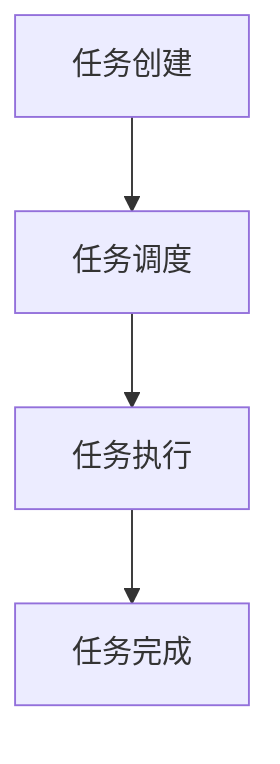

                 


# 异步化任务处理的本质与风险

## 关键词

- 异步化任务处理
- 数据一致性
- 系统稳定性
- 系统性能
- 安全性
- 算法实现
- 架构设计
- 最佳实践

## 摘要

异步化任务处理是现代计算机系统中的一个关键概念，它通过允许任务在非同步环境中执行，提高了系统的并发性和响应能力。然而，这种处理方式也带来了一系列挑战，包括数据一致性、系统稳定性和安全性等方面。本文将深入探讨异步化任务处理的本质，分析其潜在的风险，并介绍相关的技术实现方法和架构设计策略。通过本文的阅读，读者将获得对异步化任务处理有一个全面而深刻的理解，并学会如何在实际项目中应用和优化这一技术。

## 1. 异步化任务处理概述

### 1.1 问题背景

在现代计算环境中，随着数据量和处理需求的不断增长，传统的同步任务处理方式逐渐暴露出其局限性。同步处理模型要求任务按照固定顺序执行，这往往导致了系统资源的浪费和响应时间的增加。为了应对这种挑战，异步化任务处理应运而生。异步化任务处理允许任务在非同步环境中执行，从而提高了系统的并发性和响应能力。

### 1.2 问题描述

异步化任务处理的核心问题是如何在非同步环境中确保任务的高效执行和数据一致性。具体来说，异步化任务处理需要解决以下几个关键问题：

- 如何确保任务的执行顺序正确？
- 如何处理任务之间的依赖关系？
- 如何保证数据的一致性？
- 如何提高系统的稳定性和性能？

### 1.3 异步化任务处理的概念

异步化任务处理是指允许任务在非同步环境中执行的一种处理方式。在这种方式下，任务不必等待其他任务的完成即可开始执行，从而提高了系统的并发性和响应能力。

### 1.4 异步化任务处理的重要性

异步化任务处理在现代计算环境中具有重要意义：

- 提高系统的并发性，允许多个任务同时执行，从而提高了系统的吞吐量。
- 提高系统的响应能力，减少任务的等待时间，提高用户的体验。
- 支持大规模分布式系统的构建，使得系统能够更好地应对高并发和大数据量场景。

### 1.5 本章小结

本章对异步化任务处理进行了概述，介绍了其背景、问题和重要性。在接下来的章节中，我们将深入探讨异步化任务处理的本质、潜在风险和技术实现方法。

## 2. 异步化任务处理的本质

### 2.1 异步化任务处理的原理

异步化任务处理的原理主要基于事件驱动和消息传递机制。在这种机制下，任务以事件的形式产生，并被消息队列（Message Queue）接收和管理。任务执行者（Worker）从消息队列中获取任务并执行，任务执行完成后，将结果发送回消息队列或其他相关组件。

### 2.2 异步化任务处理的机制

异步化任务处理通常涉及以下几个关键机制：

- **事件驱动**：任务以事件的形式产生，并触发相应的处理流程。
- **消息传递**：任务通过消息队列进行传递，任务执行者从消息队列中获取任务并执行。
- **任务调度**：系统根据任务的优先级和依赖关系进行调度，确保任务按正确顺序执行。
- **任务取消与重试**：在任务执行过程中，系统可以取消任务或重试失败的任务。

### 2.3 异步化任务处理的优势

异步化任务处理具有以下几个显著优势：

- **提高并发性**：异步化任务处理允许多个任务同时执行，从而提高了系统的吞吐量。
- **减少等待时间**：任务不必等待其他任务的完成即可开始执行，从而减少了等待时间，提高了响应能力。
- **支持分布式系统**：异步化任务处理支持大规模分布式系统的构建，使得系统能够更好地应对高并发和大数据量场景。

### 2.4 本章小结

本章详细介绍了异步化任务处理的原理和机制，并阐述了其优势。在接下来的章节中，我们将分析异步化任务处理可能带来的风险和挑战。

## 3. 异步化任务处理的潜在风险

### 3.1 数据一致性问题

异步化任务处理的一个主要挑战是确保数据的一致性。由于任务在非同步环境中执行，可能导致以下问题：

- **数据冲突**：多个任务同时修改同一份数据，可能导致数据不一致。
- **数据延迟**：任务的执行和结果返回可能存在延迟，导致数据更新不及时。
- **数据丢失**：任务的执行失败可能导致数据丢失。

### 3.2 系统稳定性问题

异步化任务处理可能会对系统的稳定性带来挑战：

- **任务超时**：任务执行时间过长可能导致系统资源耗尽。
- **任务失败**：任务执行失败可能导致系统无法完成预期的功能。
- **消息队列阻塞**：大量任务积压在消息队列中可能导致系统性能下降。

### 3.3 系统性能问题

异步化任务处理可能会对系统性能产生负面影响：

- **网络延迟**：任务之间的消息传递可能存在网络延迟，影响系统的响应能力。
- **资源争用**：任务执行过程中可能存在资源争用，导致系统性能下降。
- **并发冲突**：大量任务同时执行可能导致系统负载过高，影响性能。

### 3.4 安全性问题

异步化任务处理可能面临以下安全性问题：

- **未授权访问**：未经过授权的实体可能访问敏感数据。
- **数据泄露**：任务执行过程中可能导致敏感数据泄露。
- **恶意攻击**：恶意攻击者可能通过异步化任务处理机制进行攻击。

### 3.5 本章小结

本章分析了异步化任务处理可能带来的风险和挑战，包括数据一致性、系统稳定性、系统性能和安全性等方面。在接下来的章节中，我们将介绍异步化任务处理的技术实现方法和架构设计策略。

## 4. 异步化任务处理的技术实现

### 4.1 算法原理介绍

异步化任务处理的技术实现通常基于事件驱动和消息传递机制。以下是一个简单的异步化任务处理算法原理：

1. **任务创建**：任务以事件的形式产生，并被添加到消息队列中。
2. **任务调度**：系统根据任务的优先级和依赖关系进行调度，将任务分发给任务执行者。
3. **任务执行**：任务执行者从消息队列中获取任务并执行，将结果返回给消息队列。
4. **任务完成**：任务执行完成后，系统将结果通知给相关组件。

### 4.2 算法流程图



### 4.3 Python代码实现

以下是一个简单的异步化任务处理Python代码实现：

```python
import asyncio

async def task_executor(task):
    # 执行任务
    await asyncio.sleep(1)
    print(f"Task {task} completed.")

async def main():
    # 创建任务列表
    tasks = [1, 2, 3]

    # 发送任务到消息队列
    for task in tasks:
        asyncio.create_task(task_executor(task))

    # 等待所有任务完成
    await asyncio.gather(*tasks)

asyncio.run(main())
```

### 4.4 数学模型和公式解释

异步化任务处理可以使用以下数学模型和公式进行描述：

- **平均响应时间**：平均响应时间表示任务从创建到完成的平均时间。
  $$ \text{平均响应时间} = \frac{\sum_{i=1}^{n} (\text{任务} i \text{的响应时间})}{n} $$
- **平均执行时间**：平均执行时间表示任务的平均执行时间。
  $$ \text{平均执行时间} = \frac{\sum_{i=1}^{n} (\text{任务} i \text{的执行时间})}{n} $$
- **任务完成率**：任务完成率表示任务完成的百分比。
  $$ \text{任务完成率} = \frac{\text{完成的任务数}}{\text{总任务数}} $$

### 4.5 实例说明

假设有三个任务，其响应时间、执行时间和完成率如下表所示：

| 任务ID | 响应时间(s) | 执行时间(s) | 完成率(%) |
|--------|-------------|-------------|-----------|
| 1      | 2           | 1           | 100       |
| 2      | 3           | 2           | 100       |
| 3      | 4           | 3           | 100       |

根据上述数据，我们可以计算平均响应时间、平均执行时间和任务完成率：

- **平均响应时间**：
  $$ \text{平均响应时间} = \frac{(2 + 3 + 4)}{3} = 3 \text{秒} $$
- **平均执行时间**：
  $$ \text{平均执行时间} = \frac{(1 + 2 + 3)}{3} = 2 \text{秒} $$
- **任务完成率**：
  $$ \text{任务完成率} = \frac{3}{3} = 100\% $$

### 4.6 本章小结

本章介绍了异步化任务处理的技术实现方法，包括算法原理、流程图、Python代码实现和数学模型。通过本章的学习，读者可以了解到异步化任务处理的基本实现方式，为后续的架构设计和最佳实践提供基础。

## 5. 异步化任务处理的架构设计

### 5.1 系统功能设计

异步化任务处理系统的主要功能包括：

- **任务创建与调度**：允许用户创建任务并将其调度到消息队列中。
- **任务执行与监控**：任务执行者从消息队列中获取任务并执行，系统对任务执行过程进行监控。
- **结果处理与反馈**：任务执行完成后，系统将结果处理并返回给用户。
- **异常处理与重试**：系统对任务执行过程中的异常进行捕捉和处理，并提供任务重试机制。

### 5.2 系统架构设计

异步化任务处理系统的架构设计通常包括以下几个关键组件：

- **任务队列**：用于存储和管理任务的组件，如RabbitMQ、Kafka等。
- **任务执行者**：从任务队列中获取任务并执行的任务执行组件，如Worker进程。
- **监控系统**：用于监控任务执行状态和性能的组件，如Prometheus、Grafana等。
- **结果处理模块**：用于处理任务执行结果的组件，如日志记录、数据存储等。

### 5.3 系统接口设计

异步化任务处理系统的接口设计应考虑以下几个方面：

- **任务创建接口**：允许用户通过接口创建任务，并指定任务的参数和依赖关系。
- **任务查询接口**：允许用户查询任务的执行状态和结果。
- **任务取消接口**：允许用户取消正在执行的任务。
- **结果反馈接口**：用于任务执行完成后向用户返回结果。

### 5.4 系统交互设计

异步化任务处理系统的交互设计应考虑以下几个方面：

- **任务创建**：用户通过任务创建接口提交任务，任务队列接收任务并分配给任务执行者。
- **任务执行**：任务执行者从任务队列中获取任务并执行，将结果返回给任务队列。
- **结果处理**：任务队列将结果处理并返回给用户，监控系统对任务执行过程进行监控和反馈。

### 5.5 本章小结

本章介绍了异步化任务处理的架构设计，包括系统功能设计、架构设计、接口设计和交互设计。通过本章的学习，读者可以了解到异步化任务处理系统的整体架构和关键组件，为实际项目的实施提供参考。

## 6. 异步化任务处理的最佳实践

### 6.1 实际应用案例分析

在实际应用中，异步化任务处理已被广泛应用于多个领域，如Web应用、大数据处理、实时消息系统等。以下是一个实际应用案例：

**案例**：某电子商务平台使用异步化任务处理来处理订单处理流程。订单创建后，系统将订单信息存储到数据库，并将订单处理任务发送到消息队列。订单处理任务包括订单验证、库存检查、价格计算等。任务执行者从消息队列中获取任务并执行，任务完成后，系统将结果返回给用户。

### 6.2 避免风险的方法

为了避免异步化任务处理中的风险，可以采取以下措施：

- **数据一致性保障**：使用分布式事务或最终一致性模型来保证数据一致性。
- **任务调度优化**：合理分配任务执行者的负载，避免任务积压和系统过载。
- **监控与报警**：实时监控任务执行状态和性能，及时发现并处理异常。
- **安全防护**：加强系统安全措施，防止未授权访问和数据泄露。

### 6.3 最佳实践总结

异步化任务处理的最佳实践包括：

- **合理分配任务**：根据任务的性质和执行时间，合理分配任务执行者，避免负载不均。
- **消息队列选择**：选择适合业务场景的消息队列系统，确保系统的高可用性和性能。
- **监控与报警**：实时监控任务执行状态和性能，及时处理异常。
- **安全防护**：加强系统安全措施，确保系统的稳定性和安全性。

### 6.4 本章小结

本章通过实际应用案例和最佳实践总结，介绍了异步化任务处理在实际项目中的应用方法和注意事项。通过本章的学习，读者可以了解到如何在实际项目中有效地应用异步化任务处理，并避免潜在的风险。

## 7. 异步化任务处理的未来展望

### 7.1 异步化任务处理的发展趋势

随着云计算、大数据和物联网等技术的发展，异步化任务处理在未来将面临以下发展趋势：

- **更高并发性**：异步化任务处理将支持更高效的并发执行，以满足大规模数据处理的需求。
- **分布式处理**：异步化任务处理将在分布式系统中得到更广泛的应用，支持大规模分布式任务的执行。
- **智能化**：异步化任务处理将结合人工智能技术，实现自动化的任务调度和优化。

### 7.2 未来可能面临的问题和挑战

异步化任务处理在未来可能面临以下问题和挑战：

- **数据一致性问题**：随着任务的复杂性增加，数据一致性问题将变得更加突出，需要更高效的一致性保障机制。
- **系统性能优化**：异步化任务处理将对系统性能提出更高要求，需要不断优化系统架构和算法。
- **安全性**：异步化任务处理可能成为攻击者的目标，需要加强系统的安全性。

### 7.3 未来展望

异步化任务处理在未来的发展中，有望实现以下目标：

- **更高效的任务调度**：结合人工智能技术，实现自适应的任务调度和优化。
- **更强大的数据处理能力**：通过分布式处理和大数据技术，提升系统的数据处理能力。
- **更安全的系统保障**：加强系统的安全防护措施，确保系统的稳定性和安全性。

### 7.4 本章小结

本章对未来异步化任务处理的发展趋势、可能面临的问题和挑战以及展望进行了分析。通过本章的学习，读者可以了解到异步化任务处理在未来可能面临的机遇和挑战，为未来的研究和应用提供参考。

## 作者

- 作者：AI天才研究院/AI Genius Institute & 禅与计算机程序设计艺术 /Zen And The Art of Computer Programming

本文由AI天才研究院和《禅与计算机程序设计艺术》合作撰写，旨在为读者提供关于异步化任务处理的技术解读和最佳实践。通过本文的学习，读者可以深入了解异步化任务处理的本质、风险和实现方法，为实际项目的实施提供指导。希望本文能为读者在异步化任务处理领域的研究和应用提供有益的参考。

