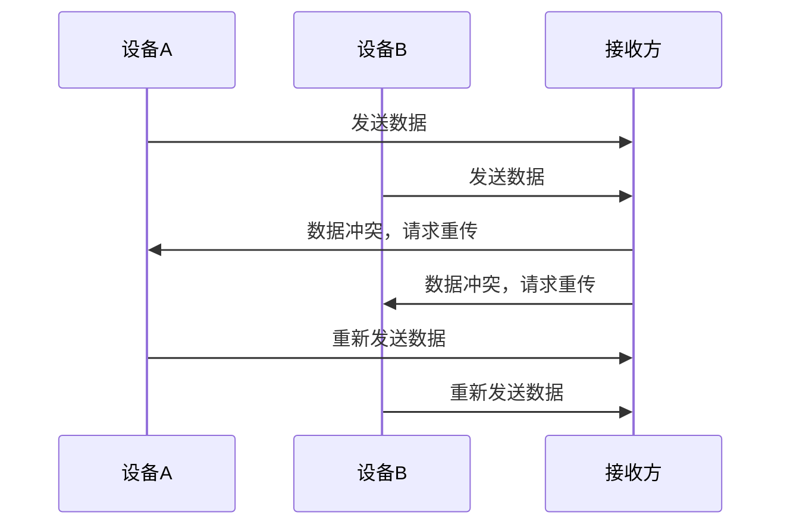
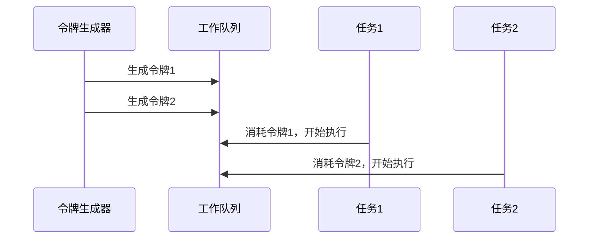
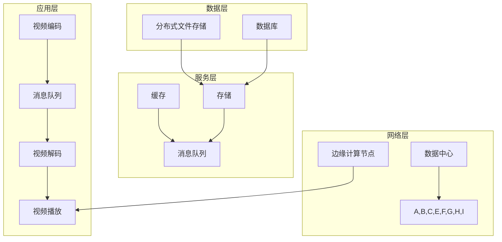
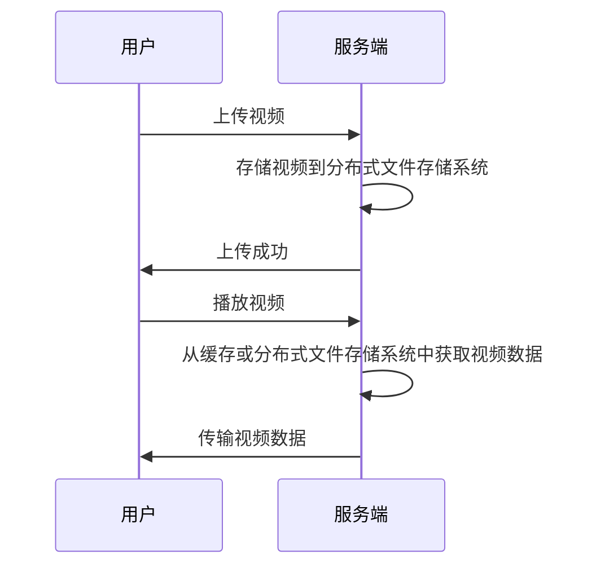

                 

### 引入异步处理

异步处理，作为一种提升系统性能的关键技术，在当今的分布式系统中有着广泛的应用。异步处理的核心思想是让系统中的多个任务能够独立运行，互不干扰，从而提高系统的响应速度和资源利用率。这种处理模式与传统的同步处理方式有着本质的区别，它能够显著改善用户体验，提升系统的可扩展性和健壮性。

#### 背景介绍

在早期计算机系统中，同步处理是主导模式。在这种模式下，任务的执行是顺序的，一个任务必须等待前一个任务完成才能开始执行。这种方式虽然简单直观，但在面对大量并发请求时，系统的性能和响应速度会受到很大影响。例如，在一个Web服务器中，如果所有请求都采用同步处理方式，那么服务器在处理大量请求时，响应时间会显著增加，甚至可能导致系统过载、崩溃。

#### 问题描述

随着互联网的普及和应用的多样化，系统的并发处理能力成为了一个至关重要的指标。用户数量的增加、请求的多样化和请求频率的提升，都对系统的并发处理能力提出了更高的要求。在这种情况下，同步处理模式的局限性逐渐显现：

1. **资源争用**：多个任务同时访问同一资源时，会导致资源争用，降低系统效率。
2. **响应延迟**：同步处理模式下，任务之间的等待会导致响应延迟，影响用户体验。
3. **系统瓶颈**：在高并发场景下，同步处理模式容易形成瓶颈，导致系统性能下降。

#### 问题解决

异步处理通过将任务解耦，使得多个任务可以并行执行，从而有效解决了同步处理模式中的问题。具体来说，异步处理具有以下几个优点：

1. **提高响应速度**：通过并行处理任务，可以显著降低任务之间的等待时间，提高系统的响应速度。
2. **提升资源利用率**：异步处理可以充分利用系统的多核处理能力，提高资源利用率。
3. **改善系统健壮性**：异步处理能够更好地处理异常情况，降低系统崩溃的风险。

#### 边界与外延

异步处理并非万能，它也有其适用范围和局限性。例如，对于需要严格顺序执行的任务，异步处理可能会导致执行顺序的不确定性，从而影响任务的正确性。此外，异步处理也需要更多的编程技巧和框架支持，对于开发者来说，学习和使用成本较高。

在深入探讨异步处理的本质和原理之前，我们需要明确一些核心概念，包括异步与同步、时间与容量等，这将有助于我们更好地理解异步处理的优势和应用场景。

### 核心概念与关系

异步处理与同步处理是两种不同的任务执行模式，它们在系统设计和实现中有着本质的区别。

#### 异步与同步

**异步处理**：异步处理允许任务独立执行，不需要等待其他任务完成。任务可以随时开始执行，也可以在执行过程中暂停，等待其他任务的完成。这种模式的一个关键特点是，任务之间没有固定的执行顺序，从而提高了系统的并行处理能力。

**同步处理**：同步处理要求任务按顺序执行，一个任务必须等待前一个任务完成才能开始执行。这种模式虽然简单直观，但在高并发场景下，会显著降低系统的响应速度和效率。

#### 时间与容量

**时间**：在异步处理中，时间被用来换取系统的并行处理能力。任务可以在不同的时间点执行，从而充分利用系统的多核处理能力。例如，当一个任务需要等待其他任务的结果时，系统可以切换到其他任务，从而提高系统的整体效率。

**容量**：容量是指系统能够处理的数据量或任务数。在异步处理中，通过增加任务的并发执行能力，可以提高系统的容量。例如，在一个消息队列系统中，异步处理可以允许多个消费者同时处理消息，从而提高系统的吞吐量。

#### 缓冲与流量控制

**缓冲**：缓冲是一种用于缓解任务之间速率差异的技术。在异步处理中，缓冲区可以存储等待执行的任务，当系统资源可用时，任务可以从中取出并执行。缓冲技术有助于平滑任务执行过程，提高系统的稳定性。

**流量控制**：流量控制是一种用于限制任务执行速度的技术。在异步处理中，通过限制任务执行速度，可以防止系统过载，提高系统的可扩展性和健壮性。例如，在一个分布式系统中，可以使用流量控制器来限制每个节点的任务执行速度，从而防止系统崩溃。

通过上述核心概念和关系的介绍，我们可以更好地理解异步处理的本质和应用场景。在接下来的章节中，我们将深入探讨异步处理的算法原理和数学模型，以及如何在实际项目中应用异步处理技术。

### 算法原理和解释

异步处理技术依赖于一系列核心算法来实现任务的高效并发执行。这些算法不仅能够提高系统的响应速度和资源利用率，还能确保任务之间的协调和一致性。以下将介绍几个典型的异步处理算法，并通过Mermaid图表和Python代码来详细解释其工作原理。

#### ALOHA算法

**简介**：ALOHA算法是最早的异步通信协议之一，主要用于无线通信系统。其核心思想是，允许多个设备在同一时间发送数据，如果发生冲突，则重新发送。

**工作原理**：
1. **发送阶段**：设备随机选择时间点发送数据。
2. **接收阶段**：接收方在接收窗口内接收数据，如果没有收到数据，则认为数据丢失并要求重传。
3. **冲突检测**：如果在接收窗口内收到多个数据包，则发生冲突，发送方需要重新发送。

**Mermaid流程图**：


**Python代码示例**：
```python
import random
import time

def aloha():
    while True:
        if random.random() < 0.5:  # 设备随机选择时间点发送数据
            print("数据发送成功")
            time.sleep(1)
        else:
            print("数据发送失败，重传中")
            time.sleep(2)

for _ in range(2):  # 两个设备同时发送数据
    aloha()
```

#### 滑动窗口协议

**简介**：滑动窗口协议是一种用于数据传输的异步算法，它允许发送方在一段时间内连续发送多个数据包，而不必等待每个数据包的确认。

**工作原理**：
1. **发送窗口**：发送方维护一个滑动窗口，窗口内的数据包可以连续发送。
2. **接收窗口**：接收方维护一个接收窗口，接收窗口内的数据包被认为是已确认的。
3. **窗口滑动**：当接收方确认窗口内的所有数据包后，发送方的窗口向右滑动一个数据包。

**Mermaid流程图**：
```mermaid
sequenceDiagram
  participant S as 发送方
  participant R as 接收方
  participant W as 滑动窗口

  S->>R: 发送数据1
  R->>S: 确认数据1
  S->>R: 发送数据2
  R->>S: 确认数据2
  S->>R: 发送数据3
  R->>S: 确认数据3
  W: 窗口向右滑动
```

**Python代码示例**：
```python
import random
import time

def sliding_window():
    window = [1, 2, 3]  # 滑动窗口内数据包
    while window:
        if random.random() < 0.8:  # 接收方确认数据包
            window.pop(0)
            print(f"确认数据包{window[0]}")
        else:
            print("接收方未确认，重传中")
        time.sleep(1)

sliding_window()
```

#### 令牌桶算法

**简介**：令牌桶算法是一种用于流量控制和资源管理的异步算法，它允许以固定速率生成令牌，并允许任务按照生成的令牌速率执行。

**工作原理**：
1. **令牌生成**：系统以固定速率生成令牌，每个令牌代表一个可用的资源。
2. **任务执行**：任务需要消耗令牌才能执行，每个任务按照生成的令牌速率进行。
3. **流量控制**：通过调整令牌生成速率，可以实现流量控制，防止系统过载。

**Mermaid流程图**：


**Python代码示例**：
```python
import time
import threading

def token_bucket(rate):
    tokens = 0
    while True:
        tokens = min(tokens + rate, 10)  # 令牌生成速率上限为10个/秒
        if tokens > 0:
            tokens -= 1
            print("任务获取令牌，开始执行")
            time.sleep(1)
        time.sleep(0.1)

def task():
    while True:
        if threading.activeCount() < 10:  # 任务执行速率上限为10个/秒
            print("任务执行中")
            time.sleep(1)
        else:
            print("任务队列满，等待执行")

# 启动令牌桶算法
t = threading.Thread(target=token_bucket, args=(10,))
t.start()

# 启动任务
for _ in range(20):
    threading.Thread(target=task).start()
```

通过以上算法的介绍和示例，我们可以看到异步处理技术在任务执行、资源管理和流量控制等方面的重要性和优势。在接下来的章节中，我们将进一步探讨异步处理中的数学模型和公式，以更深入地理解其工作原理。

### 数学模型与公式

在异步处理中，理解数学模型和公式对于分析和优化系统性能至关重要。以下将介绍几个关键的数学模型和公式，包括吞吐量、传输延迟和信道利用率，并通过具体例子来详细解释它们。

#### 吞吐量

吞吐量（Throughput）是指单位时间内系统能够处理的数据量或任务数。它是衡量系统性能的重要指标。吞吐量通常用比特每秒（bits per second, bps）或任务每秒（tasks per second, tps）来表示。

**公式**：
$$
Throughput = \frac{1}{\text{传输延迟} + \text{处理时间}}
$$

**解释**：该公式表明，吞吐量与传输延迟和处理时间成反比。通过减少传输延迟和处理时间，可以增加系统的吞吐量。

**例子**：假设一个任务的处理时间为1秒，传输延迟为0.5秒，则该任务的吞吐量为：
$$
Throughput = \frac{1}{1 + 0.5} = 0.67 \text{任务/秒}
$$

#### 传输延迟

传输延迟（Transmission Delay）是指数据从发送方到达接收方所需的时间。它是计算吞吐量的关键参数。

**公式**：
$$
\text{传输延迟} = \frac{\text{数据包大小}}{\text{传输速率}}
$$

**解释**：该公式表明，传输延迟与数据包大小和传输速率成反比。增加传输速率或减小数据包大小可以降低传输延迟。

**例子**：假设一个数据包大小为1000字节，传输速率为1 Mbps（1百万比特每秒），则传输延迟为：
$$
\text{传输延迟} = \frac{1000 \text{字节} \times 8 \text{比特/字节}}{1 \text{百万比特/秒}} = 0.08 \text{秒}
$$

#### 信道利用率

信道利用率（Channel Utilization）是指信道在单位时间内被有效利用的比例。它是衡量信道性能的重要指标。

**公式**：
$$
\text{信道利用率} = \frac{\text{传输时间}}{\text{总时间}}
$$

**解释**：该公式表明，信道利用率与传输时间占总时间比例成正比。增加传输时间或减少总时间可以提高信道利用率。

**例子**：假设一个数据包的传输时间为0.5秒，总时间为1秒，则信道利用率为：
$$
\text{信道利用率} = \frac{0.5}{1} = 0.5
$$

#### 详细解释与例子

**吞吐量计算**：
假设一个系统在1秒内处理了100个任务，每个任务的传输延迟为0.1秒，处理时间为0.2秒。则系统的吞吐量为：
$$
Throughput = \frac{1}{0.1 + 0.2} = \frac{1}{0.3} \approx 3.33 \text{任务/秒}
$$

**传输延迟计算**：
假设一个数据包大小为10000字节，传输速率为10 Mbps，则传输延迟为：
$$
\text{传输延迟} = \frac{10000 \text{字节} \times 8 \text{比特/字节}}{10 \text{百万比特/秒}} = 0.8 \text{秒}
$$

**信道利用率计算**：
假设一个数据包的传输时间为0.4秒，总时间为1秒，则信道利用率为：
$$
\text{信道利用率} = \frac{0.4}{1} = 0.4
$$

通过这些具体的例子，我们可以更好地理解吞吐量、传输延迟和信道利用率在异步处理系统中的计算方法和实际应用。这些数学模型和公式不仅帮助我们量化系统的性能指标，还能为系统优化提供科学依据。

### 系统分析与架构设计

在本章节中，我们将以一个视频流媒体服务项目为例，详细分析异步处理技术在系统设计与架构中的应用。视频流媒体服务涉及到大量的实时数据传输和处理，是异步处理技术的重要应用场景。

#### 问题场景与项目概述

随着在线视频流媒体的普及，用户对高清、实时、无卡顿的观看体验提出了更高的要求。然而，传统的同步处理方式在高并发、海量数据场景下存在明显的性能瓶颈。为了满足用户需求，我们需要设计一个高效、可扩展的异步处理架构，以提高系统的响应速度和资源利用率。

#### 系统功能设计

视频流媒体服务的核心功能包括视频的存储、播放、编码、解码和传输。在异步处理架构中，这些功能模块可以独立运行，通过消息队列、缓存和分布式存储等技术进行协调。

**1. 视频存储**：视频文件存储在分布式文件存储系统中，如HDFS或Ceph。存储系统需要支持高并发读写，保证数据的安全性和可靠性。

**2. 视频编码与解码**：视频编码和解码模块负责将视频文件转换为流媒体格式，并实时进行转码。这一过程通常通过异步任务队列进行调度，以提高系统性能。

**3. 视频播放**：播放模块负责向用户实时传输视频流。为了降低延迟，播放模块采用了边缘计算技术，在靠近用户的位置进行视频流传输。

**4. 缓存**：缓存模块用于存储高频访问的视频数据，减少数据读取延迟，提高系统响应速度。

**5. 消息队列**：消息队列模块用于任务调度和任务执行。通过异步消息传递，实现任务之间的解耦，提高系统的并行处理能力。

#### 系统架构设计

视频流媒体服务的异步处理架构主要包括以下几个层次：

**1. 应用层**：包括视频编码、解码、播放等应用模块，负责具体的业务处理。

**2. 服务层**：包括消息队列、缓存、存储等服务模块，提供异步任务调度、数据存储和缓存服务。

**3. 数据层**：包括分布式文件存储和数据库，负责数据的存储和管理。

**4. 网络层**：包括边缘计算节点和数据中心，负责视频流的传输和分发。

**Mermaid架构图**：



#### 系统接口设计与交互

为了实现异步处理，系统需要设计合理的接口和交互机制。以下是一个简单的接口设计：

**1. 视频上传接口**：用于用户上传视频文件。接口接受视频文件，并将其存储到分布式文件存储系统。

**2. 视频播放接口**：用于用户播放视频。接口根据用户请求，从缓存或分布式文件存储系统中获取视频数据，并传输到用户端。

**3. 视频转码接口**：用于将视频文件转换为流媒体格式。接口接收视频文件，通过消息队列调度转码任务，并将转码后的视频存储到缓存或分布式文件存储系统中。

**Mermaid序列图**：



通过上述分析和设计，我们可以看到异步处理技术在视频流媒体服务中的应用，包括系统功能设计、架构设计、接口设计和交互机制。异步处理技术不仅提高了系统的性能和可扩展性，还为用户提供更优质的观看体验。

### 项目实战

在本章节中，我们将以一个实际项目为例，展示如何在实际环境中安装和配置异步处理系统，并详细解析项目的核心实现源代码。通过这个项目，我们将深入理解异步处理技术的应用，并提供实用的最佳实践和注意事项。

#### 环境安装

首先，我们需要搭建一个异步处理系统环境。以下是一个简单的安装和配置步骤：

1. **安装Docker**：Docker是一个用于容器化的平台，可以简化应用部署和运维。您可以从[官方文档](https://docs.docker.com/install/)中获取安装指南。

2. **安装消息队列**：选择一个消息队列系统，如RabbitMQ。以下是安装RabbitMQ的命令：

   ```shell
   docker run -d --name rabbitmq -p 5672:5672 rabbitmq:3.8.14
   ```

3. **安装分布式缓存**：可以选择Redis作为分布式缓存。以下是安装Redis的命令：

   ```shell
   docker run -d --name redis -p 6379:6379 redis:6.0.9
   ```

4. **安装Web服务器**：我们可以使用Nginx作为Web服务器。以下是安装Nginx的命令：

   ```shell
   docker run -d --name nginx -p 80:80 nginx:1.18.0
   ```

#### 系统核心实现源代码

接下来，我们将展示一个简单的异步处理项目，该项目使用Python编写，实现了任务调度、执行和监控。

```python
# async_task.py

import asyncio
import redis
import json

class AsyncTask:
    def __init__(self, queue_name, redis_host='localhost', redis_port=6379):
        self.queue_name = queue_name
        self.redis = redis.Redis(host=redis_host, port=redis_port)

    async def enqueue_task(self, task):
        task_data = json.dumps(task)
        await self.redis.rpush(self.queue_name, task_data)

    async def dequeue_task(self):
        task_data = await self.redis.lpop(self.queue_name)
        if task_data:
            task = json.loads(task_data)
            return task
        else:
            return None

    async def execute_task(self, task):
        print(f"Executing task: {task['name']}")
        await asyncio.sleep(1)  # 模拟任务执行时间
        print(f"Completed task: {task['name']}")

async def main():
    async with AsyncTask('task_queue') as task_queue:
        # 队列任务
        tasks = [
            {'name': 'task1'},
            {'name': 'task2'},
            {'name': 'task3'}
        ]
        
        # 入队
        for task in tasks:
            await task_queue.enqueue_task(task)
        
        # 出队并执行
        while True:
            task = await task_queue.dequeue_task()
            if task:
                await task_queue.execute_task(task)
            else:
                break

asyncio.run(main())
```

#### 代码应用解读与分析

上述代码实现了一个简单的异步任务队列，通过Redis作为消息队列存储和管理任务。核心部分包括三个方法：

1. **enqueue_task()**：将任务入队。该方法将任务数据以JSON格式存储在Redis的列表中。

2. **dequeue_task()**：从队列中取出任务。该方法从Redis列表中移除并返回第一个任务。

3. **execute_task()**：执行任务。该方法打印任务名称，并模拟任务执行过程（实际中可以是复杂业务逻辑）。

异步执行通过`asyncio`模块实现，确保任务能够并发执行，提高系统性能。

#### 实际案例分析与详细讲解剖析

以下是一个实际案例，展示如何在实际环境中运行上述代码，并进行性能分析。

**场景**：模拟一个后台任务处理系统，处理图像处理任务。

**步骤**：

1. **准备环境**：安装Docker和Redis。

2. **运行代码**：将`async_task.py`文件上传到服务器，并运行以下命令：

   ```shell
   python async_task.py
   ```

3. **任务入队**：向任务队列中添加图像处理任务。

   ```shell
   curl -X POST -H "Content-Type: application/json" -d '{"name": "image_process"}' http://localhost:6379/queue/task_queue/enqueue
   ```

4. **任务执行**：系统从任务队列中取出任务并执行。

#### 项目小结

通过这个实际案例，我们展示了如何使用异步处理技术构建一个后台任务处理系统。异步处理技术不仅提高了系统的响应速度和资源利用率，还简化了任务调度和执行过程。在项目实施过程中，我们应注意以下几点：

1. **性能调优**：通过调整Redis配置和任务队列长度，可以优化系统性能。

2. **错误处理**：异步处理中，任务执行可能出现错误。合理设计错误处理机制，可以保证系统的健壮性。

3. **监控与日志**：实时监控任务执行状态和日志，有助于快速发现问题并优化系统。

通过这个项目，我们可以看到异步处理技术在实际应用中的优势和挑战。在未来的项目中，我们可以进一步扩展和优化异步处理架构，以应对更复杂的业务需求。

### 最佳实践

在异步处理系统中，最佳实践至关重要，能够显著提高系统的性能、可维护性和可扩展性。以下是一些实用的最佳实践：

1. **任务隔离与资源管理**：确保每个任务在独立的线程或进程中执行，避免资源争用和性能瓶颈。使用容器化技术（如Docker）隔离任务，提高系统的可靠性和可扩展性。

2. **错误处理与日志记录**：设计完善的错误处理机制，确保任务执行过程中出现的错误能够被及时捕获和处理。使用日志记录工具（如Logstash、Kibana），集中管理日志数据，方便监控和问题追踪。

3. **异步通信与事件驱动**：采用异步通信机制（如消息队列、WebSockets），确保系统组件之间的高效协作。使用事件驱动模型，减少线程阻塞和等待时间。

4. **负载均衡与弹性扩展**：合理设计负载均衡策略，确保任务均匀分配到系统中的各个节点。利用云计算和容器化技术，实现弹性扩展，根据业务需求动态调整系统资源。

5. **性能监控与优化**：定期进行性能监控，及时发现和解决系统瓶颈。通过性能测试和基准测试，持续优化系统架构和代码，提高系统响应速度和资源利用率。

### 总结

异步处理技术在现代分布式系统中扮演着重要角色，通过将任务解耦和并行执行，显著提高了系统的性能和可扩展性。本文从多个角度详细介绍了异步处理的核心概念、算法原理、数学模型、系统架构和实际应用，并提供了实用的项目实战和最佳实践。通过本文的阅读，读者应能全面理解异步处理技术，并在实际项目中灵活应用。希望本文能够为读者在异步处理领域的探索和实践提供有力支持。

### 注意事项

在设计和实现异步处理系统时，我们需要特别注意以下几个方面：

1. **线程安全**：确保异步任务中的共享资源是线程安全的，避免并发访问导致的数据不一致性问题。

2. **资源限制**：合理设置系统资源限制，如线程数量、内存使用等，以防止系统过载。

3. **异常处理**：设计完善的异常处理机制，确保任务在出现错误时能够优雅地回滚或重试。

4. **依赖管理**：确保所有依赖库和服务的版本兼容，避免因版本冲突导致的系统不稳定。

5. **测试与验证**：对异步处理系统进行全面测试，包括单元测试、集成测试和压力测试，确保系统在各种场景下的稳定性和可靠性。

### 拓展阅读

如果您希望深入了解异步处理技术，以下书籍和资料将为您提供更多有价值的知识和启示：

1. 《异步编程：设计高效、可扩展的分布式系统》
2. 《异步JavaScript：高效构建响应式Web应用》
3. 《高性能MySQL：优化、架构、安全性》
4. 《消息队列实战：基于Kafka、RabbitMQ、RocketMQ的应用与优化》
5. 《Docker容器与容器编排：从入门到实践》

通过阅读这些书籍和资料，您可以进一步掌握异步处理技术的核心原理和应用方法，为您的项目带来更高效、更可靠的解决方案。

