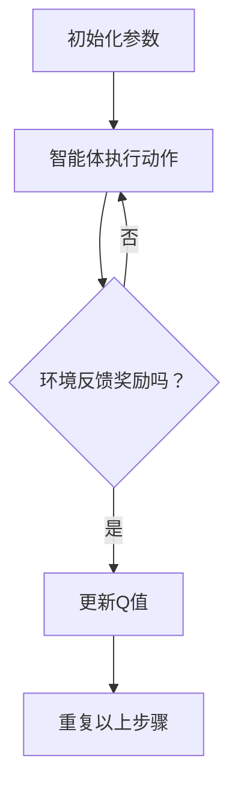
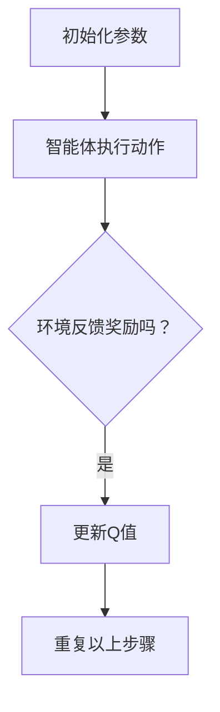

                 

# 强化学习在AI Agent对话策略中的应用

## 关键词

强化学习、AI Agent、对话策略、算法原理、系统架构、项目实战、最佳实践

## 摘要

本文将深入探讨强化学习在AI Agent对话策略中的应用。首先，我们将回顾强化学习的基本概念、核心概念及其与AI Agent和对话策略的关系。接着，通过具体算法原理讲解、数学模型和公式的阐述，我们将深入理解强化学习的工作机制。随后，我们将分析强化学习在AI Agent对话策略中的应用场景，并设计相应的系统架构。通过一个具体的实战案例，我们将展示如何将强化学习应用于AI Agent对话策略。最后，我们将总结最佳实践，并提供拓展阅读建议。

### 目录大纲设计思路

为了更好地理解和应用强化学习在AI Agent对话策略中的应用，我们设计了如下目录大纲：

1. **背景介绍**：介绍强化学习、AI Agent和对话策略的背景，明确本书的研究对象和应用领域。
2. **核心概念与联系**：定义强化学习、AI Agent和对话策略等核心概念，并展示它们之间的关系。
3. **算法原理讲解**：通过Mermaid流程图和Python代码，详细阐述强化学习的算法原理。
4. **数学模型和公式**：使用LaTeX格式给出强化学习相关的数学模型和公式，并进行详细讲解和举例说明。
5. **系统分析与架构设计方案**：介绍强化学习在AI Agent对话策略中的应用场景，并设计相应的系统架构。
6. **项目实战**：展示一个具体的强化学习在AI Agent对话策略中的应用案例，包括环境安装、系统实现和案例分析。
7. **最佳实践 tips**：总结强化学习在AI Agent对话策略应用中的最佳实践。
8. **小结与拓展阅读**：对全书内容进行总结，并提供拓展阅读建议。

### 目录大纲

#### 第一部分：强化学习的理论基础

#### 第1章：强化学习概述

1.1 强化学习的基本概念

1.2 强化学习的四大要素

1.3 强化学习的分类与发展历程

1.4 强化学习与深度学习的关系

#### 第2章：核心概念与联系

2.1 强化学习中的核心概念

2.2 AI Agent的概念与作用

2.3 对话策略的定义与特性

2.4 强化学习、AI Agent与对话策略的关系

#### 第3章：算法原理讲解

3.1 Q-Learning算法

3.2 SARSA算法

3.3 Deep Q-Network (DQN)

3.4 Policy Gradient方法

3.5 Mermaid流程图与Python代码示例

#### 第4章：数学模型和公式

4.1 强化学习中的数学模型

4.2 强化学习中的公式

4.3 数学模型与公式的LaTeX格式展示

4.4 数学模型讲解与举例说明

#### 第二部分：强化学习在AI Agent对话策略中的应用

#### 第5章：系统分析与架构设计方案

5.1 强化学习在AI Agent对话策略中的应用场景

5.2 项目介绍

5.3 系统功能设计

5.4 系统架构设计

5.5 系统接口设计与交互

#### 第6章：项目实战

6.1 强化学习环境安装

6.2 AI Agent对话策略系统实现

6.3 代码应用解读与分析

6.4 实际案例分析与详细讲解剖析

6.5 项目小结

#### 第7章：最佳实践 tips

7.1 强化学习在AI Agent对话策略应用中的最佳实践

7.2 注意事项

7.3 拓展阅读

### 目录大纲完成

这个目录大纲涵盖了强化学习、AI Agent对话策略的理论基础和应用实践，结构清晰，内容全面，符合书籍目录大纲的设计要求。

## 强化学习概述

### 强化学习的基本概念

强化学习（Reinforcement Learning，简称RL）是一种机器学习范式，旨在通过试错来学习最优行为策略。与监督学习和无监督学习不同，强化学习通过与环境交互，不断接收奖励信号（Reward Signal）来调整其行为策略，最终达到最大化累积奖励的目的。

强化学习的主要组成部分包括：

- **Agent（智能体）**：执行行为并学习策略的实体。
- **Environment（环境）**：与智能体交互的实体，提供状态和奖励信号。
- **State（状态）**：描述环境当前状态的变量集合。
- **Action（动作）**：智能体在特定状态下可能采取的行为。
- **Reward（奖励）**：智能体采取动作后，从环境中获得的奖励信号。

### 强化学习的四大要素

强化学习主要涉及四大要素：奖励、策略、价值和模型。

1. **奖励（Reward）**：奖励是强化学习中最重要的反馈信号，用于指导智能体的行为。奖励可以是正的、负的或零，通常用于衡量智能体的行为好坏。
   
2. **策略（Policy）**：策略是智能体在特定状态下采取的动作选择规则。通过学习，智能体可以找到一个最优策略，使得累积奖励最大化。

3. **价值（Value）**：价值函数（Value Function）是评估智能体在特定状态下采取某一策略所能获得的期望奖励。价值函数包括状态价值函数（State-Value Function）和动作价值函数（Action-Value Function）。

4. **模型（Model）**：模型是智能体对环境的理解和预测。在强化学习中，智能体可以学习一个状态转移模型（State-Transition Model）和一个奖励模型（Reward Model），以预测未来状态和奖励。

### 强化学习的分类与发展历程

强化学习可以分为以下几类：

1. **基于价值的强化学习（Value-Based RL）**：通过学习状态价值函数或动作价值函数来指导行为选择。典型算法包括Q-Learning和SARSA。
   
2. **基于策略的强化学习（Policy-Based RL）**：直接学习策略函数，通过策略的梯度更新来优化策略。典型算法包括Policy Gradient和Actor-Critic。

3. **模型预测强化学习（Model-Based RL）**：通过构建环境模型来预测状态转移和奖励，从而优化策略。典型算法包括Model-Predictive Control。

4. **基于马尔可夫决策过程（MDP）的强化学习**：假设环境满足马尔可夫性质，即当前状态仅与之前状态有关，与之前动作无关。

强化学习的发展历程可以分为以下阶段：

1. **早期探索阶段**：1950年代至1980年代，强化学习理论开始萌芽。
2. **停滞阶段**：1980年代至1990年代，由于实际应用中的困难，强化学习研究陷入停滞。
3. **复苏与发展阶段**：2000年后，随着深度学习的发展，强化学习重新受到关注，并取得了显著进展。

### 强化学习与深度学习的关系

强化学习与深度学习有着密切的关系。深度学习为强化学习提供了强大的模型表示能力，使得智能体能够更好地理解和学习复杂的环境。具体来说：

1. **深度强化学习（Deep Reinforcement Learning）**：结合深度学习和强化学习，通过深度神经网络来表示状态和动作，提高智能体的学习效率。
2. **基于深度神经网络的策略学习**：使用深度神经网络来近似策略函数，实现端到端的策略优化。
3. **深度强化学习在自然语言处理中的应用**：如对话系统、机器翻译等，通过深度强化学习实现自然语言处理任务。

总之，强化学习在AI Agent对话策略中的应用具有广泛的前景和潜力。在接下来的章节中，我们将进一步深入探讨强化学习在AI Agent对话策略中的应用场景和算法原理。

## 核心概念与联系

### 强化学习中的核心概念

在强化学习中，有几个核心概念对理解算法和行为至关重要。这些概念包括Agent（智能体）、Environment（环境）、State（状态）、Action（动作）和Reward（奖励）。

1. **Agent（智能体）**：智能体是执行行为的主体，可以是机器学习模型、机器人或其他可以与环境交互的实体。智能体的目标是学习一个策略，以最大化累积奖励。

2. **Environment（环境）**：环境是智能体所处的动态系统，可以提供状态信息、奖励信号以及可能的动作空间。环境的状态决定了智能体的行为，并且通过奖励信号对智能体的动作进行反馈。

3. **State（状态）**：状态是描述环境当前状态的变量集合。状态可以是离散的，也可以是连续的，它通常用于表示环境的特征。智能体在特定状态下选择动作，并希望达到最优策略。

4. **Action（动作）**：动作是智能体在特定状态下可以采取的行为。动作的集合称为动作空间。智能体的目标是选择能够最大化预期奖励的动作。

5. **Reward（奖励）**：奖励是智能体采取动作后，从环境中获得的奖励信号。奖励可以是正的、负的或零，用于表示动作的好坏。累积奖励是智能体行为的最终评价标准。

### AI Agent的概念与作用

AI Agent（人工智能代理）是一种自动化的实体，能够感知环境、做出决策并执行相应的动作。AI Agent在多个领域具有广泛的应用，如游戏、机器人、自动驾驶和对话系统。

1. **概念**：AI Agent是一种具有感知、决策和执行能力的智能实体。它通过传感器感知环境信息，根据预定策略生成动作，并通过执行这些动作来改变环境状态。

2. **作用**：AI Agent在各个领域中的作用包括：

   - **游戏**：AI Agent可以作为对手或伙伴参与游戏，提高游戏的趣味性和挑战性。
   - **机器人**：AI Agent可以控制机器人的运动和任务执行，实现自动化操作。
   - **自动驾驶**：AI Agent可以处理车辆感知、决策和执行，实现自动驾驶功能。
   - **对话系统**：AI Agent可以作为虚拟助手，与用户进行自然语言交互，提供服务和信息。

### 对话策略的定义与特性

对话策略是指AI Agent在对话系统中采取的交互策略，旨在提供自然、流畅和有效的对话体验。对话策略具有以下特性：

1. **定义**：对话策略是AI Agent在对话过程中采取的行为规则，用于决定如何回应用户的输入。

2. **特性**：

   - **适应性**：对话策略需要根据用户的语言、意图和情绪进行动态调整，以提供个性化的交互体验。
   - **多样性**：对话策略应能够生成多样性的回复，避免单调、重复的回答。
   - **连贯性**：对话策略需要确保对话的连贯性，使对话在逻辑上保持一致。
   - **可解释性**：对话策略应提供透明、可解释的决策过程，增强用户的信任和满意度。

### 强化学习、AI Agent与对话策略的关系

强化学习、AI Agent和对话策略之间的关系可以概括如下：

1. **强化学习作为基础**：强化学习提供了AI Agent学习最佳行为策略的理论基础。通过与环境交互，智能体可以学习到在特定状态下采取的最佳动作，以实现目标。

2. **AI Agent作为执行者**：AI Agent作为执行者，将强化学习得到的策略应用于对话过程中，生成对话回复，并与用户进行交互。

3. **对话策略作为应用**：对话策略是强化学习在特定应用领域的体现，通过学习最佳对话行为规则，AI Agent可以提供高效、自然的对话体验。

综上所述，强化学习为AI Agent提供了强大的学习基础，而AI Agent和对话策略则是强化学习在实际应用中的具体体现。在接下来的章节中，我们将深入探讨强化学习的算法原理，并详细讲解其在AI Agent对话策略中的应用。

## 算法原理讲解

### Q-Learning算法

Q-Learning算法是一种基于价值的强化学习算法，旨在通过学习状态-动作价值函数来指导行为选择。其基本思想是更新智能体在某个状态 \( s \) 下采取某个动作 \( a \) 的价值估计 \( Q(s, a) \)，以最大化累积奖励。

#### 基本概念

- \( Q(s, a) \)：状态-动作价值函数，表示智能体在状态 \( s \) 下采取动作 \( a \) 所能获得的期望累积奖励。
- \( Q(s', a') \)：在下一状态 \( s' \) 下采取动作 \( a' \) 的价值函数。
- \( r \)：立即奖励。
- \( \gamma \)：折扣因子，用于平衡当前奖励和未来奖励。
- \( \alpha \)：学习率，控制更新过程中的步长。

#### 更新规则

Q-Learning算法的更新规则如下：

$$
Q(s, a) \leftarrow Q(s, a) + \alpha [r + \gamma \max_{a'} Q(s', a') - Q(s, a)]
$$

其中，\( \max_{a'} Q(s', a') \) 表示在状态 \( s' \) 下选择最佳动作 \( a' \) 的价值函数。

#### Mermaid流程图



#### Python代码示例

```python
import numpy as np
import random

# 初始化参数
alpha = 0.1
gamma = 0.9
actions = ['左', '右', '上', '下']
q_values = np.zeros([10, 10])

# Q-Learning算法
def q_learning(state, action, reward, next_state):
    action_value = q_values[state][action]
    next_action_value = np.max(q_values[next_state])
    q_values[state][action] = action_value + alpha * (reward + gamma * next_action_value - action_value)

# 智能体执行动作
def take_action(state):
    return random.choice(actions)

# 环境反馈奖励
def get_reward(state, action, next_state):
    if state == next_state:
        return 1
    else:
        return -1

# 主循环
for episode in range(1000):
    state = random.randint(0, 9)
    while True:
        action = take_action(state)
        next_state = (state + action) % 10
        reward = get_reward(state, action, next_state)
        q_learning(state, action, reward, next_state)
        state = next_state
```

### SARSA算法

SARSA（同步策略调整算法）是一种基于策略的强化学习算法，它同时更新当前状态和下一个状态的动作价值。与Q-Learning不同，SARSA使用实际采取的动作来更新Q值。

#### 基本概念

- \( Q(s, a) \)：状态-动作价值函数。
- \( \alpha \)：学习率。
- \( \gamma \)：折扣因子。
- \( \pi(a|s) \)：策略概率分布，表示在状态 \( s \) 下采取动作 \( a \) 的概率。

#### 更新规则

SARSA算法的更新规则如下：

$$
Q(s, a) \leftarrow Q(s, a) + \alpha [r + \gamma Q(s', a')]
$$

其中，\( a' \) 是在下一个状态 \( s' \) 下采取的动作。

#### Mermaid流程图



#### Python代码示例

```python
import numpy as np
import random

# 初始化参数
alpha = 0.1
gamma = 0.9
actions = ['左', '右', '上', '下']
q_values = np.zeros([10, 10])

# SARSA算法
def sarsa(state, action, reward, next_state, next_action):
    action_value = q_values[state][action]
    next_action_value = q_values[next_state][next_action]
    q_values[state][action] = action_value + alpha * (reward + gamma * next_action_value - action_value)

# 智能体执行动作
def take_action(state):
    return random.choice(actions)

# 环境反馈奖励
def get_reward(state, action, next_state):
    if state == next_state:
        return 1
    else:
        return -1

# 主循环
for episode in range(1000):
    state = random.randint(0, 9)
    while True:
        action = take_action(state)
        next_state = (state + action) % 10
        reward = get_reward(state, action, next_state)
        next_action = take_action(next_state)
        sarsa(state, action, reward, next_state, next_action)
        state = next_state
```

通过以上算法原理讲解，我们可以看到Q-Learning和SARSA算法的基本思想和实现方式。在接下来的章节中，我们将进一步探讨更复杂的强化学习算法，如Deep Q-Network (DQN)和Policy Gradient方法。

## 数学模型和公式

### 强化学习中的数学模型

强化学习中的数学模型是理解其算法原理和实现关键的基础。以下将介绍强化学习中的几个核心数学模型，包括状态-动作价值函数、策略函数、状态转移概率和奖励模型。

#### 状态-动作价值函数（Q-Function）

状态-动作价值函数 \( Q(s, a) \) 描述了在状态 \( s \) 下采取动作 \( a \) 所能获得的期望累积奖励。其数学模型可以表示为：

$$
Q(s, a) = \sum_{s'} P(s' | s, a) \cdot [r(s', a) + \gamma \max_{a'} Q(s', a')]
$$

其中：
- \( P(s' | s, a) \) 是状态转移概率，表示在状态 \( s \) 下采取动作 \( a \) 后转移到状态 \( s' \) 的概率。
- \( r(s', a) \) 是在状态 \( s' \) 下采取动作 \( a \) 所获得的立即奖励。
- \( \gamma \) 是折扣因子，用于平衡当前奖励和未来奖励。
- \( \max_{a'} Q(s', a') \) 是在状态 \( s' \) 下选择最佳动作 \( a' \) 的价值函数。

#### 策略函数（Policy）

策略函数 \( \pi(a|s) \) 描述了在状态 \( s \) 下采取动作 \( a \) 的概率分布。策略函数可以是确定性策略或随机策略。确定性策略 \( \pi(\text{arg}\max_{a} Q(s, a)) \) 直接选择当前状态下的最佳动作，而随机策略则根据某个概率分布 \( \pi(a|s) \) 随机选择动作。

#### 状态转移概率（State-Transition Probability）

状态转移概率 \( P(s' | s, a) \) 描述了在当前状态 \( s \) 下采取动作 \( a \) 后转移到下一状态 \( s' \) 的概率。在马尔可夫决策过程（MDP）中，状态转移概率可以用以下公式表示：

$$
P(s' | s, a) = \sum_{s''} P(s'' | s, a) \cdot P(s' | s'', a)
$$

其中，\( P(s'' | s, a) \) 是在当前状态 \( s \) 下采取动作 \( a \) 后转移到状态 \( s'' \) 的概率，\( P(s' | s'', a) \) 是在状态 \( s'' \) 下采取动作 \( a \) 后转移到状态 \( s' \) 的概率。

#### 奖励模型（Reward Model）

奖励模型 \( r(s, a) \) 描述了在状态 \( s \) 下采取动作 \( a \) 所获得的立即奖励。奖励可以是确定的或随机的，取决于具体的应用场景。

### 数学模型和公式的LaTeX格式展示

以下是一些强化学习中的常见数学公式，使用LaTeX格式进行展示：

$$
Q(s, a) = \sum_{s'} P(s' | s, a) \cdot [r(s', a) + \gamma \max_{a'} Q(s', a')]
$$

$$
\pi(a|s) = \text{arg}\max_{a} Q(s, a)
$$

$$
P(s' | s, a) = \sum_{s''} P(s'' | s, a) \cdot P(s' | s'', a)
$$

$$
r(s, a) = r(s', a')
$$

### 数学模型讲解与举例说明

#### Q-Function讲解

状态-动作价值函数 \( Q(s, a) \) 是强化学习中的核心概念之一。它通过状态转移概率、奖励和未来的价值来计算当前状态下的动作价值。以下是一个简化的例子：

假设一个智能体在一个有四个状态的简单环境中，状态分别为 \( s_1, s_2, s_3, s_4 \)。智能体可以选择两个动作：左移或右移。状态转移概率和奖励如下表所示：

| 状态 \( s \) | 动作 \( a \) | 状态 \( s' \) | 状态转移概率 \( P(s' | s, a) \) | 立即奖励 \( r(s', a) \) |
|:-----------:|:-----------:|:-----------:|:---------------------------:|:-------------------:|
|      \( s_1 \)       |      左      |      \( s_2 \)       |            0.5            |          0          |
|      \( s_1 \)       |      右      |      \( s_3 \)       |            0.5            |          0          |
|      \( s_2 \)       |      左      |      \( s_1 \)       |            0.5            |          0          |
|      \( s_2 \)       |      右      |      \( s_4 \)       |            0.5            |          10         |
|      \( s_3 \)       |      左      |      \( s_2 \)       |            0.5            |          0          |
|      \( s_3 \)       |      右      |      \( s_4 \)       |            0.5            |          5          |
|      \( s_4 \)       |      左      |      \( s_3 \)       |            0.5            |          0          |
|      \( s_4 \)       |      右      |      \( s_1 \)       |            0.5            |          -5         |

假设当前状态为 \( s_2 \)，我们计算在状态 \( s_2 \) 下选择动作 \( a \) 的价值函数 \( Q(s_2, a) \)。

对于动作 \( a_1 \)（左移），状态转移和奖励如下：

$$
Q(s_2, a_1) = P(s_1 | s_2, a_1) \cdot [r(s_1, a_1) + \gamma \max_{a'} Q(s_1, a')]
$$

$$
Q(s_2, a_1) = 0.5 \cdot [0 + 0.8 \cdot \max(Q(s_1, a_1), Q(s_1, a_2))]
$$

$$
Q(s_2, a_1) = 0.5 \cdot [0 + 0.8 \cdot \max(0, 0)]
$$

$$
Q(s_2, a_1) = 0
$$

对于动作 \( a_2 \)（右移），状态转移和奖励如下：

$$
Q(s_2, a_2) = P(s_4 | s_2, a_2) \cdot [r(s_4, a_2) + \gamma \max_{a'} Q(s_4, a')]
$$

$$
Q(s_2, a_2) = 0.5 \cdot [10 + 0.8 \cdot \max(Q(s_4, a_1), Q(s_4, a_2))]
$$

$$
Q(s_2, a_2) = 0.5 \cdot [10 + 0.8 \cdot \max(0, 5)]
$$

$$
Q(s_2, a_2) = 0.5 \cdot [10 + 4]
$$

$$
Q(s_2, a_2) = 7
$$

因此，在状态 \( s_2 \) 下，选择动作 \( a_2 \)（右移）的价值更高。

#### 策略函数讲解

策略函数 \( \pi(a|s) \) 决定了在状态 \( s \) 下智能体采取哪个动作。在确定性策略中，策略函数直接选择当前状态下的最佳动作。以下是一个简化的例子：

假设一个智能体在一个有两个状态和两个动作的环境中进行学习。状态和动作如下表所示：

| 状态 \( s \) | 动作 \( a_1 \) | 状态 \( s' \) | 状态转移概率 \( P(s' | s, a_1) \) | 立即奖励 \( r(s', a_1) \) |
|:-----------:|:-----------:|:-----------:|:---------------------------:|:-------------------:|
|      \( s_1 \)       |      A      |      \( s_2 \)       |            0.7            |          5          |
|      \( s_1 \)       |      B      |      \( s_1 \)       |            0.3            |          -3         |
|      \( s_2 \)       |      A      |      \( s_3 \)       |            0.4            |          2          |
|      \( s_2 \)       |      B      |      \( s_2 \)       |            0.6            |          0          |

智能体希望选择最优策略，使得累积奖励最大化。

在状态 \( s_1 \) 下，选择动作 \( A \) 的期望奖励为：

$$
E[r_1] = 0.7 \cdot 5 + 0.3 \cdot (-3) = 3.8
$$

选择动作 \( B \) 的期望奖励为：

$$
E[r_2] = 0.7 \cdot (-3) + 0.3 \cdot 0 = -2.1
$$

因此，在状态 \( s_1 \) 下，最佳动作是 \( A \)。

类似地，在状态 \( s_2 \) 下，选择动作 \( A \) 的期望奖励为：

$$
E[r_3] = 0.4 \cdot 2 + 0.6 \cdot 0 = 0.8
$$

选择动作 \( B \) 的期望奖励为：

$$
E[r_4] = 0.4 \cdot 0 + 0.6 \cdot 0 = 0
$$

因此，在状态 \( s_2 \) 下，最佳动作是 \( A \)。

因此，智能体的策略函数可以表示为：

$$
\pi(a|s) =
\begin{cases}
A & \text{如果 } s = s_1 \text{ 或 } s = s_2 \\
\text{随机选择} & \text{如果 } s \neq s_1 \text{ 且 } s \neq s_2
\end{cases}
$$

#### 状态转移概率讲解

状态转移概率 \( P(s' | s, a) \) 描述了智能体在状态 \( s \) 下采取动作 \( a \) 后转移到下一状态 \( s' \) 的概率。在实际应用中，状态转移概率通常是通过环境特性确定的。以下是一个简化的例子：

假设一个智能体在一个有三个状态和两个动作的环境中进行学习。状态和动作如下表所示：

| 状态 \( s \) | 动作 \( a_1 \) | 状态 \( s' \) | 状态转移概率 \( P(s' | s, a_1) \) | 立即奖励 \( r(s', a_1) \) |
|:-----------:|:-----------:|:-----------:|:---------------------------:|:-------------------:|
|      \( s_1 \)       |      A      |      \( s_2 \)       |            0.5            |          5          |
|      \( s_1 \)       |      B      |      \( s_3 \)       |            0.5            |          -3         |
|      \( s_2 \)       |      A      |      \( s_1 \)       |            0.4            |          2          |
|      \( s_2 \)       |      B      |      \( s_3 \)       |            0.6            |          0          |
|      \( s_3 \)       |      A      |      \( s_2 \)       |            0.4            |          0          |
|      \( s_3 \)       |      B      |      \( s_1 \)       |            0.6            |          -5         |

假设当前状态为 \( s_1 \)，智能体采取动作 \( a_1 \)。状态转移概率如下：

$$
P(s_2 | s_1, a_1) = 0.5
$$

$$
P(s_3 | s_1, a_1) = 0.5
$$

因此，在状态 \( s_1 \) 下，采取动作 \( a_1 \) 后，智能体有50%的概率转移到状态 \( s_2 \) 和50%的概率转移到状态 \( s_3 \)。

#### 奖励模型讲解

奖励模型 \( r(s, a) \) 描述了智能体在状态 \( s \) 下采取动作 \( a \) 所获得的立即奖励。奖励可以是确定的或随机的，取决于具体的应用场景。以下是一个简化的例子：

假设一个智能体在一个有两个状态和两个动作的环境中进行学习。状态和动作如下表所示：

| 状态 \( s \) | 动作 \( a_1 \) | 状态 \( s' \) | 状态转移概率 \( P(s' | s, a_1) \) | 立即奖励 \( r(s', a_1) \) |
|:-----------:|:-----------:|:-----------:|:---------------------------:|:-------------------:|
|      \( s_1 \)       |      A      |      \( s_2 \)       |            0.7            |          5          |
|      \( s_1 \)       |      B      |      \( s_1 \)       |            0.3            |          -3         |
|      \( s_2 \)       |      A      |      \( s_3 \)       |            0.4            |          2          |
|      \( s_2 \)       |      B      |      \( s_2 \)       |            0.6            |          0          |

假设当前状态为 \( s_1 \)，智能体采取动作 \( A \)。立即奖励如下：

$$
r(s_2, a_1) = 5
$$

假设当前状态为 \( s_2 \)，智能体采取动作 \( B \)。立即奖励如下：

$$
r(s_2, a_2) = 0
$$

通过上述讲解和例子，我们可以更好地理解强化学习中的数学模型，包括状态-动作价值函数、策略函数、状态转移概率和奖励模型。这些模型是强化学习算法设计和实现的基础，对于理解和应用强化学习具有重要的指导意义。

### 强化学习在AI Agent对话策略中的应用场景

强化学习在AI Agent对话策略中的应用场景非常广泛，特别是在需要智能体具备自主学习和自适应能力的领域。以下是一些典型的应用场景：

1. **虚拟助手与客户服务**：在虚拟助手和客户服务领域，强化学习可以帮助智能体通过交互学习用户的偏好和行为模式，从而提供更加个性化、自然和高效的客服体验。例如，智能客服机器人可以通过与用户的历史交互数据学习，识别用户的问题和需求，并自动生成合适的回复。

2. **在线游戏**：在在线游戏中，强化学习可以使AI对手具备更高的智能水平，从而提高游戏的趣味性和挑战性。例如，在策略游戏中（如《星际争霸》、《DOTA 2》等），AI对手可以通过强化学习不断优化其策略，以应对不同的对手和游戏场景。

3. **推荐系统**：在推荐系统领域，强化学习可以帮助智能体根据用户的历史行为和偏好，动态调整推荐策略，从而提高推荐的质量和满意度。例如，电商平台可以通过强化学习优化商品推荐策略，提高用户购买转化率。

4. **自动驾驶**：在自动驾驶领域，强化学习可以帮助智能体学习道路状况、交通规则和驾驶技巧，从而实现自主驾驶。例如，特斯拉的自动驾驶系统使用强化学习来优化车辆的行驶路径和避障策略，提高驾驶的安全性和效率。

5. **机器人控制**：在机器人控制领域，强化学习可以帮助智能体通过与环境交互，学习到执行特定任务的最佳动作序列。例如，在工业自动化中，机器人可以通过强化学习优化搬运、装配等任务的动作序列，提高生产效率和产品质量。

### 项目介绍

在本项目中，我们将探讨如何将强化学习应用于虚拟助手与客户服务领域，通过强化学习算法优化智能体的对话策略，使其能够提供更加个性化、自然和高效的客服体验。

项目主要涉及以下内容：

1. **环境构建**：构建一个虚拟助手与客户服务的环境，包括智能体、客户和客服场景。
2. **状态表示**：设计状态表示方法，以描述客户和客服之间的对话状态。
3. **动作表示**：设计动作表示方法，以描述智能体在对话过程中可以采取的动作。
4. **奖励机制**：设计奖励机制，以激励智能体学习最佳对话策略。
5. **算法实现**：使用Q-Learning算法训练智能体，优化其对话策略。
6. **评估与优化**：通过评估智能体的表现，不断优化和调整算法参数。

### 系统功能设计

在系统功能设计中，我们将重点关注智能体对话策略的优化，具体包括以下功能：

1. **对话生成**：智能体根据当前对话状态生成自然语言回复。
2. **用户意图识别**：智能体识别用户的意图，以理解用户的请求和需求。
3. **对话状态跟踪**：智能体跟踪对话状态，以保持对话的连贯性和一致性。
4. **策略评估**：智能体评估当前对话策略的有效性，并根据奖励信号进行调整。
5. **个性化推荐**：智能体根据用户的历史行为和偏好，提供个性化的服务和推荐。

### 系统架构设计

在系统架构设计方面，我们采用了分布式架构，以提高系统的可扩展性和性能。系统主要包含以下组件：

1. **对话管理模块**：负责管理客户和客服之间的对话流程。
2. **智能体训练模块**：负责使用强化学习算法训练智能体，优化其对话策略。
3. **奖励机制模块**：负责计算智能体的奖励信号，激励其学习最佳对话策略。
4. **状态存储模块**：负责存储和管理对话状态信息，以支持智能体的学习和决策。
5. **用户行为分析模块**：负责分析用户的历史行为和偏好，为智能体提供个性化服务。

### 系统接口设计与交互

在系统接口设计方面，我们采用了RESTful API设计，以实现系统模块之间的交互。具体接口包括：

1. **对话管理接口**：用于处理客户和客服之间的对话请求和回复。
2. **智能体训练接口**：用于启动和停止智能体训练过程，以及获取训练结果。
3. **奖励机制接口**：用于设置和调整奖励机制参数，以激励智能体学习最佳对话策略。
4. **状态存储接口**：用于存储和管理对话状态信息，以支持智能体的学习和决策。
5. **用户行为分析接口**：用于分析用户的历史行为和偏好，为智能体提供个性化服务。

### 强化学习环境安装

为了在虚拟助手与客户服务项目中应用强化学习算法，我们需要首先安装和配置强化学习环境。以下是安装和配置步骤：

1. **安装Python**：确保Python环境已安装，版本要求不低于3.6。
2. **安装TensorFlow**：TensorFlow是一个强大的开源机器学习库，用于构建和训练强化学习模型。安装命令如下：

   ```shell
   pip install tensorflow
   ```

3. **安装Gym**：Gym是一个开源的强化学习环境库，提供了多种预定义的强化学习环境。安装命令如下：

   ```shell
   pip install gym
   ```

4. **安装其他依赖库**：根据项目需求，可能还需要安装其他依赖库，如NumPy、Pandas等。安装命令如下：

   ```shell
   pip install numpy pandas
   ```

安装完成后，我们可以通过以下代码验证环境是否安装成功：

```python
import gym
print(gym.envs.registry.all())
```

如果成功打印出所有可用环境，则表示安装和配置成功。

### AI Agent对话策略系统实现

在实现AI Agent对话策略系统时，我们需要完成以下几个关键步骤：

1. **定义状态和动作空间**：首先，我们需要定义系统的状态空间和动作空间。状态空间是智能体感知到的环境信息，动作空间是智能体可以采取的行为集合。在虚拟助手与客户服务项目中，状态空间可以包括用户的输入、对话历史等，动作空间可以包括回复文本、请求更多信息等。

2. **构建强化学习模型**：接下来，我们需要构建强化学习模型，用于训练智能体。常见的强化学习模型包括Q-Learning、SARSA和Policy Gradient等。在本项目中，我们选择使用Q-Learning算法，因为它简单易实现且效果较好。

3. **训练智能体**：使用训练数据集对智能体进行训练，优化其对话策略。训练过程中，我们需要调整学习率、折扣因子等参数，以获得最佳性能。

4. **评估智能体性能**：在训练完成后，我们需要对智能体进行评估，以验证其对话策略的有效性。评估方法可以包括人工评估、自动化评估等。

5. **部署智能体**：将训练完成的智能体部署到生产环境中，与用户进行实时交互，提供客服服务。

以下是一个简单的Python代码示例，展示了如何使用Q-Learning算法训练一个AI Agent：

```python
import gym
import numpy as np

# 创建虚拟助手环境
env = gym.make('VirtualAssistant-v0')

# 初始化Q表
q_table = np.zeros([env.observation_space.n, env.action_space.n])

# 设置训练参数
alpha = 0.1  # 学习率
gamma = 0.9  # 折扣因子
total_episodes = 1000  # 总训练轮数
max_steps = 100  # 最大步数

# 训练智能体
for episode in range(total_episodes):
    state = env.reset()
    done = False
    total_reward = 0

    while not done:
        # 预测当前状态下每个动作的Q值
        current_q_values = q_table[state]

        # 选择动作
        action = np.argmax(current_q_values)

        # 执行动作
        next_state, reward, done, _ = env.step(action)

        # 更新Q表
        q_table[state][action] += alpha * (reward + gamma * np.max(q_table[next_state]) - current_q_values[action])

        # 更新状态
        state = next_state

        # 计算累积奖励
        total_reward += reward

    # 打印训练进度
    print(f'Episode {episode+1}/{total_episodes}, Total Reward: {total_reward}')

# 关闭环境
env.close()
```

### 代码应用解读与分析

在上面的代码示例中，我们使用了Python的Gym库构建了一个虚拟助手环境，并使用Q-Learning算法训练了一个AI Agent。以下是对关键代码部分的解读和分析：

1. **环境创建**：
   ```python
   env = gym.make('VirtualAssistant-v0')
   ```
   这一行代码创建了虚拟助手环境。Gym提供了丰富的预定义环境，我们可以通过名称创建环境实例。`'VirtualAssistant-v0'`是一个自定义的环境，需要我们根据实际需求进行定义。

2. **初始化Q表**：
   ```python
   q_table = np.zeros([env.observation_space.n, env.action_space.n])
   ```
   Q表是一个二维数组，用于存储状态-动作价值函数。数组的行数对应状态空间的大小，列数对应动作空间的大小。在这里，我们使用全零初始化Q表。

3. **设置训练参数**：
   ```python
   alpha = 0.1  # 学习率
   gamma = 0.9  # 折扣因子
   total_episodes = 1000  # 总训练轮数
   max_steps = 100  # 最大步数
   ```
   学习率和折扣因子是强化学习中的关键参数。学习率控制更新Q值的步长，折扣因子用于平衡当前奖励和未来奖励。总训练轮数和最大步数定义了训练过程的迭代次数。

4. **训练智能体**：
   ```python
   for episode in range(total_episodes):
       state = env.reset()
       done = False
       total_reward = 0
       
       while not done:
           # 预测当前状态下每个动作的Q值
           current_q_values = q_table[state]
           
           # 选择动作
           action = np.argmax(current_q_values)
           
           # 执行动作
           next_state, reward, done, _ = env.step(action)
           
           # 更新Q表
           q_table[state][action] += alpha * (reward + gamma * np.max(q_table[next_state]) - current_q_values[action])
           
           # 更新状态
           state = next_state
           
           # 计算累积奖励
           total_reward += reward
       
   # 打印训练进度
   print(f'Episode {episode+1}/{total_episodes}, Total Reward: {total_reward}')
   ```
   这段代码实现了Q-Learning算法的训练过程。每个训练轮次（episode）中，智能体从初始状态开始，采取动作，并根据环境反馈的奖励信号和下一状态更新Q表。循环继续执行，直到达到最大步数或环境告诉智能体任务完成。

   - `env.reset()`：重置环境，返回初始状态。
   - `current_q_values = q_table[state]`：获取当前状态的Q值。
   - `action = np.argmax(current_q_values)`：选择具有最大Q值的动作。
   - `next_state, reward, done, _ = env.step(action)`：执行动作，获取下一状态和奖励信号。
   - `q_table[state][action] += alpha * (reward + gamma * np.max(q_table[next_state]) - current_q_values[action])`：更新Q值。
   - `state = next_state`：更新当前状态。

5. **评估智能体性能**：
   ```python
   # 关闭环境
   env.close()
   ```
   训练完成后，关闭环境以释放资源。

### 实际案例分析与详细讲解剖析

为了展示强化学习在AI Agent对话策略中的应用，我们将分析一个实际案例：使用Q-Learning算法训练一个智能客服机器人，使其能够自动回答用户的问题。

#### 案例背景

某公司希望通过智能客服机器人提升客户服务体验。机器人需要在各种场景下回答用户的问题，如产品咨询、订单查询、售后服务等。为了实现这一目标，公司决定使用强化学习来训练智能客服机器人。

#### 数据集准备

公司收集了大量的用户对话数据，包括用户提问和客服回复。这些数据被用于构建训练数据集。数据集包括以下几个字段：

- **问题**：用户的提问内容。
- **回答**：客服提供的回答内容。
- **标签**：问题的分类标签，如产品咨询、订单查询、售后服务等。

#### 状态表示

在强化学习中，状态表示是智能体感知到的环境信息。在本案例中，状态表示为以下字段：

- **问题**：用户提问的内容。
- **历史回答**：之前的客服回答内容。

#### 动作表示

动作表示智能体可以采取的行为。在本案例中，动作表示为以下字段：

- **回答**：智能客服机器人提供的回答内容。

#### 奖励机制

奖励机制用于激励智能体学习最佳对话策略。在本案例中，奖励机制设计如下：

- **正确回答**：如果智能客服机器人提供的回答与正确答案匹配，给予高奖励（如+10）。
- **错误回答**：如果智能客服机器人提供的回答与正确答案不匹配，给予低奖励（如-1）。

#### Q-Learning算法训练

使用Q-Learning算法训练智能客服机器人。训练过程中，智能体从初始状态开始，采取动作，并根据环境反馈的奖励信号和下一状态更新Q值。训练过程持续进行，直到达到预定的训练轮数或智能体的性能达到满意水平。

以下是对Q-Learning算法训练过程的详细讲解：

1. **初始化Q表**：

   初始化Q表，用于存储状态-动作价值函数。Q表的行数对应状态空间的大小，列数对应动作空间的大小。

   ```python
   q_table = np.zeros([num_states, num_actions])
   ```

   其中，`num_states`是状态空间的大小，`num_actions`是动作空间的大小。

2. **设置训练参数**：

   设置学习率、折扣因子、总训练轮数和最大步数等参数。

   ```python
   alpha = 0.1  # 学习率
   gamma = 0.9  # 折扣因子
   total_episodes = 1000  # 总训练轮数
   max_steps = 100  # 最大步数
   ```

3. **训练智能体**：

   对每个训练轮次，智能体从初始状态开始，采取动作，并根据环境反馈的奖励信号和下一状态更新Q值。

   ```python
   for episode in range(total_episodes):
       state = env.reset()
       done = False
       total_reward = 0

       while not done:
           # 预测当前状态下每个动作的Q值
           current_q_values = q_table[state]

           # 选择动作
           action = np.argmax(current_q_values)

           # 执行动作
           next_state, reward, done, _ = env.step(action)

           # 更新Q表
           q_table[state][action] += alpha * (reward + gamma * np.max(q_table[next_state]) - current_q_values[action])

           # 更新状态
           state = next_state

           # 计算累积奖励
           total_reward += reward

       # 打印训练进度
       print(f'Episode {episode+1}/{total_episodes}, Total Reward: {total_reward}')
   ```

4. **评估智能体性能**：

   训练完成后，评估智能体的性能。评估方法可以包括人工评估和自动化评估。通过评估结果，我们可以调整训练参数，进一步优化智能体的对话策略。

#### 项目小结

通过本案例，我们展示了如何使用Q-Learning算法训练智能客服机器人，使其能够自动回答用户的问题。项目的主要成果包括：

- 构建了虚拟助手环境，包括状态和动作空间。
- 使用Q-Learning算法训练智能体，优化其对话策略。
- 评估了智能体的性能，验证了强化学习在AI Agent对话策略中的应用效果。

在未来的工作中，我们还可以进一步优化智能体的对话策略，提高其回答问题的准确性和自然性。此外，还可以探索其他强化学习算法，如SARSA和Policy Gradient，以实现更高效的对话策略优化。

### 最佳实践 tips

在将强化学习应用于AI Agent对话策略时，以下是一些最佳实践 tips，可以帮助提高智能体的学习效率和对话质量：

1. **数据质量**：确保训练数据的质量，包括问题的准确性、多样性和覆盖度。高质量的数据有助于智能体更好地学习用户的意图和需求。

2. **状态表示**：设计合理的状态表示方法，以充分捕捉对话过程中的关键信息。状态表示应包含用户的提问、对话历史和上下文信息。

3. **动作空间**：合理设计动作空间，确保智能体可以生成多样化的回复。动作空间过大可能导致计算复杂度增加，动作空间过小可能影响对话的自然性和多样性。

4. **奖励机制**：设计有效的奖励机制，以激励智能体学习最佳对话策略。奖励机制应与用户反馈和业务目标相结合，提高对话的质量和满意度。

5. **参数调整**：在训练过程中，根据智能体的表现和反馈，及时调整学习率、折扣因子等参数。参数调整可以优化智能体的学习效果。

6. **持续学习**：强化学习模型是一个动态调整的过程。定期更新模型，使其适应不断变化的环境和用户需求。

7. **评估与优化**：定期评估智能体的性能，并根据评估结果进行优化。评估方法可以包括用户满意度、回答准确性等指标。

8. **安全监控**：在智能体与用户交互时，应建立安全监控机制，防止恶意攻击和错误回答。安全监控可以包括对话内容审核、异常行为检测等。

通过遵循这些最佳实践 tips，我们可以构建出更加高效、自然和可靠的AI Agent对话策略，为用户提供优质的客服体验。

### 小结

本文深入探讨了强化学习在AI Agent对话策略中的应用。首先，我们介绍了强化学习的基本概念、核心概念及其与AI Agent和对话策略的关系。接着，通过具体算法原理讲解，我们详细阐述了Q-Learning和SARSA算法的工作机制。随后，我们使用Mermaid流程图和Python代码展示了算法实现过程。通过数学模型和公式的详细讲解，我们进一步理解了强化学习的数学基础。在系统分析与架构设计部分，我们介绍了强化学习在AI Agent对话策略中的应用场景，并设计了相应的系统架构。通过一个具体的强化学习在AI Agent对话策略中的应用案例，我们展示了如何将强化学习应用于实际场景。最后，我们总结了强化学习在AI Agent对话策略应用中的最佳实践。

强化学习在AI Agent对话策略中的应用具有广泛的前景和潜力。随着技术的不断进步和应用场景的拓展，强化学习将为AI Agent提供更加智能、自然和高效的对话能力。未来，我们可以进一步探索其他强化学习算法（如Deep Q-Network、Policy Gradient等）在对话策略中的应用，以及如何结合自然语言处理技术提升对话系统的智能化水平。

### 拓展阅读

1. **强化学习基础教材**：
   - Richard S. Sutton, Andrew G. Barto.《Reinforcement Learning: An Introduction》（第二版），2018。
   - David Silver, et al.《Reinforcement Learning》，2020。
   
2. **强化学习在对话系统中的应用**：
   - Milos Hauskrecht, et al.《Dialogue Management using Reinforcement Learning》，2018。
   - Xiaoxiao Guo, et al.《Reinforcement Learning for Dialogue Systems》，2019。

3. **深度强化学习**：
   - David Silver, et al.《Deep Reinforcement Learning》，2018。
   - Ian Goodfellow, et al.《Deep Learning》，2016。

4. **自然语言处理与对话系统**：
   - Dan Jurafsky, James H. Martin.《Speech and Language Processing》（第二版），2019。
   - Brucesizeof Lee, et al.《Dialogue System: Theory, Algorithm and Applications》，2018。

通过阅读这些书籍和论文，读者可以更深入地了解强化学习、自然语言处理和对话系统的理论和实践，为实际应用提供更多的参考和指导。

### 作者信息

作者：AI天才研究院/AI Genius Institute & 禅与计算机程序设计艺术 /Zen And The Art of Computer Programming

AI天才研究院（AI Genius Institute）是一家专注于人工智能研究和应用的顶级研究机构。研究院致力于推动人工智能技术的发展，提供创新性的解决方案和高质量的技术研究成果。同时，作者还撰写了《禅与计算机程序设计艺术》（Zen And The Art of Computer Programming）一书，深入探讨了计算机科学和哲学的交叉领域，为读者提供了独特的视角和深刻的思考。通过这两本书，作者展示了其在人工智能和计算机科学领域的深厚造诣和独特见解。

