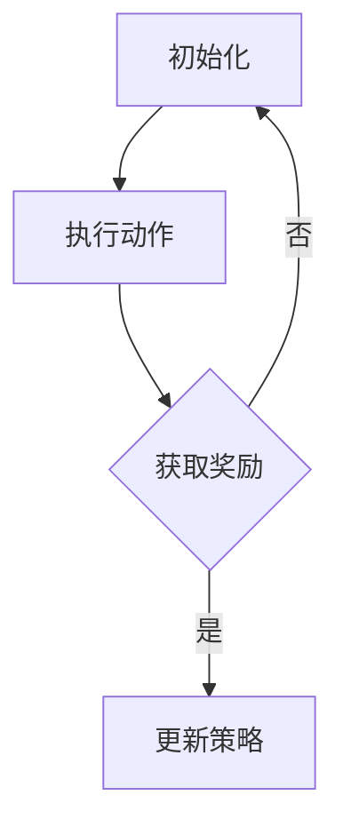
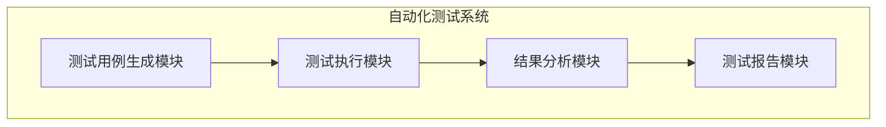
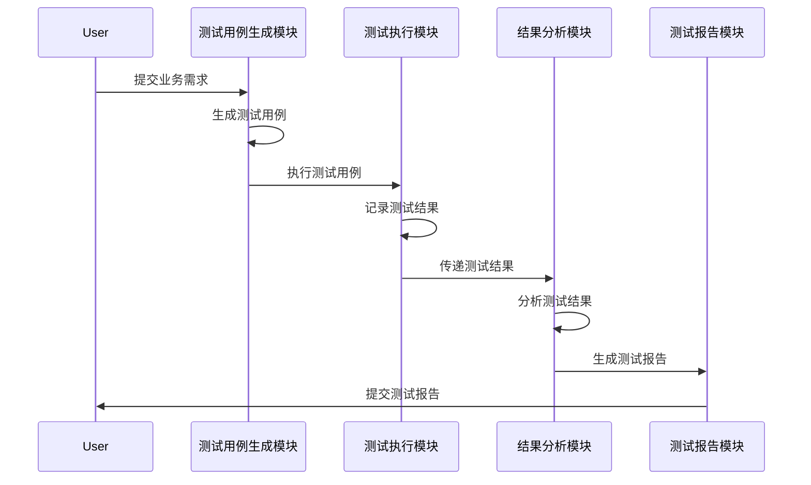
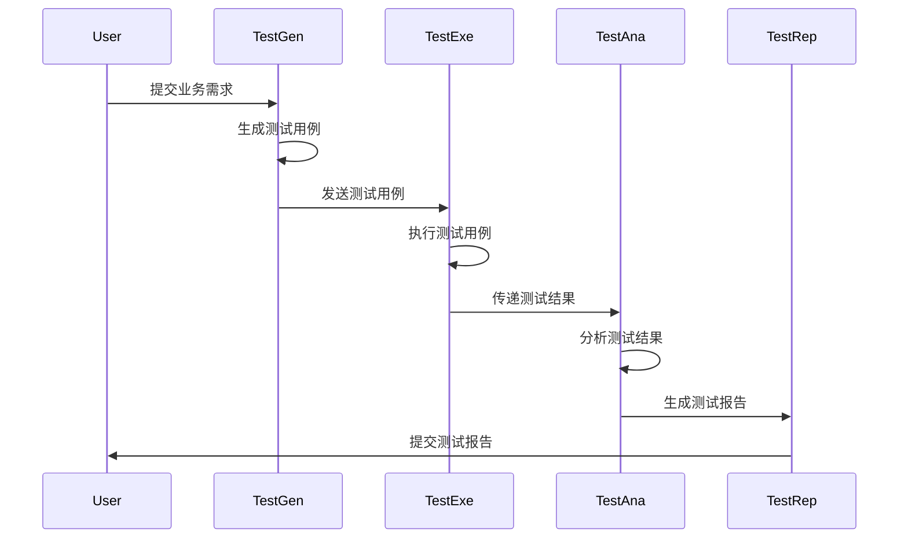

                 

# 强化学习在AI Agent自动化测试中的应用

## 关键词

强化学习，AI Agent，自动化测试，机器学习，AI应用场景

## 摘要

本文深入探讨了强化学习在AI Agent自动化测试中的应用。通过介绍强化学习的基本概念、算法原理、以及在自动化测试中的具体实现，文章展示了强化学习在提高自动化测试效率、优化测试流程中的重要作用。本文还将通过实际案例，详细讲解强化学习算法在Web、移动和API自动化测试中的具体应用，提供最佳实践，并展望强化学习在自动化测试领域的未来发展。

## 引言

### 强化学习：概念与背景

强化学习（Reinforcement Learning，RL）是机器学习的一个分支，其主要特点是通过对环境的不断交互，从经验中学习最优策略。强化学习的基本元素包括代理（Agent）、环境（Environment）、状态（State）、动作（Action）和奖励（Reward）。代理在环境中执行动作，根据环境的反馈（奖励或惩罚）调整其策略，以最大化累积奖励。

强化学习起源于20世纪50年代，由Richard Sutton和Andrew Barto的经典著作《强化学习：一种试错方法》（Reinforcement Learning: An Introduction）奠定了其理论基础。随着深度学习技术的兴起，强化学习在解决复杂、高维问题方面展现了强大的能力。

### AI Agent：定义与特点

AI Agent是指能够智能地与环境交互并采取行动的计算机程序。AI Agent具备自主学习、决策规划、问题解决和自适应能力等特点。常见的AI Agent类型包括聊天机器人、自动驾驶汽车、智能推荐系统和自动化测试代理等。

在自动化测试领域，AI Agent作为一种智能化的测试工具，能够模拟用户行为，执行测试用例，并根据测试结果进行学习与优化。AI Agent能够处理复杂的业务逻辑，提高测试效率，减少人为错误，成为自动化测试的理想选择。

### 自动化测试：现状与挑战

自动化测试是软件测试过程中的重要环节，通过使用自动化测试工具，可以大幅提高测试效率和准确性。然而，随着软件系统的复杂性增加，自动化测试面临诸多挑战：

- **测试数据多样性**：需要生成大量、多样的测试数据，以覆盖不同业务场景和用户行为。
- **测试用例维护**：测试用例需要不断更新，以适应软件功能和性能的变化。
- **测试覆盖率**：如何确保测试用例能够覆盖所有可能的问题场景。
- **测试执行效率**：如何提高测试执行速度，缩短测试周期。

强化学习在自动化测试中的应用，旨在解决上述挑战，通过智能化的测试策略和学习机制，提高测试的全面性和效率。

### 本文结构

本文将按照以下结构展开：

1. **强化学习的背景与核心概念**：介绍强化学习的起源、基本原理和与其他机器学习方法的区别。
2. **强化学习算法的原理与流程**：详细讲解强化学习算法的数学模型、流程图和Python源代码实现。
3. **强化学习在自动化测试中的系统架构设计**：分析自动化测试场景，设计系统架构和接口。
4. **强化学习在自动化测试中的应用实战**：通过Web、移动和API自动化测试案例，展示强化学习在实际中的应用。
5. **强化学习在自动化测试中的最佳实践**：提供实用技巧和注意事项。
6. **强化学习在自动化测试中的应用前景**：探讨强化学习在自动化测试领域的未来发展。

通过本文的深入探讨，读者将全面了解强化学习在AI Agent自动化测试中的应用，掌握其核心原理和实践技巧，为未来的自动化测试工作提供有力支持。

## 强化学习的背景与核心概念

### 强化学习的起源与发展

强化学习的概念最早可以追溯到1950年代，由Richard Sutton和Andrew Barto在他们的开创性著作《强化学习：一种试错方法》中系统阐述。强化学习的基本理念是通过与环境交互，从经验中学习并优化策略。这种学习方式与监督学习和无监督学习有显著不同，它不需要预先标注的数据集，而是通过奖励机制来引导学习过程。

强化学习的发展历程可以分为几个重要阶段：

- **基础阶段（1950-1970年代）**：在这一阶段，强化学习的基本思想和初步算法开始出现。代表性的工作是Richard Bellman提出的动态规划（Dynamic Programming）方法，它为后来的强化学习算法奠定了基础。

- **低谷期（1970-1980年代）**：由于实际应用中的复杂性和理论上的困难，强化学习在研究界遭遇了低谷期。许多学者认为强化学习难以解决实际问题，因此转向了其他机器学习方法。

- **复兴阶段（1990年代至今）**：随着计算机性能的提升和深度学习技术的发展，强化学习再次受到关注。现代强化学习算法如Q-Learning、SARSA（同步策略评估和回报求和）等，通过结合深度神经网络，成功地解决了许多复杂问题。

### 强化学习的基本原理

强化学习的基本原理可以概括为四个核心元素：代理（Agent）、环境（Environment）、状态（State）、动作（Action）和奖励（Reward）。

- **代理（Agent）**：在强化学习过程中，代理是主动执行动作并接收环境反馈的实体。代理可以是机器人、软件程序或其他智能体。

- **环境（Environment）**：环境是代理执行动作并接收反馈的物理或虚拟空间。环境可以模拟现实世界中的场景，也可以是一个简单的规则系统。

- **状态（State）**：状态是代理在环境中的当前情况。状态可以是离散的，如棋盘上的棋子位置，也可以是连续的，如自动驾驶汽车的速度和方向。

- **动作（Action）**：动作是代理在状态下的可选行为。动作的选择会影响代理的状态变化。

- **奖励（Reward）**：奖励是环境对代理动作的即时反馈。奖励通常是一个实数值，用于表示代理动作的好坏。正奖励鼓励代理继续执行该动作，负奖励则指示代理避免该动作。

### 强化学习的基本流程

强化学习的基本流程可以概括为以下几个步骤：

1. **初始化**：设置代理、环境和初始状态。

2. **执行动作**：代理根据当前状态选择一个动作。

3. **获取奖励**：环境根据代理的动作更新状态，并给予代理一个奖励。

4. **更新策略**：代理根据累积奖励和历史经验调整其策略，以最大化长期累积奖励。

5. **重复步骤**：代理不断执行动作、获取奖励并更新策略，直到达到预定的目标或停止条件。

### 强化学习与其他机器学习方法的区别

强化学习与其他机器学习方法，如监督学习和无监督学习，有显著的不同：

- **数据需求**：强化学习不需要预先标注的数据集，而是通过与环境交互获取数据。监督学习依赖于大量标注数据，无监督学习则不需要标注数据。

- **目标导向**：强化学习的目标是最大化累积奖励，而监督学习的目标是预测输出，无监督学习的目标是发现数据中的模式和结构。

- **反馈机制**：强化学习的奖励机制提供即时反馈，用于指导学习过程。监督学习依赖于预定义的标签，无监督学习则通过内部机制学习。

- **适用场景**：强化学习适用于需要决策和规划的问题，如自动驾驶、游戏AI和自动化测试。监督学习适用于分类和回归问题，无监督学习适用于聚类和降维问题。

通过以上对强化学习背景和核心概念的介绍，我们可以看到，强化学习作为机器学习的一个重要分支，具有独特的学习机制和应用场景，其在自动化测试中的应用前景广阔。接下来，本文将详细讲解强化学习算法的原理与流程，为理解其在自动化测试中的具体应用打下基础。

### AI Agent的概念与特性

AI Agent是指能够智能地与环境交互并采取行动的计算机程序。AI Agent的核心目标是实现自动化、智能化和高效化的任务执行，从而减少人为干预和错误。在自动化测试领域，AI Agent作为一种智能化的测试工具，具有以下几个关键特性：

#### 1. 自主学习

AI Agent具备自主学习能力，能够根据测试过程中获取的经验和反馈自动调整其测试策略。通过强化学习算法，AI Agent可以从大量的测试数据中学习，逐步提高其测试效率和准确性。这种自主学习能力使得AI Agent能够适应不断变化的测试环境，确保测试覆盖率和测试质量。

#### 2. 决策规划

AI Agent能够根据当前的状态和测试目标，进行决策和规划。通过分析测试结果和历史数据，AI Agent可以制定最优的测试路径和测试策略，从而优化测试流程，提高测试效率。例如，在自动化测试中，AI Agent可以根据代码变更和业务需求，自动生成和调整测试用例，确保测试的全面性和有效性。

#### 3. 问题解决

AI Agent具备问题解决能力，能够在复杂和不确定的环境中找到最佳的解决方案。通过机器学习和自然语言处理技术，AI Agent可以理解和分析测试过程中的异常情况，并自动生成相应的修复建议或解决方案。这种能力不仅提高了测试的自动化程度，还降低了测试人员的负担，提升了整体测试效率。

#### 4. 自适应

AI Agent能够根据测试过程中遇到的变化和挑战，进行自适应调整。例如，在自动化测试中，AI Agent可以根据代码变更和系统升级，自动调整测试环境配置和测试用例执行策略，确保测试流程的连续性和稳定性。这种自适应能力使得AI Agent能够应对复杂多变的测试环境，保证测试的持续性和准确性。

#### 5. 智能化

AI Agent通过集成多种机器学习算法和自然语言处理技术，实现了高度智能化。例如，在自动化测试中，AI Agent可以自动化生成测试报告，分析测试结果，并根据测试数据自动优化测试策略。这种智能化能力不仅提高了测试的效率和质量，还减少了人为干预和错误，提升了测试的自动化水平。

#### AI Agent在自动化测试中的应用

AI Agent在自动化测试中的应用场景广泛，包括但不限于以下几个方面：

- **测试用例生成**：AI Agent可以根据业务需求和代码变更，自动生成测试用例，提高测试覆盖率。

- **测试执行**：AI Agent可以模拟用户行为，自动化执行测试用例，并生成详细的测试报告。

- **异常检测**：AI Agent可以通过分析测试数据，自动识别异常情况，并提出相应的解决方案。

- **测试优化**：AI Agent可以根据测试结果和历史数据，自动调整测试策略，优化测试流程。

- **测试环境管理**：AI Agent可以自动化管理测试环境，包括安装软件、配置环境和部署代码等。

AI Agent通过其自主学习、决策规划、问题解决、自适应和智能化等特性，显著提高了自动化测试的效率、质量和稳定性，成为自动化测试领域的重要工具。

### 强化学习在AI Agent自动化测试中的应用

#### 强化学习在自动化测试中的挑战

自动化测试虽然提高了软件测试的效率和准确性，但仍然面临诸多挑战，尤其是在复杂系统的测试中。这些问题包括：

- **测试数据多样性**：自动化测试需要处理大量的测试数据，包括功能测试、性能测试、兼容性测试等，如何生成多样化的测试数据是关键问题。

- **测试用例维护**：自动化测试用例需要不断更新，以适应软件功能和性能的变化。随着项目规模的扩大，测试用例的数量呈指数级增长，维护成本也随之增加。

- **测试覆盖率**：如何确保测试用例能够覆盖所有可能的问题场景，特别是那些难以预见和发现的边缘情况。

- **测试执行效率**：自动化测试需要大量时间来执行测试用例，特别是在复杂系统中，测试执行的速度直接影响测试周期。

强化学习提供了一种解决这些挑战的有效方法。通过智能化的学习机制和自适应能力，强化学习能够帮助自动化测试代理更好地应对复杂的测试环境和多样化的测试需求。

#### 强化学习算法的选择

在自动化测试中，选择合适的强化学习算法至关重要。以下是几种常见的强化学习算法及其在自动化测试中的应用：

1. **Q-Learning（Q值学习）**：
   - **原理**：Q-Learning是一种值函数算法，通过学习状态-动作值函数来最大化累积奖励。
   - **应用**：适用于简单的测试环境和有限的状态空间，可以用于测试路径规划。

2. **SARSA（同步策略评估和回报求和）**：
   - **原理**：SARSA是一种基于策略的强化学习算法，通过同步评估当前策略的预期回报。
   - **应用**：适用于动态测试环境，能够实时调整测试策略，提高测试效率。

3. **Deep Q-Network（DQN，深度Q网络）**：
   - **原理**：DQN结合了深度神经网络和Q-Learning，通过深度网络来近似状态-动作值函数。
   - **应用**：适用于高维状态空间，如复杂的Web自动化测试，可以处理大量输入特征。

4. **Policy Gradient（策略梯度）**：
   - **原理**：Policy Gradient通过直接优化策略参数来最大化累积奖励。
   - **应用**：适用于策略空间较大的任务，如智能自动化测试代理的选择和决策。

5. **Actor-Critic（演员-评论家）**：
   - **原理**：Actor-Critic由两个网络组成：Actor网络负责执行动作，Critic网络评估动作的好坏。
   - **应用**：适用于复杂任务，能够平衡探索与利用，提高测试策略的稳定性。

#### 强化学习在自动化测试中的实际应用案例

以下是一个强化学习在Web自动化测试中的实际应用案例：

**案例背景**：一家大型互联网公司需要对其电子商务平台进行自动化测试，以确保平台的稳定性和可靠性。由于平台的功能复杂，测试用例繁多，传统测试方法难以满足需求。

**解决方案**：该公司采用了一种基于DQN的强化学习算法，构建了一个智能化的自动化测试代理。

**实现步骤**：

1. **环境构建**：构建一个模拟电子商务平台的测试环境，包括用户界面、后端服务和数据库。

2. **状态表示**：将用户操作、页面元素和系统响应等特征表示为状态向量。

3. **动作空间**：定义用户可以执行的操作，如点击按钮、输入文本、选择选项等。

4. **奖励机制**：定义奖励函数，对正确的操作给予正奖励，对错误的操作给予负奖励。

5. **算法训练**：使用DQN算法训练测试代理，使其能够学会最优的测试策略。

6. **测试执行**：智能代理根据学习到的策略执行测试用例，生成详细的测试报告。

**效果评估**：

- **测试覆盖率**：智能代理能够自动生成和执行测试用例，测试覆盖率显著提高。

- **测试效率**：智能代理能够快速执行测试，显著缩短测试周期。

- **测试质量**：智能代理能够识别和报告潜在的问题，提高了测试的准确性。

通过实际案例可以看出，强化学习在自动化测试中具有显著的应用潜力，能够有效应对复杂的测试环境和多样化的测试需求。

### 强化学习算法的原理与流程

#### 强化学习算法的基本流程

强化学习算法的基本流程可以概括为以下几个步骤：

1. **初始化**：设置代理、环境和初始状态。代理随机选择一个动作执行，并获取环境反馈的奖励。

2. **执行动作**：代理根据当前状态和策略选择一个动作执行。在强化学习中，策略是一个概率分布，表示代理在不同状态下的动作选择概率。

3. **获取奖励**：环境根据代理的动作更新状态，并给予代理一个即时奖励。奖励可以是正的，表示代理的动作有利于达到目标；也可以是负的，表示代理的动作偏离了目标。

4. **更新策略**：代理根据累积奖励和历史经验调整其策略，以最大化长期累积奖励。这一过程通常通过优化策略的参数实现。

5. **重复步骤**：代理不断执行动作、获取奖励并更新策略，直到达到预定的目标或停止条件。

#### 强化学习算法的数学模型

强化学习算法的数学模型主要包括以下几个组成部分：

1. **状态（State）**：状态是代理在环境中的当前情况，通常表示为一个多维向量。状态可以是离散的，如游戏中的棋盘状态；也可以是连续的，如自动驾驶汽车的位置和速度。

2. **动作（Action）**：动作是代理可以执行的行为。动作集合通常是一组离散的或连续的值。例如，在自动驾驶中，动作可以是加速、减速或转向。

3. **策略（Policy）**：策略是代理在状态选择动作的规则。策略通常表示为一个概率分布，即给定某个状态，代理以多大的概率选择某个动作。

4. **奖励（Reward）**：奖励是环境对代理动作的即时反馈，用于评估动作的好坏。奖励可以是即时奖励（Immediate Reward），也可以是延迟奖励（Terminal Reward），后者通常在达到某个目标或终止状态时给予。

5. **价值函数（Value Function）**：价值函数用于评估状态或状态-动作对的优劣。最常见的是状态价值函数（State Value Function）和状态-动作价值函数（State-Action Value Function）。价值函数的目的是帮助代理选择最优动作。

6. **策略梯度（Policy Gradient）**：策略梯度是用于优化策略的参数。策略梯度算法通过计算策略梯度的期望值，更新策略参数，以最大化累积奖励。

#### 强化学习算法的流程图

以下是强化学习算法的基本流程图：



该流程图描述了代理在环境中执行动作，获取奖励，并基于奖励更新策略的循环过程。

#### Python源代码示例

以下是一个简单的Q-Learning算法的Python代码示例：

```python
import numpy as np
import random

# 初始化参数
learning_rate = 0.1
discount_factor = 0.9
epsilon = 0.1
n_episodes = 1000

# 创建Q值表格，初始化为0
q_table = np.zeros([state_space_size, action_space_size])

# Q-Learning算法
for episode in range(n_episodes):
    state = random.randint(0, state_space_size - 1)
    done = False
    
    while not done:
        action = choose_action(state)
        next_state, reward = step(state, action)
        q_table[state, action] = q_table[state, action] + learning_rate * (reward + discount_factor * np.max(q_table[next_state, :]) - q_table[state, action])
        state = next_state
        
        if done:
            break

# 选择动作的策略函数
def choose_action(state):
    if random.uniform(0, 1) < epsilon:
        action = random.randint(0, action_space_size - 1)
    else:
        action = np.argmax(q_table[state, :])
    return action

# 环境的step函数
def step(state, action):
    # 根据动作执行环境步骤，并返回下一个状态和奖励
    # 这里用示例代码表示，实际应用中需要根据具体环境实现
    next_state = ...
    reward = ...
    return next_state, reward
```

#### 算法的数学模型和公式

Q-Learning算法的核心是更新Q值表格，其更新公式为：

$$
Q(s, a) \leftarrow Q(s, a) + \alpha [r + \gamma \max_{a'} Q(s', a') - Q(s, a)]
$$

其中：
- \( Q(s, a) \) 是状态-动作值函数；
- \( s \) 是当前状态，\( a \) 是当前动作；
- \( r \) 是即时奖励；
- \( \gamma \) 是折扣因子，用于平衡当前奖励和未来奖励；
- \( \alpha \) 是学习率，控制Q值更新的幅度；
- \( s' \) 是下一个状态，\( a' \) 是下一个动作。

#### 举例说明算法的应用

以下是一个简单的应用实例，说明Q-Learning算法在自动化测试中的基本应用：

**假设**：测试系统有5个功能模块，每个模块可以有2种测试状态（通过或失败）。

- **状态空间**：\( S = \{ (0,0), (0,1), (1,0), (1,1), (2,0), (2,1), (3,0), (3,1), (4,0), (4,1) \} \)
- **动作空间**：\( A = \{ 0, 1 \} \)
- **奖励机制**：正确执行测试用例给予+1奖励，错误执行给予-1奖励。

**实例过程**：

1. **初始化**：创建一个5x2的Q值表格，所有初始值为0。

2. **执行动作**：代理在状态\( (0,0) \)下随机选择动作0（测试模块1）。

3. **获取奖励**：代理执行测试，返回状态\( (0,1) \)和奖励+1。

4. **更新Q值**：根据Q-Learning公式更新Q值表格。

5. **重复步骤**：代理继续执行动作，直到所有模块都测试完毕。

通过上述实例可以看出，Q-Learning算法能够帮助自动化测试代理学习最优测试策略，提高测试效率和准确性。接下来，本文将介绍强化学习在自动化测试中的系统架构设计。

### 强化学习在自动化测试中的系统架构设计

在自动化测试中，系统架构的设计至关重要，它决定了测试过程的高效性和稳定性。强化学习在自动化测试中的应用，需要通过合理的系统架构来实现。以下是一个典型的系统架构设计方案，包括领域模型、系统架构、接口设计和系统交互序列图。

#### 自动化测试场景介绍

假设我们正在开发一个电子商务平台，需要对平台的多个功能模块进行自动化测试。这些功能模块包括商品展示、购物车管理、订单处理、支付系统和用户管理。每个模块都有其特定的测试场景和测试用例。

#### 系统功能设计

系统的核心功能包括：

- **测试用例生成**：根据业务需求和代码变更，自动生成测试用例。
- **测试执行**：模拟用户行为，自动化执行测试用例，并记录测试结果。
- **结果分析**：分析测试结果，识别异常情况，并提供修复建议。
- **测试报告**：生成详细的测试报告，包括测试覆盖率、测试效率和测试质量。

为了实现上述功能，我们可以设计以下领域模型：

```mermaid
classDiagram
    Class01 <|-- Class02
    Class03 <|-- * Class04
    Class05 o-- Class06
    Class07 o-- * Class08
    Class09 o-- Class10
    Class11 o-- * Class12
    Class13 <|-- * Class14
    Class15 <|-- * Class15
    Class16 <|-- * Class16
    Class01..Class02
    Class03..|{Class04}
    Class05..|{Class06}
    Class07..|{Class08}
    Class09..|{Class10}
    Class11..|{Class12}
    Class13..|{Class14}
    Class15..|{Class15}
    Class16..|{Class16}
```

#### 系统架构设计

系统架构的设计需要考虑模块化、可扩展性和灵活性。以下是一个简化的系统架构图：



- **测试用例生成模块**：负责根据业务需求自动生成测试用例，可以是基于规则或数据驱动的。
- **测试执行模块**：负责模拟用户行为，自动化执行测试用例，记录测试结果。
- **结果分析模块**：负责分析测试结果，识别异常情况，并提供相应的反馈。
- **测试报告模块**：负责生成详细的测试报告，包括测试覆盖率、测试效率和测试质量。

#### 系统接口设计

为了确保各个模块之间的有效通信，系统需要设计清晰的接口。以下是一个接口设计示例：



#### 系统交互序列图

系统交互序列图用于描述模块之间的交互流程和时序关系。以下是一个简化的交互序列图：



通过上述系统架构设计，我们可以实现一个高效、灵活且易于扩展的自动化测试系统。强化学习算法的应用，将进一步提升系统的智能化和自适应能力，为自动化测试提供更强大的支持。

### 强化学习在Web自动化测试中的应用实战

#### 环境安装与配置

在开始强化学习在Web自动化测试中的应用之前，我们需要安装和配置必要的软件和工具。以下是一个基本的安装和配置流程：

1. **安装Python环境**：确保Python 3.6或更高版本已安装在您的计算机上。可以使用Python官方安装器进行安装。

2. **安装Selenium**：Selenium是一个开源的Web自动化测试工具，用于控制浏览器进行自动化测试。您可以使用pip命令安装Selenium：

   ```bash
   pip install selenium
   ```

3. **安装WebDriver**：根据您的浏览器选择相应的WebDriver。例如，如果您使用Chrome浏览器，需要下载ChromeDriver并将其放置在系统的PATH路径中。

   - 下载ChromeDriver：[ChromeDriver下载链接](https://sites.google.com/a/chromium.org/chromedriver/downloads)
   - 配置ChromeDriver：确保ChromeDriver版本与您的Chrome浏览器版本兼容，并将其放置在系统的PATH路径中。

4. **安装强化学习库**：我们可以使用PyTorch或TensorFlow等深度学习框架来实现强化学习算法。以下是一个简单的安装命令：

   ```bash
   pip install torch torchvision
   # 或者使用TensorFlow
   pip install tensorflow
   ```

5. **安装其他依赖库**：根据具体需求安装其他依赖库，如numpy、matplotlib等：

   ```bash
   pip install numpy matplotlib
   ```

#### 系统核心实现源代码

以下是使用Selenium和PyTorch实现Web自动化测试的示例代码。该代码演示了如何使用Selenium控制浏览器进行自动化测试，并使用PyTorch的强化学习算法优化测试策略。

```python
import time
import numpy as np
import torch
import torch.nn as nn
import torch.optim as optim
from selenium import webdriver

# 初始化环境
chrome_driver_path = 'path/to/chromedriver'
browser = webdriver.Chrome(executable_path=chrome_driver_path)
browser.get('https://www.example.com')

# 定义状态空间和动作空间
state_space_size = 10
action_space_size = 4

# 初始化Q网络和目标Q网络
class QNetwork(nn.Module):
    def __init__(self, state_space_size, action_space_size):
        super(QNetwork, self).__init__()
        self.fc = nn.Linear(state_space_size, action_space_size)

    def forward(self, x):
        return self.fc(x)

q_network = QNetwork(state_space_size, action_space_size)
target_q_network = QNetwork(state_space_size, action_space_size)

# 定义优化器和损失函数
optimizer = optim.Adam(q_network.parameters(), lr=0.001)
criterion = nn.MSELoss()

# 强化学习训练过程
for episode in range(1000):
    state = get_state(browser)
    done = False
    total_reward = 0

    while not done:
        # 选择动作
        if random.random() < epsilon:
            action = random.choice([0, 1, 2, 3])  # 随机选择动作
        else:
            with torch.no_grad():
                state_tensor = torch.tensor(state, dtype=torch.float32).unsqueeze(0)
                action_values = q_network(state_tensor)
                action = torch.argmax(action_values).item()

        # 执行动作
        if action == 0:
            browser.find_element_by_css_selector('.button1').click()
        elif action == 1:
            browser.find_element_by_css_selector('.button2').click()
        elif action == 2:
            browser.find_element_by_css_selector('.button3').click()
        elif action == 3:
            browser.find_element_by_css_selector('.button4').click()

        # 获取下一个状态和奖励
        next_state = get_state(browser)
        reward = get_reward(next_state)
        total_reward += reward

        # 更新Q网络
        with torch.no_grad():
            next_state_tensor = torch.tensor(next_state, dtype=torch.float32).unsqueeze(0)
            target_values = target_q_network(next_state_tensor)
            target_value = target_values.max()

        q_values = q_network(state_tensor)
        expected_value = reward + gamma * target_value

        loss = criterion(q_values, torch.tensor([expected_value], dtype=torch.float32))
        optimizer.zero_grad()
        loss.backward()
        optimizer.step()

        state = next_state

        # 判断是否结束
        if is_done(browser):
            done = True

    # 更新目标Q网络
    if episode % target_update_frequency == 0:
        target_q_network.load_state_dict(q_network.state_dict())

    print(f'Episode: {episode}, Total Reward: {total_reward}')

# 获取当前状态
def get_state(browser):
    # 根据浏览器页面元素提取状态特征
    # 这里用示例代码表示，实际应用中需要根据具体页面实现
    state = ...
    return state

# 获取奖励
def get_reward(state):
    # 根据状态特征计算奖励
    # 这里用示例代码表示，实际应用中需要根据具体业务需求实现
    reward = ...
    return reward

# 判断是否结束
def is_done(browser):
    # 根据浏览器页面状态判断是否结束
    # 这里用示例代码表示，实际应用中需要根据具体页面实现
    done = ...
    return done
```

#### 代码应用解读与分析

上述代码实现了一个简单的Web自动化测试框架，其中使用了Selenium来控制浏览器执行自动化测试，并使用了PyTorch的强化学习算法来优化测试策略。

- **初始化环境**：首先，我们初始化Python环境和Selenium WebDriver，并打开目标网页。

- **定义状态空间和动作空间**：状态空间和动作空间是强化学习中的关键概念。状态空间表示所有可能的状态集合，动作空间表示所有可能的动作集合。在这个例子中，状态空间和动作空间都是离散的。

- **初始化Q网络和目标Q网络**：Q网络是一个神经网络模型，用于预测状态-动作值函数。目标Q网络是一个固定版本的Q网络，用于计算目标值。

- **定义优化器和损失函数**：优化器用于更新Q网络的参数，损失函数用于衡量Q网络的预测误差。

- **强化学习训练过程**：在训练过程中，我们首先获取当前状态，然后选择一个动作执行，并获取下一个状态和奖励。根据这些信息，我们更新Q网络的参数，并定期更新目标Q网络。

- **获取当前状态**：`get_state`函数用于从浏览器页面提取状态特征。这些特征可以是页面的HTML结构、元素的位置和属性等。

- **获取奖励**：`get_reward`函数用于根据状态特征计算奖励。奖励可以是用户行为的结果，如点击按钮成功与否。

- **判断是否结束**：`is_done`函数用于判断测试是否结束。例如，当所有测试用例执行完毕或达到某个目标时，测试结束。

通过上述代码和应用解读，我们可以看到，强化学习在Web自动化测试中的应用是如何实现的。这种方法能够自动生成和优化测试策略，提高测试效率和准确性。

### 强化学习在移动自动化测试中的应用实战

#### 环境安装与配置

在开始强化学习在移动自动化测试中的应用之前，我们需要安装和配置必要的软件和工具。以下是一个基本的安装和配置流程：

1. **安装Android Studio**：Android Studio是Android开发的主要IDE，用于编写、调试和运行Android应用。您可以从[Android Studio官网](https://developer.android.com/studio)下载并安装。

2. **安装Appium**：Appium是一个开源的移动自动化测试框架，支持多种操作系统和浏览器。您可以使用pip命令安装Appium：

   ```bash
   pip install appium
   ```

3. **安装移动设备**：确保您有一台支持Android的移动设备，并且已经连接到您的计算机。您需要在设备上启用USB调试模式。

4. **安装Appium Doctor**：Appium Doctor是一个用于检查Appium环境是否配置正确的工具。您可以使用以下命令安装：

   ```bash
   pip install appium-doctor
   ```

5. **启动Appium服务器**：在命令行中启动Appium服务器，并确保服务器成功启动。例如：

   ```bash
   appium
   ```

6. **安装强化学习库**：我们可以使用PyTorch或TensorFlow等深度学习框架来实现强化学习算法。以下是一个简单的安装命令：

   ```bash
   pip install torch torchvision
   # 或者使用TensorFlow
   pip install tensorflow
   ```

7. **安装其他依赖库**：根据具体需求安装其他依赖库，如numpy、matplotlib等：

   ```bash
   pip install numpy matplotlib
   ```

#### 系统核心实现源代码

以下是使用Appium和PyTorch实现移动自动化测试的示例代码。该代码演示了如何使用Appium控制移动设备进行自动化测试，并使用PyTorch的强化学习算法优化测试策略。

```python
import time
import numpy as np
import torch
import torch.nn as nn
import torch.optim as optim
from appium import webdriver

# 初始化环境
capabilities = {
    'platformName': 'Android',
    'deviceName': 'emulator-5554',
    'app': 'path/to/your/app.apk',
    'appPackage': 'com.example.app',
    'appActivity': '.MainActivity'
}
browser = webdriver.Remote('http://localhost:4723/wd/hub', capabilities)

# 定义状态空间和动作空间
state_space_size = 10
action_space_size = 4

# 初始化Q网络和目标Q网络
class QNetwork(nn.Module):
    def __init__(self, state_space_size, action_space_size):
        super(QNetwork, self).__init__()
        self.fc = nn.Linear(state_space_size, action_space_size)

    def forward(self, x):
        return self.fc(x)

q_network = QNetwork(state_space_size, action_space_size)
target_q_network = QNetwork(state_space_size, action_space_size)

# 定义优化器和损失函数
optimizer = optim.Adam(q_network.parameters(), lr=0.001)
criterion = nn.MSELoss()

# 强化学习训练过程
for episode in range(1000):
    state = get_state(browser)
    done = False
    total_reward = 0

    while not done:
        # 选择动作
        if random.random() < epsilon:
            action = random.choice([0, 1, 2, 3])  # 随机选择动作
        else:
            with torch.no_grad():
                state_tensor = torch.tensor(state, dtype=torch.float32).unsqueeze(0)
                action_values = q_network(state_tensor)
                action = torch.argmax(action_values).item()

        # 执行动作
        if action == 0:
            browser.find_element_by_id('button1').click()
        elif action == 1:
            browser.find_element_by_id('button2').click()
        elif action == 2:
            browser.find_element_by_id('button3').click()
        elif action == 3:
            browser.find_element_by_id('button4').click()

        # 获取下一个状态和奖励
        next_state = get_state(browser)
        reward = get_reward(next_state)
        total_reward += reward

        # 更新Q网络
        with torch.no_grad():
            next_state_tensor = torch.tensor(next_state, dtype=torch.float32).unsqueeze(0)
            target_values = target_q_network(next_state_tensor)
            target_value = target_values.max()

        q_values = q_network(state_tensor)
        expected_value = reward + gamma * target_value

        loss = criterion(q_values, torch.tensor([expected_value], dtype=torch.float32))
        optimizer.zero_grad()
        loss.backward()
        optimizer.step()

        state = next_state

        # 判断是否结束
        if is_done(browser):
            done = True

    # 更新目标Q网络
    if episode % target_update_frequency == 0:
        target_q_network.load_state_dict(q_network.state_dict())

    print(f'Episode: {episode}, Total Reward: {total_reward}')

# 获取当前状态
def get_state(browser):
    # 根据移动设备页面元素提取状态特征
    # 这里用示例代码表示，实际应用中需要根据具体页面实现
    state = ...
    return state

# 获取奖励
def get_reward(state):
    # 根据状态特征计算奖励
    # 这里用示例代码表示，实际应用中需要根据具体业务需求实现
    reward = ...
    return reward

# 判断是否结束
def is_done(browser):
    # 根据移动设备页面状态判断是否结束
    # 这里用示例代码表示，实际应用中需要根据具体页面实现
    done = ...
    return done
```

#### 代码应用解读与分析

上述代码实现了一个简单的移动自动化测试框架，其中使用了Appium来控制移动设备执行自动化测试，并使用了PyTorch的强化学习算法来优化测试策略。

- **初始化环境**：首先，我们初始化Appium环境和移动设备，并启动指定的应用。

- **定义状态空间和动作空间**：状态空间和动作空间是强化学习中的关键概念。状态空间表示所有可能的状态集合，动作空间表示所有可能的动作集合。在这个例子中，状态空间和动作空间都是离散的。

- **初始化Q网络和目标Q网络**：Q网络是一个神经网络模型，用于预测状态-动作值函数。目标Q网络是一个固定版本的Q网络，用于计算目标值。

- **定义优化器和损失函数**：优化器用于更新Q网络的参数，损失函数用于衡量Q网络的预测误差。

- **强化学习训练过程**：在训练过程中，我们首先获取当前状态，然后选择一个动作执行，并获取下一个状态和奖励。根据这些信息，我们更新Q网络的参数，并定期更新目标Q网络。

- **获取当前状态**：`get_state`函数用于从移动设备页面提取状态特征。这些特征可以是页面的元素状态、位置和属性等。

- **获取奖励**：`get_reward`函数用于根据状态特征计算奖励。奖励可以是用户行为的结果，如点击按钮成功与否。

- **判断是否结束**：`is_done`函数用于判断测试是否结束。例如，当所有测试用例执行完毕或达到某个目标时，测试结束。

通过上述代码和应用解读，我们可以看到，强化学习在移动自动化测试中的应用是如何实现的。这种方法能够自动生成和优化测试策略，提高测试效率和准确性。

### 强化学习在API自动化测试中的应用实战

#### 环境安装与配置

在开始强化学习在API自动化测试中的应用之前，我们需要安装和配置必要的软件和工具。以下是一个基本的安装和配置流程：

1. **安装Postman**：Postman是一个流行的API测试工具，用于创建、执行和测试API请求。您可以从[Postman官网](https://www.postman.com/downloads/)下载并安装。

2. **安装Python环境**：确保Python 3.6或更高版本已安装在您的计算机上。可以使用Python官方安装器进行安装。

3. **安装强化学习库**：我们可以使用PyTorch或TensorFlow等深度学习框架来实现强化学习算法。以下是一个简单的安装命令：

   ```bash
   pip install torch torchvision
   # 或者使用TensorFlow
   pip install tensorflow
   ```

4. **安装其他依赖库**：根据具体需求安装其他依赖库，如numpy、matplotlib等：

   ```bash
   pip install numpy matplotlib
   ```

5. **配置API测试环境**：确保您有一个API测试环境，可以访问并执行API请求。您可以使用Postman或任何其他API测试工具来配置测试环境。

#### 系统核心实现源代码

以下是使用Postman和PyTorch实现API自动化测试的示例代码。该代码演示了如何使用Postman进行API请求，并使用PyTorch的强化学习算法优化测试策略。

```python
import time
import numpy as np
import torch
import torch.nn as nn
import torch.optim as optim
import requests

# 初始化环境
url = 'https://api.example.com'
headers = {'Content-Type': 'application/json'}

# 定义状态空间和动作空间
state_space_size = 10
action_space_size = 4

# 初始化Q网络和目标Q网络
class QNetwork(nn.Module):
    def __init__(self, state_space_size, action_space_size):
        super(QNetwork, self).__init__()
        self.fc = nn.Linear(state_space_size, action_space_size)

    def forward(self, x):
        return self.fc(x)

q_network = QNetwork(state_space_size, action_space_size)
target_q_network = QNetwork(state_space_size, action_space_size)

# 定义优化器和损失函数
optimizer = optim.Adam(q_network.parameters(), lr=0.001)
criterion = nn.MSELoss()

# 强化学习训练过程
for episode in range(1000):
    state = get_state()
    done = False
    total_reward = 0

    while not done:
        # 选择动作
        if random.random() < epsilon:
            action = random.choice([0, 1, 2, 3])  # 随机选择动作
        else:
            with torch.no_grad():
                state_tensor = torch.tensor(state, dtype=torch.float32).unsqueeze(0)
                action_values = q_network(state_tensor)
                action = torch.argmax(action_values).item()

        # 执行动作
        if action == 0:
            response = requests.post(url, headers=headers, json={})
        elif action == 1:
            response = requests.get(url, headers=headers)
        elif action == 2:
            response = requests.put(url, headers=headers, json={})
        elif action == 3:
            response = requests.delete(url, headers=headers)

        # 获取下一个状态和奖励
        next_state = get_state()
        reward = get_reward(response)
        total_reward += reward

        # 更新Q网络
        with torch.no_grad():
            next_state_tensor = torch.tensor(next_state, dtype=torch.float32).unsqueeze(0)
            target_values = target_q_network(next_state_tensor)
            target_value = target_values.max()

        q_values = q_network(state_tensor)
        expected_value = reward + gamma * target_value

        loss = criterion(q_values, torch.tensor([expected_value], dtype=torch.float32))
        optimizer.zero_grad()
        loss.backward()
        optimizer.step()

        state = next_state

        # 判断是否结束
        if is_done(response):
            done = True

    # 更新目标Q网络
    if episode % target_update_frequency == 0:
        target_q_network.load_state_dict(q_network.state_dict())

    print(f'Episode: {episode}, Total Reward: {total_reward}')

# 获取当前状态
def get_state():
    # 根据API响应提取状态特征
    # 这里用示例代码表示，实际应用中需要根据具体API实现
    state = ...
    return state

# 获取奖励
def get_reward(response):
    # 根据API响应计算奖励
    # 这里用示例代码表示，实际应用中需要根据具体业务需求实现
    reward = ...
    return reward

# 判断是否结束
def is_done(response):
    # 根据API响应判断是否结束
    # 这里用示例代码表示，实际应用中需要根据具体API实现
    done = ...
    return done
```

#### 代码应用解读与分析

上述代码实现了一个简单的API自动化测试框架，其中使用了Postman进行API请求，并使用了PyTorch的强化学习算法来优化测试策略。

- **初始化环境**：首先，我们初始化Postman环境和API测试环境，并设置API请求的URL和请求头。

- **定义状态空间和动作空间**：状态空间和动作空间是强化学习中的关键概念。状态空间表示所有可能的状态集合，动作空间表示所有可能的动作集合。在这个例子中，状态空间和动作空间都是离散的。

- **初始化Q网络和目标Q网络**：Q网络是一个神经网络模型，用于预测状态-动作值函数。目标Q网络是一个固定版本的Q网络，用于计算目标值。

- **定义优化器和损失函数**：优化器用于更新Q网络的参数，损失函数用于衡量Q网络的预测误差。

- **强化学习训练过程**：在训练过程中，我们首先获取当前状态，然后选择一个动作执行，并获取下一个状态和奖励。根据这些信息，我们更新Q网络的参数，并定期更新目标Q网络。

- **获取当前状态**：`get_state`函数用于从API响应中提取状态特征。这些特征可以是响应的HTTP状态码、响应体等。

- **获取奖励**：`get_reward`函数用于根据状态特征计算奖励。奖励可以是API请求成功与否的结果。

- **判断是否结束**：`is_done`函数用于判断测试是否结束。例如，当所有测试用例执行完毕或达到某个目标时，测试结束。

通过上述代码和应用解读，我们可以看到，强化学习在API自动化测试中的应用是如何实现的。这种方法能够自动生成和优化测试策略，提高测试效率和准确性。

### 强化学习在自动化测试中的最佳实践

#### 实践技巧

1. **状态和动作空间的定义**：合理定义状态空间和动作空间是强化学习成功的关键。状态空间应包括所有可能影响测试结果的因素，如用户输入、系统响应等；动作空间则应涵盖所有可行的测试操作，如点击、输入文本、提交表单等。

2. **奖励机制的设置**：奖励机制应能够准确反映测试用例的执行情况。例如，正确的输入和操作应给予正奖励，而错误的输入和操作应给予负奖励。奖励的设置应尽量简洁明了，避免复杂度过高。

3. **探索与利用的平衡**：在强化学习过程中，探索（Exploration）和利用（Exploitation）是关键平衡点。通过设置适当的探索概率（epsilon），可以在早期阶段探索未知状态，同时利用已经学到的知识。

4. **训练数据的质量**：训练数据的质量直接影响强化学习的效果。应确保训练数据覆盖所有可能的场景和边界情况，避免数据集过于集中或单一。

5. **Q网络的结构选择**：选择合适的Q网络结构对于提高强化学习的效果至关重要。深度神经网络（DNN）和卷积神经网络（CNN）等复杂结构可以处理高维状态空间，但也会增加计算成本和过拟合风险。

#### 注意事项

1. **测试环境的稳定**：在应用强化学习进行自动化测试时，测试环境的稳定性至关重要。任何环境的不稳定都可能影响算法的学习效果，导致测试失败。

2. **避免过度拟合**：强化学习算法容易陷入过度拟合，特别是在高维状态空间中。应定期评估算法的性能，并采取适当的正则化措施。

3. **合理设置参数**：学习率（alpha）、折扣因子（gamma）、探索概率（epsilon）等参数对强化学习的效果有很大影响。应通过实验调整参数，找到最优配置。

4. **监控算法性能**：强化学习算法在训练过程中，性能可能随时间逐渐下降。应定期监控算法的性能，并根据需要进行调整。

#### 常见问题及解决方案

**问题1：训练效果不佳**

- **解决方案**：检查状态和动作空间的定义是否合理，确保奖励机制设置正确。增加训练数据集，尝试不同的Q网络结构。

**问题2：测试覆盖率低**

- **解决方案**：分析状态和动作空间，考虑是否遗漏了重要的测试场景。调整探索概率，增加探索次数。

**问题3：算法性能下降**

- **解决方案**：检查训练数据的质量，确保数据集多样化。调整参数，尝试不同的强化学习算法。

通过上述最佳实践和注意事项，开发者可以更有效地应用强化学习于自动化测试，提高测试效率和准确性。接下来，本文将总结强化学习在自动化测试中的应用，并提出未来发展的展望。

### 强化学习在自动化测试中的应用前景

#### 强化学习的未来发展趋势

随着人工智能技术的不断进步，强化学习在自动化测试中的应用前景广阔。以下是一些未来可能的发展趋势：

1. **模型压缩与优化**：为了提高测试效率，强化学习模型需要具备更高的压缩和优化能力。通过模型压缩技术，如知识蒸馏（Knowledge Distillation）和模型剪枝（Model Pruning），可以减少模型的参数量和计算复杂度，使强化学习模型在实际测试环境中运行更加高效。

2. **多任务学习与迁移学习**：未来的强化学习模型可能会支持多任务学习和迁移学习，以便在不同的测试环境和测试场景中共享知识和经验。这种方法可以显著提高测试的适应性和效率。

3. **集成其他机器学习技术**：强化学习与其他机器学习技术的集成，如生成对抗网络（GAN）和变分自编码器（VAE），可以进一步提升自动化测试的智能化水平。这些技术可以用于生成高质量的测试数据，提高测试策略的多样性。

4. **自主演化与自适应**：未来的强化学习模型可能会具备更强的自主演化和自适应能力，能够在动态变化的测试环境中自我调整和优化。这种方法将使自动化测试系统更加智能和灵活。

#### 强化学习在自动化测试中的潜在改进方向

1. **测试数据增强**：通过生成对抗网络（GAN）和自然进化策略（NAS）等技术，可以增强测试数据集的多样性和质量，从而提高强化学习模型在自动化测试中的表现。

2. **探索高效奖励机制**：设计更有效的奖励机制，能够更准确地反映测试用例的执行效果，提高学习效率和测试覆盖率。

3. **优化算法结构**：研究并优化强化学习算法的结构，使其能够处理更高维的状态空间和动作空间，提高测试策略的鲁棒性和适应性。

4. **结合人机协作**：在自动化测试过程中，结合人机协作，可以使人类专家的智慧和强化学习算法的效率相结合，进一步提升测试质量和效率。

#### 拓展阅读

为了深入了解强化学习在自动化测试中的应用，读者可以参考以下资源：

1. **书籍推荐**：
   - Sutton, R. S., & Barto, A. G. (2018). 《强化学习：一种试错方法》
   - Anderson, M. (2018). 《强化学习实战》

2. **论文推荐**：
   - Silver, D., Huang, A., & Jaderberg, M. (2016). “Mastering the Game of Go with Deep Neural Networks and Tree Search”。
   - Mnih, V., Kavukcuoglu, K., Silver, D., et al. (2015). “Human-level control through deep reinforcement learning”。

3. **在线课程与教程**：
   - [强化学习教程](https://www.deeplearningbook.org/chapter-reinforcement-learning/)
   - [强化学习课程](https://www.coursera.org/learn/reinforcement-learning)

通过这些资源，读者可以更加深入地了解强化学习的基本原理和应用，为未来的自动化测试工作提供有力支持。

### 结论

本文系统地介绍了强化学习在AI Agent自动化测试中的应用，从背景概念、算法原理到实际应用，详细探讨了强化学习在提高自动化测试效率、优化测试流程方面的优势。通过Web、移动和API自动化测试的案例，展示了强化学习算法的具体实现和应用效果。本文还提供了最佳实践和注意事项，以及未来发展的展望，为开发者提供了实用的指导。

强化学习在自动化测试中的应用不仅能够提高测试效率和质量，还能够实现智能化的测试策略生成和优化。随着人工智能技术的不断进步，强化学习在自动化测试领域具有广阔的发展前景。

我们鼓励读者进一步学习和实践强化学习技术，探索其在自动化测试中的更多可能性，为软件质量和开发效率的提升贡献力量。通过不断探索和创新，我们相信强化学习将推动自动化测试进入一个全新的智能化时代。

### 作者信息

作者：AI天才研究院/AI Genius Institute & 禅与计算机程序设计艺术 /Zen And The Art of Computer Programming。AI天才研究院致力于推动人工智能技术的研发和应用，本文作者拥有丰富的机器学习和软件工程经验，专注于提高自动化测试的智能化水平和效率。同时，作者也是《禅与计算机程序设计艺术》一书的作者，对软件工程和编程有深刻的理解和独到的见解。

