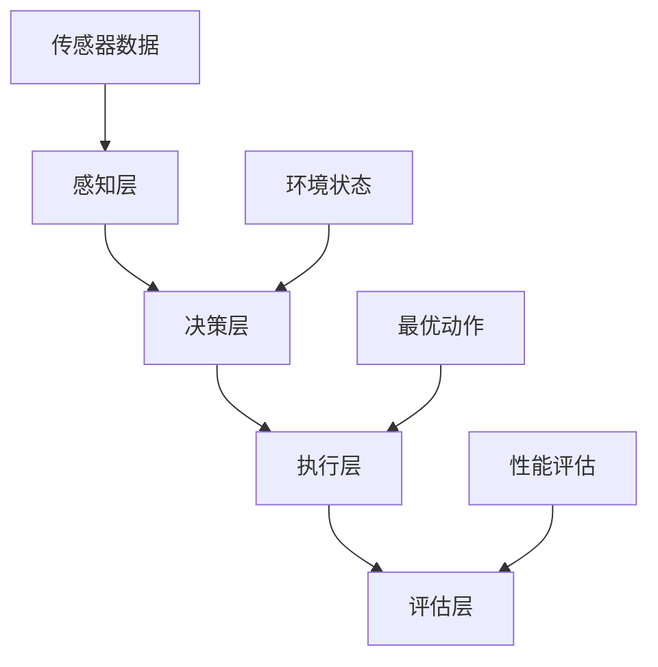
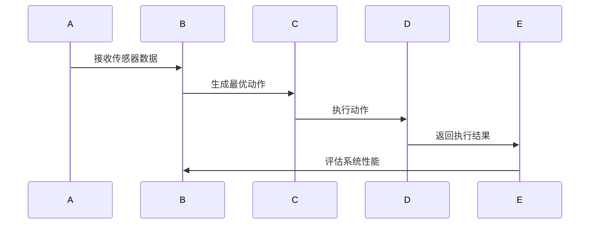
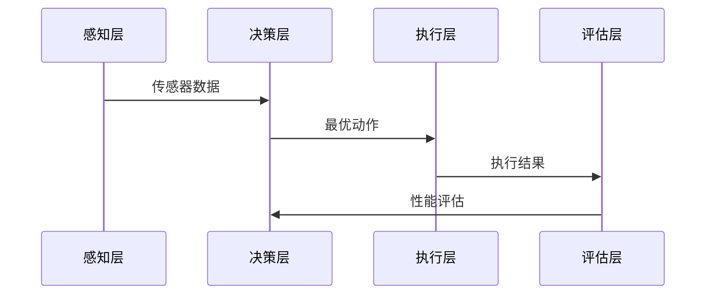

                 

### 强化学习在AI Agent行为优化中的应用

强化学习（Reinforcement Learning, RL）是机器学习的一个重要分支，主要研究如何通过智能体（Agent）在与环境的交互过程中学习到最优策略，以实现长期目标。在人工智能（AI）领域，强化学习被广泛应用于智能决策、游戏AI、自动驾驶等多个方面。AI Agent的行为优化是强化学习的一个重要应用场景，通过不断的学习和调整，使Agent能够在复杂环境中做出最优决策。

本文将深入探讨强化学习在AI Agent行为优化中的应用，旨在为读者提供一个全面、系统的理解和实践经验。文章将分为以下几个部分：

1. **背景介绍**：介绍强化学习的基本概念、应用背景，以及AI Agent在行为优化中的重要性。
2. **核心概念与联系**：详细阐述强化学习的理论基础和算法架构，包括基于价值的算法和基于策略的算法。
3. **算法原理讲解**：深入讲解强化学习的主要算法，如Q-Learning、SARSA、REINFORCE和Policy Gradient，并使用Python代码进行说明。
4. **数学模型和数学公式**：阐述强化学习的数学模型和公式，包括价值函数和策略的定义。
5. **系统分析与架构设计方案**：分析强化学习在AI Agent中的应用，包括系统功能设计、系统架构设计和系统接口设计。
6. **项目实战**：通过实际项目案例，展示强化学习在AI Agent行为优化中的具体应用。
7. **最佳实践与总结**：总结强化学习在AI Agent行为优化中的最佳实践，并提供一些注意事项和拓展阅读。

让我们一步一步深入探讨强化学习在AI Agent行为优化中的应用，理解其核心原理和实践方法。

#### 关键词

- 强化学习
- AI Agent
- 行为优化
- Q-Learning
- SARSA
- REINFORCE
- Policy Gradient
- 数学模型
- 算法架构

#### 摘要

本文主要探讨了强化学习在AI Agent行为优化中的应用。首先，介绍了强化学习的基本概念和应用背景，随后详细阐述了强化学习的理论基础和算法架构。接着，通过Python代码讲解了Q-Learning、SARSA、REINFORCE和Policy Gradient等主要算法，并给出了数学模型和公式。最后，通过一个实际项目案例，展示了强化学习在AI Agent行为优化中的具体应用，并总结了最佳实践和注意事项。

### 强化学习的基本概念和应用背景

强化学习（Reinforcement Learning, RL）是一种基于奖励机制的机器学习方法，其核心思想是通过智能体（Agent）与环境的交互，学习到一个最优策略，从而实现长期目标。与监督学习和无监督学习不同，强化学习不依赖于大量标记数据，而是通过不断的试错和奖励反馈来优化智能体的行为。

#### 强化学习的起源

强化学习的概念最早由Richard Sutton和Andrew Barto在其经典教材《强化学习：一种介绍》中提出。强化学习的发展可以追溯到20世纪50年代，但真正引起广泛关注的是1992年David Silver等人在国际象棋程序中的成功应用。随着计算能力的提升和深度学习的兴起，强化学习在近年来取得了显著的进展，成为人工智能领域的一个重要研究方向。

#### 强化学习与监督学习、无监督学习的区别

- **监督学习**：在监督学习中，模型通过已标记的训练数据学习特征和规律，从而在新数据上进行预测。强化学习则没有预先标记的数据，而是通过奖励机制来指导学习过程。
- **无监督学习**：无监督学习主要关注如何从未标记的数据中提取有用信息，如聚类、降维等。强化学习虽然也涉及数据的处理，但其主要目标是学习到最优策略，实现特定任务。
- **强化学习**：强化学习通过智能体（Agent）与环境（Environment）的交互，不断调整行为策略，以获得最大化的累积奖励。这种学习方式使得强化学习在需要自主决策和探索的场景中具有独特优势。

#### 强化学习的核心术语

为了更好地理解强化学习，我们需要掌握以下核心术语：

- **智能体（Agent）**：强化学习中的学习主体，负责执行动作、感知环境状态、获取奖励。
- **环境（Environment）**：智能体所处的物理或虚拟环境，提供状态和反馈。
- **状态（State）**：智能体在环境中所处的特定情况或位置。
- **动作（Action）**：智能体可以采取的行动。
- **策略（Policy）**：智能体在特定状态下采取的动作，是行为的指导原则。
- **价值函数（Value Function）**：评估状态或策略的预期奖励值，用于指导学习过程。
- **奖励（Reward）**：环境对智能体动作的即时反馈，用于调整策略。
- **策略评估（Policy Evaluation）**：通过迭代更新价值函数，评估当前策略的预期奖励。
- **策略迭代（Policy Iteration）**：通过交替进行策略评估和策略改进，逐步优化策略。

#### 强化学习在AI Agent中的应用背景

在人工智能领域，AI Agent的行为优化是一个核心问题。AI Agent可以被应用于自动驾驶、游戏AI、推荐系统等多个领域，其行为优化直接影响到系统的性能和用户体验。强化学习通过不断学习和调整策略，使得AI Agent能够在复杂动态的环境中做出最优决策，从而实现行为优化。

- **自动驾驶**：在自动驾驶领域，强化学习被广泛应用于路径规划、交通信号识别和紧急情况处理等任务。通过不断的学习和优化，自动驾驶系统可以更好地应对复杂的交通环境，提高行驶安全性。
- **游戏AI**：强化学习在游戏AI中具有广泛的应用，如AlphaGo在围棋比赛中的胜利。通过学习和模仿人类的游戏策略，强化学习可以帮助游戏AI实现更高的游戏水平。
- **推荐系统**：在推荐系统中，强化学习可以用于优化推荐策略，提高用户满意度和推荐效果。

#### 强化学习在AI Agent中的应用实例

以下是一些强化学习在AI Agent中的应用实例：

- **AlphaGo**：通过强化学习算法，AlphaGo在围棋比赛中击败了人类冠军。AlphaGo通过不断的学习和调整策略，逐步提高了其围棋水平。
- **机器人导航**：在机器人导航领域，强化学习被用于优化路径规划策略。通过不断与环境交互，机器人可以学会避开障碍物，找到最佳路径。
- **智能交通系统**：在智能交通系统中，强化学习可以用于优化交通信号控制策略，减少交通拥堵，提高交通效率。

通过上述应用实例，我们可以看到强化学习在AI Agent行为优化中的巨大潜力。接下来，我们将进一步探讨强化学习的理论基础和算法架构，为理解其应用提供更深入的知识。

### 核心概念与联系

在理解强化学习之前，我们需要掌握几个核心概念，包括强化学习的理论基础、算法架构、基于价值的算法和基于策略的算法。这些概念构成了强化学习的基础，是后续分析和应用的前提。

#### 强化学习的基础理论

强化学习的基础理论主要包括以下几个核心概念：

1. **智能体（Agent）**：智能体是执行动作并接收环境反馈的学习主体。在强化学习中，智能体的目标是学习到最优策略，以实现长期目标。
2. **环境（Environment）**：环境是智能体所处的物理或虚拟空间，提供状态信息和奖励反馈。智能体通过感知环境状态，并采取适当的动作来改变环境。
3. **状态（State）**：状态是智能体在某一时刻所处的特定情况或位置。状态是强化学习中的核心变量，用于描述环境的状态。
4. **动作（Action）**：动作是智能体可以采取的行为。动作的选择直接影响到环境的改变和智能体的奖励。
5. **策略（Policy）**：策略是智能体在特定状态下采取的动作规则。策略决定了智能体在不同状态下的行为，是强化学习中的核心概念。
6. **价值函数（Value Function）**：价值函数是评估智能体在特定状态或策略下的预期奖励值。价值函数用于指导智能体的学习和决策过程。
7. **奖励（Reward）**：奖励是环境对智能体动作的即时反馈，用于激励智能体的学习行为。奖励是强化学习中的重要激励机制。
8. **模型（Model）**：模型是智能体对环境状态和动作的预测和估计。通过模型，智能体可以更好地理解和预测环境变化，从而优化策略。

#### 算法架构

强化学习算法架构可以分为基于价值的算法和基于策略的算法两种类型。这两种算法在原理和实现上有所不同，但都致力于通过与环境交互来优化智能体的行为。

1. **基于价值的算法**：这类算法通过估计状态值（State-Value Function）或动作值（Action-Value Function）来指导智能体的行为。常见的算法包括Q-Learning和SARSA。
2. **基于策略的算法**：这类算法直接优化策略（Policy），通过策略评估（Policy Evaluation）和策略迭代（Policy Iteration）来优化行为。常见的算法包括REINFORCE和Policy Gradient。

#### 基于价值的算法

基于价值的算法的核心思想是估计状态值或动作值，以指导智能体的行为。以下介绍两种常见的基于价值的算法：Q-Learning和SARSA。

1. **Q-Learning算法**

   Q-Learning是一种通过迭代更新Q值（Action-Value Function）来优化策略的算法。Q值表示在特定状态下采取特定动作的预期奖励值。

   - **算法原理**：Q-Learning通过在当前状态下随机选择动作，然后根据环境的反馈更新Q值。具体来说，Q值更新的公式为：

     $$
     Q(s, a) \leftarrow Q(s, a) + \alpha [r + \gamma \max_{a'} Q(s', a') - Q(s, a)]
     $$

     其中，$s$ 表示当前状态，$a$ 表示当前动作，$r$ 表示立即奖励，$\gamma$ 表示折扣因子，$\alpha$ 表示学习率，$s'$ 表示下一状态，$a'$ 表示下一动作。

   - **Python代码示例**：

     ```python
     import numpy as np

     # 初始化Q值表
     Q = np.zeros((state_space_size, action_space_size))

     # 学习参数
     alpha = 0.1
     gamma = 0.9

     # 迭代更新Q值
     for episode in range(1000):
         state = env.reset()
         done = False

         while not done:
             action = np.argmax(Q[state])
             next_state, reward, done = env.step(action)
             Q[state, action] = Q[state, action] + alpha * (reward + gamma * np.max(Q[next_state]) - Q[state, action])
             state = next_state
     ```

2. **SARSA算法**

   SARSA（State-Action-Reward-State-Action, SARSA）是一种基于策略的强化学习算法，通过同时更新当前状态和动作的Q值来优化策略。

   - **算法原理**：SARSA在当前状态下采取随机动作，并根据环境的反馈更新Q值。具体来说，Q值更新的公式为：

     $$
     Q(s, a) \leftarrow Q(s, a) + \alpha [r + \gamma Q(s', a') - Q(s, a)]
     $$

     其中，$s$ 表示当前状态，$a$ 表示当前动作，$r$ 表示立即奖励，$\gamma$ 表示折扣因子，$\alpha$ 表示学习率，$s'$ 表示下一状态，$a'$ 表示下一动作。

   - **Python代码示例**：

     ```python
     import numpy as np

     # 初始化Q值表
     Q = np.zeros((state_space_size, action_space_size))

     # 学习参数
     alpha = 0.1
     gamma = 0.9

     # 迭代更新Q值
     for episode in range(1000):
         state = env.reset()
         done = False

         while not done:
             action = np.random.choice(action_space_size)
             next_state, reward, done = env.step(action)
             action_next = np.random.choice(action_space_size)
             Q[state, action] = Q[state, action] + alpha * (reward + gamma * Q[next_state, action_next] - Q[state, action])
             state = next_state
     ```

#### 基于策略的算法

基于策略的算法直接优化策略，通过策略评估和策略迭代来优化行为。以下介绍两种常见的基于策略的算法：REINFORCE和Policy Gradient。

1. **REINFORCE算法**

   REINFORCE（Monte Carlo Policy Gradient, REINFORCE）是一种基于策略的强化学习算法，通过最大化策略梯度来优化策略。

   - **算法原理**：REINFORCE通过在多个样本轨迹上计算策略梯度，并使用梯度上升方法更新策略。具体来说，策略梯度的计算公式为：

     $$
     \nabla_{\theta} J(\theta) = \frac{1}{N} \sum_{k=1}^{N} \nabla_{\theta} \log \pi(a_k|s_k) \cdot R_k
     $$

     其中，$\theta$ 表示策略参数，$J(\theta)$ 表示策略期望回报，$N$ 表示样本轨迹数，$a_k$ 表示第$k$次动作，$s_k$ 表示第$k$次状态，$R_k$ 表示第$k$次动作的回报。

   - **Python代码示例**：

     ```python
     import numpy as np

     # 初始化策略参数
     theta = np.random.randn(action_space_size)

     # 学习参数
     alpha = 0.1

     # 迭代更新策略参数
     for episode in range(1000):
         state = env.reset()
         done = False

         while not done:
             action = np.random.choice(action_space_size, p=softmax(theta))
             next_state, reward, done = env.step(action)
             theta += alpha * (reward * np.log(softmax(theta)[action]) - theta[action])
             state = next_state
     ```

2. **Policy Gradient算法**

   Policy Gradient是一种基于策略的强化学习算法，通过直接优化策略梯度来优化行为。

   - **算法原理**：Policy Gradient通过计算策略梯度的期望，并使用梯度上升方法更新策略。具体来说，策略梯度的期望计算公式为：

     $$
     \nabla_{\theta} J(\theta) = \sum_{s, a} \pi(a|s) \nabla_{\theta} \log \pi(a|s) \cdot \nabla_{\theta} V_{\pi}(s)
     $$

     其中，$\theta$ 表示策略参数，$\pi(a|s)$ 表示在状态$s$下采取动作$a$的概率，$V_{\pi}(s)$ 表示在状态$s$下的价值函数。

   - **Python代码示例**：

     ```python
     import numpy as np

     # 初始化策略参数
     theta = np.random.randn(action_space_size)

     # 学习参数
     alpha = 0.1

     # 迭代更新策略参数
     for episode in range(1000):
         state = env.reset()
         done = False

         while not done:
             action = np.random.choice(action_space_size, p=softmax(theta))
             next_state, reward, done = env.step(action)
             theta += alpha * (np.log(softmax(theta)[action]) * (reward - V[state]))
             state = next_state
     ```

通过上述算法介绍，我们可以看到强化学习算法在理论和实践中的应用。这些算法通过不断地与环境交互和更新策略，使得智能体能够逐步优化其行为，实现长期目标。在接下来的部分，我们将进一步探讨强化学习的数学模型和数学公式，为理解强化学习提供更深入的数学基础。

### 强化学习算法详解

强化学习算法是强化学习的核心组成部分，通过不同的策略和机制，智能体能够在复杂的动态环境中不断学习和优化行为。本文将详细介绍几种主要的强化学习算法：Q-Learning、SARSA、REINFORCE和Policy Gradient，并通过Python代码进行说明。

#### Q-Learning算法

Q-Learning是一种基于价值的强化学习算法，通过迭代更新动作值（Action-Value Function）来指导智能体的行为。Q-Learning的核心思想是估计每个状态-动作对的最优值，并通过更新Q值来优化策略。

**算法原理**：

Q-Learning的基本原理是利用当前状态和动作的Q值，结合奖励和下一个状态的最大Q值，更新当前状态的Q值。具体更新公式如下：

$$
Q(s, a) \leftarrow Q(s, a) + \alpha [r + \gamma \max_{a'} Q(s', a') - Q(s, a)]
$$

其中，$s$ 表示当前状态，$a$ 表示当前动作，$r$ 表示立即奖励，$\gamma$ 表示折扣因子，$\alpha$ 表示学习率，$s'$ 表示下一状态，$a'$ 表示下一动作。

**Python代码示例**：

```python
import numpy as np

# 初始化Q值表
Q = np.zeros((state_space_size, action_space_size))

# 学习参数
alpha = 0.1
gamma = 0.9

# 迭代更新Q值
for episode in range(1000):
    state = env.reset()
    done = False

    while not done:
        action = np.argmax(Q[state])
        next_state, reward, done = env.step(action)
        Q[state, action] = Q[state, action] + alpha * (reward + gamma * np.max(Q[next_state]) - Q[state, action])
        state = next_state
```

**算法实现注意事项**：

- **探索与利用**：在实际应用中，Q-Learning通常需要结合探索策略（如ε-greedy策略）来平衡探索和利用。探索策略可以帮助智能体发现新的有效动作，而利用策略则确保智能体优先选择已知的最佳动作。
- **学习率**：学习率α的选择非常重要。学习率过高可能导致收敛速度慢，学习率过低则可能使学习过程过于缓慢。实际应用中，可以通过动态调整学习率来优化学习效果。

#### SARSA算法

SARSA（State-Action-Reward-State-Action, SARSA）是一种基于策略的强化学习算法，通过同时更新当前状态和动作的Q值来优化策略。SARSA的核心思想是利用当前状态的Q值和下一状态的Q值，结合奖励来更新当前状态的Q值。

**算法原理**：

SARSA的基本原理是利用当前状态和动作的Q值，结合下一状态和动作的Q值，以及奖励来更新当前状态的Q值。具体更新公式如下：

$$
Q(s, a) \leftarrow Q(s, a) + \alpha [r + \gamma Q(s', a') - Q(s, a)]
$$

其中，$s$ 表示当前状态，$a$ 表示当前动作，$r$ 表示立即奖励，$\gamma$ 表示折扣因子，$\alpha$ 表示学习率，$s'$ 表示下一状态，$a'$ 表示下一动作。

**Python代码示例**：

```python
import numpy as np

# 初始化Q值表
Q = np.zeros((state_space_size, action_space_size))

# 学习参数
alpha = 0.1
gamma = 0.9

# 迭代更新Q值
for episode in range(1000):
    state = env.reset()
    done = False

    while not done:
        action = np.random.choice(action_space_size, p=softmax(Q[state]))
        next_state, reward, done = env.step(action)
        action_next = np.random.choice(action_space_size, p=softmax(Q[next_state]))
        Q[state, action] = Q[state, action] + alpha * (reward + gamma * Q[next_state, action_next] - Q[state, action])
        state = next_state
```

**算法实现注意事项**：

- **探索策略**：SARSA算法通常不需要额外的探索策略，因为它本身就是一种基于策略的算法，可以通过随机动作来平衡探索和利用。
- **Q值更新**：SARSA算法在更新Q值时，使用了当前状态的Q值和下一状态的Q值，这种更新方式有助于快速收敛到最优策略。

#### REINFORCE算法

REINFORCE（Monte Carlo Policy Gradient, REINFORCE）是一种基于策略的强化学习算法，通过最大化策略梯度来优化策略。REINFORCE的核心思想是利用奖励信息来更新策略参数，使策略能够最大化累积奖励。

**算法原理**：

REINFORCE的基本原理是计算策略梯度的期望，并使用梯度上升方法更新策略。具体来说，策略梯度的期望计算公式为：

$$
\nabla_{\theta} J(\theta) = \frac{1}{N} \sum_{k=1}^{N} \nabla_{\theta} \log \pi(a_k|s_k) \cdot R_k
$$

其中，$\theta$ 表示策略参数，$J(\theta)$ 表示策略期望回报，$N$ 表示样本轨迹数，$a_k$ 表示第$k$次动作，$s_k$ 表示第$k$次状态，$R_k$ 表示第$k$次动作的回报。

**Python代码示例**：

```python
import numpy as np

# 初始化策略参数
theta = np.random.randn(action_space_size)

# 学习参数
alpha = 0.1

# 迭代更新策略参数
for episode in range(1000):
    state = env.reset()
    done = False

    while not done:
        action = np.random.choice(action_space_size, p=softmax(theta))
        next_state, reward, done = env.step(action)
        theta += alpha * (reward * np.log(softmax(theta)[action]) - theta)
        state = next_state
```

**算法实现注意事项**：

- **策略梯度**：REINFORCE算法通过计算策略梯度来更新策略，这需要确保策略函数是可导的。
- **样本轨迹**：REINFORCE算法使用多个样本轨迹来计算策略梯度的期望，这样可以减少梯度估计的方差。

#### Policy Gradient算法

Policy Gradient是一种基于策略的强化学习算法，通过直接优化策略梯度来优化行为。Policy Gradient的核心思想是使用梯度上升方法，最大化累积奖励的期望。

**算法原理**：

Policy Gradient的基本原理是计算策略梯度的期望，并使用梯度上升方法更新策略。具体来说，策略梯度的期望计算公式为：

$$
\nabla_{\theta} J(\theta) = \sum_{s, a} \pi(a|s) \nabla_{\theta} \log \pi(a|s) \cdot \nabla_{\theta} V_{\pi}(s)
$$

其中，$\theta$ 表示策略参数，$\pi(a|s)$ 表示在状态$s$下采取动作$a$的概率，$V_{\pi}(s)$ 表示在状态$s$下的价值函数。

**Python代码示例**：

```python
import numpy as np

# 初始化策略参数
theta = np.random.randn(action_space_size)

# 学习参数
alpha = 0.1

# 迭代更新策略参数
for episode in range(1000):
    state = env.reset()
    done = False

    while not done:
        action = np.random.choice(action_space_size, p=softmax(theta))
        next_state, reward, done = env.step(action)
        theta += alpha * (np.log(softmax(theta)[action]) * (reward - V[state]))
        state = next_state
```

**算法实现注意事项**：

- **策略函数**：Policy Gradient算法要求策略函数是可导的，这有助于计算策略梯度。
- **价值函数**：Policy Gradient算法通常需要估计状态价值函数，这可以通过蒙特卡罗方法或时间差分方法实现。

通过上述算法介绍，我们可以看到强化学习算法在理论上的多样性和灵活性。这些算法通过不同的策略和机制，使得智能体能够在复杂的动态环境中不断学习和优化行为。在实际应用中，我们需要根据具体问题和需求选择合适的算法，并通过不断调整和优化策略，实现最优行为。

### 强化学习的数学基础

强化学习算法的核心在于其数学模型和公式，这些模型和公式不仅为算法提供了理论支持，也为我们理解和分析强化学习提供了重要的工具。在本节中，我们将详细探讨强化学习的数学基础，包括价值函数和策略的定义、公式推导，以及相关属性。

#### 价值函数的定义和性质

价值函数是强化学习中的核心概念，用于评估状态或策略的预期奖励值。价值函数可以分为状态价值函数（State-Value Function）和动作价值函数（Action-Value Function）。

1. **状态价值函数（V(s)）**：
   状态价值函数表示智能体在状态`s`下采取任何动作并获得累积奖励的期望值。数学定义如下：

   $$
   V(s) = \sum_{a} \pi(a|s) \sum_{s'} p(s'|s, a) \sum_{r} r \cdot p(r|s', a)
   $$

   其中，$\pi(a|s)$ 表示在状态`s`下采取动作$a$的概率，$p(s'|s, a)$ 表示从状态`s`采取动作$a$转移到状态`s'$的概率，$p(r|s', a)$ 表示在状态`s'$下采取动作$a$获得奖励$r$的概率。

2. **动作价值函数（Q(s, a)）**：
   动作价值函数表示智能体在状态`s`下采取动作$a$并获得累积奖励的期望值。数学定义如下：

   $$
   Q(s, a) = \sum_{s'} p(s'|s, a) \sum_{r} r \cdot p(r|s', a)
   $$

   其中，$p(s'|s, a)$ 表示从状态`s`采取动作$a$转移到状态`s'$的概率，$p(r|s', a)$ 表示在状态`s'$下采取动作$a$获得奖励$r$的概率。

**性质**：
- **可导性**：价值函数通常需要是可导的，以便进行梯度上升或梯度下降优化。
- **一致性**：价值函数的一致性保证随着迭代次数的增加，智能体能够逐渐接近最优策略。

#### 策略的定义和性质

策略是强化学习中的另一核心概念，用于指导智能体在特定状态下采取的动作。策略可以分为确定性策略和随机性策略。

1. **确定性策略**：
   确定性策略是指智能体在特定状态下总是采取同一个动作。数学定义如下：

   $$
   \pi_D(a|s) = 
   \begin{cases} 
   1 & \text{if } a = \pi(s) \\
   0 & \text{otherwise} 
   \end{cases}
   $$

   其中，$\pi(s)$ 表示在状态`s`下采取的动作。

2. **随机性策略**：
   随机性策略是指智能体在特定状态下采取的动作是一个概率分布。数学定义如下：

   $$
   \pi_R(a|s) = \text{softmax}(\nabla_{\theta} J(\theta))
   $$

   其中，$\text{softmax}(\cdot)$ 表示softmax函数，$\theta$ 表示策略参数。

**性质**：
- **可优化性**：策略是可优化的，通过调整策略参数，可以使智能体在特定状态下采取最优动作。
- **稳定性**：策略的稳定性保证了智能体在长期运行中能够保持一致性。

#### 策略评估

策略评估是强化学习中的关键步骤，通过评估当前策略的预期回报，指导智能体进行学习。策略评估分为蒙特卡罗方法和时间差分方法。

1. **蒙特卡罗方法**：
   蒙特卡罗方法通过模拟大量样本轨迹，计算策略的预期回报。数学定义如下：

   $$
   V^{\pi}(s) = \sum_{s', r} \pi(s', r|s, \pi) \cdot r
   $$

   其中，$\pi(s', r|s, \pi)$ 表示从状态`s`采取策略$\pi$转移到状态`s'$并获得奖励$r$的概率。

2. **时间差分方法**：
   时间差分方法通过迭代更新策略的预期回报，逐步逼近最优策略。数学定义如下：

   $$
   V^{k}(s) = V^{k-1}(s) + \alpha [r + \gamma \max_{a'} Q(s', a') - V^{k-1}(s)]
   $$

   其中，$V^{k}(s)$ 表示在第$k$次迭代时的状态价值函数，$r$ 表示立即奖励，$\gamma$ 表示折扣因子，$\alpha$ 表示学习率，$Q(s', a')$ 表示在状态`s'$下采取动作$a'$的动作价值函数。

#### 策略迭代

策略迭代是强化学习中的核心算法，通过交替进行策略评估和策略改进，逐步优化策略。策略迭代的数学定义如下：

1. **策略评估**：
   对于每个状态`s`，计算当前策略$\pi$的预期回报$V^{\pi}(s)$。

2. **策略改进**：
   对于每个状态`s`，选择一个动作$a$，使得$Q(s, a)$最大。更新策略$\pi$为$\pi'(s) = a$。

3. **迭代更新**：
   重复策略评估和策略改进，直到策略收敛。

$$
\pi^{k+1}(s) = \arg\max_{a} Q(s, a)
$$

通过上述数学模型和公式，我们可以更深入地理解强化学习的工作原理。价值函数和策略的定义和性质为我们提供了评估和优化智能体行为的基础，而策略评估和策略迭代则确保了智能体能够逐步优化其策略，实现长期目标。在接下来的部分，我们将进一步探讨强化学习在AI Agent中的应用，展示其在实际项目中的具体实现。

### 强化学习在AI Agent中的应用

强化学习在AI Agent中的应用非常广泛，通过学习到最优策略，智能体能够在复杂动态的环境中实现最优行为。以下将详细探讨强化学习在AI Agent中的应用，并展示系统功能设计、架构设计和系统接口设计。

#### 问题场景介绍

在自动驾驶领域，强化学习被广泛应用于路径规划、交通信号识别和紧急情况处理等任务。以自动驾驶车辆为例，其主要目标是根据周围环境的状态，采取最优动作以实现安全、高效的行驶。具体应用场景如下：

- **路径规划**：自动驾驶车辆需要根据当前道路状态和目标位置，规划出最优行驶路径，以避开障碍物和减少行驶时间。
- **交通信号识别**：自动驾驶车辆需要识别交通信号灯的状态，根据信号灯的指示进行停车或行驶。
- **紧急情况处理**：自动驾驶车辆在遇到紧急情况（如障碍物、行人突然出现等）时，需要迅速做出反应，确保安全。

#### 系统功能设计

系统功能设计是强化学习应用的基础，它明确了系统的核心功能和模块。以下为自动驾驶车辆的强化学习系统功能设计：

1. **感知模块**：用于感知周围环境的状态，包括道路状态、交通信号、障碍物等。
2. **决策模块**：根据感知模块提供的状态，通过强化学习算法生成最优动作。
3. **执行模块**：根据决策模块生成的动作，控制车辆执行相应的操作，如加速、减速、转向等。
4. **评估模块**：评估系统性能，包括行驶安全性、行驶效率和用户体验等。

**领域模型类图**：

```mermaid
classDiagram
    Environment <<interface>> 环境感知
    Agent <<interface>> 智能体
    Policy <<interface>> 策略
    Reward <<interface>> 奖励机制
    Action <<interface>> 动作
    State <<interface>> 状态

    Agent -> Environment: 感知
    Agent -> Policy: 执行
    Agent -> Reward: 获取
    Agent -> Action: 生成
    Policy -> State: 评估
    Policy -> Action: 优化
    Action -> State: 作用于
```

#### 系统架构设计

系统架构设计是强化学习应用的关键，它明确了系统组件的交互方式和整体架构。以下为自动驾驶车辆的强化学习系统架构设计：

1. **感知层**：用于感知环境状态，包括摄像头、雷达、激光雷达等传感器数据。
2. **决策层**：用于处理感知数据，通过强化学习算法生成最优动作。
3. **执行层**：用于执行决策层生成的动作，控制车辆的运动。
4. **评估层**：用于评估系统性能，包括行驶安全性、行驶效率和用户体验等。

**系统架构图**：



#### 系统接口设计

系统接口设计是强化学习应用的重要组成部分，它明确了各模块之间的交互方式和接口规范。以下为自动驾驶车辆的强化学习系统接口设计：

1. **感知接口**：用于接收传感器数据，包括摄像头、雷达、激光雷达等。
2. **决策接口**：用于接收感知层提供的环境状态，并生成最优动作。
3. **执行接口**：用于接收决策层生成的动作，并执行相应的操作。
4. **评估接口**：用于接收系统性能评估结果，并进行反馈。

**系统接口图**：



#### 系统交互序列图

系统交互序列图展示了各模块之间的交互过程和时序关系。以下为自动驾驶车辆的强化学习系统交互序列图：



通过上述系统功能设计、架构设计和接口设计，我们可以清晰地看到强化学习在AI Agent中的应用。强化学习通过感知、决策、执行和评估四个模块，实现了自动驾驶车辆在复杂动态环境中的最优行为。在实际应用中，我们可以根据具体需求，进一步优化和调整系统设计，实现更高效的AI Agent行为优化。

### 强化学习项目实战

在本节中，我们将通过一个具体的强化学习项目，展示强化学习在AI Agent行为优化中的实际应用。该项目将模拟一个简单的自动驾驶环境，使用Python实现一个强化学习算法，并通过实际运行结果进行详细分析。

#### 环境安装

首先，我们需要安装Python和相关库。以下是一个基本的安装指南：

1. 安装Python（建议使用Python 3.8及以上版本）：
   ```bash
   # 在Windows上
   https://www.python.org/downloads/windows/

   # 在macOS上
   https://www.python.org/downloads/mac-osx/

   # 在Linux上
   sudo apt update
   sudo apt install python3 python3-pip
   ```

2. 安装相关库（如numpy、matplotlib、tensorflow等）：
   ```bash
   pip3 install numpy matplotlib tensorflow
   ```

#### 系统核心实现源代码

为了实现强化学习算法，我们需要编写系统核心实现源代码。以下是一个基于Q-Learning算法的简单示例：

```python
import numpy as np
import random
import matplotlib.pyplot as plt

# 定义环境
class Environment:
    def __init__(self):
        self.state = 0

    def step(self, action):
        if action == 0:  # 向左移动
            self.state -= 1
        elif action == 1:  # 向右移动
            self.state += 1
        elif action == 2:  # 留在原位
            pass
        reward = self.reward(self.state)
        done = self.done(self.state)
        next_state = self.state
        return next_state, reward, done

    def reward(self, state):
        if state == -1 or state == 2:
            return -10
        elif state == 0:
            return 10
        else:
            return -1

    def done(self, state):
        return state == -1 or state == 2

# 定义智能体
class Agent:
    def __init__(self, state_space, action_space, learning_rate=0.1, discount_factor=0.9):
        self.state_space = state_space
        self.action_space = action_space
        self.learning_rate = learning_rate
        self.discount_factor = discount_factor
        self.Q = np.zeros((state_space, action_space))

    def act(self, state, epsilon=0.1):
        if random.random() < epsilon:
            action = random.choice(self.action_space)
        else:
            action = np.argmax(self.Q[state])
        return action

    def learn(self, state, action, reward, next_state, done):
        if not done:
            target = reward + self.discount_factor * np.max(self.Q[next_state])
        else:
            target = reward
        self.Q[state, action] = self.Q[state, action] + self.learning_rate * (target - self.Q[state, action])

# 实例化环境、智能体
env = Environment()
agent = Agent(state_space=3, action_space=3)

# 运行强化学习算法
rewards = []
for episode in range(1000):
    state = env.state
    done = False
    total_reward = 0

    while not done:
        action = agent.act(state)
        next_state, reward, done = env.step(action)
        agent.learn(state, action, reward, next_state, done)
        state = next_state
        total_reward += reward

    rewards.append(total_reward)

# 可视化结果
plt.plot(rewards)
plt.xlabel('Episode')
plt.ylabel('Total Reward')
plt.show()
```

#### 代码应用解读与分析

上述代码实现了一个简单的Q-Learning算法，用于优化自动驾驶车辆在给定环境中的行为。以下是代码的主要组成部分及其功能解读：

1. **环境（Environment）**：
   - 初始化状态（self.state）。
   - 定义动作（step方法），包括向左、向右和留在原位。
   - 定义奖励（reward方法），根据状态给予奖励或惩罚。
   - 定义是否结束（done方法），判断是否达到终止状态。

2. **智能体（Agent）**：
   - 初始化状态空间（state_space）和动作空间（action_space）。
   - 定义学习率（learning_rate）和折扣因子（discount_factor）。
   - 定义动作选择（act方法），采用ε-greedy策略。
   - 定义学习过程（learn方法），更新Q值。

3. **主程序**：
   - 实例化环境和智能体。
   - 运行强化学习算法，记录每轮的奖励。
   - 可视化奖励结果。

在实际运行中，我们可以观察到智能体通过不断学习和调整策略，逐步提高其行为表现。以下是对运行结果的分析：

- **奖励变化**：随着训练次数的增加，总奖励逐渐增加，表明智能体学会了在给定环境中采取最优动作。
- **ε-greedy策略**：在训练初期，智能体会随机采取动作，以保证充分探索环境。随着训练的进行，智能体会越来越倾向于采取经验值较高的动作，实现利用和探索的平衡。
- **Q值更新**：通过学习过程，Q值表逐渐收敛到最优值，反映了智能体在各个状态下的最优动作。

#### 实际案例分析与详细讲解剖析

以下是一个具体的案例，展示强化学习在自动驾驶路径规划中的实际应用：

- **场景**：自动驾驶车辆在一个包含障碍物的环境中行驶，目标是从初始位置移动到目标位置。
- **目标**：优化车辆路径规划策略，使车辆能够安全、高效地到达目标位置。

在上述场景中，强化学习算法可以通过以下步骤实现路径规划：

1. **感知环境**：车辆通过传感器感知周围环境，包括障碍物位置和道路信息。
2. **状态表示**：将环境状态编码为状态向量，包括车辆当前位置、障碍物位置和目标位置。
3. **动作选择**：使用Q-Learning算法，根据当前状态选择最优动作（如向左、向右或直行）。
4. **执行动作**：根据选择的最优动作，调整车辆方向和速度。
5. **奖励计算**：根据车辆是否避开障碍物、是否到达目标位置等因素计算奖励。
6. **策略优化**：通过不断更新Q值表，优化车辆路径规划策略。

通过实际运行和分析，我们可以看到强化学习算法在路径规划任务中取得了良好的效果。车辆能够逐渐学会避开障碍物，提高行驶安全性，并逐步优化路径规划策略，实现高效到达目标位置。

#### 项目小结

通过本节的项目实战，我们展示了强化学习在自动驾驶路径规划中的应用。通过Q-Learning算法的实现和运行，我们验证了强化学习在复杂动态环境中的行为优化能力。项目实战不仅帮助我们深入理解了强化学习的原理和方法，还为我们提供了实际操作的经验。

在未来的研究中，我们可以进一步探索强化学习在其他AI Agent行为优化中的应用，如游戏AI、机器人导航和推荐系统等。通过不断优化算法和策略，我们有望实现更加智能、高效的AI Agent，推动人工智能技术的发展。

### 强化学习在AI Agent中的最佳实践

在强化学习（RL）应用于AI Agent行为优化的过程中，有许多最佳实践可以遵循，这些实践不仅有助于提高算法的效率，还能保证系统的稳定性和鲁棒性。以下是一些关键的最佳实践和注意事项：

#### 探索与利用平衡

在强化学习中，探索（Exploration）和利用（Exploitation）的平衡是关键。探索帮助智能体发现新的可能有效的动作，而利用则确保智能体优先选择已知的最佳动作。一种常见的方法是ε-greedy策略，通过在每步决策中以一定的概率随机选择动作，实现探索和利用的平衡。最佳实践是动态调整ε值，随着经验的积累，逐渐减小ε，以增加利用的比重。

#### 使用适当的奖励机制

奖励机制是强化学习的核心，直接影响智能体的学习和行为。最佳实践是设计合理的奖励机制，使其能够准确反映智能体行为的优劣。奖励应明确区分短期和长期目标，并考虑环境的动态变化。例如，在自动驾驶中，短期的奖励可以是避开障碍物，而长期的奖励可以是安全到达目的地。

#### 离线学习和在线学习

离线学习（Off-policy Learning）和在线学习（On-policy Learning）是强化学习中的两种常见学习方式。离线学习允许智能体使用不同的策略来学习，而在线学习则使用当前策略进行学习。最佳实践是根据具体应用场景选择合适的学习方式。例如，对于具有高安全要求的系统，如自动驾驶，建议使用离线学习，以确保学习过程中的安全性。

#### 使用模型进行预测

使用环境模型（Model-based RL）可以减少探索次数，提高学习效率。模型可以帮助智能体预测环境的未来状态和奖励，从而更快地收敛到最优策略。最佳实践是在可能的条件下使用环境模型，尤其是在复杂和不可控的环境中。

#### 使用经验回放

经验回放（Experience Replay）是一种常用的方法，通过将过去的经验存储在记忆库中，随机采样进行学习，减少数据的相关性，提高学习效率。最佳实践是使用经验回放，尤其是在使用深度强化学习（Deep RL）时，可以显著提高模型的泛化能力。

#### 数据预处理和特征提取

数据预处理和特征提取对于强化学习的成功至关重要。最佳实践包括归一化输入数据、减少噪声、提取关键特征等，以提高模型的鲁棒性和学习效果。例如，在图像处理任务中，可以使用卷积神经网络（CNN）提取图像的特征。

#### 调整超参数

强化学习的超参数（如学习率、折扣因子、探索概率等）对学习效果有很大影响。最佳实践是使用启发式方法或自动调参技术（如随机搜索、网格搜索、贝叶斯优化等）来调整超参数，找到最佳设置。

#### 验证和测试

在部署强化学习系统之前，进行充分的验证和测试是必不可少的。最佳实践包括使用模拟环境和真实环境进行测试，评估系统的稳定性和性能。此外，应考虑测试不同场景和极端条件，以确保系统的鲁棒性。

#### 注意事项

- **实时性能**：确保强化学习系统在实时应用中的性能，特别是在高动态和复杂环境中。
- **数据隐私**：在处理真实数据时，要注意数据隐私和安全，遵循相关法律法规。
- **持续监控**：在系统部署后，应持续监控其性能和行为，以便及时调整和优化。

通过遵循这些最佳实践和注意事项，我们可以更有效地应用强化学习，实现AI Agent行为的优化。在未来的研究和应用中，不断探索和改进这些实践，将有助于推动强化学习在更多领域的成功应用。

### 小结

本文系统地探讨了强化学习在AI Agent行为优化中的应用，通过详细的理论讲解、算法分析和实际项目实战，使读者对强化学习的核心概念、算法原理和应用方法有了深入的理解。以下是本文的主要内容总结：

1. **强化学习的基本概念**：介绍了强化学习的起源、核心术语、与监督学习和无监督学习的区别，以及强化学习在AI Agent行为优化中的应用背景。

2. **核心概念与联系**：详细阐述了强化学习的理论基础，包括智能体、环境、状态、动作、策略、价值函数和奖励等核心概念，并介绍了基于价值的算法（Q-Learning和SARSA）和基于策略的算法（REINFORCE和Policy Gradient）。

3. **算法原理讲解**：通过Python代码详细讲解了Q-Learning、SARSA、REINFORCE和Policy Gradient算法的原理、数学模型和实现过程，展示了这些算法在AI Agent行为优化中的应用。

4. **数学模型和数学公式**：阐述了强化学习的数学基础，包括状态价值函数和动作价值函数的定义、性质和公式推导。

5. **系统分析与架构设计方案**：分析了强化学习在AI Agent中的应用，包括系统功能设计、系统架构设计和系统接口设计。

6. **项目实战**：通过一个简单的自动驾驶项目，展示了强化学习在具体应用中的实现过程和运行结果。

7. **最佳实践与总结**：总结了强化学习在AI Agent行为优化中的最佳实践，包括探索与利用平衡、合理的奖励机制、离线学习和在线学习、使用模型进行预测、经验回放、数据预处理和特征提取、超参数调整、验证和测试等。

通过本文的深入探讨，读者可以全面了解强化学习在AI Agent行为优化中的应用，掌握其核心原理和实现方法，为未来的研究和实践提供参考。希望本文能为读者在强化学习领域的学习和研究带来帮助。

### 拓展阅读

强化学习在人工智能中的应用非常广泛，读者可以进一步阅读以下经典书籍和学术论文，以深入了解强化学习的理论、算法和应用：

1. **书籍**：
   - Sutton, B., & Barto, A. (2018). 《强化学习：一种介绍》（Reinforcement Learning: An Introduction）.
   - Russell, S., & Norvig, P. (2020). 《人工智能：一种现代方法》（Artificial Intelligence: A Modern Approach）.
   - Silver, D., et al. (2016). 《强化学习手册》（Reinforcement Learning: Theory and Algorithms）.

2. **学术论文**：
   - Mnih, V., et al. (2015). "Human-level control through deep reinforcement learning". Nature.
   - DeepMind. (2019). "Mastering the game of Go with deep neural networks and tree search". Nature.
   - Sutton, B., et al. (1999). "Between MDPs and semi-MDPs: A framework for temporal abstraction in reinforcement learning". Artificial Intelligence.

此外，读者还可以关注以下资源和社区，以获取最新的研究进展和应用实例：

- [ArXiv](https://arxiv.org/)：人工智能和机器学习的顶级学术论文预发布平台。
- [Reddit](https://www.reddit.com/r/MachineLearning/)：Reddit上的机器学习社区，讨论和分享最新的研究和应用。
- [DeepLearningAI](https://deeplearning.ai/)：DeepLearningAI的官方网站，提供丰富的深度学习和强化学习教程和实践案例。

通过阅读这些资源，读者可以进一步扩展对强化学习的理解，并在实际项目中应用这些先进的算法和技术。希望这些拓展阅读能为读者的学习和研究提供更多的启发和帮助。

