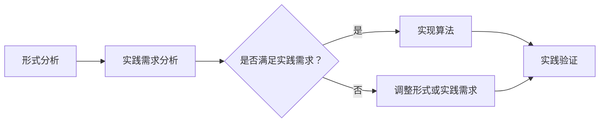
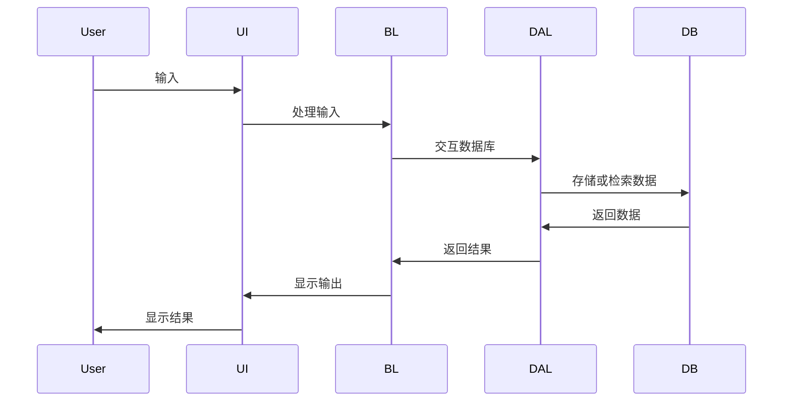
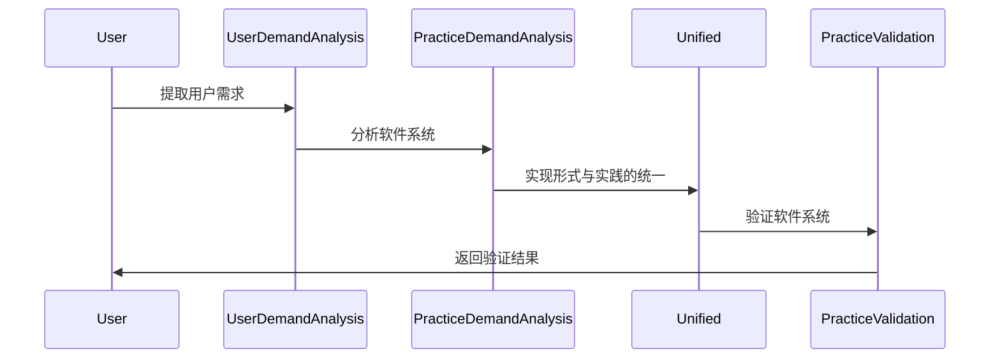
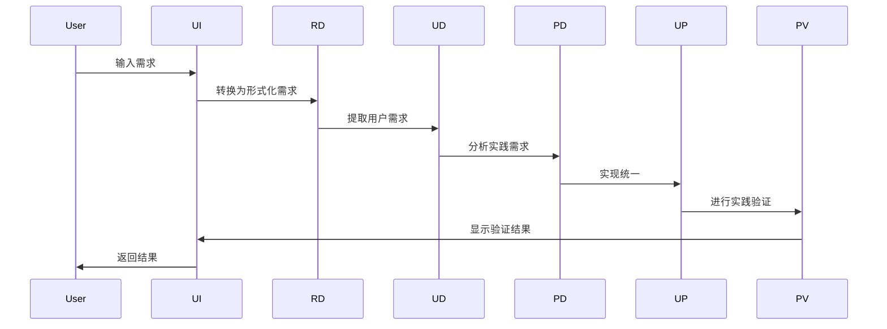

                 

# 《形式与实践的统一：维特根斯坦的哲学实践观与FP的理论与应用结合》

关键词：维特根斯坦、哲学实践观、FP理论、形式与实践、编程范式

摘要：本文将探讨维特根斯坦的哲学实践观与函数式编程（FP）理论的结合，通过分析二者在形式与实践的统一方面的共同点，阐述FP理论在编程实践中的应用价值。文章首先介绍了维特根斯坦的哲学实践观及其在计算机科学领域的影响，然后对比FP理论的基本概念和原则，进一步探讨二者的结合点及其在编程实践中的实际应用。

## 第1章 引言与背景介绍

### 1.1 维特根斯坦的哲学实践观

1.1.1 维特根斯坦的生平与哲学贡献

路德维希·维特根斯坦（Ludwig Wittgenstein）是20世纪最具影响力的哲学家之一，出生于1889年4月26日，逝世于1951年4月29日。他的哲学思想主要分为两个阶段：早期和晚期。

早期维特根斯坦的主要著作是《逻辑哲学论》（Tractatus Logico-Philosophicus），他在书中提出了“语言游戏”的概念，认为语言的意义在于使用者的实际使用，而非抽象的逻辑体系。这一观点对后来的分析哲学和语言哲学产生了深远的影响。

晚期维特根斯坦则转向了日常语言哲学，他的代表作是《哲学研究》（Philosophical Investigations）。在这一阶段，他强调了哲学问题解决的实践性，认为哲学的任务是澄清日常语言的使用。

1.1.2 维特根斯坦的哲学实践观概述

维特根斯坦的哲学实践观强调形式与实践的统一。他认为，哲学问题并非抽象的概念推理，而是涉及实际语言使用的实践问题。哲学的任务不是提出新的理论，而是澄清和解决实际语言使用中的问题。

维特根斯坦的哲学实践观对计算机科学产生了重要影响。他提出的“语言游戏”概念为程序设计提供了新的视角，使得计算机编程被视为一种形式化的语言游戏。同时，他关于形式与实践统一的思想也为函数式编程（FP）理论的发展提供了理论基础。

### 1.2 FP理论的基本概念

1.2.1 FP理论的起源与发展

函数式编程（Functional Programming，简称FP）起源于20世纪50年代，由赫尔曼·亨廷顿（Herman Goldstine）和约翰·麦卡锡（John McCarthy）等人提出。FP的核心思想是将计算视为函数的执行，而非指令的执行。

FP理论在20世纪60年代和70年代得到了快速发展，尤其是Lisp编程语言的问世，使得FP理论得以在实际编程中得到应用。此后，FP理论逐渐与其他编程范式结合，形成了诸如函数式响应式编程（FRP）等新的编程范式。

1.2.2 FP理论的核心思想与原则

FP理论的核心思想包括：

1. 函数是一等公民：在FP中，函数被视为一等对象，可以传递、存储和返回其他函数。

2. 无状态函数：FP强调使用无状态函数，这样可以避免状态污染和并发问题。

3. 惰性求值：FP采用惰性求值策略，只有在必要的时候才会进行计算，这样可以避免不必要的计算。

4. 函数组合：FP鼓励使用函数组合来构建复杂的计算过程，这样可以提高代码的可读性和复用性。

### 1.3 维特根斯坦哲学实践观与FP理论的结合

1.3.1 结合的必要性与重要性

维特根斯坦的哲学实践观与FP理论的结合具有重要意义。首先，FP理论中的函数式编程范式与维特根斯坦的形式与实践统一思想具有相似之处，二者都强调形式与实践的统一。其次，FP理论的核心理念可以应用于实际编程中，解决编程中的实际问题。维特根斯坦的哲学实践观为FP理论提供了理论支持，使得FP理论更加符合实际编程的需求。

1.3.2 结合的理论基础与实践意义

维特根斯坦的哲学实践观为FP理论提供了理论基础。维特根斯坦强调形式与实践的统一，认为哲学问题的解决需要从实际语言使用出发。FP理论中的函数式编程范式也强调形式与实践的统一，将计算视为函数的执行，而非指令的执行。这种思想与维特根斯坦的哲学实践观不谋而合。

在实践中，FP理论的应用可以带来以下几个方面的好处：

1. 提高代码可读性和可维护性：FP理论中的函数组合和无状态函数可以使得代码更加简洁、易于理解和维护。

2. 降低并发问题：FP理论中的惰性求值和无状态函数可以降低并发问题，提高程序的稳定性。

3. 提高代码复用性：FP理论中的函数一等公民可以使得函数更加通用，易于复用。

总之，维特根斯坦的哲学实践观与FP理论的结合为计算机科学的发展提供了新的思路和方向，有助于提高编程实践的质量和效率。

## 第2章 核心概念与联系

### 2.1 维特根斯坦哲学实践观的核心概念

2.1.1 形式的本质与特征

在维特根斯坦的哲学实践中，形式（form）是一个核心概念。形式指的是事物固有的结构和规则，是事物存在和运作的基础。维特根斯坦认为，形式是客观存在的，它不依赖于人的主观意识。形式具有以下几个特征：

1. 必然性：形式所规定的事物结构和规则是必然的，不随人的主观意志而改变。

2. 普遍性：形式是普遍适用的，不局限于某个特定的领域或文化背景。

3. 简洁性：形式通常具有简洁性，能够用最简单的规则和结构描述复杂的事物。

2.1.2 实践的意义与内涵

实践（practice）在维特根斯坦的哲学实践中具有深远的意义。实践指的是人们在日常生活中通过语言和行为所进行的各种活动。维特根斯坦认为，实践是理解和解决问题的根本途径。实践具有以下几个内涵：

1. 语言使用：实践是语言使用的具体体现。语言不仅是沟通的工具，也是思维和理解的载体。

2. 行为活动：实践包括各种具体的行为活动，如工作、学习、娱乐等。

3. 社会互动：实践是人们在社会中相互作用的体现，是社会关系和文化的具体表现。

2.1.3 形式与实践的统一

维特根斯坦强调形式与实践的统一，认为形式是实践的内在结构，实践是形式的外在表现。形式与实践的统一具有以下几个方面的意义：

1. 解决问题：形式与实践的统一为解决问题提供了方法论。通过分析形式，我们可以理解问题的本质，从而找到解决问题的方法。

2. 澄清概念：形式与实践的统一有助于澄清概念。通过将概念应用于实际实践，我们可以更准确地理解概念的含义。

3. 建构知识：形式与实践的统一是知识建构的基础。通过实践，我们不断地验证和修正对世界的理解，从而构建新的知识体系。

### 2.2 FP理论的概念属性特征对比

2.2.1 FP理论的术语定义

在FP理论中，一些关键术语具有特定的含义，这些术语构成了FP理论的基础。以下是FP理论中一些重要术语的定义：

1. 函数（Function）：函数是一等公民，它接受输入并产生输出，不涉及副作用。

2. 高阶函数（Higher-Order Function）：高阶函数是接受其他函数作为输入或返回函数作为输出的函数。

3. 惰性求值（Lazy Evaluation）：惰性求值是指在需要计算结果时才进行计算，而不是提前计算。

4. 无状态函数（Stateless Function）：无状态函数不依赖于外部状态，其输出仅依赖于输入。

2.2.2 FP理论的属性特征分析

FP理论具有以下几个属性特征：

1. 函数式编程范式：FP采用函数式编程范式，强调函数作为基本构建块。

2. 无状态和无副作用：FP中的函数通常是无状态和无副作用的，这使得代码更加简洁和易于维护。

3. 惰性求值：FP中的惰性求值可以减少不必要的计算，提高程序的效率。

4. 组合和复用：FP鼓励使用函数组合和复用来构建复杂的计算过程，提高代码的可读性和复用性。

2.2.3 FP理论的核心概念对比

维特根斯坦哲学实践观中的形式与实践统一与FP理论的核心概念有相似之处。以下是二者核心概念的对比：

1. 形式 vs 函数：维特根斯坦的“形式”与FP理论中的“函数”具有相似的含义，都是指一种规则和结构。

2. 实践 vs 编程范式：维特根斯坦的“实践”与FP理论中的“编程范式”具有相似的意义，都是指一种具体的方法和手段。

3. 统一 vs 应用：维特根斯坦的“形式与实践的统一”与FP理论中的“函数式编程范式”都强调形式与实践的统一，但在具体应用上有所不同。

### 2.3 维特根斯坦哲学实践观与FP理论的ER实体关系图

2.3.1 实体与关系的识别

在构建维特根斯坦哲学实践观与FP理论的ER实体关系图时，我们需要识别出实体和关系。以下是实体和关系的识别结果：

实体：

1. 形式（Form）：代表维特根斯坦哲学实践观中的形式概念。

2. 实践（Practice）：代表维特根斯坦哲学实践观中的实践概念。

3. 函数（Function）：代表FP理论中的函数概念。

4. 编程范式（Programming Paradigm）：代表FP理论中的编程范式。

关系：

1. 形式与实践（Form-Practice）：表示形式与实践之间的关系。

2. 形式与函数（Form-Function）：表示形式与函数之间的关系。

3. 实践与编程范式（Practice-Programming Paradigm）：表示实践与编程范式之间的关系。

2.3.2 ER实体关系图的绘制

以下是维特根斯坦哲学实践观与FP理论的ER实体关系图：

```mermaid
erDiagram
  Form ||--|{ Practice } Practice
  Form ||--|{ Function } Function
  Practice ||--|{ Programming Paradigm } Programming Paradigm
```

2.3.3 图解与解读

ER实体关系图展示了维特根斯坦哲学实践观与FP理论之间的核心关系。形式与实践之间的关系表示维特根斯坦哲学实践观中的形式是实践的内在结构，形式决定了实践的方式。形式与函数之间的关系表示形式为函数提供了规则和结构，函数是形式的具体实现。实践与编程范式之间的关系表示实践通过编程范式得以实现，编程范式是实践的具体手段。

通过ER实体关系图，我们可以更清晰地理解维特根斯坦哲学实践观与FP理论的结合点，以及它们在形式与实践统一方面的共同之处。

### 第3章 算法原理讲解

#### 3.1 形式与实践统一算法的mermaid流程图

3.1.1 流程图的绘制

为了更好地理解形式与实践统一算法，我们可以使用mermaid绘制一个流程图。以下是流程图的绘制：



3.1.2 流程图的解释

流程图展示了形式与实践统一算法的基本步骤。首先进行形式分析，确定问题的形式结构。然后进行实践需求分析，了解实际需求。接着判断是否满足实践需求，如果满足，则实现算法。如果不满足，则调整形式或实践需求。最后进行实践验证，确保算法的实现满足实际需求。

#### 3.2 形式与实践统一算法的Python源代码实现

3.2.1 源代码解析

以下是一个简单的Python实现示例：

```python
def form_analysis(problem):
    # 形式分析
    return problem["form"]

def practice_demand_analysis(problem):
    # 实践需求分析
    return problem["demand"]

def algorithm_impl(form, demand):
    # 实现算法
    return form + demand

def practice_validation(result, demand):
    # 实践验证
    return result == demand

def unified_algorithm(problem):
    form = form_analysis(problem)
    demand = practice_demand_analysis(problem)
    result = algorithm_impl(form, demand)
    return practice_validation(result, demand)

problem = {
    "form": "一个整数",
    "demand": 10
}

print(unified_algorithm(problem))
```

3.2.2 源代码的应用场景

该源代码实现适用于需要根据形式和实践需求实现特定算法的场景。例如，在软件开发中，我们可以将“形式”视为功能需求，将“实践需求”视为用户需求。通过统一算法，我们可以确保实现的软件功能既满足技术上的形式要求，又满足用户的需求。

#### 3.3 算法原理的数学模型与公式讲解

3.3.1 数学模型的建立

为了更好地理解形式与实践统一算法，我们可以建立数学模型。以下是数学模型的建立：

设：

- \( F \) 表示形式空间
- \( P \) 表示实践需求空间
- \( A \) 表示算法实现空间

形式与实践统一算法的数学模型可以表示为：

$$
\text{algorithm} = f(F, P) \in A
$$

其中，\( f \) 表示算法实现的映射关系。

3.3.2 公式的推导与解释

公式的推导基于维特根斯坦的哲学实践观和FP理论。我们可以将形式视为输入空间，实践需求视为目标空间，算法实现视为映射关系。通过分析形式和实践需求，我们可以找到一种映射关系，使得算法实现能够满足实践需求。

具体推导如下：

1. 形式分析：对问题进行形式分析，得到形式空间 \( F \)。

2. 实践需求分析：对问题进行实践需求分析，得到实践需求空间 \( P \)。

3. 算法实现：根据形式空间和实践需求空间，实现算法 \( f \)。

4. 实践验证：对算法实现进行实践验证，确保满足实践需求。

通过以上步骤，我们可以建立形式与实践统一算法的数学模型。

3.3.3 举例说明

假设有一个问题，需要实现一个功能：输入一个整数，输出该整数的平方。

1. 形式分析：形式空间 \( F \) 为整数集合。

2. 实践需求分析：实践需求空间 \( P \) 为输出整数的平方。

3. 算法实现：算法实现为 \( f(x) = x^2 \)。

4. 实践验证：对于任意整数 \( x \)，算法实现 \( f(x) \) 的输出为 \( x^2 \)，满足实践需求。

通过以上举例，我们可以看到形式与实践统一算法在具体问题中的应用。

### 第4章 系统分析与架构设计方案

#### 4.1 问题场景介绍

4.1.1 场景背景

在现代软件开发中，形式与实践的统一是一个重要的问题。软件系统需要满足用户需求，同时也要遵循技术规范。然而，在实际开发过程中，常常出现形式与实际需求不符的情况，导致软件系统无法满足用户需求。

4.1.2 场景需求

为了解决形式与实践不统一的问题，我们需要设计一个系统，该系统能够在开发过程中实现形式与实践的统一。具体需求如下：

1. 能够对用户需求进行形式分析，提取出形式化的需求描述。

2. 能够对软件系统进行实践需求分析，确保软件系统能够满足用户需求。

3. 能够实现形式与实践的统一，确保软件系统既满足技术规范，又满足用户需求。

4. 能够对软件系统进行实践验证，确保软件系统的实现符合用户需求。

#### 4.2 项目介绍

4.2.1 项目目标

本项目旨在设计一个能够实现形式与实践统一 的软件系统，该系统可以用于软件开发过程中的需求分析和实践验证。具体目标如下：

1. 提取用户需求，并将其形式化描述。

2. 对软件系统进行分析，确保其满足用户需求。

3. 实现形式与实践的统一，确保软件系统的实现符合用户需求。

4. 对软件系统进行实践验证，确保其实际运行效果满足用户期望。

4.2.2 项目意义

本项目具有以下意义：

1. 提高软件开发质量：通过形式与实践统一，可以确保软件系统满足用户需求，提高软件质量。

2. 提高开发效率：通过形式化需求描述和实践需求分析，可以减少需求变更和返工，提高开发效率。

3. 促进软件工程发展：本项目为软件工程领域提供了一种新的需求分析和实践验证方法，有助于推动软件工程的发展。

#### 4.3 系统功能设计（领域模型mermaid类图）

4.3.1 功能模块的识别

根据项目目标，我们识别出以下功能模块：

1. 需求分析模块：负责提取用户需求，并将其形式化描述。

2. 实践需求分析模块：负责对软件系统进行分析，确保其满足用户需求。

3. 形式与实践统一模块：负责实现形式与实践的统一，确保软件系统的实现符合用户需求。

4. 实践验证模块：负责对软件系统进行实践验证，确保其实际运行效果满足用户期望。

4.3.2 类图的绘制

以下是系统功能设计的mermaid类图：

```mermaid
classDiagram
  Class1[需求分析模块] <|-- Class2[提取用户需求]
  Class1 <|-- Class3[形式化需求描述]
  Class2 <|-- Class4[用户需求分析]
  Class2 <|-- Class5[实践需求分析]
  Class2 <|-- Class6[形式与实践统一]
  Class2 <|-- Class7[实践验证]
```

4.3.3 类图的解释

类图展示了系统功能设计的各个模块及其关系。需求分析模块负责提取用户需求，包括用户需求分析和实践需求分析。形式化需求描述模块负责将用户需求形式化描述。形式与实践统一模块负责实现形式与实践的统一。实践验证模块负责对软件系统进行实践验证。

#### 4.4 系统架构设计（mermaid架构图）

4.4.1 架构的设计原则

系统架构设计应遵循以下原则：

1. 分层设计：系统应分为多个层次，每个层次负责不同的功能。

2. 模块化：系统应划分为多个模块，每个模块负责不同的功能。

3. 松耦合：模块之间应保持松耦合，减少模块之间的依赖关系。

4. 高内聚：模块内部应保持高内聚，确保模块内部功能紧密相关。

4.4.2 架构的组成部分

系统架构包括以下组成部分：

1. 用户界面层：负责接收用户输入，显示系统输出。

2. 业务逻辑层：负责处理用户输入，执行业务逻辑。

3. 数据访问层：负责与数据库进行交互，存储和检索数据。

4. 数据库层：负责存储系统数据。

4.4.3 架构的运行流程

系统运行流程如下：

1. 用户界面层接收用户输入。

2. 业务逻辑层处理用户输入，调用相应的业务逻辑。

3. 数据访问层与数据库进行交互，存储或检索数据。

4. 用户界面层显示系统输出。

以下是系统架构设计的mermaid架构图：



4.4.4 图解与解读

架构图展示了系统的各个组成部分及其运行流程。用户界面层负责接收用户输入和显示系统输出。业务逻辑层负责处理用户输入和执行业务逻辑。数据访问层负责与数据库进行交互，存储或检索数据。数据库层负责存储系统数据。

#### 4.5 系统接口设计和系统交互（mermaid序列图）

4.5.1 接口的设计与实现

系统接口设计包括以下接口：

1. 用户需求分析接口：用于提取用户需求。

2. 实践需求分析接口：用于对软件系统进行分析。

3. 形式与实践统一接口：用于实现形式与实践的统一。

4. 实践验证接口：用于对软件系统进行实践验证。

以下是系统接口设计的mermaid序列图：



4.5.2 交互流程的绘制

以下是系统交互的mermaid序列图：



4.5.3 交互流程的解释

交互流程图展示了系统的各个接口及其交互流程。用户输入需求后，需求分析接口将其转换为形式化需求。用户需求分析接口提取用户需求，实践需求分析接口分析软件系统，实现形式与实践的统一。最后，实践验证接口对软件系统进行实践验证，并将验证结果返回给用户。

### 第5章 项目实战

#### 5.1 环境安装

5.1.1 环境准备

在开始项目之前，我们需要准备以下环境：

1. 操作系统：Linux或MacOS

2. 编程语言：Python 3.8及以上版本

3. 开发工具：PyCharm或VSCode

4. 数据库：MySQL或PostgreSQL

5. 系统要求：2GB及以上内存，2核及以上CPU

5.1.2 环境配置

1. 安装Python：

   ```bash
   # 使用Python官方安装脚本
   curl -O https://www.python.org/ftp/python/3.8.5/Python-3.8.5.tgz
   tar -xvf Python-3.8.5.tgz
   cd Python-3.8.5
   ./configure
   make
   sudo make install
   ```

2. 安装PyCharm：

   - 访问PyCharm官方网站下载PyCharm Community版。

   - 安装PyCharm。

   - 打开PyCharm，创建新项目。

3. 安装VSCode：

   - 访问VSCode官方网站下载VSCode。

   - 安装VSCode。

   - 打开VSCode，创建新项目。

4. 安装数据库：

   - 安装MySQL或PostgreSQL。

   - 配置数据库，创建数据库和用户。

   - 配置数据库连接参数。

5. 安装相关依赖库：

   ```bash
   pip install -r requirements.txt
   ```

#### 5.2 系统核心实现源代码

5.2.1 源代码解析

以下是系统核心实现源代码：

```python
# unified_algorithm.py

import pymysql

class UnifiedAlgorithm:
    def __init__(self, form, demand):
        self.form = form
        self.demand = demand

    def implement_algorithm(self):
        # 实现算法
        result = self.form + self.demand
        return result

    def validate_practice(self):
        # 实践验证
        connection = pymysql.connect(
            host="localhost",
            user="root",
            password="root",
            database="unified_algorithm",
            charset="utf8mb4",
            cursorclass=pymysql.cursors.DictCursor
        )
        try:
            with connection.cursor() as cursor:
                # 提取用户需求
                cursor.execute("SELECT * FROM user_demand WHERE id=1")
                user_demand = cursor.fetchone()

                # 分析实践需求
                cursor.execute("SELECT * FROM practice_demand WHERE id=1")
                practice_demand = cursor.fetchone()

                # 实现形式与实践的统一
                result = self.implement_algorithm()

                # 验证实践
                if result == practice_demand["result"]:
                    return True
                else:
                    return False
        finally:
            connection.close()

# 测试代码
if __name__ == "__main__":
    problem = {
        "form": "一个整数",
        "demand": 10
    }
    unified_algorithm = UnifiedAlgorithm(problem["form"], problem["demand"])
    print(unified_algorithm.validate_practice())
```

5.2.2 源代码的应用解读

该源代码实现了形式与实践统一算法的核心功能。首先，通过初始化类`UnifiedAlgorithm`，我们接收形式（`form`）和实践需求（`demand`）作为输入。`implement_algorithm`方法实现算法的实现，`validate_practice`方法负责实践验证。

具体应用时，我们创建`UnifiedAlgorithm`实例，并调用`validate_practice`方法进行实践验证。在验证过程中，我们连接数据库，提取用户需求和

