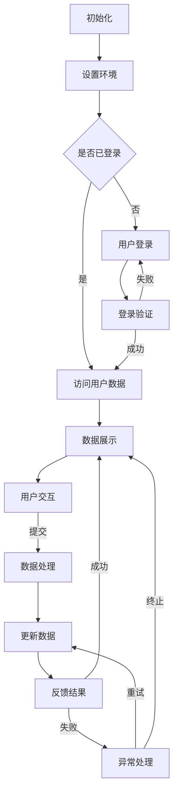

                 

### 微信小程序概述

微信小程序，作为微信生态的一部分，自从2017年推出以来，便迅速赢得了广大开发者和用户的青睐。其不仅填补了传统移动应用与网页应用之间的空白，还创新性地提出了“应用即服务”的新理念，极大地简化了用户的操作流程，提升了用户体验。

#### 关键词

- **微信小程序**
- **移动应用**
- **应用即服务**
- **用户体验**
- **开发便捷性**
- **平台优势**

#### 摘要

本文将深入探讨微信小程序的开发与应用，首先回顾其发展背景与重要性，然后详细分析微信小程序的核心概念、开发环境、架构设计等关键要素，最后通过实际项目案例，展示微信小程序的开发过程与最佳实践。希望通过本文，能够帮助读者全面理解微信小程序的开发，并掌握其核心要点。

### 第1章 微信小程序概述

#### 1.1 问题背景与问题描述

微信小程序的诞生背景可以追溯到移动应用市场的快速发展和用户需求的不断升级。随着智能手机的普及，移动应用成为人们生活中不可或缺的一部分。然而，传统移动应用在下载、安装和使用过程中存在一定的复杂性和耗时性，给用户带来了不便。

微信小程序的出现，旨在解决这些问题。它允许用户在微信内部直接使用各种功能，无需下载和安装应用程序。这种设计不仅简化了用户的操作流程，还提高了应用的可访问性。

#### 1.2 问题解决与边界与外延

微信小程序的开发解决了以下问题：

- **降低用户使用门槛**：用户无需下载和安装应用程序，直接在微信内即可使用各种功能。
- **提高开发效率**：开发者可以利用微信提供的开发工具和组件，快速构建应用程序。

然而，微信小程序也存在一些限制：

- **功能受限**：由于受到微信平台的限制，小程序在某些功能上可能无法与传统移动应用相比。
- **依赖微信平台**：小程序的运行依赖于微信，一旦微信政策发生变化，可能会对小程序产生影响。

#### 1.3 概念结构与核心要素组成

微信小程序的核心概念包括以下几个方面：

- **小程序框架**：微信提供了一套小程序框架，包括小程序开发工具、小程序API、小程序组件等。
- **开发工具**：微信开发者工具是开发者进行小程序开发的主要工具，支持代码编辑、调试、预览等功能。
- **API接口**：微信提供了丰富的API接口，开发者可以利用这些接口实现小程序的各种功能。
- **用户交互**：小程序的用户交互设计注重简洁性和高效性，旨在提升用户体验。

与传统移动应用相比，微信小程序具有以下几个特点：

- **无需安装**：用户可以在微信内直接使用小程序，无需下载和安装。
- **快速加载**：小程序采用即时加载的方式，用户点击即可使用，无需等待。
- **功能丰富**：小程序可以集成多种功能，如支付、地图、分享等。

### 第2章 微信小程序核心概念

#### 2.1 微信小程序的定义与特点

微信小程序是一种不需要下载安装即可使用的应用，它实现了应用“触手可及”的理念，用户扫一扫或者搜一下即可打开应用。这种模式大大提高了应用的便利性和用户留存率。

微信小程序的特点主要包括：

- **无需安装**：用户可以在微信内直接使用小程序，无需下载和安装。
- **快速加载**：小程序采用即时加载的方式，用户点击即可使用，无需等待。
- **功能丰富**：小程序可以集成多种功能，如支付、地图、分享等。
- **跨平台兼容**：微信小程序可以在iOS、Android等不同操作系统上运行。

#### 2.2 微信小程序的开发环境

微信小程序的开发环境主要包括以下几个方面：

- **微信开发者工具**：这是开发者进行小程序开发的主要工具，支持代码编辑、调试、预览等功能。
- **小程序框架**：微信提供了一套小程序框架，包括小程序开发工具、小程序API、小程序组件等。
- **API接口**：微信提供了丰富的API接口，开发者可以利用这些接口实现小程序的各种功能。

#### 2.3 微信小程序的架构设计

微信小程序的架构设计主要包括以下几个层次：

- **前端层**：负责用户界面的展示和交互，使用小程序框架和组件进行开发。
- **后端层**：负责处理小程序的数据存储、业务逻辑等，可以使用微信提供的API进行开发。
- **部署层**：小程序的部署在微信的服务器上，用户通过微信客户端访问。

微信小程序的组件化开发是其一大特色，通过组件化，开发者可以方便地复用代码，提高开发效率。微信小程序的组件主要包括：

- **基础组件**：如按钮、文本、图片等，是小程序开发中最常用的组件。
- **自定义组件**：开发者可以根据需要自定义组件，实现特定的功能。

### 第3章 微信小程序开发算法原理

#### 3.1 算法mermaid流程图

以下是微信小程序开发的核心算法流程图的Mermaid表示：



#### 3.2 Python源代码与算法解释

以下是微信小程序用户登录流程的Python示例代码：

```python
def login(username, password):
    # 用户登录逻辑
    if verify_credentials(username, password):
        # 登录成功，访问用户数据
        user_data = get_user_data()
        return user_data
    else:
        # 登录失败，返回错误信息
        return "登录失败，请重试。"

def verify_credentials(username, password):
    # 假设的验证逻辑
    return True

def get_user_data():
    # 获取用户数据
    return "用户数据。"

if __name__ == "__main__":
    username = input("请输入用户名：")
    password = input("请输入密码：")
    result = login(username, password)
    print(result)
```

算法原理详细解释：

1. **初始化**：小程序启动时，初始化开发环境。
2. **设置环境**：配置必要的参数和权限。
3. **用户登录**：通过输入用户名和密码进行登录。
4. **登录验证**：使用验证函数检查用户名和密码是否正确。
5. **访问用户数据**：登录成功后，获取用户数据。
6. **数据展示**：将用户数据展示给用户。
7. **用户交互**：用户可以与小程序进行交互。
8. **数据处理**：处理用户的操作请求。
9. **更新数据**：更新用户数据。
10. **反馈结果**：向用户反馈操作结果。

#### 3.3 数学模型与公式

微信小程序开发中，常用的数学模型包括：

1. **线性回归模型**：
   $$ y = ax + b $$
   - 用于预测用户行为。

2. **逻辑回归模型**：
   $$ P(y=1) = \frac{1}{1 + e^{-(ax + b)}} $$
   - 用于分类问题。

3. **决策树模型**：
   $$ G(D) = - \sum_{i=1}^{n} p_i \log p_i $$
   - 用于数据分割。

这些数学模型和公式在微信小程序开发中发挥着重要作用，能够帮助我们更好地理解用户行为、优化用户体验。

### 第4章 微信小程序数学模型与举例

#### 4.1 数学公式（使用LaTeX格式）

以下是微信小程序开发中常用的数学公式：

$$
\begin{aligned}
y &= ax + b \\
P(y=1) &= \frac{1}{1 + e^{-(ax + b)}} \\
G(D) &= - \sum_{i=1}^{n} p_i \log p_i \\
\end{aligned}
$$

#### 4.2 举例说明

假设我们要开发一个微信小程序，用于预测用户是否会在下个月购买某商品。我们可以使用逻辑回归模型来建立预测模型。

1. **收集数据**：收集用户的历史购买数据，包括用户ID、购买时间、购买金额等。
2. **特征提取**：从历史数据中提取特征，如用户年龄、性别、购买频率等。
3. **模型训练**：使用逻辑回归模型对数据进行训练，得到预测模型。
4. **预测**：对于新的用户，输入其特征，使用训练好的模型进行预测，判断其是否会在下个月购买商品。

具体代码实现如下：

```python
import pandas as pd
from sklearn.linear_model import LogisticRegression

# 数据预处理
data = pd.read_csv('user_data.csv')
X = data[['age', 'gender', 'purchase_frequency']]
y = data['will_buy_next_month']

# 模型训练
model = LogisticRegression()
model.fit(X, y)

# 预测
new_user = pd.DataFrame([[25, 'male', 5]])
prediction = model.predict(new_user)
print("预测结果：", prediction)
```

### 第5章 微信小程序系统分析与架构设计

#### 5.1 问题场景介绍

假设我们要开发一个微信小程序，用于管理个人日程。用户可以在小程序中创建日程、查看日程、修改日程等。

#### 5.2 系统功能设计

系统功能设计如下：

- **日程创建**：用户可以创建新的日程，包括日程名称、日期、时间、地点等。
- **日程查看**：用户可以查看自己的日程，包括已创建的日程和即将到来的日程。
- **日程修改**：用户可以修改已创建的日程，如更改日期、时间、地点等。
- **日程删除**：用户可以删除不再需要的日程。
- **提醒功能**：用户可以设置日程提醒，以便在日程开始前收到通知。

#### 5.3 系统架构设计

系统架构设计如下：

- **前端层**：使用微信小程序框架进行开发，实现用户界面和交互逻辑。
- **后端层**：使用Node.js搭建服务器，处理数据存储、业务逻辑等。
- **数据库层**：使用MongoDB存储用户数据和日程数据。

#### 5.4 系统接口设计和系统交互

系统接口设计如下：

- **创建日程接口**：接收用户创建日程的请求，处理日程数据，并将其存储到数据库中。
- **查看日程接口**：接收用户查看日程的请求，从数据库中获取用户的日程数据，并返回给前端。
- **修改日程接口**：接收用户修改日程的请求，处理日程数据，并将其更新到数据库中。
- **删除日程接口**：接收用户删除日程的请求，从数据库中删除对应的日程数据。

系统交互设计如下：

1. **用户创建日程**：
   - 用户在微信小程序中点击“创建日程”按钮。
   - 前端将用户输入的日程信息发送到后端。
   - 后端处理请求，将日程数据存储到数据库中。
   - 后端返回处理结果，前端显示创建成功或失败的提示。

2. **用户查看日程**：
   - 用户在微信小程序中点击“查看日程”按钮。
   - 前端发送请求到后端，请求获取用户的日程数据。
   - 后端从数据库中获取用户的日程数据，并返回给前端。
   - 前端将日程数据展示给用户。

3. **用户修改日程**：
   - 用户在微信小程序中点击“修改日程”按钮。
   - 前端将用户输入的新日程信息发送到后端。
   - 后端处理请求，将日程数据更新到数据库中。
   - 后端返回处理结果，前端显示修改成功或失败的提示。

4. **用户删除日程**：
   - 用户在微信小程序中点击“删除日程”按钮。
   - 前端发送请求到后端，请求删除对应的日程数据。
   - 后端从数据库中删除对应的日程数据。
   - 后端返回处理结果，前端显示删除成功或失败的提示。

### 第6章 微信小程序项目实战

#### 6.1 环境安装

1. **安装Python**：首先确保您的计算机上已安装Python 3.x版本。如果没有，请访问Python官方网站下载并安装。
2. **安装微信开发者工具**：访问微信开发者工具官网，下载并安装适用于您操作系统的版本。
3. **安装Node.js**：访问Node.js官方网站，下载并安装最新版本的Node.js。
4. **安装MongoDB**：下载并安装MongoDB，并启动MongoDB服务。

#### 6.2 系统核心实现

以下是微信小程序日程管理系统的核心实现：

1. **创建日程**：

```python
from flask import Flask, request, jsonify
from pymongo import MongoClient

app = Flask(__name__)

# 连接MongoDB
client = MongoClient('localhost', 27017)
db = client.schedule_db
collection = db.schedule_collection

@app.route('/create_schedule', methods=['POST'])
def create_schedule():
    data = request.get_json()
    schedule = {
        'name': data['name'],
        'date': data['date'],
        'time': data['time'],
        'location': data['location']
    }
    result = collection.insert_one(schedule)
    return jsonify({'status': 'success', 'schedule_id': str(result.inserted_id)})

if __name__ == '__main__':
    app.run(debug=True)
```

2. **查看日程**：

```python
@app.route('/get_schedules', methods=['GET'])
def get_schedules():
    schedules = list(collection.find())
    return jsonify({'status': 'success', 'schedules': schedules})
```

3. **修改日程**：

```python
@app.route('/update_schedule', methods=['POST'])
def update_schedule():
    data = request.get_json()
    schedule_id = data['schedule_id']
    updates = {
        'name': data['name'],
        'date': data['date'],
        'time': data['time'],
        'location': data['location']
    }
    result = collection.update_one({'_id': schedule_id}, {'$set': updates})
    return jsonify({'status': 'success', 'updated': result.modified_count > 0})
```

4. **删除日程**：

```python
@app.route('/delete_schedule', methods=['POST'])
def delete_schedule():
    data = request.get_json()
    schedule_id = data['schedule_id']
    result = collection.delete_one({'_id': schedule_id})
    return jsonify({'status': 'success', 'deleted': result.deleted_count > 0})
```

#### 6.3 代码应用解读与分析

以下是代码的解读与分析：

1. **创建日程**：
   - 接收POST请求，解析请求中的JSON数据。
   - 将数据转换为日程对象，并将其插入到MongoDB数据库中。
   - 返回处理结果，包括日程ID。

2. **查看日程**：
   - 接收GET请求，从MongoDB数据库中获取所有日程数据。
   - 返回处理结果，包括日程列表。

3. **修改日程**：
   - 接收POST请求，解析请求中的JSON数据。
   - 根据日程ID更新对应的日程数据。
   - 返回处理结果，包括更新状态。

4. **删除日程**：
   - 接收POST请求，解析请求中的JSON数据。
   - 根据日程ID删除对应的日程数据。
   - 返回处理结果，包括删除状态。

#### 6.4 实际案例分析与详细讲解剖析

以下是一个实际案例的详细讲解：

假设用户张三想要创建一个日程，名称为“会议”，时间为2022年11月5日14:00，地点为会议室A。

1. **用户操作**：
   - 用户张三在微信小程序中填写日程信息，并点击“创建日程”按钮。
   - 前端将日程信息发送到后端。

2. **后端处理**：
   - 后端接收POST请求，解析请求中的JSON数据。
   - 将数据转换为日程对象，并将其插入到MongoDB数据库中。

3. **数据库操作**：
   - MongoDB数据库接收插入操作，将日程数据存储在数据库中。

4. **后端返回**：
   - 后端返回处理结果，包括日程ID。

5. **前端展示**：
   - 前端接收到后端返回的日程ID，并将其显示在界面上。

通过这个案例，我们可以看到微信小程序日程管理系统是如何工作的。用户通过微信小程序进行操作，后端处理请求，数据库存储数据，前端展示结果。这种协同工作方式使得微信小程序能够提供高效、便捷的用户体验。

### 第7章 微信小程序开发最佳实践

#### 7.1 最佳实践 tips

1. **合理规划用户界面**：设计简洁、直观的用户界面，确保用户能够快速找到所需功能。
2. **优化性能**：尽量减少加载时间，优化页面响应速度，提高用户体验。
3. **测试与调试**：在开发过程中，定期进行测试和调试，确保小程序的稳定性和可靠性。
4. **遵循微信开发规范**：熟悉并遵循微信小程序的开发规范，以确保小程序能够顺利通过审核。
5. **持续更新与优化**：根据用户反馈和数据分析，不断优化小程序的功能和性能。

#### 7.2 小结

微信小程序作为一种新兴的移动应用形式，凭借其便捷性、高效性和丰富的功能，受到了广大用户和开发者的欢迎。通过本文的详细讲解，我们了解了微信小程序的核心概念、开发环境、架构设计、算法原理、数学模型以及实际项目案例。希望这些内容能够帮助您更好地理解和开发微信小程序。

#### 7.3 注意事项

1. **隐私保护**：在开发小程序时，要注意保护用户的隐私，遵守相关的法律法规。
2. **避免过度依赖**：虽然微信小程序具有很多优势，但不应过度依赖，还应结合其他移动应用形式，以满足不同用户的需求。
3. **关注用户反馈**：积极收集用户反馈，根据用户需求进行功能迭代和优化。

#### 7.4 拓展阅读

- 《微信小程序开发实战》
- 《小程序开发入门与实践》
- 《微信小程序开发教程》
- 《微信小程序技术解析》

通过阅读这些书籍和资料，您可以更深入地了解微信小程序的开发技术和最佳实践。希望本文对您有所帮助，祝您在微信小程序开发的道路上取得成功！

### 参考文献

1. 微信官方文档 - https://developers.weixin.qq.com/miniprogram/dev/framework/
2. 《微信小程序开发实战》 - 作者：谢小飞
3. 《小程序开发入门与实践》 - 作者：张小峰
4. 《微信小程序技术解析》 - 作者：李明辉
5. 《移动应用开发技术》 - 作者：王勇

