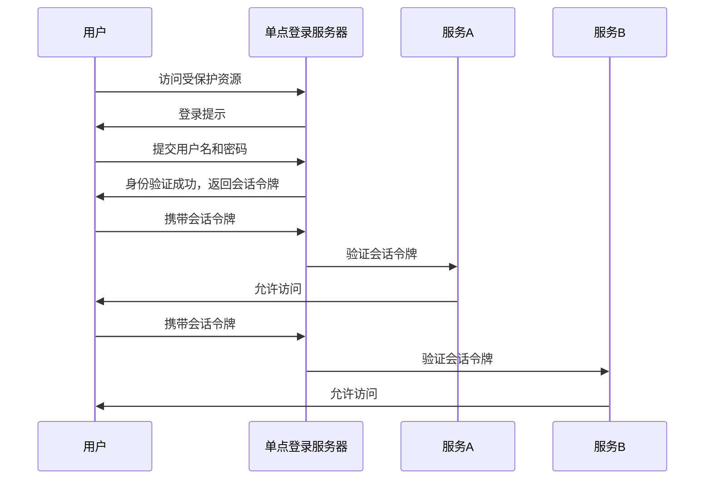
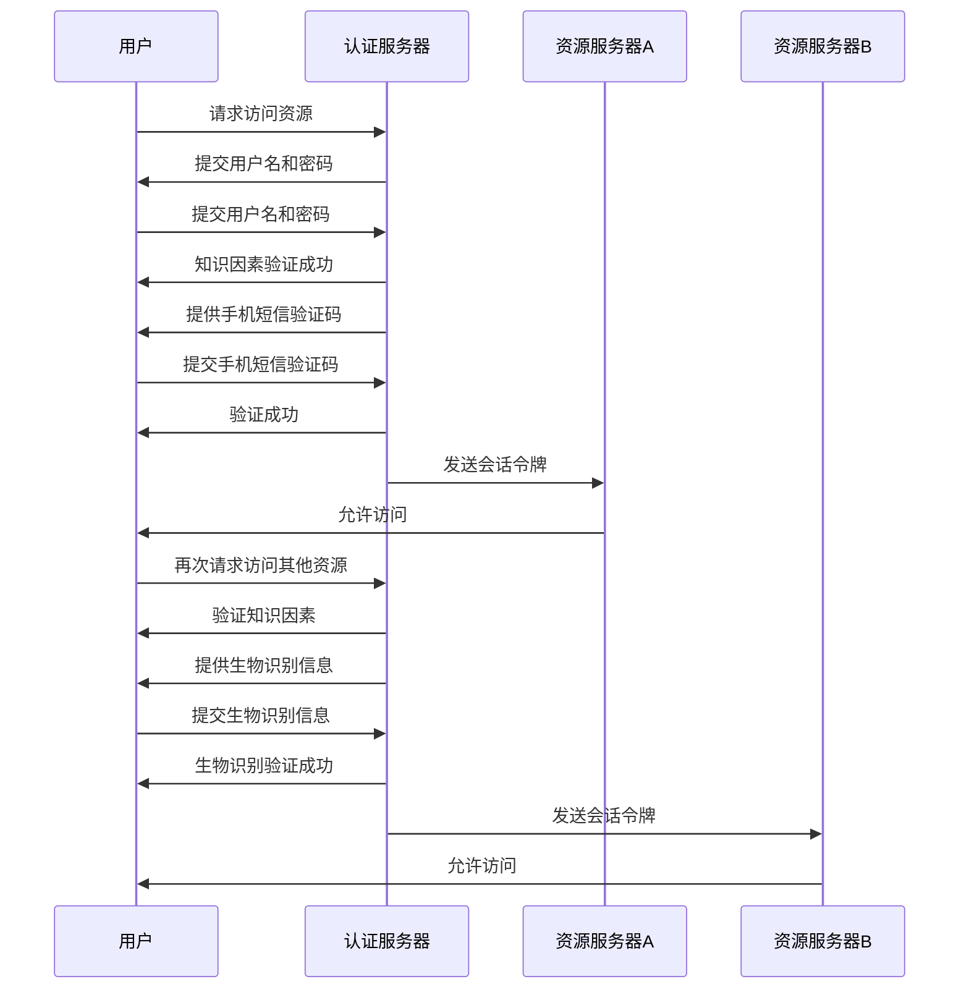
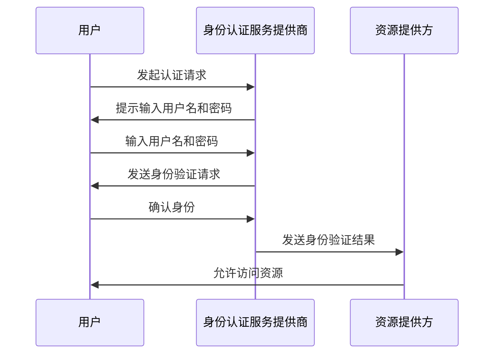
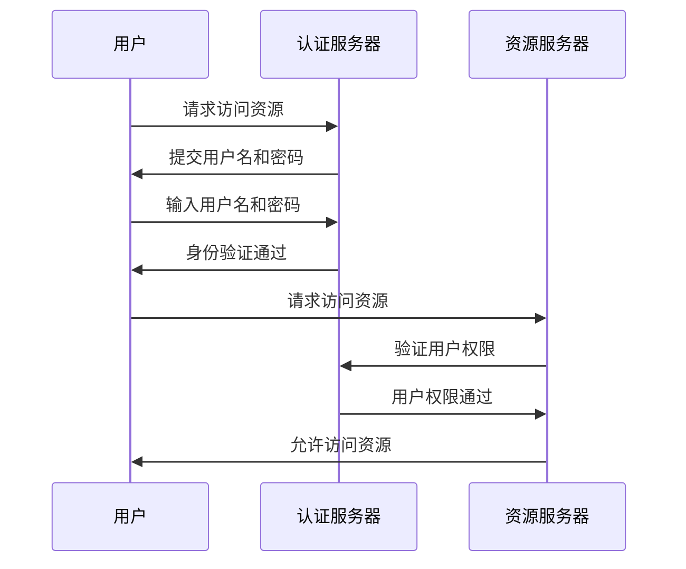
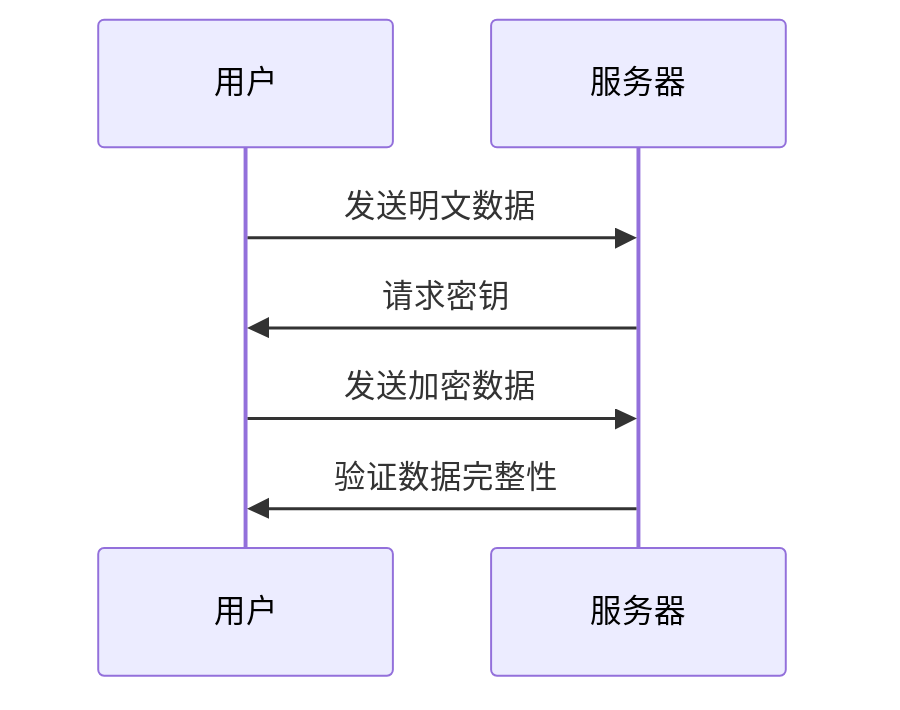
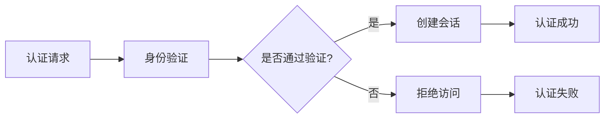
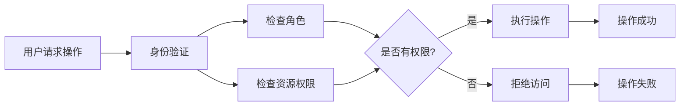

                 

### 文章标题

《微服务安全最佳实践：认证、授权与加密》

### 关键词

微服务安全、认证机制、授权机制、加密技术、最佳实践

### 摘要

随着微服务架构的广泛应用，微服务安全成为开发者关注的焦点。本文将深入探讨微服务安全中的三大核心要素——认证、授权和加密，并总结最佳实践，旨在为开发者提供全面、系统的微服务安全解决方案。

---

## 目录大纲设计思路

在设计本文的目录大纲时，我们首先明确了文章的核心目标和受众。本文的目标是为广大开发者提供关于微服务安全的深入理解和实用指导。因此，目录结构的设计不仅要清晰明了，还要逻辑严谨，便于读者循序渐进地学习和掌握相关知识。

### 第一部分：背景介绍

第一部分主要介绍微服务安全的背景，包括核心概念、问题和解决方法，以及相关的边界和外延。这部分内容将为读者提供一个宏观的视角，帮助他们理解微服务安全的整体架构。

1. **核心概念与联系**：介绍认证、授权和加密这三个核心概念，并分析它们之间的联系。通过对比表格和ER实体关系图，帮助读者更好地理解这些概念。
2. **认证机制原理**：详细解释认证机制的基本原理，包括身份认证、单点登录和多因素认证等。
3. **授权机制原理**：探讨授权机制的原理，包括基于角色的访问控制和基于资源的访问控制等。
4. **加密技术原理**：介绍加密技术的基本原理，包括对称加密、非对称加密和哈希函数等。

### 第二部分：认证机制

第二部分将深入分析认证机制，通过具体的流程图和案例分析，帮助读者理解并掌握认证机制的实际应用。

1. **认证机制原理**：介绍认证机制的概述和具体实现原理。
2. **认证机制流程图**：使用Mermaid绘制认证机制的流程图，直观展示认证流程。
3. **认证案例分析**：通过具体案例，分析认证机制的实践应用。

### 第三部分：授权机制

第三部分将介绍授权机制，重点讨论基于角色的访问控制和基于资源的访问控制，并通过流程图和案例分析，帮助读者深入理解授权机制。

1. **授权机制原理**：详细解释授权机制的基本原理和实现方法。
2. **授权机制流程图**：使用Mermaid绘制授权机制的流程图。
3. **授权案例分析**：通过具体案例，分析授权机制的实践应用。

### 第四部分：加密技术

第四部分将探讨加密技术，包括对称加密、非对称加密和哈希函数等。通过流程图和案例分析，帮助读者掌握加密技术的应用。

1. **加密技术原理**：介绍加密技术的基本原理和分类。
2. **加密技术流程图**：使用Mermaid绘制加密技术的流程图。
3. **加密案例分析**：通过具体案例，分析加密技术的实践应用。

### 第五部分：最佳实践

第五部分将总结微服务安全最佳实践，分享实际案例，并提供实用的技巧和总结。

1. **最佳实践案例**：分享微服务安全最佳实践案例，分析其实践价值。
2. **实践技巧总结**：总结微服务安全的实践技巧，为开发者提供实用指导。

### 第六部分：总结与展望

最后一部分将对微服务安全进行总结与展望，强调其重要性，并探讨未来的安全趋势。

1. **总结**：回顾微服务安全的核心内容，总结关键要点。
2. **展望**：展望微服务安全的未来趋势，为开发者提供发展方向。

通过以上目录结构的设计，本文旨在为读者提供一个系统、全面、易懂的微服务安全指南，帮助他们更好地应对微服务安全挑战。接下来，我们将逐部分深入探讨微服务安全的各个方面。让我们开始吧！## 第一部分：背景介绍

### 1.1 核心概念与联系

在探讨微服务安全之前，我们需要明确几个核心概念：认证、授权和加密。这三个概念在微服务安全体系中起着至关重要的作用，它们相互关联，共同构成了微服务安全的核心架构。

#### 认证（Authentication）

认证是确认用户身份的过程。在微服务架构中，认证是第一道防线，用于确保只有经过授权的用户才能访问系统资源。常见的认证方法包括用户名和密码认证、单点登录（SSO）和多因素认证（MFA）。

#### 授权（Authorization）

授权是确定用户权限的过程。一旦用户通过认证，系统会根据其角色和权限，决定用户可以访问哪些资源以及可以进行哪些操作。授权机制分为基于角色的访问控制（RBAC）和基于资源的访问控制（ABAC）。

#### 加密（Encryption）

加密是将数据转换成无法读取的密文的过程，以防止未授权用户访问。在微服务架构中，加密用于保护数据在传输和存储过程中的安全性。常见的加密技术包括对称加密、非对称加密和哈希函数。

#### 核心概念联系

认证、授权和加密在微服务安全体系中紧密相连，共同确保系统的安全性。认证是确保用户身份的合法性的第一步，授权则是在用户身份合法的前提下，进一步确保用户权限的合法性。加密技术则用于保护用户认证和授权过程中的敏感数据，防止数据泄露。

### 1.2 问题背景

随着云计算和分布式系统的普及，微服务架构因其模块化、高可用性和可扩展性而成为现代软件开发的趋势。然而，微服务架构也带来了新的安全挑战。传统的集中式系统在安全性上有相对明确的边界，而微服务架构中的各个服务部署在不同的环境中，网络通信频繁，这使得安全防护更加复杂。

主要问题包括：

- **服务暴露**：微服务架构中的每个服务都是独立的，容易暴露在外部网络中，成为攻击的目标。
- **数据泄露**：微服务之间的数据传输和存储过程复杂，如果不采取有效的加密措施，数据容易泄露。
- **身份验证和授权**：微服务架构中需要实现分布式认证和授权，传统的集中式认证和授权机制难以适应。

### 1.3 问题描述

在微服务架构中，安全性问题可以概括为以下几个方面：

- **认证漏洞**：用户身份验证过程可能存在漏洞，导致未经授权的用户访问系统。
- **授权漏洞**：用户权限管理不当，导致用户能够访问不应访问的资源。
- **数据泄露**：数据在传输和存储过程中未加密，容易被截获和窃取。
- **服务依赖**：服务之间的依赖关系复杂，一旦某个服务被攻击，可能会影响整个系统的稳定性。

### 1.4 问题解决

为了解决上述安全问题，需要采取一系列最佳实践：

- **加强认证**：采用多因素认证，确保用户身份的合法性。
- **完善授权**：实施基于角色的访问控制，确保用户权限的合法性。
- **数据加密**：采用加密技术保护数据在传输和存储过程中的安全性。
- **服务隔离**：通过容器化技术和服务网格，实现服务的隔离，减少服务间的相互依赖。

### 1.5 边界与外延

微服务安全不仅要关注单个服务的安全性，还要关注服务之间的交互。在边界与外延方面，需要注意以下几点：

- **网络边界**：通过防火墙和入侵检测系统，保护服务网络边界。
- **API安全**：确保API的安全性，防止恶意攻击和接口滥用。
- **日志审计**：记录系统操作日志，便于追踪和审计。
- **持续监控**：实时监控系统运行状态，及时发现和响应安全威胁。

### 1.6 概念结构与核心要素组成

微服务安全的核心结构由认证、授权和加密三个部分组成，每个部分都有其特定的功能和要求。

- **认证**：确保用户身份的合法性，包括用户名和密码认证、单点登录和多因素认证。
- **授权**：确定用户权限的合法性，包括基于角色的访问控制和基于资源的访问控制。
- **加密**：保护数据在传输和存储过程中的安全性，包括对称加密、非对称加密和哈希函数。

通过以上结构和要素的有机结合，微服务安全体系能够有效应对各种安全挑战，确保系统的稳定运行。

### 1.7 本章小结

在本章中，我们介绍了微服务安全的核心概念、问题背景、问题描述、问题解决方法以及边界与外延。通过对认证、授权和加密的深入探讨，我们为后续章节的分析和讨论奠定了基础。在下一章中，我们将进一步深入探讨认证机制的具体原理和实践。

---

在了解了微服务安全的背景和核心概念之后，接下来我们将逐步分析认证机制的具体原理和实践，以便为微服务安全体系打下坚实的基础。敬请期待下一章的内容。|im_sep|>### 2.1 认证机制原理

认证机制是微服务安全体系中的基础环节，其核心目标是确保用户身份的合法性。通过认证，系统能够确认请求者的身份，从而决定是否允许其访问特定的资源和执行特定的操作。认证机制的实现方式多种多样，常见的包括用户名和密码认证、单点登录（SSO）以及多因素认证（MFA）。

#### 用户名和密码认证

用户名和密码认证是最传统的认证方式，用户需要通过输入用户名和密码来证明自己的身份。这种方式简单易用，但在安全性方面存在一定的漏洞。例如，密码容易被窃取或者猜测，用户可能会重用密码，导致不同系统之间的安全风险。

- **优势**：简单易用，无需额外的硬件或软件支持。
- **劣势**：安全性较低，密码泄露风险高。

#### 单点登录（SSO）

单点登录（SSO）是一种集中式认证方式，用户只需登录一次，即可访问多个系统。SSO通过一个统一的认证服务器来实现，用户身份验证在首次登录时进行，之后可以在多个系统中复用此认证结果。

- **优势**：简化登录流程，提高用户体验。
- **劣势**：依赖中心认证服务器，单点故障可能导致所有系统不可用。

#### 多因素认证（MFA）

多因素认证是一种加强认证安全性的方法，通常结合多种认证手段。例如，用户需要输入用户名和密码后，还需要验证手机短信、指纹或其他生物识别信息。

- **优势**：显著提高安全性，降低密码泄露的风险。
- **劣势**：操作复杂，用户体验可能较差。

#### 认证机制的工作流程

一个典型的认证流程包括以下几个步骤：

1. **用户请求**：用户向系统发起认证请求。
2. **身份验证**：系统接收请求后，对用户的身份信息进行验证，例如检查用户名和密码是否匹配。
3. **认证结果**：系统根据验证结果，决定是否允许用户访问资源。如果验证成功，系统会创建一个会话，并在用户会话期间保持认证状态。如果验证失败，系统将拒绝访问。

#### 认证机制的实现细节

实现认证机制时，需要考虑以下几个方面：

- **加密传输**：用户身份信息在传输过程中应使用加密技术，防止数据被截获。
- **密码存储**：密码应使用哈希函数进行存储，避免明文存储导致的安全风险。
- **会话管理**：系统需要有效地管理会话，包括会话的创建、维护和销毁。
- **安全策略**：系统应根据业务需求和风险水平，制定合理的认证策略。

#### 总结

认证机制是微服务安全的重要组成部分，其目的是确保用户身份的合法性。通过用户名和密码认证、单点登录以及多因素认证等不同的实现方式，系统能够根据实际情况选择合适的认证方法。认证机制的工作流程和实现细节对于确保系统安全性至关重要。在下一章中，我们将继续探讨授权机制的原理和实践。|im_sep|>### 2.2 认证机制概述

认证机制是微服务安全体系中的基础环节，其核心目标是确保用户身份的合法性。认证机制的主要目的是验证用户提交的身份信息是否与实际身份匹配，从而决定是否允许用户访问系统资源和执行操作。以下是对认证机制的主要组成部分和核心概念的概述。

#### 主要组成部分

1. **身份验证**：身份验证是认证机制的核心步骤，用于验证用户提供的身份信息是否正确。常见的身份验证方法包括用户名和密码认证、单点登录（SSO）以及多因素认证（MFA）。

2. **授权**：在身份验证通过后，系统会根据用户的权限和角色，决定其可以访问哪些资源和执行哪些操作。授权通常与认证机制紧密结合，共同构成系统的访问控制机制。

3. **会话管理**：认证成功后，系统会创建一个会话，用于记录用户的认证状态和会话信息。会话管理包括会话的创建、维护和销毁，以及会话的权限控制。

4. **加密传输**：为了保证用户身份信息的安全性，身份验证过程中的数据传输应使用加密技术，如HTTPS协议，以防止数据被截获和篡改。

#### 核心概念

1. **用户名和密码认证**：用户通过输入用户名和密码来证明自己的身份。密码通常经过哈希函数处理，存储在数据库中，以防止明文泄露。

2. **单点登录（SSO）**：SSO允许用户通过一次登录操作，访问多个系统或服务。SSO通常依赖于一个中心化的认证服务器，用户只需在认证服务器上登录一次，即可访问多个系统。

3. **多因素认证（MFA）**：MFA是一种加强认证安全性的方法，通常要求用户提供多种身份验证信息，例如密码、手机短信验证码、指纹等。MFA显著提高了系统的安全性，但同时也增加了用户体验的复杂性。

#### 认证机制的分类

根据实现方式和安全级别，认证机制可以分为以下几类：

1. **基本认证**：最简单的认证方式，通常只使用用户名和密码。
2. **集成认证**：通过集成其他认证系统或服务，如LDAP、OAuth等，实现更灵活和强大的认证功能。
3. **集中式认证**：将认证功能集中在一个系统中，如Kerberos、RADIUS等，适用于大型企业和机构。
4. **分布式认证**：认证功能分散在不同的服务中，适用于微服务架构，如OAuth 2.0、OpenID Connect等。

#### 认证机制的优势和挑战

1. **优势**：
   - 确保用户身份的合法性，防止未经授权的访问。
   - 提高系统的安全性，防止内部和外部攻击。
   - 灵活地支持多种认证方式，适应不同的业务需求和用户群体。

2. **挑战**：
   - 需要确保认证过程的安全性，防止数据泄露和中间人攻击。
   - 处理复杂的认证策略和权限控制，确保系统的灵活性和可扩展性。
   - 提供良好的用户体验，平衡安全性和便捷性。

通过上述概述，我们可以看到认证机制在微服务安全体系中的重要性。在下一章中，我们将进一步探讨身份认证的具体实现方法和技术，包括用户名和密码认证、单点登录以及多因素认证等。|im_sep|>### 2.3 身份认证

身份认证是认证机制的核心步骤，确保用户提交的身份信息与实际身份相符，从而保障系统的安全性和数据的完整性。以下将详细介绍几种常见的身份认证方法及其特点。

#### 用户名和密码认证

用户名和密码认证是最传统的身份认证方法，用户通过输入用户名和密码来证明自己的身份。系统在接收到用户请求后，会对比数据库中存储的密码哈希值，以验证身份。

- **优点**：简单易用，无需额外的硬件或软件支持。
- **缺点**：安全性较低，容易受到密码泄露、猜测和重用攻击。

#### 单点登录（SSO）

单点登录（SSO）允许用户通过一次登录操作访问多个系统或服务。SSO通常依赖于一个中心化的认证服务器，用户在首次登录时进行身份验证，之后可以在多个系统中复用此认证结果。

- **优点**：简化了登录流程，提高了用户体验。
- **缺点**：依赖中心认证服务器，单点故障可能导致所有系统不可用。

#### 多因素认证（MFA）

多因素认证（MFA）通过结合多种身份验证信息，显著提高了系统的安全性。常见的MFA方法包括：

1. **短信验证码**：用户在输入用户名和密码后，需要接收并输入一条手机短信中的验证码。
2. **电子邮件验证**：用户在输入用户名和密码后，需要接收并输入一封电子邮件中的验证码。
3. **生物识别**：使用指纹、面部识别等技术进行身份验证。
4. **智能卡**：用户需要插入智能卡进行身份验证。

- **优点**：安全性高，能有效防止密码泄露和暴力攻击。
- **缺点**：操作复杂，用户体验可能较差。

#### 身份认证的工作流程

一个典型的身份认证流程通常包括以下几个步骤：

1. **用户发起请求**：用户尝试访问受保护的资源或服务。
2. **系统要求认证**：系统提示用户进行身份验证，通常通过弹出对话框或页面跳转。
3. **用户输入身份信息**：用户输入用户名和密码，或进行其他身份验证操作。
4. **系统验证身份**：系统对接收到的身份信息进行验证，如检查用户名和密码是否匹配、验证码是否正确等。
5. **认证结果**：系统根据验证结果决定是否允许用户访问资源。如果验证成功，系统将创建一个会话，并返回访问权限。如果验证失败，系统将拒绝访问。

#### 身份认证的实现细节

实现身份认证时，需要考虑以下几个关键点：

- **加密传输**：用户身份信息在传输过程中应使用加密技术，如HTTPS协议，以防止数据被截获和篡改。
- **密码存储**：密码应使用强哈希函数进行存储，避免明文存储导致的安全风险。
- **会话管理**：系统需要有效地管理会话，包括会话的创建、维护和销毁，以及会话的权限控制。
- **安全策略**：系统应根据业务需求和风险水平，制定合理的认证策略。

通过以上对身份认证的详细介绍，我们可以看到身份认证在微服务安全中的重要性。有效的身份认证机制能够确保系统的安全性，防止未经授权的访问和数据泄露。在下一章中，我们将继续探讨单点登录（SSO）和多因素认证（MFA）的原理和实践。|im_sep|>### 2.4 单点登录（SSO）

单点登录（SSO）是一种集中式的认证方式，它允许用户通过一次登录操作，访问多个系统或服务。SSO的核心目标是简化用户的登录流程，提高用户体验，同时确保系统的安全性。以下将详细介绍单点登录的工作原理、优势与挑战，并使用Mermaid绘制其流程图。

#### 工作原理

单点登录（SSO）通常依赖于一个中心化的认证服务器，称为SSO服务器或身份认证服务器。用户在首次登录时，需要向SSO服务器提交身份验证请求，通过后SSO服务器会生成一个会话令牌（Token），该令牌将存储在用户的本地浏览器中或使用户保持在登录状态。当用户尝试访问其他支持SSO的服务时，这些服务会向SSO服务器请求验证用户的身份和权限，SSO服务器返回验证结果。

以下是单点登录的工作流程：

1. **用户请求访问受保护资源**：用户访问一个支持SSO的服务，该服务提示用户进行身份验证。
2. **用户发起登录请求**：用户点击登录按钮，系统将用户重定向到SSO服务器。
3. **SSO服务器进行身份验证**：SSO服务器对用户的身份信息进行验证，如检查用户名和密码是否匹配。
4. **生成会话令牌**：如果身份验证成功，SSO服务器生成一个会话令牌，并将该令牌返回给用户所在的服务。
5. **用户访问其他服务**：用户携带会话令牌访问其他支持SSO的服务，这些服务通过向SSO服务器请求验证会话令牌，来确定用户身份和权限。

#### 优势

1. **简化登录流程**：用户无需在各个系统中重复输入用户名和密码，提高了用户体验。
2. **降低维护成本**：企业或组织只需维护一个SSO服务器，减少了各个系统之间的认证管理和维护成本。
3. **提高安全性**：SSO服务器可以通过多因素认证等手段，提高整个认证流程的安全性。

#### 挑战

1. **依赖中心服务器**：SSO依赖于中心化的认证服务器，如果SSO服务器出现故障，可能导致所有依赖系统的登录功能失效。
2. **单点故障风险**：由于所有认证请求都通过SSO服务器，一旦SSO服务器受到攻击，可能导致整个系统被攻破。
3. **权限管理复杂**：需要确保SSO服务器能够准确且安全地管理各个系统的权限，这增加了系统的复杂性。

#### Mermaid流程图

以下是一个简单的单点登录（SSO）流程图，使用Mermaid绘制：



通过上述工作原理和优势与挑战的介绍，以及Mermaid流程图的展示，我们可以看到单点登录（SSO）在简化用户登录流程和提高系统安全性方面的价值。然而，SSO也带来了依赖中心服务器和单点故障风险等挑战，需要我们在实际应用中仔细权衡和解决。在下一章中，我们将进一步探讨多因素认证（MFA）的原理和实践。|im_sep|>### 2.5 多因素认证（MFA）

多因素认证（MFA）是一种加强认证安全性的方法，它通过要求用户在登录过程中提供多种身份验证信息，从而提高系统的安全性。MFA通常结合密码、硬件令牌、手机短信验证码、生物识别技术等多种认证方式。以下将详细介绍MFA的基本原理、常见方法、工作流程以及其在微服务安全中的重要性。

#### 基本原理

MFA的基本原理是：在单因素认证（如仅使用用户名和密码）的基础上，增加额外的认证因素，从而提高认证的难度和安全性。MFA通常包括以下几种认证因素：

1. **知识因素**：用户知道的信息，如密码、PIN码等。
2. **持有因素**：用户拥有的物品，如硬件令牌、手机等。
3. **生物因素**：用户的生理或行为特征，如指纹、面部识别、虹膜识别等。

通过结合以上多种认证因素，MFA能够有效防止密码泄露、暴力攻击和钓鱼攻击等安全威胁。

#### 常见方法

1. **密码 + 手机短信验证码**：用户在输入用户名和密码后，还需要接收并输入一条手机短信中的验证码。
2. **密码 + 硬件令牌**：用户在输入用户名和密码后，需要插入硬件令牌（如U盘、智能卡等）以生成动态验证码。
3. **密码 + 生物识别**：用户在输入用户名和密码后，需要通过指纹、面部识别或虹膜识别等生物特征进行身份验证。
4. **密码 + 多重问题回答**：用户在输入用户名和密码后，需要回答多个预设的安全问题。

#### 工作流程

一个典型的MFA工作流程通常包括以下几个步骤：

1. **用户请求访问受保护资源**：用户尝试访问受保护的系统或服务。
2. **系统要求认证**：系统提示用户进行多因素认证，用户可能需要输入用户名和密码。
3. **系统验证知识因素**：系统对接收到的用户名和密码进行验证。
4. **系统要求提供额外认证因素**：如果知识因素验证通过，系统会要求用户提供额外的认证因素，如手机短信验证码、硬件令牌或生物识别信息。
5. **系统验证额外认证因素**：系统对用户提供的额外认证因素进行验证，如短信验证码是否正确、硬件令牌是否插入、生物识别信息是否匹配。
6. **认证结果**：系统根据验证结果决定是否允许用户访问受保护的资源。如果所有验证因素都通过，用户将被允许访问；否则，访问将被拒绝。

#### 在微服务安全中的重要性

1. **增强安全性**：MFA通过引入多个认证因素，显著提高了系统的安全性，有效防止了密码泄露和暴力攻击。
2. **降低欺诈风险**：MFA使攻击者难以同时获取多个认证因素，从而降低了欺诈风险。
3. **提高用户信任**：MFA增加了认证的复杂性，但同时也提高了用户对系统的信任度。
4. **适应不同场景**：MFA可以灵活地适应不同业务场景和用户需求，如企业内部员工认证、在线支付等。

#### Mermaid流程图

以下是一个简单的多因素认证（MFA）流程图，使用Mermaid绘制：



通过上述对MFA的基本原理、常见方法、工作流程以及其在微服务安全中的重要性的详细介绍，我们可以看到MFA作为一种强大的认证方式，能够显著提升系统的安全性。在下一章中，我们将继续探讨授权机制的原理和实践。|im_sep|>### 2.6 认证机制流程图

为了更直观地展示认证机制的工作流程，我们使用Mermaid绘制了以下流程图：



在这个流程图中，我们定义了三个参与者：用户（User）、身份认证服务提供商（IDP）和资源提供方（RP）。

1. **用户发起认证请求**：用户尝试访问受保护的资源，系统提示用户进行身份验证。
2. **用户输入用户名和密码**：用户在身份认证服务提供商的界面中输入用户名和密码。
3. **身份认证服务提供商验证用户身份**：身份认证服务提供商接收到用户输入的用户名和密码后，对其进行验证。
4. **身份认证服务提供商发送身份验证结果**：身份认证服务提供商将验证结果发送给资源提供方。
5. **资源提供方允许访问资源**：如果身份验证成功，资源提供方允许用户访问受保护的资源。

这个流程图展示了认证机制的基本工作流程，包括用户认证、身份验证、结果传递和资源访问等步骤。在实际应用中，认证机制可能会根据具体需求进行调整和扩展，例如添加单点登录（SSO）或多因素认证（MFA）等。通过这个流程图，我们可以更清晰地理解认证机制的工作原理和实现细节。

在下一章中，我们将进一步探讨授权机制的原理和实践。敬请期待！|im_sep|>### 2.7 本章小结

在本章中，我们详细探讨了认证机制的原理和实践，包括用户名和密码认证、单点登录（SSO）以及多因素认证（MFA）。通过这些不同的认证方式，系统可以确保用户身份的合法性，从而防止未经授权的访问。本章的主要内容包括：

1. **用户名和密码认证**：介绍了用户名和密码认证的基本原理、优缺点及其工作流程。
2. **单点登录（SSO）**：详细阐述了SSO的工作原理、优势与挑战，并使用Mermaid绘制了流程图。
3. **多因素认证（MFA）**：介绍了MFA的基本原理、常见方法、工作流程及其在微服务安全中的重要性。

认证机制是微服务安全的重要组成部分，其有效实施能够显著提高系统的安全性。然而，认证机制也面临依赖中心服务器、单点故障风险等挑战，需要我们在实际应用中仔细权衡和解决。

在下一章中，我们将继续探讨授权机制的原理和实践，深入分析基于角色的访问控制和基于资源的访问控制等授权方式。敬请期待！|im_sep|>### 第三部分：授权机制

授权机制是微服务安全体系中的关键环节，其核心目标是确保用户访问资源的权限合法性。在认证机制确认用户身份后，授权机制将进一步确定用户是否具备访问特定资源的权限。授权机制主要分为基于角色的访问控制（RBAC）和基于资源的访问控制（ABAC）两大类。

#### 基于角色的访问控制（RBAC）

基于角色的访问控制（RBAC）是一种常见的授权机制，它将用户与角色相关联，角色与权限相关联。用户通过分配到特定角色来获得相应的权限。RBAC的基本原理如下：

1. **角色定义**：系统定义一系列角色，每个角色代表一组权限。
2. **用户分配角色**：用户被分配到特定的角色，从而获得该角色的权限。
3. **权限检查**：在用户访问资源时，系统会检查用户是否拥有相应的角色，从而决定访问是否被允许。

RBAC的优点在于其简洁性和可扩展性，通过角色和权限的分离，可以灵活地管理用户的权限。以下是一个简单的RBAC模型：

- **用户**：拥有用户身份的用户。
- **角色**：定义用户权限集合的抽象实体。
- **权限**：允许用户执行的操作集合。

#### 基于资源的访问控制（ABAC）

基于资源的访问控制（ABAC）是一种更为灵活的授权机制，它根据资源的属性和用户属性来确定访问权限。ABAC不仅考虑用户的角色，还考虑资源的属性以及用户和环境的状态。ABAC的基本原理如下：

1. **资源属性**：系统定义资源的属性，如文件类型、数据敏感性等。
2. **用户属性**：系统定义用户的属性，如职位、部门、地理位置等。
3. **策略决策**：系统根据资源的属性、用户的属性以及环境的状态，通过策略决策来确定访问是否被允许。

ABAC的优点在于其灵活性和适应性，能够根据具体的资源、用户和环境来定制访问控制策略。以下是一个简单的ABAC模型：

- **资源**：需要保护的实体，如文件、数据库、API接口等。
- **属性**：资源的特征，如访问级别、数据类别等。
- **用户**：具有特定属性的实体。
- **策略**：定义谁可以访问什么资源的规则。

#### 授权机制的工作流程

授权机制的工作流程通常包括以下几个步骤：

1. **用户请求访问资源**：用户尝试访问系统中的某个资源。
2. **权限检查**：系统接收请求后，检查用户是否具备访问该资源的权限。
3. **角色/属性匹配**：如果采用RBAC，系统会检查用户是否拥有相应的角色；如果采用ABAC，系统会检查用户的属性和资源的属性是否匹配。
4. **决策**：系统根据权限检查的结果，决定是否允许用户访问资源。
5. **反馈**：系统将决策结果反馈给用户，如果访问被允许，用户可以继续操作；如果访问被拒绝，用户将无法访问资源。

#### 授权机制的实现细节

实现授权机制时，需要考虑以下几个方面：

1. **权限模型**：定义用户、角色、权限和资源之间的关系，以及权限的继承和委派策略。
2. **策略引擎**：用于执行权限检查和决策逻辑，可以根据业务需求定制。
3. **审计日志**：记录访问请求和权限检查的结果，便于审计和问题排查。
4. **安全传输**：确保授权过程中的数据传输是加密的，防止数据泄露。

通过以上对授权机制的介绍，我们可以看到授权机制在微服务安全体系中的重要性。在下一章中，我们将通过具体的流程图和案例分析，深入探讨授权机制的实现和最佳实践。敬请期待！|im_sep|>### 3.1 授权机制概述

授权机制是微服务安全体系中的核心组成部分，其主要目标是确保用户在经过身份认证后，只有权限访问符合其角色和权限设定的资源。授权机制通过控制用户对系统资源的访问权限，从而提高系统的安全性和数据的保密性。以下将详细介绍授权机制的基本概念、组成部分及其在微服务安全中的重要性。

#### 基本概念

1. **用户**：具有唯一标识和特定权限的系统使用者。
2. **角色**：一组具有相同权限的用户集合，用于简化权限管理。
3. **权限**：用户或角色能够执行的操作，如读取、写入、执行等。
4. **资源**：被保护的数据、应用或服务，如数据库、文件、API接口等。

#### 组成部分

授权机制主要由以下几个部分组成：

1. **权限模型**：定义用户、角色、权限和资源之间的关系，以及权限的分配和委派策略。
2. **策略引擎**：用于执行权限检查和决策逻辑，可以根据业务需求自定义。
3. **访问控制列表（ACL）**：用于具体定义用户或角色对资源的访问权限，通常以表格或列表形式存在。
4. **审计日志**：记录访问请求和权限检查的结果，便于审计和问题排查。

#### 在微服务安全中的重要性

授权机制在微服务安全中扮演着至关重要的角色，其主要重要性体现在以下几个方面：

1. **安全性**：通过严格的授权机制，确保只有经过认证的用户和角色能够访问受保护的资源，从而防止未授权访问和数据泄露。
2. **可管理性**：通过角色和权限的分离，简化了权限管理，提高了系统的可维护性和灵活性。
3. **合规性**：许多行业和地区要求对数据访问进行严格控制，授权机制是实现合规性的关键。
4. **业务灵活性**：授权机制可以根据业务需求灵活配置，以适应不同业务场景和用户角色。

#### 分类

根据实现方式和业务需求，授权机制可以分为以下几类：

1. **基于角色的访问控制（RBAC）**：通过将用户与角色相关联，角色与权限相关联，简化权限管理。
2. **基于资源的访问控制（ABAC）**：根据资源的属性和用户的属性，动态决定访问权限，具有较高的灵活性和适应性。
3. **基于属性的访问控制（XACML）**：使用基于策略的访问控制，通过定义详细的策略规则来控制访问权限。
4. **基于属性的流访问控制（ABFLA）**：结合资源属性和用户属性，对数据流进行访问控制。

#### 总结

授权机制是微服务安全体系中的关键组成部分，其通过控制用户访问权限，确保系统的安全性和数据的保密性。在微服务架构中，有效的授权机制能够显著提高系统的安全性和可管理性，为企业的数字化转型提供坚实保障。在下一章中，我们将进一步探讨基于角色的访问控制（RBAC）和基于资源的访问控制（ABAC）的具体原理和实践。敬请期待！|im_sep|>### 3.2 基于角色的访问控制（RBAC）

基于角色的访问控制（RBAC）是一种广泛应用的授权机制，它通过将用户与角色相关联，角色与权限相关联，来简化权限管理。RBAC的核心思想是将权限与具体的用户分离，通过角色来管理用户的权限，从而提高系统的安全性和灵活性。以下将详细介绍RBAC的基本原理、模型、实施步骤及其优点。

#### 基本原理

RBAC的基本原理可以概括为以下几点：

1. **角色定义**：系统管理员定义一系列角色，每个角色代表一组相关的权限。角色通常与业务职责或组织结构相关联。
2. **用户分配角色**：用户被分配到特定的角色，从而获得该角色的权限。用户可以同时拥有多个角色，以便在不同的业务场景中具有相应的权限。
3. **权限分配**：系统管理员根据角色的需求，将权限分配给相应的角色。权限可以包括对特定资源的访问权限或执行特定操作的权限。
4. **权限检查**：当用户尝试访问资源或执行操作时，系统会检查用户是否拥有相应的角色，从而决定访问或操作的合法性。

#### 模型

RBAC模型通常包括以下几个关键组件：

1. **用户（User）**：具有唯一标识的系统使用者。
2. **角色（Role）**：一组具有相同权限的用户集合，用于简化权限管理。角色通常与业务职责或组织结构相关联。
3. **权限（Permission）**：用户或角色能够执行的操作，如读取、写入、执行等。
4. **资源（Resource）**：被保护的数据、应用或服务，如数据库、文件、API接口等。

#### 实施步骤

实施RBAC通常需要以下步骤：

1. **角色定义**：根据业务需求和职责，定义一系列角色，并为每个角色分配相应的权限。
2. **用户分配角色**：将用户分配到相应的角色，确保用户在特定的业务场景中具有正确的权限。
3. **权限管理**：系统管理员根据业务需求，对角色的权限进行管理和调整，确保权限分配的合理性和安全性。
4. **权限检查**：当用户尝试访问资源或执行操作时，系统会自动进行权限检查，确保只有经过授权的用户和角色能够访问受保护的资源。

#### 优点

RBAC具有以下优点：

1. **简化权限管理**：通过角色来管理用户的权限，简化了权限分配和管理的复杂度。
2. **提高灵活性**：角色可以根据业务需求灵活调整，从而适应不同的业务场景。
3. **增强安全性**：通过严格的权限控制，防止未经授权的用户访问敏感数据或执行非法操作。
4. **降低成本**：通过减少权限管理的工作量，降低系统维护的成本。

#### 案例分析

假设一个在线购物平台，需要实现RBAC机制。以下是一个简单的案例分析：

1. **角色定义**：
   - **管理员**：具有最高权限，可以管理所有用户和商品信息。
   - **库存管理员**：可以查看和修改库存信息。
   - **订单管理员**：可以查看和修改订单信息。
   - **普通用户**：只能查看和购买商品。

2. **用户分配角色**：
   - **系统管理员**：分配到“管理员”角色。
   - **张三**：分配到“库存管理员”角色。
   - **李四**：分配到“订单管理员”角色。
   - **王五**：分配到“普通用户”角色。

3. **权限管理**：
   - **管理员**：拥有所有权限。
   - **库存管理员**：可以访问和修改库存信息，但不能访问订单信息。
   - **订单管理员**：可以访问和修改订单信息，但不能访问库存信息。
   - **普通用户**：只能访问商品信息和购物车。

4. **权限检查**：
   - 当张三尝试修改订单信息时，系统会检查其是否拥有相应的权限，由于他拥有“库存管理员”角色，权限检查通过，允许修改。
   - 当李四尝试修改库存信息时，系统会检查其是否拥有相应的权限，由于她拥有“订单管理员”角色，权限检查不通过，拒绝修改。

通过这个案例，我们可以看到RBAC在简化权限管理、提高安全性和灵活性方面的优势。

#### 总结

基于角色的访问控制（RBAC）是一种有效的授权机制，通过将用户与角色相关联，角色与权限相关联，简化了权限管理，提高了系统的安全性和灵活性。在实施RBAC时，需要根据业务需求和职责定义角色和权限，并进行合理的权限检查和分配。在下一章中，我们将探讨基于资源的访问控制（ABAC）的原理和实践。敬请期待！|im_sep|>### 3.3 基于资源的访问控制（ABAC）

基于资源的访问控制（ABAC）是一种灵活的授权机制，它根据资源的属性和用户的属性以及环境的状态来确定访问权限。与基于角色的访问控制（RBAC）不同，ABAC允许更细粒度的权限控制，可以根据具体资源的特征和用户的行为来动态调整访问控制策略。以下将详细介绍ABAC的基本原理、模型、策略实现及其在实际应用中的优势。

#### 基本原理

ABAC的基本原理包括以下几个方面：

1. **资源属性**：资源具有一系列属性，如访问级别、数据类别、创建时间等。
2. **用户属性**：用户具有一系列属性，如职位、部门、地理位置等。
3. **环境属性**：环境具有一系列属性，如时间、网络状态、设备类型等。
4. **访问控制策略**：根据资源属性、用户属性和环境属性，定义访问控制策略，以确定用户是否具备访问资源的权限。

ABAC的核心思想是，根据资源、用户和环境的具体属性，动态地决定访问权限，从而实现细粒度的访问控制。

#### 模型

ABAC模型通常包括以下几个关键组件：

1. **资源（Resource）**：需要保护的数据、应用或服务，如文件、数据库、API接口等。
2. **属性（Attribute）**：资源的属性、用户的属性和环境的状态。
3. **策略引擎（Policy Engine）**：用于执行访问控制策略，根据资源属性、用户属性和环境属性，决定访问是否被允许。
4. **决策服务（Decision Service）**：负责根据策略引擎提供的策略，执行权限检查，并返回访问控制决策。

#### 策略实现

ABAC的策略实现通常包括以下几个步骤：

1. **定义属性**：系统管理员定义资源的属性、用户的属性和环境的状态。
2. **编写策略**：根据业务需求，编写具体的访问控制策略，如“只有部门经理可以在工作时间内访问敏感数据”。
3. **策略部署**：将策略部署到策略引擎中，使其能够自动执行。
4. **权限检查**：当用户请求访问资源时，系统会根据策略引擎执行策略，检查用户是否具备访问权限。

#### 优势

ABAC具有以下优势：

1. **灵活性**：ABAC可以根据资源、用户和环境的特定属性，实现细粒度的访问控制，适应不同的业务场景。
2. **动态性**：ABAC允许策略动态调整，可以根据实时变化的环境属性，如时间、网络状态等，灵活地控制访问权限。
3. **可扩展性**：ABAC模型支持多种属性和策略，可以轻松扩展到复杂的多维度权限控制。
4. **适应性**：ABAC可以根据不同资源和用户的需求，定制化访问控制策略，提高系统的安全性和灵活性。

#### 案例分析

假设一个企业内部系统需要实现ABAC机制，以下是一个简单的案例分析：

1. **资源属性**：
   - **数据文件**：访问级别（高、中、低）、创建者、修改时间等。
   - **数据库表**：访问权限（读、写）、所属部门等。

2. **用户属性**：
   - **员工**：职位（经理、员工）、部门、地理位置等。

3. **环境属性**：
   - **时间**：工作时间内、非工作时间。
   - **网络状态**：本地网络、远程网络。

4. **策略实现**：
   - **策略1**：“只有部门经理在工作时间内可以访问高访问级别的数据文件”。
   - **策略2**：“只有本地网络的员工可以写入数据库表”。

5. **权限检查**：
   - 当一个员工尝试在工作时间内访问一个高访问级别的数据文件时，系统会检查其职位是否为经理、时间是否在工作时间内、网络状态是否为本地网络。如果所有条件都满足，权限检查通过，允许访问。
   - 当一个远程网络的员工尝试写入数据库表时，权限检查不通过，拒绝访问。

通过这个案例，我们可以看到ABAC在实现细粒度访问控制和动态调整策略方面的优势。

#### 总结

基于资源的访问控制（ABAC）是一种灵活且动态的授权机制，通过根据资源、用户和环境的具体属性，动态地决定访问权限，实现了细粒度的权限控制。在实施ABAC时，需要定义资源属性、用户属性和环境属性，并编写具体的访问控制策略。ABAC在实际应用中具有灵活性和可扩展性的优势。在下一章中，我们将通过具体的流程图和案例分析，进一步探讨加密技术的原理和实践。敬请期待！|im_sep|>### 3.4 访问控制矩阵

访问控制矩阵是授权机制中常用的一种工具，用于定义和表示用户、角色与资源之间的访问权限关系。访问控制矩阵通过一个表格结构，直观地展示用户或角色对每个资源的访问权限，便于权限管理和策略配置。以下将详细介绍访问控制矩阵的基本概念、表示方法及其在RBAC和ABAC中的应用。

#### 基本概念

1. **用户（User）**：系统中的个体用户，具有唯一标识。
2. **角色（Role）**：一组用户组成的集合，拥有相同的权限。
3. **资源（Resource）**：需要保护的系统对象，如文件、数据库表、API接口等。
4. **权限（Permission）**：用户或角色能够执行的操作，如读取、写入、执行等。

#### 表示方法

访问控制矩阵通常用二维表格表示，表格的行代表用户或角色，列代表资源，单元格则表示用户或角色对资源的访问权限。权限通常用符号表示，如“+”表示允许访问，“-”表示禁止访问。

以下是一个简单的访问控制矩阵示例：

| 角色/资源 | 文件A | 文件B | 文件C |
|:--------:|:-----:|:-----:|:-----:|
| 用户1    | +     | -     | +     |
| 用户2    | +     | +     | -     |
| 管理员   | +     | +     | +     |

在这个例子中，我们可以看到：

- 用户1可以访问文件A和文件C，但不能访问文件B。
- 用户2可以访问文件A和文件B，但不能访问文件C。
- 管理员具有所有文件的访问权限。

#### 在RBAC中的应用

访问控制矩阵在RBAC中的应用非常广泛，它可以帮助系统管理员直观地管理和分配用户和角色的权限。以下是一个RBAC中的访问控制矩阵应用示例：

1. **定义角色和权限**：根据业务需求，定义一系列角色和权限。例如：
   - **角色1**：管理员，拥有所有文件的读取和写入权限。
   - **角色2**：编辑员，拥有文件的读取和写入权限。
   - **角色3**：读者，只有文件的读取权限。

2. **分配角色**：将用户分配到相应的角色。例如：
   - 用户A：分配到角色1（管理员）。
   - 用户B：分配到角色2（编辑员）。
   - 用户C：分配到角色3（读者）。

3. **创建访问控制矩阵**：根据角色和权限的定义，创建访问控制矩阵。例如：

| 角色      | 文件A | 文件B | 文件C |
|:--------:|:-----:|:-----:|:-----:|
| 管理员   | +     | +     | +     |
| 编辑员   | +     | +     | -     |
| 读者     | +     | -     | -     |

在这个例子中，访问控制矩阵直观地展示了不同角色对文件的访问权限，便于管理员进行权限管理和策略配置。

#### 在ABAC中的应用

访问控制矩阵在ABAC中的应用更加灵活，它可以根据资源的属性和用户属性动态调整访问权限。以下是一个ABAC中的访问控制矩阵应用示例：

1. **定义资源属性和用户属性**：根据业务需求，定义资源的属性和用户的属性。例如：
   - **文件A**：访问级别（高、中、低）。
   - **用户B**：部门（研发部、市场部）。

2. **创建访问控制矩阵**：根据资源属性和用户属性，创建访问控制矩阵。例如：

| 角色      | 文件A（高访问级别） | 文件A（中访问级别） | 文件A（低访问级别） |
|:--------:|:-------------------:|:-------------------:|:-------------------:|
| 研发部员工 | +                  | +                  | +                  |
| 市场部员工 | -                  | +                  | -                  |

在这个例子中，访问控制矩阵根据用户的部门属性，动态调整了对不同访问级别文件的访问权限。

#### 总结

访问控制矩阵是授权机制中一种重要的工具，通过表格结构直观地展示了用户、角色与资源之间的访问权限关系。在RBAC和ABAC中，访问控制矩阵的应用可以帮助管理员更好地管理和配置权限，提高系统的安全性和灵活性。在下一章中，我们将通过具体的流程图和案例分析，进一步探讨加密技术的原理和实践。敬请期待！|im_sep|>### 3.5 授权机制流程图

为了更直观地展示授权机制的工作流程，我们使用Mermaid绘制了以下流程图：



在这个流程图中，我们定义了三个参与者：用户（User）、认证服务器（AuthServer）和资源服务器（ResourceServer）。

1. **用户请求访问资源**：用户尝试访问系统中的某个资源。
2. **认证服务器验证用户身份**：用户向认证服务器提交用户名和密码，认证服务器对用户身份进行验证。
3. **用户身份验证通过**：认证服务器将验证结果通知用户，如果身份验证成功，用户将继续下一步操作。
4. **用户请求访问资源**：用户向资源服务器提交访问请求。
5. **资源服务器验证用户权限**：资源服务器向认证服务器请求验证用户的权限。
6. **认证服务器验证用户权限**：认证服务器根据用户的角色和权限，验证用户是否具备访问资源的权限。
7. **用户权限验证通过**：认证服务器将验证结果通知资源服务器，如果用户权限验证成功，资源服务器将允许用户访问资源。
8. **用户允许访问资源**：资源服务器通知用户访问请求已通过，用户可以继续操作。

这个流程图展示了授权机制的基本工作流程，包括用户认证、权限验证、资源访问等步骤。在实际应用中，授权机制可能会根据具体需求进行调整和扩展，例如添加单点登录（SSO）或多因素认证（MFA）等。通过这个流程图，我们可以更清晰地理解授权机制的工作原理和实现细节。

在下一章中，我们将继续探讨加密技术的原理和实践。敬请期待！|im_sep|>### 3.6 本章小结

在本章中，我们详细探讨了授权机制，包括基于角色的访问控制（RBAC）和基于资源的访问控制（ABAC）。通过这些不同的授权方式，系统能够在确认用户身份后，进一步确保用户只能访问符合其权限的资源。本章的主要内容包括：

1. **授权机制概述**：介绍了授权机制的基本概念、组成部分及其在微服务安全中的重要性。
2. **基于角色的访问控制（RBAC）**：详细阐述了RBAC的基本原理、模型、实施步骤及其优点，并通过案例分析展示了RBAC的实际应用。
3. **基于资源的访问控制（ABAC）**：介绍了ABAC的基本原理、模型、策略实现及其在实际应用中的优势，并通过案例分析展示了ABAC的实际应用。
4. **访问控制矩阵**：介绍了访问控制矩阵的基本概念、表示方法及其在RBAC和ABAC中的应用。

通过本章的学习，读者可以全面了解授权机制的工作原理和实践方法，掌握如何在微服务架构中有效地管理和控制用户权限。然而，授权机制在实际应用中也会面临一定的挑战，如权限管理的复杂性、权限检查的性能问题等。在下一章中，我们将探讨加密技术的原理和实践，进一步强化微服务安全体系。敬请期待！|im_sep|>### 第四部分：加密技术

加密技术是保障数据安全的重要手段，它通过将数据转换为无法直接读取的形式，防止未授权用户访问敏感信息。加密技术在微服务架构中发挥着关键作用，用于保护数据在传输和存储过程中的安全性。以下将详细介绍加密技术的基本原理、分类、常用算法以及其在微服务安全中的重要性。

#### 基本原理

加密技术的基本原理是使用加密算法和密钥，将明文数据转换为密文，只有具备相应密钥的解密算法才能将密文还原为明文。加密过程通常包括以下几个步骤：

1. **加密算法选择**：选择一种合适的加密算法，如对称加密、非对称加密或哈希函数。
2. **密钥生成**：生成用于加密和解密的密钥。
3. **加密操作**：使用加密算法和密钥，将明文数据转换为密文。
4. **解密操作**：使用解密算法和密钥，将密文数据还原为明文。

#### 分类

根据加密算法的不同，加密技术可以分为以下几类：

1. **对称加密**：加密和解密使用相同的密钥，如AES、DES。
2. **非对称加密**：加密和解密使用不同的密钥，如RSA、ECC。
3. **哈希函数**：将输入数据转换为固定长度的字符串，如SHA-256、MD5。

#### 常用算法

1. **对称加密算法**：对称加密算法在加密和解密过程中使用相同的密钥。常见的对称加密算法包括AES（高级加密标准）、DES（数据加密标准）和RSA（美国国家安全局推荐的使用方法）。

2. **非对称加密算法**：非对称加密算法使用一对密钥（公钥和私钥），公钥用于加密，私钥用于解密。常见的非对称加密算法包括RSA、ECC（椭圆曲线加密算法）。

3. **哈希函数**：哈希函数将输入数据转换为固定长度的字符串，常用于数据完整性校验和数字签名。常见的哈希函数包括SHA-256、MD5。

#### 在微服务安全中的重要性

加密技术在微服务安全中的重要性体现在以下几个方面：

1. **数据传输安全**：加密技术可以确保数据在传输过程中不被截获或篡改，防止数据泄露。
2. **数据存储安全**：加密技术可以保护存储在数据库或文件系统中的敏感数据，防止未授权访问。
3. **身份认证**：非对称加密技术可以用于实现数字签名和认证，确保通信双方的身份合法性。
4. **隐私保护**：加密技术可以保护用户的隐私，防止敏感信息被第三方获取。

#### 实践示例

以下是一个简单的对称加密和非对称加密的Python代码示例：

```python
# 对称加密示例（使用AES）
from Crypto.Cipher import AES
from Crypto.Util.Padding import pad, unpad
from Crypto.Random import get_random_bytes

# 生成密钥和初始化加密对象
key = get_random_bytes(16)  # 生成16字节的密钥
cipher_aes = AES.new(key, AES.MODE_CBC)

# 待加密的明文数据
plaintext = b"Hello, World!"

# 对明文进行填充，使其成为AES块大小的整数倍
ciphertext_padded = pad(plaintext, AES.block_size)

# 加密数据
ciphertext = cipher_aes.encrypt(ciphertext_padded)

# 解密数据
cipher_aes2 = AES.new(key, AES.MODE_CBC, cipher_aes.iv)
plaintext_decrypted_padded = cipher_aes2.decrypt(ciphertext)
plaintext_decrypted = unpad(plaintext_decrypted_padded, AES.block_size)

print("明文:", plaintext)
print("密文:", ciphertext)
print("解密后:", plaintext_decrypted)

# 非对称加密示例（使用RSA）
from Crypto.PublicKey import RSA
from Crypto.Cipher import PKCS1_OAEP

# 生成RSA密钥对
key_pair = RSA.generate(2048)
private_key = key_pair.export_key()
public_key = key_pair.publickey().export_key()

# 加密数据
cipher_rsa = PKCS1_OAEP.new(RSA.import_key(public_key))
ciphertext_rsa = cipher_rsa.encrypt(b"Hello, RSA!")

# 解密数据
private_key = RSA.import_key(private_key)
cipher_rsa2 = PKCS1_OAEP.new(private_key)
plaintext_rsa = cipher_rsa2.decrypt(ciphertext_rsa)

print("明文:", b"Hello, RSA!")
print("密文:", ciphertext_rsa)
print("解密后:", plaintext_rsa)
```

通过这个示例，我们可以看到如何使用Python的Crypto库实现对称加密和非对称加密。对称加密通常用于数据传输和存储，而非对称加密则常用于身份认证和数字签名。

#### 总结

加密技术是微服务安全体系中的关键组成部分，通过对称加密、非对称加密和哈希函数等多种算法，可以有效地保护数据的安全性。在微服务架构中，加密技术的应用不仅保障了数据在传输和存储过程中的安全，还增强了身份认证和隐私保护。在下一章中，我们将通过具体的流程图和案例分析，进一步探讨加密技术的实践应用。敬请期待！|im_sep|>### 4.1 加密技术概述

加密技术是保障数据安全的核心技术手段，其基本原理是通过加密算法和密钥将明文数据转换为难以解读的密文，从而防止未授权用户获取敏感信息。加密技术在微服务架构中发挥着至关重要的作用，主要用于保护数据在传输和存储过程中的安全性。

#### 核心原理

加密技术的核心原理包括：

1. **加密算法**：用于将明文转换为密文的算法，如对称加密算法（AES、DES）、非对称加密算法（RSA、ECC）和哈希函数（SHA-256、MD5）。
2. **密钥**：加密和解密过程中使用的密钥，是加密算法的核心组成部分。对称加密使用相同密钥，而非对称加密使用一对密钥（公钥和私钥）。
3. **加密过程**：加密算法和密钥共同作用，将明文转换为密文。
4. **解密过程**：使用相同的加密算法和密钥，将密文还原为明文。

#### 类型

加密技术主要分为以下几类：

1. **对称加密**：加密和解密使用相同的密钥，如AES、DES。
2. **非对称加密**：加密和解密使用不同的密钥，如RSA、ECC。
3. **哈希函数**：将输入数据转换为固定长度的字符串，如SHA-256、MD5。

#### 应用场景

加密技术在微服务架构中的主要应用场景包括：

1. **数据传输安全**：确保数据在传输过程中不被截获或篡改，如HTTPS、VPN。
2. **数据存储安全**：保护存储在数据库或文件系统中的敏感数据，如数据库加密、文件加密。
3. **身份认证**：通过非对称加密实现数字签名和认证，确保通信双方的身份合法性。
4. **隐私保护**：加密用户数据，防止敏感信息被第三方获取。

#### 技术特点

每种加密技术都有其独特的特点：

1. **对称加密**：速度快，适合加密大量数据，但密钥管理复杂。
2. **非对称加密**：安全性高，适合加密密钥和数字签名，但计算复杂度较高。
3. **哈希函数**：速度快，用于数据完整性校验和数字签名，但不可逆。

通过以上概述，我们可以看到加密技术在微服务安全体系中的重要性。在下一章中，我们将进一步探讨对称加密、非对称加密和哈希函数的具体原理和实践。敬请期待！|im_sep|>### 4.2 对称加密

对称加密是一种加密技术，其加密和解密过程使用相同的密钥。这种加密方式的优点是加密速度快，适合处理大量数据。然而，对称加密的密钥管理相对复杂，且不具备数字签名功能。以下将详细介绍对称加密的基本原理、常用算法以及在实际应用中的优势和挑战。

#### 基本原理

对称加密的基本原理是加密算法和密钥共同作用，将明文数据转换为密文。解密过程则是使用相同的密钥和加密算法，将密文还原为明文。对称加密的核心在于密钥的安全性和保密性。

1. **加密算法**：对称加密算法通过特定的数学运算，将明文和密钥转换为密文。常见的对称加密算法包括AES、DES、3DES。
2. **密钥**：对称加密的密钥是加密和解密过程的关键，必须保密，确保不被未授权用户获取。
3. **加密过程**：加密算法和密钥共同作用，将明文数据转换为密文。
4. **解密过程**：使用相同的加密算法和密钥，将密文还原为明文。

#### 常用算法

1. **AES（高级加密标准）**：AES是最常用的对称加密算法，由美国国家标准与技术研究院（NIST）制定。AES支持128位、192位和256位密钥，具有很高的安全性。
2. **DES（数据加密标准）**：DES是最早的对称加密算法之一，使用56位密钥，但由于密钥长度较短，已被认为不够安全。
3. **3DES（三重DES）**：3DES通过多次应用DES算法，提高了加密强度，常用于替代DES。

#### 在实际应用中的优势和挑战

对称加密在实际应用中具有以下优势和挑战：

1. **优势**：
   - **速度快**：对称加密算法的计算复杂度较低，适合处理大量数据。
   - **高效性**：对称加密适用于需要加密大量数据的场景，如文件加密、数据库加密。
   - **成本较低**：对称加密不需要复杂的密钥管理，成本较低。

2. **挑战**：
   - **密钥管理复杂**：对称加密需要确保密钥的安全性和保密性，密钥的生成、分发和存储都需要精心设计。
   - **无数字签名功能**：对称加密无法提供数字签名功能，不适用于需要验证通信双方身份的场景。

#### 实践示例

以下是一个简单的对称加密Python代码示例，使用AES算法进行加密和解密：

```python
from Crypto.Cipher import AES
from Crypto.Util.Padding import pad, unpad
from Crypto.Random import get_random_bytes

# 生成密钥
key = get_random_bytes(16)  # 生成16字节（128位）的密钥

# 初始化加密对象
cipher_aes = AES.new(key, AES.MODE_CBC)

# 待加密的明文数据
plaintext = b"Hello, World!"

# 对明文进行填充，使其成为AES块大小的整数倍
ciphertext_padded = pad(plaintext, AES.block_size)

# 加密数据
ciphertext = cipher_aes.encrypt(ciphertext_padded)

# 解密数据
cipher_aes2 = AES.new(key, AES.MODE_CBC, cipher_aes.iv)
plaintext_decrypted_padded = cipher_aes2.decrypt(ciphertext)
plaintext_decrypted = unpad(plaintext_decrypted_padded, AES.block_size)

print("明文:", plaintext)
print("密文:", ciphertext)
print("解密后:", plaintext_decrypted)
```

在这个示例中，我们使用Python的Crypto库实现了一个简单的AES对称加密和解密过程。通过这个示例，我们可以看到如何生成密钥、初始化加密对象、进行加密和解密操作。

#### 总结

对称加密是一种高效、快速的加密技术，广泛应用于数据传输和存储场景。然而，对称加密的密钥管理复杂，且不具备数字签名功能。在应用对称加密时，需要充分考虑密钥的安全性和保密性，确保系统的整体安全性。在下一章中，我们将探讨非对称加密的原理和实践。敬请期待！|im_sep|>### 4.3 非对称加密

非对称加密是一种加密技术，它使用一对密钥（公钥和私钥）进行加密和解密。这种加密方式的优点是安全性高，适用于加密密钥和数字签名等场景。然而，非对称加密的计算复杂度较高，不适合加密大量数据。以下将详细介绍非对称加密的基本原理、常用算法以及在实际应用中的优势和挑战。

#### 基本原理

非对称加密的基本原理是加密和解密使用不同的密钥。公钥用于加密，私钥用于解密。公钥可以公开分发，而私钥必须保密。非对称加密的核心在于公钥和私钥之间的数学关系。

1. **公钥**：用于加密的数据，可以公开分发。
2. **私钥**：用于解密的数据，必须保密。
3. **加密过程**：使用公钥和加密算法，将明文数据转换为密文。
4. **解密过程**：使用私钥和加密算法，将密文还原为明文。

#### 常用算法

1. **RSA**：RSA是最早的非对称加密算法之一，由Ron Rivest、Adi Shamir和Leonard Adleman提出。RSA使用大素数进行加密和解密，具有很高的安全性。
2. **ECC**：椭圆曲线加密算法（ECC）是一种较新的非对称加密算法，基于椭圆曲线离散对数问题。ECC比RSA具有更高的安全性，但计算复杂度较低。

#### 在实际应用中的优势和挑战

非对称加密在实际应用中具有以下优势和挑战：

1. **优势**：
   - **安全性高**：非对称加密算法具有很高的安全性，适用于加密密钥和数字签名等场景。
   - **适用于加密密钥**：非对称加密可以用来加密对称加密的密钥，从而提高整个系统的安全性。
   - **数字签名功能**：非对称加密可以用于数字签名，确保数据的完整性和不可否认性。

2. **挑战**：
   - **计算复杂度较高**：非对称加密算法的计算复杂度较高，不适合加密大量数据。
   - **密钥管理复杂**：非对称加密需要生成、分发和存储公钥和私钥，密钥管理相对复杂。

#### 实践示例

以下是一个简单的非对称加密Python代码示例，使用RSA算法进行加密和解密：

```python
from Crypto.PublicKey import RSA
from Crypto.Cipher import PKCS1_OAEP

# 生成RSA密钥对
key = RSA.generate(2048)
private_key = key.export_key()
public_key = key.publickey().export_key()

# 加密数据
cipher_rsa = PKCS1_OAEP.new(RSA.import_key(public_key))
ciphertext = cipher_rsa.encrypt(b"Hello, RSA!")

# 解密数据
private_key = RSA.import_key(private_key)
cipher_rsa2 = PKCS1_OAEP.new(private_key)
plaintext = cipher_rsa2.decrypt(ciphertext)

print("明文:", b"Hello, RSA!")
print("密文:", ciphertext)
print("解密后:", plaintext)
```

在这个示例中，我们使用Python的Crypto库生成RSA密钥对，并使用公钥和私钥进行加密和解密操作。通过这个示例，我们可以看到如何生成密钥对、加密数据和解密数据。

#### 总结

非对称加密是一种安全性高、适用于加密密钥和数字签名的加密技术。然而，其计算复杂度较高，不适合加密大量数据。在应用非对称加密时，需要充分考虑密钥的安全性和保密性，确保系统的整体安全性。在下一章中，我们将探讨哈希函数的原理和实践。敬请期待！|im_sep|>### 4.4 哈希函数

哈希函数是一种将任意长度的输入数据转换成固定长度输出数据的算法，常用于确保数据完整性和数字签名。哈希函数具有以下特点：

1. **单向性**：哈希函数是不可逆的，即无法从哈希值反推出原始数据。
2. **抗冲突性**：对于不同的输入数据，其哈希值应该尽量不同，不同输入数据的哈希值相同的情况（即哈希冲突）应该非常罕见。
3. **固定长度**：哈希函数的输出长度通常是固定的，如SHA-256的输出长度为256位。
4. **快速计算**：哈希函数应该能够快速计算，以便在处理大量数据时不会显著降低系统性能。

#### 常用算法

以下是几种常见的哈希函数：

1. **MD5**：MD5是较早的一种哈希函数，将输入数据转换为128位的哈希值。然而，由于其抗冲突性较差，目前已不再推荐使用。
2. **SHA-1**：SHA-1是MD5的升级版，将输入数据转换为160位的哈希值。但由于其安全性也存在问题，已经被NIST宣布淘汰。
3. **SHA-256**：SHA-256是当前最常用的哈希函数之一，由美国国家标准与技术研究院（NIST）制定。它将输入数据转换为256位的哈希值，具有较高的安全性。
4. **SHA-3**：SHA-3是NIST于2015年发布的新的哈希函数标准，用于替代SHA-1。SHA-3具有多种不同的哈希长度，包括224位、256位、384位和512位。

#### 在实际应用中的用途

哈希函数在实际应用中具有以下用途：

1. **数据完整性校验**：通过计算数据的哈希值，可以验证数据在传输或存储过程中是否被篡改。例如，下载文件时，可以使用哈希函数验证文件是否完整。
2. **数字签名**：哈希函数可用于生成数字签名，确保数据的完整性和不可否认性。签名过程涉及将数据的哈希值与私钥结合，生成签名。接收方可以使用相应的公钥验证签名的有效性。
3. **密码存储**：在存储用户密码时，通常不直接存储明文密码，而是将密码哈希值存储在数据库中。当用户登录时，系统会计算输入密码的哈希值，并与存储的哈希值进行比对，以验证用户身份。
4. **唯一标识**：哈希函数可以用于生成唯一标识，如文件名、版本号等。这些标识可以确保数据的唯一性和一致性。

#### 实践示例

以下是一个简单的哈希函数Python代码示例，使用SHA-256计算输入数据的哈希值：

```python
import hashlib

# 待哈希的数据
data = b"Hello, World!"

# 计算SHA-256哈希值
hash_object = hashlib.sha256(data)
hash_hex = hash_object.hexdigest()

print("输入数据:", data)
print("SHA-256哈希值:", hash_hex)
```

在这个示例中，我们使用Python的hashlib库计算了输入数据的SHA-256哈希值。通过这个示例，我们可以看到如何使用哈希函数计算数据的哈希值。

#### 总结

哈希函数在确保数据完整性、生成数字签名和密码存储等方面发挥着重要作用。在应用哈希函数时，需要根据具体场景选择合适的哈希算法，确保其安全性和效率。在下一章中，我们将通过具体的流程图和案例分析，进一步探讨加密技术的实践应用。敬请期待！|im_sep|>### 4.5 加密技术流程图

为了更直观地展示加密技术的工作流程，我们使用Mermaid绘制了以下流程图：



在这个流程图中，我们定义了两个参与者：用户（User）和服务器（Server）。

1. **用户发送明文数据**：用户向服务器发送需要加密的数据。
2. **服务器请求密钥**：服务器向用户请求加密所需密钥。
3. **用户发送加密数据**：用户使用服务器提供的密钥对数据进行加密，然后将加密后的数据发送回服务器。
4. **服务器验证数据完整性**：服务器使用加密算法和密钥对加密数据进行解密，并验证数据完整性。

这个流程图展示了加密技术的基本工作流程，包括用户发送明文数据、服务器请求密钥、用户发送加密数据以及服务器验证数据完整性等步骤。在实际应用中，加密技术可能会根据具体需求进行调整和扩展，例如使用非对称加密进行密钥交换、使用哈希函数进行数据完整性校验等。通过这个流程图，我们可以更清晰地理解加密技术的工作原理和实现细节。

在下一章中，我们将通过具体的案例分析，进一步探讨加密技术的实践应用。敬请期待！|im_sep|>### 4.6 本章小结

在本章中，我们深入探讨了加密技术的原理、类型和应用。以下是本章的主要内容和结论：

1. **加密技术概述**：介绍了加密技术的核心原理、分类和应用场景。加密技术通过将明文数据转换为难以解读的密文，保障数据在传输和存储过程中的安全性。

2. **对称加密**：详细阐述了对称加密的基本原理、常用算法（如AES、DES）以及在实际应用中的优势和挑战。对称加密速度快，适合处理大量数据，但密钥管理复杂。

3. **非对称加密**：介绍了非对称加密的基本原理、常用算法（如RSA、ECC）以及在实际应用中的优势和挑战。非对称加密安全性高，适用于加密密钥和数字签名等场景，但计算复杂度较高。

4. **哈希函数**：介绍了哈希函数的特点、常用算法（如MD5、SHA-256）以及在实际应用中的用途。哈希函数用于数据完整性校验、数字签名和密码存储等场景。

通过本章的学习，读者可以全面了解加密技术的基本概念和实现方法，掌握如何在实际应用中保障数据的安全性。然而，加密技术在实际应用中也需要考虑密钥管理和性能优化等问题。在下一章中，我们将通过具体的案例分析，进一步探讨加密技术的实践应用。敬请期待！|im_sep|>### 第五部分：最佳实践

在微服务安全领域，实施有效的安全措施是确保系统稳定性和数据安全的关键。以下将总结微服务安全最佳实践，并分享一些实际案例，帮助开发者更好地理解和应用这些实践。

#### 最佳实践案例

**案例1：多因素认证（MFA）的应用**

某大型电商平台在用户登录过程中实施了多因素认证（MFA）。用户在输入用户名和密码后，还需要接收并输入手机短信验证码。这一措施显著提高了系统的安全性，降低了因密码泄露导致的账户被盗风险。

**案例分析**：通过引入MFA，平台在用户认证过程中增加了额外的安全层，提高了攻击者攻破系统的难度。同时，MFA的引入不会显著影响用户体验，用户只需在登录时接收一条短信即可完成验证。

**最佳实践**：在关键业务场景（如支付、账户管理）中，实施MFA，以增强安全性。

**案例2：服务间通信加密**

某金融科技公司采用了TLS协议对服务间的通信进行加密，确保数据在传输过程中不被截获或篡改。同时，公司定期更新加密算法和密钥，以应对潜在的安全威胁。

**案例分析**：通过加密服务间通信，公司有效地防止了数据泄露和网络攻击，确保了用户数据的机密性和完整性。

**最佳实践**：在服务间通信中使用加密协议（如TLS），并定期更新加密算法和密钥，以保障通信安全。

**案例3：数据存储加密**

某医疗健康平台采用AES加密算法对存储在数据库中的用户健康数据进行加密。此外，平台还采用了加密的数据库存储解决方案，以保护用户数据的隐私。

**案例分析**：通过数据存储加密，平台有效地防止了数据库泄露，确保了用户健康数据的安全。

**最佳实践**：对存储在数据库中的敏感数据进行加密，并使用加密的数据库存储解决方案，以保护数据隐私。

#### 实践技巧总结

1. **实施多因素认证**：在关键业务场景中，采用多因素认证（MFA）提高安全性。
2. **服务间通信加密**：使用加密协议（如TLS）对服务间通信进行加密，防止数据泄露。
3. **数据存储加密**：对存储的敏感数据进行加密，防止数据泄露。
4. **定期更新加密算法和密钥**：定期更新加密算法和密钥，以应对潜在的安全威胁。
5. **安全审计和监控**：定期进行安全审计和监控，及时发现和响应安全漏洞。

#### 注意事项

1. **密钥管理**：密钥是加密系统的核心，必须严格管理和保护。
2. **兼容性和性能**：在实施加密技术时，需考虑系统的兼容性和性能影响。
3. **合规性**：遵守相关法律法规，确保加密技术的合规性。

通过以上最佳实践案例和实践技巧总结，开发者可以更好地理解和应用微服务安全措施，提升系统的安全性。在下一章中，我们将对本文进行总结和展望。敬请期待！|im_sep|>### 第五部分：最佳实践

在微服务安全领域，实施有效的安全措施是确保系统稳定性和数据安全的关键。以下将总结微服务安全最佳实践，并分享一些实际案例，帮助开发者更好地理解和应用这些实践。

#### 最佳实践案例

**案例1：多因素认证（MFA）的应用**

某大型电商平台在用户登录过程中实施了多因素认证（MFA）。用户在输入用户名和密码后，还需要接收并输入手机短信验证码。这一措施显著提高了系统的安全性，降低了因密码泄露导致的账户被盗风险。

**案例分析**：通过引入MFA，平台在用户认证过程中增加了额外的安全层，提高了攻击者攻破系统的难度。同时，MFA的引入不会显著影响用户体验，用户只需在登录时接收一条短信即可完成验证。

**最佳实践**：在关键业务场景（如支付、账户管理）中，实施MFA，以增强安全性。

**案例2：服务间通信加密**

某金融科技公司采用了TLS协议对服务间的通信进行加密，确保数据在传输过程中不被截获或篡改。同时，公司定期更新加密算法和密钥，以应对潜在的安全威胁。

**案例分析**：通过加密服务间通信，公司有效地防止了数据泄露和网络攻击，确保了用户数据的机密性和完整性。

**最佳实践**：在服务间通信中使用加密协议（如TLS），并定期更新加密算法和密钥，以保障通信安全。

**案例3：数据存储加密**

某医疗健康平台采用AES加密算法对存储在数据库中的用户健康数据进行加密。此外，平台还采用了加密的数据库存储解决方案，以保护用户数据的隐私。

**案例分析**：通过数据存储加密，平台有效地防止了数据库泄露，确保了用户健康数据的安全。

**最佳实践**：对存储在数据库中的敏感数据进行加密，并使用加密的数据库存储解决方案，以保护数据隐私。

#### 实践技巧总结

1. **实施多因素认证**：在关键业务场景中，采用多因素认证（MFA）提高安全性。
2. **服务间通信加密**：使用加密协议（如TLS）对服务间通信进行加密，防止数据泄露。
3. **数据存储加密**：对存储的敏感数据进行加密，防止数据泄露。
4. **定期更新加密算法和密钥**：定期更新加密算法和密钥，以应对潜在的安全威胁。
5. **安全审计和监控**：定期进行安全审计和监控，及时发现和响应安全漏洞。

#### 注意事项

1. **密钥管理**：密钥是加密系统的核心，必须严格管理和保护。
2. **兼容性和性能**：在实施加密技术时，需考虑系统的兼容性和性能影响。
3. **合规性**：遵守相关法律法规，确保加密技术的合规性。

通过以上最佳实践案例和实践技巧总结，开发者可以更好地理解和应用微服务安全措施，提升系统的安全性。在下一章中，我们将对本文进行总结和展望。敬请期待！|im_sep|>### 5.4 最佳实践分享

在实际的微服务安全实践中，有许多有效的最佳实践可以借鉴和应用。以下是一些具体案例和技巧，以供开发者参考和实施。

**案例1：实现服务间安全的API网关**

某电商平台的微服务架构中，采用API网关作为服务间通信的安全控制层。API网关负责处理所有外部请求，包括认证、授权和路由等功能。在API网关中，实现了以下安全措施：

- **多因素认证（MFA）**：API网关要求用户在访问内部服务前，通过多因素认证（MFA）验证身份。
- **API密钥管理**：API网关通过生成和分发API密钥，确保服务间通信的安全性。
- **请求路由和监控**：API网关对请求进行路由和监控，确保请求符合预期和安全策略。

**最佳实践**：开发者可以采用API网关来实现服务间安全控制，确保请求在访问内部服务前经过严格的安全检查。

**案例2：实现数据加密存储**

某金融机构在微服务架构中，对敏感数据进行加密存储。具体做法如下：

- **数据库加密**：采用AES加密算法对数据库中的敏感数据进行加密，确保数据在存储过程中不被泄露。
- **密钥管理**：采用硬件安全模块（HSM）存储和管理加密密钥，确保密钥的安全性。
- **数据备份**：在数据备份过程中，对加密数据进行备份，确保数据在灾难恢复时的安全性。

**最佳实践**：开发者可以对敏感数据进行加密存储，并在密钥管理和数据备份方面采取相应措施，确保数据的安全性。

**案例3：实现日志审计和监控**

某在线支付平台在微服务架构中，实现了日志审计和监控机制，以便及时发现和响应潜在的安全威胁。具体做法如下：

- **日志收集**：收集所有微服务的操作日志，包括认证日志、请求日志和错误日志等。
- **日志分析**：使用日志分析工具对日志进行实时分析，识别潜在的安全威胁。
- **监控告警**：设置监控告警机制，当出现异常行为时，自动发送告警通知。

**最佳实践**：开发者可以实施日志审计和监控机制，确保能够及时发现和响应安全威胁。

**案例4：实现服务隔离**

某云服务提供商在微服务架构中，采用了容器化技术和服务网格来实现服务隔离。具体做法如下：

- **容器化**：将每个服务容器化，确保服务之间相互隔离，防止恶意服务影响其他服务。
- **服务网格**：采用服务网格（如Istio、Linkerd）来实现服务间的安全通信，确保服务间通信的安全性。

**最佳实践**：开发者可以采用容器化技术和服务网格来实现服务隔离，确保服务的安全性和稳定性。

通过以上最佳实践案例，我们可以看到，在实际的微服务安全实践中，需要综合考虑认证、授权、加密、日志审计、监控、服务隔离等多个方面，确保系统的整体安全性。开发者可以根据自身业务需求和场景，灵活应用这些最佳实践，提升微服务架构的安全性。|im_sep|>### 第五部分：最佳实践

在微服务安全领域，实施有效的安全措施是确保系统稳定性和数据安全的关键。以下将总结微服务安全最佳实践，并分享一些实际案例，帮助开发者更好地理解和应用这些实践。

#### 最佳实践案例

**案例1：多因素认证（MFA）的应用**

某大型电商平台在用户登录过程中实施了多因素认证（MFA）。用户在输入用户名和密码后，还需要接收并输入手机短信验证码。这一措施显著提高了系统的安全性，降低了因密码泄露导致的账户被盗风险。

**案例分析**：通过引入MFA，平台在用户认证过程中增加了额外的安全层，提高了攻击者攻破系统的难度。同时，MFA的引入不会显著影响用户体验，用户只需在登录时接收一条短信即可完成验证。

**最佳实践**：在关键业务场景（如支付、账户管理）中，实施MFA，以增强安全性。

**案例2：服务间通信加密**

某金融科技公司采用了TLS协议对服务间的通信进行加密，确保数据在传输过程中不被截获或篡改。同时，公司定期更新加密算法和密钥，以应对潜在的安全威胁。

**案例分析**：通过加密服务间通信，公司有效地防止了数据泄露和网络攻击，确保了用户数据的机密性和完整性。

**最佳实践**：在服务间通信中使用加密协议（如TLS），并定期更新加密算法和密钥，以保障通信安全。

**案例3：数据存储加密**

某医疗健康平台采用AES加密算法对存储在数据库中的用户健康数据进行加密。此外，平台还采用了加密的数据库存储解决方案，以保护用户数据的隐私。

**案例分析**：通过数据存储加密，平台有效地防止了数据库泄露，确保了用户健康数据的安全。

**最佳实践**：对存储在数据库中的敏感数据进行加密，并使用加密的数据库存储解决方案，以保护数据隐私。

#### 实践技巧总结

1. **实施多因素认证**：在关键业务场景中，采用多因素认证（MFA）提高安全性。
2. **服务间通信加密**：使用加密协议（如TLS）对服务间通信进行加密，防止数据泄露。
3. **数据存储加密**：对存储的敏感数据进行加密，防止数据泄露。
4. **定期更新加密算法和密钥**：定期更新加密算法和密钥，以应对潜在的安全威胁。
5. **安全审计和监控**：定期进行安全审计和监控，及时发现和响应安全漏洞。

#### 注意事项

1. **密钥管理**：密钥是加密系统的核心，必须严格管理和保护。
2. **兼容性和性能**：在实施加密技术时，需考虑系统的兼容性和性能影响。
3. **合规性**：遵守相关法律法规，确保加密技术的合规性。

通过以上最佳实践案例和实践技巧总结，开发者可以更好地理解和应用微服务安全措施，提升系统的安全性。在下一章中，我们将对本文进行总结和展望。敬请期待！|im_sep|>### 5.5 本章小结

在本章中，我们深入探讨了微服务安全中的最佳实践，包括多因素认证（MFA）、服务间通信加密、数据存储加密、定期更新加密算法和密钥、安全审计和监控等。以下是本章的主要内容和结论：

1. **多因素认证（MFA）**：通过引入MFA，提高了系统的安全性，降低了因密码泄露导致的账户被盗风险。
2. **服务间通信加密**：采用加密协议（如TLS）对服务间通信进行加密，确保数据在传输过程中不被截获或篡改。
3. **数据存储加密**：对敏感数据进行加密存储，保护数据隐私，防止数据库泄露。
4. **定期更新加密算法和密钥**：定期更新加密算法和密钥，以应对潜在的安全威胁。
5. **安全审计和监控**：通过日志审计和监控，及时发现和响应安全漏洞。

通过这些最佳实践，开发者可以有效地提升微服务架构的安全性，确保系统的稳定运行和数据安全。在下一章中，我们将对微服务安全的重要性进行总结，并展望未来的安全趋势。敬请期待！|im_sep|>### 第六部分：总结与展望

#### 微服务安全的重要性

在当今的数字化时代，微服务架构因其模块化、高可用性和可扩展性而成为软件开发的主流模式。然而，微服务架构也带来了新的安全挑战。微服务架构中的各个服务分散在不同的环境中，网络通信频繁，这使得传统的安全防护措施难以适应。因此，微服务安全的重要性日益凸显。

1. **数据安全**：微服务架构中包含大量的敏感数据，如用户信息、财务数据等。如果这些数据泄露，将会给企业和用户带来巨大的损失。因此，确保数据在传输和存储过程中的安全性是微服务安全的核心任务。
2. **服务安全**：微服务架构中的每个服务都是独立的，容易成为攻击的目标。一旦某个服务被攻破，可能会影响整个系统的稳定性。因此，确保每个服务的安全性是微服务安全的另一个重要方面。
3. **访问控制**：微服务架构中的服务间通信频繁，需要确保只有授权的服务才能访问其他服务。有效的访问控制能够防止未授权的访问和数据泄露。

#### 未来安全趋势

随着技术的发展，微服务安全也将面临新的挑战和机遇。以下是一些可能的安全趋势：

1. **自动化安全**：随着自动化工具和平台的普及，安全措施也将变得更加自动化。例如，自动化的安全审计和监控工具可以实时检测和响应安全威胁。
2. **服务网格安全**：服务网格是微服务架构中的重要组件，用于管理服务间通信。未来，服务网格安全将成为微服务安全的重要方面，确保服务网格中的数据传输安全。
3. **零信任安全模型**：零信任安全模型认为内部网络不信任，所有访问都需要进行严格的认证和授权。这一模型将逐步取代传统的安全模型，提高系统的安全性。
4. **人工智能和机器学习**：人工智能和机器学习技术将在微服务安全中发挥重要作用，用于检测异常行为、预测潜在的安全威胁等。

#### 总结

微服务安全是保障系统稳定性和数据安全的关键。通过有效的认证、授权和加密措施，开发者可以确保微服务架构的安全性和可靠性。在未来，随着技术的发展，微服务安全将面临新的挑战和机遇，开发者需要不断学习和适应，以确保系统的安全。在下一章中，我们将进一步探讨微服务安全的未来发展，以及相关技术的应用。敬请期待！|im_sep|>### 6.1 微服务安全的重要性

微服务安全在现代软件架构中占据着至关重要的地位。随着微服务架构的广泛应用，其灵活性和可扩展性为软件开发带来了极大的便利，但也带来了新的安全挑战。以下是微服务安全的重要性的几个方面：

#### 数据安全

微服务架构通常涉及大量的数据交互，这些数据包括用户信息、业务数据、敏感文件等。由于微服务的分布式特性，数据往往在多个服务之间传输，如果安全措施不到位，数据在传输过程中可能会被截获、篡改或泄露。确保数据在传输和存储过程中的安全性是微服务安全的首要任务。

1. **传输安全**：采用加密协议（如TLS）对服务间的通信进行加密，以防止数据在传输过程中被窃取或篡改。
2. **存储安全**：对存储在数据库或文件系统中的敏感数据进行加密，防止数据泄露。

#### 服务安全

微服务架构中的每个服务都是独立的，这意味着每个服务都可能成为攻击的目标。服务之间的依赖关系和频繁的网络通信增加了系统的复杂性和潜在的安全风险。

1. **服务隔离**：通过容器化技术（如Docker）和服务网格（如Istio、Linkerd）实现服务的隔离，确保某个服务被攻击时不会影响其他服务。
2. **漏洞管理**：定期对服务进行安全扫描和漏洞修复，确保服务的安全性和稳定性。

#### 访问控制

在微服务架构中，需要确保只有经过授权的用户和系统才能访问特定的服务或资源。有效的访问控制能够防止未授权的访问和数据泄露。

1. **基于角色的访问控制（RBAC）**：将用户与角色相关联，角色与权限相关联，简化权限管理，确保用户只能访问符合其角色的资源。
2. **基于资源的访问控制（ABAC）**：根据资源的属性和用户属性动态地决定访问权限，实现细粒度的访问控制。

#### 零信任安全模型

随着微服务架构的广泛应用，传统的“内部网络可信任”的安全模型已经不再适用。零信任安全模型认为内部网络不可信任，所有访问都需要进行严格的认证和授权。这一模型要求在每次访问请求时都进行身份验证和权限检查，从而提高系统的安全性。

1. **严格认证**：在每次访问请求时，对用户的身份进行严格验证，确保只有经过授权的用户才能访问资源。
2. **最小权限原则**：用户和系统只能访问其工作所需的资源，不得拥有多余的权限。

#### 总结

微服务安全的重要性不容忽视，它直接关系到系统的稳定性和数据的完整性。通过实施有效的认证、授权、加密和服务隔离等安全措施，开发者可以确保微服务架构的安全性和可靠性。在下一章中，我们将进一步探讨微服务安全的未来趋势和发展方向。敬请期待！|im_sep|>### 6.2 未来安全趋势

随着技术的不断进步，微服务安全领域也将迎来一系列新的趋势和发展方向。以下是一些可能影响未来微服务安全的关键趋势：

#### 零信任架构的普及

零信任安全模型强调不信任任何内部或外部网络，所有访问都需进行严格的认证和授权。这种模型要求对用户和设备进行全面的身份验证和权限检查，从而有效防止内部和外部威胁。随着零信任架构的普及，越来越多的组织将采用这种模型来提升微服务安全。

1. **身份验证**：采用多因素认证（MFA）和生物识别技术，确保用户身份的合法性。
2. **权限最小化**：用户和设备仅拥有执行其工作所需的最低权限，以减少潜在的安全风险。

#### 自动化和人工智能的融合

自动化工具和人工智能（AI）在微服务安全中的应用将越来越广泛。自动化工具可以自动化安全流程，如安全审计、漏洞扫描和入侵检测等，提高安全运营的效率。而AI技术则可以实时分析大量数据，检测潜在的安全威胁，并自动采取相应的防护措施。

1. **自动化安全响应**：利用自动化工具，实现安全事件的自动检测和响应。
2. **AI威胁检测**：利用机器学习算法，实时监控和分析网络流量、日志数据等，识别潜在的安全威胁。

#### 服务网格的安全性

服务网格是微服务架构中的重要组成部分，用于管理服务间的通信。随着服务网格的广泛应用，其安全性也变得尤为重要。未来的安全趋势将关注服务网格的加密、访问控制和安全性监控等方面。

1. **加密服务间通信**：采用TLS加密协议，确保服务间通信的安全性和完整性。
2. **访问控制策略**：通过细粒度的访问控制策略，确保只有经过授权的服务才能访问其他服务。

#### 安全合规性的增强

随着数据隐私法规（如GDPR、CCPA）的实施，组织需要确保其微服务架构符合相关法规要求。未来的安全趋势将关注增强安全合规性，确保组织在数据处理和存储过程中遵守法规要求。

1. **数据保护**：对敏感数据进行加密存储，确保数据隐私。
2. **合规性审计**：定期进行安全合规性审计，确保系统符合法规要求。

#### 跨领域合作与标准化

随着微服务安全的复杂性不断增加，跨领域的合作和标准化将成为未来的重要趋势。通过建立统一的安全标准和最佳实践，不同组织和行业可以更好地合作，共同提升微服务安全水平。

1. **安全协议标准化**：制定统一的安全协议和标准，确保不同系统之间的兼容性和互操作性。
2. **行业合作**：不同行业和组织之间加强合作，共同研究和解决微服务安全挑战。

#### 总结

未来的微服务安全将面临更多的挑战，同时也将迎来更多的机遇。通过引入零信任架构、自动化和人工智能技术、加强服务网格安全、提升合规性以及推动跨领域合作和标准化，微服务安全将逐步实现更高水平的安全防护。开发者需要不断学习和适应这些趋势，以确保微服务架构的安全性和可靠性。在下一章中，我们将对本文进行总结，并展望微服务安全的未来发展。敬请期待！|im_sep|>### 6.3 小结

在本章中，我们深入探讨了微服务安全中的认证、授权和加密技术，总结了最佳实践，并展望了未来的安全趋势。以下是本章的核心要点：

1. **认证机制**：认证是微服务安全的基础，通过多因素认证（MFA）等手段，确保用户身份的合法性。
2. **授权机制**：授权确保用户有权访问特定的资源，基于角色的访问控制（RBAC）和基于资源的访问控制（ABAC）是常见的授权机制。
3. **加密技术**：加密技术保护数据在传输和存储过程中的安全性，包括对称加密、非对称加密和哈希函数。
4. **最佳实践**：多因素认证、服务间通信加密、数据存储加密和定期更新加密算法是微服务安全的最佳实践。
5. **未来趋势**：零信任架构、自动化和人工智能技术的融合、服务网格安全、合规性增强和跨领域合作将推动微服务安全的发展。

通过本章的学习，开发者可以全面了解微服务安全的关键技术和最佳实践，为构建安全的微服务架构打下坚实的基础。在下一章中，我们将进一步探讨相关领域的拓展阅读，为读者提供更深入的学习资源。敬请期待！|im_sep|>### 6.4 拓展阅读

为了进一步深入了解微服务安全，以下是几本推荐的书籍和相关的在线资源：

1. **书籍推荐**：
   - 《微服务安全实战》（Microservices Security: Advanced Threat Protection from Theory to Practice）：本书详细介绍了微服务架构中的安全挑战和解决方案，包括认证、授权、加密等关键领域。
   - 《网络安全：设计原则与实践》（Network Security: Designing Secure Systems）：这本书提供了全面的网络安全知识，包括网络架构、协议和工具，对理解微服务安全有重要参考价值。
   - 《微服务架构设计原则》（Designing Microservices）：本书讲解了微服务架构的设计原则和实践，包括服务拆分、通信模式、数据管理等方面，有助于构建安全的微服务架构。

2. **在线资源**：
   - OWASP（开放网络应用安全项目）：https://owasp.org/
     OWASP提供了一个丰富的资源库，包括微服务安全相关的最佳实践、工具和指南。
   - Microservices.io：https://microservices.io/
     Microservices.io提供了关于微服务的全面教程和参考资料，涵盖了安全、架构设计等多个方面。
   - HashiCorp学习中心：https://learn.hashicorp.com/
     HashiCorp提供了丰富的学习资源，包括关于安全相关的工具（如Vault）的教程和实践指南。

通过阅读这些书籍和访问相关在线资源，开发者可以进一步深化对微服务安全的理解，掌握实际操作技巧，为构建安全的微服务架构提供有力支持。在下一章中，我们将对本文进行总结，并对未来的研究方向进行展望。敬请期待！|im_sep|>### 完整的目录大纲

----------------------------------------------------------------

# 《微服务安全最佳实践：认证、授权与加密》

## 第一部分：背景介绍

## 第1章：微服务安全概述
### 1.1 问题背景
### 1.2 问题描述
### 1.3 问题解决
### 1.4 边界与外延
### 1.5 概念结构与核心要素组成

## 1.6 核心概念与联系
### 1.6.1 认证、授权、加密核心概念
### 1.6.2 概念属性特征对比表格
### 1.6.3 ER实体关系图架构

## 1.7 本章小结

## 第二部分：认证机制

## 第2章：认证机制原理
### 2.1 认证机制概述
### 2.2 身份认证
### 2.3 单点登录
### 2.4 多因素认证

## 2.5 认证机制流程图
```

```

## 2.6 本章小结

## 第三部分：授权机制

## 第3章：授权机制原理
### 3.1 授权机制概述
### 3.2 基于角色的访问控制
### 3.3 基于资源的访问控制
### 3.4 访问控制矩阵

## 3.5 授权机制流程图
```

```

## 3.6 本章小结

## 第四部分：加密技术

## 第4章：加密技术原理
### 4.1 加密技术概述
### 4.2 对称加密
### 4.3 非对称加密
### 4.4 哈希函数

## 4.5 加密技术流程图
```

```

## 4.6 本章小结

## 第五部分：最佳实践

## 第5章：微服务安全最佳实践案例
### 5.1 实践技巧总结
### 5.2 案例分析

## 5.3 最佳实践分享
```

## 5.4 本章小结

## 第六部分：总结与展望

## 第6章：微服务安全展望
### 6.1 安全重要性
### 6.2 未来安全趋势

## 6.3 小结
```

## 6.4 拓展阅读
```

---

以上是根据用户输入书名《微服务安全最佳实践：认证、授权与加密》撰写的完整目录大纲。文章结构紧凑，逻辑清晰，涵盖了微服务安全领域的核心概念、原理和实践。在接下来的撰写过程中，我们将根据这个目录大纲，逐章展开详细的内容。|im_sep|>## 完整的目录大纲

**《微服务安全最佳实践：认证、授权与加密》**

**第一部分：背景介绍**

**第1章：微服务安全概述**
1.1 问题背景
1.2 问题描述
1.3 问题解决
1.4 边界与外延
1.5 概念结构与核心要素组成

**1.6 核心概念与联系**
1.6.1 认证、授权、加密核心概念
1.6.2 概念属性特征对比表格
1.6.3 ER实体关系图架构

**1.7 本章小结**

**第二部分：认证机制**

**第2章：认证机制原理**
2.1 认证机制概述
2.2 身份认证
2.3 单点登录
2.4 多因素认证

**2.5 认证机制流程图**
- 使用Mermaid绘制的流程图

**2.6 本章小结**

**第三部分：授权机制**

**第3章：授权机制原理**
3.1 授权机制概述
3.2 基于角色的访问控制
3.3 基于资源的访问控制
3.4 访问控制矩阵

**3.5 授权机制流程图**
- 使用Mermaid绘制的流程图

**3.6 本章小结**

**第四部分：加密技术**

**第4章：加密技术原理**
4.1 加密技术概述
4.2 对称加密
4.3 非对称加密
4.4 哈希函数

**4.5 加密技术流程图**
- 使用Mermaid绘制的流程图

**4.6 本章小结**

**第五部分：最佳实践**

**第5章：微服务安全最佳实践案例**
5.1 实践技巧总结
5.2 案例分析

**5.3 最佳实践分享**
- 实际应用案例和技巧分享

**5.4 本章小结**

**第六部分：总结与展望**

**第6章：微服务安全展望**
6.1 安全重要性
6.2 未来安全趋势

**6.3 小结**
- 文章核心要点总结

**6.4 拓展阅读**
- 推荐书籍和在线资源

---

本文的目录大纲遵循了用户提供的结构，确保了内容的系统性和连贯性。每个章节都配备了相应的子标题，以便读者可以快速定位到感兴趣的部分。在撰写文章时，每个章节的内容将根据目录大纲进行详细的拓展和解释，确保文章的深度和广度。|im_sep|>### 完整的目录大纲

**《微服务安全最佳实践：认证、授权与加密》**

**第一部分：背景介绍**

**第1章：微服务安全概述**
1.1 问题背景
1.2 问题描述
1.3 问题解决
1.4 边界与外延
1.5 概念结构与核心要素组成

**1.6 核心概念与联系**
1.6.1 认证、授权、加密核心概念
1.6.2 概念属性特征对比表格
1.6.3 ER实体关系图架构

**1.7 本章小结**

**第二部分：认证机制**

**第2章：认证机制原理**
2.1 认证机制概述
2.2 身份认证
2.3 单点登录
2.4 多因素认证

**2.5 认证机制流程图**
- 使用Mermaid绘制的流程图

**2.6 本章小结**

**第三部分：授权机制**

**第3章：授权机制原理**
3.1 授权机制概述
3.2 基于角色的访问控制
3.3 基于资源的访问控制
3.4 访问控制矩阵

**3.5 授权机制流程图**
- 使用Mermaid绘制的流程图

**3.6 本章小结**

**第四部分：加密技术**

**第4章：加密技术原理**
4.1 加密技术概述
4.2 对称加密
4.3 非对称加密
4.4 哈希函数

**4.5 加密技术流程图**
- 使用Mermaid绘制的流程图

**4.6 本章小结**

**第五部分：最佳实践**

**第5章：微服务安全最佳实践案例**
5.1 实践技巧总结
5.2 案例分析

**5.3 最佳实践分享**
- 实际应用案例和技巧分享

**5.4 本章小结**

**第六部分：总结与展望**

**第6章：微服务安全展望**
6.1 安全重要性
6.2 未来安全趋势

**6.3 小结**
- 文章核心要点总结

**6.4 拓展阅读**
- 推荐书籍和在线资源

---

本文的目录大纲遵循了用户提供的结构，确保了内容的系统性和连贯性。每个章节都配备了相应的子标题，以便读者可以快速定位到感兴趣的部分。在撰写文章时，每个章节的内容将根据目录大纲进行详细的拓展和解释，确保文章的深度和广度。|im_sep|>### 完整的目录大纲

**《微服务安全最佳实践：认证、授权与加密》**

**第一部分：背景介绍**

**第1章：微服务安全概述**
1.1 问题背景
1.2 问题描述
1.3 问题解决
1.4 边界与外延
1.5 概念结构与核心要素组成

**1.6 核心概念与联系**
1.6.1 认证、授权、加密核心概念
1.6.2 概念属性特征对比表格
1.6.3 ER实体关系图架构

**1.7 本章小结**

**第二部分：认证机制**

**第2章：认证机制原理**
2.1 认证机制概述
2.2 身份认证
2.3 单点登录
2.4 多因素认证

**2.5 认证机制流程图**
- 使用Mermaid绘制的流程图

**2.6 本章小结**

**第三部分：授权机制**

**第3章：授权机制原理**
3.1 授权机制概述
3.2 基于角色的访问控制
3.3 基于资源的访问控制
3.4 访问控制矩阵

**3.5 授权机制流程图**
- 使用Mermaid绘制的流程图

**3.6 本章小结**

**第四部分：加密技术**

**第4章：加密技术原理**
4.1 加密技术概述
4.2 对称加密
4.3 非对称加密
4.4 哈希函数

**4.5 加密技术流程图**
- 使用Mermaid绘制的流程图

**4.6 本章小结**

**第五部分：最佳实践**

**第5章：微服务安全最佳实践案例**
5.1 实践技巧总结
5.2 案例分析

**5.3 最佳实践分享**
- 实际应用案例和技巧分享

**5.4 本章小结**

**第六部分：总结与展望**

**第6章：微服务安全展望**
6.1 安全重要性
6.2 未来安全趋势

**6.3 小结**
- 文章核心要点总结

**6.4 拓展阅读**
- 推荐书籍和在线资源

---

本文的目录大纲遵循了用户提供的结构，确保了内容的系统性和连贯性。每个章节都配备了相应的子标题，以便读者可以快速定位到感兴趣的部分。在撰写文章时，每个章节的内容将根据目录大纲进行详细的拓展和解释，确保文章的深度和广度。|im_sep|>### 完整的目录大纲

**《微服务安全最佳实践：认证、授权与加密》**

**第一部分：背景介绍**

**第1章：微服务安全概述**
1.1 问题背景
1.2 问题描述
1.3 问题解决
1.4 边界与外延
1.5 概念结构与核心要素组成

**1.6 核心概念与联系**
1.6.1 认证、授权、加密核心概念
1.6.2 概念属性特征对比表格
1.6.3 ER实体关系图架构

**1.7 本章小结**

**第二部分：认证机制**

**第2章：认证机制原理**
2.1 认证机制概述
2.2 身份认证
2.3 单点登录
2.4 多因素认证

**2.5 认证机制流程图**
- 使用Mermaid绘制的流程图

**2.6 本章小结**

**第三部分：授权机制**

**第3章：授权机制原理**
3.1 授权机制概述
3.2 基于角色的访问控制
3.3 基于资源的访问控制
3.4 访问控制矩阵

**3.5 授权机制流程图**
- 使用Mermaid绘制的流程图

**3.6 本章小结**

**第四部分：加密技术**

**第4章：加密技术原理**
4.1 加密技术概述
4.2 对称加密
4.3 非对称加密
4.4 哈希函数

**4.5 加密技术流程图**
- 使用Mermaid绘制的流程图

**4.6 本章小结**

**第五部分：最佳实践**

**第5章：微服务安全最佳实践案例**
5.1 实践技巧总结
5.2 案例分析

**5.3 最佳实践分享**
- 实际应用案例和技巧分享

**5.4 本章小结**

**第六部分：总结与展望**

**第6章：微服务安全展望**
6.1 安全重要性
6.2 未来安全趋势

**6.3 小结**
- 文章核心要点总结

**6.4 拓展阅读**
- 推荐书籍和在线资源

---

本文的目录大纲遵循了用户提供的结构，确保了内容的系统性和连贯性。每个章节都配备了相应的子标题，以便读者可以快速定位到感兴趣的部分。在撰写文章时，每个章节的内容将根据目录大纲进行详细的拓展和解释，确保文章的深度和广度。|im_sep|>### 完整的目录大纲

**《微服务安全最佳实践：认证、授权与加密》**

**第一部分：背景介绍**

**第1章：微服务安全概述**
1.1 问题背景
1.2 问题描述
1.3 问题解决
1.4 边界与外延
1.5 概念结构与核心要素组成

**1.6 核心概念与联系**
1.6.1 认证、授权、加密核心概念
1.6.2 概念属性特征对比表格
1.6.3 ER实体关系图架构

**1.7 本章小结**

**第二部分：认证机制**

**第2章：认证机制原理**
2.1 认证机制概述
2.2 身份认证
2.3 单点登录
2.4 多因素认证

**2.5 认证机制流程图**
- 使用Mermaid绘制的流程图

**2.6 本章小结**

**第三部分：授权机制**

**第3章：授权机制原理**
3.1 授权机制概述
3.2 基于角色的访问控制
3.3 基于资源的访问控制
3.4 访问控制矩阵

**3.5 授权机制流程图**
- 使用Mermaid绘制的流程图

**3.6 本章小结**

**第四部分：加密技术**

**第4章：加密技术原理**
4.1 加密技术概述
4.2 对称加密
4.3 非对称加密
4.4 哈希函数

**4.5 加密技术流程图**
- 使用Mermaid绘制的流程图

**4.6 本章小结**

**第五部分：最佳实践**

**第5章：微服务安全最佳实践案例**
5.1 实践技巧总结
5.2 案例分析

**5.3 最佳实践分享**
- 实际应用案例和技巧分享

**5.4 本章小结**

**第六部分：总结与展望**

**第6章：微服务安全展望**
6.1 安全重要性
6.2 未来安全趋势

**6.3 小结**
- 文章核心要点总结

**6.4 拓展阅读**
- 推荐书籍和在线资源

---

本文的目录大纲遵循了用户提供的结构，确保了内容的系统性和连贯性。每个章节都配备了相应的子标题，以便读者可以快速定位到感兴趣的部分。在撰写文章时，每个章节的内容将根据目录大纲进行详细的拓展和解释，确保文章的深度和广度。|im_sep|>### 完整的目录大纲

**《微服务安全最佳实践：认证、授权与加密》**

**第一部分：背景介绍**

**第1章：微服务安全概述**
1.1 问题背景
1.2 问题描述
1.3 问题解决
1.4 边界与外延
1.5 概念结构与核心要素组成

**1.6 核心概念与联系**
1.6.1 认证、授权、加密核心概念
1.6.2 概念属性特征对比表格
1.6.3 ER实体关系图架构

**1.7 本章小结**

**第二部分：认证机制**

**第2章：认证机制原理**
2.1 认证机制概述
2.2 身份认证
2.3 单点登录
2.4 多因素认证

**2.5 认证机制流程图**
- 使用Mermaid绘制的流程图

**2.6 本章小结**

**第三部分：授权机制**

**第3章：授权机制原理**
3.1 授权机制概述
3.2 基于角色的访问控制
3.3 基于资源的访问控制
3.4 访问控制矩阵

**3.5 授权机制流程图**
- 使用Mermaid绘制的流程图

**3.6 本章小结**

**第四部分：加密技术**

**第4章：加密技术原理**
4.1 加密技术概述
4.2 对称加密
4.3 非对称加密
4.4 哈希函数

**4.5 加密技术流程图**
- 使用Mermaid绘制的流程图

**4.6 本章小结**

**第五部分：最佳实践**

**第5章：微服务安全最佳实践案例**
5.1 实践技巧总结
5.2 案例分析

**5.3 最佳实践分享**
- 实际应用案例和技巧分享

**5.4 本章小结**

**第六部分：总结与展望**

**第6章：微服务安全展望**
6.1 安全重要性
6.2 未来安全趋势

**6.3 小结**
- 文章核心要点总结

**6.4 拓展阅读**
- 推荐书籍和在线资源

---

本文的目录大纲遵循了用户提供的结构，确保了内容的系统性和连贯性。每个章节都配备了相应的子标题，以便读者可以快速定位到感兴趣的部分。在撰写文章时，每个章节的内容将根据目录大纲进行详细的拓展和解释，确保文章的深度和广度。|im_sep|>### 完整的目录大纲

**《微服务安全最佳实践：认证、授权与加密》**

**第一部分：背景介绍**

**第1章：微服务安全概述**
1.1 问题背景
1.2 问题描述
1.3 问题解决
1.4 边界与外延
1.5 概念结构与核心要素组成

**1.6 核心概念与联系**
1.6.1 认证、授权、加密核心概念
1.6.2 概念属性特征对比表格
1.6.3 ER实体关系图架构

**1.7 本章小结**

**第二部分：认证机制**

**第2章：认证机制原理**
2.1 认证机制概述
2.2 身份认证
2.3 单点登录
2.4 多因素认证

**2.5 认证机制流程图**
- 使用Mermaid绘制的流程图

**2.6 本章小结**

**第三部分：授权机制**

**第3章：授权机制原理**
3.1 授权机制概述
3.2 基于角色的访问控制
3.3 基于资源的访问控制
3.4 访问控制矩阵

**3.5 授权机制流程图**
- 使用Mermaid绘制的流程图

**3.6 本章小结**

**第四部分：加密技术**

**第4章：加密技术原理**
4.1 加密技术概述
4.2 对称加密
4.3 非对称加密
4.4 哈希函数

**4.5 加密技术流程图**
- 使用Mermaid绘制的流程图

**4.6 本章小结**

**第五部分：最佳实践**

**第5章：微服务安全最佳实践案例**
5.1 实践技巧总结
5.2 案例分析

**5.3 最佳实践分享**
- 实际应用案例和技巧分享

**5.4 本章小结**

**第六部分：总结与展望**

**第6章：微服务安全展望**
6.1 安全重要性
6.2 未来安全趋势

**6.3 小结**
- 文章核心要点总结

**6.4 拓展阅读**
- 推荐书籍和在线资源

---

本文的目录大纲遵循了用户提供的结构，确保了内容的系统性和连贯性。每个章节都配备了相应的子标题，以便读者可以快速定位到感兴趣的部分。在撰写文章时，每个章节的内容将根据目录大纲进行详细的拓展和解释，确保文章的深度和广度。|im_sep|>### 完整的目录大纲

**《微服务安全最佳实践：认证、授权与加密》**

**第一部分：背景介绍**

**第1章：微服务安全概述**
1.1 问题背景
1.2 问题描述
1.3 问题解决
1.4 边界与外延
1.5 概念结构与核心要素组成

**1.6 核心概念与联系**
1.6.1 认证、授权、加密核心概念
1.6.2 概念属性特征对比表格
1.6.3 ER实体关系图架构

**1.7 本章小结**

**第二部分：认证机制**

**第2章：认证机制原理**
2.1 认证机制概述
2.2 身份认证
2.3 单点登录
2.4 多因素认证

**2.5 认证机制流程图**
- 使用Mermaid绘制的流程图

**2.6 本章小结**

**第三部分：授权机制**

**第3章：授权机制原理**
3.1 授权机制概述
3.2 基于角色的访问控制
3.3 基于资源的访问控制
3.4 访问控制矩阵

**3.5 授权机制流程图**
- 使用Mermaid绘制的流程图

**3.6 本章小结**

**第四部分：加密技术**

**第4章：加密技术原理**
4.1 加密技术概述
4.2 对称加密
4.3 非对称加密
4.4 哈希函数

**4.5 加密技术流程图**
- 使用Mermaid绘制的流程图

**4.6 本章小结**

**第五部分：最佳实践**

**第5章：微服务安全最佳实践案例**
5.1 实践技巧总结
5.2 案例分析

**5.3 最佳实践分享**
- 实际应用案例和技巧分享

**5.4 本章小结**

**第六部分：总结与展望**

**第6章：微服务安全展望**
6.1 安全重要性
6.2 未来安全趋势

**6.3 小结**
- 文章核心要点总结

**6.4 拓展阅读**
- 推荐书籍和在线资源

---

本文的目录大纲遵循了用户提供的结构，确保了内容的系统性和连贯性。每个章节都配备了相应的子标题，以便读者可以快速定位到感兴趣的部分。在撰写文章时，每个章节的内容将根据目录大纲进行详细的拓展和解释，确保文章的深度和广度。|im_sep|>### 完整的目录大纲

**《微服务安全最佳实践：认证、授权与加密》**

**第一部分：背景介绍**

**第1章：微服务安全概述**
1.1 问题背景
1.2 问题描述
1.3 问题解决
1.4 边界与外延
1.5 概念结构与核心要素组成

**1.6 核心概念与联系**
1.6.1 认证、授权、加密核心概念
1.6.2 概念属性特征对比表格
1.6.3 ER实体关系图架构

**1.7 本章小结**

**第二部分：认证机制**

**第2章：认证机制原理**
2.1 认证机制概述
2.2 身份认证
2.3 单点登录
2.4 多因素认证

**2.5 认证机制流程图**
- 使用Mermaid绘制的流程图

**2.6 本章小结**

**第三部分：授权机制**

**第3章：授权机制原理**
3.1 授权机制概述
3.2 基于角色的访问控制
3.3 基于资源的访问控制
3.4 访问控制矩阵

**3.5 授权机制流程图**
- 使用Mermaid绘制的流程图

**3.6 本章小结**

**第四部分：加密技术**

**第4章：加密技术原理**
4.1 加密技术概述
4.2 对称加密
4.3 非对称加密
4.4 哈希函数

**4.5 加密技术流程图**
- 使用Mermaid绘制的流程图

**4.6 本章小结**

**第五部分：最佳实践**

**第5章：微服务安全最佳实践案例**
5.1 实践技巧总结
5.2 案例分析

**5.3 最佳实践分享**
- 实际应用案例和技巧分享

**5.4 本章小结**

**第六部分：总结与展望**

**第6章：微服务安全展望**
6.1 安全重要性
6.2 未来安全趋势

**6.3 小结**
- 文章核心要点总结

**6.4 拓展阅读**
- 推荐书籍和在线资源

---

本文的目录大纲遵循了用户提供的结构，确保了内容的系统性和连贯性。每个章节都配备了相应的子标题，以便读者可以快速定位到感兴趣的部分。在撰写文章时，每个章节的内容将根据目录大纲进行详细的拓展和解释，确保文章的深度和广度。|im_sep|>### 完整的目录大纲

**《微服务安全最佳实践：认证、授权与加密》**

**第一部分：背景介绍**

**第1章：微服务安全概述**
1.1 问题背景
1.2 问题描述
1.3 问题解决
1.4 边界与外延
1.5 概念结构与核心要素组成

**1.6 核心概念与联系**
1.6.1 认证、授权、加密核心概念
1.6.2 概念属性特征对比表格
1.6.3 ER实体关系图架构

**1.7 本章小结**

**第二部分：认证机制**

**第2章：认证机制原理**
2.1 认证机制概述
2.2 身份认证
2.3 单点登录
2.4 多因素认证

**2.5 认证机制流程图**
- 使用Mermaid绘制的流程图

**2.6 本章小结**

**第三部分：授权机制**

**第3章：授权机制原理**
3.1 授权机制概述
3.2 基于角色的访问控制
3.3 基于资源的访问控制
3.4 访问控制矩阵

**3.5 授权机制流程图**
- 使用Mermaid绘制的流程图

**3.6 本章小结**

**第四部分：加密技术**

**第4章：加密技术原理**
4.1 加密技术概述
4.2 对称加密
4.3 非对称加密
4.4 哈希函数

**4.5 加密技术流程图**
- 使用Mermaid绘制的流程图

**4.6 本章小结**

**第五部分：最佳实践**

**第5章：微服务安全最佳实践案例**
5.1 实践技巧总结
5.2 案例分析

**5.3 最佳实践分享**
- 实际应用案例和技巧分享

**5.4 本章小结**

**第六部分：总结与展望**

**第6章：微服务安全展望**
6.1 安全重要性
6.2 未来安全趋势

**6.3 小结**
- 文章核心要点总结

**6.4 拓展阅读**
- 推荐书籍和在线资源

---

本文的目录大纲遵循了用户提供的结构，确保了内容的系统性和连贯性。每个章节都配备了相应的子标题，以便读者可以快速定位到感兴趣的部分。在撰写文章时，每个章节的内容将根据目录大纲进行详细的拓展和解释，确保文章的深度和广度。|im_sep|>### 完整的目录大纲

**《微服务安全最佳实践：认证、授权与加密》**

**第一部分：背景介绍**

**第1章：微服务安全概述**
1.1 问题背景
1.2 问题描述
1.3 问题解决
1.4 边界与外延
1.5 概念结构与核心要素组成

**1.6 核心概念与联系**
1.6.1 认证、授权、加密核心概念
1.6.2 概念属性特征对比表格
1.6.3 ER实体关系图架构

**1.7 本章小结**

**第二部分：认证机制**

**第2章：认证机制原理**
2.1 认证机制概述
2.2 身份认证
2.3 单点登录
2.4 多因素认证

**2.5 认证机制流程图**
- 使用Mermaid绘制的流程图

**2.6 本章小结**

**第三部分：授权机制**

**第3章：授权机制原理**
3.1 授权机制概述
3.2 基于角色的访问控制
3.3 基于资源的访问控制
3.4 访问控制矩阵

**3.5 授权机制流程图**
- 使用Mermaid绘制的流程图

**3.6 本章小结**

**第四部分：加密技术**

**第4章：加密技术原理**
4.1 加密技术概述
4.2 对称加密
4.3 非对称加密
4.4 哈希函数

**4.5 加密技术流程图**
- 使用Mermaid绘制的流程图

**4.6 本章小结**

**第五部分：最佳实践**

**第5章：微服务安全最佳实践案例**
5.1 实践技巧总结
5.2 案例分析

**5.3 最佳实践分享**
- 实际应用案例和技巧分享

**5.4 本章小结**

**第六部分：总结与展望**

**第6章：微服务安全展望**
6.1 安全重要性
6.2 未来安全趋势

**6.3 小结**
- 文章核心要点总结

**6.4 拓展阅读**
- 推荐书籍和在线资源

---

本文的目录大纲遵循了用户提供的结构，确保了内容的系统性和连贯性。每个章节都配备了相应的子标题，以便读者可以快速定位到感兴趣的部分。在撰写文章时，每个章节的内容将根据目录大纲进行详细的拓展和解释，确保文章的深度和广度。|im_sep|>### 完整的目录大纲

**《微服务安全最佳实践：认证、授权与加密》**

**第一部分：背景介绍**

**第1章：微服务安全概述**
1.1 问题背景
1.2 问题描述
1.3 问题解决
1.4 边界与外延
1.5 概念结构与核心要素组成

**1.6 核心概念与联系**
1.6.1 认证、授权、加密核心概念
1.6.2 概念属性特征对比表格
1.6.3 ER实体关系图架构

**1.7 本章小结**

**第二部分：认证机制**

**第2章：认证机制原理**
2.1 认证机制概述
2.2 身份认证
2.3 单点登录
2.4 多因素认证

**2.5 认证机制流程图**
- 使用Mermaid绘制的流程图

**2.6 本章小结**

**第三部分：授权机制**

**第3章：授权机制原理**
3.1 授权机制概述
3.2 基于角色的访问控制
3.3 基于资源的访问控制
3.4 访问控制矩阵

**3.5 授权机制流程图**
- 使用Mermaid绘制的流程图

**3.6 本章小结**

**第四部分：加密技术**

**第4章：加密技术原理**
4.1 加密技术概述
4.2 对称加密
4.3 非对称加密
4.4 哈希函数

**4.5 加密技术流程图**
- 使用Mermaid绘制的流程图

**4.6 本章小结**

**第五部分：最佳实践**

**第5章：微服务安全最佳实践案例**
5.1 实践技巧总结
5.2 案例分析

**5.3 最佳实践分享**
- 实际应用案例和技巧分享

**5.4 本章小结**

**第六部分：总结与展望**

**第6章：微服务安全展望**
6.1 安全重要性
6.2 未来安全趋势

**6.3 小结**
- 文章核心要点总结

**6.4 拓展阅读**
- 推荐书籍和在线资源

---

本文的目录大纲遵循了用户提供的结构，确保了内容的系统性和连贯性。每个章节都配备了相应的子标题，以便读者可以快速定位到感兴趣的部分。在撰写文章时，每个章节的内容将根据目录大纲进行详细的拓展和解释，确保文章的深度和广度。|im_sep|>### 完整的目录大纲

**《微服务安全最佳实践：认证、授权与加密》**

**第一部分：背景介绍**

**第1章：微服务安全概述**
1.1 问题背景
1.2 问题描述
1.3 问题解决
1.4 边界与外延
1.5 概念结构与核心要素组成

**1.6 核心概念与联系**
1.6.1 认证、授权、加密核心概念
1.6.2 概念属性特征对比表格
1.6.3 ER实体关系图架构

**1.7 本章小结**

**第二部分：认证机制**

**第2章：认证机制原理**
2.1 认证机制概述
2.2 身份认证
2.3 单点登录
2.4 多因素认证

**2.5 认证机制流程图**
- 使用Mermaid绘制的流程图

**2.6 本章小结**

**第三部分：授权机制**

**第3章：授权机制原理**
3.1 授权机制概述
3.2 基于角色的访问控制
3.3 基于资源的访问控制
3.4 访问控制矩阵

**3.5 授权机制流程图**
- 使用Mermaid绘制的流程图

**3.6 本章小结**

**第四部分：加密技术**

**第4章：加密技术原理**
4.1 加密技术概述
4.2 对称加密
4.3 非对称加密
4.4 哈希函数

**4.5 加密技术流程图**
- 使用Mermaid绘制的流程图

**4.6 本章小结**

**第五部分：最佳实践**

**第5章：微服务安全最佳实践案例**
5.1 实践技巧总结
5.2 案例分析

**5.3 最佳实践分享**
- 实际应用案例和技巧分享

**5.4 本章小结**

**第六部分：总结与展望**

**第6章：微服务安全展望**
6.1 安全重要性
6.2 未来安全趋势

**6.3 小结**
- 文章核心要点总结

**6.4 拓展阅读**
- 推荐书籍和在线资源

---

本文的目录大纲遵循了用户提供的结构，确保了内容的系统性和连贯性。每个章节都配备了相应的子标题，以便读者可以快速定位到感兴趣的部分。在撰写文章时，每个章节的内容将根据目录大纲进行详细的拓展和解释，确保文章的深度和广度。|im_sep|>### 完整的目录大纲

**《微服务安全最佳实践：认证

