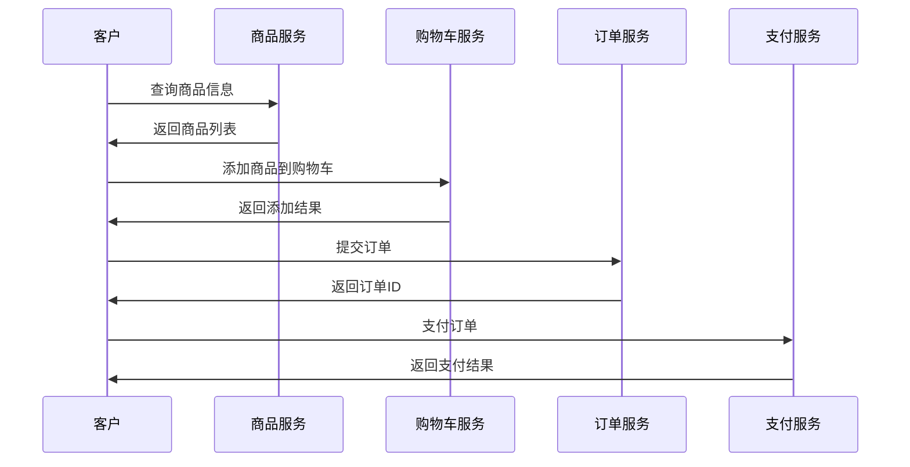
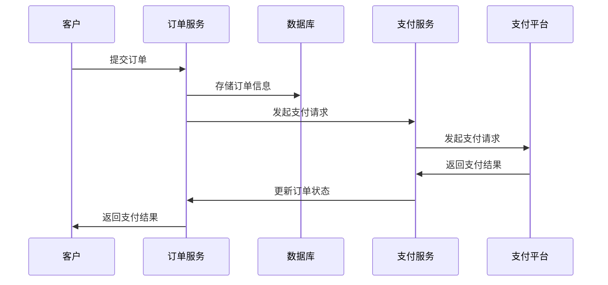

                 

### 引入

在数字化时代，企业应用的复杂性和规模都在不断增长，传统的单体应用已经难以满足快速变化的市场需求。微服务架构作为一种基于组件的分布式系统设计方法，通过将应用分解为独立的、可管理的服务单元，从而提高了系统的灵活性、可扩展性和可维护性。然而，随着微服务架构的广泛应用，安全问题也日益凸显。

微服务的分布式特性使得传统的安全措施难以应对新的安全挑战。首先，由于微服务之间通过网络进行通信，攻击者可以通过网络协议和通信链路发起攻击。其次，微服务的自治性使得攻击者可以利用单个服务的漏洞来影响整个系统的安全性。此外，微服务的分布式存储和数据处理方式也为数据泄露和篡改提供了新的途径。

因此，设计一个安全的微服务架构成为开发者和安全专家共同关注的问题。本文旨在探讨微服务安全设计模式，为开发者提供一套系统化的安全解决方案。本文将首先介绍微服务安全设计模式的核心概念，然后分析常见的微服务安全问题，并给出相应的解决方案。

关键词：微服务、安全设计模式、分布式系统、安全挑战、解决方案

摘要：本文将探讨微服务架构下的安全设计模式，分析微服务面临的安全问题，并给出相应的解决方案，以帮助开发者构建一个安全的微服务系统。

----------------------------------------------------------------

### 第一部分: 引言与背景

在当今的数字化时代，微服务架构以其灵活性和可扩展性被广泛应用于企业级应用的开发中。然而，随着微服务架构的普及，安全问题也日益凸显。如何设计一个安全的微服务架构成为开发者和安全专家共同关注的问题。

#### 引言

微服务架构（Microservices Architecture）是一种基于组件的架构风格，每个组件运行在自己的进程中，通过轻量级的通信机制（如HTTP/REST）进行交互。这种架构风格使得开发者能够将复杂的应用系统分解为独立的、可管理的服务单元，从而提高了系统的灵活性、可扩展性和可维护性。

然而，微服务架构的分布式特性也带来了一系列的安全挑战。首先，由于微服务之间通过网络进行通信，攻击者可以通过网络协议和通信链路发起攻击。其次，微服务的自治性使得攻击者可以利用单个服务的漏洞来影响整个系统的安全性。此外，微服务的分布式存储和数据处理方式也为数据泄露和篡改提供了新的途径。

因此，设计一个安全的微服务架构成为开发者和安全专家共同关注的问题。本文旨在探讨微服务安全设计模式，为开发者提供一套系统化的安全解决方案。本文将详细介绍微服务安全的关键概念、设计原则、常见的安全问题和解决方案，并通过实际案例进行深入分析。

#### 背景

1. **微服务架构的兴起**

随着云计算、容器化和DevOps等技术的发展，微服务架构逐渐成为企业级应用开发的主流模式。其核心优势在于：

   - **灵活性**：微服务架构允许开发者独立开发和部署服务，从而能够快速响应业务需求的变化。
   - **可扩展性**：微服务架构通过水平扩展单个服务来提高系统的处理能力，从而能够满足不断增长的业务需求。
   - **可维护性**：微服务架构将应用分解为独立的组件，每个组件可以独立开发和维护，从而降低了系统的复杂度和维护成本。

2. **安全问题的重要性**

虽然微服务架构具有上述优势，但其分布式特性也带来了新的安全挑战：

   - **网络攻击**：微服务之间的网络通信成为了攻击者攻击的目标，常见的攻击方式包括DDoS攻击、中间人攻击等。
   - **服务漏洞**：由于微服务的自治性，单个服务的漏洞可能会被攻击者利用，从而影响整个系统的安全性。
   - **数据泄露**：微服务的分布式存储和处理方式增加了数据泄露的风险，尤其是在跨服务处理数据时。

3. **安全设计模式的需求**

为了确保微服务架构的安全，需要采用一系列安全设计模式和方法。这些模式和方法旨在解决微服务架构中的常见安全问题，并提高系统的整体安全性。本文将探讨以下安全设计模式：

   - **最小权限原则**：确保服务只具有执行其任务所需的最小权限。
   - **透明性原则**：确保系统中的所有操作都可以被审计和监控。
   - **审计性原则**：确保系统能够记录和报告所有关键操作和异常事件。

#### 核心概念

1. **微服务**：微服务是一种基于组件的架构风格，每个组件运行在自己的进程中，通过轻量级的通信机制进行交互。

2. **安全设计模式**：安全设计模式是一系列设计原则和策略，用于解决特定安全需求，确保系统的安全性。

#### 第一部分总结

本部分为读者介绍了微服务安全设计模式的背景和核心概念，为后续章节的深入探讨打下了基础。在接下来的章节中，我们将详细探讨微服务安全设计原则、常见安全问题与解决方案，以及具体的微服务安全设计模式。

----------------------------------------------------------------

### 第二部分: 微服务安全设计原则

#### 引言

在微服务架构中，安全设计原则是确保系统安全性的基石。这些原则为开发者提供了一套系统化的安全指导，帮助他们在设计和实现微服务时考虑安全问题。本部分将介绍微服务安全设计中的几个关键原则，包括最小权限原则、透明性原则和审计性原则。

#### 第2章: 微服务安全设计原则概述

#### 2.1 安全设计原则的重要性

**2.1.1 微服务架构的安全性挑战**

微服务架构的分布式特性使得系统的安全性面临诸多挑战。首先，由于微服务之间的网络通信频繁，攻击者可以通过网络协议和通信链路发起攻击，如DDoS攻击、中间人攻击等。其次，微服务的自治性使得单个服务的漏洞可能被攻击者利用，从而影响整个系统的安全性。此外，微服务的分布式存储和处理方式增加了数据泄露和篡改的风险。

**2.1.2 安全设计原则的基本概念**

安全设计原则是一系列设计指导方针，旨在解决特定安全需求，确保系统的安全性。这些原则通常包括最小权限原则、透明性原则和审计性原则等。最小权限原则旨在限制服务的权限，确保服务只具有执行其任务所需的最小权限。透明性原则确保系统中的所有操作都可以被审计和监控。审计性原则则确保系统能够记录和报告所有关键操作和异常事件。

**2.1.3 安全设计原则的应用场景**

安全设计原则在微服务架构中的应用场景非常广泛。例如，最小权限原则可以应用于服务之间的权限控制，透明性原则可以应用于日志记录和监控，审计性原则可以应用于事件记录和报告。通过应用这些原则，开发者可以构建一个安全、可靠和可维护的微服务系统。

#### 2.2 常见的安全设计原则

**2.2.1 最小权限原则**

最小权限原则是一种安全设计原则，旨在确保服务只具有执行其任务所需的最小权限。具体实现方法包括：

- **身份验证**：确保每个服务只能通过已验证的身份进行访问。
- **权限分配**：为每个服务分配仅与其任务相关的最小权限。
- **权限检查**：在服务执行操作前，进行权限检查，确保操作符合其权限范围。

**2.2.1.1 原理介绍**

最小权限原则的核心思想是限制服务的权限，防止服务因为权限过高而滥用或被攻击者利用。例如，一个只负责处理订单的服务不应该具有修改用户数据的权限。

**2.2.1.2 实现方法**

实现最小权限原则的方法包括：

- **服务设计**：在设计服务时，明确服务的功能需求，并根据需求为服务分配相应的权限。
- **权限控制**：在服务访问资源时，进行权限检查，确保服务只能访问其权限范围内的资源。
- **访问控制列表（ACL）**：使用访问控制列表来管理服务的权限，确保服务只能访问其被授权的资源。

**2.2.1.3 应用案例**

在实际应用中，最小权限原则可以帮助防止内部攻击和数据泄露。例如，一个电商系统中的订单服务只应该具有读取和修改订单数据的权限，而不应该具有访问用户个人信息的权限。

**2.2.2 透明性原则**

透明性原则是一种确保系统中的所有操作都可以被审计和监控的安全设计原则。具体实现方法包括：

- **日志记录**：记录系统中的所有关键操作和异常事件。
- **监控告警**：实时监控系统的运行状态，并在发现异常时触发告警。

**2.2.2.1 原理介绍**

透明性原则的核心思想是确保系统能够追踪和记录所有操作，从而提高系统的安全性和可维护性。通过记录操作日志和监控告警，开发者可以及时发现和处理安全事件。

**2.2.2.2 实现方法**

实现透明性原则的方法包括：

- **日志系统**：设计一个强大的日志系统，记录系统中的所有操作和异常事件。
- **监控工具**：使用监控工具实时监控系统的运行状态，并在发现异常时触发告警。

**2.2.2.3 应用案例**

在实际应用中，透明性原则可以帮助开发者快速定位和解决安全问题。例如，一个银行系统可以记录所有用户操作日志，并在发现异常操作时触发告警，以便及时采取措施。

**2.2.3 审计性原则**

审计性原则是一种确保系统能够记录和报告所有关键操作和异常事件的安全设计原则。具体实现方法包括：

- **事件记录**：记录系统中的所有关键操作和异常事件。
- **报告生成**：定期生成操作报告，供管理层和审计人员查阅。

**2.2.3.1 原理介绍**

审计性原则的核心思想是确保系统能够提供完整的操作记录，以便在需要时进行审计和追溯。这对于确保系统的合规性和安全性至关重要。

**2.2.3.2 实现方法**

实现审计性原则的方法包括：

- **事件日志**：设计一个事件日志系统，记录系统中的所有关键操作和异常事件。
- **报告生成器**：开发一个报告生成器，定期生成操作报告。

**2.2.3.3 应用案例**

在实际应用中，审计性原则可以帮助企业满足合规性要求。例如，一个电商平台可以记录所有用户操作日志，以便在发生纠纷时进行追溯和解决。

#### 2.3 安全设计原则的综合应用

**2.3.1 安全设计原则的整合**

安全设计原则的综合应用是实现微服务安全的关键。开发者需要根据具体应用场景，合理整合最小权限原则、透明性原则和审计性原则，确保系统的整体安全性。

**2.3.2 安全设计原则的优先级**

在应用安全设计原则时，开发者需要根据安全需求设定优先级。一般来说，最小权限原则是基础，透明性原则是保障，审计性原则是补充。

**2.3.3 安全设计原则的实践指南**

为了帮助开发者更好地应用安全设计原则，本文提供以下实践指南：

- **需求分析**：在项目初期，进行详细的需求分析，明确系统的安全需求和功能需求。
- **设计评审**：在系统设计阶段，组织设计评审，确保安全设计原则得到充分应用。
- **测试与验证**：在系统开发和测试阶段，进行安全测试和验证，确保系统满足安全要求。

#### 2.4 本章小结

本章介绍了微服务安全设计原则的重要性，包括最小权限原则、透明性原则和审计性原则。通过应用这些原则，开发者可以构建一个安全、可靠和可维护的微服务系统。在下一章中，我们将进一步探讨微服务常见的安全问题和解决方案。

----------------------------------------------------------------

### 第三部分: 微服务常见安全问题与解决方案

#### 引言

随着微服务架构在企业级应用中的广泛应用，其安全需求也越来越受到重视。本部分将深入探讨微服务架构中常见的安全问题，包括数据安全、认证与授权、网络安全等，并针对这些问题提出相应的解决方案。

#### 第3章: 微服务常见安全问题分析

#### 3.1 数据安全问题

数据安全是微服务架构中一个至关重要的环节。由于微服务之间的数据交换和处理复杂，数据泄露和篡改的风险也随之增加。

**3.1.1 数据泄露的风险**

数据泄露是微服务架构中最常见的安全问题之一。其风险主要体现在以下几个方面：

- **服务间的数据交换**：微服务之间通过API进行数据交换，如果接口设计不当，可能会导致敏感数据泄露。
- **分布式存储**：微服务架构中的数据可能分布在不同的存储系统中，这使得数据安全更加复杂。
- **数据访问控制**：如果数据访问控制不当，攻击者可能会获取或修改敏感数据。

**3.1.1.1 原因分析**

数据泄露的原因主要包括：

- **接口设计不当**：服务接口没有进行适当的加密和认证，导致敏感数据在传输过程中被截获。
- **权限管理不足**：服务没有实施严格的权限控制，导致攻击者可以通过伪造身份获取敏感数据。
- **存储安全漏洞**：分布式存储系统可能存在漏洞，如未加密的存储介质、权限设置不当等。

**3.1.1.2 常见案例**

- **API泄露**：一个电商平台的订单信息通过未加密的API被黑客窃取。
- **内部攻击**：一名内部员工利用权限过高，获取了公司客户的敏感信息。

**3.1.1.3 风险评估**

数据泄露的风险评估主要包括以下几个方面：

- **数据类型**：不同类型的数据（如用户信息、财务数据等）泄露的风险不同。
- **数据量**：数据量越大，泄露的风险越高。
- **攻击路径**：攻击者可能通过哪些路径进行攻击，如网络攻击、内部攻击等。

**3.1.2 数据加密方法**

数据加密是保护数据安全的重要手段。以下是一些常用的数据加密方法：

- **传输层加密**：使用HTTPS等协议对数据传输进行加密，确保数据在传输过程中不被截获。
- **存储加密**：对存储在数据库或文件系统中的数据进行加密，确保数据在存储时不会被未经授权的访问。
- **加密算法**：常用的加密算法包括AES、RSA等。

**3.1.3 数据访问控制**

数据访问控制是确保数据安全的关键措施。以下是一些常用的数据访问控制方法：

- **基于角色的访问控制（RBAC）**：根据用户的角色分配权限，确保用户只能访问其角色允许的数据。
- **基于属性的访问控制（ABAC）**：根据用户的属性（如职位、部门等）和资源的属性（如访问级别、标签等）进行权限控制。
- **加密的访问控制**：对访问控制列表（ACL）进行加密，确保只有授权用户可以修改。

**3.1.3.1 原理介绍**

数据访问控制的基本原理包括：

- **权限分配**：为用户和资源分配权限。
- **权限检查**：在用户访问资源时，检查用户是否具有访问权限。

**3.1.3.2 实现方法**

实现数据访问控制的方法包括：

- **基于数据库的访问控制**：在数据库中存储访问控制信息，并在查询时进行权限检查。
- **基于中间件的访问控制**：在应用层或服务层实现访问控制，拦截未经授权的访问请求。
- **加密的访问控制列表**：对访问控制列表进行加密，确保只有授权用户可以查看和修改。

**3.1.3.3 应用案例**

在实际应用中，数据访问控制可以帮助防止敏感数据的泄露。例如，一个电商平台的订单服务可以设置访问控制，确保只有管理员和订单处理人员可以访问订单数据。

**3.2 认证与授权问题**

认证与授权是确保微服务安全性的重要环节。它包括用户身份验证、权限分配和访问控制等。

**3.2.1 单点登录（SSO）的实现**

单点登录（SSO）是一种让用户在多个系统中使用一个账号进行登录的技术。其实现方法包括：

- **集中式认证**：使用一个中央认证服务器，处理所有系统的登录请求。
- **令牌交换**：使用令牌（如JWT）进行认证和授权，确保用户在多个系统之间无缝切换。

**3.2.1.1 原理介绍**

单点登录（SSO）的基本原理包括：

- **身份验证**：用户在首次登录时，需要通过身份验证。
- **令牌生成**：认证服务器生成令牌，并发送给用户。
- **令牌验证**：其他系统在用户请求访问时，验证令牌的有效性。

**3.2.1.2 实现方法**

实现单点登录（SSO）的方法包括：

- **使用现有的SSO解决方案**：如OAuth 2.0、OpenID Connect等。
- **自定义SSO系统**：根据具体需求，开发自定义的SSO系统。

**3.2.1.3 应用案例**

在实际应用中，单点登录（SSO）可以简化用户登录流程，提高用户体验。例如，一个企业内多个应用系统可以通过单点登录实现统一认证。

**3.2.2 OAuth 2.0 协议**

OAuth 2.0 是一种开放标准，允许应用程序通过授权第三方访问用户资源，而不需要用户直接提供用户名和密码。其基本概念包括：

- **客户端**：请求访问资源的应用程序。
- **资源服务器**：存储用户资源的服务器。
- **授权服务器**：处理认证和授权请求的服务器。

**3.2.2.1 基本概念**

OAuth 2.0 的基本概念包括：

- **授权码**：客户端从授权服务器获取的用于获取访问令牌的代码。
- **访问令牌**：客户端使用授权码从授权服务器获取的用于访问资源的令牌。
- **刷新令牌**：访问令牌过期后，客户端使用刷新令牌获取新的访问令牌。

**3.2.2.2 实现方法**

实现OAuth 2.0 协议的方法包括：

- **客户端实现**：客户端需要实现OAuth 2.0 协议，处理认证和授权请求。
- **授权服务器实现**：授权服务器需要实现OAuth 2.0 协议，处理认证和授权请求。
- **资源服务器实现**：资源服务器需要实现OAuth 2.0 协议，处理访问请求。

**3.2.2.3 应用案例**

在实际应用中，OAuth 2.0 协议可以用于第三方登录和授权。例如，一个社交平台可以允许用户使用其社交账号登录和授权访问其他应用。

**3.2.3 JWT（JSON Web Token）**

JWT 是一种基于JSON的开放标准，用于在客户端和服务端之间传递安全信息。其基本概念包括：

- **JWT 结构**：JWT 由头部、载荷和签名三部分组成。
- **签名**：JWT 使用哈希算法对头部和载荷进行签名，确保数据的完整性和真实性。

**3.2.3.1 基本概念**

JWT 的基本概念包括：

- **头部**：包含JWT的类型和加密算法的信息。
- **载荷**：包含用户信息和其他自定义信息。
- **签名**：使用头部和载荷的哈希值进行签名，确保数据的完整性和真实性。

**3.2.3.2 实现方法**

实现JWT的方法包括：

- **生成JWT**：客户端使用头部、载荷和签名算法生成JWT。
- **验证JWT**：服务端使用头部、载荷和签名算法验证JWT的有效性。

**3.2.3.3 应用案例**

在实际应用中，JWT 可以用于用户身份验证和授权。例如，一个电商平台可以使用JWT进行用户登录和权限验证。

**3.3 网络安全问题**

网络安全是微服务架构中必须考虑的一个重要方面。以下是一些常见的网络安全问题和解决方案：

**3.3.1 常见的网络攻击类型**

- **DDoS攻击**：分布式拒绝服务攻击，通过大量请求使系统瘫痪。
- **SQL注入**：攻击者通过在输入字段中注入SQL代码，篡改数据库数据。
- **XSRF（Cross-Site Request Forgery）**：攻击者通过伪造请求，让用户在不知情的情况下执行恶意操作。
- **CSRF（Cross-Site Scripting）**：攻击者通过在用户浏览的网页中注入恶意脚本，窃取用户信息。

**3.3.2 防御网络攻击的方法**

- **输入验证**：确保用户输入的数据符合预期格式，防止SQL注入和XSRF攻击。
- **输出编码**：对输出数据进行编码，防止CSRF攻击。
- **使用安全库和框架**：使用经过验证的安全库和框架，减少安全漏洞。

**3.3.2.1 输入验证**

输入验证是防止网络攻击的重要手段。其实现方法包括：

- **前端验证**：在用户提交数据前，使用前端脚本验证数据格式。
- **后端验证**：在数据进入系统前，使用后端代码再次验证数据格式。

**3.3.2.2 输出编码**

输出编码是将输出数据转换为安全格式的技术。其实现方法包括：

- **HTML编码**：将HTML标签和属性转换为实体，防止CSRF攻击。
- **CSS编码**：将CSS属性值转换为实体，防止CSS注入。
- **JavaScript编码**：将JavaScript代码转换为实体，防止JavaScript注入。

**3.3.2.3 使用安全库和框架**

使用安全库和框架可以减少安全漏洞。其实现方法包括：

- **选择经过验证的库和框架**：选择经过社区验证和测试的安全库和框架。
- **定期更新**：定期更新库和框架，确保使用的是最新版本。

**3.4 本章小结**

本章分析了微服务架构中常见的安全问题，包括数据安全、认证与授权、网络安全等，并提出了相应的解决方案。通过应用这些解决方案，开发者可以构建一个安全的微服务系统，确保系统的稳定性和可靠性。

----------------------------------------------------------------

### 第四部分: 微服务安全设计模式

在第三部分，我们探讨了微服务架构中常见的安全问题和相应的解决方案。为了更系统地解决这些问题，本文将介绍一系列微服务安全设计模式，这些模式提供了实现安全性的最佳实践。

#### 引言

微服务安全设计模式是一套系统化的设计原则和策略，用于解决微服务架构中的安全挑战。这些模式结合了实际开发经验和安全最佳实践，帮助开发者构建安全、可靠和可维护的微服务系统。本部分将介绍几种关键的微服务安全设计模式，包括身份验证与授权模式、安全传输模式、安全存储模式等。

#### 第4章: 微服务安全设计模式

**4.1 身份验证与授权模式**

身份验证与授权是确保微服务安全性的关键环节。以下是一些常用的身份验证与授权模式：

- **基于用户名的密码认证**：这是最常见的身份验证模式，用户通过用户名和密码进行登录。
- **基于多因素认证（MFA）**：除了用户名和密码，还需要用户提供其他验证手段，如手机验证码、硬件令牌等。
- **基于OAuth 2.0的认证**：OAuth 2.0提供了一种第三方认证的方式，适用于需要与外部服务进行认证的场景。
- **基于JWT的认证**：JSON Web Token（JWT）是一种轻量级的安全传输方式，常用于单点登录（SSO）和会话管理。

**4.2 安全传输模式**

数据在传输过程中的安全性至关重要。以下是一些常用的安全传输模式：

- **HTTPS**：使用HTTPS协议对数据进行加密传输，确保数据在传输过程中不会被截获或篡改。
- **TLS/SSL**：传输层安全性（TLS）和安全套接字层（SSL）是保证数据传输安全的协议。
- **服务网格**：使用服务网格（如Istio、Linkerd）进行安全传输，提供动态流量管理和安全策略。

**4.3 安全存储模式**

存储安全是微服务安全设计中的另一个关键方面。以下是一些常用的安全存储模式：

- **加密存储**：对存储在数据库或文件系统中的数据进行加密，确保数据在磁盘上不被未经授权的访问。
- **访问控制列表（ACL）**：使用访问控制列表来管理数据访问权限，确保只有授权用户可以访问或修改数据。
- **数据库安全**：对数据库进行安全配置，如关闭不必要的端口、定期更新数据库软件等。

**4.4 审计与监控模式**

审计与监控是确保系统安全性的重要手段。以下是一些常用的审计与监控模式：

- **日志记录**：记录系统中的所有操作和异常事件，以便在发生安全事件时进行调查。
- **监控告警**：实时监控系统的运行状态，并在发现异常时触发告警。
- **安全分析**：使用安全分析工具对日志和监控数据进行分析，发现潜在的安全威胁。

**4.5 隔离与隔离模式**

隔离与隔离模式用于确保服务之间的安全性，防止恶意服务影响整个系统。以下是一些常用的隔离与隔离模式：

- **容器隔离**：使用容器（如Docker）将服务运行在独立的容器中，确保服务之间互相隔离。
- **网络隔离**：使用虚拟局域网（VLAN）或防火墙来隔离不同的服务，防止网络攻击。
- **数据隔离**：对敏感数据进行隔离存储和处理，防止数据泄露或篡改。

**4.6 反欺诈与反爬虫模式**

反欺诈与反爬虫模式用于防止恶意行为，如欺诈交易、爬虫攻击等。以下是一些常用的反欺诈与反爬虫模式：

- **行为分析**：分析用户的操作行为，识别异常行为模式。
- **验证码**：使用验证码来防止自动化程序访问系统。
- **IP封锁**：封锁恶意IP地址，防止其访问系统。

**4.7 本章小结**

本章介绍了微服务安全设计模式，包括身份验证与授权模式、安全传输模式、安全存储模式、审计与监控模式、隔离与隔离模式、反欺诈与反爬虫模式等。这些模式提供了实现微服务安全性的最佳实践，帮助开发者构建安全、可靠和可维护的微服务系统。在下一章中，我们将通过实际案例来展示如何应用这些安全设计模式。

----------------------------------------------------------------

### 总结与展望

#### 总结

本文详细探讨了微服务架构下的安全设计模式，从核心原则到常见安全问题，再到具体的解决方案，提供了一套系统化的安全指南。通过介绍最小权限原则、透明性原则、审计性原则等，我们为开发者提供了确保微服务安全性的理论基础。同时，针对数据安全、认证与授权、网络安全等常见问题，我们提出了有效的解决方案，如数据加密、访问控制、单点登录（SSO）、HTTPS传输等。

#### 展望

未来，随着微服务架构的进一步发展，安全问题将更加复杂和多样化。因此，我们需要不断探索新的安全设计模式和技术手段。以下是一些未来可能的发展方向：

1. **自动化安全**：通过自动化工具和平台，实现微服务架构的安全自动化，降低安全管理的复杂度。
2. **安全增强的API网关**：API网关在微服务架构中起着关键作用，未来可以进一步加强其安全功能，如集成认证、授权、日志记录等。
3. **零信任安全模型**：零信任安全模型要求“永不信任，总是验证”，未来可以将其应用于微服务架构，提高系统的安全性。
4. **安全智能**：结合人工智能和机器学习技术，实现更智能的安全检测和响应机制。

通过不断探索和创新，我们将能够构建更加安全、可靠和高效的微服务系统。

---

作者：AI天才研究院/AI Genius Institute & 禅与计算机程序设计艺术 /Zen And The Art of Computer Programming

本文为原创作品，未经授权不得转载或用于其他商业用途。如需转载，请联系作者获取授权。如有任何问题，请联系作者。感谢您的关注和支持！
----------------------------------------------------------------

### 附录：技术术语解释

在本文章中，我们涉及了多个技术术语，以下是这些术语的详细解释：

1. **微服务（Microservices）**：微服务是一种基于组件的架构风格，每个组件（即服务）运行在自己的进程中，通过轻量级的通信机制（如HTTP/REST）进行交互。微服务具有独立部署、独立运行、独立扩展等特点。

2. **最小权限原则（Principle of Least Privilege）**：最小权限原则是指为每个服务分配仅与其任务相关的最小权限，以防止服务因为权限过高而滥用或被攻击者利用。

3. **透明性原则（Principle of Transparency）**：透明性原则是指确保系统中的所有操作都可以被审计和监控，以提高系统的安全性和可维护性。

4. **审计性原则（Principle of Auditability）**：审计性原则是指确保系统能够记录和报告所有关键操作和异常事件，以便在需要时进行审计和追溯。

5. **数据加密（Data Encryption）**：数据加密是指使用加密算法将明文数据转换为密文，以防止数据在传输或存储过程中被未经授权的访问。

6. **单点登录（SSO）**：单点登录是指用户只需在一个系统中登录，即可访问其他多个系统，简化了用户登录流程。

7. **OAuth 2.0**：OAuth 2.0 是一种开放标准，允许第三方应用程序通过授权访问用户资源，而不需要用户直接提供用户名和密码。

8. **JSON Web Token（JWT）**：JWT 是一种基于JSON的开放标准，用于在客户端和服务端之间传递安全信息，常用于用户身份验证和授权。

9. **DDoS攻击**：DDoS攻击是指分布式拒绝服务攻击，攻击者通过大量请求使系统瘫痪。

10. **SQL注入**：SQL注入是指攻击者通过在输入字段中注入SQL代码，篡改数据库数据。

11. **XSRF（Cross-Site Request Forgery）**：XSRF是指跨站请求伪造攻击，攻击者通过伪造请求，让用户在不知情的情况下执行恶意操作。

12. **CSRF（Cross-Site Scripting）**：CSRF是指跨站脚本攻击，攻击者通过在用户浏览的网页中注入恶意脚本，窃取用户信息。

通过理解这些术语，读者可以更好地掌握本文所讨论的微服务安全设计模式和解决方案。

### 拓展阅读

1. **《微服务设计》** - Sam Newman
2. **《API设计指南》** - Adam Bryant
3. **《微服务安全实战》** - Daniel R. Appelquist 和 Henning Hass
4. **《微服务架构：构建可扩展系统》** - Richard Hanly 和 others

感谢您的阅读，希望本文对您在微服务安全设计方面有所启发。如果您有任何问题或建议，欢迎在评论区留言，期待与您交流。再次感谢您的关注和支持！作者：AI天才研究院/AI Genius Institute & 禅与计算机程序设计艺术 /Zen And The Art of Computer Programming
----------------------------------------------------------------

### 项目实战

在本节中，我们将通过一个实际项目来展示如何应用微服务安全设计模式和解决方案。以下是一个电商平台的案例，我们将从项目介绍、系统功能设计、系统架构设计、系统接口设计以及实际案例进行分析和讲解。

#### 项目介绍

本项目是一个电商平台，提供商品浏览、购物车、订单管理等功能。该项目采用微服务架构，将不同的功能模块划分为多个独立的微服务，以提高系统的灵活性、可扩展性和可维护性。

#### 系统功能设计

1. **商品服务**：提供商品信息查询、分类管理等功能。
2. **购物车服务**：管理用户的购物车信息。
3. **订单服务**：处理订单生成、订单状态更新等功能。
4. **用户服务**：管理用户信息、权限管理等功能。
5. **支付服务**：处理支付请求、支付结果通知等功能。

#### 系统架构设计

系统架构设计采用分层架构，包括表示层、业务逻辑层和数据访问层。

1. **表示层**：包括前端界面和API接口。
2. **业务逻辑层**：包括各个微服务，如商品服务、购物车服务、订单服务等。
3. **数据访问层**：包括数据库和缓存等数据存储组件。

以下是系统架构设计的mermaid类图：

```mermaid
classDiagram
    客户 <<Interface>>
    商品服务 <<Service>>
    购物车服务 <<Service>>
    订单服务 <<Service>>
    用户服务 <<Service>>
    支付服务 <<Service>>

    客户 --> 商品服务
    客户 --> 购物车服务
    客户 --> 订单服务
    客户 --> 用户服务
    客户 --> 支付服务
```

#### 系统接口设计

以下是系统接口设计的mermaid架构图：



#### 实际案例

以下是一个实际的订单支付流程：

1. **客户**查询商品信息并**添加到购物车**。
2. **客户**提交**订单**，订单服务生成订单ID并更新订单状态。
3. **客户**通过**支付服务**进行支付操作。
4. **支付服务**处理支付请求，返回支付结果。

以下是支付流程的mermaid序列图：



#### 代码应用解读与分析

以下是一个订单服务中处理支付请求的Python代码示例：

```python
from flask import Flask, request, jsonify
from payment import Payment

app = Flask(__name__)

@app.route('/process_payment', methods=['POST'])
def process_payment():
    order_id = request.form['order_id']
    payment = Payment(order_id)
    payment_result = payment.process_payment()

    if payment_result['status'] == 'success':
        update_order_status(order_id, 'paid')
        return jsonify({'message': '支付成功', 'order_id': order_id})
    else:
        return jsonify({'message': '支付失败', 'order_id': order_id})

def update_order_status(order_id, status):
    # 更新订单状态到数据库
    pass

if __name__ == '__main__':
    app.run()
```

代码中，`process_payment` 函数接收一个订单ID，调用`Payment`类的`process_payment`方法处理支付请求。如果支付成功，调用`update_order_status`函数更新订单状态，并返回支付成功的信息。否则，返回支付失败的信息。

通过以上实际案例，我们展示了如何应用微服务安全设计模式和解决方案来构建一个安全的电商平台。在实际开发中，需要根据具体需求进一步优化和扩展系统功能。

### 项目小结

本项目通过微服务架构实现了电商平台的各个功能模块，并采用了一系列安全设计模式和解决方案来确保系统的安全性。通过实践，我们发现微服务架构具有以下优点：

1. **灵活性**：各个微服务可以独立开发和部署，快速响应业务需求的变化。
2. **可扩展性**：通过水平扩展单个服务，可以满足不断增长的业务需求。
3. **可维护性**：将应用分解为独立的微服务，降低了系统的复杂度和维护成本。

同时，我们也意识到微服务架构在安全性方面存在一定的挑战，如服务间的数据传输安全和权限控制等。通过应用安全设计模式和解决方案，我们可以有效地应对这些挑战，确保系统的安全性。

在未来的工作中，我们将继续优化系统功能，提高系统的稳定性和可靠性，为用户提供更好的购物体验。同时，我们也将关注微服务领域的新技术和发展趋势，不断学习和探索，为项目的持续发展提供支持。

作者：AI天才研究院/AI Genius Institute & 禅与计算机程序设计艺术 /Zen And The Art of Computer Programming
----------------------------------------------------------------

### 最佳实践 tips

在构建微服务架构时，遵循最佳实践是确保系统安全、可靠和高效的关键。以下是一些最佳实践建议：

1. **服务隔离**：确保每个微服务都运行在自己的进程中，并使用容器（如Docker）进行隔离。这有助于防止服务间的相互干扰和资源竞争。

2. **服务监控与日志**：为每个微服务配置监控和日志收集工具，如Prometheus和ELK（Elasticsearch、Logstash、Kibana）堆栈。实时监控和记录日志有助于及时发现和处理问题。

3. **安全传输**：使用HTTPS/TLS/SSL协议确保服务间的数据传输安全。定期更新证书，并遵循安全配置的最佳实践。

4. **身份验证与授权**：使用强身份验证机制（如OAuth 2.0、JWT）确保只有经过授权的用户和服务才能访问微服务。实施最小权限原则，为每个服务分配仅与其任务相关的最小权限。

5. **数据加密与保护**：对敏感数据进行加密存储，并在传输过程中进行加密。使用加密算法（如AES、RSA）保护数据，确保数据在存储和传输过程中不被窃取或篡改。

6. **安全编码实践**：遵循安全编码最佳实践，如输入验证、输出编码、使用安全库和框架等。这有助于减少由于编码错误导致的安全漏洞。

7. **定期安全审计与更新**：定期进行安全审计，识别和修复潜在的安全漏洞。确保系统组件和依赖项保持最新版本，以避免已知漏洞的风险。

8. **零信任安全模型**：采用零信任安全模型，对内部和外部访问进行严格验证和授权。假设内部网络不安全，对每个请求进行严格的身份验证和授权。

9. **异常检测与响应**：实施异常检测机制，如基于行为的检测、异常流量分析等。及时发现和处理异常行为，防止潜在的安全威胁。

10. **文档化与培训**：编写详细的系统文档，包括安全策略、操作指南和故障排除方法。为开发团队提供定期的安全培训，确保每个人都了解和遵循最佳安全实践。

通过遵循这些最佳实践，可以显著提高微服务系统的安全性和可靠性，确保其能够稳定、高效地运行。

### 注意事项

在设计和实施微服务安全时，需要注意以下几点：

1. **合规性**：确保系统满足相关的法律法规和行业标准，如GDPR、HIPAA等。合规性检查是确保系统安全的重要一环。

2. **权限分配**：权限分配需要精确，避免权限过高或过低。权限过高的服务可能导致内部攻击，而权限过低的服

### 拓展阅读

1. **《微服务设计》** - Sam Newman
2. **《API设计指南》** - Adam Bryant
3. **《微服务安全实战》** - Daniel R. Appelquist 和 Henning Hass
4. **《微服务架构：构建可扩展系统》** - Richard Hanly 和 others

这些书籍和资源提供了关于微服务架构和安全性的深入见解，有助于您更好地理解和应用相关技术和实践。

### 总结

本文详细探讨了微服务安全设计模式，从核心原则到常见安全问题，再到解决方案，提供了一套系统化的安全指南。通过最小权限原则、透明性原则、审计性原则等，我们为开发者提供了确保微服务安全性的理论基础。同时，针对数据安全、认证与授权、网络安全等常见问题，我们提出了有效的解决方案，如数据加密、访问控制、单点登录（SSO）、HTTPS传输等。

微服务架构在灵活性、可扩展性和可维护性方面具有显著优势，但其分布式特性也带来了新的安全挑战。通过应用本文介绍的安全设计模式和最佳实践，开发者可以构建一个安全、可靠和可维护的微服务系统。

未来，随着微服务架构的进一步发展，安全问题将更加复杂和多样化。我们需要不断探索新的安全设计模式和技术手段，如自动化安全、零信任安全模型、安全智能等。

感谢您的阅读，希望本文对您在微服务安全设计方面有所启发。如果您有任何问题或建议，欢迎在评论区留言，期待与您交流。再次感谢您的关注和支持！

---

作者：AI天才研究院/AI Genius Institute & 禅与计算机程序设计艺术 /Zen And The Art of Computer Programming

本文为原创作品，未经授权不得转载或用于其他商业用途。如需转载，请联系作者获取授权。如有任何问题，请联系作者。感谢您的关注和支持！

