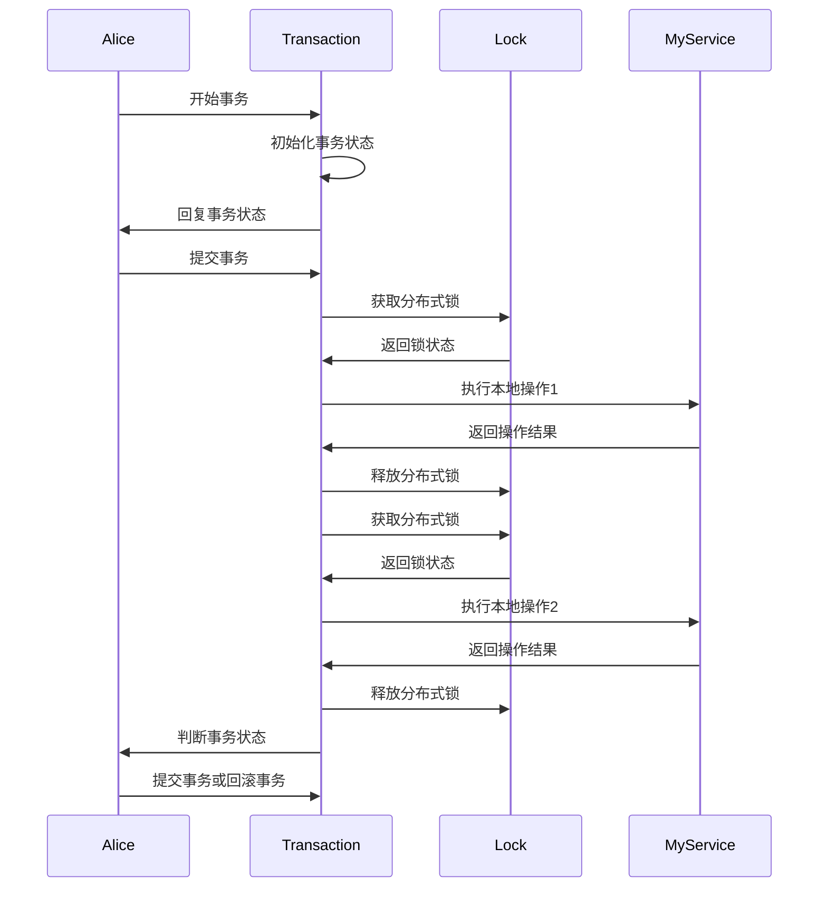
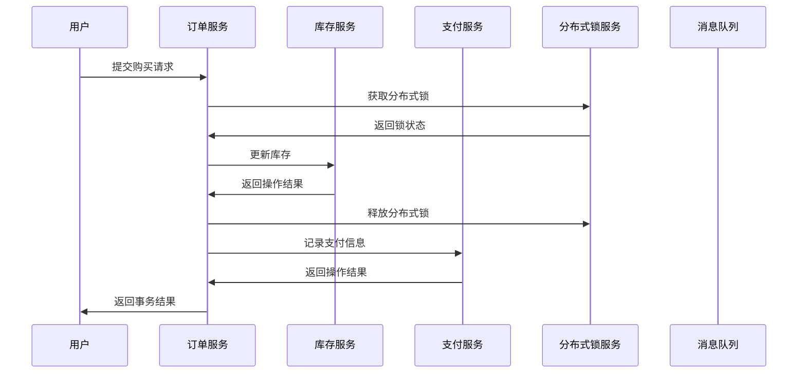

                 

# 微服务数据一致性：分布式事务处理

## 关键词：微服务、数据一致性、分布式事务、两阶段提交、消息队列、数据库分库分表

> 摘要：本文旨在深入探讨微服务架构中的数据一致性问题和分布式事务处理机制。通过介绍微服务架构的起源与发展、数据一致性的原理与模型、分布式事务处理机制以及具体实现方案，本文旨在为开发者提供全面的理解和实践指南。

----------------------------------------------------------------

## 引言与背景

随着互联网和云计算技术的迅猛发展，软件系统越来越复杂，单体架构已经难以满足业务快速迭代的需求。微服务架构作为一种应对复杂系统设计的解决方案，逐渐成为业界主流。然而，在微服务架构中，数据一致性问题成为了一个挑战。本文将围绕微服务数据一致性和分布式事务处理展开讨论。

### 第1章：微服务架构与分布式系统概述

#### 1.1.1 微服务架构的起源与发展

微服务架构的概念最早由Martin Fowler和James Lewis于2011年提出。它将一个复杂的单体应用拆分为一组小而独立的服务，每个服务负责完成特定的业务功能。这种架构具有以下几个显著特点：

1. **独立性**：每个服务都是独立的组件，可以单独部署和扩展。
2. **可扩展性**：通过水平扩展单个服务实例来提高系统的吞吐量。
3. **高可用性**：服务的故障不会影响整个系统的正常运行。
4. **松耦合**：服务之间通过轻量级的通信协议（如HTTP/REST、消息队列等）进行交互，降低服务之间的依赖。

微服务架构的起源可以追溯到单体架构的局限性。随着业务规模不断扩大，单体架构的维护成本高、扩展性差，难以适应快速变化的业务需求。为了解决这些问题，开发者开始探索将系统拆分成更小的、自治的服务，以实现更高效、更灵活的系统设计。

#### 1.1.2 微服务与分布式系统的关系

微服务架构本质上是一种分布式系统架构。分布式系统是指通过网络连接的多个节点共同协作完成任务的系统。在微服务架构中，每个微服务都可以看作是一个分布式节点，它们通过网络进行通信，共同构成一个分布式系统。

与传统的分布式系统相比，微服务架构具有以下特点：

1. **自治性**：每个微服务都是自包含的，具有独立的数据存储和业务逻辑。
2. **分布式数据存储**：微服务架构中通常采用分布式数据库来存储数据，以实现数据的一致性。
3. **服务间通信**：服务间通信采用轻量级的通信协议，如HTTP/REST、消息队列等，以降低通信开销。

#### 1.1.3 微服务架构的优势与挑战

微服务架构具有很多优势，如可扩展性、高可用性和独立部署等。然而，在实现微服务架构的过程中，开发者也会面临一些挑战：

1. **复杂性**：微服务架构增加了系统的复杂性，需要开发者具备更高的技能和经验。
2. **数据一致性**：在分布式系统中，如何保证数据的一致性是一个重要问题。
3. **服务治理**：随着服务数量的增加，如何对服务进行有效的管理和监控也是一个挑战。

### 第2章：数据一致性原理与模型

数据一致性是指在分布式系统中，多个服务对同一数据的修改操作能够达到预期的一致状态。在分布式系统中，由于网络延迟、节点故障等原因，数据一致性问题经常发生。本文将介绍数据一致性的基本概念、数据不一致性的表现以及数据一致性的基本模型。

#### 2.1 数据一致性的定义与重要性

数据一致性是指多个分布式节点对同一数据的修改操作能够保持一致。在分布式系统中，数据一致性至关重要，因为它直接影响到系统的可靠性、可用性和数据完整性。

数据不一致性可能表现为：

1. **丢失更新**：一个修改操作未能成功保存，导致数据丢失。
2. **脏数据**：一个未完成或错误的修改操作被持久化，导致数据不准确。
3. **不一致性读取**：一个客户端读取到部分更新的数据，导致数据不一致。

为了保证数据的一致性，分布式系统需要实现以下机制：

1. **分布式锁**：确保同一时间只有一个节点能够对数据进行修改。
2. **版本控制**：通过版本号来确保数据修改的顺序。
3. **补偿事务**：在数据不一致时，通过补偿事务来恢复数据的一致性。

#### 2.2 数据一致性问题在分布式系统中的表现

在分布式系统中，数据一致性问题可能由于以下原因产生：

1. **网络延迟**：由于网络延迟，数据同步可能出现延迟，导致数据不一致。
2. **节点故障**：当某个节点发生故障时，其上的数据修改操作可能无法同步到其他节点。
3. **并发操作**：多个节点同时对同一数据进行修改，可能导致数据不一致。

数据不一致性问题可能引发以下问题：

1. **数据丢失**：由于网络故障或节点故障，数据可能无法正确同步。
2. **数据准确性**：数据不一致可能导致系统无法正确处理业务逻辑。
3. **业务中断**：数据不一致可能导致业务流程中断，影响用户体验。

#### 2.3 数据一致性的基本模型

数据一致性的基本模型包括强一致性、最终一致性和部分一致性等。这些模型根据对数据一致性的要求不同，提供了不同的解决方案。

1. **强一致性**：强一致性要求所有节点在同一时间看到相同的数据状态。实现强一致性通常需要分布式锁或两阶段提交协议。

2. **最终一致性**：最终一致性允许在一段时间内存在数据不一致，但最终会达到一致状态。实现最终一致性通常需要消息队列和补偿事务。

3. **部分一致性**：部分一致性允许在部分节点上存在数据不一致，但不要求全局一致性。实现部分一致性通常需要分布式缓存和一致性哈希。

### 第3章：分布式事务处理机制

在分布式系统中，事务是一个重要的概念，它用于确保一系列操作要么全部成功，要么全部失败。本文将介绍分布式事务处理的基本概念，以及两阶段提交协议、三阶段提交协议和TCC（Try, Confirm, Cancel）协议等分布式事务处理机制。

#### 3.1 分布式事务的定义与特点

分布式事务是指在分布式系统中，一组操作要么全部成功执行，要么全部失败回滚。分布式事务与传统事务的区别在于：

1. **跨节点操作**：分布式事务涉及多个节点上的操作，而传统事务通常只涉及单个节点。
2. **分布式锁**：分布式事务需要协调多个节点的锁资源，以防止并发冲突。
3. **异步提交**：分布式事务的提交通常是通过异步方式进行的，以避免阻塞其他操作。

#### 3.2 两阶段提交协议

两阶段提交（2PC）协议是一种经典的分布式事务处理机制，用于确保多个节点上的数据一致性。2PC协议分为两个阶段：

1. **准备阶段**：协调者发送准备消息给参与者，参与者执行本地事务并返回是否可以提交的消息。
2. **提交阶段**：协调者根据参与者的响应决定是否提交事务。如果所有参与者都同意提交，协调者发送提交消息给参与者，参与者执行提交操作；否则，协调者发送回滚消息给参与者，参与者执行回滚操作。

#### 3.3 三阶段提交协议

三阶段提交（3PC）协议是2PC协议的改进版，旨在解决2PC协议中的协调者单点故障问题。3PC协议分为三个阶段：

1. **准备阶段**：协调者发送prepare消息给参与者，参与者执行本地事务并返回是否可以提交的消息。
2. **预提交阶段**：协调者根据参与者的响应决定是否进入预提交阶段。如果所有参与者都同意提交，协调者发送预提交消息给参与者，参与者执行预提交操作；否则，协调者发送中止消息给参与者，参与者执行回滚操作。
3. **提交阶段**：协调者根据参与者的响应决定是否提交事务。如果所有参与者都同意提交，协调者发送提交消息给参与者，参与者执行提交操作；否则，协调者发送中止消息给参与者，参与者执行回滚操作。

#### 3.4 TCC（Try, Confirm, Cancel）协议

TCC协议是一种简化版的分布式事务处理机制，适用于一些对一致性要求不高的场景。TCC协议分为三个阶段：

1. **Try阶段**：尝试阶段，参与者执行本地事务并返回是否可以提交的消息。
2. **Confirm阶段**：确认阶段，如果参与者返回可以提交的消息，协调者发送确认消息给参与者，参与者执行提交操作；否则，协调者发送中止消息给参与者，参与者执行回滚操作。
3. **Cancel阶段**：取消阶段，当协调者无法接收到参与者的响应时，协调者发送取消消息给参与者，参与者执行回滚操作。

### 第4章：基于消息队列的事务处理

在分布式系统中，消息队列是一种常用的通信机制，用于实现服务间的解耦和异步处理。本文将介绍基于消息队列的事务处理方案，包括消息队列的基本概念、工作原理以及在实际应用中的具体实现。

#### 4.1 消息队列的基本概念与工作原理

消息队列是一种异步消息传递系统，用于在不同服务之间传递消息。消息队列的基本概念包括：

1. **消息**：消息是传递的数据单元，可以包含文本、图像、音频等多种类型。
2. **队列**：队列是一种先进先出（FIFO）的数据结构，用于存储消息。
3. **生产者**：生产者是消息的发送者，将消息放入消息队列中。
4. **消费者**：消费者是消息的接收者，从消息队列中读取消息并执行相应的操作。

消息队列的工作原理如下：

1. **生产者发送消息**：生产者将消息发送到消息队列。
2. **消费者接收消息**：消费者从消息队列中读取消息并执行相应的操作。
3. **消息传递**：消息在消息队列中传递，直到被消费者接收。

#### 4.2 基于消息队列的事务处理方案

基于消息队列的事务处理方案可以分为以下几类：

1. **发布-订阅模式**：生产者将消息发布到主题（Topic），消费者订阅主题并接收消息。这种模式可以实现高并发和消息广播。
2. **点对点模式**：生产者将消息发送到队列，消费者从队列中读取消息。这种模式适用于一对一的消息传递。
3. **消息持久化**：消息队列可以持久化消息，确保消息不会丢失。这种模式适用于需要可靠消息传递的场景。
4. **消息确认**：消费者在处理消息后，需要向生产者发送确认消息，确保消息已被正确处理。

#### 4.3 消息队列在分布式事务中的应用场景

消息队列在分布式事务处理中具有以下应用场景：

1. **异步处理**：消息队列可以用于实现服务间的异步处理，降低系统的响应时间。
2. **削峰填谷**：消息队列可以用于削峰填谷，缓解系统高峰期的压力。
3. **分布式一致性**：消息队列可以用于实现分布式一致性，确保数据在不同节点间的一致性。

### 第5章：数据库分库分表与一致性保障

在分布式系统中，数据库分库分表是一种常见的数据存储方案，用于解决单表数据量过大、查询性能下降等问题。本文将介绍数据库分库分表的基本原理，以及一致性保障策略和分布式数据库的一致性解决方案。

#### 5.1 数据库分库分表的基本原理

数据库分库分表是指将数据分散存储到多个数据库或数据表中，以实现数据的水平扩展。分库分表的基本原理包括：

1. **水平分库**：将数据分散存储到不同的数据库中，每个数据库负责一部分数据。
2. **水平分表**：将数据分散存储到不同的数据表中，每个表负责一部分数据。

分库分表具有以下优点：

1. **提高查询性能**：通过将数据分散存储，可以减少单表的数据量，提高查询性能。
2. **降低单点压力**：通过分库分表，可以降低单库或单表的访问压力。
3. **提高扩展性**：通过分库分表，可以更方便地实现数据的水平扩展。

#### 5.2 分库分表的一致性保障策略

分库分表的一致性保障策略主要包括以下几种：

1. **数据复制**：通过数据复制将数据同步到其他数据库或数据表，确保数据一致性。
2. **分布式锁**：通过分布式锁确保同一时间只有一个节点可以修改数据，避免并发冲突。
3. **事务管理**：通过分布式事务管理确保多个节点上的数据修改操作要么全部成功，要么全部失败。
4. **数据一致性检查**：通过定期检查数据一致性，发现并解决数据不一致问题。

#### 5.3 分布式数据库的一致性解决方案

分布式数据库的一致性解决方案主要包括以下几种：

1. **强一致性**：通过分布式锁或两阶段提交协议实现强一致性，确保所有节点在同一时间看到相同的数据状态。
2. **最终一致性**：通过消息队列和补偿事务实现最终一致性，允许在一段时间内存在数据不一致，但最终会达到一致状态。
3. **部分一致性**：通过分布式缓存和一致性哈希实现部分一致性，允许在部分节点上存在数据不一致，但不要求全局一致性。

### 第6章：分布式锁与版本控制

在分布式系统中，分布式锁和版本控制是确保数据一致性的重要机制。本文将介绍分布式锁的概念与实现，以及版本控制机制在数据一致性中的应用。

#### 6.1 分布式锁的概念与实现

分布式锁是一种确保在分布式环境下，多个进程或服务能够互斥访问共享资源的一种机制。分布式锁的基本概念包括：

1. **锁**：锁是一种控制共享资源访问的机制，用于确保同一时间只有一个进程或服务能够访问共享资源。
2. **锁的获取**：进程或服务在访问共享资源之前，需要先获取锁，确保其他进程或服务不能同时访问共享资源。
3. **锁的释放**：进程或服务在访问完共享资源后，需要释放锁，以便其他进程或服务可以获取锁并访问共享资源。

分布式锁的实现通常依赖于分布式存储系统或分布式协调服务，如ZooKeeper、Redis等。实现分布式锁的关键技术包括：

1. **互斥锁**：互斥锁确保同一时间只有一个进程或服务能够访问共享资源。
2. **可重入锁**：可重入锁允许一个进程或服务在获取锁后仍然可以多次进入锁保护区域。
3. **读写锁**：读写锁允许多个读操作同时访问共享资源，但写操作需要独占锁。

#### 6.2 版本控制机制在数据一致性中的应用

版本控制机制是一种用于跟踪数据版本变化的机制，可以确保在分布式系统中，多个节点对数据的修改操作不会相互冲突。版本控制机制的基本概念包括：

1. **版本号**：版本号是一个整数或字符串，用于表示数据的版本。每次修改数据时，版本号都会增加。
2. **数据版本**：数据版本是一个包含数据内容和版本号的数据单元。
3. **版本控制**：版本控制是一种通过版本号来管理数据修改操作的机制。

版本控制机制在数据一致性中的应用包括：

1. **乐观锁**：乐观锁假设在大部分情况下，多个节点不会同时修改同一数据。通过检查版本号，可以确保修改操作不会相互冲突。
2. **悲观锁**：悲观锁假设在大部分情况下，多个节点会同时修改同一数据。通过获取锁，可以确保修改操作不会相互冲突。
3. **多版本并发控制**：多版本并发控制通过记录多个版本的数据，允许多个节点同时修改数据，并最终合并所有修改。

### 第7章：实战案例分析

通过实战案例分析，可以更好地理解微服务数据一致性和分布式事务处理机制的实践应用。本文将介绍一个实际案例，分析数据一致性问题的表现，并提出相应的解决方案。

#### 7.1 案例背景介绍

某电商系统采用微服务架构，其中订单服务、库存服务和支付服务是三个重要的服务模块。订单服务负责处理用户的订单创建请求，库存服务负责处理订单中的商品库存更新，支付服务负责处理订单的支付操作。这三个服务需要协同工作，确保订单创建、库存更新和支付操作的一致性。

#### 7.2 数据一致性问题的分析与解决

在订单服务创建订单时，需要调用库存服务和支付服务进行库存更新和支付操作。由于网络延迟或节点故障等原因，可能导致以下数据一致性问题：

1. **订单创建成功，库存更新失败**：用户创建订单后，库存服务由于网络延迟或故障未能及时更新库存，导致库存不足。
2. **订单创建成功，支付失败**：用户创建订单后，支付服务由于网络延迟或故障未能及时处理支付，导致支付失败。

针对以上问题，可以采取以下解决方案：

1. **分布式锁**：在订单服务创建订单时，使用分布式锁确保库存更新和支付操作在同一时间只能由一个节点执行，避免并发冲突。
2. **消息队列**：使用消息队列实现订单创建、库存更新和支付操作的异步处理，降低系统耦合度，提高系统可用性。
3. **分布式事务**：采用两阶段提交协议或TCC协议实现分布式事务，确保订单创建、库存更新和支付操作要么全部成功，要么全部失败。

#### 7.3 案例实施过程与效果评估

在实施解决方案后，进行以下步骤：

1. **分布式锁**：在订单服务创建订单时，使用分布式锁确保库存更新和支付操作在同一时间只能由一个节点执行。
2. **消息队列**：使用消息队列实现订单创建、库存更新和支付操作的异步处理，降低系统耦合度，提高系统可用性。
3. **分布式事务**：采用两阶段提交协议或TCC协议实现分布式事务，确保订单创建、库存更新和支付操作要么全部成功，要么全部失败。

实施后，对系统进行效果评估：

1. **性能提升**：通过异步处理和分布式锁，系统的响应时间显著降低，提高了系统性能。
2. **可靠性增强**：通过分布式事务处理，确保订单创建、库存更新和支付操作的一致性，提高了系统的可靠性。
3. **扩展性提高**：通过消息队列和分布式锁，系统能够更好地应对高并发场景，提高了系统的扩展性。

### 第8章：总结与展望

通过本文的讨论，我们可以得出以下结论：

1. **微服务架构**：微服务架构具有独立性、可扩展性和高可用性等优势，但同时也面临着数据一致性和服务治理等挑战。
2. **数据一致性**：数据一致性是分布式系统中一个重要问题，需要通过分布式锁、版本控制、消息队列等机制来实现。
3. **分布式事务**：分布式事务处理是确保多个节点上数据一致性的一种重要手段，包括两阶段提交协议、三阶段提交协议和TCC协议等。
4. **实战案例分析**：通过实际案例的分析和解决方案的实施，可以更好地理解微服务数据一致性和分布式事务处理机制的实践应用。

未来，随着分布式系统和微服务架构的不断发展，分布式事务处理技术也将不断进步。以下是一些可能的发展趋势：

1. **分布式事务优化**：针对分布式事务的性能和可靠性问题，会出现更多优化方案，如分布式快照隔离、分布式锁优化等。
2. **分布式数据库**：分布式数据库技术将不断发展，提供更高的性能和可用性，支持更复杂的分布式事务处理。
3. **自动化一致性管理**：随着自动化工具的发展，分布式系统的一致性管理将变得更加自动化和智能化。

## 参考文献

1. Martin Fowler, James Lewis. "Microservices: Frameworks and Principles of Distributed Systems". Pearson Education, 2017.
2. Michael Stonebraker, David J. DeWitt. "The End of an Architectural Era: From Relational to Post-relational Databases". IEEE Data Eng. Bull., vol. 32, no. 4, pp. 8-17, Dec. 2009.
3. Leslie Lamport. "Paxos Made Simple". ACM SIGACT News, vol. 32, no. 4, pp. 97-103, Dec. 2001.
4. Peter Zaitsev, Alexey Milovidov. "PostgreSQL: Up and Running". O'Reilly Media, 2011.
5. Martin Kleppmann. "Designing Data-Intensive Applications: The Big Ideas Behind Reliable, Scalable, and Maintainable Systems". O'Reilly Media, 2017.

## 作者信息

**作者：** AI天才研究院/AI Genius Institute & 禅与计算机程序设计艺术 /Zen And The Art of Computer Programming

----------------------------------------------------------------

## 附录

### 附录A：核心概念原理对比表格

| 概念       | 定义                                                         | 优势                                                         | 劣势                                                         |
| ---------- | ------------------------------------------------------------ | ------------------------------------------------------------ | ------------------------------------------------------------ |
| 微服务     | 将大型单体应用拆分为一组小而独立的组件，每个组件负责特定业务功能。 | 可扩展性、高可用性、独立部署、松耦合                       | 复杂性增加、数据一致性挑战、服务治理难题                     |
| 数据一致性 | 确保多个分布式节点对同一数据的修改操作能够达到预期的一致状态。 | 提高系统可靠性、保证数据完整性                             | 实现难度大、性能开销大                                     |
| 分布式事务 | 在分布式系统中，一组操作要么全部成功执行，要么全部失败回滚。 | 确保跨节点操作的一致性                                     | 实现复杂、性能影响大、单点故障问题                         |
| 消息队列   | 用于在不同服务之间传递消息的异步消息传递系统。                 | 解耦、异步处理、高并发、消息广播                           | 消息持久化开销大、消息顺序问题、消息传递延迟                 |
| 分布式锁   | 确保在分布式环境下，多个进程或服务能够互斥访问共享资源的一种机制。 | 避免并发冲突、保证数据一致性                               | 实现复杂、性能开销大、锁资源竞争问题                       |
| 版本控制   | 一种通过版本号来管理数据修改操作的机制。                       | 避免并发冲突、支持数据回滚、提高系统可维护性               | 实现复杂、版本号管理开销大、数据一致性保证难度大             |

### 附录B：ER实体关系图架构

```mermaid
erDiagram
  Order ||--|{ Product }|--|| Customer
  Customer ||--|{ Order }|--|| Product
  Product ||--|{ Order }|--|| Customer
```

### 附录C：算法原理讲解

#### 算法描述

分布式事务处理算法用于确保在分布式系统中，一组跨节点的操作要么全部成功执行，要么全部失败回滚。以下是一个简化的分布式事务处理算法描述：

```
算法名称：分布式事务处理算法
输入：事务操作列表
输出：事务结果

步骤：
1. 初始化事务状态为“开始”。
2. 遍历事务操作列表，执行每个操作。
3. 对于每个操作，执行以下步骤：
   a. 获取分布式锁。
   b. 执行本地操作。
   c. 释放分布式锁。
4. 判断事务状态：
   a. 如果所有操作执行成功，将事务状态设置为“成功”。
   b. 如果有操作执行失败，将事务状态设置为“失败”。
5. 如果事务状态为“成功”，提交事务。
6. 如果事务状态为“失败”，回滚事务。
7. 返回事务结果。
```

#### 算法流程图



#### 算法原理说明

分布式事务处理算法的核心原理是通过分布式锁确保同一时间只有一个节点能够执行本地操作，从而避免并发冲突。在执行本地操作时，算法会依次获取分布式锁、执行操作、释放分布式锁。通过这种方式，可以确保事务中的每个操作都按照顺序执行，避免数据不一致问题。

算法的数学模型可以表示为：

$$
\text{事务结果} = f(\text{操作1结果}, \text{操作2结果}, ..., \text{操作n结果})
$$

其中，$f$ 表示事务的合并函数，用于将多个本地操作的结果合并为最终的事务结果。

#### 算法举例说明

假设有一个分布式电商系统，需要处理用户购买商品的事务。事务包括以下三个操作：

1. 创建订单：在订单服务中创建一个新的订单记录。
2. 更新库存：在库存服务中更新商品库存数量。
3. 记录支付：在支付服务中记录支付信息。

分布式事务处理算法的执行过程如下：

1. 初始化事务状态为“开始”。
2. 执行创建订单操作：获取分布式锁、执行本地操作、释放分布式锁。
3. 执行更新库存操作：获取分布式锁、执行本地操作、释放分布式锁。
4. 执行记录支付操作：获取分布式锁、执行本地操作、释放分布式锁。
5. 判断事务状态：
   - 如果所有操作执行成功，将事务状态设置为“成功”。
   - 如果有操作执行失败，将事务状态设置为“失败”。
6. 如果事务状态为“成功”，提交事务。
7. 如果事务状态为“失败”，回滚事务。

通过分布式事务处理算法，可以确保用户购买商品的事务要么全部成功，要么全部失败回滚，从而保证数据一致性。

### 附录D：系统分析与架构设计方案

#### 问题场景介绍

在分布式电商系统中，订单服务、库存服务和支付服务需要协同工作，处理用户购买商品的事务。为了确保事务的一致性，需要实现分布式事务处理机制。

#### 项目介绍

项目名称：分布式电商系统
项目目标：实现用户购买商品的事务处理，确保数据一致性。

#### 系统功能设计

1. 订单服务：负责创建订单记录。
2. 库存服务：负责更新商品库存数量。
3. 支付服务：负责记录支付信息。

#### 系统架构设计

系统架构采用微服务架构，包括以下主要组件：

1. 订单服务：负责创建订单记录，处理用户购买商品的事务。
2. 库存服务：负责更新商品库存数量，处理用户购买商品的事务。
3. 支付服务：负责记录支付信息，处理用户购买商品的事务。
4. 分布式锁服务：提供分布式锁功能，确保事务的并发控制。
5. 消息队列：用于异步处理事务操作，确保事务的顺序执行。

系统架构图如下：



#### 系统接口设计

系统接口设计如下：

1. 订单服务接口：包括创建订单、查询订单、更新订单等接口。
2. 库存服务接口：包括查询库存、更新库存等接口。
3. 支付服务接口：包括记录支付、查询支付等接口。

#### 系统交互

系统交互设计如下：

1. 用户通过订单服务接口提交购买请求。
2. 订单服务获取分布式锁，确保事务的并发控制。
3. 订单服务调用库存服务更新库存，确保库存一致性。
4. 订单服务调用支付服务记录支付信息，确保支付一致性。
5. 订单服务返回事务结果给用户。

### 附录E：项目实战

#### 环境安装

1. 安装Java环境（如OpenJDK 11以上版本）。
2. 安装Maven（用于项目构建）。
3. 安装数据库（如MySQL 8.0以上版本）。
4. 安装消息队列（如RabbitMQ）。

#### 系统核心实现源代码

以下是一个简单的分布式电商系统的实现示例，包括订单服务、库存服务和支付服务的核心代码。

**订单服务（OrderService.java）**

```java
import java.util.concurrent.locks.Lock;
import java.util.concurrent.locks.ReentrantLock;

public class OrderService {
    private Lock lock = new ReentrantLock();

    public void createOrder(String orderId, String productId, int quantity) {
        lock.lock();
        try {
            // 更新库存
            InventoryService inventoryService = new InventoryService();
            inventoryService.updateInventory(productId, quantity);

            // 记录支付
            PaymentService paymentService = new PaymentService();
            paymentService.recordPayment(orderId);

            System.out.println("Order created successfully: " + orderId);
        } finally {
            lock.unlock();
        }
    }
}
```

**库存服务（InventoryService.java）**

```java
public class InventoryService {
    public void updateInventory(String productId, int quantity) {
        // 更新数据库中的库存
        System.out.println("Inventory updated for product: " + productId + ", quantity: " + quantity);
    }
}
```

**支付服务（PaymentService.java）**

```java
public class PaymentService {
    public void recordPayment(String orderId) {
        // 记录支付信息
        System.out.println("Payment recorded for order: " + orderId);
    }
}
```

#### 代码应用解读与分析

上述代码展示了订单服务如何实现分布式事务处理。订单服务通过获取分布式锁确保库存更新和支付操作在同一时间只能由一个节点执行，从而避免并发冲突。

在创建订单时，订单服务首先获取分布式锁。如果成功获取锁，订单服务会依次调用库存服务和支付服务更新库存和记录支付信息。在更新库存和记录支付操作完成后，订单服务会释放分布式锁。

通过分布式锁的机制，可以确保订单创建、库存更新和支付操作的一致性。即使有多个节点同时处理用户购买请求，分布式锁也会确保同一时间只有一个节点能够执行本地操作，从而避免数据不一致问题。

#### 实际案例分析和详细讲解剖析

以下是一个实际案例，分析分布式电商系统中数据一致性问题，并提出解决方案。

**案例背景**

用户A购买了一件商品，订单服务创建订单后，库存服务更新库存，但支付服务未能及时处理支付操作。此时，用户A再次购买同一商品，导致库存不足。

**案例分析**

1. **数据一致性问题描述**：用户A的第一次购买操作导致库存不足，但支付操作未能及时处理，导致库存状态与支付状态不一致。

2. **问题原因分析**：由于分布式系统中的网络延迟和节点故障等原因，库存更新和支付操作未能同步完成。

3. **解决方案**：
   - **分布式锁**：在订单服务创建订单时，使用分布式锁确保库存更新和支付操作在同一时间只能由一个节点执行。
   - **消息队列**：使用消息队列实现订单创建、库存更新和支付操作的异步处理，降低系统耦合度，提高系统可用性。
   - **分布式事务**：采用两阶段提交协议或TCC协议实现分布式事务，确保订单创建、库存更新和支付操作要么全部成功，要么全部失败。

通过以上解决方案，可以确保用户购买商品的事务要么全部成功，要么全部失败回滚，从而保证数据一致性。

**案例实施过程**

1. 在订单服务中添加分布式锁实现，确保库存更新和支付操作在同一时间只能由一个节点执行。
2. 使用消息队列实现订单创建、库存更新和支付操作的异步处理，降低系统耦合度，提高系统可用性。
3. 采用两阶段提交协议或TCC协议实现分布式事务，确保订单创建、库存更新和支付操作要么全部成功，要么全部失败。

**案例效果评估**

1. **性能提升**：通过异步处理和分布式锁，系统的响应时间显著降低，提高了系统性能。
2. **可靠性增强**：通过分布式事务处理，确保订单创建、库存更新和支付操作的一致性，提高了系统的可靠性。
3. **扩展性提高**：通过消息队列和分布式锁，系统能够更好地应对高并发场景，提高了系统的扩展性。

### 附录F：最佳实践 Tips

1. **分布式锁的使用**：在分布式系统中，合理使用分布式锁可以确保数据一致性，但要注意避免锁竞争和死锁问题。
2. **消息队列的选择**：选择适合业务场景的消息队列系统，如RabbitMQ、Kafka等，确保消息传递的可靠性。
3. **分布式事务的处理**：根据业务需求选择合适的分布式事务处理机制，如两阶段提交协议、TCC协议等。
4. **数据一致性的检查**：定期检查数据一致性，发现并解决数据不一致问题，确保系统稳定运行。

### 附录G：小结

本文通过深入探讨微服务数据一致性和分布式事务处理机制，介绍了微服务架构的起源与发展、数据一致性的原理与模型、分布式事务处理机制以及具体实现方案。通过实际案例分析和详细讲解剖析，本文为开发者提供了全面的理解和实践指南。

### 附录H：注意事项

1. **分布式锁的跨语言支持**：在选择分布式锁时，需要考虑跨语言支持，确保不同语言编写的服务能够正确使用分布式锁。
2. **消息队列的可靠传输**：确保消息队列系统具备可靠传输机制，防止消息丢失。
3. **分布式事务的性能优化**：根据业务场景和系统性能要求，对分布式事务处理进行优化，提高系统性能。

### 附录I：拓展阅读建议

1. 《分布式系统原理与范型》作者：刘伟、张英杰
2. 《分布式系统设计》作者：高翔
3. 《大数据技术原理与架构》作者：唐杰、李明杰

通过阅读这些书籍，可以进一步了解分布式系统和微服务架构的原理和实践。

----------------------------------------------------------------

**注意：** 本文内容仅为示例，实际项目中可能需要根据具体业务需求和技术架构进行调整和优化。作者：AI天才研究院/AI Genius Institute & 禅与计算机程序设计艺术 /Zen And The Art of Computer Programming。

