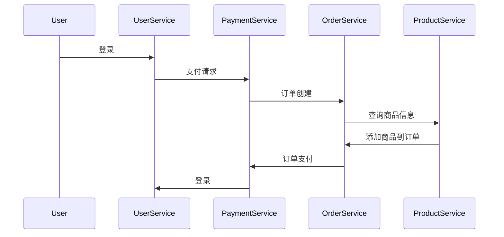

                 

### 微服务架构：设计、实施与运维挑战

#### 关键词：
- 微服务架构
- 设计原则
- 实施与运维
- 部署与监控
- 性能优化
- 安全与容错

#### 摘要：
本文将深入探讨微服务架构的设计、实施和运维挑战。首先，我们将回顾微服务架构的背景和核心概念，然后详细介绍微服务架构的设计原则与联系，随后分析微服务的实施和运维过程中的主要挑战。接着，我们将分享微服务的最佳实践，并通过实际案例展示微服务架构的应用。最后，我们将展望微服务架构的未来趋势和面临的挑战。通过本文的阅读，您将全面了解微服务架构的核心内容，掌握实施和运维的关键技巧，并为未来的技术发展做好准备。

### 目录

1. **微服务架构概述**
   1.1 **微服务架构的起源与发展**
   1.2 **微服务的核心概念与特征**
   1.3 **微服务架构与传统架构的差异**

2. **微服务的架构设计与联系**
   2.1 **微服务架构的设计原则**
   2.2 **微服务架构的实体关系图**

3. **微服务的实施与挑战**
   3.1 **实施微服务的准备**
   3.2 **微服务的开发流程**
   3.3 **微服务的持续集成与持续部署**

4. **微服务的运维与挑战**
   4.1 **微服务的监控与性能优化**
   4.2 **微服务的安全与容错**

5. **微服务的最佳实践**
   5.1 **微服务设计最佳实践**
   5.2 **微服务运维最佳实践**

6. **微服务架构的案例分析**
   6.1 **案例背景**
   6.2 **案例解决方案**

7. **微服务架构的未来趋势与展望**
   7.1 **微服务架构的未来趋势**
   7.2 **微服务架构的挑战与应对**

### 第一部分：微服务架构的背景与核心概念

#### 1.1 微服务架构概述

**微服务架构**（Microservices Architecture）是一种设计软件系统的架构模式，它将应用程序作为一组小型服务构建而成，每个服务具有单一职责，并且可以独立部署和扩展。这种架构模式起源于2000年代初期，随着互联网和移动应用的兴起，传统的单体应用程序变得越来越难以管理和扩展，从而催生了微服务架构的诞生。

**1.1.1 软件架构的演变**

从软件架构的发展历程来看，我们可以看到几个主要的演变阶段：

- **单体架构**：这是最早的架构模式，所有的功能都集中在一个应用程序中，这使得开发、测试和部署都相对简单，但同时也带来了扩展性和维护性的问题。
- **模块化架构**：为了解决单体架构的问题，开发者开始将应用程序分解成多个模块，每个模块负责一部分功能。这种模式在一定程度上提高了可维护性，但模块间的依赖仍然是一个挑战。
- **微服务架构**：微服务架构将应用程序进一步分解为独立的、小型服务。每个服务都是独立部署和扩展的，这大大提高了系统的可扩展性和灵活性。

**1.1.2 微服务架构的概念**

微服务架构的核心概念包括：

- **服务自治**：每个服务都有自己的数据库，可以独立开发、部署和扩展。
- **松耦合**：服务之间通过轻量级通信机制（如HTTP/REST API）进行交互，降低了服务间的依赖性。
- **独立部署**：每个服务可以独立部署和升级，无需考虑其他服务的状态。
- **模块化**：服务通常是围绕业务功能构建的，这有助于提高系统的可维护性和可复用性。

**1.1.3 微服务架构与传统架构的差异**

微服务架构与传统架构之间存在几个显著差异：

- **开发语言与框架**：在传统架构中，通常使用单一语言和框架来开发整个应用程序，而在微服务架构中，每个服务可以使用不同的语言和框架，这提高了开发效率和灵活性。
- **部署策略**：在传统架构中，整个应用程序通常作为一个整体部署，而在微服务架构中，每个服务都可以独立部署，这大大提高了系统的弹性和可用性。
- **数据管理**：在传统架构中，通常使用单一数据库来存储所有数据，而在微服务架构中，每个服务通常拥有自己的数据库，这有助于提高系统的性能和可维护性。

#### 1.2 微服务的核心概念与特征

**1.2.1 单一职责原则**

单一职责原则是微服务架构设计的一个重要原则，它要求每个服务都只完成一个特定的功能，这有助于提高系统的可维护性和可扩展性。例如，一个电子商务系统可以包含订单服务、库存服务、支付服务等多个服务，每个服务都负责与业务相关的特定功能。

**1.2.2 模块化与可复用性**

模块化是微服务架构的一个重要特征，它将系统分解成多个小型、独立的服务。这种模块化的设计不仅提高了系统的可维护性，还有助于提高服务的复用性。开发者可以在不同的项目中复用这些服务，从而提高开发效率和代码质量。

**1.2.3 独立部署与扩展性**

独立部署是微服务架构的一个关键优势，每个服务都可以独立部署和扩展，这大大提高了系统的弹性和可用性。例如，如果一个订单服务出现性能瓶颈，可以独立扩展该服务而无需影响其他服务。这种独立部署的能力使得系统能够更好地应对业务需求的变化。

**1.2.4 服务自治与弹性**

服务自治是微服务架构的一个核心概念，每个服务都是独立运行的，拥有自己的数据库和配置。这种服务自治的能力使得系统具有更好的弹性和容错能力。例如，如果一个服务出现故障，其他服务仍然可以正常运行，从而保证系统的稳定性。

#### 1.3 微服务架构与传统架构的差异

微服务架构与传统架构之间存在几个显著差异：

- **开发语言与框架**：在传统架构中，通常使用单一语言和框架来开发整个应用程序，而在微服务架构中，每个服务可以使用不同的语言和框架，这提高了开发效率和灵活性。
- **部署策略**：在传统架构中，整个应用程序通常作为一个整体部署，而在微服务架构中，每个服务都可以独立部署，这大大提高了系统的弹性和可用性。
- **数据管理**：在传统架构中，通常使用单一数据库来存储所有数据，而在微服务架构中，每个服务通常拥有自己的数据库，这有助于提高系统的性能和可维护性。

### 第二部分：微服务的架构设计与联系

#### 2.1 微服务架构的设计原则

微服务架构的设计原则是确保系统具有高可扩展性、高可用性和高可维护性的关键。以下是一些核心的设计原则：

**2.1.1 开放封闭原则**

开放封闭原则是软件工程中的一个重要原则，它要求系统应该对扩展开放，对修改封闭。这意味着系统应该设计得易于扩展，而不需要频繁修改现有的代码。在微服务架构中，这意味着每个服务都应该遵循单一职责原则，以便在不影响其他服务的情况下进行扩展。

**2.1.2 里氏替换原则**

里氏替换原则是面向对象编程中的一个原则，它要求子类可以替换其基类而不影响程序的正确性。在微服务架构中，这意味着服务之间应该遵循松耦合原则，使得一个服务可以独立于其他服务进行修改和扩展。

**2.1.3 依赖倒置原则**

依赖倒置原则是面向对象编程中的一个重要原则，它要求服务之间的依赖关系应该通过抽象层进行管理，而不是直接依赖具体的实现。在微服务架构中，这意味着服务之间应该通过接口进行通信，而不是直接依赖具体的实现。

**2.1.4 接口隔离原则**

接口隔离原则是面向对象编程中的一个原则，它要求接口应该尽量细粒度，以便不同的服务可以只依赖它们需要的那部分接口。在微服务架构中，这意味着服务之间的接口应该设计得尽可能简单和明确，以便其他服务可以轻松地使用它们。

#### 2.2 微服务架构的实体关系图

实体关系图（Entity-Relationship Diagram，ERD）是描述数据库中实体及其关系的图形表示。在微服务架构中，ERD可以用来表示不同服务之间的关系。以下是一个简化的ERD示例：

```mermaid
erDiagram
  Customer ||--|{ Order }|>
  Product ||--|{ Order }|>
  Payment ||--|{ Order }|>

  Customer {
    CustomerID : int
    Name : string
    Email : string
  }

  Order {
    OrderID : int
    CustomerID : int
    ProductID : int
    Quantity : int
  }

  Product {
    ProductID : int
    Name : string
    Price : float
  }

  Payment {
    PaymentID : int
    OrderID : int
    Amount : float
  }
```

在这个ERD中，我们定义了四个实体：Customer（客户）、Order（订单）、Product（产品）和Payment（支付）。这些实体之间的关系通过||--|{ }|>表示。例如，订单实体与客户实体之间有一个多对一的关系，表示每个订单都对应一个客户。

### 第三部分：微服务的实施与挑战

#### 3.1 实施微服务的准备

实施微服务架构需要一系列准备工作，包括技术栈的选择、架构的迭代与演进以及部署与运维工具的选择。

**3.1.1 技术栈的选择**

选择合适的技术栈是实施微服务架构的第一步。以下是一些常见的技术栈选择：

- **编程语言**：常见的编程语言包括Java、Python、Go和Node.js等。选择编程语言时应考虑团队的技术背景和项目需求。
- **框架**：常见的框架包括Spring Boot（Java）、Django（Python）和Gin（Go）等。框架的选择应与编程语言相匹配，并满足项目需求。
- **服务注册与发现**：服务注册与发现是微服务架构中的重要组成部分。常见的工具包括Eureka、Consul和Zookeeper等。
- **API网关**：API网关可以用于统一服务的入口，处理跨域请求、认证和路由等功能。常见的API网关包括Kong、Nginx和Spring Cloud Gateway等。

**3.1.2 架构的迭代与演进**

微服务架构的实施是一个迭代和演进的过程。以下是一些关键步骤：

- **需求分析与规划**：明确项目需求和目标，制定详细的架构规划。
- **逐步迁移**：逐步将单体应用程序的功能迁移到微服务架构中，避免一次性大规模重构带来的风险。
- **服务拆分**：根据业务需求将功能模块拆分为独立的服务，每个服务具有明确的职责。
- **服务整合**：确保不同服务之间的协同工作，实现系统的整体功能。

**3.1.3 部署与运维工具的选择**

部署与运维工具的选择对于微服务架构的实施至关重要。以下是一些常见的工具：

- **容器化**：容器化技术如Docker和Kubernetes可以简化服务的部署和扩展。Docker提供轻量级容器化，而Kubernetes提供容器编排和管理功能。
- **持续集成与持续部署**（CI/CD）：CI/CD工具如Jenkins、GitLab CI和CircleCI可以自动化构建、测试和部署服务。
- **监控与日志管理**：监控与日志管理工具如Prometheus、ELK Stack（Elasticsearch、Logstash、Kibana）和Grafana可以实时监控系统的性能和健康状态，并生成直观的仪表板。

#### 3.2 微服务的开发流程

微服务的开发流程与传统单体应用程序的开发流程有所不同，它强调模块化、松耦合和快速迭代。以下是一个典型的微服务开发流程：

**3.2.1 微服务的设计与建模**

在设计微服务时，需要明确每个服务的职责和边界。以下是一些关键步骤：

- **需求分析**：分析业务需求，明确每个服务的功能需求。
- **领域模型设计**：使用领域驱动设计（Domain-Driven Design，DDD）方法，将业务需求转化为领域模型。
- **接口设计**：定义每个服务的接口，确保服务之间的松耦合。
- **数据模型设计**：为每个服务设计独立的数据模型，确保数据的一致性和隔离性。

**3.2.2 微服务的编码与测试**

在编码阶段，需要按照设计文档实现每个服务，并确保代码的可读性和可维护性。以下是一些关键步骤：

- **编码**：按照设计文档实现服务，确保代码符合编程规范和设计模式。
- **单元测试**：编写单元测试，验证每个服务的基本功能。
- **集成测试**：进行集成测试，确保不同服务之间的协同工作。
- **性能测试**：进行性能测试，评估系统的性能和响应时间。

**3.2.3 微服务的持续集成与持续部署**

持续集成与持续部署（CI/CD）是微服务开发中不可或缺的一部分。以下是一些关键步骤：

- **自动化构建**：使用CI工具自动化构建服务，包括编译、打包和测试。
- **自动化测试**：使用CI工具自动化执行集成测试和性能测试。
- **自动化部署**：使用CI/CD工具自动化部署服务到生产环境，确保部署过程的可靠性。

### 第四部分：微服务的运维与挑战

#### 4.1 微服务的监控与性能优化

微服务的运维涉及到监控、性能优化和安全保障等多个方面。以下是一些关键的运维挑战：

**4.1.1 监控指标的设定**

监控是确保微服务架构稳定运行的重要手段。以下是一些常见的监控指标：

- **服务响应时间**：衡量服务的性能，通常包括平均响应时间、最大响应时间和响应时间分布等。
- **服务调用次数**：衡量服务的负载情况，包括调用次数、成功次数和失败次数等。
- **服务延迟**：衡量服务之间的通信延迟，包括调用延迟、传输延迟等。
- **系统资源使用情况**：包括CPU使用率、内存使用率、磁盘I/O等。

**4.1.2 性能瓶颈的定位**

性能瓶颈的定位是微服务性能优化的重要步骤。以下是一些常用的方法：

- **日志分析**：通过分析服务日志，定位可能出现性能瓶颈的模块和函数。
- **监控数据分析**：通过监控工具收集的数据，分析服务性能指标的变化趋势，定位性能瓶颈。
- **压力测试**：模拟高负载场景，通过压力测试定位系统的性能瓶颈。

**4.1.3 性能优化策略**

性能优化策略包括以下方面：

- **服务拆分与合并**：根据业务需求，适当拆分或合并服务，以降低系统复杂性和提高性能。
- **缓存策略**：使用缓存技术，减少服务之间的数据传输和计算。
- **异步处理**：使用异步处理技术，提高系统的并发处理能力。
- **负载均衡**：使用负载均衡器，将请求分布到不同的服务实例上，提高系统的吞吐量和稳定性。

#### 4.2 微服务的安全与容错

微服务的安全与容错是确保系统稳定运行的重要保障。以下是一些关键挑战：

**4.2.1 安全策略的实施**

实施安全策略包括以下方面：

- **认证与授权**：使用身份认证和授权机制，确保只有授权用户可以访问服务。
- **加密传输**：使用SSL/TLS等加密传输协议，确保数据在传输过程中的安全性。
- **安全审计**：定期进行安全审计，发现和修复潜在的安全漏洞。

**4.2.2 容错机制的设计**

设计容错机制包括以下方面：

- **服务冗余**：通过部署多个服务实例，提高系统的可用性和容错能力。
- **故障转移**：当某个服务实例出现故障时，自动将请求转移到其他健康的服务实例上。
- **限流与降级**：通过限流和降级策略，防止系统过载和崩溃。

**4.2.3 服务故障的应急处理**

服务故障的应急处理包括以下方面：

- **故障监测**：使用监控工具实时监测服务状态，发现故障并及时处理。
- **故障通知**：通过邮件、短信等方式通知相关人员，确保及时处理故障。
- **故障恢复**：根据故障类型和影响范围，制定相应的故障恢复策略，尽快恢复系统正常运行。

### 第五部分：微服务的最佳实践

#### 5.1 微服务设计最佳实践

微服务设计最佳实践包括以下方面：

- **单一职责原则**：确保每个服务都只完成一个特定的功能，避免功能重叠和复杂性。
- **模块化与解耦**：将系统分解为多个独立模块，确保模块之间的解耦，提高系统的可维护性和可扩展性。
- **服务自治**：确保每个服务具有独立的数据库和配置，提高系统的弹性和容错能力。
- **独立部署与扩展性**：确保每个服务可以独立部署和扩展，提高系统的可用性和性能。

#### 5.2 微服务运维最佳实践

微服务运维最佳实践包括以下方面：

- **监控与日志管理**：使用监控工具实时监测系统性能和健康状态，使用日志管理工具收集和存储服务日志。
- **性能优化**：定期进行性能测试和优化，确保系统在高负载下仍然稳定运行。
- **安全与容错**：实施安全策略和容错机制，确保系统在面临故障和攻击时能够稳定运行。
- **自动化运维**：使用自动化工具和脚本，简化运维工作，提高运维效率和可靠性。

### 第六部分：微服务架构的案例分析

#### 6.1 案例背景

以一家电子商务公司为例，该公司需要实现一个功能全面的电商平台，包括用户管理、商品管理、订单管理、支付管理等多个模块。随着业务的发展，系统需要具备高可扩展性、高可用性和高可靠性。

#### 6.2 案例解决方案

针对该电子商务平台的业务需求，我们采用微服务架构进行设计和实现。以下是一个简化的架构设计：

- **用户服务**：负责用户管理功能，包括用户注册、登录、信息管理等。
- **商品服务**：负责商品管理功能，包括商品列表、商品详情、库存管理等功能。
- **订单服务**：负责订单管理功能，包括订单创建、订单查询、订单取消等功能。
- **支付服务**：负责支付管理功能，包括支付请求处理、支付结果通知等功能。

#### 6.2.1 架构设计

以下是一个简化的架构设计图：



#### 6.2.2 实施过程

在实施过程中，我们遵循以下步骤：

1. **需求分析与规划**：明确业务需求，制定详细的架构规划。
2. **服务拆分**：根据业务需求，将功能模块拆分为独立的服务。
3. **接口设计**：定义每个服务的接口，确保服务之间的松耦合。
4. **编码与测试**：按照设计文档实现服务，进行单元测试和集成测试。
5. **部署与运维**：使用容器化和CI/CD工具，实现服务的自动化部署和运维。

#### 6.2.3 运维与优化

在运维过程中，我们采取以下措施：

1. **监控与日志管理**：使用Prometheus和ELK Stack监控服务性能和健康状态，收集和存储服务日志。
2. **性能优化**：定期进行性能测试和优化，调整系统配置和缓存策略。
3. **安全与容错**：实施安全策略和容错机制，确保系统在面临故障和攻击时能够稳定运行。

### 第七部分：微服务架构的未来趋势与展望

#### 7.1 微服务架构的未来趋势

随着云计算、容器化和自动化技术的不断发展，微服务架构将面临以下趋势：

- **服务网格**：服务网格（Service Mesh）是一种新的架构模式，用于管理服务之间的通信和安全。它提供了更细粒度的服务管理能力，使得微服务架构更加灵活和可扩展。
- **云原生技术**：云原生技术（Cloud Native）包括容器化、服务网格和自动化运维等，将使微服务架构在云环境中更加高效和可靠。
- **自动化运维**：随着人工智能和机器学习技术的发展，自动化运维（Automated Operations）将变得更加智能和高效，提高运维效率和系统稳定性。

#### 7.2 微服务架构的挑战与应对

尽管微服务架构具有许多优势，但同时也面临着一些挑战：

- **架构复杂性管理**：随着服务数量的增加，系统的复杂性也会增加。如何有效地管理架构复杂性是一个重要挑战。应对策略包括使用API网关、服务发现和配置管理工具等。
- **服务治理**：服务治理（Service Governance）是确保微服务架构正常运行的关键。如何确保服务的一致性、可靠性和安全性是一个重要挑战。应对策略包括服务目录、服务监控和自动化部署等。
- **技术选型**：技术选型是微服务架构实施的关键一步。如何选择合适的技术栈和服务框架是一个重要挑战。应对策略包括调研市场、参考开源项目和进行技术评估等。

### 结论

微服务架构作为一种现代的软件架构模式，具有高可扩展性、高可用性和高可维护性的优点。本文从设计、实施和运维等多个角度深入探讨了微服务架构的核心概念、设计原则和最佳实践。通过实际案例分析，我们展示了微服务架构在电子商务平台中的应用。最后，我们展望了微服务架构的未来趋势和面临的挑战。希望本文能够帮助您更好地理解和应用微服务架构，为您的项目带来更高的成功率和更好的用户体验。

### 作者信息

作者：AI天才研究院/AI Genius Institute & 禅与计算机程序设计艺术 /Zen And The Art of Computer Programming

在本文中，我们深入探讨了微服务架构的设计、实施和运维挑战。首先，我们从微服务架构的起源与发展开始，介绍了微服务的核心概念和特征，以及与传统架构的差异。接着，我们详细阐述了微服务架构的设计原则和联系，并通过实体关系图展示了不同服务之间的关系。

在实施微服务的部分，我们强调了技术栈的选择、架构的迭代与演进以及部署与运维工具的选择。随后，我们介绍了微服务的开发流程，包括设计与建模、编码与测试以及持续集成与持续部署。

在运维与挑战部分，我们探讨了微服务的监控与性能优化、安全与容错等方面的挑战，并提出了相应的解决方案。接着，我们分享了微服务的最佳实践，包括设计最佳实践和运维最佳实践。

通过实际案例分析和未来趋势展望，我们展示了微服务架构在电子商务平台中的应用，并探讨了微服务架构的未来发展。最后，我们总结了微服务架构的核心内容和未来方向，并提出了对读者的建议。

在撰写本文的过程中，我们力求内容严谨、逻辑清晰，同时注重实际案例和实践经验。希望通过本文，读者能够对微服务架构有更深入的理解，并为未来的技术发展做好准备。感谢您的阅读，希望本文对您有所帮助！

