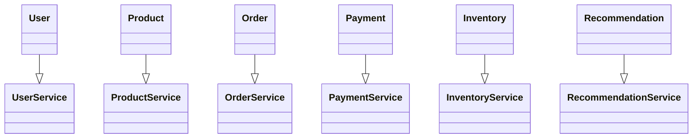
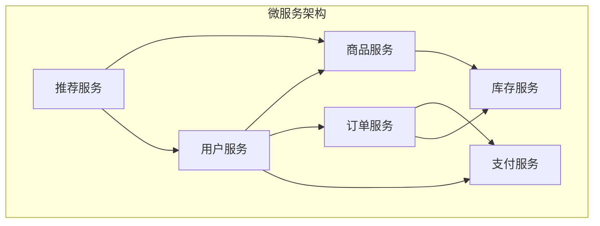
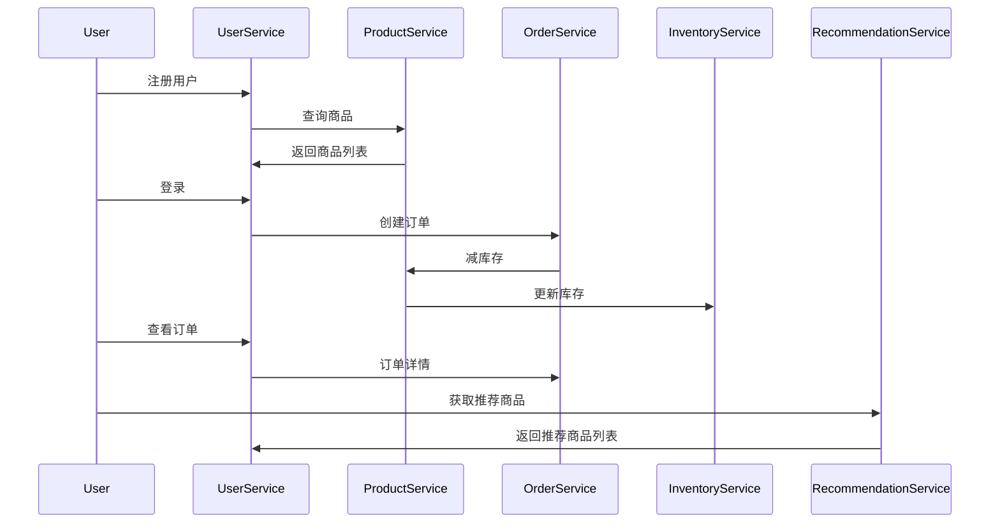

                 

## 微服务架构实践：从单体应用到微服务的演进

### 关键词：微服务架构、单体应用、分布式系统、服务拆分、服务治理

> 摘要：本文将探讨微服务架构的起源、核心概念及其在企业中的应用，从设计原则、开发实践到部署与运维，详细解析微服务架构从单体应用演进的必要性及实施策略。通过案例分析，提供最佳实践，展望未来趋势与挑战。

---

### 第一部分：微服务架构背景与概念

#### 第1章：微服务架构概述

##### 1.1 问题背景与需求

在现代软件开发中，单体应用（Monolithic Application）曾经是企业应用程序开发的常见方式。然而，随着业务需求的复杂化与系统规模的扩大，单体应用的局限性逐渐显现：

1. **代码耦合**：单体应用通常将所有功能集中在一个单一的代码库中，导致不同模块之间的耦合度极高，修改一处代码可能会影响整个系统的稳定性。
2. **部署困难**：由于系统规模庞大，单体应用在部署时需要整体打包，这不仅增加了部署的复杂度，还延长了部署时间。
3. **扩展性差**：单体应用在应对高并发和海量数据时，扩展能力有限，通常需要通过垂直扩展（增加硬件资源）来解决，这既不经济也不灵活。

为了解决上述问题，微服务架构（Microservices Architecture）应运而生。微服务架构通过将大型单体应用拆分成多个小型、独立的服务，从而实现模块化和分布式。这样，不仅可以降低系统的耦合度，提高部署的灵活性，还能够根据需求进行水平扩展。

##### 1.2 微服务架构的兴起与发展

微服务架构的概念最早由马丁·福勒（Martin Fowler）于2014年在其博客中提出。它基于SOA（Service-Oriented Architecture，面向服务架构）的理念，但在设计方法、实现方式和应用场景上有所不同。

- **微服务架构的起源**：微服务架构的兴起源于分布式计算技术的发展和互联网企业的需求。早期，互联网公司如亚马逊、阿里巴巴和Netflix等，在应对大规模分布式系统的需求时，逐渐形成了微服务架构的理念和实践。
- **微服务架构的兴起**：随着云计算、容器化和自动化运维等技术的成熟，微服务架构逐渐成为企业软件架构的首选。其灵活性和可扩展性使得企业在快速迭代和应对复杂业务需求时更具优势。
- **微服务架构的发展**：微服务架构在实践中不断完善和演进，不同的企业和团队根据自身需求，探索出多种微服务架构的实现方式和最佳实践。

##### 1.3 微服务核心概念与联系

微服务架构的核心概念包括服务拆分、服务自治、分布式通信和服务治理。以下是这些概念的定义及其相互关系：

- **服务拆分**：将大型单体应用拆分为多个小型、独立的服务，每个服务负责一个具体的业务功能。
- **服务自治**：每个服务可以独立部署、扩展和演进，具有自己的数据库、缓存和其他资源。
- **分布式通信**：服务之间通过API或其他方式进行通信，通常采用异步消息驱动模式。
- **服务治理**：包括服务注册与发现、负载均衡、服务监控和故障处理等，确保服务正常运行。

以下是微服务架构与单体应用、SOA等架构的核心概念对比表格：

| 架构模式 | 定义 | 核心特点 | 适用场景 |
| :--: | :--: | :--: | :--: |
| **单体应用** | 将所有功能集中在一个应用程序中 | 代码耦合度高、部署困难、扩展性差 | 小型、简单的项目 |
| **微服务架构** | 将应用拆分为多个独立的服务 | 模块化、高可扩展性、灵活部署 | 复杂、大规模、高并发的项目 |
| **SOA** | 面向服务的架构，通过服务进行模块化 | 服务之间通过消息进行通信，服务自治 | 企业内部系统集成 |

##### 1.4 微服务架构在企业中的应用

微服务架构在企业中的应用具有显著的优点，但同时也伴随着一定的挑战：

- **微服务架构的优势**：
  - **灵活性**：服务可以独立部署和扩展，便于快速迭代和响应业务需求。
  - **可扩展性**：通过水平扩展服务实例，可以轻松应对高并发和大数据量。
  - **易维护性**：服务自治降低了系统耦合度，单个服务的故障不会影响整个系统。

- **微服务架构的挑战**：
  - **复杂度增加**：分布式系统增加了服务的数量和交互方式，管理和维护难度增加。
  - **服务治理**：需要实现服务注册与发现、负载均衡、服务监控等治理功能。
  - **数据一致性**：分布式环境下，如何保证数据的一致性是关键挑战。

微服务架构在不同领域的应用包括：

- **电子商务**：如亚马逊、阿里巴巴等电商平台，通过微服务架构实现高效的商品管理、订单处理和用户服务。
- **金融**：银行、保险公司等金融机构利用微服务架构进行业务创新和服务优化。
- **物联网**：智能家居、智能城市等场景下，微服务架构能够高效处理海量设备和数据的接入和管理。

#### 1.5 总结与展望

微服务架构作为一种先进的软件架构方法，已经得到广泛认可和实际应用。然而，企业在采用微服务架构时，需要充分考虑自身业务需求、技术能力和团队经验。通过合理的服务拆分、有效的服务治理和完善的运维监控，微服务架构可以为企业带来显著的业务价值。

在未来的发展中，微服务架构将继续演进，结合服务网格（Service Mesh）、云原生（Cloud Native）等技术，为企业提供更加高效、可靠和灵活的软件架构解决方案。

### 引用

- [马丁·福勒](https://martinfowler.com/)

---

## 第二部分：微服务设计与开发

### 第2章：微服务设计原则与模式

微服务设计原则与模式是构建高效、可扩展微服务系统的关键。以下将详细介绍微服务设计原则和几种常见的设计模式。

#### 2.1 设计原则

微服务设计原则旨在指导如何将大型单体应用拆分为小型、自治的服务。以下是几个核心设计原则：

1. **服务拆分**：基于业务需求和服务粒度，将大型应用拆分为多个小型服务，每个服务专注于实现一个业务功能。
2. **服务自治**：每个服务应独立部署、扩展和演进，具有自己的数据库、缓存等资源，以实现真正的独立运行。
3. **分布式通信**：服务之间通过API或其他分布式通信机制进行交互，减少直接耦合，提高系统的灵活性和可扩展性。
4. **服务治理**：实现对服务注册与发现、负载均衡、服务监控和故障处理等治理功能的管理，确保服务的稳定性和可靠性。
5. **数据一致性**：在分布式环境下，确保数据的一致性是微服务设计的重要挑战，需要采用合适的数据一致性和分布式事务解决方案。

#### 2.2 设计模式

在设计微服务时，可以采用多种设计模式来提高系统的可扩展性、可维护性和灵活性。以下是几种常见的设计模式：

1. **单体应用向微服务转型**
   - **逐步迁移策略**：在现有单体应用的基础上，逐步将部分模块拆分为独立的微服务，降低迁移风险和成本。
   - **拆分策略**：基于业务领域、功能模块或数据模型等因素，合理拆分服务，确保服务的独立性和自治性。
2. **服务边界定义**
   - **领域驱动设计（DDD）方法**：通过领域驱动设计，明确业务领域和边界，为服务拆分提供理论基础。
   - **微服务边界**：根据业务需求，将功能紧密相关的模块划分为一个服务，确保服务内的逻辑紧密耦合，服务间逻辑松耦合。
3. **数据管理**
   - **分布式数据库设计**：在分布式环境下，合理设计数据库架构，确保数据的一致性和可用性。
   - **数据一致性保障**：采用分布式事务、消息队列等机制，实现分布式环境下数据的一致性。

#### 2.3 实践案例

以下是一个基于微服务设计的实际案例：

- **项目介绍**：假设我们正在开发一个电子商务平台，其业务需求包括商品管理、订单处理、用户服务等多个模块。
- **系统功能设计**：通过领域驱动设计，明确各个业务领域和边界，例如商品管理领域、订单处理领域等。
- **服务拆分**：将每个业务领域拆分为独立的微服务，如商品管理服务、订单处理服务、用户服务。
- **服务自治**：每个服务拥有独立的数据库、缓存等资源，确保服务的独立性和自治性。
- **分布式通信**：服务之间通过API或其他分布式通信机制进行交互，如使用RESTful API或消息队列。
- **服务治理**：实现对服务的注册与发现、负载均衡、服务监控和故障处理等治理功能的管理。

通过以上设计原则和模式，我们可以构建一个高效、可扩展的微服务系统，为电子商务平台提供稳定可靠的业务支持。

### 引用

- [领域驱动设计（DDD）](https://www.martinfowler.com/eaaCatalog/ddd.html)
- [微服务架构设计模式](https://martinfowler.com/microservices/)

---

### 第3章：微服务开发实践

微服务开发实践是构建高效、可扩展微服务系统的关键环节。在本节中，我们将探讨微服务开发的环境搭建、开发框架、微服务间通信以及部署策略。

#### 3.1 开发环境搭建

在开始微服务开发之前，我们需要搭建一个合适的环境。以下是一些关键步骤：

1. **开发工具与平台**：
   - **IDE**：选择一个适合微服务开发的集成开发环境（IDE），如IntelliJ IDEA或Visual Studio Code。
   - **版本控制**：使用Git等版本控制系统进行代码管理，确保代码的版本控制和协同开发。
   - **容器化**：使用Docker进行容器化，便于服务的部署和迁移。Kubernetes可以用于容器集群的管理。

2. **开发流程**：
   - **敏捷开发**：采用敏捷开发方法，如Scrum或Kanban，确保开发过程的高效和灵活性。
   - **持续集成与持续部署（CI/CD）**：使用CI/CD工具，如Jenkins或GitHub Actions，实现代码的自动化构建、测试和部署。

#### 3.2 微服务开发框架

在微服务开发中，选择合适的开发框架可以显著提高开发效率和系统性能。以下是几种流行的微服务开发框架：

1. **Spring Cloud**：
   - **框架介绍**：Spring Cloud是基于Spring Boot构建的微服务开发框架，提供一系列微服务开发工具和组件。
   - **组件**：包括Eureka（服务注册与发现）、Ribbon（负载均衡）、Hystrix（熔断器）、Feign（HTTP客户端）等。
   - **使用场景**：适用于需要高可用性、高并发和分布式服务的应用场景。

2. **Docker与Kubernetes**：
   - **容器化**：使用Docker进行应用的容器化，将应用程序及其依赖打包为容器镜像，实现一次编写、到处运行。
   - **集群管理**：使用Kubernetes进行容器集群的管理，提供自动部署、扩缩容、负载均衡等功能。

#### 3.3 微服务间通信

微服务间通信是微服务架构的核心环节，以下是几种常见的通信方式：

1. **RESTful API**：
   - **接口设计**：采用RESTful架构风格设计服务接口，遵循RESTful原则，如使用HTTP动词表示操作、使用URL表示资源。
   - **最佳实践**：遵循RESTful API设计原则，如使用版本控制、合理设计HTTP状态码等。
   
2. **消息队列**：
   - **消息驱动**：使用消息队列实现服务间的异步通信，如RabbitMQ、Kafka等。
   - **异步处理**：通过消息队列实现任务异步处理，提高系统的响应性能和可扩展性。

#### 3.4 微服务部署与运维

微服务的部署与运维是确保系统稳定运行的关键。以下是几个关键点：

1. **部署策略**：
   - **容器化部署**：使用Docker进行应用的容器化部署，通过Kubernetes进行容器集群的管理。
   - **集群部署**：使用Kubernetes进行服务的集群部署，实现自动扩缩容、负载均衡等功能。

2. **运维与监控**：
   - **服务监控**：使用Prometheus、Grafana等工具进行服务监控，实时监控服务的性能和健康状态。
   - **日志管理**：使用ELK Stack（Elasticsearch、Logstash、Kibana）进行日志聚合和存储，实现日志的集中管理和分析。

3. **性能优化**：
   - **性能监控**：定期进行性能监控和性能瓶颈分析，定位系统性能问题。
   - **性能调优**：根据性能分析结果，进行数据库查询优化、缓存策略优化等，提高系统性能。

#### 3.5 实践案例

以下是一个基于Spring Cloud和Docker的微服务开发实践案例：

- **项目介绍**：开发一个电商平台，包括用户服务、商品服务、订单服务等多个微服务。
- **环境搭建**：搭建Spring Cloud和Docker开发环境，配置Kubernetes集群。
- **服务开发**：使用Spring Boot开发各个微服务，实现服务接口、业务逻辑和数据库操作。
- **容器化**：将微服务打包为Docker镜像，上传到Docker Hub。
- **部署**：使用Kubernetes进行微服务的部署和管理，实现自动扩缩容和负载均衡。
- **监控与运维**：使用Prometheus和Grafana进行服务监控，使用ELK Stack进行日志管理和分析。

通过以上实践案例，我们可以构建一个高效、可靠的微服务系统，为企业提供稳定、灵活的软件架构支持。

### 引用

- [Spring Cloud](https://cloud.spring.io/spring-cloud/)
- [Docker](https://www.docker.com/)
- [Kubernetes](https://kubernetes.io/)
- [Prometheus](https://prometheus.io/)
- [Grafana](https://grafana.com/)
- [ELK Stack](https://www.elastic.co/cn/elasticsearch/)
- [微服务开发实践](https://www.baeldung.com/microservices)

---

### 第4章：微服务部署与运维

微服务的部署与运维是确保系统稳定运行和高效运行的关键环节。本章将详细介绍微服务的部署策略、运维与监控，以及性能优化。

#### 4.1 部署策略

微服务的部署策略需要考虑如何高效、稳定地将服务部署到生产环境。以下是几种常见的部署策略：

1. **容器化部署**：
   - **Docker部署**：使用Docker将应用程序及其依赖打包为容器镜像，实现一次编写、到处运行。
   - **Kubernetes部署**：使用Kubernetes进行容器集群的管理，实现服务的自动化部署、扩缩容和负载均衡。

2. **无状态服务部署**：
   - **Stateless Service Deployment**：无状态服务可以独立部署，每个实例都可以处理独立的请求，提高系统的可扩展性和容错性。

3. **有状态服务部署**：
   - **Stateful Service Deployment**：对于有状态服务，需要考虑数据持久化、状态同步等问题。可以使用数据库、缓存或其他持久化存储方案来保存状态信息。

4. **灰度部署**：
   - **灰度发布（Blue-Green Deployment）**：在更新服务时，将新版本的服务与旧版本的服务并行运行，逐步增加新版本的服务流量，确保系统稳定过渡。

5. **滚动更新**：
   - **Rolling Update**：在更新服务时，逐步替换旧版本的实例，确保系统的连续性和稳定性。

#### 4.2 运维与监控

运维与监控是确保微服务系统稳定运行的重要环节。以下是几个关键点：

1. **服务监控**：
   - **Prometheus**：使用Prometheus进行服务监控，收集和存储指标数据，实现实时监控和告警。
   - **Grafana**：使用Grafana可视化Prometheus的数据，提供丰富的监控仪表板和报警功能。

2. **日志管理**：
   - **ELK Stack**：使用Elasticsearch、Logstash和Kibana（ELK Stack）进行日志聚合、存储和可视化，实现日志的集中管理和分析。

3. **健康检查**：
   - **健康检查**：定期对服务进行健康检查，确保服务的可用性和稳定性。

4. **故障处理**：
   - **故障转移**：在服务发生故障时，自动切换到备用服务，确保系统的连续性。
   - **故障恢复**：在故障恢复后，对系统进行复盘和分析，避免类似故障的再次发生。

#### 4.3 性能优化

性能优化是提高系统性能和用户体验的关键。以下是几个性能优化方法：

1. **数据库优化**：
   - **查询优化**：对数据库查询进行优化，包括索引策略、查询缓存等。
   - **缓存策略**：使用缓存减少数据库的访问频率，提高系统的响应速度。

2. **服务优化**：
   - **异步处理**：使用异步处理减少服务阻塞，提高系统的并发能力。
   - **负载均衡**：使用负载均衡器（如Nginx、HAProxy）均衡服务流量，提高系统的吞吐量。

3. **网络优化**：
   - **CDN**：使用内容分发网络（CDN）加速静态资源的加载，减少网络延迟。
   - **网络优化**：优化网络配置，提高网络传输速度和稳定性。

4. **性能监控**：
   - **性能监控**：定期进行性能监控和性能瓶颈分析，发现和解决性能问题。

5. **自动化测试**：
   - **自动化测试**：使用自动化测试工具（如JMeter、Selenium）进行性能测试，确保系统的稳定性和性能。

#### 4.4 实践案例

以下是一个基于Spring Cloud、Docker和Kubernetes的微服务部署与运维实践案例：

- **项目介绍**：开发一个电子商务平台，包括用户服务、商品服务、订单服务等多个微服务。
- **环境搭建**：搭建Spring Cloud、Docker和Kubernetes开发环境。
- **服务开发**：使用Spring Boot开发各个微服务，实现服务接口、业务逻辑和数据库操作。
- **容器化**：将微服务打包为Docker镜像，上传到Docker Hub。
- **部署**：使用Kubernetes进行微服务的部署和管理，实现自动化部署、扩缩容和负载均衡。
- **监控**：使用Prometheus和Grafana进行服务监控，使用ELK Stack进行日志管理和分析。
- **性能优化**：对数据库查询进行优化，使用缓存策略减少数据库访问频率，使用异步处理提高系统的并发能力。

通过以上实践案例，我们可以构建一个高效、可靠的微服务系统，为企业提供稳定、灵活的软件架构支持。

### 引用

- [Kubernetes](https://kubernetes.io/)
- [Prometheus](https://prometheus.io/)
- [Grafana](https://grafana.com/)
- [ELK Stack](https://www.elastic.co/cn/elasticsearch/)
- [Spring Cloud](https://cloud.spring.io/spring-cloud/)
- [Docker](https://www.docker.com/)

---

### 第5章：微服务架构案例解析

在实际项目中，微服务架构的应用可以帮助企业应对复杂业务需求，提高系统可扩展性和灵活性。本章节将通过一个电子商务平台的案例，详细解析微服务架构的设计与实现。

#### 5.1 案例背景

假设我们正在开发一个大型电子商务平台，该平台需要提供商品管理、订单处理、用户服务、支付系统等多个功能模块。传统的单体应用无法满足项目需求，因此决定采用微服务架构进行开发。

#### 5.2 系统功能设计

根据电子商务平台的需求，我们可以将系统功能划分为多个独立的微服务，具体如下：

1. **用户服务**：负责用户信息的注册、登录、认证等操作。
2. **商品服务**：负责商品信息的展示、分类、库存管理等功能。
3. **订单服务**：负责订单的创建、处理、支付、发货等操作。
4. **支付服务**：负责处理支付请求，与第三方支付平台进行集成。
5. **库存服务**：负责商品库存的管理，实时更新库存信息。
6. **推荐服务**：基于用户行为和商品数据，提供个性化推荐。

以下是系统功能设计中的领域模型（使用Mermaid类图）：



#### 5.3 系统架构设计

在微服务架构中，我们需要设计一个清晰的系统架构，确保各个微服务之间的高内聚和低耦合。以下是电子商务平台的微服务架构设计（使用Mermaid架构图）：



#### 5.4 系统接口设计

在微服务架构中，各个微服务之间通过API进行通信。以下是电子商务平台的关键API接口设计（使用Mermaid序列图）：



#### 5.5 微服务实现

以下是电子商务平台中的用户服务和商品服务的基本实现，分别使用Spring Boot框架进行开发。

**用户服务（UserService）**

```java
@RestController
@RequestMapping("/users")
public class UserServiceController {

    @Autowired
    private UserService userService;

    @PostMapping("/register")
    public ResponseEntity<?> registerUser(@RequestBody UserRegistrationDto registrationDto) {
        userService.registerUser(registrationDto);
        return ResponseEntity.ok().build();
    }

    @PostMapping("/login")
    public ResponseEntity<?> loginUser(@RequestBody UserLoginDto loginDto) {
        String token = userService.loginUser(loginDto);
        return ResponseEntity.ok(token);
    }
}
```

**商品服务（ProductService）**

```java
@RestController
@RequestMapping("/products")
public class ProductServiceController {

    @Autowired
    private ProductService productService;

    @GetMapping
    public ResponseEntity<?> getAllProducts() {
        List<Product> products = productService.getAllProducts();
        return ResponseEntity.ok(products);
    }

    @PostMapping
    public ResponseEntity<?> createProduct(@RequestBody ProductDto productDto) {
        productService.createProduct(productDto);
        return ResponseEntity.ok().build();
    }
}
```

#### 5.6 代码应用解读与分析

以上代码展示了用户服务和商品服务的基本实现。用户服务主要负责用户注册和登录操作，商品服务负责商品信息的查询和创建。以下是关键部分的解读和分析：

1. **用户注册**：在用户注册接口中，接收用户注册请求，调用UserService中的registerUser方法进行用户注册。注册成功后，返回HTTP状态码200。
2. **用户登录**：在用户登录接口中，接收用户登录请求，调用UserService中的loginUser方法进行用户认证。认证成功后，返回登录令牌（token）。
3. **商品查询**：在商品查询接口中，调用ProductService中的getAllProducts方法获取所有商品信息，并返回给客户端。
4. **商品创建**：在商品创建接口中，接收商品创建请求，调用ProductService中的createProduct方法创建商品，并返回HTTP状态码200。

通过以上代码示例，我们可以看到微服务架构的基本实现过程。在实际项目中，还需要考虑数据一致性、服务治理、日志记录和监控等方面的实现。

#### 5.7 项目小结

通过本章节的案例解析，我们可以看到微服务架构在电子商务平台中的应用及其优势。通过合理的服务拆分、接口设计和代码实现，微服务架构能够帮助企业构建高效、灵活和可扩展的系统。在未来的项目中，我们可以根据实际需求，进一步优化和改进微服务架构，提高系统的稳定性和性能。

### 引用

- [Spring Boot](https://spring.io/projects/spring-boot)
- [RESTful API设计](https://www.restapitutorial.com/)

---

### 第6章：微服务架构最佳实践

在实施微服务架构的过程中，最佳实践可以极大地提高系统的稳定性、性能和可维护性。以下是微服务架构的一些最佳实践：

#### 6.1 服务拆分策略

合理的服务拆分是微服务架构成功的关键。以下是几种常见的服务拆分策略：

1. **基于业务领域**：按照业务领域进行服务拆分，每个领域对应一个独立的微服务。例如，在电子商务平台中，可以将商品管理、订单处理、用户服务等分别拆分为独立的微服务。
2. **基于功能模块**：按照功能模块进行服务拆分，每个模块对应一个独立的微服务。例如，可以将用户注册、登录、订单创建等拆分为独立的微服务。
3. **基于数据模型**：按照数据模型进行服务拆分，每个数据模型对应一个独立的微服务。例如，可以将用户信息、商品信息、订单信息等拆分为独立的微服务。
4. **逐步拆分**：在初始阶段，可以采用逐步拆分的方式，先拆分出核心功能模块，然后根据项目需求逐步拆分其他模块。

#### 6.2 分布式系统设计

分布式系统设计需要考虑数据一致性、服务治理和系统容错等问题。以下是几种分布式系统设计最佳实践：

1. **数据一致性**：
   - **最终一致性**：在分布式系统中，数据一致性通常无法保证实时一致性，而是采用最终一致性模型。例如，使用消息队列实现数据的异步处理，确保最终的一致性。
   - **分布式事务**：在分布式环境下，可以使用分布式事务框架（如Seata）实现跨服务的事务管理，确保事务的原子性。

2. **服务治理**：
   - **服务注册与发现**：使用服务注册中心（如Consul、Eureka）实现服务注册与发现，确保服务实例的动态更新和负载均衡。
   - **服务监控**：使用Prometheus、Grafana等工具进行服务监控，实时监控服务的健康状态和性能指标。
   - **服务限流与熔断**：使用Hystrix、Resilience4j等工具实现服务限流和熔断，防止服务雪崩。

3. **系统容错**：
   - **故障转移**：在分布式系统中，可以通过故障转移（如Zookeeper、Kubernetes）确保服务的可用性，当主服务发生故障时，自动切换到备用服务。
   - **故障恢复**：在故障恢复后，需要对系统进行复盘和分析，识别故障原因，并采取措施防止类似故障的再次发生。

#### 6.3 性能优化技巧

性能优化是确保微服务系统高效运行的关键。以下是几种性能优化技巧：

1. **数据库优化**：
   - **索引优化**：合理设计索引，提高数据库查询效率。
   - **查询缓存**：使用查询缓存（如Redis）减少数据库的访问频率。
   - **分库分表**：对于大数据量的场景，可以采用分库分表策略，提高数据库的查询和写入性能。

2. **服务优化**：
   - **异步处理**：使用异步处理减少服务的阻塞时间，提高系统的并发能力。
   - **负载均衡**：使用负载均衡器（如Nginx、HAProxy）均衡服务流量，提高系统的吞吐量。

3. **缓存策略**：
   - **缓存分层**：采用缓存分层策略，使用内存缓存（如Redis）、磁盘缓存（如Ehcache）等提高数据的访问速度。
   - **热点数据缓存**：对高频访问的数据进行缓存，减少数据库的访问压力。

4. **网络优化**：
   - **CDN**：使用内容分发网络（CDN）加速静态资源的加载，减少网络延迟。
   - **网络优化**：优化网络配置，提高网络传输速度和稳定性。

#### 6.4 安全与可靠性

在微服务架构中，安全与可靠性至关重要。以下是几种安全与可靠性最佳实践：

1. **安全措施**：
   - **服务安全**：采用服务认证和授权机制（如OAuth 2.0、JWT）确保服务的安全访问。
   - **数据安全**：对敏感数据进行加密存储和传输，如使用SSL/TLS加密通信。
   - **安全审计**：定期进行安全审计，识别和修复潜在的安全漏洞。

2. **故障处理**：
   - **故障恢复**：在故障发生时，自动切换到备用服务，确保系统的连续性。
   - **容灾备份**：建立容灾备份机制，确保数据的安全性和系统的可靠性。

3. **持续集成与持续部署**：
   - **代码审查**：在代码提交和发布前进行代码审查，确保代码质量和安全性。
   - **自动化测试**：实施自动化测试，确保新功能的稳定性和性能。

通过以上最佳实践，我们可以构建一个高效、可靠、安全的微服务架构系统，为企业的业务发展提供稳定的技术支持。

### 引用

- [最终一致性模型](https://www.theserverside.com/tutorial/ eventual-consistency-pattern-tutorial)
- [分布式事务](https://seata.io/)
- [服务治理](https://microservices弹簧云.io/)
- [性能优化技巧](https://www.educative.io/courses/optimizing-microservices-performance)
- [安全与可靠性](https://www.owasp.org/www-project-top-ten/)

---

### 第7章：微服务架构未来趋势与挑战

随着技术的不断进步和业务需求的日益复杂，微服务架构在未来将继续演进。在这一章中，我们将探讨微服务架构的未来趋势和面临的挑战。

#### 7.1 未来趋势

1. **服务网格技术**：
   - **服务网格（Service Mesh）**：服务网格是一种基础设施层的技术，用于管理服务间的通信和流量管理。它独立于应用逻辑，提供分布式系统的动态服务发现、负载均衡、断路器、服务监控等功能。
   - **Kubernetes与Istio**：Istio是一个开源的服务网格平台，与Kubernetes紧密结合，为微服务提供强大的服务治理能力。未来，服务网格技术将逐渐成为微服务架构的标配，提高系统的可管理和可靠性。

2. **云原生技术**：
   - **云原生（Cloud Native）**：云原生技术是指基于容器、服务化和自动化运维的软件开发和实践。云原生架构强调应用程序的微服务化、动态管理和弹性伸缩。
   - **Kubernetes和CNCF**：Kubernetes作为云原生计算基金会（CNCF）的明星项目，已经成为容器编排的事实标准。未来，随着云原生技术的发展，越来越多的企业将采用云原生架构，实现更高效、灵活的软件交付。

3. **Serverless架构**：
   - **Serverless架构**：Serverless架构使得开发者无需关注底层基础设施的管理，只需专注于编写业务逻辑代码。AWS Lambda、Google Cloud Functions和Azure Functions等Serverless平台，将为微服务架构提供新的实现方式。
   - **事件驱动**：Serverless架构通常采用事件驱动的方式，根据请求或事件触发服务执行。这种架构不仅降低了开发和运维成本，还提高了系统的响应速度和可扩展性。

#### 7.2 面临的挑战

1. **复杂度管理**：
   - **分布式系统复杂度**：随着服务数量的增加和系统规模的扩大，分布式系统的管理和运维复杂度显著提升。如何有效地监控、管理和优化分布式系统，是微服务架构面临的重要挑战。
   - **团队协作**：在微服务架构中，多个团队负责不同的服务开发、部署和运维。如何确保团队间的协作和协调，提高整体开发效率，是一个重要的课题。

2. **持续集成与持续部署**：
   - **CI/CD实践**：持续集成（CI）和持续部署（CD）是微服务架构的重要实践，但实现CI/CD流程需要大量的工具和资源。如何简化CI/CD流程，提高部署效率和稳定性，是一个亟待解决的问题。
   - **环境一致性**：在分布式环境中，确保开发、测试和生产环境的一致性，避免因环境差异导致的问题，是实现CI/CD挑战之一。

3. **数据一致性**：
   - **分布式数据一致性**：在分布式系统中，数据一致性问题一直是难点。如何保证跨服务的数据一致性，避免数据冲突和丢失，是一个重要的挑战。
   - **分布式事务**：分布式事务的实现比单体应用更为复杂。如何在高并发、大负载环境下实现分布式事务，是一个技术难题。

4. **安全性**：
   - **服务安全**：微服务架构中的服务数量众多，如何确保每个服务的安全性，避免未授权访问和内部攻击，是一个重要的挑战。
   - **数据安全**：在分布式环境中，如何确保数据的安全存储和传输，防止数据泄露和篡改，是另一个重要问题。

#### 7.3 总结

微服务架构的未来充满机遇与挑战。随着服务网格、云原生和Serverless等新技术的不断发展，微服务架构将更加成熟和普及。然而，复杂度管理、数据一致性和安全性等问题仍需要持续关注和解决。通过不断探索和实践，我们可以构建高效、可靠和安全的微服务架构系统，为企业提供强大的技术支撑。

### 引用

- [服务网格（Service Mesh）](https://www.servicemesh.io/)
- [云原生技术](https://www.cncf.io/)
- [Serverless架构](https://www.serverless.com/)
- [持续集成与持续部署（CI/CD）](https://www.jenkins.io/)

---

### 附录A：常用工具与技术选型

在微服务架构的实践中，选择合适的工具和技术是实现高效开发和运维的关键。以下是一些常用的工具和技术选型，供读者参考：

#### 1. 服务注册与发现

- **Eureka**：Spring Cloud提供的注册中心，适用于大多数Spring Cloud项目。
- **Consul**：基于Gossip协议的服务发现和配置中心，适用于需要高可用和灵活配置的场景。
- **Zookeeper**：Apache Zookeeper提供分布式服务注册与发现，适用于大型分布式系统。

#### 2. 服务治理与监控

- **Prometheus**：开源监控解决方案，适用于大规模分布式系统的监控。
- **Grafana**：基于Prometheus的监控数据可视化工具，提供丰富的仪表板和报警功能。
- **Kibana**：Elastic Stack的监控和数据分析工具，适用于日志管理和可视化。

#### 3. 消息队列

- **RabbitMQ**：开源消息队列中间件，适用于高并发、高可靠性的场景。
- **Kafka**：Apache Kafka是一款分布式流处理平台，适用于高吞吐量、实时数据处理场景。
- **Pulsar**：Apache Pulsar是一款高吞吐量、低延迟的消息队列系统，适用于大规模分布式场景。

#### 4. 服务间通信

- **gRPC**：基于HTTP/2的开源远程过程调用框架，适用于高性能、跨语言的微服务通信。
- **RESTful API**：基于HTTP的API通信协议，适用于简单的微服务通信。
- **Thrift**：Apache Thrift是一种跨语言的RPC框架，适用于复杂的服务通信。

#### 5. 容器化与集群管理

- **Docker**：容器化技术，适用于应用程序的打包和部署。
- **Kubernetes**：容器编排工具，适用于大规模容器集群的管理。
- **Docker Compose**：用于定义和运行多容器Docker应用程序的工具。

#### 6. 数据库

- **MySQL**：关系型数据库，适用于大多数Web应用。
- **MongoDB**：文档型数据库，适用于高扩展性和灵活性要求的应用。
- **Redis**：键值存储数据库，适用于高速缓存和数据一致性场景。

#### 7. 安全与认证

- **OAuth 2.0**：开放授权协议，适用于用户认证和授权。
- **JWT**：JSON Web Token，适用于分布式系统中的身份验证。
- **Spring Security**：基于Spring框架的安全解决方案，适用于Java应用的安全防护。

#### 8. 构建与持续集成

- **Jenkins**：开源持续集成工具，适用于自动化构建、测试和部署。
- **GitLab CI/CD**：GitLab内置的持续集成和持续部署工具，适用于GitLab代码仓库管理。

通过合理选择和使用这些工具和技术，可以构建一个高效、可靠的微服务架构系统，为企业的业务发展提供强大的技术支撑。

### 附录B：微服务开发指南

在微服务开发过程中，以下指南将帮助开发者更好地理解和实施微服务架构：

#### 1. 微服务架构的核心理念

- **服务拆分**：根据业务需求将单体应用拆分为多个小型、自治的服务。
- **服务自治**：每个服务可以独立部署、扩展和演进，拥有自己的数据库和资源。
- **分布式通信**：服务之间通过API或其他通信机制进行交互，减少直接耦合。
- **服务治理**：实现服务注册与发现、负载均衡、服务监控和故障处理等治理功能。

#### 2. 开发工具和框架

- **IDE**：选择合适的集成开发环境，如IntelliJ IDEA或Visual Studio Code。
- **版本控制**：使用Git等版本控制系统进行代码管理，确保代码的可维护性和协同开发。
- **容器化**：使用Docker进行应用的容器化，实现一次编写、到处运行。
- **持续集成与持续部署（CI/CD）**：使用Jenkins、GitLab CI等工具实现自动化构建、测试和部署。

#### 3. 微服务开发步骤

1. **需求分析**：明确业务需求，划分服务边界和功能模块。
2. **架构设计**：设计微服务架构，确定服务拆分策略和数据管理方案。
3. **代码实现**：根据服务功能编写微服务代码，实现业务逻辑和接口定义。
4. **容器化部署**：将微服务打包为Docker镜像，并部署到Kubernetes集群。
5. **测试与优化**：进行单元测试、集成测试和性能测试，优化系统性能和稳定性。
6. **监控与运维**：使用Prometheus、Grafana等工具进行服务监控和日志管理。

#### 4. 微服务开发最佳实践

- **代码规范**：遵循统一的代码规范，提高代码的可读性和可维护性。
- **API设计**：设计简洁、易用的API接口，遵循RESTful原则。
- **日志记录**：使用日志记录框架（如Logback）记录重要的操作日志和错误信息。
- **服务治理**：实现服务注册与发现、负载均衡和熔断等治理功能。

通过遵循以上指南和最佳实践，开发者可以更高效地开发微服务架构系统，提高系统的稳定性、性能和可维护性。

### 附录C：参考资料与推荐阅读

为了更好地理解微服务架构，以下是一些高质量的参考资料和推荐阅读，涵盖从基础概念到实际应用的各个方面：

1. **《微服务设计》**：由Martin Fowler和Michael T. Nygard共同撰写的经典著作，详细介绍了微服务架构的设计原则和实践。

   - [《微服务设计》](https://www.oreilly.com/library/view/microservices-design/9781449372398/)

2. **《微服务实践》**：作者Chris Richardson，介绍了微服务架构的原理和实践，包括服务拆分、通信、治理等方面。

   - [《微服务实践》](https://www.manning.com/books/microservices-patterns-practice)

3. **《云原生应用架构指南》**：由陈健民编著，介绍了云原生应用架构的核心概念、技术选型和实现方法。

   - [《云原生应用架构指南》](https://www.oreilly.com/library/view/cloud-native-applications-architecture/9781492043447/)

4. **《Spring Cloud微服务实战》**：作者李宏轩，详细介绍了Spring Cloud微服务架构的设计和实现，包括服务注册与发现、负载均衡、断路器等方面。

   - [《Spring Cloud微服务实战》](https://springcloud.cn/book/spring-cloud.html)

5. **《微服务架构实践》**：作者刘超，分享了在大型企业中实施微服务架构的经验和教训，涵盖了服务拆分、治理、监控等方面的实践。

   - [《微服务架构实践》](https://item.jd.com/12725007.html)

通过阅读以上书籍和资料，读者可以更深入地了解微服务架构的理论和实践，为实际项目提供有力的技术支撑。

### 作者信息

- 作者：AI天才研究院/AI Genius Institute & 禅与计算机程序设计艺术 /Zen And The Art of Computer Programming

