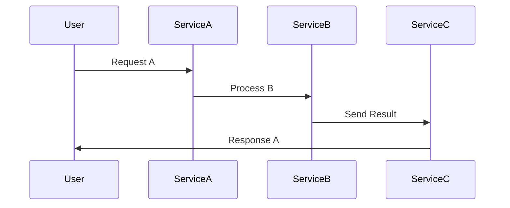

                 


# 微服务架构设计与实践

## 关键词
- 微服务架构
- 设计原则
- 实践案例
- 最佳实践
- 架构设计

## 摘要
本文将深入探讨微服务架构的设计与实践。首先，我们将介绍微服务架构的背景和重要性，然后详细解释其核心概念，包括服务拆分、服务间通信和服务治理。接下来，我们将分析微服务架构的设计原理，如设计原则和设计模式。通过实际案例分析，我们将展示微服务架构在实际项目中的应用。最后，我们将总结最佳实践，提供实用的设计建议，并推荐进一步学习资源。

## 引言
### 微服务架构的兴起
微服务架构是一种基于独立、自治服务构建的应用程序架构风格。它起源于对单体应用的改进需求，特别是在应对大规模、高并发和持续交付的场景时。微服务架构的出现解决了单体应用的诸多问题，如代码复用困难、部署和扩展困难、技术债务积累等。

### 微服务架构的重要性
微服务架构的重要性体现在以下几个方面：
- **可扩展性**：每个服务都可以独立扩展，从而更好地支持高并发场景。
- **灵活性**：服务之间解耦，使得技术选型和业务逻辑更加灵活。
- **可持续交付**：独立部署和测试服务，提高了开发和部署的效率。
- **可维护性**：服务自治，降低了代码复杂性，提高了可维护性。

### 本书的目的和结构
本书旨在帮助读者全面理解微服务架构，并提供实践指导。本书分为以下几个部分：
1. 背景介绍
2. 核心概念与联系
3. 微服务架构设计原理
4. 实践案例分析
5. 最佳实践 tips
6. 小结
7. 拓展阅读

## 背景介绍
### 微服务架构的产生背景
微服务架构的兴起可以追溯到2000年代末期。随着互联网和移动应用的快速发展，软件系统变得越来越复杂。传统的单体架构已经无法满足新的需求，导致开发效率低下、系统维护困难。

### 微服务架构的发展历程
- **2000年代末期**：互联网公司如亚马逊和Netflix开始探索微服务架构。
- **2010年代初期**：Spring Cloud等微服务框架开始流行。
- **2010年代中期**：微服务架构逐渐成为主流，并影响到各种行业。

### 微服务架构在现代软件开发中的地位和作用
微服务架构已经成为现代软件开发的基石。它不仅适用于互联网公司，还广泛应用于金融、医疗、制造等行业。微服务架构的作用包括：
- **提高开发效率**：服务自治，使得开发团队可以独立工作，提高了开发效率。
- **提升系统稳定性**：服务拆分，降低了系统间的依赖性，提高了系统的稳定性。
- **支持持续交付**：服务独立部署和测试，使得持续交付成为可能。

## 核心概念与联系
### 微服务的定义与特点
微服务是一种小型、自治的服务，通常围绕特定的业务功能构建。其特点包括：
- **独立性**：每个服务都是独立的，可以独立部署、扩展和更新。
- **自治性**：服务之间解耦，每个服务都有自己的数据存储和管理。
- **状态lessness**：服务通常不维护状态，以提高可伸缩性和可维护性。

### 微服务架构的核心概念
微服务架构的核心概念包括：
- **服务拆分**：将应用程序拆分为多个小型服务，每个服务负责特定的业务功能。
- **服务间通信**：服务之间通过API进行通信，可以使用同步或异步方式。
- **服务治理**：包括服务发现、负载均衡、服务监控和安全控制等。

### 微服务架构的ER实体关系图
```mermaid
erDiagram
    ServiceA ||--|{ ServiceB } ServiceB : communicates_with
    ServiceA ||--|{ ServiceC } ServiceC : processes_data
```
在这个ER图中，`ServiceA`、`ServiceB` 和 `ServiceC` 是三个不同的微服务，它们之间有明确的依赖关系。

## 微服务架构设计原理
### 微服务架构的设计原则
微服务架构设计原则包括：
- **分解复杂性**：将大型系统分解为小型、自治的服务。
- **独立部署**：服务可以独立部署和更新，不影响其他服务。
- **数据自治**：服务拥有自己的数据存储和管理。
- **服务自治**：服务之间解耦，降低依赖性。

### 微服务架构的设计模式
微服务架构常用的设计模式包括：
- **RESTful API**：服务之间通过HTTP/HTTPS协议进行通信。
- **事件驱动**：服务通过事件进行通信，可以异步处理。
- **分布式系统设计**：考虑系统的分布式特性，如一致性、可用性和分区容错性。

### 微服务架构的系统架构
微服务架构的系统架构包括：
- **服务层**：包含多个微服务，每个服务负责特定的业务功能。
- **基础设施层**：提供服务治理、服务发现、负载均衡等功能。
- **数据层**：包括服务自己的数据存储和共享数据存储。

### 微服务架构的Mermaid流程图

在这个流程图中，用户请求`ServiceA`，`ServiceA`将请求转发给`ServiceB`进行处理，`ServiceB`再将结果发送给`ServiceC`，最后`ServiceC`将结果返回给用户。

### 算法原理讲解
#### 算法原理的数学模型
微服务架构的算法原理主要涉及负载均衡和服务发现。负载均衡的数学模型可以表示为：
$$
\text{Load} = \frac{\text{TotalRequests}}{\text{TotalServices}}
$$
其中，`TotalRequests`是总请求量，`TotalServices`是服务数量。

#### 算法原理的Python源代码
```python
def load_balancing(total_requests, total_services):
    load_per_service = total_requests / total_services
    return load_per_service

total_requests = 100
total_services = 5
load = load_balancing(total_requests, total_services)
print(f"Load per service: {load}")
```
在这个示例中，我们计算每个服务的负载。

#### 算法原理的详细讲解和举例说明
负载均衡是微服务架构中的一个关键问题。为了保证服务的响应速度和稳定性，我们需要合理分配请求到各个服务上。上述算法通过将总请求量除以服务数量，来计算每个服务的负载。

例如，假设我们有5个服务，总共接收到了100个请求。根据上述算法，每个服务的平均负载为20个请求。这样，我们可以确保每个服务都能处理一定的请求量，从而提高系统的整体性能。

### 实践案例分析
#### 案例一：电商平台微服务架构
在一个电商平台上，我们可以将业务拆分为多个微服务，如商品服务、订单服务、支付服务、用户服务等。每个服务负责特定的业务功能，独立部署和扩展。

- **商品服务**：负责管理商品信息，如商品名称、价格、库存等。
- **订单服务**：负责处理订单创建、更新和取消等操作。
- **支付服务**：负责处理支付请求，如生成支付链接、处理支付结果等。
- **用户服务**：负责用户信息的注册、登录、权限管理等。

通过这些微服务，电商平台可以实现高并发、灵活扩展和持续交付。

#### 案例二：银行系统微服务架构
在银行系统中，我们可以将业务拆分为多个微服务，如账户服务、交易服务、贷款服务、风险控制服务等。每个服务负责特定的业务功能，独立部署和扩展。

- **账户服务**：负责管理用户账户信息，如账户余额、账户状态等。
- **交易服务**：负责处理各种交易请求，如转账、付款、消费等。
- **贷款服务**：负责管理贷款信息，如贷款申请、审批、还款等。
- **风险控制服务**：负责监控风险，如异常交易检测、风险预警等。

通过这些微服务，银行系统可以实现高可用性、安全性和合规性。

### 最佳实践 tips
- **服务拆分**：根据业务功能和数据独立性来拆分服务。
- **服务通信**：选择合适的通信协议，如RESTful API、gRPC等。
- **服务治理**：实现服务发现、负载均衡、服务监控等功能。
- **数据一致性**：确保数据在不同服务之间的同步和一致性。
- **安全控制**：实现身份验证、授权和加密等安全措施。

### 小结
微服务架构是一种基于独立、自治服务构建的应用程序架构风格。它具有可扩展性、灵活性、可持续交付和可维护性等优点。通过合理的服务拆分、服务间通信和服务治理，微服务架构可以满足现代软件开发的复杂需求。本文通过实际案例和最佳实践，展示了微服务架构的设计与实施方法。

### 拓展阅读
- 《微服务设计》
- 《微服务架构：设计原理与实践》
- 《Spring Cloud微服务实战》

## 结论
微服务架构已经成为现代软件开发的基石，它通过服务拆分、服务间通信和服务治理，提高了系统的可扩展性、灵活性和可持续交付能力。本文详细介绍了微服务架构的设计原则、设计模式和实践案例，并提供了一些最佳实践。希望本文能帮助读者更好地理解和应用微服务架构。

### 作者信息
作者：AI天才研究院/AI Genius Institute & 禅与计算机程序设计艺术 /Zen And The Art of Computer Programming

