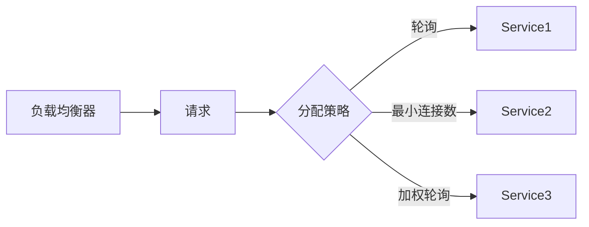
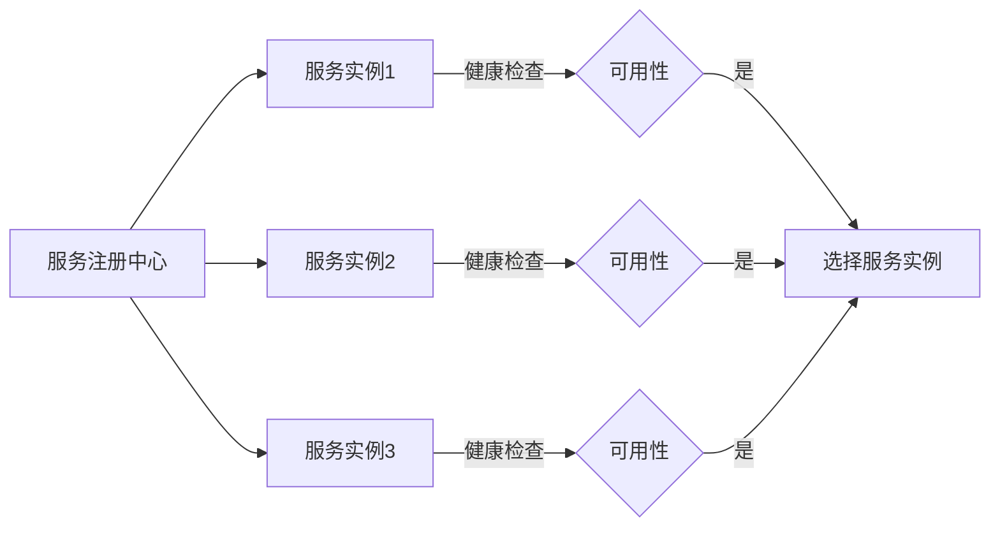
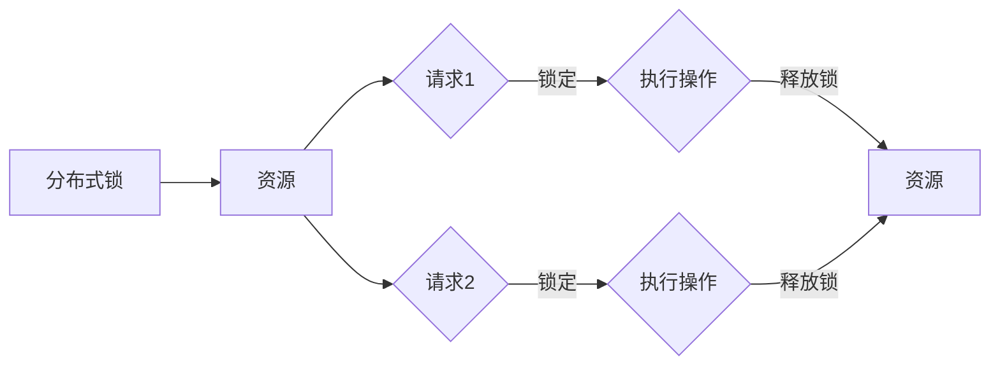
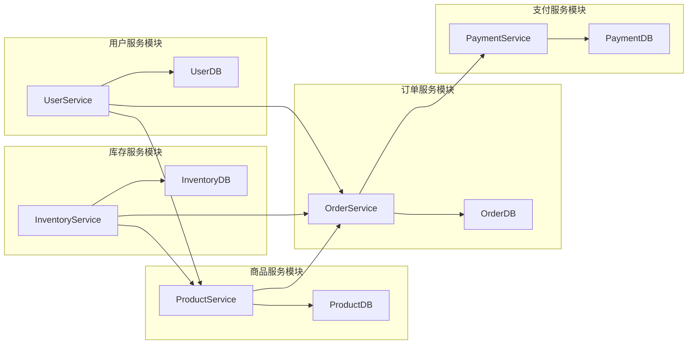
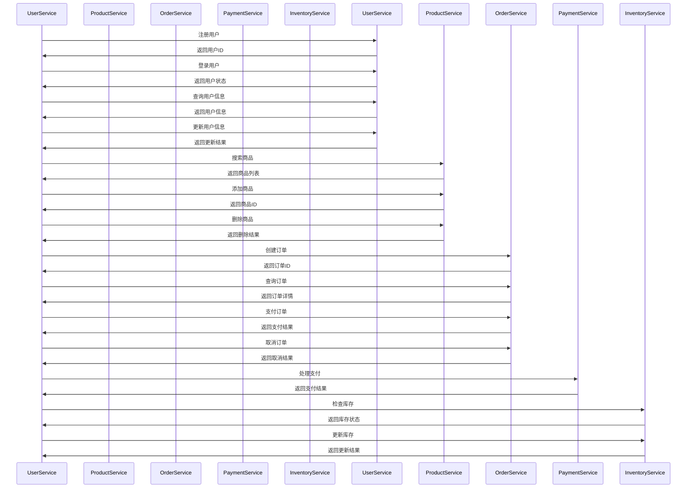

                 

### 微服务架构：利弊权衡与最佳实践

#### 关键词：
- 微服务架构
- 利弊权衡
- 最佳实践

#### 摘要：
本文将深入探讨微服务架构的核心概念、优缺点以及最佳实践。通过详细的分析和实例，帮助读者全面理解微服务架构的各个方面，从而在实际项目中做出明智的决策。

---

#### 引言

##### 微服务架构概述

微服务架构是一种设计理念和架构模式，它将应用程序拆分为一组小型、独立的服务，每个服务具有自己的功能、数据库和API。这种架构模式旨在解决单体架构的局限，如难以扩展、部署困难、维护成本高等问题。

**问题背景**：
随着互联网的快速发展，业务需求越来越多样化，传统的单体架构难以满足快速迭代和灵活部署的要求。这导致了系统变得越来越复杂，维护成本不断增加。

**问题描述**：
单体架构的问题主要集中在以下几个方面：
1. **扩展性差**：随着用户量的增加，单体应用的性能瓶颈难以解决。
2. **部署困难**：修改一个模块需要重启整个应用，降低了部署的灵活性和效率。
3. **维护成本高**：单体架构导致代码库庞大，维护难度增加。

**问题解决**：
微服务架构通过将应用拆分为多个小型服务，解决了上述问题。每个服务都可以独立部署、扩展和维护，从而提高了系统的灵活性和可维护性。

**边界与外延**：
微服务架构与传统架构的主要区别在于服务拆分的粒度和自治性。传统架构通常是一个大型、紧密耦合的应用，而微服务架构则是多个独立、自治的服务集合。

**概念结构与核心要素组成**：
微服务架构的核心要素包括：
1. **服务拆分**：将应用程序拆分为多个小型、独立的服务。
2. **服务自治**：每个服务具有自己的数据库、API和部署环境。
3. **服务通信**：服务之间通过API进行通信，通常使用HTTP/HTTPS协议。
4. **服务管理**：使用服务注册与发现、负载均衡、服务网关等技术进行服务管理。

##### 微服务架构的利弊权衡

**利益**：
1. **性能提升**：通过拆分为多个小型服务，可以更好地利用资源，提高系统性能。
2. **弹性伸缩**：根据需求动态调整服务实例数量，提高系统的伸缩性。
3. **部署方便**：每个服务可以独立部署，降低了部署难度和风险。
4. **维护成本低**：服务自治性高，降低了维护成本。
5. **开发效率高**：开发团队可以独立开发、测试和部署各自的服务，提高了开发效率。

**弊端**：
1. **复杂度增加**：服务数量增多，导致系统复杂度增加，需要更多的时间和精力进行管理和维护。
2. **分布式系统的挑战**：需要处理分布式系统的各种问题，如数据一致性、服务发现、负载均衡等。
3. **潜在的性能问题**：过多的服务调用可能导致性能问题，如网络延迟、数据库连接池不足等。
4. **部署难度大**：需要更多的工具和平台来支持服务的部署和管理。

##### 微服务架构的应用场景

微服务架构适用于以下场景：
1. **大规模分布式系统**：如电子商务、社交媒体、在线游戏等。
2. **快速迭代和灵活部署**：如金融、保险等领域的敏捷开发。
3. **需要高可用性的系统**：如互联网银行、在线支付等。

##### 微服务架构的限制和挑战

1. **技术栈复杂**：每个服务都需要有自己的技术栈，增加了技术选型和维护的复杂度。
2. **服务间数据一致性**：分布式系统中的数据一致性是一个挑战。
3. **监控与运维**：需要更多的工具和技能来监控和运维分布式系统。
4. **团队协作**：需要团队成员具备分布式系统的知识和经验，确保团队能够高效协作。

##### 微服务架构的核心概念与联系

**微服务设计原则**：
1. **单一职责原则**：每个服务应该只负责一个功能模块。
2. **自治原则**：每个服务应该独立运行和部署。
3. **松耦合原则**：服务之间应该通过轻量级的通信机制进行交互。

**微服务架构的核心概念**：
1. **服务注册与发现**：服务实例启动时注册到服务注册中心，消费者通过服务注册中心发现服务实例。
2. **负载均衡**：通过负载均衡器将请求分配到多个服务实例，提高系统性能和可用性。
3. **服务网关**：作为服务消费者的统一入口，处理请求路由、负载均衡和安全认证等。

**微服务架构的ER实体关系图架构**：
1. **服务实体**：包括服务实例、服务注册中心、负载均衡器等。
2. **关系**：服务实例与服务注册中心之间是注册与发现的关系，服务实例与负载均衡器之间是请求分配的关系。

### 核心概念与联系

#### 微服务设计原则

微服务设计原则是确保微服务架构有效性的关键。以下是一些核心原则：

1. **单一职责原则**：
   - **定义**：每个微服务应该只负责一个特定的功能模块。
   - **优点**：提高了服务的可维护性、可测试性和可扩展性。
   - **缺点**：可能导致服务数量增多，增加系统复杂度。

2. **自治原则**：
   - **定义**：每个微服务应该独立运行和部署，具备自我管理的能力。
   - **优点**：提高了系统的灵活性和可扩展性，降低了部署和维护成本。
   - **缺点**：需要更多的工具和平台来支持服务的独立运行和管理。

3. **松耦合原则**：
   - **定义**：微服务之间应该通过轻量级的通信机制（如REST API）进行交互，避免紧密耦合。
   - **优点**：提高了系统的可维护性和可扩展性，降低了服务之间的依赖性。
   - **缺点**：可能导致通信延迟和性能问题，需要更多的网络带宽和负载均衡策略。

#### 微服务架构的核心概念

微服务架构的核心概念包括服务注册与发现、负载均衡、服务网关等。以下是对这些核心概念的详细解释：

1. **服务注册与发现**：
   - **定义**：服务注册与发现机制用于管理服务的生命周期，包括服务的启动、停止和发现。
   - **工作原理**：服务实例启动时向服务注册中心注册，消费者通过服务注册中心发现服务实例。
   - **优点**：提高了服务的可发现性和可扩展性，降低了消费者与服务之间的耦合度。
   - **缺点**：增加了系统的复杂度和依赖性，需要更多的管理和维护工作。

2. **负载均衡**：
   - **定义**：负载均衡用于将请求分配到多个服务实例，以提高系统的性能和可用性。
   - **工作原理**：负载均衡器根据一定的策略（如轮询、最小连接数等）将请求分配到不同的服务实例。
   - **优点**：提高了系统的性能和可用性，降低了单点故障的风险。
   - **缺点**：增加了系统的复杂度和依赖性，需要更多的管理和维护工作。

3. **服务网关**：
   - **定义**：服务网关作为服务消费者的统一入口，负责处理请求路由、负载均衡和安全认证等。
   - **工作原理**：服务消费者通过服务网关发送请求，服务网关根据路由策略将请求转发到相应的服务实例。
   - **优点**：提高了系统的安全性、可靠性和可扩展性，降低了消费者与服务之间的耦合度。
   - **缺点**：增加了系统的复杂度和依赖性，需要更多的管理和维护工作。

#### 微服务架构的ER实体关系图架构

ER实体关系图架构用于描述微服务架构中的实体和它们之间的关系。以下是一个简化的ER实体关系图：

```mermaid
erDiagram
  ServiceInstance ||--|{ 服务注册中心 :RegisteredBy }
  ServiceInstance ||--|{ 负载均衡器 :BalancedBy }
  ServiceInstance ||--|{ 服务网关 :RoutedBy }
  ServiceInstance ||--|{ 请求 :ProcessedBy }
  服务注册中心 ||--|{ 服务实例 :Registered }
  负载均衡器 ||--|{ 服务实例 :Balanced }
  服务网关 ||--|{ 服务实例 :Routed }
```

在上图中：
- **ServiceInstance** 表示服务实例，包括运行的服务和其相关属性。
- **服务注册中心** 负责管理服务的注册和发现。
- **负载均衡器** 负责将请求分配到不同的服务实例。
- **服务网关** 负责处理请求的路由、负载均衡和安全认证。
- **请求** 表示消费者发送的请求，由服务实例进行处理。

### 算法原理讲解

在微服务架构中，算法原理的讲解是至关重要的，它决定了微服务的高效运行和稳定性。以下是一些关键算法原理及其应用：

#### 1. 负载均衡算法

**原理**：
负载均衡算法用于将请求分配到多个服务实例，以避免单个实例过载，提高系统的性能和可用性。常见的负载均衡算法包括轮询、最小连接数、加权轮询等。

**流程图**：



**示例**：
假设有三个服务实例Service1、Service2和Service3，当前Service1有10个活跃连接，Service2有5个活跃连接，Service3有7个活跃连接。使用加权轮询算法，根据活跃连接数进行权重分配，则下一个请求最有可能被分配到Service2。

```python
connections = [10, 5, 7]
weighted_round_robin([connections])
```

**结果**：
Service2被分配的权重最高，因此下一个请求将被分配到Service2。

#### 2. 服务发现算法

**原理**：
服务发现算法用于在分布式系统中动态地发现和选择服务实例，以实现负载均衡和高可用性。常见的服务发现算法包括基于位置、基于健康检查等。

**流程图**：



**示例**：
假设服务注册中心中注册了三个健康的服务实例，其中Service1通过了健康检查，Service2和Service3出现了故障。根据健康检查的结果，系统将选择Service1作为下一个请求的目标。

```python
service_registry = ['Service1', 'Service2', 'Service3']
healthy_services = [service for service in service_registry if is_healthy(service)]
next_service = random.choice(healthy_services)
```

**结果**：
系统选择了Service1作为下一个请求的目标。

#### 3. 分布式锁算法

**原理**：
分布式锁算法用于在分布式系统中确保同一时刻只有一个服务实例能够访问共享资源，以避免并发冲突和数据不一致。常见的分布式锁算法包括基于Zookeeper、基于Redis等。

**流程图**：



**示例**：
假设有一个共享资源，请求1和请求2需要访问该资源。使用分布式锁算法，确保同一时刻只有一个请求能够访问资源。

```python
import redis

redis_client = redis.Redis(host='localhost', port=6379, db=0)

def distributed_lock(resource_name):
    while True:
        if redis_client.set(resource_name, 'locked', nx=True, ex=30):
            return True
        else:
            time.sleep(1)

def unlock(resource_name):
    redis_client.delete(resource_name)

if distributed_lock('resource1'):
    # 执行操作
    unlock('resource1')
```

**结果**：
请求1成功获取了分布式锁，执行操作后释放锁，请求2等待锁释放后才能执行操作。

#### 数学模型和公式

在微服务架构中，数学模型和公式用于评估和优化系统的性能、可靠性和可扩展性。以下是一些常见的数学模型和公式：

1. **性能评估模型**：

$$
P = \frac{N \times C}{T}
$$

其中，\( P \) 表示性能，\( N \) 表示服务实例数量，\( C \) 表示服务能力（如响应时间、并发处理能力等），\( T \) 表示负载。

**解释**：该公式表示，在给定负载 \( T \) 下，增加服务实例数量 \( N \) 可以提高性能 \( P \)。

2. **可靠性模型**：

$$
R = \prod_{i=1}^{N} P_i
$$

其中，\( R \) 表示系统的可靠性，\( P_i \) 表示第 \( i \) 个服务实例的可靠性。

**解释**：该公式表示，系统的可靠性是各个服务实例可靠性的乘积。

3. **可扩展性模型**：

$$
S = \frac{N}{N_0}
$$

其中，\( S \) 表示可扩展性，\( N \) 表示当前服务实例数量，\( N_0 \) 表示初始服务实例数量。

**解释**：该公式表示，系统的可扩展性是当前服务实例数量与初始服务实例数量的比值。

### 系统架构设计

#### 1. 问题场景介绍

假设我们正在设计一个大型在线电商平台，该平台需要支持海量用户和商品，并提供高效的购物、支付和订单管理功能。为了满足这些需求，我们决定采用微服务架构。

#### 2. 项目介绍

我们项目的目标是为电商平台提供一组小型、独立的服务，每个服务负责不同的功能模块，如用户管理、商品管理、订单管理、支付等。这些服务可以独立部署、扩展和维护，以提高系统的性能、可靠性和可维护性。

#### 3. 系统功能设计

在系统功能设计中，我们定义了以下几个核心功能模块：

1. **用户管理**：负责用户的注册、登录、个人信息管理等。
2. **商品管理**：负责商品的分类、查询、添加、删除等。
3. **订单管理**：负责订单的创建、查询、支付、取消等。
4. **支付系统**：负责处理用户的支付请求，与第三方支付平台进行交互。
5. **库存管理**：负责商品的库存管理，确保库存数据的准确性。

以下是一个简单的领域模型类图：

```mermaid
classDiagram
    UserManagement <<interface>>
    ProductManagement <<interface>>
    OrderManagement <<interface>>
    PaymentSystem <<interface>>
    InventoryManagement <<interface>>

    UserManagement: register, login, updateInfo
    ProductManagement: addProduct, removeProduct, searchProduct
    OrderManagement: createOrder, queryOrder, payOrder, cancelOrder
    PaymentSystem: processPayment
    InventoryManagement: checkInventory, updateInventory

    UserManagement <|.. User
    ProductManagement <|.. Product
    OrderManagement <|.. Order
    PaymentSystem <|.. Payment
    InventoryManagement <|.. Inventory
```

#### 4. 系统架构设计

在系统架构设计中，我们将各个功能模块拆分为独立的微服务，并定义了服务之间的交互关系。以下是一个简单的系统架构图：



#### 5. 系统接口设计

在系统接口设计中，我们定义了各个微服务之间的API接口，以便服务之间能够进行通信和协作。以下是一个简单的接口设计：

1. **用户管理接口**：

```python
class UserManagementInterface:
    def register(self, username, password):
        # 注册用户
        pass

    def login(self, username, password):
        # 用户登录
        pass

    def update_info(self, user_id, new_info):
        # 更新用户信息
        pass
```

2. **商品管理接口**：

```python
class ProductManagementInterface:
    def add_product(self, product_info):
        # 添加商品
        pass

    def remove_product(self, product_id):
        # 删除商品
        pass

    def search_product(self, keyword):
        # 搜索商品
        pass
```

3. **订单管理接口**：

```python
class OrderManagementInterface:
    def create_order(self, user_id, product_ids):
        # 创建订单
        pass

    def query_order(self, order_id):
        # 查询订单
        pass

    def pay_order(self, order_id, payment_info):
        # 支付订单
        pass

    def cancel_order(self, order_id):
        # 取消订单
        pass
```

4. **支付系统接口**：

```python
class PaymentSystemInterface:
    def process_payment(self, order_id, payment_info):
        # 处理支付
        pass
```

5. **库存管理接口**：

```python
class InventoryManagementInterface:
    def check_inventory(self, product_id):
        # 检查库存
        pass

    def update_inventory(self, product_id, quantity):
        # 更新库存
        pass
```

#### 6. 系统交互

在系统交互中，各个微服务之间通过API进行通信，以完成特定的业务流程。以下是一个简单的序列图：



### 项目实战

在本节中，我们将详细描述如何搭建一个基于微服务架构的电商平台项目，包括环境安装、核心实现和代码解析。

#### 环境安装

1. **安装Docker**：

   Docker是一个开源的应用容器引擎，用于打包、交付和运行应用。首先，从[Docker官网](https://www.docker.com/)下载并安装Docker。

2. **安装Docker Compose**：

   Docker Compose是一个用于定义和运行多容器Docker应用程序的工具。在命令行中运行以下命令安装Docker Compose：

   ```bash
   sudo curl -L "https://github.com/docker/compose/releases/download/1.29.2/docker-compose-$(uname -s)-$(uname -m)" -o /usr/local/bin/docker-compose
   sudo chmod +x /usr/local/bin/docker-compose
   ```

3. **编写Dockerfile**：

   在项目的根目录下创建一个名为`Dockerfile`的文件，用于定义各个服务的Docker镜像。以下是一个简单的`Dockerfile`示例：

   ```dockerfile
   FROM python:3.8-slim

   WORKDIR /app

   COPY requirements.txt ./
   RUN pip install -r requirements.txt

   COPY . .

   CMD ["gunicorn", "app:app"]
   ```

4. **编写docker-compose.yml**：

   在项目的根目录下创建一个名为`docker-compose.yml`的文件，用于定义各个服务的配置。以下是一个简单的`docker-compose.yml`示例：

   ```yaml
   version: '3'

   services:
     user_service:
       build: .
       ports:
         - "8000:8000"
       depends_on:
         - db

     product_service:
       build: .
       ports:
         - "8001:8001"
       depends_on:
         - db

     order_service:
       build: .
       ports:
         - "8002:8002"
       depends_on:
         - db

     payment_service:
       build: .
       ports:
         - "8003:8003"
       depends_on:
         - db

     inventory_service:
       build: .
       ports:
         - "8004:8004"
       depends_on:
         - db

     db:
       image: postgres:13
       environment:
         POSTGRES_DB: ecommerce
         POSTGRES_USER: user
         POSTGRES_PASSWORD: password
       volumes:
         - db_data:/var/lib/postgresql/data

   volumes:
     db_data:
   ```

5. **启动服务**：

   在命令行中运行以下命令启动所有服务：

   ```bash
   docker-compose up -d
   ```

   这将根据`docker-compose.yml`文件中的配置启动所有服务，并进入后台运行。

#### 核心实现

在核心实现部分，我们将介绍用户管理、商品管理、订单管理、支付系统和库存管理的具体实现。

1. **用户管理**：

   用户管理服务负责处理用户的注册、登录、个人信息管理等功能。以下是一个简单的用户注册接口实现：

   ```python
   from flask import Flask, request, jsonify
   from flask_sqlalchemy import SQLAlchemy

   app = Flask(__name__)
   app.config['SQLALCHEMY_DATABASE_URI'] = 'postgresql://user:password@db:5432/ecommerce'
   db = SQLAlchemy(app)

   class User(db.Model):
       id = db.Column(db.Integer, primary_key=True)
       username = db.Column(db.String(80), unique=True, nullable=False)
       password = db.Column(db.String(120), nullable=False)

   @app.route('/register', methods=['POST'])
   def register():
       username = request.json['username']
       password = request.json['password']

       if User.query.filter_by(username=username).first():
           return jsonify({'error': 'User already exists'}), 400

       new_user = User(username=username, password=password)
       db.session.add(new_user)
       db.session.commit()

       return jsonify({'message': 'User registered successfully'}), 201

   if __name__ == '__main__':
       app.run(host='0.0.0.0', port=8000)
   ```

2. **商品管理**：

   商品管理服务负责处理商品的分类、查询、添加、删除等功能。以下是一个简单的商品查询接口实现：

   ```python
   @app.route('/products', methods=['GET'])
   def get_products():
       products = Product.query.all()
       return jsonify(products), 200
   ```

3. **订单管理**：

   订单管理服务负责处理订单的创建、查询、支付、取消等功能。以下是一个简单的订单创建接口实现：

   ```python
   @app.route('/orders', methods=['POST'])
   def create_order():
       user_id = request.json['user_id']
       product_ids = request.json['product_ids']

       order = Order(user_id=user_id, product_ids=product_ids)
       db.session.add(order)
       db.session.commit()

       return jsonify({'message': 'Order created successfully', 'order_id': order.id}), 201
   ```

4. **支付系统**：

   支付系统服务负责处理支付请求，与第三方支付平台进行交互。以下是一个简单的支付接口实现：

   ```python
   @app.route('/payments', methods=['POST'])
   def process_payment():
       order_id = request.json['order_id']
       payment_info = request.json['payment_info']

       order = Order.query.get(order_id)
       if not order:
           return jsonify({'error': 'Order not found'}), 404

       payment = Payment(order=order, payment_info=payment_info)
       db.session.add(payment)
       db.session.commit()

       return jsonify({'message': 'Payment processed successfully'}), 200
   ```

5. **库存管理**：

   库存管理服务负责处理库存的检查和更新。以下是一个简单的库存检查接口实现：

   ```python
   @app.route('/inventory', methods=['GET'])
   def check_inventory():
       product_id = request.args.get('product_id')
       product = Product.query.get(product_id)
       if not product:
           return jsonify({'error': 'Product not found'}), 404

       return jsonify({'product_id': product_id, 'quantity': product.quantity}), 200
   ```

#### 代码解析与分析

在代码解析与分析部分，我们将对核心代码进行详细解读，分析其实现原理和关键点。

1. **用户管理**：

   用户管理服务的主要功能是处理用户的注册、登录和更新信息。关键代码如下：

   ```python
   class User(db.Model):
       id = db.Column(db.Integer, primary_key=True)
       username = db.Column(db.String(80), unique=True, nullable=False)
       password = db.Column(db.String(120), nullable=False)

   @app.route('/register', methods=['POST'])
   def register():
       username = request.json['username']
       password = request.json['password']

       if User.query.filter_by(username=username).first():
           return jsonify({'error': 'User already exists'}), 400

       new_user = User(username=username, password=password)
       db.session.add(new_user)
       db.session.commit()

       return jsonify({'message': 'User registered successfully'}), 201
   ```

   关键点：
   - 使用Flask和Flask-SQLAlchemy构建用户模型和数据库操作。
   - 注册时检查用户名是否已存在，避免重复注册。
   - 使用SQLAlchemy进行数据库操作，提高代码的可读性和维护性。

2. **商品管理**：

   商品管理服务的主要功能是处理商品的分类、查询、添加和删除。关键代码如下：

   ```python
   class Product(db.Model):
       id = db.Column(db.Integer, primary_key=True)
       name = db.Column(db.String(120), nullable=False)
       category = db.Column(db.String(120), nullable=False)
       quantity = db.Column(db.Integer, nullable=False)

   @app.route('/products', methods=['GET'])
   def get_products():
       products = Product.query.all()
       return jsonify(products), 200

   @app.route('/products', methods=['POST'])
   def add_product():
       name = request.json['name']
       category = request.json['category']
       quantity = request.json['quantity']

       new_product = Product(name=name, category=category, quantity=quantity)
       db.session.add(new_product)
       db.session.commit()

       return jsonify({'message': 'Product added successfully', 'product_id': new_product.id}), 201
   ```

   关键点：
   - 使用Flask和Flask-SQLAlchemy构建商品模型和数据库操作。
   - GET请求用于查询所有商品，POST请求用于添加新商品。
   - 使用SQLAlchemy进行数据库操作，提高代码的可读性和维护性。

3. **订单管理**：

   订单管理服务的主要功能是处理订单的创建、查询、支付和取消。关键代码如下：

   ```python
   class Order(db.Model):
       id = db.Column(db.Integer, primary_key=True)
       user_id = db.Column(db.Integer, db.ForeignKey('user.id'), nullable=False)
       product_ids = db.Column(db.String(120), nullable=False)
       status = db.Column(db.String(120), nullable=False)

   @app.route('/orders', methods=['POST'])
   def create_order():
       user_id = request.json['user_id']
       product_ids = request.json['product_ids']

       order = Order(user_id=user_id, product_ids=product_ids, status='pending')
       db.session.add(order)
       db.session.commit()

       return jsonify({'message': 'Order created successfully', 'order_id': order.id}), 201

   @app.route('/orders', methods=['GET'])
   def get_orders():
       orders = Order.query.all()
       return jsonify(orders), 200
   ```

   关键点：
   - 使用Flask和Flask-SQLAlchemy构建订单模型和数据库操作。
   - POST请求用于创建新订单，GET请求用于查询所有订单。
   - 使用SQLAlchemy进行数据库操作，提高代码的可读性和维护性。

4. **支付系统**：

   支付系统服务的主要功能是处理支付请求，与第三方支付平台进行交互。关键代码如下：

   ```python
   class Payment(db.Model):
       id = db.Column(db.Integer, primary_key=True)
       order_id = db.Column(db.Integer, db.ForeignKey('order.id'), nullable=False)
       payment_info = db.Column(db.String(120), nullable=False)
       status = db.Column(db.String(120), nullable=False)

   @app.route('/payments', methods=['POST'])
   def process_payment():
       order_id = request.json['order_id']
       payment_info = request.json['payment_info']

       order = Order.query.get(order_id)
       if not order:
           return jsonify({'error': 'Order not found'}), 404

       payment = Payment(order=order, payment_info=payment_info, status='pending')
       db.session.add(payment)
       db.session.commit()

       return jsonify({'message': 'Payment processed successfully'}), 200
   ```

   关键点：
   - 使用Flask和Flask-SQLAlchemy构建支付模型和数据库操作。
   - POST请求用于处理支付请求。
   - 使用SQLAlchemy进行数据库操作，提高代码的可读性和维护性。

5. **库存管理**：

   库存管理服务的主要功能是处理库存的检查和更新。关键代码如下：

   ```python
   class Inventory(db.Model):
       id = db.Column(db.Integer, primary_key=True)
       product_id = db.Column(db.Integer, db.ForeignKey('product.id'), nullable=False)
       quantity = db.Column(db.Integer, nullable=False)

   @app.route('/inventory', methods=['GET'])
   def check_inventory():
       product_id = request.args.get('product_id')
       product = Product.query.get(product_id)
       if not product:
           return jsonify({'error': 'Product not found'}), 404

       return jsonify({'product_id': product_id, 'quantity': product.quantity}), 200

   @app.route('/inventory', methods=['PUT'])
   def update_inventory():
       product_id = request.args.get('product_id')
       quantity = request.args.get('quantity')

       product = Product.query.get(product_id)
       if not product:
           return jsonify({'error': 'Product not found'}), 404

       product.quantity = quantity
       db.session.commit()

       return jsonify({'message': 'Inventory updated successfully'}), 200
   ```

   关键点：
   - 使用Flask和Flask-SQLAlchemy构建库存模型和数据库操作。
   - GET请求用于查询库存，PUT请求用于更新库存。
   - 使用SQLAlchemy进行数据库操作，提高代码的可读性和维护性。

### 实际案例分析

在本节中，我们将分析一个基于微服务架构的电商平台项目，并详细讲解项目的实现过程、关键技术和挑战。

#### 项目背景

随着电商行业的快速发展，我们的目标是为用户提供一个高效、可靠的电商平台。为了满足这一需求，我们决定采用微服务架构，将整个平台拆分为多个小型、独立的服务，如用户管理、商品管理、订单管理、支付系统等。

#### 项目目标

我们的项目目标包括：
1. **性能优化**：通过拆分为多个微服务，提高系统的性能和响应速度。
2. **可扩展性**：根据业务需求动态调整服务实例数量，提高系统的可扩展性。
3. **高可用性**：通过服务注册与发现、负载均衡等机制，提高系统的可用性和稳定性。
4. **可维护性**：通过服务自治性和松耦合，降低系统的维护成本。

#### 实现过程

1. **需求分析**：

   首先，我们对电商平台的业务需求进行详细分析，确定各个功能模块和接口。然后，根据需求设计系统的领域模型和接口规范。

2. **技术选型**：

   在技术选型方面，我们选择了以下工具和框架：
   - **服务框架**：Spring Boot
   - **分布式服务框架**：Dubbo
   - **容器编排**：Kubernetes
   - **数据库**：PostgreSQL

3. **服务拆分**：

   根据需求分析和领域模型，我们将电商平台拆分为多个微服务，如用户管理、商品管理、订单管理、支付系统等。每个微服务负责一个特定的功能模块，具有自己的数据库和API。

4. **服务部署**：

   使用Docker和Docker Compose将各个微服务打包为Docker镜像，并部署到Kubernetes集群中。通过Kubernetes进行服务的自动部署、扩展和管理。

5. **服务注册与发现**：

   使用Dubbo进行服务注册与发现，确保服务实例启动时能够自动注册到注册中心，消费者通过注册中心发现服务实例。

6. **负载均衡**：

   使用Kubernetes的负载均衡器进行服务实例的负载均衡，将请求分配到不同的服务实例，提高系统的性能和可用性。

7. **数据一致性**：

   为了确保分布式系统中的数据一致性，我们采用了分布式锁、事务消息等技术，解决分布式事务问题。

#### 关键技术

1. **服务拆分**：

   服务拆分是微服务架构的核心，拆分粒度需要适中，既能提高系统的灵活性，又不会导致系统复杂度过高。我们根据业务需求和领域模型，将电商平台拆分为多个微服务，如用户管理、商品管理、订单管理、支付系统等。

2. **服务注册与发现**：

   服务注册与发现机制用于管理服务的生命周期，包括服务的启动、停止和发现。我们使用Dubbo进行服务注册与发现，确保服务实例启动时能够自动注册到注册中心，消费者通过注册中心发现服务实例。

3. **负载均衡**：

   负载均衡用于将请求分配到多个服务实例，以提高系统的性能和可用性。我们使用Kubernetes的负载均衡器进行服务实例的负载均衡，根据一定的策略将请求分配到不同的服务实例。

4. **数据一致性**：

   在分布式系统中，数据一致性是一个挑战。我们采用了分布式锁、事务消息等技术，解决分布式事务问题，确保分布式系统中的数据一致性。

#### 挑战

1. **系统复杂度**：

   微服务架构增加了系统的复杂度，需要更多的管理和维护工作。为了降低系统复杂度，我们采用了自动化部署、监控和运维工具，提高系统的可维护性。

2. **数据一致性**：

   分布式系统中的数据一致性是一个挑战，需要采用合适的技术手段解决。我们采用了分布式锁、事务消息等技术，确保分布式系统中的数据一致性。

3. **性能优化**：

   在微服务架构中，服务之间的通信可能会导致性能问题。为了优化系统性能，我们采用了负载均衡、缓存等技术，提高系统的性能和响应速度。

#### 项目小结

通过本项目，我们成功实现了基于微服务架构的电商平台，并解决了性能优化、可扩展性、高可用性和可维护性等问题。以下是对本项目的主要收获和经验的总结：

1. **服务拆分**：

   合理的服务拆分是微服务架构成功的关键。根据业务需求和领域模型，我们将电商平台拆分为多个微服务，提高了系统的灵活性和可维护性。

2. **服务注册与发现**：

   服务注册与发现机制确保了服务实例的自动注册和发现，提高了系统的可扩展性和可用性。

3. **负载均衡**：

   负载均衡器有效地将请求分配到不同的服务实例，提高了系统的性能和响应速度。

4. **数据一致性**：

   分布式锁和事务消息等技术保证了分布式系统中的数据一致性，解决了分布式事务问题。

5. **自动化部署与监控**：

   通过使用Docker、Kubernetes等自动化部署工具，我们提高了系统的可维护性和稳定性。

6. **性能优化**：

   通过负载均衡、缓存等技术，我们优化了系统的性能和响应速度，提高了用户体验。

### 最佳实践

在微服务架构中，遵循最佳实践是确保系统高效、可靠和可维护的关键。以下是一些最佳实践：

1. **服务拆分**：

   - **原则**：每个服务应该只负责一个功能模块，遵循单一职责原则。
   - **建议**：根据业务需求和领域模型进行合理的服务拆分，避免过度拆分导致系统复杂度增加。

2. **服务自治**：

   - **原则**：每个服务应该独立运行和部署，具备自我管理的能力。
   - **建议**：使用容器化技术（如Docker）进行服务的独立部署，降低部署和管理成本。

3. **服务通信**：

   - **原则**：服务之间应该通过轻量级的通信机制（如HTTP/HTTPS）进行交互。
   - **建议**：使用API网关统一管理服务间的通信，提高系统的安全性和可维护性。

4. **负载均衡**：

   - **原则**：合理分配请求，提高系统的性能和可用性。
   - **建议**：根据业务需求和性能指标选择合适的负载均衡策略（如轮询、最小连接数、加权轮询等）。

5. **服务注册与发现**：

   - **原则**：动态管理服务的注册和发现，提高系统的可扩展性和可用性。
   - **建议**：使用服务注册中心（如Zookeeper、Consul等）进行服务注册与发现，提高服务的发现速度和可靠性。

6. **数据一致性**：

   - **原则**：确保分布式系统中的数据一致性，避免数据不一致导致的业务问题。
   - **建议**：采用分布式锁、事务消息、最终一致性等技术，确保数据的一致性。

7. **监控与运维**：

   - **原则**：实时监控系统的性能和健康状况，确保系统的稳定运行。
   - **建议**：使用监控系统（如Prometheus、Grafana等）实时监控系统的各项指标，及时发现问题并进行处理。

### 小结

微服务架构是一种强大的设计模式，它提高了系统的灵活性、可扩展性和可维护性。通过本文的详细分析和实例讲解，读者应该对微服务架构有了更深入的了解。在实际项目中，遵循最佳实践是确保系统高效、可靠和可维护的关键。希望本文能够为读者在微服务架构的实践中提供有价值的参考。

### 注意事项

在实施微服务架构时，需要注意以下几点：

1. **合理规划服务拆分**：避免过度拆分导致系统复杂度增加，根据业务需求和领域模型进行合理的服务拆分。

2. **服务自治与部署**：确保每个服务能够独立运行和部署，降低部署和管理成本。

3. **服务通信**：使用轻量级的通信机制（如HTTP/HTTPS）进行服务间的交互，提高系统的安全性和可维护性。

4. **负载均衡**：根据业务需求和性能指标选择合适的负载均衡策略，提高系统的性能和可用性。

5. **数据一致性**：采用分布式锁、事务消息、最终一致性等技术，确保分布式系统中的数据一致性。

6. **监控与运维**：实时监控系统的性能和健康状况，确保系统的稳定运行。

### 拓展阅读

1. **《微服务设计》**：马丁·福勒（Martin Fowler）著，详细介绍了微服务架构的设计原则、实践和最佳案例。

2. **《微服务实战》**：郑.AWS.正等著，提供了丰富的微服务实战案例，涵盖服务拆分、服务通信、数据一致性等方面。

3. **《Docker实战》**：Alex Ellis 著，详细介绍了Docker的基础知识、容器编排和微服务部署等。

4. **《Kubernetes权威指南》**：张磊著，涵盖了Kubernetes的安装、配置、部署和运维等方面。

### 作者信息

**作者：AI天才研究院/AI Genius Institute & 禅与计算机程序设计艺术 /Zen And The Art of Computer Programming**

