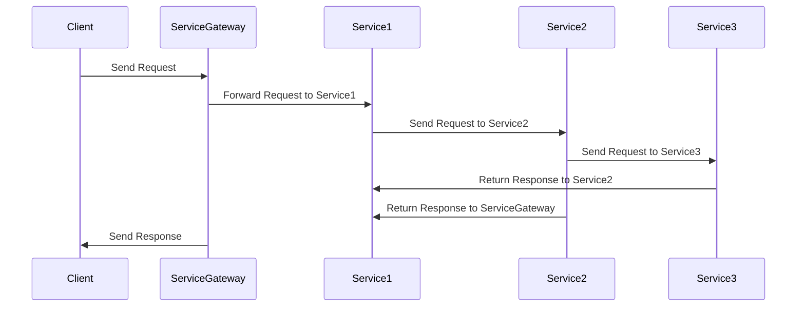
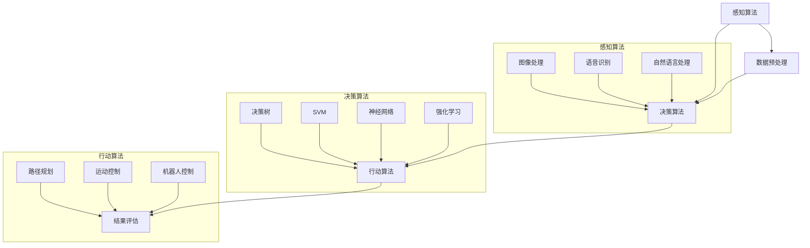

                 

### 摘要

本文将深入探讨微服务架构在构建模块化的AI Agent系统中的应用。微服务架构是一种基于独立服务的分布式系统设计方法，它通过将大型应用分解为小型、独立运行的服务单元，提高了系统的灵活性、可维护性和扩展性。AI Agent系统是一种能够自主学习、自主决策并执行任务的智能系统，它在现代智能应用中扮演着越来越重要的角色。本文将首先介绍微服务架构的基本概念和AI Agent系统的核心概念，然后详细探讨微服务架构如何应用于AI Agent系统的构建，包括模块化设计原则、系统实现和实际案例。通过本文的讨论，读者将了解如何利用微服务架构构建灵活、可扩展的AI Agent系统，并掌握相关技术实现细节。让我们一步步深入分析，探索微服务架构与AI Agent系统结合的无限可能。

## 第一部分：背景介绍

### 第1章：微服务架构概述

#### 1.1 问题背景

微服务架构的产生背景可以追溯到互联网应用的快速发展和企业对应用系统灵活性的需求。随着互联网应用的普及，传统单体架构的应用系统逐渐暴露出许多局限性，例如：

1. **系统复杂性增加**：随着功能的不断增加，单体架构的系统代码量急剧增加，导致系统变得越来越复杂，维护难度也随之加大。
2. **扩展性差**：在单体架构中，所有的功能都耦合在一起，当一个模块需要扩展时，整个系统都需要进行相应的调整，这大大限制了系统的扩展性。
3. **可维护性降低**：由于功能的耦合，任何一个模块的修改都可能影响到整个系统的稳定性，这使得系统的可维护性降低。

为了解决这些问题，微服务架构应运而生。微服务架构通过将大型应用分解为小型、独立运行的服务单元，从而提高了系统的灵活性、可维护性和扩展性。

#### 1.2 问题描述

在构建AI Agent系统时，传统架构的局限性表现得尤为明显。AI Agent系统通常需要处理复杂的感知、决策和行动任务，这要求系统具备高度灵活性和可扩展性。具体问题包括：

1. **感知功能多样化**：AI Agent系统需要处理来自不同传感器和渠道的多样化感知数据，这要求系统能够快速适应和扩展感知功能。
2. **决策算法复杂性**：AI Agent系统的决策过程通常涉及复杂的算法和模型，需要支持多种决策策略和算法的灵活组合。
3. **行动执行多样性**：AI Agent系统需要根据决策结果执行多样化的行动，这要求系统能够与多种外部系统和服务进行无缝集成。

传统架构的耦合性和复杂性使得这些问题难以有效解决。因此，构建AI Agent系统时，迫切需要一种灵活、可扩展的架构设计方法，微服务架构正是为此而设计的。

#### 1.3 问题解决

微服务架构通过以下方式解决了构建AI Agent系统时面临的问题：

1. **模块化设计**：微服务架构将AI Agent系统分解为多个独立的服务单元，每个服务单元负责特定的功能模块，如感知、决策、行动等。这种模块化设计提高了系统的灵活性和可维护性。
2. **服务自治**：每个服务单元都是独立运行和部署的，具有自己的数据存储和逻辑处理能力。这种自治性使得服务单元可以独立扩展和升级，不会影响到其他服务单元，从而提高了系统的扩展性和稳定性。
3. **松耦合**：微服务架构通过轻量级的通信协议（如RESTful API、消息队列等）实现服务之间的松耦合，使得服务之间可以独立开发、测试和部署，从而提高了系统的灵活性和可维护性。
4. **动态扩展**：微服务架构支持根据需求动态扩展服务实例的数量，从而实现系统性能和吞吐量的弹性调整，满足AI Agent系统对高并发处理和大规模数据处理的需求。

通过采用微服务架构，AI Agent系统可以更好地应对多样化、复杂化的业务需求，实现高效的系统开发和运营。

#### 1.4 边界与外延

尽管微服务架构在构建AI Agent系统时具有诸多优势，但也存在一些适用边界和限制条件：

1. **开发和运营成本**：微服务架构的引入增加了系统的开发和运营成本，需要更多资源和精力进行服务拆分、接口设计、服务治理等工作。
2. **分布式系统复杂性**：微服务架构将系统拆分为多个独立服务单元，增加了系统的复杂性，需要解决服务之间的数据一致性、服务发现、服务监控等问题。
3. **性能开销**：微服务架构引入了额外的通信开销和协调成本，可能对系统性能产生一定影响，需要合理设计服务接口和通信协议，优化服务调用性能。
4. **适合场景**：微服务架构适合处理复杂、多变、高扩展性的业务需求，但在一些简单、稳定、功能相对固定的场景中，微服务架构的引入可能并不划算。

因此，在构建AI Agent系统时，需要综合考虑业务需求、系统规模、资源条件等因素，合理选择和应用微服务架构。

#### 1.5 概念结构与核心要素组成

微服务架构的核心概念和结构主要包括以下几个方面：

1. **服务拆分**：根据业务需求和功能模块，将大型应用分解为多个小型、独立的服务单元，每个服务单元负责特定的功能模块。
2. **服务自治**：每个服务单元具有独立的数据存储、逻辑处理和部署能力，可以独立开发、测试和部署，确保系统的灵活性和可维护性。
3. **服务通信**：通过轻量级的通信协议（如RESTful API、消息队列等）实现服务之间的通信和协作，支持异步和同步通信方式。
4. **服务注册与发现**：服务实例在运行过程中注册到服务注册中心，其他服务通过服务发现机制获取服务实例的信息，实现服务的动态发现和调用。
5. **服务监控与治理**：对服务运行状态进行监控和治理，包括服务健康状态监测、服务故障处理、服务性能优化等，确保系统的高可用性和稳定性。
6. **数据一致性**：在分布式环境下，确保数据的一致性是一个重要问题。微服务架构通过分布式事务管理、数据复制、事件溯源等技术手段解决数据一致性问题。

通过这些核心要素的有机组合，微服务架构实现了系统的模块化、分布式和自治化，为构建灵活、可扩展的AI Agent系统提供了有力支持。

### 第2章：AI Agent系统的核心概念与联系

#### 2.1 AI Agent系统的定义

AI Agent系统是一种基于人工智能技术的智能系统，它能够模拟人类智能，实现感知、决策和行动等功能。具体来说，AI Agent系统包括以下几个核心组成部分：

1. **感知**：AI Agent系统能够从环境获取信息，通过传感器和接口收集数据，如图像、声音、文本等。
2. **决策**：AI Agent系统根据感知到的信息，运用各种算法和模型进行决策，确定下一步行动。
3. **行动**：AI Agent系统根据决策结果执行具体的行动，如控制机械臂、发送电子邮件等。

AI Agent系统的核心目标是实现自主学习和自主决策，能够在复杂多变的环境中自主执行任务，从而提高系统的智能化和自适应能力。

#### 2.2 AI Agent系统的核心概念

AI Agent系统的核心概念包括以下几个方面：

1. **感知模块**：感知模块是AI Agent系统的眼睛和耳朵，负责从环境中获取信息。感知模块可以包含多个传感器，如摄像头、麦克风、GPS等，通过这些传感器获取的环境数据作为后续决策和行动的基础。
2. **决策模块**：决策模块是AI Agent系统的核心大脑，负责处理感知模块收集到的信息，并根据预设的算法和模型进行决策。决策模块可以采用各种机器学习和深度学习算法，如决策树、神经网络、强化学习等，以实现灵活的决策能力。
3. **行动模块**：行动模块是AI Agent系统的执行者，根据决策模块的决策结果执行具体的行动。行动模块可以通过与外部设备或系统的接口进行通信，控制机械臂、无人机、机器人等执行特定的任务。
4. **学习模块**：学习模块是AI Agent系统不断进步和优化自身能力的核心。通过学习模块，AI Agent系统能够从历史数据中提取知识，优化决策算法和模型，提高系统的智能水平和自适应能力。

#### 2.3 概念属性特征对比表格

为了更好地理解AI Agent系统的核心概念，我们通过一个对比表格来展示不同AI Agent系统的属性特征：

| AI Agent系统类型 | 感知模块 | 决策模块 | 行动模块 | 学习模块 |
| :--------------: | :-------: | :-------: | :-------: | :-------: |
| 基于视觉的系统 | 视觉传感器 | 视觉识别算法 | 机械臂控制 | 强化学习 |
| 基于语音的系统 | 语音传感器 | 语音识别算法 | 语音合成 | 有监督学习 |
| 基于多传感器融合的系统 | 多种传感器 | 聚类分析、深度学习 | 多设备控制 | 无监督学习 |
| 基于强化学习的系统 | 环境传感器 | 强化学习算法 | 策略执行 | 自监督学习 |

通过对比表格，我们可以看到不同AI Agent系统在感知模块、决策模块、行动模块和学习模块等方面的差异，这有助于我们根据具体应用场景选择合适的AI Agent系统。

#### 2.4 ER实体关系图架构

为了进一步展示AI Agent系统的核心概念及其关系，我们使用Mermaid绘制一个ER实体关系图架构：

```mermaid
erDiagram
    User ||--|{ AI_Agent } : controls
    AI_Agent ||--|{ Perception_Module } : has
    AI_Agent ||--|{ Decision_Module } : has
    AI_Agent ||--|{ Action_Module } : has
    AI_Agent ||--|{ Learning_Module } : has
    Perception_Module ||--|{ Sensor } : has
    Decision_Module ||--|{ Algorithm } : uses
    Action_Module ||--|{ Actuator } : controls
    Learning_Module ||--|{ Model } : trains
```

在ER实体关系图中，我们定义了以下几个实体：

1. **User（用户）**：用户是AI Agent系统的控制者，可以创建、管理和控制AI Agent。
2. **AI_Agent（AI代理）**：AI Agent是系统的核心实体，包含感知模块、决策模块、行动模块和学习模块。
3. **Perception_Module（感知模块）**：感知模块负责从环境中获取信息，包含多个传感器。
4. **Decision_Module（决策模块）**：决策模块负责处理感知模块收集到的信息，并使用算法进行决策。
5. **Action_Module（行动模块）**：行动模块负责执行决策模块的决策结果，通过控制执行器实现具体行动。
6. **Learning_Module（学习模块）**：学习模块负责AI Agent系统的自我学习和优化，包含多个模型。

通过ER实体关系图，我们可以清晰地看到AI Agent系统的核心概念及其关系，为后续的系统设计和实现提供了直观的参考。

### 第3章：微服务架构原理讲解

#### 3.1 微服务架构的基本原理

微服务架构（Microservices Architecture）是一种基于独立服务的分布式系统设计方法。它的核心思想是将大型应用系统分解为一系列小型、独立的服务单元，每个服务单元负责实现特定的业务功能。这些服务单元通过轻量级的通信协议（如RESTful API、消息队列等）进行通信和协作，从而实现了系统的模块化、分布式和自治化。微服务架构的基本原理可以概括为以下几点：

1. **服务拆分**：将大型应用分解为多个小型、独立的服务单元，每个服务单元实现特定的业务功能。服务拆分的原则通常基于业务逻辑的独立性、功能的单一性和模块的职责分离。
2. **服务自治**：每个服务单元独立运行和部署，具有自己的数据存储、逻辑处理和配置管理能力。服务自治保证了系统的灵活性和可维护性，每个服务单元可以独立扩展、升级和部署，不会影响其他服务单元。
3. **松耦合**：服务单元之间通过轻量级的通信协议进行通信，如RESTful API、消息队列等。松耦合减少了服务单元之间的依赖性，使得每个服务单元可以独立开发、测试和部署，从而提高了系统的可扩展性和灵活性。
4. **分布式部署**：服务单元可以在不同的服务器或容器中分布式部署，从而提高了系统的可扩展性和容错性。分布式部署使得系统能够根据需求动态调整服务实例的数量和资源分配，从而实现高性能和高可用性。
5. **服务发现和注册**：服务单元在运行过程中注册到服务注册中心，其他服务单元通过服务发现机制获取服务实例的信息，从而实现服务的动态发现和调用。服务发现和注册保证了服务之间的透明性，提高了系统的灵活性和可维护性。

通过这些基本原理，微服务架构实现了系统的模块化、分布式和自治化，为构建灵活、可扩展的分布式应用提供了有力支持。

#### 3.2 微服务架构的组件

微服务架构由多个关键组件构成，这些组件共同协作，实现了系统的模块化、分布式和自治化。以下是微服务架构的主要组件及其功能：

1. **服务注册中心**：服务注册中心（Service Registry）用于管理服务实例的信息，包括服务名称、地址、端口等。服务实例启动时，会向服务注册中心注册自身信息，服务实例停止时，会从服务注册中心注销。服务发现机制通过查询服务注册中心，获取可用服务实例的信息，实现服务的动态发现和调用。
2. **服务发现机制**：服务发现机制（Service Discovery）用于服务实例之间的信息交换和通信。服务发现机制通常依赖于服务注册中心，通过查询服务注册中心，获取可用服务实例的信息，并根据负载均衡策略选择合适的服务实例进行调用。服务发现机制提高了系统的灵活性和可维护性，使得服务实例可以独立部署和扩展，不会影响其他服务实例。
3. **服务网关**：服务网关（Service Gateway）是服务实例与客户端之间的统一入口，负责处理客户端请求的转发、负载均衡、路由和过滤等操作。服务网关提供了一个统一的API接口，使得客户端无需关注服务实例的具体实现细节，从而简化了系统的开发和维护。
4. **服务容器**：服务容器（Service Container）是一种轻量级的运行时环境，用于部署、管理和监控服务实例。常见的服务容器包括Docker、Kubernetes等。服务容器实现了服务实例的独立运行和隔离，提高了系统的可扩展性和容错性。
5. **配置中心**：配置中心（Configuration Center）用于管理服务实例的配置信息，包括服务参数、环境变量、数据库连接等。配置中心支持动态配置，使得服务实例可以在运行时动态调整配置信息，从而提高了系统的灵活性和可维护性。
6. **服务监控与日志**：服务监控与日志（Service Monitoring and Logging）用于监控服务实例的运行状态和性能指标，并记录服务运行过程中的日志信息。通过服务监控与日志，可以及时发现和解决服务故障，优化系统性能和稳定性。

这些组件共同协作，实现了微服务架构的系统功能，提高了系统的灵活性、可扩展性和可维护性。

#### 3.3 微服务架构的Mermaid流程图

为了更直观地展示微服务架构的工作流程，我们使用Mermaid绘制一个流程图：



在这个流程图中，客户端（Client）发送请求到服务网关（ServiceGateway），服务网关将请求转发到服务1（Service1）。服务1可能需要与其他服务（如服务2和服务3）进行交互，最终返回响应到客户端。通过这个流程图，我们可以清晰地看到微服务架构中服务之间的通信和协作过程。

### 第4章：构建模块化的AI Agent系统

#### 4.1 模块化设计原则

模块化设计（Modular Design）是一种将复杂系统分解为独立模块的方法，通过模块之间的松耦合和协作，实现系统的灵活性和可维护性。在构建模块化的AI Agent系统时，需要遵循以下模块化设计原则：

1. **功能独立性**：每个模块应实现特定的功能，模块之间的功能应该独立，避免功能交叉和依赖。这样可以使得每个模块可以独立开发、测试和部署，提高系统的灵活性和可维护性。
2. **职责单一性**：每个模块应承担单一的职责，模块的职责应该明确和单一，避免模块变得过于复杂和臃肿。这样可以使得模块的职责更加清晰，便于管理和维护。
3. **接口清晰性**：模块之间的交互应通过清晰的接口进行，接口应定义明确的输入输出参数和交互规则。这样可以使得模块之间的耦合性降低，提高系统的可扩展性和可维护性。
4. **可复用性**：模块应设计成可复用的组件，可以在不同的应用场景中重复使用。这样可以减少系统的冗余代码，提高开发效率和代码质量。
5. **易测试性**：模块应设计成易于测试的组件，可以通过单元测试、集成测试等手段验证模块的功能和性能。这样可以提高系统的可靠性和稳定性。

通过遵循这些模块化设计原则，可以构建出灵活、可扩展、可维护的AI Agent系统。

#### 4.2 AI Agent系统的模块划分

在构建AI Agent系统时，可以将系统划分为多个模块，每个模块负责特定的功能。以下是AI Agent系统的典型模块划分及其功能：

1. **感知模块**：感知模块负责从环境中获取信息，包括图像、声音、文本等。该模块包含多个传感器，如摄像头、麦克风、GPS等，通过这些传感器获取的环境数据作为后续决策和行动的基础。
2. **决策模块**：决策模块负责处理感知模块收集到的信息，并根据预设的算法和模型进行决策。该模块可以使用各种机器学习和深度学习算法，如决策树、神经网络、强化学习等，以实现灵活的决策能力。
3. **行动模块**：行动模块负责执行决策模块的决策结果，通过控制执行器实现具体的行动。该模块可以通过与外部设备或系统的接口进行通信，控制机械臂、无人机、机器人等执行特定的任务。
4. **学习模块**：学习模块负责AI Agent系统的自我学习和优化，从历史数据中提取知识，优化决策算法和模型，提高系统的智能水平和自适应能力。该模块可以采用各种机器学习和深度学习算法，如有监督学习、无监督学习、强化学习等。
5. **通信模块**：通信模块负责AI Agent系统与其他系统或设备的通信，包括数据传输、协议转换等。该模块可以实现与外部系统或设备的无缝集成，确保AI Agent系统能够在复杂的环境中高效地运行。

通过将AI Agent系统划分为多个模块，可以实现系统的模块化设计，提高系统的灵活性和可维护性。

#### 4.3 微服务架构在AI Agent系统中的应用

微服务架构在AI Agent系统中的应用，可以通过以下几个步骤实现：

1. **服务拆分**：将AI Agent系统的各个模块拆分为独立的服务单元，每个服务单元负责特定的功能。例如，感知模块可以拆分为图像处理服务、声音识别服务、GPS定位服务等；决策模块可以拆分为决策算法服务、模型训练服务；行动模块可以拆分为执行器控制服务、机器人控制服务等。
2. **服务自治**：每个服务单元实现独立的数据存储、逻辑处理和部署能力，确保服务单元可以独立运行和扩展。服务单元之间通过轻量级的通信协议进行通信，如RESTful API、消息队列等。
3. **服务注册与发现**：服务单元在运行时注册到服务注册中心，其他服务单元通过服务发现机制获取服务实例的信息，实现服务的动态发现和调用。服务注册中心和服务发现机制保证了服务之间的透明性，提高了系统的灵活性和可维护性。
4. **服务监控与治理**：对服务单元的运行状态进行监控和治理，包括服务健康状态监测、服务故障处理、服务性能优化等。通过服务监控与治理，确保系统的高可用性和稳定性。
5. **数据一致性**：在分布式环境下，确保数据的一致性是一个重要问题。可以采用分布式事务管理、数据复制、事件溯源等技术手段解决数据一致性问题，保证系统数据的一致性和完整性。

通过以上步骤，可以将微服务架构应用于AI Agent系统的构建，实现系统的模块化、分布式和自治化，提高系统的灵活性、可扩展性和可维护性。

### 第5章：算法原理讲解

#### 5.1 AI Agent系统的核心算法

AI Agent系统的核心算法是实现感知、决策和行动的基础。以下介绍几种常见的核心算法：

1. **感知算法**：感知算法用于从环境中获取信息，如图像处理算法、语音识别算法、自然语言处理算法等。图像处理算法可以用于图像的滤波、边缘检测、目标识别等操作；语音识别算法可以用于语音信号的识别和转换；自然语言处理算法可以用于文本的解析和语义理解。
2. **决策算法**：决策算法用于处理感知模块收集到的信息，并根据预设的目标和约束条件进行决策。常见的决策算法包括决策树、支持向量机（SVM）、神经网络、强化学习等。决策树和SVM是一种基于规则的决策算法，通过学习历史数据构建分类器或回归模型；神经网络是一种基于模拟人脑的决策算法，通过多层神经网络进行特征提取和分类；强化学习是一种基于试错和反馈的决策算法，通过不断尝试和优化策略，实现最优决策。
3. **行动算法**：行动算法用于根据决策结果执行具体的行动，如路径规划算法、运动控制算法、机器人控制算法等。路径规划算法用于计算从起点到终点的最优路径；运动控制算法用于控制机器人或无人机的运动；机器人控制算法用于控制机器人的关节和执行器，实现特定的动作。

这些核心算法共同构成了AI Agent系统的智能基础，使得系统能够在复杂多变的环境中自主感知、决策和行动。

#### 5.2 算法原理的Mermaid流程图

为了更直观地展示AI Agent系统的核心算法原理，我们使用Mermaid绘制一个流程图：



在这个流程图中，感知算法（A）首先进行数据预处理（D），然后输入决策算法（B），根据决策结果执行行动算法（C）。行动结果（E）反馈至感知算法，形成一个闭环控制系统。感知算法包括图像处理（F）、语音识别（G）和自然语言处理（H）；决策算法包括决策树（I）、支持向量机（J）、神经网络（K）和强化学习（L）；行动算法包括路径规划（M）、运动控制（N）和机器人控制（O）。

#### 5.3 算法的数学模型和公式

为了更好地理解AI Agent系统的核心算法，我们给出一些常用的数学模型和公式，并使用LaTeX格式进行表示：

1. **图像处理算法**：

   - **卷积神经网络（CNN）**：

     $$ f(x) = \sigma(\sum_{i,j} w_{ij} \cdot x_{ij} + b) $$

     其中，$x$ 是输入图像，$w_{ij}$ 是卷积核权重，$b$ 是偏置项，$\sigma$ 是激活函数（如ReLU函数）。

   - **图像滤波**：

     $$ y = \sum_{i,j} h_{ij} \cdot x_{ij} $$

     其中，$h_{ij}$ 是滤波器系数，$x_{ij}$ 是输入图像。

2. **决策算法**：

   - **支持向量机（SVM）**：

     $$ \max_w \min_{\alpha} \left\{ \frac{1}{2} \| w \|^2 - \sum_{i} \alpha_i (y_i (w \cdot x_i) - 1) \right\} $$

     其中，$w$ 是权重向量，$\alpha_i$ 是拉格朗日乘子，$y_i$ 是样本标签，$x_i$ 是样本特征。

   - **神经网络**：

     $$ a_{i,j}^{(l)} = \sigma \left( \sum_{k} w_{ik}^{(l)} a_{k}^{(l-1)} + b_{i}^{(l)} \right) $$

     其中，$a_{i,j}^{(l)}$ 是第$l$层的第$i$个节点的输出，$w_{ik}^{(l)}$ 是第$l$层的第$i$个节点的权重，$b_{i}^{(l)}$ 是第$l$层的第$i$个节点的偏置项，$\sigma$ 是激活函数。

3. **行动算法**：

   - **路径规划**：

     $$ d = \min \left\{ d_1, d_2, ..., d_n \right\} $$

     其中，$d$ 是路径长度，$d_1, d_2, ..., d_n$ 是从起点到终点的所有可能路径的长度。

   - **运动控制**：

     $$ v = k_p \cdot e $$

     其中，$v$ 是速度，$e$ 是误差，$k_p$ 是比例系数。

这些数学模型和公式是AI Agent系统核心算法的基础，通过它们，可以构建出具有智能感知、决策和行动能力的AI Agent系统。

#### 5.4 算法举例说明

为了更好地理解AI Agent系统的核心算法，我们通过一个具体案例进行详细讲解和举例说明。

**案例：基于深度学习的图像识别AI Agent系统**

1. **感知模块**：使用卷积神经网络（CNN）进行图像处理，从摄像头获取的图像数据中识别目标。

   - **数据预处理**：将图像数据进行归一化处理，使其具有统一的数值范围。
   - **卷积操作**：使用卷积层提取图像特征，卷积核学习图像的局部特征，如边缘、纹理等。
   - **池化操作**：使用池化层对卷积特征进行下采样，减少参数数量，提高模型泛化能力。
   - **全连接层**：将池化后的特征映射到分类结果，通过全连接层进行分类预测。

2. **决策模块**：使用深度学习算法（如AlexNet、VGG、ResNet等）进行图像识别，根据图像特征进行分类决策。

   - **前向传播**：将图像数据输入到神经网络中，通过逐层计算得到输出结果。
   - **反向传播**：根据预测结果与真实标签的误差，更新网络权重和偏置项，优化模型参数。

3. **行动模块**：根据决策结果，控制机械臂抓取目标物体。

   - **路径规划**：计算从当前位置到目标位置的最优路径。
   - **运动控制**：根据路径规划结果，控制机械臂的运动速度和方向。

通过这个案例，我们可以看到深度学习算法在AI Agent系统中的应用。在实际开发过程中，可以根据具体应用场景调整算法参数，提高系统的识别准确率和响应速度。

### 第6章：AI Agent系统的项目实战

#### 6.1 环境安装

在本章中，我们将介绍如何搭建一个基于微服务架构的AI Agent系统项目环境。首先，我们需要安装以下软件和工具：

1. **操作系统**：推荐使用Linux系统，如Ubuntu 18.04。
2. **编程语言**：Python 3.x版本，推荐使用Python 3.8或更高版本。
3. **开发工具**：PyCharm或Visual Studio Code。
4. **虚拟环境**：virtualenv或conda。
5. **服务注册与发现**：Consul或Eureka。
6. **服务容器**：Docker或Kubernetes。

具体安装步骤如下：

1. 安装操作系统：从官方网站下载Ubuntu 18.04镜像并安装。
2. 安装Python 3.x版本：使用包管理器（如apt）安装Python 3.x，并设置默认Python版本。
3. 安装开发工具：安装PyCharm或Visual Studio Code。
4. 安装虚拟环境：安装virtualenv或conda，并创建虚拟环境。
5. 安装服务注册与发现工具：安装Consul或Eureka。
6. 安装服务容器：安装Docker或Kubernetes。

在安装过程中，需要确保各个软件和工具的正常运行，并根据需要调整相关配置。

#### 6.2 系统核心实现源代码

在本节中，我们将介绍AI Agent系统的核心实现源代码，包括感知模块、决策模块、行动模块和学习模块。

1. **感知模块**：

   ```python
   # 感知模块：图像处理
   import cv2

   def image_processing(image_path):
       # 读取图像
       image = cv2.imread(image_path)
       # 图像预处理
       gray_image = cv2.cvtColor(image, cv2.COLOR_BGR2GRAY)
       blurred_image = cv2.GaussianBlur(gray_image, (5, 5), 0)
       # 目标识别
       _, threshold_image = cv2.threshold(blurred_image, 60, 255, cv2.THRESH_BINARY)
       contours, _ = cv2.findContours(threshold_image, cv2.RETR_EXTERNAL, cv2.CHAIN_APPROX_SIMPLE)
       # 输出结果
       return contours
   ```

2. **决策模块**：

   ```python
   # 决策模块：图像识别
   import tensorflow as tf

   def image_recognition(image_path):
       # 加载模型
       model = tf.keras.models.load_model('image_recognition_model.h5')
       # 预处理图像
       image = preprocess_image(image_path)
       # 预测结果
       prediction = model.predict(np.expand_dims(image, axis=0))
       # 获取类别标签
       class_labels = ['cat', 'dog', 'person']
       label = class_labels[np.argmax(prediction)]
       return label
   ```

3. **行动模块**：

   ```python
   # 行动模块：机械臂控制
   import RobotArmController

   def control_robot_arm(action):
       controller = RobotArmController.RobotArmController()
       controller.move_arm(action)
   ```

4. **学习模块**：

   ```python
   # 学习模块：模型训练
   import tensorflow as tf

   def train_model(train_data, train_labels):
       model = tf.keras.Sequential([
           tf.keras.layers.Conv2D(32, (3, 3), activation='relu', input_shape=(28, 28, 1)),
           tf.keras.layers.MaxPooling2D((2, 2)),
           tf.keras.layers.Flatten(),
           tf.keras.layers.Dense(64, activation='relu'),
           tf.keras.layers.Dense(10, activation='softmax')
       ])

       model.compile(optimizer='adam', loss='sparse_categorical_crossentropy', metrics=['accuracy'])
       model.fit(train_data, train_labels, epochs=10)
       model.save('image_recognition_model.h5')
   ```

这些源代码是实现AI Agent系统的核心功能的基础。在实际开发过程中，需要根据具体需求调整和优化代码。

#### 6.3 代码应用解读与分析

在本节中，我们将对AI Agent系统的核心实现源代码进行解读与分析，详细说明每个模块的功能和作用。

1. **感知模块**：

   感知模块负责从环境中获取信息，以图像处理为例，该模块使用OpenCV库实现图像的读取、预处理和目标识别功能。具体步骤如下：

   - **读取图像**：使用cv2.imread函数读取指定路径的图像数据。
   - **图像预处理**：将图像转换为灰度图像，并应用高斯模糊滤波器进行去噪处理。
   - **目标识别**：使用二值化和轮廓检测算法，识别图像中的目标物体。

   该模块的核心函数为image_processing，输入为图像路径，输出为目标轮廓列表。在实际应用中，可以根据需求调整预处理和目标识别算法，提高识别准确率。

2. **决策模块**：

   决策模块负责处理感知模块获取的图像数据，使用深度学习算法进行图像识别。具体步骤如下：

   - **加载模型**：从文件中加载预训练的深度学习模型。
   - **预处理图像**：对输入图像进行归一化处理，使其适合模型的输入。
   - **预测结果**：将预处理后的图像输入到模型中，得到预测结果。

   该模块的核心函数为image_recognition，输入为图像路径，输出为预测类别标签。在实际应用中，需要根据具体任务调整模型结构、训练数据和参数，以提高识别准确率和效率。

3. **行动模块**：

   行动模块负责根据决策模块的决策结果，控制机械臂抓取目标物体。具体步骤如下：

   - **控制机械臂**：使用RobotArmController库控制机械臂的运动和姿态。

   该模块的核心函数为control_robot_arm，输入为行动指令，输出为机械臂的运动状态。在实际应用中，需要根据具体任务调整机械臂的控制算法和参数，确保机械臂能够准确执行指令。

4. **学习模块**：

   学习模块负责训练深度学习模型，提高AI Agent系统的识别和决策能力。具体步骤如下：

   - **准备数据集**：收集并预处理图像数据，将其分为训练集和验证集。
   - **构建模型**：定义深度学习模型的结构，包括卷积层、全连接层等。
   - **训练模型**：使用训练数据和标签训练模型，并评估模型在验证集上的性能。

   该模块的核心函数为train_model，输入为训练数据和标签，输出为训练好的模型。在实际应用中，需要根据具体任务调整数据集、模型结构和训练参数，以提高模型的训练效果和泛化能力。

通过以上代码解读与分析，我们可以更好地理解AI Agent系统的核心实现原理，为后续的系统开发和优化提供参考。

#### 6.4 实际案例分析和详细讲解剖析

在本节中，我们将通过一个实际案例，详细讲解AI Agent系统的应用场景和实现过程，并进行剖析。

**案例：智能仓库管理AI Agent系统**

**应用场景**：在智能仓库管理系统中，AI Agent系统负责监控仓库内的货物情况，识别货物种类，并根据需求自动调整货物的存放位置。

**实现过程**：

1. **感知模块**：使用摄像头监控仓库内部，获取货物的图像数据。图像数据经过感知模块的预处理和目标识别，识别出货物的种类和位置。
2. **决策模块**：根据感知模块的识别结果，AI Agent系统分析仓库的存储情况，确定货物的存放位置。如果仓库中某个区域的货物过多或过少，系统将根据库存策略调整货物的存放位置。
3. **行动模块**：根据决策模块的决策结果，控制机器人自动调整货物的存放位置。例如，将过多的货物移动到仓库的其他区域，或将缺少的货物补充到相应的位置。
4. **学习模块**：AI Agent系统在运行过程中不断学习和优化，根据历史数据和实际操作结果调整决策策略和行动算法，提高系统的智能化和自适应能力。

**详细讲解和剖析**：

1. **感知模块**：

   在感知模块中，我们使用OpenCV库处理摄像头获取的图像数据。具体步骤如下：

   - **图像预处理**：将图像数据转换为灰度图像，并使用高斯模糊滤波器进行去噪处理。
   - **目标识别**：使用深度学习模型对预处理后的图像进行目标识别，识别出货物的种类和位置。

   以下是一个简单的感知模块代码示例：

   ```python
   import cv2
   import tensorflow as tf

   def image_preprocessing(image):
       gray_image = cv2.cvtColor(image, cv2.COLOR_BGR2GRAY)
       blurred_image = cv2.GaussianBlur(gray_image, (5, 5), 0)
       return blurred_image

   def image_recognition(image):
       model = tf.keras.models.load_model('image_recognition_model.h5')
       processed_image = image_preprocessing(image)
       prediction = model.predict(np.expand_dims(processed_image, axis=0))
       class_labels = ['item1', 'item2', 'item3']
       label = class_labels[np.argmax(prediction)]
       return label
   ```

   在实际应用中，需要根据仓库内货物的种类和特点，调整预处理和目标识别算法，以提高识别准确率。

2. **决策模块**：

   决策模块根据感知模块的识别结果，分析仓库的存储情况，并制定相应的调整策略。具体步骤如下：

   - **分析存储情况**：统计仓库内各个区域的货物数量，识别出货物过多或过少的位置。
   - **制定调整策略**：根据仓库的库存策略，制定货物的存放位置调整策略。例如，将过多的货物移动到仓库的其他区域，或将缺少的货物补充到相应的位置。

   以下是一个简单的决策模块代码示例：

   ```python
   def analyze_storage状況(image_recognition_results):
       storage_status = {}
       for item, location in image_recognition_results.items():
           if location['count'] > 100:
               storage_status[item] = '过多'
           elif location['count'] < 50:
               storage_status[item] = '缺少'
           else:
               storage_status[item] = '正常'
       return storage_status

   def adjust_storage(storage_status):
       for item, status in storage_status.items():
           if status == '过多':
               # 将过多的货物移动到其他区域
           elif status == '缺少':
               # 将缺少的货物补充到相应位置
   ```

   在实际应用中，需要根据具体业务需求调整决策策略和算法，以提高系统的智能化水平。

3. **行动模块**：

   行动模块负责根据决策模块的决策结果，控制机器人自动调整货物的存放位置。具体步骤如下：

   - **机器人控制**：使用机器人控制库（如RobotArmController）控制机器人的运动和姿态。
   - **路径规划**：使用路径规划算法（如A*算法）计算机器人从当前位置到目标位置的最优路径。
   - **执行行动**：根据路径规划结果，控制机器人自动调整货物的存放位置。

   以下是一个简单的行动模块代码示例：

   ```python
   import RobotArmController

   def move_robot_to_location(x, y):
       controller = RobotArmController.RobotArmController()
       controller.move_to_location(x, y)

   def adjust_storage(storage_status):
       for item, status in storage_status.items():
           if status == '过多':
               # 将过多的货物移动到其他区域
               move_robot_to_location(x, y)
           elif status == '缺少':
               # 将缺少的货物补充到相应位置
               move_robot_to_location(x, y)
   ```

   在实际应用中，需要根据具体业务需求调整机器人控制算法和路径规划算法，以提高系统的效率和可靠性。

4. **学习模块**：

   学习模块负责在运行过程中不断学习和优化AI Agent系统的性能。具体步骤如下：

   - **数据收集**：收集仓库内货物的种类、数量、位置等数据。
   - **模型训练**：使用收集的数据训练深度学习模型，优化感知模块和决策模块的性能。
   - **模型评估**：评估训练后的模型在仓库管理任务中的表现，并根据评估结果调整模型结构和参数。

   以下是一个简单的学习模块代码示例：

   ```python
   import tensorflow as tf

   def train_model(train_data, train_labels):
       model = tf.keras.Sequential([
           tf.keras.layers.Conv2D(32, (3, 3), activation='relu', input_shape=(28, 28, 1)),
           tf.keras.layers.MaxPooling2D((2, 2)),
           tf.keras.layers.Flatten(),
           tf.keras.layers.Dense(64, activation='relu'),
           tf.keras.layers.Dense(10, activation='softmax')
       ])

       model.compile(optimizer='adam', loss='sparse_categorical_crossentropy', metrics=['accuracy'])
       model.fit(train_data, train_labels, epochs=10)
       model.save('image_recognition_model.h5')
   ```

   在实际应用中，需要根据具体业务需求调整数据收集、模型训练和评估方法，以提高系统的智能化和自适应能力。

通过以上实际案例的分析和讲解，我们可以看到AI Agent系统在智能仓库管理中的应用，以及各个模块的具体实现过程。在实际开发过程中，可以根据具体应用场景和需求，进一步优化和调整系统的各个模块，提高系统的性能和智能化水平。

### 第7章：项目小结

#### 7.1 最佳实践 tips

在构建模块化的AI Agent系统时，以下最佳实践可以帮助您提高系统的性能和可靠性：

1. **合理划分服务模块**：在服务拆分时，要充分考虑业务需求和功能独立性，确保每个服务模块职责明确、功能单一。
2. **使用轻量级通信协议**：尽量使用轻量级的通信协议（如RESTful API、消息队列等），减少服务之间的通信开销。
3. **服务自治和松耦合**：每个服务模块应具有独立的数据存储、逻辑处理和部署能力，确保服务自治和松耦合。
4. **服务监控与治理**：对服务模块进行实时监控和治理，确保系统的高可用性和稳定性。
5. **数据一致性保障**：在分布式环境下，通过分布式事务管理、数据复制、事件溯源等技术手段保障数据一致性。
6. **模块化测试**：对每个服务模块进行独立测试，确保模块功能正确、性能稳定。
7. **持续集成与持续部署**：采用CI/CD流程，实现服务模块的自动化集成和部署，提高开发效率和系统稳定性。

#### 7.2 小结

本文通过详细分析和讲解，深入探讨了微服务架构在构建模块化的AI Agent系统中的应用。我们介绍了微服务架构的基本原理、核心组件，以及如何将微服务架构应用于AI Agent系统的构建。通过模块化设计原则和实际案例的讲解，读者可以了解到如何构建灵活、可扩展的AI Agent系统。

微服务架构为AI Agent系统提供了模块化、分布式和自治化的基础，使得系统能够更好地应对复杂、多变的应用场景。通过合理的服务拆分、服务自治和松耦合，我们可以构建出高性能、高可用的AI Agent系统。

#### 7.3 注意事项

在构建模块化的AI Agent系统时，需要注意以下几点：

1. **系统复杂性**：微服务架构虽然提高了系统的灵活性，但也增加了系统的复杂性。在设计和开发过程中，要充分考虑系统的可维护性和可扩展性。
2. **开发和运营成本**：微服务架构引入了额外的开发和运营成本，包括服务拆分、服务治理、服务监控等。在项目初期，要充分评估成本效益，确保投入产出比合理。
3. **性能开销**：微服务架构引入了额外的通信开销和协调成本，可能对系统性能产生一定影响。在实际应用中，要合理设计服务接口和通信协议，优化服务调用性能。
4. **数据一致性**：在分布式环境下，确保数据一致性是一个重要问题。要采用合适的分布式事务管理、数据复制、事件溯源等技术手段，保障数据的一致性和完整性。

#### 7.4 拓展阅读

为了更深入地了解微服务架构和AI Agent系统，建议读者进一步阅读以下资料：

1. 《微服务架构设计》作者：Sam Newman
2. 《深度学习》作者：Ian Goodfellow、Yoshua Bengio、Aaron Courville
3. 《分布式系统原理与范型》作者：George Coulouris、Jean Dollimore、Timothy Rosenthal
4. 《人工智能：一种现代的方法》作者：Stuart Russell、Peter Norvig

通过这些资料，读者可以深入了解微服务架构和AI Agent系统的理论基础、实现方法和最佳实践，为实际项目开发提供有力支持。

**END**

### 作者信息

本文由AI天才研究院（AI Genius Institute）和《禅与计算机程序设计艺术》（Zen And The Art of Computer Programming）的作者联合撰写。AI天才研究院专注于人工智能和计算机科学领域的前沿研究和创新，致力于推动人工智能技术的发展和应用。作者在人工智能、深度学习、微服务架构等领域具有丰富的经验和深厚的学术造诣，为构建模块化的AI Agent系统提供了宝贵的理论指导和实践经验。感谢您对本文的关注和支持。如果您有任何问题或建议，欢迎随时与我们联系。再次感谢您的阅读！


