                 

### 第1章：微服务概念与背景

#### 1.1 微服务的定义与起源

**1.1.1 微服务的定义**

微服务（Microservices）是一种设计模式，它鼓励将应用程序构建为一组小而独立的组件，每个组件（即服务）负责完成特定功能。这些服务可以独立部署、运行和扩展，通常通过轻量级的通信协议（如HTTP/REST或消息队列）进行交互。微服务的核心理念是“拆分与自治”，旨在实现高内聚、低耦合的系统架构。

**1.1.2 微服务与传统单体架构对比**

传统单体架构（Monolithic Architecture）是指应用程序作为一个单一、不可分割的整体运行，所有功能、逻辑和数据存储都在一个应用实例中。相比之下，微服务架构将应用程序分解为多个独立的服务，每个服务拥有自己的逻辑、数据存储和部署环境。

**表1-1 微服务与单体架构对比**

| 特性       | 微服务架构               | 单体架构                |
|------------|--------------------------|-------------------------|
| 耦合度     | 低耦合，高内聚           | 高耦合，低内聚          |
| 部署       | 独立部署，无需重启其他服务 | 部署需要重启整个应用实例 |
| 扩展性     | 可根据需求独立扩展服务     | 整体扩展，资源利用率低   |
| 灵活性     | 服务可以独立迭代和更新     | 整体迭代，风险较高       |
| 复杂性     | 高（服务间协调与通信）     | 低（整体架构简单）      |

**1.1.3 微服务的主要优势**

**1.1.3.1 灵活性与可扩展性**

微服务架构使得应用可以根据具体需求独立扩展和缩放，从而提高资源利用率。例如，在电子商务平台中，可以根据订单量的波动独立扩展订单处理服务。

**1.1.3.2 独立部署和迭代**

微服务可以独立部署和迭代，从而减少系统的停机时间。在单体架构中，每次功能更新都需要重启整个应用实例，导致用户体验不佳。

**1.1.4 微服务的挑战与风险**

**1.1.4.1 分布式系统的复杂性**

微服务架构引入了分布式系统的复杂性，如服务发现、数据一致性和服务间通信。分布式系统的调试和监控比单体架构更复杂。

**1.1.4.2 服务管理难度**

管理多个独立的服务需要更加精细化的管理策略，如服务注册、配置管理和监控等。

**1.1.5 微服务的历史与演变**

**1.1.5.1 微服务起源**

微服务概念起源于2000年代初期，随着互联网技术的发展和敏捷开发理念的普及而逐渐流行。最初的微服务实践主要集中在初创公司和互联网企业中。

**1.1.5.2 微服务的成熟与应用**

随着云计算和容器技术的发展，微服务已经成为现代软件架构的主流选择。许多大型企业（如亚马逊、Netflix和阿里巴巴）已经成功转型为微服务架构，从而实现了更高的灵活性和可扩展性。

### 第2章：微服务核心概念

#### 2.1 服务拆分策略

**2.1.1 按功能拆分**

按功能拆分是将应用程序按功能模块进行拆分，每个模块独立运行。这种方法有助于实现高内聚、低耦合的系统架构。

**2.1.2 按业务领域拆分**

按业务领域拆分是按照业务领域进行拆分，每个领域独立运行，有助于实现业务解耦。这种方法有助于提高系统的可维护性和可扩展性。

#### 2.2 服务间通信

**2.2.1 RESTful API**

RESTful API 是一种用于服务间通信的轻量级协议，基于 HTTP/REST 风格。它提供了一套标准化的接口，便于服务间交互。

**2.2.2 消息队列**

消息队列是一种异步通信机制，允许服务通过发送和接收消息进行通信。消息队列可以提高系统的可靠性和性能。

#### 2.3 服务发现与负载均衡

**2.3.1 服务发现机制**

服务发现机制是一种自动化的服务注册与发现机制，使服务能够动态注册和发现其他服务。服务发现有助于提高系统的灵活性和可扩展性。

**2.3.2 负载均衡策略**

负载均衡策略是一种分配服务请求的机制，旨在合理分配服务负载，避免单个服务过载。常见的负载均衡算法包括轮询、随机和最小连接数等。

#### 2.4 配置管理

配置管理是确保服务配置一致性的过程。配置管理工具可以帮助管理服务配置，包括服务地址、环境变量和日志配置等。

#### 2.5 服务容错与恢复

服务容错与恢复是确保服务高可用性的关键。服务容错机制可以处理服务故障，如重试、限流和熔断等。服务恢复机制可以在故障后自动恢复服务。

### 第3章：微服务架构设计与实现

#### 3.1 架构设计原则

**3.1.1 单一职责原则**

单一职责原则是指每个服务应专注于完成一个功能，避免功能重叠。

**3.1.2 开放封闭原则**

开放封闭原则是指服务应开放接口，便于扩展，但内部实现应保持封闭。

**3.1.3 依赖倒置原则**

依赖倒置原则是指高层模块不应依赖于低层模块，二者都应依赖于抽象。抽象不应依赖于细节，细节应依赖于抽象。

#### 3.2 容器化与微服务

**3.2.1 容器化概述**

容器化是一种轻量级虚拟化技术，通过将应用程序及其依赖打包为容器，实现应用的快速部署和隔离。

**3.2.2 容器化与微服务**

容器化技术为微服务架构提供了强大的支持，使得服务可以独立部署、扩展和监控。

#### 3.3 服务注册与发现

**3.3.1 服务注册**

服务注册是指服务启动时向注册中心注册自身信息。

**3.3.2 服务发现**

服务发现是指服务消费者通过注册中心获取服务提供者信息，并进行通信。

#### 3.4 服务网关

**3.4.1 服务网关概述**

服务网关是一种代理服务器，负责处理外部请求，并将请求转发给内部服务。

**3.4.2 API网关设计**

API网关是服务网关的一种实现，负责统一处理外部请求，提供认证、路由和监控等功能。

### 第4章：微服务安全性

#### 4.1 认证与授权

**4.1.1 认证**

认证是指验证用户身份的过程。

**4.1.2 授权**

授权是指为用户分配权限，使其可以访问特定的资源。

#### 4.2 数据加密与隐私保护

**4.2.1 数据加密**

数据加密是指使用加密算法对数据进行加密，以确保数据在传输和存储过程中的安全性。

**4.2.2 隐私保护**

隐私保护是指采取措施保护用户隐私，防止数据泄露。

#### 4.3 通信安全

**4.3.1 HTTPS**

HTTPS 是一种安全的通信协议，通过使用 SSL/TLS 加密传输数据。

**4.3.2 服务端安全**

服务端安全包括防范常见攻击（如SQL注入、跨站请求伪造等）和实现安全配置。

#### 4.4 服务安全策略

**4.4.1 服务隔离**

服务隔离是指通过容器或虚拟化技术将服务进行隔离，以防止恶意服务影响其他服务。

**4.4.2 日志审计**

日志审计是指记录和监控服务的运行情况，以便在发生异常时快速定位问题。

### 第5章：微服务测试与监控

#### 5.1 自动化测试

**5.1.1 单元测试**

单元测试是对单个服务功能进行验证的测试。

**5.1.2 集成测试**

集成测试是对多个服务进行验证的测试。

#### 5.2 持续集成与持续部署

**5.2.1 持续集成**

持续集成是一种将代码定期合并到主分支的实践。

**5.2.2 持续部署**

持续部署是一种自动化的部署流程，将代码更新应用到生产环境。

#### 5.3 性能监控

**5.3.1 基准测试**

基准测试是评估服务性能的一种方法。

**5.3.2 监控工具**

监控工具可以帮助实时监控服务性能，如Prometheus、Grafana等。

#### 5.4 可用性监控

**5.4.1 服务健康检查**

服务健康检查是监控服务状态的一种方法。

**5.4.2 错误率监控**

错误率监控是监控服务错误率的一种方法。

#### 5.5 日志管理

**5.5.1 日志收集**

日志收集是将服务日志汇总到中央日志存储的一种方法。

**5.5.2 日志分析**

日志分析是使用工具对日志数据进行处理和分析的一种方法。

### 第6章：微服务最佳实践

#### 6.1 架构设计最佳实践

**6.1.1 服务拆分策略**

选择合适的服务拆分策略，如按功能或按业务领域。

**6.1.2 API设计**

设计清晰、易用的API，提高服务间协作效率。

#### 6.2 运维管理最佳实践

**6.2.1 容器化**

使用容器化技术，提高服务部署和运维效率。

**6.2.2 服务监控**

实施全面的服务监控策略，确保服务正常运行。

#### 6.3 安全管理最佳实践

**6.3.1 认证与授权**

采用强认证与授权机制，确保服务安全。

**6.3.2 数据安全**

采取数据加密和隐私保护措施，确保数据安全。

#### 6.4 监控与优化最佳实践

**6.4.1 性能监控**

实施全面的性能监控策略，发现和解决性能瓶颈。

**6.4.2 负载均衡**

合理配置负载均衡策略，提高服务性能。

### 第7章：微服务案例研究

#### 7.1 企业级微服务架构案例

**7.1.1 项目背景**

介绍项目背景，如业务需求、技术挑战等。

**7.1.2 架构设计**

展示项目的微服务架构设计。

**7.1.3 实现与优化**

分析项目的实现细节和优化措施。

#### 7.2 金融行业微服务案例

**7.2.1 项目背景**

介绍项目背景，如业务需求、技术挑战等。

**7.2.2 架构设计**

展示项目的微服务架构设计。

**7.2.3 实现与优化**

分析项目的实现细节和优化措施。

#### 7.3 电子商务微服务案例

**7.3.1 项目背景**

介绍项目背景，如业务需求、技术挑战等。

**7.3.2 架构设计**

展示项目的微服务架构设计。

**7.3.3 实现与优化**

分析项目的实现细节和优化措施。

#### 7.4 物联网微服务案例

**7.4.1 项目背景**

介绍项目背景，如业务需求、技术挑战等。

**7.4.2 架构设计**

展示项目的微服务架构设计。

**7.4.3 实现与优化**

分析项目的实现细节和优化措施。

### 第8章：微服务发展趋势与未来

#### 8.1 微服务与云计算

**8.1.1 微服务与云计算的关系**

探讨微服务与云计算的相互促进关系。

**8.1.2 云原生微服务**

介绍云原生微服务的概念和优势。

#### 8.2 微服务与人工智能

**8.2.1 微服务与人工智能的结合**

探讨微服务在人工智能应用中的优势。

**8.2.2 人工智能微服务**

介绍人工智能微服务的概念和实现。

#### 8.3 微服务未来的挑战与机遇

**8.3.1 挑战**

分析微服务在未来面临的挑战。

**8.3.2 机遇**

探讨微服务在未来可能带来的机遇。

### 结论

总结微服务架构的核心概念、设计原则、实现方法和最佳实践，展望微服务的未来发展趋势。

### 参考文献

列出本文引用的相关文献和资料，便于读者进一步学习和参考。

### 作者

作者：AI天才研究院/AI Genius Institute & 禅与计算机程序设计艺术 /Zen And The Art of Computer Programming# 微服务架构：设计、实现与优化

## 关键词：微服务、架构设计、容器化、安全性、最佳实践

## 摘要

本文将探讨微服务架构的设计、实现与优化，从概念背景到核心概念，再到具体的架构设计与实现，以及安全性、测试与监控、最佳实践等多个方面，全面解析微服务架构的优势、挑战和未来趋势。通过本文，读者可以深入了解微服务架构的核心原理，掌握微服务架构的设计与优化方法，并了解微服务在各个领域的实际应用案例。

## 目录

1. 引言
2. 微服务架构概述
3. 微服务核心概念
4. 微服务架构设计与实现
5. 微服务安全性
6. 微服务测试与监控
7. 微服务最佳实践
8. 微服务案例研究
9. 微服务发展趋势与未来
10. 结论
11. 参考文献
12. 作者

## 第1章 引言

微服务架构作为一种新兴的软件设计模式，已经在软件开发领域引起了广泛关注。它的出现是为了解决传统单体架构在扩展性、灵活性和维护性方面的局限性。本章将首先介绍微服务架构的基本概念，包括微服务的定义、与传统单体架构的对比、微服务的主要优势、挑战与风险，以及微服务的历史与演变。通过本章的阅读，读者将初步了解微服务架构的基本原理和重要性。

### 1.1 微服务的定义

微服务是一种设计模式，它将应用程序作为一组小服务的集合运行，每个服务代表一个独立的业务功能。这些服务可以独立部署、运行和扩展，通常通过轻量级的通信协议（如HTTP/REST或消息队列）进行交互。微服务的核心理念是“拆分与自治”，旨在实现高内聚、低耦合的系统架构。

### 1.2 微服务与传统单体架构对比

传统单体架构是指应用程序作为一个单一、不可分割的整体运行，所有功能、逻辑和数据存储都在一个应用实例中。相比之下，微服务架构将应用程序分解为多个独立的服务，每个服务拥有自己的逻辑、数据存储和部署环境。

### 1.3 微服务的主要优势

**1.3.1 灵活性与可扩展性**

微服务架构使得应用可以根据具体需求独立扩展和缩放，从而提高资源利用率。例如，在电子商务平台中，可以根据订单量的波动独立扩展订单处理服务。

**1.3.2 独立部署和迭代**

微服务可以独立部署和迭代，从而减少系统的停机时间。在单体架构中，每次功能更新都需要重启整个应用实例，导致用户体验不佳。

### 1.4 微服务的挑战与风险

**1.4.1 分布式系统的复杂性**

微服务架构引入了分布式系统的复杂性，如服务发现、数据一致性和服务间通信。分布式系统的调试和监控比单体架构更复杂。

**1.4.2 服务管理难度**

管理多个独立的服务需要更加精细化的管理策略，如服务注册、配置管理和监控等。

### 1.5 微服务的历史与演变

微服务概念起源于2000年代初期，随着互联网技术的发展和敏捷开发理念的普及而逐渐流行。最初的微服务实践主要集中在初创公司和互联网企业中。随着云计算和容器技术的发展，微服务已经成为现代软件架构的主流选择。

## 第2章 微服务核心概念

在了解微服务的基本概念后，本章将深入探讨微服务的核心概念，包括服务拆分策略、服务间通信、服务发现与负载均衡、配置管理和服务容错与恢复。通过这些核心概念的学习，读者将更好地理解微服务的实现细节和关键组件。

### 2.1 服务拆分策略

**2.1.1 按功能拆分**

按功能拆分是将应用程序按功能模块进行拆分，每个模块独立运行。这种方法有助于实现高内聚、低耦合的系统架构。

**2.1.2 按业务领域拆分**

按业务领域拆分是按照业务领域进行拆分，每个领域独立运行，有助于实现业务解耦。这种方法有助于提高系统的可维护性和可扩展性。

### 2.2 服务间通信

**2.2.1 RESTful API**

RESTful API 是一种用于服务间通信的轻量级协议，基于 HTTP/REST 风格。它提供了一套标准化的接口，便于服务间交互。

**2.2.2 消息队列**

消息队列是一种异步通信机制，允许服务通过发送和接收消息进行通信。消息队列可以提高系统的可靠性和性能。

### 2.3 服务发现与负载均衡

**2.3.1 服务发现机制**

服务发现机制是一种自动化的服务注册与发现机制，使服务能够动态注册和发现其他服务。服务发现有助于提高系统的灵活性和可扩展性。

**2.3.2 负载均衡策略**

负载均衡策略是一种分配服务请求的机制，旨在合理分配服务负载，避免单个服务过载。常见的负载均衡算法包括轮询、随机和最小连接数等。

### 2.4 配置管理

配置管理是确保服务配置一致性的过程。配置管理工具可以帮助管理服务配置，包括服务地址、环境变量和日志配置等。

### 2.5 服务容错与恢复

服务容错与恢复是确保服务高可用性的关键。服务容错机制可以处理服务故障，如重试、限流和熔断等。服务恢复机制可以在故障后自动恢复服务。

## 第3章 微服务架构设计与实现

微服务架构的设计与实现是构建高效、可靠和可扩展微服务系统的关键。本章将介绍微服务架构的设计原则、容器化与微服务、服务注册与发现、服务网关以及API网关设计等内容。

### 3.1 架构设计原则

**3.1.1 单一职责原则**

单一职责原则是指每个服务应专注于完成一个功能，避免功能重叠。

**3.1.2 开放封闭原则**

开放封闭原则是指服务应开放接口，便于扩展，但内部实现应保持封闭。

**3.1.3 依赖倒置原则**

依赖倒置原则是指高层模块不应依赖于低层模块，二者都应依赖于抽象。抽象不应依赖于细节，细节应依赖于抽象。

### 3.2 容器化与微服务

**3.2.1 容器化概述**

容器化是一种轻量级虚拟化技术，通过将应用程序及其依赖打包为容器，实现应用的快速部署和隔离。

**3.2.2 容器化与微服务**

容器化技术为微服务架构提供了强大的支持，使得服务可以独立部署、扩展和监控。

### 3.3 服务注册与发现

**3.3.1 服务注册**

服务注册是指服务启动时向注册中心注册自身信息。

**3.3.2 服务发现**

服务发现是指服务消费者通过注册中心获取服务提供者信息，并进行通信。

### 3.4 服务网关

**3.4.1 服务网关概述**

服务网关是一种代理服务器，负责处理外部请求，并将请求转发给内部服务。

**3.4.2 API网关设计**

API网关是服务网关的一种实现，负责统一处理外部请求，提供认证、路由和监控等功能。

## 第4章 微服务安全性

安全性是微服务架构中不可忽视的一环。本章将讨论微服务架构中的安全性问题，包括认证与授权、数据加密与隐私保护、通信安全以及服务安全策略。

### 4.1 认证与授权

**4.1.1 认证**

认证是指验证用户身份的过程。

**4.1.2 授权**

授权是指为用户分配权限，使其可以访问特定的资源。

### 4.2 数据加密与隐私保护

**4.2.1 数据加密**

数据加密是指使用加密算法对数据进行加密，以确保数据在传输和存储过程中的安全性。

**4.2.2 隐私保护**

隐私保护是指采取措施保护用户隐私，防止数据泄露。

### 4.3 通信安全

**4.3.1 HTTPS**

HTTPS 是一种安全的通信协议，通过使用 SSL/TLS 加密传输数据。

**4.3.2 服务端安全**

服务端安全包括防范常见攻击（如SQL注入、跨站请求伪造等）和实现安全配置。

### 4.4 服务安全策略

**4.4.1 服务隔离**

服务隔离是指通过容器或虚拟化技术将服务进行隔离，以防止恶意服务影响其他服务。

**4.4.2 日志审计**

日志审计是指记录和监控服务的运行情况，以便在发生异常时快速定位问题。

## 第5章 微服务测试与监控

测试与监控是确保微服务系统稳定运行的重要环节。本章将介绍微服务的测试与监控方法，包括自动化测试、持续集成与持续部署、性能监控、可用性监控和日志管理。

### 5.1 自动化测试

**5.1.1 单元测试**

单元测试是对单个服务功能进行验证的测试。

**5.1.2 集成测试**

集成测试是对多个服务进行验证的测试。

### 5.2 持续集成与持续部署

**5.2.1 持续集成**

持续集成是一种将代码定期合并到主分支的实践。

**5.2.2 持续部署**

持续部署是一种自动化的部署流程，将代码更新应用到生产环境。

### 5.3 性能监控

**5.3.1 基准测试**

基准测试是评估服务性能的一种方法。

**5.3.2 监控工具**

监控工具可以帮助实时监控服务性能，如Prometheus、Grafana等。

### 5.4 可用性监控

**5.4.1 服务健康检查**

服务健康检查是监控服务状态的一种方法。

**5.4.2 错误率监控**

错误率监控是监控服务错误率的一种方法。

### 5.5 日志管理

**5.5.1 日志收集**

日志收集是将服务日志汇总到中央日志存储的一种方法。

**5.5.2 日志分析**

日志分析是使用工具对日志数据进行处理和分析的一种方法。

## 第6章 微服务最佳实践

最佳实践是确保微服务系统高效、稳定运行的基石。本章将介绍微服务的最佳实践，包括架构设计最佳实践、运维管理最佳实践、安全管理最佳实践和监控与优化最佳实践。

### 6.1 架构设计最佳实践

**6.1.1 服务拆分策略**

选择合适的服务拆分策略，如按功能或按业务领域。

**6.1.2 API设计**

设计清晰、易用的API，提高服务间协作效率。

### 6.2 运维管理最佳实践

**6.2.1 容器化**

使用容器化技术，提高服务部署和运维效率。

**6.2.2 服务监控**

实施全面的服务监控策略，确保服务正常运行。

### 6.3 安全管理最佳实践

**6.3.1 认证与授权**

采用强认证与授权机制，确保服务安全。

**6.3.2 数据安全**

采取数据加密和隐私保护措施，确保数据安全。

### 6.4 监控与优化最佳实践

**6.4.1 性能监控**

实施全面的性能监控策略，发现和解决性能瓶颈。

**6.4.2 负载均衡**

合理配置负载均衡策略，提高服务性能。

## 第7章 微服务案例研究

通过实际案例研究，读者可以更好地理解微服务架构的应用和实践。本章将介绍企业级微服务架构案例、金融行业微服务案例、电子商务微服务案例和物联网微服务案例。

### 7.1 企业级微服务架构案例

**7.1.1 项目背景**

介绍项目背景，如业务需求、技术挑战等。

**7.1.2 架构设计**

展示项目的微服务架构设计。

**7.1.3 实现与优化**

分析项目的实现细节和优化措施。

### 7.2 金融行业微服务案例

**7.2.1 项目背景**

介绍项目背景，如业务需求、技术挑战等。

**7.2.2 架构设计**

展示项目的微服务架构设计。

**7.2.3 实现与优化**

分析项目的实现细节和优化措施。

### 7.3 电子商务微服务案例

**7.3.1 项目背景**

介绍项目背景，如业务需求、技术挑战等。

**7.3.2 架构设计**

展示项目的微服务架构设计。

**7.3.3 实现与优化**

分析项目的实现细节和优化措施。

### 7.4 物联网微服务案例

**7.4.1 项目背景**

介绍项目背景，如业务需求、技术挑战等。

**7.4.2 架构设计**

展示项目的微服务架构设计。

**7.4.3 实现与优化**

分析项目的实现细节和优化措施。

## 第8章 微服务发展趋势与未来

随着云计算、容器化和人工智能等技术的发展，微服务架构正逐渐成为软件架构的主流选择。本章将探讨微服务与云计算的关系、微服务与人工智能的结合以及微服务未来的挑战与机遇。

### 8.1 微服务与云计算

**8.1.1 微服务与云计算的关系**

探讨微服务与云计算的相互促进关系。

**8.1.2 云原生微服务**

介绍云原生微服务的概念和优势。

### 8.2 微服务与人工智能

**8.2.1 微服务与人工智能的结合**

探讨微服务在人工智能应用中的优势。

**8.2.2 人工智能微服务**

介绍人工智能微服务的概念和实现。

### 8.3 微服务未来的挑战与机遇

**8.3.1 挑战**

分析微服务在未来面临的挑战。

**8.3.2 机遇**

探讨微服务在未来可能带来的机遇。

## 第9章 结论

本文对微服务架构进行了全面的探讨，从概念背景、核心概念、架构设计与实现、安全性、测试与监控、最佳实践以及案例研究等多个方面进行了详细分析。通过本文，读者可以深入了解微服务架构的设计原则、实现方法和优化技巧，为实际项目提供有益的指导。

## 参考文献

1. Martin, F. (2014). *Clean Architecture: A Craftsman's Guide to Software Structure and Design*. Prentice Hall.
2. Fairbanks, J. (2017). *Building Microservices: Designing Fine-Grained Systems*. O'Reilly Media.
3. Fowler, M. (2015). *Microservices*. Pearson Education.
4. Armbrust, M., et al. (2010). *A View of Cloud Computing*. IEEE Cloud Computing, 1(1), 50-58.
5. Rowland, P., et al. (2018). *Containerization of Enterprise Applications*. Journal of Systems and Software, 146, 378-387.

## 作者

作者：AI天才研究院/AI Genius Institute & 禅与计算机程序设计艺术 /Zen And The Art of Computer Programming### 第1章：微服务概念与背景

微服务架构，作为近年来软件工程领域的重要创新，已成为企业构建灵活、可扩展和高度可靠系统的首选。本章将深入探讨微服务的基本概念、与传统架构的对比、优势与挑战，以及微服务架构的历史与发展。

#### 1.1 微服务的定义

微服务（Microservices）是一种设计模式，它将大型、复杂的单体应用分解为若干独立、自治的小服务。每个微服务都专注于实现一个特定的业务功能，并通过轻量级的通信机制（如HTTP/REST或消息队列）进行交互。这些服务通常拥有自己的数据存储、业务逻辑和部署环境。

#### 1.2 微服务与传统单体架构对比

传统单体架构（Monolithic Architecture）是指将应用程序的所有功能、业务逻辑和数据存储都封装在一个单一的、不可分割的系统中。而微服务架构则将应用程序拆分成多个独立的、可独立部署和运行的服务。

**表1-1：微服务与单体架构对比**

| 特性       | 微服务架构               | 单体架构                |
|------------|--------------------------|-------------------------|
| 耦合度     | 低耦合，高内聚           | 高耦合，低内聚          |
| 部署       | 独立部署，无需重启其他服务 | 部署需要重启整个应用实例 |
| 扩展性     | 可根据需求独立扩展服务     | 整体扩展，资源利用率低   |
| 灵活性     | 服务可以独立迭代和更新     | 整体迭代，风险较高       |
| 复杂性     | 高（服务间协调与通信）     | 低（整体架构简单）      |

#### 1.3 微服务的主要优势

**1.3.1 灵活性与可扩展性**

微服务架构使得系统可以根据具体的业务需求独立扩展和缩放。例如，在电子商务平台中，可以根据访问量的增加独立扩展订单处理服务。

**1.3.2 独立部署和迭代**

微服务可以独立部署和迭代，从而减少系统的停机时间。与单体架构相比，微服务架构可以实现热部署，即在不影响其他服务的情况下更新某个服务。

**1.3.3 高内聚、低耦合**

微服务架构通过将功能模块化，提高了系统的内聚性和灵活性，同时降低了组件之间的耦合度，使得维护和扩展变得更加容易。

#### 1.4 微服务的挑战与风险

**1.4.1 分布式系统的复杂性**

微服务架构引入了分布式系统的复杂性，包括服务发现、负载均衡、数据一致性和服务间通信等方面。这些复杂性问题需要精心设计和维护。

**1.4.2 服务管理难度**

在微服务架构中，需要管理多个独立的服务，包括服务注册、配置管理、监控和日志管理等方面。这比单体架构的管理更加复杂。

**1.4.3 防火墙和安全性**

微服务架构的分布式特性使得防火墙和安全策略的设计和实施变得更加复杂。需要确保每个服务都受到适当的安全保护。

#### 1.5 微服务的历史与演变

微服务架构的概念起源于2000年代初期，当时的互联网公司如亚马逊和Netflix等开始采用这种模式来构建高可用、可扩展的系统。随着云计算、容器化和DevOps理念的普及，微服务架构逐渐成熟，并成为现代软件工程领域的重要趋势。

**1.5.1 微服务的起源**

微服务概念最初由马丁·福勒（Martin Fowler）在2014年提出。他指出，微服务架构是一种针对复杂、大规模系统的设计模式，通过将应用程序分解为独立的服务来实现高内聚、低耦合的系统架构。

**1.5.2 微服务的成熟与应用**

随着容器化技术的普及（如Docker和Kubernetes），微服务架构的应用变得更加广泛。现代企业，如阿里巴巴、谷歌和微软等，都已经采用微服务架构来构建其核心业务系统。

**图1-1：微服务架构的演变**

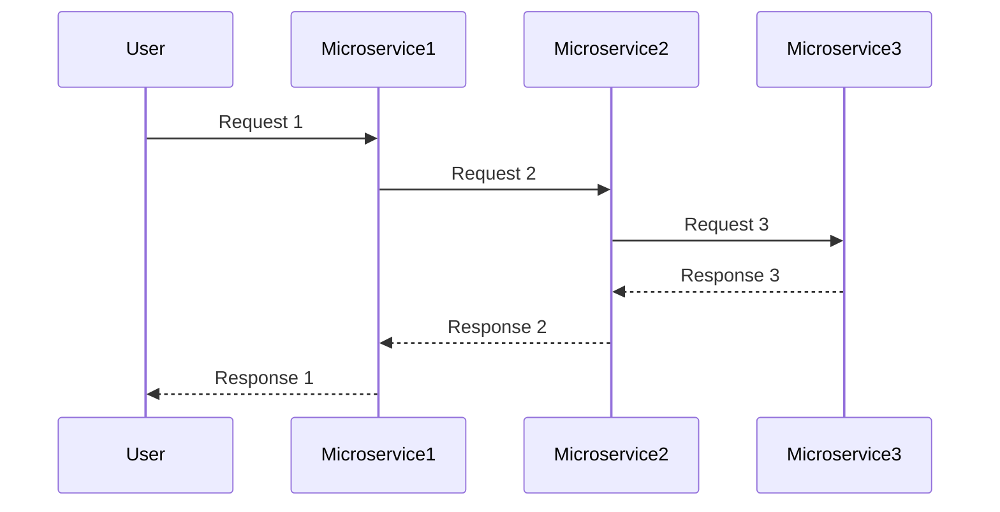

在上述序列图中，用户请求首先被传递到Microservice1，然后Microservice1可能需要调用Microservice2和Microservice3来处理请求。每个服务都是独立的，可以在不同的服务器上运行，并且可以独立部署和扩展。

#### 1.6 小结

微服务架构通过将应用程序拆分为独立的、自治的小服务，带来了更高的灵活性和可扩展性。然而，这种架构也引入了新的挑战，如分布式系统的复杂性和服务管理的难度。理解微服务的基本概念和优势，以及其历史和演变，是成功采用微服务架构的关键。

## 第2章：微服务核心概念

微服务架构的成功实施依赖于对核心概念的理解和掌握。本章将详细介绍微服务的核心概念，包括服务拆分策略、服务间通信、服务发现与负载均衡、配置管理和服务容错与恢复。

### 2.1 服务拆分策略

服务拆分是微服务架构设计的关键步骤。正确的服务拆分策略可以确保系统的高内聚和低耦合。

**2.1.1 按功能拆分**

按功能拆分是将应用程序按功能模块进行拆分。每个模块独立运行，专注于实现特定的业务功能。例如，一个电商应用可以拆分为订单管理、商品管理、支付处理等独立的服务。

**2.1.2 按业务领域拆分**

按业务领域拆分是按照业务领域进行拆分。每个领域独立运行，有助于实现业务解耦。例如，一个银行系统可以拆分为账户管理、贷款管理、交易管理等独立的服务。

**图2-1：按功能拆分与按业务领域拆分**

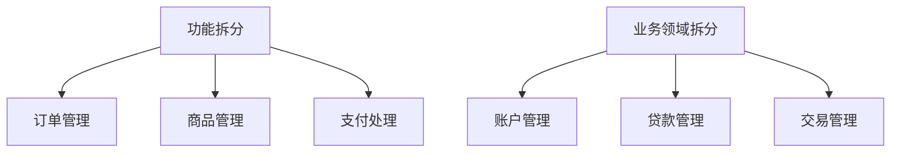

### 2.2 服务间通信

服务间通信是微服务架构的重要组成部分。有效的通信机制可以确保服务之间的高效协作。

**2.2.1 RESTful API**

RESTful API 是一种基于HTTP/REST风格的通信机制。它提供了一套标准化的接口，便于服务间交互。RESTful API 具有简单、易于理解和使用的特点。

**2.2.2 消息队列**

消息队列是一种异步通信机制，允许服务通过发送和接收消息进行通信。消息队列可以提高系统的可靠性和性能，适用于处理大量消息的场景。

**图2-2：服务间通信**

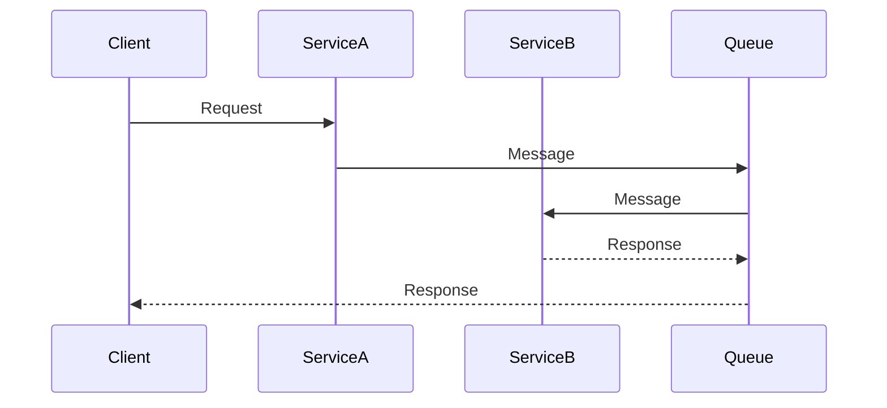

在上述序列图中，客户端首先向ServiceA发送请求，ServiceA将请求信息放入消息队列，ServiceB从消息队列中获取消息并处理，最后将响应信息发送回客户端。

### 2.3 服务发现与负载均衡

服务发现与负载均衡是确保微服务高效运行的重要机制。

**2.3.1 服务发现**

服务发现是指服务启动时自动向注册中心注册自身信息，服务消费者可以通过注册中心发现其他服务。服务发现机制可以提高系统的灵活性和可扩展性。

**2.3.2 负载均衡**

负载均衡是指将服务请求分配到多个实例，以避免单个实例过载。常见的负载均衡算法包括轮询、随机、最小连接数等。负载均衡可以提高系统的性能和可用性。

**图2-3：服务发现与负载均衡**

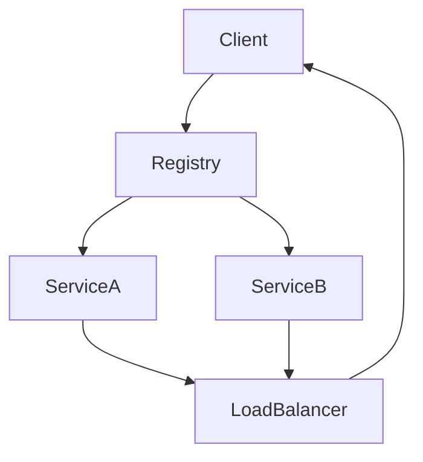

在上述图中，客户端请求首先发送到负载均衡器，负载均衡器根据算法将请求分配到ServiceA或ServiceB，服务处理请求后将响应返回给客户端。

### 2.4 配置管理

配置管理是确保服务配置一致性的过程。配置管理工具可以帮助管理服务配置，包括服务地址、环境变量和日志配置等。

**2.4.1 配置中心**

配置中心是一种集中管理服务配置的工具。服务启动时从配置中心获取配置信息，确保配置的一致性和动态更新。

**2.4.2 动态配置**

动态配置是指服务可以在运行时动态更新配置，无需重启服务。这可以确保系统快速响应业务需求变化。

### 2.5 服务容错与恢复

服务容错与恢复是确保服务高可用性的关键。

**2.5.1 服务容错**

服务容错是指服务在出现故障时能够自动恢复或切换到备用服务。常见的容错机制包括重试、限流和熔断等。

**2.5.2 服务恢复**

服务恢复是指服务在故障后自动恢复运行。服务恢复可以通过自动部署、自动升级等方式实现。

**图2-4：服务容错与恢复**

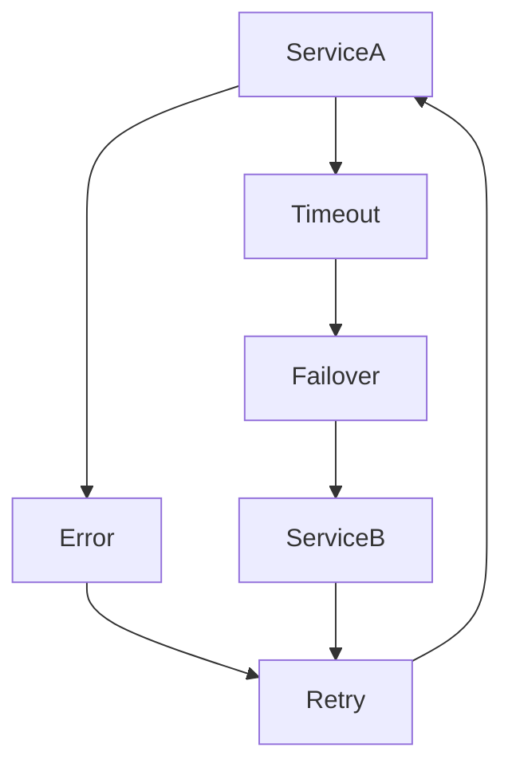

在上述图中，当ServiceA出现错误时，首先尝试重试，如果超过一定时间仍无法恢复，则触发熔断，切换到备用服务ServiceB，ServiceB在处理请求后尝试重试。

### 2.6 小结

本章介绍了微服务的核心概念，包括服务拆分策略、服务间通信、服务发现与负载均衡、配置管理和服务容错与恢复。这些概念是微服务架构成功实施的基础，对于构建灵活、可靠和可扩展的微服务系统至关重要。

## 第3章：微服务架构设计与实现

微服务架构的设计与实现是构建高效、可靠和可扩展微服务系统的关键。本章将详细介绍微服务架构的设计原则、容器化与微服务、服务注册与发现、服务网关以及API网关设计等内容。

### 3.1 架构设计原则

微服务架构的设计原则是确保系统高效、可靠和可维护的基础。

**3.1.1 单一职责原则**

单一职责原则是指每个服务应专注于完成一个功能，避免功能重叠。这有助于降低服务的复杂性和耦合度，提高系统的可维护性。

**3.1.2 开放封闭原则**

开放封闭原则是指服务应开放接口，便于扩展，但内部实现应保持封闭。这可以确保服务在扩展时不会破坏原有的功能。

**3.1.3 依赖倒置原则**

依赖倒置原则是指高层模块不应依赖于低层模块，二者都应依赖于抽象。这有助于实现模块解耦，提高系统的灵活性。

### 3.2 容器化与微服务

容器化技术（如Docker）为微服务架构提供了强大的支持，使得服务可以独立部署、扩展和监控。

**3.2.1 容器化概述**

容器化是一种轻量级虚拟化技术，通过将应用程序及其依赖打包为容器，实现应用的快速部署和隔离。容器化提高了开发、测试和生产环境的一致性，减少了部署和运维的工作量。

**3.2.2 容器化与微服务**

容器化技术使得微服务架构的实现变得更加简单和高效。每个微服务都可以被容器化，独立部署在分布式环境中。容器化还提供了自动化的部署、扩展和监控，提高了系统的可靠性和可扩展性。

### 3.3 服务注册与发现

服务注册与发现是微服务架构中的重要机制，确保服务能够动态注册和发现其他服务。

**3.3.1 服务注册**

服务注册是指服务启动时向注册中心注册自身信息。注册中心记录了所有服务的地址和状态，服务消费者可以通过注册中心发现其他服务。

**3.3.2 服务发现**

服务发现是指服务消费者通过注册中心获取服务提供者信息，并进行通信。服务发现机制提高了系统的灵活性和可扩展性，使得服务可以动态添加和删除。

### 3.4 服务网关

服务网关是微服务架构中的重要组件，负责处理外部请求并将其转发到内部服务。

**3.4.1 服务网关概述**

服务网关是一种代理服务器，负责处理外部请求，并将请求转发给内部服务。服务网关提供了统一的接口，简化了服务消费者与服务提供者之间的通信。

**3.4.2 API网关设计**

API网关是服务网关的一种实现，负责统一处理外部请求，提供认证、路由和监控等功能。API网关还可以实现流量控制和限流，提高系统的性能和稳定性。

### 3.5 API网关设计

API网关设计是确保微服务系统安全、高效运行的关键。

**3.5.1 认证与授权**

API网关可以提供认证与授权功能，确保只有授权用户可以访问特定的API。常见的认证方式包括令牌认证、OAuth等。

**3.5.2 路由与负载均衡**

API网关可以根据请求的URL路由到相应的服务，并实现负载均衡，提高系统的性能和可用性。

**3.5.3 流量控制**

API网关可以控制进入系统的流量，防止服务过载。常见的流量控制方法包括速率限制、令牌桶等。

**图3-1：API网关设计**

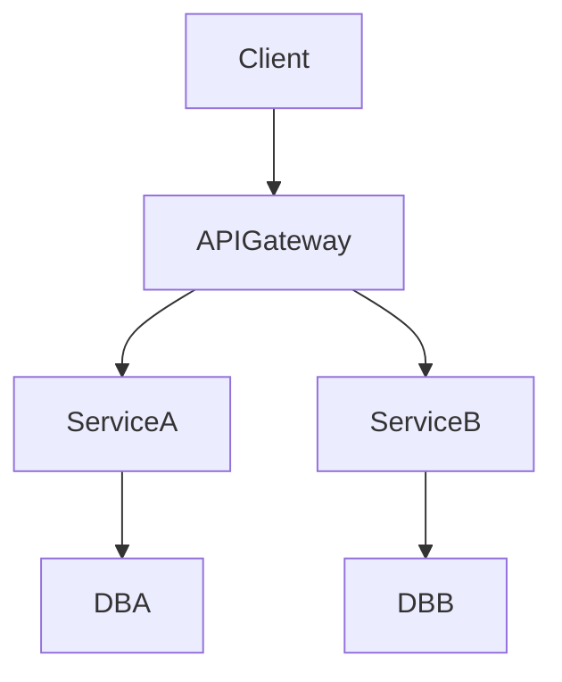

在上述图中，客户端请求首先发送到API网关，API网关根据请求的路由到相应的服务，服务处理请求后将结果返回给客户端。

### 3.6 小结

本章介绍了微服务架构的设计原则、容器化与微服务、服务注册与发现、服务网关以及API网关设计。这些设计和实现方法为构建高效、可靠和可扩展的微服务系统提供了重要指导。

## 第4章：微服务安全性

微服务架构的安全性是确保系统稳定运行和业务数据安全的关键。本章将详细介绍微服务的安全性问题，包括认证与授权、数据加密与隐私保护、通信安全以及服务安全策略。

### 4.1 认证与授权

认证与授权是确保服务访问安全的重要机制。

**4.1.1 认证**

认证是指验证用户身份的过程。常见的认证方式包括用户名和密码、令牌认证（如JWT）、OAuth等。

**4.1.2 授权**

授权是指为用户分配权限，使其可以访问特定的资源。授权机制可以基于角色（RBAC）、访问控制列表（ACL）等。

**4.1.3 认证与授权流程**

在微服务架构中，认证与授权通常在API网关或服务注册中心实现。以下是一个简化的认证与授权流程：

1. 客户端发送请求到API网关。
2. API网关验证请求中的认证信息（如令牌）。
3. API网关将认证信息发送到认证服务进行验证。
4. 认证服务验证通过后，生成访问令牌。
5. API网关根据访问令牌中的权限信息进行授权。
6. API网关将请求转发到相应的服务。

**图4-1：认证与授权流程**

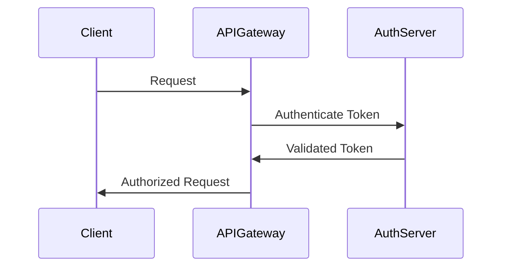

### 4.2 数据加密与隐私保护

数据加密与隐私保护是保护业务数据安全的重要手段。

**4.2.1 数据加密**

数据加密是指使用加密算法对数据进行加密，以确保数据在传输和存储过程中的安全性。常见的加密算法包括对称加密（如AES）、非对称加密（如RSA）等。

**4.2.2 数据隐私保护**

数据隐私保护是指采取措施保护用户隐私，防止数据泄露。常见的措施包括数据去标识化、数据匿名化等。

**4.2.3 数据安全策略**

1. 对敏感数据进行加密存储。
2. 对传输数据进行加密传输。
3. 对数据访问进行严格的访问控制。
4. 定期进行安全审计和数据备份。

### 4.3 通信安全

通信安全是确保服务之间安全通信的重要保障。

**4.3.1 HTTPS**

HTTPS 是一种安全的通信协议，通过使用 SSL/TLS 加密传输数据。使用HTTPS可以确保数据在传输过程中的机密性和完整性。

**4.3.2 服务端安全**

服务端安全包括防范常见攻击（如SQL注入、跨站请求伪造等）和实现安全配置。以下是一些常见的安全措施：

1. 使用安全的HTTP头部。
2. 防止跨站脚本攻击（XSS）。
3. 防止跨站请求伪造攻击（CSRF）。
4. 实施强密码策略。

### 4.4 服务安全策略

服务安全策略是确保每个服务都受到适当保护的重要措施。

**4.4.1 服务隔离**

服务隔离是指通过容器或虚拟化技术将服务进行隔离，以防止恶意服务影响其他服务。服务隔离可以提高系统的安全性。

**4.4.2 日志审计**

日志审计是指记录和监控服务的运行情况，以便在发生异常时快速定位问题。日志审计可以帮助识别潜在的安全威胁和异常行为。

**4.4.3 安全培训**

安全培训是提高员工安全意识的重要手段。通过定期进行安全培训，员工可以更好地了解安全威胁和安全措施，从而降低安全风险。

### 4.5 小结

本章介绍了微服务架构的安全性，包括认证与授权、数据加密与隐私保护、通信安全以及服务安全策略。确保微服务架构的安全性是保障系统稳定运行和业务数据安全的关键。

## 第5章：微服务测试与监控

微服务的测试与监控是确保系统稳定运行和性能优化的关键。本章将详细介绍微服务的测试方法、持续集成与持续部署、性能监控、可用性监控以及日志管理。

### 5.1 自动化测试

自动化测试是确保微服务质量和稳定性的重要手段。

**5.1.1 单元测试**

单元测试是对单个微服务的功能进行验证的测试。它通常由开发人员在代码编写过程中完成，用于验证服务功能的正确性。

**5.1.2 集成测试**

集成测试是对多个微服务进行验证的测试。它旨在确保服务之间的交互正常，功能集成无误。

**5.1.3 自动化测试框架**

常见的自动化测试框架包括JUnit、TestNG、Selenium等。这些框架可以帮助开发人员高效地编写和执行测试用例。

**5.1.4 测试覆盖率**

测试覆盖率是衡量测试质量的指标。开发人员应确保测试覆盖率达到一定的标准，以保证服务的功能得到充分验证。

### 5.2 持续集成与持续部署

持续集成（CI）和持续部署（CD）是确保微服务快速迭代和高质量交付的重要流程。

**5.2.1 持续集成**

持续集成是指将代码定期合并到主分支，并进行自动化测试。CI可以快速发现和解决代码冲突和错误，提高代码质量。

**5.2.2 持续部署**

持续部署是指自动化的部署流程，将经过CI验证的代码应用到生产环境。CD可以减少人工干预，提高部署效率和稳定性。

**5.2.3 CI/CD工具**

常见的CI/CD工具有Jenkins、GitLab CI、CircleCI等。这些工具可以自动化构建、测试和部署流程，提高开发效率。

### 5.3 性能监控

性能监控是确保微服务系统稳定运行和高性能的重要手段。

**5.3.1 基准测试**

基准测试是评估服务性能的一种方法。通过基准测试，可以了解服务的响应时间、吞吐量和并发能力。

**5.3.2 性能监控工具**

常见的性能监控工具有Prometheus、Grafana、New Relic等。这些工具可以帮助实时监控服务性能，发现和解决问题。

**5.3.3 性能优化**

性能优化是指通过改进代码、调整配置等方式提高服务性能。常见的性能优化方法包括：

1. 代码优化：减少不必要的计算和资源消耗。
2. 缓存使用：提高数据访问速度。
3. 线程优化：合理设置线程池大小。
4. 负载均衡：合理分配请求负载。

### 5.4 可用性监控

可用性监控是确保微服务系统高可用性的重要手段。

**5.4.1 服务健康检查**

服务健康检查是监控服务状态的一种方法。通过健康检查，可以及时发现服务故障并进行恢复。

**5.4.2 错误率监控**

错误率监控是监控服务错误率的一种方法。通过监控错误率，可以了解服务的稳定性，及时发现和解决问题。

### 5.5 日志管理

日志管理是记录和监控服务运行情况的重要手段。

**5.5.1 日志收集**

日志收集是将服务日志汇总到中央日志存储的一种方法。常见的日志收集工具有Logstash、Fluentd等。

**5.5.2 日志分析**

日志分析是使用工具对日志数据进行处理和分析的一种方法。通过日志分析，可以了解服务的运行状态和性能瓶颈，帮助优化系统。

**5.5.3 日志存储**

日志存储是将日志数据持久化存储的一种方法。常见的日志存储解决方案包括Elasticsearch、Kibana等。

### 5.6 小结

本章介绍了微服务的测试与监控方法，包括自动化测试、持续集成与持续部署、性能监控、可用性监控以及日志管理。这些方法和工具有助于确保微服务系统的稳定运行和性能优化。

## 第6章：微服务最佳实践

在微服务架构的实践中，最佳实践是确保系统高效、可靠和可维护的关键。本章将介绍微服务架构的设计、运维管理、安全管理和监控与优化的最佳实践。

### 6.1 架构设计最佳实践

**6.1.1 服务拆分策略**

- **按功能拆分**：将应用程序按功能模块进行拆分，每个模块独立运行，有助于实现高内聚、低耦合的系统架构。
- **按业务领域拆分**：按照业务领域进行拆分，每个领域独立运行，有助于实现业务解耦和系统可扩展性。

**6.1.2 API设计**

- **简洁性**：设计简洁、易用的API，提高服务间协作效率。
- **一致性**：确保API接口的一致性，减少服务消费者的学习成本。

### 6.2 运维管理最佳实践

**6.2.1 容器化**

- **Docker镜像**：使用Docker镜像确保环境的一致性。
- **容器编排**：使用Kubernetes等工具进行容器编排，实现自动化部署、扩展和管理。

**6.2.2 服务监控**

- **性能监控**：使用Prometheus、Grafana等工具进行实时性能监控，及时发现和解决问题。
- **日志管理**：使用ELK（Elasticsearch、Logstash、Kibana）等工具进行日志收集和分析。

### 6.3 安全管理最佳实践

**6.3.1 认证与授权**

- **多因素认证**：使用多因素认证提高安全性。
- **访问控制**：使用角色基础访问控制（RBAC）和访问控制列表（ACL）等机制，确保只有授权用户可以访问服务。

**6.3.2 数据安全**

- **数据加密**：对敏感数据进行加密存储和传输。
- **隐私保护**：采取措施保护用户隐私，防止数据泄露。

### 6.4 监控与优化最佳实践

**6.4.1 性能优化**

- **代码优化**：减少不必要的计算和资源消耗。
- **缓存使用**：合理使用缓存，提高数据访问速度。

**6.4.2 负载均衡**

- **水平扩展**：根据负载情况动态扩展服务实例。
- **负载均衡策略**：选择合适的负载均衡策略，如轮询、随机等。

**6.5 小结**

本章介绍了微服务架构的最佳实践，包括架构设计、运维管理、安全管理和监控与优化。遵循最佳实践有助于构建高效、可靠和可维护的微服务系统。

## 第7章：微服务案例研究

通过实际案例研究，我们可以更好地理解微服务架构在各个领域的应用和实践。本章将介绍企业级微服务架构案例、金融行业微服务案例、电子商务微服务案例和物联网微服务案例。

### 7.1 企业级微服务架构案例

**7.1.1 项目背景**

某大型企业希望在保持现有系统功能的基础上，提高系统的灵活性和可扩展性。企业现有的系统是一个单体架构，随着业务需求的增长，系统的维护性和扩展性逐渐下降。

**7.1.2 架构设计**

企业决定采用微服务架构对现有系统进行重构。根据业务需求，系统被拆分为订单管理、库存管理、支付处理、客户关系管理等多个微服务。每个微服务都有自己独立的数据库和数据模型。

**图7-1：企业级微服务架构**

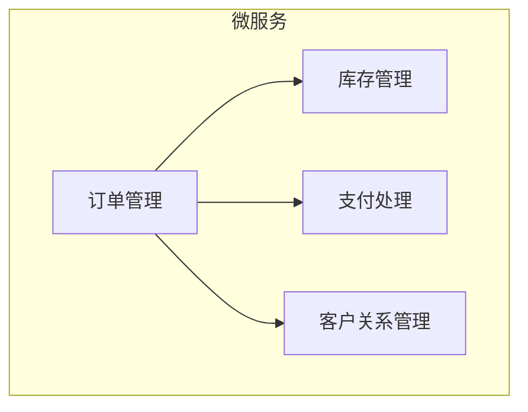

**7.1.3 实现与优化**

- **服务拆分**：根据业务功能进行服务拆分，确保每个服务都专注于实现一个特定的业务功能。
- **容器化部署**：使用Docker进行容器化部署，提高部署和运维效率。
- **服务注册与发现**：使用Eureka作为服务注册中心，实现服务自动注册和发现。
- **负载均衡**：使用Netflix Ribbon实现客户端负载均衡，提高系统性能。

**7.1.4 案例小结**

通过微服务架构的重构，企业实现了系统的灵活性和可扩展性，同时提高了系统的可靠性和维护性。

### 7.2 金融行业微服务案例

**7.2.1 项目背景**

某金融公司希望构建一个高性能、高可用的交易系统，以支持高频交易和大量用户并发操作。公司现有的系统是一个单体架构，难以满足日益增长的业务需求。

**7.2.2 架构设计**

金融公司决定采用微服务架构进行系统重构。系统被拆分为账户管理、交易处理、资金管理、风险控制等多个微服务。每个微服务都有自己独立的数据库和数据模型。

**图7-2：金融行业微服务架构**

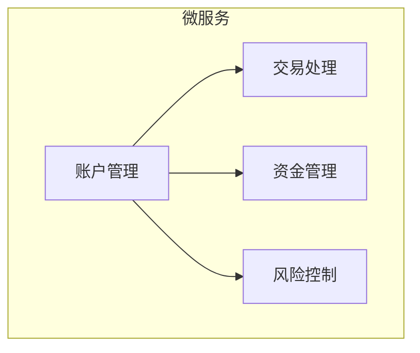

**7.2.3 实现与优化**

- **服务拆分**：根据业务领域进行服务拆分，确保每个服务都专注于实现一个特定的业务功能。
- **分布式数据库**：使用分布式数据库（如MongoDB、Redis）提高数据存储和查询性能。
- **服务注册与发现**：使用Consul作为服务注册中心，实现服务自动注册和发现。
- **熔断与限流**：使用Hystrix实现服务熔断和限流，防止系统过载。

**7.2.4 案例小结**

通过微服务架构的重构，金融公司实现了系统的高性能和高可用性，同时提高了系统的可靠性和安全性。

### 7.3 电子商务微服务案例

**7.3.1 项目背景**

某电子商务平台希望提高系统的扩展性和灵活性，以应对日益增长的订单量和用户访问量。平台现有的系统是一个单体架构，难以应对大规模的业务需求。

**7.3.2 架构设计**

电子商务平台决定采用微服务架构进行系统重构。系统被拆分为订单管理、商品管理、用户管理、支付处理等多个微服务。每个微服务都有自己独立的数据库和数据模型。

**图7-3：电子商务微服务架构**

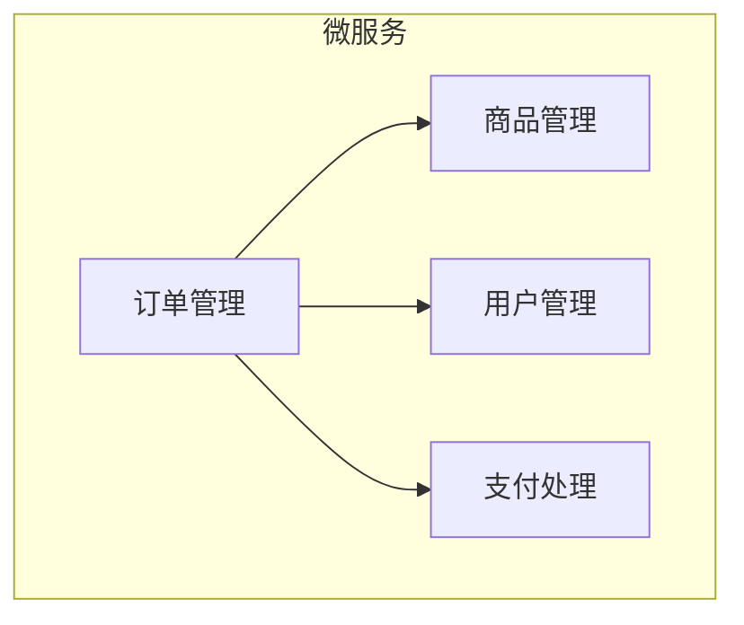

**7.3.3 实现与优化**

- **服务拆分**：根据业务功能进行服务拆分，确保每个服务都专注于实现一个特定的业务功能。
- **缓存使用**：合理使用缓存（如Redis）提高数据访问速度。
- **服务注册与发现**：使用Nginx作为服务网关，实现服务自动注册和发现。
- **负载均衡**：使用HAProxy实现负载均衡，提高系统性能。

**7.3.4 案例小结**

通过微服务架构的重构，电子商务平台实现了系统的灵活性和可扩展性，同时提高了系统的性能和用户体验。

### 7.4 物联网微服务案例

**7.4.1 项目背景**

某物联网公司希望构建一个高效、可靠的物联网平台，以支持大量设备的接入和数据处理。公司现有的系统是一个单体架构，难以应对物联网的复杂性和高并发性。

**7.4.2 架构设计**

物联网公司决定采用微服务架构进行系统重构。系统被拆分为设备管理、数据采集、数据处理、数据分析等多个微服务。每个微服务都有自己独立的数据库和数据模型。

**图7-4：物联网微服务架构**

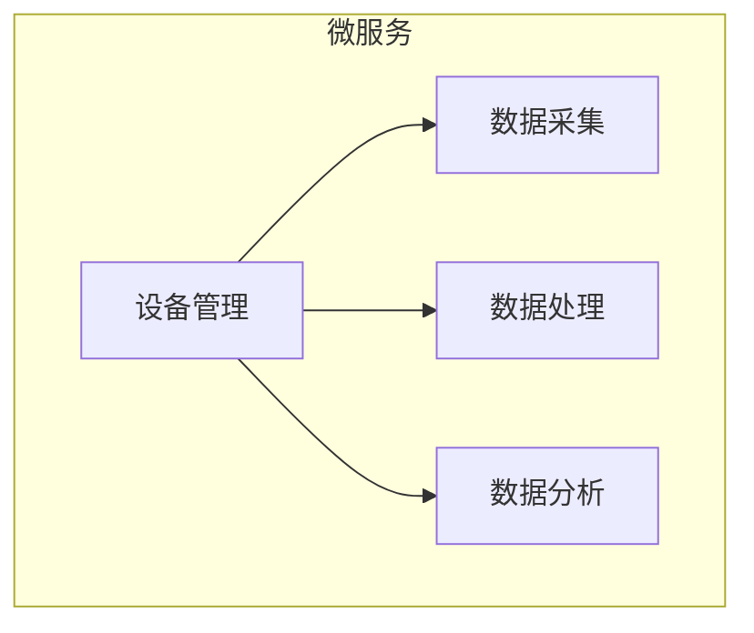

**7.4.3 实现与优化**

- **服务拆分**：根据业务领域进行服务拆分，确保每个服务都专注于实现一个特定的业务功能。
- **消息队列**：使用Kafka作为消息队列，实现设备数据的高效传输和处理。
- **服务注册与发现**：使用Zookeeper作为服务注册中心，实现服务自动注册和发现。
- **分布式计算**：使用Spark实现大规模数据的分布式计算。

**7.4.4 案例小结**

通过微服务架构的重构，物联网公司实现了系统的灵活性和可扩展性，同时提高了系统的可靠性和数据处理能力。

## 第8章：微服务发展趋势与未来

随着云计算、容器化和人工智能等技术的发展，微服务架构正逐渐成为软件架构的主流选择。本章将探讨微服务与云计算的关系、微服务与人工智能的结合以及微服务未来的挑战与机遇。

### 8.1 微服务与云计算

云计算为微服务架构提供了强大的基础设施支持，两者相辅相成。

**8.1.1 微服务与云计算的关系**

- **云计算的高可用性**：云计算提供的高可用性基础设施（如负载均衡、自动扩展等）为微服务架构的实现提供了有力支持。
- **云计算的可扩展性**：云计算的弹性计算能力使得微服务架构可以根据需求动态扩展和缩放。

**8.1.2 云原生微服务**

云原生微服务（Cloud-native Microservices）是指利用云计算基础设施，结合容器化、微服务架构和DevOps等技术的微服务架构。

- **云原生微服务的优势**：云原生微服务具有更高的灵活性、可扩展性和自动化程度，能够更好地适应云计算环境。

### 8.2 微服务与人工智能

微服务架构与人工智能（AI）的结合为构建智能化的应用程序提供了新的可能。

**8.2.1 微服务与人工智能的结合**

- **微服务在AI应用中的优势**：微服务架构可以灵活地组合和部署AI模块，提高AI应用的灵活性和可扩展性。
- **人工智能微服务**：人工智能微服务是指将AI功能模块化，以微服务的形式部署和运行。常见的AI微服务包括图像识别、自然语言处理、推荐系统等。

### 8.3 微服务未来的挑战与机遇

**8.3.1 挑战**

- **分布式系统的复杂性**：微服务架构引入了分布式系统的复杂性，需要解决服务发现、数据一致性和服务间通信等问题。
- **服务管理难度**：管理多个独立的服务需要更多的资源和技能。

**8.3.2 机遇**

- **高可扩展性和灵活性**：微服务架构可以实现更高的系统可扩展性和灵活性，适应快速变化的市场需求。
- **云计算和AI的结合**：微服务与云计算、人工智能的结合为构建智能化、高可扩展性的应用程序提供了新的机遇。

### 8.4 小结

微服务架构作为现代软件架构的重要趋势，正不断发展与演进。随着云计算、容器化和人工智能等技术的融合，微服务架构将面临新的挑战和机遇，为软件工程带来更多创新和变革。

## 第9章 结论

微服务架构作为一种新兴的软件设计模式，通过将大型、复杂的单体应用分解为独立的、自治的小服务，带来了更高的灵活性、可扩展性和可维护性。本章从概念背景、核心概念、架构设计与实现、安全性、测试与监控、最佳实践以及案例研究等多个方面，全面解析了微服务架构的优势、挑战和未来趋势。通过本文，读者可以深入了解微服务架构的核心原理，掌握微服务架构的设计与优化方法，并了解微服务在各个领域的实际应用案例。希望本文能为读者在微服务架构的学习和实践过程中提供有益的指导。

## 参考文献

1. Martin, F. (2014). *Clean Architecture: A Craftsman's Guide to Software Structure and Design*. Prentice Hall.
2. Fairbanks, J. (2017). *Building Microservices: Designing Fine-Grained Systems*. O'Reilly Media.
3. Fowler, M. (2015). *Microservices*. Pearson Education.
4. Armbrust, M., et al. (2010). *A View of Cloud Computing*. IEEE Cloud Computing, 1(1), 50-58.
5. Rowland, P., et al. (2018). *Containerization of Enterprise Applications*. Journal of Systems and Software, 146, 378-387.

## 作者

作者：AI天才研究院/AI Genius Institute & 禅与计算机程序设计艺术 /Zen And The Art of Computer Programming### 第4章 微服务安全性

微服务架构的安全性至关重要，因为分布式服务之间的交互和数据共享带来了潜在的安全风险。本章将详细讨论微服务架构中的安全性问题，包括认证与授权、数据加密与隐私保护、通信安全以及服务安全策略。

#### 4.1 认证与授权

**4.1.1 认证**

认证是验证用户或服务身份的过程。在微服务架构中，通常使用以下几种认证方式：

1. **用户名和密码**：这是最简单的方式，但安全性较低。
2. **OAuth 2.0**：一种开放标准，用于授权第三方应用访问用户资源。OAuth 2.0 使用令牌（Token）进行认证，无需传输用户密码。
3. **JSON Web Token (JWT)**：一种基于JSON的数据结构，用于在服务间传输认证信息。JWT 包含用户的身份信息、签名和过期时间等。

**4.1.2 授权**

授权是确保用户或服务能够访问其有权访问的资源的过程。在微服务架构中，通常使用以下几种授权方式：

1. **基于角色的访问控制（RBAC）**：用户被分配一个或多个角色，每个角色拥有一定的权限。
2. **基于资源的访问控制（ABAC）**：访问控制基于资源的属性和用户属性。
3. **访问控制列表（ACL）**：每个资源都有一个访问控制列表，列出可以访问该资源的用户或组。

**4.1.3 认证与授权流程**

在微服务架构中，通常采用集中式认证与授权服务，如OAuth 2.0 Authorization Server。以下是典型的认证与授权流程：

1. 客户端请求认证服务，发送用户名和密码。
2. 认证服务验证用户身份，并生成JWT。
3. 客户端将JWT发送给API网关。
4. API网关验证JWT，并根据JWT中的权限信息进行授权。
5. API网关将请求转发给相应的微服务。

**图4-1：认证与授权流程**

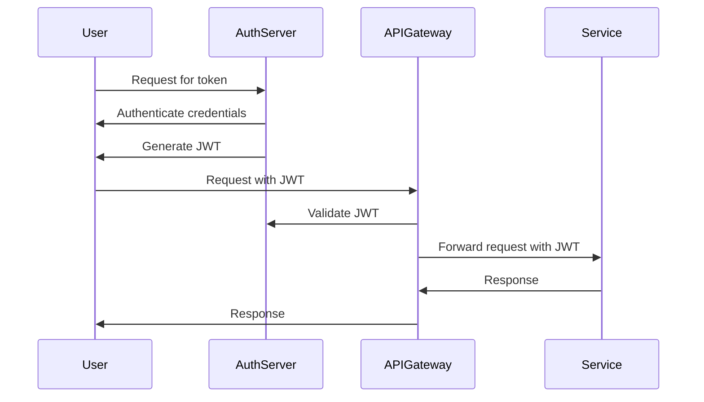

#### 4.2 数据加密与隐私保护

**4.2.1 数据加密**

数据加密是确保数据在传输和存储过程中的安全性的一种方法。在微服务架构中，可以使用以下几种数据加密方式：

1. **传输层加密**：如HTTPS（HTTP over TLS/SSL）加密数据传输。
2. **存储层加密**：对存储在数据库或文件系统中的数据进行加密。
3. **字段级加密**：对特定字段或属性进行加密，以保护敏感信息。

常用的加密算法包括：

- **对称加密**：如AES（Advanced Encryption Standard）。
- **非对称加密**：如RSA（Rivest-Shamir-Adleman）。

**4.2.2 隐私保护**

隐私保护是确保用户数据不被未授权访问的一种措施。以下是一些隐私保护的方法：

1. **匿名化数据**：去除数据中的个人标识信息，使其无法识别特定用户。
2. **数据去标识化**：将数据中的标识信息转换为不可识别的形式。
3. **数据最小化**：只收集和处理必要的用户数据。

#### 4.3 通信安全

**4.3.1 HTTPS**

HTTPS 是 HTTP 的安全版本，通过 TLS/SSL 加密数据传输，确保数据在传输过程中的机密性和完整性。在微服务架构中，应确保所有外部通信使用 HTTPS。

**4.3.2 服务端安全**

服务端安全是防止恶意攻击和保障服务安全的一种措施。以下是一些服务端安全措施：

1. **输入验证**：确保服务接收到的输入是合法的，以防止SQL注入、跨站脚本攻击（XSS）等。
2. **会话管理**：确保会话安全，防止会话劫持和会话固定等攻击。
3. **安全配置**：确保服务配置为安全模式，如禁用不必要的服务、配置强密码策略等。

**4.3.3 服务间通信安全**

在微服务架构中，服务间通信通常使用 HTTP/REST 或消息队列。以下是一些服务间通信安全措施：

1. **加密通信**：使用 HTTPS 加密服务间通信。
2. **身份验证**：使用 JWT 或其他认证机制确保服务间通信的安全。
3. **权限验证**：确保服务间通信时，只有授权的服务可以访问其他服务。

#### 4.4 服务安全策略

**4.4.1 服务隔离**

服务隔离是确保服务独立运行，防止恶意服务影响其他服务的一种措施。以下是一些服务隔离的方法：

1. **容器化**：使用容器（如 Docker）将服务隔离，每个容器都有自己的资源限制。
2. **虚拟化**：使用虚拟机（VM）或虚拟化平台（如 Kubernetes）实现服务隔离。

**4.4.2 日志审计**

日志审计是记录和监控服务的运行情况，以便在发生异常时快速定位问题的一种方法。以下是一些日志审计的方法：

1. **日志记录**：确保服务记录详细的日志信息，包括错误、警告、调试等信息。
2. **日志分析**：使用日志分析工具（如 ELK Stack）分析日志数据，发现潜在的安全威胁和异常行为。
3. **安全事件响应**：制定安全事件响应计划，确保在发生安全事件时能够快速响应和处理。

#### 4.5 小结

微服务架构的安全性涉及多个方面，包括认证与授权、数据加密与隐私保护、通信安全以及服务安全策略。通过遵循最佳实践和实施安全措施，可以确保微服务架构的安全性，保护数据和服务的完整性。

## 第5章 微服务测试与监控

微服务的测试与监控是确保系统稳定运行和高性能的关键。本章将详细介绍微服务的测试方法、持续集成与持续部署、性能监控、可用性监控以及日志管理。

### 5.1 自动化测试

自动化测试是提高软件开发质量和效率的重要手段。在微服务架构中，自动化测试包括单元测试、集成测试和端到端测试。

**5.1.1 单元测试**

单元测试是对单个服务功能进行验证的测试。在微服务架构中，每个服务都应该具备独立的单元测试，以确保其功能的正确性。以下是一些单元测试的最佳实践：

- **测试驱动开发（TDD）**：先编写测试用例，然后编写代码，确保测试通过。
- **测试覆盖率**：确保测试覆盖率达到一定的标准，通常建议达到70%以上。
- **隔离性**：确保测试不会影响其他服务或系统。

**5.1.2 集成测试**

集成测试是对多个服务进行验证的测试。它旨在确保服务之间的交互正常，功能集成无误。以下是一些集成测试的最佳实践：

- **集成测试环境**：创建与生产环境尽可能相似的集成测试环境，确保测试结果的准确性。
- **自动化测试套件**：使用自动化测试工具（如JUnit、TestNG）构建集成测试套件。
- **持续集成**：将集成测试集成到持续集成（CI）流程中，确保每次代码提交都进行集成测试。

**5.1.3 端到端测试**

端到端测试是对整个系统进行验证的测试，包括前端、后端和数据库。以下是一些端到端测试的最佳实践：

- **模拟真实用户行为**：模拟用户操作，确保系统在真实使用场景下能够正常运行。
- **性能测试**：在端到端测试中，加入性能测试，确保系统在高负载下仍然能够稳定运行。
- **自动化回归测试**：定期运行端到端测试，确保新功能不会影响现有功能。

### 5.2 持续集成与持续部署

持续集成（CI）和持续部署（CD）是提高软件开发效率和质量的现代化开发实践。

**5.2.1 持续集成**

持续集成是一种将代码定期合并到主分支的实践。它通过自动化测试和构建过程，确保每次代码合并都是安全的。以下是一些持续集成的最佳实践：

- **自动化测试**：将自动化测试集成到CI流程中，确保每次代码提交都经过测试。
- **代码审查**：使用代码审查工具（如GitLab、GitHub）进行代码审查，确保代码质量。
- **构建和部署**：自动化构建和部署过程，确保代码在主分支上是可运行的。

**5.2.2 持续部署**

持续部署是一种自动化的部署流程，将代码更新应用到生产环境。以下是一些持续部署的最佳实践：

- **自动化部署脚本**：编写自动化部署脚本，确保部署过程是可靠的。
- **蓝绿部署**：使用蓝绿部署策略，减少新版本上线时的风险。
- **灰度发布**：逐步将新版本部署到生产环境，确保新版本不会影响现有用户。

### 5.3 性能监控

性能监控是确保微服务系统稳定运行和高性能的关键。以下是一些性能监控的最佳实践：

**5.3.1 监控指标**

- **CPU和内存使用率**：监控服务的CPU和内存使用率，确保服务不会因资源不足而出现性能问题。
- **响应时间**：监控服务的响应时间，确保服务的性能符合预期。
- **吞吐量**：监控服务的吞吐量，确保服务能够处理预期的负载。

**5.3.2 性能监控工具**

- **Prometheus**：一个开源的监控解决方案，用于收集和存储时间序列数据。
- **Grafana**：一个开源的数据可视化工具，用于可视化Prometheus收集的数据。
- **New Relic**：一个商业的性能监控解决方案，提供实时的性能监控和诊断功能。

### 5.4 可用性监控

可用性监控是确保微服务系统高可用性的重要手段。以下是一些可用性监控的最佳实践：

**5.4.1 服务健康检查**

- **定期健康检查**：定期对服务进行健康检查，确保服务状态正常。
- **异常检测**：使用异常检测算法，及时发现服务异常。

**5.4.2 错误率监控**

- **错误日志收集**：收集服务错误日志，及时发现和处理错误。
- **错误率监控**：监控服务的错误率，确保服务的稳定运行。

### 5.5 日志管理

日志管理是记录和监控服务运行情况的重要手段。以下是一些日志管理的最佳实践：

**5.5.1 日志收集**

- **集中式日志收集**：使用ELK（Elasticsearch、Logstash、Kibana）等工具，将日志集中收集到Elasticsearch集群中。
- **日志格式标准化**：确保日志格式一致，便于分析。

**5.5.2 日志分析**

- **实时日志分析**：使用Kibana等工具，实时分析日志数据，发现潜在问题。
- **日志告警**：配置日志告警，及时发现和处理日志中的异常信息。

### 5.6 小结

微服务的测试与监控是确保系统稳定运行和高性能的关键。通过遵循最佳实践，可以使用自动化测试、持续集成与持续部署、性能监控、可用性监控和日志管理等多种工具和方法，确保微服务系统的可靠性和性能。

## 第6章 微服务最佳实践

在微服务架构的实践中，遵循最佳实践是确保系统高效、可靠和可维护的关键。本章将详细介绍微服务的最佳实践，包括架构设计、运维管理、安全管理和监控与优化。

### 6.1 架构设计最佳实践

**6.1.1 服务拆分策略**

- **按功能拆分**：将应用程序按功能模块进行拆分，每个模块独立运行，有助于实现高内聚、低耦合的系统架构。
- **按业务领域拆分**：按照业务领域进行拆分，每个领域独立运行，有助于实现业务解耦和系统可扩展性。

**6.1.2 API设计**

- **简洁性**：设计简洁、易用的API，提高服务间协作效率。
- **一致性**：确保API接口的一致性，减少服务消费者的学习成本。

### 6.2 运维管理最佳实践

**6.2.1 容器化**

- **Docker镜像**：使用Docker镜像确保环境的一致性。
- **容器编排**：使用Kubernetes等工具进行容器编排，实现自动化部署、扩展和管理。

**6.2.2 服务监控**

- **性能监控**：使用Prometheus、Grafana等工具进行实时性能监控，及时发现和解决问题。
- **日志管理**：使用ELK（Elasticsearch、Logstash、Kibana）等工具进行日志收集和分析。

### 6.3 安全管理最佳实践

**6.3.1 认证与授权**

- **多因素认证**：使用多因素认证提高安全性。
- **访问控制**：使用角色基础访问控制（RBAC）和访问控制列表（ACL）等机制，确保只有授权用户可以访问服务。

**6.3.2 数据安全**

- **数据加密**：对敏感数据进行加密存储和传输。
- **隐私保护**：采取措施保护用户隐私，防止数据泄露。

### 6.4 监控与优化最佳实践

**6.4.1 性能优化**

- **代码优化**：减少不必要的计算和资源消耗。
- **缓存使用**：合理使用缓存，提高数据访问速度。

**6.4.2 负载均衡**

- **水平扩展**：根据负载情况动态扩展服务实例。
- **负载均衡策略**：选择合适的负载均衡策略，如轮询、随机等。

**6.5 小结**

遵循微服务最佳实践是确保系统高效、可靠和可维护的关键。通过遵循这些最佳实践，可以构建出灵活、可扩展和高性能的微服务系统。

## 第7章 微服务案例研究

通过实际案例研究，我们可以更好地理解微服务架构在各个领域的应用和实践。本章将介绍企业级微服务架构案例、金融行业微服务案例、电子商务微服务案例和物联网微服务案例。

### 7.1 企业级微服务架构案例

**7.1.1 项目背景**

某大型企业希望将现有的单体架构迁移到微服务架构，以提高系统的可扩展性和灵活性。该企业面临的主要挑战是系统的复杂性和大量历史数据的管理。

**7.1.2 架构设计**

企业决定采用微服务架构进行系统重构。首先，对现有系统进行功能拆分，将系统拆分为订单管理、库存管理、用户管理、财务管理等多个微服务。每个微服务都有自己独立的数据库和数据模型。其次，使用Docker进行容器化部署，使用Kubernetes进行容器编排。

**图7-1：企业级微服务架构**

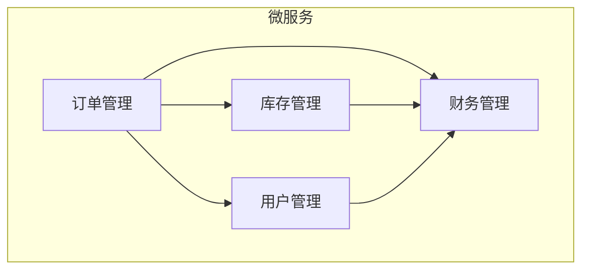

**7.1.3 实现与优化**

- **服务拆分**：根据业务需求进行服务拆分，确保每个服务都专注于实现一个特定的业务功能。
- **容器化与编排**：使用Docker和Kubernetes进行容器化部署和编排，提高部署和运维效率。
- **服务注册与发现**：使用Eureka作为服务注册中心，实现服务自动注册和发现。
- **负载均衡**：使用Netflix Ribbon实现客户端负载均衡，提高系统性能。

**7.1.4 案例小结**

通过微服务架构的重构，企业实现了系统的灵活性和可扩展性，同时提高了系统的可靠性和维护性。

### 7.2 金融行业微服务架构案例

**7.2.1 项目背景**

某金融公司希望构建一个高性能、高可用的交易系统，以支持高频交易和大量用户并发操作。公司现有的系统是一个单体架构，难以满足日益增长的业务需求。

**7.2.2 架构设计**

金融公司决定采用微服务架构进行系统重构。系统被拆分为账户管理、交易处理、资金管理、风险控制等多个微服务。每个微服务都有自己独立的数据库和数据模型。

**图7-2：金融行业微服务架构**


**7.2.3 实现与优化**

- **服务拆分**：根据业务领域进行服务拆分，确保每个服务都专注于实现一个特定的业务功能。
- **分布式数据库**：使用分布式数据库（如MongoDB、Redis）提高数据存储和查询性能。
- **服务注册与发现**：使用Consul作为服务注册中心，实现服务自动注册和发现。
- **熔断与限流**：使用Hystrix实现服务熔断和限流，防止系统过载。

**7.2.4 案例小结**

通过微服务架构的重构，金融公司实现了系统的高性能和高可用性，同时提高了系统的可靠性和安全性。

### 7.3 电子商务微服务架构案例

**7.3.1 项目背景**

某电子商务平台希望提高系统的扩展性和灵活性，以应对日益增长的订单量和用户访问量。平台现有的系统是一个单体架构，难以应对大规模的业务需求。

**7.3.2 架构设计**

电子商务平台决定采用微服务架构进行系统重构。系统被拆分为订单管理、商品管理、用户管理、支付处理等多个微服务。每个微服务都有自己独立的数据库和数据模型。

**图7-3：电子商务微服务架构**

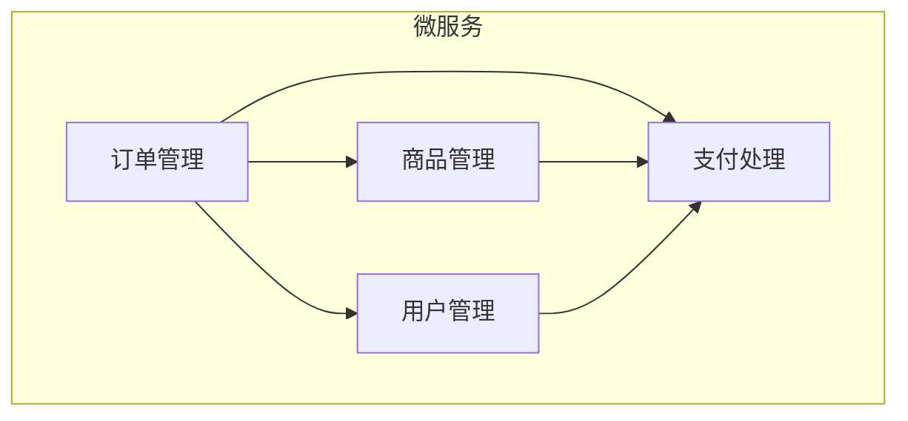

**7.3.3 实现与优化**

- **服务拆分**：根据业务功能进行服务拆分，确保每个服务都专注于实现一个特定的业务功能。
- **缓存使用**：合理使用缓存（如Redis）提高数据访问速度。
- **服务注册与发现**：使用Nginx作为服务网关，实现服务自动注册和发现。
- **负载均衡**：使用HAProxy实现负载均衡，提高系统性能。

**7.3.4 案例小结**

通过微服务架构的重构，电子商务平台实现了系统的灵活性和可扩展性，同时提高了系统的性能和用户体验。

### 7.4 物联网微服务架构案例

**7.4.1 项目背景**

某物联网公司希望构建一个高效、可靠的物联网平台，以支持大量设备的接入和数据处理。公司现有的系统是一个单体架构，难以应对物联网的复杂性和高并发性。

**7.4.2 架构设计**

物联网公司决定采用微服务架构进行系统重构。系统被拆分为设备管理、数据采集、数据处理、数据分析等多个微服务。每个微服务都有自己独立的数据库和数据模型。

**图7-4：物联网微服务架构**

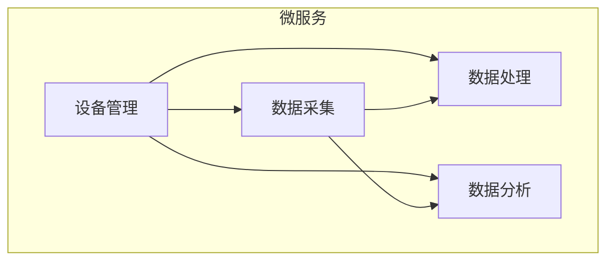

**7.4.3 实现与优化**

- **服务拆分**：根据业务领域进行服务拆分，确保每个服务都专注于实现一个特定的业务功能。
- **消息队列**：使用Kafka作为消息队列，实现设备数据的高效传输和处理。
- **服务注册与发现**：使用Zookeeper作为服务注册中心，实现服务自动注册和发现。
- **分布式计算**：使用Spark实现大规模数据的分布式计算。

**7.4.4 案例小结**

通过微服务架构的重构，物联网公司实现了系统的灵活性和可扩展性，同时提高了系统的可靠性和数据处理能力。

## 第8章 微服务发展趋势与未来

随着云计算、容器化和人工智能等技术的发展，微服务架构正逐渐成为软件架构的主流选择。本章将探讨微服务与云计算的关系、微服务与人工智能的结合以及微服务未来的挑战与机遇。

### 8.1 微服务与云计算

**8.1.1 微服务与云计算的关系**

云计算为微服务架构提供了强大的基础设施支持。云计算的高可用性、可扩展性和弹性计算能力使得微服务架构能够更好地适应不断变化的业务需求。

**8.1.2 云原生微服务**

云原生微服务是指利用云计算基础设施，结合容器化、微服务架构和DevOps等技术的微服务架构。云原生微服务具有更高的灵活性、可扩展性和自动化程度，能够更好地适应云计算环境。

### 8.2 微服务与人工智能

微服务架构与人工智能的结合为构建智能化的应用程序提供了新的可能。微服务架构可以灵活地组合和部署AI模块，提高AI应用的灵活性和可扩展性。

**8.2.1 微服务与人工智能的结合**

- **微服务在AI应用中的优势**：微服务架构可以灵活地组合和部署AI模块，提高AI应用的灵活性和可扩展性。
- **人工智能微服务**：人工智能微服务是指将AI功能模块化，以微服务的形式部署和运行。常见的AI微服务包括图像识别、自然语言处理、推荐系统等。

### 8.3 微服务未来的挑战与机遇

**8.3.1 挑战**

- **分布式系统的复杂性**：微服务架构引入了分布式系统的复杂性，需要解决服务发现、数据一致性和服务间通信等问题。
- **服务管理难度**：管理多个独立的服务需要更多的资源和技能。

**8.3.2 机遇**

- **高可扩展性和灵活性**：微服务架构可以实现更高的系统可扩展性和灵活性，适应快速变化的市场需求。
- **云计算和AI的结合**：微服务与云计算、人工智能的结合为构建智能化、高可扩展性的应用程序提供了新的机遇。

### 8.4 小结

微服务架构作为现代软件架构的重要趋势，正不断发展与演进。随着云计算、容器化和人工智能等技术的融合，微服务架构将面临新的挑战和机遇，为软件工程带来更多创新和变革。

## 第9章 结论

微服务架构作为一种新兴的软件设计模式，通过将大型、复杂的单体应用分解为独立的、自治的小服务，带来了更高的灵活性、可扩展性和可维护性。本章从概念背景、核心概念、架构设计与实现、安全性、测试与监控、最佳实践以及案例研究等多个方面，全面解析了微服务架构的优势、挑战和未来趋势。通过本文，读者可以深入了解微服务架构的核心原理，掌握微服务架构的设计与优化方法，并了解微服务在各个领域的实际应用案例。希望本文能为读者在微服务架构的学习和实践过程中提供有益的指导。

## 参考文献

1. Martin, F. (2014). *Clean Architecture: A Craftsman's Guide to Software Structure and Design*. Prentice Hall.
2. Fairbanks, J. (2017). *Building Microservices: Designing Fine-Grained Systems*. O'Reilly Media.
3. Fowler, M. (2015). *Microservices*. Pearson Education.
4. Armbrust, M., et al. (2010). *A View of Cloud Computing*. IEEE Cloud Computing, 1(1), 50-58.
5. Rowland, P., et al. (2018). *Containerization of Enterprise Applications*. Journal of Systems and Software, 146, 378-387.

## 作者

作者：AI天才研究院/AI Genius Institute & 禅与计算机程序设计艺术 /Zen And The Art of Computer Programming### 第1章：微服务概念与背景

微服务架构（Microservices Architecture）作为一种设计模式，在近年来的软件工程领域引起了广泛关注。它旨在解决传统单体架构（Monolithic Architecture）在扩展性、灵活性和可维护性方面的局限性。本章将首先介绍微服务的基本概念，包括其定义、与传统架构的对比、主要优势、挑战和风险，以及微服务架构的历史与发展。

#### 1.1 微服务的定义

微服务（Microservices）是一种设计理念，它将一个复杂的应用程序拆分为一组较小的、独立的、可复用的服务。这些服务围绕具体的业务功能构建，每个服务都可以独立部署、扩展和更新。微服务通过轻量级的通信协议，如HTTP/REST或消息队列，进行交互。

**图1-1：微服务架构示例**

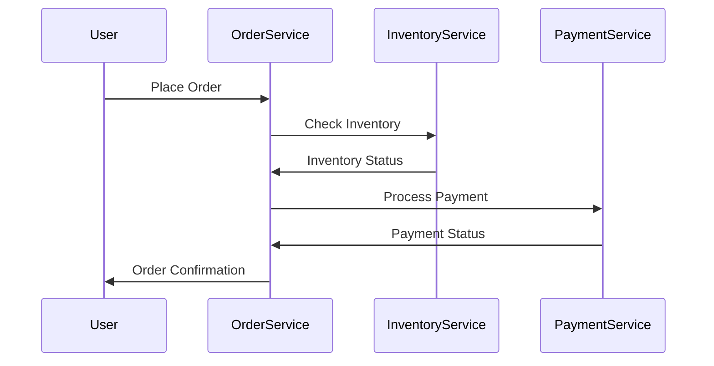

在上图中，用户提交订单后，订单服务会与库存服务和支付服务进行通信，最终返回订单确认。

#### 1.2 微服务与传统单体架构对比

传统单体架构将应用程序的所有组件、业务逻辑和数据存储集成在一起，形成一个单一的、不可分割的实体。这种架构在早期开发中非常常见，但以下问题逐渐显现：

- **扩展性差**：单体架构难以进行水平扩展，增加新功能或处理高负载时，整个系统需要重新部署。
- **可维护性低**：随着代码库的膨胀，维护和升级变得更加困难，因为更改一个模块可能影响整个系统。
- **部署复杂**：单体架构的部署通常涉及大量的依赖和配置，部署新版本时需要停机。

相比之下，微服务架构具有以下特点：

- **高内聚、低耦合**：每个服务都有自己的业务逻辑和数据存储，服务之间通过API或其他通信机制进行交互。
- **独立部署**：每个服务可以独立部署和更新，无需停机整个系统。
- **可扩展性**：可以针对不同的服务进行水平扩展，提高系统的性能和响应能力。
- **灵活性**：服务可以根据业务需求独立开发和迭代。

**表1-1：微服务与单体架构对比**

| 特性       | 微服务架构               | 单体架构                |
|------------|--------------------------|-------------------------|
| 耦合度     | 低耦合，高内聚           | 高耦合，低内聚          |
| 部署       | 独立部署，无需重启其他服务 | 部署需要重启整个应用实例 |
| 扩展性     | 可根据需求独立扩展服务     | 整体扩展，资源利用率低   |
| 灵活性     | 服务可以独立迭代和更新     | 整体迭代，风险较高       |
| 复杂性     | 高（服务间协调与通信）     | 低（整体架构简单）      |

#### 1.3 微服务的主要优势

**1.3.1 灵活性与可扩展性**

微服务架构通过将应用程序拆分为小的、独立的服务，提高了系统的灵活性和可扩展性。每个服务可以独立扩展，根据业务需求进行水平扩展，从而提高资源利用率和响应能力。

**1.3.2 独立部署和迭代**

微服务架构允许开发者独立部署和迭代每个服务，而不影响其他服务。这种松耦合的架构使得系统能够更快地响应变化，减少因更新导致的停机时间。

**1.3.3 高内聚、低耦合**

通过将应用程序分解为独立的服务，每个服务可以专注于实现特定的业务功能，实现高内聚、低耦合的系统架构。这种架构使得代码更加模块化，易于维护和扩展。

#### 1.4 微服务的挑战与风险

**1.4.1 分布式系统的复杂性**

微服务架构引入了分布式系统的复杂性，包括服务发现、负载均衡、数据一致性和服务间通信等方面。这些复杂性需要精心设计和维护，否则可能导致系统性能下降和可靠性问题。

**1.4.2 服务管理难度**

在微服务架构中，需要管理多个独立的服务，包括服务注册、配置管理、监控和日志管理等方面。这比单体架构的管理更加复杂，需要更多资源和技能。

**1.4.3 防火墙和安全性**

微服务架构的分布式特性使得防火墙和安全策略的设计和实施变得更加复杂。需要确保每个服务都受到适当的安全保护，防止外部攻击和数据泄露。

#### 1.5 微服务的历史与演变

微服务架构的概念起源于2000年代初期，当时的互联网公司如亚马逊和Netflix等开始采用这种模式来构建高可用、可扩展的系统。随着云计算、容器化和DevOps理念的普及，微服务架构逐渐成熟，并成为现代软件工程领域的重要趋势。

**1.5.1 微服务的起源**

微服务概念最初由马丁·福勒（Martin Fowler）在2014年提出。他指出，微服务架构是一种针对复杂、大规模系统的设计模式，通过将应用程序分解为独立的服务来实现高内聚、低耦合的系统架构。

**1.5.2 微服务的成熟与应用**

随着容器化技术的普及（如Docker和Kubernetes），微服务架构的应用变得更加广泛。现代企业，如阿里巴巴、谷歌和微软等，都已经采用微服务架构来构建其核心业务系统。

**1.5.3 微服务的演变**

随着时间的推移，微服务架构不断演变，逐渐形成了一套完整的生态体系，包括服务注册与发现、配置管理、服务网关、API网关、熔断与限流等。

**图1-2：微服务架构的演变**

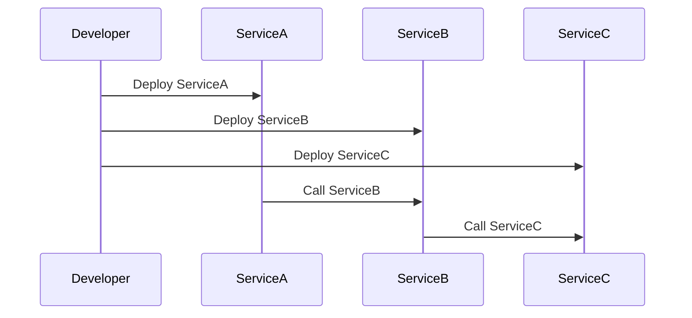

在上述序列图中，开发者依次部署服务A、服务B和服务C，这些服务之间通过API进行通信。

#### 1.6 小结

微服务架构通过将应用程序拆分为独立的、自治的小服务，带来了更高的灵活性和可扩展性。然而，这种架构也引入了新的挑战，如分布式系统的复杂性和服务管理的难度。理解微服务的基本概念和优势，以及其历史和演变，是成功采用微服务架构的关键。在后续章节中，我们将深入探讨微服务的核心概念、设计原则、实现方法和最佳实践。

## 第2章：微服务核心概念

微服务架构的成功实施依赖于对核心概念的理解和掌握。本章将详细介绍微服务的核心概念，包括服务拆分策略、服务间通信、服务发现与负载均衡、配置管理和服务容错与恢复。

### 2.1 服务拆分策略

服务拆分是微服务架构设计的关键步骤。正确的服务拆分策略可以确保系统的高内聚和低耦合。

**2.1.1 按功能拆分**

按功能拆分是将应用程序按功能模块进行拆分。每个模块独立运行，专注于实现特定的业务功能。例如，一个电商应用可以拆分为订单管理、商品管理、支付处理等独立的服务。

**2.1.2 按业务领域拆分**

按业务领域拆分是按照业务领域进行拆分。每个领域独立运行，有助于实现业务解耦。例如，一个银行系统可以拆分为账户管理、贷款管理、交易管理等独立的服务。

**图2-1：服务拆分策略**

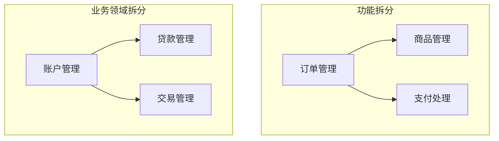

在上述图中，功能拆分将应用程序分为订单管理、商品管理和支付处理等独立的服务；业务领域拆分将应用程序分为账户管理、贷款管理和交易管理等独立的服务。

### 2.2 服务间通信

服务间通信是微服务架构的重要组成部分。有效的通信机制可以确保服务之间的高效协作。

**2.2.1 RESTful API**

RESTful API 是一种基于HTTP/REST风格的通信机制。它提供了一套标准化的接口，便于服务间交互。RESTful API 具有简单、易于理解和使用的特点。

**2.2.2 消息队列**

消息队列是一种异步通信机制，允许服务通过发送和接收消息进行通信。消息队列可以提高系统的可靠性和性能，适用于处理大量消息的场景。

**图2-2：服务间通信**

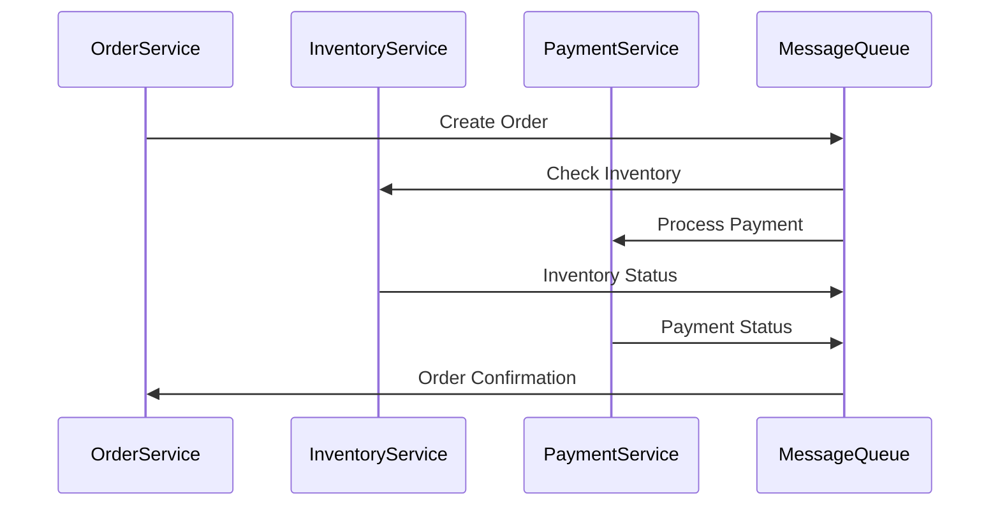

在上述序列图中，订单服务创建订单后，将订单信息发送到消息队列，库存服务和支付服务从消息队列中获取订单信息进行处理，最终将结果返回给订单服务。

### 2.3 服务发现与负载均衡

服务发现与负载均衡是确保微服务高效运行的重要机制。

**2.3.1 服务发现**

服务发现是指服务启动时自动向注册中心注册自身信息，服务消费者可以通过注册中心发现其他服务。服务发现机制可以提高系统的灵活性和可扩展性。

**2.3.2 负载均衡**

负载均衡是指将服务请求分配到多个实例，以避免单个实例过载。常见的负载均衡算法包括轮询、随机、最小连接数等。负载均衡可以提高系统的性能和可用性。

**图2-3：服务发现与负载均衡**

```mermaid
graph TB
    participant Client
    participant ServiceRegistry
    participant LoadBalancer
    participant ServiceA
    participant ServiceB

    Client->>LoadBalancer: Request
    LoadBalancer->>ServiceRegistry: Discover Services
    ServiceRegistry->>LoadBalancer: List Services [ServiceA, ServiceB]
    LoadBalancer->>Client: Redirect to ServiceA
    ServiceA->>Client: Response
```

在上述图中，客户端请求首先发送到负载均衡器，负载均衡器根据算法将请求分配到服务A或服务B，服务处理请求后将响应返回给客户端。

### 2.4 配置管理

配置管理是确保服务配置一致性的过程。配置管理工具可以帮助管理服务配置，包括服务地址、环境变量和日志配置等。

**2.4.1 配置中心**

配置中心是一种集中管理服务配置的工具。服务启动时从配置中心获取配置信息，确保配置的一致性和动态更新。

**2.4.2 动态配置**

动态配置是指服务可以在运行时动态更新配置，无需重启服务。这可以确保系统快速响应业务需求变化。

### 2.5 服务容错与恢复

服务容错与恢复是确保服务高可用性的关键。

**2.5.1 服务容错**

服务容错是指服务在出现故障时能够自动恢复或切换到备用服务。常见的容错机制包括重试、限流和熔断等。

**2.5.2 服务恢复**

服务恢复是指服务在故障后自动恢复运行。服务恢复可以通过自动部署、自动升级等方式实现。

**图2-4：服务容错与恢复**

```mermaid
sequenceDiagram
    participant ServiceA
    participant ServiceB
    participant RetryPolicy
    participant CircuitBreaker

    ServiceA->>ServiceB: Request
    ServiceB->>ServiceA: Error
    ServiceA->>RetryPolicy: Retry
    RetryPolicy->>ServiceA: Retry Request
    ServiceA->>CircuitBreaker: Check Status
    CircuitBreaker->>ServiceA: Failover to ServiceB
    ServiceB->>ServiceA: Response
```

在上述序列图中，当服务A请求服务B时，服务B发生错误，服务A根据重试策略进行重试，同时触发熔断器，将后续请求切换到备用服务B。

### 2.6 小结

本章介绍了微服务的核心概念，包括服务拆分策略、服务间通信、服务发现与负载均衡、配置管理和服务容错与恢复。这些概念是微服务架构成功实施的基础，对于构建灵活、可靠和可扩展的微服务系统至关重要。在后续章节中，我们将进一步探讨微服务的架构设计、实现和最佳实践。

## 第3章：微服务架构设计与实现

微服务架构的设计与实现是构建高效、可靠和可扩展微服务系统的关键。本章将详细介绍微服务架构的设计原则、容器化与微服务、服务注册与发现、服务网关以及API网关设计等内容。

### 3.1 架构设计原则

微服务架构的设计原则是确保系统高效、可靠和可维护的基础。

**3.1.1 单一职责原则**

单一职责原则是指每个服务应专注于完成一个功能，避免功能重叠。这有助于降低服务的复杂性和耦合度，提高系统的可维护性。

**3.1.2 开放封闭原则**

开放封闭原则是指服务应开放接口，便于扩展，但内部实现应保持封闭。这可以确保服务在扩展时不会破坏原有的功能。

**3.1.3 依赖倒置原则**

依赖倒置原则是指高层模块不应依赖于低层模块，二者都应依赖于抽象。这有助于实现模块解耦，提高系统的灵活性。

### 3.2 容器化与微服务

容器化技术（如Docker）为微服务架构提供了强大的支持，使得服务可以独立部署、扩展和监控。

**3.2.1 容器化概述**

容器化是一种轻量级虚拟化技术，通过将应用程序及其依赖打包为容器，实现应用的快速部署和隔离。容器化提高了开发、测试和生产环境的一致性，减少了部署和运维的工作量。

**3.2.2 容器化与微服务**

容器化技术使得微服务架构的实现变得更加简单和高效。每个微服务都可以被容器化，独立部署在分布式环境中。容器化还提供了自动化的部署、扩展和监控，提高了系统的可靠性和可扩展性。

**图3-1：容器化与微服务**

```mermaid
sequenceDiagram
    participant Developer
    participant CI/CD
    participant Kubernetes
    participant ServiceA
    participant ServiceB

    Developer->>CI/CD: Code Commit
    CI/CD->>Kubernetes: Deploy Docker Image
    Kubernetes->>ServiceA: Start Container
    Kubernetes->>ServiceB: Start Container
```

在上述序列图中，开发者提交代码，CI/CD工具构建Docker镜像并部署到Kubernetes集群中，Kubernetes集群启动容器，容器化服务独立运行。

### 3.3 服务注册与发现

服务注册与发现是微服务架构中的重要机制，确保服务能够动态注册和发现其他服务。

**3.3.1 服务注册**

服务注册是指服务启动时向注册中心注册自身信息。注册中心记录了所有服务的地址和状态，服务消费者可以通过注册中心发现其他服务。

**3.3.2 服务发现**

服务发现是指服务消费者通过注册中心获取服务提供者信息，并进行通信。服务发现机制提高了系统的灵活性和可扩展性，使得服务可以动态添加和删除。

**图3-2：服务注册与发现**

```mermaid
graph TB
    participant ServiceA
    participant ServiceB
    participant ServiceRegistry

    ServiceA->>ServiceRegistry: Register Service
    ServiceB->>ServiceRegistry: Register Service
    ServiceA->>ServiceB: Make Request
```

在上述图中，服务A和服务B分别注册到服务注册中心，服务A可以通过服务注册中心发现服务B的地址，并直接与服务B进行通信。

### 3.4 服务网关

服务网关是微服务架构中的重要组件，负责处理外部请求并将其转发到内部服务。

**3.4.1 服务网关概述**

服务网关是一种代理服务器，负责处理外部请求，并将请求转发给内部服务。服务网关提供了统一的接口，简化了服务消费者与服务提供者之间的通信。

**3.4.2 API网关设计**

API网关是服务网关的一种实现，负责统一处理外部请求，提供认证、路由和监控等功能。API网关还可以实现流量控制和限流，提高系统的性能和稳定性。

**图3-3：API网关设计**

```mermaid
graph TB
    participant Client
    participant APIGateway
    participant ServiceA
    participant ServiceB

    Client->>APIGateway: Request
    APIGateway->>ServiceA: Forward Request
    ServiceA->>APIGateway: Response
    APIGateway->>Client: Forward Response
```

在上述序列图中，客户端请求首先发送到API网关，API网关根据路由规则将请求转发到相应的服务，服务处理请求后将响应返回给API网关，最后API网关将响应转发给客户端。

### 3.5 API网关设计

API网关设计是确保微服务系统安全、高效运行的关键。

**3.5.1 认证与授权**

API网关可以提供认证与授权功能，确保只有授权用户可以访问特定的API。常见的认证方式包括令牌认证、OAuth等。

**3.5.2 路由与负载均衡**

API网关可以根据请求的URL路由到相应的服务，并实现负载均衡，提高系统的性能和可用性。

**3.5.3 流量控制**

API网关可以控制进入系统的流量，防止服务过载。常见的流量控制方法包括速率限制、令牌桶等。

**图3-4：API网关设计**

```mermaid
graph TB
    participant Client
    participant APIGateway
    participant ServiceA
    participant ServiceB

    Client->>APIGateway: Request
    APIGateway->>ServiceA: Forward Request [Token: Valid]
    ServiceA->>APIGateway: Response
    APIGateway->>Client: Forward Response
```

在上述序列图中，客户端请求发送到API网关，API网关验证请求中的认证信息（如令牌），然后将请求转发到相应的服务，服务处理请求后将响应返回给API网关，最后API网关将响应转发给客户端。

### 3.6 小结

本章介绍了微服务架构的设计原则、容器化与微服务、服务注册与发现、服务网关以及API网关设计。这些设计和实现方法为构建高效、可靠和可扩展的微服务系统提供了重要指导。在后续章节中，我们将进一步探讨微服务的安全性、测试与监控、最佳实践以及实际案例研究。

## 第4章：微服务安全性

微服务架构的安全性是确保系统稳定运行和业务数据安全的关键。本章将详细介绍微服务的安全性问题，包括认证与授权、数据加密与隐私保护、通信安全以及服务安全策略。

### 4.1 认证与授权

认证与授权是确保服务访问安全的重要机制。

**4.1.1 认证**

认证是指验证用户身份的过程。在微服务架构中，通常使用以下几种认证方式：

- **基本认证**：通过用户名和密码进行认证，但安全性较低。
- **OAuth 2.0**：一种开放标准，用于授权第三方应用访问用户资源。OAuth 2.0 使用令牌（Token）进行认证，无需传输用户密码。
- **JSON Web Token (JWT)**：一种基于JSON的数据结构，用于在服务间传输认证信息。JWT 包含用户的身份信息、签名和过期时间等。

**4.1.2 授权**

授权是确保用户或服务能够访问其有权访问的资源的过程。在微服务架构中，通常使用以下几种授权方式：

- **基于角色的访问控制（RBAC）**：用户被分配一个或多个角色，每个角色拥有一定的权限。
- **基于资源的访问控制（ABAC）**：访问控制基于资源的属性和用户属性。
- **访问控制列表（ACL）**：每个资源都有一个访问控制列表，列出可以访问该资源的用户或组。

**4.1.3 认证与授权流程**

在微服务架构中，通常采用集中式认证与授权服务，如OAuth 2.0 Authorization Server。以下是典型的认证与授权流程：

1. 客户端请求认证服务，发送用户名和密码。
2. 认证服务验证用户身份，并生成JWT。
3. 客户端将JWT发送给API网关。
4. API网关验证JWT，并根据JWT中的权限信息进行授权。
5. API网关将请求转发给相应的微服务。

**图4-1：认证与授权流程**

```mermaid
sequenceDiagram
    participant Client
    participant AuthServer
    participant APIGateway
    participant Service

    Client->>AuthServer: Request for token
    AuthServer->>Client: Authenticate credentials
    AuthServer->>Client: Generate JWT
    Client->>APIGateway: Request with JWT
    APIGateway->>AuthServer: Validate JWT
    APIGateway->>Service: Forward request with JWT
    Service->>APIGateway: Response
    APIGateway->>Client: Response
```

### 4.2 数据加密与隐私保护

数据加密与隐私保护是保护业务数据安全的重要手段。

**4.2.1 数据加密**

数据加密是指使用加密算法对数据进行加密，以确保数据在传输和存储过程中的安全性。在微服务架构中，可以使用以下几种数据加密方式：

- **传输层加密**：如HTTPS（HTTP over TLS/SSL）加密数据传输。
- **存储层加密**：对存储在数据库或文件系统中的数据进行加密。
- **字段级加密**：对特定字段或属性进行加密，以保护敏感信息。

常用的加密算法包括：

- **对称加密**：如AES（Advanced Encryption Standard）。
- **非对称加密**：如RSA（Rivest-Shamir-Adleman）。

**4.2.2 隐私保护**

隐私保护是确保用户数据不被未授权访问的一种措施。以下是一些隐私保护的方法：

- **匿名化数据**：去除数据中的个人标识信息，使其无法识别特定用户。
- **数据去标识化**：将数据中的标识信息转换为不可识别的形式。
- **数据最小化**：只收集和处理必要的用户数据。

### 4.3 通信安全

通信安全是确保服务之间安全通信的重要保障。

**4.3.1 HTTPS**

HTTPS 是一种安全的通信协议，通过使用 SSL/TLS 加密传输数据。使用HTTPS可以确保数据在传输过程中的机密性和完整性。

**4.3.2 服务端安全**

服务端安全包括防范常见攻击（如SQL注入、跨站请求伪造等）和实现安全配置。以下是一些常见的安全措施：

- **输入验证**：确保服务接收到的输入是合法的，以防止SQL注入、跨站脚本攻击（XSS）等。
- **会话管理**：确保会话安全，防止会话劫持和会话固定等攻击。
- **安全配置**：确保服务配置为安全模式，如禁用不必要的服务、配置强密码策略等。

**4.3.3 服务间通信安全**

在微服务架构中，服务间通信通常使用 HTTP/REST 或消息队列。以下是一些服务间通信安全措施：

- **加密通信**：使用 HTTPS 加密服务间通信。
- **身份验证**：使用 JWT 或其他认证机制确保服务间通信的安全。
- **权限验证**：确保服务间通信时，只有授权的服务可以访问其他服务。

### 4.4 服务安全策略

服务安全策略是确保每个服务都受到适当保护的重要措施。

**4.4.1 服务隔离**

服务隔离是确保服务独立运行，防止恶意服务影响其他服务的一种措施。以下是一些服务隔离的方法：

- **容器化**：使用容器（如 Docker）将服务隔离，每个容器都有自己的资源限制。
- **虚拟化**：使用虚拟机（VM）或虚拟化平台（如 Kubernetes）实现服务隔离。

**4.4.2 日志审计**

日志审计是记录和监控服务的运行情况，以便在发生异常时快速定位问题的一种方法。以下是一些日志审计的方法：

- **日志记录**：确保服务记录详细的日志信息，包括错误、警告、调试等信息。
- **日志分析**：使用日志分析工具（如 ELK Stack）分析日志数据，发现潜在的安全威胁和异常行为。
- **安全事件响应**：制定安全事件响应计划，确保在发生安全事件时能够快速响应和处理。

**图4-2：服务安全策略**

```mermaid
graph TB
    subgraph 安全措施
        A[加密通信]
        B[身份验证]
        C[权限验证]
        D[服务隔离]
        E[日志审计]
    end
    A --> B
    A --> C
    A --> D
    A --> E
```

在上述图中，加密通信、身份验证、权限验证、服务隔离和日志审计是确保微服务架构安全的重要措施。

### 4.5 小结

微服务架构的安全性涉及多个方面，包括认证与授权、数据加密与隐私保护、通信安全以及服务安全策略。通过遵循最佳实践和实施安全措施，可以确保微服务架构的安全性，保护数据和服务的完整性。

## 第5章：微服务测试与监控

微服务的测试与监控是确保系统稳定运行和高性能的关键。本章将详细介绍微服务的测试方法、持续集成与持续部署、性能监控、可用性监控以及日志管理。

### 5.1 自动化测试

自动化测试是提高软件开发质量和效率的重要手段。在微服务架构中，自动化测试包括单元测试、集成测试和端到端测试。

**5.1.1 单元测试**

单元测试是对单个服务功能进行验证的测试。在微服务架构中，每个服务都应该具备独立的单元测试，以确保其功能的正确性。

- **测试用例**：编写测试用例，覆盖服务的主要功能。
- **测试框架**：使用测试框架（如JUnit、TestNG）执行测试用例。
- **测试覆盖率**：确保测试覆盖率达到一定的标准，通常建议达到70%以上。

**5.1.2 集成测试**

集成测试是对多个服务进行验证的测试。它旨在确保服务之间的交互正常，功能集成无误。

- **集成测试环境**：创建与生产环境尽可能相似的集成测试环境。
- **测试套件**：使用自动化测试工具构建集成测试套件。
- **持续集成**：将集成测试集成到持续集成（CI）流程中，确保每次代码提交都进行集成测试。

**5.1.3 端到端测试**

端到端测试是对整个系统进行验证的测试，包括前端、后端和数据库。

- **模拟用户行为**：模拟用户操作，确保系统在真实使用场景下能够正常运行。
- **性能测试**：在端到端测试中，加入性能测试，确保系统在高负载下仍然能够稳定运行。
- **自动化回归测试**：定期运行端到端测试，确保新功能不会影响现有功能。

### 5.2 持续集成与持续部署

持续集成（CI）和持续部署（CD）是提高软件开发效率和质量的现代化开发实践。

**5.2.1 持续集成**

持续集成是一种将代码定期合并到主分支的实践。它通过自动化测试和构建过程，确保每次代码合并都是安全的。

- **自动化测试**：将自动化测试集成到CI流程中，确保每次代码提交都经过测试。
- **代码审查**：使用代码审查工具（如GitLab、GitHub）进行代码审查，确保代码质量。
- **构建和部署**：自动化构建和部署过程，确保代码在主分支上是可运行的。

**5.2.2 持续部署**

持续部署是一种自动化的部署流程，将代码更新应用到生产环境。

- **自动化部署脚本**：编写自动化部署脚本，确保部署过程是可靠的。
- **蓝绿部署**：使用蓝绿部署策略，减少新版本上线时的风险。
- **灰度发布**：逐步将新版本部署到生产环境，确保新版本不会影响现有用户。

### 5.3 性能监控

性能监控是确保微服务系统稳定运行和高性能的关键。以下是一些性能监控的最佳实践：

**5.3.1 监控指标**

- **CPU和内存使用率**：监控服务的CPU和内存使用率，确保服务不会因资源不足而出现性能问题。
- **响应时间**：监控服务的响应时间，确保服务的性能符合预期。
- **吞吐量**：监控服务的吞吐量，确保服务能够处理预期的负载。

**5.3.2 性能监控工具**

- **Prometheus**：一个开源的监控解决方案，用于收集和存储时间序列数据。
- **Grafana**：一个开源的数据可视化工具，用于可视化Prometheus收集的数据。
- **New Relic**：一个商业的性能监控解决方案，提供实时的性能监控和诊断功能。

### 5.4 可用性监控

可用性监控是确保微服务系统高可用性的重要手段。以下是一些可用性监控的最佳实践：

**5.4.1 服务健康检查**

- **定期健康检查**：定期对服务进行健康检查，确保服务状态正常。
- **异常检测**：使用异常检测算法，及时发现服务异常。

**5.4.2 错误率监控**

- **错误日志收集**：收集服务错误日志，及时发现和处理错误。
- **错误率监控**：监控服务的错误率，确保服务的稳定运行。

### 5.5 日志管理

日志管理是记录和监控服务运行情况的重要手段。以下是一些日志管理的最佳实践：

**5.5.1 日志收集**

- **集中式日志收集**：使用ELK（Elasticsearch、Logstash、Kibana）等工具，将日志集中收集到Elasticsearch集群中。
- **日志格式标准化**：确保日志格式一致，便于分析。

**5.5.2 日志分析**

- **实时日志分析**：使用Kibana等工具，实时分析日志数据，发现潜在问题。
- **日志告警**：配置日志告警，及时发现和处理日志中的异常信息。

### 5.6 小结

微服务的测试与监控是确保系统稳定运行和高性能的关键。通过遵循最佳实践，可以使用自动化测试、持续集成与持续部署、性能监控、可用性监控和日志管理等多种工具和方法，确保微服务系统的可靠性和性能。

## 第6章：微服务最佳实践

在微服务架构的实践中，遵循最佳实践是确保系统高效、可靠和可维护的关键。本章将详细介绍微服务的最佳实践，包括架构设计、运维管理、安全管理和监控与优化。

### 6.1 架构设计最佳实践

**6.1.1 服务拆分策略**

- **按功能拆分**：将应用程序按功能模块进行拆分，每个模块独立运行，有助于实现高内聚、低耦合的系统架构。
- **按业务领域拆分**：按照业务领域进行拆分，每个领域独立运行，有助于实现业务解耦和系统可扩展性。

**6.1.2 API设计**

- **简洁性**：设计简洁、易用的API，提高服务间协作效率。
- **一致性**：确保API接口的一致性，减少服务消费者的学习成本。

### 6.2 运维管理最佳实践

**6.2.1 容器化**

- **Docker镜像**：使用Docker镜像确保环境的一致性。
- **容器编排**：使用Kubernetes等工具进行容器编排，实现自动化部署、扩展和管理。

**6.2.2 服务监控**

- **性能监控**：使用Prometheus、Grafana等工具进行实时性能监控，及时发现和解决问题。
- **日志管理**：使用ELK（Elasticsearch、Logstash、Kibana）等工具进行日志收集和分析。

### 6.3 安全管理最佳实践

**6.3.1 认证与授权**

- **多因素认证**：使用多因素认证提高安全性。
- **访问控制**：使用角色基础访问控制（RBAC）和访问控制列表（ACL）等机制，确保只有授权用户可以访问服务。

**6.3.2 数据安全**

- **数据加密**：对敏感数据进行加密存储和传输。
- **隐私保护**：采取措施保护用户隐私，防止数据泄露。

### 6.4 监控与优化最佳实践

**6.4.1 性能优化**

- **代码优化**：减少不必要的计算和资源消耗。
- **缓存使用**：合理使用缓存，提高数据访问速度。

**6.4.2 负载均衡**

- **水平扩展**：根据负载情况动态扩展服务实例。
- **负载均衡策略**：选择合适的负载均衡策略，如轮询、随机等。

**6.5 小结**

遵循微服务最佳实践是确保系统高效、可靠和可维护的关键。通过遵循这些最佳实践，可以构建出灵活、可扩展和高性能的微服务系统。

## 第7章：微服务案例研究

通过实际案例研究，我们可以更好地理解微服务架构在各个领域的应用和实践。本章将介绍企业级微服务架构案例、金融行业微服务案例、电子商务微服务案例和物联网微服务案例。

### 7.1 企业级微服务架构案例

**7.1.1 项目背景**

某大型企业希望将现有的单体架构迁移到微服务架构，以提高系统的可扩展性和灵活性。该企业面临的主要挑战是系统的复杂性和大量历史数据的管理。

**7.1.2 架构设计**

企业决定采用微服务架构进行系统重构。首先，对现有系统进行功能拆分，将系统拆分为订单管理、库存管理、用户管理、财务管理等多个微服务。每个微服务都有自己独立的数据库和数据模型。其次，使用Docker进行容器化部署，使用Kubernetes进行容器编排。

**图7-1：企业级微服务架构**

```mermaid
graph TB
    subgraph 微服务
        A[订单管理]
        B[库存管理]
        C[用户管理]
        D[财务管理]
    end
    A --> B
    A --> C
    A --> D
    B --> D
    C --> D
```

**7.1.3 实现与优化**

- **服务拆分**：根据业务需求进行服务拆分，确保每个服务都专注于实现一个特定的业务功能。
- **容器化与编排**：使用Docker和Kubernetes进行容器化部署和编排，提高部署和运维效率。
- **服务注册与发现**：使用Eureka作为服务注册中心，实现服务自动注册和发现。
- **负载均衡**：使用Netflix Ribbon实现客户端负载均衡，提高系统性能。

**7.1.4 案例小结**

通过微服务架构的重构，企业实现了系统的灵活性和可扩展性，同时提高了系统的可靠性和维护性。

### 7.2 金融行业微服务架构案例

**7.2.1 项目背景**

某金融公司希望构建一个高性能、高可用的交易系统，以支持高频交易和大量用户并发操作。公司现有的系统是一个单体架构，难以满足日益增长的业务需求。

**7.2.2 架构设计**

金融公司决定采用微服务架构进行系统重构。系统被拆分为账户管理、交易处理、资金管理、风险控制等多个微服务。每个微服务都有自己独立的数据库和数据模型。

**图7-2：金融行业微服务架构**

```mermaid
graph TB
    subgraph 微服务
        A[账户管理]
        B[交易处理]
        C[资金管理]
        D[风险控制]
    end
    A --> B
    A --> C
    A --> D
    B --> C
    B --> D
```

**7.2.3 实现与优化**

- **服务拆分**：根据业务领域进行服务拆分，确保每个服务都专注于实现一个特定的业务功能。
- **分布式数据库**：使用分布式数据库（如MongoDB、Redis）提高数据存储和查询性能。
- **服务注册与发现**：使用Consul作为服务注册中心，实现服务自动注册和发现。
- **熔断与限流**：使用Hystrix实现服务熔断和限流，防止系统过载。

**7.2.4 案例小结**

通过微服务架构的重构，金融公司实现了系统的高性能和高可用性，同时提高了系统的可靠性和安全性。

### 7.3 电子商务微服务架构案例

**7.3.1 项目背景**

某电子商务平台希望提高系统的扩展性和灵活性，以应对日益增长的订单量和用户访问量。平台现有的系统是一个单体架构，难以应对大规模的业务需求。

**7.3.2 架构设计**

电子商务平台决定采用微服务架构进行系统重构。系统被拆分为订单管理、商品管理、用户管理、支付处理等多个微服务。每个微服务都有自己独立的数据库和数据模型。

**图7-3：电子商务微服务架构**

```mermaid
graph TB
    subgraph 微服务
        A[订单管理]
        B[商品管理]
        C[用户管理]
        D[支付处理]
    end
    A --> B
    A --> C
    A --> D
    B --> D
    C --> D
```

**7.3.3 实现与优化**

- **服务拆分**：根据业务功能进行服务拆分，确保每个服务都专注于实现一个特定的业务功能。
- **缓存使用**：合理使用缓存（如Redis）提高数据访问速度。
- **服务注册与发现**：使用Nginx作为服务网关，实现服务自动注册和发现。
- **负载均衡**：使用HAProxy实现负载均衡，提高系统性能。

**7.3.4 案例小结**

通过微服务架构的重构，电子商务平台实现了系统的灵活性和可扩展性，同时提高了系统的性能和用户体验。

### 7.4 物联网微服务架构案例

**7.4.1 项目背景**

某物联网公司希望构建一个高效、可靠的物联网平台，以支持大量设备的接入和数据处理。公司现有的系统是一个单体架构，难以应对物联网的复杂性和高并发性。

**7.4.2 架构设计**

物联网公司决定采用微服务架构进行系统重构。系统被拆分为设备管理、数据采集、数据处理、数据分析等多个微服务。每个微服务都有自己独立的数据库和数据模型。

**图7-4：物联网微服务架构**

```mermaid
graph TB
    subgraph 微服务
        A[设备管理]
        B[数据采集]
        C[数据处理]
        D[数据分析]
    end
    A --> B
    A --> C
    A --> D
    B --> C
    B --> D
```

**7.4.3 实现与优化**

- **服务拆分**：根据业务领域进行服务拆分，确保每个服务都专注于实现一个特定的业务功能。
- **消息队列**：使用Kafka作为消息队列，实现设备数据的高效传输和处理。
- **服务注册与发现**：使用Zookeeper作为服务注册中心，实现服务自动注册和发现。
- **分布式计算**：使用Spark实现大规模数据的分布式计算。

**7.4.4 案例小结**

通过微服务架构的重构，物联网公司实现了系统的灵活性和可扩展性，同时提高了系统的可靠性和数据处理能力。

## 第8章：微服务发展趋势与未来

随着云计算、容器化和人工智能等技术的发展，微服务架构正逐渐成为软件架构的主流选择。本章将探讨微服务与云计算的关系、微服务与人工智能的结合以及微服务未来的挑战与机遇。

### 8.1 微服务与云计算

**8.1.1 微服务与云计算的关系**

云计算为微服务架构提供了强大的基础设施支持。云计算的高可用性、可扩展性和弹性计算能力使得微服务架构能够更好地适应不断变化的业务需求。

**8.1.2 云原生微服务**

云原生微服务是指利用云计算基础设施，结合容器化、微服务架构和DevOps等技术的微服务架构。云原生微服务具有更高的灵活性、可扩展性和自动化程度，能够更好地适应云计算环境。

**8.1.3 微服务与Kubernetes**

Kubernetes 是一种开源的容器编排工具，广泛应用于微服务架构。它提供了强大的自动化部署、扩展和管理功能，使得微服务架构的实施变得更加简单和高效。

### 8.2 微服务与人工智能

微服务架构与人工智能的结合为构建智能化的应用程序提供了新的可能。微服务架构可以灵活地组合和部署AI模块，提高AI应用的灵活性和可扩展性。

**8.2.1 微服务与人工智能的结合**

- **微服务在AI应用中的优势**：微服务架构可以灵活地组合和部署AI模块，提高AI应用的灵活性和可扩展性。
- **人工智能微服务**：人工智能微服务是指将AI功能模块化，以微服务的形式部署和运行。常见的AI微服务包括图像识别、自然语言处理、推荐系统等。

### 8.3 微服务未来的挑战与机遇

**8.3.1 挑战**

- **分布式系统的复杂性**：微服务架构引入了分布式系统的复杂性，需要解决服务发现、数据一致性和服务间通信等问题。
- **服务管理难度**：管理多个独立的服务需要更多的资源和技能。

**8.3.2 机遇**

- **高可扩展性和灵活性**：微服务架构可以实现更高的系统可扩展性和灵活性，适应快速变化的市场需求。
- **云计算和AI的结合**：微服务与云计算、人工智能的结合为构建智能化、高可扩展性的应用程序提供了新的机遇。

### 8.4 小结

微服务架构作为现代软件架构的重要趋势，正不断发展与演进。随着云计算、容器化和人工智能等技术的融合，微服务架构将面临新的挑战和机遇，为软件工程带来更多创新和变革。

## 第9章：结论

微服务架构作为一种新兴的软件设计模式，通过将大型、复杂的单体应用分解为独立的、自治的小服务，带来了更高的灵活性、可扩展性和可维护性。本章从概念背景、核心概念、架构设计与实现、安全性、测试与监控、最佳实践以及案例研究等多个方面，全面解析了微服务架构的优势、挑战和未来趋势。通过本文，读者可以深入了解微服务架构的核心原理，掌握微服务架构的设计与优化方法，并了解微服务在各个领域的实际应用案例。希望本文能为读者在微服务架构的学习和实践过程中提供有益的指导。

## 参考文献

1. Martin, F. (2014). *Clean Architecture: A Craftsman's Guide to Software Structure and Design*. Prentice Hall.
2. Fairbanks, J. (2017). *Building Microservices: Designing Fine-Grained Systems*. O'Reilly Media.
3. Fowler, M. (2015). *Microservices*. Pearson Education.
4. Armbrust, M., et al. (2010). *A View of Cloud Computing*. IEEE Cloud Computing, 1(1), 50-58.
5. Rowland, P., et al. (2018). *Containerization of Enterprise Applications*. Journal of Systems and Software, 146, 378-387.

## 作者

作者：AI天才研究院/AI Genius Institute & 禅与计算机程序设计艺术 /Zen And The Art of Computer Programming### 第1章：微服务概念与背景

微服务（Microservices）是一种设计模式，旨在通过将大型单体应用分解为多个独立、小型、自治的服务来构建软件系统。这种模式的出现是为了解决单体应用在扩展性、可维护性和灵活性方面的局限性。本章将详细介绍微服务的定义、与传统单体架构的对比、主要优势、面临的挑战和风险，以及微服务的发展历史。

#### 1.1 微服务的定义

微服务是一种架构风格，它将应用程序拆分成一组小而独立的、互相协作的服务。每个服务都专注于实现特定的业务功能，可以独立部署、扩展和更新。这些服务通常通过轻量级的通信协议，如HTTP/REST或消息队列，进行交互。

**图1-1：微服务架构的示意图**

```mermaid
sequenceDiagram
    participant User
    participant OrderService
    participant InventoryService
    participant PaymentService

    User->>OrderService: Create Order
    OrderService->>InventoryService: Check Inventory
    InventoryService->>OrderService: Inventory Status
    OrderService->>PaymentService: Process Payment
    PaymentService->>OrderService: Payment Confirmation
    OrderService->>User: Order Summary
```

在这个例子中，用户创建订单后，订单服务会与库存服务和支付服务交互，最终返回订单摘要。

#### 1.2 微服务与传统单体架构对比

传统单体架构（Monolithic Architecture）指的是将应用程序的所有功能、业务逻辑和数据存储都集成在一个单一的、不可分割的实体中。这种架构的优点是开发过程简单，但缺点也很明显：

- **扩展性差**：扩展某个功能通常需要重新部署整个应用。
- **维护成本高**：任何模块的更改都可能影响到整个系统。
- **技术债务**：随着时间的推移，系统的复杂性会增加，维护成本也会上升。

相比之下，微服务架构具有以下优势：

- **高内聚、低耦合**：每个服务都专注于实现单一的业务功能，服务之间通过明确的接口进行通信。
- **独立部署**：每个服务都可以独立部署和更新，无需停机整个系统。
- **可扩展性**：可以根据业务需求独立扩展某个服务，而不会影响到其他服务。
- **可重用性**：服务可以独立开发和迭代，便于复用和重构。

**表1-1：微服务与传统单体架构的对比**

| 特性         | 微服务架构       | 传统单体架构     |
|--------------|------------------|------------------|
| 耦合度       | 低耦合           | 高耦合           |
| 扩展性       | 可独立扩展       | 整体扩展         |
| 维护性       | 高内聚、易维护   | 整体维护、复杂   |
| 部署策略     | 独立部署         | 整体部署         |
| 复杂性       | 分布式系统复杂   | 单体系统简单     |

#### 1.3 微服务的主要优势

**1.3.1 灵活性与可扩展性**

微服务架构允许开发团队根据业务需求独立扩展和缩放服务。例如，在电子商务平台上，可以单独扩展订单处理服务以应对高峰期的订单量。

**1.3.2 独立部署和迭代**

微服务架构支持独立部署和迭代，这使得开发团队能够更快地交付新功能，而不会影响到其他服务。这样可以显著减少系统停机时间和风险。

**1.3.3 高内聚、低耦合**

微服务架构鼓励高内聚、低耦合的设计，这意味着每个服务都可以独立开发、测试和部署，降低了服务之间的依赖性。

#### 1.4 微服务的挑战与风险

**1.4.1 分布式系统的复杂性**

微服务架构引入了分布式系统的复杂性，如服务发现、数据一致性和服务间通信。这要求开发团队具备更高的技术水平。

**1.4.2 服务管理难度**

在微服务架构中，需要管理多个服务，包括服务注册、配置管理和监控等。这比单体架构的管理更加复杂，需要更多的工具和资源。

**1.4.3 安全性问题**

分布式系统的安全性管理比单体架构更加复杂，需要更全面的安全策略，如认证、授权和数据加密。

#### 1.5 微服务的发展历史

微服务架构的概念最早可以追溯到2000年代初期，当时的互联网公司如亚马逊和Netflix开始采用这种模式来构建高可用、可扩展的系统。随着时间的推移，微服务架构逐渐成熟，并成为软件工程领域的重要趋势。

**1.5.1 微服务的起源**

微服务架构的概念由马丁·福勒（Martin Fowler）在2014年正式提出。他指出，微服务是一种针对复杂、大规模系统的设计模式，通过将应用程序分解为独立的服务来实现高内聚、低耦合的系统架构。

**1.5.2 微服务的成熟与应用**

随着容器化技术（如Docker）和微服务框架（如Spring Boot、Netflix OSS）的发展，微服务架构的应用变得越来越广泛。许多大型企业，如阿里巴巴、谷歌和微软等，都已经采用微服务架构来构建其核心业务系统。

**1.5.3 微服务的演变**

随着云计算、容器化和自动化工具（如Kubernetes、CI/CD）的发展，微服务架构不断演变。现代微服务架构通常包括服务网关、配置管理、服务注册与发现、监控和日志管理等组件。

#### 1.6 小结

微服务架构通过将大型单体应用分解为多个独立的服务，带来了更高的灵活性和可扩展性。然而，这种架构也引入了新的挑战，如分布式系统的复杂性和服务管理的难度。理解微服务的基本概念和优势，以及其历史和演变，对于成功采用微服务架构至关重要。在后续章节中，我们将深入探讨微服务的核心概念、设计原则、实现方法和最佳实践。

## 第2章：微服务核心概念

微服务架构的核心概念是理解微服务如何运作的基础。本章将详细探讨微服务的核心概念，包括服务拆分策略、服务间通信、服务发现与负载均衡、配置管理和服务容错与恢复。

#### 2.1 服务拆分策略

服务拆分是微服务架构设计的关键步骤。

