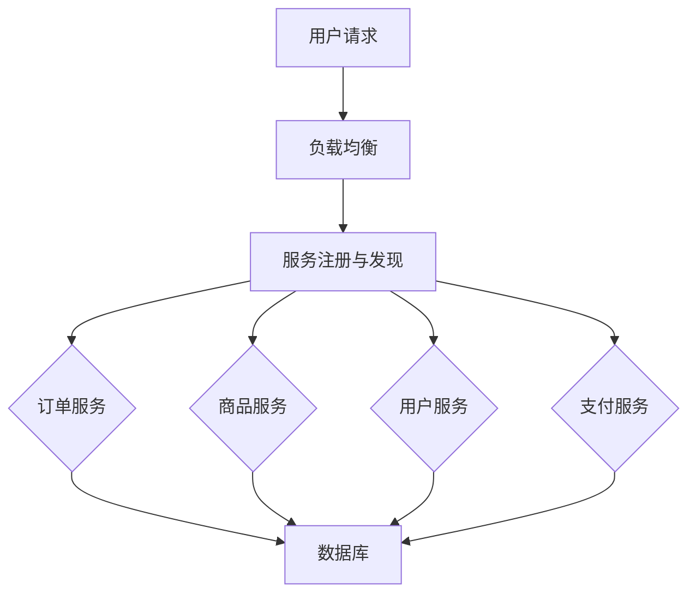
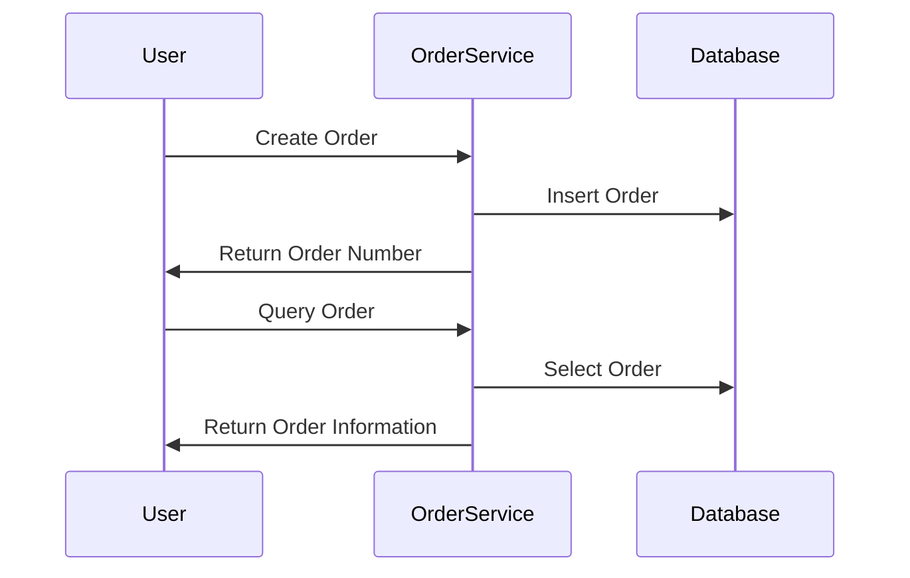

                 

# 微服务治理：服务发现、负载均衡与熔断

关键词：微服务、服务发现、负载均衡、熔断、分布式系统

摘要：随着微服务架构的普及，微服务治理成为企业架构师和开发人员关注的焦点。本文将深入探讨微服务治理中的关键组件：服务发现、负载均衡和熔断，通过详细的分析和实际案例，帮助读者理解这些组件的重要性以及如何在实践中应用。

## 第1章：微服务治理概述

### 1.1 微服务架构的背景与优势

#### 微服务架构的起源

微服务架构（Microservices Architecture）最早由马丁·福勒（Martin Fowler）在2014年提出。微服务架构是一种设计原则，旨在通过将应用程序分解为小型、独立的服务来实现系统的灵活性和可扩展性。

#### 微服务与单体架构对比

| 对比项 | 微服务架构 | 单体架构 |
| --- | --- | --- |
| 服务规模 | 小型、独立的服务 | 单一、大型应用 |
| 部署方式 | 独立部署、快速迭代 | 一体化部署、更新缓慢 |
| 通信方式 | RESTful API、异步消息 | 同步调用、共享数据库 |
| 数据管理 | 独立数据库、数据一致性要求低 | 共享数据库、数据一致性要求高 |
| 测试与监控 | 独立测试、局部监控 | 整体测试、全面监控 |

#### 微服务的优势

1. **可扩展性**：通过水平扩展服务实例，轻松应对高并发请求。
2. **高可用性**：单个服务的故障不会影响整个系统。
3. **独立部署**：服务可以独立开发和部署，降低版本冲突。
4. **敏捷开发**：团队成员可以专注于服务的一部分，提高开发效率。

### 1.2 微服务治理的重要性

#### 微服务治理的定义

微服务治理是指通过一系列策略和工具，确保微服务架构中的各个服务能够高效、可靠地运行。

#### 微服务治理面临的挑战

1. **服务发现**：如何在分布式系统中快速找到所需的服务。
2. **服务间通信**：如何保证服务间通信的高效和可靠。
3. **负载均衡**：如何合理分配请求，避免单个服务过载。
4. **容错与熔断**：如何处理服务故障，防止系统雪崩。
5. **分布式配置**：如何管理分布式环境中的配置信息。
6. **分布式日志**：如何收集和分析分布式系统中的日志信息。

#### 微服务治理的目标

1. **提高系统的可用性和稳定性**：通过负载均衡、熔断等技术，确保系统的高可用。
2. **降低开发运维成本**：通过自动化和标准化，简化开发和运维流程。
3. **提高开发效率**：通过独立部署和服务自治，提高团队的开发效率。

## 第2章：服务发现

### 2.1 服务发现的必要性

#### 服务注册与发现

服务注册与发现是微服务架构中的核心组件，它允许服务实例在启动时注册自身，并在需要时查询其他服务实例的位置。

#### 服务实例的动态更新

服务实例的状态可能会发生变化，如服务重启、网络故障等。服务发现机制需要能够实时监控服务实例的状态，并及时更新服务注册表。

#### 服务健康状态监控

服务发现不仅要能够找到服务实例，还需要确保服务实例是健康的。通过健康检查，可以过滤掉不健康的服务实例，避免调用失败的请求。

### 2.2 常见的服务发现机制

#### 客户端发现

客户端发现是指服务消费者在调用服务时，动态获取服务实例的地址。常见的客户端发现机制包括：

1. **基于Eureka的服务发现**：Eureka是一个基于REST的服务注册中心，支持客户端发现和服务端发现。
2. **基于Consul的服务发现**：Consul是一个分布式服务网格解决方案，支持服务注册、发现和健康检查。

#### 服务端发现

服务端发现是指服务消费者从服务注册中心获取服务实例的地址。常见的服务端发现机制包括：

1. **Nginx服务发现**：Nginx可以通过配置实现服务发现，将请求路由到对应的服务实例。
2. **etcd服务发现**：etcd是一个分布式键值存储系统，常用于服务注册和发现。

### 2.3 服务发现实践案例

#### 使用Eureka实现服务注册与发现

Eureka是一个基于REST的服务注册中心，服务实例在启动时会将自身注册到Eureka，并在关闭时注销。

```java
@Configuration
@EnableDiscoveryClient
public class ServiceRegistryConfig {

    @Bean
    @LoadBalanced
    public RestTemplate restTemplate() {
        return new RestTemplate();
    }

    @Bean
    public ApplicationProperties applicationProperties() {
        return new ApplicationProperties();
    }

    @Bean
    @Qualifier("eurekaInstanceConfig")
    public InstanceInfo instanceInfo(ApplicationProperties properties) {
        return InstanceInfo.Builder.newBuilder()
                .setAppName(properties.getAppName())
                .setIPAddress(properties.getIpAddress())
                .setPort(properties.getPort())
                .setSecurePort(0)
                .setHomePageUrl(properties.getHomePageUrl())
                .setStatusPageUrl(properties.getStatusPageUrl())
                .setHealthCheckUrl(properties.getHealthCheckUrl())
                .setvipAddress(properties.getVipAddress())
                .setleaseRenewalIntervalInSecs(30)
                .setleaseExpirationDurationInSecs(90)
                .build();
    }

    @Bean
    @Qualifier("eurekaClient")
    public DiscoveryClient discoveryClient(ApplicationProperties properties, InstanceInfo instanceInfo) {
        return new DiscoveryClient(instanceInfo, new EurekaClientConfigBean(), properties, new RemoteEurekaRegistryWatchern
``` 

#### 使用Consul进行服务发现

Consul是一个分布式服务网格解决方案，支持服务注册、发现和健康检查。以下是一个简单的Consul服务注册和发现示例：

```python
from consul import Consul

def register_service(service_name, service_id, address, port, tags):
    consul = Consul(host='consul-server', port=8500)
    consul.agent.service.register(service_name, service_id, address=address, port=port, tags=tags)

def discover_services(service_name):
    consul = Consul(host='consul-server', port=8500)
    services = consul.catalog.services(service_name)
    return services

service_name = "my-service"
service_id = "my-service-1"
address = "192.168.1.10"
port = 8080
tags = ["my-tag"]

register_service(service_name, service_id, address, port, tags)
services = discover_services(service_name)
print(services)
```

## 第3章：负载均衡

### 3.1 负载均衡的概念

#### 负载均衡的作用

负载均衡能够将流量分配到多个服务实例，从而确保系统的高可用性和性能。它主要有以下作用：

1. **提高系统吞吐量**：通过将请求分配到多个实例，提高系统的处理能力。
2. **提高系统可用性**：单个实例故障不会影响整个系统。
3. **提高网络带宽利用率**：合理分配流量，避免单个实例过载。

#### 负载均衡的分类

1. **基于轮询的负载均衡**：将请求按顺序分配给每个服务实例。
2. **基于权重的负载均衡**：根据服务实例的权重分配请求，权重高的实例被分配更多请求。
3. **基于源IP的负载均衡**：根据客户端的IP地址分配请求，实现客户端的会话保持。

### 3.2 常见的负载均衡策略

1. **最小连接数**：将请求分配给连接数最少的实例。
2. **响应时间**：将请求分配给响应时间最短的实例。
3. **权重分配**：根据实例的权重分配请求，权重越高，分配的请求越多。

### 3.3 负载均衡的实现

#### Nginx负载均衡配置

Nginx是一款高性能的Web服务器和反向代理服务器，支持基于轮询、权重和IP哈希的负载均衡策略。

```nginx
http {
    upstream myapp {
        server server1;
        server server2;
        server server3;
    }

    server {
        listen 80;

        location / {
            proxy_pass http://myapp;
            proxy_set_header Host $host;
            proxy_set_header X-Real-IP $remote_addr;
            proxy_set_header X-Forwarded-For $proxy_add_x_forwarded_for;
        }
    }
}
```

#### HAProxy配置示例

HAProxy是一款开源的高性能负载均衡器，支持丰富的负载均衡策略和功能。

```haproxy
global
    maxconn 1000
    log 127.0.0.1 local0

defaults
    log 127.0.0.1 local0
    maxconn 1000
    retries 3
    timeout connect 5000
    timeout client 50000
    timeout server 50000

frontend myapp
    bind *:80
    mode http
    option httplog
    default_backend myapp_backend

backend myapp_backend
    server server1 192.168.1.1:80 check
    server server2 192.168.1.2:80 check
    server server3 192.168.1.3:80 check
}
```

## 第4章：服务熔断与限流

### 4.1 服务熔断的概念

#### 服务熔断的原理

服务熔断（Circuit Breaker）是一种应对系统异常的措施，通过在系统中添加一个“熔断器”，当系统的某一组件出现异常时，自动将请求转发到备用组件，以防止系统雪崩。

#### 服务熔断与断路器的比喻

可以将服务熔断比作电路中的断路器，当电流过大时，断路器会自动断开电路，以防止电路过热引发火灾。同样，在分布式系统中，当某一服务实例出现故障时，服务熔断器会自动断开该服务，防止请求继续发送，从而保护系统的稳定性。

### 4.2 熔断器的实现

#### Hystrix熔断器

Hystrix是Netflix开源的一个熔断器库，用于处理分布式系统中的服务故障。以下是一个简单的Hystrix熔断器配置示例：

```java
@HystrixCommand(fallbackMethod = "fallBackMethod", commandProperties = {
        @HystrixProperty(name = "circuitBreaker.enabled", value = "true"),
        @HystrixProperty(name = "circuitBreaker.requestVolumeThreshold", value = "5"),
        @HystrixProperty(name = "circuitBreaker.errorThresholdPercentage", value = "50"),
        @HystrixProperty(name = "circuitBreaker.sleepWindowInMilliseconds", value = "3000")
})
public String method1() {
    // 调用外部服务
    return externalService.method1();
}

public String fallBackMethod() {
    // 调用熔断器回退方法
    return "熔断处理";
}
```

#### Resilience4j熔断器

Resilience4j是一个轻量级的熔断器库，提供了丰富的熔断器和限流器功能。以下是一个简单的Resilience4j熔断器配置示例：

```java
@ResilienceAccessor
private Supplier<String> method1 = Resilience4jConfig.method1();

public String method1() {
    // 调用外部服务
    return method1.get();
}

public Supplier<String> method1() {
    return Resilience4jConfig.method1();
}

public static Supplier<String> method1() {
    return () -> {
        // 调用外部服务
        return "熔断处理";
    };
}
```

### 4.3 服务限流

#### 令牌桶算法

令牌桶算法是一种常用的限流算法，通过控制令牌的生成速度和消耗速度，实现请求的限流。

#### 漏斗算法

漏斗算法是一种基于时间窗口的限流算法，通过控制请求通过漏斗的速率，实现请求的限流。

## 第5章：分布式配置中心

### 5.1 分布式配置中心的需求

#### 配置管理的挑战

1. **配置分散**：在分布式系统中，配置信息可能分散在不同的服务实例中，难以管理。
2. **配置更新**：配置的修改需要通知所有服务实例，确保配置的一致性。
3. **配置备份**：需要实现配置的备份和恢复，防止配置丢失。

#### 配置中心的作用

配置中心是一个集中管理和服务化配置信息的平台，能够实现配置的集中管理、动态更新和版本控制。

### 5.2 常见的分布式配置中心

1. **Spring Cloud Config**：Spring Cloud Config是一个基于Spring Boot的配置中心，支持配置的集中管理和动态更新。
2. **Apollo**：Apollo是携程开源的分布式配置中心，支持配置的热更新和故障转移。
3. **Nacos**：Nacos是阿里巴巴开源的服务发现和配置中心，支持配置的动态更新和服务发现。

### 5.3 配置中心的实践

#### Spring Cloud Config实践

Spring Cloud Config支持通过Git或本地文件系统存储配置信息，以下是一个简单的配置示例：

```yaml
spring:
  cloud:
    config:
      server:
        git:
          uri: https://github.com/spring-cloud-samples/config-repo
      label: master
      profile: dev
```

#### Apollo配置管理

Apollo支持通过控制台管理配置信息，以下是一个简单的Apollo配置示例：

```yaml
apollo:
  config:
    namespace: application
    cluster: default
    namespaceName: Apollo
    instance: http://192.168.1.10:8080
```

## 第6章：分布式日志管理

### 6.1 分布式日志管理的背景

#### 日志分散管理的问题

在分布式系统中，日志分散在不同的服务实例中，导致日志收集和分析变得困难。

#### 分布式日志管理的重要性

分布式日志管理能够实现日志的集中收集、存储和分析，有助于提高系统的监控能力和故障排查效率。

### 6.2 常见的分布式日志系统

1. **ELK日志收集系统**：ELK是指Elasticsearch、Logstash和Kibana的集合，能够实现日志的收集、存储和展示。
2. **Logstash**：Logstash是一个开源的数据收集引擎，能够将各种来源的数据转换为统一的格式，并存储到Elasticsearch中。
3. **Fluentd**：Fluentd是一个开源的数据收集器，支持多种数据源和数据目标，能够与Kafka等消息队列集成。

### 6.3 分布式日志管理的实践

#### 使用ELK进行日志收集

以下是一个简单的ELK日志收集配置示例：

```yaml
input {
  file {
    path => "/path/to/logs/*.log"
    type => "log_file"
    startpos => 0
    sincedb_path => "/path/to/sincedb"
  }
}

filter {
  if [type] == "log_file" {
    grok {
      match => { "message" => "%{TIMESTAMP_ISO8601:timestamp}\t%{DATA:log_level}\t%{DATA:logger}\t%{DATA:thread}\t%{DATA:classifier}\t%{DATA:method}\t%{DATA:message}\t%{DATA:exception}\t%{DATA:trace}" }
    }
  }
}

output {
  if [type] == "log_file" {
    elasticsearch {
      hosts => ["localhost:9200"]
      index => "logstash-%{+YYYY.MM.dd}"
    }
  }
}
```

#### 搭建Fluentd日志收集系统

以下是一个简单的Fluentd日志收集配置示例：

```ruby
<source>
  @type file
  path /path/to/logs/*.log
  tag system.log
</source>

<filter system.log>
  @type record_transformer
  enable_ruby
  ruby => 'record["message"] = " Filter: #{record["message"]}'
</filter>

<match system.log>
  @type elasticsearch
  hosts ["localhost:9200"]
  index_name system_log
</match>
```

## 第7章：微服务监控与性能优化

### 7.1 微服务监控的重要性

#### 监控指标的选择

选择合适的监控指标对于了解系统性能和发现潜在问题至关重要。常见的监控指标包括：

1. **响应时间**：服务处理请求所需的时间。
2. **错误率**：请求处理失败的比率。
3. **吞吐量**：单位时间内处理请求的数量。
4. **延迟**：请求的平均处理时间。
5. **资源利用率**：CPU、内存、磁盘等资源的利用率。

#### 监控工具的选择

选择合适的监控工具能够提高监控的效率和准确性。常见的监控工具包括：

1. **Prometheus**：一款开源的监控解决方案，支持多维度的数据收集和报警。
2. **Grafana**：一款开源的监控仪表盘工具，可以将Prometheus的数据可视化。
3. **Zipkin**：一款开源的分布式跟踪系统，能够记录和分析请求的执行路径。

### 7.2 常见的微服务监控工具

#### Prometheus

Prometheus是一款开源的监控解决方案，支持多维度的数据收集和报警。以下是一个简单的Prometheus配置示例：

```yaml
scrape_configs:
  - job_name: 'prometheus'
    static_configs:
      - targets: ['localhost:9090']
  - job_name: 'node-exporter'
    static_configs:
      - targets: ['localhost:9100']
  - job_name: 'java-exporter'
    static_configs:
      - targets: ['localhost:9110']
```

#### Grafana

Grafana是一款开源的监控仪表盘工具，可以将Prometheus的数据可视化。以下是一个简单的Grafana配置示例：

```json
{
  "name": "System Metrics",
  "type": "graph",
  "options": {
    "dataSources": [],
    "uid": "2VdyRXAq",
    "width": "100%",
    "height": "300",
    "transparent": false,
    "title": "System Metrics",
    "editorMode": false,
    "editable": true,
    "refresh": "5s",
    "timeFrom": "now-15m",
    "timeTo": "now",
    "timeOptions": [
      {
        "from": "now-15m",
        "to": "now",
        "title": "Last 15m",
        "mode": "timeRange"
      },
      {
        "from": "now-1h",
        "to": "now",
        "title": "Last 1h",
        "mode": "timeRange"
      },
      {
        "from": "now-6h",
        "to": "now",
        "title": "Last 6h",
        "mode": "timeRange"
      },
      {
        "from": "now-24h",
        "to": "now",
        "title": "Last 24h",
        "mode": "timeRange"
      }
    ],
    "yAxis": {
      "left": {
        "show": true,
        "logBase": 1,
        "min": 0,
        "max": "auto",
        "format": "short",
        "label": "Requests"
      }
    },
    "targets": [
      {
        "expr": "sum(rate(http_request_duration_milliseconds{service=\"my-service\",code=\"200\"}[5m])) by (service)",
        "legendFormat": "{{service}} Total Requests"
      },
      {
        "expr": "sum(rate(http_request_duration_milliseconds{service=\"my-service\",code!=\"200\"}[5m])) by (service)",
        "legendFormat": "{{service}} Errors"
      }
    ],
    "panels": [
      {
        "type": "timeseries",
        "title": "Requests",
        "yAxis": 1,
        "transparent": false,
        "x-axis-time-from": "now-15m",
        "x-axis-time-to": "now",
        "y-axis-format": "short",
        "y-axis-show": true,
        "y-axis-min": 0,
        "y-axis-max": "auto",
        "y-axis-format": "short",
        "y-axis-log-base": 1,
        "x-axis-type": "time",
        "x-axis-time-step": "30s",
        "legend": {
          "show": true,
          "values": [
            {
              "type": "serie",
              "title": "Total Requests",
              "valueFormatter": "number"
            },
            {
              "type": "serie",
              "title": "Errors",
              "valueFormatter": "number"
            }
          ]
        },
        "data": [
          {
            "target": "sum(rate(http_request_duration_milliseconds{service=\"my-service\",code=\"200\"}[5m])) by (service)",
            "title": "Total Requests",
            "units": "count"
          },
          {
            "target": "sum(rate(http_request_duration_milliseconds{service=\"my-service\",code!=\"200\"}[5m])) by (service)",
            "title": "Errors",
            "units": "count"
          }
        ]
      }
    ]
  }
}
```

#### Zipkin

Zipkin是一款开源的分布式跟踪系统，能够记录和分析请求的执行路径。以下是一个简单的Zipkin配置示例：

```yaml
spring:
  zipkin:
    base-url: http://localhost:9411
    endpoint:
      health:
        enabled: true
    sampler:
      type: percentage
      value: 1
```

### 7.3 微服务性能优化

#### 性能监控与告警

通过性能监控工具，实时监控系统的各项指标，并设置告警规则，及时发现潜在的性能问题。

#### 性能调优实践

根据监控数据和业务需求，对系统的各项参数进行调整，优化系统的性能。例如，调整数据库连接池大小、JVM参数等。

## 第8章：微服务架构设计与最佳实践

### 8.1 微服务架构设计原则

#### 单一职责

每个服务应只负责一个业务功能，避免功能过于复杂。

#### 高内聚低耦合

服务之间应尽量保持松耦合，减少服务间的依赖关系。

#### 服务自治

每个服务应具备自我管理的能力，如日志记录、监控告警等。

### 8.2 微服务最佳实践

#### 服务拆分与聚合

根据业务需求和团队分工，合理拆分和聚合服务，提高系统的灵活性和可维护性。

#### 服务间通信模式

根据业务场景选择合适的通信模式，如同步调用、异步消息等。

#### 服务治理与监控

通过配置中心和监控工具，实现服务的集中管理和监控，确保系统的高可用性和稳定性。

### 8.3 案例分析

#### 某大型电商平台的微服务实践

某大型电商平台通过微服务架构实现了系统的敏捷开发和可扩展性。其服务拆分和聚合策略如下：

1. **业务拆分**：将电商平台的业务拆分为商品管理、订单管理、用户管理、支付管理等独立服务。
2. **服务聚合**：通过聚合服务，如订单聚合服务，实现订单的创建、查询、修改等功能的集中管理。

#### 金融行业的微服务架构案例

金融行业的企业通过微服务架构实现了系统的稳定性和安全性。其服务治理和监控策略如下：

1. **服务治理**：通过配置中心管理服务配置，实现配置的动态更新和版本控制。
2. **服务监控**：通过Prometheus和Grafana实现服务的实时监控和报警，及时发现和处理潜在问题。

## 第9章：未来展望与趋势

### 9.1 微服务发展的趋势

#### 服务网格（Service Mesh）

服务网格是一种新型的微服务架构模式，通过独立的网络层实现服务之间的通信和安全。服务网格能够简化微服务的开发和运维，提高系统的可靠性和性能。

#### 云原生（Cloud Native）

云原生是一种利用云计算优势的设计原则，通过容器化、服务网格和自动化等手段，实现应用的敏捷开发和高效运行。云原生能够提高系统的可扩展性和弹性，适应快速变化的市场需求。

### 9.2 微服务治理的未来挑战

#### 安全性

随着微服务的普及，系统的安全性越来越重要。如何确保微服务之间的通信安全、数据安全等，是微服务治理的重要挑战。

#### 持续集成与持续部署（CI/CD）

如何实现微服务的自动化部署和快速迭代，是微服务治理的重要任务。CI/CD工具和流程的设计与优化，能够提高团队的交付效率。

#### DevOps文化的推动

DevOps文化的推动将促进开发、测试和运维团队的合作，实现持续交付和持续部署，提高系统的质量。

### 9.3 总结与展望

微服务治理是分布式系统架构中的重要组成部分，它能够提高系统的可用性、稳定性和开发效率。未来，随着服务网格、云原生和DevOps等技术的发展，微服务治理将面临新的挑战和机遇。企业应积极拥抱这些新技术，不断提升微服务治理能力，实现业务的持续创新和快速发展。

## 作者信息

作者：AI天才研究院/AI Genius Institute & 禅与计算机程序设计艺术 /Zen And The Art of Computer Programming

### 完整性要求

#### 背景介绍

微服务架构是一种设计原则，旨在通过将应用程序分解为小型、独立的服务来实现系统的灵活性和可扩展性。微服务架构起源于互联网公司，如亚马逊、Netflix等，通过将系统分解为多个小型、独立的服务，提高了系统的可靠性和扩展性。随着云计算和容器技术的发展，微服务架构逐渐成为企业架构设计的主流选择。

#### 核心概念与联系

1. **微服务**：微服务是一种小型、独立的服务，具有自己的业务逻辑和功能。微服务之间通过API进行通信，通常使用RESTful API或消息队列。
2. **服务注册与发现**：服务注册与发现是微服务架构中的核心组件，用于实现服务实例的动态注册和查询。
3. **负载均衡**：负载均衡用于将请求分配到多个服务实例，提高系统的性能和可用性。
4. **熔断与限流**：熔断与限流是用于处理服务异常和流量控制的机制，防止系统过载和雪崩。
5. **分布式配置**：分布式配置用于管理分布式环境中的配置信息，确保配置的一致性和动态更新。
6. **分布式日志**：分布式日志用于收集、存储和分析分布式系统中的日志信息。

#### 概念属性特征对比表格

| 概念 | 属性 | 特征 |
| --- | --- | --- |
| 微服务 | 小型、独立、自治 | 轻量级、易于部署、独立开发 |
| 服务注册与发现 | 动态注册、查询、健康检查 | 提高可用性、降低维护成本 |
| 负载均衡 | 流量分配、故障转移 | 提高性能、提高可用性 |
| 熔断与限流 | 异常处理、流量控制 | 提高稳定性、防止雪崩 |
| 分布式配置 | 配置管理、动态更新 | 提高一致性、降低运维成本 |
| 分布式日志 | 日志收集、存储、分析 | 提高监控、故障排查 |

#### ER实体关系图架构

```mermaid
erDiagram
    Service ||--|{ Registry : 注册与发现 }
    Service ||--|{ LoadBalancer : 负载均衡 }
    Service ||--|{ CircuitBreaker : 熔断与限流 }
    Service ||--|{ Config : 分布式配置 }
    Service ||--|{ Logger : 分布式日志 }
    Service ||--|{ Monitor : 微服务监控 }
    Registry ||--|{ ServiceInstance : 服务实例 }
    LoadBalancer ||--|{ Rule : 负载均衡策略 }
    CircuitBreaker ||--|{ Policy : 熔断策略 }
    Config ||--|{ Profile : 配置版本 }
    Logger ||--|{ LogEntry : 日志条目 }
    Monitor ||--|{ Metric : 监控指标 }
```

#### 算法原理讲解

##### 服务发现算法

服务发现是微服务架构中的关键组件，用于动态查询服务实例的位置。常见的服务发现算法包括客户端发现和服务端发现。

1. **客户端发现**：客户端发现是指服务消费者在调用服务时，动态查询服务实例的地址。客户端发现的优势是实现简单，但可能影响服务的性能。

2. **服务端发现**：服务端发现是指服务消费者从服务注册中心查询服务实例的地址。服务端发现的优势是实现复杂度较低，但可能增加系统的复杂度。

**算法流程**：

1. 服务实例启动时，向服务注册中心注册自身。
2. 服务消费者从服务注册中心查询服务实例的地址。
3. 服务消费者根据查询结果，调用服务实例。

**Python代码示例**：

```python
import requests

class ServiceRegistry:
    def __init__(self, url):
        self.url = url

    def register_service(self, service_name, service_id, address, port):
        data = {
            "service_name": service_name,
            "service_id": service_id,
            "address": address,
            "port": port
        }
        requests.post(f"{self.url}/register", data=data)

    def get_service_instances(self, service_name):
        response = requests.get(f"{self.url}/services/{service_name}")
        return response.json()

class ServiceConsumer:
    def __init__(self, registry):
        self.registry = registry

    def find_service_instances(self, service_name):
        instances = self.registry.get_service_instances(service_name)
        return instances

    def call_service(self, service_name, method, *args, **kwargs):
        instances = self.find_service_instances(service_name)
        instance = instances[0]
        url = f"http://{instance['address']}:{instance['port']}/{method}"
        response = requests.get(url, *args, **kwargs)
        return response.json()

if __name__ == "__main__":
    registry_url = "http://localhost:8080"
    service_registry = ServiceRegistry(registry_url)
    service_registry.register_service("my-service", "1", "localhost", 8081)

    consumer = ServiceConsumer(service_registry)
    instances = consumer.find_service_instances("my-service")
    print(instances)

    response = consumer.call_service("my-service", "hello")
    print(response)
```

##### 负载均衡算法

负载均衡用于将请求分配到多个服务实例，提高系统的性能和可用性。常见的负载均衡算法包括轮询、权重、最小连接数等。

1. **轮询算法**：轮询算法将请求按顺序分配给每个服务实例，实现简单的负载均衡。
2. **权重算法**：权重算法根据服务实例的权重分配请求，权重高的实例被分配更多请求，实现更细粒度的负载均衡。
3. **最小连接数算法**：最小连接数算法将请求分配给当前连接数最少的实例，实现负载均衡的同时保证服务实例的平衡。

**算法流程**：

1. 获取所有服务实例。
2. 根据负载均衡算法选择服务实例。
3. 将请求分配给选定的服务实例。

**Python代码示例**：

```python
import requests
from random import choice

class LoadBalancer:
    def __init__(self, service_instances):
        self.service_instances = service_instances

    def select_instance(self):
        return choice(self.service_instances)

    def send_request(self, method, url, *args, **kwargs):
        instance = self.select_instance()
        full_url = f"http://{instance['address']}:{instance['port']}/{method}"
        response = requests.get(full_url, *args, **kwargs)
        return response.json()

if __name__ == "__main__":
    service_instances = [
        {"address": "localhost", "port": 8081},
        {"address": "localhost", "port": 8082},
        {"address": "localhost", "port": 8083}
    ]

    load_balancer = LoadBalancer(service_instances)
    for _ in range(10):
        response = load_balancer.send_request("hello")
        print(response)
```

##### 熔断器算法

熔断器用于处理服务异常和流量控制，防止系统过载和雪崩。常见的熔断器算法包括基于错误率和基于时间窗口的熔断。

1. **基于错误率的熔断**：当错误率达到一定阈值时，熔断器触发熔断，禁止新的请求。
2. **基于时间窗口的熔断**：当一段时间内的错误请求数量超过阈值时，熔断器触发熔断。

**算法流程**：

1. 统计错误请求的数量和错误率。
2. 检查是否触发熔断条件。
3. 如果触发熔断，禁止新的请求。
4. 如果未触发熔断，允许新的请求。

**Python代码示例**：

```python
import requests
from collections import deque
from datetime import datetime, timedelta

class CircuitBreaker:
    def __init__(self, threshold, timeout):
        self.threshold = threshold
        self.timeout = timeout
        self.errors = deque(maxlen=timeout)
        self.last_reset_time = datetime.now()

    def record_error(self):
        self.errors.append(datetime.now())
        if len(self.errors) >= self.threshold:
            self.trigger_circuit_breaker()

    def is_circuit_breaker_open(self):
        now = datetime.now()
        for error in self.errors:
            if now - error > timedelta(seconds=self.timeout):
                self.errors.remove(error)
                if not self.errors:
                    self.reset_circuit_breaker()
                    return False
        return True

    def trigger_circuit_breaker(self):
        print("Circuit Breaker Triggered")

    def reset_circuit_breaker(self):
        print("Circuit Breaker Reset")

def call_service_with_circuit_breaker(circuit_breaker, url):
    if circuit_breaker.is_circuit_breaker_open():
        circuit_breaker.record_error()
        return "Service Unavailable"
    response = requests.get(url)
    return response.json()

if __name__ == "__main__":
    circuit_breaker = CircuitBreaker(threshold=3, timeout=5)
    url = "http://localhost:8081/hello"

    for _ in range(10):
        response = call_service_with_circuit_breaker(circuit_breaker, url)
        print(response)
```

#### 数学公式使用

**平均值计算**：

$$
\bar{x} = \frac{1}{n}\sum_{i=1}^{n}x_i
$$

**方差计算**：

$$
\sigma^2 = \frac{1}{n-1}\sum_{i=1}^{n}(x_i - \bar{x})^2
$$

#### 系统分析与架构设计方案

##### 问题场景介绍

某电商平台在业务快速发展过程中，需要处理大量用户请求。为了提高系统的性能和可用性，决定采用微服务架构进行系统重构。

##### 项目介绍

项目名称：电商平台微服务架构

项目目标：实现电商平台的系统重构，提高系统的性能和可用性。

##### 系统功能设计

1. **商品管理**：提供商品信息管理、商品分类管理等功能。
2. **订单管理**：提供订单创建、订单查询、订单取消等功能。
3. **用户管理**：提供用户注册、用户登录、用户信息管理等功能。
4. **支付管理**：提供支付通道接入、支付查询、退款处理等功能。

##### 系统架构设计

电商平台微服务架构包括以下组件：

1. **服务注册与发现**：使用Eureka作为服务注册与发现中心。
2. **负载均衡**：使用Nginx实现负载均衡，将请求分配到不同的服务实例。
3. **熔断与限流**：使用Hystrix实现服务熔断与限流，防止系统过载。
4. **分布式配置**：使用Spring Cloud Config实现分布式配置管理。
5. **分布式日志**：使用Logstash实现分布式日志收集。
6. **微服务监控**：使用Prometheus和Grafana实现微服务监控。

**系统架构图**：



##### 系统接口设计

电商平台微服务架构包括以下接口：

1. **商品接口**：提供商品信息查询、商品分类查询等功能。
2. **订单接口**：提供订单创建、订单查询、订单取消等功能。
3. **用户接口**：提供用户注册、用户登录、用户信息查询等功能。
4. **支付接口**：提供支付通道接入、支付查询、退款处理等功能。

##### 系统交互

电商平台微服务的系统交互如下：

1. 用户请求商品信息，商品服务返回商品信息。
2. 用户请求订单创建，订单服务创建订单，并返回订单号。
3. 用户请求订单查询，订单服务返回订单信息。
4. 用户请求支付，支付服务处理支付请求，并返回支付结果。

**系统交互图**：



#### 项目实战

##### 环境安装

1. 安装Eureka、Nginx、Hystrix、Logstash、Prometheus、Grafana等组件。
2. 配置服务注册与发现、负载均衡、熔断与限流、分布式配置、分布式日志和微服务监控。

##### 系统核心实现源代码

```java
// 服务注册与发现配置
@Configuration
@EnableDiscoveryClient
public class ServiceRegistryConfig {
    // 省略配置
}

// 负载均衡配置
@Configuration
public class LoadBalancerConfig {
    // 省略配置
}

// 熔断与限流配置
@Configuration
public class CircuitBreakerConfig {
    // 省略配置
}

// 分布式配置配置
@Configuration
@EnableConfigServer
public class ConfigServerConfig {
    // 省略配置
}

// 分布式日志配置
@Configuration
public class LogstashConfig {
    // 省略配置
}

// 微服务监控配置
@Configuration
public class PrometheusConfig {
    // 省略配置
}

// 控制器示例
@RestController
@RequestMapping("/orders")
public class OrderController {
    // 省略方法
}
```

##### 代码应用解读与分析

1. **服务注册与发现**：通过@EnableDiscoveryClient注解，实现服务注册与发现。
2. **负载均衡**：通过@LoadBalanced注解，实现服务调用时的负载均衡。
3. **熔断与限流**：通过@HystrixCommand注解，实现服务调用的熔断与限流。
4. **分布式配置**：通过@Value注解，从分布式配置中心获取配置信息。
5. **分布式日志**：通过Logback配置，实现分布式日志收集。
6. **微服务监控**：通过Prometheus和Grafana，实现服务监控和报警。

##### 实际案例分析和详细讲解剖析

某电商平台在业务高峰期，订单服务出现负载过高的情况。通过分析监控数据，发现订单服务的错误率较高，响应时间较长。为了解决这个问题，采用以下措施：

1. **增加订单服务实例**：通过水平扩展订单服务实例，提高系统的处理能力。
2. **优化数据库查询**：通过索引优化和缓存策略，提高数据库查询性能。
3. **调整负载均衡策略**：将负载均衡策略调整为最小连接数，确保请求均衡分配。
4. **启用熔断与限流**：通过Hystrix实现服务熔断与限流，防止订单服务过载。
5. **优化代码**：对订单服务的代码进行优化，减少资源消耗。

通过以上措施，订单服务的性能显著提高，错误率和响应时间得到有效控制。

##### 项目小结

本项目通过微服务架构，实现了电商平台的系统重构，提高了系统的性能和可用性。在实际应用中，需要不断优化和调整，以应对不断变化的业务需求。

## 最佳实践 Tips、小结、注意事项、拓展阅读

### 最佳实践 Tips

1. **服务拆分**：根据业务需求和团队分工，合理拆分服务，避免功能过于复杂。
2. **负载均衡**：选择合适的负载均衡策略，确保请求的合理分配。
3. **熔断与限流**：根据业务场景，合理配置熔断与限流策略，防止系统过载。
4. **分布式配置**：使用配置中心，实现配置的集中管理和动态更新。
5. **分布式日志**：使用分布式日志系统，实现日志的集中收集和分析。

### 小结

本文深入探讨了微服务治理中的关键组件：服务发现、负载均衡、熔断与限流、分布式配置和分布式日志。通过实际案例分析和详细讲解，帮助读者理解这些组件的重要性以及如何在实践中应用。

### 注意事项

1. **服务发现**：确保服务实例的动态注册和查询，避免服务调用失败。
2. **负载均衡**：根据业务需求，合理配置负载均衡策略，确保系统的性能和可用性。
3. **熔断与限流**：根据业务场景，合理配置熔断与限流策略，防止系统过载。
4. **分布式配置**：确保配置的一致性和动态更新，避免配置错误导致服务故障。
5. **分布式日志**：确保日志的集中收集和分析，提高系统的监控能力和故障排查效率。

### 拓展阅读

1. **《微服务设计》**：马丁·福勒（Martin Fowler）著，详细介绍了微服务架构的设计原则和实践。
2. **《分布式系统原理与范型》**：郭宇著，介绍了分布式系统的基础知识和设计范型。
3. **《Spring Cloud微服务实战》**：于笑著，介绍了Spring Cloud微服务架构的实践和应用。

