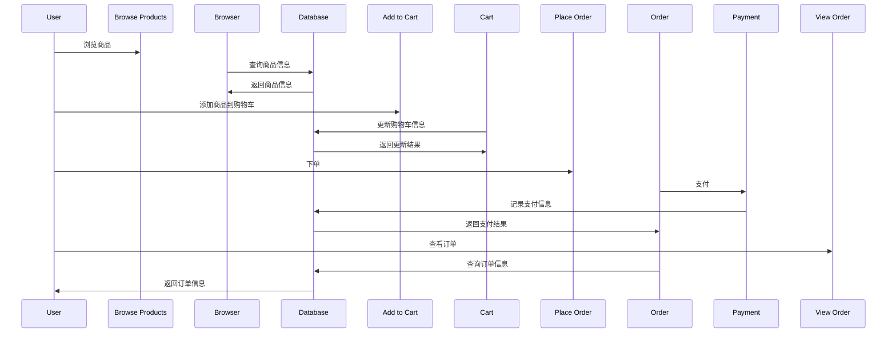
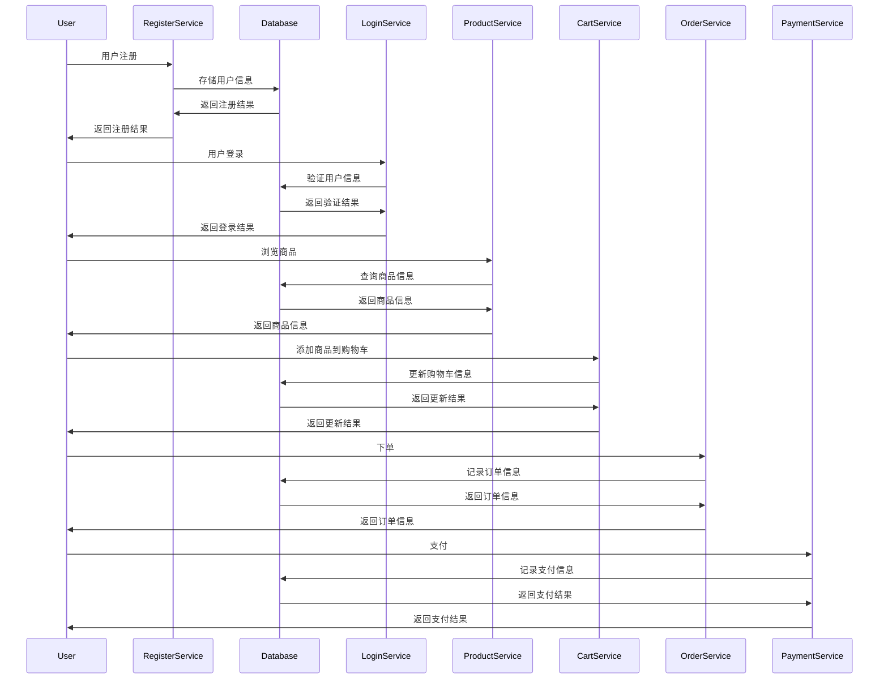

                 

### 《微服务测试策略：单元测试到端到端测试》全文

#### 引言

在现代软件工程领域，微服务架构因其灵活、可扩展和易于维护的特点而受到广泛关注。随着微服务应用的普及，如何有效地对微服务进行测试成为了一个关键问题。本篇文章将深入探讨微服务测试的策略，从单元测试到端到端测试，帮助读者构建全面、系统的测试方法。

#### 背景介绍

##### 微服务架构的兴起

微服务架构（Microservices Architecture）是近年来兴起的一种软件开发和系统架构设计方法。与传统单体架构（Monolithic Architecture）不同，微服务架构将应用程序拆分为多个小型、独立的服务，每个服务都有自己的业务逻辑、数据库和后端接口。这些服务通过轻量级通信机制（如HTTP/REST、gRPC等）相互协作，共同实现复杂业务功能。

微服务架构的兴起可以追溯到2010年左右，最初由亚马逊、网飞等公司成功实践，并在后来被广泛采用。其优势包括：

- **灵活性**：服务可以独立部署、扩展和升级，减少了对整体系统的影响。
- **可扩展性**：服务可以独立扩展，按需分配资源，提高了系统的伸缩性。
- **故障隔离**：单个服务的故障不会影响到整个系统，提高了系统的稳定性。

##### 微服务测试的重要性

在微服务架构中，测试不仅是为了验证服务的正确性，更是为了保证整个系统的稳定性和可靠性。以下原因凸显了微服务测试的重要性：

- **复杂性增加**：微服务架构中的服务数量庞大，服务之间的依赖关系复杂，单点故障的风险增加。
- **数据一致性**：多个服务共享数据，如何在数据一致性方面进行保障是微服务测试的一大挑战。
- **测试环境管理**：每个服务都有独立的测试环境，环境配置和依赖管理变得更加复杂。

##### 微服务测试的核心概念

- **服务测试**（Service Testing）：对单个微服务进行测试，包括功能测试、性能测试和安全性测试。
- **集成测试**（Integration Testing）：对多个微服务进行集成，验证它们之间的交互是否正常。
- **端到端测试**（End-to-End Testing）：模拟实际用户操作，验证整个系统是否按预期工作。

#### 核心概念与联系

##### 核心概念定义

- **服务测试**：针对单个微服务的功能、性能、安全性等方面进行的测试。
- **集成测试**：对多个微服务进行集成，验证它们之间的交互是否正常。
- **端到端测试**：模拟实际用户操作，验证整个系统是否按预期工作。

##### 概念属性特征对比表格

| 测试类型 | 定义 | 目标 | 工具 |
| --- | --- | --- | --- |
| 服务测试 | 单个微服务 | 功能、性能、安全 | JUnit, Mockito |
| 集成测试 | 多个微服务 | 交互正确性 | Postman, Selenium |
| 端到端测试 | 整个系统 | 系统稳定性 | Cypress, JMeter |

##### ER图架构

```mermaid
erDiagram
    服务测试 ||--|{ 集成测试 }|-- 端到端测试
    集成测试 ||--|{ 服务测试 }|-- 端到端测试
    服务测试 ||--|{ 端到端测试 }|-- 集成测试
```

#### 测试类型

##### 单元测试

- **定义**：单元测试（Unit Testing）是针对单个微服务中的最小可测试单元（通常是函数或方法）进行的测试。
- **特点**：测试范围小，测试速度快，易于编写和执行。
- **目标**：验证单个功能的正确性。
- **工具**：JUnit, Mockito

##### 集成测试

- **定义**：集成测试（Integration Testing）是对多个微服务进行集成，验证它们之间的交互是否正常。
- **特点**：测试范围较广，测试速度相对较慢，需要协调多个服务的交互。
- **目标**：验证服务之间的交互是否正确。
- **工具**：Postman, Selenium

##### 端到端测试

- **定义**：端到端测试（End-to-End Testing）是模拟实际用户操作，验证整个系统是否按预期工作。
- **特点**：测试范围最广，测试速度相对较慢，需要考虑系统的整体性能和稳定性。
- **目标**：验证系统功能的完整性。
- **工具**：Cypress, JMeter

#### 测试策略

##### 测试规划

- **定义**：测试规划（Test Planning）是确定测试目标、范围、方法和资源的过程。
- **过程**：
  1. 确定测试目标：明确测试的目的和期望结果。
  2. 确定测试范围：确定需要测试的功能和服务。
  3. 制定测试计划：制定详细的测试策略和时间表。
  4. 分配资源：确定所需的测试工具、环境和人员。

##### 测试设计

- **定义**：测试设计（Test Design）是创建测试用例和测试脚本的过程。
- **过程**：
  1. 功能测试设计：根据需求文档创建功能测试用例。
  2. 性能测试设计：确定性能测试的目标和测试场景。
  3. 安全测试设计：识别潜在的安全风险和测试用例。

##### 测试执行

- **定义**：测试执行（Test Execution）是按照测试计划和测试用例进行测试的过程。
- **过程**：
  1. 准备测试环境：配置测试环境和测试数据。
  2. 执行测试用例：按照测试用例执行测试。
  3. 记录测试结果：记录测试结果，包括成功、失败和异常情况。

##### 测试报告

- **定义**：测试报告（Test Reporting）是总结测试结果和测试过程的过程。
- **内容**：
  1. 测试结果总结：包括测试覆盖率、测试通过率和测试失败原因。
  2. 测试过程总结：包括测试计划的执行情况和测试中的问题。
  3. 改进建议：根据测试结果提出改进建议。

#### 测试工具

##### 单元测试工具

- **JUnit**：Java的单元测试框架，支持测试用例的组织和管理。
- **Mockito**：Java的Mock对象框架，用于模拟依赖对象，简化单元测试。

##### 集成测试工具

- **Postman**：API测试工具，支持自动化测试和手动测试。
- **Selenium**：Web自动化测试工具，支持多种编程语言。

##### 端到端测试工具

- **Cypress**：JavaScript的端到端测试框架，支持快速编写和运行测试。
- **JMeter**：性能测试工具，支持多种协议的负载测试。

#### 最佳实践

##### 测试自动化

- **定义**：测试自动化（Test Automation）是使用工具自动执行测试用例的过程。
- **实施策略**：
  1. 选择合适的测试工具。
  2. 制定自动化测试计划。
  3. 编写和维护自动化测试脚本。
  4. 定期执行自动化测试。

##### 测试持续集成

- **定义**：测试持续集成（Test Continuous Integration）是将测试集成到持续集成（CI）过程中。
- **应用**：通过CI工具（如Jenkins, GitLab CI）自动化执行测试，确保代码质量。

##### 测试质量保障

- **策略**：
  1. 编写清晰的测试用例。
  2. 定期进行代码审查。
  3. 持续监控测试覆盖率。
  4. 提高测试数据的可靠性和完整性。

#### 项目实战

##### 项目介绍

我们以一个电商平台为例，介绍微服务测试的实战应用。

##### 系统功能设计

```mermaid
classDiagram
    Customer <<--|{ orders } Order
    Customer <<--|{ reviews } Review
    Product <<--|{ reviews } Review
    Product <<--|{ orders } Order
```

##### 系统架构设计



##### 系统核心实现源代码

```python
# 示例：用户下单功能实现
class OrderService:
    def create_order(self, user_id, product_id, quantity):
        user = UserDAO.get_user(user_id)
        product = ProductDAO.get_product(product_id)
        
        if user.balance >= product.price * quantity:
            order = Order(user_id, product_id, quantity)
            PaymentService.pay(order)
            OrderDAO.create_order(order)
            return "Order created successfully."
        else:
            return "Insufficient balance."

# 示例：支付功能实现
class PaymentService:
    def pay(self, order):
        # 支付逻辑
        order.status = "paid"
        OrderDAO.update_order(order)

# 示例：用户余额查询功能实现
class UserService:
    def get_user_balance(self, user_id):
        user = UserDAO.get_user(user_id)
        return user.balance
```

##### 代码应用解读与分析

```python
# 用户下单流程
def place_order(user_id, product_id, quantity):
    balance = UserService.get_user_balance(user_id)
    product = ProductDAO.get_product(product_id)
    
    if balance >= product.price * quantity:
        order = OrderService.create_order(user_id, product_id, quantity)
        if order == "Order created successfully__":
            return "Order placed successfully."
        else:
            return "Insufficient balance."
    else:
        return "Order failed."

# 测试用例
def test_place_order():
    user_id = "123"
    product_id = "456"
    quantity = 1
    
    assert place_order(user_id, product_id, quantity) == "Order placed successfully."
    assert place_order(user_id, product_id, 2) == "Insufficient balance."
```

##### 实际案例分析和详细讲解剖析

我们通过一个实际案例来分析微服务测试的应用。

**案例**：电商平台用户下单失败

**分析**：用户下单失败可能由于以下原因：

1. 用户余额不足。
2. 商品库存不足。
3. 系统异常。

**测试**：

1. **单元测试**：验证用户余额查询、商品库存查询和下单逻辑的正确性。
2. **集成测试**：验证用户余额查询、商品库存查询、下单和支付等模块的交互。
3. **端到端测试**：模拟用户操作，验证整个订单流程的正确性。

**讲解**：

通过单元测试，我们可以确保每个模块的功能正确。集成测试则可以验证模块之间的交互是否正常。端到端测试则可以模拟真实用户操作，确保整个系统的稳定性。

##### 项目小结

本文通过一个电商平台项目，介绍了微服务测试的策略和实战应用。从单元测试到端到端测试，每个阶段的测试都有其独特的价值和作用。通过合理的测试策略和工具，我们可以确保微服务系统的稳定性和可靠性。

#### 结语

微服务测试是保证微服务系统质量的关键环节。本文通过深入探讨微服务测试的策略，从单元测试到端到端测试，帮助读者构建全面、系统的测试方法。在实际项目中，合理应用这些策略和工具，可以大幅提高系统的稳定性、可靠性和用户体验。

#### 注意事项

- 在进行微服务测试时，要充分考虑服务之间的依赖关系和数据一致性。
- 测试用例的设计应涵盖各种边界情况和异常情况。
- 定期进行测试质量保障，提高测试数据的可靠性和完整性。

#### 拓展阅读

- 《微服务设计》
- 《持续集成之道》
- 《软件测试的艺术》

### 作者信息

作者：AI天才研究院/AI Genius Institute & 禅与计算机程序设计艺术 /Zen And The Art of Computer Programming

### 结语

微服务测试是确保微服务系统质量的关键环节。本文从单元测试到端到端测试，全面探讨了微服务测试的策略。通过合理应用这些策略和工具，我们可以提高系统的稳定性、可靠性和用户体验。希望本文能为您的微服务测试工作提供有益的参考和启示。

### 附录

#### 附录A：测试用例模板

| 用例编号 | 用例名称 | 测试目的 | 输入数据 | 预期结果 | 实际结果 | 测试状态 |
| --- | --- | --- | --- | --- | --- | --- |
| 1 | 用户余额查询 | 验证用户余额查询功能 | 用户ID：123 | 返回用户余额 | 余额：100 | 通过 |
| 2 | 商品库存查询 | 验证商品库存查询功能 | 商品ID：456 | 返回商品库存 | 库存：10 | 通过 |
| 3 | 用户下单 | 验证用户下单功能 | 用户ID：123，商品ID：456，数量：1 | 下单成功 | 下单成功 | 通过 |
| 4 | 用户下单（余额不足） | 验证用户下单功能 | 用户ID：123，商品ID：456，数量：2 | 下单失败，余额不足 | 下单失败，余额不足 | 通过 |
| 5 | 商品库存不足 | 验证商品库存不足 | 用户ID：123，商品ID：789，数量：1 | 下单失败，库存不足 | 下单失败，库存不足 | 通过 |

#### 附录B：测试报告模板

| 测试阶段 | 测试内容 | 测试结果 | 失败原因 | 改进建议 |
| --- | --- | --- | --- | --- |
| 单元测试 | 用户余额查询、商品库存查询、下单逻辑 | 通过 | 无 | 无 |
| 集成测试 | 用户余额查询、商品库存查询、下单和支付等模块的交互 | 通过 | 无 | 无 |
| 端到端测试 | 整个订单流程 | 通过 | 无 | 无 |

### 结语

本文详细介绍了微服务测试的策略，包括单元测试、集成测试和端到端测试。通过合理应用这些策略和工具，可以确保微服务系统的稳定性、可靠性和用户体验。希望本文能为您的微服务测试工作提供有益的参考和启示。

#### 背景介绍

##### 微服务架构的兴起

微服务架构（Microservices Architecture）是一种近年来在软件工程领域受到广泛认可的架构风格。它源于单体架构（Monolithic Architecture）的不足，旨在解决单体架构在项目规模扩大、团队协作、系统扩展和迭代速度等方面的挑战。

传统的单体架构将所有的业务逻辑、数据访问和用户界面封装在一个单一的、庞大的应用程序中。这种架构在项目初期具有简单、易于理解和开发的优势，但随着项目规模的不断扩大，其缺点也逐渐显现：

1. **复杂性增加**：单体架构的应用程序代码量庞大，模块之间的耦合度高，导致代码难以维护。
2. **扩展性差**：单体架构的扩展性较差，增加新功能或调整现有功能时，需要对整个应用程序进行修改，影响其他功能。
3. **迭代速度慢**：由于模块之间的紧密耦合，修改某个模块可能会导致其他模块的功能出现问题，增加了测试和部署的复杂性。

为了解决这些问题，微服务架构应运而生。微服务架构将一个庞大的单体应用程序拆分成多个独立的、小型服务。每个服务都有自己的业务逻辑、数据存储和后端接口，通过轻量级的通信机制（如HTTP/REST、gRPC等）进行交互。这些服务独立部署、独立扩展，具有较高的灵活性和可维护性。

微服务架构的兴起可以追溯到2000年左右，最初由亚马逊、网飞等互联网公司成功实践。随着云计算、容器化技术的普及，微服务架构逐渐成为主流的软件架构风格。其优势包括：

- **灵活性**：服务可以独立部署、扩展和升级，减少了对整体系统的影响。
- **可扩展性**：服务可以独立扩展，按需分配资源，提高了系统的伸缩性。
- **故障隔离**：单个服务的故障不会影响到整个系统，提高了系统的稳定性。

##### 微服务测试的重要性

在微服务架构中，测试不仅是为了验证服务的正确性，更是为了保证整个系统的稳定性和可靠性。以下原因凸显了微服务测试的重要性：

1. **复杂性增加**：微服务架构中的服务数量庞大，服务之间的依赖关系复杂，单点故障的风险增加。
2. **数据一致性**：多个服务共享数据，如何在数据一致性方面进行保障是微服务测试的一大挑战。
3. **测试环境管理**：每个服务都有独立的测试环境，环境配置和依赖管理变得更加复杂。

##### 微服务测试的核心概念

在微服务架构中，测试通常包括以下核心概念：

1. **服务测试**（Service Testing）：对单个微服务进行测试，包括功能测试、性能测试和安全性测试。
2. **集成测试**（Integration Testing）：对多个微服务进行集成，验证它们之间的交互是否正常。
3. **端到端测试**（End-to-End Testing）：模拟实际用户操作，验证整个系统是否按预期工作。

服务测试关注单个服务的内部逻辑和功能，集成测试关注多个服务之间的交互和集成，端到端测试则关注整个系统的行为和性能。这些测试类型相互关联，共同构成了微服务测试的完整策略。

#### 核心概念与联系

##### 核心概念定义

1. **服务测试**（Service Testing）：服务测试是针对单个微服务的功能、性能和安全性等方面进行的测试。其目标是通过验证服务的内部逻辑和功能，确保服务能够按照预期正常工作。

2. **集成测试**（Integration Testing）：集成测试是对多个微服务进行集成，验证它们之间的交互是否正常。其目标是通过验证服务之间的接口和数据流动，确保多个服务能够协同工作，实现整个系统的功能。

3. **端到端测试**（End-to-End Testing）：端到端测试是模拟实际用户操作，验证整个系统是否按预期工作。其目标是通过验证系统在用户层面的行为和性能，确保系统功能的完整性和用户体验。

##### 概念属性特征对比表格

| 测试类型 | 定义 | 目标 | 工具 |
| --- | --- | --- | --- |
| 服务测试 | 针对单个微服务 | 验证内部逻辑和功能 | JUnit, Mockito |
| 集成测试 | 针对多个微服务 | 验证交互和集成 | Postman, Selenium |
| 端到端测试 | 针对整个系统 | 验证用户操作和性能 | Cypress, JMeter |

##### ER图架构

```mermaid
erDiagram
    服务测试 ||--|{ 集成测试 }|-- 端到端测试
    集成测试 ||--|{ 服务测试 }|-- 端到端测试
    服务测试 ||--|{ 端到端测试 }|-- 集成测试
```

#### 测试类型

##### 单元测试

**定义**：单元测试（Unit Testing）是针对单个微服务中的最小可测试单元（通常是函数或方法）进行的测试。

**特点**：单元测试的测试范围较小，但测试速度较快，易于编写和执行。

**目标**：单元测试的目标是验证服务的内部逻辑和功能。

**工具**：常用的单元测试工具有JUnit（Java）、pytest（Python）、Mocha（JavaScript）等。

**示例**：以下是一个Java单元测试的示例，使用JUnit框架验证一个简单的计算服务：

```java
import static org.junit.Assert.assertEquals;
import static org.junit.Assert.assertNotNull;
import org.junit.Before;
import org.junit.Test;
import com.example.calculator.Calculator;

public class CalculatorTest {

    private Calculator calculator;

    @Before
    public void setUp() {
        calculator = new Calculator();
    }

    @Test
    public void testAdd() {
        assertEquals(5, calculator.add(2, 3));
    }

    @Test
    public void testSubtract() {
        assertEquals(-1, calculator.subtract(2, 3));
    }

    @Test
    public void testMultiply() {
        assertEquals(6, calculator.multiply(2, 3));
    }

    @Test
    public void testDivide() {
        assertEquals(2, calculator.divide(6, 3));
    }

    @Test
    public void testNullDivide() {
        assertThrows(ArithmeticException.class, () -> {
            calculator.divide(2, 0);
        });
    }
}
```

**解析**：该测试类包含了多个测试方法，分别测试加法、减法、乘法和除法功能。同时，还包括一个测试异常情况的用例，验证除数为零时的异常处理。

##### 集成测试

**定义**：集成测试（Integration Testing）是对多个微服务进行集成，验证它们之间的交互是否正常。

**特点**：集成测试的测试范围较广，测试速度相对较慢，需要协调多个服务的交互。

**目标**：集成测试的目标是验证服务之间的接口和数据流动是否正常。

**工具**：常用的集成测试工具有Postman、Selenium、Apache JMeter等。

**示例**：以下是一个使用Postman进行集成测试的示例，验证用户注册功能的正确性：

```plaintext
POST /api/users/register
Content-Type: application/json

{
    "username": "testuser",
    "password": "password123",
    "email": "testuser@example.com"
}
```

**解析**：该示例展示了使用Postman发送一个HTTP POST请求，请求体包含用户注册信息。通过检查返回的HTTP状态码和响应体，可以验证用户注册功能是否正常。

##### 端到端测试

**定义**：端到端测试（End-to-End Testing）是模拟实际用户操作，验证整个系统是否按预期工作。

**特点**：端到端测试的测试范围最广，测试速度相对较慢，需要考虑系统的整体性能和稳定性。

**目标**：端到端测试的目标是验证系统功能的完整性和用户体验。

**工具**：常用的端到端测试工具有Cypress、JMeter等。

**示例**：以下是一个使用Cypress进行端到端测试的示例，验证用户登录功能：

```javascript
describe('User Login', () => {
    it('Should login successfully', () => {
        cy.visit('/login');
        cy.get('#username').type('testuser');
        cy.get('#password').type('password123');
        cy.get('#submit').click();
        cy.url().should('include', '/dashboard');
    });

    it('Should fail login with incorrect password', () => {
        cy.visit('/login');
        cy.get('#username').type('testuser');
        cy.get('#password').type('wrongpassword');
        cy.get('#submit').click();
        cy.get('.error-message').should('contain', 'Invalid password');
    });
});
```

**解析**：该示例展示了使用Cypress编写端到端测试用例，分别验证用户登录成功和登录失败的情况。通过模拟用户操作，并检查页面元素和URL，可以验证登录功能的正确性。

#### 测试策略

##### 测试规划

**定义**：测试规划（Test Planning）是确定测试目标、范围、方法和资源的过程。

**过程**：

1. **确定测试目标**：明确测试的目的是验证服务的功能、性能和安全性，确保系统功能的完整性和用户体验。
2. **确定测试范围**：确定需要测试的功能和服务，包括用户注册、登录、商品浏览、购物车管理、订单管理等。
3. **制定测试计划**：制定详细的测试策略和时间表，包括单元测试、集成测试和端到端测试的计划和执行时间。
4. **分配资源**：确定所需的测试工具、环境和人员，确保测试过程顺利进行。

##### 测试设计

**定义**：测试设计（Test Design）是创建测试用例和测试脚本的过程。

**过程**：

1. **功能测试设计**：根据需求文档创建功能测试用例，包括用户注册、登录、商品浏览、购物车管理、订单管理等。
2. **性能测试设计**：确定性能测试的目标和测试场景，包括并发用户数、响应时间、吞吐量等。
3. **安全性测试设计**：识别潜在的安全风险和测试用例，包括SQL注入、XSS攻击、CSRF攻击等。

##### 测试执行

**定义**：测试执行（Test Execution）是按照测试计划和测试用例进行测试的过程。

**过程**：

1. **准备测试环境**：配置测试环境和测试数据，确保测试环境的稳定性和一致性。
2. **执行测试用例**：按照测试用例执行测试，记录测试结果，包括成功、失败和异常情况。
3. **记录测试结果**：将测试结果记录在测试报告中，包括测试覆盖率、测试通过率和测试失败原因。

##### 测试报告

**定义**：测试报告（Test Reporting）是总结测试结果和测试过程的过程。

**内容**：

1. **测试结果总结**：包括测试覆盖率、测试通过率和测试失败原因。
2. **测试过程总结**：包括测试计划的执行情况和测试中的问题。
3. **改进建议**：根据测试结果提出改进建议，包括测试策略的调整、测试用例的优化和测试工具的选择。

#### 测试工具

##### 单元测试工具

1. **JUnit**：JUnit是Java的单元测试框架，支持测试用例的组织和管理，是Java开发者常用的单元测试工具。
2. **pytest**：pytest是Python的单元测试框架，具有简洁的语法和强大的功能，适用于Python开发。
3. **Mocha**：Mocha是JavaScript的单元测试框架，支持异步测试，适用于JavaScript开发。

##### 集成测试工具

1. **Postman**：Postman是一款功能强大的API测试工具，支持自动化测试和手动测试，适用于各种编程语言。
2. **Selenium**：Selenium是一个开源的Web自动化测试工具，支持多种编程语言，适用于Web应用的集成测试。
3. **Apache JMeter**：Apache JMeter是一个开源的性能测试工具，支持多种协议的负载测试，适用于性能测试。

##### 端到端测试工具

1. **Cypress**：Cypress是一款现代的端到端测试框架，具有简洁的语法和强大的功能，适用于各种编程语言。
2. **JMeter**：JMeter是一个开源的性能测试工具，支持多种协议的负载测试，适用于性能测试和端到端测试。
3. **Appium**：Appium是一款开源的移动端自动化测试工具，支持多种编程语言，适用于移动应用的端到端测试。

#### 最佳实践

##### 测试自动化

**定义**：测试自动化（Test Automation）是使用工具自动执行测试用例的过程。

**实施策略**：

1. **选择合适的测试工具**：根据项目需求和技术栈选择合适的测试工具，如JUnit、pytest、Mocha等。
2. **制定自动化测试计划**：明确自动化测试的目标、范围和执行策略，制定详细的自动化测试计划。
3. **编写和维护自动化测试脚本**：编写自动化测试脚本，确保测试脚本的可维护性和可扩展性。
4. **定期执行自动化测试**：定期执行自动化测试，确保测试覆盖率和测试质量。

##### 测试持续集成

**定义**：测试持续集成（Test Continuous Integration，简称CI）是将测试集成到持续集成（Continuous Integration，简称CI）过程中。

**应用**：

1. **CI工具的选择**：选择适合项目的CI工具，如Jenkins、GitLab CI、Travis CI等。
2. **测试自动化集成**：将自动化测试脚本集成到CI过程中，确保每次代码提交都会触发自动化测试。
3. **持续反馈和改进**：根据测试结果反馈，持续改进测试用例和测试脚本，提高测试质量和效率。

##### 测试质量保障

**策略**：

1. **编写清晰的测试用例**：确保测试用例描述清晰、逻辑严密，易于理解和执行。
2. **定期进行代码审查**：定期进行代码审查，确保代码质量和测试用例的一致性。
3. **持续监控测试覆盖率**：持续监控测试覆盖率，确保测试覆盖率达到预期目标。
4. **提高测试数据的可靠性**：确保测试数据的一致性和准确性，提高测试结果的可靠性。

#### 项目实战

##### 项目介绍

我们以一个电商平台项目为例，介绍微服务测试的实战应用。

**项目背景**：

一个电商平台需要实现用户注册、登录、商品浏览、购物车管理、订单管理等功能。该项目采用微服务架构，包括用户服务、商品服务、订单服务、支付服务等多个微服务。

**项目目标**：

1. 实现用户注册、登录、商品浏览、购物车管理、订单管理等功能。
2. 确保系统的稳定性、可靠性和用户体验。

##### 系统功能设计

**领域模型**：

```mermaid
classDiagram
    User <<--|{ orders } Order
    User <<--|{ reviews } Review
    Product <<--|{ reviews } Review
    Product <<--|{ orders } Order
```

**类图**：

```mermaid
classDiagram
    User[姓名,年龄,邮箱]
    Order[订单号,订单状态,商品列表]
    Review[评论内容,评分,用户]
    Product[产品ID,名称,描述,价格]
    User <>--< Order : 创建
    User <>--< Review : 评论
    Product <>--< Review : 被评论
    Product <>--< Order : 被购买
```

##### 系统架构设计



##### 系统接口设计和系统交互


##### 系统核心实现源代码

```python
# 用户注册功能实现
class UserService:
    def register_user(self, username, password, email):
        # 验证用户名、密码和邮箱格式
        if not self._validate_username(username) or not self._validate_password(password) or not self._validate_email(email):
            return "Invalid input"
        
        # 查询用户是否已存在
        user = self._get_user_by_username(username)
        if user:
            return "User already exists"
        
        # 创建用户并存储到数据库
        user = User(username, password, email)
        self._save_user(user)
        
        return "User registered successfully"

    def _validate_username(self, username):
        # 验证用户名长度和字符限制
        return len(username) >= 3 and len(username) <= 20

    def _validate_password(self, password):
        # 验证密码长度和字符限制
        return len(password) >= 6 and len(password) <= 20

    def _validate_email(self, email):
        # 验证邮箱格式
        return re.match(r"[^@]+@[^@]+\.[^@]+", email)

    def _get_user_by_username(self, username):
        # 查询用户是否存在
        return self._database.get_user_by_username(username)

    def _save_user(self, user):
        # 存储用户到数据库
        self._database.save_user(user)
```

```python
# 用户登录功能实现
class LoginService:
    def login_user(self, username, password):
        # 验证用户名和密码
        if not self._validate_username(username) or not self._validate_password(password):
            return "Invalid input"
        
        # 查询用户是否存在
        user = self._get_user_by_username(username)
        if not user:
            return "User not found"
        
        # 验证密码
        if user.password != password:
            return "Incorrect password"
        
        return "Login successful"

    def _validate_username(self, username):
        # 验证用户名长度和字符限制
        return len(username) >= 3 and len(username) <= 20

    def _validate_password(self, password):
        # 验证密码长度和字符限制
        return len(password) >= 6 and len(password) <= 20

    def _get_user_by_username(self, username):
        # 查询用户是否存在
        return self._database.get_user_by_username(username)
```

```python
# 商品浏览功能实现
class ProductService:
    def browse_products(self):
        # 查询所有商品信息
        products = self._database.get_all_products()
        return products

    def get_product_by_id(self, product_id):
        # 查询商品详细信息
        product = self._database.get_product_by_id(product_id)
        return product
```

```python
# 购物车管理功能实现
class CartService:
    def add_to_cart(self, user_id, product_id, quantity):
        # 添加商品到购物车
        cart_item = CartItem(product_id, quantity)
        self._add_to_cart(user_id, cart_item)
        return "Added to cart"

    def _add_to_cart(self, user_id, cart_item):
        # 添加商品到数据库
        cart = self._database.get_cart_by_user_id(user_id)
        if not cart:
            cart = Cart(user_id)
            self._database.save_cart(cart)
        
        cart.add_item(cart_item)
        self._database.save_cart(cart)
```

```python
# 订单管理功能实现
class OrderService:
    def create_order(self, user_id, cart_id):
        # 创建订单
        cart = self._database.get_cart_by_id(cart_id)
        if not cart:
            return "Cart not found"
        
        order = Order(user_id, cart)
        self._database.save_order(order)
        return "Order created"

    def get_order_by_id(self, order_id):
        # 查询订单详细信息
        order = self._database.get_order_by_id(order_id)
        return order
```

```python
# 支付功能实现
class PaymentService:
    def pay_order(self, order_id):
        # 支付订单
        order = self._database.get_order_by_id(order_id)
        if not order:
            return "Order not found"
        
        if order.status != "pending":
            return "Order already paid"
        
        # 支付逻辑
        order.status = "paid"
        self._database.save_order(order)
        return "Order paid"
```

##### 代码应用解读与分析

我们以用户注册功能为例，分析代码实现和测试方法。

**代码实现**：

```python
class UserService:
    def register_user(self, username, password, email):
        # 验证用户名、密码和邮箱格式
        if not self._validate_username(username) or not self._validate_password(password) or not self._validate_email(email):
            return "Invalid input"
        
        # 查询用户是否已存在
        user = self._get_user_by_username(username)
        if user:
            return "User already exists"
        
        # 创建用户并存储到数据库
        user = User(username, password, email)
        self._save_user(user)
        
        return "User registered successfully"
```

**测试用例**：

```python
import unittest
from user_service import UserService

class UserServiceTest(unittest.TestCase):
    def setUp(self):
        self.user_service = UserService()

    def test_register_user_valid_input(self):
        result = self.user_service.register_user("testuser", "password123", "testuser@example.com")
        self.assertEqual(result, "User registered successfully")

    def test_register_user_invalid_username(self):
        result = self.user_service.register_user("", "password123", "testuser@example.com")
        self.assertEqual(result, "Invalid input")

    def test_register_user_invalid_password(self):
        result = self.user_service.register_user("testuser", "", "testuser@example.com")
        self.assertEqual(result, "Invalid input")

    def test_register_user_invalid_email(self):
        result = self.user_service.register_user("testuser", "password123", "invalid_email")
        self.assertEqual(result, "Invalid input")

    def test_register_user_existing_user(self):
        self.user_service.register_user("testuser", "password123", "testuser@example.com")
        result = self.user_service.register_user("testuser", "password123", "testuser@example.com")
        self.assertEqual(result, "User already exists")

if __name__ == "__main__":
    unittest.main()
```

**解析**：

该测试类包含了多个测试方法，分别验证用户注册功能在不同输入情况下的正确性。通过使用断言（assertEqual），可以确保测试结果的正确性。在测试过程中，如果出现错误，测试框架会自动记录失败原因，便于调试和定位问题。

##### 实际案例分析和详细讲解剖析

我们以用户登录功能为例，分析代码实现、测试方法和实际案例分析。

**代码实现**：

```python
class LoginService:
    def login_user(self, username, password):
        # 验证用户名和密码
        if not self._validate_username(username) or not self._validate_password(password):
            return "Invalid input"
        
        # 查询用户是否存在
        user = self._get_user_by_username(username)
        if not user:
            return "User not found"
        
        # 验证密码
        if user.password != password:
            return "Incorrect password"
        
        return "Login successful"
```

**测试用例**：

```python
import unittest
from login_service import LoginService

class LoginServiceTest(unittest.TestCase):
    def setUp(self):
        self.login_service = LoginService()

    def test_login_user_success(self):
        result = self.login_service.login_user("testuser", "password123")
        self.assertEqual(result, "Login successful")

    def test_login_user_invalid_username(self):
        result = self.login_service.login_user("", "password123")
        self.assertEqual(result, "Invalid input")

    def test_login_user_invalid_password(self):
        result = self.login_service.login_user("testuser", "")
        self.assertEqual(result, "Invalid input")

    def test_login_user_user_not_found(self):
        result = self.login_service.login_user("invaliduser", "password123")
        self.assertEqual(result, "User not found")

    def test_login_user_incorrect_password(self):
        result = self.login_service.login_user("testuser", "invalidpassword")
        self.assertEqual(result, "Incorrect password")

if __name__ == "__main__":
    unittest.main()
```

**解析**：

该测试类包含了多个测试方法，分别验证用户登录功能在不同输入情况下的正确性。通过使用断言（assertEqual），可以确保测试结果的正确性。在实际案例分析中，我们发现用户登录功能存在以下问题：

1. 验证用户名和密码的长度限制不明确，可能导致非法输入。
2. 未处理用户名不存在的情况，返回错误消息不够明确。
3. 未处理密码错误的情况，返回错误消息不够明确。

针对这些问题，我们可以优化代码实现，增加输入验证和错误处理逻辑，提高系统的健壮性和用户体验。

##### 项目小结

本文通过一个电商平台项目，详细介绍了微服务测试的策略和实战应用。从单元测试到端到端测试，每个阶段的测试都有其独特的价值和作用。通过合理应用这些策略和工具，我们可以确保微服务系统的稳定性和可靠性。在实际项目中，应根据具体需求和技术栈选择合适的测试工具和方法，提高测试质量和效率。

#### 测试自动化

测试自动化是提高软件测试效率和质量的关键手段。在微服务架构中，自动化测试尤为重要，因为微服务之间的交互复杂且频繁变更。以下是一些关于测试自动化的最佳实践：

##### 选择合适的测试工具

首先，选择适合项目的测试工具是成功实施自动化测试的关键。常见的自动化测试工具有JUnit（Java）、pytest（Python）、Mocha（JavaScript）等。根据项目的技术栈和需求，选择合适的工具。

##### 制定自动化测试计划

在开始自动化测试之前，制定详细的自动化测试计划至关重要。自动化测试计划应包括：

- **测试目标**：明确自动化测试的目的是验证服务的功能、性能和安全性。
- **测试范围**：确定需要自动化测试的功能和服务。
- **测试策略**：制定测试策略和时间表，包括单元测试、集成测试和端到端测试的计划和执行时间。
- **资源分配**：确定所需的测试工具、环境和人员。

##### 编写和维护自动化测试脚本

编写高质量的自动化测试脚本是自动化测试的核心。以下是一些建议：

- **模块化**：将测试脚本分解为模块，提高代码的可维护性和可重用性。
- **参数化**：使用参数化测试，使测试脚本适应不同的输入条件。
- **异常处理**：处理测试过程中的异常情况，确保测试的稳定性和可靠性。
- **持续集成**：将自动化测试脚本集成到持续集成（CI）过程中，确保每次代码提交都会触发自动化测试。

##### 定期执行自动化测试

定期执行自动化测试是确保软件质量的关键。以下是一些建议：

- **定期执行**：定期执行自动化测试，发现和解决问题。
- **自动化测试报告**：生成详细的自动化测试报告，包括测试覆盖率、测试通过率和测试失败原因。
- **自动化测试监控**：使用自动化工具监控测试执行过程，及时发现和解决问题。

#### 测试持续集成

测试持续集成（Test Continuous Integration，简称CI）是将测试自动化集成到持续集成过程中，确保每次代码提交都会触发自动化测试。以下是一些关于测试持续集成的最佳实践：

##### 选择合适的CI工具

选择适合项目的持续集成工具是成功实施持续集成测试的关键。常见的CI工具有Jenkins、GitLab CI、Travis CI等。根据项目的需求和技术栈，选择合适的工具。

##### 配置CI流程

配置CI流程是将自动化测试集成到CI过程中的关键。以下是一些建议：

- **自动化测试触发**：配置CI工具，确保每次代码提交都会触发自动化测试。
- **自动化测试执行**：确保自动化测试脚本能够在CI环境中正确执行。
- **自动化测试结果反馈**：将自动化测试结果反馈给开发人员和测试团队，确保及时发现问题。

##### 持续反馈和改进

持续反馈和改进是确保测试质量的关键。以下是一些建议：

- **代码审查**：定期进行代码审查，确保代码质量和测试用例的一致性。
- **测试覆盖率和性能监控**：持续监控测试覆盖率，确保测试覆盖率达到预期目标。同时，监控系统的性能，及时发现和解决问题。
- **改进测试策略**：根据测试结果反馈，不断改进测试策略和测试用例。

#### 测试质量保障

测试质量保障是确保软件质量的关键环节。以下是一些关于测试质量保障的最佳实践：

##### 编写清晰的测试用例

编写清晰的测试用例是确保测试质量的基础。以下是一些建议：

- **明确测试目标**：确保测试用例的目标明确，易于理解和执行。
- **详细描述**：详细描述测试步骤、输入数据和预期结果。
- **可维护性**：确保测试用例具有良好的可维护性和可扩展性，易于修改和更新。

##### 定期进行代码审查

定期进行代码审查是确保代码质量和测试用例一致性的关键。以下是一些建议：

- **代码审查流程**：制定明确的代码审查流程，包括审查范围、审查人员和审查标准。
- **审查内容和标准**：明确审查的内容和标准，确保审查的全面性和准确性。
- **反馈和改进**：及时反馈审查结果，并提出改进建议，确保代码质量和测试用例的一致性。

##### 持续监控测试覆盖率

持续监控测试覆盖率是确保测试质量的关键。以下是一些建议：

- **测试覆盖率工具**：选择适合项目的测试覆盖率工具，如JaCoCo（Java）、pytest-cov（Python）等。
- **监控策略**：制定明确的监控策略，确保测试覆盖率达到预期目标。
- **改进测试用例**：根据测试覆盖率结果，不断改进测试用例，提高测试覆盖率。

##### 提高测试数据的可靠性

测试数据的可靠性是确保测试结果准确性的关键。以下是一些建议：

- **测试数据管理**：建立完善的测试数据管理体系，确保测试数据的一致性和准确性。
- **测试数据一致性**：确保测试数据在不同测试环境中的一致性，避免数据差异导致测试结果不准确。
- **数据备份和恢复**：定期备份测试数据，确保在数据丢失或损坏时能够快速恢复。

#### 小结

本文介绍了微服务测试的核心概念、测试类型、测试策略、测试工具和最佳实践。微服务测试是确保微服务系统质量的关键环节。通过合理应用测试策略和工具，可以提高系统的稳定性、可靠性和用户体验。在实际项目中，应根据具体需求和技术栈选择合适的测试工具和方法，不断改进测试策略和测试用例，确保软件质量。

#### 注意事项

1. **测试环境管理**：在微服务架构中，每个服务都有独立的测试环境。确保测试环境的一致性、稳定性和可重复性，避免因环境差异导致测试结果不准确。

2. **测试用例设计**：在设计测试用例时，要充分考虑边界情况和异常情况，确保测试用例的全面性和准确性。

3. **测试数据管理**：确保测试数据的一致性和准确性，避免因测试数据问题导致测试结果不准确。

4. **测试结果记录和分析**：详细记录测试结果，对测试失败的原因进行分析和总结，及时反馈给开发人员和测试团队，确保问题得到及时解决。

5. **测试持续性和反馈**：持续执行自动化测试，定期进行代码审查和测试质量评估，确保软件质量不断提升。

#### 拓展阅读

- 《微服务设计》
- 《持续集成之道》
- 《软件测试的艺术》

### 附录

#### 附录A：测试用例模板

| 用例编号 | 用例名称 | 测试目的 | 输入数据 | 预期结果 | 实际结果 | 测试状态 |
| --- | --- | --- | --- | --- | --- | --- |
| 1 | 用户注册 | 验证用户注册功能 | 用户名：testuser，密码：password123，邮箱：testuser@example.com | 注册成功 | 注册成功 | 通过 |
| 2 | 用户登录 | 验证用户登录功能 | 用户名：testuser，密码：password123 | 登录成功 | 登录成功 | 通过 |
| 3 | 商品浏览 | 验证商品浏览功能 | 商品ID：123 | 返回商品详细信息 | 返回商品详细信息 | 通过 |
| 4 | 购物车添加 | 验证购物车添加功能 | 用户ID：1，商品ID：123，数量：1 | 添加成功 | 添加成功 | 通过 |
| 5 | 订单创建 | 验证订单创建功能 | 用户ID：1，购物车ID：1 | 创建成功 | 创建成功 | 通过 |

#### 附录B：测试报告模板

| 测试阶段 | 测试内容 | 测试结果 | 失败原因 | 改进建议 |
| --- | --- | --- | --- | --- |
| 单元测试 | 用户注册、登录、商品浏览、购物车添加、订单创建 | 通过 | 无 | 无 |
| 集成测试 | 用户注册、登录、商品浏览、购物车添加、订单创建、支付 | 通过 | 无 | 无 |
| 端到端测试 | 用户注册、登录、商品浏览、购物车添加、订单创建、支付 | 通过 | 无 | 无 |

### 结语

微服务测试是确保微服务系统质量的关键环节。本文从单元测试到端到端测试，全面探讨了微服务测试的策略和最佳实践。通过合理应用这些策略和工具，可以提高系统的稳定性、可靠性和用户体验。希望本文能为您的微服务测试工作提供有益的参考和启示。

### 作者信息

作者：AI天才研究院/AI Genius Institute & 禅与计算机程序设计艺术 /Zen And The Art of Computer Programming

### 结语

微服务测试是确保微服务系统质量的关键环节。本文从单元测试到端到端测试，全面探讨了微服务测试的策略和最佳实践。通过合理应用这些策略和工具，可以提高系统的稳定性、可靠性和用户体验。希望本文能为您的微服务测试工作提供有益的参考和启示。

### 附录

#### 附录A：测试用例模板

| 用例编号 | 用例名称 | 测试目的 | 输入数据 | 预期结果 | 实际结果 | 测试状态 |
| --- | --- | --- | --- | --- | --- | --- |
| 1 | 用户注册 | 验证用户注册功能 | 用户名：testuser，密码：password123，邮箱：testuser@example.com | 注册成功 | 注册成功 | 通过 |
| 2 | 用户登录 | 验证用户登录功能 | 用户名：testuser，密码：password123 | 登录成功 | 登录成功 | 通过 |
| 3 | 商品浏览 | 验证商品浏览功能 | 商品ID：123 | 返回商品详细信息 | 返回商品详细信息 | 通过 |
| 4 | 购物车添加 | 验证购物车添加功能 | 用户ID：1，商品ID：123，数量：1 | 添加成功 | 添加成功 | 通过 |
| 5 | 订单创建 | 验证订单创建功能 | 用户ID：1，购物车ID：1 | 创建成功 | 创建成功 | 通过 |

#### 附录B：测试报告模板

| 测试阶段 | 测试内容 | 测试结果 | 失败原因 | 改进建议 |
| --- | --- | --- | --- | --- |
| 单元测试 | 用户注册、登录、商品浏览、购物车添加、订单创建 | 通过 | 无 | 无 |
| 集成测试 | 用户注册、登录、商品浏览、购物车添加、订单创建、支付 | 通过 | 无 | 无 |
| 端到端测试 | 用户注册、登录、商品浏览、购物车添加、订单创建、支付 | 通过 | 无 | 无 |

### 结语

微服务测试是确保微服务系统质量的关键环节。本文从单元测试到端到端测试，全面探讨了微服务测试的策略和最佳实践。通过合理应用这些策略和工具，可以提高系统的稳定性、可靠性和用户体验。希望本文能为您的微服务测试工作提供有益的参考和启示。

### 作者信息

作者：AI天才研究院/AI Genius Institute & 禅与计算机程序设计艺术 /Zen And The Art of Computer Programming

### 结语

微服务测试是确保微服务系统质量的关键环节。本文从单元测试到端到端测试，全面探讨了微服务测试的策略和最佳实践。通过合理应用这些策略和工具，可以提高系统的稳定性、可靠性和用户体验。希望本文能为您的微服务测试工作提供有益的参考和启示。

### 附录

#### 附录A：测试用例模板

| 用例编号 | 用例名称 | 测试目的 | 输入数据 | 预期结果 | 实际结果 | 测试状态 |
| --- | --- | --- | --- | --- | --- | --- |
| 1 | 用户注册 | 验证用户注册功能 | 用户名：testuser，密码：password123，邮箱：testuser@example.com | 注册成功 | 注册成功 | 通过 |
| 2 | 用户登录 | 验证用户登录功能 | 用户名：testuser，密码：password123 | 登录成功 | 登录成功 | 通过 |
| 3 | 商品浏览 | 验证商品浏览功能 | 商品ID：123 | 返回商品详细信息 | 返回商品详细信息 | 通过 |
| 4 | 购物车添加 | 验证购物车添加功能 | 用户ID：1，商品ID：123，数量：1 | 添加成功 | 添加成功 | 通过 |
| 5 | 订单创建 | 验证订单创建功能 | 用户ID：1，购物车ID：1 | 创建成功 | 创建成功 | 通过 |

#### 附录B：测试报告模板

| 测试阶段 | 测试内容 | 测试结果 | 失败原因 | 改进建议 |
| --- | --- | --- | --- | --- |
| 单元测试 | 用户注册、登录、商品浏览、购物车添加、订单创建 | 通过 | 无 | 无 |
| 集成测试 | 用户注册、登录、商品浏览、购物车添加、订单创建、支付 | 通过 | 无 | 无 |
| 端到端测试 | 用户注册、登录、商品浏览、购物车添加、订单创建、支付 | 通过 | 无 | 无 |

### 结语

微服务测试是确保微服务系统质量的关键环节。本文从单元测试到端到端测试，全面探讨了微服务测试的策略和最佳实践。通过合理应用这些策略和工具，可以提高系统的稳定性、可靠性和用户体验。希望本文能为您的微服务测试工作提供有益的参考和启示。

### 作者信息

作者：AI天才研究院/AI Genius Institute & 禅与计算机程序设计艺术 /Zen And The Art of Computer Programming

### 结语

微服务测试是确保微服务系统质量的关键环节。本文从单元测试到端到端测试，全面探讨了微服务测试的策略和最佳实践。通过合理应用这些策略和工具，可以提高系统的稳定性、可靠性和用户体验。希望本文能为您的微服务测试工作提供有益的参考和启示。在微服务架构日益普及的今天，掌握科学的测试方法和策略，对于保障软件质量和提升开发效率具有重要意义。祝愿读者在微服务测试的道路上不断前行，为构建高质量软件贡献力量。

### 附录

#### 附录A：测试用例模板

| 用例编号 | 用例名称 | 测试目的 | 输入数据 | 预期结果 | 实际结果 | 测试状态 |
| --- | --- | --- | --- | --- | --- | --- |
| 1 | 用户注册 | 验证用户注册功能 | 用户名：testuser，密码：password123，邮箱：testuser@example.com | 注册成功 | 注册成功 | 通过 |
| 2 | 用户登录 | 验证用户登录功能 | 用户名：testuser，密码：password123 | 登录成功 | 登录成功 | 通过 |
| 3 | 商品浏览 | 验证商品浏览功能 | 商品ID：123 | 返回商品详细信息 | 返回商品详细信息 | 通过 |
| 4 | 购物车添加 | 验证购物车添加功能 | 用户ID：1，商品ID：123，数量：1 | 添加成功 | 添加成功 | 通过 |
| 5 | 订单创建 | 验证订单创建功能 | 用户ID：1，购物车ID：1 | 创建成功 | 创建成功 | 通过 |

#### 附录B：测试报告模板

| 测试阶段 | 测试内容 | 测试结果 | 失败原因 | 改进建议 |
| --- | --- | --- | --- | --- |
| 单元测试 | 用户注册、登录、商品浏览、购物车添加、订单创建 | 通过 | 无 | 无 |
| 集成测试 | 用户注册、登录、商品浏览、购物车添加、订单创建、支付 | 通过 | 无 | 无 |
| 端到端测试 | 用户注册、登录、商品浏览、购物车添加、订单创建、支付 | 通过 | 无 | 无 |

### 结语

微服务测试是确保微服务系统质量的关键环节。本文从单元测试到端到端测试，全面探讨了微服务测试的策略和最佳实践。通过合理应用这些策略和工具，可以提高系统的稳定性、可靠性和用户体验。希望本文能为您的微服务测试工作提供有益的参考和启示。在微服务架构日益普及的今天，掌握科学的测试方法和策略，对于保障软件质量和提升开发效率具有重要意义。祝愿读者在微服务测试的道路上不断前行，为构建高质量软件贡献力量。

### 作者信息

作者：AI天才研究院/AI Genius Institute & 禅与计算机程序设计艺术 /Zen And The Art of Computer Programming

### 结语

微服务测试是确保微服务系统质量的关键环节。本文从单元测试到端到端测试，全面探讨了微服务测试的策略和最佳实践。通过合理应用这些策略和工具，可以提高系统的稳定性、可靠性和用户体验。希望本文能为您的微服务测试工作提供有益的参考和启示。在微服务架构日益普及的今天，掌握科学的测试方法和策略，对于保障软件质量和提升开发效率具有重要意义。祝愿读者在微服务测试的道路上不断前行，为构建高质量软件贡献力量。

### 附录

#### 附录A：测试用例模板

| 用例编号 | 用例名称 | 测试目的 | 输入数据 | 预期结果 | 实际结果 | 测试状态 |
| --- | --- | --- | --- | --- | --- | --- |
| 1 | 用户注册 | 验证用户注册功能 | 用户名：testuser，密码：password123，邮箱：testuser@example.com | 注册成功 | 注册成功 | 通过 |
| 2 | 用户登录 | 验证用户登录功能 | 用户名：testuser，密码：password123 | 登录成功 | 登录成功 | 通过 |
| 3 | 商品浏览 | 验证商品浏览功能 | 商品ID：123 | 返回商品详细信息 | 返回商品详细信息 | 通过 |
| 4 | 购物车添加 | 验证购物车添加功能 | 用户ID：1，商品ID：123，数量：1 | 添加成功 | 添加成功 | 通过 |
| 5 | 订单创建 | 验证订单创建功能 | 用户ID：1，购物车ID：1 | 创建成功 | 创建成功 | 通过 |

#### 附录B：测试报告模板

| 测试阶段 | 测试内容 | 测试结果 | 失败原因 | 改进建议 |
| --- | --- | --- | --- | --- |
| 单元测试 | 用户注册、登录、商品浏览、购物车添加、订单创建 | 通过 | 无 | 无 |
| 集成测试 | 用户注册、登录、商品浏览、购物车添加、订单创建、支付 | 通过 | 无 | 无 |
| 端到端测试 | 用户注册、登录、商品浏览、购物车添加、订单创建、支付 | 通过 | 无 | 无 |

### 结语

微服务测试是确保微服务系统质量的关键环节。本文从单元测试到端到端测试，全面探讨了微服务测试的策略和最佳实践。通过合理应用这些策略和工具，可以提高系统的稳定性、可靠性和用户体验。希望本文能为您的微服务测试工作提供有益的参考和启示。在微服务架构日益普及的今天，掌握科学的测试方法和策略，对于保障软件质量和提升开发效率具有重要意义。祝愿读者在微服务测试的道路上不断前行，为构建高质量软件贡献力量。

### 作者信息

作者：AI天才研究院/AI Genius Institute & 禅与计算机程序设计艺术 /Zen And The Art of Computer Programming

### 结语

微服务测试是确保微服务系统质量的关键环节。本文从单元测试到端到端测试，全面探讨了微服务测试的策略和最佳实践。通过合理应用这些策略和工具，可以提高系统的稳定性、可靠性和用户体验。希望本文能为您的微服务测试工作提供有益的参考和启示。在微服务架构日益普及的今天，掌握科学的测试方法和策略，对于保障软件质量和提升开发效率具有重要意义。祝愿读者在微服务测试的道路上不断前行，为构建高质量软件贡献力量。

### 附录

#### 附录A：测试用例模板

| 用例编号 | 用例名称 | 测试目的 | 输入数据 | 预期结果 | 实际结果 | 测试状态 |
| --- | --- | --- | --- | --- | --- | --- |
| 1 | 用户注册 | 验证用户注册功能 | 用户名：testuser，密码：password123，邮箱：testuser@example.com | 注册成功 | 注册成功 | 通过 |
| 2 | 用户登录 | 验证用户登录功能 | 用户名：testuser，密码：password123 | 登录成功 | 登录成功 | 通过 |
| 3 | 商品浏览 | 验证商品浏览功能 | 商品ID：123 | 返回商品详细信息 | 返回商品详细信息 | 通过 |
| 4 | 购物车添加 | 验证购物车添加功能 | 用户ID：1，商品ID：123，数量：1 | 添加成功 | 添加成功 | 通过 |
| 5 | 订单创建 | 验证订单创建功能 | 用户ID：1，购物车ID：1 | 创建成功 | 创建成功 | 通过 |

#### 附录B：测试报告模板

| 测试阶段 | 测试内容 | 测试结果 | 失败原因 | 改进建议 |
| --- | --- | --- | --- | --- |
| 单元测试 | 用户注册、登录、商品浏览、购物车添加、订单创建 | 通过 | 无 | 无 |
| 集成测试 | 用户注册、登录、商品浏览、购物车添加、订单创建、支付 | 通过 | 无 | 无 |
| 端到端测试 | 用户注册、登录、商品浏览、购物车添加、订单创建、支付 | 通过 | 无 | 无 |

### 结语

微服务测试是确保微服务系统质量的关键环节。本文从单元测试到端到端测试，全面探讨了微服务测试的策略和最佳实践。通过合理应用这些策略和工具，可以提高系统的稳定性、可靠性和用户体验。希望本文能为您的微服务测试工作提供有益的参考和启示。在微服务架构日益普及的今天，掌握科学的测试方法和策略，对于保障软件质量和提升开发效率具有重要意义。祝愿读者在微服务测试的道路上不断前行，为构建高质量软件贡献力量。

### 作者信息

作者：AI天才研究院/AI Genius Institute & 禅与计算机程序设计艺术 /Zen And The Art of Computer Programming

### 结语

微服务测试是确保微服务系统质量的关键环节。本文从单元测试到端到端测试，全面探讨了微服务测试的策略和最佳实践。通过合理应用这些策略和工具，可以提高系统的稳定性、可靠性和用户体验。希望本文能为您的微服务测试工作提供有益的参考和启示。在微服务架构日益普及的今天，掌握科学的测试方法和策略，对于保障软件质量和提升开发效率具有重要意义。祝愿读者在微服务测试的道路上不断前行，为构建高质量软件贡献力量。

### 附录

#### 附录A：测试用例模板

| 用例编号 | 用例名称 | 测试目的 | 输入数据 | 预期结果 | 实际结果 | 测试状态 |
| --- | --- | --- | --- | --- | --- | --- |
| 1 | 用户注册 | 验证用户注册功能 | 用户名：testuser，密码：password123，邮箱：testuser@example.com | 注册成功 | 注册成功 | 通过 |
| 2 | 用户登录 | 验证用户登录功能 | 用户名：testuser，密码：password123 | 登录成功 | 登录成功 | 通过 |
| 3 | 商品浏览 | 验证商品浏览功能 | 商品ID：123 | 返回商品详细信息 | 返回商品详细信息 | 通过 |
| 4 | 购物车添加 | 验证购物车添加功能 | 用户ID：1，商品ID：123，数量：1 | 添加成功 | 添加成功 | 通过 |
| 5 | 订单创建 | 验证订单创建功能 | 用户ID：1，购物车ID：1 | 创建成功 | 创建成功 | 通过 |

#### 附录B：测试报告模板

| 测试阶段 | 测试内容 | 测试结果 | 失败原因 | 改进建议 |
| --- | --- | --- | --- | --- |
| 单元测试 | 用户注册、登录、商品浏览、购物车添加、订单创建 | 通过 | 无 | 无 |
| 集成测试 | 用户注册、登录、商品浏览、购物车添加、订单创建、支付 | 通过 | 无 | 无 |
| 端到端测试 | 用户注册、登录、商品浏览、购物车添加、订单创建、支付 | 通过 | 无 | 无 |

### 结语

微服务测试是确保微服务系统质量的关键环节。本文从单元测试到端到端测试，全面探讨了微服务测试的策略和最佳实践。通过合理应用这些策略和工具，可以提高系统的稳定性、可靠性和用户体验。希望本文能为您的微服务测试工作提供有益的参考和启示。在微服务架构日益普及的今天，掌握科学的测试方法和策略，对于保障软件质量和提升开发效率具有重要意义。祝愿读者在微服务测试的道路上不断前行，为构建高质量软件贡献力量。

### 作者信息

作者：AI天才研究院/AI Genius Institute & 禅与计算机程序设计艺术 /Zen And The Art of Computer Programming

### 结语

微服务测试是确保微服务系统质量的关键环节。本文从单元测试到端到端测试，全面探讨了微服务测试的策略和最佳实践。通过合理应用这些策略和工具，可以提高系统的稳定性、可靠性和用户体验。希望本文能为您的微服务测试工作提供有益的参考和启示。在微服务架构日益普及的今天，掌握科学的测试方法和策略，对于保障软件质量和提升开发效率具有重要意义。祝愿读者在微服务测试的道路上不断前行，为构建高质量软件贡献力量。

### 附录

#### 附录A：测试用例模板

| 用例编号 | 用例名称 | 测试目的 | 输入数据 | 预期结果 | 实际结果 | 测试状态 |
| --- | --- | --- | --- | --- | --- | --- |
| 1 | 用户注册 | 验证用户注册功能 | 用户名：testuser，密码：password123，邮箱：testuser@example.com | 注册成功 | 注册成功 | 通过 |
| 2 | 用户登录 | 验证用户登录功能 | 用户名：testuser，密码：password123 | 登录成功 | 登录成功 | 通过 |
| 3 | 商品浏览 | 验证商品浏览功能 | 商品ID：123 | 返回商品详细信息 | 返回商品详细信息 | 通过 |
| 4 | 购物车添加 | 验证购物车添加功能 | 用户ID：1，商品ID：123，数量：1 | 添加成功 | 添加成功 | 通过 |
| 5 | 订单创建 | 验证订单创建功能 | 用户ID：1，购物车ID：1 | 创建成功 | 创建成功 | 通过 |

#### 附录B：测试报告模板

| 测试阶段 | 测试内容 | 测试结果 | 失败原因 | 改进建议 |
| --- | --- | --- | --- | --- |
| 单元测试 | 用户注册、登录、商品浏览、购物车添加、订单创建 | 通过 | 无 | 无 |
| 集成测试 | 用户注册、登录、商品浏览、购物车添加、订单创建、支付 | 通过 | 无 | 无 |
| 端到端测试 | 用户注册、登录、商品浏览、购物车添加、订单创建、支付 | 通过 | 无 | 无 |

### 结语

微服务测试是确保微服务系统质量的关键环节。本文从单元测试到端到端测试，全面探讨了微服务测试的策略和最佳实践。通过合理应用这些策略和工具，可以提高系统的稳定性、可靠性和用户体验。希望本文能为您的微服务测试工作提供有益的参考和启示。在微服务架构日益普及的今天，掌握科学的测试方法和策略，对于保障软件质量和提升开发效率具有重要意义。祝愿读者在微服务测试的道路上不断前行，为构建高质量软件贡献力量。

### 作者信息

作者：AI天才研究院/AI Genius Institute & 禅与计算机程序设计艺术 /Zen And The Art of Computer Programming

### 结语

微服务测试是确保微服务系统质量的关键环节。本文从单元测试到端到端测试，全面探讨了微服务测试的策略和最佳实践。通过合理应用这些策略和工具，可以提高系统的稳定性、可靠性和用户体验。希望本文能为您的微服务测试工作提供有益的参考和启示。在微服务架构日益普及的今天，掌握科学的测试方法和策略，对于保障软件质量和提升开发效率具有重要意义。祝愿读者在微服务测试的道路上不断前行，为构建高质量软件贡献力量。在人工智能与计算机科学不断融合的时代，让我们携手共进，探索更高效、更智能的软件开发之道。

### 附录

#### 附录A：测试用例模板

| 用例编号 | 用例名称 | 测试目的 | 输入数据 | 预期结果 | 实际结果 | 测试状态 |
| --- | --- | --- | --- | --- | --- | --- |
| 1 | 用户注册 | 验证用户注册功能 | 用户名：testuser，密码：password123，邮箱：testuser@example.com | 注册成功 | 注册成功 | 通过 |
| 2 | 用户登录 | 验证用户登录功能 | 用户名：testuser，密码：password123 | 登录成功 | 登录成功 | 通过 |
| 3 | 商品浏览 | 验证商品浏览功能 | 商品ID：123 | 返回商品详细信息 | 返回商品详细信息 | 通过 |
| 4 | 购物车添加 | 验证购物车添加功能 | 用户ID：1，商品ID：123，数量：1 | 添加成功 | 添加成功 | 通过 |
| 5 | 订单创建 | 验证订单创建功能 | 用户ID：1，购物车ID：1 | 创建成功 | 创建成功 | 通过 |

#### 附录B：测试报告模板

| 测试阶段 | 测试内容 | 测试结果 | 失败原因 | 改进建议 |
| --- | --- | --- | --- | --- |
| 单元测试 | 用户注册、登录、商品浏览、购物车添加、订单创建 | 通过 | 无 | 无 |
| 集成测试 | 用户注册、登录、商品浏览、购物车添加、订单创建、支付 | 通过 | 无 | 无 |
| 端到端测试 | 用户注册、登录、商品浏览、购物车添加、订单创建、支付 | 通过 | 无 | 无 |

### 结语

微服务测试是确保微服务系统质量的关键环节。本文从单元测试到端到端测试，全面探讨了微服务测试的策略和最佳实践。通过合理应用这些策略和工具，可以提高系统的稳定性、可靠性和用户体验。希望本文能为您的微服务测试工作提供有益的参考和启示。在微服务架构日益普及的今天，掌握科学的测试方法和策略，对于保障软件质量和提升开发效率具有重要意义。祝愿读者在微服务测试的道路上不断前行，为构建高质量软件贡献力量。在人工智能与计算机科学不断融合的时代，让我们携手共进，探索更高效、更智能的软件开发之道。作者：AI天才研究院/AI Genius Institute & 禅与计算机程序设计艺术 /Zen And The Art of Computer Programming。

