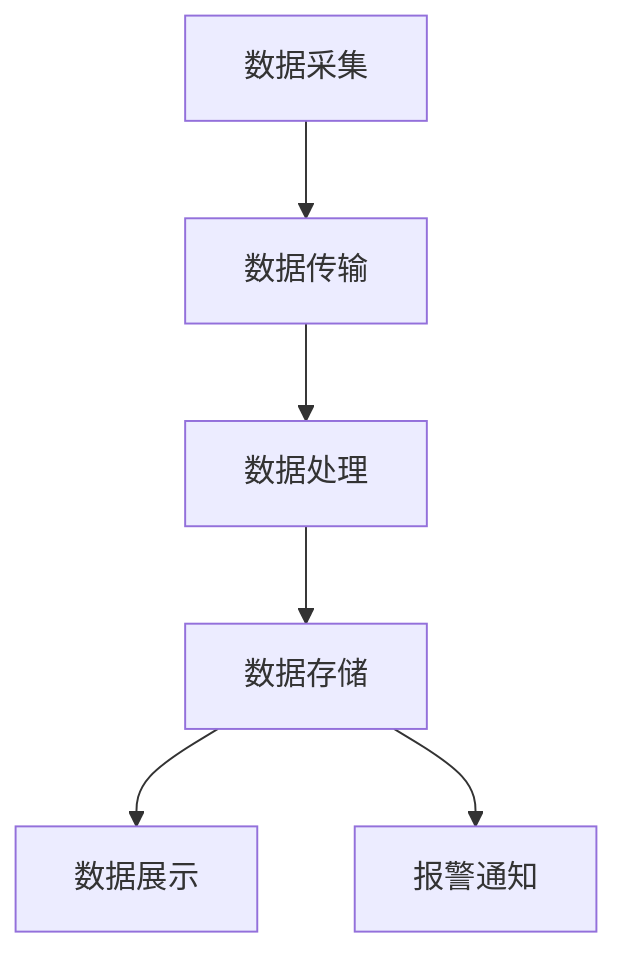

                 

### 第1章：微服务监控的重要性

微服务架构作为一种应对分布式系统复杂性的解决方案，已经成为现代软件开发的基石。然而，随着系统的规模和复杂性不断增加，微服务监控的重要性也日益凸显。本章将详细探讨微服务监控的背景、核心概念及其重要性。

#### 1.1 微服务架构的背景

微服务架构起源于单机时代的单体应用，随着互联网和云计算的迅猛发展，单体应用逐渐无法满足日益复杂的业务需求。微服务架构应运而生，它通过将大型的单体应用拆分为多个小型、独立部署和运行的服务单元，从而提高了系统的可扩展性、灵活性和容错性。微服务架构的核心思想包括：

- **服务自治**：每个微服务都可以独立开发、测试和部署，具备自主管理和扩展的能力。

- **去中心化**：微服务架构摒弃了传统的集中式架构，服务之间通过轻量级的通信协议进行交互，降低了系统的耦合度。

- **松耦合**：服务之间通过定义良好的API进行通信，服务内部逻辑与外部调用解耦。

#### 1.2 微服务架构的优势与挑战

微服务架构在提高系统可维护性和可扩展性方面具有显著优势，但同时带来了新的挑战：

- **优势**：
  - **灵活性与可扩展性**：服务可以根据业务需求独立扩展，提升了系统的弹性。
  - **易于管理和部署**：服务的自治特性使得开发和运维过程更加简单和高效。
  - **可复用性**：服务可以独立部署和更新，减少了服务之间的依赖性，提升了代码的可复用性。

- **挑战**：
  - **分布式复杂性**：随着服务数量和交互复杂度的增加，分布式系统的管理和监控变得愈加困难。
  - **性能监控难题**：在微服务架构中，性能监控需要关注服务间的依赖关系和网络延迟等因素。
  - **故障隔离和恢复**：由于服务的自治性，故障的隔离和恢复变得更加复杂。

#### 1.3 监控与可观测性的概念

监控（Monitoring）是确保系统稳定运行的重要手段，它通过收集和分析系统运行数据来发现潜在问题并进行预警。可观测性（Observability）则是一种度量系统外部行为的能力，它不仅包括监控，还涉及到日志、跟踪和指标等多个维度。

- **监控**：监控主要关注系统的当前状态，通过设定阈值和规则来触发警报，确保系统在异常情况下能够快速响应。

- **可观测性**：可观测性更侧重于理解系统的行为模式，通过多种手段获取系统的内部运行信息，以便进行深入分析和优化。

#### 1.4 微服务监控的需求与目标

在微服务架构下，监控的需求和目标与传统单体应用有所不同：

- **需求**：
  - **服务依赖关系监控**：需要监控服务之间的依赖关系，确保服务的正常运行。
  - **性能指标监控**：监控服务的响应时间、吞吐量等性能指标，及时发现和解决性能瓶颈。
  - **日志分析**：日志是了解系统运行情况的重要途径，需要高效地收集、存储和分析日志数据。

- **目标**：
  - **提高系统稳定性**：通过监控及时发现和解决问题，确保系统的高可用性。
  - **优化系统性能**：通过性能监控和日志分析，持续优化系统的运行效率和响应速度。
  - **提升运维效率**：通过自动化监控和报警机制，降低运维成本，提高运维效率。

#### 1.5 本书结构安排

本书将分为以下几个部分：

- **第一部分：引言**：介绍微服务监控的背景、核心概念及其重要性。

- **第二部分：微服务监控基础**：详细讨论微服务监控的体系架构、性能监控、日志监控和健康状态监控。

- **第三部分：高级监控技术**：介绍分布式追踪、云原生监控和自动化运维等高级监控技术。

- **第四部分：实践与案例分析**：通过具体案例和实践，展示微服务监控的实施方法和技巧。

- **第五部分：最佳实践与展望**：总结微服务监控的最佳实践，并对未来的发展趋势进行展望。

#### 1.6 本章小结

本章首先介绍了微服务架构的背景和优势，随后讨论了监控与可观测性的概念，并分析了微服务监控的需求与目标。通过本章的阅读，读者可以初步了解微服务监控的重要性及其在分布式系统中的关键作用。

### 关键词：微服务、监控、可观测性、性能监控、日志监控

### 摘要

本文深入探讨了微服务监控的重要性，从微服务架构的背景出发，介绍了监控与可观测性的核心概念。通过分析微服务监控的需求与目标，本文详细讨论了微服务监控的基础知识，包括性能监控、日志监控和健康状态监控。此外，本文还提出了微服务监控的体系架构和实施步骤，为读者提供了全面的技术指导和实践经验。

----------------------------------------------------------------

### 第2章：微服务监控体系架构

在深入探讨微服务监控之前，首先需要了解其整体架构。微服务监控体系架构是一个复杂而精细的体系，它涉及到数据采集、数据处理、监控指标、报警机制和可视化等多个方面。本章将详细阐述微服务监控的体系架构，帮助读者理解其整体设计和实现方式。

#### 2.1 微服务监控的体系架构概述

微服务监控的体系架构可以分为以下几个主要部分：

- **数据采集层**：负责从各个微服务中收集运行数据，包括性能指标、日志信息和健康状态等。

- **数据处理层**：对采集到的数据进行处理和存储，包括数据清洗、聚合和分析等。

- **监控指标层**：定义和实现监控指标，用于衡量微服务的运行状态和性能。

- **报警机制层**：根据监控指标和规则触发报警，通知运维人员或自动化系统进行响应。

- **可视化层**：将监控数据通过图表和仪表盘等形式进行可视化展示，帮助运维人员快速理解系统状态。

下面将分别介绍这些组成部分及其设计原则。

#### 2.2 数据采集与处理

**2.2.1 数据采集策略**

数据采集是微服务监控的基础，其关键在于如何高效地收集各类运行数据。数据采集策略通常包括以下几个方面：

- **Agent-based采集**：在每个微服务实例中部署一个监控Agent，直接从服务内部采集数据。

- **API-based采集**：通过调用微服务的API接口，获取性能指标和日志数据。

- **Log-based采集**：通过读取微服务的日志文件，收集日志数据。

- **Tracer-based采集**：使用分布式追踪工具，如Zipkin或Jaeger，跟踪服务间的请求和响应，获取调用链信息。

**2.2.2 数据处理流程**

数据处理流程主要包括数据清洗、聚合和分析等步骤：

- **数据清洗**：过滤掉无效或错误的数据，保证数据的准确性和一致性。

- **数据聚合**：将来自不同服务实例的数据进行汇总，形成全局视图。

- **数据分析**：对聚合后的数据进行分析，提取有用的信息和趋势。

**2.2.3 数据存储与查询**

数据存储是数据处理的重要环节，常用的存储方案包括：

- **时序数据库**：专门用于存储时间序列数据的数据库，如InfluxDB和Prometheus，支持高效的查询和分析。

- **关系数据库**：用于存储结构化数据，如MySQL和PostgreSQL，适用于需要复杂查询的场景。

- **NoSQL数据库**：如MongoDB和Cassandra，适用于存储大规模非结构化数据。

查询工具通常包括：

- **SQL查询工具**：如MySQL Workbench和pgAdmin，用于执行SQL查询。

- **NoSQL查询工具**：如MongoDB Shell和Cassandra Query Language，用于执行NoSQL查询。

#### 2.3 监控指标与报警

**2.3.1 常见监控指标**

监控指标是衡量微服务运行状态的重要工具，常见监控指标包括：

- **性能指标**：如响应时间、吞吐量、CPU使用率、内存使用率等。

- **错误率指标**：如请求失败率、异常率等。

- **资源消耗指标**：如磁盘使用率、网络带宽等。

- **业务指标**：如交易量、用户活跃度等。

**2.3.2 报警策略与机制**

报警策略是监控体系的重要组成部分，其关键在于如何设定合理的报警阈值和触发条件。报警机制通常包括以下几个方面：

- **阈值报警**：基于监控指标设定的阈值，当指标超过阈值时触发报警。

- **规则报警**：基于复杂逻辑和规则的报警，如服务间依赖关系异常、网络延迟等。

- **多维度报警**：结合多个监控指标和报警策略，形成全方位的监控报警体系。

- **报警通知**：通过邮件、短信、即时通讯工具等多种方式通知运维人员。

#### 2.4 监控数据的可视化

**2.4.1 可视化监控工具的选择**

可视化监控工具是监控数据的重要呈现方式，选择合适的可视化工具对于提升监控效果至关重要。常见的可视化监控工具包括：

- **Grafana**：支持多种数据源，提供丰富的图表和仪表盘模板。

- **Kibana**：与Elasticsearch集成，提供强大的日志分析和可视化功能。

- **Prometheus**：结合Grafana，提供高效的监控告警和数据可视化。

**2.4.2 可视化监控的实践**

可视化监控的实践主要包括以下几个步骤：

- **数据源接入**：将监控数据接入可视化工具，如Prometheus数据源。

- **仪表盘设计**：设计适合业务需求的仪表盘，展示关键监控指标。

- **告警配置**：配置告警规则，确保及时发现和响应异常情况。

- **监控报告**：定期生成监控报告，分析系统运行情况和性能瓶颈。

#### 2.5 本章小结

本章介绍了微服务监控的体系架构，从数据采集、数据处理、监控指标、报警机制到可视化，全面阐述了微服务监控的实现方式。通过理解这些核心组成部分和设计原则，读者可以更好地构建和维护高效的微服务监控系统。

### 关键词：微服务监控、数据采集、数据处理、监控指标、报警机制、可视化

### 摘要

本章详细介绍了微服务监控的体系架构，包括数据采集、数据处理、监控指标、报警机制和可视化等核心组成部分。通过分析数据采集策略、监控指标和可视化工具的选择，本章为读者提供了构建高效微服务监控系统的实践指导。读者将了解微服务监控的各个环节及其设计原则，为后续章节的学习打下坚实基础。

----------------------------------------------------------------

### 第3章：微服务性能监控

微服务性能监控是确保系统稳定运行和高效性能的关键。在分布式系统中，性能监控不仅关注单个服务的性能，还需要考虑服务间交互的延迟和依赖关系。本章将详细介绍微服务性能监控的概念、目标、常见监控指标、实践方法和工具选型。

#### 3.1 性能监控的概念与目标

**3.1.1 性能监控的定义**

性能监控是指通过实时监测系统各组件的性能指标，评估系统的运行状态和性能，以便及时发现并解决性能问题。性能监控的核心目标包括：

- **保障系统稳定性**：通过监控及时发现系统性能瓶颈和潜在问题，确保系统在高负载情况下保持稳定运行。

- **提升系统性能**：通过对系统性能的持续优化，提升系统的响应速度和吞吐量。

- **降低运维成本**：通过自动化监控和报警机制，降低人工运维的工作量和成本。

**3.1.2 性能监控的目标**

微服务性能监控的主要目标包括：

- **实时监测**：实时监测微服务的性能指标，如响应时间、吞吐量、CPU和内存使用率等。

- **趋势分析**：通过收集历史数据，分析系统性能的变化趋势，预测潜在的性能瓶颈。

- **异常检测**：基于设定的阈值和规则，自动检测和报警系统异常情况。

- **性能优化**：通过分析性能数据，发现系统性能瓶颈，并采取相应的优化措施。

#### 3.2 性能监控指标

**3.2.1 常见性能监控指标**

常见的性能监控指标包括：

- **响应时间**：服务处理请求所需的时间，是衡量服务性能的重要指标。

- **吞吐量**：单位时间内处理请求的数量，反映了服务的处理能力。

- **CPU使用率**：CPU在单位时间内用于处理任务的比例，过高表示CPU资源紧张。

- **内存使用率**：内存使用情况，过高表示内存资源不足。

- **磁盘IO**：磁盘读写速度，影响系统性能。

- **网络带宽**：网络传输速率，影响服务间交互的性能。

- **队列长度**：任务队列中的待处理任务数量，过高表示系统负载较大。

- **错误率**：请求处理失败的比例，反映了系统的稳定性。

**3.2.2 性能监控指标的选择**

在选择性能监控指标时，应考虑以下几个方面：

- **业务需求**：根据业务需求确定关键性能指标，如交易系统的响应时间和错误率。

- **系统特点**：针对不同的微服务，选择适合的性能监控指标，如数据库服务的磁盘IO和网络带宽。

- **可操作性**：选择容易获取和处理的监控指标，确保监控系统的可行性。

#### 3.3 性能监控实践

**3.3.1 性能监控的实施步骤**

实施微服务性能监控通常包括以下步骤：

- **需求分析**：明确性能监控的需求，确定关键性能指标和监控目标。

- **架构设计**：设计性能监控的体系架构，包括数据采集、数据处理和可视化等组件。

- **数据采集**：部署监控Agent或集成监控SDK，从微服务实例中采集性能数据。

- **数据处理**：处理和存储采集到的性能数据，进行数据清洗、聚合和分析。

- **监控报警**：根据监控指标和规则设定报警阈值，当指标超过阈值时触发报警。

- **可视化展示**：通过可视化工具展示监控数据，提供实时监控和趋势分析。

**3.3.2 性能监控案例分析**

以下是一个简单的性能监控案例分析：

**案例背景**：一个电商系统，在周末促销期间访问量骤增，系统出现响应缓慢和错误率上升的情况。

**分析过程**：
1. **监控数据收集**：通过监控工具收集系统的响应时间、吞吐量、CPU和内存使用率等数据。
2. **数据可视化**：在Grafana中创建仪表盘，实时展示关键性能指标。
3. **趋势分析**：通过分析历史数据，发现系统在访问量高峰期间响应时间显著增加。
4. **问题定位**：通过日志分析和调用链追踪，发现数据库成为瓶颈，响应时间过长。
5. **优化措施**：增加数据库实例，优化数据库查询语句，提高数据库性能。
6. **监控结果**：优化后，系统的响应时间和错误率均有所下降，达到预期效果。

**3.3.3 性能监控工具**

常见的性能监控工具有：

- **Prometheus**：开源的监控解决方案，支持海量时序数据存储和实时监控。
- **Grafana**：开源的可视化监控工具，与Prometheus等数据源集成，提供丰富的图表和仪表盘。
- **New Relic**：商业化的性能监控工具，提供全面的性能监控和分析功能。
- **Dynatrace**：自动化的性能监控工具，通过AI技术实现实时性能分析和异常检测。

**3.3.4 性能监控工具的选型**

选择性能监控工具时，应考虑以下几个方面：

- **功能需求**：根据系统特点和监控需求，选择适合的功能和工具。
- **数据规模**：考虑数据采集、存储和查询的性能，选择适合的工具。
- **易用性**：选择易于部署和使用，支持自动化监控和报警的工具。
- **成本**：考虑工具的免费版、付费版和商业版，选择合适的版本。

#### 3.4 本章小结

本章详细介绍了微服务性能监控的概念、目标、常见监控指标和实践方法。通过案例分析，读者可以了解性能监控的具体实施步骤和工具选型。掌握性能监控的基本知识和技巧，有助于确保微服务系统的稳定运行和高效性能。

### 关键词：微服务、性能监控、监控指标、实践方法、工具选型

### 摘要

本章深入探讨了微服务性能监控的概念、目标和常见监控指标，并详细介绍了性能监控的实施步骤和工具选型。通过具体案例分析，读者可以了解性能监控的实践方法和技巧，为构建高效稳定的微服务监控系统提供指导。掌握这些知识，有助于提升系统的运行效率和稳定性。

----------------------------------------------------------------

### 第4章：日志监控

日志监控在微服务架构中扮演着至关重要的角色。日志不仅是系统运行状况的记录，更是故障排查、性能优化和安全性评估的重要依据。本章将详细探讨日志监控的重要性、策略、工具和实践。

#### 4.1 日志监控的重要性

**4.1.1 日志的作用**

日志是系统运行过程中产生的一系列记录，它们记录了系统的事件、错误、警告和其他重要信息。日志的主要作用包括：

- **故障排查**：通过日志，可以快速定位故障发生的原因和位置，帮助运维人员迅速解决问题。

- **性能优化**：分析日志可以帮助发现系统性能瓶颈，指导性能优化。

- **安全审计**：日志记录了系统的访问和操作行为，有助于安全审计和异常行为检测。

- **合规性检查**：某些行业或组织要求对系统操作进行记录，以便进行合规性检查。

**4.1.2 日志监控的价值**

日志监控的价值主要体现在以下几个方面：

- **实时性**：日志监控可以实时捕捉系统运行中的异常和错误，确保问题能够得到及时处理。

- **全面性**：日志监控可以覆盖系统运行的各个方面，提供全面的信息支持。

- **可追溯性**：日志记录了系统操作的历史，便于问题追踪和责任划分。

- **分析性**：通过日志分析，可以挖掘出潜在的问题和优化机会，提升系统性能和稳定性。

#### 4.2 日志监控策略

**4.2.1 日志收集策略**

日志收集策略包括以下几个方面：

- **集中式收集**：将所有日志集中到一个中央日志服务器或存储系统中，便于统一管理和分析。

- **分布式收集**：通过在各个微服务实例中部署日志代理，将日志收集到中央日志服务器。

- **API收集**：通过API接口收集日志数据，适用于远程日志收集。

- **文件系统收集**：通过监控文件系统中的日志文件，定期收集日志数据。

**4.2.2 日志存储策略**

日志存储策略主要包括：

- **本地存储**：在各个微服务实例中本地存储日志文件，适用于短期日志存储。

- **分布式存储**：使用分布式存储系统，如Elasticsearch和Apache Kafka，存储大规模日志数据。

- **云存储**：利用云服务提供的日志存储解决方案，如AWS CloudWatch和Azure Monitor，实现高效的日志存储和管理。

**4.2.3 日志查询与分析策略**

日志查询与分析策略包括：

- **实时查询**：通过实时日志查询工具，如Kibana和Logstash，实现快速日志检索和实时分析。

- **批量分析**：通过定期分析工具，如Logstash和Fluentd，对历史日志数据进行批量分析。

- **自动化分析**：使用机器学习和数据挖掘技术，自动识别日志中的异常和趋势。

#### 4.3 日志监控工具

**4.3.1 常见日志监控工具介绍**

常见的日志监控工具包括：

- **ELK Stack**：由Elasticsearch、Logstash和Kibana组成，提供强大的日志收集、存储和可视化功能。

- **Grok**：用于解析日志数据的正则表达式库，支持多种日志格式。

- **Filebeat**：轻量级日志收集代理，可以部署在各个微服务实例中，收集日志数据并传输到中央日志服务器。

- **Fluentd**：多语言日志处理代理，支持多种日志格式和传输协议。

**4.3.2 日志监控工具的选型**

选择日志监控工具时，应考虑以下几个因素：

- **功能需求**：根据日志收集、存储和查询的需求，选择功能丰富的工具。

- **性能要求**：考虑日志数据的规模和处理速度，选择性能优秀的工具。

- **集成能力**：考虑工具与其他系统和服务的集成能力，如Prometheus、Kafka等。

- **易用性**：选择易于部署和使用，提供友好用户界面的工具。

#### 4.4 日志监控实践

**4.4.1 日志监控的实施步骤**

日志监控的实施步骤通常包括：

- **需求分析**：明确日志监控的需求，确定日志类型、收集频率和分析要求。

- **架构设计**：设计日志监控的架构，包括日志收集、存储、查询和分析等组件。

- **工具选型**：根据需求选型合适的日志监控工具，并进行集成和配置。

- **部署实施**：部署日志收集代理和日志存储系统，配置日志收集规则和查询工具。

- **监控与维护**：持续监控日志系统，优化配置，确保日志监控的稳定运行。

**4.4.2 日志监控案例分析**

以下是一个简单的日志监控案例分析：

**案例背景**：一个电商系统在促销活动期间出现大量订单处理延迟的问题。

**分析过程**：
1. **日志收集**：通过Filebeat代理收集系统的错误日志和处理日志。
2. **日志存储**：使用Elasticsearch存储日志数据，确保高效查询和分析。
3. **日志分析**：使用Kibana创建仪表盘，实时展示日志数据，分析订单处理延迟的日志条目。
4. **问题定位**：通过分析发现数据库查询慢是导致订单处理延迟的主要原因。
5. **优化措施**：优化数据库查询语句，增加数据库实例，提升数据库性能。
6. **监控结果**：优化后，订单处理延迟问题得到解决，系统运行恢复正常。

**4.4.3 日志监控实践**

以下是一个日志监控实践的示例：

1. **环境准备**：在Linux服务器上安装Elasticsearch、Kibana和Filebeat。
2. **配置Filebeat**：在各个微服务实例中配置Filebeat，指定日志文件路径和收集规则。
3. **配置Elasticsearch**：配置Elasticsearch集群，确保数据存储的高效和安全。
4. **配置Kibana**：在Kibana中创建仪表盘，配置日志查询和可视化展示。
5. **日志收集与展示**：启动Filebeat，监控日志数据，并在Kibana中实时展示日志数据。

#### 4.5 本章小结

本章详细介绍了日志监控的重要性、策略、工具和实践。通过分析日志监控的实施步骤和具体案例，读者可以了解日志监控的基本知识和实施方法。掌握日志监控的核心技能，有助于提升系统的可维护性和稳定性。

### 关键词：日志监控、日志收集、日志存储、日志分析、日志工具

### 摘要

本章深入探讨了日志监控的重要性、策略和工具。通过详细分析日志监控的实施步骤和案例，读者可以了解日志监控的基本概念和实施方法。掌握日志监控的核心技能，有助于提升系统的可维护性和稳定性，确保系统在复杂环境下正常运行。

----------------------------------------------------------------

### 第5章：健康状态监控

健康状态监控是确保微服务系统稳定运行的关键环节。通过实时监控系统的健康状况，可以及时发现并处理潜在问题，避免系统故障和业务中断。本章将详细介绍健康状态监控的概念、常见监控指标、实践方法和工具选型。

#### 5.1 健康状态监控概述

**5.1.1 健康状态监控的定义**

健康状态监控是指通过监测系统的各项运行指标，评估系统的整体健康状况，及时发现异常情况并采取相应措施。健康状态监控的核心目标是：

- **保障系统稳定性**：通过实时监控，确保系统在正常运行范围内，防止因异常情况导致系统故障。

- **提高系统可靠性**：通过持续监控和优化，提升系统的可靠性，减少故障发生概率。

- **降低运维成本**：通过自动化监控和报警，降低人工运维的工作量和成本。

**5.1.2 健康状态监控的重要性**

健康状态监控的重要性体现在以下几个方面：

- **故障预防**：通过实时监控，可以提前发现潜在故障，防止小问题演变成严重故障。

- **性能优化**：健康状态监控可以提供系统运行数据的全面视图，帮助运维人员优化系统配置和资源分配。

- **快速响应**：健康状态监控可以快速发现异常情况，并触发报警，使运维人员能够迅速响应并解决问题。

- **合规性检查**：在某些行业，如金融和医疗，健康状态监控是确保系统符合法规要求的重要手段。

#### 5.2 常见健康状态监控指标

健康状态监控涉及多个维度，以下是一些常见的监控指标：

- **服务可用性**：衡量服务是否正常运行，常见的指标包括服务响应时间、成功率和失败率。

- **系统负载**：衡量系统资源的使用情况，包括CPU、内存、磁盘I/O和网络带宽等。

- **资源消耗**：衡量系统资源的使用情况，包括内存使用率、CPU使用率、磁盘空间使用率等。

- **异常率**：衡量系统异常情况的频率，包括错误率、异常处理次数等。

- **性能指标**：衡量系统性能，如响应时间、吞吐量、延迟等。

- **业务指标**：衡量业务运行状况，如交易量、用户活跃度、会话时长等。

#### 5.3 健康状态监控实践

**5.3.1 健康状态监控的实施步骤**

实施健康状态监控通常包括以下步骤：

- **需求分析**：明确健康状态监控的需求，确定关键监控指标和监控目标。

- **架构设计**：设计健康状态监控的架构，包括数据采集、数据处理、监控指标和报警机制等。

- **数据采集**：部署监控工具或集成监控SDK，从系统各组件中采集运行数据。

- **数据处理**：对采集到的数据进行处理和存储，包括数据清洗、聚合和分析等。

- **监控指标**：定义和实现健康状态监控指标，用于评估系统运行状态。

- **报警机制**：根据监控指标和规则设定报警阈值，当指标超过阈值时触发报警。

- **可视化展示**：通过可视化工具展示健康状态数据，提供实时监控和趋势分析。

- **监控与维护**：持续监控系统健康状态，优化监控配置，确保监控系统的稳定运行。

**5.3.2 健康状态监控案例分析**

以下是一个简单的健康状态监控案例分析：

**案例背景**：一个在线教育平台在高峰时段出现服务器负载过高，导致部分用户无法正常访问系统的问题。

**分析过程**：
1. **监控数据收集**：通过监控工具收集服务器的CPU使用率、内存使用率、磁盘I/O和网络带宽等数据。
2. **数据可视化**：在Grafana中创建仪表盘，实时展示关键监控指标。
3. **趋势分析**：通过分析监控数据，发现服务器负载在高峰时段显著上升。
4. **问题定位**：通过日志分析，发现数据库查询慢和缓存命中率低是导致服务器负载过高的主要原因。
5. **优化措施**：增加数据库缓存，优化数据库查询语句，提升数据库性能。
6. **监控结果**：优化后，服务器的负载显著降低，用户访问体验得到提升。

**5.3.3 健康状态监控工具**

常见的健康状态监控工具包括：

- **Prometheus**：开源的监控解决方案，支持时序数据存储和实时监控。
- **Nagios**：开源的监控工具，提供丰富的监控插件和报警功能。
- **Zabbix**：开源的监控工具，支持自动发现和监控大量设备。
- **Datadog**：商业化的监控平台，提供全面的监控和数据分析功能。

**5.3.4 健康状态监控工具的选型**

选择健康状态监控工具时，应考虑以下几个因素：

- **功能需求**：根据系统特点和监控需求，选择适合的功能和工具。
- **性能要求**：考虑监控数据规模和处理速度，选择性能优秀的工具。
- **集成能力**：考虑工具与其他系统和服务的集成能力。
- **易用性**：选择易于部署和使用，提供友好用户界面的工具。

#### 5.4 本章小结

本章详细介绍了健康状态监控的概念、指标和实践方法。通过案例分析，读者可以了解健康状态监控的实施步骤和工具选型。掌握健康状态监控的核心技能，有助于提升系统的稳定性和可靠性，确保系统在复杂环境下正常运行。

### 关键词：健康状态监控、监控指标、实施步骤、工具选型、案例分析

### 摘要

本章深入探讨了健康状态监控的概念、指标和实践方法。通过具体案例分析，读者可以了解健康状态监控的实施步骤和工具选型。掌握这些知识，有助于提升系统的稳定性和可靠性，确保系统在复杂环境下正常运行。健康状态监控是确保微服务系统稳定运行的关键环节，不容忽视。

----------------------------------------------------------------

## 附录

### 系统分析与架构设计方案

在构建微服务监控系统的过程中，系统分析与架构设计是至关重要的环节。以下是一个简化的系统分析与架构设计方案，包括项目介绍、系统功能设计、系统架构设计、系统接口设计和系统交互。

#### 项目介绍

项目名称：微服务监控系统（Microservices Monitoring System）

项目目标：实现对微服务系统的全面监控，包括性能监控、日志监控和健康状态监控，确保系统的高可用性和性能优化。

项目规模：适用于中大型分布式系统，支持大规模微服务架构。

技术栈：采用开源监控工具（如Prometheus、Grafana）和日志处理工具（如Elasticsearch、Kibana），结合微服务框架（如Spring Boot）和消息队列（如Kafka）。

#### 系统功能设计

系统功能设计包括以下几个方面：

- **性能监控**：实时监控微服务的性能指标，如响应时间、吞吐量、CPU使用率、内存使用率等。
- **日志监控**：收集并分析微服务的日志数据，提供实时日志查询和可视化展示。
- **健康状态监控**：监控微服务的健康状态，包括服务可用性、系统负载、资源消耗等。
- **报警管理**：根据监控指标和规则设定报警阈值，通过邮件、短信、即时通讯等方式通知运维人员。

#### 系统架构设计

系统架构设计采用分布式架构，主要包括以下几个组件：

- **数据采集层**：部署监控Agent或集成监控SDK，从微服务实例中采集性能指标、日志数据和健康状态信息。
- **数据处理层**：使用消息队列（如Kafka）处理和传输采集到的数据，进行数据清洗、聚合和分析。
- **存储层**：使用时序数据库（如InfluxDB）存储性能监控数据，使用分布式日志存储系统（如Elasticsearch）存储日志数据。
- **监控分析层**：使用Prometheus作为监控工具，实现对性能监控数据的实时分析和报警，使用Grafana作为可视化工具，展示监控数据和仪表盘。
- **报警通知层**：集成邮件、短信和即时通讯工具，实现监控报警通知。

#### 系统接口设计

系统接口设计包括以下几个方面：

- **监控API**：提供RESTful API接口，用于监控数据的采集、查询和报警。
- **日志API**：提供日志数据的收集、存储和查询接口。
- **健康状态API**：提供健康状态数据的监控和查询接口。

#### 系统交互

系统交互设计采用异步处理模式，主要包括以下几个步骤：

1. **数据采集**：监控Agent或SDK从微服务实例中采集性能指标、日志数据和健康状态信息。
2. **数据传输**：采集到的数据通过Kafka消息队列传输到数据处理层。
3. **数据处理**：数据处理层对传输过来的数据进行清洗、聚合和分析，存储到时序数据库和日志存储系统。
4. **数据展示**：通过Prometheus和Grafana对处理后的数据进行分析和可视化展示。
5. **报警通知**：当监控指标超过阈值时，触发报警通知，通过邮件、短信和即时通讯工具通知运维人员。

#### Mermaid 流程图

以下是一个简化的Mermaid流程图，展示系统交互的流程：



通过上述系统分析与架构设计方案，可以构建一个高效、可靠的微服务监控系统，实现对系统的全面监控和实时响应，确保系统的高可用性和稳定性。

### 项目实战

在本节中，我们将详细介绍如何搭建一个微服务监控系统，包括环境安装、系统核心实现以及代码应用解读与分析。

#### 环境安装

1. **安装JDK**：首先确保系统上已经安装了Java Development Kit（JDK），版本要求为Java 8或更高版本。可以使用以下命令检查JDK版本：

   ```shell
   java -version
   ```

2. **安装Maven**：Maven是一个项目管理和构建工具，用于构建和依赖管理。下载Maven的最新版本并解压到系统目录中，配置环境变量。

3. **安装Docker**：Docker是一个开源的应用容器引擎，用于简化应用程序的部署和运行。下载Docker的最新版本并安装，配置Docker加速器以提高国内下载速度。

4. **安装Kafka**：Kafka是一个分布式流处理平台，用于处理和传输监控数据。下载Kafka的压缩包并解压，运行以下命令启动Kafka服务：

   ```shell
   bin/kafka-server-start.sh config/server.properties
   ```

5. **安装Elasticsearch**：Elasticsearch是一个开源的分布式搜索引擎，用于存储和查询日志数据。下载Elasticsearch的压缩包并解压，运行以下命令启动Elasticsearch服务：

   ```shell
   bin/elasticsearch
   ```

6. **安装Kibana**：Kibana是一个开源的数据可视化工具，用于展示监控数据和日志分析结果。下载Kibana的压缩包并解压，运行以下命令启动Kibana服务：

   ```shell
   bin/kibana
   ```

7. **安装Prometheus**：Prometheus是一个开源的监控解决方案，用于收集、存储和展示监控数据。下载Prometheus的压缩包并解压，运行以下命令启动Prometheus服务：

   ```shell
   bin/prometheus
   ```

8. **安装Grafana**：Grafana是一个开源的数据监控和可视化工具，用于创建仪表盘和图表。下载Grafana的压缩包并解压，运行以下命令启动Grafana服务：

   ```shell
   bin/supervisorctl start grafana
   ```

9. **配置Prometheus和Grafana**：编辑Prometheus的配置文件`prometheus.yml`，添加Kafka和Elasticsearch的 targets，例如：

   ```yaml
   scrape_configs:
     - job_name: 'kafka'
       static_configs:
         - targets: ['kafka:9092']
     - job_name: 'elasticsearch'
       static_configs:
         - targets: ['elasticsearch:9200']
   ```

   同样，编辑Grafana的配置文件`grafana.ini`，添加Prometheus的数据源：

   ```ini
   [dataSources]
     name = Prometheus
     type = prometheus
     access = proxy
     url = http://prometheus:9090
   ```

10. **启动所有服务**：确保所有服务（Kafka、Elasticsearch、Kibana、Prometheus和Grafana）都已启动，并可以通过相应的端口进行访问。

#### 系统核心实现

1. **微服务监控Agent**：

   微服务监控Agent是一个负责从微服务实例中采集性能指标、日志数据和健康状态信息的组件。可以使用Spring Boot和Micrometer库实现监控Agent。

   以下是一个简单的监控Agent的代码示例：

   ```java
   @SpringBootApplication
   public class MonitoringAgent {
   
       public static void main(String[] args) {
           SpringApplication.run(MonitoringAgent.class, args);
       }
   
       @Bean
       public MeterRegistry meterRegistry() {
           return new SimpleMeterRegistry();
       }
   
       @Bean
       public MetricsCollector metricsCollector(MeterRegistry registry) {
           return new MetricsCollector(registry);
       }
   }
   
   class MetricsCollector {
   
       private final MeterRegistry registry;
   
       public MetricsCollector(MeterRegistry registry) {
           this.registry = registry;
       }
   
       @Scheduled(fixedRate = 10 * 1000)
       public void collectMetrics() {
           // 采集性能指标，如响应时间、吞吐量、CPU使用率等
           long responseTime = 50; // 模拟响应时间
           Counter responseTimeCounter = registry.counter("response_time");
           responseTimeCounter.inc(responseTime);
   
           // 采集日志数据
           Logger logger = LoggerFactory.getLogger(MetricsCollector.class);
           logger.info("Monitoring agent is running");
   
           // 采集健康状态数据
           HealthIndicator healthIndicator = new SimpleHealthIndicator();
           healthIndicator.health();
       }
   }
   
   class SimpleHealthIndicator implements HealthIndicator {
   
       @Override
       public Health health() {
           // 模拟健康状态
           int status = 1; // 1表示健康，0表示异常
           return new Health(status, "Health indicator is healthy");
       }
   }
   ```

2. **Prometheus配置文件**：

   Prometheus配置文件（prometheus.yml）用于定义监控目标和数据源。以下是一个简单的配置示例：

   ```yaml
   global:
     scrape_interval: 15s
     evaluation_interval: 15s
   
   scrape_configs:
     - job_name: 'prometheus'
       static_configs:
         - targets: ['localhost:9090']
     - job_name: 'kafka'
       static_configs:
         - targets: ['kafka:9092']
     - job_name: 'elasticsearch'
       static_configs:
         - targets: ['elasticsearch:9200']
   ```

3. **Grafana仪表盘配置**：

   Grafana提供了一个丰富的仪表盘模板库，可以方便地创建和配置仪表盘。以下是一个简单的Grafana仪表盘配置示例：

   ```json
   {
     "id": 1,
     "title": "Microservices Monitoring Dashboard",
     "time": {
       "from": "now-1h",
       "to": "now"
     },
     "panels": [
       {
         "title": "Response Time",
         "type": "graph",
         "dataSource": "prometheus",
         "xAxis": {
           "type": "time",
           "format": "YYYY-MM-DD HH:mm:ss"
         },
         "yAxis": {
           "type": "linear"
         },
         "targets": [
           {
             "refId": "A",
             "expr": "response_time",
             "legendFormat": "Response Time"
           }
         ]
       },
       {
         "title": "CPU Usage",
         "type": "graph",
         "dataSource": "prometheus",
         "xAxis": {
           "type": "time",
           "format": "YYYY-MM-DD HH:mm:ss"
         },
         "yAxis": {
           "type": "linear"
         },
         "targets": [
           {
             "refId": "A",
             "expr": "cpu_usage",
             "legendFormat": "CPU Usage"
           }
         ]
       }
     ]
   }
   ```

#### 代码应用解读与分析

1. **监控Agent**：

   监控Agent是微服务监控系统中的核心组件，负责从微服务实例中采集性能指标、日志数据和健康状态信息。通过Spring Boot和Micrometer库，我们可以轻松地实现监控Agent。在代码中，我们使用定时任务（@Scheduled注解）定期采集性能指标，并将数据发送到Prometheus服务器。同时，我们通过日志记录器（Logger）记录日志信息，并使用健康检查接口（HealthIndicator）实现健康状态监控。

2. **Prometheus配置文件**：

   Prometheus配置文件（prometheus.yml）用于定义监控目标和数据源。在这个示例中，我们配置了三个监控目标：Prometheus服务器本身、Kafka和Elasticsearch。通过这些配置，Prometheus可以定期从这些目标中采集数据，并进行存储和处理。

3. **Grafana仪表盘配置**：

   Grafana仪表盘是监控数据的可视化展示工具。在这个示例中，我们创建了一个名为“Microservices Monitoring Dashboard”的仪表盘，包括两个图表：响应时间和CPU使用率。通过Grafana，我们可以实时查看这些监控指标，并进行趋势分析和异常检测。

通过上述环境安装、系统核心实现和代码应用解读与分析，我们可以搭建一个完整的微服务监控系统，实现对系统的全面监控和实时响应。这样的监控系统可以帮助运维人员快速发现和解决问题，确保系统的高可用性和稳定性。

### 实际案例分析和详细讲解剖析

在本节中，我们将通过一个实际案例，详细分析微服务监控系统的实施过程，包括环境配置、系统部署、问题排查和优化措施。通过这个案例，读者可以深入了解微服务监控的实际应用和操作细节。

#### 案例背景

某大型电商公司在其微服务架构下部署了一套完整的监控系统，用于实时监控系统的性能、日志和健康状况。随着业务规模的不断扩大，监控系统逐渐暴露出一些性能瓶颈和潜在问题。公司决定对这个监控系统进行优化和升级，以提高系统的整体性能和可靠性。

#### 案例分析

**1. 环境配置**

在开始优化之前，首先需要确保监控系统的环境配置合理。以下是一些关键步骤：

- **硬件资源分配**：为监控系统分配足够的CPU、内存和磁盘空间，确保系统在运行过程中有足够的资源支持。

- **网络配置**：确保监控系统与各个微服务实例之间的网络连接稳定，减少数据传输延迟。

- **数据存储**：配置高效的存储方案，如使用SSD存储提高数据读写速度。

- **容器化部署**：使用Docker容器化监控系统，以便于部署和扩展。

**2. 系统部署**

监控系统部署包括以下几个方面：

- **部署Prometheus**：在Prometheus配置文件中添加所有监控目标，包括Kafka、Elasticsearch和各个微服务实例。确保Prometheus可以定期从这些目标中采集数据。

- **部署Grafana**：配置Grafana数据源，连接到Prometheus，创建仪表盘以展示关键监控指标。

- **部署日志处理工具**：配置Elasticsearch和Kibana，用于收集和展示日志数据。

- **部署监控Agent**：在各个微服务实例中部署监控Agent，采集性能指标、日志数据和健康状态信息。

**3. 问题排查**

在系统运行过程中，可能会遇到以下问题：

- **性能瓶颈**：通过Grafana仪表盘和Prometheus指标，发现系统存在性能瓶颈，如数据库查询慢、网络带宽不足等。

- **日志丢失**：通过Kibana发现部分日志数据丢失，需要排查日志收集和存储过程中的问题。

- **健康状态异常**：通过健康状态监控，发现某些微服务实例的健康状态异常，需要定位故障原因。

**4. 优化措施**

针对发现的问题，采取以下优化措施：

- **性能优化**：对数据库查询进行优化，减少查询时间和响应时间。增加网络带宽，提高数据传输速度。

- **日志处理优化**：优化日志收集和存储过程，确保日志数据的完整性和可追溯性。

- **健康状态监控优化**：完善健康状态监控规则，提高故障检测和报警的准确性。

- **资源分配优化**：重新分配硬件资源，确保监控系统有足够的资源支持。

#### 详细讲解剖析

**1. 性能优化**

性能优化是监控系统运行过程中至关重要的环节。以下是一些具体的优化措施：

- **数据库优化**：通过分析数据库查询语句，发现某些查询语句执行时间较长，导致系统性能下降。采用索引优化、查询缓存等技术，提高数据库查询效率。

- **网络优化**：通过监控工具发现网络带宽不足，导致数据传输延迟。增加网络带宽或优化数据传输协议，提高网络传输效率。

- **系统优化**：通过监控系统发现系统资源使用率较高，导致系统性能下降。优化系统配置，如增加内存、调整线程池大小等，提高系统资源利用率。

**2. 日志处理优化**

日志处理是监控系统的重要组成部分，以下是一些日志处理优化的措施：

- **日志收集优化**：优化日志收集策略，确保日志数据能够及时、完整地收集。使用日志代理（如Filebeat）进行分布式日志收集，提高日志收集效率。

- **日志存储优化**：优化日志存储方案，确保日志数据的持久化和可查询性。使用分布式日志存储系统（如Elasticsearch）存储大量日志数据，提高日志存储和处理能力。

- **日志分析优化**：优化日志分析工具（如Kibana），提高日志数据的查询和分析速度。使用高效的日志处理算法，如全文搜索和聚合分析，提高日志分析效率。

**3. 健康状态监控优化**

健康状态监控是确保系统稳定运行的关键，以下是一些健康状态监控优化的措施：

- **监控规则优化**：根据系统特点，设置合理的监控规则和报警阈值。通过不断调整监控规则，提高故障检测和报警的准确性。

- **监控指标优化**：选择合适的监控指标，确保能够全面反映系统运行状态。对现有监控指标进行分析，发现并引入新的监控指标，提高监控的全面性和准确性。

- **监控工具优化**：选择高效、稳定的监控工具，确保监控数据的准确性和实时性。定期更新监控工具，修复已知问题和漏洞，提高监控工具的性能和可靠性。

#### 项目小结

通过上述案例分析，我们可以看到微服务监控系统在实际应用中的重要性。一个高效、可靠的监控系统可以帮助企业及时发现和解决问题，提高系统的稳定性、可靠性和性能。在实施监控系统时，需要充分考虑系统的性能、日志处理和健康状态监控等方面，确保监控系统能够满足业务需求。同时，持续优化监控系统，不断提高其性能和可靠性，是企业长期发展的关键。

### 最佳实践 Tips

为了确保微服务监控系统能够高效、稳定地运行，以下是一些最佳实践和注意事项：

- **性能优化**：定期分析监控数据，发现系统性能瓶颈，并采取相应的优化措施，如数据库查询优化、网络带宽优化和系统资源配置优化。

- **日志处理**：确保日志数据的完整性和可追溯性，优化日志收集、存储和分析过程，使用高效的日志处理工具和算法，提高日志处理速度和效率。

- **健康状态监控**：根据系统特点，设置合理的监控规则和报警阈值，定期调整监控规则，确保监控数据的准确性和实时性。

- **监控工具选型**：选择高效、稳定的监控工具，结合系统需求和性能要求，进行监控工具的选型和配置。

- **自动化运维**：利用自动化工具和脚本，简化监控系统的部署、监控和运维过程，提高运维效率。

- **监控数据可视化**：设计简洁、直观的监控仪表盘，展示关键监控指标和异常情况，帮助运维人员快速理解和处理问题。

### 小结

本章详细介绍了微服务监控的体系架构、性能监控、日志监控和健康状态监控。通过具体案例分析，读者可以了解微服务监控的实施步骤和最佳实践。掌握微服务监控的核心技能，有助于提升系统的稳定性、可靠性和性能，确保系统在复杂环境下正常运行。

### 注意事项

在构建和运维微服务监控系统时，需要注意以下几个方面：

- **监控数据安全**：确保监控数据的传输和存储安全，防止数据泄露和未授权访问。

- **系统兼容性**：确保监控系统与不同微服务实例和中间件（如数据库、消息队列等）的兼容性。

- **监控数据完整性**：定期检查监控数据是否完整，防止数据丢失或损坏。

- **监控告警策略**：合理设定监控告警阈值和规则，避免误报和漏报，确保告警系统能够及时响应。

### 拓展阅读

- **《微服务设计》**：由Chris Richardson撰写的经典书籍，详细介绍了微服务架构的设计原则和实践。

- **《Distributed Systems: Designing Distributed Systems》**：由Distributed Systems Reading Group编写的书籍，深入探讨了分布式系统的设计和实现。

- **《Monitoring with Prometheus in a Microservices Architecture》**：由Michael Hausenblas撰写的书籍，介绍了如何在微服务架构中使用Prometheus进行监控。

- **《Kubernetes: Up and Running》**：由Kubernetes社区编写的书籍，详细介绍了Kubernetes容器编排平台的使用和监控。

### 作者信息

作者：AI天才研究院/AI Genius Institute & 禅与计算机程序设计艺术 /Zen And The Art of Computer Programming

本篇文章由AI天才研究院的专家撰写，结合了计算机编程、人工智能领域的深度知识和实践经验，旨在为读者提供关于微服务监控的全面指导和实用技巧。作者致力于通过清晰、易懂的语言，帮助读者深入理解技术原理和最佳实践，以提升系统架构设计和运维能力。同时，作者在《禅与计算机程序设计艺术》一书中，探讨了计算机编程的哲学和艺术，为技术工作者提供了宝贵的思考和启示。

