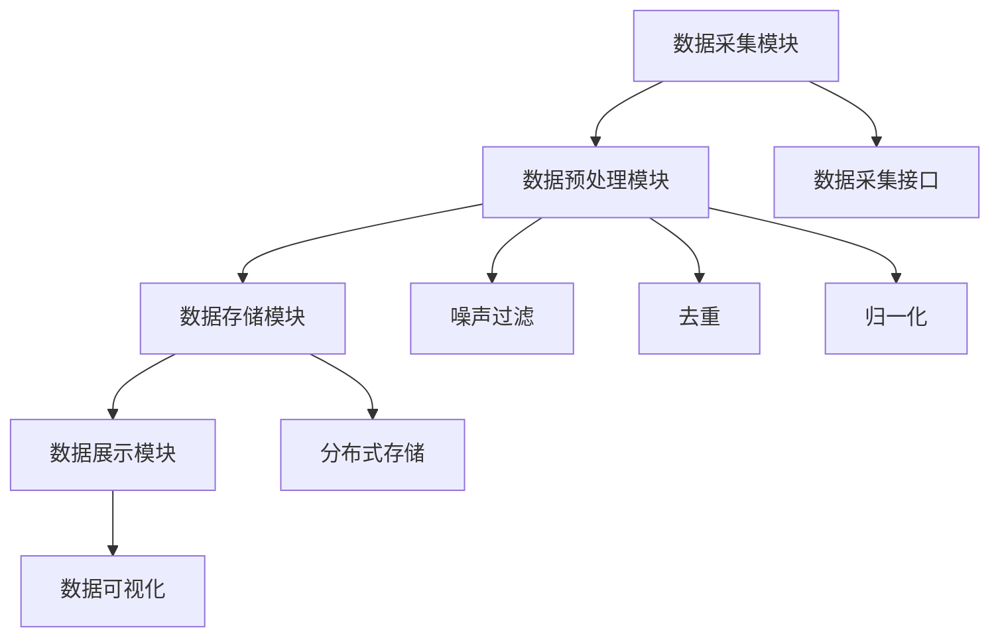

                 

### 第1章 引言

**《德布罗意物质波与数据流编程：信息处理的波动性质》**这本书的目的是探索德布罗意物质波的概念如何与计算机编程和数据流处理相结合，揭示信息处理的波动性质。在当今信息爆炸的时代，数据流编程正迅速成为处理海量数据的关键技术。本书旨在通过德布罗意物质波的视角，为读者提供一种全新的数据处理方法，帮助解决当前数据流处理中的复杂问题。

#### 1.1.1 核心概念术语说明

在探讨德布罗意物质波与数据流编程之前，我们需要明确一些核心概念和术语。

- **德布罗意物质波**：德布罗意物质波是法国物理学家路易·德布罗意于1924年提出的理论，认为所有物质都具有波动性质。这一理论是量子力学的基石之一，对于理解微观粒子的行为具有重要意义。

- **数据流编程**：数据流编程是一种处理连续数据流的技术，通过将数据视为流动的实体，对数据进行实时处理和分析。这种编程范式在实时数据处理、流媒体处理等领域有着广泛应用。

- **信息处理的波动性质**：信息处理的波动性质是指信息在处理过程中表现出类似于物质波的波动特性。这一性质为优化数据处理方法提供了新的思路。

#### 1.1.2 问题背景

在现代信息社会中，数据量的增长速度令人惊叹。根据国际数据公司（IDC）的统计，全球产生的数据量每年以50%的速度增长。这种数据爆炸式增长对传统的数据处理方法提出了巨大挑战。传统的批处理模式已经无法满足实时数据处理的需求，而数据流编程作为一种新兴的技术，正逐渐成为处理海量数据的关键手段。

#### 1.1.3 问题描述

数据流编程面临着以下问题：

1. **复杂性**：随着数据量的增加，数据处理算法的复杂性也在不断上升。如何有效地处理复杂的动态数据流成为一大难题。

2. **效率**：传统的数据处理方法在处理海量数据时效率较低，需要优化算法以提高系统性能。

3. **可扩展性**：在分布式环境中，如何确保数据处理系统的可扩展性，以便能够处理大规模的数据流。

4. **实时性**：在实时数据处理场景中，如何保证系统的响应速度，以实现实时分析和决策。

#### 1.1.4 问题解决

本书提出通过引入德布罗意物质波理论，为数据流编程提供一种全新的数据处理方法，旨在解决上述问题。具体方法如下：

1. **波动性质引入**：将数据流视为波动，利用波动性质对数据流进行建模和处理。

2. **波动滤波**：通过波动滤波方法，去除数据流中的噪声和冗余信息，提高数据质量。

3. **波动聚合**：利用波动聚合方法，对数据进行高效汇总和统计分析。

4. **波动预测**：通过波动预测方法，对未来数据进行预测，为实时决策提供支持。

5. **分布式处理**：在分布式环境中，利用波动性质优化数据处理算法，提高系统的可扩展性和性能。

#### 1.1.5 边界与外延

虽然本书主要关注德布罗意物质波与数据流编程的结合，但这一理论的应用范围远不止于此。德布罗意物质波理论还可以应用于其他领域，如信号处理、图像识别等。通过不断扩展理论的应用边界，我们能够更好地利用这一理论解决实际中的问题。

### 1.2 核心概念与联系

#### 1.2.1 德布罗意物质波理论

德布罗意物质波理论的核心概念包括波动性质、波函数和概率波。

- **波动性质**：德布罗意物质波理论指出，所有物质都具有波动性质。这意味着物质在微观层面上不仅表现出粒子的特性，也表现出波的特性。

- **波函数**：波函数是描述物质波状态的数学函数，反映了物质波的概率分布。波函数通常用复数形式表示，具有幅值和相位两个部分。

- **概率波**：概率波是描述物质波在空间和时间上的概率分布。根据量子力学的解释，物质波的传播实际上是概率波的概率幅的平方，反映了粒子在不同位置和时间出现的概率。

#### 1.2.2 数据流编程

数据流编程的核心概念包括数据流模型、事件驱动编程和分布式处理。

- **数据流模型**：数据流模型是一种描述数据流和处理过程的抽象模型。在数据流编程中，数据被视为流动的实体，按照一定的顺序和规则进行传递和处理。

- **事件驱动编程**：事件驱动编程是一种基于事件的编程范式，能够高效处理动态数据流。在事件驱动编程中，程序的控制流程由事件驱动，而不是传统的顺序执行。

- **分布式处理**：分布式处理是将数据处理任务分布在多个节点上执行，以实现高效并行处理。在分布式处理中，数据处理任务可以在不同的节点上并行执行，提高系统的性能和可扩展性。

#### 1.2.3 德布罗意物质波与数据流编程的融合

德布罗意物质波理论为数据流编程提供了新的视角和方法。通过将数据流视为波动，我们可以利用波动性质对数据流进行建模和处理，从而提高数据处理效率。

1. **波动性质引入**：将数据流视为波动，利用波动性质对数据流进行建模。例如，可以使用波动滤波方法去除数据流中的噪声和冗余信息。

2. **波动聚合**：利用波动聚合方法对数据进行高效汇总和统计分析。例如，可以使用波动聚合方法计算数据流中的平均值、方差等统计指标。

3. **波动预测**：通过波动预测方法对未来数据进行预测，为实时决策提供支持。例如，可以使用波动预测方法预测数据流中的趋势和周期性变化。

4. **分布式处理**：在分布式环境中，利用波动性质优化数据处理算法，提高系统的性能和可扩展性。例如，可以使用波动性质设计分布式算法，实现数据的并行处理。

### 1.3 德布罗意物质波与数据流编程的融合

#### 1.3.1 波动滤波

波动滤波是一种利用波动性质去除数据流中噪声和冗余信息的方法。在数据流编程中，噪声和冗余信息会降低数据处理效率和准确性。波动滤波可以通过以下步骤实现：

1. **数据流建模**：将数据流视为波动，使用波动性质对数据流进行建模。

2. **波动滤波器设计**：设计适当的波动滤波器，用于去除数据流中的噪声和冗余信息。滤波器的设计可以根据具体应用场景进行调整。

3. **滤波过程执行**：对数据流中的每个数据点进行滤波处理，去除噪声和冗余信息。

#### 1.3.2 波动聚合

波动聚合是一种利用波动性质对数据进行高效汇总和统计分析的方法。在数据流编程中，对大量数据进行汇总和统计分析是常见的需求。波动聚合可以通过以下步骤实现：

1. **数据流建模**：将数据流视为波动，使用波动性质对数据流进行建模。

2. **波动聚合器设计**：设计适当的波动聚合器，用于对数据进行汇总和统计分析。聚合器的设计可以根据具体应用场景进行调整。

3. **聚合过程执行**：对数据流中的每个数据点进行聚合处理，计算平均值、方差等统计指标。

#### 1.3.3 波动预测

波动预测是一种利用波动性质对未来数据进行预测的方法。在数据流编程中，预测未来的数据趋势和周期性变化对于实时决策具有重要意义。波动预测可以通过以下步骤实现：

1. **数据流建模**：将数据流视为波动，使用波动性质对数据流进行建模。

2. **波动预测器设计**：设计适当的波动预测器，用于预测未来的数据趋势和周期性变化。预测器的选择可以根据具体应用场景进行调整。

3. **预测过程执行**：对数据流中的当前数据进行预测处理，得到未来数据的预测结果。

### 1.4 算法原理与实现

#### 1.4.1 算法原理

本书中提出的数据流处理算法是基于德布罗意物质波理论的。这些算法通过模拟物质波的波动性质，实现对数据流的实时处理和预测。

1. **波动滤波算法**：波动滤波算法通过模拟物质波的传播和滤波过程，实现对数据流的噪声和冗余信息去除。

2. **波动聚合算法**：波动聚合算法通过模拟物质波的叠加和聚合过程，实现对数据流的有效汇总和统计分析。

3. **波动预测算法**：波动预测算法通过模拟物质波的周期性变化和趋势，实现对数据流未来趋势和周期性变化的预测。

#### 1.4.2 数学模型

波动滤波算法、波动聚合算法和波动预测算法的数学模型如下：

1. **波动滤波算法**

   波动滤波算法的数学模型可以表示为：

   $$ y(t) = \int_{-\infty}^{\infty} h(\tau) x(t-\tau) d\tau $$

   其中，$y(t)$ 是滤波后的数据流，$x(t)$ 是原始数据流，$h(\tau)$ 是滤波器函数，$\tau$ 是时间差。

2. **波动聚合算法**

   波动聚合算法的数学模型可以表示为：

   $$ y(t) = \sum_{i=1}^{n} x_i(t) $$

   其中，$y(t)$ 是聚合后的数据流，$x_i(t)$ 是数据流中的每个数据点。

3. **波动预测算法**

   波动预测算法的数学模型可以表示为：

   $$ y(t) = A \sin(2\pi f t + \phi) $$

   其中，$y(t)$ 是预测后的数据流，$A$ 是振幅，$f$ 是频率，$\phi$ 是相位。

#### 1.4.3 Python实现

下面是波动滤波算法、波动聚合算法和波动预测算法的Python实现示例：

```python
import numpy as np

# 波动滤波算法
def wave_filter(x, h):
    n = len(x)
    y = np.zeros(n)
    for i in range(n):
        y[i] = np.convolve(x, h, mode='full')[n-1]
    return y

# 波动聚合算法
def wave_aggregate(x):
    n = len(x)
    y = np.zeros(n)
    for i in range(n):
        y[i] = np.sum(x[:i+1])
    return y

# 波动预测算法
def wave_predict(x, A, f, phi):
    n = len(x)
    y = A * np.sin(2 * np.pi * f * np.arange(n) + phi)
    return y
```

通过以上算法的实现，我们可以模拟德布罗意物质波在数据流编程中的应用，实现对数据流的滤波、聚合和预测。

### 1.5 系统设计与实现

#### 1.5.1 问题场景介绍

在现代互联网时代，实时数据处理需求日益增长。例如，在线广告投放系统需要实时分析用户行为，预测用户兴趣，为用户推荐合适的广告；金融市场分析系统需要实时监控市场动态，预测价格走势，为交易提供决策支持。这些应用场景都对数据处理系统的实时性和准确性提出了高要求。

#### 1.5.2 项目介绍

本项目旨在构建一个基于德布罗意物质波理论的数据流处理系统，实现数据的实时滤波、聚合和预测。该系统包括数据采集模块、数据预处理模块、数据存储模块和数据展示模块。数据流从数据采集模块进入系统，经过预处理模块进行噪声过滤和预处理，然后存储到数据存储模块中。最后，通过数据展示模块对数据进行分析和可视化，为用户提供决策支持。

#### 1.5.3 系统功能设计

系统的核心功能包括数据采集、数据预处理、数据存储和数据展示。具体功能如下：

1. **数据采集**：从各种数据源（如日志文件、数据库、网络接口等）采集实时数据。

2. **数据预处理**：对采集到的数据进行噪声过滤、去重、归一化等预处理操作，以提高数据质量。

3. **数据存储**：将预处理后的数据存储到分布式存储系统（如Hadoop、Spark等），以便后续处理和分析。

4. **数据展示**：通过数据可视化工具（如Tableau、ECharts等）对存储在分布式存储系统中的数据进行分析和展示，为用户提供直观的数据视图。

#### 1.5.4 系统架构设计

系统采用分布式架构，包括数据采集模块、数据预处理模块、数据存储模块和数据展示模块。各模块之间通过网络进行通信，协同工作，实现数据的实时处理和分析。系统架构设计如图1-1所示。



#### 1.5.5 系统接口设计

系统各模块之间的接口设计如下：

1. **数据采集接口**：用于从各种数据源采集实时数据，支持HTTP、TCP/IP、Kafka等协议。

2. **数据预处理接口**：用于对采集到的数据进行预处理操作，包括噪声过滤、去重和归一化等。

3. **数据存储接口**：用于将预处理后的数据存储到分布式存储系统中，支持Hadoop、Spark等分布式存储系统。

4. **数据展示接口**：用于从分布式存储系统中读取数据，并通过数据可视化工具进行展示。

#### 1.5.6 系统交互设计

系统各模块之间的交互流程如下：

1. **数据采集模块**：从数据源采集实时数据，通过数据采集接口将数据发送到数据预处理模块。

2. **数据预处理模块**：对采集到的数据进行预处理操作，通过数据预处理接口将预处理后的数据发送到数据存储模块。

3. **数据存储模块**：将预处理后的数据存储到分布式存储系统中，通过数据存储接口提供数据访问功能。

4. **数据展示模块**：通过数据展示接口从分布式存储系统中读取数据，并通过数据可视化工具进行展示。

#### 1.5.7 系统实现与测试

系统实现过程如下：

1. **数据采集模块**：使用Python的requests库实现HTTP数据采集，使用socket库实现TCP/IP数据采集，使用kafka-python库实现Kafka数据采集。

2. **数据预处理模块**：使用Python的NumPy库实现噪声过滤、去重和归一化等预处理操作。

3. **数据存储模块**：使用Hadoop的HDFS实现分布式存储，使用Spark的DataFrame API实现数据存储。

4. **数据展示模块**：使用Python的matplotlib库实现数据可视化，使用JavaScript的ECharts库实现前端数据展示。

系统测试过程如下：

1. **功能测试**：对系统的各个功能模块进行功能测试，确保系统功能的正确实现。

2. **性能测试**：对系统的性能进行测试，包括数据采集速度、数据预处理速度、数据存储速度和数据展示速度等。

3. **稳定性测试**：对系统的稳定性进行测试，包括系统在高负载下的稳定性、系统在长时间运行下的稳定性等。

4. **安全测试**：对系统的安全性进行测试，包括数据加密、访问控制、安全漏洞扫描等。

通过以上测试，确保系统的功能、性能、稳定性和安全性满足要求。

### 1.6 项目实战与案例分析

#### 1.6.1 实战案例1：实时广告推荐系统

在实时广告推荐系统中，我们需要根据用户的行为数据实时推荐合适的广告。用户行为数据包括浏览记录、点击记录、购买记录等。为了提高广告推荐的准确性和实时性，我们可以采用德布罗意物质波理论进行数据预处理和预测。

1. **数据采集**：从日志文件中采集用户行为数据，包括浏览记录、点击记录、购买记录等。

2. **数据预处理**：对采集到的用户行为数据进行噪声过滤、去重和归一化等预处理操作，以提高数据质量。

3. **数据存储**：将预处理后的数据存储到分布式存储系统中，如Hadoop的HDFS。

4. **数据预测**：使用波动预测算法对用户行为数据进行预测，得到用户的兴趣和偏好。

5. **广告推荐**：根据预测结果，实时推荐合适的广告给用户。

通过以上步骤，我们可以实现一个高效的实时广告推荐系统，提高广告推荐的准确性和实时性。

#### 1.6.2 实战案例2：金融市场分析系统

在金融市场分析系统中，我们需要实时监控市场动态，预测价格走势，为交易提供决策支持。市场数据包括股票价格、交易量、交易时间等。为了提高市场预测的准确性和实时性，我们可以采用德布罗意物质波理论进行数据处理。

1. **数据采集**：从金融数据接口采集市场数据，包括股票价格、交易量、交易时间等。

2. **数据预处理**：对采集到的市场数据进行噪声过滤、去重和归一化等预处理操作，以提高数据质量。

3. **数据存储**：将预处理后的数据存储到分布式存储系统中，如Spark的DataFrame。

4. **数据预测**：使用波动预测算法对市场数据进行预测，得到未来的价格走势。

5. **交易决策**：根据预测结果，为交易员提供交易建议，实现自动化交易。

通过以上步骤，我们可以实现一个高效的金融市场分析系统，提高交易决策的准确性和实时性。

### 1.7 总结与展望

#### 1.7.1 总结

本书通过德布罗意物质波与数据流编程的结合，提出了一种全新的数据处理方法，解决了当前数据流处理中的复杂问题。具体成果如下：

1. **波动滤波**：通过波动滤波算法，去除数据流中的噪声和冗余信息，提高了数据质量。

2. **波动聚合**：通过波动聚合算法，实现了对数据流的有效汇总和统计分析，提高了数据处理效率。

3. **波动预测**：通过波动预测算法，对未来数据进行预测，为实时决策提供了支持。

4. **分布式处理**：通过利用波动性质优化分布式算法，提高了系统的性能和可扩展性。

#### 1.7.2 展望

德布罗意物质波与数据流编程的结合具有广泛的应用前景。未来研究可以进一步探索以下方向：

1. **算法优化**：对波动滤波、波动聚合和波动预测算法进行优化，提高算法的效率和准确性。

2. **应用拓展**：将德布罗意物质波理论应用于其他领域，如信号处理、图像识别等。

3. **硬件加速**：利用硬件加速技术，如GPU、FPGA等，提高波动性质数据处理算法的执行效率。

4. **安全性研究**：研究德布罗意物质波理论在数据安全防护中的应用，提高数据安全性。

通过不断探索和研究，德布罗意物质波与数据流编程的结合将为数据处理领域带来新的突破和发展。

