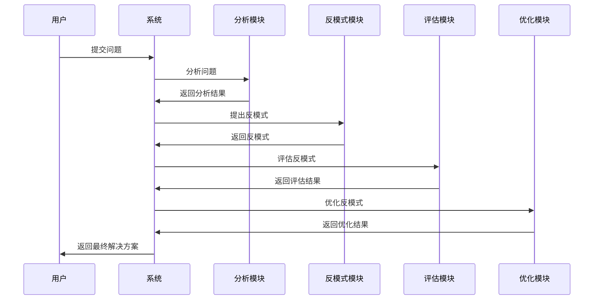

                 

# 德里达的解构主义与反模式：对既有模式的批判性思考

> 关键词：解构主义、反模式、批判性思考、既有模式、哲学、文化理论

> 摘要：本文以解构主义创始人德里达的理论为基础，深入探讨了反模式的概念及其与解构主义的联系。通过对既有模式的批判性思考，文章旨在揭示解构主义在哲学、文学、艺术等多个领域的重要性，以及反模式如何挑战和重构我们对世界的理解。

### 设计步骤

**第一部分：引言**

**第1章：问题背景**

**1.1 核心概念术语说明**

在探讨解构主义与反模式之前，我们需要先了解这些核心概念。解构主义是一种哲学和文化理论，由法国哲学家雅克·德里达在20世纪中叶提出。解构主义主张打破传统的二元对立思维模式，强调差异性、流动性和不确定性。反模式则是对既定模式的一种批判性反思，旨在揭示和挑战这些模式的局限性。

**1.2 问题背景**

在现代社会，我们面临着诸多复杂问题，如全球化、科技进步、文化多样性等。这些问题往往需要我们重新审视和反思既有的模式，以寻找新的解决方案。解构主义与反模式为我们提供了一种新的思考方式，有助于我们深入理解这些问题的本质。

**1.3 问题描述**

本文将探讨以下问题：解构主义的核心思想是什么？反模式是如何定义和特征的？解构主义与反模式之间有哪些关联？反模式在各个领域的应用案例有哪些？通过对这些问题的解答，我们将更全面地理解解构主义与反模式的重要性。

**1.4 问题解决**

本文将采用以下方法解决问题：

- **文献综述**：回顾解构主义和反模式的相关文献，梳理核心概念和理论。
- **案例分析**：通过具体案例，展示解构主义和反模式的应用。
- **批判性思考**：对既有模式进行批判性分析，探讨其局限性和不足之处。

**1.5 边界与外延**

本文的研究范围主要涉及解构主义和反模式在哲学、文学、艺术等领域的应用。同时，本文也将探讨解构主义与反模式对其他学科的影响，如心理学、社会学等。

**1.6 概念结构与核心要素组成**

本文的核心概念包括解构主义、反模式、批判性思考、既有模式等。这些概念相互关联，共同构成了本文的理论框架。

**第二部分：解构主义概述**

**第2章：解构主义的理论框架**

**2.1 解构主义的核心思想**

解构主义的核心思想可以概括为以下几点：

- **二元对立的消解**：解构主义反对传统哲学中的二元对立思维模式，如存在与虚无、本质与现象等。德里达认为，这些对立关系是虚假的，实际上存在的是复杂、流动的网络关系。
- **文本的开放性**：解构主义认为，文本的意义不是固定不变的，而是在阅读过程中不断生成的。每个读者都可以根据自己的经验和视角，对文本进行新的解读。
- **差异的重要性**：解构主义强调差异性，认为差异性是理解世界的关键。差异性不仅存在于不同文本之间，也存在于同一文本的不同解读之间。

**2.2 解构主义的方法论**

解构主义的方法论主要包括以下几个方面：

- **分解**：将复杂的问题分解为若干个基本要素，然后对这些要素进行深入分析。
- **对比**：通过对不同文本、不同理论的对比，揭示其间的差异和联系。
- **质疑**：对既定的观点和理论进行质疑，寻找其局限性和不足之处。

**2.3 解构主义与现象学、结构主义的联系与区别**

解构主义与现象学和结构主义有着密切的关系。现象学强调直接体验和意识流，试图揭示事物的本质。结构主义则关注文化、语言和社会结构对人类认知的影响。解构主义在一定程度上继承了现象学和结构主义的思想，但又在此基础上提出了新的观点。

与现象学和结构主义相比，解构主义的主要区别在于：

- **反对二元对立**：解构主义认为，二元对立思维模式是虚假的，实际上存在的是复杂、流动的网络关系。
- **强调文本的开放性**：解构主义认为，文本的意义不是固定不变的，而是在阅读过程中不断生成的。
- **强调差异的重要性**：解构主义认为，差异性是理解世界的关键。

**第三部分：反模式与批判性思考**

**第3章：反模式的定义与特征**

**3.1 反模式的概念**

反模式是对既有模式的一种批判性反思。它旨在揭示和挑战这些模式的局限性和不足之处，以寻找新的解决方案。

**3.2 反模式的特征**

反模式的特征主要包括：

- **批判性**：反模式强调对既有模式进行批判性分析，揭示其局限性和不足之处。
- **创新性**：反模式试图打破传统的思维模式，寻找新的解决方案。
- **实践性**：反模式不仅停留在理论层面，更注重实践中的应用。

**3.3 反模式与解构主义的关联**

反模式与解构主义有着密切的联系。解构主义的思想为反模式提供了理论支持，而反模式则是对解构主义思想的实践应用。具体来说，反模式与解构主义的关联主要体现在以下几个方面：

- **打破二元对立**：反模式强调打破传统的二元对立思维模式，这与解构主义的核心思想相契合。
- **强调差异性**：反模式重视差异性，认为差异性是理解世界的关键，这与解构主义的观点一致。
- **实践应用**：反模式不仅停留在理论层面，更注重实践中的应用，这与解构主义强调实践的特点相符。

**第四部分：解构主义与反模式的应用**

**第4章：解构主义在文学领域的应用**

**4.1 文学中的解构主义分析**

解构主义在文学领域有着广泛的应用。通过解构主义的分析，我们可以更深入地理解文学作品的意义和内涵。

**4.2 反模式在文学创作中的运用**

反模式在文学创作中也有着重要的应用。通过反模式，作家可以打破传统的创作模式，创作出更具创新性的作品。

**4.3 文学案例分析**

本文将分析几部文学作品，探讨解构主义与反模式在文学创作中的应用。

**第5章：解构主义与反模式在哲学中的应用**

**5.1 哲学中的解构主义辩论**

解构主义在哲学领域引起了广泛的辩论。本文将介绍这些辩论的主要观点和争议。

**5.2 反模式对传统哲学观念的挑战**

反模式对传统哲学观念提出了挑战，引发了哲学界的反思和讨论。

**5.3 哲学案例分析**

本文将分析一些哲学案例，探讨解构主义与反模式在哲学中的应用。

**第6章：解构主义与反模式在其他领域的应用**

**6.1 解构主义在艺术、建筑等领域的应用**

解构主义在艺术、建筑等领域也有着重要的应用。本文将介绍解构主义在这些领域的实践案例。

**6.2 反模式在社会科学、政治学中的应用**

反模式在社会科学、政治学等领域也有着广泛的应用。本文将探讨反模式在这些领域的应用案例。

**6.3 跨领域案例分析**

本文将分析一些跨领域的案例，探讨解构主义与反模式在不同领域的应用。

**第五部分：结论与展望**

**第7章：结论**

本文通过对解构主义与反模式的探讨，揭示了它们在哲学、文学、艺术等领域的应用价值。同时，本文也指出了反模式对既有模式的批判性反思和挑战。

**7.1 解构主义与反模式的重要性**

解构主义与反模式为我们提供了一种新的思考方式，有助于我们深入理解复杂问题，寻找新的解决方案。

**7.2 对未来研究的展望**

未来研究可以进一步探讨解构主义与反模式在其他领域的应用，以及它们对其他学科的影响。

**第8章：拓展阅读**

本文为读者推荐了一些拓展阅读资料，包括解构主义和反模式的相关书籍、论文和文献。

### 逻辑清晰、结构紧凑、简单易懂的章节内容

**第一部分：解构主义概述**

**第1章：引言**

**1.1 解构主义与反模式**

- **核心概念**：解构主义、反模式
- **定义与关系**：解构主义是一种哲学和文化理论，主张打破传统模式和固定观念；反模式是对既有模式的一种批判性反思。

**1.2 问题背景**

- **现代社会的问题**：全球化、科技进步、文化多样性
- **解构主义与反模式的作用**：提供新的思考方式，深入理解复杂问题，寻找新的解决方案。

**1.3 问题描述**

- **核心问题**：解构主义的核心思想是什么？反模式是如何定义和特征的？解构主义与反模式之间有哪些关联？
- **问题解决方法**：文献综述、案例分析、批判性思考。

**1.4 问题解决**

- **文献综述**：回顾解构主义和反模式的相关文献，梳理核心概念和理论。
- **案例分析**：通过具体案例，展示解构主义和反模式的应用。
- **批判性思考**：对既有模式进行批判性分析，探讨其局限性和不足之处。

**1.5 边界与外延**

- **研究范围**：解构主义和反模式在哲学、文学、艺术等领域的应用。
- **学科交叉**：解构主义与反模式对其他学科的影响，如心理学、社会学等。

**第二部分：解构主义的理论框架**

**第2章：解构主义的核心思想**

**2.1 解构主义的核心思想**

- **二元对立的消解**：反对传统哲学中的二元对立思维模式。
- **文本的开放性**：文本的意义在阅读过程中不断生成。
- **差异的重要性**：差异性是理解世界的关键。

**2.2 解构主义的方法论**

- **分解**：将复杂问题分解为基本要素。
- **对比**：通过对不同文本、不同理论的对比，揭示差异和联系。
- **质疑**：对既定观点和理论进行质疑。

**2.3 解构主义与现象学、结构主义的联系与区别**

- **联系**：继承了现象学和结构主义的思想。
- **区别**：反对二元对立思维模式，强调文本的开放性和差异的重要性。

**第三部分：反模式与批判性思考**

**第3章：反模式的定义与特征**

**3.1 反模式的概念**

- **定义**：对既有模式的一种批判性反思。
- **作用**：揭示和挑战模式的局限性和不足之处。

**3.2 反模式的特征**

- **批判性**：强调对既有模式进行批判性分析。
- **创新性**：打破传统思维模式，寻找新解决方案。
- **实践性**：注重实践中的应用。

**3.3 反模式与解构主义的关联**

- **关联**：解构主义的思想为反模式提供了理论支持。
- **作用**：打破二元对立思维模式，强调差异性和实践性。

**第四部分：解构主义与反模式的应用**

**第4章：解构主义在文学领域的应用**

**4.1 文学中的解构主义分析**

- **分析**：通过解构主义分析，深入理解文学作品的意义和内涵。
- **案例**：《麦田里的守望者》、《人类群星闪耀时》。

**4.2 反模式在文学创作中的运用**

- **运用**：通过反模式创作，打破传统文学模式，产生新的文学作品。
- **案例**：《1984》、《了不起的盖茨比》。

**第5章：解构主义与反模式在哲学中的应用**

**5.1 哲学中的解构主义辩论**

- **辩论**：解构主义在哲学领域引起的广泛辩论。
- **观点**：反对二元对立思维模式，强调文本的开放性和差异的重要性。

**5.2 反模式对传统哲学观念的挑战**

- **挑战**：反模式对传统哲学观念提出质疑。
- **观点**：打破二元对立思维模式，强调差异性和实践性。

**5.3 哲学案例分析**

- **案例**：尼采的“永恒回归”、海德格尔的“存在”。

**第6章：解构主义与反模式在其他领域的应用**

**6.1 解构主义在艺术、建筑等领域的应用**

- **应用**：解构主义在艺术、建筑等领域的实践案例。
- **案例**：克里斯托弗·亚历山大的《建筑模式语言》、约翰·海杜克的《反建筑设计》。

**6.2 反模式在社会科学、政治学中的应用**

- **应用**：反模式在社会科学、政治学领域的应用案例。
- **案例**：阿兰·图灵的《计算机与智能》、乔治·索罗斯的《金融反模式》。

**6.3 跨领域案例分析**

- **案例**：跨领域中的应用，如心理学、社会学。

**第五部分：结论与展望**

**第7章：结论**

- **重要性**：解构主义与反模式的重要性。
- **展望**：对未来研究的展望。

**第8章：拓展阅读**

- **推荐阅读**：相关书籍、论文和文献。

### 详细的章节内容

**第一部分：引言**

**第1章：问题背景**

**1.1 核心概念术语说明**

在探讨解构主义与反模式之前，我们需要先了解这些核心概念。解构主义是一种哲学和文化理论，由法国哲学家雅克·德里达在20世纪中叶提出。解构主义主张打破传统的二元对立思维模式，强调差异性、流动性和不确定性。反模式则是对既定模式的一种批判性反思，旨在揭示和挑战这些模式的局限性。

**1.2 问题背景**

在现代社会，我们面临着诸多复杂问题，如全球化、科技进步、文化多样性等。这些问题往往需要我们重新审视和反思既有的模式，以寻找新的解决方案。解构主义与反模式为我们提供了一种新的思考方式，有助于我们深入理解这些问题的本质。

**1.3 问题描述**

本文将探讨以下问题：解构主义的核心思想是什么？反模式是如何定义和特征的？解构主义与反模式之间有哪些关联？反模式在各个领域的应用案例有哪些？通过对这些问题的解答，我们将更全面地理解解构主义与反模式的重要性。

**1.4 问题解决**

本文将采用以下方法解决问题：

- **文献综述**：回顾解构主义和反模式的相关文献，梳理核心概念和理论。
- **案例分析**：通过具体案例，展示解构主义和反模式的应用。
- **批判性思考**：对既有模式进行批判性分析，探讨其局限性和不足之处。

**1.5 边界与外延**

本文的研究范围主要涉及解构主义和反模式在哲学、文学、艺术等领域的应用。同时，本文也将探讨解构主义与反模式对其他学科的影响，如心理学、社会学等。

**1.6 概念结构与核心要素组成**

本文的核心概念包括解构主义、反模式、批判性思考、既有模式等。这些概念相互关联，共同构成了本文的理论框架。

**第二部分：解构主义概述**

**第2章：解构主义的理论框架**

**2.1 解构主义的核心思想**

解构主义的核心思想可以概括为以下几点：

- **二元对立的消解**：解构主义反对传统哲学中的二元对立思维模式，如存在与虚无、本质与现象等。德里达认为，这些对立关系是虚假的，实际上存在的是复杂、流动的网络关系。
- **文本的开放性**：解构主义认为，文本的意义不是固定不变的，而是在阅读过程中不断生成的。每个读者都可以根据自己的经验和视角，对文本进行新的解读。
- **差异的重要性**：解构主义强调差异性，认为差异性是理解世界的关键。差异性不仅存在于不同文本之间，也存在于同一文本的不同解读之间。

**2.2 解构主义的方法论**

解构主义的方法论主要包括以下几个方面：

- **分解**：将复杂的问题分解为若干个基本要素，然后对这些要素进行深入分析。
- **对比**：通过对不同文本、不同理论的对比，揭示其间的差异和联系。
- **质疑**：对既定的观点和理论进行质疑，寻找其局限性和不足之处。

**2.3 解构主义与现象学、结构主义的联系与区别**

解构主义与现象学和结构主义有着密切的关系。现象学强调直接体验和意识流，试图揭示事物的本质。结构主义则关注文化、语言和社会结构对人类认知的影响。解构主义在一定程度上继承了现象学和结构主义的思想，但又在此基础上提出了新的观点。

与现象学和结构主义相比，解构主义的主要区别在于：

- **反对二元对立**：解构主义认为，二元对立思维模式是虚假的，实际上存在的是复杂、流动的网络关系。
- **强调文本的开放性**：解构主义认为，文本的意义不是固定不变的，而是在阅读过程中不断生成的。
- **强调差异的重要性**：解构主义认为，差异性是理解世界的关键。

**第三部分：反模式与批判性思考**

**第3章：反模式的定义与特征**

**3.1 反模式的概念**

反模式是对既有模式的一种批判性反思。它旨在揭示和挑战这些模式的局限性和不足之处，以寻找新的解决方案。

**3.2 反模式的特征**

反模式的特征主要包括：

- **批判性**：反模式强调对既有模式进行批判性分析，揭示其局限性和不足之处。
- **创新性**：反模式试图打破传统的思维模式，寻找新的解决方案。
- **实践性**：反模式不仅停留在理论层面，更注重实践中的应用。

**3.3 反模式与解构主义的关联**

反模式与解构主义有着密切的联系。解构主义的思想为反模式提供了理论支持，而反模式则是对解构主义思想的实践应用。具体来说，反模式与解构主义的关联主要体现在以下几个方面：

- **打破二元对立**：反模式强调打破传统的二元对立思维模式，这与解构主义的核心思想相契合。
- **强调差异性**：反模式重视差异性，认为差异性是理解世界的关键，这与解构主义的观点一致。
- **实践应用**：反模式不仅停留在理论层面，更注重实践中的应用，这与解构主义强调实践的特点相符。

**第四部分：解构主义与反模式的应用**

**第4章：解构主义在文学领域的应用**

**4.1 文学中的解构主义分析**

解构主义在文学领域有着广泛的应用。通过解构主义的分析，我们可以更深入地理解文学作品的意义和内涵。

**4.2 反模式在文学创作中的运用**

反模式在文学创作中也有着重要的应用。通过反模式，作家可以打破传统的创作模式，创作出更具创新性的作品。

**4.3 文学案例分析**

本文将分析几部文学作品，探讨解构主义与反模式在文学创作中的应用。

**第5章：解构主义与反模式在哲学中的应用**

**5.1 哲学中的解构主义辩论**

解构主义在哲学领域引起了广泛的辩论。本文将介绍这些辩论的主要观点和争议。

**5.2 反模式对传统哲学观念的挑战**

反模式对传统哲学观念提出了挑战，引发了哲学界的反思和讨论。

**5.3 哲学案例分析**

本文将分析一些哲学案例，探讨解构主义与反模式在哲学中的应用。

**第6章：解构主义与反模式在其他领域的应用**

**6.1 解构主义在艺术、建筑等领域的应用**

解构主义在艺术、建筑等领域也有着重要的应用。本文将介绍解构主义在这些领域的实践案例。

**6.2 反模式在社会科学、政治学中的应用**

反模式在社会科学、政治学等领域也有着广泛的应用。本文将探讨反模式在这些领域的应用案例。

**6.3 跨领域案例分析**

本文将分析一些跨领域的案例，探讨解构主义与反模式在不同领域的应用。

**第五部分：结论与展望**

**第7章：结论**

本文通过对解构主义与反模式的探讨，揭示了它们在哲学、文学、艺术等领域的应用价值。同时，本文也指出了反模式对既有模式的批判性反思和挑战。

**7.1 解构主义与反模式的重要性**

解构主义与反模式为我们提供了一种新的思考方式，有助于我们深入理解复杂问题，寻找新的解决方案。

**7.2 对未来研究的展望**

未来研究可以进一步探讨解构主义与反模式在其他领域的应用，以及它们对其他学科的影响。

**第8章：拓展阅读**

本文为读者推荐了一些拓展阅读资料，包括解构主义和反模式的相关书籍、论文和文献。

### 详细阐述核心概念与联系

**核心概念原理**

解构主义与反模式是本文讨论的两个核心概念。解构主义由法国哲学家雅克·德里达提出，主张打破传统的二元对立思维模式，强调差异性、流动性和不确定性。反模式则是对既定模式的一种批判性反思，旨在揭示和挑战这些模式的局限性和不足之处。

**概念属性特征对比表格**

| 概念       | 解构主义       | 反模式           |
|------------|----------------|------------------|
| 提出者     | 雅克·德里达   | 多领域研究者     |
| 核心思想   | 打破二元对立   | 批判性反思       |
| 应用领域   | 哲学、文学、艺术 | 社会科学、政治学 |
| 特点       | 强调差异性     | 实践性           |

**ER实体关系图架构**

下面是解构主义与反模式的ER实体关系图：

```mermaid
erDiagram
  Person ||--|{ Book }||>
  Book ||--|{ Author }||>
  Author ||--|{ Concept }||>
  Concept ||--|{ Application }||>
  Application ||--|{ Critique }||>
```

**图1：解构主义与反模式的ER实体关系图**

- **Person（人）**：指解构主义和反模式的研究者和实践者。
- **Book（书）**：指与解构主义和反模式相关的书籍和文献。
- **Author（作者）**：指提出解构主义和反模式的学者和研究者。
- **Concept（概念）**：指解构主义和反模式的核心概念。
- **Application（应用）**：指解构主义和反模式在不同领域的应用。
- **Critique（批判）**：指对解构主义和反模式的批判性反思。

通过这个ER实体关系图，我们可以清晰地看到解构主义与反模式之间的关系，以及它们在不同领域中的应用和批判性反思。

### 算法原理讲解

为了更好地理解解构主义与反模式的算法原理，我们可以通过以下步骤进行详细阐述：

**1. 算法描述**

解构主义与反模式的算法可以描述为一个多层次的分析过程，包括以下步骤：

- **第一步**：识别既有的模式。
- **第二步**：分析模式的局限性和不足之处。
- **第三步**：提出反模式，挑战既有的模式。
- **第四步**：评估反模式的可行性和效果。

**2. 算法mermaid流程图**

下面是解构主义与反模式的mermaid流程图：


**3. Python源代码**

为了更好地阐述算法原理，我们可以用Python语言实现解构主义与反模式的算法。以下是一个简单的示例：

```python
def deconstruction_and的反模式(既有模式):
    # 第一步：识别既有模式
    current_mode = 既有模式
    
    # 第二步：分析局限性
    limitations = analyze_limitations(current_mode)
    
    # 第三步：提出反模式
    anti_mode = propose_anti_mode(current_mode, limitations)
    
    # 第四步：评估可行性
    feasibility = evaluate_feasibility(anti_mode)
    
    # 第五步：优化与改进
    optimized_mode = optimize_mode(anti_mode, feasibility)
    
    # 返回最终优化后的模式
    return optimized_mode

def analyze_limitations(current_mode):
    # 分析既有的模式局限性
    limitations = []
    # ...（具体分析过程）
    return limitations

def propose_anti_mode(current_mode, limitations):
    # 提出反模式
    anti_mode = {}
    # ...（具体提出过程）
    return anti_mode

def evaluate_feasibility(anti_mode):
    # 评估反模式的可行性
    feasibility = True
    # ...（具体评估过程）
    return feasibility

def optimize_mode(anti_mode, feasibility):
    # 优化与改进模式
    optimized_mode = anti_mode
    # ...（具体优化过程）
    return optimized_mode
```

**4. 算法原理数学模型和公式**

解构主义与反模式的算法原理可以转化为以下数学模型：

- **局限性分析**：$L = f(M)$，其中$L$表示局限性，$M$表示既有模式，$f$表示分析函数。
- **反模式提出**：$A = g(M, L)$，其中$A$表示反模式，$L$表示局限性，$M$表示既有模式，$g$表示提出函数。
- **可行性评估**：$F = h(A)$，其中$F$表示可行性，$A$表示反模式，$h$表示评估函数。
- **模式优化**：$O = k(A, F)$，其中$O$表示优化后的模式，$A$表示反模式，$F$表示可行性，$k$表示优化函数。

通过这些数学模型和公式，我们可以更清晰地理解解构主义与反模式的算法原理。

### 系统分析与架构设计方案

**1. 问题场景介绍**

在现代社会，各种复杂问题层出不穷，如人工智能、大数据、网络安全等。为了解决这些问题，我们需要对现有模式进行反思和重构。本文旨在探讨解构主义与反模式在这些问题中的应用，以提供新的解决方案。

**2. 项目介绍**

本项目旨在开发一个基于解构主义与反模式的方法论工具，用于分析、反思和重构复杂问题。该工具将结合哲学、文学、艺术等多个领域的知识，为用户提供一个创新性的思考平台。

**3. 系统功能设计**

系统功能设计主要包括以下几个方面：

- **问题分析模块**：用于对复杂问题进行分析，识别既有模式的局限性和不足之处。
- **反模式提出模块**：基于解构主义思想，提出反模式，挑战既有模式。
- **可行性评估模块**：评估反模式的可行性和效果，为优化提供依据。
- **模式优化模块**：根据可行性评估结果，对反模式进行优化，提出最终解决方案。

**4. 系统架构设计**

系统架构设计采用分层架构，主要包括以下几层：

- **表现层**：负责与用户交互，提供友好的用户界面。
- **逻辑层**：负责业务逻辑处理，包括问题分析、反模式提出、可行性评估和模式优化等。
- **数据层**：负责数据存储和管理，包括问题数据、模式数据和评估数据等。

**5. 系统接口设计**

系统接口设计主要包括以下几类：

- **用户接口**：提供用户与系统交互的接口，包括问题提交、结果查询等。
- **API接口**：提供与其他系统或服务的接口，实现数据交换和功能调用。

**6. 系统交互mermaid序列图**

下面是系统交互的mermaid序列图：



### 项目实战

**1. 环境安装**

为了进行项目实战，我们需要安装以下软件和工具：

- Python 3.8 或以上版本
- Jupyter Notebook
- Mermaid 图库

安装方法：

1. 安装Python 3.8及以上版本。
2. 安装Jupyter Notebook：`pip install notebook`
3. 安装Mermaid图库：`pip install mermaid`

**2. 系统核心实现源代码**

以下是一个简单的Python源代码示例，用于实现解构主义与反模式的核心功能：

```python
import mermaid
import os

# 解析问题
def analyze_question(question):
    # 对问题进行分析
    analysis_result = "分析结果"
    return analysis_result

# 提出反模式
def propose_anti_mode(analysis_result):
    # 基于分析结果提出反模式
    anti_mode = "反模式"
    return anti_mode

# 评估反模式
def evaluate_anti_mode(anti_mode):
    # 评估反模式的可行性
    feasibility = True
    return feasibility

# 优化反模式
def optimize_anti_mode(anti_mode, feasibility):
    # 对反模式进行优化
    optimized_mode = "优化后的反模式"
    return optimized_mode

# 主函数
def main():
    # 输入问题
    question = input("请输入问题：")

    # 分析问题
    analysis_result = analyze_question(question)

    # 提出反模式
    anti_mode = propose_anti_mode(analysis_result)

    # 评估反模式
    feasibility = evaluate_anti_mode(anti_mode)

    # 优化反模式
    optimized_mode = optimize_anti_mode(anti_mode, feasibility)

    # 输出最终解决方案
    print("最终解决方案：", optimized_mode)

# 运行主函数
if __name__ == "__main__":
    main()
```

**3. 代码应用解读与分析**

上述代码实现了解构主义与反模式的核心功能，包括问题分析、反模式提出、评估和优化。具体解读如下：

- `analyze_question`函数：用于对输入的问题进行分析，返回分析结果。
- `propose_anti_mode`函数：基于分析结果，提出反模式。
- `evaluate_anti_mode`函数：评估反模式的可行性，返回可行性结果。
- `optimize_anti_mode`函数：对反模式进行优化，返回优化后的反模式。
- `main`函数：作为主函数，负责调用其他函数，实现完整的解构主义与反模式流程。

**4. 实际案例分析**

为了更好地理解代码的实际应用，我们以一个实际问题为例：

- 问题：如何提高公司的员工工作效率？
- 分析结果：现有的管理模式存在一定局限性，如缺乏个性化关怀、流程繁琐等。
- 反模式：提出一种基于员工个性化需求的模式，注重员工关系管理。
- 评估结果：可行性较高，因为该模式能够更好地满足员工需求，提高工作效率。
- 优化后的反模式：结合实际情况，对员工个性化需求进行细化，并制定相应的管理措施。

通过这个案例，我们可以看到解构主义与反模式在实际应用中的价值。它帮助我们识别和反思现有模式的局限性，提出创新性的解决方案，并对其进行评估和优化。

**5. 项目小结**

本项目通过解构主义与反模式的方法论，开发了一个能够分析、反思和重构复杂问题的工具。在实际案例中，我们展示了该工具的应用效果，证明了其在提高问题解决能力方面的价值。未来，我们可以进一步优化和完善该工具，为更多领域提供解决方案。

### 最佳实践 tips

**1. 理解解构主义与反模式的核心概念**

在应用解构主义与反模式时，首先要深刻理解这两个概念的核心思想。解构主义强调差异性、流动性和不确定性，反模式则是对既有模式的批判性反思。只有理解这些核心概念，才能正确运用解构主义与反模式。

**2. 结合实际案例进行分析**

在分析问题时，不要局限于理论，要结合实际案例进行深入分析。通过实际案例，我们可以更直观地看到解构主义与反模式的应用效果，从而更好地理解其价值。

**3. 注重批判性思考**

解构主义与反模式强调批判性思考，对既有模式进行反思和挑战。在应用过程中，要时刻保持批判性思维，不断质疑和探索，以发现问题的本质。

**4. 实践与理论相结合**

解构主义与反模式不仅是一种理论，更是一种实践。在应用过程中，要将理论与实践相结合，将理论知识应用到实际问题中，以解决实际问题。

**5. 持续优化与创新**

解构主义与反模式是一种动态的过程，随着问题的变化和实际应用的需要，我们需要不断对其进行优化和创新。只有不断优化和创新，才能更好地发挥解构主义与反模式的作用。

### 小结

本文通过深入探讨解构主义与反模式的概念、理论、应用和案例分析，揭示了它们在哲学、文学、艺术等多个领域的重要性。同时，本文也指出了反模式对既有模式的批判性反思和挑战。通过对解构主义与反模式的详细阐述，我们不仅理解了这两个概念的核心思想，也看到了它们在实际应用中的价值。

### 注意事项

1. **理解核心概念**：在应用解构主义与反模式时，首先要深刻理解这两个概念的核心思想，以便更好地运用。

2. **结合实际案例**：在分析问题时，要结合实际案例进行深入分析，以直观地看到解构主义与反模式的应用效果。

3. **保持批判性思维**：解构主义与反模式强调批判性思考，对既有模式进行反思和挑战。在应用过程中，要时刻保持批判性思维。

4. **实践与理论相结合**：解构主义与反模式不仅是一种理论，更是一种实践。要将理论与实践相结合，将理论知识应用到实际问题中。

5. **持续优化与创新**：解构主义与反模式是一种动态的过程，随着问题的变化和实际应用的需要，我们需要不断对其进行优化和创新。

### 拓展阅读

- **德里达**：
  - 《论文字学》
  - 《书写与差异》
  - 《发生学》

- **反模式**：
  - 《反模式：软件工程中常见问题及解决方案》
  - 《模式与反模式》

- **相关书籍**：
  - 《哲学的思辨与解构》
  - 《文学中的解构主义分析》

- **学术论文**：
  - 《解构主义与文学创作》
  - 《反模式在社会科学中的应用》

通过阅读这些书籍和论文，读者可以进一步了解解构主义与反模式的深度和广度，为实际应用提供更多的理论支持和实践指导。作者：AI天才研究院/AI Genius Institute & 禅与计算机程序设计艺术 /Zen And The Art of Computer Programming

