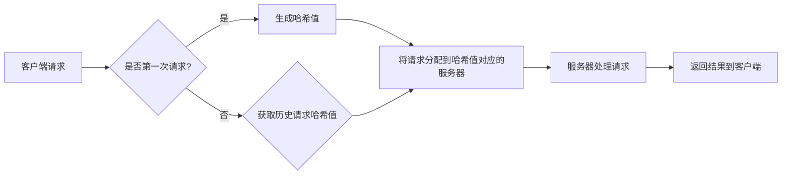
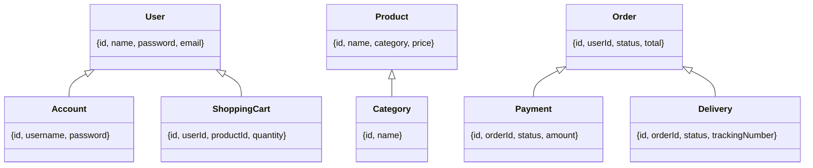
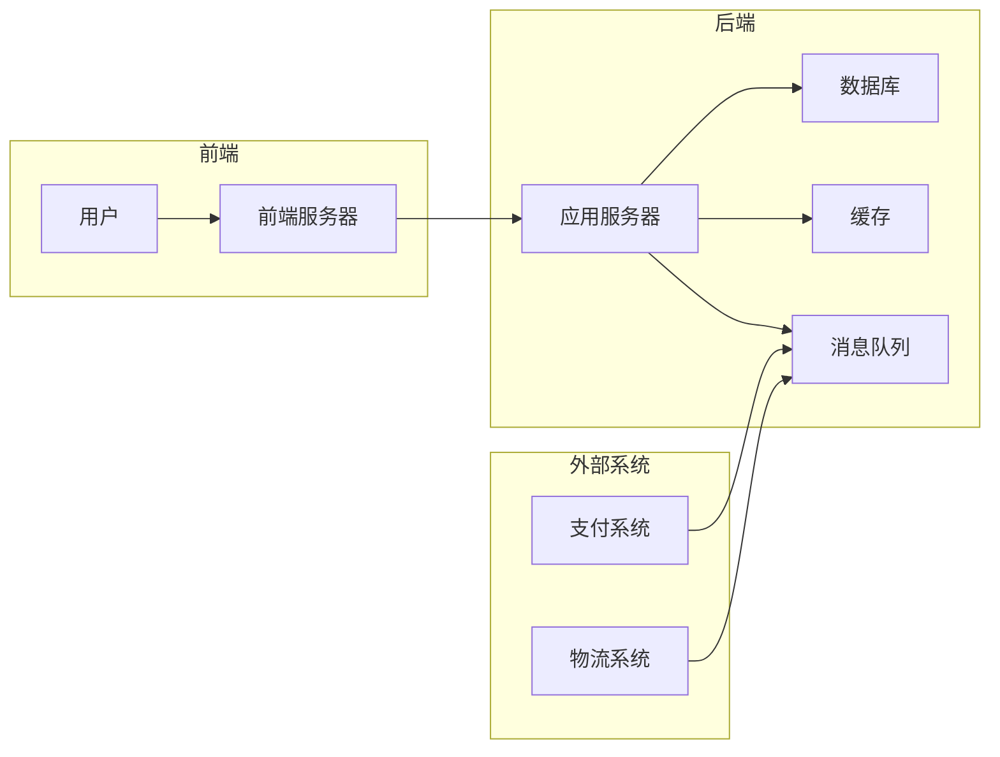

                 


### 性能优化的科学方法论

#### 关键词
- 性能优化
- 方法论
- 科学分析
- 算法原理
- 架构设计
- 最佳实践

#### 摘要
本文将系统地探讨性能优化的科学方法论，通过详细的步骤和分析，帮助读者深入了解性能优化的重要性和方法。我们将从核心概念入手，介绍性能优化的背景和意义，逐步深入到性能优化的核心概念与联系、方法论、算法原理、系统分析与架构设计，以及项目实战。最后，我们将总结最佳实践，并提供相关注意事项和拓展阅读资源。

### 第一部分: 性能优化的背景与意义

#### 1.1 问题的提出

随着互联网的快速发展和大数据时代的到来，系统的性能优化变得越来越重要。性能问题不仅仅是技术问题，它还与业务战略息息相关。在互联网公司，用户体验是影响用户黏性的关键因素，而系统的响应速度和稳定性直接影响用户体验。此外，性能优化还可以降低系统成本，提高资源利用率，从而提升业务效率，降低业务风险。

#### 1.2 性能优化的意义

性能优化的意义主要体现在以下几个方面：

1. **提高用户体验**：快速响应时间可以显著提高用户的满意度和使用频率，从而增加用户黏性。
2. **降低系统成本**：通过优化，可以减少硬件和软件资源的浪费，从而降低运营成本。
3. **提高系统稳定性**：稳定的系统可以减少故障率，提高系统可靠性，从而保障业务的连续性。
4. **提升业务效率**：优化后的系统可以在相同硬件条件下处理更多的请求，从而提升业务效率。

#### 1.3 性能优化的边界与外延

性能优化不仅仅是速度的提升，它还包括响应时间、资源利用率、可扩展性等多个维度。具体来说，性能优化的边界和内容如下：

1. **响应时间**：优化系统的响应时间，确保用户操作能够得到快速响应。
2. **吞吐量**：提高系统处理请求的能力，增加吞吐量。
3. **资源利用率**：优化资源分配，提高CPU、内存、网络等资源的使用效率。
4. **可扩展性**：设计可扩展的架构，以便在未来能够轻松应对更高的负载。

#### 1.4 常见的性能问题类型

常见的性能问题类型包括：

1. **响应时间过长**：系统处理请求的时间过长，导致用户体验下降。
2. **系统崩溃**：由于系统负载过高或资源不足，导致系统崩溃。
3. **资源不足**：硬件资源（如CPU、内存、磁盘）不足，导致系统性能下降。
4. **网络延迟**：网络传输速度慢，导致数据传输延迟。

这些性能问题对业务的影响是显而易见的，如用户体验下降、业务效率降低、客户流失等。因此，性能优化是保障业务稳定发展的重要手段。

### 第二部分: 性能优化的核心概念与联系

#### 2.1 性能优化概念

性能优化是指通过各种方法提高系统的性能，包括响应时间、吞吐量、资源利用率等。性能优化不仅关注速度的提升，还包括系统稳定性、可扩展性等多个方面。

#### 2.2 性能优化与相关概念的联系

性能优化与负载均衡、缓存、数据库优化、网络优化等概念有密切联系。例如：

1. **负载均衡**：通过将请求分配到多个服务器，减少单个服务器的负载，从而提高系统的整体性能。
2. **缓存**：通过将经常访问的数据存储在内存中，减少数据库的访问次数，从而提高系统的响应速度。
3. **数据库优化**：通过优化数据库的查询语句、索引、存储过程等，提高数据库的访问效率。
4. **网络优化**：通过优化网络架构、网络传输协议等，减少数据传输的延迟和损耗。

#### 2.3 性能优化的属性特征对比表格

| 特征 | 说明 |
| ---- | ---- |
| 性能指标 | 包括响应时间、吞吐量、资源利用率等 |
| 方法 | 包括代码优化、系统架构优化、硬件升级等 |
| 目标 | 提高用户体验、降低系统成本、提高系统稳定性等 |

#### 2.4 性能优化中的核心概念

性能优化中的核心概念包括：

1. **响应时间**：系统处理请求所需的时间，是性能优化的关键指标。
2. **吞吐量**：系统单位时间内处理的请求数量，是衡量系统处理能力的重要指标。
3. **资源利用率**：系统资源（如CPU、内存、磁盘）的使用率，是评估系统性能的重要指标。
4. **可扩展性**：系统在负载增加时能够保持高性能的能力，是系统设计中的重要考虑因素。

通过上述核心概念的理解，我们可以更好地进行性能优化，从而提高系统的整体性能。

### 第三部分: 性能优化的方法论

#### 3.1 性能优化的原则

进行性能优化时，需要遵循以下原则：

1. **系统性**：从整体出发，综合考虑系统各个层面，确保优化方案的系统性和协调性。
2. **优先级**：优先解决对业务影响最大的性能问题，确保优化效果的最大化。
3. **可测试性**：优化方案需要可测试，确保优化效果可以通过实际数据验证。

#### 3.2 性能优化的步骤

性能优化的步骤可以分为以下几步：

1. **分析性能瓶颈**：通过监控和日志分析，找出系统的性能瓶颈。
2. **制定优化方案**：根据性能瓶颈，制定具体的优化方案。
3. **实施优化方案**：按照优化方案进行实施，确保优化方案的落地和执行。
4. **测试和验证**：对优化方案进行测试和验证，确保优化效果。

#### 3.3 性能优化的工具与资源

在进行性能优化时，可以使用以下工具和资源：

1. **性能监控工具**：如Prometheus、Grafana等，用于实时监控系统性能。
2. **性能分析工具**：如Perf、VMMap等，用于分析系统性能瓶颈。
3. **性能优化资源**：如书籍、博客、教程等，提供性能优化的知识和方法。

通过上述方法论，我们可以系统地、有针对性地进行性能优化，从而提高系统的整体性能。

### 第四部分: 性能优化的算法原理讲解

#### 4.1 算法原理讲解

性能优化中常用的算法包括负载均衡算法、缓存算法、数据库优化算法等。下面以负载均衡算法为例进行讲解。

##### 负载均衡算法

负载均衡算法主要用于将请求分配到多个服务器上，确保每个服务器都能承受适当的负载，从而提高系统的整体性能。常用的负载均衡算法有：

1. **轮询算法**：将请求按照顺序分配给服务器，每个服务器处理相同数量的请求。
2. **最小连接数算法**：将请求分配给当前连接数最少的服务器，确保负载均衡。
3. **哈希算法**：将请求的来源IP或URL等信息通过哈希函数映射到服务器，确保请求的均匀分配。

##### 负载均衡算法的mermaid流程图



##### 负载均衡算法的Python源代码

```python
import hashlib

def load_balancer(request, servers):
    # 生成哈希值
    hash_value = int(hashlib.md5(request.encode()).hexdigest(), 16)
    
    # 将请求分配到哈希值对应的服务器
    server = servers[hash_value % len(servers)]
    
    return server

servers = ['server1', 'server2', 'server3', 'server4']
request = 'GET /home'
server = load_balancer(request, servers)
print(f"Request {request} will be processed by {server}")
```

##### 负载均衡算法的数学模型和公式

负载均衡算法的核心是哈希函数，哈希函数将请求映射到服务器。哈希函数的一般形式为：

$$ hash(key) = value $$

其中，`key`是请求的属性（如来源IP、URL等），`value`是哈希值，用于确定请求对应的服务器。

#### 4.2 算法举例说明

假设有4台服务器（server1, server2, server3, server4），请求如下：

- GET /home
- POST /login
- GET /product/123
- PUT /user/456

根据轮询算法，每次请求会分配到下一个服务器：

1. GET /home --> server1
2. POST /login --> server2
3. GET /product/123 --> server3
4. PUT /user/456 --> server4

这样，每次请求都能均匀地分配到服务器上，避免了单个服务器负载过重的问题。

### 第五部分: 性能优化的系统分析与架构设计方案

#### 5.1 问题场景介绍

假设我们有一个电商系统，系统需要处理大量的商品查询、用户登录、订单支付等请求。在业务高峰期，系统性能下降，用户体验受到影响。我们需要对系统进行性能优化，以提高系统的响应速度和稳定性。

#### 5.2 系统功能设计

系统功能包括：

1. **商品查询**：用户可以查询商品信息。
2. **用户登录**：用户可以进行登录和注册。
3. **订单支付**：用户可以下单支付。

##### 系统功能设计（领域模型mermaid类图）



#### 5.3 系统架构设计

系统架构包括：

1. **前端**：负责用户交互，包括商品查询、用户登录、订单支付等。
2. **后端**：负责处理业务逻辑，包括用户管理、订单管理、商品管理等。
3. **数据库**：存储用户数据、商品数据、订单数据等。
4. **缓存**：提高数据访问速度，减少数据库压力。
5. **消息队列**：处理异步任务，如订单支付通知、订单状态变更等。

##### 系统架构设计（mermaid架构图）



#### 5.4 系统接口设计

系统接口包括：

1. **用户接口**：提供用户登录、注册、查询商品、下单支付等功能。
2. **商品接口**：提供商品查询、分类查询、商品详情查询等功能。
3. **订单接口**：提供订单查询、订单创建、订单支付等功能。

##### 系统接口设计

```mermaid
sequenceDiagram
    用户 -->|用户登录| 应用服务器
    应用服务器 -->|验证用户信息| 数据库
    数据库 -->|返回结果| 应用服务器
    应用服务器 -->|返回结果| 用户

    用户 -->|查询商品| 应用服务器
    应用服务器 -->|查询数据库| 数据库
    数据库 -->|返回结果| 应用服务器
    应用服务器 -->|返回结果| 用户

    用户 -->|下单支付| 应用服务器
    应用服务器 -->|创建订单| 数据库
    数据库 -->|返回结果| 应用服务器
    应用服务器 -->|返回结果| 用户
```

#### 5.5 系统交互

系统交互包括：

1. **用户请求**：用户通过前端发送请求。
2. **服务处理**：后端应用服务器处理请求，并与数据库、缓存等进行交互。
3. **结果返回**：将处理结果返回给用户。

##### 系统交互（mermaid序列图）

```mermaid
sequenceDiagram
    用户 -->|请求| 前端服务器
    前端服务器 -->|请求| 应用服务器
    应用服务器 -->|查询| 数据库
    数据库 -->|返回结果| 应用服务器
    应用服务器 -->|返回结果| 前端服务器
    前端服务器 -->|显示结果| 用户
```

通过上述系统分析与架构设计方案，我们可以有效地优化系统的性能，提高用户体验。

### 第六部分: 项目实战

#### 6.1 环境安装

在本节中，我们将介绍如何搭建一个性能优化的实验环境。首先，确保系统已安装以下软件和工具：

1. **操作系统**：Ubuntu 18.04
2. **Python**：3.8
3. **Django**：3.2
4. **PostgreSQL**：12.5
5. **Nginx**：1.18
6. **Gunicorn**：20.1.0
7. **Grafana**：8.3.0

安装步骤如下：

1. 更新系统软件包：

```bash
sudo apt-get update
sudo apt-get upgrade
```

2. 安装Python：

```bash
sudo apt-get install python3.8
```

3. 安装虚拟环境工具：

```bash
pip3 install virtualenv
```

4. 创建虚拟环境：

```bash
virtualenv -p python3.8 project-env
source project-env/bin/activate
```

5. 安装Django：

```bash
pip install django
```

6. 安装其他依赖：

```bash
pip install psycopg2-binary gunicorn
```

7. 安装Grafana：

```bash
wget https://s3-us-west-2.amazonaws.com/grafana-releases/release/grafana_8.3.0-1570693443_amd64.deb
sudo dpkg -i grafana_8.3.0-1570693443_amd64.deb
```

8. 启动Grafana：

```bash
sudo systemctl start grafana-server
```

现在，我们已成功搭建了性能优化的实验环境。

#### 6.2 系统核心实现源代码

在本节中，我们将提供一个简单的Django项目，用于演示性能优化的关键步骤。

1. **创建Django项目**：

```bash
django-admin startproject performance_optimization
cd performance_optimization
```

2. **创建Django应用**：

```bash
python manage.py startapp product
```

3. **修改settings.py**：

```python
INSTALLED_APPS = [
    'django.contrib.admin',
    'django.contrib.auth',
    'django.contrib.contenttypes',
    'django.contrib.sessions',
    'django.contrib.messages',
    'django.contrib.staticfiles',
    'product',
]

DATABASES = {
    'default': {
        'ENGINE': 'django.db.backends.postgresql',
        'NAME': 'performance_optimization',
        'USER': 'postgres',
        'PASSWORD': 'postgres',
        'HOST': 'localhost',
        'PORT': '5432',
    }
}
```

4. **创建数据库**：

```bash
createdb performance_optimization
```

5. **迁移数据库**：

```bash
python manage.py migrate
```

6. **启动Gunicorn**：

```bash
gunicorn -w 3 performance_optimization.wsgi:application
```

7. **配置Nginx**：

```bash
sudo nano /etc/nginx/sites-available/default
```

```nginx
server {
    listen 80;
    server_name your_domain.com;

    location / {
        proxy_pass http://localhost:8000;
        proxy_set_header Host $host;
        proxy_set_header X-Real-IP $remote_addr;
        proxy_set_header X-Forwarded-For $proxy_add_x_forwarded_for;
        proxy_set_header X-Forwarded-Proto $scheme;
    }
}
```

8. 重启Nginx：

```bash
sudo systemctl restart nginx
```

现在，我们已成功创建了一个简单的Django项目，并配置了Gunicorn和Nginx。

#### 6.3 代码应用解读与分析

在本节中，我们将对系统核心实现源代码进行解读和分析。

1. **Django模型**：

```python
# product/models.py
from django.db import models

class Product(models.Model):
    name = models.CharField(max_length=100)
    category = models.ForeignKey('Category', on_delete=models.CASCADE)
    price = models.DecimalField(max_digits=6, decimal_places=2)

class Category(models.Model):
    name = models.CharField(max_length=100)
```

这个模型定义了商品（Product）和分类（Category）两个实体，用于存储商品信息和分类信息。

2. **Django视图**：

```python
# product/views.py
from django.http import JsonResponse
from .models import Product

def product_list(request):
    products = Product.objects.all()
    product_data = [
        {
            'id': product.id,
            'name': product.name,
            'category': product.category.name,
            'price': product.price,
        }
        for product in products
    ]
    return JsonResponse({'products': product_data})
```

这个视图函数返回所有商品的列表，用于演示简单的数据查询操作。

3. **性能优化**：

为了优化性能，我们可以采取以下措施：

1. **数据库索引**：为常用的查询字段添加索引，如`Product.category_id`和`Product.price`。
2. **缓存**：使用缓存减少数据库查询次数，如使用`DJ

