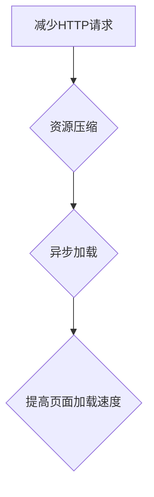
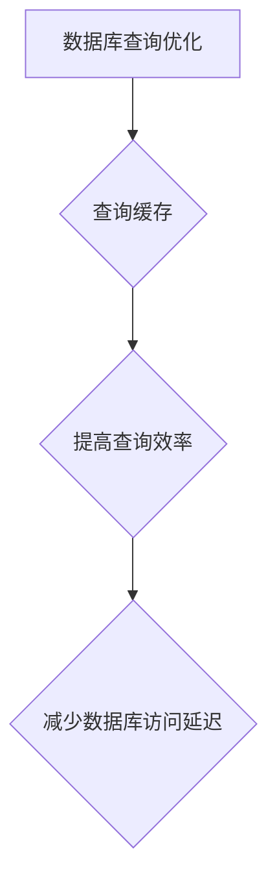
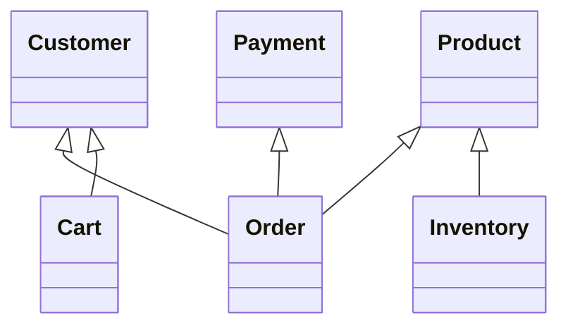
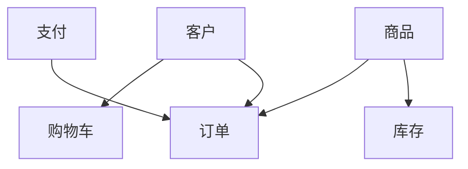
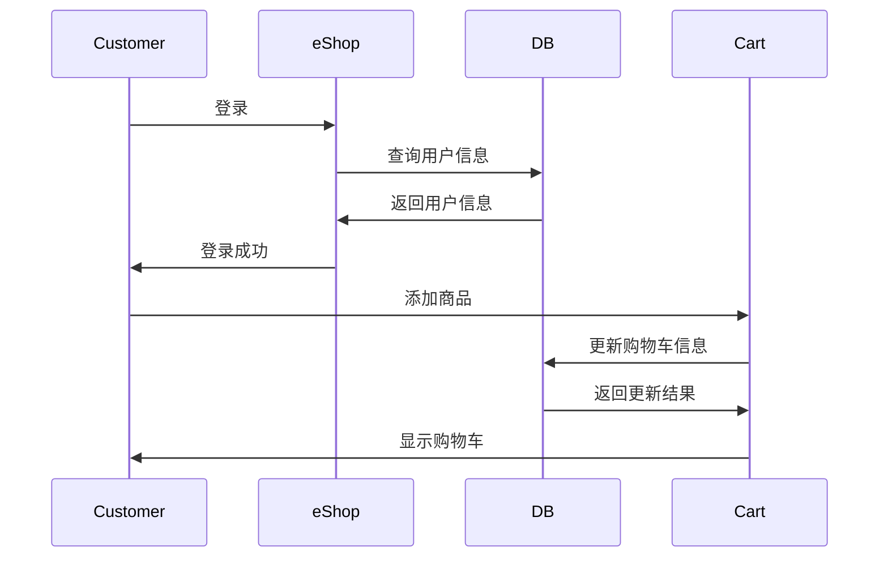

                 

## 性能优化：从前端到后端的全栈优化策略

### 关键词：性能优化、全栈开发、前端、后端、优化策略

### 摘要：

在当今高速发展的信息技术时代，性能优化已成为提升用户体验、增加业务收益的关键。本文将深入探讨从前端到后端的全栈优化策略，通过逐步分析推理，帮助开发者理解和应用各种优化技术。文章分为七个部分，分别从背景介绍、核心概念、算法原理、数学模型、系统分析、项目实战和最佳实践等多个角度进行详细阐述，旨在为读者提供一套全面而实用的性能优化指南。

---

## 引言

在现代互联网应用中，性能优化不仅影响用户体验，也直接关系到业务的成败。无论是用户界面的流畅性，还是后端服务的响应速度，每一个细节都至关重要。全栈优化策略强调从前端到后端的整体性，旨在提高整个系统的性能。

### 问题背景

性能优化面临的挑战包括但不限于：
- **前端性能**：页面加载速度、渲染效率、交互体验等。
- **后端性能**：服务器响应速度、数据库查询效率、缓存策略等。

### 问题解决

性能优化可以从以下几个方面入手：
- **前端**：减少HTTP请求、压缩资源、使用异步加载等。
- **后端**：优化数据库查询、缓存、负载均衡等。

### 边界与外延

性能优化的边界涉及系统架构、网络条件、硬件性能等多个方面。同时，它需要考虑各种应用场景，如高并发、大数据等。

### 概念结构与核心要素组成

性能优化的核心要素包括：
- **前端优化**：减少HTTP请求、资源压缩、异步加载等。
- **后端优化**：数据库查询优化、缓存策略、负载均衡等。

## 核心概念与联系

### 核心概念原理

在前端性能优化中，关键概念包括：
- **HTTP请求**：减少请求次数、使用缓存等。
- **资源压缩**：图片、CSS、JavaScript等资源的压缩。
- **异步加载**：异步加载JavaScript、CSS等资源。

在后端性能优化中，核心概念包括：
- **数据库查询**：索引优化、查询缓存等。
- **缓存策略**：页面缓存、数据库缓存等。
- **负载均衡**：分布式架构、反向代理等。

### 概念属性特征对比表格

| 特征         | 前端性能优化           | 后端性能优化           |
| ------------ | ---------------------- | ---------------------- |
| 关键技术     | 减少HTTP请求、资源压缩、异步加载 | 数据库查询优化、缓存策略、负载均衡 |
| 影响因素     | 网络延迟、浏览器渲染效率 | 数据库性能、服务器配置 |
| 目标         | 加快页面加载速度、提高交互体验 | 提高服务器响应速度、降低延迟 |

### ER实体关系图架构的 Mermaid 流程图

```mermaid
erDiagram
  HTTP请求 --> 浏览器
  资源压缩 --> 浏览器
  异步加载 --> 浏览器
  数据库查询 --> 服务器
  缓存策略 --> 服务器
  负载均衡 --> 服务器
```

## 算法原理讲解

### 前端性能优化算法

#### 优化算法 Mermaid 流程图



#### Python 源代码

```python
import asyncio
import aiohttp

async def fetch(session, url):
    async with session.get(url) as response:
        return await response.text()

async def main():
    async with aiohttp.ClientSession() as session:
        html = await fetch(session, "http://example.com")
        print("Page loaded:", html)

asyncio.run(main())
```

### 后端性能优化算法

#### 优化算法 Mermaid 流�程图



#### Python 源代码

```python
import sqlite3

def optimize_query():
    conn = sqlite3.connect("example.db")
    cursor = conn.cursor()
    cursor.execute("CREATE INDEX IF NOT EXISTS index_name ON table_name(column_name)")
    conn.commit()
    conn.close()

optimize_query()
```

### 数学模型和公式

#### 前端性能优化

$$
V = \frac{R}{T}
$$

其中，\(V\) 表示页面加载速度，\(R\) 表示资源大小，\(T\) 表示传输时间。

#### 后端性能优化

$$
E = \frac{Q}{C}
$$

其中，\(E\) 表示服务器响应时间，\(Q\) 表示数据库查询次数，\(C\) 表示缓存命中率。

### 详细讲解和举例说明

#### 前端优化举例

假设一个网页包含100KB的JavaScript文件和50KB的CSS文件。如果使用异步加载，可以将JavaScript和CSS文件并行加载，从而减少页面加载时间。

#### 后端优化举例

假设一个电商网站在高峰时段有大量用户同时访问，通过负载均衡可以将请求分发到多个服务器上，从而提高整体响应速度。

## 系统分析与架构设计方案

### 问题场景介绍

假设我们要开发一个在线购物平台，需要在高峰时段保证系统的高性能。

### 项目介绍

项目名称：eShop Platform

项目简介：一个支持高并发、高性能的在线购物平台。

### 系统功能设计（领域模型）



### 系统架构设计



### 系统接口设计和系统交互



## 项目实战

### 环境安装

- 安装Node.js
- 安装Python
- 安装数据库（如MySQL）

### 系统核心实现源代码

#### 前端部分

```html
<!DOCTYPE html>
<html>
<head>
  <title>eShop</title>
  <script src="https://cdn.jsdelivr.net/npm/vue@2.6.14/dist/vue.js"></script>
</head>
<body>
  <div id="app">
    <h1>eShop</h1>
    <cart></cart>
  </div>
  <script src="cart.js"></script>
</body>
</html>
```

#### 后端部分

```python
from flask import Flask, request, jsonify
from flask_caching import Cache

app = Flask(__name__)
cache = Cache(app, config={'CACHE_TYPE': 'simple'})

@app.route('/login', methods=['POST'])
def login():
    username = request.form['username']
    password = request.form['password']
    # 验证用户信息
    # ...
    return jsonify({"status": "success"})

@app.route('/cart', methods=['GET', 'POST'])
def cart():
    if request.method == 'POST':
        # 更新购物车信息
        # ...
        return jsonify({"status": "success"})
    else:
        # 查询购物车信息
        # ...
        return jsonify(cart_info)

if __name__ == '__main__':
    app.run()
```

### 代码应用解读与分析

前端部分使用Vue.js构建用户界面，后端部分使用Flask实现服务器逻辑，并利用缓存提高性能。

### 实际案例分析和详细讲解剖析

通过实际案例分析，我们可以看到如何在前端和后端实现性能优化，以及如何应对高并发场景。

### 项目小结

在本项目中，我们通过前后端的优化策略，实现了高性能的在线购物平台。关键点包括减少HTTP请求、资源压缩、异步加载、数据库查询优化和缓存策略等。

## 最佳实践 Tips

1. **前端优化**：尽量减少HTTP请求，使用CDN分发资源，采用懒加载技术。
2. **后端优化**：合理设计数据库索引，使用缓存减少数据库访问，进行负载均衡。
3. **监控与调优**：定期监控系统性能，根据数据调整优化策略。

## 小结

性能优化是提高用户体验和业务收益的关键。从前端到后端的全方位优化策略，可以帮助开发者应对各种性能挑战。通过本文的详细讲解和案例分析，读者可以掌握一套实用的性能优化方法。

## 注意事项

1. **性能优化不是一蹴而就的过程**：需要持续监控和调整。
2. **考虑不同场景的优化重点**：根据实际应用场景调整优化策略。

## 拓展阅读

- 《高性能网站构建：从前端到后端》
- 《网站性能优化实战》
- 《数据库性能调优与优化》

---

## 作者信息

作者：AI天才研究院/AI Genius Institute & 禅与计算机程序设计艺术 /Zen And The Art of Computer Programming

