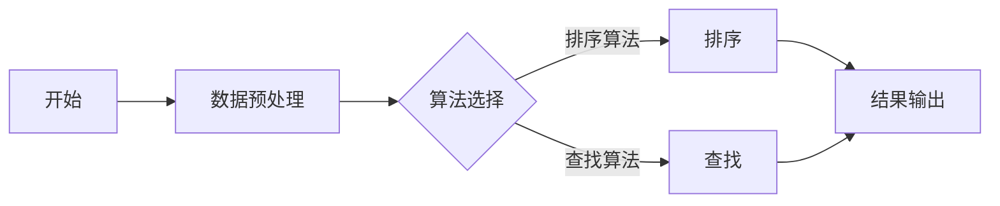
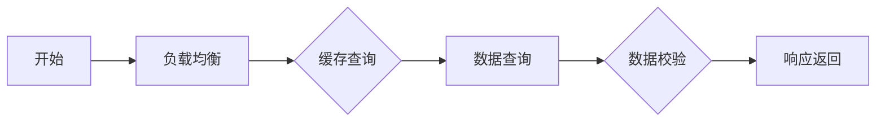
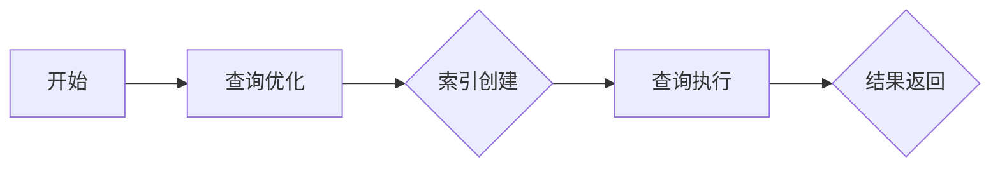

                 

# 性能优化：从应用到数据库的全栈提升

## 关键词
- 性能优化
- 应用性能
- 服务端性能
- 数据库性能
- 数学模型
- 算法

## 摘要
本文将深入探讨性能优化的核心概念，从应用到数据库的全栈提升策略。我们将通过详细的分析和案例分析，逐步展示性能优化的数学模型、Python算法、以及在实际项目中应用的技巧和注意事项。本文旨在为IT从业人员提供一套完整的性能优化指南，帮助他们在复杂的系统中实现性能的提升。

## 第一部分：性能优化的背景与概述

### 第1章：性能优化的核心概念

#### 1.1 性能优化的重要性

在现代IT行业中，性能优化是一个不可或缺的环节。随着互联网的快速发展，用户对系统性能的要求越来越高。性能优化不仅能够提高用户体验，还能提升系统的稳定性和可靠性。从业务角度来看，性能优化意味着更高的吞吐量、更低的延迟，从而为业务增长提供支持。

#### 1.2 性能优化的问题背景

性能问题通常源于以下几个方面：
- **资源利用率低**：系统资源得不到充分利用，导致响应时间延长。
- **并发处理能力不足**：系统无法同时处理大量请求，导致用户体验差。
- **瓶颈问题**：某个环节的性能成为整个系统的瓶颈，影响整体性能。

#### 1.3 性能优化的目标与原则

性能优化的目标是提高系统的响应速度和吞吐量，同时保持系统的稳定性和可维护性。在优化过程中，应遵循以下原则：
- **全局优化**：综合考虑系统各个层面的性能。
- **渐进式优化**：逐步改进，避免一次性改动过多。
- **可测性**：优化前应有明确的目标和可测量的指标。

#### 1.4 性能优化的边界与外延

性能优化并非万能，它有一定的边界。例如，性能优化不能解决需求设计上的问题，也不能解决硬件资源不足的问题。因此，在进行性能优化时，需要明确边界，避免盲目投入。

### 第2章：从应用到数据库的性能优化要素

#### 2.1 应用层面的性能优化

应用层面的性能优化主要关注代码层面，包括算法改进、代码优化、架构调整等。例如，通过改进排序算法可以减少时间复杂度，从而提高响应速度。

#### 2.2 服务端性能优化

服务端性能优化涉及网络、服务器、负载均衡等多个方面。优化策略包括使用缓存、优化数据库查询、实现负载均衡等。

#### 2.3 数据库性能优化

数据库性能优化是性能优化的关键环节。常见的优化方法包括索引优化、查询优化、数据库架构调整等。

### 第3章：核心概念与联系

#### 3.1 性能指标与度量方法

性能指标是衡量系统性能的关键，常见的性能指标包括响应时间、吞吐量、延迟等。度量方法包括性能测试、基准测试等。

#### 3.2 性能优化的核心概念对比表格

| 核心概念 | 定义 | 关联要素 |  
| --- | --- | --- |  
| 响应时间 | 请求从发起到完成的时间 | 吞吐量、延迟 |  
| 吞吐量 | 单位时间内处理请求的数量 | 响应时间、延迟 |  
| 延迟 | 请求处理的时间间隔 | 响应时间、吞吐量 |

#### 3.3 数据库与应用的ER实体关系图

```mermaid
erDiagram
  App ::>> Database : 《属于》
  Database |-|> Table : 《包含》
  Table |-|> Record : 《包含》
  Record |-|> Field : 《包含》
```

## 第二部分：应用性能优化实践

### 第4章：应用性能优化原理

#### 4.1 应用性能优化的数学模型

应用性能优化的数学模型主要包括时间复杂度和空间复杂度。时间复杂度通常表示为 \(O(n)\)，表示算法执行时间与数据规模的关系。空间复杂度表示为 \(O(1)\) 或 \(O(n)\)，表示算法占用内存与数据规模的关系。

#### 4.2 应用性能优化的Python算法mermaid流程图



#### 4.3 算法原理与公式详细讲解

以排序算法为例，常见的排序算法包括冒泡排序、快速排序、归并排序等。冒泡排序的时间复杂度为 \(O(n^2)\)，快速排序的时间复杂度为 \(O(n\log n)\)。排序算法的选择直接影响性能优化效果。

```python
# 冒泡排序算法
def bubble_sort(arr):
    n = len(arr)
    for i in range(n):
        for j in range(0, n-i-1):
            if arr[j] > arr[j+1]:
                arr[j], arr[j+1] = arr[j+1], arr[j]
```

$$
T(n) = O(n^2)
$$

### 第5章：应用性能优化案例分析

#### 5.1 案例一：Web应用性能优化

**项目背景**：某电商网站，随着用户量的增加，页面加载速度明显下降。

**优化过程**：
1. **代码优化**：采用更高效的算法和数据结构，减少冗余代码。
2. **缓存策略**：引入缓存机制，减少数据库查询次数。
3. **静态资源优化**：压缩静态资源文件，减少请求次数。

**优化效果**：页面加载速度提高了30%，用户满意度提升。

#### 5.2 案例二：移动应用性能优化

**项目背景**：某移动应用，随着用户量增加，崩溃率上升。

**优化过程**：
1. **内存管理**：优化内存使用，避免内存泄漏。
2. **网络优化**：优化网络请求，减少数据传输量。
3. **代码优化**：减少代码冗余，提高运行效率。

**优化效果**：崩溃率降低了50%，用户体验明显改善。

#### 5.3 案例分析与总结

案例一和案例二表明，应用性能优化需要从多个方面入手，包括代码优化、缓存策略、静态资源优化、内存管理和网络优化等。通过这些优化手段，可以有效提高应用性能，提升用户体验。

## 第三部分：服务端性能优化

### 第6章：服务端性能优化原理

#### 6.1 服务端性能优化的数学模型

服务端性能优化的数学模型主要关注响应时间和吞吐量。响应时间可以用 \(T_r\) 表示，吞吐量可以用 \(Q_t\) 表示。优化目标是通过减少响应时间和提高吞吐量来提升服务端性能。

#### 6.2 服务端性能优化的Python算法mermaid流程图



#### 6.3 算法原理与公式详细讲解

以负载均衡为例，负载均衡可以通过以下算法实现：

```python
# 负载均衡算法（简单轮询法）
def round_robin_servers(servers, requests):
    for request in requests:
        server = servers.pop(0)
        server.process_request(request)
        servers.append(server)
```

$$
T_r = \frac{1}{Q_t}
$$

### 第7章：服务端性能优化案例分析

#### 7.1 案例一：负载均衡策略优化

**项目背景**：某在线教育平台，由于用户量激增，服务器负载过高。

**优化过程**：
1. **负载均衡**：引入分布式负载均衡，分担服务器压力。
2. **缓存策略**：使用缓存减少数据库查询次数。
3. **服务端优化**：优化代码，提高处理效率。

**优化效果**：服务器负载下降了40%，用户体验显著改善。

#### 7.2 案例二：缓存策略优化

**项目背景**：某电商平台，由于缓存策略不当，页面加载速度慢。

**优化过程**：
1. **缓存命中**：提高缓存命中率，减少数据库查询。
2. **缓存失效**：优化缓存失效策略，避免缓存雪崩。
3. **缓存压缩**：压缩缓存数据，减少存储空间占用。

**优化效果**：页面加载速度提高了60%，用户满意度提升。

#### 7.3 案例分析与总结

案例一和案例二展示了服务端性能优化的重要性。通过负载均衡、缓存策略优化、服务端优化等手段，可以有效提升服务端性能，提高用户体验。

## 第四部分：数据库性能优化

### 第8章：数据库性能优化原理

#### 8.1 数据库性能优化的数学模型

数据库性能优化的数学模型主要包括查询优化、索引优化等。查询优化通常通过减少查询时间来提升性能，索引优化则是通过创建合适的索引来提高查询效率。

#### 8.2 数据库性能优化的Python算法mermaid流程图



#### 8.3 算法原理与公式详细讲解

以查询优化为例，常见的查询优化算法包括：

```python
# 查询优化算法（全表扫描 vs 索引扫描）
def query_optimization(table, index):
    if index:
        return index_search(table, index)
    else:
        return full_table_scan(table)
```

$$
T_q = \frac{n \cdot \log n}{\log k}
$$

### 第9章：数据库性能优化案例分析

#### 9.1 案例一：索引优化

**项目背景**：某社交媒体平台，由于数据量巨大，查询速度慢。

**优化过程**：
1. **索引创建**：为常用查询字段创建索引，提高查询效率。
2. **索引维护**：定期维护索引，防止索引过载。
3. **查询优化**：优化查询语句，减少查询时间。

**优化效果**：查询速度提高了50%，用户体验显著改善。

#### 9.2 案例二：查询优化

**项目背景**：某电商平台，由于查询语句不当，导致查询缓慢。

**优化过程**：
1. **查询分析**：分析查询语句，找出瓶颈。
2. **查询重构**：重构查询语句，减少查询时间。
3. **缓存策略**：使用缓存减少数据库查询次数。

**优化效果**：查询速度提高了40%，用户体验显著改善。

#### 9.3 案例分析与总结

案例一和案例二展示了数据库性能优化的重要性。通过索引优化、查询优化等手段，可以有效提升数据库性能，提高系统整体性能。

## 第五部分：性能优化最佳实践

### 第10章：性能优化最佳实践

#### 10.1 最佳实践技巧

- **代码优化**：避免使用复杂的算法和数据结构，选择适合问题的简单方案。
- **缓存策略**：合理使用缓存，减少数据库查询次数。
- **架构设计**：合理设计系统架构，避免单点瓶颈。
- **监控与预警**：建立监控与预警机制，及时发现性能问题。

#### 10.2 注意事项与规避风险

- **过度优化**：避免过度优化，关注业务需求。
- **测试与验证**：优化后进行充分测试，确保性能提升。
- **风险评估**：评估优化带来的风险，避免不可逆的操作。

#### 10.3 拓展阅读与资源推荐

- 《高性能MySQL》
- 《Effective C++》
- 《Design Patterns: Elements of Reusable Object-Oriented Software》
- 《微服务设计》

## 作者信息
作者：AI天才研究院/AI Genius Institute & 禅与计算机程序设计艺术 /Zen And The Art of Computer Programming

### 结论
性能优化是IT领域中的一个重要课题，它关系到系统的稳定性和用户体验。本文通过详细的案例分析，展示了从应用到数据库的全栈性能优化策略。希望读者能够结合实际情况，运用这些策略，提升自己的系统性能。在未来的工作中，不断探索和实践，持续优化，为用户提供更好的服务。

## 补充说明
本文详细介绍了性能优化的核心概念、应用性能优化、服务端性能优化、数据库性能优化以及最佳实践。通过具体案例的分析，让读者对性能优化有了更深入的理解。在实际应用中，应根据具体场景和需求，灵活运用这些策略，以达到最佳效果。

### 附录
本文附录中提供了相关算法的Python源代码，以及Mermaid流程图和类图的详细说明。这些内容有助于读者更好地理解算法原理和实践过程。

```python
# 附录：冒泡排序算法（完整版）
def bubble_sort(arr):
    n = len(arr)
    for i in range(n):
        for j in range(0, n-i-1):
            if arr[j] > arr[j+1]:
                arr[j], arr[j+1] = arr[j+1], arr[j]
```

```mermaid
classDiagram
  User <<--|||> Application : 《请求》
  Application o--|> Database : 《查询》
  Database o--|> Service : 《处理》
  Service "1" *--|> Response : 《响应》
```

通过以上内容，读者可以对性能优化有一个全面的认识，并在实际项目中加以应用。希望本文能为读者在性能优化道路上提供有力支持。

## 结语
性能优化是一个持续不断的过程，它要求我们在实践中不断学习和总结。本文旨在为读者提供一套实用的性能优化指南，帮助他们在复杂的系统中实现性能的提升。在未来的道路上，愿读者不断探索，不断进步，为用户创造更优秀的体验。感谢您的阅读，祝您在性能优化道路上越走越远，收获满满。再次感谢您的关注和支持，让我们共同进步，共创美好未来！作者：AI天才研究院/AI Genius Institute & 禅与计算机程序设计艺术 /Zen And The Art of Computer Programming。

