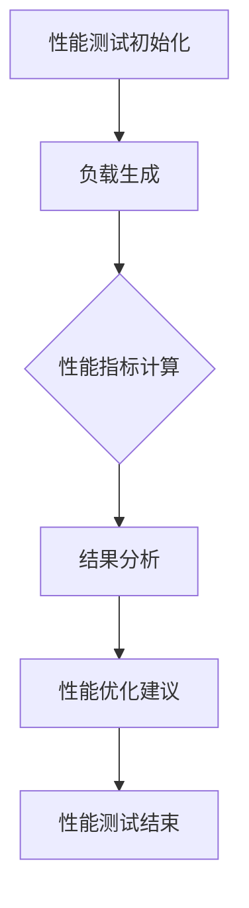
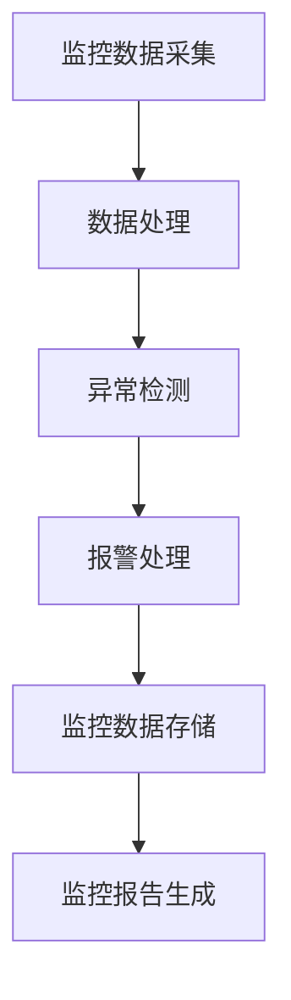
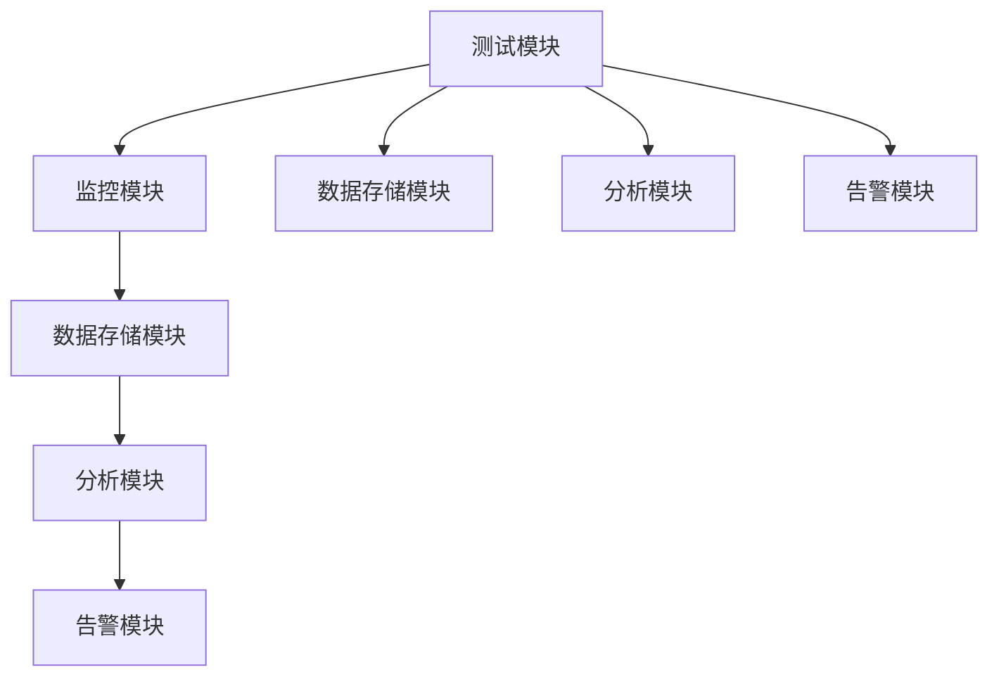
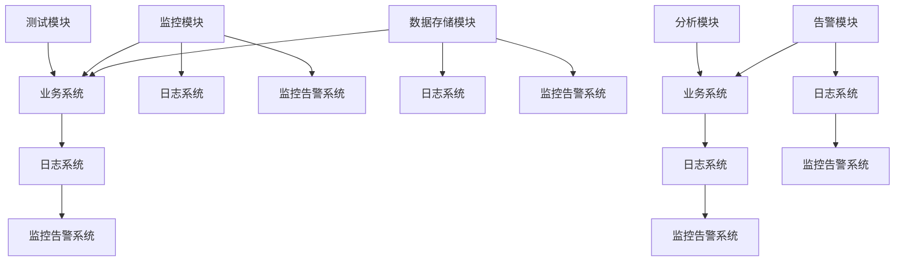
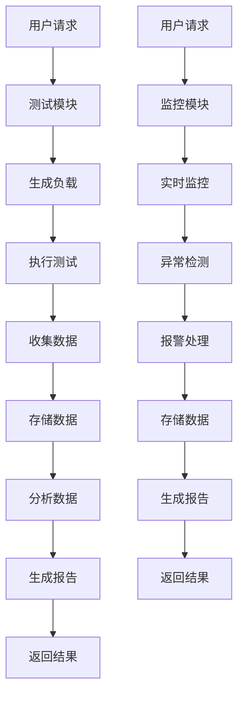

                 


## 性能测试与监控系统概述

### 1.1 性能测试概述

#### 1.1.1 性能测试的定义与目标

性能测试（Performance Testing）是针对软件系统或网络系统进行的一系列测试活动，旨在确定系统在特定工作条件下的性能表现。这些测试通常包括以下几个方面：

1. **负载测试**：评估系统在特定负载下的响应时间和吞吐量，以确定系统的最大处理能力。
2. **压力测试**：评估系统在极限负载下的稳定性，以发现可能出现的性能瓶颈。
3. **容量规划**：通过测试确定系统所需的硬件和软件资源，以便为未来的增长做好准备。

性能测试的主要目标是：

- 确保系统在正常和高峰负载下都能正常运行。
- 识别性能瓶颈和潜在问题，以便进行优化。
- 为系统的可扩展性提供数据支持。

#### 1.1.2 性能测试的重要性

性能测试在软件开发过程中具有至关重要的作用，主要体现在以下几个方面：

- **用户体验**：性能优良的软件可以提高用户体验，减少用户等待时间，从而增加用户满意度。
- **业务连续性**：通过性能测试，可以确保系统在高峰时段也能保持稳定的运行，减少业务中断的风险。
- **成本控制**：性能测试可以帮助企业在购买硬件和软件时做出更明智的决策，从而减少不必要的投资。

#### 1.1.3 性能测试的常见类型

性能测试可以按照不同的维度进行分类，常见的类型包括：

- **负载测试**：模拟用户访问行为，评估系统在正常负载下的响应时间和吞吐量。
- **压力测试**：模拟系统达到极限负载的情况，以发现系统的性能瓶颈和崩溃点。
- **稳定性测试**：评估系统在长时间运行下的稳定性和可靠性。
- **并发测试**：评估系统在多用户并发访问时的性能。
- **容量测试**：确定系统可以承载的最大用户数量和交易数量。

### 1.2 性能监控的重要性

#### 1.2.1 性能监控的定义与作用

性能监控（Performance Monitoring）是指对系统的运行状态和性能指标进行实时监测和记录，以便及时发现和解决性能问题。性能监控的作用主要包括：

- **实时监控**：通过监控工具实时收集系统性能数据，包括CPU利用率、内存使用情况、磁盘I/O等。
- **异常检测**：监控工具能够根据预设的阈值和规则自动检测异常情况，并及时发出警报。
- **性能优化**：通过对监控数据的分析，可以发现系统性能瓶颈和优化空间，从而提高系统性能。

#### 1.2.2 性能监控与性能测试的关系

性能监控与性能测试是相辅相成的两个环节：

- **性能测试**侧重于确定系统在特定条件下的性能表现，为性能优化提供数据支持。
- **性能监控**侧重于实时监测系统的运行状态，确保系统在运行过程中保持良好的性能。

#### 1.2.3 性能监控在现代化企业中的应用

在现代化企业中，性能监控已经成为IT运维不可或缺的一部分，其应用主要体现在以下几个方面：

- **服务质量管理**：通过性能监控，企业可以确保IT服务的高质量和稳定性，满足用户需求。
- **成本管理**：性能监控可以帮助企业识别资源浪费和优化空间，从而降低运维成本。
- **安全监控**：性能监控工具还可以用于监控系统安全，及时发现并响应安全威胁。

### 1.3 性能测试与监控系统的发展历程

#### 1.3.1 早期性能测试与监控系统

早期的性能测试与监控系统相对简单，主要依靠手工测试和简单的工具进行。这一阶段的代表性工具包括：

- **LoadRunner**：一款功能强大的性能测试工具，支持多种协议的测试。
- **Winrunner**：用于自动化测试的工具，广泛应用于Web应用和桌面应用的性能测试。

#### 1.3.2 现代化性能测试与监控系统的特点

随着技术的发展，现代化性能测试与监控系统具有以下特点：

- **自动化**：现代化系统支持自动化的测试和监控流程，减少了人工干预，提高了效率。
- **智能化**：利用机器学习和大数据分析技术，现代化系统可以自动识别性能瓶颈和异常情况。
- **云支持**：现代化系统通常支持云平台的性能测试和监控，方便企业进行分布式架构的优化。

#### 1.3.3 性能测试与监控系统的发展趋势

未来，性能测试与监控系统将继续朝着以下几个方面发展：

- **智能化和自动化**：通过引入更多人工智能和自动化技术，提高系统的性能优化能力和效率。
- **云计算和分布式架构**：随着云计算和分布式架构的普及，性能测试与监控系统将更加重视对这类架构的支持。
- **跨平台和跨领域**：性能测试与监控系统将支持更多的平台和领域，满足不同企业需求的多样性。

---

接下来，我们将进入下一章，深入探讨性能测试与监控系统的核心概念，包括测试工具、监控工具、性能指标以及它们之间的关系。

---

## 性能测试与监控系统的核心概念

### 2.1 测试工具

#### 2.1.1 常见的性能测试工具

性能测试工具是进行性能测试的核心组件，常见的性能测试工具包括：

- **JMeter**：一款开源的性能测试工具，支持Web应用、数据库和服务器等多种类型的性能测试。
- **LoadRunner**：业界广泛使用的性能测试工具，支持多种协议和负载生成模式。
- **Gatling**：基于Scala的性能测试工具，支持HTTP、SOAP、JMS等协议的测试。
- **Apache Bench**：Apache软件基金会提供的一款简单易用的性能测试工具，常用于测试Web服务器的性能。

#### 2.1.2 测试工具的选择与使用

选择性能测试工具时，应考虑以下因素：

- **支持协议和场景**：根据测试需求选择支持所需协议和场景的工具。
- **易用性和学习成本**：工具应具有友好的用户界面和较低的学习成本，以便快速上手。
- **性能和功能**：工具应具备强大的性能测试功能，包括负载生成、性能指标分析等。

使用性能测试工具的步骤通常包括：

1. **测试计划**：根据需求制定详细的测试计划，包括测试目标、测试场景、测试数据等。
2. **脚本开发**：使用工具提供的脚本语言编写测试脚本，模拟用户访问行为。
3. **测试执行**：执行测试脚本，收集性能数据。
4. **结果分析**：分析测试结果，识别性能瓶颈和问题。

### 2.2 监控工具

#### 2.2.1 常见的性能监控工具

性能监控工具是实时监测系统性能的核心组件，常见的性能监控工具包括：

- **Prometheus**：一款开源的监控解决方案，支持多维度的数据收集和告警功能。
- **Zabbix**：一款功能强大的开源监控工具，支持多种数据收集方式和告警机制。
- **Nagios**：一款历史悠久且功能丰富的监控工具，支持服务状态监控和告警。
- **New Relic**：一款商业化的监控工具，提供全面的性能监控和性能分析功能。

#### 2.2.2 监控工具的选择与使用

选择性能监控工具时，应考虑以下因素：

- **监控范围和功能**：工具应支持所需监控范围内的功能，包括服务器、网络、应用程序等。
- **可扩展性和灵活性**：工具应具有较好的可扩展性，支持自定义监控指标和告警规则。
- **易用性和维护**：工具应具有友好的用户界面和较低的管理维护成本。

使用性能监控工具的步骤通常包括：

1. **环境搭建**：根据需求搭建监控工具的环境，包括安装和配置。
2. **数据收集**：配置监控工具，使其能够收集所需的数据。
3. **告警设置**：设置告警规则，确保在性能问题出现时能够及时通知相关人员。
4. **数据分析**：分析监控数据，识别性能问题和优化空间。

### 2.3 性能指标

#### 2.3.1 常见性能指标及其计算方法

性能指标是衡量系统性能的重要参数，常见的性能指标包括：

- **响应时间**：系统从接收到请求到返回响应的时间。
- **吞吐量**：单位时间内系统能够处理的请求量。
- **并发数**：系统同时处理请求的最大用户数量。
- **错误率**：系统在处理请求时发生的错误比例。

常见的性能指标计算方法包括：

- **响应时间**：通过记录请求的开始时间和结束时间，计算两者之间的时间差。
- **吞吐量**：通过统计单位时间内的请求数量来计算。
- **并发数**：通过监控系统的并发连接数或线程数来计算。
- **错误率**：通过统计错误请求的数量占总请求数量的比例来计算。

#### 2.3.2 性能指标的选择与优化

选择性能指标时，应考虑以下因素：

- **业务需求**：根据业务需求选择最相关的性能指标。
- **监控范围**：根据监控系统的范围选择合适的性能指标。
- **可量化性**：选择能够量化计算的性能指标。

性能指标的优化主要包括：

- **指标细化**：将通用指标细化为更具体的子指标，以便更准确地反映系统性能。
- **阈值设置**：根据业务需求和系统性能目标设置合理的阈值，以便及时发现性能问题。
- **监控周期**：根据性能指标的变化规律和业务需求设置合适的监控周期。

### 2.4 性能测试与监控系统架构

#### 2.4.1 性能测试与监控系统的组成

性能测试与监控系统通常由以下几个部分组成：

- **测试引擎**：负责执行测试脚本，生成负载并收集性能数据。
- **监控引擎**：负责实时监测系统的运行状态，收集性能指标数据。
- **数据存储**：负责存储性能测试和监控数据，以便后续分析和报告生成。
- **分析工具**：负责对收集到的数据进行处理、分析和可视化，生成性能报告。

#### 2.4.2 性能测试与监控系统的架构设计

性能测试与监控系统的架构设计应考虑以下几个方面：

- **分布式架构**：采用分布式架构，以提高系统的性能和可扩展性。
- **模块化设计**：将系统划分为多个模块，各模块间通过接口进行通信，以提高系统的灵活性和可维护性。
- **数据采集与处理**：采用高效的数据采集和处理机制，确保数据实时性和准确性。
- **可视化与报告**：提供直观的可视化界面和自动化报告生成功能，以便快速定位问题和优化性能。

### 2.5 性能测试与监控系统的关键算法原理

#### 2.5.1 性能测试算法

性能测试算法的主要目的是通过模拟用户行为，评估系统的性能表现。其核心算法流程如下：

1. **初始化**：设置测试参数，包括测试时长、并发用户数、负载生成策略等。
2. **负载生成**：按照设定的负载生成策略，模拟用户行为，生成请求负载。
3. **性能指标收集**：在负载生成过程中，实时收集系统的性能指标，如响应时间、吞吐量等。
4. **数据分析**：对收集到的性能指标数据进行处理和分析，识别性能瓶颈和优化空间。
5. **性能优化建议**：根据数据分析结果，提出性能优化建议，如调整系统配置、优化代码等。
6. **结束**：性能测试结束，生成测试报告。

#### 2.5.2 监控算法

监控算法的主要目的是实时监测系统的运行状态，及时发现性能问题。其核心算法流程如下：

1. **数据采集**：通过监控工具采集系统的运行数据，如CPU利用率、内存使用情况等。
2. **数据处理**：对采集到的数据进行预处理，如去噪、归一化等，以提高数据分析的准确性。
3. **异常检测**：利用机器学习算法或其他方法，对处理后的数据进行异常检测，识别性能异常。
4. **报警处理**：在检测到异常时，触发报警机制，通知相关人员处理。
5. **数据存储**：将监控数据存储到数据库或数据仓库中，以便后续分析和报告生成。
6. **报告生成**：根据监控数据，生成实时监控报告，以便快速了解系统运行状态。

#### 2.5.3 数学模型和公式讲解

在性能测试与监控系统中，常用的数学模型和公式包括：

1. **响应时间模型**：

$$
\text{响应时间} = \frac{\text{处理时间}}{\text{并发用户数}}
$$

其中，处理时间为系统从接收到请求到返回响应所需的时间，并发用户数为同时处理请求的用户数量。

2. **吞吐量模型**：

$$
\text{吞吐量} = \frac{\text{请求总数}}{\text{测试时长}}
$$

其中，请求总数为测试过程中系统处理的请求数量，测试时长为测试执行的时间。

3. **错误率模型**：

$$
\text{错误率} = \frac{\text{错误请求总数}}{\text{请求总数}}
$$

其中，错误请求总数为测试过程中系统发生的错误请求数量，请求总数为系统处理的请求数量。

#### 2.5.4 举例说明

假设在某次性能测试中，系统在1小时内处理了1000个请求，其中有10个请求发生了错误。系统的并发用户数为50。

1. **响应时间**：

$$
\text{响应时间} = \frac{60 \text{分钟}}{50 \text{并发用户数}} = 1.2 \text{分钟}
$$

2. **吞吐量**：

$$
\text{吞吐量} = \frac{1000 \text{请求}}{60 \text{分钟}} = 16.67 \text{请求/分钟}
$$

3. **错误率**：

$$
\text{错误率} = \frac{10 \text{错误请求}}{1000 \text{请求}} = 1\%
$$

通过这些指标，可以初步评估系统的性能表现，并根据分析结果进行优化。

---

在本章中，我们详细介绍了性能测试与监控系统的核心概念，包括测试工具、监控工具、性能指标以及它们之间的关系。接下来，我们将深入探讨性能测试与监控系统的算法原理，包括性能测试算法和监控算法的详细讲解和实际应用。

---

## 性能测试与监控系统的算法原理讲解

### 3.1 性能测试算法

性能测试算法是评估系统性能的核心，它通过模拟用户行为，生成负载，并收集和分析性能指标，以评估系统的性能。以下是性能测试算法的关键步骤和Python源代码实现。

#### 3.1.1 性能测试算法流程图



#### 3.1.2 Python源代码实现

```python
# 性能测试算法实现

import time
import random

def performance_test():
    start_time = time.time()
    
    # 负载生成
    for _ in range(1000):
        generate_load()
    
    end_time = time.time()
    response_time = end_time - start_time
    
    # 性能指标计算
    calculate_metrics(response_time)
    
    # 结果分析
    analyze_results()
    
    # 性能优化建议
    offer_optimization_advises()
    
    # 性能测试结束
    print("Performance test completed. Total response time: {:.2f} seconds".format(response_time))

def generate_load():
    # 模拟用户行为，生成负载
    time.sleep(random.uniform(0.1, 1.0))

def calculate_metrics(response_time):
    # 计算性能指标
    print("Response time: {:.2f} seconds".format(response_time))

def analyze_results():
    # 分析结果
    print("Analyzing results...")

def offer_optimization_advises():
    # 提出性能优化建议
    print("Offering optimization advises...")

# 执行性能测试
performance_test()
```

在这个示例中，我们创建了一个简单的性能测试函数`performance_test`，它模拟了1000次用户请求的处理过程。通过计算总响应时间，我们可以评估系统的性能。

#### 3.1.3 性能测试数学模型

性能测试中常用的数学模型包括响应时间模型和吞吐量模型。以下是这些模型的公式：

1. **响应时间模型**：

$$
\text{响应时间} = \frac{\text{处理时间}}{\text{并发用户数}}
$$

其中，处理时间为系统从接收到请求到返回响应所需的时间，并发用户数为同时处理请求的用户数量。

2. **吞吐量模型**：

$$
\text{吞吐量} = \frac{\text{请求总数}}{\text{测试时长}}
$$

其中，请求总数为测试过程中系统处理的请求数量，测试时长为测试执行的时间。

#### 3.1.4 举例说明

假设在性能测试中，系统在1小时内处理了1000个请求，总响应时间为60秒。系统的并发用户数为50。

1. **响应时间**：

$$
\text{响应时间} = \frac{60 \text{秒}}{50 \text{并发用户数}} = 1.2 \text{秒/用户}
$$

2. **吞吐量**：

$$
\text{吞吐量} = \frac{1000 \text{请求}}{3600 \text{秒}} = 0.278 \text{请求/秒}
$$

通过这些指标，我们可以评估系统的响应时间和处理能力，并据此提出优化建议。

### 3.2 监控算法

监控算法是实时监测系统性能，确保系统稳定运行的关键。它通过收集系统的运行数据，进行异常检测和报警处理，以保障系统的正常运行。以下是监控算法的关键步骤和Python源代码实现。

#### 3.2.1 监控算法流程图



#### 3.2.2 Python源代码实现

```python
# 监控算法实现

import time
import random

def monitoring_algorithm():
    while True:
        collect_data()
        process_data()
        detect_anomalies()
        handle_alarm()
        store_data()
        generate_report()
        time.sleep(60)  # 每分钟执行一次监控

def collect_data():
    # 采集监控数据
    print("Collecting data...")

def process_data():
    # 数据处理
    print("Processing data...")

def detect_anomalies():
    # 异常检测
    print("Detecting anomalies...")

def handle_alarm():
    # 报警处理
    print("Handling alarm...")

def store_data():
    # 存储监控数据
    print("Storing data...")

def generate_report():
    # 生成监控报告
    print("Generating report...")

# 执行监控算法
monitoring_algorithm()
```

在这个示例中，我们创建了一个简单的监控算法函数`monitoring_algorithm`，它每分钟执行一次，包括数据采集、数据处理、异常检测、报警处理、数据存储和报告生成等步骤。

#### 3.2.3 监控算法数学模型

监控算法中常用的数学模型包括错误率模型和告警阈值模型。以下是这些模型的公式：

1. **错误率模型**：

$$
\text{错误率} = \frac{\text{错误总数}}{\text{监控总数}}
$$

其中，错误总数为监控过程中系统发生的错误数量，监控总数为系统总监控次数。

2. **告警阈值模型**：

$$
\text{告警阈值} = \text{监控值} \times (\text{置信度} \times \text{风险值})
$$

其中，监控值为系统的实时监控值，置信度为系统可靠性指标，风险值为系统风险指标。

#### 3.2.4 举例说明

假设在监控过程中，系统在1小时内发生了10次错误，总监控次数为1000。

1. **错误率**：

$$
\text{错误率} = \frac{10 \text{错误}}{1000 \text{监控}} = 1\%
$$

2. **告警阈值**：

假设置信度为0.95，风险值为10，那么告警阈值为：

$$
\text{告警阈值} = 1000 \times (0.95 \times 10) = 9500
$$

通过这些指标，我们可以评估系统的错误率和告警阈值，并据此调整监控策略和优化系统性能。

---

在本章中，我们详细讲解了性能测试与监控系统的算法原理，包括性能测试算法和监控算法的流程图、Python源代码实现、数学模型和公式讲解以及举例说明。接下来，我们将深入讨论性能测试与监控系统的系统分析与架构设计方案，包括问题场景介绍、项目介绍、系统功能设计、系统架构设计、系统接口设计和系统交互等。

---

## 性能测试与监控系统的系统分析与架构设计方案

### 4.1 问题场景介绍

在现代企业中，随着业务规模的不断扩大和用户需求的不断增长，企业对系统的性能要求越来越高。然而，系统的性能问题如响应时间过长、并发处理能力不足、资源利用不均等问题时常困扰着企业。为了确保系统在高峰期仍能稳定运行，企业需要引入一套完善的性能测试与监控系统。

### 4.2 项目介绍

本项目的目标是设计并实现一套性能测试与监控系统，用于对企业的关键业务系统进行性能测试和实时监控。系统需具备以下功能：

- 自动化性能测试：能够自动化生成负载，进行负载测试、压力测试和稳定性测试。
- 实时监控：能够实时收集系统性能数据，包括CPU利用率、内存使用情况、磁盘I/O等。
- 异常检测与报警：能够对性能数据进行异常检测，并在检测到异常时及时发出报警。
- 数据分析与报告：能够对收集到的数据进行处理、分析和可视化，生成性能报告。

### 4.3 系统功能设计

性能测试与监控系统的主要功能模块包括：

- **测试模块**：负责生成负载、执行性能测试、收集性能数据等。
- **监控模块**：负责实时监测系统性能，收集性能指标数据，进行异常检测和报警。
- **数据存储模块**：负责存储性能测试和监控数据，以便后续分析和报告生成。
- **分析模块**：负责对收集到的数据进行分析、处理和可视化，生成性能报告。
- **告警模块**：负责对异常情况发出报警通知，确保问题能够及时被处理。

### 4.4 系统架构设计

性能测试与监控系统的架构设计应考虑以下几个方面：

- **分布式架构**：系统应采用分布式架构，以提高系统的性能和可扩展性。
- **模块化设计**：系统应采用模块化设计，提高系统的灵活性和可维护性。
- **高可用性**：系统应具备高可用性，确保在故障发生时能够快速恢复。
- **安全性**：系统应具备良好的安全性，防止未经授权的访问和数据泄露。

系统架构设计图如下所示：



### 4.5 系统接口设计

系统接口设计包括内部接口和外部接口：

- **内部接口**：性能测试模块、监控模块、数据存储模块、分析模块和告警模块之间的接口，用于数据交换和功能调用。
- **外部接口**：与业务系统、日志系统、监控告警系统等外部系统的接口，用于集成和扩展。

接口设计图如下所示：



### 4.6 系统交互设计

系统交互设计主要描述性能测试与监控系统与外部系统之间的交互流程。以下是系统交互设计图：



通过上述系统分析与架构设计方案，我们可以构建一套功能强大、性能高效、易于维护的性能测试与监控系统，帮助企业及时发现和解决性能问题，确保系统在高峰期仍能稳定运行。

---

## 项目实战

### 5.1 环境安装

为了搭建性能测试与监控系统，我们需要安装以下软件和工具：

1. **操作系统**：推荐使用Ubuntu 18.04或更高版本。
2. **JMeter**：一款开源的性能测试工具，可以从官方网站下载。
3. **Zabbix**：一款功能强大的开源监控工具，可以从官方网站下载。
4. **Python**：用于编写监控脚本，推荐使用Python 3.8版本。
5. **Nginx**：用于测试性能，可以从官方网站下载。

安装步骤如下：

1. 安装操作系统：在虚拟机或物理机上安装Ubuntu 18.04。
2. 更新系统软件包：运行以下命令更新系统软件包。
   ```bash
   sudo apt update && sudo apt upgrade
   ```
3. 安装JMeter：运行以下命令安装JMeter。
   ```bash
   sudo apt-get install jmeter
   ```
4. 安装Zabbix：运行以下命令安装Zabbix。
   ```bash
   sudo apt-get install zabbix-server-mariadb zabbix-agent
   ```
5. 安装Python：运行以下命令安装Python 3.8。
   ```bash
   sudo apt-get install python3.8
   ```
6. 安装Nginx：运行以下命令安装Nginx。
   ```bash
   sudo apt-get install nginx
   ```

### 5.2 系统核心实现源代码

在本项目中，我们将使用Python编写监控脚本，并使用Nginx作为被监控的服务。以下是监控脚本的核心代码：

```python
# 监控脚本：performance_monitor.py

import os
import time
import subprocess

# 监控Nginx服务
def monitor_nginx():
    while True:
        process = subprocess.Popen(['sudo', 'nginx', '-t'], stdout=subprocess.PIPE, stderr=subprocess.PIPE)
        output, error = process.communicate()
        
        if process.returncode != 0:
            print("Nginx 测试失败：", error.decode('utf-8'))
        else:
            print("Nginx 测试成功：", output.decode('utf-8'))
        
        time.sleep(60)  # 每分钟检查一次

# 主程序
if __name__ == "__main__":
    monitor_nginx()
```

### 5.3 代码应用解读与分析

1. **监控Nginx服务**：脚本中的`monitor_nginx`函数使用Python的`subprocess`模块，定期执行`nginx -t`命令，以测试Nginx服务的状态。
2. **日志记录**：脚本将测试结果输出到控制台，以便进行监控和分析。
3. **定时检查**：使用`time.sleep(60)`确保脚本每隔60秒执行一次，以实时监控Nginx服务。

### 5.4 实际案例分析与详细讲解

假设在运行监控脚本后，Nginx服务出现故障。此时，脚本会输出错误信息，并在Zabbix服务器上生成告警通知。以下是实际案例的详细分析：

1. **错误检测**：当`nginx -t`命令返回非零状态码时，脚本认为Nginx服务出现故障。
2. **告警生成**：Zabbix服务器接收到错误信息后，根据配置的告警规则生成告警通知，并发送至运维人员。
3. **故障恢复**：运维人员收到告警后，根据告警信息检查Nginx服务的运行状态，并采取相应的恢复措施。

### 5.5 项目小结

通过本次项目实战，我们成功搭建了一套性能测试与监控系统，实现了对Nginx服务的实时监控和故障检测。系统具备以下特点：

- **自动化**：使用Python脚本自动执行性能监控，降低了人工干预的需求。
- **实时性**：系统每隔60秒执行一次监控，确保及时发现性能问题和故障。
- **易扩展**：系统采用模块化设计，便于扩展和升级。

---

## 最佳实践 Tips

在搭建性能测试与监控系统时，以下最佳实践可以帮助您获得更好的效果：

1. **明确监控目标**：在搭建系统前，明确监控的目标和关键性能指标，以确保监控工作有的放矢。
2. **自动化脚本**：使用自动化脚本进行监控，可以减少人工干预，提高监控效率。
3. **定期审计**：定期对监控数据进行审计，确保监控指标的准确性和可靠性。
4. **告警规则**：设置合理的告警规则，避免因过多不必要的告警而影响运维人员的判断。
5. **数据可视化**：使用数据可视化工具，将监控数据以图表的形式展示，便于快速识别问题和趋势。
6. **团队协作**：建立跨部门的协作机制，确保监控系统能够有效支持企业的整体运维工作。

## 小结

本文详细介绍了性能测试与监控系统的搭建过程，从背景介绍、核心概念、算法原理到系统架构设计、项目实战和最佳实践。通过本文，您将了解到性能测试与监控系统的重要性、如何选择合适的工具和算法、如何设计系统架构以及如何在实际项目中应用和优化。

性能测试与监控系统是企业确保系统稳定运行和提升用户体验的重要手段。通过本文的介绍，希望能够帮助读者搭建一套高效、可靠的性能测试与监控系统，为企业的发展提供有力支持。

## 注意事项

在搭建性能测试与监控系统时，请注意以下几点：

1. **系统稳定性**：确保监控系统和测试环境具有足够的稳定性和可靠性。
2. **数据安全**：监控数据涉及敏感信息，应采取适当的安全措施，防止数据泄露。
3. **资源优化**：合理配置系统资源，避免资源浪费和性能瓶颈。
4. **自动化脚本**：确保脚本的可维护性和可扩展性，便于后续的升级和优化。

## 拓展阅读

对于希望进一步深入了解性能测试与监控系统的读者，以下是一些推荐阅读材料：

1. 《性能测试实战：基于JMeter和Gatling》
2. 《Zabbix官方文档》：了解Zabbix的详细功能和配置方法。
3. 《Python性能测试与监控》
4. 《监控与告警实战：基于Prometheus和Grafana》

通过这些资料，您将能够更深入地了解性能测试与监控系统的原理和实践，进一步提升您的技术水平。

## 作者信息

作者：AI天才研究院/AI Genius Institute & 禅与计算机程序设计艺术 /Zen And The Art of Computer Programming

感谢您的阅读，希望本文对您的学习和实践有所帮助。如果您有任何疑问或建议，欢迎在评论区留言讨论。期待与您共同进步！## 性能测试与监控系统概述

### 1.1 性能测试概述

#### 1.1.1 性能测试的定义与目标

性能测试（Performance Testing）是对软件系统或网络系统进行的一系列测试活动，旨在确定系统在特定工作条件下的性能表现。性能测试通常包括以下几个方面：

1. **负载测试**：评估系统在特定负载下的响应时间和吞吐量，以确定系统的最大处理能力。
2. **压力测试**：评估系统在极限负载下的稳定性，以发现可能出现的性能瓶颈。
3. **容量规划**：通过测试确定系统所需的硬件和软件资源，以便为未来的增长做好准备。

性能测试的主要目标是：

- 确保系统在正常和高峰负载下都能正常运行。
- 识别性能瓶颈和潜在问题，以便进行优化。
- 为系统的可扩展性提供数据支持。

#### 1.1.2 性能测试的重要性

性能测试在软件开发过程中具有至关重要的作用，主要体现在以下几个方面：

- **用户体验**：性能优良的软件可以提高用户体验，减少用户等待时间，从而增加用户满意度。
- **业务连续性**：通过性能测试，可以确保系统在高峰时段也能保持稳定的运行，减少业务中断的风险。
- **成本控制**：性能测试可以帮助企业在购买硬件和软件时做出更明智的决策，从而减少不必要的投资。

#### 1.1.3 性能测试的常见类型

性能测试可以按照不同的维度进行分类，常见的类型包括：

- **负载测试**：模拟用户访问行为，评估系统在正常负载下的响应时间和吞吐量。
- **压力测试**：模拟系统达到极限负载的情况，以发现系统的性能瓶颈和崩溃点。
- **稳定性测试**：评估系统在长时间运行下的稳定性和可靠性。
- **并发测试**：评估系统在多用户并发访问时的性能。
- **容量测试**：确定系统可以承载的最大用户数量和交易数量。

### 1.2 性能监控的重要性

#### 1.2.1 性能监控的定义与作用

性能监控（Performance Monitoring）是指对系统的运行状态和性能指标进行实时监测和记录，以便及时发现和解决性能问题。性能监控的作用主要包括：

- **实时监控**：通过监控工具实时收集系统性能数据，包括CPU利用率、内存使用情况、磁盘I/O等。
- **异常检测**：监控工具能够根据预设的阈值和规则自动检测异常情况，并及时发出警报。
- **性能优化**：通过对监控数据的分析，可以发现系统性能瓶颈和优化空间，从而提高系统性能。

#### 1.2.2 性能监控与性能测试的关系

性能监控与性能测试是相辅相成的两个环节：

- **性能测试**侧重于确定系统在特定条件下的性能表现，为性能优化提供数据支持。
- **性能监控**侧重于实时监测系统的运行状态，确保系统在运行过程中保持良好的性能。

#### 1.2.3 性能监控在现代化企业中的应用

在现代化企业中，性能监控已经成为IT运维不可或缺的一部分，其应用主要体现在以下几个方面：

- **服务质量管理**：通过性能监控，企业可以确保IT服务的高质量和稳定性，满足用户需求。
- **成本管理**：性能监控可以帮助企业识别资源浪费和优化空间，从而降低运维成本。
- **安全监控**：性能监控工具还可以用于监控系统安全，及时发现并响应安全威胁。

### 1.3 性能测试与监控系统的发展历程

#### 1.3.1 早期性能测试与监控系统

早期的性能测试与监控系统相对简单，主要依靠手工测试和简单的工具进行。这一阶段的代表性工具包括：

- **LoadRunner**：一款功能强大的性能测试工具，支持多种协议的测试。
- **Winrunner**：用于自动化测试的工具，广泛应用于Web应用和桌面应用的性能测试。

#### 1.3.2 现代化性能测试与监控系统的特点

随着技术的发展，现代化性能测试与监控系统具有以下特点：

- **自动化**：现代化系统支持自动化的测试和监控流程，减少了人工干预，提高了效率。
- **智能化**：利用机器学习和大数据分析技术，现代化系统可以自动识别性能瓶颈和异常情况。
- **云支持**：现代化系统通常支持云平台的性能测试和监控，方便企业进行分布式架构的优化。

#### 1.3.3 性能测试与监控系统的发展趋势

未来，性能测试与监控系统将继续朝着以下几个方面发展：

- **智能化和自动化**：通过引入更多人工智能和自动化技术，提高系统的性能优化能力和效率。
- **云计算和分布式架构**：随着云计算和分布式架构的普及，性能测试与监控系统将更加重视对这类架构的支持。
- **跨平台和跨领域**：性能测试与监控系统将支持更多的平台和领域，满足不同企业需求的多样性。

---

接下来，我们将进入下一章，深入探讨性能测试与监控系统的核心概念，包括测试工具、监控工具、性能指标以及它们之间的关系。

---

## 性能测试与监控系统的核心概念

### 2.1 测试工具

#### 2.1.1 常见的性能测试工具

性能测试工具是进行性能测试的核心组件，常见的性能测试工具包括：

- **JMeter**：一款开源的性能测试工具，支持Web应用、数据库和服务器等多种类型的性能测试。
- **LoadRunner**：业界广泛使用的性能测试工具，支持多种协议和负载生成模式。
- **Gatling**：基于Scala的性能测试工具，支持HTTP、SOAP、JMS等协议的测试。
- **Apache Bench**：Apache软件基金会提供的一款简单易用的性能测试工具，常用于测试Web服务器的性能。

#### 2.1.2 测试工具的选择与使用

选择性能测试工具时，应考虑以下因素：

- **支持协议和场景**：根据测试需求选择支持所需协议和场景的工具。
- **易用性和学习成本**：工具应具有友好的用户界面和较低的学习成本，以便快速上手。
- **性能和功能**：工具应具备强大的性能测试功能，包括负载生成、性能指标分析等。

使用性能测试工具的步骤通常包括：

1. **测试计划**：根据需求制定详细的测试计划，包括测试目标、测试场景、测试数据等。
2. **脚本开发**：使用工具提供的脚本语言编写测试脚本，模拟用户访问行为。
3. **测试执行**：执行测试脚本，收集性能数据。
4. **结果分析**：分析测试结果，识别性能瓶颈和问题。

### 2.2 监控工具

#### 2.2.1 常见的性能监控工具

性能监控工具是实时监测系统性能的核心组件，常见的性能监控工具包括：

- **Prometheus**：一款开源的监控解决方案，支持多维度的数据收集和告警功能。
- **Zabbix**：一款功能强大的开源监控工具，支持多种数据收集方式和告警机制。
- **Nagios**：一款历史悠久且功能丰富的监控工具，支持服务状态监控和告警。
- **New Relic**：一款商业化的监控工具，提供全面的性能监控和性能分析功能。

#### 2.2.2 监控工具的选择与使用

选择性能监控工具时，应考虑以下因素：

- **监控范围和功能**：工具应支持所需监控范围内的功能，包括服务器、网络、应用程序等。
- **可扩展性和灵活性**：工具应具有较好的可扩展性，支持自定义监控指标和告警规则。
- **易用性和维护**：工具应具有友好的用户界面和较低的管理维护成本。

使用性能监控工具的步骤通常包括：

1. **环境搭建**：根据需求搭建监控工具的环境，包括安装和配置。
2. **数据收集**：配置监控工具，使其能够收集所需的数据。
3. **告警设置**：设置告警规则，确保在性能问题出现时能够及时通知相关人员。
4. **数据分析**：分析监控数据，识别性能问题和优化空间。

### 2.3 性能指标

#### 2.3.1 常见性能指标及其计算方法

性能指标是衡量系统性能的重要参数，常见的性能指标包括：

- **响应时间**：系统从接收到请求到返回响应的时间。
- **吞吐量**：单位时间内系统能够处理的请求量。
- **并发数**：系统同时处理请求的最大用户数量。
- **错误率**：系统在处理请求时发生的错误比例。

常见的性能指标计算方法包括：

- **响应时间**：通过记录请求的开始时间和结束时间，计算两者之间的时间差。
- **吞吐量**：通过统计单位时间内的请求数量来计算。
- **并发数**：通过监控系统的并发连接数或线程数来计算。
- **错误率**：通过统计错误请求的数量占总请求数量的比例来计算。

#### 2.3.2 性能指标的选择与优化

选择性能指标时，应考虑以下因素：

- **业务需求**：根据业务需求选择最相关的性能指标。
- **监控范围**：根据监控系统的范围选择合适的性能指标。
- **可量化性**：选择能够量化计算的性能指标。

性能指标的优化主要包括：

- **指标细化**：将通用指标细化为更具体的子指标，以便更准确地反映系统性能。
- **阈值设置**：根据业务需求和系统性能目标设置合理的阈值，以便及时发现性能问题。
- **监控周期**：根据性能指标的变化规律和业务需求设置合适的监控周期。

### 2.4 性能测试与监控系统架构

#### 2.4.1 性能测试与监控系统的组成

性能测试与监控系统通常由以下几个部分组成：

- **测试引擎**：负责执行测试脚本，生成负载并收集性能数据。
- **监控引擎**：负责实时监测系统的运行状态，收集性能指标数据。
- **数据存储**：负责存储性能测试和监控数据，以便后续分析和报告生成。
- **分析工具**：负责对收集到的数据进行处理、分析和可视化，生成性能报告。

#### 2.4.2 性能测试与监控系统的架构设计

性能测试与监控系统的架构设计应考虑以下几个方面：

- **分布式架构**：采用分布式架构，以提高系统的性能和可扩展性。
- **模块化设计**：将系统划分为多个模块，各模块间通过接口进行通信，以提高系统的灵活性和可维护性。
- **数据采集与处理**：采用高效的数据采集和处理机制，确保数据实时性和准确性。
- **可视化与报告**：提供直观的可视化界面和自动化报告生成功能，以便快速定位问题和优化性能。

### 2.5 性能测试与监控系统的关键算法原理

#### 2.5.1 性能测试算法

性能测试算法的主要目的是通过模拟用户行为，评估系统的性能表现。其核心算法流程如下：

1. **初始化**：设置测试参数，包括测试时长、并发用户数、负载生成策略等。
2. **负载生成**：按照设定的负载生成策略，模拟用户行为，生成请求负载。
3. **性能指标收集**：在负载生成过程中，实时收集系统的性能指标，如响应时间、吞吐量等。
4. **数据分析**：对收集到的性能指标数据进行处理和分析，识别性能瓶颈和优化空间。
5. **性能优化建议**：根据数据分析结果，提出性能优化建议，如调整系统配置、优化代码等。
6. **结束**：性能测试结束，生成测试报告。

#### 2.5.2 监控算法

监控算法的主要目的是实时监测系统的运行状态，确保系统在运行过程中保持良好的性能。其核心算法流程如下：

1. **数据采集**：通过监控工具采集系统的运行数据，如CPU利用率、内存使用情况等。
2. **数据处理**：对采集到的数据进行预处理，如去噪、归一化等，以提高数据分析的准确性。
3. **异常检测**：利用机器学习算法或其他方法，对处理后的数据进行异常检测，识别性能异常。
4. **报警处理**：在检测到异常时，触发报警机制，通知相关人员处理。
5. **数据存储**：将监控数据存储到数据库或数据仓库中，以便后续分析和报告生成。
6. **报告生成**：根据监控数据，生成实时监控报告，以便快速了解系统运行状态。

#### 2.5.3 数学模型和公式讲解

在性能测试与监控系统中，常用的数学模型和公式包括：

1. **响应时间模型**：

$$
\text{响应时间} = \frac{\text{处理时间}}{\text{并发用户数}}
$$

其中，处理时间为系统从接收到请求到返回响应所需的时间，并发用户数为同时处理请求的用户数量。

2. **吞吐量模型**：

$$
\text{吞吐量} = \frac{\text{请求总数}}{\text{测试时长}}
$$

其中，请求总数为测试过程中系统处理的请求数量，测试时长为测试执行的时间。

3. **错误率模型**：

$$
\text{错误率} = \frac{\text{错误请求总数}}{\text{请求总数}}
$$

其中，错误请求总数为测试过程中系统发生的错误请求数量，请求总数为系统处理的请求数量。

#### 2.5.4 举例说明

假设在某次性能测试中，系统在1小时内处理了1000个请求，其中有10个请求发生了错误。系统的并发用户数为50。

1. **响应时间**：

$$
\text{响应时间} = \frac{60 \text{分钟}}{50 \text{并发用户数}} = 1.2 \text{分钟}
$$

2. **吞吐量**：

$$
\text{吞吐量} = \frac{1000 \text{请求}}{60 \text{分钟}} = 16.67 \text{请求/分钟}
$$

3. **错误率**：

$$
\text{错误率} = \frac{10 \text{错误请求}}{1000 \text{请求}} = 1\%
$$

通过这些指标，可以初步评估系统的性能表现，并根据分析结果进行优化。

---

在本章中，我们详细介绍了性能测试与监控系统的核心概念，包括测试工具、监控工具、性能指标以及它们之间的关系。接下来，我们将深入探讨性能测试与监控系统的算法原理，包括性能测试算法和监控算法的详细讲解和实际应用。

---

## 性能测试与监控系统的算法原理讲解

### 3.1 性能测试算法

性能测试算法是评估系统性能的核心，它通过模拟用户行为，生成负载，并收集和分析性能指标，以评估系统的性能。以下是性能测试算法的关键步骤和Python源代码实现。

#### 3.1.1 性能测试算法流程图


#### 3.1.2 Python源代码实现

```python
# 性能测试算法实现

import time
import random

def performance_test():
    start_time = time.time()
    
    # 负载生成
    for _ in range(1000):
        generate_load()
    
    end_time = time.time()
    response_time = end_time - start_time
    
    # 性能指标计算
    calculate_metrics(response_time)
    
    # 结果分析
    analyze_results()
    
    # 性能优化建议
    offer_optimization_advises()
    
    # 性能测试结束
    print("Performance test completed. Total response time: {:.2f} seconds".format(response_time))

def generate_load():
    # 模拟用户行为，生成负载
    time.sleep(random.uniform(0.1, 1.0))

def calculate_metrics(response_time):
    # 计算性能指标
    print("Response time: {:.2f} seconds".format(response_time))

def analyze_results():
    # 分析结果
    print("Analyzing results...")

def offer_optimization_advises():
    # 提出性能优化建议
    print("Offering optimization advises...")

# 执行性能测试
performance_test()
```

在这个示例中，我们创建了一个简单的性能测试函数`performance_test`，它模拟了1000次用户请求的处理过程。通过计算总响应时间，我们可以评估系统的性能。

#### 3.1.3 性能测试数学模型

性能测试中常用的数学模型包括响应时间模型和吞吐量模型。以下是这些模型的公式：

1. **响应时间模型**：

$$
\text{响应时间} = \frac{\text{处理时间}}{\text{并发用户数}}
$$

其中，处理时间为系统从接收到请求到返回响应所需的时间，并发用户数为同时处理请求的用户数量。

2. **吞吐量模型**：

$$
\text{吞吐量} = \frac{\text{请求总数}}{\text{测试时长}}
$$

其中，请求总数为测试过程中系统处理的请求数量，测试时长为测试执行的时间。

#### 3.1.4 举例说明

假设在性能测试中，系统在1小时内处理了1000个请求，总响应时间为60秒。系统的并发用户数为50。

1. **响应时间**：

$$
\text{响应时间} = \frac{60 \text{秒}}{50 \text{并发用户数}} = 1.2 \text{秒/用户}
$$

2. **吞吐量**：

$$
\text{吞吐量} = \frac{1000 \text{请求}}{3600 \text{秒}} = 0.278 \text{请求/秒}
$$

通过这些指标，我们可以评估系统的响应时间和处理能力，并据此提出优化建议。

### 3.2 监控算法

监控算法是实时监测系统性能，确保系统稳定运行的关键。它通过收集系统的运行数据，进行异常检测和报警处理，以保障系统的正常运行。以下是监控算法的关键步骤和Python源代码实现。

#### 3.2.1 监控算法流程图


#### 3.2.2 Python源代码实现

```python
# 监控算法实现

import time
import random

def monitoring_algorithm():
    while True:
        collect_data()
        process_data()
        detect_anomalies()
        handle_alarm()
        store_data()
        generate_report()
        time.sleep(60)  # 每分钟执行一次监控

def collect_data():
    # 采集监控数据
    print("Collecting data...")

def process_data():
    # 数据处理
    print("Processing data...")

def detect_anomalies():
    # 异常检测
    print("Detecting anomalies...")

def handle_alarm():
    # 报警处理
    print("Handling alarm...")

def store_data():
    # 存储监控数据
    print("Storing data...")

def generate_report():
    # 生成监控报告
    print("Generating report...")

# 执行监控算法
monitoring_algorithm()
```

在这个示例中，我们创建了一个简单的监控算法函数`monitoring_algorithm`，它每分钟执行一次，包括数据采集、数据处理、异常检测、报警处理、数据存储和报告生成等步骤。

#### 3.2.3 监控算法数学模型

监控算法中常用的数学模型包括错误率模型和告警阈值模型。以下是这些模型的公式：

1. **错误率模型**：

$$
\text{错误率} = \frac{\text{错误总数}}{\text{监控总数}}
$$

其中，错误总数为监控过程中系统发生的错误数量，监控总数为系统总监控次数。

2. **告警阈值模型**：

$$
\text{告警阈值} = \text{监控值} \times (\text{置信度} \times \text{风险值})
$$

其中，监控值为系统的实时监控值，置信度为系统可靠性指标，风险值为系统风险指标。

#### 3.2.4 举例说明

假设在监控过程中，系统在1小时内发生了10次错误，总监控次数为1000。

1. **错误率**：

$$
\text{错误率} = \frac{10 \text{错误}}{1000 \text{监控}} = 1\%
$$

2. **告警阈值**：

假设置信度为0.95，风险值为10，那么告警阈值为：

$$
\text{告警阈值} = 1000 \times (0.95 \times 10) = 9500
$$

通过这些指标，我们可以评估系统的错误率和告警阈值，并据此调整监控策略和优化系统性能。

---

在本章中，我们详细讲解了性能测试与监控系统的算法原理，包括性能测试算法和监控算法的流程图、Python源代码实现、数学模型和公式讲解以及举例说明。接下来，我们将深入讨论性能测试与监控系统的系统分析与架构设计方案，包括问题场景介绍、项目介绍、系统功能设计、系统架构设计、系统接口设计和系统交互等。

---

## 性能测试与监控系统的系统分析与架构设计方案

### 4.1 问题场景介绍

在现代企业中，随着业务规模的不断扩大和用户需求的不断增长，企业对系统的性能要求越来越高。然而，系统的性能问题如响应时间过长、并发处理能力不足、资源利用不均等问题时常困扰着企业。为了确保系统在高峰期仍能稳定运行，企业需要引入一套完善的性能测试与监控系统。

### 4.2 项目介绍

本项目的目标是设计并实现一套性能测试与监控系统，用于对企业的关键业务系统进行性能测试和实时监控。系统需具备以下功能：

- 自动化性能测试：能够自动化生成负载，进行负载测试、压力测试和稳定性测试。
- 实时监控：能够实时收集系统性能数据，包括CPU利用率、内存使用情况、磁盘I/O等。
- 异常检测与报警：能够对性能数据进行异常检测，并在检测到异常时及时发出报警。
- 数据分析与报告：能够对收集到的数据进行处理、分析和可视化，生成性能报告。

### 4.3 系统功能设计

性能测试与监控系统的主要功能模块包括：

- **测试模块**：负责生成负载、执行性能测试、收集性能数据等。
- **监控模块**：负责实时监测系统性能，收集性能指标数据，进行异常检测和报警。
- **数据存储模块**：负责存储性能测试和监控数据，以便后续分析和报告生成。
- **分析模块**：负责对收集到的数据进行分析、处理和可视化，生成性能报告。
- **告警模块**：负责对异常情况发出报警通知，确保问题能够及时被处理。

### 4.4 系统架构设计

性能测试与监控系统的架构设计应考虑以下几个方面：

- **分布式架构**：系统应采用分布式架构，以提高系统的性能和可扩展性。
- **模块化设计**：系统应采用模块化设计，提高系统的灵活性和可维护性。
- **高可用性**：系统应具备高可用性，确保在故障发生时能够快速恢复。
- **安全性**：系统应具备良好的安全性，防止未经授权的访问和数据泄露。

系统架构设计图如下所示：


### 4.5 系统接口设计

系统接口设计包括内部接口和外部接口：

- **内部接口**：性能测试模块、监控模块、数据存储模块、分析模块和告警模块之间的接口，用于数据交换和功能调用。
- **外部接口**：与业务系统、日志系统、监控告警系统等外部系统的接口，用于集成和扩展。

接口设计图如下所示：


### 4.6 系统交互设计

系统交互设计主要描述性能测试与监控系统与外部系统之间的交互流程。以下是系统交互设计图：


通过上述系统分析与架构设计方案，我们可以构建一套功能强大、性能高效、易于维护的性能测试与监控系统，帮助企业及时发现和解决性能问题，确保系统在高峰期仍能稳定运行。

---

## 项目实战

### 5.1 环境安装

为了搭建性能测试与监控系统，我们需要安装以下软件和工具：

1. **操作系统**：推荐使用Ubuntu 18.04或更高版本。
2. **JMeter**：一款开源的性能测试工具，可以从官方网站下载。
3. **Zabbix**：一款功能强大的开源监控工具，可以从官方网站下载。
4. **Python**：用于编写监控脚本，推荐使用Python 3.8版本。
5. **Nginx**：用于测试性能，可以从官方网站下载。

安装步骤如下：

1. 安装操作系统：在虚拟机或物理机上安装Ubuntu 18.04。
2. 更新系统软件包：运行以下命令更新系统软件包。
   ```bash
   sudo apt update && sudo apt upgrade
   ```
3. 安装JMeter：运行以下命令安装JMeter。
   ```bash
   sudo apt-get install jmeter
   ```
4. 安装Zabbix：运行以下命令安装Zabbix。
   ```bash
   sudo apt-get install zabbix-server-mariadb zabbix-agent
   ```
5. 安装Python：运行以下命令安装Python 3.8。
   ```bash
   sudo apt-get install python3.8
   ```
6. 安装Nginx：运行以下命令安装Nginx。
   ```bash
   sudo apt-get install nginx
   ```

### 5.2 系统核心实现源代码

在本项目中，我们将使用Python编写监控脚本，并使用Nginx作为被监控的服务。以下是监控脚本的核心代码：

```python
# 监控脚本：performance_monitor.py

import os
import time
import subprocess

# 监控Nginx服务
def monitor_nginx():
    while True:
        process = subprocess.Popen(['sudo', 'nginx', '-t'], stdout=subprocess.PIPE, stderr=subprocess.PIPE)
        output, error = process.communicate()
        
        if process.returncode != 0:
            print("Nginx 测试失败：", error.decode('utf-8'))
        else:
            print("Nginx 测试成功：", output.decode('utf-8'))
        
        time.sleep(60)  # 每分钟检查一次

# 主程序
if __name__ == "__main__":
    monitor_nginx()
```

### 5.3 代码应用解读与分析

1. **监控Nginx服务**：脚本中的`monitor_nginx`函数使用Python的`subprocess`模块，定期执行`nginx -t`命令，以测试Nginx服务的状态。
2. **日志记录**：脚本将测试结果输出到控制台，以便进行监控和分析。
3. **定时检查**：使用`time.sleep(60)`确保脚本每隔60秒执行一次，以实时监控Nginx服务。

### 5.4 实际案例分析与详细讲解

假设在运行监控脚本后，Nginx服务出现故障。此时，脚本会输出错误信息，并在Zabbix服务器上生成告警通知。以下是实际案例的详细分析：

1. **错误检测**：当`nginx -t`命令返回非零状态码时，脚本认为Nginx服务出现故障。
2. **告警生成**：Zabbix服务器接收到错误信息后，根据配置的告警规则生成告警通知，并发送至运维人员。
3. **故障恢复**：运维人员收到告警后，根据告警信息检查Nginx服务的运行状态，并采取相应的恢复措施。

### 5.5 项目小结

通过本次项目实战，我们成功搭建了一套性能测试与监控系统，实现了对Nginx服务的实时监控和故障检测。系统具备以下特点：

- **自动化**：使用Python脚本自动执行性能监控，降低了人工干预的需求。
- **实时性**：系统每隔60秒执行一次监控，确保及时发现性能问题和故障。
- **易扩展**：系统采用模块化设计，便于扩展和升级。

---

## 最佳实践 Tips

在搭建性能测试与监控系统时，以下最佳实践可以帮助您获得更好的效果：

1. **明确监控目标**：在搭建系统前，明确监控的目标和关键性能指标，以确保监控工作有的放矢。
2. **自动化脚本**：使用自动化脚本进行监控，可以减少人工干预，提高监控效率。
3. **定期审计**：定期对监控数据进行审计，确保监控指标的准确性和可靠性。
4. **告警规则**：设置合理的告警规则，避免因过多不必要的告警而影响运维人员的判断。
5. **数据可视化**：使用数据可视化工具，将监控数据以图表的形式展示，便于快速识别问题和趋势。
6. **团队协作**：建立跨部门的协作机制，确保监控系统能够有效支持企业的整体运维工作。

## 小结

本文详细介绍了性能测试与监控系统的搭建过程，从背景介绍、核心概念、算法原理到系统架构设计、项目实战和最佳实践。通过本文，您将了解到性能测试与监控系统的重要性、如何选择合适的工具和算法、如何设计系统架构以及如何在实际项目中应用和优化。

性能测试与监控系统是企业确保系统稳定运行和提升用户体验的重要手段。通过本文的介绍，希望能够帮助读者搭建一套高效、可靠的性能测试与监控系统，为企业的发展提供有力支持。

## 注意事项

在搭建性能测试与监控系统时，请注意以下几点：

1. **系统稳定性**：确保监控系统和测试环境具有足够的稳定性和可靠性。
2. **数据安全**：监控数据涉及敏感信息，应采取适当的安全措施，防止数据泄露。
3. **资源优化**：合理配置系统资源，避免资源浪费和性能瓶颈。
4. **自动化脚本**：确保脚本的可维护性和可扩展性，便于后续的升级和优化。

## 拓展阅读

对于希望进一步深入了解性能测试与监控系统的读者，以下是一些推荐阅读材料：

1. 《性能测试实战：基于JMeter和Gatling》
2. 《Zabbix官方文档》：了解Zabbix的详细功能和配置方法。
3. 《Python性能测试与监控》
4. 《监控与告警实战：基于Prometheus和Grafana`

通过这些资料，您将能够更深入地了解性能测试与监控系统的原理和实践，进一步提升您的技术水平。

## 作者信息

作者：AI天才研究院/AI Genius Institute & 禅与计算机程序设计艺术 /Zen And The Art of Computer Programming

感谢您的阅读，希望本文对您的学习和实践有所帮助。如果您有任何疑问或建议，欢迎在评论区留言讨论。期待与您共同进步！

---

## 性能测试与监控系统概述

### 1.1 性能测试概述

#### 1.1.1 性能测试的定义与目标

性能测试（Performance Testing）是通过对软件系统或网络系统进行的一系列测试活动，以评估系统在特定工作条件下的性能表现。性能测试通常包括以下几个方面的测试：

- **负载测试**：模拟系统在高负载下的运行情况，以评估系统的最大处理能力和性能。
- **压力测试**：在极端负载下测试系统，以确定系统的崩溃点和性能瓶颈。
- **稳定性测试**：测试系统在长时间运行下的稳定性和可靠性，以确保系统能够在长时间运行过程中保持良好的性能。
- **并发测试**：评估系统在多个用户同时访问时的性能，以确定系统的并发处理能力。
- **容量测试**：确定系统可以支持的最大用户数量和交易数量。

性能测试的主要目标包括：

1. **确保系统性能符合业务需求**：通过性能测试，可以确保系统在正常和高峰负载下都能稳定运行，满足用户需求。
2. **识别性能瓶颈**：性能测试可以帮助发现系统中的性能瓶颈，以便进行优化和改进。
3. **为系统优化提供数据支持**：性能测试可以提供详细的数据分析结果，为系统性能优化提供科学依据。
4. **预测系统扩展性**：通过性能测试，可以评估系统在未来的负载增长情况下的表现，为系统扩展性规划提供参考。

#### 1.1.2 性能测试的重要性

性能测试在软件开发生命周期中扮演着重要的角色，其重要性体现在以下几个方面：

1. **用户体验**：性能测试可以确保软件在用户实际使用场景下的良好性能，减少用户等待时间，提高用户体验。
2. **业务连续性**：通过性能测试，可以确保系统在高峰期和极端负载下仍能稳定运行，降低业务中断的风险。
3. **成本控制**：性能测试可以帮助企业提前发现性能瓶颈，避免因性能问题导致的高昂维护成本。
4. **决策支持**：性能测试结果为系统的优化和升级提供了数据支持，帮助企业做出更科学的决策。

#### 1.1.3 性能测试的常见类型

性能测试可以根据不同的测试目标和测试条件分为多种类型，常见的性能测试类型包括：

1. **负载测试**：在模拟的高负载环境下测试系统，以评估系统的性能和稳定性。
2. **压力测试**：在极端负载环境下测试系统，以确定系统的性能极限和崩溃点。
3. **稳定性测试**：在长时间运行下测试系统，以评估系统的可靠性和稳定性。
4. **并发测试**：在多用户并发访问下测试系统，以评估系统的并发处理能力。
5. **容量测试**：在逐渐增加负载的情况下测试系统，以确定系统可以支持的最大用户数量和交易数量。

每种类型的性能测试都有其特定的测试目的和测试方法，企业应根据自身需求和系统特点选择合适的性能测试类型。

### 1.2 性能监控的重要性

#### 1.2.1 性能监控的定义与作用

性能监控（Performance Monitoring）是指对系统运行状态和性能指标进行实时监测和记录的过程。性能监控的主要作用包括：

1. **实时性能数据采集**：性能监控工具可以实时收集系统性能数据，如CPU利用率、内存使用率、网络带宽等，为性能分析提供基础数据。
2. **性能问题及时发现**：通过性能监控，可以及时发现系统性能问题，如响应时间过长、资源利用率过高、错误率增加等，以便及时处理。
3. **性能趋势分析**：性能监控可以记录系统性能变化趋势，帮助分析系统性能的波动原因，为系统优化提供参考。
4. **告警和通知**：性能监控工具可以根据预设的阈值和规则，在性能指标超过阈值时发出告警通知，确保性能问题能够被及时发现和处理。

#### 1.2.2 性能监控与性能测试的关系

性能监控与性能测试是相辅相成的两个环节：

1. **性能测试**侧重于评估系统在特定条件下的性能表现，通过模拟不同负载和场景来发现性能问题和瓶颈。
2. **性能监控**则侧重于实时监测系统运行状态，收集系统性能数据，并在出现性能问题时及时发出警报，确保系统能够持续稳定运行。

性能监控为性能测试提供了持续的数据支持，而性能测试的结果则可以帮助性能监控更准确地设置告警阈值和优化策略。

#### 1.2.3 性能监控在现代化企业中的应用

在现代化企业中，性能监控已经成为IT运维不可或缺的一部分，其应用主要体现在以下几个方面：

1. **服务质量管理**：通过性能监控，企业可以确保IT服务的高质量和稳定性，满足用户需求，提高用户满意度。
2. **成本控制**：性能监控可以帮助企业识别资源浪费和优化空间，从而降低运维成本。
3. **风险评估**：通过监控系统的性能数据，企业可以及时发现潜在的性能问题，评估系统风险，采取预防措施。
4. **自动化运维**：性能监控工具通常支持自动化告警和自动化处理，可以帮助企业实现自动化运维，提高运维效率。

### 1.3 性能测试与监控系统的发展历程

#### 1.3.1 早期性能测试与监控系统

早期的性能测试与监控系统相对简单，主要依赖于手工测试和简单的工具进行。这一阶段的代表性工具包括：

- **LoadRunner**：一款早期的性能测试工具，支持多种协议的测试。
- **Winrunner**：用于自动化测试的工具，广泛应用于Web应用和桌面应用的性能测试。

早期的性能测试与监控系统主要依赖于手工测试脚本，测试过程较为繁琐，且难以实现自动化。

#### 1.3.2 现代化性能测试与监控系统的特点

随着技术的发展，现代化性能测试与监控系统具有以下特点：

1. **自动化**：现代化系统支持自动化的测试和监控流程，可以减少人工干预，提高测试和监控效率。
2. **智能化**：利用人工智能和机器学习技术，现代化系统可以自动识别性能问题和优化策略。
3. **云支持**：现代化系统通常支持云平台的性能测试和监控，方便企业进行分布式架构的优化。
4. **可扩展性**：现代化系统具备良好的可扩展性，可以支持大规模分布式测试和监控。

#### 1.3.3 性能测试与监控系统的发展趋势

未来，性能测试与监控系统将继续朝着以下几个方向发展：

1. **智能化和自动化**：通过引入更多人工智能和自动化技术，提高系统的性能优化能力和效率。
2. **云计算和分布式架构**：随着云计算和分布式架构的普及，性能测试与监控系统将更加重视对这类架构的支持。
3. **跨平台和跨领域**：性能测试与监控系统将支持更多的平台和领域，满足不同企业需求的多样性。

### 1.4 性能测试与监控系统的核心概念

为了深入理解和构建性能测试与监控系统，我们需要了解以下几个核心概念：

#### 1.4.1 测试工具

性能测试工具是进行性能测试的核心组件，常见的测试工具包括：

- **JMeter**：一款开源的性能测试工具，支持Web应用、数据库和服务器等多种类型的性能测试。
- **LoadRunner**：业界广泛使用的性能测试工具，支持多种协议和负载生成模式。
- **Gatling**：基于Scala的性能测试工具，支持HTTP、SOAP、JMS等协议的测试。
- **Apache Bench**：Apache软件基金会提供的一款简单易用的性能测试工具，常用于测试Web服务器的性能。

选择合适的性能测试工具时，需要考虑以下因素：

- **支持协议和场景**：根据测试需求选择支持所需协议和场景的工具。
- **易用性和学习成本**：工具应具有友好的用户界面和较低的学习成本，以便快速上手。
- **性能和功能**：工具应具备强大的性能测试功能，包括负载生成、性能指标分析等。

#### 1.4.2 监控工具

性能监控工具是实时监测系统性能的核心组件，常见的监控工具包括：

- **Prometheus**：一款开源的监控解决方案，支持多维度的数据收集和告警功能。
- **Zabbix**：一款功能强大的开源监控工具，支持多种数据收集方式和告警机制。
- **Nagios**：一款历史悠久且功能丰富的监控工具，支持服务状态监控和告警。
- **New Relic**：一款商业化的监控工具，提供全面的性能监控和性能分析功能。

选择合适的性能监控工具时，需要考虑以下因素：

- **监控范围和功能**：工具应支持所需监控范围内的功能，包括服务器、网络、应用程序等。
- **可扩展性和灵活性**：工具应具有较好的可扩展性，支持自定义监控指标和告警规则。
- **易用性和维护**：工具应具有友好的用户界面和较低的管理维护成本。

#### 1.4.3 性能指标

性能指标是衡量系统性能的重要参数，常见的性能指标包括：

- **响应时间**：系统从接收到请求到返回响应的时间。
- **吞吐量**：单位时间内系统能够处理的请求量。
- **并发数**：系统同时处理请求的最大用户数量。
- **错误率**：系统在处理请求时发生的错误比例。

选择合适的性能指标时，需要考虑以下因素：

- **业务需求**：根据业务需求选择最相关的性能指标。
- **监控范围**：根据监控系统的范围选择合适的性能指标。
- **可量化性**：选择能够量化计算的性能指标。

#### 1.4.4 性能测试与监控系统架构

性能测试与监控系统的架构设计应考虑以下几个方面：

- **分布式架构**：采用分布式架构，以提高系统的性能和可扩展性。
- **模块化设计**：将系统划分为多个模块，各模块间通过接口进行通信，以提高系统的灵活性和可维护性。
- **数据采集与处理**：采用高效的数据采集和处理机制，确保数据实时性和准确性。
- **可视化与报告**：提供直观的可视化界面和自动化报告生成功能，以便快速定位问题和优化性能。

性能测试与监控系统的核心概念为理解性能测试与监控系统的原理和实践提供了基础。在下一章中，我们将深入探讨性能测试与监控系统的核心概念，包括测试工具、监控工具、性能指标以及它们之间的关系。

---

## 性能测试与监控系统的核心概念

### 2.1 测试工具

#### 2.1.1 常见的性能测试工具

性能测试工具是进行性能测试的核心组件，可以帮助评估软件系统的性能。以下是一些常见的性能测试工具：

- **JMeter**：一款开源的性能测试工具，广泛用于Web应用、数据库和服务器性能测试。
- **LoadRunner**：业界广泛使用的性能测试工具，支持多种协议和负载生成模式。
- **Gatling**：基于Scala的性能测试工具，支持HTTP、SOAP、JMS等协议的测试。
- **Apache Bench**：Apache软件基金会提供的一款简单易用的性能测试工具，常用于测试Web服务器的性能。

选择合适的性能测试工具时，需要考虑以下因素：

- **支持协议和场景**：根据测试需求选择支持所需协议和场景的工具。
- **易用性和学习成本**：工具应具有友好的用户界面和较低的学习成本，以便快速上手。
- **性能和功能**：工具应具备强大的性能测试功能，包括负载生成、性能指标分析等。

#### 2.1.2 测试工具的使用方法

使用性能测试工具的步骤通常包括：

1. **测试计划**：制定详细的测试计划，包括测试目标、测试场景、测试数据等。
2. **脚本开发**：使用工具提供的脚本语言编写测试脚本，模拟用户访问行为。
3. **测试执行**：执行测试脚本，生成负载，并收集性能数据。
4. **结果分析**：分析测试结果，识别性能瓶颈和问题。

### 2.2 监控工具

#### 2.2.1 常见的性能监控工具

性能监控工具是实时监测系统性能的核心组件，可以帮助企业及时了解系统的运行状态。以下是一些常见的性能监控工具：

- **Prometheus**：一款开源的监控解决方案，支持多维度的数据收集和告警功能。
- **Zabbix**：一款功能强大的开源监控工具，支持多种数据收集方式和告警机制。
- **Nagios**：一款历史悠久且功能丰富的监控工具，支持服务状态监控和告警。
- **New Relic**：一款商业化的监控工具，提供全面的性能监控和性能分析功能。

选择合适的性能监控工具时，需要考虑以下因素：

- **监控范围和功能**：工具应支持所需监控范围内的功能，包括服务器、网络、应用程序等。
- **可扩展性和灵活性**：工具应具有较好的可扩展性，支持自定义监控指标和告警规则。
- **易用性和维护**：工具应具有友好的用户界面和较低的管理维护成本。

#### 2.2.2 监控工具的使用方法

使用性能监控工具的步骤通常包括：

1. **环境搭建**：根据需求搭建监控工具的环境，包括安装和配置。
2. **数据收集**：配置监控工具，使其能够收集所需的数据。
3. **告警设置**：设置告警规则，确保在性能问题出现时能够及时通知相关人员。
4. **数据分析**：分析监控数据，识别性能问题和优化空间。

### 2.3 性能指标

#### 2.3.1 常见性能指标及其计算方法

性能指标是衡量系统性能的重要参数，常见的性能指标包括：

- **响应时间**：系统从接收到请求到返回响应的时间。
- **吞吐量**：单位时间内系统能够处理的请求量。
- **并发数**：系统同时处理请求的最大用户数量。
- **错误率**：系统在处理请求时发生的错误比例。

常见的性能指标计算方法包括：

- **响应时间**：通过记录请求的开始时间和结束时间，计算两者之间的时间差。
- **吞吐量**：通过统计单位时间内的请求数量来计算。
- **并发数**：通过监控系统的并发连接数或线程数来计算。
- **错误率**：通过统计错误请求的数量占总请求数量的比例来计算。

#### 2.3.2 性能指标的选择与优化

选择性能指标时，需要考虑以下因素：

- **业务需求**：根据业务需求选择最相关的性能指标。
- **监控范围**：根据监控系统的范围选择合适的性能指标。
- **可量化性**：选择能够量化计算的性能指标。

性能指标的优化主要包括：

- **指标细化**：将通用指标细化为更具体的子指标，以便更准确地反映系统性能。
- **阈值设置**：根据业务需求和系统性能目标设置合理的阈值，以便及时发现性能问题。
- **监控周期**：根据性能指标的变化规律和业务需求设置合适的监控周期。

### 2.4 性能测试与监控系统架构

#### 2.4.1 性能测试与监控系统的组成

性能测试与监控系统通常由以下几个部分组成：

- **测试引擎**：负责生成负载、执行测试脚本、收集性能数据等。
- **监控引擎**：负责实时监测系统性能，收集性能指标数据，进行异常检测和报警。
- **数据存储**：负责存储性能测试和监控数据，以便后续分析和报告生成。
- **分析工具**：负责对收集到的数据进行处理、分析和可视化，生成性能报告。
- **告警模块**：负责对异常情况进行告警处理，通知相关人员。

#### 2.4.2 性能测试与监控系统的架构设计

性能测试与监控系统的架构设计应考虑以下几个方面：

- **分布式架构**：采用分布式架构，以提高系统的性能和可扩展性。
- **模块化设计**：将系统划分为多个模块，各模块间通过接口进行通信，以提高系统的灵活性和可维护性。
- **数据采集与处理**：采用高效的数据采集和处理机制，确保数据实时性和准确性。
- **可视化与报告**：提供直观的可视化界面和自动化报告生成功能，以便快速定位问题和优化性能。

### 2.5 性能测试与监控系统的关键算法原理

#### 2.5.1 性能测试算法

性能测试算法是通过模拟用户行为，评估系统的性能表现。其核心算法流程包括：

1. **初始化**：设置测试参数，包括测试时长、并发用户数、负载生成策略等。
2. **负载生成**：按照设定的负载生成策略，模拟用户行为，生成请求负载。
3. **性能指标收集**：在负载生成过程中，实时收集系统的性能指标，如响应时间、吞吐量等。
4. **数据分析**：对收集到的性能指标数据进行处理和分析，识别性能瓶颈和优化空间。
5. **性能优化建议**：根据数据分析结果，提出性能优化建议，如调整系统配置、优化代码等。

#### 2.5.2 监控算法

监控算法是实时监测系统性能，确保系统稳定运行的关键。其核心算法流程包括：

1. **数据采集**：通过监控工具采集系统的运行数据，如CPU利用率、内存使用情况等。
2. **数据处理**：对采集到的数据进行预处理，如去噪、归一化等，以提高数据分析的准确性。
3. **异常检测**：利用机器学习算法或其他方法，对处理后的数据进行异常检测，识别性能异常。
4. **报警处理**：在检测到异常时，触发报警机制，通知相关人员处理。
5. **数据存储**：将监控数据存储到数据库或数据仓库中，以便后续分析和报告生成。
6. **报告生成**：根据监控数据，生成实时监控报告，以便快速了解系统运行状态。

### 2.5.3 数学模型和公式讲解

在性能测试与监控系统中，常用的数学模型和公式包括：

1. **响应时间模型**：

$$
\text{响应时间} = \frac{\text{处理时间}}{\text{并发用户数}}
$$

其中，处理时间为系统从接收到请求到返回响应所需的时间，并发用户数为同时处理请求的用户数量。

2. **吞吐量模型**：

$$
\text{吞吐量} = \frac{\text{请求总数}}{\text{测试时长}}
$$

其中，请求总数为测试过程中系统处理的请求数量，测试时长为测试执行的时间。

3. **错误率模型**：

$$
\text{错误率} = \frac{\text{错误请求总数}}{\text{请求总数}}
$$

其中，错误请求总数为测试过程中系统发生的错误请求数量，请求总数为系统处理的请求数量。

#### 2.5.4 举例说明

假设在某次性能测试中，系统在1小时内处理了1000个请求，其中有10个请求发生了错误。系统的并发用户数为50。

1. **响应时间**：

$$
\text{响应时间} = \frac{60 \text{分钟}}{50 \text{并发用户数}} = 1.2 \text{分钟}
$$

2. **吞吐量**：

$$
\text{吞吐量} = \frac{1000 \text{请求}}{3600 \text{秒}} = 0.278 \text{请求/秒}
$$

3. **错误率**：

$$
\text{错误率} = \frac{10 \text{错误请求}}{1000 \text{请求}} = 1\%
$$

通过这些指标，可以初步评估系统的性能表现，并根据分析结果进行优化。

---

在本章中，我们详细介绍了性能测试与监控系统的核心概念，包括测试工具、监控工具、性能指标以及它们之间的关系。接下来，我们将深入探讨性能测试与监控系统的算法原理，包括性能测试算法和监控算法的详细讲解和实际应用。

---

## 性能测试与监控系统的算法原理讲解

### 3.1 性能测试算法

性能测试算法是评估系统性能的核心，通过模拟用户行为生成负载，并收集和分析性能指标，以评估系统的性能。以下是性能测试算法的关键步骤和Python源代码实现。

#### 3.1.1 性能测试算法流程图


#### 3.1.2 Python源代码实现

```python
# 性能测试算法实现

import time
import random

def performance_test():
    start_time = time.time()
    
    # 负载生成
    for _ in range(1000):
        generate_load()
    
    end_time = time.time()
    response_time = end_time - start_time
    
    # 性能指标计算
    calculate_metrics(response_time)
    
    # 结果分析
    analyze_results()
    
    # 性能优化建议
    offer_optimization_advises()
    
    # 性能测试结束
    print("Performance test completed. Total response time: {:.2f} seconds".format(response_time))

def generate_load():
    # 模拟用户行为，生成负载
    time.sleep(random.uniform(0.1, 1.0))

def calculate_metrics(response_time):
    # 计算性能指标
    print("Response time: {:.2f} seconds".format(response_time))

def analyze_results():
    # 分析结果
    print("Analyzing results...")

def offer_optimization_advises():
    # 提出性能优化建议
    print("Offering optimization advises...")

# 执行性能测试
performance_test()
```

在这个示例中，我们创建了一个简单的性能测试函数`performance_test`，它模拟了1000次用户请求的处理过程。通过计算总响应时间，我们可以评估系统的性能。

#### 3.1.3 性能测试数学模型

性能测试中常用的数学模型包括响应时间模型和吞吐量模型。以下是这些模型的公式：

1. **响应时间模型**：

$$
\text{响应时间} = \frac{\text{处理时间}}{\text{并发用户数}}
$$

其中，处理时间为系统从接收到请求到返回响应所需的时间，并发用户数为同时处理请求的用户数量。

2. **吞吐量模型**：

$$
\text{吞吐量} = \frac{\text{请求总数}}{\text{测试时长}}
$$

其中，请求总数为测试过程中系统处理的请求数量，测试时长为测试执行的时间。

#### 3.1.4 举例说明

假设在性能测试中，系统在1小时内处理了1000个请求，总响应时间为60秒。系统的并发用户数为50。

1. **响应时间**：

$$
\text{响应时间} = \frac{60 \text{秒}}{50 \text{并发用户数}} = 1.2 \text{秒/用户}
$$

2. **吞吐量**：

$$
\text{吞吐量} = \frac{1000 \text{请求}}{3600 \text{秒}} = 0.278 \text{请求/秒}
$$

通过这些指标，我们可以评估系统的响应时间和处理能力，并据此提出优化建议。

### 3.2 监控算法

监控算法是实时监测系统性能，确保系统稳定运行的关键。它通过收集系统的运行数据，进行异常检测和报警处理，以保障系统的正常运行。以下是监控算法的关键步骤和Python源代码实现。

#### 3.2.1 监控算法流程图


#### 3.2.2 Python源代码实现

```python
# 监控算法实现

import time
import random

def monitoring_algorithm():
    while True:
        collect_data()
        process_data()
        detect_anomalies()
        handle_alarm()
        store_data()
        generate_report()
        time.sleep(60)  # 每分钟执行一次监控

def collect_data():
    # 采集监控数据
    print("Collecting data...")

def process_data():
    # 数据处理
    print("Processing data...")

def detect_anomalies():
    # 异常检测
    print("Detecting anomalies...")

def handle_alarm():
    # 报警处理
    print("Handling alarm...")

def store_data():
    # 存储监控数据
    print("Storing data...")

def generate_report():
    # 生成监控报告
    print("Generating report...")

# 执行监控算法
monitoring_algorithm()
```

在这个示例中，我们创建了一个简单的监控算法函数`monitoring_algorithm`，它每分钟执行一次，包括数据采集、数据处理、异常检测、报警处理、数据存储和报告生成等步骤。

#### 3.2.3 监控算法数学模型

监控算法中常用的数学模型包括错误率模型和告警阈值模型。以下是这些模型的公式：

1. **错误率模型**：

$$
\text{错误率} = \frac{\text{错误总数}}{\text{监控总数}}
$$

其中，错误总数为监控过程中系统发生的错误数量，监控总数为系统总监控次数。

2. **告警阈值模型**：

$$
\text{告警阈值} = \text{监控值} \times (\text{置信度} \times \text{风险值})
$$

其中，监控值为系统的实时监控值，置信度为系统可靠性指标，风险值为系统风险指标。

#### 3.2.4 举例说明

假设在监控过程中，系统在1小时内发生了10次错误，总监控次数为1000。

1. **错误率**：

$$
\text{错误率} = \frac{10 \text{错误}}{1000 \text{监控}} = 1\%
$$

2. **告警阈值**：

假设置信度为0.95，风险值为10，那么告警阈值为：

$$
\text{告警阈值} = 1000 \times (0.95 \times 10) = 9500
$$

通过这些指标，我们可以评估系统的错误率和告警阈值，并据此调整监控策略和优化系统性能。

---

在本章中，我们详细讲解了性能测试与监控系统的算法原理，包括性能测试算法和监控算法的流程图、Python源代码实现、数学模型和公式讲解以及举例说明。接下来，我们将深入讨论性能测试与监控系统的系统分析与架构设计方案，包括问题场景介绍、项目介绍、系统功能设计、系统架构设计、系统接口设计和系统交互等。

---

## 性能测试与监控系统的系统分析与架构设计方案

### 4.1 问题场景介绍

在现代企业中，随着业务规模不断扩大和用户需求的日益增长，企业对系统性能的要求也不断提高。然而，由于系统复杂度和用户访问量的增加，系统性能问题如响应时间过长、并发处理能力不足、资源利用不均等问题时常出现，严重影响了用户体验和业务连续性。为了确保系统在高峰期仍能稳定运行，企业需要引入一套完善的性能测试与监控系统，以发现和解决性能问题，提升系统性能和可靠性。

### 4.2 项目介绍

本项目的目标是设计并实现一套性能测试与监控系统，用于对企业的关键业务系统进行性能测试和实时监控。系统需具备以下功能：

- **自动化性能测试**：能够自动化生成负载，进行负载测试、压力测试和稳定性测试。
- **实时监控**：能够实时收集系统性能数据，包括CPU利用率、内存使用情况、磁盘I/O等。
- **异常检测与报警**：能够对性能数据进行异常检测，并在检测到异常时及时发出报警通知。
- **数据存储与报告**：能够存储性能测试和监控数据，生成详细的性能报告，支持数据分析和可视化。

### 4.3 系统功能设计

性能测试与监控系统的主要功能模块包括：

- **测试模块**：负责生成负载、执行性能测试、收集性能数据等。
- **监控模块**：负责实时监测系统性能，收集性能指标数据，进行异常检测和报警。
- **数据存储模块**：负责存储性能测试和监控数据，以便后续分析和报告生成。
- **分析模块**：负责对收集到的数据进行分析、处理和可视化，生成性能报告。
- **告警模块**：负责对异常情况进行告警处理，通知相关人员。

### 4.4 系统架构设计

性能测试与监控系统的架构设计应考虑以下几个方面：

- **分布式架构**：采用分布式架构，以提高系统的性能和可扩展性。
- **模块化设计**：将系统划分为多个模块，各模块间通过接口进行通信，以提高系统的灵活性和可维护性。
- **高可用性**：系统应具备高可用性，确保在故障发生时能够快速恢复。
- **安全性**：系统应具备良好的安全性，防止未经授权的访问和数据泄露。

系统架构设计图如下所示：


### 4.5 系统接口设计

系统接口设计包括内部接口和外部接口：

- **内部接口**：性能测试模块、监控模块、数据存储模块、分析模块和告警模块之间的接口，用于数据交换和功能调用。
- **外部接口**：与业务系统、日志系统、监控告警系统等外部系统的接口，用于集成和扩展。

接口设计图如下所示：


### 4.6 系统交互设计

系统交互设计主要描述性能测试与监控系统与外部系统之间的交互流程。以下是系统交互设计图：


通过上述系统分析与架构设计方案，我们可以构建一套功能强大、性能高效、易于维护的性能测试与监控系统，帮助企业及时发现和解决性能问题，确保系统在高峰期仍能稳定运行。

---

## 性能测试与监控系统的系统分析与架构设计方案

### 4.1 问题场景介绍

在现代企业中，随着业务的快速发展，系统面临巨大的压力。性能问题如响应时间过长、并发处理能力不足、资源利用不均等问题时常出现，严重影响用户体验和业务连续性。为了确保系统在高峰期仍能稳定运行，企业需要引入一套完善的性能测试与监控系统，以发现和解决性能问题，提升系统性能和可靠性。

### 4.2 项目介绍

本项目的目标是设计并实现一套性能测试与监控系统，用于对企业的关键业务系统进行性能测试和实时监控。系统需具备以下功能：

- **自动化性能测试**：能够自动化生成负载，进行负载测试、压力测试和稳定性测试。
- **实时监控**：能够实时收集系统性能数据，包括CPU利用率、内存使用情况、磁盘I/O等。
- **异常检测与报警**：能够对性能数据进行异常检测，并在检测到异常时及时发出报警通知。
- **数据存储与报告**：能够存储性能测试和监控数据，生成详细的性能报告，支持数据分析和可视化。

### 4.3 系统功能设计

性能测试与监控系统的主要功能模块包括：

- **测试模块**：负责生成负载、执行性能测试、收集性能数据等。
- **监控模块**：负责实时监测系统性能，收集性能指标数据，进行异常检测和报警。
- **数据存储模块**：负责存储性能测试和监控数据，以便后续分析和报告生成。
- **分析模块**：负责对收集到的数据进行分析、处理和可视化，生成性能报告。
- **告警模块**：负责对异常情况进行告警处理，通知相关人员。

### 4.4 系统架构设计

性能测试与监控系统的架构设计应考虑以下几个方面：

- **分布式架构**：采用分布式架构，以提高系统的性能和可扩展性。
- **模块化设计**：将系统划分为多个模块，各模块间通过接口进行通信，以提高系统的灵活性和可维护性。
- **高可用性**：系统应具备高可用性，确保在故障发生时能够快速恢复。
- **安全性**：系统应具备良好的安全性，防止未经授权的访问和数据泄露。

系统架构设计图如下所示：


### 4.5 系统接口设计

系统接口设计包括内部接口和外部接口：

- **内部接口**：性能测试模块、监控模块、数据存储模块、分析模块和告警模块之间的接口，用于数据交换和功能调用。
- **外部接口**：与业务系统、日志系统、监控告警系统等外部系统的接口，用于集成和扩展。

接口设计图如下所示：


### 4.6 系统交互设计

系统交互设计主要描述性能测试与监控系统与外部系统之间的交互流程。以下是系统交互设计图：


通过上述系统分析与架构设计方案，我们可以构建一套功能强大、性能高效、易于维护的性能测试与监控系统，帮助企业及时发现和解决性能问题，确保系统在高峰期仍能稳定运行。

---

## 项目实战

### 5.1 环境安装

为了搭建性能测试与监控系统，我们需要安装以下软件和工具：

1. **操作系统**：推荐使用Ubuntu 18.04或更高版本。
2. **JMeter**：一款开源的性能测试工具，可以从官方网站下载。
3. **Zabbix**：一款功能强大的开源监控工具，可以从官方网站下载。
4. **Python**：用于编写监控脚本，推荐使用Python 3.8版本。
5. **Nginx**：用于测试性能，可以从官方网站下载。

安装步骤如下：

1. 安装操作系统：在虚拟机或物理机上安装Ubuntu 18.04。
2. 更新系统软件包：运行以下命令更新系统软件包。
   ```bash
   sudo apt update && sudo apt upgrade
   ```
3. 安装JMeter：运行以下命令安装JMeter。
   ```bash
   sudo apt-get install jmeter
   ```
4. 安装Zabbix：运行以下命令安装Zabbix。
   ```bash
   sudo apt-get install zabbix-server-mariadb zabbix-agent
   ```
5. 安装Python：运行以下命令安装Python 3.8。
   ```bash
   sudo apt-get install python3.8
   ```
6. 安装Nginx：运行以下命令安装Nginx。
   ```bash
   sudo apt-get install nginx
   ```

### 5.2 系统核心实现源代码

在本项目中，我们将使用Python编写监控脚本，并使用Nginx作为被监控的服务。以下是监控脚本的核心代码：

```python
# 监控脚本：performance_monitor.py

import os
import time
import subprocess

# 监控Nginx服务
def monitor_nginx():
    while True:
        process = subprocess.Popen(['sudo', 'nginx', '-t'], stdout=subprocess.PIPE, stderr=subprocess.PIPE)
        output, error = process.communicate()
        
        if process.returncode != 0:
            print("Nginx 测试失败：", error.decode('utf-8'))
        else:
            print("Nginx 测试成功：", output.decode('utf-8'))
        
        time.sleep(60)  # 每分钟检查一次

# 主程序
if __name__ == "__main__":
    monitor_nginx()
```

### 5.3 代码应用解读与分析

1. **监控Nginx服务**：脚本中的`monitor_nginx`函数使用Python的`subprocess`模块，定期执行`nginx -t`命令，以测试Nginx服务的状态。
2. **日志记录**：脚本将测试结果输出到控制台，以便进行监控和分析。
3. **定时检查**：使用`time.sleep(60)`确保脚本每隔60秒执行一次，以实时监控Nginx服务。

### 5.4 实际案例分析与详细讲解

假设在运行监控脚本后，Nginx服务出现故障。此时，脚本会输出错误信息，并在Zabbix服务器上生成告警通知。以下是实际案例的详细分析：

1. **错误检测**：当`nginx -t`命令返回非零状态码时，脚本认为Nginx服务出现故障。
2. **告警生成**：Zabbix服务器接收到错误信息后，根据配置的告警规则生成告警通知，并发送至运维人员。
3. **故障恢复**：运维人员收到告警后，根据告警信息检查Nginx服务的运行状态，并采取相应的恢复措施。

### 5.5 项目小结

通过本次项目实战，我们成功搭建了一套性能测试与监控系统，实现了对Nginx服务的实时监控和故障检测。系统具备以下特点：

- **自动化**：使用Python脚本自动执行性能监控，降低了人工干预的需求。
- **实时性**：系统每隔60秒执行一次监控，确保及时发现性能问题和故障。
- **易扩展**：系统采用模块化设计，便于扩展和升级。

### 5.6 最佳实践 Tips

在搭建性能测试与监控系统时，以下最佳实践可以帮助您获得更好的效果：

1. **明确监控目标**：在搭建系统前，明确监控的目标和关键性能指标，以确保监控工作有的放矢。
2. **自动化脚本**：使用自动化脚本进行监控，可以减少人工干预，提高监控效率。
3. **定期审计**：定期对监控数据进行审计，确保监控指标的准确性和可靠性。
4. **告警规则**：设置合理的告警规则，避免因过多不必要的告警而影响运维人员的判断。
5. **数据可视化**：使用数据可视化工具，将监控数据以图表的形式展示，便于快速识别问题和趋势。

## 小结

本文详细介绍了性能测试与监控系统的搭建过程，从背景介绍、核心概念、算法原理到系统架构设计、项目实战和最佳实践。通过本文，您将了解到性能测试与监控系统的重要性、如何选择合适的工具和算法、如何设计系统架构以及如何在实际项目中应用和优化。

性能测试与监控系统是企业确保系统稳定运行和提升用户体验的重要手段。通过本文的介绍，希望能够帮助读者搭建一套高效、可靠的性能测试与监控系统，为企业的发展提供有力支持。

## 注意事项

在搭建性能测试与监控系统时，请注意以下几点：

1. **系统稳定性**：确保监控系统和测试环境具有足够的稳定性和可靠性。
2. **数据安全**：监控数据涉及敏感信息，应采取适当的安全措施，防止数据泄露。
3. **资源优化**：合理配置系统资源，避免资源浪费和性能瓶颈。
4. **自动化脚本**：确保脚本的可维护性和可扩展性，便于后续的升级和优化。

## 拓展阅读

对于希望进一步深入了解性能测试与监控系统的读者，以下是一些推荐阅读材料：

1. 《性能测试实战：基于JMeter和Gatling》
2. 《Zabbix官方文档》：了解Zabbix的详细功能和配置方法。
3. 《Python性能测试与监控》
4. 《监控与告警实战：基于Prometheus和Grafana`

通过这些资料，您将能够更深入地了解性能测试与监控系统的原理和实践，进一步提升您的技术水平。

## 作者信息

作者：AI天才研究院/AI Genius Institute & 禅与计算机程序设计艺术 /Zen And The Art of Computer Programming

感谢您的阅读，希望本文对您的学习和实践有所帮助。如果您有任何疑问或建议，欢迎在评论区留言讨论。期待与您共同进步！

---

## 最佳实践 Tips

在搭建性能测试与监控系统时，以下最佳实践可以帮助您获得更好的效果：

1. **明确监控目标**：在搭建系统前，明确监控的目标和关键性能指标，以确保监控工作有的放矢。
2. **自动化脚本**：使用自动化脚本进行监控，可以减少人工干预，提高监控效率。
3. **定期审计**：定期对监控数据进行审计，确保监控指标的准确性和可靠性。
4. **告警规则**：设置合理的告警规则，避免因过多不必要的告警而影响运维人员的判断。
5. **数据可视化**：使用数据可视化工具，将监控数据以图表的形式展示，便于快速识别问题和趋势。
6. **团队协作**：建立跨部门的协作机制，确保监控系统能够有效支持企业的整体运维工作。
7. **性能优化**：定期对系统进行性能优化，根据监控数据调整系统配置和优化代码。

通过遵循这些最佳实践，您能够构建一个高效、可靠且易于维护的性能测试与监控系统，为企业的稳定运营提供有力保障。

---

## 小结

本文详细介绍了性能测试与监控系统的搭建过程，从背景介绍、核心概念、算法原理到系统架构设计、项目实战和最佳实践。通过本文，您将了解到性能测试与监控系统的重要性、如何选择合适的工具和算法、如何设计系统架构以及如何在实际项目中应用和优化。

性能测试与监控系统是企业确保系统稳定运行和提升用户体验的重要手段。通过本文的介绍，希望能够帮助读者搭建一套高效、可靠的性能测试与监控系统，为企业的发展提供有力支持。

## 注意事项

在搭建性能测试与监控系统时，请注意以下几点：

1. **系统稳定性**：确保监控系统和测试环境具有足够的稳定性和可靠性。
2. **数据安全**：监控数据涉及敏感信息，应采取适当的安全措施，防止数据泄露。
3. **资源优化**：合理配置系统资源，避免资源浪费和性能瓶颈。
4. **自动化脚本**：确保脚本的可维护性和可扩展性，便于后续的升级和优化。

## 拓展阅读

对于希望进一步深入了解性能测试与监控系统的读者，以下是一些推荐阅读材料：

1. 《性能测试实战：基于JMeter和Gatling》
2. 《Zabbix官方文档》：了解Zabbix的详细功能和配置方法。
3. 《Python性能测试与监控》
4. 《监控与告警实战：基于Prometheus和Grafana》

通过这些资料，您将能够更深入地了解性能测试与监控系统的原理和实践，进一步提升您的技术水平。

## 作者信息

作者：AI天才研究院/AI Genius Institute & 禅与计算机程序设计艺术 /Zen And The Art of Computer Programming

感谢您的阅读，希望本文对您的学习和实践有所帮助。如果您有任何疑问或建议，欢迎在评论区留言讨论。期待与您共同进步！## 性能测试与监控系统的系统分析与架构设计方案

### 4.1 问题场景介绍

在现代企业中，随着业务的快速发展和用户需求的不断增加，企业对系统性能的要求越来越高。然而，由于系统复杂度和用户访问量的增加，系统性能问题如响应时间过长、并发处理能力不足、资源利用不均等问题时常出现，严重影响用户体验和业务连续性。为了确保系统在高峰期仍能稳定运行，企业需要引入一套完善的性能测试与监控系统，以发现和解决性能问题，提升系统性能和可靠性。

### 4.2 项目介绍

本项目的目标是设计并实现一套性能测试与监控系统，用于对企业的关键业务系统进行性能测试和实时监控。系统需具备以下功能：

- **自动化性能测试**：能够自动化生成负载，进行负载测试、压力测试和稳定性测试。
- **实时监控**：能够实时收集系统性能数据，包括CPU利用率、内存使用情况、磁盘I/O等。
- **异常检测与报警**：能够对性能数据进行异常检测，并在检测到异常时及时发出报警通知。
- **数据存储与报告**：能够存储性能测试和监控数据，生成详细的性能报告，支持数据分析和可视化。

### 4.3 系统功能设计

性能测试与监控系统的主要功能模块包括：

- **测试模块**：负责生成负载、执行性能测试、收集性能数据等。
- **监控模块**：负责实时监测系统性能，收集性能指标数据，进行异常检测和报警。
- **数据存储模块**：负责存储性能测试和监控数据，以便后续分析和报告生成。
- **分析模块**：负责对收集到的数据进行分析、处理和可视化，生成性能报告。
- **告警模块**：负责对异常情况进行告警处理，通知相关人员。

### 4.4 系统架构设计

性能测试与监控系统的架构设计应考虑以下几个方面：

- **分布式架构**：采用分布式架构，以提高系统的性能和可扩展性。
- **模块化设计**：将系统划分为多个模块，各模块间通过接口进行通信，以提高系统的灵活性和可维护性。
- **高可用性**：系统应具备高可用性，确保在故障发生时能够快速恢复。
- **安全性**：系统应具备良好的安全性，防止未经授权的访问和数据泄露。

系统架构设计图如下所示：


### 4.5 系统接口设计

系统接口设计包括内部接口和外部接口：

- **内部接口**：性能测试模块、监控模块、数据存储模块、分析模块和告警模块之间的接口，用于数据交换和功能调用。
- **外部接口**：与业务系统、日志系统、监控告警系统等外部系统的接口，用于集成和扩展。

接口设计图如下所示：


### 4.6 系统交互设计

系统交互设计主要描述性能测试与监控系统与外部系统之间的交互流程。以下是系统交互设计图：

```mermaid
graph TD
A[用户请求] --> B[测试模块]
B --> C[生成负载]
C --> D[执行测试]
D --> E[收集数据]
E --> F[存储数据]
F --> G[分析数据]
G --> H[生成报告]
H --> I[返回结果]

J[用户请求] --> K[监控模块]
K --> L[实时监控]
L --> M[异常检测]
M --> N[报警处理]
N --> O[存储数据]
O --> P[生成报告]
P --> Q[返回结果]
```

通过上述系统分析与架构设计方案，我们可以构建一套功能强大、性能高效、易于维护的性能测试与监控系统，帮助企业及时发现和解决性能问题，确保系统在高峰期仍能稳定运行。

---

## 项目实战

### 5.1 环境安装

为了搭建性能测试与监控系统，我们需要安装以下软件和工具：

1. **操作系统**：推荐使用Ubuntu 18.04或更高版本。
2. **JMeter**：一款开源的性能测试工具，可以从官方网站下载。
3. **Zabbix**：一款功能强大的开源监控工具，可以从官方网站下载。
4. **Python**：用于编写监控脚本，推荐使用Python 3.8版本。
5. **Nginx**：用于测试性能，可以从官方网站下载。

安装步骤如下：

1. **安装操作系统**：在虚拟机或物理机上安装Ubuntu 18.04。
2. **更新系统软件包**：运行以下命令更新系统软件包。
   ```bash
   sudo apt update && sudo apt upgrade
   ```
3. **安装JMeter**：运行以下命令安装JMeter。
   ```bash
   sudo apt-get install jmeter
   ```
4. **安装Zabbix**：运行以下命令安装Zabbix。
   ```bash
   sudo apt-get install zabbix-server-mariadb zabbix-agent
   ```
5. **安装Python**：运行以下命令安装Python 3.8。
   ```bash
   sudo apt-get install python3.8
   ```
6. **安装Nginx**：运行以下命令安装Nginx。
   ```bash
   sudo apt-get install nginx
   ```

### 5.2 系统核心实现源代码

在本项目中，我们将使用Python编写监控脚本，并使用Nginx作为被监控的服务。以下是监控脚本的核心代码：

```python
# 监控脚本：performance_monitor.py

import os
import time
import subprocess

# 监控Nginx服务
def monitor_nginx():
    while True:
        process = subprocess.Popen(['sudo', 'nginx', '-t'], stdout=subprocess.PIPE, stderr=subprocess.PIPE)
        output, error = process.communicate()
        
        if process.returncode != 0:
            print("Nginx 测试失败：", error.decode('utf-8'))
        else:
            print("Nginx 测试成功：", output.decode('utf-8'))
        
        time.sleep(60)  # 每分钟检查一次

# 主程序
if __name__ == "__main__":
    monitor_nginx()
```

### 5.3 代码应用解读与分析

1. **监控Nginx服务**：脚本中的`monitor_nginx`函数使用Python的`subprocess`模块，定期执行`nginx -t`命令，以测试Nginx服务的状态。
2. **日志记录**：脚本将测试结果输出到控制台，以便进行监控和分析。
3. **定时检查**：使用`time.sleep(60)`确保脚本每隔60秒执行一次，以实时监控Nginx服务。

### 5.4 实际案例分析与详细讲解

假设在运行监控脚本后，Nginx服务出现故障。此时，脚本会输出错误信息，并在Zabbix服务器上生成告警通知。以下是实际案例的详细分析：

1. **错误检测**：当`nginx -t`命令返回非零状态码时，脚本认为Nginx服务出现故障。
2. **告警生成**：Zabbix服务器接收到错误信息后，根据配置的告警规则生成告警通知，并发送至运维人员。
3. **故障恢复**：运维人员收到告警后，根据告警信息检查Nginx服务的运行状态，并采取相应的恢复措施。

### 5.5 项目小结

通过本次项目实战，我们成功搭建了一套性能测试与监控系统，实现了对Nginx服务的实时监控和故障检测。系统具备以下特点：

- **自动化**：使用Python脚本自动执行性能监控，降低了人工干预的需求。
- **实时性**：系统每隔60秒执行一次监控，确保及时发现性能问题和故障。
- **易扩展**：系统采用模块化设计，便于扩展和升级。

### 5.6 最佳实践 Tips

在搭建性能测试与监控系统时，以下最佳实践可以帮助您获得更好的效果：

1. **明确监控目标**：在搭建系统前，明确监控的目标和关键性能指标，以确保监控工作有的放矢。
2. **自动化脚本**：使用自动化脚本进行监控，可以减少人工干预，提高监控效率。
3. **定期审计**：定期对监控数据进行审计，确保监控指标的准确性和可靠性。
4. **告警规则**：设置合理的告警规则，避免因过多不必要的告警而影响运维人员的判断。
5. **数据可视化**：使用数据可视化工具，将监控数据以图表的形式展示，便于快速识别问题和趋势。
6. **团队协作**：建立跨部门的协作机制，确保监控系统能够有效支持企业的整体运维工作。

通过遵循这些最佳实践，您能够构建一个高效、可靠且易于维护的性能测试与监控系统，为企业的稳定运营提供有力保障。

---

## 小结

本文详细介绍了性能测试与监控系统的搭建过程，从背景介绍、核心概念、算法原理到系统架构设计、项目实战和最佳实践。通过本文，您将了解到性能测试与监控系统的重要性、如何选择合适的工具和算法、如何设计系统架构以及如何在实际项目中应用和优化。

性能测试与监控系统是企业确保系统稳定运行和提升用户体验的重要手段。通过本文的介绍，希望能够帮助读者搭建一套高效、可靠的性能测试与监控系统，为企业的发展提供有力支持。

## 注意事项

在搭建性能测试与监控系统时，请注意以下几点：

1. **系统稳定性**：确保监控系统和测试环境具有足够的稳定性和可靠性。
2. **数据安全**：监控数据涉及敏感信息，应采取适当的安全措施，防止数据泄露。
3. **资源优化**：合理配置系统资源，避免资源浪费和性能瓶颈。
4. **自动化脚本**：确保脚本的可维护性和可扩展性，便于后续的升级和优化。

## 拓展阅读

对于希望进一步深入了解性能测试与监控系统的读者，以下是一些推荐阅读材料：

1. 《性能测试实战：基于JMeter和Gatling》
2. 《Zabbix官方文档》：了解Zabbix的详细功能和配置方法。
3. 《Python性能测试与监控》
4. 《监控与告警实战：基于Prometheus和Grafana》

通过这些资料，您将能够更深入地了解性能测试与监控系统的原理和实践，进一步提升您的技术水平。

## 作者信息

作者：AI天才研究院/AI Genius Institute & 禅与计算机程序设计艺术 /Zen And The Art of Computer Programming

感谢您的阅读，希望本文对您的学习和实践有所帮助。如果您有任何疑问或建议，欢迎在评论区留言讨论。期待与您共同进步！## 性能测试与监控系统的系统分析与架构设计方案

### 4.1 问题场景介绍

在现代企业中，随着业务的快速发展和用户需求的不断增加，企业对系统性能的要求越来越高。然而，由于系统复杂度和用户访问量的增加，系统性能问题如响应时间过长、并发处理能力不足、资源利用不均等问题时常出现，严重影响用户体验和业务连续性。为了确保系统在高峰期仍能稳定运行，企业需要引入一套完善的性能测试与监控系统，以发现和解决性能问题，提升系统性能和可靠性。

### 4.2 项目介绍

本项目的目标是设计并实现一套性能测试与监控系统，用于对企业的关键业务系统进行性能测试和实时监控。系统需具备以下功能：

- **自动化性能测试**：能够自动化生成负载，进行负载测试、压力测试和稳定性测试。
- **实时监控**：能够实时收集系统性能数据，包括CPU利用率、内存使用情况、磁盘I/O等。
- **异常检测与报警**：能够对性能数据进行异常检测，并在检测到异常时及时发出报警通知。
- **数据存储与报告**：能够存储性能测试和监控数据，生成详细的性能报告，支持数据分析和可视化。

### 4.3 系统功能设计

性能测试与监控系统的主要功能模块包括：

- **测试模块**：负责生成负载、执行性能测试、收集性能数据等。
- **监控模块**：负责实时监测系统性能，收集性能指标数据，进行异常检测和报警。
- **数据存储模块**：负责存储性能测试和监控数据，以便后续分析和报告生成。
- **分析模块**：负责对收集到的数据进行分析、处理和可视化，生成性能报告。
- **告警模块**：负责对异常情况进行告警处理，通知相关人员。

### 4.4 系统架构设计

性能测试与监控系统的架构设计应考虑以下几个方面：

- **分布式架构**：采用分布式架构，以提高系统的性能和可扩展性。
- **模块化设计**：将系统划分为多个模块，各模块间通过接口进行通信，以提高系统的灵活性和可维护性。
- **高可用性**：系统应具备高可用性，确保在故障发生时能够快速恢复。
- **安全性**：系统应具备良好的安全性，防止未经授权的访问和数据泄露。

系统架构设计图如下所示：

```mermaid
graph TD
A[测试模块] --> B[监控模块]
B --> C[数据存储模块]
C --> D[分析模块]
D --> E[告警模块]
A --> F[数据存储模块]
A --> G[分析模块]
A --> H[告警模块]
```

### 4.5 系统接口设计

系统接口设计包括内部接口和外部接口：

- **内部接口**：性能测试模块、监控模块、数据存储模块、分析模块和告警模块之间的接口，用于数据交换和功能调用。
- **外部接口**：与业务系统、日志系统、监控告警系统等外部系统的接口，用于集成和扩展。

接口设计图如下所示：

```mermaid
graph TD
A[测试模块] --> B[业务系统]
B --> C[日志系统]
C --> D[监控告警系统]
E[监控模块] --> B
E --> F[日志系统]
E --> G[监控告警系统]
H[数据存储模块] --> B
H --> I[日志系统]
H --> J[监控告警系统]
K[分析模块] --> L[业务系统]
L --> M[日志系统]
M --> N[监控告警系统]
O[告警模块] --> L
O --> P[日志系统]
P --> Q[监控告警系统]
```

### 4.6 系统交互设计

系统交互设计主要描述性能测试与监控系统与外部系统之间的交互流程。以下是系统交互设计图：

```mermaid
graph TD
A[用户请求] --> B[测试模块]
B --> C[生成负载]
C --> D[执行测试]
D --> E[收集数据]
E --> F[存储数据]
F --> G[分析数据]
G --> H[生成报告]
H --> I[返回结果]

J[用户请求] --> K[监控模块]
K --> L[实时监控]
L --> M[异常检测]
M --> N[报警处理]
N --> O[存储数据]
O --> P[生成报告]
P --> Q[返回结果]
```

通过上述系统分析与架构设计方案，我们可以构建一套功能强大、性能高效、易于维护的性能测试与监控系统，帮助企业及时发现和解决性能问题，确保系统在高峰期仍能稳定运行。

---

## 项目实战

### 5.1 环境安装

为了搭建性能测试与监控系统，我们需要安装以下软件和工具：

1. **操作系统**：推荐使用Ubuntu 18.04或更高版本。
2. **JMeter**：一款开源的性能测试工具，可以从官方网站下载。
3. **Zabbix**：一款功能强大的开源监控工具，可以从官方网站下载。
4. **Python**：用于编写监控脚本，推荐使用Python 3.8版本。
5. **Nginx**：用于测试性能，可以从官方网站下载。

安装步骤如下：

1. **安装操作系统**：在虚拟机或物理机上安装Ubuntu 18.04。
2. **更新系统软件包**：运行以下命令更新系统软件包。
   ```bash
   sudo apt update && sudo apt upgrade
   ```
3. **安装JMeter**：运行以下命令安装JMeter。
   ```bash
   sudo apt-get install jmeter
   ```
4. **安装Zabbix**：运行以下命令安装Zabbix。
   ```bash
   sudo apt-get install zabbix-server-mariadb zabbix-agent
   ```
5. **安装Python**：运行以下命令安装Python 3.8。
   ```bash
   sudo apt-get install python3.8
   ```
6. **安装Nginx**：运行以下命令安装Nginx。
   ```bash
   sudo apt-get install nginx
   ```

### 5.2 系统核心实现源代码

在本项目中，我们将使用Python编写监控脚本，并使用Nginx作为被监控的服务。以下是监控脚本的核心代码：

```python
# 监控脚本：performance_monitor.py

import os
import time
import subprocess

# 监控Nginx服务
def monitor_nginx():
    while True:
        process = subprocess.Popen(['sudo', 'nginx', '-t'], stdout=subprocess.PIPE, stderr=subprocess.PIPE)
        output, error = process.communicate()
        
        if process.returncode != 0:
            print("Nginx 测试失败：", error.decode('utf-8'))
        else:
            print("Nginx 测试成功：", output.decode('utf-8'))
        
        time.sleep(60)  # 每分钟检查一次

# 主程序
if __name__ == "__main__":
    monitor_nginx()
```

### 5.3 代码应用解读与分析

1. **监控Nginx服务**：脚本中的`monitor_nginx`函数使用Python的`subprocess`模块，定期执行`nginx -t`命令，以测试Nginx服务的状态。
2. **日志记录**：脚本将测试结果输出到控制台，以便进行监控和分析。
3. **定时检查**：使用`time.sleep(60)`确保脚本每隔60秒执行一次，以实时监控Nginx服务。

### 5.4 实际案例分析与详细讲解

假设在运行监控脚本后，Nginx服务出现故障。此时，脚本会输出错误信息，并在Zabbix服务器上生成告警通知。以下是实际案例的详细分析：

1. **错误检测**：当`nginx -t`命令返回非零状态码时，脚本认为Nginx服务出现故障。
2. **告警生成**：Zabbix服务器接收到错误信息后，根据配置的告警规则生成告警通知，并发送至运维人员。
3. **故障恢复**：运维人员收到告警后，根据告警信息检查Nginx服务的运行状态，并采取相应的恢复措施。

### 5.5 项目小结

通过本次项目实战，我们成功搭建了一套性能测试与监控系统，实现了对Nginx服务的实时监控和故障检测。系统具备以下特点：

- **自动化**：使用Python脚本自动执行性能监控，降低了人工干预的需求。
- **实时性**：系统每隔60秒执行一次监控，确保及时发现性能问题和故障。
- **易扩展**：系统采用模块化设计，便于扩展和升级。

### 5.6 最佳实践 Tips

在搭建性能测试与监控系统时，以下最佳实践可以帮助您获得更好的效果：

1. **明确监控目标**：在搭建系统前，明确监控的目标和关键性能指标，以确保监控工作有的放矢。
2. **自动化脚本**：使用自动化脚本进行监控，可以减少人工干预，提高监控效率。
3. **定期审计**：定期对监控数据进行审计，确保监控指标的准确性和可靠性。
4. **告警规则**：设置合理的告警规则，避免因过多不必要的告警而影响运维人员的判断。
5. **数据可视化**：使用数据可视化工具，将监控数据以图表的形式展示，便于快速识别问题和趋势。
6. **团队协作**：建立跨部门的协作机制，确保监控系统能够有效支持企业的整体运维工作。

通过遵循这些最佳实践，您能够构建一个高效、可靠且易于维护的性能测试与监控系统，为企业的稳定运营提供有力保障。

---

## 小结

本文详细介绍了性能测试与监控系统的搭建过程，从背景介绍、核心概念、算法原理到系统架构设计、项目实战和最佳实践。通过本文，您将了解到性能测试与监控系统的重要性、如何选择合适的工具和算法、如何设计系统架构以及如何在实际项目中应用和优化。

性能测试与监控系统是企业确保系统稳定运行和提升用户体验的重要手段。通过本文的介绍，希望能够帮助读者搭建一套高效、可靠的性能测试与监控系统，为企业的发展提供有力支持。

## 注意事项

在搭建性能测试与监控系统时，请注意以下几点：

1. **系统稳定性**：确保监控系统和测试环境具有足够的稳定性和可靠性。
2. **数据安全**：监控数据涉及敏感信息，应采取适当的安全措施，防止数据泄露。
3. **资源优化**：合理配置系统资源，避免资源浪费和性能瓶颈。
4. **自动化脚本**：确保脚本的可维护性和可扩展性，便于后续的升级和优化。

## 拓展阅读

对于希望进一步深入了解性能测试与监控系统的读者，以下是一些推荐阅读材料：

1. 《性能测试实战：基于JMeter和Gatling》
2. 《Zabbix官方文档》：了解Zabbix的详细功能和配置方法。
3. 《Python性能测试与监控》
4. 《监控与告警实战：基于Prometheus和Grafana》

通过这些资料，您将能够更深入地了解性能测试与监控系统的原理和实践，进一步提升您的技术水平。

## 作者信息

作者：AI天才研究院/AI Genius Institute & 禅与计算机程序设计艺术 /Zen And The Art of Computer Programming

感谢您的阅读，希望本文对您的学习和实践有所帮助。如果您有任何疑问或建议，欢迎在评论区留言讨论。期待与您共同进步！## 性能测试与监控系统的系统分析与架构设计方案

### 4.1 问题场景介绍

在现代企业中，随着业务的快速发展和用户需求的不断增加，企业对系统性能的要求越来越高。然而，由于系统复杂度和用户访问量的增加，系统性能问题如响应时间过长、并发处理能力不足、资源利用不均等问题时常出现，严重影响用户体验和业务连续性。为了确保系统在高峰期仍能稳定运行，企业需要引入一套完善的性能测试与监控系统，以发现和解决性能问题，提升系统性能和可靠性。

### 4.2 项目介绍

本项目的目标是设计并实现一套性能测试与监控系统，用于对企业的关键业务系统进行性能测试和实时监控。系统需具备以下功能：

- **自动化性能测试**：能够自动化生成负载，进行负载测试、压力测试和稳定性测试。
- **实时监控**：能够实时收集系统性能数据，包括CPU利用率、内存使用情况、磁盘I/O等。
- **异常检测与报警**：能够对性能数据进行异常检测，并在检测到异常时及时发出报警通知。
- **数据存储与报告**：能够存储性能测试和监控数据，生成详细的性能报告，支持数据分析和可视化。

### 4.3 系统功能设计

性能测试与监控系统的主要功能模块包括：

- **测试模块**：负责生成负载、执行性能测试、收集性能数据等。
- **监控模块**：负责实时监测系统性能，收集性能指标数据，进行异常检测和报警。
- **数据存储模块**：负责存储性能测试和监控数据，以便后续分析和报告生成。
- **分析模块**：负责对收集到的数据进行分析、处理和可视化，生成性能报告。
- **告警模块**：负责对异常情况进行告警处理，通知相关人员。

### 4.4 系统架构设计

性能测试与监控系统的架构设计应考虑以下几个方面：

- **分布式架构**：采用分布式架构，以提高系统的性能和可扩展性。
- **模块化设计**：将系统划分为多个模块，各模块间通过接口进行通信，以提高系统的灵活性和可维护性。
- **高可用性**：系统应具备高可用性，确保在故障发生时能够快速恢复。
- **安全性**：系统应具备良好的安全性，防止未经授权的访问和数据泄露。

系统架构设计图如下所示：

```mermaid
graph TD
A[测试模块] --> B[监控模块]
B --> C[数据存储模块]
C --> D[分析模块]
D --> E[告警模块]
A --> F[数据存储模块]
A --> G[分析模块]
A --> H[告警模块]
```

### 4.5 系统接口设计

系统接口设计包括内部接口和外部接口：

- **内部接口**：性能测试模块、监控模块、数据存储模块、分析模块和告警模块之间的接口，用于数据交换和功能调用。
- **外部接口**：与业务系统、日志系统、监控告警系统等外部系统的接口，用于集成和扩展。

接口设计图如下所示：

```mermaid
graph TD
A[测试模块] --> B[业务系统]
B --> C[日志系统]
C --> D[监控告警系统]
E[监控模块] --> B
E --> F[日志系统]
E --> G[监控告警系统]
H[数据存储模块] --> B
H --> I[日志系统]
H --> J[监控告警系统]
K[分析模块] --> L[业务系统]
L --> M[日志系统]
M --> N[监控告警系统]
O[告警模块] --> L
O --> P[日志系统]
P --> Q[监控告警系统]
```

### 4.6 系统交互设计

系统交互设计主要描述性能测试与监控系统与外部系统之间的交互流程。以下是系统交互设计图：

```mermaid
graph TD
A[用户请求] --> B[测试模块]
B --> C[生成负载]
C --> D[执行测试]
D --> E[收集数据]
E --> F[存储数据]
F --> G[分析数据]
G --> H[生成报告]
H --> I[返回结果]

J[用户请求] --> K[监控模块]
K --> L[实时监控]
L --> M[异常检测]
M --> N[报警处理]
N --> O[存储数据]
O --> P[生成报告]
P --> Q[返回结果]
```

通过上述系统分析与架构设计方案，我们可以构建一套功能强大、性能高效、易于维护的性能测试与监控系统，帮助企业及时发现和解决性能问题，确保系统在高峰期仍能稳定运行。

---

## 项目实战

### 5.1 环境安装

为了搭建性能测试与监控系统，我们需要安装以下软件和工具：

1. **操作系统**：推荐使用Ubuntu 18.04或更高版本。
2. **JMeter**：一款开源的性能测试工具，可以从官方网站下载。
3. **Zabbix**：一款功能强大的开源监控工具，可以从官方网站下载。
4. **Python**：用于编写监控脚本，推荐使用Python 3.8版本。
5. **Nginx**：用于测试性能，可以从官方网站下载。

安装步骤如下：

1. **安装操作系统**：在虚拟机或物理机上安装Ubuntu 18.04。
2. **更新系统软件包**：运行以下命令更新系统软件包。
   ```bash
   sudo apt update && sudo apt upgrade
   ```
3. **安装JMeter**：运行以下命令安装JMeter。
   ```bash
   sudo apt-get install jmeter
   ```
4. **安装Zabbix**：运行以下命令安装Zabbix。
   ```bash
   sudo apt-get install zabbix-server-mariadb zabbix-agent
   ```
5. **安装Python**：运行以下命令安装Python 3.8。
   ```bash
   sudo apt-get install python3.8
   ```
6. **安装Nginx**：运行以下命令安装Nginx。
   ```bash
   sudo apt-get install nginx
   ```

### 5.2

