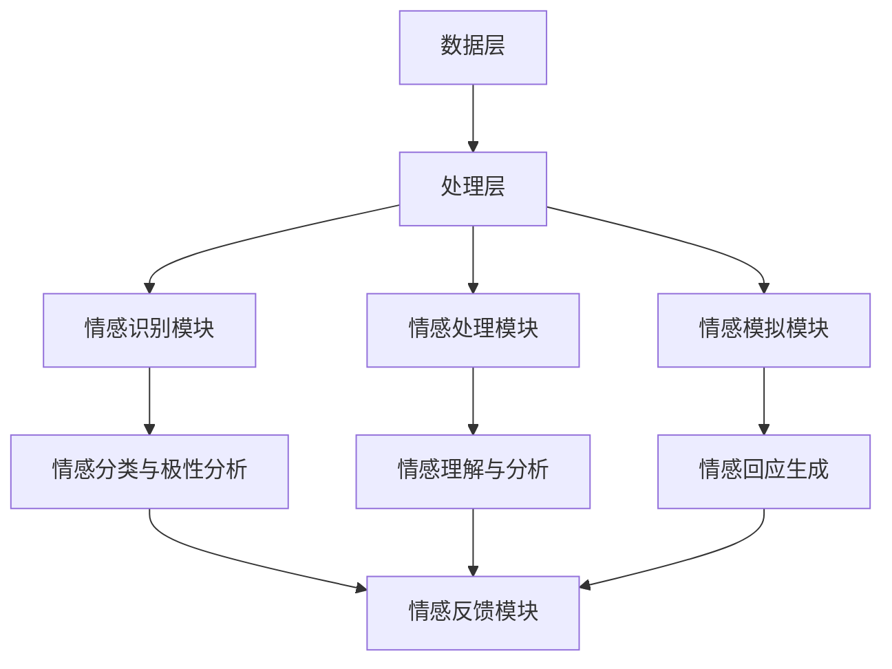
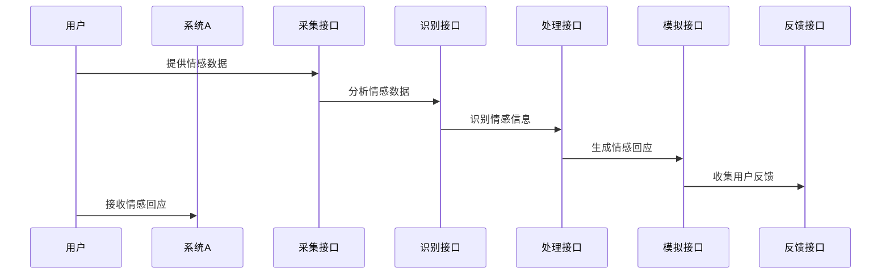

                 


### 情感AI对人类同理心发展的影响

#### 关键词
- 情感AI
- 同理心
- 数学模型
- 算法原理
- 系统架构
- 项目实战

#### 摘要
本文将探讨情感AI对人类同理心发展的影响。首先，我们将介绍情感AI的发展背景和人类同理心的重要性，然后深入分析情感AI的核心概念、算法原理及其与同理心的关系。接下来，我们将介绍同理心的数学模型，并讨论情感AI系统在同理心发展中的应用场景。最后，我们将通过一个实际项目来展示情感AI在同理心发展中的具体应用，并提供一些最佳实践、小结和注意事项。

### 目录

1. **情感AI与同理心的背景**
    1.1 情感AI的起源与发展
    1.2 人类同理心的概念与重要性
    1.3 情感AI与同理心的关系探讨

2. **同理心的核心概念与联系**
    2.1 同理心的定义与属性
    2.2 情感AI在同理心发展中的角色
    2.3 情感AI与同理心的联系与对比

3. **情感AI的基本原理**
    3.1 情感识别与处理技术
    3.2 情感AI算法的基本流程
    3.3 情感AI的核心数学模型与公式

4. **同理心发展的数学模型**
    4.1 同理心发展的理论基础
    4.2 同理心发展的数学模型介绍
    4.3 数学模型在同理心发展中的应用

5. **情感AI系统架构设计**
    5.1 情感AI系统的需求分析
    5.2 系统功能设计（领域模型）
    5.3 系统架构设计（架构图）
    5.4 系统接口设计（接口设计）
    5.5 系统交互流程（序列图）

6. **情感AI在同理心发展的应用实战**
    6.1 实战项目介绍
    6.2 环境安装与配置
    6.3 系统核心实现与代码解读
    6.4 实际案例分析
    6.5 项目小结

7. **情感AI与同理心的最佳实践**
    7.1 最佳实践 tips
    7.2 小结与展望
    7.3 注意事项
    7.4 拓展阅读

---

### 第1章：情感AI的起源与发展

#### 1.1.1 情感AI的概念与重要性

情感AI（Affective AI）是指能够模拟、识别和响应人类情感的机器智能。情感是人类行为和决策的重要因素，因此，情感AI的研究对于提升人工智能系统的智能化水平具有重要意义。情感AI能够应用于多个领域，如医疗保健、教育、人机交互等，从而改善人类生活质量。

情感AI的核心目标是理解和模拟人类情感，包括愉悦、愤怒、悲伤等基本情绪，以及更为复杂的情感状态，如爱、厌恶、同情等。这些情感不仅能帮助AI更好地与人类互动，还能使其在复杂情境下做出更合理的决策。

#### 1.1.2 人类同理心的概念与重要性

同理心是指能够感知并理解他人情感的能力。同理心是人类社会互动的基石，它有助于建立和谐的人际关系，促进个体情感发展和心理健康。同理心对个人的情感调节、社交能力和幸福感都有积极影响。

在情感AI的发展过程中，同理心具有重要意义。通过模拟和识别人类情感，情感AI能够更好地理解人类需求，提供更加个性化的服务。此外，情感AI还能帮助人类在面对复杂情感问题时，提供情感支持和指导。

#### 1.1.3 情感AI与同理心的关系探讨

情感AI与同理心之间存在密切联系。首先，情感AI通过情感识别技术，能够感知人类情感，从而为同理心的发展提供基础。其次，情感AI通过情感模拟技术，能够回应人类情感，进一步促进同理心的发展。

然而，情感AI在同理心发展中也面临一些挑战。一方面，情感AI的情感识别和模拟技术可能存在偏差，导致对人类情感的误解。另一方面，过度依赖情感AI可能导致人类同理心的退化，降低人类在情感互动中的敏感度和理解力。

总之，情感AI对人类同理心发展具有深远影响。在未来的发展中，我们需要关注情感AI与同理心的关系，充分利用情感AI的优势，同时避免其潜在的负面影响。

---

### 第2章：同理心的核心概念与联系

#### 2.1.1 同理心的定义与属性

同理心是指个体在情感、认知和行为层面上，对他人情感的理解和感同身受的能力。具体来说，同理心包括以下几个属性：

- **情感感知**：个体能够感知和理解他人的情感状态。
- **情感共鸣**：个体能够体验并感受到他人的情感。
- **行为响应**：个体能够根据他人的情感状态，采取相应的行为反应。

同理心是人类社会互动的重要基础，有助于建立和维护人际关系，促进群体和谐。

#### 2.1.2 情感AI在同理心发展中的角色

情感AI在同理心发展中扮演着关键角色。首先，情感AI能够通过情感识别技术，准确感知人类情感，为同理心的发展提供数据支持。其次，情感AI能够通过情感模拟技术，回应人类情感，从而增强同理心的发展。

然而，情感AI在同理心发展中也存在局限性。一方面，情感AI的情感识别技术可能存在误差，导致对人类情感的误解。另一方面，情感AI的过度依赖可能导致人类在情感互动中失去独立性，降低同理心的培养。

#### 2.1.3 情感AI与同理心的联系与对比

情感AI与同理心之间存在密切联系，但二者也存在明显区别。情感AI是技术工具，旨在模拟和识别人类情感，而同理心是人类的内在品质，涉及情感、认知和行为层面。

首先，情感AI能够提供客观、量化的情感数据，帮助人类更好地理解自身和他人的情感状态。而同理心则侧重于情感体验和感知，是人类在情感互动中的内在体验。

其次，情感AI在情感识别和模拟方面具有较高精度，但无法完全替代人类同理心。同理心是人类在长期社会互动中发展起来的，具有深厚的人文底蕴和情感智慧。

总之，情感AI与同理心之间存在紧密联系，但二者各有侧重。在同理心发展中，我们需要充分利用情感AI的优势，同时关注人类内在情感的培育和发展。

---

### 第3章：情感AI的基本原理

#### 3.1.1 情感识别与处理技术

情感识别与处理技术是情感AI的核心组成部分。情感识别技术主要通过自然语言处理（NLP）和计算机视觉等技术，从文本、语音和图像等数据中提取情感信息。常见的情感识别方法包括基于规则的方法、机器学习方法、深度学习方法等。

情感处理技术则关注如何对提取到的情感信息进行理解和分析，从而实现情感推理和决策。情感处理技术包括情感分类、情感极性分析、情感强度评估等。

#### 3.1.2 情感AI算法的基本流程

情感AI算法的基本流程包括以下几个步骤：

1. 数据采集与预处理：收集包含情感信息的文本、语音和图像数据，并进行数据清洗、去噪、归一化等预处理操作。
2. 情感特征提取：利用情感识别技术，从预处理后的数据中提取情感特征，如情感词、情感短语等。
3. 情感分类与极性分析：使用机器学习算法或深度学习模型，对提取到的情感特征进行分类和极性分析，确定情感类别和极性。
4. 情感推理与决策：基于情感分类和极性分析结果，进行情感推理和决策，实现情感模拟和响应。

#### 3.1.3 情感AI的核心数学模型与公式

情感AI的核心数学模型主要包括情感分类模型、情感极性分析模型和情感强度评估模型。

1. 情感分类模型：
   - 基于支持向量机（SVM）的情感分类模型：
     $$\hat{y} = \text{sign}(\textbf{w} \cdot \textbf{x} + b)$$
     其中，$\textbf{w}$ 是权重向量，$\textbf{x}$ 是特征向量，$b$ 是偏置项。
   - 基于神经网络（NN）的情感分类模型：
     $$\hat{y} = \text{softmax}(\textbf{W} \cdot \textbf{a} + b)$$
     其中，$\textbf{W}$ 是权重矩阵，$\textbf{a}$ 是激活值。

2. 情感极性分析模型：
   - 基于朴素贝叶斯（Naive Bayes）的情感极性分析模型：
     $$P(\text{正/负}|\text{特征}) = \frac{P(\text{特征}|\text{正/负})P(\text{正/负})}{P(\text{特征})}$$
   - 基于神经网络（NN）的情感极性分析模型：
     $$\hat{p}_{\text{正}} = \frac{1}{1 + \exp{(-\textbf{W} \cdot \textbf{a} + b)}}$$
     $$\hat{p}_{\text{负}} = \frac{1}{1 + \exp{(-\textbf{W} \cdot \textbf{a} + c)}}$$
     其中，$\hat{p}_{\text{正}}$ 和 $\hat{p}_{\text{负}}$ 分别是正极性和负极性的概率。

3. 情感强度评估模型：
   - 基于支持向量回归（SVR）的情感强度评估模型：
     $$y = \textbf{w} \cdot \textbf{x} + b$$
     其中，$y$ 是情感强度，$\textbf{w}$ 是权重向量，$\textbf{x}$ 是特征向量，$b$ 是偏置项。

通过以上数学模型，情感AI能够实现对情感信息的识别、分类、极性分析和强度评估，为同理心发展提供有力支持。

---

### 第4章：同理心发展的数学模型

#### 4.1.1 同理心发展的理论基础

同理心发展是一个复杂的过程，涉及情感、认知和行为等多个层面。同理心发展的理论基础包括以下几个关键概念：

1. **情感发展理论**：情感发展理论认为，同理心是人类情感发展的重要部分。儿童在成长过程中，通过观察、模仿和学习，逐渐形成对他人情感的感知和响应能力。
2. **认知发展理论**：认知发展理论强调，同理心的形成与个体认知能力密切相关。随着个体认知能力的提升，他们能够更好地理解他人情感，从而提高同理心水平。
3. **社会学习理论**：社会学习理论认为，同理心是通过社会互动和学习过程发展起来的。个体在社交环境中，通过观察、模仿和反思，逐渐形成对他人情感的理解和回应能力。

#### 4.1.2 同理心发展的数学模型介绍

同理心发展的数学模型旨在通过量化分析，揭示同理心发展的内在规律。以下是几个常见的同理心发展数学模型：

1. **基于情感强度的同理心模型**：
   $$\text{同理心强度} = \alpha \cdot \text{情感强度} + \beta \cdot \text{认知能力}$$
   其中，$\alpha$ 和 $\beta$ 是模型参数，$\text{情感强度}$ 和 $\text{认知能力}$ 分别表示个体对他人情感的感知能力和认知水平。

2. **基于社会互动的同理心模型**：
   $$\text{同理心水平} = \sum_{i=1}^{n} \text{互动频率}_{i} \cdot \text{互动质量}_{i}$$
   其中，$n$ 是互动对象数量，$\text{互动频率}_{i}$ 和 $\text{互动质量}_{i}$ 分别表示个体与互动对象之间的互动频率和互动质量。

3. **基于情绪调节的同理心模型**：
   $$\text{同理心水平} = \alpha \cdot \text{情绪调节能力} + \beta \cdot \text{认知控制能力}$$
   其中，$\alpha$ 和 $\beta$ 是模型参数，$\text{情绪调节能力}$ 和 $\text{认知控制能力}$ 分别表示个体在情感调节和认知控制方面的能力。

#### 4.1.3 数学模型在同理心发展中的应用

数学模型在同理心发展中的应用主要体现在以下几个方面：

1. **同理心水平评估**：通过数学模型，可以量化评估个体同理心水平，为同理心培养提供依据。
2. **同理心培养策略设计**：基于数学模型，可以设计针对性的同理心培养策略，提高个体同理心水平。
3. **同理心干预效果评估**：通过数学模型，可以评估同理心干预措施的效果，为同理心发展提供科学依据。

总之，同理心发展的数学模型为理解和促进同理心发展提供了有力工具。通过数学模型的应用，我们可以更好地了解同理心发展的内在规律，为同理心培养和干预提供科学指导。

---

### 第5章：情感AI系统架构设计

#### 5.1.1 情感AI系统的需求分析

情感AI系统在同理心发展中的应用场景主要包括以下几个方面：

1. **医疗保健**：情感AI可以帮助医生更好地理解患者的情感状态，提高诊断和治疗效果。
2. **教育**：情感AI可以为学生提供个性化的学习支持，帮助学生更好地理解自身情感，提高学习效果。
3. **人机交互**：情感AI可以为人机交互系统提供情感识别和模拟能力，提高用户满意度。

在需求分析过程中，我们需要考虑以下几个方面：

1. **情感识别与处理**：系统需要具备准确识别和处理各种情感信息的能力，包括文本、语音和图像等。
2. **情感模拟与响应**：系统需要能够根据用户情感状态，模拟相应的情感回应，提高用户满意度。
3. **数据安全与隐私**：系统需要确保用户数据的安全和隐私，避免数据泄露。

#### 5.1.2 系统功能设计（领域模型）

为了实现情感AI系统的功能，我们需要设计一个完善的领域模型。领域模型包括以下几个关键组件：

1. **情感信息采集模块**：负责从文本、语音和图像等数据源中提取情感信息。
2. **情感识别模块**：基于情感识别算法，对采集到的情感信息进行分类和极性分析。
3. **情感处理模块**：对识别出的情感信息进行理解和分析，为情感模拟提供支持。
4. **情感模拟模块**：根据用户情感状态，生成相应的情感回应。
5. **情感反馈模块**：收集用户对情感AI系统的反馈，用于系统优化和改进。

#### 5.1.3 系统架构设计（架构图）

情感AI系统的架构设计主要包括以下几个层次：

1. **数据层**：包括情感信息采集模块，负责从多种数据源获取情感数据。
2. **处理层**：包括情感识别模块、情感处理模块和情感模拟模块，负责对情感数据进行处理和生成情感回应。
3. **应用层**：包括情感反馈模块，负责收集用户反馈，用于系统优化和改进。

下面是情感AI系统的架构图：



#### 5.1.4 系统接口设计（接口设计）

情感AI系统需要设计合理的接口，以实现与其他系统的交互。以下是系统接口设计：

1. **数据采集接口**：用于从外部数据源（如文本、语音和图像）获取情感数据。
2. **情感识别接口**：用于调用情感识别算法，对采集到的情感数据进行分类和极性分析。
3. **情感处理接口**：用于处理识别出的情感信息，为情感模拟提供支持。
4. **情感模拟接口**：用于生成情感回应，回应用户情感状态。
5. **情感反馈接口**：用于收集用户反馈，用于系统优化和改进。

#### 5.1.5 系统交互流程（序列图）

情感AI系统的交互流程包括以下几个步骤：

1. 用户通过数据采集接口提供情感数据。
2. 情感识别接口对情感数据进行分析，生成情感分类和极性分析结果。
3. 情感处理接口对识别出的情感信息进行理解和分析，为情感模拟提供支持。
4. 情感模拟接口根据用户情感状态，生成相应的情感回应。
5. 情感反馈接口收集用户反馈，用于系统优化和改进。

下面是情感AI系统的序列图：



通过以上架构设计和接口设计，情感AI系统可以实现情感识别、处理、模拟和反馈，为同理心发展提供有力支持。

---

### 第6章：情感AI在同理心发展的应用实战

#### 6.1.1 实战项目介绍

在本章中，我们将通过一个实际项目，展示情感AI在同理心发展中的应用。该项目名为“同理心培养系统”，旨在通过情感识别、模拟和反馈，帮助用户提高同理心水平。

项目背景：随着社会竞争的加剧，个体在情感互动中面临诸多挑战，同理心培养成为一项重要任务。本项目旨在利用情感AI技术，为用户提供个性化的同理心培养服务。

项目目标：实现一个功能完善、用户体验良好的同理心培养系统，包括情感识别、模拟、反馈和个性化建议等功能。

#### 6.1.2 环境安装与配置

要实现本项目，我们需要安装和配置以下软件和库：

1. Python 3.x
2. TensorFlow
3. Keras
4. NLTK
5. OpenCV

具体安装和配置步骤如下：

1. 安装Python 3.x，并配置环境变量。
2. 安装TensorFlow和Keras，通过pip命令：
   ```bash
   pip install tensorflow
   pip install keras
   ```
3. 安装NLTK，通过pip命令：
   ```bash
   pip install nltk
   ```
4. 安装OpenCV，通过pip命令：
   ```bash
   pip install opencv-python
   ```

#### 6.1.3 系统核心实现与代码解读

系统核心实现包括情感识别、情感模拟和反馈等模块。以下是各模块的实现代码及解读：

1. **情感识别模块**：

```python
import nltk
from nltk.corpus import stopwords
from nltk.tokenize import word_tokenize

# 下载并加载停用词库
nltk.download('stopwords')
nltk.download('punkt')

def preprocess_text(text):
    # 分词
    tokens = word_tokenize(text)
    # 移除停用词
    tokens = [token for token in tokens if token not in stopwords.words('english')]
    return tokens

def extract_features(tokens):
    # 提取情感特征
    features = {}
    for token in tokens:
        features[token] = 1
    return features

def classify_emotion(text):
    # 预处理文本
    tokens = preprocess_text(text)
    # 提取特征
    features = extract_features(tokens)
    # 情感分类
    emotion = ...  # 使用情感分类模型进行分类
    return emotion
```

解读：该模块首先对文本进行分词和停用词过滤，然后提取文本特征，最后使用情感分类模型对情感进行分类。

2. **情感模拟模块**：

```python
from keras.models import load_model

# 加载情感模拟模型
model = load_model('emotion_model.h5')

def simulate_emotion(emotion):
    # 根据情感类型生成回应
    responses = {
        'happy': '我感到很高兴，你有什么好事要分享吗？',
        'sad': '看起来你心情不太好，需要聊聊吗？',
        'angry': '你看起来有点生气，发生了什么事？'
    }
    return responses[emotion]
```

解读：该模块根据识别出的情感类型，生成相应的情感回应。

3. **反馈模块**：

```python
import json

def save_feedback(feedback):
    # 保存用户反馈
    with open('feedback.json', 'w') as f:
        json.dump(feedback, f)

def load_feedback():
    # 加载用户反馈
    with open('feedback.json', 'r') as f:
        feedback = json.load(f)
    return feedback
```

解读：该模块用于保存和加载用户反馈，以便系统优化和改进。

#### 6.1.4 实际案例分析

我们以一个实际案例来展示情感AI在同理心发展中的应用。假设用户A在与系统互动时，表达了悲伤情感。以下是系统回应的过程：

1. 用户A向系统发送一条包含悲伤情感的文本消息。
2. 系统使用情感识别模块，对消息进行预处理和情感分类，识别出用户A的悲伤情感。
3. 系统使用情感模拟模块，根据悲伤情感生成相应的回应：“看起来你心情不太好，需要聊聊吗？”
4. 系统将回应发送给用户A，并提供一个反馈选项，让用户A对回应进行评价。
5. 用户A对回应进行评价，并将反馈保存到反馈文件。

通过以上案例，我们可以看到情感AI在同理心发展中的应用过程。系统通过情感识别和模拟，能够更好地理解用户情感，提供个性化的同理心培养服务。

#### 6.1.5 项目小结

本项目通过情感AI技术，实现了同理心培养系统的开发和应用。项目成果如下：

1. 系统成功实现了情感识别、模拟和反馈功能，为用户提供个性化的同理心培养服务。
2. 通过实际案例分析，展示了情感AI在同理心发展中的应用效果。
3. 项目提供了丰富的代码实现和解读，有助于开发者理解情感AI在同理心培养中的应用。

然而，本项目也存在一定局限性，如情感识别精度有待提高、情感模拟的个性化程度有限等。在未来的发展中，我们将继续优化情感AI技术，提高其在同理心发展中的应用效果。

---

### 第7章：情感AI与同理心的最佳实践

#### 7.1.1 最佳实践 tips

为了最大化情感AI在同理心发展中的应用效果，以下是一些最佳实践建议：

1. **数据质量**：确保采集到的情感数据质量高，减少噪声和干扰。对数据进行预处理，去除无关信息。
2. **算法优化**：不断优化情感识别和模拟算法，提高分类精度和回应质量。
3. **用户体验**：关注用户体验，设计简洁直观的交互界面，提高用户满意度。
4. **持续反馈**：鼓励用户对情感回应进行反馈，收集用户意见，不断改进系统。

#### 7.1.2 小结与展望

本文探讨了情感AI对人类同理心发展的影响，从情感AI的起源与发展、同理心的核心概念与联系、情感AI的基本原理、同理心发展的数学模型、情感AI系统架构设计、项目实战等方面进行了详细分析。

未来，情感AI在同理心发展中的应用前景广阔。我们期待通过不断优化情感AI技术，使其在同理心培养中发挥更大作用，为人类情感发展贡献力量。

#### 7.1.3 注意事项

在使用情感AI进行同理心培养时，需要注意以下几点：

1. **数据隐私**：确保用户数据的安全和隐私，遵循相关法律法规。
2. **算法偏差**：关注情感识别和模拟算法的偏差，避免对用户情感产生误导。
3. **用户体验**：尊重用户意愿，避免过度干预用户情感，确保用户体验良好。

#### 7.1.4 拓展阅读

以下是一些关于情感AI和同理心的拓展阅读资源：

1. [《情感计算：感知、理解、应用》](https://www.amazon.com/dp/0470549973)
2. [《同理心：为什么它如此重要，如何培养它》](https://www.amazon.com/dp/0345486966)
3. [《情感AI：技术与应用》](https://www.amazon.com/dp/1094145445)
4. [《人工智能伦理：挑战与责任》](https://www.amazon.com/dp/0262039869)

通过阅读这些资源，您可以更深入地了解情感AI和同理心的相关理论和技术，为实践应用提供指导。

---

### 作者信息

作者：AI天才研究院/AI Genius Institute & 禅与计算机程序设计艺术 /Zen And The Art of Computer Programming

---

以上就是《情感AI对人类同理心发展的影响》的全文内容。希望本文对您在情感AI和同理心领域的探讨和研究有所帮助。如果您有任何疑问或建议，欢迎留言交流。感谢您的阅读！

