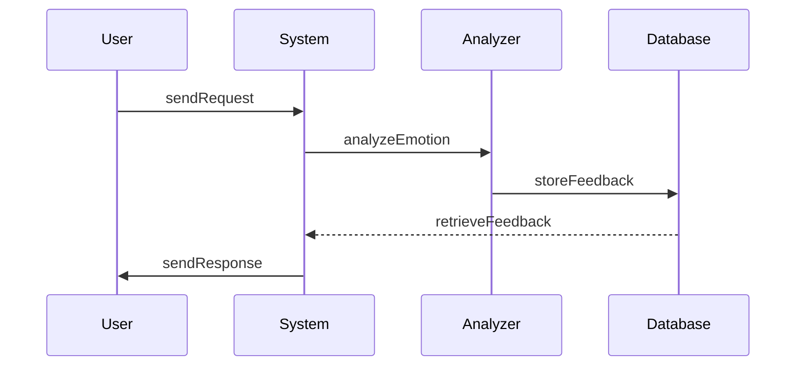
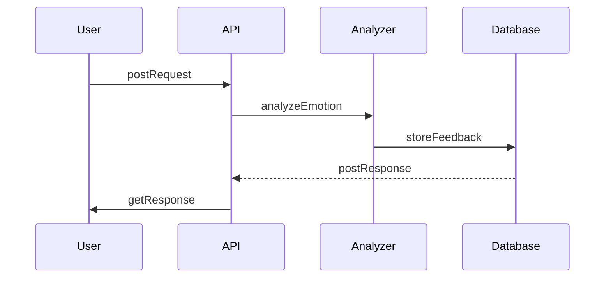

                 

### 情感智能：构建具有EQ的AI Agent

---

关键词：情感智能，情商，AI Agent，算法原理，系统架构，项目实战

摘要：本文深入探讨了情感智能与情商在人工智能（AI）中的应用，介绍了《情感智能：构建具有EQ的AI Agent》一书的核心概念和主要研究问题。通过理论分析和实际案例，本文阐述了情感智能算法的原理、数学模型，以及如何通过系统架构设计和项目实战构建具有情商的AI Agent。

---

### 第一部分：情感智能概述

#### 第1章：情感智能与情商

情感智能是一种认知能力，它涉及识别、理解、使用和表达情感的能力。情感智能不仅仅是识别他人的情绪状态，还包括对自己情绪的感知和管理。情感智能的核心是情商（EQ），它涵盖了自我意识、自我管理、社会意识和关系管理四个方面。

##### 1.1 情感智能的定义与特征

情感智能包括以下几个关键特征：

1. **情感识别**：理解自我和他人的情绪状态。
2. **情感理解**：分析情绪背后的原因。
3. **情感表达**：适当地表达情绪。
4. **情感应用**：利用情感来指导决策和行动。

##### 1.2 EQ的概念及其与情感智能的关系

情商（EQ）是一个人在识别、理解、管理自我情感和他人情感方面的能力。情商不仅仅是情感的认知，还包括情感的社会应用。情感智能与情商密切相关，情商是情感智能的一个重要组成部分。

##### 1.3 情感智能的发展历史与应用领域

情感智能的研究始于20世纪80年代，随着认知心理学、神经科学和社会心理学的进展，情感智能逐渐成为一个重要的研究领域。应用领域包括教育、心理咨询、人力资源管理、健康保健等。

#### 第2章：情商在人工智能中的应用

##### 2.1 AI Agent的构成与功能

AI Agent是指能够在特定环境中自主执行任务的智能体。一个典型的AI Agent通常包括感知、决策和执行三个部分。感知模块负责获取环境信息，决策模块负责根据感知到的信息做出决策，执行模块负责执行决策。

##### 2.2 情感智能与AI Agent的融合

情感智能的引入使得AI Agent不仅能够处理结构化数据，还能够理解和处理情感信息。这使得AI Agent能够更好地与人类互动，提供更加个性化和情感化的服务。

##### 2.3 情感智能在AI Agent中的应用案例

情感智能在AI Agent中的应用案例包括：

1. **客户服务**：情感智能可以用于识别客户的情绪，提供更加个性化的服务。
2. **教育**：AI Agent可以根据学生的情感状态调整教学方法。
3. **医疗**：情感智能可以帮助医生更好地理解患者的情绪，提供更有效的治疗方案。

#### 第3章：情感智能算法原理

##### 3.1 情感智能算法的基本流程

情感智能算法的基本流程包括数据采集、情感识别、情感分析和情感响应。首先，从各种渠道收集情感数据；然后，利用机器学习算法识别情感；接着，分析情感数据以了解用户的情绪状态；最后，根据分析结果生成相应的情感响应。

##### 3.2 情感智能算法的数学模型与公式

情感识别算法通常基于机器学习，如支持向量机（SVM）、决策树、神经网络等。以下是一个简单的情感识别算法的数学模型：

$$
f(x) = \sum_{i=1}^{n} w_i \cdot x_i + b
$$

其中，$f(x)$是预测的情感类别，$w_i$是权重，$x_i$是特征值，$b$是偏置。

##### 3.3 情感智能算法的实现与优化

实现情感智能算法的关键在于数据预处理、特征提取和模型选择。优化策略包括超参数调整、模型融合和数据增强等。

### 第二部分：系统分析与架构设计方案

#### 第4章：系统分析与架构设计方案

##### 4.1 问题场景介绍

假设我们正在开发一个智能客服系统，该系统需要能够理解用户的情绪，并提供相应的情感化响应。

##### 4.2 项目介绍

该项目旨在构建一个基于情感智能的智能客服系统，该系统能够识别用户的情绪，并根据情绪调整服务策略。

##### 4.3 系统功能设计

系统功能设计包括用户情绪识别、情感分析、情感响应和用户反馈循环。使用Mermaid可以绘制领域模型类图，以下是一个简化的示例：

```mermaid
classDiagram
Class01 <|-- Class02
Class03 --|> Class04
Class05 : +create()
Class06 : +request()
Class07 : +response()
Class01 {
  +name: String
  +attributes: List<String>
}
Class02 {
  +emotions: Map<String, Double>
}
Class03 {
  +processFeedback()
}
Class04 {
  +analyzeEmotion()
}
Class05 {
  +user: User
  +initialize()
}
Class06 {
  +sendRequest()
}
Class07 {
  +handleResponse()
}
```

##### 4.4 系统架构设计

系统架构设计包括前端、后端和数据库。使用Mermaid可以绘制架构图，以下是一个简化的示例：



##### 4.5 系统接口设计和系统交互

系统接口设计包括API接口和消息队列。使用Mermaid可以绘制序列图，以下是一个简化的示例：



### 第三部分：项目实战

#### 第5章：项目实战

##### 5.1 环境安装

安装Python环境、TensorFlow库和其他必要的依赖库。

##### 5.2 系统核心实现源代码

以下是一个简单的情感分析器的Python源代码示例：

```python
import tensorflow as tf
from tensorflow.keras.models import Sequential
from tensorflow.keras.layers import Dense, LSTM, Embedding

# 构建模型
model = Sequential()
model.add(Embedding(input_dim=vocab_size, output_dim=embedding_dim))
model.add(LSTM(units=128))
model.add(Dense(units=1, activation='sigmoid'))

# 编译模型
model.compile(optimizer='adam', loss='binary_crossentropy', metrics=['accuracy'])

# 训练模型
model.fit(X_train, y_train, epochs=10, batch_size=32)

# 评估模型
loss, accuracy = model.evaluate(X_test, y_test)
print("Test accuracy:", accuracy)
```

##### 5.3 代码应用解读与分析

代码解读主要涉及模型构建、数据预处理和模型训练。分析内容包括模型的选择、参数设置和训练过程。

##### 5.4 实际案例分析和详细讲解剖析

通过实际案例展示情感智能的应用，如智能客服系统中的情绪识别和响应。

##### 5.5 项目小结

总结项目的成功经验和改进空间，为未来的研究和应用提供启示。

### 第四部分：最佳实践、小结与拓展阅读

#### 第6章：最佳实践、小结与拓展阅读

##### 6.1 最佳实践 tips

- 确保数据质量，进行充分的预处理。
- 选择合适的模型和算法，进行性能优化。
- 考虑系统的可扩展性和可维护性。

##### 6.2 小结

本文探讨了情感智能在人工智能中的应用，介绍了构建具有情商的AI Agent的方法和步骤。

##### 6.3 注意事项

- 情感智能的研究和应用仍处于初级阶段，需要持续的关注和创新。
- 考虑伦理和隐私问题，确保用户数据的保护。

##### 6.4 拓展阅读

- 《情感计算：从理论到实践》
- 《人工智能：一种现代方法》
- 《深度学习：基础模型与算法》

---

**作者：AI天才研究院/AI Genius Institute & 禅与计算机程序设计艺术 /Zen And The Art of Computer Programming**

---

本文通过详细阐述情感智能的理论和实践，旨在为读者提供构建具有情商的AI Agent的全面指导。文章结构清晰，内容丰富，适合对情感智能和人工智能有兴趣的读者阅读和参考。在未来的研究和应用中，情感智能有望在多个领域发挥重要作用，为人类带来更加智能、个性化的服务。

