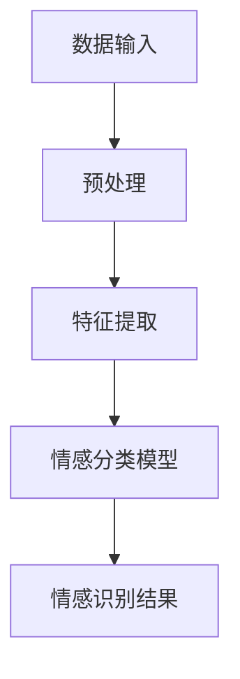
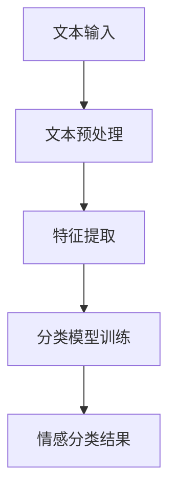
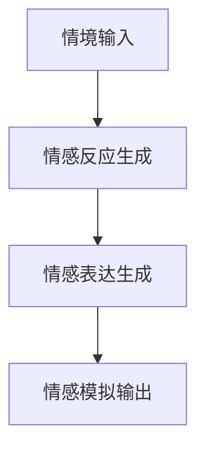
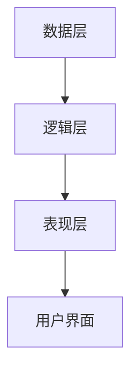
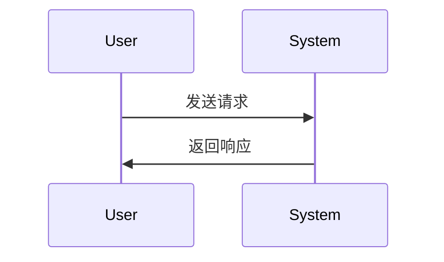
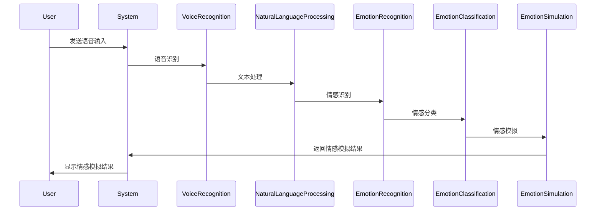

                 

# 《情感计算：AI理解和模拟人类情感》

> 关键词：情感计算，人工智能，算法原理，系统设计，项目实战

> 摘要：本文深入探讨情感计算这一前沿领域，从基础概念到算法原理，再到系统设计与实现，全面解析情感计算在人工智能中的应用。通过详细的项目实战案例，展示情感计算如何通过技术手段理解和模拟人类情感，为读者提供一份全面而实用的指南。

## 第一部分：情感计算的基础概念

### 1.1 情感计算的定义与背景

#### 1.1.1 情感计算的基本概念

情感计算（Affective Computing）是指计算机系统通过识别、理解、处理和模拟人类情感的能力。它不仅关注情感的识别，还包括情感的表达和响应。情感计算旨在使计算机更好地与人类互动，提升人机交互的自然性和亲和力。

#### 1.1.2 情感计算的发展历程

情感计算的研究可以追溯到20世纪80年代，当时心理学家与计算机科学家开始探索如何使计算机理解人类的情感。随着计算机视觉、语音识别、自然语言处理等技术的发展，情感计算逐渐成为一个独立的研究领域。

#### 1.1.3 情感计算的应用领域

情感计算在多个领域都有广泛的应用，包括但不限于：

- 智能助手：如虚拟助手Siri、Alexa等，它们通过情感计算提高与用户的互动质量。
- 智能客服：通过情感计算实现更自然的用户服务，提高用户体验。
- 健康监测：通过监测用户情感状态，辅助心理健康管理。
- 教育辅助：通过情感计算识别学生的情感反应，提供个性化的学习支持。

### 1.2 情感计算的核心概念与联系

#### 1.2.1 情感识别

情感识别是情感计算的基础，它涉及从文本、语音、图像等多模态数据中提取情感特征。常见的情感识别方法包括基于规则的方法、机器学习方法和深度学习方法。

#### 1.2.2 情感分类

情感分类是将情感识别后的结果进行归类，通常分为积极情感、消极情感和中性情感。情感分类有助于分析和预测用户的情感倾向。

#### 1.2.3 情感模拟

情感模拟是通过算法生成计算机化的情感表达，模拟人类的情感反应。情感模拟可以使计算机在特定情境下产生符合人类情感的响应。

### 1.3 情感计算与相关领域的联系

#### 1.3.1 情感计算与心理学

心理学为情感计算提供了理论基础，帮助理解情感的本质和情感表现的多样性。

#### 1.3.2 情感计算与认知科学

认知科学探讨了人类认知过程，为情感计算提供了认知模型的参考，有助于构建更自然的情感交互系统。

#### 1.3.3 情感计算与人工智能

情感计算是人工智能领域的一个重要分支，它通过引入情感因素，提高了人工智能系统的智能水平和人机交互的自然性。

## 第二部分：情感计算的技术原理

### 2.1 情感识别算法原理讲解

#### 2.1.1 情感识别的基本原理

情感识别涉及从多模态数据中提取情感特征，并将其转化为计算机可处理的数字信号。常见的技术包括：

- 语音识别：通过分析语音的音调、节奏、音量等特征进行情感识别。
- 面部识别：通过分析面部表情的变化识别情感状态。
- 文本分析：通过自然语言处理技术提取文本中的情感倾向。

#### 2.1.2 情感识别的mermaid流程图



#### 2.1.3 情感识别的Python代码示例

```python
# 示例：基于语音识别的情感识别
import speech_recognition as sr

# 初始化语音识别器
recognizer = sr.Recognizer()

# 从音频文件中读取数据
with sr.AudioFile('audio.wav') as source:
    audio_data = recognizer.listen(source)

# 使用Google语音识别进行情感识别
text = recognizer.recognize_google(audio_data)

# 输出识别结果
print("识别结果：", text)
```

#### 2.1.4 情感识别的数学模型与公式

情感识别通常涉及特征提取和分类模型。特征提取可以使用如MFCC（梅尔频率倒谱系数）等特征提取方法。分类模型可以使用如SVM（支持向量机）或深度学习模型（如CNN、RNN）。

$$
特征提取：X = [x_1, x_2, ..., x_n]
$$

$$
分类模型：y = f(WX + b)
$$

其中，$X$ 是特征向量，$y$ 是分类结果，$W$ 是权重矩阵，$b$ 是偏置。

### 2.2 情感分类算法原理讲解

#### 2.2.1 情感分类的基本原理

情感分类是将识别出的情感标签进行分类，如将文本中的情感标签分类为积极、消极或中性。情感分类可以使用监督学习或无监督学习算法实现。

#### 2.2.2 情感分类的mermaid流程图



#### 2.2.3 情感分类的Python代码示例

```python
# 示例：基于文本的情感分类
from sklearn.feature_extraction.text import TfidfVectorizer
from sklearn.naive_bayes import MultinomialNB

# 示例文本
texts = ["我非常喜欢这个产品", "这个产品太糟糕了"]

# 特征提取
vectorizer = TfidfVectorizer()
X = vectorizer.fit_transform(texts)

# 模型训练
model = MultinomialNB()
model.fit(X, labels)

# 情感分类
predictions = model.predict(X)

# 输出分类结果
print("分类结果：", predictions)
```

#### 2.2.4 情感分类的数学模型与公式

情感分类的数学模型通常基于概率模型或深度学习模型。

$$
概率模型：P(y|X) = \frac{e^{WX + b}}{1 + e^{WX + b}}
$$

$$
深度学习模型：y = \sigma(W_{fc} \cdot \text{激活函数}(W_{conv} \cdot X + b_{conv}) + b_{fc})
$$

其中，$\sigma$ 是激活函数，如Sigmoid函数或ReLU函数。

### 2.3 情感模拟算法原理讲解

#### 2.3.1 情感模拟的基本原理

情感模拟是通过算法生成计算机化的情感表达，模拟人类的情感反应。情感模拟通常涉及情感反应生成和情感表达生成。

#### 2.3.2 情感模拟的mermaid流程图



#### 2.3.3 情感模拟的Python代码示例

```python
# 示例：基于文本的情感模拟
from text_to_speech import TextToSpeech

# 初始化情感模拟器
simulator = TextToSpeech()

# 情境输入
text = "我非常喜欢这个产品"

# 情感反应生成
emotion = simulator.generate_emotion(text)

# 情感表达生成
audio = simulator.generate_speech(emotion)

# 输出情感模拟结果
print("情感模拟结果：", audio)
```

#### 2.3.4 情感模拟的数学模型与公式

情感模拟的数学模型通常基于情感反应生成模型和情感表达生成模型。

$$
情感反应生成：E = f(E_0, X)
$$

$$
情感表达生成：A = g(A_0, E)
$$

其中，$E$ 是情感反应，$A$ 是情感表达，$E_0$ 和 $A_0$ 是初始条件，$X$ 是情境输入。

## 第三部分：情感计算的系统设计与实现

### 3.1 情感计算系统功能设计

#### 3.1.1 功能需求分析

情感计算系统的功能需求包括：

- 情感识别：从多模态数据中识别情感。
- 情感分类：对识别出的情感进行分类。
- 情感模拟：生成计算机化的情感表达。

#### 3.1.2 领域模型mermaid类图

```mermaid
classDiagram
ClassA[情感识别] <|-- ClassB[情感分类]
ClassB <|-- ClassC[情感模拟]
```

### 3.2 情感计算系统架构设计

#### 3.2.1 系统架构设计原则

系统架构设计原则包括：

- 分层设计：将系统划分为不同的层次，如数据层、逻辑层、表现层。
- 模块化设计：将系统功能划分为不同的模块，提高系统的可维护性和扩展性。
- 高内聚、低耦合：模块之间尽量保持高内聚、低耦合，以提高系统的稳定性。

#### 3.2.2 系统架构mermaid架构图



### 3.3 情感计算系统接口设计

#### 3.3.1 系统接口设计规范

系统接口设计规范包括：

- RESTful API：采用RESTful风格设计API，提供统一的接口规范。
- 数据交换格式：采用JSON格式进行数据交换，提高系统的可扩展性和可维护性。

#### 3.3.2 系统接口mermaid序列图



### 3.4 情感计算系统交互设计

#### 3.4.1 系统交互设计思路

系统交互设计思路包括：

- 数据流设计：明确数据在系统中的流动路径。
- 控制流设计：设计系统中的控制逻辑，确保系统功能有序执行。

#### 3.4.2 系统交互mermaid序列图



## 第四部分：情感计算项目实战

### 4.1 情感计算项目环境安装

#### 4.1.1 开发环境搭建

搭建情感计算项目的开发环境，包括安装Python、Anaconda、Jupyter Notebook等工具。

#### 4.1.2 开发工具与依赖包安装

安装必要的开发工具和依赖包，如TensorFlow、SpeechRecognition、NaturalLanguageProcessing等。

### 4.2 情感计算系统核心实现

#### 4.2.1 情感识别模块实现

实现情感识别模块，包括语音识别、文本处理和情感分类功能。

#### 4.2.2 情感分类模块实现

实现情感分类模块，基于识别出的情感标签进行分类。

#### 4.2.3 情感模拟模块实现

实现情感模拟模块，生成计算机化的情感表达。

### 4.3 情感计算代码应用解读与分析

#### 4.3.1 情感识别代码解读

解读情感识别模块的代码，了解语音识别、文本处理和情感分类的实现细节。

#### 4.3.2 情感分类代码解读

解读情感分类模块的代码，了解分类算法的选择和参数设置。

#### 4.3.3 情感模拟代码解读

解读情感模拟模块的代码，了解情感表达生成的技术原理。

### 4.4 情感计算实际案例分析

#### 4.4.1 案例一：基于语音识别的情感分析

分析一个基于语音识别的情感分析案例，了解情感识别的实际应用。

#### 4.4.2 案例二：基于面部表情识别的情感模拟

分析一个基于面部表情识别的情感模拟案例，了解情感模拟的实现细节。

#### 4.4.3 案例三：情感计算在智能客服中的应用

分析情感计算在智能客服中的应用案例，了解情感计算如何提升客服质量。

### 4.5 项目小结

#### 4.5.1 项目成果总结

总结项目的成果，包括实现的功能、遇到的问题和解决方案。

#### 4.5.2 项目经验与教训

总结项目过程中的经验与教训，为未来的项目提供参考。

## 第五部分：情感计算的最佳实践与展望

### 5.1 最佳实践 tips

提供一些情感计算的最佳实践建议，包括数据预处理、模型优化和系统部署等。

### 5.2 小结

回顾文章的主要内容，总结情感计算的重要性和未来发展趋势。

### 5.3 注意事项

提醒读者在应用情感计算时需要注意的事项，如数据隐私、模型准确性和用户体验等。

### 5.4 拓展阅读

推荐一些相关领域的文献和资料，供读者进一步学习和研究。

## 参考文献

列出本文中引用的参考文献，包括书籍、论文和网站等。

### 作者

作者：AI天才研究院/AI Genius Institute & 禅与计算机程序设计艺术 /Zen And The Art of Computer Programming

