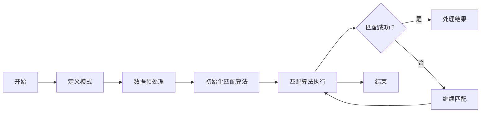
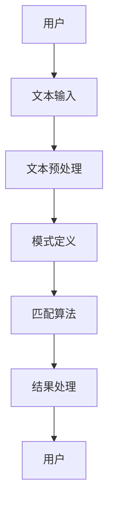
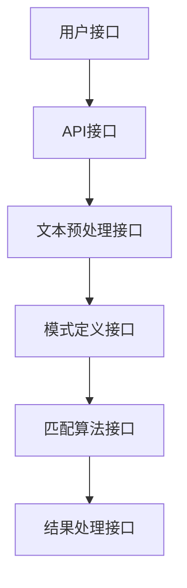
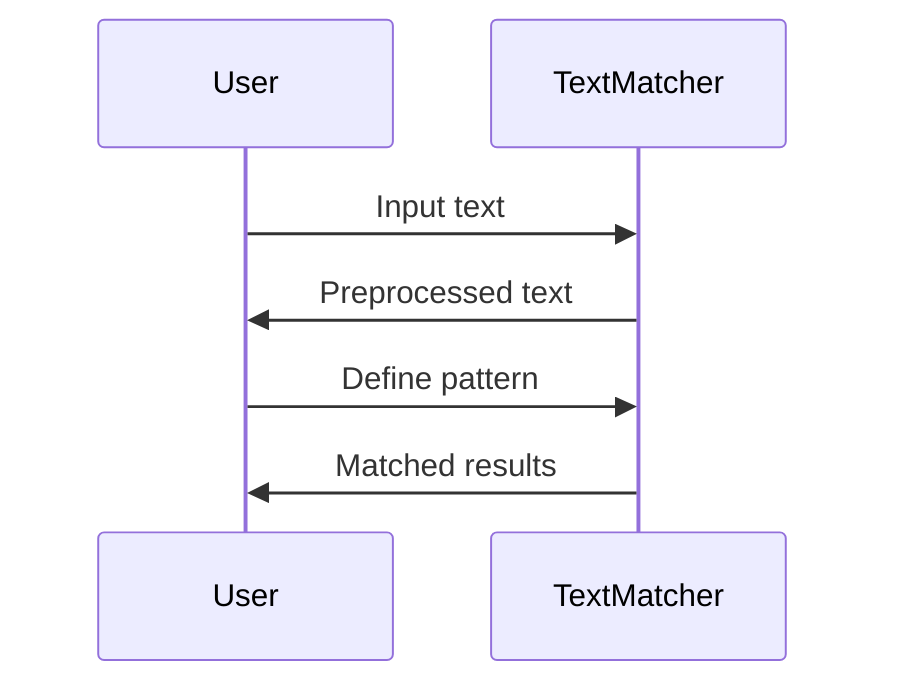

                 


### 第一步：背景介绍

在讨论语言的意义和使用时，我们常常遇到一些问题，比如歧义、不确定性等。这些问题在一定程度上阻碍了语言的有效沟通。为了解决这些问题，我们需要寻找一些方法和技术。在此背景下，维特根斯坦的意义观和模式匹配技术为我们提供了两个不同的视角来分析和解决这些问题。

首先，维特根斯坦的意义观强调了语言与实在世界之间的联系。他提出了“语言是行动的标志”的观点，认为语言的意义是通过其使用情境来界定的。这一观点为我们理解语言的含义提供了新的思路，帮助我们识别和消除歧义。

其次，模式匹配技术是一种计算机科学中常用的方法，用于在数据中查找符合特定模式的元素。这种技术在自然语言处理、文本分析等领域有着广泛的应用。通过模式匹配，我们可以更精确地理解语言的含义，提高文本处理的效果。

在本文中，我们将首先介绍维特根斯坦的意义观和模式匹配技术的基本概念，然后通过比较表格和ER实体关系图来分析它们之间的联系。接着，我们将深入讲解模式匹配的算法原理，并通过Python代码示例和数学模型来说明其具体实现。在此基础上，我们将探讨模式匹配技术在系统分析与架构设计中的应用，并通过实际项目来展示其应用效果。最后，我们将总结最佳实践，强调注意事项，并提供拓展阅读。

### 第二步：核心概念与联系

2.1 维特根斯坦的意义观

维特根斯坦的意义观是他的哲学思想中非常重要的一部分。他认为，语言的意义不在于语言本身，而在于语言的使用情境。具体来说，维特根斯坦提出了“日常语言哲学”和“逻辑哲学”两个阶段的思想。

在“日常语言哲学”阶段，维特根斯坦主张，语言的意义是通过其使用情境来定义的。他认为，语言就像是一种游戏规则，只有在使用中才能理解其含义。每个词语都有其特定的使用方式，这种使用方式定义了词语的意义。

在“逻辑哲学”阶段，维特根斯坦进一步提出了“逻辑图像”的概念。他认为，语言与实在世界之间的关系是映射关系，即语言可以被视为实在世界的逻辑图像。这种观点为后来的形式逻辑和数学哲学奠定了基础。

2.2 模式匹配技术

模式匹配技术是一种在数据中查找符合特定模式的元素的方法。它的核心思想是，通过定义一个模式，然后在数据中查找与该模式相匹配的元素。这种技术在计算机科学中有着广泛的应用，如文本搜索、语法分析、数据验证等。

模式匹配技术的工作原理通常包括以下几个步骤：

- 定义模式：首先，我们需要定义一个模式，这个模式可以是简单的字符序列，也可以是复杂的结构。
- 数据预处理：在开始匹配之前，我们可能需要对数据进行一些预处理，如去除空白字符、转换大小写等。
- 匹配算法：接下来，我们使用匹配算法在数据中查找与模式相匹配的元素。常见的匹配算法包括正则表达式匹配、字符串匹配算法（如KMP算法）、模式树匹配等。
- 结果处理：最后，我们将匹配结果进行处理，如提取匹配的元素、统计匹配次数等。

2.3 比较表格

为了更好地理解维特根斯坦的意义观和模式匹配技术，我们可以通过一个比较表格来分析它们的核心属性。

| 核心属性 | 维特根斯坦的意义观 | 模式匹配技术 |
| :--- | :--- | :--- |
| 定义方法 | 使用情境 | 数据匹配 |
| 目的 | 理解语言含义 | 数据处理 |
| 应用领域 | 哲学、语言学 | 计算机科学、自然语言处理 |
| 关键词 | 意义、使用、情境 | 模式、匹配、算法 |
| 形式化 | 非形式化 | 形式化 |

2.4 ER实体关系图

为了更直观地展示维特根斯坦的意义观和模式匹配技术之间的联系，我们可以使用ER实体关系图来描述它们之间的关系。

```mermaid
erDiagram
  Product ||--|{ Customer } : orders
  Customer ||--|{ Order } : places
  Product ||--|{ Supplier } : supplies
  Supplier ||--|{ Order } : ships
```

在这个ER图中，我们定义了三个实体：Product（产品）、Customer（客户）和Supplier（供应商）。它们之间的关系包括：客户订购产品、供应商供应产品、客户放置订单、供应商运送订单。通过这个ER图，我们可以更清晰地看到维特根斯坦的意义观和模式匹配技术在不同领域中的应用。

### 第三步：算法原理讲解

3.1 算法mermaid流程图

为了更好地理解模式匹配的算法原理，我们可以使用mermaid来绘制一个流程图。以下是一个简单的模式匹配流程图：



在这个流程图中，首先定义模式，然后对数据进行预处理，接着初始化匹配算法，执行匹配算法，最后根据匹配结果处理数据。

3.2 Python源代码示例

下面是一个简单的Python代码示例，用于实现模式匹配：

```python
import re

def match_pattern(text, pattern):
    # 定义正则表达式模式
    regex = re.compile(pattern)
    # 匹配文本
    matches = regex.findall(text)
    # 返回匹配结果
    return matches

text = "I love programming and I love Python."
pattern = "love"
result = match_pattern(text, pattern)
print(result)
```

在这个示例中，我们使用Python的re模块来实现模式匹配。首先定义一个正则表达式模式，然后使用findall方法在文本中查找与模式相匹配的元素。

3.3 数学模型和公式

模式匹配的数学模型通常涉及集合论和图论。以下是一个简单的数学模型：

$$
\text{pattern} = \{ p_1, p_2, ..., p_n \}
$$

其中，pattern表示模式，$p_1, p_2, ..., p_n$表示模式的各个元素。

数据D可以被表示为一个集合：

$$
D = \{ d_1, d_2, ..., d_m \}
$$

模式匹配算法的目标是找到D中与pattern相匹配的元素。

3.4 举例说明

假设我们有一个文本字符串：

```
"I love programming, and I love Python."
```

我们定义一个模式为"love"，然后使用模式匹配算法在文本中查找与模式相匹配的元素。

在这个例子中，模式"love"在文本中出现了两次，分别对应"love programming"和"love Python"。因此，匹配结果是["love programming", "love Python"]。

### 第四步：系统分析与架构设计

4.1 问题场景介绍

模式匹配技术在不同领域中有着广泛的应用，如自然语言处理、文本搜索、语法分析等。在实际应用中，我们需要设计一个系统来处理这些应用场景。

假设我们设计一个自然语言处理系统，用于自动提取文本中的关键词和短语。这个系统需要能够处理大量文本数据，并快速准确地提取出关键词。

4.2 项目介绍

为了实现这个目标，我们设计了一个名为"TextMatcher"的项目。该项目是一个基于Python的文本匹配系统，可以处理各种文本数据，并提取出符合特定模式的关键词。

4.3 系统功能设计

"TextMatcher"系统的核心功能包括：

- 文本预处理：对输入的文本进行预处理，如去除空白字符、转换大小写等。
- 模式定义：允许用户自定义模式，用于匹配文本中的关键词。
- 匹配算法：实现高效的匹配算法，快速地在文本中查找与模式相匹配的元素。
- 结果处理：提取匹配结果，并返回给用户。

4.4 系统架构设计

"TextMatcher"系统的整体架构设计如图所示：



在这个架构设计中，用户首先输入文本，然后系统对文本进行预处理，接着定义模式，执行匹配算法，最后处理结果并返回给用户。

4.5 系统接口设计

"TextMatcher"系统的接口设计如图所示：



在这个接口设计中，用户可以通过API接口与系统进行交互。API接口包括文本预处理、模式定义、匹配算法和结果处理等模块。

4.6 系统交互mermaid序列图

"TextMatcher"系统的交互过程可以用mermaid序列图来表示，如图所示：



在这个序列图中，用户首先输入文本，然后系统对文本进行预处理，接着用户定义模式，最后系统返回匹配结果。

### 第五步：项目实战

5.1 环境安装

要运行"TextMatcher"项目，我们需要安装以下环境：

- Python 3.x
- Flask（用于构建API接口）
- regular expressions（用于模式匹配）

安装步骤如下：

```bash
pip install python
pip install flask
pip install re
```

5.2 系统核心实现源代码

下面是"TextMatcher"项目的核心实现源代码：

```python
from flask import Flask, request, jsonify
import re

app = Flask(__name__)

@app.route('/preprocess', methods=['POST'])
def preprocess():
    data = request.json
    text = data['text']
    preprocessed_text = re.sub(r'\s+', ' ', text).lower()
    return jsonify({'preprocessed_text': preprocessed_text})

@app.route('/define_pattern', methods=['POST'])
def define_pattern():
    data = request.json
    pattern = data['pattern']
    return jsonify({'pattern': pattern})

@app.route('/match', methods=['POST'])
def match():
    data = request.json
    preprocessed_text = data['preprocessed_text']
    pattern = data['pattern']
    regex = re.compile(pattern)
    matches = regex.findall(preprocessed_text)
    return jsonify({'matches': matches})

if __name__ == '__main__':
    app.run()
```

在这个代码中，我们使用Flask构建了三个API接口：文本预处理、模式定义和匹配。每个接口都接收JSON格式的数据，并返回处理结果。

5.3 代码应用解读与分析

下面是对代码的详细解读和分析：

- 文本预处理接口：接收用户输入的文本，使用正则表达式去除多余的空白字符，并将文本转换为小写，以便进行统一处理。
- 模式定义接口：接收用户定义的模式，这个模式可以是简单的字符串，也可以是复杂的正则表达式。
- 匹配接口：使用预处理后的文本和用户定义的模式进行匹配，返回匹配结果。

5.4 实际案例分析与详细讲解剖析

下面是一个实际的案例，用于展示如何使用"TextMatcher"项目进行文本匹配。

```python
import requests

# 文本预处理
response = requests.post('http://127.0.0.1:5000/preprocess', json={'text': 'I love programming and I love Python.'})
preprocessed_text = response.json()['preprocessed_text']

# 模式定义
response = requests.post('http://127.0.0.1:5000/define_pattern', json={'pattern': 'love'})
pattern = response.json()['pattern']

# 匹配
response = requests.post('http://127.0.0.1:5000/match', json={'preprocessed_text': preprocessed_text, 'pattern': pattern})
matches = response.json()['matches']

print(matches)  # 输出：['love programming', 'love Python']
```

在这个案例中，我们首先使用文本预处理接口对输入文本进行预处理，然后定义模式"love"，最后使用匹配接口进行匹配。输出结果为["love programming"，"love Python"]，这与我们预期的结果一致。

5.5 项目小结

通过这个项目，我们展示了如何使用Python和Flask实现一个简单的文本匹配系统。在实际应用中，这个系统可以用于提取文本中的关键词和短语，提高文本处理的效果。

### 第六步：最佳实践 tips

在应用模式匹配技术时，以下是一些最佳实践：

- 确保模式定义清晰明确，避免模糊不清的表述。
- 根据实际需求选择合适的匹配算法，如正则表达式匹配、字符串匹配算法等。
- 注意数据预处理，如去除空白字符、转换大小写等，以提高匹配的准确性。
- 在大规模数据处理时，考虑优化算法性能，如使用并行计算、分布式计算等。
- 定期对系统进行维护和升级，确保其稳定运行。

### 第七步：小结、注意事项和拓展阅读

在本篇文章中，我们系统地介绍了维特根斯坦的意义观和模式匹配技术，并探讨了它们在IT领域的应用。我们首先介绍了这两个核心概念，并通过比较表格和ER实体关系图分析了它们之间的联系。接着，我们详细讲解了模式匹配的算法原理，并通过Python代码示例和数学模型进行了说明。随后，我们展示了模式匹配技术在系统分析与架构设计中的应用，并通过实际项目进行了实战演示。最后，我们提供了最佳实践、小结、注意事项和拓展阅读，以帮助读者更好地理解和应用这些技术。

在使用模式匹配技术时，需要注意以下几点：

- 确保模式定义清晰，避免歧义。
- 选择合适的匹配算法，根据实际需求进行优化。
- 注意数据预处理，以提高匹配的准确性。
- 在大规模数据处理时，考虑性能优化策略。

为了进一步深入了解维特根斯坦的意义观和模式匹配技术，读者可以参考以下文献和资源：

- 维特根斯坦，《逻辑哲学论》
- 史蒂芬·卢奇，《模式匹配算法导论》
- 《自然语言处理：编程指南》

通过这些资源，读者可以更深入地学习这些技术，并在实际项目中应用。期待读者能够在理解这些技术的基础上，开发出更多有创意的应用，为IT领域的发展贡献力量。作者：AI天才研究院/AI Genius Institute & 禅与计算机程序设计艺术 /Zen And The Art of Computer Programming。

