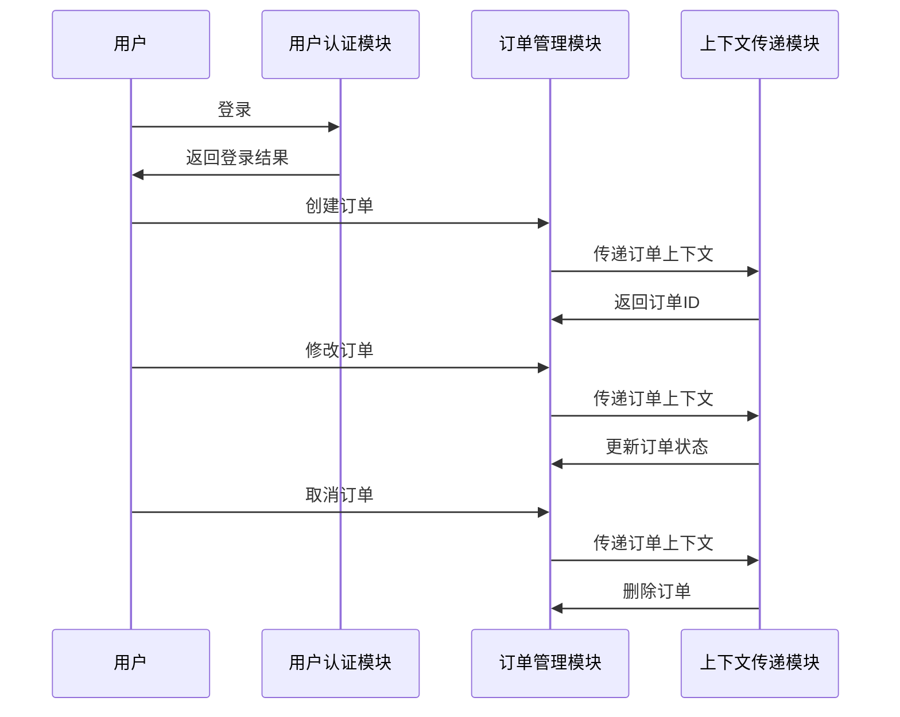
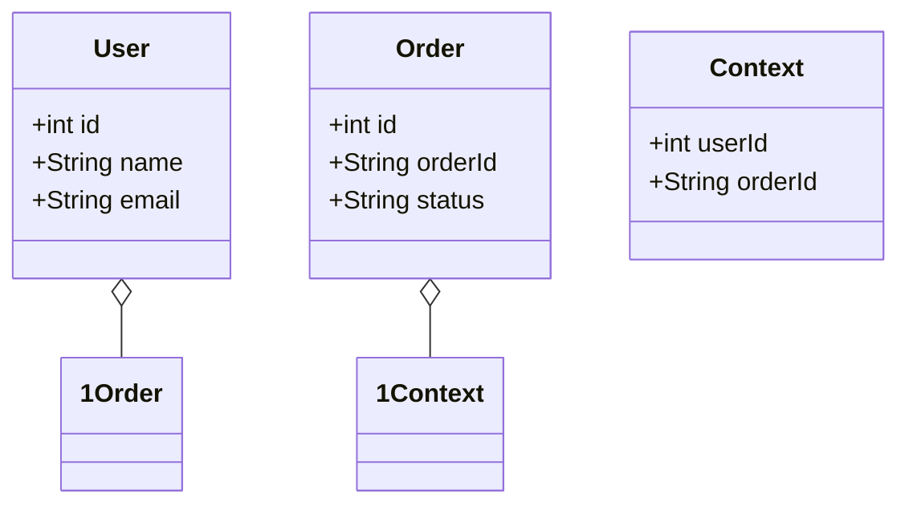

                 

# 意义的语境依赖性与上下文编程：维特根斯坦的意义理论与FP中的上下文传递技术

> 关键词：维特根斯坦、意义理论、上下文编程、语境依赖、函数式编程

> 摘要：本文探讨了维特根斯坦的意义理论与函数式编程（FP）中的上下文传递技术之间的关系。首先，介绍了维特根斯坦的意义理论及其语境依赖性，随后深入分析了FP中的上下文编程技术，并通过具体的算法实现和系统架构设计，展示了二者在计算机科学中的融合与应用。

## 引言

### 1.1 维特根斯坦的意义理论

路德维希·维特根斯坦（Ludwig Wittgenstein）是20世纪最重要的哲学家之一，他的工作深刻影响了逻辑哲学、语言哲学以及数学基础等领域。维特根斯坦的主要思想集中在《逻辑哲学论》和《哲学研究》两部著作中，其中关于意义的理论占据了重要地位。

维特根斯坦认为，语言的意义是依赖于其使用的上下文环境的，这意味着每个词汇或语句的意义都与其在特定语境中的使用紧密相关。他提出了“意义即使用”（meaning as use）的观点，强调了语境在理解语言中的关键作用。

### 1.2 FP与上下文编程

函数式编程（Functional Programming，FP）是一种编程范式，强调使用函数作为组织代码的基本单位，避免了状态的变化和可变数据。FP的核心理念包括不可变数据、高阶函数、闭包等。

上下文编程（Contextual Programming）是FP中的一个重要概念，它关注于如何在程序中传递上下文信息，以便函数能够根据不同的上下文执行不同的操作。这种上下文依赖性的处理方式，使得程序更加灵活和可复用。

### 1.3 维特根斯坦的意义理论与FP中的上下文编程

本文旨在探讨维特根斯坦的意义理论如何与FP中的上下文编程技术相联系。维特根斯坦的语境依赖性观点是否可以应用于编程领域，以及FP中的上下文编程如何体现并增强这一理论，这些都是本文要探讨的问题。

## 维特根斯坦的意义理论

### 2.1 维特根斯坦的意义理论基础

维特根斯坦的意义理论建立在语言使用的上下文依赖性之上。他认为，语言的意义不是固定的，而是依赖于具体的使用情境。这意味着，一个词或句子的意义取决于它在特定语境中的使用。

### 2.2 语境依赖性的探讨

语境依赖性是指语言元素（如词、句子）的意义不是孤立的，而是受到其使用环境的影响。例如，“bank”这个词在不同的语境中有不同的意义：在金融领域指的是“银行”，而在地理领域指的是“河岸”。

### 2.3 维特根斯坦的意义理论在计算机科学中的应用

在计算机科学中，上下文编程的概念与维特根斯坦的意义理论有着相似之处。例如，在FP中，上下文信息可以通过闭包、函数组合等方式传递，使得函数能够根据不同的上下文执行不同的逻辑。

## FP中的上下文编程技术

### 3.1 上下文编程的基础知识

上下文编程的基础知识包括闭包、函数组合、上下文对象等概念。闭包允许函数访问并记住其创建时的环境；函数组合则允许将多个函数组合成一个复杂的操作；上下文对象则用于存储和管理上下文信息。

### 3.2 上下文编程的架构与设计

上下文编程的架构设计涉及如何组织和传递上下文信息，以确保程序能够在不同的上下文中正确执行。这通常涉及到复杂的系统架构和设计模式，如依赖注入、策略模式等。

### 3.3 上下文编程的应用案例

上下文编程在实际应用中有着广泛的应用，例如在Web开发中，中间件可以用来传递请求的上下文信息；在分布式系统中，上下文信息可以用于追踪事务和日志。

## 维特根斯坦意义理论与FP中的上下文编程的融合

### 4.1 维特根斯坦的意义理论在FP中的应用

在FP中，上下文编程的概念可以看作是对维特根斯坦意义理论的一种实现。通过闭包和函数组合，FP程序能够根据不同的上下文执行不同的操作，这与维特根斯坦的语境依赖性观点是一致的。

### 4.2 上下文编程的语境依赖性分析

上下文编程中的语境依赖性分析涉及到如何识别和传递上下文信息，以及如何确保程序能够在不同的上下文中正确执行。这可以通过设计良好的上下文管理机制来实现。

### 4.3 维特根斯坦意义理论在FP中的实现

在FP中，可以通过使用上下文传递技术来实现维特根斯坦的意义理论。例如，通过定义上下文对象来存储和管理上下文信息，并在函数中使用这些上下文对象来执行特定的操作。

## 算法原理讲解

### 5.1 上下文依赖的算法流程

上下文依赖的算法流程通常涉及到以下步骤：

1. **上下文初始化**：初始化上下文对象，存储必要的上下文信息。
2. **函数定义**：定义一个函数，该函数能够根据上下文对象执行特定的操作。
3. **上下文传递**：将上下文对象传递给函数，以确保函数能够在正确的上下文中执行。
4. **上下文处理**：函数根据上下文对象中的信息执行操作。
5. **结果返回**：函数返回操作结果。

### 5.2 Python源代码示例

以下是一个简单的Python示例，展示了如何使用上下文编程来实现上下文依赖的算法：

```python
# 上下文对象
class Context:
    def __init__(self, value):
        self.value = value

# 函数定义
def process(context):
    print(f"Processing with value: {context.value}")

# 上下文初始化
context = Context(10)

# 上下文传递
process(context)

# 输出：Processing with value: 10
```

### 5.3 算法的数学模型与公式

上下文编程中的算法通常不需要复杂的数学模型和公式，但可以借助闭包和函数组合来实现上下文依赖。例如，可以使用以下数学公式来表示上下文传递：

$$
f(\text{context}) = (\text{context} \mapsto \text{result}) \circ g(\text{context})
$$

其中，$f$ 和 $g$ 分别表示两个函数，$\text{context}$ 表示上下文对象，$\text{result}$ 表示函数执行的结果。

## 系统分析与架构设计

### 6.1 问题场景介绍

假设我们正在开发一个电商平台，需要处理用户订单的上下文信息，以便在不同的上下文中执行不同的操作，如订单生成、订单修改、订单取消等。

### 6.2 系统功能设计

系统功能设计包括以下部分：

1. **用户认证模块**：用于用户登录、注册和权限管理。
2. **订单管理模块**：用于处理订单的创建、修改和取消。
3. **上下文传递模块**：用于管理订单的上下文信息，如用户ID、订单状态等。

### 6.3 系统架构设计

系统架构设计采用微服务架构，每个模块作为独立的微服务运行。以下是系统的架构图：



### 6.4 系统接口设计和系统交互

系统接口设计包括RESTful API接口和消息队列接口。以下是系统的接口设计图：



### 6.5 项目实战

在本项目中，我们使用Python和Django框架来实现电商平台。以下是项目实战的步骤：

1. **环境安装**：安装Python、Django及相关依赖。
2. **系统核心实现**：实现用户认证、订单管理和上下文传递功能。
3. **代码应用解读与分析**：分析代码中的上下文传递机制，确保系统能够在不同上下文中正确执行。
4. **实际案例分析和详细讲解剖析**：通过具体案例展示上下文编程在实际项目中的应用。

## 最佳实践与小结

### 7.1 最佳实践

1. **上下文传递的设计原则**：确保上下文传递的简洁性和可维护性，避免过度依赖上下文。
2. **上下文管理的最佳实践**：合理设计上下文对象，避免上下文信息泄露和冲突。
3. **性能优化**：关注上下文传递的性能影响，合理选择上下文传递的方式。

### 7.2 小结

本文探讨了维特根斯坦的意义理论与FP中的上下文编程技术之间的关系。通过分析维特根斯坦的语境依赖性观点，我们展示了上下文编程如何实现并增强这一理论。在系统架构设计和项目实战中，我们进一步展示了上下文编程在实际应用中的价值。

### 7.3 注意事项

1. **上下文传递的复杂性**：上下文编程虽然强大，但也增加了程序的复杂性，需要谨慎使用。
2. **上下文管理的安全性**：确保上下文信息的完整性和安全性，防止信息泄露和滥用。

### 7.4 拓展阅读

1. 《维特根斯坦的意义理论》
2. 《函数式编程：高级编程范式与实践》
3. 《Django Web开发：高级技术》

## 作者信息

作者：AI天才研究院/AI Genius Institute & 禅与计算机程序设计艺术 /Zen And The Art of Computer Programming

