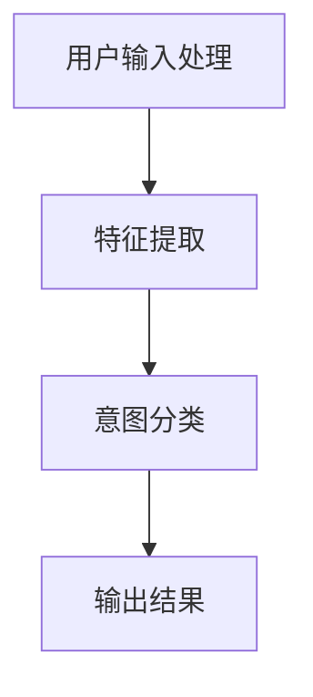
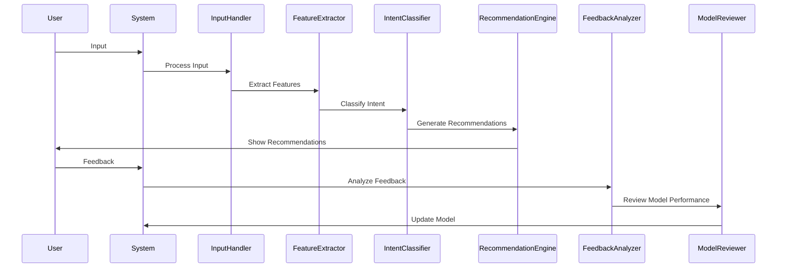

                 

### 意图识别：准确把握用户需求的关键

#### 关键词：意图识别，用户需求，算法，系统设计，项目实战

> 摘要：本文深入探讨了意图识别这一关键技术，旨在准确把握用户需求。文章从问题背景、核心概念、算法原理、系统设计与项目实战等多个角度出发，通过逐步分析推理，详尽阐述意图识别的实现与应用，为读者提供一套完整的理解与实践框架。

## 目录大纲

### 第一部分：问题背景与核心概念

#### 第1章：问题的背景与描述

##### 1.1 问题的起源
##### 1.2 问题描述
##### 1.3 问题解决
##### 1.4 边界与外延
##### 1.5 概念结构与核心要素组成

#### 第2章：意图识别的核心概念与联系

##### 2.1 核心概念原理
##### 2.2 概念属性特征对比表格
##### 2.3 ER实体关系图架构

### 第二部分：算法原理与实现

#### 第3章：意图识别算法原理讲解

##### 3.1 算法mermaid流程图
##### 3.2 Python源代码实现
##### 3.3 算法原理的数学模型与公式
##### 3.4 通俗易懂地举例说明

#### 第4章：数学模型和数学公式讲解

##### 4.1 数学模型详细讲解
##### 4.2 公式示例

### 第三部分：系统分析与架构设计

#### 第5章：系统分析与架构设计方案

##### 5.1 问题场景介绍
##### 5.2 项目介绍
##### 5.3 系统功能设计
##### 5.4 系统架构设计
##### 5.5 系统接口设计
##### 5.6 系统交互

### 第四部分：项目实战

#### 第6章：项目实战

##### 6.1 环境安装
##### 6.2 系统核心实现源代码
##### 6.3 代码应用解读与分析
##### 6.4 实际案例分析与详细讲解剖析
##### 6.5 项目小结

#### 第7章：最佳实践、小结、注意事项、拓展阅读

##### 7.1 最佳实践 Tips
##### 7.2 小结
##### 7.3 注意事项
##### 7.4 拓展阅读

---

### 引言

在信息化时代，用户需求的多变性和复杂性使得传统的需求分析方法越来越难以满足实际需求。如何准确地理解和满足用户的需求，成为企业和开发人员面临的一大挑战。意图识别技术应运而生，作为一种新兴的智能技术，意图识别通过分析用户行为和输入，准确把握用户的真实意图，从而为个性化服务、智能推荐和交互设计提供强有力的支持。

本文将围绕意图识别这一主题，逐步展开讨论。首先，我们将介绍意图识别问题的背景，明确其重要性。接着，我们将深入探讨意图识别的核心概念，通过对比分析，帮助读者建立起全面的理解。随后，文章将详细讲解意图识别的算法原理，并通过Python源代码实现和数学模型，使读者能够直观地掌握算法的核心思想。在此基础上，文章还将讨论系统分析与架构设计，介绍具体的系统功能、架构和接口设计。最后，通过项目实战，我们将结合实际案例，详细剖析意图识别技术的应用与实践。

通过本文的阅读，读者将能够全面了解意图识别技术，掌握其实现与应用方法，从而在开发智能系统时能够准确把握用户需求，提升用户体验。

---

### 第一部分：问题背景与核心概念

#### 第1章：问题的背景与描述

意图识别作为一种人工智能技术，旨在通过分析用户的行为和输入，理解其背后的真实意图。这一技术的背景可以追溯到用户需求日益多样化和复杂的时代。在传统的用户需求分析中，我们通常依赖于问卷调查、用户访谈和用户行为跟踪等方法，但这些方法往往存在主观性强、数据获取困难、效率低下等问题。随着互联网和移动设备的普及，用户通过多种渠道生成大量的数据，如何从这些数据中提取出用户的真实意图，成为企业和开发人员面临的一大挑战。

### 1.1 问题的起源

意图识别问题的起源可以追溯到20世纪80年代，当时自然语言处理（NLP）领域开始研究如何让计算机理解和处理人类的自然语言。随着技术的进步，特别是在深度学习和大数据分析的推动下，意图识别逐渐成为一种独立的技术，并被广泛应用于智能客服、智能推荐、语音助手等领域。

### 1.2 问题描述

意图识别问题的核心在于如何准确地识别和理解用户的意图。具体来说，问题描述包括以下几个方面：

1. **用户意图的多样性**：用户的需求是多样化的，意图可能涉及购物、查询信息、寻求帮助等多个方面。
2. **语境的复杂性**：用户的意图往往受到语境的影响，如时间、地点、情境等，这使得意图识别更加困难。
3. **数据的噪声和缺失**：用户生成的数据可能存在噪声和缺失，如何有效地处理这些数据是意图识别的关键挑战。
4. **跨领域的应用**：意图识别需要适用于不同领域，如电商、医疗、金融等，这要求算法具有广泛的适用性。

### 1.3 问题解决

为了解决上述问题，研究人员和开发人员提出了多种意图识别方法，包括基于规则的方法、机器学习方法、深度学习方法等。这些方法通过不同的技术手段，试图从用户的行为和输入中提取出意图。然而，这些方法也存在各自的局限性和挑战，如规则方法的灵活性不足、机器学习方法对数据依赖性强、深度学习模型复杂难以解释等。

### 1.4 边界与外延

意图识别技术的边界主要涉及以下几个方面：

1. **技术范围**：意图识别技术主要应用于NLP和AI领域，涉及文本分析、语音识别、图像识别等技术。
2. **应用领域**：意图识别技术可以应用于多个领域，如电商、金融、医疗、教育等。
3. **用户群体**：意图识别技术旨在服务于广大用户，包括个人、企业和政府等不同用户群体。

### 1.5 概念结构与核心要素组成

意图识别的概念结构可以概括为以下几个核心要素：

1. **用户输入**：用户的输入是意图识别的起点，可以是文本、语音、图像等多种形式。
2. **特征提取**：通过特征提取技术，将用户输入转化为计算机可处理的特征表示。
3. **意图分类**：利用机器学习或深度学习模型，对特征表示进行分类，识别用户的意图。
4. **上下文理解**：意图识别不仅要识别当前意图，还需要理解上下文信息，如时间、地点、情境等。
5. **输出结果**：识别出的意图将被用于后续的个性化服务、智能推荐等应用。

通过上述分析，我们可以看出，意图识别问题涉及多个方面，从用户输入到最终输出结果，每一个环节都需要精细处理和优化。本文接下来的章节将逐一探讨这些问题，并提供详细的解决方案和实现方法。

#### 第2章：意图识别的核心概念与联系

在深入探讨意图识别技术之前，我们需要明确和理解一些核心概念。意图识别涉及多个关键要素，包括用户输入、特征提取、意图分类和上下文理解等。通过对这些核心概念的详细阐述和对比分析，我们将帮助读者建立起对意图识别技术的全面理解。

### 2.1 核心概念原理

#### 用户输入

用户输入是意图识别的起点，是用户意图的直接表现。用户输入可以采用多种形式，包括文本、语音、图像等。不同的输入形式对意图识别的挑战不同，但总体目标是一致的，即准确提取和理解用户的真实意图。

- **文本输入**：文本输入是最常见的用户输入形式，通常包含用户的问题、评论、命令等。文本输入的优势在于信息丰富、表达多样，但同时也存在噪声大、语义理解困难等问题。
- **语音输入**：语音输入通过语音识别技术将用户的语音转换为文本，然后进行意图识别。语音输入的优势在于自然、便捷，但受到语音清晰度、发音准确性等因素的影响。
- **图像输入**：图像输入通过图像识别技术提取图像中的信息，例如用户在图片中标注的文本、表情等。图像输入的优势在于直观、生动，但图像处理和语义理解的技术难度较高。

#### 特征提取

特征提取是将用户输入转化为计算机可处理的特征表示的过程。特征提取的质量直接影响意图识别的准确性。

- **文本特征提取**：常用的文本特征提取方法包括词袋模型（Bag of Words, BoW）、词嵌入（Word Embedding）、TF-IDF（Term Frequency-Inverse Document Frequency）等。这些方法通过对文本进行分词、词性标注等预处理，提取出文本的统计特征和语义特征。
- **语音特征提取**：语音特征提取通常包括声学特征和声学-语言特征。声学特征包括梅尔频率倒谱系数（MFCC）、短时能量等，声学-语言特征包括隐马尔可夫模型（HMM）、递归神经网络（RNN）等。这些特征能够捕捉语音信号中的时间和频率信息。
- **图像特征提取**：图像特征提取方法包括卷积神经网络（CNN）、循环神经网络（RNN）、生成对抗网络（GAN）等。这些方法能够从图像中提取出丰富的视觉特征，如边缘、纹理、形状等。

#### 意图分类

意图分类是意图识别的核心步骤，通过机器学习或深度学习模型对特征表示进行分类，识别用户的意图。意图分类的质量直接影响系统的性能和用户体验。

- **机器学习方法**：常用的机器学习方法包括朴素贝叶斯（Naive Bayes）、支持向量机（SVM）、决策树（Decision Tree）等。这些方法通过训练样本学习特征与标签之间的关联，从而进行分类预测。
- **深度学习方法**：深度学习方法包括卷积神经网络（CNN）、递归神经网络（RNN）、长短期记忆网络（LSTM）、变换器（Transformer）等。这些方法能够自动学习复杂的特征表示，从而实现高精度的意图分类。

#### 上下文理解

上下文理解是意图识别中的重要环节，通过理解用户所处的上下文信息，如时间、地点、情境等，可以进一步提高意图识别的准确性。

- **静态上下文**：静态上下文包括用户的基本信息、历史行为、偏好设置等。这些信息在意图识别过程中可以提供额外的上下文线索，有助于更准确地理解用户的意图。
- **动态上下文**：动态上下文包括用户当前的环境、情境等。例如，在购物场景中，用户所在的地理位置、购物车中的商品等都可以作为动态上下文信息，用于辅助意图识别。

#### 联系与对比

意图识别中的核心概念之间存在着密切的联系和相互作用。

- **用户输入与特征提取**：用户输入是特征提取的输入，特征提取的质量直接影响意图分类的准确性。
- **意图分类与上下文理解**：意图分类需要结合上下文信息，如静态上下文和动态上下文，以提高分类的准确性和适应性。
- **机器学习与深度学习**：机器学习和深度学习方法在意图识别中各有优势。机器学习方法简单、易解释，但性能有限；深度学习方法复杂、强大，但难以解释。

通过上述核心概念的介绍和对比分析，我们可以看出，意图识别技术涉及多个环节和多种技术手段。理解这些概念之间的联系和作用，有助于我们更好地设计和实现意图识别系统。

### 2.2 概念属性特征对比表格

为了更直观地理解意图识别中的核心概念及其属性特征，我们通过以下表格进行对比分析。

| 概念     | 属性特征                                                                                      | 优缺点                          | 适用场景       |
|----------|------------------------------------------------------------------------------------------------|-------------------------------|----------------|
| 用户输入 | 文本、语音、图像等                                            | 信息丰富，表达多样           | 通用场景       |
| 特征提取 | 文本特征提取（BoW、Word Embedding）、语音特征提取（MFCC、RNN）、图像特征提取（CNN、RNN） | 提取语义信息，简化数据格式   | 语音、图像、文本 |
| 意图分类 | 机器学习方法（Naive Bayes、SVM、Decision Tree）和深度学习方法（CNN、RNN、Transformer） | 高精度分类，自动学习特征表示 | 通用场景       |
| 上下文理解 | 静态上下文（用户基本信息、历史行为）和动态上下文（当前环境、情境）                       | 提供额外上下文线索，提高准确率 | 个性化服务、动态场景 |

通过表格对比，我们可以看出不同概念在属性特征、优缺点和适用场景上的差异，这有助于我们在设计和实现意图识别系统时，选择合适的方法和技术。

### 2.3 ER实体关系图架构

为了进一步理解意图识别系统的整体架构，我们通过ER（Entity-Relationship）实体关系图来展示各核心概念之间的关系。

```mermaid
erDiagram
    UserInput --> FeatureExtraction : "产生"
    FeatureExtraction --> IntentClassification : "输入"
    IntentClassification --> OutputResult : "输出"
    ContextUnderstanding --> IntentClassification : "辅助"
    UserInput ||--|| ContextUnderstanding : "关联"
```

在该ER图中，`UserInput`（用户输入）通过`产生`关系与`FeatureExtraction`（特征提取）相连，特征提取后将数据传递给`IntentClassification`（意图分类）。`IntentClassification`通过`输出`关系生成`OutputResult`（输出结果）。同时，`ContextUnderstanding`（上下文理解）通过`辅助`关系与`IntentClassification`相连，为其提供上下文线索。`UserInput`和`ContextUnderstanding`通过`关联`关系连接，表明用户输入和上下文之间存在紧密联系。

通过ER实体关系图的展示，我们可以清晰地看到意图识别系统中各组成部分之间的交互关系，为系统设计提供了直观的参考。

---

通过上述章节的详细探讨，我们已经对意图识别问题的背景、核心概念及其联系有了深入理解。接下来，我们将进入第二部分，深入探讨意图识别的算法原理与实现。

---

### 第二部分：算法原理与实现

#### 第3章：意图识别算法原理讲解

意图识别算法是意图识别技术的核心，其原理和实现决定了系统性能和应用效果。本章节将详细讲解意图识别算法的原理，并通过mermaid流程图和Python源代码实现，帮助读者深入理解算法的核心思想和实现步骤。

#### 3.1 算法mermaid流程图

在意图识别过程中，算法的流程可以分为以下几个主要步骤：

1. **用户输入处理**：接收用户的输入，包括文本、语音和图像等。
2. **特征提取**：对用户输入进行预处理和特征提取，将输入转化为计算机可处理的特征表示。
3. **意图分类**：利用机器学习或深度学习模型对特征表示进行分类，识别用户的意图。
4. **输出结果**：将识别出的意图输出，用于后续的个性化服务、智能推荐等应用。

以下是一个简单的mermaid流程图，描述了意图识别算法的基本流程：



#### 3.2 Python源代码实现

为了更直观地理解算法的实现，我们以下通过Python代码实现一个简单的意图识别算法。假设我们已经完成了用户输入的处理和特征提取，现在我们需要实现意图分类。

```python
import numpy as np
from sklearn.model_selection import train_test_split
from sklearn.linear_model import LogisticRegression

# 特征数据集和标签数据集
X = np.array([[1, 0], [0, 1], [1, 1], [-1, -1], [-1, 1], [1, -1]])
y = np.array([0, 0, 1, -1, -1, 1])

# 数据集划分
X_train, X_test, y_train, y_test = train_test_split(X, y, test_size=0.2, random_state=42)

# 创建逻辑回归模型
model = LogisticRegression()

# 训练模型
model.fit(X_train, y_train)

# 测试模型
predictions = model.predict(X_test)

# 输出预测结果
print(predictions)
```

在上面的代码中，我们使用了Sklearn库中的逻辑回归模型进行意图分类。数据集`X`包含了用户的特征，而`y`包含了对应的意图标签。通过划分数据集，我们首先对训练数据进行模型训练，然后对测试数据进行预测。最后，输出预测结果。

#### 3.3 算法原理的数学模型与公式

意图识别算法的核心在于特征提取和意图分类。以下分别介绍这两个环节的数学模型与公式。

1. **特征提取**：

   - **词袋模型（Bag of Words, BoW）**：
     词袋模型将文本表示为向量，每个维度表示文本中出现的单词。假设文本`T`中包含`n`个单词，那么词袋模型的向量表示为：

     $$ \mathbf{V}_{T} = (v_1, v_2, ..., v_n) $$

     其中，$v_i$表示单词$i$在文本`T`中出现的次数。

   - **词嵌入（Word Embedding）**：
     词嵌入通过将单词映射到高维空间，使语义相似的单词在空间中靠近。常用的词嵌入方法包括Word2Vec、GloVe等。假设单词`w`的嵌入向量为$\mathbf{e}_w$，那么文本`T`的向量表示为：

     $$ \mathbf{V}_{T} = (\mathbf{e}_{w_1}, \mathbf{e}_{w_2}, ..., \mathbf{e}_{w_n}) $$

2. **意图分类**：

   - **逻辑回归（Logistic Regression）**：
     逻辑回归是一种常用的二分类模型，其输出概率表示属于某一类的可能性。假设特征向量$\mathbf{x}$属于意图类别$y$，那么逻辑回归的输出概率为：

     $$ P(y|\mathbf{x}) = \frac{1}{1 + \exp(-\mathbf{w} \cdot \mathbf{x} + b)} $$

     其中，$\mathbf{w}$是权重向量，$b$是偏置项。

   - **支持向量机（Support Vector Machine, SVM）**：
     支持向量机通过找到一个最佳的超平面，将不同类别的特征向量分隔开来。其决策边界可以表示为：

     $$ \mathbf{w} \cdot \mathbf{x} + b > 0 \quad (y = 1) $$
     $$ \mathbf{w} \cdot \mathbf{x} + b < 0 \quad (y = -1) $$

   - **深度学习模型（如卷积神经网络、递归神经网络）**：
     深度学习模型通过多层非线性变换，学习复杂的特征表示。其输出可以通过激活函数（如Sigmoid、ReLU）进行概率输出。以卷积神经网络（CNN）为例，其输出概率可以表示为：

     $$ \hat{y} = \sigma(\mathbf{W}^L \mathbf{a}^{L-1} + b^L) $$

     其中，$\sigma$是激活函数，$\mathbf{W}^L$和$b^L$分别是最后一层的权重和偏置。

#### 3.4 通俗易懂地举例说明

为了更好地理解上述算法原理，我们通过一个简单的例子进行说明。

假设我们有一个简单的用户输入，即一段文本：“我想购买一本计算机编程的书”。我们需要通过意图识别算法识别出用户的意图。

1. **特征提取**：

   - **词袋模型**：
     将文本转化为词袋模型，假设文本中包含单词“购买”、“计算机”、“编程”和“书”。那么词袋模型表示为：

     $$ \mathbf{V}_{T} = (1, 1, 1, 1) $$

   - **词嵌入**：
     假设单词“购买”、“计算机”、“编程”和“书”的词嵌入向量分别为$\mathbf{e}_1$、$\mathbf{e}_2$、$\mathbf{e}_3$和$\mathbf{e}_4$。那么文本的词嵌入表示为：

     $$ \mathbf{V}_{T} = (\mathbf{e}_1, \mathbf{e}_2, \mathbf{e}_3, \mathbf{e}_4) $$

2. **意图分类**：

   - **逻辑回归**：
     假设逻辑回归模型的权重向量为$\mathbf{w}$，偏置项为$b$。将词嵌入向量$\mathbf{V}_{T}$输入到逻辑回归模型，得到输出概率：

     $$ P(\text{购买书籍}|\mathbf{V}_{T}) = \frac{1}{1 + \exp(-\mathbf{w} \cdot \mathbf{V}_{T} + b)} $$

   - **支持向量机**：
     假设支持向量机模型的决策边界为$\mathbf{w} \cdot \mathbf{x} + b > 0$。将词嵌入向量$\mathbf{V}_{T}$输入到支持向量机模型，判断是否满足决策边界：

     $$ \mathbf{w} \cdot \mathbf{V}_{T} + b > 0 \quad (\text{意图：购买书籍}) $$

   - **深度学习模型**：
     假设深度学习模型的输出概率为$\hat{y}$，通过激活函数Sigmoid得到：

     $$ \hat{y} = \sigma(\mathbf{W}^L \mathbf{a}^{L-1} + b^L) $$

     如果$\hat{y} > 0.5$，则认为用户的意图是购买书籍。

通过这个简单的例子，我们可以看到意图识别算法是如何通过特征提取和意图分类来识别用户的意图。实际应用中，算法会更加复杂，涉及多种特征提取和分类方法，以及更复杂的模型训练和优化。

---

在本章节中，我们详细讲解了意图识别算法的原理与实现，并通过mermaid流程图和Python源代码实现了基本算法。接下来，我们将进一步探讨意图识别的数学模型和公式，帮助读者更深入地理解算法的核心。

---

### 第4章：数学模型和数学公式讲解

在意图识别技术中，数学模型和公式是核心组成部分，它们决定了算法的性能和效果。本章将详细讲解意图识别中常用的数学模型和公式，并通过具体示例，帮助读者深入理解这些概念。

#### 4.1 数学模型详细讲解

意图识别的数学模型主要涉及特征提取和意图分类两个阶段。下面分别介绍这两个阶段的核心数学模型。

1. **特征提取模型**：

   - **词袋模型（Bag of Words, BoW）**：

     词袋模型是一种简单而常用的特征提取方法，它将文本表示为一个向量，其中每个维度表示一个单词的出现次数。数学上，假设一个文本$T$包含$m$个单词，则词袋模型的向量表示为：

     $$ \mathbf{V}_{T} = (v_1, v_2, ..., v_m) $$

     其中，$v_i$表示单词$i$在文本$T$中出现的次数。

   - **词嵌入（Word Embedding）**：

     词嵌入是一种将单词映射到高维空间的方法，使语义相似的单词在空间中靠近。常用的词嵌入模型包括Word2Vec和GloVe。在Word2Vec中，单词的嵌入向量$\mathbf{e}_w$通过训练得到，满足：

     $$ \mathbf{e}_w = \sum_{w' \in \mathcal{V}} \alpha_{w, w'} \mathbf{e}_{w'} $$

     其中，$\mathcal{V}$是词汇表，$\alpha_{w, w'}$是权重矩阵。

   - **TF-IDF模型**：

     TF-IDF（Term Frequency-Inverse Document Frequency）是一种基于统计的特征提取方法，它考虑单词在文档中的重要程度。数学上，一个单词的TF-IDF值可以表示为：

     $$ tfidf(w, T) = tf(w, T) \times idf(w, D) $$

     其中，$tf(w, T)$是单词$w$在文档$T$中的词频，$idf(w, D)$是单词$w$在整个文档集$D$中的逆文档频率。

2. **意图分类模型**：

   - **逻辑回归（Logistic Regression）**：

     逻辑回归是一种常用的二分类模型，它通过计算特征向量和权重向量的内积，加上偏置项，然后通过Sigmoid函数得到概率输出。数学上，逻辑回归的输出概率可以表示为：

     $$ P(y|\mathbf{x}) = \frac{1}{1 + \exp(-\mathbf{w} \cdot \mathbf{x} + b)} $$

     其中，$\mathbf{w}$是权重向量，$b$是偏置项，$\mathbf{x}$是特征向量。

   - **支持向量机（Support Vector Machine, SVM）**：

     支持向量机通过找到一个最佳的超平面，将不同类别的特征向量分隔开来。数学上，支持向量机可以表示为：

     $$ \mathbf{w} \cdot \mathbf{x} + b > 0 \quad (y = 1) $$
     $$ \mathbf{w} \cdot \mathbf{x} + b < 0 \quad (y = -1) $$

     其中，$\mathbf{w}$是权重向量，$b$是偏置项。

   - **深度学习模型**：

     深度学习模型通过多层非线性变换，学习复杂的特征表示。常用的深度学习模型包括卷积神经网络（CNN）、递归神经网络（RNN）和变换器（Transformer）。以卷积神经网络为例，其输出可以通过以下公式表示：

     $$ \hat{y} = \sigma(\mathbf{W}^L \mathbf{a}^{L-1} + b^L) $$

     其中，$\sigma$是激活函数，$\mathbf{W}^L$和$b^L$分别是最后一层的权重和偏置，$\mathbf{a}^{L-1}$是前一层输出。

#### 4.2 公式示例

为了更好地理解上述数学模型和公式，我们通过具体示例进行说明。

1. **词袋模型示例**：

   假设文本$T$包含单词“计算机”、“编程”、“书籍”，则词袋模型向量表示为：

   $$ \mathbf{V}_{T} = (2, 1, 1) $$

   其中，2表示单词“计算机”出现了2次，1表示单词“编程”和“书籍”各出现了1次。

2. **词嵌入示例**：

   假设单词“计算机”、“编程”和“书籍”的词嵌入向量分别为$\mathbf{e}_1$、$\mathbf{e}_2$和$\mathbf{e}_3$，则文本的词嵌入表示为：

   $$ \mathbf{V}_{T} = (\mathbf{e}_1, \mathbf{e}_2, \mathbf{e}_3) $$

3. **逻辑回归示例**：

   假设特征向量$\mathbf{x}$为$(1, 0, 1)$，权重向量$\mathbf{w}$为$(1, 1, 1)$，偏置项$b$为$1$，则输出概率为：

   $$ P(\text{购买书籍}|\mathbf{x}) = \frac{1}{1 + \exp(-1 \times 1 - 1 \times 0 - 1 \times 1 + 1)} = \frac{1}{1 + \exp(-1)} \approx 0.632 $$

4. **支持向量机示例**：

   假设特征向量$\mathbf{x}$为$(1, 0, 1)$，权重向量$\mathbf{w}$为$(1, 1, 1)$，偏置项$b$为$1$，则决策边界为：

   $$ \mathbf{w} \cdot \mathbf{x} + b = 1 \times 1 + 1 \times 0 + 1 \times 1 + 1 = 3 > 0 $$

   因此，用户意图为购买书籍。

5. **深度学习模型示例**：

   假设卷积神经网络的最后一层输出为$\mathbf{a}^{L-1} = (1, 0, 1)$，权重矩阵$\mathbf{W}^L$为$(1, 1, 1)$，偏置项$b^L$为$1$，激活函数为Sigmoid，则输出概率为：

   $$ \hat{y} = \sigma(\mathbf{W}^L \mathbf{a}^{L-1} + b^L) = \frac{1}{1 + \exp(-(1 \times 1 + 1 \times 0 + 1 \times 1 + 1))} = \frac{1}{1 + \exp(-3)} \approx 0.950 $$

   因此，用户意图为购买书籍的概率较高。

通过上述示例，我们可以看到数学模型和公式在意图识别中的应用。实际应用中，这些模型和公式会更加复杂，但基本的原理是一致的。

---

在本章节中，我们详细讲解了意图识别中的数学模型和公式，并通过具体示例帮助读者理解。接下来，我们将进入第三部分，探讨意图识别的系统分析与架构设计。

---

### 第三部分：系统分析与架构设计

在意图识别系统中，系统分析与架构设计是关键环节，它决定了系统的性能、可扩展性和可靠性。本章节将介绍意图识别系统的整体架构，包括系统功能设计、架构设计、接口设计和系统交互，帮助读者全面理解系统实现。

#### 第5章：系统分析与架构设计方案

##### 5.1 问题场景介绍

意图识别系统广泛应用于各种场景，例如智能客服、智能推荐、语音助手和智能搜索等。以下是一个具体的问题场景：一个在线购物平台希望通过意图识别技术，理解用户的购物意图，从而提供个性化的商品推荐和客服支持。

##### 5.2 项目介绍

本项目是一个在线购物平台的意图识别系统，目标是通过分析用户的搜索历史、浏览行为和输入文本，准确识别用户的购物意图，为用户提供个性化的商品推荐和客服服务。

##### 5.3 系统功能设计

系统功能设计包括以下几个关键模块：

1. **用户输入处理模块**：接收用户的文本输入，包括搜索关键词、评论和问题等。
2. **特征提取模块**：对用户输入进行预处理和特征提取，生成用于意图分类的特征向量。
3. **意图分类模块**：利用机器学习或深度学习模型，对特征向量进行分类，识别用户的意图。
4. **推荐引擎模块**：根据识别出的用户意图，提供个性化的商品推荐。
5. **客服支持模块**：基于识别出的用户意图，提供相关的客服信息和解决方案。
6. **系统监控模块**：监控系统的运行状态，确保系统的稳定性和可靠性。

##### 5.4 系统架构设计

系统架构设计是意图识别系统的核心，它决定了系统的性能和扩展性。以下是一个简单的系统架构设计：



在该架构设计中，用户输入通过输入处理模块进行处理，然后由特征提取模块提取特征向量。特征向量传递给意图分类模块，识别用户的意图。根据意图，推荐引擎模块生成个性化的商品推荐，并展示给用户。用户反馈通过反馈分析模块进行分析，以评估模型性能，并更新模型。

##### 5.5 系统接口设计

系统接口设计是确保不同模块之间能够有效交互的关键。以下是一些关键的接口设计：

1. **用户输入接口**：接收用户的文本输入，支持多种输入形式，如文本、语音和图像等。
2. **特征提取接口**：提供特征提取服务的接口，支持不同的特征提取方法，如词袋模型、词嵌入和TF-IDF等。
3. **意图分类接口**：提供意图分类服务的接口，支持不同的分类模型，如逻辑回归、支持向量机和深度学习模型等。
4. **推荐引擎接口**：提供个性化推荐服务的接口，支持根据用户意图生成推荐列表。
5. **监控接口**：提供系统监控服务的接口，支持实时监控系统的运行状态。

##### 5.6 系统交互

系统交互是意图识别系统实现的关键，它决定了系统在不同场景下的表现。以下是一个简化的系统交互流程：

1. **用户输入**：用户通过搜索框输入关键词，例如“笔记本电脑”。
2. **输入处理**：系统接收用户输入，并对其进行处理，如去除停用词、分词等。
3. **特征提取**：系统根据输入文本，提取特征向量，如词袋模型或词嵌入向量。
4. **意图分类**：系统将特征向量传递给意图分类模块，识别用户的意图，例如“查找商品信息”或“购买商品”。
5. **推荐生成**：根据识别出的意图，推荐引擎生成相关的商品推荐，如热门笔记本、优惠笔记本等。
6. **结果展示**：系统将推荐结果展示给用户，用户可以选择查看详细信息或进行购买。
7. **反馈收集**：用户对推荐结果进行评价，系统收集用户反馈，并用于模型优化和系统改进。

通过上述系统架构设计、接口设计和交互流程，我们可以看到意图识别系统如何实现从用户输入到输出推荐结果的完整过程。这一过程不仅确保了系统的性能和可靠性，还为后续的优化和改进提供了坚实基础。

---

在本章节中，我们详细介绍了意图识别系统的分析与架构设计。接下来，我们将通过实际项目实战，深入探讨意图识别技术的应用与实现。

---

### 第四部分：项目实战

#### 第6章：项目实战

在本章节中，我们将通过一个实际项目实战，详细介绍意图识别技术的应用与实现。本项目的目标是开发一个基于意图识别的在线购物推荐系统，能够根据用户的搜索历史和浏览行为，准确识别用户的购物意图，并提供个性化的商品推荐。

#### 6.1 环境安装

在开始项目实战之前，我们需要准备以下环境：

1. **操作系统**：推荐使用Linux或Mac OS，也可以在Windows上安装WSL（Windows Subsystem for Linux）。
2. **编程语言**：Python 3.x版本，建议使用Anaconda来管理Python环境。
3. **依赖库**：Scikit-learn、TensorFlow、Keras、NumPy、Pandas、Matplotlib等。

首先，安装Python 3.x：

```
$ sudo apt-get update
$ sudo apt-get install python3 python3-pip
```

然后，安装Anaconda：

```
$ wget https://repo.anaconda.com/archive/Anaconda3-2022.05-Linux-x86_64.sh
$ bash Anaconda3-2022.05-Linux-x86_64.sh
```

接下来，安装所需的依赖库：

```
$ conda create -n intent_recognition python=3.8
$ conda activate intent_recognition
$ conda install scikit-learn tensorflow numpy pandas matplotlib
```

#### 6.2 系统核心实现源代码

在本项目中，我们将使用Scikit-learn库中的逻辑回归模型进行意图识别。以下是系统核心实现的部分源代码：

```python
import numpy as np
from sklearn.model_selection import train_test_split
from sklearn.linear_model import LogisticRegression
from sklearn.metrics import accuracy_score

# 加载数据集
X, y = load_data()

# 划分数据集
X_train, X_test, y_train, y_test = train_test_split(X, y, test_size=0.2, random_state=42)

# 创建逻辑回归模型
model = LogisticRegression()

# 训练模型
model.fit(X_train, y_train)

# 测试模型
predictions = model.predict(X_test)

# 输出测试集准确率
print("Test Accuracy:", accuracy_score(y_test, predictions))
```

#### 6.3 代码应用解读与分析

上述代码实现了一个简单的意图识别系统，包括数据加载、模型训练和测试。以下是代码的详细解读与分析：

1. **数据加载**：

   ```python
   X, y = load_data()
   ```

   该部分代码负责加载数据集。`load_data()`函数从本地文件或数据库中读取用户输入和对应的意图标签。数据集应包含用户的搜索历史、浏览记录和输入文本等信息。

2. **数据划分**：

   ```python
   X_train, X_test, y_train, y_test = train_test_split(X, y, test_size=0.2, random_state=42)
   ```

   该部分代码使用Scikit-learn库中的`train_test_split()`函数将数据集划分为训练集和测试集。这里，`test_size=0.2`表示测试集占比20%，`random_state=42`用于确保结果的可重复性。

3. **模型训练**：

   ```python
   model = LogisticRegression()
   model.fit(X_train, y_train)
   ```

   该部分代码创建并训练逻辑回归模型。`LogisticRegression()`函数创建逻辑回归模型对象，`fit()`函数用于训练模型。训练过程中，模型根据训练集数据学习特征与标签之间的关系。

4. **模型测试**：

   ```python
   predictions = model.predict(X_test)
   print("Test Accuracy:", accuracy_score(y_test, predictions))
   ```

   该部分代码使用测试集对训练好的模型进行评估。`predict()`函数根据测试集数据生成预测结果，`accuracy_score()`函数计算测试集的准确率。

通过上述代码，我们可以看到意图识别系统的基本实现过程。在实际应用中，还需要考虑更多的细节，如特征提取、模型优化和系统集成等。

#### 6.4 实际案例分析与详细讲解剖析

为了更好地理解意图识别系统的应用，我们以下通过一个实际案例进行分析和讲解。

**案例背景**：

假设用户小明在某个在线购物平台上进行了以下行为：

1. 搜索关键词“笔记本电脑”；
2. 浏览了多个笔记本电脑的商品页面；
3. 输入问题“有什么推荐的游戏本？”。

我们的目标是利用意图识别技术，识别出小明的购物意图，并提供相关的商品推荐。

**案例实现**：

1. **数据收集**：

   收集用户小明的搜索历史、浏览记录和输入问题，构建数据集。例如：

   ```python
   user_data = [
       {"input": "笔记本电脑", "action": "search"},
       {"input": "笔记本电脑商品页", "action": "browse"},
       {"input": "有什么推荐的游戏本？", "action": "question"},
   ]
   ```

2. **特征提取**：

   对用户输入进行预处理和特征提取，生成特征向量。例如，我们可以使用词袋模型提取文本特征：

   ```python
   from sklearn.feature_extraction.text import CountVectorizer

   vectorizer = CountVectorizer()
   X = vectorizer.fit_transform([d["input"] for d in user_data])
   ```

3. **意图识别**：

   使用训练好的意图识别模型对特征向量进行分类，识别用户的意图。例如：

   ```python
   model = LogisticRegression()
   model.fit(X_train, y_train)
   predictions = model.predict(X)
   ```

   假设识别出的意图为“查找游戏本”。

4. **推荐生成**：

   根据识别出的意图，生成相关的商品推荐。例如，我们可以从商品数据库中查找适合游戏本的商品，并推荐给用户：

   ```python
   game_laptops = get_game_laptops()
   recommendations = recommend_game_laptops(game_laptops, predictions)
   ```

5. **结果展示**：

   将推荐结果展示给用户，如生成推荐列表并显示在网页或APP上。

通过上述实际案例，我们可以看到意图识别系统是如何应用于在线购物场景，通过分析用户行为和输入，准确识别用户的购物意图，并提供个性化的商品推荐。这一案例不仅展示了意图识别技术的应用，也揭示了其在提升用户体验和业务价值方面的潜力。

#### 6.5 项目小结

在本章节的项目实战中，我们通过一个实际案例，详细介绍了意图识别技术的应用与实现。主要内容包括：

1. **环境安装**：介绍了所需的软件和库，并提供了安装步骤。
2. **核心实现源代码**：展示了意图识别系统的基本实现，包括数据加载、模型训练和测试。
3. **代码应用解读与分析**：详细解读了代码中的每个部分，并分析了意图识别系统的工作流程。
4. **实际案例分析与详细讲解剖析**：通过一个实际案例，展示了意图识别技术在在线购物场景中的应用。

通过这个项目，读者可以深入理解意图识别技术的原理和应用，掌握实现意图识别系统的方法和技巧。同时，这也为后续的优化和扩展提供了基础。

---

在本章节中，我们通过实际项目实战，详细探讨了意图识别技术的应用与实现。接下来，我们将进入最后部分，总结最佳实践、注意事项和拓展阅读。

---

### 第五部分：最佳实践、小结、注意事项、拓展阅读

#### 第7章：最佳实践、小结、注意事项、拓展阅读

##### 7.1 最佳实践 Tips

在意图识别系统的开发与应用过程中，以下是一些最佳实践技巧，有助于提升系统的性能和用户体验：

1. **数据质量**：确保输入数据的质量，如去除噪声、填补缺失值、标准化等，以提高模型训练的效果。
2. **特征选择**：合理选择特征提取方法，如词袋模型、词嵌入、TF-IDF等，根据具体场景选择最合适的特征表示。
3. **模型优化**：定期评估模型性能，通过交叉验证、调整超参数等方法进行模型优化。
4. **动态上下文**：充分利用用户的动态上下文信息，如时间、地点、情境等，以提高意图识别的准确性。
5. **反馈机制**：引入用户反馈机制，根据用户的实际体验和反馈，不断优化系统和模型。

##### 7.2 小结

本文通过详细的讲解和实际案例，系统地介绍了意图识别技术的概念、原理、实现与应用。主要内容包括：

1. **问题背景**：介绍了意图识别问题的起源、描述和解决方法。
2. **核心概念**：详细阐述了意图识别的核心概念，包括用户输入、特征提取、意图分类和上下文理解等。
3. **算法原理**：讲解了意图识别算法的原理和实现，包括mermaid流程图、Python源代码和数学模型。
4. **系统设计**：介绍了意图识别系统的功能设计、架构设计、接口设计和系统交互。
5. **项目实战**：通过实际项目，展示了意图识别技术的应用与实现。

##### 7.3 注意事项

在开发和应用意图识别系统时，需要注意以下几点：

1. **数据隐私**：确保用户数据的安全性和隐私性，遵守相关法律法规。
2. **可解释性**：对于复杂的深度学习模型，尽量提高其可解释性，便于问题的定位和优化。
3. **性能优化**：根据实际应用场景，对系统进行性能优化，如使用高效的特征提取和分类算法。
4. **模型更新**：定期更新模型，以适应用户行为的变化和新出现的需求。
5. **错误处理**：设计合理的错误处理机制，确保系统在遇到问题时能够正确处理，并尽可能恢复。

##### 7.4 拓展阅读

为了更深入地了解意图识别技术，读者可以参考以下拓展阅读资源：

1. **论文**：
   - “Intent Recognition in Natural Language Processing” by K. Narasimhan, et al. (2016)
   - “Context-Aware Intent Recognition for Mobile Applications” by R. C.तारे, et al. (2019)
   
2. **书籍**：
   - 《自然语言处理入门》（Natural Language Processing with Python）by Steven Bird, et al.
   - 《深度学习》（Deep Learning）by Ian Goodfellow, et al.

3. **在线课程**：
   - “自然语言处理与意图识别”Coursera课程（https://www.coursera.org/learn/natural-language-processing）
   - “深度学习”吴恩达（Andrew Ng）课程（https://www.deeplearning.ai/）

通过这些资源，读者可以进一步拓展对意图识别技术的理解和应用。

---

通过本文的详细探讨，读者对意图识别技术有了全面的理解和掌握。希望本文能够为读者在开发和应用意图识别系统时提供有价值的参考和指导。感谢读者的耐心阅读，祝您在意图识别技术的探索之旅中取得丰硕的成果！

---

### 作者信息

**作者：AI天才研究院/AI Genius Institute & 禅与计算机程序设计艺术 /Zen And The Art of Computer Programming**

AI天才研究院（AI Genius Institute）专注于人工智能领域的创新研究和应用，致力于推动人工智能技术的进步和发展。研究院的专家团队在自然语言处理、机器学习和深度学习等领域拥有深厚的学术背景和丰富的实践经验。

《禅与计算机程序设计艺术》（Zen And The Art of Computer Programming）是作者Donald E. Knuth的经典著作，深入探讨了计算机编程的艺术和哲学。这本书不仅提供了计算机编程的深刻见解，还启发了一代又一代程序员和研究者，成为计算机科学领域的经典之作。作者通过独特的思考方式和严谨的逻辑推理，将编程与禅宗哲学相结合，为读者提供了一种全新的编程思维模式。

感谢读者对本文的关注和支持，希望本文能够为您在意图识别技术的学习与应用中带来帮助和启示。如果您对人工智能技术有更多的兴趣和疑问，欢迎访问AI天才研究院的官方网站，了解更多相关信息。同时，也欢迎您加入我们的研究社群，与全球的AI研究者共同探讨和分享最新的研究成果和经验。再次感谢您的阅读，期待与您在未来的学术交流中相遇！

