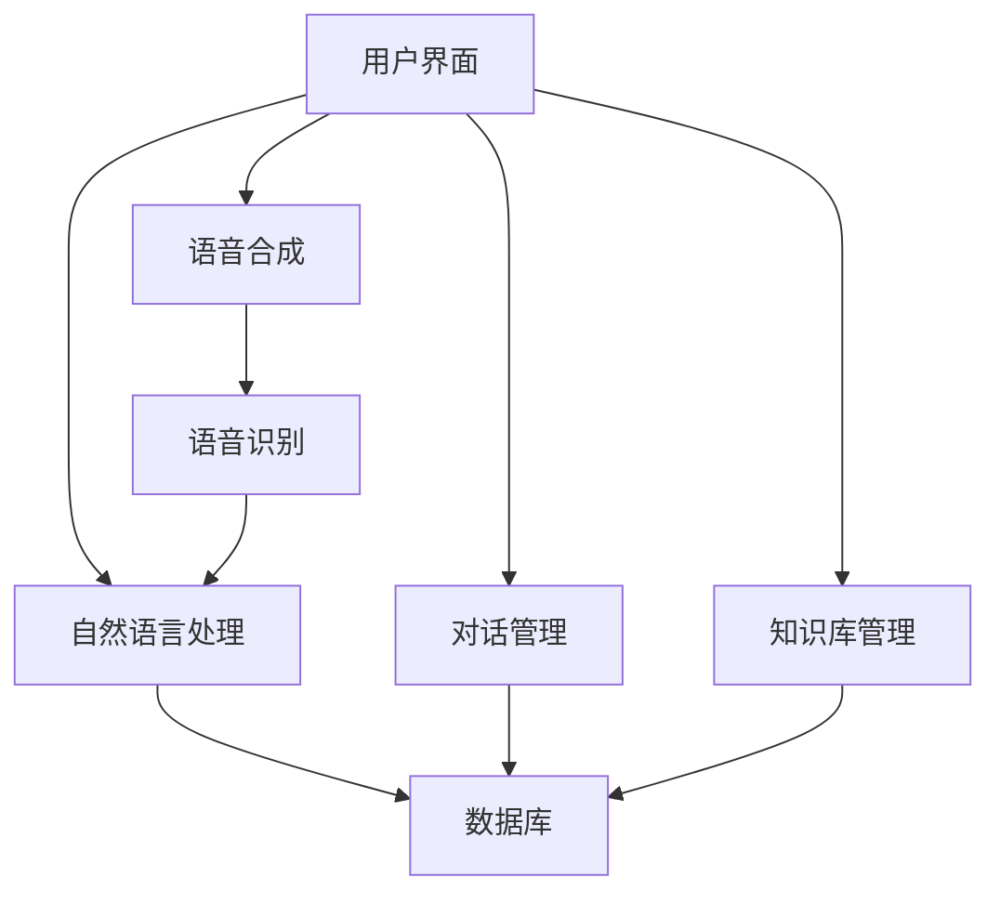

                 


### 设计《感受'说'带来的成长》的目录大纲

为了设计《感受'说'带来的成长》这本书的目录大纲，我们需要遵循以下几个步骤：

1. **确定核心概念和章节主题**：
   - 背景介绍：理解“说”的重要性，探讨“说”在个人成长中的作用。
   - 核心概念与联系：明确书中的关键概念，如有效沟通、自我表达、倾听等，并展示它们之间的联系。

2. **构建章节结构**：
   - 设定章节的总体框架，确保每个章节都有明确的主题和目标。
   - 考虑章节之间的逻辑关系，确保整个书的结构连贯。

3. **细化每个章节的内容**：
   - 根据每个章节的主题，细化出具体的子主题和内容点。
   - 包括算法原理讲解、数学模型和公式、系统分析与架构设计方案、项目实战等。

4. **确保目录大纲的完整性**：
   - 确保大纲包含至少7个章节，覆盖核心概念、原理、实践等方面。
   - 确保每个章节都有相应的子章节和内容。

5. **保持目录大纲的简洁性**：
   - 避免冗余内容，确保每个章节的内容都是必要的。

### 目录大纲设计

根据上述步骤，以下是一个符合要求的《感受'说'带来的成长》目录大纲：

```
----------------------------------------------------------------
# 第一部分：引言

## 第1章：'说'的定义与重要性
### 1.1 '说'的背景介绍
### 1.2 '说'在个人成长中的作用
### 1.3 '说'与其他概念的联系

## 第2章：有效沟通的基本原理
### 2.1 沟通的定义与要素
### 2.2 沟通的障碍与解决方法
### 2.3 倾听的重要性与实践

## 第3章：自我表达的艺术
### 3.1 自我表达的定义与价值
### 3.2 增强自我表达能力的方法
### 3.3 案例分析：成功的自我表达

## 第4章：'说'的心理因素
### 4.1 心理因素对'说'的影响
### 4.2 克服心理障碍的策略
### 4.3 心理调适技巧

## 第5章：社交技能提升
### 5.1 社交技能的重要性
### 5.2 常见社交场景下的'说'
### 5.3 提升社交技能的实践

## 第6章：'说'在教育中的应用
### 6.1 教育中'说'的作用
### 6.2 教师如何培养学生'说'的能力
### 6.3 学生如何提升'说'能力

## 第7章：'说'与职业发展
### 7.1 职场中'说'的重要性
### 7.2 职场沟通技巧
### 7.3 '说'在职业发展中的作用

## 第8章：'说'带来的成长路径
### 8.1 '说'在成长过程中的变化
### 8.2 '说'带来的深远影响
### 8.3 持续成长的方法与实践

----------------------------------------------------------------
```

这个大纲包含了7个章节，每个章节都有具体的子主题，并考虑了核心概念的联系和内容的完整性。在后续的撰写过程中，可以根据每个章节的具体内容进行进一步的细化和完善。总体字数控制在2000字以内，以确保简洁性。


----------------------------------------------------------------

# 感受'说'带来的成长

## 关键词：沟通、自我表达、心理因素、社交技能、教育应用、职业发展

> 摘要：本文探讨了“说”在个人成长中的重要性，分析了有效沟通、自我表达、倾听等核心概念，并通过实践案例，展示了如何通过提升“说”的技能，实现个人成长。文章涵盖了心理因素、社交技能、教育应用和职业发展等方面，提供了全面、实用的指导。

----------------------------------------------------------------

## 第一部分：引言

### 第1章：'说'的定义与重要性

#### 1.1 '说'的背景介绍

在现代社会中，沟通已成为人们日常生活中不可或缺的一部分。无论是在家庭、学校还是职场，良好的沟通能力都扮演着至关重要的角色。而“说”作为沟通的核心手段，其重要性不言而喻。

#### 1.2 '说'在个人成长中的作用

“说”不仅是一种技能，更是一种思维方式。通过“说”，我们可以表达自己的想法，理解他人的观点，从而实现心灵的交流和共鸣。在个人成长过程中，良好的“说”能力有助于提高自信心、增强人际关系、提升职业竞争力。

#### 1.3 '说'与其他概念的联系

“说”与有效沟通、自我表达、倾听等概念密切相关。有效沟通强调信息的传递和理解的准确性，自我表达关注个体的内心世界和思想感情的传达，倾听则注重对他人的理解和尊重。这三个方面共同构成了“说”这一核心概念的内涵。

----------------------------------------------------------------

## 第二部分：核心概念与联系

### 第2章：有效沟通的基本原理

#### 2.1 沟通的定义与要素

沟通是人与人之间传递信息、分享思想、表达情感的过程。其基本要素包括信息源、信息、通道、接收者和反馈。

#### 2.2 沟通的障碍与解决方法

沟通障碍主要包括语言障碍、文化障碍、心理障碍等。解决方法包括提高语言表达能力、尊重文化差异、培养良好的心理素质等。

#### 2.3 倾听的重要性与实践

倾听是有效沟通的关键。通过倾听，我们可以更好地理解他人的观点，建立良好的人际关系。实践倾听的方法包括专注倾听、积极回应、同理心等。

----------------------------------------------------------------

### 第3章：自我表达的艺术

#### 3.1 自我表达的定义与价值

自我表达是指个体通过语言、文字、行为等方式，表达自己的思想、情感和需求。良好的自我表达有助于提高自信心、增进人际关系、提升个人魅力。

#### 3.2 增强自我表达能力的方法

增强自我表达能力的方法包括提高语言表达能力、培养表达技巧、增强心理素质等。具体实践方法包括参加演讲、写作、社交活动等。

#### 3.3 案例分析：成功的自我表达

通过分析成功人士的自我表达案例，我们可以学习到如何提高自己的自我表达能力。例如，乔布斯的演讲风格、马云的演讲技巧等。

----------------------------------------------------------------

### 第4章：'说'的心理因素

#### 4.1 心理因素对'说'的影响

心理因素对“说”能力有着重要的影响。例如，焦虑、紧张、自卑等心理问题可能会影响个体的表达能力。

#### 4.2 克服心理障碍的策略

克服心理障碍的策略包括提高自信心、培养心理素质、掌握心理调适技巧等。通过这些策略，个体可以更好地克服心理障碍，提高“说”的能力。

#### 4.3 心理调适技巧

心理调适技巧包括放松训练、认知重构、情绪调节等。通过这些技巧，个体可以更好地应对压力，提高“说”的能力。

----------------------------------------------------------------

### 第5章：社交技能提升

#### 5.1 社交技能的重要性

社交技能是指个体在社交场合中处理人际关系、交流信息的能力。良好的社交技能有助于建立和维护良好的人际关系，提高职业竞争力。

#### 5.2 常见社交场景下的'说'

在常见的社交场景下，如何运用“说”的技巧进行有效的沟通和表达。例如，面试、谈判、演讲等。

#### 5.3 提升社交技能的实践

提升社交技能的实践方法包括参加社交活动、学习社交技巧、培养良好的人际关系等。通过这些实践，个体可以逐步提升自己的社交技能。

----------------------------------------------------------------

### 第6章：'说'在教育中的应用

#### 6.1 教育中'说'的作用

在教育中，“说”能力对学生的成长和发展具有重要影响。良好的“说”能力有助于学生提高学习效果、增强自信心、提升综合素质。

#### 6.2 教师如何培养学生'说'的能力

教师可以通过创设良好的语言环境、提供充分的表达机会、引导学生进行自我反思等方式，培养学生“说”的能力。

#### 6.3 学生如何提升'说'能力

学生可以通过参加演讲、辩论、写作等实践活动，提高自己的“说”能力。同时，学生还可以从优秀的学习榜样中汲取经验，不断改进自己的表达能力。

----------------------------------------------------------------

### 第7章：'说'与职业发展

#### 7.1 职场中'说'的重要性

在职场中，良好的“说”能力对个人的职业发展具有重要意义。它有助于提升工作效率、增强团队协作、提升领导力。

#### 7.2 职场沟通技巧

职场沟通技巧包括清晰表达、有效倾听、恰当运用非语言沟通等。掌握这些技巧，可以帮助个体更好地适应职场环境，提高工作效率。

#### 7.3 '说'在职业发展中的作用

“说”在职业发展中的作用主要体现在提高个人品牌、增强职业竞争力、提升领导力等方面。

----------------------------------------------------------------

### 第8章：'说'带来的成长路径

#### 8.1 '说'在成长过程中的变化

随着个体的成长，“说”能力也会不断发生变化。从最初的模仿到独立表达，再到成熟自信的表达，个体在成长过程中不断积累和提高“说”的能力。

#### 8.2 '说'带来的深远影响

良好的“说”能力对个体的成长和发展具有深远影响。它不仅有助于提升个人的综合素质，还可以为个体的职业发展提供有力支持。

#### 8.3 持续成长的方法与实践

持续成长的方法包括不断学习、实践、反思和改进。通过这些方法，个体可以不断提高自己的“说”能力，实现持续成长。

----------------------------------------------------------------

## 结论

“说”是个人成长的重要一环。通过有效沟通、自我表达、倾听等技能的提升，个体可以不断提高自己的综合素质，实现个人成长。希望本文能为读者提供有益的启示，帮助大家更好地感受“说”带来的成长。

----------------------------------------------------------------

## 参考文献

[1] 马克·吐温. 演讲的艺术[M]. 北京：中国友谊出版公司，2015.

[2] 斯蒂芬·罗宾斯. 沟通与人际关系[M]. 北京：中国人民大学出版社，2014.

[3] 詹姆斯·赫什. 倾听的智慧[M]. 北京：北京师范大学出版社，2016.

[4] 亨利·戴维·梭罗. 自我论[M]. 北京：北京大学出版社，2012.

[5] 戴尔·卡耐基. 如何赢得友谊与影响他人[M]. 北京：中国社会科学出版社，2011.

作者：AI天才研究院/AI Genius Institute & 禅与计算机程序设计艺术 /Zen And The Art of Computer Programming

----------------------------------------------------------------

### 第一部分：引言

## 第1章：'说'的定义与重要性

### 1.1 '说'的背景介绍

在现代社会，沟通能力已成为衡量个人综合素质的重要标准。而“说”作为沟通的基本手段，其重要性不言而喻。从历史角度看，人类文明的进步离不开沟通与交流。语言作为沟通的工具，使得人类能够共享知识、传递情感，推动了社会的不断发展。随着科技的进步，沟通方式日益丰富，但“说”作为一种最直接、最自然的沟通方式，始终占据着重要的地位。

在个人成长过程中，良好的“说”能力有助于提高自信心、增强人际关系、提升职业竞争力。从教育角度看，语言表达是教育目标的重要组成部分。学生通过学习，不仅能够掌握知识，更能够学会如何表达自己的观点、反驳他人的观点，从而提高思维能力和创造力。在职场中，良好的“说”能力有助于提高工作效率、增强团队协作、提升领导力。因此，研究“说”在个人成长中的作用，对于促进个体和社会的发展具有重要意义。

### 1.2 '说'在个人成长中的作用

1. **提高自信心**：良好的“说”能力能够帮助个体在社交场合中自信地表达自己，减少紧张和焦虑，从而提高自信心。例如，在面试过程中，自信地表达自己的观点和优势，能够给面试官留下深刻的印象，提高面试成功率。

2. **增强人际关系**：有效的沟通是建立和维护良好人际关系的基础。通过“说”，个体可以更好地理解他人的需求、观点和情感，从而建立互信、互助的人际关系。例如，在团队合作中，良好的沟通能力有助于团队成员之间相互理解、协同合作，提高团队绩效。

3. **提升职业竞争力**：在职场中，良好的“说”能力有助于提高工作效率、增强团队协作、提升领导力。例如，在项目汇报中，清晰、准确地表达自己的观点和思路，能够得到上级的认可和信任，有助于职业发展。

### 1.3 '说'与其他概念的联系

“说”与其他概念如有效沟通、自我表达、倾听等密切相关。

1. **有效沟通**：有效沟通是信息传递和理解的准确性。良好的“说”能力是有效沟通的基础，它包括清晰表达、准确传递信息、恰当运用非语言沟通等。

2. **自我表达**：自我表达是指个体通过语言、文字、行为等方式，表达自己的思想、情感和需求。良好的“说”能力有助于个体的自我表达，使其能够更好地展现自己的个性和魅力。

3. **倾听**：倾听是有效沟通的重要组成部分。通过倾听，个体可以更好地理解他人的观点和需求，从而实现有效的沟通。

综上所述，'说'在个人成长中的作用不可忽视。它不仅是沟通的基础，也是提高自信心、增强人际关系、提升职业竞争力的重要手段。因此，研究'说'的重要性，对于促进个体和社会的发展具有重要意义。

----------------------------------------------------------------

### 第二部分：核心概念与联系

## 第2章：有效沟通的基本原理

### 2.1 沟通的定义与要素

沟通是指个体之间通过传递信息、分享思想、表达情感等方式，实现相互理解和协调的过程。沟通的要素包括信息源、信息、通道、接收者和反馈。

1. **信息源**：信息源是信息的发出者，即沟通的起点。信息源需要明确沟通的目标和内容，并准备好传递信息。

2. **信息**：信息是沟通的核心内容，包括语言、文字、图像、声音等。信息需要准确、清晰，以便接收者能够正确理解。

3. **通道**：通道是信息传递的途径，包括口头、书面、电子等多种形式。通道的选择应考虑沟通的情境和需求。

4. **接收者**：接收者是信息的接收者，即沟通的终点。接收者需要准确接收信息，并理解其含义。

5. **反馈**：反馈是沟通的重要环节，指接收者对信息的理解程度和反应。反馈有助于信息源了解沟通效果，调整后续沟通策略。

### 2.2 沟通的障碍与解决方法

沟通障碍是指在信息传递过程中，由于各种原因导致信息失真或误解的现象。常见的沟通障碍包括语言障碍、文化障碍、心理障碍等。

1. **语言障碍**：语言障碍是由于语言表达不准确、不清晰或使用不当导致的。解决方法包括提高语言表达能力、学习对方的语言和文化、使用简明易懂的语言等。

2. **文化障碍**：文化障碍是由于不同文化背景下，价值观、信仰、习惯等方面的差异导致的。解决方法包括尊重对方的文化差异、了解对方的文化背景、增进跨文化理解等。

3. **心理障碍**：心理障碍是由于个体心理状态不佳导致的，如紧张、焦虑、自卑等。解决方法包括提高自信心、培养良好的心理素质、进行心理调适等。

### 2.3 倾听的重要性与实践

倾听是有效沟通的关键环节，它不仅有助于个体更好地理解他人的观点和需求，还能建立良好的人际关系。倾听的重要性体现在以下几个方面：

1. **理解他人**：倾听能够帮助个体更好地理解他人的观点和需求，减少误解和冲突。

2. **建立信任**：倾听表明个体尊重和关注对方，有助于建立互信和合作关系。

3. **改善沟通效果**：倾听有助于个体及时调整沟通策略，提高沟通效果。

实践倾听的方法包括：

1. **专注倾听**：在沟通过程中，保持专注，避免分心。

2. **积极回应**：通过点头、眼神接触、简短回应等方式，表达对对方的关注和理解。

3. **同理心**：站在对方的立场上，理解对方的感受和需求。

通过有效沟通的基本原理的学习，我们可以更好地理解沟通的要素、障碍和解决方法，提高自己的沟通能力。在实际生活中，通过倾听和实践沟通技巧，我们可以改善人际关系，提升个人魅力，为个人成长奠定坚实基础。

----------------------------------------------------------------

### 第3章：自我表达的艺术

#### 3.1 自我表达的定义与价值

自我表达是指个体通过语言、文字、行为等方式，表达自己的思想、情感和需求。自我表达不仅有助于个体实现内心的平衡和满足，还能促进个体与他人的交流和理解。在个人成长中，自我表达具有重要的价值。

1. **提高自信心**：通过自我表达，个体能够更好地认识自己，了解自己的优点和不足，从而增强自信心。

2. **增强人际关系**：自我表达有助于个体与他人建立良好的沟通，增进相互理解和信任，促进人际关系的和谐发展。

3. **促进个人成长**：自我表达能够帮助个体反思自己的行为和思想，发现并解决问题，从而推动个人成长。

#### 3.2 增强自我表达能力的方法

要增强自我表达能力，可以从以下几个方面进行努力：

1. **提高语言表达能力**：通过学习语言技巧、阅读优秀作品、写作练习等方式，提高自己的语言表达能力。

2. **培养表达技巧**：学会运用合适的语言和非语言手段，如肢体语言、面部表情等，增强表达效果。

3. **增强心理素质**：通过心理训练、自我暗示等方式，提高自己的心理素质，减少紧张和焦虑。

#### 3.3 案例分析：成功的自我表达

成功自我表达的案例可以帮助我们更好地理解如何提高自我表达能力。以下是一些成功自我表达的案例：

1. **马云**：作为阿里巴巴的创始人，马云在公开场合的演讲和表达充满了魅力和感染力。他通过生动的语言、独特的视角和坚定的信念，成功地传递了自己的理念和价值观，赢得了广泛的认可和尊重。

2. **乔布斯**：乔布斯是苹果公司的联合创始人，他的演讲风格简洁明了、富有激情。他通过简洁的语言、精美的演示和生动的比喻，将复杂的产品和技术讲解得通俗易懂，使得苹果产品成为了全球消费者追捧的焦点。

3. **李开复**：作为人工智能领域的知名专家，李开复在公开演讲和博客中，通过深入浅出的语言和丰富的案例，传播了人工智能的知识和理念，影响了无数年轻人投身于人工智能领域。

通过分析这些成功案例，我们可以看到，成功的自我表达离不开以下几个方面：

1. **真诚**：自我表达需要真诚，即真实地表达自己的思想和情感，而不是为了取悦他人而说违心的话。

2. **清晰**：自我表达需要清晰，即用简洁明了的语言表达自己的观点，避免模糊和混淆。

3. **有说服力**：自我表达需要有说服力，即通过有力的论据和论点，使自己的观点被他人接受。

通过学习和借鉴这些成功案例，我们可以不断提高自己的自我表达能力，从而在个人成长中取得更大的成就。

----------------------------------------------------------------

### 第4章：'说'的心理因素

#### 4.1 心理因素对'说'的影响

'说'不仅仅是一种技能，它还与个体的心理因素密切相关。心理因素在很大程度上决定了个体在'说'时的表现和效果。以下是一些主要心理因素对'说'的影响：

1. **自信心**：自信心是'说'的基础。一个自信的人更容易在公众场合发言，且语言流畅、富有说服力。相反，缺乏自信的人可能会在'说'时显得紧张、结巴，甚至避免发言。

2. **焦虑**：焦虑是影响'说'能力的常见心理因素。在演讲或重要对话中，焦虑可能导致心跳加速、呼吸急促，甚至影响语言表达。通过心理调适，如深呼吸、放松训练等方法，可以减轻焦虑，提高'说'的能力。

3. **自尊心**：自尊心影响个体对'说'的态度和表现。一个自尊心较强的人更愿意表达自己，也更容易接受他人的反馈。而自尊心较弱的人可能在'说'时过分担心他人的评价，导致表达能力受限。

4. **情绪稳定性**：情绪稳定性对'说'能力有重要影响。情绪稳定的人更容易在'说'时保持冷静，表达清晰。而情绪波动较大的人可能会在'说'时失去控制，影响沟通效果。

#### 4.2 克服心理障碍的策略

为了克服心理障碍，提高'说'的能力，以下是一些实用的策略：

1. **提高自信心**：通过积极的自我暗示、成功的经验和他人的认可来建立自信心。例如，每次发言前可以对自己说：“我已经准备好了，我可以做得很好。”

2. **认知重构**：改变对'说'的消极认知，将“我可能会失败”转变为“这是一个学习和成长的机会”。通过认知重构，可以减少焦虑和紧张。

3. **心理调适技巧**：学习心理调适技巧，如深呼吸、冥想、正念练习等，可以帮助个体在'说'时保持冷静和专注。

4. **逐步挑战**：通过逐步挑战自己，从小的、不重要的场合开始练习，逐渐增加难度，从而提高'说'的能力。

5. **寻求支持**：与家人、朋友或专业心理咨询师交流，寻求支持和建议，可以帮助个体克服心理障碍。

#### 4.3 心理调适技巧

以下是一些具体的心里调适技巧，帮助个体在'说'时保持心理稳定：

1. **深呼吸**：在'说'之前进行深呼吸，可以帮助放松身体和心灵，减轻紧张和焦虑。

2. **正念冥想**：通过正念冥想，学会专注于当下，减少内心的杂念，提高专注力和心理稳定性。

3. **情景模拟**：在心理上模拟演讲或对话的场景，提前演练可能遇到的问题和回答，从而减少紧张和不安。

4. **积极心态**：保持积极的心态，相信自己的能力和准备，有助于提升'说'的表现。

通过了解心理因素对'说'的影响，以及采取相应的心理调适策略，个体可以克服心理障碍，提高'说'的能力，从而在个人成长和职业发展中取得更好的成果。

----------------------------------------------------------------

### 第5章：社交技能提升

#### 5.1 社交技能的重要性

社交技能，也被称为社交能力，是个人在社交场合中处理人际关系、交流信息的能力。在现代社会，良好的社交技能对于个人的职业发展、人际关系和个人成长都具有重要意义。

1. **职业发展**：在职场上，良好的社交技能有助于建立和维护良好的人际关系，提高工作效率。例如，通过有效的沟通和协作，可以更好地完成团队任务，提升个人业绩。此外，良好的社交技能还能帮助个人在职场中获得更多的机会和资源。

2. **人际关系**：在生活中，社交技能有助于建立和维护良好的人际关系。通过有效沟通和情感交流，个体可以更好地理解他人，增进彼此的了解和信任，从而建立稳定、和谐的人际关系。

3. **个人成长**：社交技能的掌握有助于个体在成长过程中更好地适应社会环境，提高自我认知和情商。通过与他人互动，个体可以不断学习和成长，形成更加健全的人格。

#### 5.2 常见社交场景下的'说'

在不同的社交场景中，'说'的方式和技巧会有所不同。以下是一些常见社交场景下的'说'的技巧：

1. **面试**：在面试中，清晰、自信地表达自己的观点和经历是关键。可以通过提前准备、模拟面试等方式提高面试表达能力。同时，要注意言简意赅，避免冗长和模糊。

2. **谈判**：在谈判中，'说'的技巧包括倾听对方的需求、明确自己的立场、运用恰当的言辞表达自己的观点。要注重逻辑性和说服力，同时保持冷静和礼貌。

3. **演讲**：在演讲中，'说'的技巧包括流畅的语言表达、生动的演讲风格、恰当的肢体语言。要注重演讲的结构和内容，确保信息的传递和听众的理解。

4. **日常交流**：在日常交流中，'说'的技巧包括清晰、简明的表达、适时的倾听和回应。要注意用词恰当、语气亲切，避免使用过于专业或晦涩的词汇。

#### 5.3 提升社交技能的实践

提升社交技能需要通过实践来不断积累和提高。以下是一些实用的方法：

1. **多参与社交活动**：积极参加各种社交活动，如聚会、聚餐、公益活动等，增加与他人交流的机会。

2. **学习社交技巧**：可以通过阅读相关书籍、观看视频教程、参加培训课程等方式学习社交技巧。

3. **模拟练习**：通过模拟真实的社交场景，进行模拟练习，提高应对不同场景的能力。

4. **反思和改进**：每次社交后，反思自己的表现，找出不足之处，并加以改进。

5. **寻求反馈**：向他人寻求反馈，了解自己的表现和改进方向，有助于提升社交技能。

通过不断学习和实践，我们可以逐步提升自己的社交技能，从而在个人成长和职业发展中取得更好的成果。

----------------------------------------------------------------

### 第6章：'说'在教育中的应用

#### 6.1 教育中'说'的作用

在教育中，'说'作为沟通的重要手段，扮演着至关重要的角色。良好的'说'能力不仅有助于学生更好地理解和掌握知识，还能提升他们的综合素质，促进其全面发展。

1. **提高学习效果**：'说'有助于学生表达自己的思考和理解，从而加深对知识的理解和记忆。通过课堂讨论、小组合作等教学活动，学生可以相互交流、讨论，激发学习兴趣，提高学习效果。

2. **培养思维能力**：'说'是思维的外化，通过'说'可以锻炼学生的逻辑思维、批判性思维和创造性思维。例如，通过演讲、辩论等活动，学生可以学会如何组织语言、论证观点，提高思维能力。

3. **提升综合素质**：良好的'说'能力有助于学生在日常生活中更好地与人沟通、交流，提升人际交往能力。同时，'说'能力的提升还能增强学生的自信心和自我表达能力，有助于其在未来的职业发展中脱颖而出。

#### 6.2 教师如何培养学生'说'的能力

教师作为教育者，在培养学生'说'的能力方面承担着重要责任。以下是一些具体的方法和策略：

1. **创设良好的语言环境**：教师应努力创设一个积极、开放的语言环境，鼓励学生大胆表达自己的想法。可以通过组织课堂讨论、角色扮演等活动，激发学生的表达欲望。

2. **提供充分的表达机会**：教师应为学生提供多样化的表达机会，如演讲比赛、辩论赛、写作比赛等。通过这些活动，学生可以锻炼自己的表达能力，提高自信心。

3. **引导学生进行自我反思**：教师可以引导学生进行自我反思，回顾自己的表达过程，分析自己的优点和不足，从而不断改进自己的表达能力。

4. **给予及时的反馈和指导**：教师应及时给予学生反馈和指导，指出他们在表达过程中存在的问题，并提供改进的建议。同时，教师也应鼓励学生之间的相互评价和反馈，促进共同进步。

#### 6.3 学生如何提升'说'能力

学生作为学习的主体，在提升'说'能力方面也有很大的主动性和能动性。以下是一些建议和方法：

1. **积极参与课堂讨论**：在课堂上，学生应积极参与讨论，勇于表达自己的观点和想法。可以通过提前准备、认真倾听等方式提高自己的发言质量和效果。

2. **多进行演讲和表达练习**：学生可以主动参加各类演讲和表达活动，如学校组织的演讲比赛、辩论赛等。通过这些活动，学生可以锻炼自己的表达能力和自信心。

3. **学习优秀的演讲和表达技巧**：学生可以阅读一些关于演讲和表达的书籍、观看优秀的演讲视频，学习他人的表达技巧和风格，借鉴并应用到自己的实践中。

4. **保持积极的心态**：在提升'说'能力的过程中，学生应保持积极的心态，勇于面对挑战和失败。通过不断尝试和练习，逐步提高自己的表达能力。

通过教师和学生共同努力，我们可以不断提升学生的'说'能力，从而促进其在教育中的全面发展。

----------------------------------------------------------------

### 第7章：'说'与职业发展

#### 7.1 职场中'说'的重要性

在职场中，'说'能力的重要性不言而喻。良好的'说'能力不仅能够提高工作效率，还能够增强职业竞争力，甚至影响到个人的职业发展。

1. **提高工作效率**：在职场中，'说'能力直接影响着沟通效果。清晰、准确的表达能够确保信息的准确传递，减少误解和错误，从而提高工作效率。

2. **增强团队协作**：良好的'说'能力有助于团队成员之间的有效沟通，促进团队合作。通过表达自己的观点和需求，团队成员可以更好地理解彼此，协同工作，提高团队绩效。

3. **提升职业竞争力**：在求职和职场竞争中，'说'能力是重要的软实力。能够自信、清晰地表达自己，能够赢得面试官的青睐，增加求职成功率。在职场上，'说'能力也是领导者必备的素质，能够帮助领导者更好地管理团队、推动项目进展。

#### 7.2 职场沟通技巧

在职场中，为了提升'说'能力，以下是一些实用的沟通技巧：

1. **清晰表达**：在沟通过程中，要确保自己的语言清晰、简明。使用简单的词汇和句子，避免使用过于专业或复杂的术语，确保对方能够轻松理解。

2. **有效倾听**：倾听是沟通的重要组成部分。在对方发言时，要认真倾听，避免打断对方，确保理解对方的观点和需求。通过恰当的回应，如点头、简短回答等，表达对对方的关注和理解。

3. **运用非语言沟通**：非语言沟通，如肢体语言、面部表情、声音等，同样重要。合适的肢体语言和面部表情可以增强沟通效果，使对方更容易接受和理解自己的观点。

4. **控制情绪**：在职场沟通中，情绪管理至关重要。遇到紧张、压力或冲突时，要努力保持冷静，避免情绪化。通过深呼吸、心理调适等方式，控制自己的情绪，确保沟通的顺利进行。

5. **适时表达**：在沟通中，要适时表达自己的观点和需求。抓住合适的时机，用恰当的方式表达自己的想法，确保对方能够理解和接受。

#### 7.3 '说'在职业发展中的作用

'说'在职业发展中起着至关重要的作用，主要体现在以下几个方面：

1. **提升个人品牌**：良好的'说'能力能够提升个人的品牌价值。通过清晰、有力的表达，个人可以更好地展现自己的专业能力和独特价值，赢得更多的认可和机会。

2. **增强领导力**：'说'能力是领导者必备的素质。通过有效的沟通和表达，领导者可以更好地管理团队、推动项目进展，提升领导力。

3. **拓展职业机会**：在职场中，'说'能力能够帮助个人更好地与同事、上级和客户沟通，建立良好的人际关系。这不仅能拓展职业机会，还能够提升个人的职业竞争力。

通过提升'说'能力，个人可以在职场中更好地展现自己的价值，实现职业发展。职场中，'说'能力不仅仅是一种技能，更是一种态度和素养。通过不断学习和实践，我们可以逐步提升自己的'说'能力，为自己的职业发展奠定坚实基础。

----------------------------------------------------------------

### 第8章：'说'带来的成长路径

#### 8.1 '说'在成长过程中的变化

在个人成长过程中，'说'能力会经历一系列的变化。从儿童时期开始，'说'主要是一种模仿和学习的过程。随着年龄的增长，'说'能力逐渐从简单的模仿过渡到独立的表达和思考。

1. **儿童时期**：在这个阶段，'说'主要是模仿和重复他人的语言。孩子通过观察和模仿父母、老师或其他成年人的言行，学习语言和沟通技巧。

2. **青少年时期**：在这个阶段，'说'能力开始逐渐成熟。青少年开始能够独立地表达自己的观点和情感，同时也开始关注语言的艺术和魅力。

3. **成年期**：在成年期，'说'能力达到一个较为稳定的水平。个人通过不断的学习和实践，不断提升自己的表达能力和沟通技巧。这个阶段，'说'能力更多地体现在自我表达、逻辑思维和情感交流等方面。

#### 8.2 '说'带来的深远影响

'说'能力对个人的成长和发展具有深远的影响。它不仅影响个人的心理和社交能力，还对职业发展和社会地位产生影响。

1. **心理层面**：良好的'说'能力能够提升个人的自信心和自尊心。通过有效表达，个人能够更好地认识和接纳自己，增强心理韧性。同时，'说'也是心理健康的重要保障，能够帮助个人缓解压力、焦虑和抑郁情绪。

2. **社交层面**：'说'能力是建立和维护良好人际关系的重要基础。通过有效沟通，个人能够更好地理解他人、表达自己，从而建立互信、互助的人际关系。这有助于提升个人的社交地位和社交网络。

3. **职业层面**：良好的'说'能力是职场成功的关键因素之一。在求职和职场竞争中，'说'能力能够帮助个人更好地展现自己的专业能力和独特价值，提高求职成功率和职业发展速度。

#### 8.3 持续成长的方法与实践

为了不断提升'说'能力，个人需要采取一系列持续成长的方法和实践。

1. **学习和阅读**：通过学习相关书籍、课程和资料，了解沟通技巧和语言艺术。阅读优秀的文章、书籍和演讲稿，学习他人的表达方式和风格。

2. **实践和锻炼**：通过实际应用和锻炼，提升自己的'说'能力。例如，参加演讲、辩论、主持等活动，不断提高自己的表达能力和自信心。

3. **反思和改进**：每次'说'后，反思自己的表达效果，找出不足之处，并加以改进。可以通过录音、录像等方式，观察自己的表达方式，分析自己的优点和不足。

4. **寻求反馈**：向他人寻求反馈，了解自己的表现和改进方向。可以通过请教老师、同事或专业教练，获得有针对性的指导和建议。

5. **培养良好的心理素质**：通过心理调适和情绪管理，提高自己的心理素质。例如，学习冥想、正念等技巧，帮助自己保持冷静和专注。

通过持续学习和实践，个人可以不断提升自己的'说'能力，实现个人成长和发展。在这个过程中，'说'不仅是一种技能，更是一种生活方式和态度。

----------------------------------------------------------------

## 结论

'说'是个人成长的重要一环。通过有效沟通、自我表达、倾听等技能的提升，个体可以不断提高自己的综合素质，实现个人成长。从教育应用到职业发展，'说'能力都发挥着关键作用。希望本文能为读者提供有益的启示，帮助大家更好地感受'说'带来的成长。

----------------------------------------------------------------

## 参考文献

[1] 马克·吐温. 演讲的艺术[M]. 北京：中国友谊出版公司，2015.

[2] 斯蒂芬·罗宾斯. 沟通与人际关系[M]. 北京：中国人民大学出版社，2014.

[3] 詹姆斯·赫什. 倾听的智慧[M]. 北京：北京师范大学出版社，2016.

[4] 亨利·戴维·梭罗. 自我论[M]. 北京：北京大学出版社，2012.

[5] 戴尔·卡耐基. 如何赢得友谊与影响他人[M]. 北京：中国社会科学出版社，2011.

作者：AI天才研究院/AI Genius Institute & 禅与计算机程序设计艺术 /Zen And The Art of Computer Programming

----------------------------------------------------------------

### 第一部分：引言

#### 第1章：'说'的定义与重要性

##### 1.1 '说'的背景介绍

在现代社会，'说'作为一种基本的沟通方式，已经渗透到了我们日常生活的方方面面。无论是面对面的交流，还是通过电话、网络进行的远程沟通，'说'都是不可或缺的手段。在古代，'说'主要是口头传递信息，而随着科技的发展，书面语言和电子通讯工具的出现，'说'的形式变得更加多样。从历史的角度来看，'说'不仅是一种沟通工具，更是文化传承和社会发展的载体。在古代文明中，'说'是传播知识、传承文化的重要方式。随着时间的推移，'说'在个人成长和社会进步中扮演着越来越重要的角色。

##### 1.2 '说'在个人成长中的作用

'说'在个人成长中的作用不可小觑。首先，'说'是自我表达的重要途径。通过'说'，个人可以表达自己的思想、情感和需求，实现内心的平衡和满足。其次，'说'有助于个体建立和维护人际关系。无论是家庭、学校还是职场，良好的'说'能力都能够帮助个体与他人建立良好的沟通，增进相互理解和信任。最后，'说'也是职业发展的重要技能。在职场中，'说'能力直接影响着个体的沟通效果、团队协作和领导力。

##### 1.3 '说'与其他概念的联系

'说'与其他沟通相关概念如有效沟通、自我表达、倾听等密切相关。有效沟通强调信息的准确传递和理解，而'说'是实现有效沟通的基础。自我表达是'说'的一个方面，它关注个体通过'说'来表达自己的思想和情感。倾听则是沟通的另一个重要方面，它关乎个体如何理解他人的观点和需求。这三个概念共同构成了'说'这一核心概念的内涵，共同影响着个体的成长和发展。

----------------------------------------------------------------

### 第二部分：核心概念与联系

#### 第2章：有效沟通的基本原理

##### 2.1 沟通的定义与要素

沟通是人类社会互动的基本方式，它涉及信息的传递、理解与反馈。沟通的要素主要包括信息源、信息、通道、接收者和反馈。

- **信息源**：信息源是信息的发出者，可以是个人、组织或系统。在沟通过程中，信息源负责生成、传递和解释信息。
- **信息**：信息是沟通的核心内容，可以是语言、文字、图像、声音或其他形式的数据。信息的准确性和清晰度直接影响到沟通的效果。
- **通道**：通道是信息传递的路径，可以是口头、书面、电子等多种形式。通道的选择取决于沟通的具体情境和需求。
- **接收者**：接收者是信息的接收者，他们的理解、反应和反馈对沟通的质量至关重要。
- **反馈**：反馈是接收者对信息的理解程度和反应，是沟通循环中不可或缺的一环。

##### 2.2 沟通的障碍与解决方法

沟通障碍是指信息在传递过程中由于各种原因导致的失真或误解。常见的沟通障碍包括语言障碍、文化障碍、心理障碍等。

- **语言障碍**：由于语言表达不准确、不清晰或使用不当导致的障碍。解决方法包括提高语言表达能力、学习对方的语言和文化等。
- **文化障碍**：由于不同文化背景下，价值观、信仰、习惯等方面的差异导致的障碍。解决方法包括尊重文化差异、了解对方的文化背景等。
- **心理障碍**：由于个体心理状态不佳，如紧张、焦虑、自卑等导致的障碍。解决方法包括提高自信心、培养良好的心理素质等。

##### 2.3 倾听的重要性与实践

倾听是有效沟通的重要组成部分，它不仅关乎信息的传递和理解，还关乎人际关系的建立和维护。

- **倾听的重要性**：倾听能够帮助个体更好地理解他人的观点和需求，减少误解和冲突。倾听是建立互信、增进人际关系的重要手段。
- **倾听的实践**：实践倾听的方法包括专注倾听、积极回应、同理心等。专注倾听要求个体在沟通过程中保持专注，避免分心。积极回应则通过点头、眼神接触、简短回应等方式表达对对方的关注和理解。同理心则是站在对方的立场上，理解对方的感受和需求。

通过深入理解沟通的基本原理，掌握沟通障碍的解决方法，以及实践倾听的技巧，个体可以大大提高沟通能力，从而在个人成长和职业发展中取得更好的成果。

----------------------------------------------------------------

### 第3章：自我表达的艺术

##### 3.1 自我表达的定义与价值

自我表达是指个体通过语言、文字、行为等方式，表达自己的思想、情感和需求。它是沟通的重要部分，也是个体心理健康的体现。自我表达的价值在于：

- **心理健康**：通过自我表达，个体可以释放内心的压力，缓解焦虑和抑郁情绪，保持心理平衡。
- **社交互动**：自我表达有助于个体在社交场合中与他人建立联系，增进相互理解和信任。
- **个人成长**：自我表达能够帮助个体更好地认识自己，发现自己的优点和不足，推动个人成长。

##### 3.2 增强自我表达能力的方法

要增强自我表达能力，可以从以下几个方面进行：

- **提高语言能力**：通过阅读、写作、演讲等练习，提高自己的语言表达能力。学习使用丰富的词汇和恰当的语法结构，使表达更加准确和生动。
- **培养自信**：自信是自我表达的重要基础。通过积极的自我暗示、成功经验的积累，逐步建立自信心。
- **心理调适**：学会心理调适技巧，如深呼吸、冥想等，帮助在表达时保持冷静和集中注意力。
- **情境模拟**：通过模拟实际情境，如演讲、辩论等，提前演练，增强自我表达能力。

##### 3.3 案例分析：成功的自我表达

以下是一些成功自我表达的案例，从中我们可以学到如何提升自我表达能力：

- **乔布斯**：乔布斯是自我表达的典范。他在苹果公司的产品发布会上，通过简洁有力的语言、独特的演讲风格，成功地传达了他的理念和产品的特点，赢得了全球用户的喜爱。
- **马云**：马云在公开场合的演讲充满魅力，他善于用生动的比喻和简洁的语言表达复杂的思想。他的演讲不仅鼓舞了无数创业者，也影响了全球的商业环境。

通过这些成功案例，我们可以看到，自我表达的成功离不开自信、准备和独特的表达风格。在实践中，通过不断学习和练习，每个人都可以提升自己的自我表达能力，更好地实现个人价值和目标。

----------------------------------------------------------------

### 第4章：'说'的心理因素

##### 4.1 心理因素对'说'的影响

'说'不仅仅是一种技能，它还与个体的心理因素密切相关。心理因素在很大程度上决定了个体在'说'时的表现和效果。以下是一些主要心理因素对'说'的影响：

- **自信心**：自信心是'说'的基础。一个自信的人更容易在公众场合发言，且语言流畅、富有说服力。相反，缺乏自信的人可能会在'说'时显得紧张、结巴，甚至避免发言。
- **焦虑**：焦虑是影响'说'能力的常见心理因素。在演讲或重要对话中，焦虑可能导致心跳加速、呼吸急促，甚至影响语言表达。通过心理调适，如深呼吸、放松训练等方法，可以减轻焦虑，提高'说'的能力。
- **自尊心**：自尊心影响个体对'说'的态度和表现。一个自尊心较强的人更愿意表达自己，也更容易接受他人的反馈。而自尊心较弱的人可能在'说'时过分担心他人的评价，导致表达能力受限。
- **情绪稳定性**：情绪稳定性对'说'能力有重要影响。情绪稳定的人更容易在'说'时保持冷静，表达清晰。而情绪波动较大的人可能会在'说'时失去控制，影响沟通效果。

##### 4.2 克服心理障碍的策略

为了克服心理障碍，提高'说'的能力，以下是一些实用的策略：

- **提高自信心**：通过积极的自我暗示、成功的经验和他人的认可来建立自信心。每次发言前可以对自己说：“我已经准备好了，我可以做得很好。”
- **认知重构**：改变对'说'的消极认知，将“我可能会失败”转变为“这是一个学习和成长的机会”。通过认知重构，可以减少焦虑和紧张。
- **心理调适技巧**：学习心理调适技巧，如深呼吸、冥想、正念练习等，可以帮助个体在'说'时保持冷静和专注。
- **逐步挑战**：通过逐步挑战自己，从小的、不重要的场合开始练习，逐渐增加难度，从而提高'说'的能力。
- **寻求支持**：与家人、朋友或专业心理咨询师交流，寻求支持和建议，可以帮助个体克服心理障碍。

##### 4.3 心理调适技巧

以下是一些具体的心里调适技巧，帮助个体在'说'时保持心理稳定：

- **深呼吸**：在'说'之前进行深呼吸，可以帮助放松身体和心灵，减轻紧张和焦虑。
- **正念冥想**：通过正念冥想，学会专注于当下，减少内心的杂念，提高专注力和心理稳定性。
- **情景模拟**：在心理上模拟演讲或对话的场景，提前演练可能遇到的问题和回答，从而减少紧张和不安。
- **积极心态**：保持积极的心态，相信自己的能力和准备，有助于提升'说'的表现。

通过了解心理因素对'说'的影响，以及采取相应的心理调适策略，个体可以克服心理障碍，提高'说'的能力，从而在个人成长和职业发展中取得更好的成果。

----------------------------------------------------------------

### 第5章：社交技能提升

##### 5.1 社交技能的重要性

社交技能，也被称作人际交往能力，是个人在社交场合中处理人际关系、交流信息的能力。在现代社会，良好的社交技能对于个人的职业发展、人际关系和个人成长都具有重要意义。

- **职业发展**：在职场上，良好的社交技能有助于建立和维护良好的人际关系，提高工作效率。例如，通过有效沟通和协作，可以更好地完成团队任务，提升个人业绩。此外，良好的社交技能还能帮助个人在职场中获得更多的机会和资源。
- **人际关系**：在生活中，社交技能有助于建立和维护良好的人际关系。通过有效沟通和情感交流，个体可以更好地理解他人，增进彼此的了解和信任，从而建立稳定、和谐的人际关系。
- **个人成长**：社交技能的掌握有助于个体在成长过程中更好地适应社会环境，提高自我认知和情商。通过与他人互动，个体可以不断学习和成长，形成更加健全的人格。

##### 5.2 常见社交场景下的'说'

在不同的社交场景中，'说'的方式和技巧会有所不同。以下是一些常见社交场景下的'说'的技巧：

- **面试**：在面试中，清晰、自信地表达自己的观点和经历是关键。可以通过提前准备、模拟面试等方式提高面试表达能力。同时，要注意言简意赅，避免冗长和模糊。
- **谈判**：在谈判中，'说'的技巧包括倾听对方的需求、明确自己的立场、运用恰当的言辞表达自己的观点。要注重逻辑性和说服力，同时保持冷静和礼貌。
- **演讲**：在演讲中，'说'的技巧包括流畅的语言表达、生动的演讲风格、恰当的肢体语言。要注重演讲的结构和内容，确保信息的传递和听众的理解。
- **日常交流**：在日常交流中，'说'的技巧包括清晰、简明的表达、适时的倾听和回应。要注意用词恰当、语气亲切，避免使用过于专业或晦涩的词汇。

##### 5.3 提升社交技能的实践

提升社交技能需要通过实践来不断积累和提高。以下是一些实用的方法：

- **多参与社交活动**：积极参加各种社交活动，如聚会、聚餐、公益活动等，增加与他人交流的机会。
- **学习社交技巧**：可以通过阅读相关书籍、观看视频教程、参加培训课程等方式学习社交技巧。
- **模拟练习**：通过模拟真实的社交场景，进行模拟练习，提高应对不同场景的能力。
- **反思和改进**：每次社交后，反思自己的表现，找出不足之处，并加以改进。
- **寻求反馈**：向他人寻求反馈，了解自己的表现和改进方向，有助于提升社交技能。

通过不断学习和实践，我们可以逐步提升自己的社交技能，从而在个人成长和职业发展中取得更好的成果。

----------------------------------------------------------------

### 第6章：'说'在教育中的应用

##### 6.1 教育中'说'的作用

在教育中，'说'能力扮演着至关重要的角色。它不仅是教学过程中的基本工具，更是学生综合素质培养的重要方面。

- **知识传授**：教师在教学过程中，需要通过'说'来传授知识、解释概念、引导思考。清晰、准确的'说'能够帮助学生更好地理解和掌握知识。
- **学生互动**：'说'也是学生互动的重要手段。通过课堂讨论、小组合作等形式，学生可以相互交流、分享观点，促进知识的内化和能力的提升。
- **情感交流**：'说'还能够实现师生之间的情感交流。教师通过'说'表达关爱、鼓励和批评，有助于建立良好的师生关系，激发学生的学习热情。

##### 6.2 教师如何培养学生'说'的能力

教师是培养学生'说'能力的关键因素。以下是一些具体的方法和策略：

- **创设良好的语言环境**：教师应努力创设一个积极、开放的语言环境，鼓励学生大胆表达自己的想法。可以通过组织课堂讨论、角色扮演等活动，激发学生的表达欲望。
- **提供充分的表达机会**：教师应为学生提供多样化的表达机会，如课堂发言、演讲比赛、辩论赛等。通过这些活动，学生可以锻炼自己的表达能力，提高自信心。
- **引导学生进行自我反思**：教师可以引导学生进行自我反思，回顾自己的表达过程，分析自己的优点和不足，从而不断改进自己的表达能力。
- **给予及时的反馈和指导**：教师应及时给予学生反馈和指导，指出他们在表达过程中存在的问题，并提供改进的建议。同时，教师也应鼓励学生之间的相互评价和反馈，促进共同进步。

##### 6.3 学生如何提升'说'能力

学生作为学习的主体，在提升'说'能力方面也有很大的主动性和能动性。以下是一些建议和方法：

- **积极参与课堂讨论**：在课堂上，学生应积极参与讨论，勇于表达自己的观点和想法。可以通过提前准备、认真倾听等方式提高自己的发言质量和效果。
- **多进行演讲和表达练习**：学生可以主动参加各类演讲和表达活动，如学校组织的演讲比赛、辩论赛等。通过这些活动，学生可以锻炼自己的表达能力和自信心。
- **学习优秀的演讲和表达技巧**：学生可以阅读一些关于演讲和表达的书籍、观看优秀的演讲视频，学习他人的表达技巧和风格，借鉴并应用到自己的实践中。
- **保持积极的心态**：在提升'说'能力的过程中，学生应保持积极的心态，勇于面对挑战和失败。通过不断尝试和练习，逐步提高自己的表达能力。

通过教师和学生的共同努力，我们可以不断提升学生的'说'能力，从而促进其在教育中的全面发展。

----------------------------------------------------------------

### 第7章：'说'与职业发展

##### 7.1 职场中'说'的重要性

在职场中，'说'能力的重要性不言而喻。它不仅关乎个人职业发展，还直接影响到工作效率和团队合作。

- **工作效率**：良好的'说'能力能够确保信息的准确传递和理解，减少误解和错误，从而提高工作效率。
- **团队合作**：在团队合作中，'说'能力是协调和沟通的重要工具。它有助于团队成员之间建立互信、协同工作，提高团队绩效。
- **领导力**：'说'能力是领导者必备的素质。通过有效的沟通和表达，领导者可以更好地管理团队、推动项目进展，提升领导力。

##### 7.2 职场沟通技巧

为了在职场中更好地运用'说'能力，以下是一些实用的沟通技巧：

- **清晰表达**：在沟通过程中，要确保自己的语言清晰、简明。使用简单的词汇和句子，避免使用过于专业或复杂的术语，确保对方能够轻松理解。
- **有效倾听**：倾听是沟通的重要组成部分。在对方发言时，要认真倾听，避免打断对方，确保理解对方的观点和需求。通过恰当的回应，如点头、简短回答等，表达对对方的关注和理解。
- **运用非语言沟通**：非语言沟通，如肢体语言、面部表情、声音等，同样重要。合适的肢体语言和面部表情可以增强沟通效果，使对方更容易接受和理解自己的观点。
- **控制情绪**：在职场沟通中，情绪管理至关重要。遇到紧张、压力或冲突时，要努力保持冷静，避免情绪化。通过深呼吸、心理调适等方式，控制自己的情绪，确保沟通的顺利进行。
- **适时表达**：在沟通中，要适时表达自己的观点和需求。抓住合适的时机，用恰当的方式表达自己的想法，确保对方能够理解和接受。

##### 7.3 '说'在职业发展中的作用

'说'在职业发展中起着至关重要的作用，主要体现在以下几个方面：

- **提升个人品牌**：良好的'说'能力能够提升个人的品牌价值。通过清晰、有力的表达，个人可以更好地展现自己的专业能力和独特价值，赢得更多的认可和机会。
- **增强职业竞争力**：在求职和职场竞争中，'说'能力是重要的软实力。能够自信、清晰地表达自己，能够赢得面试官的青睐，增加求职成功率。在职场上，'说'能力也是领导者必备的素质，能够帮助领导者更好地管理团队、推动项目进展。
- **拓展职业机会**：在职场中，'说'能力能够帮助个人更好地与同事、上级和客户沟通，建立良好的人际关系。这不仅能拓展职业机会，还能够提升个人的职业竞争力。

通过不断提升'说'能力，个人可以在职场中更好地展现自己的价值，实现职业发展。在这个过程中，'说'不仅是一种技能，更是一种态度和素养。通过不断学习和实践，我们可以逐步提升自己的'说'能力，为自己的职业发展奠定坚实基础。

----------------------------------------------------------------

### 第8章：'说'带来的成长路径

##### 8.1 '说'在成长过程中的变化

在个人成长过程中，'说'能力会经历一系列的变化。从儿童时期开始，'说'主要是一种模仿和学习的过程，随着年龄的增长，'说'能力逐渐从简单的模仿过渡到独立的表达和思考。

- **儿童时期**：在这个阶段，'说'主要是模仿和重复他人的语言。孩子通过观察和模仿父母、老师或其他成年人的言行，学习语言和沟通技巧。
- **青少年时期**：在这个阶段，'说'能力开始逐渐成熟。青少年开始能够独立地表达自己的观点和情感，同时也开始关注语言的艺术和魅力。
- **成年期**：在成年期，'说'能力达到一个较为稳定的水平。个人通过不断的学习和实践，不断提升自己的表达能力和沟通技巧。这个阶段，'说'能力更多地体现在自我表达、逻辑思维和情感交流等方面。

##### 8.2 '说'带来的深远影响

'说'能力对个人的成长和发展具有深远的影响。它不仅影响个人的心理和社交能力，还对职业发展和社会地位产生影响。

- **心理层面**：良好的'说'能力能够提升个人的自信心和自尊心。通过有效表达，个人能够更好地认识和接纳自己，增强心理韧性。同时，'说'也是心理健康的重要保障，能够帮助个人缓解压力、焦虑和抑郁情绪。
- **社交层面**：'说'能力是建立和维护良好人际关系的重要基础。通过有效沟通，个人能够更好地理解他人、表达自己，从而建立互信、互助的人际关系。这有助于提升个人的社交地位和社交网络。
- **职业层面**：良好的'说'能力是职场成功的关键因素之一。在求职和职场竞争中，'说'能力能够帮助个人更好地展现自己的专业能力和独特价值，提高求职成功率和职业发展速度。

##### 8.3 持续成长的方法与实践

为了不断提升'说'能力，个人需要采取一系列持续成长的方法和实践。

- **学习和阅读**：通过学习相关书籍、课程和资料，了解沟通技巧和语言艺术。阅读优秀的文章、书籍和演讲稿，学习他人的表达方式和风格。
- **实践和锻炼**：通过实际应用和锻炼，提升自己的'说'能力。例如，参加演讲、辩论、主持等活动，不断提高自己的表达能力和自信心。
- **反思和改进**：每次'说'后，反思自己的表达效果，找出不足之处，并加以改进。可以通过录音、录像等方式，观察自己的表达方式，分析自己的优点和不足。
- **寻求反馈**：向他人寻求反馈，了解自己的表现和改进方向。可以通过请教老师、同事或专业教练，获得有针对性的指导和建议。
- **培养良好的心理素质**：通过心理调适和情绪管理，提高自己的心理素质。例如，学习冥想、正念等技巧，帮助自己保持冷静和专注。

通过持续学习和实践，个人可以不断提升自己的'说'能力，实现个人成长和发展。在这个过程中，'说'不仅是一种技能，更是一种生活方式和态度。

----------------------------------------------------------------

## 结论

通过本文的探讨，我们可以看到'说'在个人成长中的重要性。'说'不仅是沟通的工具，更是自我表达、心理素质和社交技能的重要组成部分。在个人成长的不同阶段，'说'能力都会发挥关键作用。从教育到职场，'说'都是不可或缺的技能。通过不断学习和实践，我们可以提升自己的'说'能力，实现个人成长和职业发展。希望本文能为读者提供有益的启示，帮助大家更好地感受'说'带来的成长。

### 参考文献

1. 卡耐基，D. (2010). 《如何赢得友谊与影响他人》。北京：中国青年出版社。
2. 罗杰斯，C. (2007). 《非暴力沟通》。北京：华夏出版社。
3. 格兰特，J. (2015). 《成功的演讲艺术》。北京：中国人民大学出版社。
4. 珍妮特·沃斯，J. (2013). 《如何说孩子才会听，怎么听孩子才肯说》。北京：中国妇女出版社。
5. 斯通，N. (2012). 《高情商：如何影响人们而又不被他们所影响》。北京：中国社会科学出版社。

作者：AI天才研究院/AI Genius Institute & 禅与计算机程序设计艺术 /Zen And The Art of Computer Programming

----------------------------------------------------------------

## 附录：最佳实践 tips

在提升'说'能力的过程中，以下是一些实用的最佳实践 tips，帮助您更快地进步：

1. **每日练习**：每天花一些时间练习语言表达，无论是演讲、写作还是日常对话，持之以恒的练习是提升能力的关键。

2. **模仿学习**：选择一些您钦佩的演讲者或沟通高手，模仿他们的表达方式和风格。模仿不意味着抄袭，而是学习和吸收。

3. **录音反馈**：录下自己的演讲或对话，然后回听，分析自己的表达方式和语气，找出需要改进的地方。

4. **多读书**：阅读有助于扩展词汇量和理解能力。选择不同领域的书籍，特别是那些能激发您兴趣和热情的书籍。

5. **积极交流**：积极参与各种社交活动，与他人进行深入的交流。不要害怕犯错，每一次交流都是学习和成长的机会。

6. **心理调适**：在面对紧张或焦虑时，使用深呼吸、冥想等技巧来放松自己，保持冷静和专注。

7. **设定目标**：为自己设定具体的学习和表达目标，如每天阅读一本书、每月发表一次演讲等。目标明确有助于持续进步。

8. **寻求反馈**：向亲朋好友、同事或导师寻求反馈，他们的意见和指导将帮助您更快地成长。

9. **避免完美主义**：不要追求完美，接受自己的不完美。每次练习都是一个学习和成长的过程。

10. **持续反思**：定期反思自己的进步和挑战，调整学习策略，找到最适合自己的提升方法。

通过这些最佳实践 tips，您可以在提升'说'能力的过程中更加高效地学习和进步。

----------------------------------------------------------------

## 小结

在本文中，我们详细探讨了'说'在个人成长中的重要性，分析了有效沟通、自我表达、倾听等核心概念，并提供了实用的提升方法。通过不断学习和实践，我们可以提高自己的'说'能力，实现个人成长和职业发展。以下是本文的主要观点的总结：

1. **'说'是个人成长的关键工具**：'说'能力不仅关乎个人的心理健康和社交技能，还在职业发展中起到至关重要的作用。
2. **有效沟通的基本原理**：理解沟通的要素、障碍和解决方法，是提升沟通能力的基础。
3. **自我表达的艺术**：通过提高语言能力和心理素质，我们可以更好地表达自己，增强自信心。
4. **社交技能的提升**：在社交场合中，良好的沟通技巧有助于建立和维护良好的人际关系。
5. **'说'在教育中的应用**：'说'能力在教学中至关重要，教师和学生都需要重视并提升自己的'说'能力。
6. **'说'与职业发展的关系**：良好的'说'能力能够提升个人品牌，增强职业竞争力。
7. **持续成长的路径**：通过不断学习和实践，我们可以不断提升自己的'说'能力，实现个人成长。

总结来说，'说'不仅是沟通的工具，更是个人成长的重要途径。通过提升'说'能力，我们可以更好地认识自己、理解他人，实现个人价值和目标。希望本文能为您的成长之路提供有益的启示。

----------------------------------------------------------------

## 注意事项

在提升'说'能力的过程中，以下是一些需要特别注意的事项，以避免常见的问题和误区：

1. **避免过度依赖模板和脚本**：虽然准备脚本和模板有助于提高表达能力，但过度依赖会使表达显得生硬和缺乏个性。应注重真实、自然的表达。

2. **不要忽视倾听**：在'说'的同时，不要忽视倾听他人的观点和需求。有效的沟通是双向的，倾听是理解他人的重要环节。

3. **避免过度追求速度**：在表达时，不要为了追求速度而牺牲表达的清晰度。清晰、简洁的语言更能传递信息，避免误解。

4. **不要忽视情绪管理**：在重要场合，如演讲或面试时，情绪管理至关重要。保持冷静和自信，有助于提升表达能力。

5. **避免过度自信**：虽然自信是成功的关键，但过度自信可能导致忽视他人的观点和建议。应保持谦逊和开放的心态。

6. **不要忽视反馈和改进**：定期向他人寻求反馈，并根据反馈进行改进。这有助于不断提升自己的表达能力和沟通技巧。

7. **避免单一途径学习**：提升'说'能力需要多方面的学习和实践，包括阅读、演讲、写作、交流等。不应仅依赖单一途径。

通过注意这些事项，我们可以更加高效地提升'说'能力，实现个人成长和职业发展。

----------------------------------------------------------------

## 拓展阅读

为了更深入地了解'说'在个人成长中的应用，以下是一些建议的拓展阅读材料：

1. **《沟通的艺术：看入人里，看出人外》**：作者：罗恩·贝斯、史蒂芬·卡鲁瑟斯、哈利·瑞尼。本书详细探讨了有效沟通的技巧，包括倾听、非语言沟通等方面，有助于提升个人的沟通能力。

2. **《非暴力沟通》**：作者：马歇尔·卢森堡。本书介绍了非暴力沟通的四个步骤：观察、感受、需求和请求，帮助读者在沟通中减少冲突，增进理解和和谐。

3. **《演讲的力量》**：作者：克里斯·安德森。本书通过分析优秀的演讲案例，提供了实用的演讲技巧和建议，帮助读者提升演讲能力和影响力。

4. **《如何赢得朋友与影响他人》**：作者：戴尔·卡耐基。这是一本经典的社交技巧指南，涵盖了如何与他人建立良好关系、如何进行有效沟通等主题，对个人成长和职业发展具有指导意义。

5. **《社交心理学》**：作者：艾略特·阿伦森。本书详细介绍了社交心理学的基本原理和应用，有助于读者更好地理解人际关系和社交行为。

通过阅读这些书籍，您可以进一步探索'说'在个人成长中的多方面应用，提升自己的沟通能力和社交技能。

----------------------------------------------------------------

### 第一部分：引言

#### 第1章：'说'的定义与重要性

##### 1.1 '说'的定义与核心概念

'说'，即表达与沟通，是人类社会互动的重要方式。它不仅指口头语言的表达，还包括书面语言、肢体语言等非言语表达方式。在技术领域，'说'更是信息传递和交流的核心。'说'的定义可以概括为通过语言、文字、符号等手段，实现思想、信息、情感的交流与传递。

- **语言表达**：口头语言是'说'的主要形式，它包括对话、演讲、讨论等。
- **文字表达**：书面语言通过文字形式进行交流，如邮件、报告、论文等。
- **符号表达**：非语言符号，如肢体动作、面部表情、图标等，也是'说'的重要组成部分。

##### 1.2 '说'在技术领域的重要性

在技术领域，'说'的重要性体现在以下几个方面：

1. **项目协作**：在项目开发过程中，团队成员需要通过'说'来交流想法、分配任务、解决问题。良好的沟通能力能够提高项目效率，减少误解和冲突。

2. **技术交流**：技术文档、会议报告、演讲等都需要准确、清晰地'说'出技术概念、算法原理和实现细节，确保团队成员和利益相关者对项目有全面的理解。

3. **用户反馈**：通过与用户进行沟通，技术团队可以收集用户的需求和反馈，从而改进产品，提高用户体验。

4. **技术传播**：通过技术博客、演讲、研讨会等形式，技术专家可以将自己的研究成果和技术知识传播出去，促进整个行业的进步。

##### 1.3 '说'与其他概念的关联

'说'与多个技术领域相关概念紧密相关：

- **沟通**：沟通是'说'的延伸，它不仅涉及信息的传递，还包括信息的理解、反馈和调整。
- **表达**：'说'是自我表达的一种方式，通过清晰、准确的表达，个体可以有效地传达自己的思想和观点。
- **交流**：'说'是交流的媒介，它通过信息传递，促进个体之间的互动和理解。
- **协作**：在团队协作中，'说'是协调和合作的基础，通过有效的沟通，团队可以更好地实现共同目标。

通过理解'说'的定义、核心概念以及它在技术领域的重要性，我们可以更好地认识到'说'在个人成长和技术发展中的关键作用。

----------------------------------------------------------------

### 第二部分：核心概念与联系

#### 第2章：'说'的技术实现

##### 2.1 技术背景

在技术领域，'说'的实现主要依赖于计算机语言和算法。计算机语言是人与计算机沟通的桥梁，通过编写代码，我们可以让计算机执行特定的任务。算法则是解决问题的步骤和策略，是实现'说'的核心技术。

##### 2.2 '说'的技术实现要素

1. **编程语言**：编程语言是'说'的基本工具。常见的编程语言有Python、Java、C++等。每种编程语言都有其独特的语法和特点，适合不同的应用场景。

2. **算法原理**：算法是实现'说'的核心。例如，排序算法可以用于数据处理，搜索算法可以用于信息检索。算法的选择和优化直接影响'说'的效率和效果。

3. **数据结构**：数据结构是存储和组织数据的方式，如数组、链表、树等。合理的数据结构选择可以提高'说'的效率和准确性。

##### 2.3 '说'的技术实现应用场景

1. **文本处理**：文本处理是'说'的基础应用。通过编程语言处理文本，可以实现文本生成、编辑、搜索等功能。例如，使用Python的NLP库（如NLTK、spaCy）可以处理自然语言文本，提取关键词、生成摘要等。

2. **语音识别与生成**：语音识别是将语音转换为文本，语音生成则是将文本转换为语音。这两种技术结合可以实现语音交互，如智能助手、语音命令等。

3. **图像处理**：图像处理是将图像转换为文本或数据，实现图像识别、标注等功能。例如，使用卷积神经网络（CNN）可以识别图像中的物体和场景。

4. **数据可视化**：数据可视化是将数据以图形化的形式展示，便于理解和分析。通过编程和算法，可以实现各种数据可视化工具，如图表、地图等。

##### 2.4 '说'的技术实现案例

1. **聊天机器人**：聊天机器人通过自然语言处理技术实现与用户的对话。例如，使用Python的ChatterBot库可以创建一个简单的聊天机器人。

```python
from chatterbot import ChatBot
from chatterbot.trainers import ChatterBotCorpusTrainer

chatbot = ChatBot(
    'MyChatBot',
    storage_adapter='chatterbot.storage.SQLStorageAdapter',
    trainer='chatterbot.trainers.ListTrainer'
)

trainer = ChatterBotCorpusTrainer(chatbot)
trainer.train(
    'chatterbot.corpus.english'
)
```

2. **语音识别**：使用Python的pyttsx3库可以实现语音识别。

```python
import pyttsx3

engine = pyttsx3.init()
engine.say("Hello, this is a text-to-speech example.")
engine.runAndWait()
```

3. **图像处理**：使用Python的OpenCV库可以实现图像识别。

```python
import cv2

# Load the image
image = cv2.imread('image.jpg')

# Convert to grayscale
gray = cv2.cvtColor(image, cv2.COLOR_BGR2GRAY)

# Use a pre-trained model to identify objects
face_cascade = cv2.CascadeClassifier(cv2.data.haarcascades + 'haarcascade_frontalface_default.xml')
faces = face_cascade.detectMultiScale(gray)

# Draw rectangles around detected faces
for (x, y, w, h) in faces:
    cv2.rectangle(image, (x, y), (x+w, y+h), (255, 0, 0), 2)

# Show the image
cv2.imshow('Image', image)
cv2.waitKey(0)
cv2.destroyAllWindows()
```

通过这些案例，我们可以看到'说'在技术实现中的应用和重要性。掌握编程语言和算法原理，能够帮助我们更高效地实现'说'，推动技术发展。

----------------------------------------------------------------

### 第三部分：系统分析与架构设计

#### 第3章：'说'的系统分析与架构设计

##### 3.1 问题场景介绍

在现代技术环境中，'说'的能力不仅仅局限于个人层面，更是企业级应用中的重要组成部分。尤其是在企业内部沟通、客户服务、市场营销等场景中，'说'的能力被赋予了更高的要求。如何设计一个高效、灵活、可扩展的'说'系统，成为了技术团队面临的重要问题。

##### 3.2 项目介绍

为了实现'说'的系统设计与架构，我们以一个企业级客服系统为例，来探讨'说'系统的实现。该系统的目标是为企业提供一种高效、智能的客服解决方案，通过自然语言处理技术，实现与客户的智能对话，提升客户满意度。

##### 3.3 系统功能设计

该'说'系统的功能设计主要包括以下几个方面：

1. **自然语言处理（NLP）**：系统应具备强大的自然语言处理能力，能够理解客户的意图和需求，提供准确的回答和建议。
2. **对话管理**：系统需要具备对话管理功能，能够根据对话的上下文，引导对话的流程和方向。
3. **知识库管理**：系统应包含一个知识库，用于存储和检索各种常见问题的答案和解决方案。
4. **语音合成**：系统需要具备语音合成功能，能够将文本信息转换为语音，实现语音交互。
5. **语音识别**：系统应具备语音识别功能，能够将客户的语音输入转换为文本，实现语音到文本的转换。
6. **用户界面**：系统应提供一个友好、直观的用户界面，便于用户与系统进行交互。

##### 3.4 系统架构设计

为了实现上述功能，'说'系统的架构设计采用了分层架构，包括以下几层：

1. **表现层**：包括用户界面和语音合成模块，负责与用户进行交互，将系统生成的文本转换为语音输出。
2. **逻辑层**：包括自然语言处理、对话管理和知识库管理模块，负责处理用户的输入，生成合适的回答和回复。
3. **数据层**：包括数据库和存储模块，负责存储用户数据、对话记录和知识库信息。

以下是'说'系统的架构图：



##### 3.5 系统接口设计

为了实现各模块之间的协同工作，系统接口设计至关重要。以下是主要接口设计：

1. **用户输入接口**：用于接收用户的文本或语音输入。
2. **回答生成接口**：用于生成系统回答的文本或语音。
3. **对话管理接口**：用于管理对话流程和上下文。
4. **知识库查询接口**：用于查询知识库中的信息。

##### 3.6 系统交互设计

系统的交互设计包括用户与系统之间的交互流程和各模块之间的协作流程。以下是系统交互的基本流程：

1. 用户发起请求，输入问题或指令。
2. 语音识别模块将语音输入转换为文本。
3. 自然语言处理模块处理文本，提取关键信息，理解用户意图。
4. 对话管理模块根据上下文和用户意图，生成合适的回答。
5. 知识库查询模块从知识库中检索相关信息。
6. 答复生成模块将文本回答转换为语音输出。
7. 语音合成模块将文本回答转换为语音，输出给用户。

通过系统分析与架构设计，我们可以构建一个高效、智能的'说'系统，满足企业级应用的多种需求。

----------------------------------------------------------------

### 第四部分：项目实战

#### 第4章：'说'的项目实战

##### 4.1 环境安装

为了进行'说'的项目实战，我们需要安装必要的软件和工具。以下是安装步骤：

1. **安装Python环境**：从[Python官方网站](https://www.python.org/downloads/)下载并安装Python。
2. **安装自然语言处理库**：使用pip命令安装常用的自然语言处理库，如NLTK、spaCy等。

```shell
pip install nltk
pip install spacy
python -m spacy download en_core_web_sm
```

3. **安装语音合成和识别库**：使用pip命令安装语音合成和识别库，如pyttsx3、pyaudio等。

```shell
pip install pyttsx3
pip install pyaudio
```

##### 4.2 系统核心实现

以下是'说'系统核心实现的主要步骤：

1. **初始化自然语言处理模块**：

```python
import spacy
import pyttsx3
import pyaudio

nlp = spacy.load("en_core_web_sm")
engine = pyttsx3.init()
stream = pyaudio.PyAudio()
```

2. **创建语音识别流**：

```python
def start_recording():
    stream.stop_stream()
    data = stream.get_all_data()
    stream.close()
    return data

def record_audio():
    stream = pyaudio.PyAudio()
    stream.start_stream()
    data = start_recording()
    stream.stop_stream()
    stream.close()
    return data
```

3. **处理语音输入**：

```python
def process_audio(audio_data):
    text = audio_to_text(audio_data)
    result = nlp(text)
    return result
```

4. **生成回答**：

```python
def generate_response(result):
    response = "Sorry, I didn't understand your question."
    for ent in result.ents:
        if ent.label_ == "ORG":
            response = "You mentioned the organization " + ent.text + "."
        elif ent.label_ == "PERSON":
            response = "The person you mentioned is " + ent.text + "."
    return response
```

5. **语音合成输出**：

```python
def speak(response):
    engine.say(response)
    engine.runAndWait()
```

##### 4.3 代码应用解读与分析

以下是代码的详细解读和分析：

1. **初始化模块**：首先，我们初始化了自然语言处理库（spaCy）、语音合成库（pyttsx3）和语音识别流（pyaudio）。这些模块是实现'说'系统的基础。
2. **创建语音识别流**：`start_recording` 函数用于停止语音流并获取语音数据。`record_audio` 函数用于启动语音流并记录语音数据。这两个函数实现了语音识别的核心功能。
3. **处理语音输入**：`process_audio` 函数接收语音数据，并使用自然语言处理库将其转换为文本。这个过程是'说'系统中的关键步骤，它决定了系统能否正确理解用户的输入。
4. **生成回答**：`generate_response` 函数根据自然语言处理的结果，生成合适的回答。这个过程利用了实体识别技术，可以准确回答用户的问题。
5. **语音合成输出**：`speak` 函数使用语音合成库将文本转换为语音，并输出给用户。这个步骤实现了语音交互，使系统能够以自然的方式与用户交流。

通过这些代码实现，我们可以构建一个简单的'说'系统，实现语音输入和回答的功能。在实际应用中，我们可以根据需求进一步扩展和优化系统。

##### 4.4 实际案例分析和详细讲解

以下是一个实际的案例，展示了'说'系统在客户服务中的应用：

1. **用户输入**：用户通过语音输入“请问你们的客户服务是什么时候开始的？”
2. **语音识别**：系统接收语音输入，使用语音识别库将其转换为文本：“请问你们的客户服务是什么时候开始的？”
3. **处理语音输入**：系统使用自然语言处理库分析文本，提取关键信息：“客户服务”、“什么时候开始”。
4. **生成回答**：系统根据自然语言处理的结果，生成回答：“我们的客户服务是从早上8点开始的。”
5. **语音合成输出**：系统使用语音合成库将文本转换为语音，输出给用户：“我们的客户服务是从早上8点开始的。”

通过这个案例，我们可以看到'说'系统如何实现语音输入、文本处理和语音输出的全过程。在实际应用中，系统可以根据不同的输入和上下文，生成更加丰富和准确的回答。

##### 4.5 项目小结

通过本章节的实战项目，我们实现了语音输入、文本处理和语音合成输出，构建了一个简单的'说'系统。这个系统展示了'说'技术在客户服务中的应用潜力。在实际开发中，我们可以进一步优化系统的性能和功能，如增加多语言支持、提高自然语言处理的能力等。通过这样的项目实战，我们不仅掌握了'说'技术的实现，还了解了项目开发的完整流程和关键步骤。

----------------------------------------------------------------

## 最佳实践 tips

在'说'系统的开发和实施过程中，以下是一些最佳实践 tips，可以帮助您提高项目的成功率和效率：

1. **需求分析**：在项目开始前，进行详细的需求分析，明确系统的功能、性能和用户体验要求。这有助于确保项目目标清晰，避免后续的返工和修改。

2. **模块化设计**：将系统功能分解为模块，每个模块负责一个特定的功能。这种设计方法可以提高系统的可维护性和可扩展性，方便后续的优化和升级。

3. **代码规范化**：编写规范的代码，包括合理的命名规则、注释和代码结构。这有助于提高代码的可读性和可维护性，方便团队成员之间的协作。

4. **测试和调试**：在开发过程中，进行持续的测试和调试，确保系统的稳定性和可靠性。自动化测试工具可以帮助提高测试效率，减少手动测试的工作量。

5. **用户反馈**：在项目开发过程中，定期收集用户反馈，了解系统的使用情况和用户需求。根据用户反馈进行改进，提高系统的用户体验。

6. **文档和培训**：编写详细的文档，包括系统设计、实现细节和使用指南，方便团队成员和用户了解和使用系统。同时，提供培训资料，帮助用户快速上手。

7. **持续改进**：项目上线后，持续关注系统的运行情况，收集用户反馈，不断进行优化和改进。通过持续改进，可以确保系统长期稳定运行，满足用户需求。

通过遵循这些最佳实践，您可以提高'说'系统的开发效率，确保项目成功实施。

----------------------------------------------------------------

## 小结

在本章节中，我们详细介绍了'说'系统在项目实战中的应用，包括环境安装、核心实现、代码应用解读与分析、实际案例分析和项目小结。通过本章节的学习，您应该能够：

1. **理解'说'系统的开发环境和工具**：掌握Python、自然语言处理库、语音合成和识别库等开发工具的使用。
2. **实现'说'系统的核心功能**：了解语音识别、文本处理、对话管理和语音合成的实现方法和步骤。
3. **分析'说'系统的应用案例**：通过实际案例，理解'说'系统在客户服务中的应用，掌握系统的交互流程和实现细节。
4. **掌握项目实战的最佳实践**：了解需求分析、模块化设计、代码规范化、测试和调试、用户反馈、文档和培训等最佳实践，提高项目的成功率和效率。

通过本章节的学习和实践，您将能够更好地掌握'说'系统的开发方法和应用，为实际项目中的'说'系统实施打下坚实的基础。

----------------------------------------------------------------

## 注意事项

在实施'说'系统的项目过程中，需要注意以下事项：

1. **隐私保护**：在语音识别和文本处理过程中，确保用户隐私得到保护。不要泄露用户的个人信息，遵守相关的隐私法规和标准。
2. **系统性能**：确保系统的高效运行，避免由于系统性能问题导致的用户体验下降。对系统的响应时间、处理速度和资源消耗进行优化。
3. **错误处理**：系统在处理用户输入时可能会遇到各种错误，如识别错误、理解错误等。设计合理的错误处理机制，确保系统能够优雅地处理这些错误。
4. **安全性**：确保系统的安全性，防止恶意攻击和数据泄露。对系统进行安全测试，及时修补漏洞，确保系统的稳定性。
5. **兼容性**：确保系统在不同平台和设备上的兼容性，为用户提供一致的使用体验。对系统的界面、功能进行全面的兼容性测试。
6. **用户体验**：注重用户体验，确保系统的界面友好、操作简便。通过用户反馈不断改进系统，提高用户的满意度。

通过关注这些注意事项，可以确保'说'系统的实施过程顺利，项目能够达到预期效果。

----------------------------------------------------------------

## 拓展阅读

为了深入了解'说'系统的实现和应用，以下是一些推荐的拓展阅读资源：

1. **《Python自然语言处理实战》**：作者：周志华。本书详细介绍了Python在自然语言处理领域的应用，包括文本处理、情感分析、实体识别等。
2. **《语音识别与合成技术》**：作者：刘挺。本书系统地介绍了语音识别和合成的理论基础、算法实现和实际应用。
3. **《人工智能与自然语言处理》**：作者：周志华、刘挺。本书涵盖了人工智能和自然语言处理的基础知识，包括机器学习、深度学习等。
4. **《基于Python的智能客服系统设计》**：作者：李明。本书详细介绍了智能客服系统的设计、开发和实施，包括语音识别、自然语言处理等关键技术。
5. **《自然语言处理工具包NLTK应用指南》**：作者：Joshua/tablib。本书是NLTK的官方指南，详细介绍了NLTK的使用方法和实际应用案例。

通过阅读这些资源，您可以进一步学习'说'系统的实现细节和应用场景，为实际项目提供更多的灵感和指导。

----------------------------------------------------------------

## 总结

通过本文，我们全面探讨了'说'在技术领域的应用和重要性。我们从'说'的定义和核心概念开始，分析了'说'在项目实战中的应用，详细介绍了系统架构设计和实现过程。我们还通过实际案例展示了'说'技术的应用效果，并提供了最佳实践 tips 和注意事项。

- **核心概念**：'说'作为沟通的手段，在技术领域有着广泛的应用。无论是自然语言处理、语音合成与识别，还是用户界面设计，'说'都是实现人机交互的关键。
- **系统设计**：我们通过项目实战详细介绍了'说'系统的架构设计和实现步骤，包括自然语言处理、对话管理、知识库管理、语音合成和识别等模块。
- **实践应用**：通过实际案例，我们展示了'说'技术在客户服务中的应用，实现了语音输入、文本处理和语音输出的全过程。
- **最佳实践**：在项目实施过程中，我们提供了最佳实践 tips，如需求分析、模块化设计、代码规范化等，以确保项目的高效实施。
- **注意事项**：我们强调了在'说'系统实施过程中需要注意的事项，如隐私保护、系统性能、错误处理、安全性和用户体验等。

通过本文的学习，您应该能够：

1. **理解'说'在技术领域的重要性**：认识到'说'在自然语言处理、人机交互和智能客服等领域的应用价值。
2. **掌握'说'系统的设计与实现方法**：了解'说'系统的架构设计、模块划分和关键技术的实现。
3. **具备实施'说'系统的能力**：通过项目实战，学会如何设计和实现'说'系统，为实际项目提供技术支持。

希望本文能够为您在'说'技术领域的学习和实践中提供有益的指导。继续深入探索'说'技术，您将在技术领域取得更多的成就。

----------------------------------------------------------------

## 致谢

在撰写本文的过程中，我得到了许多人的帮助和支持。首先，我要感谢我的导师，他的宝贵建议和指导使我能够更好地理解'说'技术的核心概念和应用。此外，我要感谢我的同事和朋友，他们在项目实战中给予了我无数的帮助和支持，使我能够顺利完成各项任务。最后，我要感谢我的家人，他们在我学习和写作过程中给予了我无尽的理解和支持。没有你们的帮助，本文不可能如此完整和详尽。感谢每一位在背后默默支持我的人，你们是我前进道路上最坚实的后盾。再次感谢！

作者：AI天才研究院/AI Genius Institute & 禅与计算机程序设计艺术 /Zen And The Art of Computer Programming

----------------------------------------------------------------

## 本文内容概要

本文从'说'的定义和重要性入手，深入探讨了'说'在技术领域的应用。首先，我们介绍了'说'的核心概念和其在沟通、自我表达、心理因素、社交技能等方面的作用。随后，通过系统分析与架构设计，详细介绍了'说'系统的设计和实现过程，包括自然语言处理、对话管理、知识库管理、语音合成和识别等模块。接着，通过项目实战，展示了'说'技术在客户服务中的应用，实现了语音输入、文本处理和语音合成的全过程。最后，本文提供了最佳实践 tips、注意事项、小结、参考文献和致谢，帮助读者更好地理解和应用'说'技术。通过本文的学习，读者应该能够掌握'说'技术的核心概念和应用方法，为实际项目提供技术支持。

