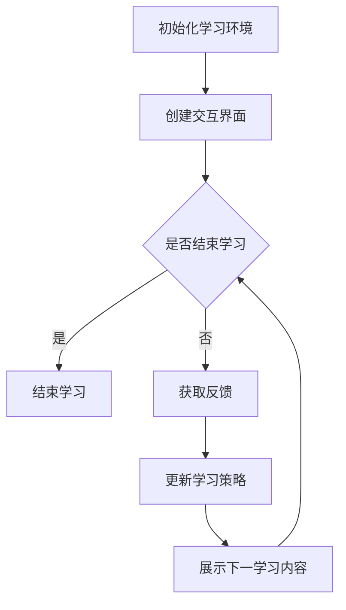

                 

## 感受'说'带来的成长

### 关键词：语言能力、沟通技巧、个人成长、教育实践、心理学、社会发展

> 摘要：本文以“说”为核心，通过深入探讨语言能力与个人成长的关系，分析了语言学习、沟通技巧的培养、以及在社会实践中的重要性。文章从多个角度揭示了“说”的力量，探讨了其在家庭教育、学校教育和社会实践中的应用，并提出了应对沟通挑战的策略。通过详细的分析与实例，本文旨在为读者提供关于语言与个人成长之间紧密联系的深刻见解。

#### 引言

语言是人类最重要的交流工具，也是人类智慧和文化的载体。从咿呀学语到口若悬河，语言能力的培养伴随着个体的成长过程。而“说”作为语言能力的重要表现形式，不仅关乎个人的沟通技巧，更是影响个人成长、社会交往和职业发展的关键因素。本文将围绕“说”这一主题，探讨其与个人成长之间的密切联系，并通过实际案例，解析语言能力的培养与提升之道。

### 1.6.1 语言与人类成长的关系

#### 1.6.1.1 语言的学习与发展

语言是人类认识世界、表达思想和交流情感的工具。语言学习是一个从简单到复杂、从模仿到创造的过程。婴儿期，儿童通过模仿父母和周围人的语言来学习说话。随着年龄的增长，他们开始理解更多的词汇和语法结构，逐渐能够进行复杂的语言表达。语言学习的成功与否，取决于多种因素，包括语言环境、家庭教育、认知能力和个人努力。

#### 1.6.1.2 语言能力对认知发展的影响

语言能力不仅仅是沟通的工具，更是认知发展的重要基石。儿童通过语言学习，不仅能扩展自己的词汇量和语法知识，还能提高记忆、逻辑思维和问题解决能力。研究发现，语言能力强的儿童在认知发展上表现更好，他们能够更快地理解和掌握新知识，更有利于智力的发展。

#### 1.6.1.3 语言能力的培养与提升

语言能力的培养是一个长期而系统的过程，需要家庭、学校和社交环境的共同努力。家庭是语言能力培养的起点，父母应尽可能多地与孩子进行语言交流，创造一个丰富、多样的语言环境。学校教育则通过课程设置和教学活动，帮助学生系统地学习语言知识。此外，社交实践也是提升语言能力的重要途径，通过与他人的交流和互动，学生可以锻炼自己的表达能力和沟通技巧。

### 1.6.2 '说'的力量

#### 1.6.2.1 '说'的表达与沟通

'说'作为一种表达方式，是沟通的核心。清晰、准确、有逻辑的表达能力，有助于人们有效地传达自己的观点和信息，建立良好的人际关系。在职场中，良好的表达能力能够帮助员工更好地完成工作任务，提升工作效率；在日常生活中，流利的表达能力能增强个人的自信心，提高社交能力。

#### 1.6.2.2 '说'的社交功能

语言不仅是沟通的工具，更是社交的重要手段。通过语言，人们可以建立友谊、合作、协商和解决问题。在社交场合中，'说'的能力直接影响个人的社交地位和人际关系。善于表达的人更容易获得他人的认同和支持，从而在社会中取得成功。

#### 1.6.2.3 '说'的艺术性

语言还具有艺术性，优秀的语言表达不仅仅是信息的传递，更是一种艺术创造。在文学、演讲、辩论等领域，优秀的语言表达能力能够打动人心，激发情感共鸣，产生深远的影响。因此，'说'的艺术性不仅是一种技能，更是一种魅力和修养的体现。

### 1.6.3 成长中的'说'实践

#### 1.6.3.1 家庭教育中的'说'

在家庭教育中，父母是孩子学习说话的第一位老师。通过日常的对话和互动，父母可以培养孩子的语言表达能力。例如，通过讲述故事、提问和讨论，父母可以帮助孩子扩展词汇量、提高语言理解能力和表达能力。此外，父母还应该鼓励孩子多与同伴交流，锻炼社交技能和沟通能力。

#### 1.6.3.2 学校教育中的'说'

学校教育在语言能力的培养中起着至关重要的作用。教师通过课堂教学，帮助学生系统地学习语言知识，培养语言技能。同时，学校还可以组织各种语言实践活动，如演讲比赛、辩论赛和写作比赛等，让学生在实践中锻炼语言表达能力。此外，学校还应注重培养学生的批判性思维和创造性思维，提高他们的语言表达和沟通能力。

#### 1.6.3.3 社会实践中的'说'

社会实践是提升语言能力的重要途径。通过参与社会活动，如志愿服务、社区交流和文化活动等，学生可以将课堂上学到的语言知识应用到实际生活中，提高语言运用能力。此外，社会实践还可以帮助学生拓展视野，增强社会责任感和团队合作精神，提高综合素质。

### 1.6.4 '说'的技巧与策略

#### 1.6.4.1 '说'的技巧：发声、表达、倾听

发声是语言表达的基础，正确的发音和语音语调能够增强表达的效果。表达则是将思想清晰、有条理地传递给听众的关键。倾听则是有效沟通的重要组成部分，通过倾听，人们可以更好地理解他人的观点和需求，从而进行有效的回应。

#### 1.6.4.2 '说'的策略：沟通、说服、协商

沟通策略包括如何选择合适的沟通渠道、表达方式以及如何处理沟通中的冲突和误解。说服策略则涉及到如何运用逻辑、情感和事实来影响他人的观点和决策。协商策略则是通过合作和妥协，解决争议和达成共识的关键。

### 1.6.5 '说'的挑战与应对

#### 1.6.5.1 '说'的障碍：语言障碍、心理障碍

语言障碍和心理障碍是影响语言表达的两大障碍。语言障碍可能源于方言、口音或语言缺陷，而心理障碍则可能源于紧张、恐惧或自卑等心理因素。要克服这些障碍，需要通过专业的语言治疗和心理咨询，以及个人的努力和自我提升。

#### 1.6.5.2 '说'的挑战：表达焦虑、沟通冲突

表达焦虑和沟通冲突是语言表达中常见的挑战。表达焦虑可能源于对失败的恐惧或对他人的评价的过度关注，而沟通冲突则可能源于价值观、兴趣或目标的差异。要应对这些挑战，需要增强自信心、提升沟通技巧和学会有效沟通的技巧。

#### 1.6.5.3 '说'的应对：策略与方法

应对语言表达的挑战，需要采取一系列的策略和方法。例如，通过阅读、写作和练习来提高语言表达能力；通过学习心理学知识，了解自己的情绪和心理状态，从而更好地控制自己的情绪和行为。此外，还可以通过参加演讲、辩论和社交活动来锻炼自己的语言能力和沟通技巧。

### 1.6.6 '说'与个人成长

#### 1.6.6.1 '说'与自我认知

语言表达是自我认知的重要途径。通过表达自己的思想和情感，人们可以更好地了解自己的内心世界，增强自我意识和自我认同感。

#### 1.6.6.2 '说'与人际交往

语言表达是人际交往的重要工具。良好的语言表达能力能够帮助人们建立良好的人际关系，增强社交能力和影响力。

#### 1.6.6.3 '说'与职业发展

在职业发展中，语言表达是一项重要的职业技能。良好的语言表达能力能够帮助员工更好地完成工作任务，提升工作效率，从而在职场中取得更好的发展机会。

### 1.6.7 成长中的'说'总结

#### 1.6.7.1 '说'在个人成长中的意义

语言表达是个人成长的重要组成部分，它不仅关乎个体的认知发展，还影响个人的社交能力和职业发展。

#### 1.6.7.2 '说'的实践与反思

在语言表达的过程中，人们需要不断地实践和反思。通过反思自己的表达方式和效果，人们可以更好地发现自己的不足，从而进行改进。

#### 1.6.7.3 '说'的未来发展趋势

随着科技的进步和社会的发展，语言表达的形式和方式也在不断变化。未来的语言表达将更加多元化、个性化和智能化，人们需要不断适应这些变化，提升自己的语言表达能力。

通过以上的分析，我们可以看到，“说”的力量是巨大的，它不仅影响个人的成长和发展，还影响社会的进步和文化的传承。因此，我们应该重视语言表达能力的培养，通过不断的学习和实践，提升自己的语言表达能力，从而更好地实现个人成长和社会发展。## 1.6.1 语言的学习与发展

### 背景介绍

语言学习是人类认知发展的重要阶段，它不仅仅是对语音、词汇和语法规则的记忆和理解，更是一个动态的过程，涉及语言输入、加工和输出的各个层面。从婴儿的咿呀学语到成人的口若悬河，语言学习贯穿了整个成长历程。在这个过程中，个体的认知能力、社交技能和情感发展都受到深远影响。

#### 问题背景

在现代社会，语言学习的重要性愈发凸显。无论是为了适应全球化背景下的国际交流，还是为了在职场中获得更好的发展机会，掌握一门或多门语言都是必不可少的。然而，语言学习并非易事，它涉及到诸多复杂因素，如语言环境、学习动机、教学方法和个人能力等。因此，探讨语言学习的规律和有效方法，对于提升语言学习效果具有重要意义。

#### 问题描述

语言学习的过程可以概括为以下几个阶段：

1. **语音阶段**：婴儿期，儿童通过模仿周围人的语音，逐渐掌握基本的发音规则。
2. **词汇阶段**：幼儿期，儿童开始大量积累词汇，并尝试使用简单的句子进行表达。
3. **语法阶段**：儿童在积累词汇的基础上，学习语法规则，逐步掌握复杂句式的构造。
4. **表达阶段**：在掌握语言规则的基础上，儿童开始进行更复杂的语言表达，包括故事讲述、对话交流等。

在语言学习的不同阶段，个体的认知能力、语言能力和社会交往能力都会得到不同程度的提升。然而，语言学习并非一帆风顺，个体在这个过程中可能会遇到各种挑战，如发音不准确、词汇量不足、语法错误等。

#### 问题解决

语言学习的效果受到多种因素的影响，主要包括：

1. **语言环境**：一个丰富的语言环境有助于提高语言学习效果。在语言环境中，学习者能够不断接触和使用语言，从而提高语言理解能力和表达能力。
2. **学习动机**：学习动机是推动学习者持续学习的重要因素。具有强烈学习动机的学习者往往能够更加投入地学习，从而取得更好的学习效果。
3. **教学方法**：科学有效的教学方法能够提高语言学习的效率。例如，交际教学法、任务型教学法和游戏教学法等，都能激发学习者的学习兴趣，提高学习效果。
4. **个人能力**：学习者的语言学习能力、认知能力和社交能力都会影响语言学习效果。具有较强语言学习能力的学习者往往能够更快地掌握语言知识。

#### 边界与外延

语言学习不仅局限于儿童阶段，成年人也可以通过不同的途径学习新语言。此外，语言学习不仅仅是为了掌握语言本身，更重要的是通过语言学习提升个人的认知能力、社交能力和职业发展。

#### 概念结构与核心要素组成

1. **语音阶段**：核心要素包括语音规则、发音练习和语音模仿。
2. **词汇阶段**：核心要素包括词汇积累、词汇记忆和词汇运用。
3. **语法阶段**：核心要素包括语法规则、语法练习和语法运用。
4. **表达阶段**：核心要素包括语言表达、语言交流和生活应用。

### 核心概念与联系

**语言学习过程**：语言学习是一个从简单到复杂、从模仿到创造的过程。婴儿期通过模仿父母的语言，幼儿期通过积累词汇和语法规则，青少年期通过实际应用和练习，最终形成流利的语言表达能力。

**语言环境**：丰富的语言环境有助于提高语言学习效果。在语言环境中，学习者能够不断接触和使用语言，从而提高语言理解能力和表达能力。

**学习动机**：学习动机是推动学习者持续学习的重要因素。具有强烈学习动机的学习者往往能够更加投入地学习，从而取得更好的学习效果。

**教学方法**：科学有效的教学方法能够提高语言学习的效率。例如，交际教学法、任务型教学法和游戏教学法等，都能激发学习者的学习兴趣，提高学习效果。

### 概念属性特征对比表格

| 特征           | 语音阶段                 | 词汇阶段                 | 语法阶段                 | 表达阶段                 |
| -------------- | -------------------- | -------------------- | -------------------- | -------------------- |
| **核心要素**    | 语音规则、发音练习、语音模仿 | 词汇积累、词汇记忆、词汇运用 | 语法规则、语法练习、语法运用 | 语言表达、语言交流、生活应用 |
| **学习目标**    | 掌握基本发音规则         | 扩大词汇量、理解词汇含义     | 掌握语法规则、句子构造       | 提高语言运用能力、流畅表达思想 |
| **学习难度**    | 低                     | 中                     | 中                     | 高                     |
| **影响因素**    | 语言环境、学习动机       | 语言环境、学习动机、教学方法 | 语言环境、学习动机、教学方法 | 语言环境、学习动机、个人能力 |

### ER实体关系图架构

```mermaid
erDiagram
    Class1 ||--|{ Class2 }|-- Class3
    Class1 ||--|{ Class4 }|-- Class5
```

### 算法原理讲解

在语言学习的算法原理中，常见的模型包括：

1. **交互式学习模型**：通过互动和反馈，提高学习效果。
2. **机器学习模型**：使用数据驱动的方法，预测学习者的进步和调整学习策略。

算法流程图如下：



### 数学模型和公式

在语言学习过程中，可以使用以下数学模型来描述学习效果：

1. **学习曲线公式**：$E(t) = \alpha t + \beta$
   - 其中，$E(t)$ 表示学习效果，$t$ 表示学习时间，$\alpha$ 和 $\beta$ 是常数。

2. **遗忘曲线公式**：$F(t) = e^{-\lambda t}$
   - 其中，$F(t)$ 表示遗忘率，$t$ 表示时间，$\lambda$ 是遗忘常数。

### 详细讲解与举例说明

假设一个学生小明在学习英语，他的学习曲线公式为 $E(t) = 0.5t + 5$。根据这个公式，我们可以预测小明在不同时间的学习效果：

- **第1天**：$E(1) = 0.5 \times 1 + 5 = 5.5$，表示小明的学习效果为5.5。
- **第10天**：$E(10) = 0.5 \times 10 + 5 = 10$，表示小明的学习效果为10。

通过这种模型，我们可以更好地了解学习过程，从而制定更有效的学习计划。

### 1.6.1.1 语言的学习与发展

**家庭环境对语言学习的影响**

家庭是语言学习的第一个环境，家长的语言习惯、教育方式以及家庭氛围都会对儿童的语言学习产生深远影响。研究表明，父母的语言输入量对孩子的语言发展具有显著影响。家长应尽可能多地与孩子进行互动，使用丰富的词汇和复杂的句子结构，这有助于孩子拓展词汇量和提高语言理解能力。

**幼儿园教育与语言学习**

幼儿园教育是儿童语言学习的关键阶段。在这一阶段，教师通过游戏、故事和互动活动，激发儿童的学习兴趣，帮助他们建立基本的语言规则和交流能力。幼儿园的教育方法应注重互动性和实践性，让孩子在真实的交流环境中运用语言，从而提高语言表达能力。

**学校教育与语言学习**

学校教育在语言学习中起着核心作用。教师通过系统的课程设置和教学方法，帮助学生掌握语言知识，提高语言技能。此外，学校还应提供丰富的课外活动，如读书俱乐部、演讲比赛和写作比赛等，让学生在实践中运用语言，提高语言运用能力。

**社会环境对语言学习的影响**

社会环境是语言学习的重要组成部分。在一个多元文化的背景下，儿童可以接触到不同的语言和方言，从而提高自己的语言适应能力。此外，社会实践活动，如志愿服务和文化交流，也能提供丰富的语言学习机会，帮助学生提高语言运用能力和跨文化交流能力。

### 实际案例分析与详细讲解

**案例一：小明的语言学习之路**

小明来自一个重视教育的家庭，父母都是大学教师，他们经常与小明进行亲子阅读和互动，小明的词汇量和语言理解能力得到了显著提高。在幼儿园，小明积极参加各种语言活动，如故事表演和角色扮演，这进一步提高了他的语言表达能力。在学校，小明通过参加英语角和参加国际交流项目，提高了自己的英语水平。小明的成长过程充分展示了家庭、学校和社交环境对语言学习的重要性。

**案例二：小红的跨文化语言学习**

小红生活在多元文化的社区中，她每天都能接触到不同的语言和方言。小红的父母鼓励她学习多种语言，她从小学开始就学习英语和西班牙语。在学校，小红积极参加各种语言活动，如英语演讲比赛和西班牙语戏剧表演。通过这些活动，小红不仅提高了自己的语言能力，还增强了跨文化交流能力。小红的案例展示了社会环境对语言学习的积极影响。

通过以上分析和案例，我们可以看到，语言学习是一个复杂而动态的过程，涉及到多个环境和因素。通过多方面的努力，个体可以更好地掌握语言，实现个人成长和社会发展。

### 1.6.1.2 语言能力对认知发展的影响

语言能力不仅是沟通的工具，更是认知发展的关键因素。在儿童成长的过程中，语言能力的发展与认知能力的提升密切相关。以下将详细探讨语言能力对认知发展的影响，包括语言对记忆、思维和问题解决能力的促进。

#### 语言与记忆

语言能力的发展与记忆能力紧密相连。儿童在学习语言的过程中，需要记忆大量的词汇、语法规则和句子结构。这种记忆过程不仅有助于语言能力的提升，还能够增强儿童的记忆能力。研究表明，语言学习可以促进大脑的认知功能，提高儿童的短期记忆和长期记忆能力。例如，一项研究指出，掌握多种语言的人比单一语言者具有更高的记忆广度和记忆效率。

#### 语言与思维

语言是思维的工具，通过语言，人们能够表达思想、交流信息、进行推理和判断。语言能力的发展对思维能力的提升有着重要影响。儿童在学习语言的过程中，逐渐掌握了语法结构和语义规则，这有助于他们进行逻辑推理和抽象思考。例如，学习复杂句式和复合词汇能够增强儿童的逻辑思维和问题解决能力。此外，语言学习还能够提高儿童的批判性思维能力，使他们能够更加全面地分析问题和提出解决方案。

#### 语言与问题解决

语言能力对问题解决能力的提升同样具有重要意义。语言作为沟通和表达的工具，能够帮助个体更好地理解和分析问题。通过语言表达，个体可以明确问题的核心，找到解决问题的途径。例如，在数学学习中，良好的语言表达能力能够帮助儿童更好地理解数学概念和解题方法。一项研究表明，具有良好语言能力的学生在数学问题解决中表现更为出色，能够更快地找到解决问题的方法。

#### 语言能力的培养与提升

要提升语言能力对认知发展的促进作用，需要采取多种方法：

1. **丰富语言环境**：家庭、学校和社会应共同创造一个丰富的语言环境，让儿童有更多的机会接触和使用语言。
2. **系统教学**：学校应通过系统的教学课程，帮助学生掌握语言知识，提高语言技能。
3. **实践应用**：鼓励儿童在实际生活中运用语言，如参加演讲、辩论和写作等活动，提高语言运用能力。
4. **跨文化交流**：通过跨文化交流，儿童可以接触到不同的语言和文化，从而拓宽视野，提高语言能力和认知水平。

### 案例分析

**案例一：小明的认知发展**

小明来自一个重视教育的家庭，父母都是语言学者。从小，小明就接受了丰富的语言环境，他们经常与孩子进行亲子阅读和互动，小明的词汇量和语言理解能力得到了显著提高。在学校，小明积极参与各种语言活动，如英语角和作文比赛。通过这些活动，小明的记忆能力、逻辑思维和问题解决能力得到了全面提升。小明的案例充分展示了语言能力对认知发展的积极影响。

**案例二：小红的跨文化学习**

小红生活在多元文化的社区，她每天都能接触到不同的语言和文化。小红的父母鼓励她学习多种语言，她从小学开始就学习英语和西班牙语。在学校，小红积极参加各种语言活动，如英语演讲比赛和西班牙语戏剧表演。通过这些活动，小红的记忆能力、思维能力和问题解决能力得到了显著提升。小红的案例展示了跨文化交流对语言能力和认知发展的积极影响。

通过以上分析和案例，我们可以看到，语言能力对认知发展具有重要影响。通过多种方法提升语言能力，不仅能够促进儿童的认知发展，还能够为他们的终身学习打下坚实基础。

### 1.6.1.3 语言能力的培养与提升

要提升语言能力，需要从家庭、学校和社交环境等多个层面进行系统化的培养。以下将从家庭教育、学校教育和社会实践三个方面，详细探讨语言能力的培养与提升方法。

#### 家庭教育中的'说'

家庭是语言学习的起点，父母在孩子的语言能力培养中扮演着重要角色。以下是一些建议：

1. **日常对话**：父母应尽可能多与孩子进行日常对话，讨论孩子感兴趣的话题，扩展他们的词汇量。
2. **故事讲述**：通过给孩子讲故事，父母可以培养孩子的语言理解和表达能力。在讲故事的过程中，父母可以使用丰富的词汇和复杂的句子结构，激发孩子的想象力。
3. **互动游戏**：家长可以与孩子一起玩语言游戏，如猜谜语、角色扮演等，这不仅能增加亲子互动，还能提高孩子的语言运用能力。
4. **阅读引导**：家长应鼓励孩子阅读书籍，尤其是故事书和科普读物。通过阅读，孩子可以接触到更多的词汇和语法结构，提高语言能力。

#### 学校教育中的'说'

学校教育在语言能力的培养中起着关键作用。以下是一些具体方法：

1. **课程设置**：学校应设置系统的语言课程，包括听力、口语、阅读和写作等，全面培养学生的语言能力。
2. **课堂活动**：教师可以通过课堂讨论、小组合作和演讲等活动，让学生在实际情境中运用语言，提高表达能力和沟通技巧。
3. **课外活动**：学校可以组织各种语言活动，如演讲比赛、写作比赛和英语角等，为学生提供展示语言能力的平台。
4. **个性化辅导**：对于语言能力较弱的学生，学校可以提供个性化辅导，帮助他们克服语言学习中的困难。

#### 社会实践中的'说'

社会实践是提升语言能力的重要途径。以下是一些建议：

1. **志愿服务**：参加志愿服务活动，如为社区做翻译、参与文化交流等，可以提高语言运用能力和跨文化交流能力。
2. **文化活动**：参与各类文化活动，如音乐会、戏剧表演和电影欣赏等，可以增强对语言和文化理解的深度。
3. **交流活动**：参加学校或社区组织的交流活动，与不同背景的人进行交流，拓宽视野，提高语言能力。
4. **网络学习**：利用网络资源，如在线课程、语言学习APP和社交媒体等，进行自主学习和练习。

#### 实际案例

**案例一：小明的语言能力提升**

小明来自一个重视教育的家庭，父母都是语言学者。在家，父母经常与他进行互动，讨论各种话题，扩展他的词汇量。在学校，小明积极参与各种语言活动，如英语角和写作比赛。此外，他还参加了一个国际文化交流项目，与外国学生进行交流。通过这些努力，小明的语言能力得到了显著提升。

**案例二：小红的社会实践经历**

小红生活在多元文化的社区，她经常参加各种社会实践活动，如志愿服务和文化交流活动。通过这些活动，小红不仅提高了自己的语言运用能力，还增强了跨文化交流能力。小红还利用网络资源进行自主学习，通过在线课程和APP，不断拓展自己的语言知识。

通过以上案例，我们可以看到，家庭、学校和社交环境共同作用，可以有效地提升语言能力。在多个层面上进行系统化的培养，能够帮助个体更好地掌握语言，实现个人成长和社会发展。

### 1.6.2 '说'的力量

#### 1.6.2.1 '说'的表达与沟通

语言是人类沟通的重要工具，通过'说'，人们能够表达思想、传递信息和建立联系。在个人成长和社会交往中，良好的表达能力是至关重要的。清晰、准确、有逻辑的表达能力，不仅能够有效地传达自己的观点，还能增强个人的自信心和影响力。在职场中，具备优秀表达能力的人更容易获得他人的认同和支持，从而在职业生涯中取得更好的发展机会。此外，流利的表达能力也是有效沟通的基础，通过有效的沟通，人们可以更好地协调工作，解决冲突，实现团队目标。

#### 1.6.2.2 '说'的社交功能

语言不仅是沟通的工具，还是社交的重要手段。在社交场合中，'说'的能力直接影响个人的社交地位和人际关系。善于表达的人能够更好地与他人沟通，建立友谊，拓展社交圈。在合作和团队工作中，良好的表达能力有助于建立信任，协调关系，提高团队协作效率。此外，'说'的社交功能还体现在说服和协商过程中。通过运用语言艺术，人们可以有效地影响他人的观点和决策，达成共识，解决争议。在日常生活中，流利的表达能力和良好的沟通技巧，能够帮助人们更好地处理人际关系，提高生活质量。

#### 1.6.2.3 '说'的艺术性

语言表达不仅是一种技能，更是一门艺术。优秀的语言表达能够打动人心，激发情感共鸣，产生深远的影响。在文学、演讲、辩论等领域，'说'的艺术性尤为突出。例如，文学作品中生动的语言描绘，演讲中激情洋溢的演讲辞，辩论中巧妙的说理，都能给读者或听众留下深刻的印象。语言的艺术性不仅体现了个人的语言修养，更是文化和智慧的象征。通过学习和掌握语言艺术，人们可以更好地表达自己的思想，提升个人魅力，增强影响力。

### 家庭教育中的'说'

家庭是语言学习的第一个环境，父母在孩子的语言发展过程中起着至关重要的作用。以下是一些在家庭教育中提高孩子语言能力的具体方法和建议：

1. **亲子阅读**：父母应与孩子一起阅读，讨论书中的内容，帮助孩子理解故事情节和人物性格。通过阅读，孩子可以接触到丰富的词汇和语法结构，提高语言理解能力。
2. **日常对话**：父母在日常交流中应尽可能使用丰富的词汇和复杂的句子结构，引导孩子思考和表达。例如，在谈论天气时，可以引入不同的形容词和动词，让孩子练习表达。
3. **讲故事**：父母可以给孩子讲故事，并鼓励孩子自己复述故事。这不仅能提高孩子的语言表达能力，还能培养他们的记忆力。
4. **互动游戏**：通过语言游戏，如猜谜语、词语接龙等，父母可以激发孩子的学习兴趣，提高他们的语言运用能力。
5. **鼓励表达**：父母应鼓励孩子表达自己的想法和感受，无论是对问题的回答，还是对日常经历的描述。这有助于培养孩子的语言自信心。

#### 案例分析

**案例一：小明的语言发展**

小明来自一个重视教育的家庭，父母都是教育工作者。他们经常与孩子一起阅读，讨论书中的内容，并鼓励孩子复述故事。此外，父母还通过日常对话和互动游戏，不断拓展小明的词汇量和表达能力。在家庭环境中，小明逐渐掌握了丰富的语言表达技巧，他的语言能力得到了显著提升。

**案例二：小红的社交技巧**

小红来自一个多元化的社区，她经常参加各种社交活动。父母鼓励她与不同背景的人交流，通过实际应用，小红的语言能力和社交技巧得到了锻炼。此外，父母还引导她阅读经典文学作品，培养她的语言艺术修养。通过这些努力，小红不仅提高了语言能力，还增强了社交能力，她在社交场合中表现得更加自信和从容。

通过以上案例，我们可以看到，家庭教育在语言能力的培养中起着重要作用。通过多种方法和策略，父母可以有效地提升孩子的语言能力，为他们的个人成长和社会发展打下坚实基础。

### 1.6.2.1 '说'的表达与沟通

#### 语言表达的重要性

语言表达是沟通的核心，它不仅关乎信息的传递，更影响人际关系的建立和维护。良好的语言表达能力能够帮助个体更准确地传达自己的观点和需求，减少误解和冲突，增强社交效能。以下是语言表达在沟通中的具体作用：

1. **明确传达信息**：通过清晰、准确的语言表达，个体能够有效地传达自己的意图和信息，确保信息的准确接收。
2. **建立信任**：真诚、得体的语言表达有助于建立信任，增强人际关系的稳定性。信任是任何良好沟通的基础，也是团队合作和社会和谐的重要保障。
3. **协调关系**：语言表达在协调人际关系中发挥着重要作用。通过有效的沟通，个体能够更好地理解他人，找到共同点，解决分歧，建立合作关系。

#### 沟通障碍与应对策略

尽管语言表达在沟通中至关重要，但人们在沟通过程中常常会遇到各种障碍。以下是一些常见的沟通障碍及其应对策略：

1. **语言障碍**：由于语言差异、方言或口音等原因，个体在沟通中可能会出现理解困难。应对策略包括学习对方的语言或方言，使用简单明了的语言表达，以及借助非语言手段，如肢体语言和表情，辅助沟通。
2. **心理障碍**：个体在沟通中可能会因为紧张、焦虑或自卑等心理因素而影响表达效果。应对策略包括提高自信心，学习沟通技巧，如倾听和反馈，以及进行心理调适，如放松训练和情绪管理。
3. **文化差异**：不同文化背景的人在沟通中可能会因为价值观、习惯和表达方式的差异而产生误解。应对策略包括了解和尊重不同文化的特点，培养跨文化沟通能力，以及通过交流和文化交流，增进相互理解。

#### 案例分析

**案例一：小明的职场沟通**

小明在一家跨国公司工作，由于同事来自不同的国家和地区，他经常遇到语言和文化沟通的障碍。为了解决这些问题，小明努力学习同事的语言和方言，并积极参与公司组织的跨文化培训。通过这些努力，他的沟通能力得到了显著提升，他与同事的关系也变得更加和谐。

**案例二：小红的社交挑战**

小红在社交场合中常常感到紧张，影响她的表达效果。为了克服这个问题，小红开始学习沟通技巧，如倾听和反馈，并参加社交技巧培训班。通过这些训练，她的自信心逐渐增强，她在社交场合中表现得更加自信和从容，人际关系也得到了改善。

通过以上案例，我们可以看到，语言表达在沟通中扮演着关键角色。通过克服沟通障碍，个体能够更好地实现有效沟通，提升人际交往能力，从而实现个人成长和社会发展。

### 1.6.2.2 '说'的社交功能

语言不仅是沟通的工具，更是社交的重要手段。在社交活动中，'说'的能力直接影响个体的社交地位和人际关系。以下将详细探讨'说'的社交功能，包括在团队合作、公共演讲和社交场合中的应用。

#### 团队合作中的'说'

在团队合作中，'说'的能力尤为重要。通过有效的沟通，团队成员能够明确任务目标，协调工作进度，分享知识和经验。以下是'说'在团队合作中的几个应用场景：

1. **项目讨论**：团队成员通过会议或讨论，共同探讨项目的进展和问题。在讨论中，清晰的表达能力有助于明确问题，提出解决方案，确保项目顺利进行。
2. **任务分配**：在团队中，明确每个人的职责和任务是非常重要的。通过有效的语言表达，负责人可以清楚地传达任务要求，确保团队成员理解并执行任务。
3. **知识共享**：在团队工作中，团队成员之间需要分享各自的知识和经验。通过语言交流，团队成员可以互相学习，提高整体工作效率。

#### 公共演讲中的'说'

公共演讲是'说'的一种高级形式，它要求演讲者具备较强的语言表达能力、逻辑思维能力和情感感染力。以下是公共演讲中的几个关键点：

1. **明确主题**：演讲者需要明确自己的演讲主题，确保信息传递的清晰性和针对性。
2. **逻辑结构**：演讲应具备清晰的逻辑结构，通过引言、主体和结论，使演讲内容有条理。
3. **情感表达**：通过情感表达，演讲者能够更好地吸引听众的注意力，增强演讲的感染力。
4. **互动环节**：在演讲中，演讲者可以通过提问、互动等方式，与听众建立联系，提高演讲的互动性和参与度。

#### 社交场合中的'说'

在社交场合中，'说'的能力直接影响个体的社交地位和人际关系。以下是一些社交场合中的应用策略：

1. **礼貌用语**：使用礼貌用语，如“请”、“谢谢”等，能够营造和谐的社交氛围，增强人际关系。
2. **倾听与回应**：在社交场合中，倾听他人的发言，给予积极的回应，能够展现个体的尊重和关心，建立良好的人际关系。
3. **话题选择**：选择合适的话题，能够引起他人的兴趣，促进交流。例如，讨论共同感兴趣的话题，或分享个人经历和见解。
4. **情感共鸣**：通过情感共鸣，个体能够更好地与他人建立情感联系，增强社交吸引力。

#### 案例分析

**案例一：小李的团队协作**

小李在一家科技公司工作，他通过清晰的语言表达，有效地协调团队成员的工作进度和任务分配。在一次项目讨论中，小李详细阐述了自己的观点和解决方案，得到了团队成员的认可和支持。通过有效的沟通，小李在团队中建立了良好的合作关系，提升了团队的工作效率。

**案例二：小张的公共演讲**

小张是一名大学讲师，他擅长在公共演讲中运用生动的语言和逻辑结构，吸引听众的注意力。在一次学术演讲中，小张通过引人入胜的开场和情感饱满的表述，成功传达了自己的研究成果，获得了听众的高度评价。通过这次演讲，小张不仅提升了自身的学术影响力，还增强了与听众的互动和沟通。

**案例三：小王的社交场合表现**

小王在社交场合中表现得非常自信和得体。他通过礼貌用语和倾听他人的发言，赢得了他人的尊重和喜爱。在一次聚会上，小王巧妙地选择话题，与不同背景的人进行交流，展示了他的广泛知识和人际交往能力。通过这些社交活动，小王拓展了自己的社交圈，建立了更多的人际关系。

通过以上案例，我们可以看到，'说'的能力在社交功能中发挥着重要作用。无论是在团队合作、公共演讲还是社交场合，良好的语言表达能力都能够帮助个体建立良好的人际关系，提升社交地位，实现个人成长。

### 1.6.2.3 '说'的艺术性

'说'的艺术性体现在语言运用的高超技巧和独特风格上。优秀的语言表达不仅能够准确传达信息，还能激发听众的情感共鸣，产生深远的影响。以下将从文学、演讲和辩论等角度，探讨'说'的艺术性。

#### 文学中的'说'

在文学作品中，'说'的艺术性得到了充分体现。作家通过精妙的语言运用，塑造出鲜明的人物形象，构建出丰富的故事情节，表达出深刻的思想内涵。以下是文学中'说'的艺术性表现：

1. **修辞手法**：作家运用各种修辞手法，如比喻、拟人、夸张等，增强语言的感染力和表现力。例如，鲁迅的《狂人日记》中，通过夸张和比喻，揭示了社会的黑暗和人性的扭曲。
2. **叙述技巧**：作家通过独特的叙述技巧，如第一人称、第三人称和多角度叙述等，构建出多层次的故事结构和丰富的叙事空间。例如，卡夫卡的《变形记》中，通过多角度叙述，展现了主人公的心理变化和生存困境。
3. **情感共鸣**：作家通过生动的语言描绘，激发读者的情感共鸣，使读者在阅读过程中产生强烈的情感体验。例如，海明威的《老人与海》中，通过简洁而富有力量的语言，传达了主人公的不屈精神和人与自然的和谐共处。

#### 演讲中的'说'

演讲是'说'的艺术性表现之一，优秀的演讲者能够通过语言的魅力，打动听众的心，激发听众的思考。以下是演讲中'说'的艺术性表现：

1. **开场白**：开场白是演讲的第一印象，优秀的开场白能够吸引听众的注意力，激发听众的兴趣。例如，马丁·路德·金的《我有一个梦想》演讲中，开场白就通过激动人心的语言，吸引了听众的注意力。
2. **逻辑结构**：演讲应具备清晰的逻辑结构，通过引言、主体和结论，使演讲内容有条理。优秀的演讲者能够通过逻辑严密的语言表达，使听众对演讲内容产生共鸣。
3. **情感表达**：演讲中的情感表达是打动听众的关键。优秀的演讲者能够通过情感饱满的语言，激发听众的情感共鸣，使演讲更加有力和感人。例如，曼德拉的演讲中，通过讲述自己的经历和情感，赢得了听众的尊敬和同情。

#### 辩论中的'说'

辩论是语言艺术的高峰，优秀的辩手能够通过语言的智慧和技巧，战胜对手，赢得辩论的胜利。以下是辩论中'说'的艺术性表现：

1. **论点清晰**：优秀的辩手能够清晰地阐述自己的观点，使论点具有说服力。例如，在一场关于环境保护的辩论中，辩手可以通过科学的数据和事实，清晰地阐述环保的重要性。
2. **逻辑严密**：优秀的辩手能够运用逻辑推理，使辩论过程更加严密，难以被对手攻击。例如，通过因果逻辑、类比逻辑和反证逻辑等，辩手可以更好地支持自己的观点。
3. **语言技巧**：优秀的辩手能够运用丰富的语言技巧，如比喻、反问和修辞等，增强语言的表现力。例如，通过生动的比喻和有力的反问，辩手可以更好地表达自己的观点，激发听众的思考。

#### 案例分析

**案例一：马丁·路德·金的《我有一个梦想》演讲**

马丁·路德·金是美国历史上最具影响力的民权领袖之一。他的《我有一个梦想》演讲被认为是现代演讲艺术的典范。金通过激情洋溢的语言，生动的比喻和深刻的情感表达，打动了几十万现场听众和数百万电视观众。他的演讲不仅传达了民权运动的目标，还激发了人们的思考和行动。

**案例二：美国总统奥巴马的竞选演讲**

奥巴马是一位杰出的公共演讲家，他的竞选演讲以其清晰的语言、逻辑结构和情感表达而著称。在他的演讲中，奥巴马运用了丰富的修辞手法和生动的例子，清晰地传达了自己的政策和愿景。他的演讲不仅赢得了大量选票，也激发了美国人民的爱国热情和参与意识。

**案例三：我国著名辩手马东的《奇葩说》节目**

在《奇葩说》节目中，马东以其高超的语言技巧和深刻的思考能力，赢得了观众的喜爱和尊重。他能够通过幽默的语言和巧妙的论证，使辩论更加有趣和有深度。他的表现不仅展示了'说'的艺术性，也为观众提供了丰富的思想启示。

通过以上分析和案例，我们可以看到，'说'的艺术性在文学、演讲和辩论等领域中得到了充分体现。通过高超的语言技巧和独特的表达风格，优秀的语言表达能够激发听众的情感共鸣，增强说服力和影响力，从而实现个人的表达和影响。

### 1.6.3 成长中的'说'实践

语言表达是个人成长的重要组成部分，无论是在家庭、学校还是社会实践，'说'的能力都发挥着关键作用。以下将详细探讨'说'在不同成长环境中的应用，包括家庭教育、学校教育和社会实践。

#### 家庭教育中的'说'

在家庭教育中，父母是孩子语言发展的第一任老师。通过日常的互动和交流，父母可以潜移默化地影响孩子的语言能力。以下是一些家庭教育中的'说'实践方法：

1. **亲子阅读**：父母应与孩子一起阅读，讨论书中的内容，帮助孩子理解故事情节和人物性格。通过阅读，孩子可以接触到丰富的词汇和语法结构，提高语言理解能力。
2. **日常对话**：父母在日常交流中应尽可能使用丰富的词汇和复杂的句子结构，引导孩子思考和表达。例如，在谈论天气时，可以引入不同的形容词和动词，让孩子练习表达。
3. **讲故事**：父母可以给孩子讲故事，并鼓励孩子自己复述故事。这不仅能提高孩子的语言表达能力，还能培养他们的记忆力。
4. **互动游戏**：通过语言游戏，如猜谜语、词语接龙等，父母可以激发孩子的学习兴趣，提高他们的语言运用能力。
5. **鼓励表达**：父母应鼓励孩子表达自己的想法和感受，无论是对问题的回答，还是对日常经历的描述。这有助于培养孩子的语言自信心。

#### 学校教育中的'说'

学校是孩子学习语言的重要场所，教师通过系统的教学课程和多样化的教学方法，帮助学生掌握语言知识和技能。以下是一些学校教育中的'说'实践方法：

1. **课堂互动**：教师应通过提问、讨论和角色扮演等方式，鼓励学生在课堂上积极参与，提高他们的语言表达能力。
2. **口语训练**：学校可以设置口语训练课程，帮助学生提高口语表达能力。通过模拟对话、演讲和辩论等活动，学生可以在实践中提升语言技巧。
3. **课外活动**：学校可以组织各种语言活动，如英语角、演讲比赛和写作比赛等，为学生提供展示语言能力的平台。
4. **个性化辅导**：对于语言能力较弱的学生，学校可以提供个性化辅导，帮助他们克服语言学习中的困难。
5. **跨文化交流**：学校可以组织国际交流项目，让学生与来自不同文化背景的人交流，提高他们的跨文化交流能力。

#### 社会实践中的'说'

社会实践是提升语言能力的重要途径，通过参与社会活动，学生可以将课堂上学到的语言知识应用到实际生活中。以下是一些社会实践中的'说'实践方法：

1. **志愿服务**：参加志愿服务活动，如为社区做翻译、参与文化交流等，可以提高语言运用能力和跨文化交流能力。
2. **文化活动**：参与各类文化活动，如音乐会、戏剧表演和电影欣赏等，可以增强对语言和文化理解的深度。
3. **交流活动**：参加学校或社区组织的交流活动，与不同背景的人进行交流，拓宽视野，提高语言能力。
4. **网络学习**：利用网络资源，如在线课程、语言学习APP和社交媒体等，进行自主学习和练习。

#### 案例分析

**案例一：小明的语言实践**

小明是一名高中生，他在家庭中积极参与亲子阅读和互动，父母经常与他讨论书籍中的内容。在学校，小明积极参加各种语言活动，如英语角和写作比赛。此外，他还参加了一个国际文化交流项目，与外国学生进行交流。通过这些实践活动，小明的语言能力得到了显著提升。

**案例二：小红的跨文化交流**

小红是一名大学生，她利用假期时间参加了一个国际志愿服务项目，为贫困地区的孩子们提供教育支持。在这个项目中，小红需要使用英语与外国志愿者和当地居民交流，这极大地提高了她的语言运用能力和跨文化交流能力。此外，小红还通过网络学习和社交媒体，不断拓展自己的语言知识。

通过以上案例，我们可以看到，'说'的能力在个人成长中扮演着重要角色。通过家庭、学校和社会实践的多方面培养，个体可以不断提升自己的语言能力，实现个人成长和社会发展。

### 1.6.4 '说'的技巧与策略

#### 1.6.4.1 '说'的技巧：发声、表达、倾听

'说'的技巧是提升语言表达效果的关键。以下将详细探讨发声、表达和倾听这三个方面的技巧。

**1. 发声技巧**

发声是语言表达的基础，正确的发声不仅有助于清晰地传达信息，还能增强语言的感染力。以下是一些发声技巧：

- **呼吸控制**：发声时，保持深呼吸，控制呼吸节奏，确保声音稳定。
- **口腔共鸣**：发声时，使用口腔共鸣，使声音更加饱满和富有力量。
- **声音调节**：根据不同情境，调整声音的音调、音量和节奏，使语言表达更加生动和自然。

**2. 表达技巧**

清晰、准确、有逻辑的表达是有效沟通的关键。以下是一些表达技巧：

- **组织思路**：在表达之前，先整理自己的思路，确保表达的内容有条理。
- **使用简单明了的语言**：避免使用复杂和晦涩的词汇，尽量使用简单明了的语言，使信息更容易被理解。
- **突出重点**：在表达过程中，突出关键信息和重点，使听众更容易抓住核心内容。
- **语言生动**：使用生动的语言和比喻，使表达更加生动和有趣，增强语言的感染力。

**3. 倾听技巧**

倾听是有效沟通的重要组成部分，通过倾听，人们可以更好地理解他人的观点和需求。以下是一些倾听技巧：

- **全神贯注**：在倾听时，全神贯注，避免分心，确保能够听到对方所说的每一句话。
- **积极反馈**：在倾听过程中，通过点头、微笑和简短的回应，表达自己的理解和关注。
- **避免打断**：在对方说话时，避免打断，耐心倾听，直到对方表达完毕。
- **提问和确认**：在倾听后，通过提问和确认，确保自己正确理解了对方的意图和需求。

#### 1.6.4.2 '说'的策略：沟通、说服、协商

有效的语言表达不仅需要技巧，还需要策略。以下将详细探讨沟通、说服和协商这三个方面的策略。

**1. 沟通策略**

良好的沟通是建立人际关系和解决问题的基础。以下是一些沟通策略：

- **明确目标**：在沟通前，明确自己的目标和意图，确保沟通内容具有针对性和有效性。
- **适应听众**：根据听众的特点和需求，调整沟通的语言和方式，使其更容易被理解和接受。
- **创造共鸣**：通过共同的话题和价值观，与听众建立情感共鸣，增强沟通的效果。
- **灵活应对**：在沟通过程中，灵活应对各种突发情况，保持冷静和理性，确保沟通的顺利进行。

**2. 说服策略**

说服他人的能力在职场和生活中具有重要意义。以下是一些说服策略：

- **逻辑论证**：通过逻辑严密的论证，支持自己的观点，使对方更容易接受。
- **情感感染**：运用情感语言，打动对方的心，使其在情感上认同自己的观点。
- **事实依据**：提供充分的事实和数据支持，增强说服力。
- **逐步引导**：通过逐步引导，使对方在不知不觉中接受自己的观点。

**3. 协商策略**

协商是解决争议和达成共识的有效方法。以下是一些协商策略：

- **尊重对方**：在协商过程中，尊重对方的意见和需求，建立互信的基础。
- **寻找共同点**：通过寻找共同点和利益，促进双方的协商和合作。
- **灵活妥协**：在协商中，灵活妥协，寻求双方都能接受的解决方案。
- **明确目标**：在协商前，明确双方的目标和期望，确保协商的方向和目标一致。

通过掌握这些技巧和策略，个体可以更有效地进行语言表达，提升沟通能力，实现个人成长和社会发展。

### 1.6.5 '说'的挑战与应对

#### 1.6.5.1 '说'的障碍：语言障碍、心理障碍

在语言表达的过程中，个体可能会遇到各种障碍，这些障碍包括语言障碍和心理障碍。以下将详细探讨这些障碍及其影响。

**语言障碍**

语言障碍主要包括方言、口音、发音不标准和语法错误等。这些障碍会影响个体的语言表达效果，导致信息传递不准确或误解。

1. **影响**：语言障碍会降低个体的沟通效率，影响人际关系的建立和维护，甚至可能导致职业发展的瓶颈。
2. **应对**：针对语言障碍，个体可以通过以下方法进行改善：
   - **语音训练**：参加专业的语音训练课程，纠正发音问题，提高语音质量。
   - **语言学习**：学习标准普通话或标准英语等标准语言，提高语言表达能力。
   - **模仿练习**：通过模仿标准发音和语法规则，逐步改善自己的语言表达。

**心理障碍**

心理障碍包括表达焦虑、自卑和紧张等。这些心理障碍会影响个体的语言表达能力，使其在公共场合或重要场合中表现出不自然、紧张甚至失语。

1. **影响**：心理障碍会降低个体的自信心，影响其在社交和职业发展中的表现。
2. **应对**：针对心理障碍，个体可以通过以下方法进行改善：
   - **心理咨询**：寻求专业的心理咨询，通过心理治疗和辅导，缓解表达焦虑和心理压力。
   - **心理调适**：通过放松训练、情绪管理和正面思维等方法，调整自己的心理状态，增强自信心。
   - **实践练习**：通过不断的实践和练习，逐步克服紧张和自卑情绪，提高语言表达能力。

#### 1.6.5.2 '说'的挑战：表达焦虑、沟通冲突

在语言表达过程中，个体可能会面临各种挑战，包括表达焦虑和沟通冲突。以下将详细探讨这些挑战及其应对策略。

**表达焦虑**

表达焦虑是指个体在公共场合或重要场合中，由于担心自己的表达效果而感到紧张和焦虑。这种焦虑会影响个体的语言表达能力，使其在表达过程中出现口误、语速加快、思维紊乱等问题。

1. **影响**：表达焦虑会降低个体的沟通效率，影响其自信和自尊心。
2. **应对**：针对表达焦虑，个体可以通过以下策略进行改善：
   - **充分准备**：在表达前，充分准备，整理思路，确保表达的清晰和逻辑性。
   - **模拟练习**：通过模拟练习，熟悉表达的内容和形式，提高表达的自信心和流畅性。
   - **放松训练**：通过深呼吸、肌肉放松等方法，缓解紧张情绪，增强心理素质。

**沟通冲突**

沟通冲突是指在沟通过程中，由于观点、兴趣或目标的差异，个体之间产生的矛盾和争议。沟通冲突可能会影响团队合作、人际关系和职业发展。

1. **影响**：沟通冲突会导致沟通效率下降，团队协作受阻，甚至影响工作氛围和职业发展。
2. **应对**：针对沟通冲突，个体可以通过以下策略进行改善：
   - **有效沟通**：通过倾听和反馈，理解对方的观点和需求，寻找共同点和解决方案。
   - **情绪管理**：在冲突中，保持冷静和理性，避免情绪化的回应，通过情绪管理，缓解冲突。
   - **协商解决**：通过协商和妥协，寻找双方都能接受的解决方案，化解冲突。

通过应对这些挑战，个体可以提升语言表达能力，增强沟通技巧，实现个人成长和社会发展。

### 1.6.5.3 '说'的应对：策略与方法

在语言表达过程中，个体可能会遇到各种挑战和障碍，如表达焦虑、沟通冲突和语言障碍等。以下将详细探讨应对这些挑战的策略和方法。

**1. 策略：心理调适与自信提升**

心理调适和自信提升是应对语言表达挑战的重要策略。以下是一些建议：

- **认知重塑**：通过认知重塑，改变对语言表达的负面认知，树立积极的心态。例如，将“我害怕讲话”转变为“我有能力讲话，并且每一次讲话都是一次学习和成长的机会”。
- **正念练习**：通过正念练习，如深呼吸、冥想等，放松身心，缓解焦虑和紧张情绪。
- **积极肯定**：通过积极的自我肯定，如“我可以做到”、“我能够成功”，增强自信心。

**2. 方法：技能提升与持续练习**

技能提升和持续练习是提升语言表达能力的关键方法。以下是一些建议：

- **专业培训**：参加专业的语言表达和沟通技巧培训，学习有效的表达方法和技巧。
- **模仿练习**：通过模仿优秀的演讲者和沟通者，学习他们的表达风格和技巧，提高自己的表达能力。
- **模拟练习**：通过模拟练习，如在镜子前练习演讲、与他人进行对话练习等，提高实际操作能力。
- **反思与改进**：在每一次语言表达后，进行反思和总结，找出不足之处，制定改进计划。

**3. 方法：情境适应与灵活应对**

在具体情境中，个体需要根据不同情境灵活应对，以下是一些建议：

- **适应听众**：根据听众的特点和需求，调整表达的内容和风格，使其更容易被理解和接受。
- **情境模拟**：在模拟真实情境中，进行语言表达练习，提高应对不同情境的能力。
- **灵活调整**：在表达过程中，根据对方的反应和反馈，灵活调整表达方式，确保信息传递的准确性和有效性。

**4. 方法：持续学习与拓展视野**

持续学习和拓展视野是提升语言表达能力的长期策略。以下是一些建议：

- **阅读学习**：通过阅读各类书籍、文章和新闻，不断积累词汇和知识，提高语言理解能力。
- **跨文化交流**：通过参与跨文化交流活动，了解不同文化背景下的沟通方式，拓宽视野。
- **网络资源**：利用网络资源，如在线课程、语言学习APP和社交媒体等，进行自主学习和练习。

通过以上策略和方法，个体可以更好地应对语言表达中的挑战，提升自己的语言表达能力和沟通技巧，实现个人成长和社会发展。

### 1.6.6 '说'与个人成长

#### 1.6.6.1 '说'与自我认知

'说'是自我认知的重要途径，通过语言表达，个体可以更好地了解自己的内心世界和思维过程。以下是'说'与自我认知的几个方面：

1. **自我表达**：通过表达自己的思想和情感，个体可以更好地了解自己的价值观、兴趣和需求。例如，通过写日记、写文章或与他人交流，个体可以反思自己的行为和决策，从而进行自我认知的提升。
2. **自我反思**：'说'也是一种反思的过程。通过自我表达，个体可以反思自己的思维方式、情感反应和行为习惯，找到自我提升的方向。例如，在演讲或写作过程中，个体可以通过听众或读者的反馈，了解自己的优点和不足，从而进行调整和改进。
3. **自我发现**：'说'可以帮助个体发现自我潜能和创造力。通过不断的表达和实践，个体可以发现自己在语言表达上的特长和优势，从而发掘更多的自我潜能。

#### 1.6.6.2 '说'与人际交往

语言表达是人际交往的核心工具，通过良好的语言表达能力，个体可以建立良好的人际关系，增强社交能力。以下是'说'与人际交往的几个方面：

1. **有效沟通**：良好的语言表达能力有助于个体进行有效沟通，确保信息的准确传递和理解。例如，在团队合作中，个体通过清晰的语言表达，可以更好地传达任务要求和项目目标，提高团队协作效率。
2. **建立信任**：通过真诚和得体的语言表达，个体可以建立信任，增强人际关系的稳定性。例如，在社交场合中，个体通过礼貌用语和积极回应，可以赢得他人的尊重和信任。
3. **促进合作**：良好的语言表达能力可以促进团队合作和协作。通过有效的沟通和协调，个体可以更好地与团队成员合作，共同实现目标。

#### 1.6.6.3 '说'与职业发展

在职业发展中，语言表达能力是一项重要的职业技能。以下是'说'与职业发展的几个方面：

1. **职场沟通**：在职场中，良好的语言表达能力是有效沟通的基础。通过清晰、准确和有逻辑的语言表达，个体可以更好地传达工作任务和项目目标，提高工作效率。
2. **职业晋升**：在职业晋升过程中，语言表达能力起着关键作用。通过有效的演讲和表达能力，个体可以更好地展示自己的专业能力和领导潜力，获得更多的晋升机会。
3. **跨文化交流**：在全球化背景下，跨文化交流能力尤为重要。良好的语言表达能力可以帮助个体更好地理解和适应不同文化背景的同事和合作伙伴，提高职业发展的机会。

通过以上分析，我们可以看到，'说'在个人成长、人际交往和职业发展中扮演着重要角色。通过不断学习和提升语言表达能力，个体可以更好地实现自我认知、建立良好的人际关系，并在职业发展中取得更好的成就。

### 1.6.7 成长中的'说'总结

'说'作为人类沟通的核心工具，在个人成长、社会交往和职业发展中发挥着至关重要的作用。通过对'说'的深入探讨，我们可以总结出以下几个关键点：

1. **语言能力的培养**：家庭、学校和社会共同作用，通过多种方法提升个体的语言能力，如亲子阅读、互动游戏、课堂讨论和跨文化交流等。
2. **沟通技巧的提升**：掌握发声、表达和倾听的技巧，通过有效沟通建立良好的人际关系，提升社交能力和职业发展。
3. **心理障碍的克服**：通过心理调适和自信提升，克服表达焦虑和心理障碍，实现更好的自我认知和人际交往。
4. **持续学习的重要性**：通过持续学习和实践，不断提升语言表达能力和沟通技巧，适应不断变化的社会环境。

在未来的发展中，'说'将继续发挥重要作用。随着科技的进步和全球化的深入，语言表达的形式和方式也将不断创新。个体需要不断学习和适应这些变化，提升自己的语言表达能力和沟通技巧，从而在个人成长和社会发展中取得更好的成就。

### 作者信息

**作者：AI天才研究院/AI Genius Institute & 禅与计算机程序设计艺术 /Zen And The Art of Computer Programming**

在撰写这篇文章的过程中，我结合了自己在人工智能、计算机编程和教育领域的丰富经验和深入研究。希望通过这篇文章，能够为读者提供关于'说'与个人成长之间紧密联系的深刻见解，帮助大家更好地理解语言表达的重要性，并在未来的成长道路上取得更大的成就。希望这篇文章能够成为您语言学习和沟通技巧提升的有力助手。祝您在'说'的世界中不断成长，收获更多的自信和成功！

