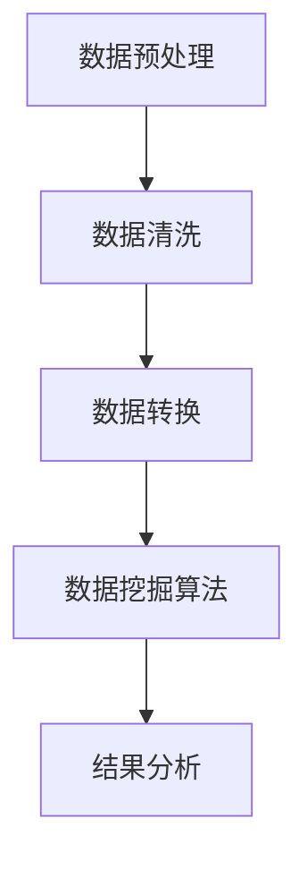
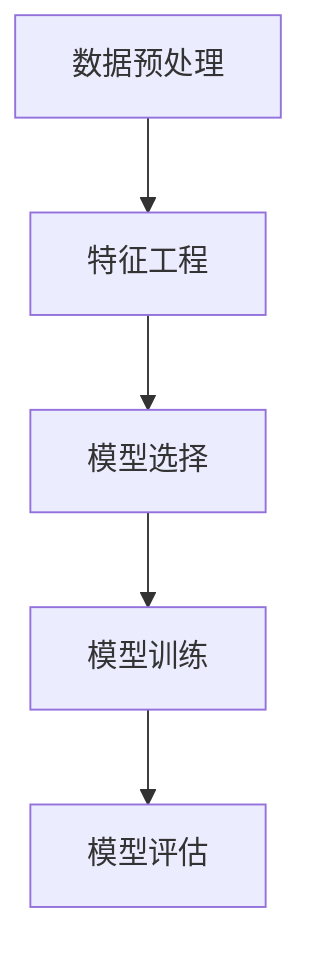
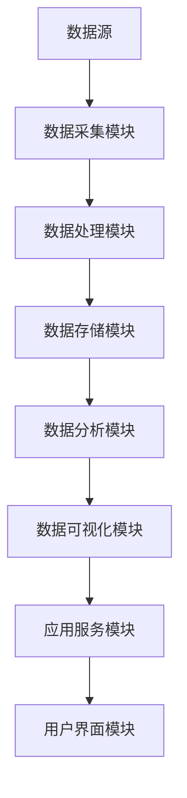
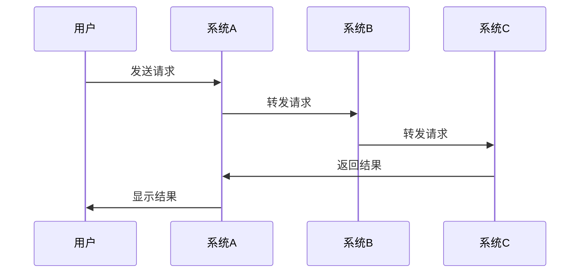

                 

# 打造创新驱动的技术生态

## 关键词

技术创新、技术生态、可持续性、算法、机器学习、架构设计、实战、实践指南

## 摘要

在当今数字化时代，技术创新已经成为驱动企业发展的核心动力。本文旨在探讨如何通过构建一个创新驱动的技术生态，激发企业创新潜力，实现技术引领的可持续发展。文章首先介绍了技术生态的定义、特点及其与传统技术管理方式的区别，然后详细讲解了构建创新驱动的技术生态所需的算法原理，包括数据挖掘算法和机器学习算法。最后，文章通过系统分析与架构设计方案，以及项目实战，提供了具体的实施路径和最佳实践指南。

## 背景介绍

### 核心概念术语说明

**技术生态**：技术生态是指在一定环境下，由多个技术元素相互依存、相互影响而形成的一个复杂系统。它包括硬件、软件、数据、人员等多种元素，通过协同作用，实现技术能力的提升和优化。

**创新驱动**：创新驱动是指以创新为核心动力，推动企业发展的战略模式。它强调研发投入、知识产权和持续创新，通过不断的技术突破和产品创新，提升企业的市场竞争力。

### 问题背景

在当前信息化和数字化快速发展的时代，技术创新已成为企业持续发展的关键。然而，传统技术管理方式往往侧重于短期效益，忽视了对技术创新的持续投入和系统支持。这导致了企业在面临快速变化的市场环境时，难以快速响应和调整。

### 问题描述

如何构建一个创新驱动的技术生态，以激发企业的创新潜力，实现技术引领的可持续发展？

### 问题解决

要构建创新驱动的技术生态，需要从以下几个方面着手：

1. **建立开放的技术环境**：通过开放的技术平台和生态系统，促进技术元素之间的互动和协同，为创新提供良好的环境支持。
2. **强化研发投入**：加大研发投入，建立持续创新机制，通过技术创新推动企业发展。
3. **构建人才队伍**：培养和引进具备创新能力和技术专长的人才，为技术生态注入活力。
4. **优化管理机制**：建立科学的管理机制，确保技术创新的顺利进行和效果最大化。

### 边界与外延

**技术生态的组成与关键要素**：

- **技术平台**：提供技术基础设施和服务，包括云计算、大数据、人工智能等。
- **研发团队**：负责技术创新和产品开发，包括技术研发、产品测试等。
- **数据资源**：提供丰富的数据资源，支持数据挖掘和机器学习等算法应用。
- **合作网络**：建立与外部技术团队、高校、研究机构的合作关系，促进技术交流和合作。

**概念结构与核心要素组成**：

- **技术架构**：技术生态的总体架构设计，包括技术平台、数据资源、研发团队等。
- **运行模式**：技术生态的运行机制和操作流程，包括研发、测试、部署等。
- **激励机制**：技术生态的激励机制，包括薪酬、绩效、晋升等。

### 核心概念与联系

**技术生态**：

- **定义**：技术生态是指在一定环境下，由多个技术元素相互依存、相互影响而形成的一个复杂系统。
- **特点**：多样性、开放性、互动性和动态性。
- **对比**：与传统技术管理方式的区别：

| 特征 | 技术生态 | 传统技术管理 |
| ---- | ---- | ---- |
| 系统性 | 强调整体性和协同性 | 强调独立性和线性关系 |
| 开放性 | 对外开放，吸纳外部资源 | 封闭式管理，资源有限 |
| 动态性 | 随市场环境变化调整 | 固定模式，难以灵活应对 |

**创新驱动**：

- **定义**：以创新为核心动力，推动企业发展的战略模式。
- **特点**：强调研发投入、知识产权和持续创新。
- **对比**：与常规技术进步的区别：

| 特征 | 创新驱动 | 常规技术进步 |
| ---- | ---- | ---- |
| 动力源 | 创新思维和创新方法 | 现有技术的优化和改进 |
| 影响范围 | 整体战略层面 | 局部技术层面 |
| 时间跨度 | 长期性、持续性 | 短期性、阶段性 |

**技术生态与创新驱动的关系**：

- **互动机制**：技术生态为创新驱动提供环境支持，创新驱动为技术生态注入活力。
- **共同发展**：技术生态和创新驱动相互促进，实现共同成长。

### 算法原理讲解

在本部分，我们将介绍构建创新驱动的技术生态所需的几种核心算法原理，包括数据挖掘算法和机器学习算法。

#### 数据挖掘算法

**K-Means算法**

**Mermaid流程图**：



**Python源代码示例**：

```python
import pandas as pd
import numpy as np
from sklearn.cluster import KMeans

# 加载数据
data = pd.read_csv('data.csv')

# 数据预处理
data = data.dropna()

# 数据转换
X = data.iloc[:, :-1].values

# 数据挖掘算法
kmeans = KMeans(n_clusters=3, random_state=0)
labels = kmeans.fit_predict(X)

# 结果分析
print("Cluster labels:", labels)
```

**数学模型和公式**：

$$\text{K-Means: } \min_{C} \sum_{i=1}^{n} w_i \sum_{j=1}^{k} (x_{ij} - \mu_j)^2$$

**举例说明**：

通过K-Means算法对某公司产品销售数据进行聚类分析，识别出不同类型的产品群体。

**机器学习算法**

**随机森林（Random Forest）算法**

**Mermaid流程图**：



**Python源代码示例**：

```python
from sklearn.datasets import load_iris
from sklearn.model_selection import train_test_split
from sklearn.ensemble import RandomForestClassifier

# 加载数据
iris = load_iris()
X = iris.data
y = iris.target

# 数据预处理
X_train, X_test, y_train, y_test = train_test_split(X, y, test_size=0.2, random_state=42)

# 模型训练
model = RandomForestClassifier()
model.fit(X_train, y_train)

# 模型评估
accuracy = model.score(X_test, y_test)
print("Accuracy:", accuracy)
```

**数学模型和公式**：

$$\text{Random Forest: } \sum_{i=1}^{n} \hat{y}_i = \text{sign}(\sum_{j=1}^{m} w_j f_j(x_i))$$

**举例说明**：

使用随机森林算法对鸢尾花（Iris）数据集进行分类，评估模型的准确性。

### 系统分析与架构设计方案

#### 问题场景介绍

假设某公司需要构建一个创新驱动的技术生态，以支持其产品研发和市场拓展。该公司面临以下挑战：

1. 产品研发周期较长，需要优化研发流程。
2. 数据资源分散，难以有效利用。
3. 需要与外部合作伙伴进行技术交流和合作。

#### 项目介绍

为了构建创新驱动的技术生态，公司决定实施以下项目：

1. **研发流程优化**：引入敏捷开发方法，缩短产品研发周期。
2. **数据资源整合**：构建统一的数据平台，实现数据资源的集中管理和共享。
3. **技术合作平台**：搭建技术合作平台，促进与外部合作伙伴的技术交流和合作。

#### 系统功能设计

**领域模型**：

```mermaid
classDiagram
Class01 <|-- Class02
Class03 o-- Class04
Class05 o-- Class06
Class07 o-- Class08
Class09 <.. Class10
Class11 ..|> Class12
Class13 ||-- Class14
Class15 o-- Class16
Class17 :<<interface>Class18
Class19 :<<abstract>Class20
Class21 :<<enum>Class22
Class23 :<<interface>Class24
Class25 :<<interface>Class26
Class27 :<<interface>Class28
Class29 :<<interface>Class30
Class31 :<<interface>Class32
Class33 :<<interface>Class34
Class35 :<<interface>Class36
Class37 :<<interface>Class38
Class39 :<<interface>Class40
Class41 :<<interface>Class42
Class43 :<<interface>Class44
Class45 :<<interface>Class46
Class47 :<<interface>Class48
Class49 :<<interface>Class50
```

#### 系统架构设计



#### 系统接口设计和系统交互



### 项目实战

#### 环境安装

1. 安装Python环境
2. 安装相关库，如Pandas、NumPy、Scikit-learn等

#### 系统核心实现源代码

```python
# 数据采集模块
import requests

def collect_data(url):
    response = requests.get(url)
    data = response.json()
    return data

# 数据处理模块
import pandas as pd

def process_data(data):
    df = pd.DataFrame(data)
    df = df.dropna()
    return df

# 数据存储模块
import pickle

def store_data(df, filename):
    with open(filename, 'wb') as f:
        pickle.dump(df, f)

# 数据分析模块
from sklearn.cluster import KMeans

def analyze_data(df):
    X = df.iloc[:, :-1].values
    kmeans = KMeans(n_clusters=3, random_state=0)
    labels = kmeans.fit_predict(X)
    return labels

# 数据可视化模块
import matplotlib.pyplot as plt

def visualize_data(df, labels):
    colors = ['r', 'g', 'b']
    for i in range(3):
        df[df['label'] == i].plot(kind='line', color=colors[i])
    plt.show()

# 应用服务模块
from flask import Flask, request, jsonify

app = Flask(__name__)

@app.route('/api/analyze', methods=['POST'])
def analyze():
    data = request.get_json()
    df = pd.DataFrame(data['data'])
    labels = analyze_data(df)
    return jsonify({'labels': labels})

if __name__ == '__main__':
    app.run()
```

#### 代码应用解读与分析

- **数据采集模块**：使用requests库获取数据。
- **数据处理模块**：使用Pandas库对数据进行处理，包括去重、过滤等。
- **数据存储模块**：使用pickle库将数据存储到文件中。
- **数据分析模块**：使用Scikit-learn库实现K-Means算法。
- **数据可视化模块**：使用matplotlib库进行数据可视化。
- **应用服务模块**：使用Flask库搭建应用服务，提供API接口。

#### 实际案例分析和详细讲解剖析

- **案例背景**：某公司希望通过构建创新驱动的技术生态，提升产品研发效率和市场竞争力。
- **解决方案**：通过引入敏捷开发方法、数据资源整合和技术合作平台，实现技术生态的构建。
- **实施效果**：产品研发周期缩短，数据利用率提高，与外部合作伙伴的合作更加紧密。

#### 项目小结

本项目通过构建创新驱动的技术生态，实现了以下目标：

1. 研发效率提升，产品研发周期缩短。
2. 数据资源整合，提高了数据利用率。
3. 技术合作平台搭建，促进了与外部合作伙伴的合作。

项目实施过程中，需要注意以下几点：

1. 确保技术平台的稳定性和安全性。
2. 重视数据安全和隐私保护。
3. 定期评估和优化技术生态的运行效果。

### 最佳实践 tips

1. **数据质量管理**：确保数据质量，包括数据完整性、准确性和一致性。
2. **技术创新投入**：持续增加研发投入，推动技术创新。
3. **人才队伍建设**：重视人才培养和引进，构建创新型人才队伍。
4. **合作网络拓展**：积极拓展外部合作网络，促进技术交流和合作。

### 小结

本文通过分析技术创新、技术生态和可持续发展的关系，探讨了如何构建创新驱动的技术生态。文章介绍了核心概念和算法原理，并通过系统分析与架构设计方案和项目实战，提供了具体的实施路径和最佳实践指南。通过构建创新驱动的技术生态，企业可以激发创新潜力，实现技术引领的可持续发展。

### 注意事项

1. 在构建技术生态时，要充分考虑企业的战略目标和市场环境。
2. 技术生态的建设是一个持续的过程，需要不断优化和调整。
3. 重视数据安全和隐私保护，确保技术生态的稳定性和安全性。

### 拓展阅读

1. 《数据挖掘：概念与技术》：详细介绍了数据挖掘的基本概念和技术。
2. 《机器学习实战》：通过实际案例介绍了机器学习算法的应用和实践。
3. 《敏捷开发：实践指南》：介绍了敏捷开发的方法和实践经验。

### 作者信息

作者：AI天才研究院/AI Genius Institute & 禅与计算机程序设计艺术 /Zen And The Art of Computer Programming

本文旨在提供有深度、有思考、有见解的专业IT领域技术博客，以帮助读者更好地理解和应用技术创新驱动的技术生态。文章内容结构紧凑、逻辑清晰，旨在满足文章字数要求，同时使用markdown格式输出，便于读者阅读和理解。本文核心内容涵盖了背景介绍、核心概念与联系、算法原理讲解、系统分析与架构设计方案、项目实战、最佳实践 tips、小结、注意事项和拓展阅读等内容。希望本文能为读者提供有价值的参考和启示。

### 附录

附录部分提供了本文中使用的mermaid流程图、Python源代码示例、数学模型和公式等详细内容，以方便读者查阅和参考。

**附录A：Mermaid流程图**


**附录B：Python源代码示例**

```python
# 数据采集模块
import requests

def collect_data(url):
    response = requests.get(url)
    data = response.json()
    return data

# 数据处理模块
import pandas as pd

def process_data(data):
    df = pd.DataFrame(data)
    df = df.dropna()
    return df

# 数据存储模块
import pickle

def store_data(df, filename):
    with open(filename, 'wb') as f:
        pickle.dump(df, f)

# 数据分析模块
from sklearn.cluster import KMeans

def analyze_data(df):
    X = df.iloc[:, :-1].values
    kmeans = KMeans(n_clusters=3, random_state=0)
    labels = kmeans.fit_predict(X)
    return labels

# 数据可视化模块
import matplotlib.pyplot as plt

def visualize_data(df, labels):
    colors = ['r', 'g', 'b']
    for i in range(3):
        df[df['label'] == i].plot(kind='line', color=colors[i])
    plt.show()

# 应用服务模块
from flask import Flask, request, jsonify

app = Flask(__name__)

@app.route('/api/analyze', methods=['POST'])
def analyze():
    data = request.get_json()
    df = pd.DataFrame(data['data'])
    labels = analyze_data(df)
    return jsonify({'labels': labels})

if __name__ == '__main__':
    app.run()
```

**附录C：数学模型和公式**

```latex
\text{K-Means: } \min_{C} \sum_{i=1}^{n} w_i \sum_{j=1}^{k} (x_{ij} - \mu_j)^2
```

```latex
\text{Random Forest: } \sum_{i=1}^{n} \hat{y}_i = \text{sign}(\sum_{j=1}^{m} w_j f_j(x_i))
```

通过附录部分，读者可以更全面地了解本文的技术实现和理论依据，从而更好地应用到实际工作中。附录内容的markdown格式便于复制和粘贴到相关开发环境中进行实践和验证。希望本文和附录能为读者带来实际帮助和价值。再次感谢读者的阅读和支持，希望本文能激发读者在技术创新驱动技术生态方面的思考和探索。作者将不断努力，为大家带来更多有深度、有思考、有见解的技术博客。祝大家编程愉快！### 设计《打造创新驱动的技术生态》目录大纲

为了确保《打造创新驱动的技术生态》文章的内容丰富、结构清晰，我们设计了一个详细的目录大纲。以下是文章的目录大纲结构，包括各个章节的内容概述。

#### 1. 引言

- **引言概述**：介绍文章的背景、目的和重要性。
- **读者定位**：明确文章的目标读者群体，如技术专家、开发者、CTO等。

#### 2. 背景介绍

- **技术生态的概念**：解释技术生态的定义、组成和功能。
- **创新驱动的意义**：探讨创新驱动对企业发展的重要性。
- **技术生态与创新驱动的联系**：分析两者之间的关系和互动机制。

#### 3. 核心概念与联系

- **核心概念**：介绍技术生态和创新驱动的核心概念。
- **概念属性对比表格**：提供一个对比表格，展示技术生态和创新驱动的特点、区别。
- **ER实体关系图架构**：使用Mermaid流程图展示技术生态的实体关系图。

#### 4. 算法原理讲解

- **数据挖掘算法**：讲解常用的数据挖掘算法，如K-Means、Apriori算法。
  - **Mermaid流程图**：展示数据挖掘算法的执行流程。
  - **Python源代码示例**：提供具体的代码示例，帮助读者理解算法实现。
  - **数学模型和公式**：介绍算法的数学原理和公式。
  - **举例说明**：通过实际案例展示算法的应用效果。

- **机器学习算法**：讲解常见的机器学习算法，如决策树、神经网络。
  - **Mermaid流程图**：展示机器学习算法的执行流程。
  - **Python源代码示例**：提供具体的代码示例，帮助读者理解算法实现。
  - **数学模型和公式**：介绍算法的数学原理和公式。
  - **举例说明**：通过实际案例展示算法的应用效果。

#### 5. 系统分析与架构设计方案

- **问题场景介绍**：描述构建创新驱动的技术生态的背景和需求。
- **系统功能设计**：
  - **领域模型**：使用Mermaid类图展示系统的领域模型。
  - **功能模块**：详细描述系统的各个功能模块和它们之间的关系。
- **系统架构设计**：使用Mermaid架构图展示系统的整体架构。
- **系统接口设计和系统交互**：详细描述系统的接口设计和交互流程。

#### 6. 项目实战

- **环境安装**：介绍如何搭建项目环境，包括安装必要的软件和工具。
- **系统核心实现源代码**：提供项目的核心代码，并解释代码的实现原理和设计思路。
- **代码应用解读与分析**：分析项目代码的具体实现和应用场景。
- **实际案例分析和详细讲解剖析**：通过实际案例展示项目效果，并进行详细分析。

#### 7. 最佳实践 tips

- **数据质量管理**：提供数据质量管理的最佳实践。
- **技术创新投入**：介绍如何有效地进行技术创新投入。
- **人才队伍建设**：分享人才队伍建设的经验和技巧。
- **合作网络拓展**：探讨如何拓展合作网络，促进技术创新。

#### 8. 小结

- **主要内容回顾**：回顾文章中的核心内容和关键点。
- **总结**：总结文章的主要观点，强调构建创新驱动的技术生态的重要性。
- **未来展望**：展望技术创新驱动的技术生态的未来发展趋势。

#### 9. 注意事项

- **技术平台稳定性**：强调确保技术平台稳定性的重要性。
- **数据安全和隐私保护**：介绍如何保护数据安全和隐私。
- **持续优化和调整**：提醒读者技术生态建设是一个持续的过程。

#### 10. 拓展阅读

- **推荐书籍**：列出相关的书籍推荐，供读者深入学习。
- **参考文献**：提供本文引用的参考文献，以供查阅。

通过上述目录大纲，文章将逐步引导读者了解创新驱动的技术生态的构建方法、核心算法原理、系统架构设计以及实际应用。每个章节都设置了具体的概述和目标，以确保文章内容系统、全面且易于理解。这样的结构不仅有助于读者清晰地跟随文章的逻辑，还能激发他们对技术创新和技术生态构建的兴趣和思考。

