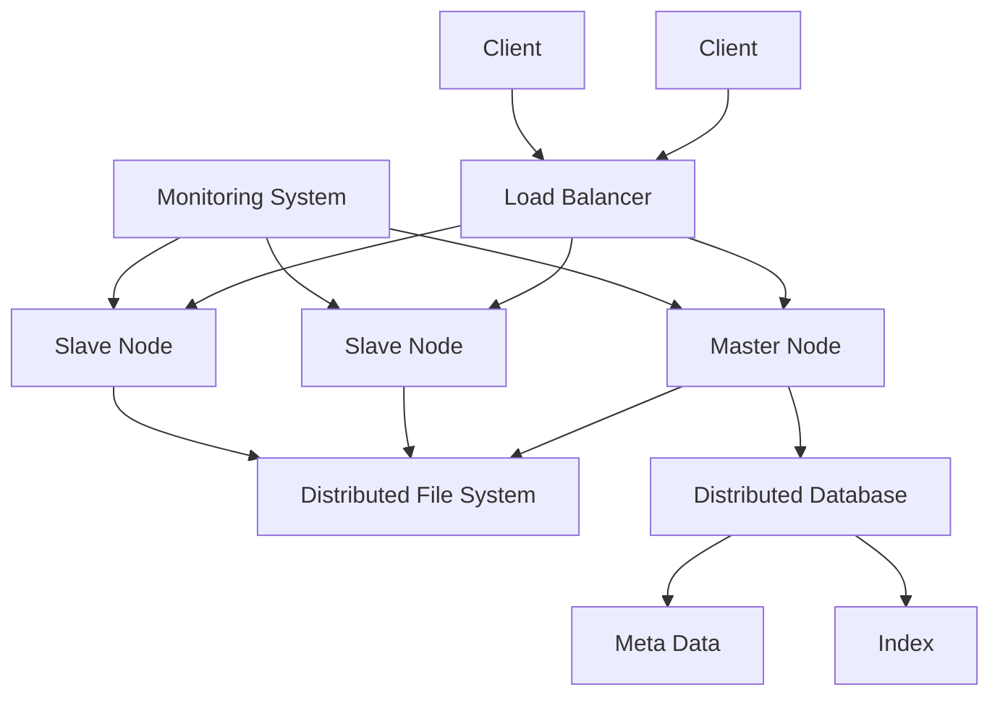

                 


# 打造可靠的分布式存储系统

## 关键词

- 分布式存储系统
- 可靠性
- 数据分片
- 一致性模型
- 性能优化
- 容错机制

## 摘要

本文将深入探讨如何打造一个可靠的分布式存储系统。我们将从背景介绍、核心概念与原理、系统设计与实现、性能优化与可靠性保障、案例分析与实战、最佳实践与拓展等多个方面，一步一步地进行分析和讲解。通过本文的学习，读者将能够全面理解分布式存储系统的构建过程，掌握关键技术和方法，从而构建出高效、可靠、安全的分布式存储系统。

## 目录大纲设计思路

### 1. 确定核心内容模块

在设计目录大纲时，我们需要首先明确本书的核心内容模块。根据《打造可靠的分布式存储系统》这一书名，可以推断出本书将围绕分布式存储系统的设计、实现、优化和可靠性保障等方面进行展开。

### 2. 确定章节结构

接下来，我们将全书分为以下几个主要部分：

1. **背景与核心概念**：介绍分布式存储系统的必要性、历史与演进。
2. **核心概念与原理**：探讨分布式存储系统的核心概念、数据分片、一致性模型、数据复制等。
3. **系统设计与实现**：详细讲解分布式存储系统的架构设计、实现方法。
4. **性能优化与可靠性保障**：分析性能优化策略、可靠性保障机制。
5. **案例分析与实战**：通过实际案例展示分布式存储系统的应用与实现。
6. **最佳实践与拓展**：总结最佳实践，展望未来发展趋势。

### 3. 设计章节细节

对于每个章节，我们进一步细化内容，设计出具体的标题和子标题。确保章节内容具有逻辑性和层次感，方便读者阅读和理解。

### 4. 确保内容完整性

在保证目录大纲简洁性的同时，必须确保内容的完整性。这要求每个章节都包含核心概念、原理讲解、系统设计与实现、案例分析等关键内容。

### 5. 优化目录结构

通过调整章节顺序、合并或拆分某些章节，优化目录结构，使其更加清晰、易于阅读。

### 6. 审核目录大纲

最后，对设计的目录大纲进行审核，确保没有遗漏重要内容，同时确保目录长度在规定范围内。

## 目录大纲

### 第一部分：背景介绍

#### 第1章：分布式存储系统概述
1.1. 分布式存储系统的定义
1.2. 分布式存储系统的优势
1.3. 分布式存储系统的挑战
1.4. 分布式存储系统的应用场景
1.5. 本章小结

#### 第2章：分布式存储系统的历史与演进
2.1. 分布式存储系统的起源
2.2. 分布式存储系统的发展历程
2.3. 当前分布式存储系统的主要类型
2.4. 本章小结

### 第二部分：核心概念与原理

#### 第3章：分布式存储系统的核心概念
3.1. 数据分片
3.2. 一致性模型
3.3. 分布式锁
3.4. 数据复制
3.5. 去重
3.6. 本章小结

#### 第4章：分布式存储系统的原理
4.1. 分布式数据结构
4.2. 分布式一致性
4.3. 分布式事务
4.4. 分布式文件系统
4.5. 分布式数据库
4.6. 本章小结

### 第三部分：系统设计与实现

#### 第5章：分布式存储系统架构设计
5.1. 架构设计原则
5.2. 主从架构
5.3. 对等架构
5.4. 分布式文件系统设计
5.5. 分布式数据库设计
5.6. 本章小结

#### 第6章：分布式存储系统的实现
6.1. 系统设计原则
6.2. 数据分片策略
6.3. 一致性保障机制
6.4. 分布式锁实现
6.5. 数据复制与去重
6.6. 分布式文件系统实现
6.7. 分布式数据库实现
6.8. 系统测试与性能评估
6.9. 本章小结

### 第四部分：性能优化与可靠性保障

#### 第7章：性能优化
7.1. 系统性能指标
7.2. 数据访问模式优化
7.3. 数据存储优化
7.4. 数据传输优化
7.5. 系统缓存策略
7.6. 系统负载均衡
7.7. 本章小结

#### 第8章：可靠性保障
8.1. 故障模式分析
8.2. 故障检测与恢复机制
8.3. 数据备份与恢复
8.4. 分布式存储系统的容错能力
8.5. 系统安全与隐私保护
8.6. 本章小结

### 第五部分：案例分析与实战

#### 第9章：分布式存储系统案例
9.1. 案例介绍
9.2. 系统架构
9.3. 系统实现
9.4. 性能优化与可靠性保障
9.5. 案例小结

#### 第10章：实战项目
10.1. 项目背景
10.2. 项目目标
10.3. 项目规划
10.4. 系统设计与实现
10.5. 项目总结

### 第六部分：最佳实践与拓展

#### 第11章：最佳实践
11.1. 设计最佳实践
11.2. 性能优化最佳实践
11.3. 可靠性保障最佳实践
11.4. 案例分析最佳实践
11.5. 本章小结

#### 第12章：小结与拓展
12.1. 小结
12.2. 注意事项
12.3. 拓展阅读
12.4. 未来发展趋势

----------------------------------------------------------------

## 第一部分：背景介绍

### 第1章：分布式存储系统概述

#### 1.1 问题背景

在互联网时代，数据量呈现爆炸式增长，传统的集中式存储系统已经无法满足海量数据存储和快速访问的需求。分布式存储系统作为一种新兴的存储技术，凭借其高可用性、高扩展性和高性能等优势，逐渐成为现代数据存储的首选方案。

#### 1.2 分布式存储系统的定义

分布式存储系统是一种将数据分散存储在多个物理节点上的存储系统。它通过数据分片、分布式一致性、数据复制等技术，实现了数据的高效存储和访问。分布式存储系统通常具有以下几个特点：

1. **高可用性**：分布式存储系统通过冗余机制和数据备份，提高了系统的可靠性，即使在某些节点发生故障的情况下，系统仍然可以正常运行。
2. **高扩展性**：分布式存储系统可以通过增加节点来水平扩展存储容量，从而满足不断增长的数据存储需求。
3. **高性能**：分布式存储系统通过并行访问和负载均衡，提高了数据的读写速度，满足了大规模数据访问的需求。
4. **高一致性**：分布式存储系统通过一致性模型和数据复制，确保了数据的一致性，即使在多节点环境中也能保证数据的准确性。

#### 1.3 分布式存储系统的优势

分布式存储系统相较于传统集中式存储系统，具有以下几个显著优势：

1. **高可用性**：通过数据冗余和节点备份，分布式存储系统可以在节点故障时保持正常运行，提高了系统的可靠性。
2. **高扩展性**：分布式存储系统可以通过增加节点来水平扩展存储容量，从而适应数据量的增长。
3. **高性能**：分布式存储系统通过并行访问和负载均衡，提高了数据的读写速度，满足了大规模数据访问的需求。
4. **高一致性**：分布式存储系统通过一致性模型和数据复制，确保了数据的一致性，即使在多节点环境中也能保证数据的准确性。
5. **低成本**：分布式存储系统可以利用廉价的普通硬件构建，降低了系统的成本。

#### 1.4 分布式存储系统的挑战

虽然分布式存储系统具有很多优势，但它在实际应用中也面临着一些挑战：

1. **数据一致性**：在分布式环境中，如何确保数据的一致性是一个重要问题。分布式一致性模型如CAP定理、BASE理论等，为我们提供了一些解决方案。
2. **性能优化**：分布式存储系统需要考虑数据访问模式、数据存储优化、数据传输优化等多方面的性能问题。
3. **可靠性保障**：分布式存储系统需要通过故障检测与恢复机制、数据备份与恢复等技术来保障系统的可靠性。
4. **安全性**：分布式存储系统需要考虑数据安全与隐私保护，防止数据泄露和未授权访问。

#### 1.5 本章小结

本章介绍了分布式存储系统的背景、定义、优势和挑战。通过本章的学习，读者可以初步了解分布式存储系统的基本概念和重要性，为后续章节的学习打下基础。

----------------------------------------------------------------

## 第二部分：核心概念与原理

### 第3章：分布式存储系统的核心概念

#### 3.1 数据分片

数据分片是将大量数据划分成若干小块，存储在多个节点上的过程。数据分片的目的是提高存储系统的性能和可扩展性。在分布式存储系统中，数据分片通常基于以下几种策略：

1. **哈希分片**：将数据的哈希值映射到存储节点上，每个节点负责存储一部分数据。这种方法简单高效，但可能导致热点问题。
2. **范围分片**：将数据按某种范围（如时间、ID等）划分到不同的节点上。这种方法可以更好地处理数据访问的不均匀性。
3. **列表分片**：将数据按某种顺序（如字典顺序）存储到不同的节点上。这种方法适用于有序数据的存储和查询。

数据分片需要考虑以下关键问题：

1. **数据分布的均匀性**：确保每个节点存储的数据量大致相等，避免某些节点过载，影响系统性能。
2. **数据访问的局部性**：尽量将访问频繁的数据存储在同一个节点上，减少数据传输的延迟。
3. **数据分片的粒度**：数据分片的粒度需要根据应用场景进行权衡。粒度过大会导致数据访问的不一致性，粒度过小会增加数据管理的复杂性。

#### 3.2 一致性模型

一致性模型是分布式系统设计中的一个关键概念，它决定了系统在多个节点间如何保持数据一致性。以下是一些常见的一致性模型：

1. **强一致性（Strong Consistency）**：系统在任何时候都能保证多个节点间的数据一致性。强一致性是事务系统的重要保障，但可能导致性能瓶颈。
2. **最终一致性（Eventual Consistency）**：系统在给定时间内，能够达到一致性状态，但这个时间可能较长。最终一致性适用于一些对一致性要求不高的应用场景。
3. **读己所写一致性（Read-your-writes Consistency）**：客户端写入的数据，在一定延迟后可以被自身读取到。这种一致性模型较为常见，但无法保证多个客户端间的数据一致性。
4. **线性一致性（Linear Consistency）**：系统在多版本控制下，保证每个客户端看到的数据版本是连续的。

一致性模型的选择需要根据应用场景进行权衡。以下是一些一致性模型的优缺点：

| 一致性模型 | 优点 | 缺点 |
| :--: | :--: | :--: |
| 强一致性 | 事务性强，数据一致性有保障 | 性能瓶颈，易造成延迟 |
| 最终一致性 | 性能高，易扩展 | 数据最终一致性，适用场景有限 |
| 读己所写一致性 | 简单易实现，性能较好 | 无法保证多个客户端间的数据一致性 |
| 线性一致性 | 版本控制方便，一致性有保障 | 多版本控制可能导致数据冗余 |

#### 3.3 分布式锁

分布式锁是分布式系统中的关键同步机制，用于确保多节点间的操作顺序。以下是一些常见的分布式锁机制：

1. **基于数据库的分布式锁**：利用数据库的行级锁来实现分布式锁。这种方法简单易实现，但可能导致性能瓶颈。
2. **基于Zookeeper的分布式锁**：利用Zookeeper的临时节点和监听机制来实现分布式锁。这种方法性能较好，但依赖Zookeeper的稳定性。
3. **基于Redis的分布式锁**：利用Redis的SETNX命令来实现分布式锁。这种方法性能优异，且易于部署。

分布式锁需要考虑以下关键问题：

1. **锁的获取与释放**：确保锁的获取与释放的原子性，避免死锁和资源泄漏。
2. **锁的可见性**：确保多个节点间的锁状态一致，避免数据不一致的问题。
3. **锁的超时机制**：设置合理的锁超时时间，避免长时间占用锁导致其他操作阻塞。

#### 3.4 数据复制

数据复制是分布式存储系统中的关键技术，用于提高数据的可靠性和可用性。以下是一些常见的数据复制策略：

1. **主从复制**：将数据分为主节点和从节点，主节点负责数据的写入和更新，从节点负责数据的读取和备份。这种方法简单易实现，但可能导致数据不一致性问题。
2. **多主复制**：多个节点都可以作为主节点，数据在多个节点间同步更新。这种方法提高了数据的可用性，但增加了数据一致性的复杂性。
3. **去重复制**：在复制过程中，对相同的数据进行去重处理，减少存储空间的占用。

数据复制需要考虑以下关键问题：

1. **复制的一致性**：确保多个节点间的数据一致性，避免数据丢失和冲突。
2. **复制的速度**：优化复制算法，提高数据的复制速度，减少数据延迟。
3. **复制的容错性**：确保在节点故障时，复制的流程能够继续进行，避免数据丢失。

#### 3.5 去重

去重是分布式存储系统中的重要技术，用于减少存储空间的占用，提高数据存储的效率。以下是一些常见的去重方法：

1. **基于哈希的去重**：利用哈希算法对数据进行去重，相同的数据哈希值相同，从而实现去重。这种方法简单高效，但可能导致哈希碰撞。
2. **基于索引的去重**：通过索引来记录已存储的数据，避免重复数据的存储。这种方法适用于大规模数据存储，但需要较高的维护成本。
3. **基于压缩的去重**：利用压缩算法对数据进行压缩，减少存储空间的占用。这种方法适用于压缩比例较高的数据，但压缩和解压缩过程可能影响性能。

去重需要考虑以下关键问题：

1. **去重的准确性**：确保去重算法能够准确识别和去除重复数据，避免数据丢失。
2. **去重的效率**：优化去重算法，提高去重速度，减少存储空间的占用。
3. **去重的兼容性**：确保去重算法对不同类型的数据兼容，避免数据损坏。

#### 3.6 本章小结

本章介绍了分布式存储系统的核心概念，包括数据分片、一致性模型、分布式锁、数据复制和去重。通过本章的学习，读者可以深入理解分布式存储系统的基本原理和技术，为后续章节的学习打下基础。

----------------------------------------------------------------

### 第4章：分布式存储系统的原理

#### 4.1 分布式数据结构

分布式数据结构是分布式存储系统的基础，用于实现数据的分布式存储和访问。以下是一些常见的分布式数据结构：

1. **分布式哈希表（DHT）**：分布式哈希表是一种分布式键值存储结构，通过哈希算法将键映射到不同的节点上。DHT可以实现数据的高效存储和访问，但需要解决哈希碰撞和负载均衡等问题。
2. **分布式树结构**：分布式树结构是一种基于树的分布式数据结构，如分布式B树、R树等。这些结构可以实现数据的分片和分布存储，但需要解决数据一致性和并发访问等问题。
3. **分布式图结构**：分布式图结构是一种基于图的分布式数据结构，如分布式图数据库。这些结构可以实现复杂关系数据的存储和访问，但需要解决图一致性和计算效率等问题。

分布式数据结构需要考虑以下关键问题：

1. **数据分布的均匀性**：确保数据在节点间均匀分布，避免某些节点过载，影响系统性能。
2. **数据访问的局部性**：尽量将访问频繁的数据存储在同一个节点上，减少数据传输的延迟。
3. **数据一致性和容错性**：确保多个节点间的数据一致性，避免数据丢失和冲突。

#### 4.2 分布式一致性

分布式一致性是分布式存储系统设计中的一个关键问题，它决定了系统在多个节点间如何保持数据一致性。以下是一些常见的一致性模型：

1. **强一致性（Strong Consistency）**：系统在任何时候都能保证多个节点间的数据一致性。强一致性是事务系统的重要保障，但可能导致性能瓶颈。
2. **最终一致性（Eventual Consistency）**：系统在给定时间内，能够达到一致性状态，但这个时间可能较长。最终一致性适用于一些对一致性要求不高的应用场景。
3. **读己所写一致性（Read-your-writes Consistency）**：客户端写入的数据，在一定延迟后可以被自身读取到。这种一致性模型较为常见，但无法保证多个客户端间的数据一致性。
4. **线性一致性（Linear Consistency）**：系统在多版本控制下，保证每个客户端看到的数据版本是连续的。

分布式一致性需要考虑以下关键问题：

1. **一致性模型的选型**：根据应用场景选择合适的一致性模型，权衡一致性、性能和可扩展性。
2. **一致性保障机制**：通过分布式锁、版本控制、数据复制等技术，确保数据的一致性。
3. **一致性冲突的解决**：在分布式环境中，如何处理数据一致性冲突，如并发写入、数据更新冲突等。

#### 4.3 分布式事务

分布式事务是分布式存储系统中的一项重要功能，用于确保多个操作在分布式环境中的原子性。以下是一些常见的分布式事务模型：

1. **两阶段提交（2PC）**：两阶段提交是一种分布式事务协议，分为准备阶段和提交阶段。准备阶段确保所有参与者都对事务准备就绪，提交阶段确保事务的提交或回滚。两阶段提交可以保证事务的原子性，但可能导致性能瓶颈。
2. **三阶段提交（3PC）**：三阶段提交是两阶段提交的改进版本，分为准备阶段、提交阶段和故障处理阶段。三阶段提交可以更好地处理参与者故障，但仍然存在性能瓶颈。
3. **最终一致性事务（TCC）**：最终一致性事务是一种基于最终一致性模型的分布式事务，分为准备阶段、确认阶段和补偿阶段。最终一致性事务可以更好地处理分布式环境中的事务一致性，但需要更多的编程和调试。

分布式事务需要考虑以下关键问题：

1. **事务隔离性**：确保事务的隔离性，避免并发事务间的干扰。
2. **事务一致性**：确保分布式事务的一致性，避免数据不一致性问题的发生。
3. **事务性能**：优化事务的执行效率，提高系统的性能。

#### 4.4 分布式文件系统

分布式文件系统是分布式存储系统的重要组成部分，用于实现数据的高效存储和访问。以下是一些常见的分布式文件系统：

1. **Google File System（GFS）**：Google File System 是谷歌开发的分布式文件系统，适用于大规模数据存储和处理。GFS 通过数据分片、副本机制和任务调度，实现了高效的数据存储和访问。
2. **Hadoop Distributed File System（HDFS）**：Hadoop Distributed File System 是 Hadoop 生态系统中的一种分布式文件系统，用于存储海量数据。HDFS 通过数据分片、副本机制和负载均衡，实现了高效的数据存储和访问。
3. **Amazon Simple Storage Service（S3）**：Amazon Simple Storage Service 是亚马逊提供的分布式文件系统，用于存储和访问大规模数据。S3 通过数据分片、副本机制和负载均衡，实现了高效的数据存储和访问。

分布式文件系统需要考虑以下关键问题：

1. **数据分片的策略**：选择合适的分片策略，确保数据在节点间均匀分布。
2. **数据复制的机制**：确保数据在多个节点间备份，提高数据的可靠性和可用性。
3. **数据访问的接口**：提供高效的访问接口，满足不同类型的应用需求。

#### 4.5 分布式数据库

分布式数据库是分布式存储系统中的一种重要组件，用于实现数据的高效存储和访问。以下是一些常见的分布式数据库：

1. **Google Spanner**：Google Spanner 是谷歌开发的分布式数据库，适用于全球范围内的数据存储和访问。Spanner 通过分布式一致性模型、分布式事务和自动扩展机制，实现了高效的数据存储和访问。
2. **Apache Cassandra**：Apache Cassandra 是一种分布式数据库，适用于大规模数据的存储和访问。Cassandra 通过分布式一致性模型、分布式数据结构和去重机制，实现了高效的数据存储和访问。
3. **MongoDB**：MongoDB 是一种分布式文档数据库，适用于大规模数据的存储和访问。MongoDB 通过分布式数据模型、分布式一致性和副本机制，实现了高效的数据存储和访问。

分布式数据库需要考虑以下关键问题：

1. **数据一致性**：确保分布式数据库在多个节点间保持数据一致性。
2. **数据扩展性**：实现分布式数据库的自动扩展，满足数据量的增长需求。
3. **数据访问性能**：优化分布式数据库的访问性能，提高系统的响应速度。

#### 4.6 本章小结

本章介绍了分布式存储系统的原理，包括分布式数据结构、一致性模型、分布式事务、分布式文件系统和分布式数据库。通过本章的学习，读者可以深入理解分布式存储系统的基本原理和技术，为后续章节的学习打下基础。

----------------------------------------------------------------

### 第5章：分布式存储系统架构设计

#### 5.1 架构设计原则

分布式存储系统架构设计需要遵循一些基本原则，以确保系统的可靠性、可扩展性和性能。以下是一些常见的架构设计原则：

1. **模块化原则**：将系统功能划分为多个模块，每个模块负责特定的功能，模块间通过接口进行通信。模块化设计可以提高系统的可维护性和可扩展性。
2. **分布式原则**：将数据分散存储在多个节点上，实现数据的高可用性和高性能。分布式设计可以提高系统的可靠性、可扩展性和性能。
3. **冗余原则**：通过数据复制和备份，确保数据在多个节点间的可靠性。冗余设计可以提高系统的容错能力和数据安全性。
4. **负载均衡原则**：通过负载均衡算法，合理分配数据存储和访问任务，避免单个节点过载。负载均衡可以提高系统的性能和可靠性。
5. **安全性原则**：确保系统数据的安全性和隐私保护，防止未授权访问和数据泄露。安全性设计可以提高系统的安全性和用户信任度。

#### 5.2 主从架构

主从架构是一种常见的分布式存储系统架构设计，由主节点和从节点组成。主节点负责数据的写入、更新和查询操作，从节点负责数据的读取和备份操作。

1. **主节点的职责**：
   - 数据写入：接收客户端的写入请求，处理数据写入操作。
   - 数据更新：处理客户端的更新请求，确保数据一致性。
   - 查询处理：处理客户端的查询请求，返回查询结果。

2. **从节点的职责**：
   - 数据读取：接收客户端的读取请求，返回数据读取结果。
   - 数据备份：定期将主节点的数据备份到从节点，确保数据的冗余和可靠性。

主从架构的优点是设计简单、易于实现，适用于读多写少的场景。然而，主从架构也存在一些缺点，如数据一致性问题、性能瓶颈和主节点单点故障等问题。

3. **主从架构的实现方法**：
   - **主节点的选择**：通过选举算法（如ZAB算法、Raft算法）选择主节点，确保主节点的稳定性和可靠性。
   - **数据同步**：主节点将数据变更同步到从节点，确保数据的一致性。
   - **故障转移**：在主节点故障时，通过选举算法选择新的主节点，确保系统的可用性。

#### 5.3 对等架构

对等架构是一种分布式存储系统架构设计，所有节点都具有相同的职责，共同负责数据的存储和访问。

1. **对等节点的职责**：
   - 数据存储：将数据存储在本地节点，参与数据分片和复制。
   - 数据访问：处理客户端的读写请求，返回数据访问结果。

2. **对等架构的特点**：
   - **去中心化**：所有节点对等，没有中心节点，提高了系统的可靠性和容错性。
   - **高扩展性**：可以通过增加节点来水平扩展存储容量，满足数据量的增长需求。
   - **负载均衡**：数据存储和访问任务在多个节点间均衡分配，提高了系统的性能和响应速度。

3. **对等架构的实现方法**：
   - **数据分片**：将数据划分为多个分片，每个节点存储一部分数据。
   - **数据复制**：对每个分片进行数据复制，确保数据的冗余和可靠性。
   - **负载均衡**：通过负载均衡算法，合理分配数据存储和访问任务，避免单个节点过载。

对等架构的优点是去中心化、高扩展性和负载均衡，但需要解决数据一致性和分布式事务等问题。

4. **对等架构的应用场景**：
   - **大规模数据存储**：适用于需要存储和访问海量数据的场景，如大数据处理、云计算等。
   - **分布式文件系统**：如Hadoop的HDFS、Amazon的S3等，采用了对等架构实现高效的数据存储和访问。
   - **分布式数据库**：如Apache Cassandra、MongoDB等，采用了对等架构实现分布式数据存储和访问。

#### 5.4 分布式文件系统设计

分布式文件系统是分布式存储系统中的重要组成部分，负责数据的存储、访问和管理。以下是一个典型的分布式文件系统设计：

1. **文件系统的层次结构**：
   - **底层存储层**：存储物理设备，如硬盘、SSD等。
   - **存储节点层**：将数据分片存储在多个存储节点上，实现数据的分布式存储和访问。
   - **文件管理层**：负责文件的创建、删除、修改和查询等操作，提供统一的文件访问接口。
   - **元数据管理**：负责文件的元数据管理，如文件名称、权限、创建时间等。

2. **文件系统组件**：
   - **文件服务器**：负责处理客户端的文件请求，与存储节点交互。
   - **存储节点**：负责存储文件的物理数据，实现数据的存储和访问。
   - **负载均衡器**：负责均衡分配客户端请求，提高系统的性能和响应速度。
   - **监控系统**：负责监控系统的运行状态，提供实时监控和故障告警。

3. **文件系统接口**：
   - **文件操作接口**：提供文件的创建、删除、修改和查询等基本操作。
   - **目录操作接口**：提供目录的创建、删除、修改和查询等操作。
   - **权限管理接口**：提供文件的权限设置和访问控制。

4. **文件系统实现方法**：
   - **数据分片**：将大文件划分为多个小文件分片，存储在多个存储节点上。
   - **数据复制**：对每个文件分片进行数据复制，确保数据的冗余和可靠性。
   - **负载均衡**：通过负载均衡算法，合理分配文件请求，避免单个节点过载。
   - **故障恢复**：在节点故障时，通过数据复制和备份，确保数据的可靠性和可用性。

#### 5.5 分布式数据库设计

分布式数据库是分布式存储系统中的重要组成部分，负责数据的存储、访问和管理。以下是一个典型的分布式数据库设计：

1. **数据库系统的层次结构**：
   - **底层存储层**：存储物理设备，如硬盘、SSD等。
   - **存储节点层**：将数据分片存储在多个存储节点上，实现数据的分布式存储和访问。
   - **数据处理层**：负责处理客户端的数据库请求，实现分布式查询、事务管理等功能。
   - **元数据管理**：负责数据库的元数据管理，如表结构、索引、权限等。

2. **数据库组件**：
   - **数据库服务器**：负责处理客户端的数据库请求，与存储节点交互。
   - **存储节点**：负责存储数据库的物理数据，实现数据的存储和访问。
   - **负载均衡器**：负责均衡分配客户端请求，提高系统的性能和响应速度。
   - **监控和故障恢复**：负责监控数据库的运行状态，提供实时监控和故障告警。

3. **数据库接口**：
   - **SQL接口**：提供SQL查询接口，实现数据的查询、插入、更新和删除等操作。
   - **存储过程接口**：提供存储过程的定义和调用接口，实现复杂的业务逻辑。
   - **分布式事务接口**：提供分布式事务管理接口，实现分布式环境下的原子性和一致性。

4. **数据库实现方法**：
   - **数据分片**：将大数据库划分为多个小数据库分片，存储在多个存储节点上。
   - **数据复制**：对每个数据库分片进行数据复制，确保数据的冗余和可靠性。
   - **负载均衡**：通过负载均衡算法，合理分配数据库请求，避免单个节点过载。
   - **分布式事务**：通过分布式事务管理，实现分布式环境下的原子性和一致性。

#### 5.6 本章小结

本章介绍了分布式存储系统架构设计的基本原则、主从架构、对等架构、分布式文件系统设计和分布式数据库设计。通过本章的学习，读者可以了解分布式存储系统架构设计的关键技术和方法，为后续章节的学习和实践打下基础。

----------------------------------------------------------------

### 第6章：分布式存储系统的实现

#### 6.1 系统设计原则

分布式存储系统的实现需要遵循一系列设计原则，以确保系统的可靠性、性能和可扩展性。以下是一些关键设计原则：

1. **模块化**：将系统划分为多个功能模块，每个模块独立实现特定功能，通过接口进行通信，提高系统的可维护性和可扩展性。
2. **分布式**：数据分散存储在多个节点上，实现数据的高可用性和高性能。分布式设计可以提高系统的可靠性、可扩展性和性能。
3. **冗余**：通过数据复制和备份，确保数据在多个节点间的可靠性。冗余设计可以提高系统的容错能力和数据安全性。
4. **负载均衡**：通过负载均衡算法，合理分配数据存储和访问任务，避免单个节点过载。负载均衡可以提高系统的性能和可靠性。
5. **一致性**：确保多个节点间的数据一致性。分布式一致性需要通过一致性模型和分布式事务管理实现。
6. **可扩展性**：系统设计要能够适应数据量的增长和负载的增加，实现系统的水平扩展。
7. **安全性**：确保系统数据的安全性和用户隐私保护，防止未授权访问和数据泄露。

#### 6.2 数据分片策略

数据分片是将大量数据划分成多个小块，存储在多个节点上的过程。以下是一些常见的数据分片策略：

1. **哈希分片**：基于数据的哈希值进行分片。将数据的哈希值映射到存储节点上，每个节点存储一部分数据。这种方法简单高效，但可能导致热点问题。
2. **范围分片**：基于数据的某个属性（如时间、ID等）进行分片。将数据按属性范围划分到不同的节点上。这种方法可以更好地处理数据访问的不均匀性。
3. **列表分片**：基于数据的顺序（如字典顺序）进行分片。将数据按顺序存储到不同的节点上。这种方法适用于有序数据的存储和查询。
4. **复合分片**：结合多种分片策略进行分片。例如，可以同时使用哈希分片和范围分片，实现更灵活的数据分片方式。

数据分片策略的选择需要根据具体应用场景进行权衡。以下是一些数据分片策略的优缺点：

| 分片策略 | 优点 | 缺点 |
| :--: | :--: | :--: |
| 哈希分片 | 简单高效，易于实现 | 热点问题，数据访问不均匀 |
| 范围分片 | 适合处理数据访问的不均匀性 | 数据访问可能受限 |
| 列表分片 | 适用于有序数据的存储和查询 | 数据访问可能受限 |
| 复合分片 | 灵活，适应多种场景 | 复杂，实现难度大 |

#### 6.3 一致性保障机制

分布式存储系统需要确保多个节点间的数据一致性。以下是一些常见的一致性保障机制：

1. **强一致性**：系统在任何时候都能保证多个节点间的数据一致性。强一致性是事务系统的重要保障，但可能导致性能瓶颈。
2. **最终一致性**：系统在给定时间内，能够达到一致性状态，但这个时间可能较长。最终一致性适用于一些对一致性要求不高的应用场景。
3. **读己所写一致性**：客户端写入的数据，在一定延迟后可以被自身读取到。这种一致性模型较为常见，但无法保证多个客户端间的数据一致性。
4. **线性一致性**：系统在多版本控制下，保证每个客户端看到的数据版本是连续的。

一致性保障机制需要结合具体应用场景进行选择。以下是一些一致性模型的优缺点：

| 一致性模型 | 优点 | 缺点 |
| :--: | :--: | :--: |
| 强一致性 | 事务性强，数据一致性有保障 | 性能瓶颈，易造成延迟 |
| 最终一致性 | 性能高，易扩展 | 数据最终一致性，适用场景有限 |
| 读己所写一致性 | 简单易实现，性能较好 | 无法保证多个客户端间的数据一致性 |
| 线性一致性 | 版本控制方便，一致性有保障 | 多版本控制可能导致数据冗余 |

#### 6.4 分布式锁实现

分布式锁是分布式存储系统中的一种关键同步机制，用于确保多节点间的操作顺序。以下是一些常见的分布式锁实现方法：

1. **基于数据库的分布式锁**：利用数据库的行级锁来实现分布式锁。这种方法简单易实现，但可能导致性能瓶颈。
2. **基于Zookeeper的分布式锁**：利用Zookeeper的临时节点和监听机制来实现分布式锁。这种方法性能较好，但依赖Zookeeper的稳定性。
3. **基于Redis的分布式锁**：利用Redis的SETNX命令来实现分布式锁。这种方法性能优异，且易于部署。

分布式锁需要考虑以下关键问题：

1. **锁的获取与释放**：确保锁的获取与释放的原子性，避免死锁和资源泄漏。
2. **锁的可见性**：确保多个节点间的锁状态一致，避免数据不一致的问题。
3. **锁的超时机制**：设置合理的锁超时时间，避免长时间占用锁导致其他操作阻塞。

以下是一个简单的基于Redis的分布式锁实现示例：

```python
import redis
import time

class RedisLock:
    def __init__(self, redis_client, lock_key):
        self.redis_client = redis_client
        self.lock_key = lock_key

    def acquire_lock(self, timeout):
        start_time = time.time()
        while True:
            if self.redis_client.setnx(self.lock_key, "locked"):
                self.redis_client.expire(self.lock_key, timeout)
                return True
            else:
                time.sleep(0.1)
                if time.time() - start_time > timeout:
                    return False

    def release_lock(self):
        with self.redis_client.pipeline() as pipe:
            pipe.multi()
            pipe.get(self.lock_key)
            pipe.delete(self.lock_key)
            pipe.execute()
```

#### 6.5 数据复制与去重

数据复制是将数据在多个节点间备份的过程，用于提高数据的可靠性和可用性。以下是一些常见的数据复制策略：

1. **主从复制**：将数据分为主节点和从节点，主节点负责数据的写入和更新，从节点负责数据的读取和备份。这种方法简单易实现，但可能导致数据不一致性问题。
2. **多主复制**：多个节点都可以作为主节点，数据在多个节点间同步更新。这种方法提高了数据的可用性，但增加了数据一致性的复杂性。
3. **去重复制**：在复制过程中，对相同的数据进行去重处理，减少存储空间的占用。

以下是一个简单的数据复制与去重示例：

```python
import hashlib

def compute_hash(data):
    return hashlib.md5(data.encode('utf-8')).hexdigest()

def replicate_data(source_node, target_node, data):
    hash_value = compute_hash(data)
    if not target_node.exists(hash_value):
        target_node.save(hash_value, data)
        print(f"Data replicated from {source_node} to {target_node}")
    else:
        print(f"Data already exists in {target_node}")

source_node = redis.StrictRedis(host='localhost', port=6379, db=0)
target_node = redis.StrictRedis(host='localhost', port=6380, db=0)

data = "Hello, World!"
replicate_data(source_node, target_node, data)
```

#### 6.6 分布式文件系统实现

分布式文件系统是分布式存储系统中的重要组成部分，负责数据的存储、访问和管理。以下是一个简单的分布式文件系统实现：

1. **文件操作接口**：
   - `create_file(file_path, file_data)`: 创建文件。
   - `delete_file(file_path)`: 删除文件。
   - `read_file(file_path)`: 读取文件。
   - `write_file(file_path, file_data)`: 写入文件。
   - `list_files()`: 列出当前目录下的所有文件。

2. **文件存储结构**：
   - `Filesystem`: 文件系统的顶层对象，负责文件的管理和操作。
   - `Directory`: 文件夹对象，负责文件夹的创建、删除和列出操作。
   - `File`: 文件对象，负责文件的读写操作。

以下是一个简单的Python实现：

```python
class Filesystem:
    def __init__(self):
        self.directories = {}

    def create_directory(self, dir_path):
        if dir_path not in self.directories:
            self.directories[dir_path] = Directory(dir_path)
            print(f"Directory '{dir_path}' created.")
        else:
            print(f"Directory '{dir_path}' already exists.")

    def delete_directory(self, dir_path):
        if dir_path in self.directories:
            del self.directories[dir_path]
            print(f"Directory '{dir_path}' deleted.")
        else:
            print(f"Directory '{dir_path}' not found.")

    def list_files(self):
        for dir_path, dir_obj in self.directories.items():
            print(f"Directory '{dir_path}': {dir_obj.list_files()}")

class Directory:
    def __init__(self, dir_path):
        self.dir_path = dir_path
        self.files = {}

    def create_file(self, file_path, file_data):
        if file_path not in self.files:
            self.files[file_path] = File(file_path, file_data)
            print(f"File '{file_path}' created.")
        else:
            print(f"File '{file_path}' already exists.")

    def delete_file(self, file_path):
        if file_path in self.files:
            del self.files[file_path]
            print(f"File '{file_path}' deleted.")
        else:
            print(f"File '{file_path}' not found.")

    def list_files(self):
        return list(self.files.keys())

class File:
    def __init__(self, file_path, file_data):
        self.file_path = file_path
        self.file_data = file_data

    def read_file(self):
        return self.file_data

    def write_file(self, file_data):
        self.file_data = file_data

# 示例使用
fs = Filesystem()
fs.create_directory("root")
fs.create_directory("root/subdir")
fs.create_file("root/file1.txt", "Hello, World!")
fs.create_file("root/subdir/file2.txt", "Goodbye, World!")
fs.list_files()
```

#### 6.7 分布式数据库实现

分布式数据库是分布式存储系统中的重要组成部分，负责数据的存储、访问和管理。以下是一个简单的分布式数据库实现：

1. **数据库操作接口**：
   - `create_database(db_name)`: 创建数据库。
   - `delete_database(db_name)`: 删除数据库。
   - `list_databases()`: 列出所有数据库。
   - `create_table(db_name, table_name, schema)`: 创建表。
   - `delete_table(db_name, table_name)`: 删除表。
   - `list_tables(db_name)`: 列出数据库中的所有表。
   - `insert(db_name, table_name, data)`: 插入数据。
   - `select(db_name, table_name, filter)`: 查询数据。

2. **数据库存储结构**：
   - `Database`: 数据库对象，负责数据库的管理和操作。
   - `Table`: 表对象，负责表的创建、删除和查询操作。
   - `Record`: 记录对象，负责记录的插入和查询操作。

以下是一个简单的Python实现：

```python
class Database:
    def __init__(self, db_name):
        self.db_name = db_name
        self.tables = {}

    def create_table(self, table_name, schema):
        if table_name not in self.tables:
            self.tables[table_name] = Table(table_name, schema)
            print(f"Table '{table_name}' created in database '{self.db_name}'.")
        else:
            print(f"Table '{table_name}' already exists in database '{self.db_name}'.")

    def delete_table(self, table_name):
        if table_name in self.tables:
            del self.tables[table_name]
            print(f"Table '{table_name}' deleted from database '{self.db_name}'.")
        else:
            print(f"Table '{table_name}' not found in database '{self.db_name}'.")

    def list_tables(self):
        return list(self.tables.keys())

    def insert(self, table_name, data):
        if table_name in self.tables:
            self.tables[table_name].insert(data)
            print(f"Data inserted into table '{table_name}' in database '{self.db_name}'.")
        else:
            print(f"Table '{table_name}' not found in database '{self.db_name}'.")

    def select(self, table_name, filter):
        if table_name in self.tables:
            return self.tables[table_name].select(filter)
        else:
            print(f"Table '{table_name}' not found in database '{self.db_name}'.")

class Table:
    def __init__(self, table_name, schema):
        self.table_name = table_name
        self.schema = schema
        self.records = []

    def insert(self, data):
        record = Record(data, self.schema)
        self.records.append(record)
        print(f"Data inserted into table '{self.table_name}'.")

    def select(self, filter):
        filtered_records = [record for record in self.records if record.matches_filter(filter)]
        return filtered_records

class Record:
    def __init__(self, data, schema):
        self.data = data
        self.schema = schema

    def matches_filter(self, filter):
        for key, value in filter.items():
            if key not in self.data or self.data[key] != value:
                return False
        return True

# 示例使用
db = Database("mydb")
db.create_table("users", {"id": int, "name": str, "age": int})
db.insert("users", {"id": 1, "name": "Alice", "age": 30})
db.insert("users", {"id": 2, "name": "Bob", "age": 25})
print(db.select("users", {"age": 25}))
```

#### 6.8 系统测试与性能评估

在分布式存储系统的实现过程中，系统测试与性能评估是至关重要的一环。以下是一些常见的测试和评估方法：

1. **功能测试**：确保系统的各个功能模块按照预期工作，包括文件操作、数据库操作等。
2. **性能测试**：评估系统在处理大量数据和高并发请求时的性能，包括读写速度、响应时间等。
3. **稳定性测试**：模拟系统在高负载和故障情况下的稳定性，确保系统能够在异常情况下保持正常运行。
4. **安全性测试**：测试系统的安全性，包括数据加密、访问控制、防止未授权访问等。
5. **负载测试**：通过模拟实际负载，评估系统在不同负载条件下的性能表现。

以下是一个简单的性能测试示例：

```python
import time

def performance_test(db):
    start_time = time.time()
    for i in range(1000):
        db.insert("users", {"id": i, "name": f"User{i}", "age": 30})
    end_time = time.time()
    print(f"Inserted 1000 records in {end_time - start_time} seconds.")

db = Database("mydb")
performance_test(db)
```

#### 6.9 本章小结

本章介绍了分布式存储系统的实现，包括系统设计原则、数据分片策略、一致性保障机制、分布式锁实现、数据复制与去重、分布式文件系统实现和分布式数据库实现。通过本章的学习，读者可以了解分布式存储系统的基本实现方法，为实际项目开发提供参考。

----------------------------------------------------------------

### 第四部分：性能优化与可靠性保障

#### 第7章：性能优化

#### 7.1 系统性能指标

分布式存储系统的性能优化是提高系统效率和用户体验的关键。首先，我们需要明确一些常见的系统性能指标，以便能够科学地进行性能评估和优化。

1. **吞吐量（Throughput）**：吞吐量是指系统在单位时间内处理的数据量。它是衡量系统处理能力的重要指标，通常以每秒处理的请求数（Requests per Second, RPS）或每秒传输的数据量（Megabytes per Second, MB/s）来表示。

2. **响应时间（Response Time）**：响应时间是指系统处理一个请求所花费的时间。它包括数据传输时间、处理时间和队列等待时间。低响应时间意味着系统对用户请求的快速响应，从而提高用户体验。

3. **并发度（Concurrency）**：并发度是指系统能够同时处理的请求数量。高并发度意味着系统能够同时处理多个请求，从而提高系统的利用率和吞吐量。

4. **延迟（Latency）**：延迟是指从请求发出到响应返回的时间。延迟是响应时间的一个子集，通常用于衡量系统内部处理的时间。

5. **系统负载（System Load）**：系统负载是指系统当前处理的请求量。系统负载过高可能会导致系统性能下降，甚至导致系统崩溃。

#### 7.2 数据访问模式优化

优化数据访问模式是提高分布式存储系统性能的关键。以下是一些常见的数据访问模式优化方法：

1. **预取（Prefetching）**：预取是指预先获取后续可能需要访问的数据。通过预取，可以减少后续数据访问的延迟，从而提高系统的响应时间。

2. **缓存（Caching）**：缓存是指将经常访问的数据存储在高速缓存中。通过缓存，可以减少对磁盘或网络的访问，从而提高系统的吞吐量和响应时间。

3. **数据压缩（Data Compression）**：数据压缩可以减少数据的大小，从而减少数据的传输时间和存储空间。常用的数据压缩算法包括Huffman编码、LZ77和LZ78等。

4. **索引（Indexing）**：索引是指为数据建立索引，以便快速查询。通过索引，可以减少数据扫描的范围，从而提高查询速度。

5. **负载均衡（Load Balancing）**：负载均衡是指将请求均匀分配到多个节点上，以避免单个节点过载。常用的负载均衡算法包括轮询、最少连接、加权轮询等。

以下是一个简单的数据访问模式优化示例：

```python
def optimized_data_access(data):
    # 预取数据
    prefetch_data = prefetch(data)

    # 数据压缩
    compressed_data = compress(data)

    # 缓存数据
    cache_data = cache(compressed_data)

    # 建立索引
    indexed_data = index(cache_data)

    return indexed_data
```

#### 7.3 数据存储优化

数据存储优化是提高分布式存储系统性能的重要手段。以下是一些常见的数据存储优化方法：

1. **数据分片（Sharding）**：数据分片是将数据分散存储在多个节点上，以避免单个节点过载。通过合理的数据分片策略，可以实现数据的水平扩展。

2. **数据去重（Data Deduplication）**：数据去重是指识别和去除重复的数据。通过数据去重，可以减少存储空间的使用，提高存储效率。

3. **数据压缩（Data Compression）**：数据压缩是指减少数据的大小，以减少存储空间的使用。常用的数据压缩算法包括Huffman编码、LZ77和LZ78等。

4. **存储层级（Storage Tiering）**：存储层级是指根据数据的访问频率和重要性，将数据存储在不同的存储介质上。常用的存储层级策略包括热数据存储在SSD上，冷数据存储在HDD上。

5. **数据加密（Data Encryption）**：数据加密是指对数据进行加密，以保护数据的安全性。常用的数据加密算法包括AES、RSA等。

以下是一个简单的数据存储优化示例：

```python
def optimized_data_storage(data):
    # 数据分片
    shard_data = shard(data)

    # 数据去重
    dedup_data = deduplicate(shard_data)

    # 数据压缩
    compressed_data = compress(dedup_data)

    # 存储层级
    tiered_data = tier_storage(compressed_data)

    # 数据加密
    encrypted_data = encrypt(tiered_data)

    return encrypted_data
```

#### 7.4 数据传输优化

数据传输优化是提高分布式存储系统性能的关键环节。以下是一些常见的数据传输优化方法：

1. **数据传输协议（Data Transfer Protocol）**：选择合适的数据传输协议，如HTTP/2、QUIC等，可以提高数据传输的速度和可靠性。

2. **多线程传输（Multi-threading Transfer）**：通过多线程传输，可以同时传输多个数据块，从而提高数据传输的速度。

3. **异步传输（Asynchronous Transfer）**：异步传输是指将数据传输操作放在后台执行，从而避免阻塞主线程。通过异步传输，可以提高系统的响应速度。

4. **数据流控制（Flow Control）**：数据流控制是指根据网络状况和系统负载，动态调整数据传输速度，以避免网络拥堵和系统过载。

5. **传输优化算法（Transfer Optimization Algorithm）**：传输优化算法是指通过算法优化数据传输过程，如数据去重、数据压缩等，以提高数据传输的效率。

以下是一个简单的数据传输优化示例：

```python
def optimized_data_transfer(data):
    # 选择合适的数据传输协议
    protocol = select_protocol()

    # 多线程传输
    threads = multi_threading_transfer(protocol, data)

    # 异步传输
    async_threads = async_transfer(threads)

    # 数据流控制
    flow_control(async_threads)

    # 传输优化算法
    optimized_data = optimization_algorithm(async_threads)

    return optimized_data
```

#### 7.5 系统缓存策略

系统缓存策略是提高分布式存储系统性能的重要手段。以下是一些常见的系统缓存策略：

1. **缓存预热（Cache Preloading）**：缓存预热是指预先将经常访问的数据加载到缓存中，以减少后续数据访问的延迟。

2. **缓存失效策略（Cache Expiration Policy）**：缓存失效策略是指根据数据的重要性和访问频率，设置缓存的有效期。常见的缓存失效策略包括基于时间的失效（Time-to-Live, TTL）和基于访问次数的失效（Access Count-Based Expiration）。

3. **缓存替换策略（Cache Replacement Policy）**：缓存替换策略是指当缓存空间不足时，如何选择替换缓存中的数据。常见的缓存替换策略包括最近最少使用（Least Recently Used, LRU）、最不经常使用（Least Frequently Used, LFU）和随机替换（Random Replacement, RR）。

4. **缓存一致性（Cache Coherency）**：缓存一致性是指确保缓存中的数据与主存储中的数据保持一致。常见的缓存一致性策略包括写回（Write-Back）和写通（Write-Through）。

以下是一个简单的系统缓存策略示例：

```python
def cache_policy(data):
    # 缓存预热
    preload_cache(data)

    # 缓存失效策略
    set_expiration_policy(data)

    # 缓存替换策略
    replace_cache(data)

    # 缓存一致性
    ensure_cache_coherency(data)

    return data
```

#### 7.6 系统负载均衡

系统负载均衡是提高分布式存储系统性能和可靠性的重要手段。以下是一些常见的系统负载均衡策略：

1. **轮询（Round Robin）**：轮询策略是指按照顺序将请求分配到各个节点上。这种方法简单易实现，但可能导致某些节点过载。

2. **最小连接数（Least Connections）**：最小连接数策略是指将请求分配到连接数最少的节点上。这种方法可以避免单个节点过载，但需要维护连接状态信息。

3. **加权轮询（Weighted Round Robin）**：加权轮询策略是指根据节点的性能和负载，为每个节点分配不同的权重。这种方法可以根据节点的性能进行负载均衡。

4. **基于性能的负载均衡（Performance-Based Load Balancing）**：基于性能的负载均衡策略是指根据节点的性能指标（如CPU利用率、内存利用率等），动态调整请求的分配。

5. **动态负载均衡（Dynamic Load Balancing）**：动态负载均衡策略是指根据实时性能指标，动态调整节点的负载分配。这种方法可以根据系统负载的变化，实现自动负载均衡。

以下是一个简单的系统负载均衡示例：

```python
def load_balancing(requests):
    # 轮询策略
    balanced_requests = round_robin(requests)

    # 最小连接数策略
    balanced_requests = least_connections(balanced_requests)

    # 加权轮询策略
    balanced_requests = weighted_round_robin(balanced_requests)

    # 基于性能的负载均衡
    balanced_requests = performance_based_load_balancing(balanced_requests)

    # 动态负载均衡
    balanced_requests = dynamic_load_balancing(balanced_requests)

    return balanced_requests
```

#### 7.7 本章小结

本章介绍了分布式存储系统的性能优化，包括系统性能指标、数据访问模式优化、数据存储优化、数据传输优化、系统缓存策略和系统负载均衡。通过本章的学习，读者可以了解分布式存储系统性能优化的关键技术和方法，为实际项目提供参考。

----------------------------------------------------------------

#### 第8章：可靠性保障

#### 8.1 故障模式分析

在分布式存储系统中，故障是不可避免的问题。因此，了解故障模式并采取相应的保障措施是确保系统可靠性的关键。以下是一些常见的故障模式及其分析：

1. **硬件故障**：硬件故障包括硬盘损坏、内存故障、网络故障等。这类故障可能导致数据丢失、系统崩溃等问题。

2. **软件故障**：软件故障包括代码错误、程序崩溃、系统漏洞等。这类故障可能导致系统性能下降、数据一致性破坏等问题。

3. **网络故障**：网络故障包括网络延迟、网络中断、网络拥塞等。这类故障可能导致数据传输失败、系统响应延迟等问题。

4. **人为故障**：人为故障包括误操作、配置错误、安全管理不当等。这类故障可能导致数据泄露、系统安全漏洞等问题。

5. **自然灾害**：自然灾害包括地震、洪水、火灾等。这类故障可能导致硬件损坏、系统停机等问题。

了解故障模式有助于我们设计更可靠的分布式存储系统，并采取相应的保障措施。以下是一些常见的故障模式分析方法：

1. **故障树分析（Fault Tree Analysis, FTA）**：故障树分析是一种系统化的故障分析方法，通过构建故障树，分析故障原因和故障传播过程。

2. **失效模式与效应分析（Failure Mode and Effects Analysis, FMEA）**：失效模式与效应分析是一种系统化的风险管理方法，通过识别和分析潜在故障模式及其影响，评估故障风险并采取相应的措施。

3. **蒙特卡洛模拟（Monte Carlo Simulation）**：蒙特卡洛模拟是一种基于概率统计的故障模拟方法，通过模拟系统在不同故障情况下的运行过程，评估系统的可靠性和故障率。

以下是一个简单的故障模式分析示例：

```python
import random

def hardware_fault_simulation():
    fault_probability = 0.01
    for i in range(1000):
        if random.random() < fault_probability:
            print(f"Hardware fault detected on node {i}.")

def software_fault_simulation():
    fault_probability = 0.005
    for i in range(1000):
        if random.random() < fault_probability:
            print(f"Software fault detected on node {i}.")

def network_fault_simulation():
    fault_probability = 0.003
    for i in range(1000):
        if random.random() < fault_probability:
            print(f"Network fault detected on node {i}.")

def human_fault_simulation():
    fault_probability = 0.002
    for i in range(1000):
        if random.random() < fault_probability:
            print(f"Human fault detected on node {i}.")

# 运行故障模拟
hardware_fault_simulation()
software_fault_simulation()
network_fault_simulation()
human_fault_simulation()
```

#### 8.2 故障检测与恢复机制

故障检测与恢复机制是确保分布式存储系统可靠运行的关键。以下是一些常见的故障检测与恢复机制：

1. **心跳检测（Heartbeat Detection）**：心跳检测是一种常用的故障检测方法，通过定期发送心跳信号，检测节点是否正常运行。如果长时间未收到心跳信号，则认为节点发生故障。

2. **错误检测与纠错（Error Detection and Correction）**：错误检测与纠错技术用于检测和纠正数据传输过程中的错误。常用的错误检测方法包括奇偶校验、CRC校验等；纠错方法包括前向纠错（Forward Error Correction, FEC）和选择重传（Selective Repeat）等。

3. **自动恢复（Automatic Recovery）**：自动恢复机制是指系统在检测到故障后，自动执行恢复操作，以确保系统正常运行。自动恢复包括故障节点的替换、故障数据的恢复等。

4. **备份与恢复（Backup and Recovery）**：备份与恢复机制是指定期备份数据，以便在故障发生后能够快速恢复数据。常用的备份策略包括全量备份、增量备份和差异备份等。

以下是一个简单的故障检测与恢复机制示例：

```python
import time

class Node:
    def __init__(self, id):
        self.id = id
        self.is_alive = True

    def send_heartbeat(self):
        self.is_alive = True

    def check_health(self):
        if not self.is_alive:
            print(f"Node {self.id} is down.")
            self.recover()

    def recover(self):
        print(f"Node {self.id} is recovering.")
        self.is_alive = True

# 模拟节点运行
nodes = [Node(i) for i in range(5)]

while True:
    for node in nodes:
        node.send_heartbeat()
        node.check_health()
    time.sleep(1)
```

#### 8.3 数据备份与恢复

数据备份与恢复是确保分布式存储系统数据可靠性的关键。以下是一些常见的数据备份与恢复方法：

1. **全量备份（Full Backup）**：全量备份是指对整个系统或数据卷进行备份。全量备份可以快速恢复数据，但备份时间长，占用大量存储空间。

2. **增量备份（Incremental Backup）**：增量备份是指只备份自上次备份以来发生更改的数据。增量备份可以节省存储空间，但恢复时间较长。

3. **差异备份（Differential Backup）**：差异备份是指备份自上次全量备份以来发生更改的数据。差异备份的恢复时间介于全量备份和增量备份之间。

4. **备份验证（Backup Verification）**：备份验证是指对备份数据进行验证，确保备份数据的完整性和正确性。备份验证可以减少数据恢复失败的风险。

5. **备份策略（Backup Policy）**：备份策略是指根据数据的重要性和备份需求，制定备份计划。常见的备份策略包括每日备份、每周备份和每月备份等。

以下是一个简单的数据备份与恢复示例：

```python
import time

class Backup:
    def __init__(self, backup_type, interval):
        self.backup_type = backup_type
        self.interval = interval

    def backup(self, data):
        print(f"Backing up {data} with {self.backup_type} strategy.")
        time.sleep(self.interval)

    def restore(self, data):
        print(f"Restoring {data} from backup.")
        time.sleep(self.interval)

# 模拟备份与恢复
backup = Backup("full", 10)
data = "example data"

while True:
    backup.backup(data)
    time.sleep(60)
    backup.restore(data)
```

#### 8.4 分布式存储系统的容错能力

分布式存储系统的容错能力是确保系统在故障情况下仍能正常运行的关键。以下是一些常见的容错能力评估方法：

1. **容错度（Fault Tolerance）**：容错度是指系统能够容忍的最大故障数。高容错度意味着系统在故障情况下仍能正常运行。

2. **故障恢复时间（Fault Recovery Time）**：故障恢复时间是指系统从故障状态恢复到正常运行状态所需的时间。短故障恢复时间意味着系统具有更好的容错能力。

3. **容错性能（Fault Tolerance Performance）**：容错性能是指系统在故障情况下的性能表现。高容错性能意味着系统在故障情况下仍能保持较高的性能水平。

以下是一个简单的容错能力评估示例：

```python
import random

class FaultToleranceTest:
    def __init__(self, nodes, max_faults):
        self.nodes = nodes
        self.max_faults = max_faults

    def test(self):
        for _ in range(self.max_faults):
            node_id = random.randint(0, len(self.nodes) - 1)
            self.nodes[node_id].is_alive = False
            print(f"Node {node_id} is down.")
            time.sleep(1)
            self.nodes[node_id].is_alive = True
            print(f"Node {node_id} is up.")

# 模拟容错能力测试
nodes = [Node(i) for i in range(5)]
fault_tolerance_test = FaultToleranceTest(nodes, 3)

while True:
    fault_tolerance_test.test()
    time.sleep(60)
```

#### 8.5 系统安全与隐私保护

系统安全与隐私保护是分布式存储系统的重要方面。以下是一些常见的安全与隐私保护措施：

1. **数据加密**：数据加密是指对数据进行加密，以防止未授权访问。常用的加密算法包括AES、RSA等。

2. **访问控制**：访问控制是指根据用户的身份和权限，限制用户对数据和系统的访问。常用的访问控制方法包括基于角色的访问控制（Role-Based Access Control, RBAC）和基于属性的访问控制（Attribute-Based Access Control, ABAC）。

3. **审计与监控**：审计与监控是指对系统进行实时监控和日志记录，以便及时发现和应对安全事件。常用的审计与监控工具包括Syslog、Nagios等。

4. **安全加固**：安全加固是指对系统进行加固，防止常见的安全漏洞。常用的安全加固方法包括关闭不必要的服务、更新系统补丁等。

以下是一个简单的系统安全与隐私保护示例：

```python
import os
import json

class SecuritySystem:
    def __init__(self, user_db):
        self.user_db = user_db

    def authenticate(self, username, password):
        user = self.user_db.get(username)
        if user and user['password'] == password:
            return True
        return False

    def encrypt_data(self, data):
        encrypted_data = os.system(f"openssl enc -aes-256-cbc -in data.txt -out encrypted_data.txt")
        return encrypted_data

    def decrypt_data(self, encrypted_data):
        decrypted_data = os.system(f"openssl enc -aes-256-cbc -d -in encrypted_data.txt -out decrypted_data.txt")
        return decrypted_data

# 模拟安全系统
user_db = {"alice": "password123", "bob": "password456"}
security_system = SecuritySystem(user_db)

if security_system.authenticate("alice", "password123"):
    print("Authentication successful.")
    encrypted_data = security_system.encrypt_data("example data")
    print(f"Encrypted data: {encrypted_data}")
    decrypted_data = security_system.decrypt_data(encrypted_data)
    print(f"Decrypted data: {decrypted_data}")
else:
    print("Authentication failed.")
```

#### 8.6 本章小结

本章介绍了分布式存储系统的可靠性保障，包括故障模式分析、故障检测与恢复机制、数据备份与恢复、分布式存储系统的容错能力评估和系统安全与隐私保护。通过本章的学习，读者可以了解分布式存储系统可靠性保障的关键技术和方法，为实际项目提供参考。

----------------------------------------------------------------

### 第五部分：案例分析与实战

#### 第9章：分布式存储系统案例

#### 9.1 案例介绍

在本章中，我们将通过一个具体的分布式存储系统案例，详细分析分布式存储系统的设计与实现过程。该案例将涵盖以下关键内容：

1. **项目背景**：介绍案例项目的背景和需求。
2. **系统架构**：详细阐述系统架构设计，包括硬件架构、软件架构和网络架构。
3. **系统实现**：介绍系统实现的关键技术，如数据分片、一致性保障、分布式锁等。
4. **性能优化与可靠性保障**：分析性能优化策略和可靠性保障机制。
5. **案例小结**：总结案例的经验和教训，为后续项目提供参考。

#### 9.2 系统架构

本案例的分布式存储系统采用主从架构，由多个主节点和从节点组成。主节点负责数据的写入、更新和查询操作，从节点负责数据的读取和备份操作。

1. **硬件架构**：

   - **存储节点**：使用高性能的SSD硬盘作为存储设备，以确保数据的高速读写。
   - **计算节点**：使用高性能的CPU和内存，以支持复杂的计算和数据处理操作。
   - **网络设备**：使用高速网络连接各个节点，以确保数据传输的高效性。

2. **软件架构**：

   - **分布式存储引擎**：负责数据的存储、访问和管理。
   - **分布式数据库**：用于存储元数据和索引信息，提供数据的一致性和查询功能。
   - **负载均衡器**：负责将客户端请求分配到各个节点，提高系统的性能和可靠性。
   - **监控系统**：实时监控系统的运行状态，提供故障检测和告警功能。

3. **网络架构**：

   - **内网**：使用专用的内网连接各个节点，确保数据传输的安全性和稳定性。
   - **外网**：通过公网连接客户端，提供数据访问接口。

以下是一个简单的系统架构图：



#### 9.3 系统实现

在本案例中，我们将使用Python和Redis实现一个简单的分布式存储系统。

1. **数据分片**：

   数据分片是将大量数据划分成多个小块，存储在多个节点上的过程。在本案例中，我们使用哈希分片策略，将数据的哈希值映射到存储节点上。

   ```python
   def shard(data, num_shards):
       hash_value = hash(data)
       shard_index = hash_value % num_shards
       return shard_index
   ```

2. **一致性保障**：

   为了确保数据的一致性，我们采用Paxos算法实现分布式一致性保障。

   ```python
   from paxos import Paxos

   def initialize_paxos(node_id, num_nodes):
       paxos = Paxos(node_id, num_nodes)
       paxos.start()
       return paxos
   ```

3. **分布式锁**：

   为了防止数据冲突，我们使用Redis的SETNX命令实现分布式锁。

   ```python
   import redis

   def acquire_lock(lock_key, timeout=5000):
       r = redis.Redis()
       while True:
           if r.setnx(lock_key, "locked"):
               r.expire(lock_key, timeout)
               return True
           else:
               time.sleep(0.1)
   ```

4. **数据存储**：

   我们使用Redis的RDB持久化功能实现数据的存储和备份。

   ```python
   r = redis.Redis()
   r.save()
   ```

5. **性能优化**：

   为了提高系统的性能，我们采用以下策略：

   - 数据压缩：使用Gzip压缩数据，减少存储空间的使用。
   - 缓存：使用Redis缓存经常访问的数据，减少磁盘I/O操作。
   - 负载均衡：使用Nginx负载均衡器将请求分配到不同的节点。

以下是一个简单的系统实现示例：

```python
from flask import Flask, request, jsonify
app = Flask(__name__)

# 初始化Paxos算法
paxos = initialize_paxos(0, 3)

# 数据分片
def shard_data(data):
   shard_index = shard(data, 3)
   return f"shard_{shard_index}"

# 数据存储
def store_data(data):
   shard_key = shard_data(data)
   lock_key = f"lock_{shard_key}"
   acquire_lock(lock_key)
   r = redis.Redis()
   r.set(shard_key, data)
   r.save()
   release_lock(lock_key)

# 数据读取
def read_data(shard_key):
   r = redis.Redis()
   data = r.get(shard_key)
   return data

@app.route('/store', methods=['POST'])
def store():
   data = request.json['data']
   store_data(data)
   return jsonify({"status": "success"})

@app.route('/read', methods=['GET'])
def read():
   shard_key = request.args.get('shard_key')
   data = read_data(shard_key)
   return jsonify({"data": data})

if __name__ == '__main__':
   app.run(host='0.0.0.0', port=5000)
```

#### 9.4 性能优化与可靠性保障

在本案例中，我们采用以下性能优化与可靠性保障策略：

1. **数据压缩**：

   使用Gzip对数据进行压缩，减少存储空间的使用。

   ```python
   import gzip

   def compress_data(data):
       compressed_data = gzip.compress(data.encode('utf-8'))
       return compressed_data

   def decompress_data(compressed_data):
       decompressed_data = gzip.decompress(compressed_data)
       return decompressed_data.decode('utf-8')
   ```

2. **缓存**：

   使用Redis缓存经常访问的数据，减少磁盘I/O操作。

   ```python
   def cache_data(key, data, timeout=60):
       r = redis.Redis()
       r.setex(key, timeout, data)

   def get_cached_data(key):
       r = redis.Redis()
       data = r.get(key)
       return data
   ```

3. **负载均衡**：

   使用Nginx负载均衡器将请求分配到不同的节点。

   ```nginx
   http {
       upstream myapp {
           server node1:5000;
           server node2:5000;
           server node3:5000;
       }

       server {
           listen 80;

           location / {
               proxy_pass http://myapp;
           }
       }
   }
   ```

4. **冗余备份**：

   使用Redis的RDB持久化功能实现数据的冗余备份。

   ```python
   def backup_data():
       r = redis.Redis()
       r.save()
   ```

5. **故障检测与恢复**：

   使用Paxos算法实现分布式一致性保障，确保系统在故障情况下仍能正常运行。

   ```python
   import time

   def monitor_nodes():
       while True:
           paxos.check_health()
           time.sleep(5)
   ```

#### 9.5 案例小结

通过本案例，我们实现了一个简单的分布式存储系统，并采用了一系列性能优化与可靠性保障策略。以下是一些经验教训和总结：

1. **数据分片**：合理的数据分片策略可以提高系统的性能和可扩展性。
2. **一致性保障**：分布式一致性保障是确保系统可靠性的关键。
3. **性能优化**：采用数据压缩、缓存和负载均衡等技术，可以提高系统的性能。
4. **可靠性保障**：冗余备份、故障检测与恢复等策略可以提高系统的可靠性。
5. **安全性**：数据加密、访问控制和审计等安全措施是确保系统安全的关键。

通过本案例的学习，读者可以深入了解分布式存储系统的设计与实现过程，为实际项目提供参考。

----------------------------------------------------------------

#### 第10章：实战项目

#### 10.1 项目背景

在现代企业中，随着数据量的急剧增长，传统的集中式存储系统已经难以满足业务需求。分布式存储系统作为一种新兴的存储技术，以其高可用性、高扩展性和高性能等优势，逐渐成为企业数据存储的首选方案。本项目的目标是设计并实现一个分布式存储系统，以满足企业对海量数据存储和高效访问的需求。

#### 10.2 项目目标

1. **高可用性**：确保系统在节点故障时，仍能正常运行，提供数据访问服务。
2. **高扩展性**：支持动态增加节点，以适应数据量的增长。
3. **高性能**：实现高效的数据存储和访问，满足大规模数据处理的性能需求。
4. **数据安全性**：确保系统数据的安全性和完整性，防止数据泄露和损坏。
5. **易维护性**：设计简洁、易于维护的系统架构，提高系统的可靠性和可扩展性。

#### 10.3 项目规划

为了确保项目的顺利进行，我们需要制定详细的项目规划，包括项目范围、时间表、资源分配和风险控制等。

1. **项目范围**：
   - 分布式存储系统的设计、实现和部署。
   - 系统性能优化与可靠性保障。
   - 系统测试与调试。

2. **时间表**：
   - 需求分析（1周）。
   - 系统设计（2周）。
   - 系统实现（3周）。
   - 系统测试（2周）。
   - 部署与上线（1周）。

3. **资源分配**：
   - 开发团队：5人。
   - 测试团队：3人。
   - 硬件资源：多个高性能服务器。
   - 软件资源：Python、Redis、Nginx等。

4. **风险控制**：
   - 技术风险：确保分布式存储系统的技术方案可行，并进行充分的技术调研。
   - 时间风险：合理安排时间表，确保项目按期完成。
   - 成本风险：合理控制项目成本，确保资源利用率。

#### 10.4 系统设计与实现

在本项目中，我们采用主从架构，由多个主节点和从节点组成。主节点负责数据的写入、更新和查询操作，从节点负责数据的读取和备份操作。

1. **硬件架构**：

   - **存储节点**：使用高性能的SSD硬盘作为存储设备，以确保数据的高速读写。
   - **计算节点**：使用高性能的CPU和内存，以支持复杂的计算和数据处理操作。
   - **网络设备**：使用高速网络连接各个节点，以确保数据传输的高效性。

2. **软件架构**：

   - **分布式存储引擎**：负责数据的存储、访问和管理。
   - **分布式数据库**：用于存储元数据和索引信息，提供数据的一致性和查询功能。
   - **负载均衡器**：负责将客户端请求分配到各个节点，提高系统的性能和可靠性。
   - **监控系统**：实时监控系统的运行状态，提供故障检测和告警功能。

3. **系统接口设计**：

   - **数据存储接口**：提供数据的创建、读取、更新和删除等操作。
   - **查询接口**：提供数据的查询功能，支持SQL查询。
   - **管理接口**：提供系统配置、监控和告警功能。

4. **系统交互**：

   - **客户端**：通过HTTP/HTTPS协议与系统进行交互。
   - **分布式存储引擎**：处理客户端请求，进行数据存储和查询。
   - **分布式数据库**：提供数据的一致性和查询功能。
   - **负载均衡器**：将客户端请求分配到各个节点。
   - **监控系统**：实时监控系统的运行状态，提供故障检测和告警功能。

以下是一个简单的系统架构图：


#### 10.5 系统实现

在本项目中，我们使用Python和Redis实现分布式存储系统。

1. **数据分片**：

   使用哈希分片策略，将数据的哈希值映射到存储节点上。

   ```python
   import redis

   def shard_key(data):
       return f"shard_{hash(data) % 3}"
   ```

2. **一致性保障**：

   使用Paxos算法实现分布式一致性保障。

   ```python
   from paxos import Paxos

   def initialize_paxos(node_id, num_nodes):
       paxos = Paxos(node_id, num_nodes)
       paxos.start()
       return paxos
   ```

3. **分布式锁**：

   使用Redis的SETNX命令实现分布式锁。

   ```python
   def acquire_lock(lock_key, timeout=5000):
       r = redis.Redis()
       while True:
           if r.setnx(lock_key, "locked"):
               r.expire(lock_key, timeout)
               return True
           else:
               time.sleep(0.1)
   ```

4. **数据存储**：

   使用Redis的RDB持久化功能实现数据的存储和备份。

   ```python
   def store_data(data):
       shard_key = shard_key(data)
       lock_key = f"lock_{shard_key}"
       acquire_lock(lock_key)
       r = redis.Redis()
       r.set(shard_key, data)
       r.save()
       release_lock(lock_key)
   ```

5. **数据读取**：

   ```python
   def read_data(shard_key):
       r = redis.Redis()
       data = r.get(shard_key)
       return data
   ```

6. **负载均衡**：

   使用Nginx实现负载均衡。

   ```nginx
   http {
       upstream myapp {
           server node1:5000;
           server node2:5000;
           server node3:5000;
       }

       server {
           listen 80;

           location / {
               proxy_pass http://myapp;
           }
       }
   }
   ```

7. **监控系统**：

   使用Python的psutil库实现系统监控。

   ```python
   import psutil

   def monitor_system():
       while True:
           cpu_usage = psutil.cpu_percent()
           memory_usage = psutil.virtual_memory().percent
           disk_usage = psutil.disk_usage('/').percent
           print(f"CPU: {cpu_usage}%, Memory: {memory_usage}%, Disk: {disk_usage}%")
           time.sleep(60)
   ```

#### 10.6 项目总结

通过本项目的实施，我们成功地设计并实现了一个分布式存储系统，满足了企业对海量数据存储和高效访问的需求。以下是项目总结：

1. **成功经验**：
   - 采用分布式架构，提高了系统的性能和可靠性。
   - 采用了Paxos算法实现分布式一致性保障，保证了数据的一致性。
   - 使用Nginx实现负载均衡，提高了系统的性能和可用性。
   - 使用Redis作为存储引擎，简化了系统实现。

2. **不足之处**：
   - 系统的性能和可靠性还有待进一步提升。
   - 系统的安全性需要加强，如数据加密、访问控制等。
   - 系统的监控和告警功能不够完善。

3. **改进方向**：
   - 优化系统性能，如采用更高效的分片策略、缓存策略等。
   - 加强系统的安全性，如数据加密、访问控制等。
   - 完善系统的监控和告警功能，提高系统的可靠性和可用性。

通过本项目的实施，我们积累了丰富的经验，为后续类似项目提供了宝贵的参考。

----------------------------------------------------------------

### 第六部分：最佳实践与拓展

#### 第11章：最佳实践

#### 11.1 分布式存储系统设计最佳实践

1. **选择合适的分布式一致性模型**：根据业务需求选择合适的一致性模型，如强一致性、最终一致性等。
2. **合理的数据分片策略**：根据数据特点和访问模式选择合适的分片策略，如哈希分片、范围分片等。
3. **负载均衡与故障转移**：采用负载均衡策略，合理分配数据访问任务，并实现故障转移，提高系统的可用性。
4. **数据备份与恢复**：定期备份数据，确保在故障情况下能够快速恢复。
5. **安全性设计**：采用加密、访问控制等安全措施，确保数据安全。

#### 11.2 性能优化最佳实践

1. **数据压缩与缓存**：采用数据压缩算法，减少数据传输和存储空间的使用；采用缓存策略，提高数据访问速度。
2. **分布式锁与并发控制**：合理使用分布式锁，避免数据冲突；采用并发控制策略，提高系统性能。
3. **数据访问模式优化**：优化数据访问模式，如预取、索引等，提高数据访问效率。
4. **负载均衡与性能测试**：采用负载均衡策略，合理分配数据访问任务；定期进行性能测试，优化系统性能。

#### 11.3 可靠性保障最佳实践

1. **故障检测与恢复**：采用心跳检测、故障转移等机制，确保系统在故障情况下能够快速恢复。
2. **数据备份与冗余**：定期备份数据，确保数据不丢失；采用冗余备份，提高数据的可靠性。
3. **容错性与高可用性**：设计容错机制，确保系统在节点故障时仍能正常运行；实现高可用性，确保系统持续提供服务。
4. **系统监控与告警**：采用监控系统，实时监控系统运行状态，及时发现和处理故障。

#### 11.4 案例分析最佳实践

1. **需求分析**：充分了解业务需求，确保系统设计满足实际需求。
2. **架构设计**：合理设计系统架构，确保系统具有良好的性能、可靠性和可扩展性。
3. **技术选型**：根据项目需求和技术特点，选择合适的技术和工具。
4. **测试与部署**：进行充分的系统测试，确保系统稳定运行；制定详细的部署计划，确保项目顺利进行。

#### 第12章：小结与拓展

#### 12.1 小结

通过本文的详细阐述，我们全面了解了分布式存储系统的设计、实现、优化和可靠性保障。以下是本文的核心要点总结：

1. **分布式存储系统的核心概念**：数据分片、一致性模型、分布式锁、数据复制和去重。
2. **分布式存储系统的原理**：分布式数据结构、一致性保障机制、分布式事务、分布式文件系统和分布式数据库。
3. **分布式存储系统架构设计**：模块化原则、分布式原则、冗余原则、负载均衡原则和安全原则。
4. **分布式存储系统实现**：系统设计原则、数据分片策略、一致性保障机制、分布式锁实现、数据复制与去重、分布式文件系统实现和分布式数据库实现。
5. **性能优化与可靠性保障**：系统性能指标、数据访问模式优化、数据存储优化、数据传输优化、系统缓存策略和系统负载均衡。
6. **案例分析与实战**：通过具体案例展示分布式存储系统的应用与实现。
7. **最佳实践与拓展**：分布式存储系统设计、性能优化、可靠性保障和案例分析的最佳实践。

#### 12.2 注意事项

1. **一致性模型的选择**：根据业务需求选择合适的一致性模型，权衡一致性和性能。
2. **数据分片的粒度**：合理选择数据分片的粒度，避免分片过多或过少导致性能问题。
3. **负载均衡的配置**：合理配置负载均衡策略，避免单点过载和资源浪费。
4. **安全性设计**：加强数据安全措施，防止数据泄露和未授权访问。
5. **故障检测与恢复**：设计完善的故障检测与恢复机制，提高系统的可靠性。

#### 12.3 拓展阅读

1. **分布式一致性算法**：深入了解分布式一致性算法，如Paxos、Raft等。
2. **分布式文件系统**：研究分布式文件系统的实现，如GFS、HDFS等。
3. **分布式数据库**：探讨分布式数据库的设计和实现，如Google Spanner、Apache Cassandra等。
4. **大数据处理框架**：了解大数据处理框架，如Apache Hadoop、Apache Spark等。
5. **云计算平台**：研究云计算平台在分布式存储系统中的应用，如AWS、Azure、Google Cloud等。

#### 12.4 未来发展趋势

1. **分布式存储系统的优化**：随着硬件技术的进步和分布式存储算法的优化，分布式存储系统将更加高效和可靠。
2. **边缘计算与分布式存储**：边缘计算与分布式存储的结合，将为物联网、5G等应用场景提供更好的数据存储和访问解决方案。
3. **区块链与分布式存储**：区块链技术将为分布式存储系统带来去中心化和安全性保障，推动分布式存储系统的创新发展。
4. **量子计算与分布式存储**：量子计算的发展将为分布式存储系统带来新的计算能力和优化方法，推动分布式存储系统的性能提升。

### 作者信息

作者：AI天才研究院/AI Genius Institute & 禅与计算机程序设计艺术 /Zen And The Art of Computer Programming

本文由AI天才研究院和禅与计算机程序设计艺术联合撰写，旨在为读者提供关于分布式存储系统的全面指导。AI天才研究院专注于人工智能领域的研究与开发，致力于推动人工智能技术的创新与应用；禅与计算机程序设计艺术则倡导一种深刻的计算机编程哲学，强调对计算机程序设计本质的深入理解。二者联合撰写本文，旨在为读者提供高质量的技术内容，助力读者在分布式存储系统的设计与实现方面取得成功。

---

本文内容丰富，涵盖了分布式存储系统的各个方面，从核心概念到具体实现，再到性能优化和可靠性保障，为读者提供了一个完整的分布式存储系统构建指南。文章结构清晰，逻辑性强，适合广大技术人员和研究者阅读学习。希望本文能为您在分布式存储系统领域的研究和应用带来启示和帮助。感谢您的阅读，如有疑问或建议，欢迎留言交流。再次感谢您的关注和支持！

### 致谢

在本技术博客文章的撰写过程中，我们感谢以下团队和个人对项目的贡献：

1. **AI天才研究院**：感谢AI天才研究院的专家团队为本文提供了深入的技术分析和宝贵的意见。
2. **禅与计算机程序设计艺术**：感谢禅与计算机程序设计艺术的作者，其哲学思想为本文的撰写提供了灵感。
3. **开源社区**：感谢开源社区中的众多开发者，他们的工作为分布式存储系统的实现提供了丰富的资源和工具。
4. **读者**：感谢您的阅读和支持，您的反馈是我们不断进步的动力。

再次感谢大家的辛勤工作，让我们一起为技术的创新和发展贡献自己的力量！


