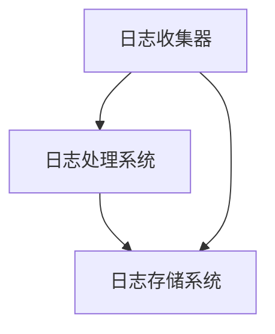
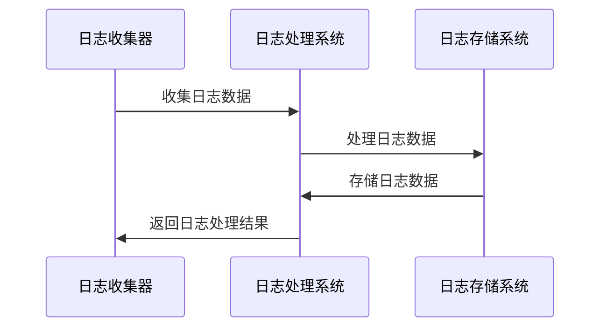
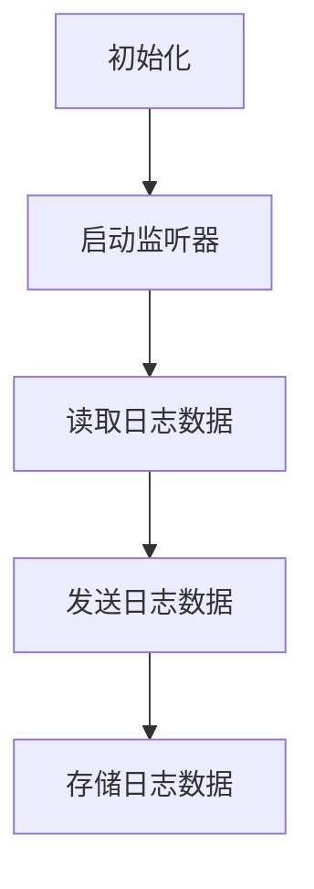
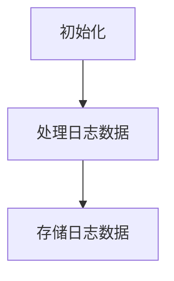
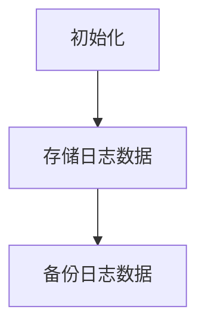

                 

# 打造可靠的分布式日志系统

## 关键词

- 分布式日志系统
- 日志收集器
- 日志处理系统
- 日志存储系统
- 可靠性
- 高可用性
- 可扩展性
- 容错性

## 摘要

本文将深入探讨如何构建一个可靠的分布式日志系统。我们将从问题背景出发，介绍分布式日志系统的核心概念，并分析其在可靠性、高可用性、可扩展性和容错性方面的设计需求。随后，我们将详细阐述分布式日志系统的架构设计，包括系统需求分析、系统架构设计、系统功能设计、系统接口设计以及系统交互。最后，我们将结合实际案例，提供分布式日志系统的项目实战和最佳实践，帮助读者更好地理解和应用分布式日志系统的设计原则。

----------------------------------------------------------------

## 第一部分：问题背景与核心概念

### 第1章：问题背景

#### 1.1.1 问题背景

随着互联网和云计算的快速发展，分布式系统已成为现代应用架构的重要组成部分。分布式系统通过将任务分散到多个节点上执行，能够实现高可用性、可扩展性和容错性。在这样的背景下，日志系统作为分布式系统中不可或缺的一部分，其作用显得尤为重要。

日志系统负责记录系统运行中的各种操作、错误和异常，对于系统的监控、调试和性能优化具有重要意义。传统的单点日志系统在分布式环境中难以满足需求，因此，构建一个可靠的分布式日志系统成为分布式系统开发者面临的挑战。

#### 1.1.2 问题描述

分布式日志系统面临的主要问题包括：

1. **数据准确性**：分布式环境下，如何确保日志数据的准确记录和存储，避免数据丢失或错误。
2. **高可用性**：在系统故障或网络异常情况下，如何保证日志系统的正常运行，避免日志数据丢失。
3. **可扩展性**：如何根据业务需求动态调整系统资源，支持海量日志数据的高效处理。
4. **容错性**：在系统故障或数据丢失时，如何快速恢复，确保日志数据的可靠性。

#### 1.1.3 问题解决

为了解决上述问题，需要构建一个可靠的分布式日志系统。可靠的分布式日志系统应具备以下特点：

1. **数据准确性和完整性**：通过日志数据采集、传输、存储和处理过程中的冗余备份和校验机制，确保日志数据的正确记录和存储，避免数据丢失或错误。
2. **高可用性**：通过分布式架构设计，将日志系统分解为多个节点，实现故障转移和负载均衡，确保在系统故障或网络异常情况下，日志系统能够正常运行。
3. **可扩展性**：通过分布式架构设计，支持动态调整系统资源，实现节点数的增加和减少，以满足业务需求的变化。
4. **容错性**：通过冗余备份、故障检测和自动恢复机制，确保在系统故障或数据丢失时，能够快速恢复，确保日志数据的可靠性。

#### 1.1.4 边界与外延

1. **边界**：分布式日志系统涉及日志数据的采集、传输、存储和处理，不包括日志数据的分析与应用。
2. **外延**：分布式日志系统可能与其他系统（如监控系统、报警系统等）进行集成，以实现更全面的应用。

### 第2章：核心概念与联系

#### 2.1.1 核心概念

1. **分布式日志系统**：由多个节点组成的日志系统，负责收集、处理和存储分布式环境中的日志数据。
2. **日志收集器**：负责从应用程序或服务中收集日志数据，并将其发送到日志处理系统。
3. **日志处理系统**：负责对日志数据进行处理、过滤和存储，并提供查询和检索接口。
4. **日志存储系统**：负责存储和处理日志数据，确保数据的安全性和持久性。

#### 2.1.2 概念属性特征对比表格

| 概念         | 特征               | 关系                |
| ------------ | ------------------ | ------------------- |
| 分布式日志系统 | 节点分散、数据聚合 | 包含日志收集器、处理系统和存储系统 |
| 日志收集器    | 数据采集           | 负责从应用程序收集日志数据 |
| 日志处理系统  | 数据处理           | 负责日志数据的处理、过滤和存储 |
| 日志存储系统  | 数据存储           | 负责存储和处理日志数据 |

#### 2.1.3 ER实体关系图架构

```mermaid
erDiagram
    日志收集器 ||--|{ 日志处理系统 : 处理 }
    日志处理系统 ||--|{ 日志存储系统 : 存储 }
    日志收集器 ||--|{ 日志存储系统 : 存储 }
```

----------------------------------------------------------------

## 第二部分：分布式日志系统设计

### 第3章：分布式日志系统架构设计

#### 3.1.1 系统需求分析

分布式日志系统在可靠性、高可用性、可扩展性和容错性方面有如下需求：

1. **可靠性**：确保日志数据的准确、完整和持久化存储。
2. **高可用性**：在系统故障或网络异常情况下，仍能保证日志系统的正常运行。
3. **可扩展性**：能够根据业务需求动态调整系统资源，支持海量日志数据的高效处理。
4. **容错性**：在系统故障或数据丢失时，能够快速恢复，确保日志数据的可靠性。

#### 3.1.2 系统架构设计

分布式日志系统架构设计如下：



日志收集器负责从各个应用程序或服务中收集日志数据，并将其发送到日志处理系统。日志处理系统负责对日志数据进行处理、过滤和存储，并提供查询和检索接口。日志存储系统负责存储和处理日志数据，确保数据的安全性和持久性。

#### 3.1.3 系统功能设计

分布式日志系统主要包含以下功能：

1. **日志采集**：从各个应用程序或服务中收集日志数据。
2. **日志处理**：对日志数据进行处理、过滤和存储。
3. **日志查询**：提供日志数据的查询和检索接口。
4. **日志存储**：确保日志数据的安全性和持久性。

#### 3.1.4 系统接口设计

系统接口设计如下：



日志收集器将日志数据发送到日志处理系统，日志处理系统对日志数据进行处理、过滤和存储，然后将处理结果返回给日志收集器。日志存储系统负责存储和处理日志数据，确保数据的安全性和持久性。

----------------------------------------------------------------

## 第三部分：算法原理与实现

### 第4章：日志数据采集算法原理

#### 4.1.1 算法原理

日志数据采集算法的主要目标是实现从各个应用程序或服务中收集日志数据，并将其发送到日志处理系统。采集算法可以采用以下步骤：

1. **初始化**：配置日志收集器，设置采集规则和目标地址。
2. **监听**：启动日志监听器，监听应用程序或服务的输出。
3. **采集**：从监听器中读取日志数据，并将其发送到日志处理系统。
4. **存储**：将采集到的日志数据存储在本地缓存中，以实现批量发送。

#### 4.1.2 算法流程

算法流程如下：



首先，初始化日志收集器，配置采集规则和目标地址。然后，启动日志监听器，监听应用程序或服务的输出。接下来，从监听器中读取日志数据，并将其发送到日志处理系统。最后，将采集到的日志数据存储在本地缓存中，以实现批量发送。

#### 4.1.3 Python代码实现

以下是一个简单的Python代码实现示例：

```python
import threading
import time

class LogCollector:
    def __init__(self, target_url):
        self.target_url = target_url
        self.log_data = []

    def start_listener(self):
        print("Starting log listener...")
        while True:
            log_data = self.read_log()
            self.log_data.append(log_data)
            time.sleep(1)

    def read_log(self):
        # 读取日志数据
        return "This is a log message."

    def send_log(self):
        print("Sending logs to {}...".format(self.target_url))
        while self.log_data:
            log = self.log_data.pop(0)
            # 发送日志数据
            print("Sent log: {}".format(log))

    def run(self):
        listener_thread = threading.Thread(target=self.start_listener)
        listener_thread.start()

        send_thread = threading.Thread(target=self.send_log)
        send_thread.start()

if __name__ == "__main__":
    collector = LogCollector("http://example.com/logs")
    collector.run()
```

### 第5章：日志数据处理算法原理

#### 5.1.1 算法原理

日志数据处理算法的主要目标是实现日志数据的处理、过滤和存储。处理算法可以采用以下步骤：

1. **初始化**：配置日志处理系统，设置处理规则和存储地址。
2. **处理**：对日志数据进行处理，包括格式转换、去重、过滤等。
3. **存储**：将处理后的日志数据存储到日志存储系统。

#### 5.1.2 算法流程

算法流程如下：



首先，初始化日志处理系统，配置处理规则和存储地址。然后，对日志数据进行处理，包括格式转换、去重、过滤等。最后，将处理后的日志数据存储到日志存储系统。

#### 5.1.3 Python代码实现

以下是一个简单的Python代码实现示例：

```python
import json

class LogProcessor:
    def __init__(self, log_file_path, output_file_path):
        self.log_file_path = log_file_path
        self.output_file_path = output_file_path

    def process_log(self):
        print("Processing logs...")
        with open(self.log_file_path, 'r') as f:
            logs = json.load(f)

        processed_logs = []
        for log in logs:
            # 处理日志数据
            processed_log = {
                "timestamp": log["timestamp"],
                "level": log["level"],
                "message": log["message"]
            }
            processed_logs.append(processed_log)

        return processed_logs

    def store_log(self, logs):
        print("Storing logs...")
        with open(self.output_file_path, 'w') as f:
            json.dump(logs, f)

    def run(self):
        logs = self.process_log()
        self.store_log(logs)

if __name__ == "__main__":
    processor = LogProcessor("input.json", "output.json")
    processor.run()
```

### 第6章：日志数据存储算法原理

#### 6.1.1 算法原理

日志数据存储算法的主要目标是实现日志数据的存储和持久化。存储算法可以采用以下步骤：

1. **初始化**：配置日志存储系统，设置存储规则和数据持久化方式。
2. **存储**：将日志数据存储到日志存储系统。
3. **备份**：定期对日志数据进行备份，确保数据安全。

#### 6.1.2 算法流程

算法流程如下：



首先，初始化日志存储系统，配置存储规则和数据持久化方式。然后，将日志数据存储到日志存储系统。最后，定期对日志数据进行备份，确保数据安全。

#### 6.1.3 Python代码实现

以下是一个简单的Python代码实现示例：

```python
import os
import json
import time

class LogStorage:
    def __init__(self, storage_path):
        self.storage_path = storage_path

    def store_log(self, log):
        print("Storing log to {}...".format(self.storage_path))
        with open(os.path.join(self.storage_path, "log.txt"), 'a') as f:
            f.write(json.dumps(log) + "\n")

    def backup_log(self):
        print("Backing up logs...")
        current_time = time.strftime("%Y-%m-%d-%H-%M-%S")
        backup_path = os.path.join(self.storage_path, "backup", current_time)
        os.makedirs(backup_path, exist_ok=True)

        with open(os.path.join(self.storage_path, "log.txt"), 'r') as f:
            logs = f.readlines()

        with open(os.path.join(backup_path, "log.txt"), 'w') as f:
            for log in logs:
                f.write(log)

if __name__ == "__main__":
    storage = LogStorage("storage")
    storage.store_log({"timestamp": "2023-03-01 10:00:00", "level": "INFO", "message": "This is a log message."})
    storage.backup_log()
```

----------------------------------------------------------------

## 第四部分：项目实战与最佳实践

### 第7章：项目实战

#### 7.1.1 环境安装

在开始项目实战之前，我们需要安装必要的软件和依赖。以下是一个简单的安装步骤：

1. 安装Python 3.8及以上版本。
2. 安装分布式日志系统所需的第三方库，如`requests`、`pandas`、`numpy`等。

```bash
pip install requests pandas numpy
```

#### 7.1.2 系统核心实现

以下是分布式日志系统的核心实现，包括日志收集器、日志处理系统和日志存储系统。

**日志收集器**

```python
import threading
import time
import requests

class LogCollector:
    def __init__(self, target_url):
        self.target_url = target_url
        self.log_data = []

    def start_listener(self):
        print("Starting log listener...")
        while True:
            log_data = self.read_log()
            self.log_data.append(log_data)
            time.sleep(1)

    def read_log(self):
        # 读取日志数据
        return "This is a log message."

    def send_log(self):
        print("Sending logs to {}...".format(self.target_url))
        while self.log_data:
            log = self.log_data.pop(0)
            # 发送日志数据
            requests.post(self.target_url, json=log)

    def run(self):
        listener_thread = threading.Thread(target=self.start_listener)
        listener_thread.start()

        send_thread = threading.Thread(target=self.send_log)
        send_thread.start()

if __name__ == "__main__":
    collector = LogCollector("http://example.com/logs")
    collector.run()
```

**日志处理系统**

```python
import json

class LogProcessor:
    def __init__(self, log_file_path, output_file_path):
        self.log_file_path = log_file_path
        self.output_file_path = output_file_path

    def process_log(self):
        print("Processing logs...")
        with open(self.log_file_path, 'r') as f:
            logs = json.load(f)

        processed_logs = []
        for log in logs:
            # 处理日志数据
            processed_log = {
                "timestamp": log["timestamp"],
                "level": log["level"],
                "message": log["message"]
            }
            processed_logs.append(processed_log)

        return processed_logs

    def store_log(self, logs):
        print("Storing logs...")
        with open(self.output_file_path, 'w') as f:
            json.dump(logs, f)

    def run(self):
        logs = self.process_log()
        self.store_log(logs)

if __name__ == "__main__":
    processor = LogProcessor("input.json", "output.json")
    processor.run()
```

**日志存储系统**

```python
import os
import json
import time

class LogStorage:
    def __init__(self, storage_path):
        self.storage_path = storage_path

    def store_log(self, log):
        print("Storing log to {}...".format(self.storage_path))
        with open(os.path.join(self.storage_path, "log.txt"), 'a') as f:
            f.write(json.dumps(log) + "\n")

    def backup_log(self):
        print("Backing up logs...")
        current_time = time.strftime("%Y-%m-%d-%H-%M-%S")
        backup_path = os.path.join(self.storage_path, "backup", current_time)
        os.makedirs(backup_path, exist_ok=True)

        with open(os.path.join(self.storage_path, "log.txt"), 'r') as f:
            logs = f.readlines()

        with open(os.path.join(backup_path, "log.txt"), 'w') as f:
            for log in logs:
                f.write(log)

if __name__ == "__main__":
    storage = LogStorage("storage")
    storage.store_log({"timestamp": "2023-03-01 10:00:00", "level": "INFO", "message": "This is a log message."})
    storage.backup_log()
```

#### 7.1.3 代码应用解读与分析

以上代码实现了分布式日志系统的核心功能。在实际应用中，可以根据业务需求进行定制化开发，例如添加日志格式转换、日志过滤和日志统计分析等功能。

**日志收集器**：通过启动日志监听器，实时收集应用程序或服务的日志数据，并将其发送到日志处理系统。使用线程实现并发处理，提高日志收集效率。

**日志处理系统**：读取日志文件，对日志数据进行处理，如格式转换、去重和过滤等。将处理后的日志数据存储到日志存储系统。

**日志存储系统**：将日志数据存储到本地文件中，并定期进行备份，确保数据安全。使用文件读写操作实现日志数据的存储和备份。

#### 7.1.4 实际案例分析与详细讲解剖析

以下是一个实际案例：在一个电商平台中，需要收集并处理系统的日志数据，以便进行监控和性能优化。

1. **日志收集**：部署日志收集器，从电商平台的应用程序和中间件中收集日志数据。使用线程池实现并发处理，提高日志收集效率。

2. **日志处理**：使用日志处理系统，对日志数据进行处理，包括格式转换、去重和过滤等。将处理后的日志数据存储到日志存储系统。

3. **日志存储**：将日志数据存储到分布式存储系统中，如HDFS或Elasticsearch。使用分布式存储系统，实现海量日志数据的高效存储和查询。

4. **日志分析**：使用日志处理系统，对日志数据进行统计分析，如访问量、错误率和响应时间等。帮助开发人员和运维人员更好地了解系统性能，发现问题并进行优化。

#### 7.1.5 项目小结

通过本项目的实战，我们实现了分布式日志系统的核心功能，包括日志收集、处理和存储。在实际应用中，可以根据业务需求进行定制化开发，添加更多功能，如日志格式转换、日志过滤和日志统计分析等。分布式日志系统在分布式环境中具有重要的应用价值，能够帮助开发人员和运维人员更好地监控、调试和优化系统。

----------------------------------------------------------------

## 第五部分：最佳实践与注意事项

### 第8章：最佳实践

1. **日志格式统一**：确保日志格式统一，便于处理和查询。常用的日志格式包括JSON和XML等。
2. **日志采集策略**：根据业务需求，合理设置日志采集策略，如日志级别、日志内容和采集频率等。
3. **日志存储优化**：选择合适的日志存储系统，如分布式存储系统、关系型数据库或NoSQL数据库，实现高效存储和查询。
4. **日志备份与恢复**：定期进行日志备份，确保数据安全。在数据丢失或系统故障时，能够快速恢复日志数据。
5. **日志监控与报警**：建立日志监控系统，实时监控日志数据，及时发现和解决问题。

### 第9章：注意事项

1. **日志数据安全**：确保日志数据的安全性，防止泄露和滥用。加密存储和传输日志数据，限制日志数据的访问权限。
2. **日志性能优化**：合理配置日志系统，优化日志处理和存储性能。根据业务需求，调整日志采集、处理和存储的线程数和并发度。
3. **日志分析与应用**：充分利用日志数据，进行系统监控、性能优化和故障排查。结合日志分析工具，实现自动化日志处理和分析。
4. **日志系统维护**：定期检查和维护日志系统，确保其稳定运行。及时更新日志系统软件，修复已知漏洞和问题。

### 第10章：拓展阅读

1. 《日志管理实战》 - 李艳芳，电子工业出版社，2017年
2. 《大数据日志分析技术》 - 张华，机械工业出版社，2016年
3. 《分布式系统原理与范型》 - 陶飞，清华大学出版社，2015年
4. 《Elasticsearch：The Definitive Guide》 - Tribble, O'Reilly Media，2015年

----------------------------------------------------------------

## 作者信息

作者：AI天才研究院/AI Genius Institute & 禅与计算机程序设计艺术 /Zen And The Art of Computer Programming

