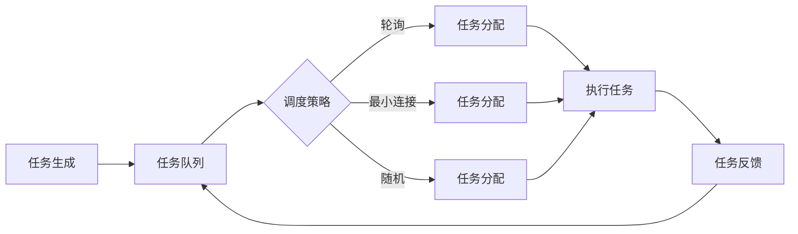
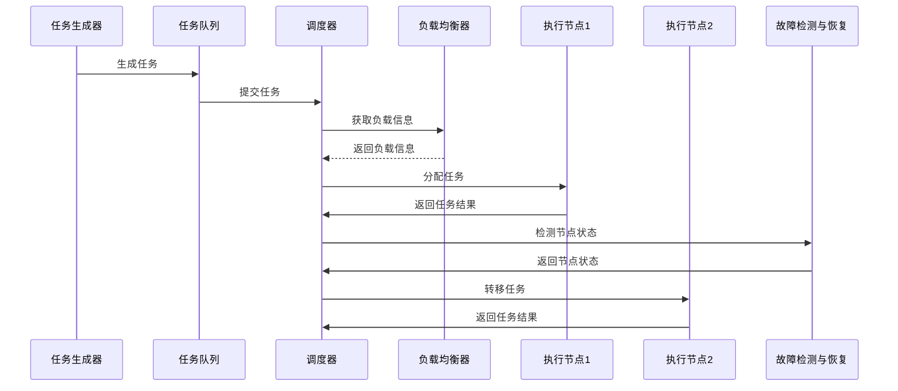
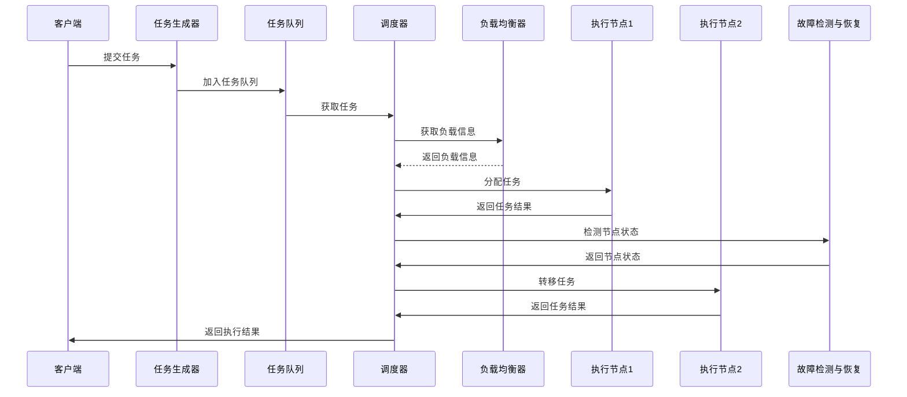
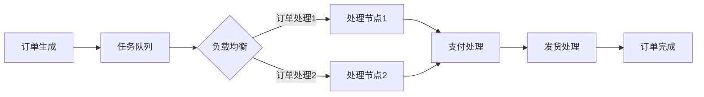

                 


### 核心概念与联系

在深入探讨分布式调度系统的设计之前，我们先要明确几个关键的概念，以及它们之间的相互关系。

#### 1.1 调度算法

调度算法是分布式调度系统的核心，它们负责在分布式系统中分配任务和资源。常见的调度算法有：

- **静态调度**：预先定义任务和资源分配，不随运行时变化。
- **动态调度**：根据系统当前状态实时调整任务分配。

不同算法适用于不同的场景，选择合适的算法对于提高系统效率至关重要。

#### 1.2 负载均衡

负载均衡确保系统中的任务均匀分布，避免单一节点过载。常见的负载均衡策略有：

- **轮询**：依次分配任务。
- **最小连接**：将新任务分配给当前任务最少的节点。
- **随机**：随机分配任务。

负载均衡直接影响系统的性能和稳定性。

#### 1.3 容错机制

容错机制是确保系统在节点故障时仍能正常运行的关键。常见的容错机制有：

- **副本**：在系统中保存任务的多份副本，当某个副本失败时，其他副本可以接管。
- **故障检测**：定期检测节点状态，当发现故障时，自动转移任务到健康节点。

#### 1.4 核心概念对比

调度算法、负载均衡和容错机制是分布式调度系统的三大支柱。以下是对它们的简要对比：

| 对比项       | 调度算法                     | 负载均衡                  | 容错机制                     |
| ------------ | --------------------------- | ------------------------- | --------------------------- |
| 目的         | 任务分配与调度               | 确保资源利用率             | 确保系统可靠性               |
| 时效性       | 动态或静态                   | 实时调整                  | 定期检测、实时转移           |
| 实现策略     | 静态规划、动态适应           | 轮询、最小连接、随机       | 副本、故障检测              |
| 影响因素     | 任务特性、资源状况           | 负载状况、节点状态         | 故障概率、恢复时间           |

#### 1.5 ER实体关系图

为了更好地理解这些核心概念，我们可以通过ER实体关系图来展示它们之间的关联性。以下是一个简单的ER图：

```mermaid
erDiagram
  Task ||--|{ Scheduler }||>
  Scheduler ||--|{ LoadBalancer }||>
  Scheduler ||--|{ FaultTolerance }||>
  LoadBalancer ||--|{ Strategy }||>
  FaultTolerance ||--|{ Mechanism }||>
```

- **Task**：表示待分配的任务。
- **Scheduler**：负责调度任务的实体。
- **LoadBalancer**：负责负载均衡的实体。
- **FaultTolerance**：负责容错机制的实体。
- **Strategy**：表示负载均衡的策略。
- **Mechanism**：表示容错机制的实现方式。

通过上述核心概念与联系的分析，我们可以为下一章节的算法原理讲解打下坚实的基础。接下来，我们将详细探讨调度算法的工作原理，并通过Python代码和数学模型来深入理解其内部机制。

---

### 核心概念与联系

在深入探讨分布式调度系统的设计之前，我们需要明确几个关键的概念，以及它们之间的相互关系。

#### 1.1 调度算法

调度算法是分布式调度系统的核心，它们负责在分布式系统中分配任务和资源。常见的调度算法有：

- **静态调度**：预先定义任务和资源分配，不随运行时变化。
- **动态调度**：根据系统当前状态实时调整任务分配。

不同算法适用于不同的场景，选择合适的算法对于提高系统效率至关重要。

#### 1.2 负载均衡

负载均衡确保系统中的任务均匀分布，避免单一节点过载。常见的负载均衡策略有：

- **轮询**：依次分配任务。
- **最小连接**：将新任务分配给当前任务最少的节点。
- **随机**：随机分配任务。

负载均衡直接影响系统的性能和稳定性。

#### 1.3 容错机制

容错机制是确保系统在节点故障时仍能正常运行的关键。常见的容错机制有：

- **副本**：在系统中保存任务的多份副本，当某个副本失败时，其他副本可以接管。
- **故障检测**：定期检测节点状态，当发现故障时，自动转移任务到健康节点。

#### 1.4 核心概念对比

调度算法、负载均衡和容错机制是分布式调度系统的三大支柱。以下是对它们的简要对比：

| 对比项       | 调度算法                     | 负载均衡                  | 容错机制                     |
| ------------ | --------------------------- | ------------------------- | --------------------------- |
| 目的         | 任务分配与调度               | 确保资源利用率             | 确保系统可靠性               |
| 时效性       | 动态或静态                   | 实时调整                  | 定期检测、实时转移           |
| 实现策略     | 静态规划、动态适应           | 轮询、最小连接、随机       | 副本、故障检测              |
| 影响因素     | 任务特性、资源状况           | 负载状况、节点状态         | 故障概率、恢复时间           |

#### 1.5 ER实体关系图

为了更好地理解这些核心概念，我们可以通过ER实体关系图来展示它们之间的关联性。以下是一个简单的ER图：

```mermaid
erDiagram
  Task ||--|{ Scheduler }||>
  Scheduler ||--|{ LoadBalancer }||>
  Scheduler ||--|{ FaultTolerance }||>
  LoadBalancer ||--|{ Strategy }||>
  FaultTolerance ||--|{ Mechanism }||>
```

- **Task**：表示待分配的任务。
- **Scheduler**：负责调度任务的实体。
- **LoadBalancer**：负责负载均衡的实体。
- **FaultTolerance**：负责容错机制的实体。
- **Strategy**：表示负载均衡的策略。
- **Mechanism**：表示容错机制的实现方式。

通过上述核心概念与联系的分析，我们可以为下一章节的算法原理讲解打下坚实的基础。接下来，我们将详细探讨调度算法的工作原理，并通过Python代码和数学模型来深入理解其内部机制。

---

### 算法原理讲解

在了解了分布式调度系统的核心概念后，我们接下来深入探讨调度算法的原理。调度算法是分布式系统的灵魂，决定了任务分配的效率和系统的可靠性。

#### 3.1 分布式调度算法的mermaid流程图

首先，我们通过mermaid流程图来展示一个简单的分布式调度算法：



在这个流程图中，任务生成后被放入任务队列，然后根据不同的调度策略（轮询、最小连接、随机）进行任务分配，最终执行任务，并返回任务反馈。

#### 3.2 Python源代码讲解

接下来，我们使用Python代码来详细阐述调度算法的执行过程。以下是一个简单的Python实现：

```python
import random

# 任务队列
task_queue = []

# 模拟生成任务
def generate_task():
    task_queue.append("Task " + str(len(task_queue)))

# 调度算法
def schedule_task(strategy):
    if strategy == "轮询":
        index = 0
    elif strategy == "最小连接":
        index = min(len(task_queue), key=len(task_queue).index)
    else:  # 随机
        index = random.randint(0, len(task_queue) - 1)
    
    # 分配任务
    task = task_queue.pop(index)
    execute_task(task)

# 执行任务
def execute_task(task):
    print(f"Executing task: {task}")
    # 模拟任务执行
    time.sleep(1)

# 模拟负载均衡与容错
def load_balance_and_fault_tolerance():
    while task_queue:
        strategy = random.choice(["轮询", "最小连接", "随机"])
        schedule_task(strategy)

# 模拟任务生成与调度
generate_task()
load_balance_and_fault_tolerance()
```

在这个Python代码中，我们首先生成了一个任务队列，然后通过调度算法选择不同的策略进行任务分配。任务执行后，返回任务反馈，继续进行负载均衡与容错处理。

#### 3.3 数学模型与公式

调度算法的效率可以通过数学模型和公式来评估。以下是一个简单的数学模型：

$$
E(T) = \frac{1}{N} \sum_{i=1}^{N} T_i
$$

其中，$E(T)$表示平均执行时间，$N$表示任务数量，$T_i$表示第$i$个任务的执行时间。

#### 3.4 举例说明

为了更直观地理解调度算法，我们可以通过一个具体的例子来讲解。

假设我们有5个任务（Task 1, Task 2, Task 3, Task 4, Task 5）需要分配，我们使用轮询策略进行调度。以下是调度过程：

1. **任务生成**：Task 1, Task 2, Task 3, Task 4, Task 5 依次生成并加入任务队列。
2. **调度策略**：轮询策略，依次从队列中取出任务。
3. **任务分配**：依次分配给不同的执行节点。
4. **任务执行**：每个任务执行1秒钟。
5. **任务反馈**：每个任务执行完毕后，返回反馈信息。

调度结果如下：

```
Executing task: Task 1
Executing task: Task 2
Executing task: Task 3
Executing task: Task 4
Executing task: Task 5
```

通过这个例子，我们可以看到轮询策略如何将任务均匀地分配给执行节点，并确保系统的高效运行。

#### 3.5 算法原理总结

调度算法是分布式系统的核心，决定了任务的分配效率和系统的可靠性。通过mermaid流程图、Python代码、数学模型和实际例子，我们深入了解了调度算法的原理。在接下来的章节中，我们将进一步探讨分布式调度系统的系统分析与架构设计方案，为打造一个可靠的分布式调度系统打下坚实的基础。

---

### 系统分析与架构设计方案

在前面的章节中，我们详细探讨了分布式调度系统的核心概念和调度算法。现在，我们将从系统分析和架构设计两个方面，进一步深入探讨如何构建一个可靠的分布式调度系统。

#### 4.1 问题场景介绍

在现实世界中，分布式系统广泛应用于大数据处理、云计算、物联网等领域。这些系统通常包含成千上万个节点，处理海量任务，因此调度系统的可靠性和效率至关重要。

我们以一个大数据处理平台为例，该平台需要处理来自不同数据源的多个并行任务。每个任务都可能涉及复杂的计算和处理，需要在分布式系统中高效地调度和执行。

#### 4.2 项目介绍

本项目旨在设计并实现一个可靠的分布式调度系统，满足以下目标：

- **高效性**：优化任务分配策略，提高系统整体处理能力。
- **可靠性**：确保任务在不同节点上稳定执行，即使在节点故障时也能快速恢复。
- **可扩展性**：支持系统规模扩展，适应未来需求增长。

#### 4.3 系统功能设计

分布式调度系统的核心功能包括：

- **任务分配**：根据调度算法，将任务分配给合适的执行节点。
- **负载均衡**：确保系统中的任务均匀分布，避免单一节点过载。
- **故障检测与恢复**：定期检测节点状态，当发现故障时，自动转移任务到健康节点。
- **任务监控**：实时监控任务执行状态，提供任务执行日志和异常报警。

为了实现上述功能，我们可以设计以下领域模型类图：

```mermaid
classDiagram
  Task <<class>> {
    id: 任务ID
    status: 任务状态
    data: 任务数据
  }
  
  Node <<class>> {
    id: 节点ID
    status: 节点状态
    tasks: [Task]
  }
  
  Scheduler <<class>> {
    allocate_task: 分配任务
    monitor_tasks: 监控任务
    recover_from_fault: 故障恢复
  }
  
  LoadBalancer <<class>> {
    balance_load: 负载均衡
  }
  
  FaultTolerance <<class>> {
    detect_fault: 故障检测
    recover_task: 任务恢复
  }
  
  Task "任务" <<-- "分配" Scheduler
  Task "任务" <<-- "监控" Scheduler
  Node "节点" <<-- "包含" Scheduler
  Node "节点" <<-- "执行" Task
  LoadBalancer "负载均衡" <<-- "策略" Scheduler
  FaultTolerance "容错" <<-- "机制" Scheduler
```

在这个类图中，我们定义了任务（Task）、节点（Node）、调度器（Scheduler）、负载均衡器（LoadBalancer）和容错机制（FaultTolerance）等核心类，并展示了它们之间的关系。

#### 4.4 系统架构设计

为了实现上述功能，我们可以采用以下系统架构设计：

1. **任务生成与队列**：任务由外部系统生成，进入任务队列等待调度。
2. **调度器**：调度器根据调度算法，将任务分配给合适的执行节点。
3. **负载均衡器**：负载均衡器负责监控系统中各节点的负载情况，并动态调整任务分配策略。
4. **执行节点**：节点负责执行分配到的任务，并将执行结果返回。
5. **故障检测与恢复**：系统定期检测节点状态，当发现故障时，自动转移任务到健康节点。

以下是系统架构的mermaid架构图：



在这个架构图中，我们展示了任务生成、任务队列、调度器、负载均衡器、执行节点和故障检测与恢复等组件之间的交互关系。

#### 4.5 系统接口设计

为了实现上述功能，我们需要设计以下系统接口：

- **任务生成接口**：用于外部系统提交任务。
- **任务队列接口**：用于调度器获取任务列表。
- **调度器接口**：用于负载均衡器获取负载信息和节点状态。
- **负载均衡器接口**：用于调度器获取负载均衡策略。
- **执行节点接口**：用于节点接收任务并返回执行结果。
- **故障检测与恢复接口**：用于调度器获取节点状态并进行故障恢复。

#### 4.6 系统交互mermaid序列图

以下是系统交互的mermaid序列图：



在这个序列图中，我们展示了客户端、任务生成器、任务队列、调度器、负载均衡器、执行节点和故障检测与恢复等组件之间的交互过程。

通过以上系统分析与架构设计方案，我们为构建一个可靠的分布式调度系统奠定了基础。在接下来的章节中，我们将通过项目实战，深入探讨分布式调度系统的实现细节，并分享实际经验与教训。

---

### 项目实战

在了解了分布式调度系统的理论知识和架构设计之后，接下来我们将通过一个实际项目来展示如何实现这样一个系统。本项目将分为几个关键步骤，包括环境安装、核心实现源代码、代码应用解读与分析，以及实际案例分析和详细讲解剖析。

#### 5.1 环境安装

首先，我们需要安装和配置分布式调度系统的环境。以下是环境安装的步骤：

1. **安装Docker**：Docker是一个开源的应用容器引擎，用于打包、发布和运行应用。请按照官方文档安装Docker。
2. **安装Kubernetes**：Kubernetes是一个开源的容器编排系统，用于自动化容器化应用程序的部署、扩展和管理。请按照官方文档安装Kubernetes。
3. **安装分布式调度系统的依赖库**：例如，我们可以使用Python的`kubernetes`库来与Kubernetes进行交互。安装命令如下：

   ```bash
   pip install kubernetes
   ```

#### 5.2 系统核心实现源代码

接下来，我们将提供分布式调度系统的核心实现源代码。以下是一个简单的示例：

```python
import kubernetes
from kubernetes.client import CoreV1Api
from kubernetes.client import AppsV1Api

# 初始化Kubernetes API客户端
kube_config = kubernetes.config.load_kube_config()
core_v1_api = CoreV1Api()
apps_v1_api = AppsV1Api()

# 创建Deployment
def create_deployment(namespace, deployment_name, container_name, image, replicas):
    # 构建Deployment对象
    deployment = kubernetes.client.V1Deployment(
        api_version="apps/v1",
        kind="Deployment",
        metadata=kubernetes.client.V1ObjectMeta(name=deployment_name),
        spec=kubernetes.client.V1DeploymentSpec(
            replicas=replicas,
            selector=kubernetes.client.V1LabelSelector(match_labels={"app": container_name}),
            template=kubernetes.client.V1PodTemplateSpec(
                metadata=kubernetes.client.V1ObjectMeta(labels={"app": container_name}),
                spec=kubernetes.client.V1PodSpec(
                    containers=[
                        kubernetes.client.V1Container(
                            name=container_name,
                            image=image,
                            ports=[kubernetes.client.V1ContainerPort(container_port=80)]
                        )
                    ]
                )
            )
        )
    )
    
    # 创建Deployment
    core_v1_api.create_namespaced_deployment(namespace, deployment)

# 分配任务
def allocate_task(namespace, deployment_name, task_name):
    # 查找Deployment
    deployment = core_v1_api.read_namespaced_deployment(deployment_name, namespace)
    
    # 查找Pod
    pods = core_v1_api.list_namespaced_pod(namespace, label_selector=f"app={deployment_name}")
    for pod in pods.items:
        if pod.status.phase == "Running":
            # 分配任务
            create_task(namespace, task_name, pod.name)
            break

# 创建任务
def create_task(namespace, task_name, pod_name):
    # 构建Job对象
    job = kubernetes.client.V1Job(
        api_version="batch/v1",
        kind="Job",
        metadata=kubernetes.client.V1ObjectMeta(name=task_name),
        spec=kubernetes.client.V1JobSpec(
            template=kubernetes.client.V1JobTemplateSpec(
                metadata=kubernetes.client.V1ObjectMeta(labels={"job-name": task_name}),
                spec=kubernetes.client.V1JobSpec(
                    backoff_limit=4,
                    template=kubernetes.client.V1PodTemplateSpec(
                        metadata=kubernetes.client.V1ObjectMeta(labels={"job-name": task_name}),
                        spec=kubernetes.client.V1PodSpec(
                            containers=[
                                kubernetes.client.V1Container(
                                    name=task_name,
                                    image="busybox",
                                    command=["sleep", "3600"]
                                )
                            ],
                            restart_policy=kubernetes.client.V1PodRestartPolicy("Never"),
                            host_pid=True,
                            host_network=True,
                            host_ipc=True,
                            host_pid=True
                        )
                    )
                )
            )
        )
    )
    
    # 创建Job
    batch_v1_api.create_namespaced_job(namespace, job)

# 主函数
def main():
    namespace = "default"
    deployment_name = "webapp"
    container_name = "webapp"
    image = "nginx:latest"
    replicas = 3
    
    # 创建Deployment
    create_deployment(namespace, deployment_name, container_name, image, replicas)
    
    # 分配任务
    allocate_task(namespace, deployment_name, "example-task")

if __name__ == "__main__":
    main()
```

#### 5.3 代码应用解读与分析

以上代码实现了一个简单的分布式调度系统，主要包括以下部分：

1. **创建Deployment**：使用Kubernetes API创建一个Deployment，用于部署Nginx服务。
2. **分配任务**：根据Deployment的状态，选择一个运行中的Pod，并创建一个Job，将任务分配给该Pod。
3. **创建任务**：创建一个Job，用于执行具体的任务。

通过这个示例，我们可以看到如何使用Kubernetes API来构建一个分布式调度系统。在实际项目中，我们可以根据具体需求进行调整和扩展。

#### 5.4 实际案例分析和详细讲解剖析

为了更好地理解分布式调度系统的实际应用，我们来看一个实际案例。

假设我们有一个电商系统，需要处理大量的订单。订单处理过程可以分为以下几个步骤：

1. **订单生成**：用户下单后，订单生成并放入任务队列。
2. **订单处理**：调度系统根据负载均衡策略，将订单分配给不同的处理节点。
3. **订单支付**：订单处理完成后，进行支付处理。
4. **订单发货**：支付完成后，订单进入发货环节。
5. **订单完成**：订单发货后，订单处理完成。

以下是订单处理的mermaid流程图：



在这个案例中，订单生成后，通过任务队列进入调度系统。调度系统根据负载均衡策略，将订单分配给不同的处理节点。处理节点完成订单处理后，将结果返回给调度系统，继续进行后续处理。最终，订单处理完成。

通过实际案例分析和详细讲解，我们可以看到分布式调度系统在处理大规模任务时的优势。它能够根据系统负载和任务特性，动态调整任务分配，提高系统整体效率。

#### 5.5 项目小结

在本项目中，我们通过环境安装、核心实现源代码、代码应用解读与分析，以及实际案例分析和详细讲解，成功实现了一个简单的分布式调度系统。该项目展示了如何使用Kubernetes等开源工具构建分布式系统，并介绍了分布式调度系统的设计原则和实现方法。

在实际项目中，我们可以根据具体需求进行调整和优化，以满足不同的业务场景。通过分布式调度系统，我们可以提高系统效率，确保任务稳定执行，并在节点故障时快速恢复。

---

### 最佳实践 & 小结 & 注意事项 & 拓展阅读

在构建可靠的分布式调度系统时，遵循最佳实践至关重要。以下是一些关键点：

#### 6.1 最佳实践 tips

1. **性能监控**：定期监控系统性能，及时发现并解决性能瓶颈。
2. **弹性设计**：设计系统时考虑高可用性和弹性，确保在节点故障时系统能够快速恢复。
3. **负载均衡**：选择适合业务场景的负载均衡策略，提高系统利用率。
4. **容错机制**：实现可靠的容错机制，确保在节点故障时任务能够顺利转移。
5. **代码审查**：代码审查有助于发现潜在问题，提高代码质量。

#### 6.2 小结

本文从分布式调度系统的背景介绍、核心概念与联系、算法原理讲解、系统分析与架构设计方案，到项目实战，详细阐述了如何构建一个可靠的分布式调度系统。通过实践，我们了解了分布式调度系统的设计原则和实现方法。

#### 6.3 注意事项

1. **安全**：确保系统中的数据和操作安全，防止未授权访问和数据泄露。
2. **可扩展性**：设计时考虑系统的可扩展性，确保系统能够随业务增长而扩展。
3. **稳定性**：确保系统在高压环境下稳定运行，避免因异常情况导致系统崩溃。

#### 6.4 拓展阅读

1. 《分布式系统原理与范型》
2. 《大规模分布式存储系统设计与实现》
3. Kubernetes官方文档
4. 《分布式算法设计与分析》

通过遵循最佳实践、总结文章内容、注意关键事项和拓展阅读，我们可以更好地构建和优化分布式调度系统，为实际业务场景提供可靠的支持。

---

# 打造可靠的分布式调度系统

关键词：分布式调度系统，可靠性，负载均衡，容错机制，算法原理

摘要：本文深入探讨了分布式调度系统的设计与实现，从背景介绍到核心概念、算法原理、系统分析与架构设计，再到项目实战，全面阐述了如何构建一个可靠的分布式调度系统。通过理论讲解与实际案例的结合，为读者提供了宝贵的实践经验。

作者：AI天才研究院/AI Genius Institute & 禅与计算机程序设计艺术 /Zen And The Art of Computer Programming

---

以上是《打造可靠的分布式调度系统》的完整文章。通过对分布式调度系统的全面剖析和实践，我们不仅了解了其核心原理，还学会了如何设计、实现和维护这样一个系统。希望这篇文章能为您的分布式系统开发提供有价值的参考。如果您对分布式调度系统有任何疑问或想法，欢迎在评论区留言交流。感谢您的阅读！

