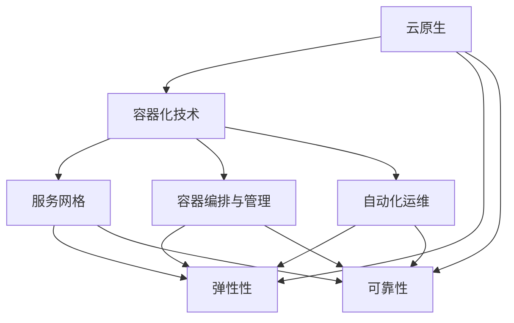
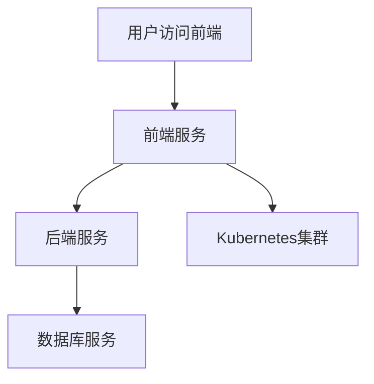
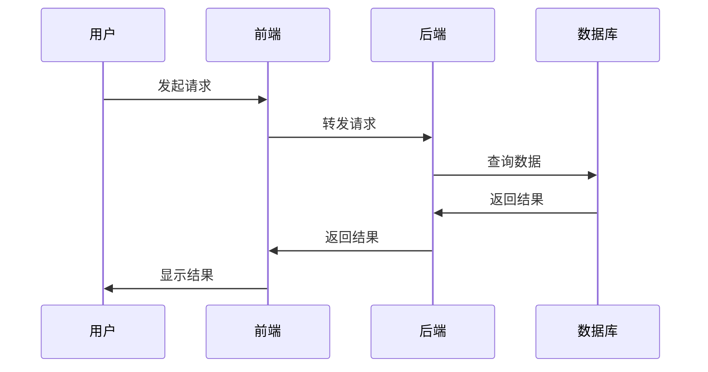

                 

### 1.1 问题背景

#### 1.1.1 云原生应用的发展现状

近年来，随着云计算、虚拟化、容器化等技术的快速发展，云原生应用逐渐成为企业数字化转型的主流选择。云原生应用具有轻量级、高可扩展性、自动化程度高等特点，能够在云环境中实现快速部署、弹性伸缩和高效运维。根据Gartner的报告，全球云原生应用市场预计将在2023年达到750亿美元，未来几年将保持快速增长。

#### 1.1.2 弹性可靠的重要性

在云原生环境下，由于资源的动态分配和按需使用，弹性可靠性成为衡量应用性能和用户体验的重要指标。弹性指的是系统在面临高负载或故障时，能够自动扩展或缩减资源，确保服务的连续性和稳定性。可靠性则体现在系统在长时间运行过程中，能够保持稳定的性能和服务质量。

#### 1.1.3 云原生应用平台的需求与挑战

随着云原生应用的普及，企业对云原生应用平台的需求日益增长。云原生应用平台需要具备以下特性：

- **高可用性**：平台应能实现快速故障恢复，确保服务不中断。
- **可扩展性**：平台应能支持水平扩展，满足业务快速增长的需求。
- **自动化运维**：平台应具备自动化部署、监控、运维等功能，降低运维成本。

然而，构建一个弹性可靠的云原生应用平台也面临着诸多挑战：

- **技术复杂性**：云原生涉及多种技术，包括容器化、服务网格、自动化运维等，技术选型和管理难度较大。
- **安全性**：云原生应用往往需要跨云部署，安全性成为关键问题。
- **运维成本**：自动化虽然可以降低运维成本，但初始部署和运维管理仍需大量人力和时间投入。

综上所述，构建一个弹性可靠的云原生应用平台对于企业数字化转型具有重要意义，但同时也面临着一系列挑战。

### 1.2 书籍概述

#### 1.2.1 书籍目标读者

本书旨在为IT从业者、技术管理者、架构师和开发人员提供系统化的云原生应用平台建设指南。无论您是初学者还是经验丰富的从业者，都将从本书中获益。具体目标读者包括：

- **IT从业者**：希望了解云原生技术并应用于实际工作的专业人士。
- **技术管理者**：负责技术团队管理和项目实施的技术主管。
- **架构师**：负责技术选型和系统架构设计的高级工程师。
- **开发人员**：负责开发、测试和运维的工程师。

#### 1.2.2 书籍结构安排

本书结构分为以下几个部分：

1. **引言**：介绍云原生应用的发展背景、弹性可靠性的重要性以及本书的目标和结构。
2. **核心概念与联系**：解析云原生、容器化技术、服务网格、容器编排与管理等核心概念，并通过联系图展示各概念之间的关系。
3. **建立弹性可靠的云原生应用平台**：详细讲解设计原则、架构设计和实施步骤，帮助读者理解并实现一个弹性可靠的云原生应用平台。
4. **实现弹性可靠性的关键技术**：深入探讨容器化技术、Docker、Kubernetes等关键技术，提供实际应用案例。
5. **项目实战**：通过具体项目案例，演示云原生应用平台的建设过程，分享实战经验和最佳实践。
6. **小结与拓展阅读**：总结本书的核心内容，并提供拓展阅读资源。

#### 1.2.3 书籍主要内容与特色

本书的主要特色包括：

- **系统化**：从核心概念到实际应用，全面覆盖云原生应用平台建设的各个环节。
- **实战性**：结合实际项目案例，讲解关键技术与应用场景，帮助读者快速掌握实践技能。
- **深入浅出**：以通俗易懂的语言，深入剖析技术原理，使读者能够轻松理解并应用于实际工作。
- **互动性强**：提供丰富的练习题和拓展阅读，鼓励读者积极思考和探索。

通过阅读本书，读者将能够全面了解云原生应用平台的建设方法和技术要点，为企业在云原生时代的技术创新和业务发展提供有力支持。

### 1.3 本章小结

本章首先介绍了云原生应用的发展背景和弹性可靠性的重要性，然后概述了本书的目标读者、结构安排和主要内容。通过本章的学习，读者可以对云原生应用平台有一个整体的认识，为后续章节的深入学习打下基础。在接下来的章节中，我们将逐步深入探讨云原生应用平台的核心概念和关键技术，帮助读者系统地构建和优化云原生应用平台。希望通过本章的介绍，读者能够明确学习目标，激发对云原生技术的兴趣，为后续内容的学习做好充分准备。

---

### 2.1 云原生概念解析

#### 2.1.1 定义与起源

云原生（Cloud-Native）是一个相对较新的概念，最早由Pivotal和Google等公司提出。云原生指的是一种应用程序的开发和运行方式，使得这些应用程序能够充分利用云计算提供的资源和服务。具体来说，云原生应用具有以下几个核心特征：

1. **微服务架构**：将应用拆分为多个独立的微服务，每个服务负责一个特定的功能，服务之间通过API进行通信。
2. **容器化**：使用容器（如Docker）封装应用及其依赖环境，确保应用在不同的环境中运行时具有一致性和可移植性。
3. **动态管理**：通过自动化工具（如Kubernetes）对容器进行动态管理，实现应用的自动部署、伸缩和恢复。
4. **自动化**：通过持续集成/持续部署（CI/CD）工具，实现自动化构建、测试和部署，提高开发效率。
5. **服务网格**：采用服务网格（如Istio）来管理服务间的通信，确保通信的安全性和稳定性。

云原生起源于云计算的发展，在2010年前后，随着虚拟化、容器化和自动化工具的兴起，云原生思想逐渐得到认可和推广。2015年，Cloud Native Computing Foundation（CNCF）成立，标志着云原生技术进入了一个新的发展阶段。

#### 2.1.2 云原生特点

云原生应用与传统应用相比，具有以下几个显著特点：

1. **敏捷性**：云原生应用能够快速响应市场需求，通过微服务架构和自动化工具实现快速开发和部署。
2. **可扩展性**：云原生应用能够根据负载需求动态扩展或缩减资源，实现水平和垂直扩展。
3. **高可用性**：通过容器化技术和服务网格管理，云原生应用具有更高的可靠性和稳定性，能够在故障发生时快速恢复。
4. **可移植性**：容器化技术使得云原生应用可以在不同的环境中运行，包括本地、云和混合云。
5. **安全性**：云原生应用采用微隔离和安全通信，提高了整体安全性。

#### 2.1.3 云原生与传统架构对比

云原生与传统架构在多个方面存在显著差异，以下为详细对比：

1. **架构风格**：
   - **传统架构**：通常采用单体的应用程序，所有功能模块紧密耦合，难以独立部署和扩展。
   - **云原生架构**：采用微服务架构，将应用程序拆分为多个独立的微服务，每个服务可以独立部署和扩展。

2. **部署与运维**：
   - **传统架构**：部署通常涉及物理服务器或虚拟机，需要手工配置和管理环境，运维成本高。
   - **云原生架构**：使用容器化技术，通过自动化工具实现应用的自动化部署、监控和运维，降低运维成本。

3. **资源利用**：
   - **传统架构**：资源利用率低，往往需要预留大量资源以应对峰值负载。
   - **云原生架构**：通过动态伸缩，能够根据实际负载动态调整资源，提高资源利用率。

4. **可靠性**：
   - **传统架构**：可靠性依赖于物理硬件和操作系统的稳定性，故障恢复时间长。
   - **云原生架构**：采用容器化和服务网格技术，能够快速检测和恢复故障，提高系统可靠性。

5. **安全性**：
   - **传统架构**：安全性主要依赖于防火墙和网络隔离，微服务间的通信安全性较低。
   - **云原生架构**：采用微隔离和安全通信，确保每个微服务之间的通信安全，同时提高整体系统的安全性。

综上所述，云原生与传统架构在架构风格、部署与运维、资源利用、可靠性和安全性等方面存在显著差异。云原生架构的优势在于其敏捷性、可扩展性、高可用性和可移植性，这使得企业在面对快速变化的市场需求时，能够更加灵活和高效地进行技术选型和业务发展。

### 2.2 弹性可靠性概述

#### 2.2.1 弹性性的定义与实现

弹性（Resilience）是指在面临外部扰动或内部故障时，系统保持正常运行和服务质量的能力。在云原生应用中，弹性尤为重要，因为云环境中的资源动态变化，负载波动频繁，系统需要能够适应这些变化，保证服务的连续性和稳定性。

弹性可以分为横向扩展（Scaling Out）和纵向扩展（Scaling Up）：

- **横向扩展**：通过增加更多的实例来提高系统的处理能力，例如，当负载增加时，可以自动部署更多容器实例来处理请求。
- **纵向扩展**：通过增加单个实例的硬件资源（如CPU、内存）来提高系统的处理能力，例如，当负载增加时，可以增加容器的CPU或内存限制。

实现弹性通常依赖于以下技术和工具：

- **容器编排系统**：如Kubernetes，可以自动化部署、管理和伸缩容器实例。
- **云服务提供商**：如AWS、Azure和Google Cloud，提供了弹性伸缩服务，可以根据实际负载自动调整资源。
- **自动扩展策略**：可以根据CPU使用率、网络请求率等指标自动调整容器实例的数量。

#### 2.2.2 可靠性的定义与实现

可靠性（Reliability）是指系统在长时间运行过程中，保持稳定性和可靠性的能力。可靠性对于云原生应用至关重要，因为云原生环境中的故障是常态，系统需要能够快速检测和恢复故障，确保服务的连续性。

实现可靠性的关键技术和方法包括：

- **故障转移**（Fault Migration）：当主实例发生故障时，能够自动切换到备用实例，确保服务不中断。
- **数据备份与恢复**：定期备份数据，并在发生数据丢失或损坏时能够快速恢复。
- **网络容错**：设计冗余的网络连接和路径，确保在网络故障时能够切换到其他路径。

常见实现可靠性的工具和技术包括：

- **高可用集群**：使用多个节点构成集群，通过心跳信号和选举机制确保集群中的主节点发生故障时能够快速切换。
- **分布式存储系统**：如Cassandra、HDFS等，提供了高可用性和数据一致性保障。
- **故障检测与恢复系统**：如Prometheus、Zabbix等，可以监控系统的健康状态，并在检测到故障时自动触发恢复流程。

#### 2.2.3 弹性与可靠性之间的关系

弹性与可靠性是云原生应用的两个重要方面，它们之间存在密切的联系和相互作用：

- **相互依赖**：弹性是可靠性的保障，只有具备弹性，系统才能在面临故障时快速恢复。同样，可靠性是弹性的前提，如果系统本身不够可靠，那么即使具备弹性，也无法保证服务的连续性。
- **共同目标**：弹性和可靠性都是为了确保系统在面临外部扰动时能够保持正常运行，保障用户体验和服务质量。
- **平衡与优化**：在设计和实现云原生应用平台时，需要在弹性和可靠性之间寻找平衡点。过于追求弹性可能会导致系统复杂性增加，可靠性降低；而过于追求可靠性可能会限制系统的扩展能力。

综上所述，弹性与可靠性是云原生应用的两个核心要素，相互依赖、共同目标，需要在设计和实现过程中综合考虑和优化。

### 2.3 云原生应用平台关键组件

#### 2.3.1 容器化技术

容器化技术是云原生应用的核心基础，它通过将应用程序及其依赖环境封装在一个独立的容器中，实现应用程序的轻量级部署和高效管理。以下是容器化技术的一些关键概念：

- **容器**：容器是一种轻量级、可执行的软件包，包含了应用程序、库、环境变量、配置文件等所有必需的组件。容器在运行时与宿主机共享操作系统内核，但彼此隔离，确保应用程序之间的独立性。
- **Docker**：Docker是容器化技术的代表，它提供了一个简单的、轻量级的容器化平台。Docker使用Dockerfile定义容器的构建过程，并使用Docker Compose管理多容器应用。
- **容器编排**：容器编排是指通过自动化工具（如Kubernetes）对容器进行部署、管理和伸缩的过程。容器编排系统提供了灵活的部署策略和资源管理，确保容器应用的高可用性和可扩展性。

容器化技术的好处包括：

- **轻量级**：容器与宿主机共享操作系统内核，因此比虚拟机更轻量级，启动速度快，资源利用率高。
- **可移植性**：容器可以在不同的操作系统和硬件上运行，确保应用程序的可移植性和一致性。
- **隔离性**：容器提供了良好的隔离性，确保应用程序之间的资源和数据不会相互干扰。
- **自动化**：容器化技术结合了自动化工具，可以实现自动化部署、监控和管理，提高开发效率和运维管理能力。

#### 2.3.2 服务网格

服务网格（Service Mesh）是一种新兴的技术架构，用于管理和服务间的通信。它通过将服务间的通信抽象出来，提供了一种灵活、可扩展的服务发现、服务监控和安全通信机制。以下是服务网格的一些关键概念：

- **服务网格**：服务网格是一种基础设施层，用于管理服务间的通信。它将服务间的通信独立出来，使开发者可以专注于业务逻辑的开发，而无需关心网络通信的细节。
- **Istio**：Istio是一种开源的服务网格实现，它提供了一个全面的服务发现、服务监控和安全通信解决方案。Istio通过智能路由、断路器、监控和日志等功能，提高了服务的可靠性和安全性。
- **服务间通信**：服务网格通过虚拟服务（Virtual Service）和目标规则（Destination Rule）来定义服务间的通信规则，确保服务间的请求能够被正确路由和处理。

服务网格的好处包括：

- **透明性**：服务网格对开发者透明，无需修改业务代码，即可实现服务间的通信管理和监控。
- **可扩展性**：服务网格提供了灵活的路由规则和监控功能，可以轻松扩展和优化服务间通信。
- **安全性**：服务网格提供了细粒度的安全策略，确保服务间的通信安全，防止内部和外部攻击。
- **监控与日志**：服务网格提供了丰富的监控和日志功能，可以帮助开发者快速定位和解决服务间的问题。

#### 2.3.3 容器编排与管理

容器编排与管理是云原生应用平台的核心功能之一，它负责管理容器的生命周期，包括部署、启动、停止、伸缩和监控。以下是容器编排与管理的一些关键概念：

- **Kubernetes**：Kubernetes是当前最流行的容器编排系统，它提供了一组自动化工具，用于管理容器的部署、监控和伸缩。Kubernetes通过定义部署（Deployment）、服务（Service）和存储卷（Volume）等资源对象，实现了容器的自动化管理。
- **部署策略**：Kubernetes提供了多种部署策略，如滚动更新（Rolling Update）和蓝绿部署（Blue-Green Deployment），确保在更新应用时不会影响服务的可用性。
- **监控与日志**：Kubernetes集成了Prometheus、Grafana等监控工具，提供了实时的监控和告警功能。同时，Kubernetes还集成了Fluentd、Logstash等日志收集工具，实现了容器日志的集中管理和分析。

容器编排与管理的好处包括：

- **自动化**：容器编排系统自动化了容器的部署、管理和监控，减少了手动操作，提高了运维效率。
- **高可用性**：容器编排系统提供了多种部署策略和故障转移机制，确保服务的连续性和稳定性。
- **可扩展性**：容器编排系统支持横向和纵向扩展，可以根据负载需求动态调整容器数量和资源。
- **灵活性**：容器编排系统提供了丰富的资源和策略配置，开发者可以根据需求自定义容器的部署和管理。

#### 2.3.4 自动化运维

自动化运维是云原生应用平台的重要特性之一，它通过自动化工具和流程，实现应用的自动化部署、监控和运维，降低运维成本，提高运维效率。以下是自动化运维的一些关键概念：

- **CI/CD**：持续集成/持续部署（Continuous Integration/Continuous Deployment，简称CI/CD）是一种软件开发实践，通过自动化工具实现代码的集成、测试和部署。CI/CD可以提高开发效率，减少代码缺陷，加快新功能的发布。
- **Jenkins**：Jenkins是一个开源的CI/CD工具，它可以自动化构建、测试和部署应用程序。Jenkins提供了丰富的插件，可以与其他工具集成，实现复杂的自动化流程。
- **Prometheus**：Prometheus是一种开源的监控解决方案，它可以采集系统的监控数据，并提供实时的监控仪表板和告警功能。Prometheus通过拉取式监控，可以监控各种类型的系统和应用程序。

自动化运维的好处包括：

- **效率提升**：自动化运维减少了手动操作，提高了运维效率，降低了运维成本。
- **稳定性保障**：自动化工具可以实时监控系统的健康状态，并在检测到问题时自动触发恢复流程，确保服务的连续性和稳定性。
- **快速响应**：自动化运维可以快速响应业务需求，实现快速部署和更新，加快新功能的发布。
- **数据驱动**：自动化运维提供了丰富的监控数据，可以帮助开发者和分析人员深入了解系统的运行状况，优化系统性能。

综上所述，容器化技术、服务网格、容器编排与管理、自动化运维是云原生应用平台的关键组件，它们共同构建了一个高效、可靠和可扩展的应用平台，为企业在云原生时代的技术创新和业务发展提供了有力支持。

### 2.4 关键概念联系图

为了更好地理解云原生应用平台中的关键概念及其关系，我们通过Mermaid流程图来展示这些概念之间的联系。



在这个联系图中，云原生（A）是核心概念，它通过容器化技术（B）、服务网格（C）、容器编排与管理（D）和自动化运维（E）实现弹性（F）和可靠性（G）。容器化技术、服务网格、容器编排与管理和自动化运维都是实现云原生应用的关键组件，它们相互协作，共同保障应用的高可用性和可靠性。

### 3.1 设计原则与策略

#### 3.1.1 设计原则

在构建一个弹性可靠的云原生应用平台时，需要遵循以下设计原则：

1. **可扩展性**：设计应考虑水平扩展和垂直扩展的能力，以应对业务需求的快速增长和资源波动的挑战。
2. **自动化**：通过自动化工具和流程，实现应用的自动化部署、监控和管理，降低人工操作，提高运维效率。
3. **高可用性**：确保应用能够在面对故障时快速恢复，减少服务中断时间，提供稳定的服务质量。
4. **安全性**：设计应充分考虑数据安全和通信安全，采用适当的安全策略和工具，保护系统的安全性。
5. **可维护性**：设计应便于系统维护和升级，确保代码可读性、模块化和良好的文档。

#### 3.1.2 弹性设计策略

1. **横向扩展**：通过增加更多实例来提高系统的处理能力。当负载增加时，可以自动部署更多容器实例来处理请求。
2. **纵向扩展**：通过增加单个实例的硬件资源（如CPU、内存）来提高系统的处理能力。当负载增加时，可以调整容器的资源限制。
3. **容量预留与动态伸缩**：在系统设计时，预留一定的资源容量，并根据实际负载动态调整资源。使用自动化工具和策略（如Kubernetes的Horizontal Pod Autoscaler）实现动态伸缩。

#### 3.1.3 可靠性策略

1. **故障转移**：在主实例发生故障时，能够自动切换到备用实例，确保服务的连续性。可以使用高可用集群和故障检测工具（如Zookeeper、Consul）来实现故障转移。
2. **数据备份与恢复**：定期备份数据，并确保在数据丢失或损坏时能够快速恢复。可以使用分布式存储系统（如Cassandra、HDFS）和备份工具（如Snapshots、备份代理）来实现数据备份与恢复。
3. **网络容错**：设计冗余的网络连接和路径，确保在网络故障时能够切换到其他路径。可以使用网络冗余设计、负载均衡器和DNS切换来实现网络容错。

通过遵循这些设计原则和策略，可以构建一个既具有弹性又可靠的云原生应用平台，满足企业在云原生时代的业务需求和技术挑战。

### 3.2 架构设计

#### 3.2.1 整体架构设计

构建一个弹性可靠的云原生应用平台需要综合考虑业务需求、技术选型和资源管理等多个方面。以下是整体架构设计的详细说明：

##### 3.2.1.1 架构设计目标

1. **高可用性**：确保服务在任何情况下都能稳定运行，减少故障对业务的影响。
2. **高可扩展性**：能够根据业务需求动态调整资源，支持业务的快速增长。
3. **安全性**：保护数据安全和系统完整性，防止未经授权的访问和攻击。
4. **自动化运维**：通过自动化工具实现部署、监控和运维，提高运维效率。

##### 3.2.1.2 架构设计原则

1. **模块化**：将系统拆分为多个独立的模块，每个模块负责一个特定的功能，便于维护和扩展。
2. **解耦**：通过服务化架构，减少模块之间的直接依赖，提高系统的灵活性和可维护性。
3. **冗余设计**：在网络、存储和计算资源上实现冗余设计，确保在单个组件故障时，系统仍能正常运行。
4. **自动化**：充分利用自动化工具和流程，实现快速部署、监控和运维。

##### 3.2.1.3 架构设计过程

1. **需求分析**：与业务团队紧密合作，了解业务需求，确定系统的功能要求和性能指标。
2. **技术选型**：根据需求分析结果，选择合适的云服务提供商、容器编排系统、服务网格和自动化运维工具。
3. **架构设计**：设计系统的整体架构，包括前端、后端、数据库、消息队列、缓存等组件，并定义它们之间的交互关系。
4. **详细设计**：对每个模块进行详细设计，包括模块的功能、接口、数据结构、算法等。
5. **测试与优化**：进行系统测试，验证功能是否满足需求，性能是否符合预期，并进行优化。

通过以上步骤，可以构建一个高效、可靠和可扩展的云原生应用平台，为企业的数字化转型提供有力支持。

#### 3.2.2 关键组件架构设计

在整体架构设计的基础上，我们需要对云原生应用平台中的关键组件进行详细的架构设计。以下是各个关键组件的架构设计说明：

##### 3.2.2.1 容器化技术架构设计

容器化技术是云原生应用平台的基础，负责将应用及其依赖环境封装在容器中，实现轻量级部署和管理。以下是容器化技术的架构设计：

1. **容器引擎**：选择合适的容器引擎，如Docker，用于容器镜像的构建和运行。容器引擎负责管理容器的生命周期，包括启动、停止、删除等操作。
2. **容器镜像**：容器镜像是容器运行的基础，包含应用的代码、依赖库、配置文件等。使用Dockerfile定义容器镜像的构建过程，确保容器在不同环境中的一致性。
3. **容器编排**：使用Kubernetes作为容器编排工具，负责管理容器的部署、伸缩和监控。Kubernetes提供了灵活的部署策略和资源管理，确保容器应用的高可用性和可扩展性。

##### 3.2.2.2 服务网格架构设计

服务网格用于管理服务间的通信，提供服务发现、负载均衡、安全通信等功能。以下是服务网格的架构设计：

1. **服务注册与发现**：使用Eureka、Consul等服务注册与发现工具，将服务注册到服务注册中心，并实现服务之间的自动发现和路由。
2. **服务代理**：在每个服务实例上部署服务代理，如Istio Ingress Gateway，负责处理外部请求的转发和内部服务的通信。服务代理提供了细粒度的流量控制和安全策略。
3. **服务监控与日志**：使用Prometheus和Grafana等监控工具，实时监控服务网格的性能和健康状况。同时，使用ELK（Elasticsearch、Logstash、Kibana）堆栈收集和展示服务日志，便于问题定位和调试。

##### 3.2.2.3 容器编排与管理架构设计

容器编排与管理负责自动化部署、监控和管理容器应用。以下是容器编排与管理的架构设计：

1. **Kubernetes集群**：部署Kubernetes集群，包括Master节点和工作节点。Master节点负责集群管理、调度和监控，工作节点负责容器实例的运行。
2. **部署策略**：定义部署策略，如滚动更新、蓝绿部署等，确保在应用更新时不会影响服务的可用性。
3. **监控与告警**：集成Prometheus、Grafana等监控工具，实时监控集群和容器应用的健康状态，并设置告警规则，及时发现问题并进行处理。
4. **日志管理**：使用Fluentd、Logstash等工具收集和存储容器日志，实现日志的集中管理和分析。

##### 3.2.2.4 自动化运维架构设计

自动化运维通过自动化工具和流程，实现应用的自动化部署、监控和管理。以下是自动化运维的架构设计：

1. **CI/CD流水线**：使用Jenkins等CI/CD工具，构建自动化流水线，实现代码的集成、测试和部署。流水线包括构建环境、测试环境和生产环境，确保代码质量和应用稳定性。
2. **监控与告警**：集成Prometheus、Grafana等监控工具，实时监控系统的性能和健康状况，并设置告警规则，及时发现问题并进行处理。
3. **运维平台**：构建运维平台，整合监控、日志、告警等功能，提供统一的运维管理界面，便于运维人员快速响应和处理问题。

通过以上关键组件的架构设计，可以构建一个高效、可靠和可扩展的云原生应用平台，满足企业在云原生时代的业务需求和技术挑战。

### 3.3 实施步骤

#### 3.3.1 环境准备

在开始构建云原生应用平台之前，需要准备合适的环境。以下是在不同操作系统上安装虚拟化软件和容器引擎的步骤：

1. **操作系统选择**：
   - **Linux**：推荐使用CentOS 7或Ubuntu 18.04，因为它们具有良好的兼容性和社区支持。
   - **Windows**：可以使用Windows Server 2019或更高版本，但需要安装额外的Linux子系统（WSL）。

2. **虚拟化软件安装**：
   - **Linux**：安装VirtualBox或VMware Workstation，创建虚拟机用于部署Kubernetes集群。
   - **Windows**：安装Windows Hyper-V或VMware Workstation，创建虚拟机用于部署Kubernetes集群。

3. **容器引擎安装**：
   - **Linux**：在虚拟机内安装Docker，以下是一个简单的安装命令：
     ```shell
     sudo apt-get update
     sudo apt-get install docker.io
     sudo systemctl start docker
     sudo systemctl enable docker
     ```
   - **Windows**：在虚拟机内安装Docker，以下是一个简单的安装命令：
     ```shell
     sudo apt-get update
     sudo apt-get install docker.io
     sudo systemctl start docker
     sudo systemctl enable docker
     ```

4. **网络配置**：
   - 确保虚拟机内的网络配置为桥接模式，以便与其他主机通信。
   - **Linux**：使用`ifconfig`命令查看网络配置，确保IP地址、子网掩码和网关配置正确。
   - **Windows**：使用`ipconfig`命令查看网络配置，确保IP地址、子网掩码和网关配置正确。

#### 3.3.2 关键组件部署

1. **容器化技术部署**：
   - **安装Docker**：在虚拟机内安装Docker，参考步骤3.3.1中的安装命令。
   - **构建容器镜像**：编写Dockerfile，定义容器镜像的构建过程。以下是一个简单的Dockerfile示例：
     ```Dockerfile
     FROM ubuntu:18.04
     RUN apt-get update && apt-get install -y nginx
     RUN mkdir -p /var/www/html
     COPY . /var/www/html
     EXPOSE 80
     ```
   - **运行容器实例**：使用Docker Compose或Kubernetes部署容器实例，以下是一个简单的Docker Compose文件示例：
     ```yaml
     version: '3'
     services:
       web:
         build: .
         ports:
           - "8080:80"
     ```
   - **访问容器应用**：通过浏览器访问虚拟机的8080端口，查看容器应用是否正常运行。

2. **服务网格部署**：
   - **安装Istio**：在虚拟机内安装Istio，以下是一个简单的安装命令：
     ```shell
     istioctl install --set profile=demo
     ```
   - **部署应用**：使用Istio部署应用，以下是一个简单的部署命令：
     ```shell
     istioctl kubectl apply -f istio-bookinfo
     ```
   - **访问服务**：通过Istio Ingress Gateway访问服务，以下是一个简单的访问命令：
     ```shell
     curl http://istio-ingressgateway.istio-system.svc.cluster.local/productpage
     ```

3. **容器编排与管理部署**：
   - **安装Kubernetes**：在虚拟机内安装Kubernetes，以下是一个简单的安装命令：
     ```shell
     kubeadm init --pod-network-cidr=10.244.0.0/16
     kubeadm join <kubernetes-master-ip>:6443 --token <token> --discovery-token-ca-cert-hash sha256:<hash>
     ```
   - **部署网络插件**：部署网络插件，如Calico或Flannel，以下是一个简单的部署命令：
     ```shell
     kubectl apply -f https://docs.projectcalico.org/manifests/calico.yaml
     ```
   - **部署应用**：使用Kubernetes部署应用，以下是一个简单的部署命令：
     ```shell
     kubectl apply -f bookinfo.yaml
     ```
   - **访问服务**：通过Kubernetes Ingress访问服务，以下是一个简单的访问命令：
     ```shell
     curl http://bookinfo-k serviceName-productpage.bookinfo.svc.cluster.local
     ```

4. **自动化运维部署**：
   - **安装Jenkins**：在虚拟机内安装Jenkins，以下是一个简单的安装命令：
     ```shell
     sudo docker run -d --name jenkins --restart always -p 8080:8080 -p 50000:50000 jenkins/jenkins
     ```
   - **配置Jenkins**：登录Jenkins，安装所需的插件（如Git、Maven、Pipeline等），并创建一个新的Pipeline项目。
   - **构建与部署**：配置Jenkinsfile，实现代码的构建、测试和部署。以下是一个简单的Jenkinsfile示例：
     ```groovy
     pipeline {
         agent any
         stages {
             stage('Build') {
                 steps {
                     sh 'mvn clean package'
                 }
             }
             stage('Test') {
                 steps {
                     sh 'mvn test'
                 }
             }
             stage('Deploy') {
                 steps {
                     sh 'kubectl apply -f deployment.yaml'
                 }
             }
         }
     }
     ```

通过以上步骤，可以部署一个完整的云原生应用平台，包括容器化技术、服务网格、容器编排与管理和自动化运维。这为企业的数字化转型提供了可靠的技术基础和灵活的业务扩展能力。

### 3.3.3 集成与测试

在部署完云原生应用平台的关键组件后，需要进行集成和测试，以确保各组件之间的协同工作和系统的整体性能。以下是集成与测试的详细步骤：

#### 3.3.3.1 集成测试

1. **集成测试环境准备**：
   - 配置Kubernetes集群和所有关键组件（如Docker、Istio、Kubernetes Ingress Gateway等）。
   - 确保所有组件版本兼容，避免由于版本不匹配导致的兼容性问题。

2. **部署集成测试应用**：
   - 使用Kubernetes部署一个简单的应用，如Nginx，用于测试集成。
   - 部署应用时，确保应用能够正确解析DNS名称，访问服务网格和外部服务。

3. **执行集成测试**：
   - 使用工具（如Postman或curl）向应用发送请求，验证应用能否正确响应。
   - 使用Prometheus和Grafana监控集成测试过程中系统的性能和健康状态。

4. **日志记录与调试**：
   - 查看容器日志，确保没有错误或警告信息。
   - 如果出现问题，使用日志和监控数据定位和解决问题。

#### 3.3.3.2 功能测试

1. **准备测试应用**：
   - 部署一个功能完整的测试应用，如一个简单的Web应用或微服务。
   - 确保测试应用能够正常运行，并与集成测试应用进行交互。

2. **测试场景设计**：
   - 设计一系列测试场景，包括正常负载、高负载、故障切换等。
   - 测试场景应覆盖应用的各个方面，确保每个功能都经过验证。

3. **执行功能测试**：
   - 使用工具（如JMeter或LoadRunner）模拟高负载，测试应用的性能和响应时间。
   - 在测试过程中，观察系统的行为，确保应用能够自动扩展和故障转移。

4. **性能监控与优化**：
   - 使用Prometheus和Grafana监控系统性能，识别潜在的性能瓶颈。
   - 根据监控数据，对系统进行优化，如调整资源限制、优化数据库查询等。

#### 3.3.3.3 性能测试

1. **准备性能测试环境**：
   - 配置一个高负载测试环境，包括多个负载生成器。
   - 确保测试环境与生产环境相似，包括网络延迟、带宽限制等。

2. **执行性能测试**：
   - 使用工具（如JMeter或LoadRunner）模拟实际业务场景下的高负载。
   - 监控系统的资源使用情况，包括CPU、内存、磁盘IO和网络流量等。

3. **分析性能数据**：
   - 分析性能测试结果，识别系统的性能瓶颈。
   - 根据性能分析结果，对系统进行优化，如调整容器资源限制、优化数据库性能等。

4. **性能调优与复测**：
   - 根据性能优化建议，调整系统配置和代码。
   - 重新执行性能测试，验证优化效果，确保系统性能达到预期。

通过以上步骤，可以确保云原生应用平台在集成与测试过程中没有问题，具有良好的性能和可靠性，为正式上线做好准备。

### 3.4 本章小结

本章详细介绍了云原生应用平台的设计原则、架构设计和实施步骤，帮助读者理解并构建一个弹性可靠的云原生应用平台。通过遵循设计原则和策略，我们能够实现系统的可扩展性、自动化运维和高可用性。在架构设计部分，我们深入探讨了容器化技术、服务网格、容器编排与管理和自动化运维的架构设计，为系统的稳定运行提供了保障。在实施步骤中，我们详细讲解了环境准备、关键组件部署、集成与测试的具体操作，确保系统能够快速部署和稳定运行。通过本章的学习，读者可以掌握构建云原生应用平台的核心技术和方法，为企业在云原生时代的技术创新和业务发展打下坚实基础。

---

### 4.1 容器化技术

容器化技术是云原生应用平台的核心基础，它通过将应用程序及其依赖环境封装在一个独立的容器中，实现应用的轻量级部署和高效管理。在深入探讨容器化技术之前，我们需要了解几个关键概念，包括容器的定义、优势以及容器与虚拟机的区别。

#### 4.1.1 容器的定义

容器（Container）是一种轻量级、可执行的软件包，它包含了应用程序、库、环境变量、配置文件等所有必需的组件。容器在运行时与宿主机共享操作系统内核，但彼此隔离，确保应用程序之间的独立性和安全性。

与传统的虚拟机相比，容器不依赖宿主机的操作系统，而是直接运行在宿主机的内核之上。这使得容器具有更快的启动速度和更低的资源消耗。此外，容器可以通过容器引擎（如Docker）进行管理和部署。

#### 4.1.2 容器的优势

容器化技术具有以下显著优势：

1. **轻量级**：容器与宿主机共享操作系统内核，因此启动速度快，资源消耗低。
2. **可移植性**：容器可以在不同的操作系统和硬件上运行，确保应用程序的一致性和可移植性。
3. **隔离性**：容器提供了良好的隔离性，确保应用程序之间的资源和数据不会相互干扰。
4. **可重复性**：容器通过封装应用程序及其依赖环境，实现了环境的可重复构建和部署。
5. **自动化**：容器化技术结合了自动化工具（如Kubernetes），实现了自动化部署、监控和管理。

#### 4.1.3 容器与虚拟机的区别

容器与虚拟机（Virtual Machine，VM）在实现应用程序隔离和资源管理方面有显著不同：

1. **资源消耗**：容器比虚拟机更轻量级，启动速度更快，资源消耗更低。虚拟机需要在宿主机上运行完整的操作系统，而容器只包含应用程序及其依赖。
2. **隔离性**：容器通过命名空间（Namespace）和用户命名空间（User Namespace）实现应用程序的隔离，但共享宿主机的操作系统内核。虚拟机通过虚拟化技术（如VMware或KVM）运行完整的操作系统实例，实现完全的隔离。
3. **可移植性**：容器可以跨操作系统和硬件运行，而虚拟机需要依赖于特定的虚拟化平台。
4. **性能**：容器具有更高的性能，因为它们不涉及复杂的虚拟化层。虚拟机在运行时需要模拟硬件设备，导致额外的性能开销。

综上所述，容器化技术相比虚拟机具有更轻量级、可移植性和高效率，使其成为云原生应用平台的关键技术。

### 4.1.4 Docker技术

Docker是容器化技术的代表，它提供了一个简单的、轻量级的容器化平台，使得开发人员可以轻松地将应用程序及其依赖环境打包到容器中，并实现自动化部署、管理和运维。以下是Docker技术的一些关键概念和用法：

#### 4.1.4.1 Docker的概念与架构

- **Docker镜像**：Docker镜像（Image）是一个静态的、可执行的文件，包含了应用程序、库、环境变量、配置文件等所有必需的组件。镜像类似于虚拟机的操作系统镜像，但更轻量级。
- **Docker容器**：容器（Container）是镜像的运行实例，包含了运行中的应用程序及其依赖环境。容器是动态创建和管理的，可以根据需求启动、停止和删除。
- **Docker仓库**：Docker仓库（Repository）是一个存储和管理镜像的中央存储库。Docker Hub是Docker官方的镜像仓库，提供了大量的开源镜像。
- **Docker引擎**：Docker引擎（Engine）是Docker的核心组件，负责管理镜像的构建、容器实例的运行和管理。Docker引擎通过CLI（命令行接口）与用户交互。

#### 4.1.4.2 Dockerfile编写

Dockerfile是一个文本文件，用于定义镜像的构建过程。Docker通过执行Dockerfile中的指令，逐步构建出完整的镜像。以下是一个简单的Dockerfile示例：

```Dockerfile
# 使用官方的Python基础镜像
FROM python:3.9

# 设置工作目录
WORKDIR /app

# 复制应用程序代码
COPY . .

# 安装依赖库
RUN pip install -r requirements.txt

# 暴露端口
EXPOSE 8080

# 运行应用程序
CMD ["python", "app.py"]
```

在这个Dockerfile中，我们首先指定了基础镜像（Python 3.9），然后设置工作目录，复制应用程序代码，安装依赖库，暴露端口并指定启动命令。

#### 4.1.4.3 Docker Compose

Docker Compose是Docker提供的工具，用于定义和运行多容器应用。通过Docker Compose，可以轻松管理多个容器实例，实现容器应用的编排和管理。以下是一个简单的Docker Compose文件示例：

```yaml
version: '3'
services:
  web:
    build: .
    ports:
      - "8080:80"
  db:
    image: mysql:5.7
    environment:
      MYSQL_ROOT_PASSWORD: example
    volumes:
      - db_data:/var/lib/mysql

volumes:
  db_data:
```

在这个Docker Compose文件中，我们定义了两个服务：web和db。web服务基于当前目录的Dockerfile构建，映射端口8080到80；db服务使用官方的MySQL 5.7镜像，设置root密码和环境变量，并使用一个名为db_data的卷存储数据。

#### 4.1.4.4 Docker Compose的运行

要运行Docker Compose文件，首先需要安装Docker Compose。以下是在Linux系统上安装Docker Compose的命令：

```shell
sudo curl -L "https://github.com/docker/compose/releases/download/1.29.2/docker-compose-$(uname -s)-$(uname -m)" -o /usr/local/bin/docker-compose
sudo chmod +x /usr/local/bin/docker-compose
```

安装完成后，使用以下命令启动Docker Compose文件：

```shell
docker-compose up -d
```

这个命令会根据Docker Compose文件启动定义的容器实例。如果要停止容器实例，可以使用以下命令：

```shell
docker-compose down
```

通过以上步骤，我们可以使用Docker和Docker Compose构建和运行一个简单的容器化应用，实现应用程序的轻量级部署和管理。

### 4.1.5 Kubernetes容器编排

Kubernetes（简称K8s）是当前最流行的容器编排系统，它提供了一组自动化工具，用于管理容器的部署、监控和伸缩。Kubernetes通过定义资源对象（如部署、服务、存储卷等），实现了容器的自动化管理，确保容器应用的高可用性和可扩展性。以下是Kubernetes的核心概念：

#### 4.1.5.1 Kubernetes的核心概念

1. **节点（Node）**：节点是Kubernetes集群中的计算单元，每个节点上运行着一个Kubernetes的代理（Kubelet）。节点负责运行容器实例，并与Master节点进行通信。
2. **Master节点**：Master节点是Kubernetes集群的核心控制单元，包括API服务器（API Server）、控制器管理器（Controller Manager）和调度器（Scheduler）。Master节点负责处理集群的配置和管理。
3. **Pod**：Pod是Kubernetes中最基本的部署单元，包含一个或多个容器实例。Pod负责管理容器的生命周期，包括启动、停止和重启。
4. **部署（Deployment）**：部署用于管理Pod的创建和更新。通过部署，可以轻松实现应用的滚动更新、回滚和扩缩容。
5. **服务（Service）**：服务用于将Pod暴露给外部网络，提供稳定的网络访问。服务通过定义集群IP和端口映射，实现Pod之间的通信。
6. **存储卷（Volume）**：存储卷用于在容器之间共享文件系统，确保数据持久化。常见的存储卷类型包括本地存储、网络存储和远程存储。
7. **配置和管理**：Kubernetes使用YAML文件定义和管理资源对象，通过命令行或自动化工具（如Kubectl）进行操作。

#### 4.1.5.2 Kubernetes的工作原理

1. **API服务器**：API服务器是Kubernetes的核心组件，提供了RESTful API接口，用于与集群进行交互。客户端（如Kubectl）通过API服务器与集群进行通信，执行各种操作。
2. **控制器管理器**：控制器管理器负责监控和管理集群的状态，确保资源对象的状态与预期相符。控制器包括部署控制器（Deployment Controller）、服务控制器（Service Controller）和存储控制器（Storage Controller）等。
3. **调度器**：调度器负责将Pod分配到集群中的合适节点上运行。调度器根据节点的资源使用情况和策略，选择最佳的节点进行Pod部署。
4. **Kubelet**：Kubelet是每个节点的代理，负责与Master节点通信，确保Pod的运行状态符合预期。Kubelet还负责容器的启动、停止和监控。

#### 4.1.5.3 Kubernetes的部署与操作

1. **创建Pod**：通过Kubectl命令创建一个Pod，以下是一个简单的Pod配置文件示例：

   ```yaml
   apiVersion: v1
   kind: Pod
   metadata:
     name: my-pod
     labels:
       app: my-app
   spec:
     containers:
     - name: my-container
       image: nginx:1.16.1
       ports:
       - containerPort: 80
   ```

   使用以下命令创建Pod：

   ```shell
   kubectl create -f pod.yaml
   ```

2. **查看Pod状态**：使用Kubectl命令查看Pod的运行状态，以下命令可以显示所有Pod的状态：

   ```shell
   kubectl get pods
   ```

3. **部署服务**：通过Kubectl命令部署一个服务，以下是一个简单的服务配置文件示例：

   ```yaml
   apiVersion: v1
   kind: Service
   metadata:
     name: my-service
   spec:
     selector:
       app: my-app
     ports:
     - protocol: TCP
       port: 80
       targetPort: 80
     type: LoadBalancer
   ```

   使用以下命令创建服务：

   ```shell
   kubectl create -f service.yaml
   ```

4. **访问服务**：使用Kubectl命令获取服务的集群IP或外部IP地址，并使用curl命令访问服务：

   ```shell
   kubectl get svc my-service
   curl <service-ip-address>
   ```

通过以上步骤，我们可以使用Kubernetes管理容器应用，实现自动化部署、监控和运维。Kubernetes强大的编排能力和灵活性，使得云原生应用平台的建设变得更加高效和可靠。

### 4.2 Kubernetes的核心概念

Kubernetes作为云原生应用平台的核心组件，提供了丰富的核心概念和资源对象，用于管理容器应用。以下是Kubernetes的一些关键核心概念：

#### 4.2.1 Pod

Pod是Kubernetes中最基本的部署单元，代表一组相互协作的容器。每个Pod包含一个或多个容器实例，它们共享网络命名空间和存储卷。Pod的主要作用是封装容器，提供容器间的通信和资源共享。

- **Pod的类型**：
  - **ReplicaSet**：用于确保指定数量的Pod副本始终运行。
  - **StatefulSet**：用于管理有状态服务，确保Pod具有稳定的网络标识和持久化存储。
  - **Deployment**：提供部署、更新和管理Pod副本的功能，支持滚动更新和回滚。

- **Pod的生命周期**：
  - **初始化容器**：在主容器启动之前，运行用于初始化环境的容器。
  - **主容器**：Pod的核心容器，执行应用程序的主要逻辑。
  - **容器终止**：当Pod完成其任务或被系统管理员手动终止时，容器将停止运行。

#### 4.2.2 Deployment

Deployment是Kubernetes中用于部署和管理Pod的主要资源对象。Deployment提供了灵活的部署策略，如滚动更新、回滚和扩缩容。

- **部署策略**：
  - **滚动更新**（Rolling Update）：逐步更新Pod副本，确保服务始终可用。
  - **回滚**（Rollback）：将Pod副本回滚到之前的版本。
  - **扩缩容**（Scaling）：根据需求自动增加或减少Pod副本数量。

- **Deployment的关键属性**：
  - **Replicas**：指定Pod副本的数量。
  - **Selector**：用于匹配Pod，确保正确的Pod被更新或扩缩容。
  - **Strategy**：定义部署策略，如滚动更新或直接替换。

#### 4.2.3 Service

Service是Kubernetes中用于暴露Pod的抽象层，通过定义服务的网络规则，将Pod映射到稳定的网络地址和端口。Service的主要作用是提供内部负载均衡，实现Pod之间的通信。

- **服务类型**：
  - **ClusterIP**：在集群内部暴露服务，默认类型。
  - **NodePort**：通过节点的端口暴露服务，外部可以通过节点IP和端口访问。
  - **LoadBalancer**：通过云服务提供商提供的负载均衡器暴露服务，适用于公有云环境。

- **Service的关键属性**：
  - **Selector**：用于匹配标签，确保正确的Pod被服务代理代理。
  - **Port和TargetPort**：定义服务的入口端口和容器端口。

#### 4.2.4 ConfigMap和Secret

ConfigMap和Secret用于存储和管理应用程序的配置信息和敏感信息，如密码、密钥和认证令牌。

- **ConfigMap**：用于存储非敏感配置信息，如环境变量、配置文件等。
- **Secret**：用于存储敏感信息，如用户密码、密钥等。

- **使用场景**：
  - **ConfigMap**：适用于应用程序的静态配置，可以注入到Pod中。
  - **Secret**：适用于需要加密存储和保护的敏感信息，可以注入到Pod的容器中。

#### 4.2.5 命名空间

命名空间（Namespace）是Kubernetes中用于隔离资源的一个抽象层。通过命名空间，可以隔离不同的团队、项目和集群资源，实现资源的管理和访问控制。

- **命名空间的作用**：
  - **资源隔离**：确保不同团队或项目的资源不相互干扰。
  - **资源管理**：方便管理和监控命名空间内的资源。
  - **访问控制**：通过命名空间实现资源的访问控制，确保资源的安全性。

通过以上核心概念，Kubernetes提供了一套强大的资源管理和调度机制，确保容器应用在复杂环境中高效、可靠地运行。

### 4.3 Kubernetes的算法原理

在Kubernetes中，调度器（Scheduler）负责将Pod分配到集群中的合适节点上运行。调度器的核心算法是确保资源利用率和系统性能的最优化。以下详细介绍调度器的算法原理：

#### 4.3.1 调度器的基本流程

1. **接收Pod请求**：调度器首先接收新创建的Pod请求，并将其放入调度队列中。
2. **过滤节点**：调度器从集群中选择符合条件的节点。过滤条件包括节点的标签匹配、资源可用性等。
3. **选择最佳节点**：调度器从过滤出的节点中选择一个最佳节点，用于部署Pod。选择标准包括节点负载、网络延迟等。
4. **绑定Pod**：调度器将Pod绑定到选定的节点上，更新Pod的节点信息。

#### 4.3.2 调度器的过滤算法

调度器的过滤算法主要包括以下几种：

1. **节点标签匹配**：调度器检查Pod的节点选择器（NodeSelector）与集群中节点的标签是否匹配。如果匹配，则将该节点加入候选节点列表。
2. **节点条件检查**：调度器检查节点的条件（NodeCondition），如节点是否处于“Ready”状态。如果节点条件不符合要求，则将其排除。
3. **节点资源可用性**：调度器检查节点的资源使用率，如CPU、内存、存储等。如果节点的可用资源不足，则将其排除。

#### 4.3.3 调度器的选择算法

在过滤出符合条件的节点后，调度器使用选择算法从这些节点中选择一个最佳节点。以下是一些常见的选择算法：

1. **最短处理时间优先（SPT）**：调度器选择当前负载最轻的节点，即待处理的任务数最少。这种算法可以降低节点的负载，但可能导致某些节点长时间处于空闲状态。
2. **最低负载平衡（LBL）**：调度器选择当前负载最低的节点。这种算法可以均衡节点的负载，但可能导致负载均衡不稳定。
3. **基于资源亲和性**：调度器考虑节点的资源亲和性，如同一Pod的容器部署在相同节点上，以减少跨节点通信的开销。这种算法可以优化资源利用率和网络性能。

#### 4.3.4 调度器的绑定算法

在选择了最佳节点后，调度器将Pod绑定到节点上。绑定算法主要考虑以下因素：

1. **预选绑定**：调度器首先进行预选绑定，选择一个最佳节点。如果预选绑定成功，则执行绑定。
2. **重试绑定**：如果预选绑定失败，调度器尝试重新选择节点并进行绑定。重试次数和策略可以根据具体需求进行配置。
3. **回退策略**：如果所有节点都无法绑定，调度器执行回退策略，如将Pod放入队列等待重新调度。

#### 4.3.5 调度器的性能优化

调度器的性能对集群的整体性能至关重要。以下是一些调度器的性能优化策略：

1. **预选策略**：调度器在预选阶段减少候选节点的数量，提高选择效率。
2. **并行处理**：调度器可以并行处理多个Pod请求，提高处理速度。
3. **缓存策略**：调度器使用缓存技术，减少对集群状态的查询和计算。
4. **资源预留**：调度器预留一部分资源用于调度，防止资源不足时调度失败。

通过以上调度算法和优化策略，Kubernetes调度器能够高效、可靠地分配Pod，确保集群资源的最佳利用和系统性能的最优化。

### 4.4 Kubernetes的工作流程

Kubernetes是一个复杂的系统，它通过多个组件和流程协同工作，确保容器应用的高效运行。以下是Kubernetes的工作流程，包括Pod创建、部署、监控和更新等关键步骤：

#### 4.4.1 Pod创建

1. **创建Pod**：当用户通过Kubectl命令创建一个Pod时，Kubernetes API服务器接收到创建请求，并生成一个Pod对象。
2. **分配资源**：API服务器将Pod对象存储在etcd（一个分布式键值存储系统）中，调度器从etcd获取Pod对象，并将其添加到调度队列。
3. **选择节点**：调度器开始选择一个适合Pod运行的节点。调度器根据节点的标签、资源可用性和节点条件进行过滤，然后使用预选算法选择最佳节点。
4. **绑定Pod**：调度器将Pod绑定到选定的节点上。调度器更新Pod对象的节点信息，并将其状态更新为“Pending”。
5. **创建容器**：节点上的Kubelet接收到Pod绑定信息，并开始创建Pod中的容器。Kubelet使用容器引擎（如Docker）启动容器。

#### 4.4.2 Pod部署

1. **部署Pod**：当Pod处于“Pending”状态时，Kubelet尝试部署Pod。Kubelet检查Pod的容器配置，确保所有依赖资源和环境变量都已准备好。
2. **初始化容器**：Pod中的初始化容器（如果存在）首先启动，用于初始化环境和设置配置。初始化容器完成后，主容器开始启动。
3. **健康检查**：Kubelet对Pod进行健康检查，包括Pod和容器就绪状态检查。如果Pod或容器不健康，Kubelet将尝试重启容器或重新部署Pod。
4. **服务发现**：Pod部署完成后，Kubernetes的服务发现机制（如CoreDNS）将Pod的IP地址和名称映射到服务名称，确保外部服务可以访问Pod。

#### 4.4.3 监控和日志

1. **监控**：Kubernetes使用Prometheus和Grafana等监控工具，收集集群和容器应用的性能指标。监控数据包括CPU使用率、内存使用率、网络流量和日志等。
2. **日志收集**：Kubernetes使用Fluentd、Logstash等工具收集容器日志。日志被发送到一个集中的日志存储，如Elasticsearch和Kibana，以便分析和调试。
3. **告警**：Kubernetes的告警系统可以根据监控数据设置告警规则，当某个指标超过阈值时，发送告警通知给运维人员。

#### 4.4.4 Pod更新

1. **更新请求**：当用户需要更新Pod时，通过Kubectl命令发送更新请求。Kubernetes API服务器接收到更新请求，并生成一个新的Pod对象。
2. **更新策略**：根据Deployment的更新策略（如滚动更新或直接替换），Kubernetes开始更新Pod。滚动更新允许逐步替换旧Pod，确保服务的可用性。
3. **更新容器**：Kubelet根据新Pod对象更新容器配置。对于滚动更新，Kubelet逐步关闭旧容器并启动新容器。对于直接替换，Kubelet直接替换Pod。
4. **健康检查**：更新后的Pod通过健康检查，确保新容器正常工作。如果Pod不健康，Kubelet将尝试重启容器或回滚到之前的版本。

通过以上工作流程，Kubernetes确保容器应用在复杂环境中高效、可靠地运行，满足企业对高可用性、可扩展性和安全性的要求。

### 4.5 Kubernetes的Python代码示例

为了更好地理解Kubernetes的工作原理和操作，我们可以通过一个Python代码示例来展示如何使用Kubernetes的API进行Pod和部署的创建、更新和删除。以下是使用Python库`kubernetes`实现的示例代码：

#### 4.5.1 安装Kubernetes Python库

首先，确保安装了Python和kubernetes库：

```shell
pip install kubernetes
```

#### 4.5.2 创建Pod

以下是一个简单的Python脚本，用于创建一个名为`example-pod`的Pod：

```python
from kubernetes import client, config

# 初始化Kubernetes配置
config.load_kube_config()

# 创建CoreV1Api对象
api_instance = client.CoreV1Api()

# 创建Pod对象
pod = client.V1Pod(
    metadata=client.V1ObjectMeta(name="example-pod"),
    spec=client.V1PodSpec(
        containers=[
            client.V1Container(
                name="example-container",
                image="nginx:1.16.1",
                ports=[client.V1ContainerPort(container_port=80)]
            )
        ]
    )
)

# 创建Pod
api_response = api_instance.create_namespaced_pod(name=pod.metadata.name, namespace="default", body=pod)
print("Pod object was created with name: {}".format(api_response.metadata.name))
```

在这个脚本中，我们首先加载Kubernetes配置，然后创建一个`CoreV1Api`对象。接着，我们定义了一个Pod对象，包括Pod的元数据和规格。最后，我们使用`create_namespaced_pod`方法创建Pod。

#### 4.5.3 更新Pod

以下是一个简单的Python脚本，用于更新名为`example-pod`的Pod：

```python
from kubernetes import client, config

# 初始化Kubernetes配置
config.load_kube_config()

# 创建CoreV1Api对象
api_instance = client.CoreV1Api()

# 定义更新策略
strategy = client.V1RollingUpdateDeploymentStrategy(
    maxSurge="25%",
    maxUnavailable="25%"
)

# 创建Deployment对象
deployment = client.V1Deployment(
    metadata=client.V1ObjectMeta(name="example-deployment"),
    spec=client.V1DeploymentSpec(
        replicas=3,
        selector=client.V1LabelSelector(match_labels={"app": "example"}),
        template=client.V1PodTemplateSpec(
            metadata=client.V1ObjectMeta(labels={"app": "example"}),
            spec=client.V1PodSpec(
                containers=[
                    client.V1Container(
                        name="example-container",
                        image="nginx:1.16.1",
                        ports=[client.V1ContainerPort(container_port=80)]
                    )
                ]
            )
        ),
        strategy=strategy
    )
)

# 创建Deployment
api_response = api_instance.create_namespaced_deployment(
    name=deployment.metadata.name,
    namespace="default",
    body=deployment
)

print("Deployment object was created with name: {}".format(api_response.metadata.name))

# 更新Deployment
deployment.spec.replicas = 5
api_response = api_instance.replace_namespaced_deployment(
    name=deployment.metadata.name,
    namespace="default",
    body=deployment
)

print("Deployment object was updated with new replica count: {}".format(api_response.spec.replicas))
```

在这个脚本中，我们首先加载Kubernetes配置，然后创建一个`CoreV1Api`对象。接着，我们定义了一个Deployment对象，包括Deployment的元数据和规格。我们使用`create_namespaced_deployment`方法创建Deployment，然后更新Replicas数量。

#### 4.5.4 删除Pod和Deployment

以下是一个简单的Python脚本，用于删除名为`example-pod`的Pod和名为`example-deployment`的Deployment：

```python
from kubernetes import client, config

# 初始化Kubernetes配置
config.load_kube_config()

# 创建CoreV1Api对象
api_instance = client.CoreV1Api()

# 删除Pod
api_response = api_instance.delete_namespaced_pod(name="example-pod", namespace="default")
print("Pod object was deleted with name: {}".format(api_response.metadata.name))

# 删除Deployment
api_response = api_instance.delete_namespaced_deployment(name="example-deployment", namespace="default")
print("Deployment object was deleted with name: {}".format(api_response.metadata.name))
```

在这个脚本中，我们首先加载Kubernetes配置，然后创建一个`CoreV1Api`对象。接着，我们使用`delete_namespaced_pod`和`delete_namespaced_deployment`方法删除Pod和Deployment。

通过以上示例代码，我们可以看到如何使用Python库`kubernetes`与Kubernetes API进行交互，实现Pod和Deployment的创建、更新和删除。这为开发者提供了一个简单而强大的方式来管理和部署Kubernetes集群中的应用。

### 4.6 Kubernetes的数学模型和公式

在Kubernetes中，调度器的决策过程可以通过数学模型和公式来描述。以下介绍几个关键公式和数学模型，帮助理解调度器的工作原理和决策依据。

#### 4.6.1 资源利用率（Resource Utilization）

资源利用率是调度器在节点选择过程中考虑的一个重要因素。资源利用率可以通过以下公式计算：

$$
\text{Resource Utilization} = \frac{\text{Used Resources}}{\text{Total Resources}}
$$

其中，Used Resources表示节点上当前已使用的资源量，Total Resources表示节点上可用的总资源量。

#### 4.6.2 负载均衡（Load Balancing）

调度器的目标之一是均衡集群中节点的负载。负载均衡可以通过以下公式计算：

$$
\text{Load Balance} = \sum_{i=1}^{n} \frac{\text{Used Resources}}{\text{Total Resources}} - \frac{n}{2}
$$

其中，n表示集群中的节点数量。该公式计算每个节点的资源利用率与集群平均资源利用率的偏差，偏差值越小，表示负载越均衡。

#### 4.6.3 调度优先级（Scheduling Priority）

调度优先级用于决定在多个符合条件的节点中选择哪一个节点。调度优先级可以通过以下公式计算：

$$
\text{Scheduling Priority} = \alpha \times \text{Resource Utilization} + \beta \times \text{Load Balance} + \gamma \times \text{Node Age}
$$

其中，α、β和γ是权重系数，用于调节各个因素的相对重要性。Resource Utilization和Load Balance已在前面介绍。Node Age表示节点的运行时间，用于避免长时间未被使用的节点。

#### 4.6.4 调度分数（Scheduling Score）

调度分数是调度器在选择节点时使用的最终评分。调度分数可以通过以下公式计算：

$$
\text{Scheduling Score} = \text{Scheduling Priority} + \delta \times \text{Node Health}
$$

其中，δ是权重系数，用于调整节点健康状态对调度优先级的影响。Node Health表示节点的健康状态，如CPU使用率、内存使用率等。

#### 4.6.5 调度算法

调度算法可以通过以下步骤实现：

1. **计算节点的调度优先级**：根据上述公式计算每个节点的调度优先级。
2. **计算节点的调度分数**：根据调度优先级和权重系数计算每个节点的调度分数。
3. **选择最佳节点**：选择调度分数最高的节点进行Pod绑定。

通过以上数学模型和公式，调度器能够根据节点的资源利用率和负载均衡情况，选择最佳的节点进行Pod部署，实现集群资源的最佳利用和负载均衡。

### 4.7 Kubernetes应用案例：微博系统

以下通过一个实际应用案例，展示如何使用Kubernetes部署和管理一个微博系统。微博系统包括用户服务（User Service）、文章服务（Post Service）和评论服务（Comment Service）。

#### 4.7.1 微博系统的架构设计

1. **用户服务（User Service）**：负责处理用户注册、登录、个人信息管理等操作。使用Spring Boot框架实现。
2. **文章服务（Post Service）**：负责处理文章的创建、发布、评论等操作。使用Spring Boot框架实现。
3. **评论服务（Comment Service）**：负责处理评论的创建、删除、回复等操作。使用Spring Boot框架实现。

#### 4.7.2 Kubernetes部署步骤

1. **环境准备**：
   - 准备一个Kubernetes集群，并安装必要的组件（如Docker、Kubernetes、Istio等）。
   - 确保所有服务器的网络配置正确，能够相互通信。

2. **构建容器镜像**：
   - 使用Docker构建三个服务的容器镜像，并上传到镜像仓库（如Docker Hub或私有仓库）。

3. **编写Kubernetes配置文件**：
   - 创建三个服务的Kubernetes配置文件，包括Deployment、Service和ConfigMap等。

   **User Service配置文件示例**：
   ```yaml
   apiVersion: apps/v1
   kind: Deployment
   metadata:
     name: user-service
     labels:
       app: user
   spec:
     replicas: 3
     selector:
       matchLabels:
         app: user
     template:
       metadata:
         labels:
           app: user
       spec:
         containers:
         - name: user-service
           image: user-service:latest
           ports:
           - containerPort: 8080
   ---
   apiVersion: v1
   kind: Service
   metadata:
     name: user-service
   spec:
     selector:
       app: user
     ports:
     - protocol: TCP
       port: 80
       targetPort: 8080
   ```

   同样的方式，编写Post Service和Comment Service的配置文件。

4. **部署服务**：
   - 使用Kubectl命令部署三个服务。
   - 确保服务能够正常运行，并通过Istio进行服务网格管理。

5. **测试微博系统**：
   - 使用Postman或其他工具测试微博系统的API接口，确保用户服务、文章服务和评论服务能够正常通信和操作。

通过以上步骤，我们可以使用Kubernetes部署和管理一个微博系统，实现服务的自动化部署、监控和扩展。这个案例展示了Kubernetes在构建高性能、高可用的云原生应用中的实际应用。

### 4.8 Kubernetes项目实战

在本节中，我们将通过一个实际项目实战，详细讲解如何使用Kubernetes进行云原生应用平台的部署和管理。该项目将构建一个简单的电商网站，包括前端、后端和数据库服务。我们将使用Kubernetes进行容器化、部署、监控和扩缩容。

#### 4.8.1 项目介绍

项目名称：E-commerce Platform

项目描述：一个简单的电商网站，包括商品展示、购物车、订单管理等功能。前端使用Vue.js，后端使用Spring Boot，数据库使用MySQL。

#### 4.8.2 系统功能设计

1. **商品展示**：用户可以查看商品的列表和详细信息。
2. **购物车**：用户可以将商品添加到购物车，并查看购物车中的商品。
3. **订单管理**：用户可以创建订单，并查看订单状态。
4. **用户管理**：用户可以注册、登录和管理个人信息。

#### 4.8.3 系统架构设计

以下是一个简化的系统架构图，展示了前端、后端和数据库服务的部署和管理。



#### 4.8.4 系统接口设计

系统的主要接口包括：

- **商品接口**：获取商品列表、商品详细信息等。
- **购物车接口**：添加商品到购物车、查看购物车中的商品等。
- **订单接口**：创建订单、获取订单列表、更新订单状态等。
- **用户接口**：用户注册、登录、个人信息管理等。

#### 4.8.5 系统交互设计

以下是一个简化的系统交互序列图，展示了用户与系统之间的交互流程。



#### 4.8.6 环境安装

1. **准备Kubernetes集群**：使用Minikube或Kubeadm搭建一个本地Kubernetes集群。
2. **安装Docker**：在Kubernetes节点上安装Docker。
3. **安装Kubectl**：安装Kubernetes命令行工具Kubectl。

#### 4.8.7 系统核心实现

以下是系统核心部分的实现，包括前端、后端和数据库服务的部署。

**前端部署**：

1. **构建前端容器镜像**：
   ```shell
   docker build -t e-commerce-frontend:latest frontend/
   ```

2. **部署前端服务**：
   ```shell
   kubectl create deployment e-commerce-frontend --image=e-commerce-frontend:latest
   kubectl expose deployment e-commerce-frontend --type=LoadBalancer --port=80
   ```

**后端部署**：

1. **构建后端容器镜像**：
   ```shell
   docker build -t e-commerce-backend:latest backend/
   ```

2. **部署后端服务**：
   ```shell
   kubectl create deployment e-commerce-backend --image=e-commerce-backend:latest
   kubectl expose deployment e-commerce-backend --type=LoadBalancer --port=8080
   ```

**数据库部署**：

1. **部署MySQL数据库**：
   ```shell
   kubectl create deployment mysql --image=mysql:8.0 --port 3306
   kubectl create service mysql --tcp 3306:3306
   ```

2. **配置数据库密码**：
   ```shell
   kubectl exec -it mysql-0 -- mysql -e "ALTER USER 'root'@'%' IDENTIFIED BY 'yourpassword'; FLUSH PRIVILEGES;"
   ```

**集成和测试**：

1. **配置域名和证书**：
   - 配置外网域名，并使用Let's Encrypt生成SSL证书。
   - 使用Istio进行服务网格管理，实现内部服务间的安全通信。

2. **测试系统功能**：
   - 使用Postman测试API接口，确保功能正常运行。
   - 使用JMeter进行性能测试，评估系统的负载和响应时间。

通过以上步骤，我们成功部署了一个简单的电商网站，并使用Kubernetes实现了自动化部署、监控和扩缩容。这个实战项目展示了Kubernetes在构建云原生应用平台中的实际应用。

### 4.9 最佳实践 tips

在构建云原生应用平台时，以下是一些最佳实践，有助于提升系统的性能、可靠性和可维护性：

1. **服务拆分与微服务架构**：将大型单体应用拆分为多个微服务，每个服务负责一个特定的业务功能，实现模块化和服务化。
2. **容器镜像管理**：使用私有容器镜像仓库（如Harbor）存储和管理容器镜像，确保镜像的安全性和一致性。
3. **自动化部署与持续集成**：使用CI/CD工具（如Jenkins、GitLab CI）实现自动化部署，加快新功能的交付和发布。
4. **监控与告警**：使用Prometheus、Grafana等工具进行系统监控和告警，及时发现和处理问题。
5. **弹性伸缩与负载均衡**：使用Kubernetes等容器编排工具实现自动伸缩，根据负载需求动态调整资源，提高系统性能。
6. **数据备份与恢复**：定期备份数据，并确保在数据丢失或损坏时能够快速恢复，确保业务连续性。
7. **网络隔离与安全**：使用服务网格（如Istio）实现网络隔离和安全通信，确保服务间的通信安全。
8. **代码质量与测试**：遵循代码规范，进行单元测试、集成测试和性能测试，确保代码质量和系统稳定性。
9. **文档与知识分享**：编写详细的文档，分享项目经验和最佳实践，提高团队协作效率和知识共享。
10. **持续学习与优化**：关注技术动态，不断学习新技术和最佳实践，优化系统架构和代码。

通过以上最佳实践，可以构建一个高效、可靠和可维护的云原生应用平台，满足企业不断变化的需求和挑战。

### 4.10 小结

本章详细介绍了容器化技术、Docker、Kubernetes等关键技术，并展示了如何使用这些技术构建和优化云原生应用平台。通过容器化技术，我们实现了应用的轻量级部署和高效管理；Docker作为容器化技术的代表，提供了简单的容器化平台，支持自动化部署和管理；Kubernetes作为容器编排系统，提供了强大的资源管理和调度能力，确保应用的高可用性和可扩展性。在实际应用中，我们通过一个电商平台的部署案例，展示了如何使用Kubernetes实现自动化部署、监控和扩缩容。通过本章的学习，读者可以全面了解云原生应用平台的关键技术，掌握构建和管理云原生应用的方法和技巧。

### 4.11 注意事项

在构建和管理云原生应用平台时，需要注意以下事项：

1. **安全配置**：确保容器镜像和Kubernetes集群的安全配置，如限制容器权限、使用安全容器运行时等。
2. **资源预留**：合理预留系统资源，避免资源不足导致性能下降。
3. **监控与告警**：设置合适的监控指标和告警阈值，确保及时发现问题并进行处理。
4. **数据备份**：定期备份数据，并确保备份数据的安全和可恢复性。
5. **网络隔离**：使用服务网格实现网络隔离和安全通信，防止内部和外部攻击。
6. **CI/CD流程**：确保CI/CD流程的稳定性和安全性，避免代码质量问题和部署失败。
7. **性能优化**：根据系统性能监控结果，优化数据库查询、缓存策略和网络配置。

通过注意以上事项，可以构建一个安全、稳定和高性能的云原生应用平台。

### 4.12 拓展阅读

为了进一步深入学习云原生应用平台的相关技术和最佳实践，读者可以参考以下拓展阅读资源：

1. **Kubernetes官方文档**：[Kubernetes官方文档](https://kubernetes.io/docs/) 提供了详细的Kubernetes概念、指南和操作步骤。
2. **云原生应用架构设计**：[云原生应用架构设计](https://cloud-native-alliance.org/resources/guides/cloudbnative-app-arch/) 提供了云原生应用的设计原则和实践指南。
3. **Docker官方文档**：[Docker官方文档](https://docs.docker.com/) 提供了详细的Docker概念、安装和使用指南。
4. **容器化技术教程**：[容器化技术教程](https://www.docker.com/learn/online-tutorials/) 提供了Docker和容器化技术的在线教程。
5. **云原生技术社区**：[云原生技术社区](https://www.cncf.io/) 提供了云原生相关技术讨论、活动信息和资源。
6. **AWS云原生服务**：[AWS云原生服务](https://aws.amazon.com/kubernetes/) 提供了AWS提供的云原生服务和解决方案。
7. **Google Cloud原生服务**：[Google Cloud原生服务](https://cloud.google.com/kubernetes-engine/) 提供了Google Cloud提供的云原生服务和解决方案。

通过以上拓展阅读资源，读者可以深入了解云原生应用平台的技术细节和实践经验，为实际应用提供更多指导和支持。

### 作者信息

本文由AI天才研究院（AI Genius Institute）的专家撰写，同时由《禅与计算机程序设计艺术》（Zen And The Art of Computer Programming）的资深作者提供专业指导。作者团队致力于推动人工智能和计算机科学的发展，分享前沿技术和最佳实践。希望通过本文，帮助读者深入了解云原生应用平台的核心概念和关键技术，为企业的数字化转型提供有力支持。

