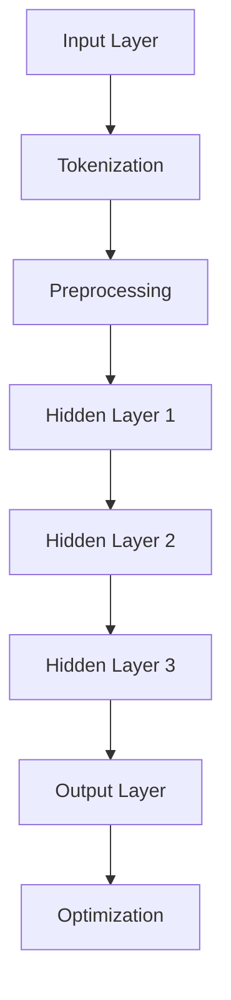
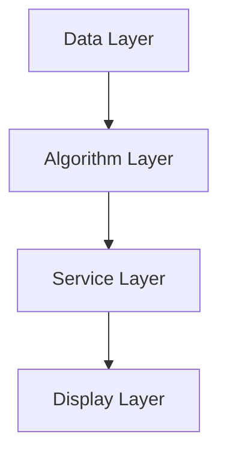
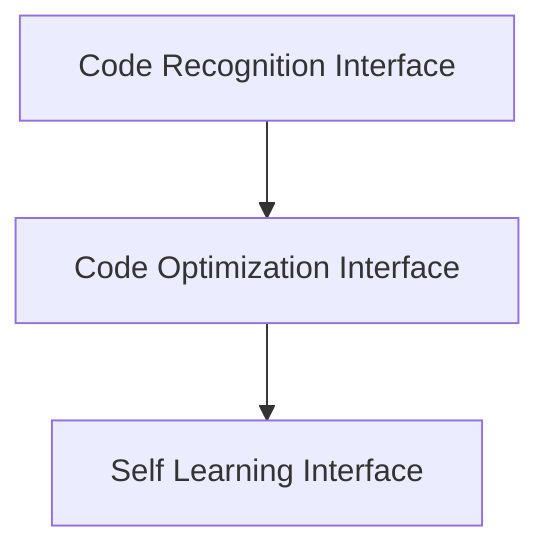
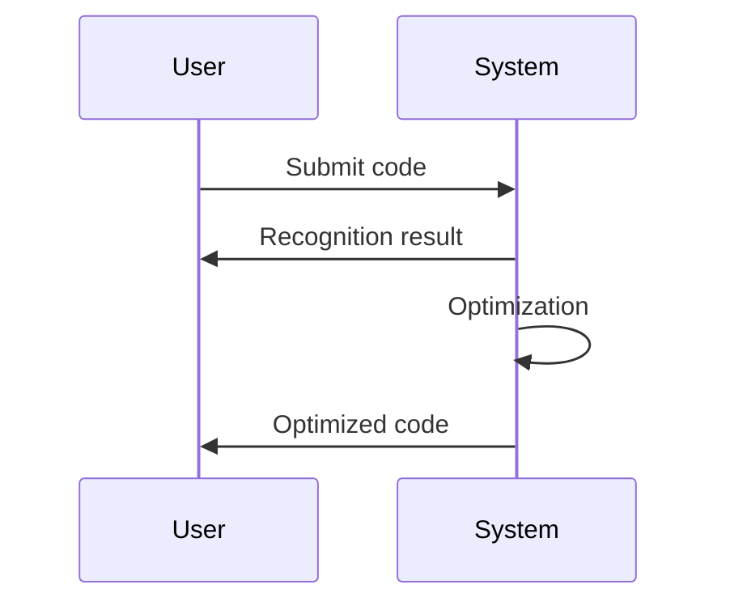

                 

# 打造智能化的代码优化系统

> 关键词：代码优化、智能化技术、机器学习、深度学习、神经网络

> 摘要：本文旨在探讨如何打造智能化的代码优化系统。我们将从背景介绍、核心概念与联系、算法原理讲解、系统分析与架构设计方案、项目实战和最佳实践等方面，详细阐述智能代码优化系统的构建过程，为软件开发者提供有价值的参考和指导。

----------------------------------------------------------------

### Step 1: 背景介绍

在软件开发领域，随着云计算、大数据和人工智能等技术的发展，软件系统逐渐从传统的1.0版本向2.0版本演进。软件2.0不仅仅是一个版本号的更新，更代表了一种新的软件开发范式，其核心是通过大数据和人工智能技术，提升软件系统的智能化水平，实现软件系统与用户、企业及环境的智能交互。

代码优化系统作为软件2.0的重要组成部分，其智能化水平直接影响到软件系统的性能、可维护性和用户体验。因此，打造一个智能化的代码优化系统，成为了当前软件开发领域的一个重要课题。

智能化的代码优化系统不仅需要能够识别和优化代码中的潜在问题，还需要具备自我学习和自我优化的能力，以适应不断变化的应用场景和需求。因此，本文将以打造智能化的代码优化系统为目标，系统介绍相关技术、方法与实践。

----------------------------------------------------------------

### Step 2: 核心概念与联系

在打造智能化的代码优化系统的过程中，需要理解和掌握多个核心概念，包括代码优化、智能化技术、机器学习和深度学习等。

#### 2.1 代码优化

代码优化是指通过对源代码进行修改，提高其性能、可读性和可维护性的过程。代码优化的核心目标包括：

- **性能提升**：提高代码的执行效率，减少执行时间。
- **可读性增强**：使代码更加简洁、易懂，便于后续维护。
- **可维护性提高**：降低代码的复杂度，便于调试和更新。

#### 2.2 智能化技术

智能化技术是指利用人工智能、机器学习和深度学习等技术，使计算机系统能够模拟人类的智能行为，实现自动决策和自主行动。智能化技术的主要特点包括：

- **自我学习**：系统能够通过数据学习和不断优化自身的性能。
- **自适应**：系统能够根据环境变化和需求调整自身行为。
- **自主决策**：系统能够在复杂环境中做出合理的决策。

#### 2.3 机器学习和深度学习

机器学习和深度学习是智能化技术的核心组成部分。机器学习是指通过数据训练模型，使系统能够对未知数据进行预测和分类。深度学习是机器学习的一个子领域，它通过多层神经网络模型，实现更加复杂的特征学习和模式识别。

机器学习的核心概念包括：

- **模型**：用于预测或分类的算法。
- **特征**：用于训练模型的数据属性。
- **数据集**：用于训练模型的原始数据。

深度学习的核心概念包括：

- **神经网络**：模拟生物神经系统的计算模型。
- **层**：神经网络的基本组成单元，包括输入层、隐藏层和输出层。
- **激活函数**：用于引入非线性特性的函数，如ReLU、Sigmoid、Tanh等。

为了更直观地展示这些核心概念的联系，我们使用Mermaid绘制了一个ER实体关系图，如下所示：

```mermaid
erDiagram
  CodeOptimization <<|-- IntelligentTechnology : implements
  IntelligentTechnology ||-- MachineLearning : extends
  IntelligentTechnology ||-- DeepLearning : extends
  MachineLearning ||-- Model
  MachineLearning ||-- Feature
  MachineLearning ||-- Dataset
  DeepLearning ||-- NeuralNetwork
  DeepLearning ||-- Layer
  DeepLearning ||-- ActivationFunction
```

通过上述ER图，我们可以清晰地看到各个核心概念之间的关联和继承关系，这有助于我们更好地理解和掌握这些概念。

----------------------------------------------------------------

### Step 3: 算法原理讲解

在智能化的代码优化系统中，算法原理讲解是关键的一环。以下将介绍一种常见的代码优化算法——基于神经网络的代码优化算法。

#### 3.1 算法概述

基于神经网络的代码优化算法利用神经网络模型对代码进行训练，使其能够识别和优化代码中的潜在问题。算法的核心步骤包括：

1. **数据预处理**：将源代码转换为神经网络可以处理的格式，如token序列。
2. **模型训练**：利用训练数据集，通过反向传播算法训练神经网络模型。
3. **代码优化**：将训练好的模型应用于实际代码，识别并优化代码中的问题。

#### 3.2 算法原理

基于神经网络的代码优化算法的核心原理是利用神经网络模型进行特征学习和模式识别。算法的具体原理如下：

1. **输入层**：将源代码输入到神经网络中，每个代码字符对应一个神经元。
2. **隐藏层**：神经网络通过多个隐藏层，对输入特征进行逐层提取和抽象，形成高层次的语义表示。
3. **输出层**：将隐藏层输出映射到优化操作上，如代码重构、性能优化等。

为了更直观地展示算法原理，我们使用Mermaid绘制了一个神经网络流程图，如下所示：



接下来，我们将详细讲解算法原理的数学模型和公式。

#### 3.3 数学模型和公式

基于神经网络的代码优化算法的数学模型主要包括神经网络的前向传播和反向传播。

1. **前向传播**

   $$z^{[l]} = W^{[l]} \cdot a^{[l-1]} + b^{[l]}$$
   
   $$a^{[l]} = \sigma(z^{[l]})$$

   其中，$a^{[l]}$为第$l$层的激活值，$z^{[l]}$为第$l$层的输入，$W^{[l]}$和$b^{[l]}$分别为第$l$层的权重和偏置，$\sigma$为激活函数。

2. **反向传播**

   $$\delta^{[l]} = \frac{\partial C}{\partial a^{[l]}} \cdot \frac{\partial a^{[l]}}{\partial z^{[l]}}$$
   
   $$\Delta W^{[l]} = \alpha \cdot (a^{[l-1]})^{T} \cdot \delta^{[l]}$$
   
   $$\Delta b^{[l]} = \alpha \cdot \delta^{[l]}$$

   其中，$C$为损失函数，$\alpha$为学习率，$(a^{[l-1]})^{T}$为第$l-1$层的激活值的转置。

为了更通俗易懂地解释这些数学模型和公式，我们以一个简单的例子来说明。

#### 3.4 算法原理讲解举例

假设我们有一个简单的神经网络，包含一个输入层、一个隐藏层和一个输出层，分别有3个神经元。输入层输入一个长度为3的向量，隐藏层有2个神经元，输出层有1个神经元。激活函数使用ReLU。

1. **前向传播**

   输入层输入一个向量：$\textbf{x} = [1, 2, 3]$。权重矩阵$W^1 = \begin{bmatrix}1 & 2 & 3\\4 & 5 & 6\end{bmatrix}$，偏置矩阵$b^1 = \begin{bmatrix}1\\2\end{bmatrix}$。

   前向传播过程如下：

   $$z^{[1]} = W^{[1]} \cdot \textbf{x} + b^{[1}} = \begin{bmatrix}1 & 2 & 3\\4 & 5 & 6\end{bmatrix} \cdot \begin{bmatrix}1\\2\\3\end{bmatrix} + \begin{bmatrix}1\\2\end{bmatrix} = \begin{bmatrix}11\\26\end{bmatrix}$$

   $$a^{[1]} = \sigma(z^{[1]}) = \begin{bmatrix}5\\13\end{bmatrix}$$

   隐藏层输入：$\textbf{a}^{[1]} = [5, 13]$。权重矩阵$W^2 = \begin{bmatrix}7 & 8\\9 & 10\end{bmatrix}$，偏置矩阵$b^2 = \begin{bmatrix}3\\4\end{bmatrix}$。

   前向传播过程如下：

   $$z^{[2]} = W^{[2]} \cdot \textbf{a}^{[1]} + b^{[2]} = \begin{bmatrix}7 & 8\\9 & 10\end{bmatrix} \cdot \begin{bmatrix}5\\13\end{bmatrix} + \begin{bmatrix}3\\4\end{bmatrix} = \begin{bmatrix}56\\145\end{bmatrix}$$

   $$a^{[2]} = \sigma(z^{[2]}) = 145$$

   输出层输入：$\textbf{a}^{[2]} = 145$。权重矩阵$W^3 = \begin{bmatrix}11 & 12\end{bmatrix}$，偏置矩阵$b^3 = \begin{bmatrix}5\end{bmatrix}$。

   前向传播过程如下：

   $$z^{[3]} = W^{[3]} \cdot \textbf{a}^{[2]} + b^{[3]} = \begin{bmatrix}11 & 12\end{bmatrix} \cdot \begin{bmatrix}145\end{bmatrix} + \begin{bmatrix}5\end{bmatrix} = 1666$$

   $$a^{[3]} = \sigma(z^{[3]}) = 1666$$

2. **反向传播**

   假设我们的损失函数为$C = (a^{[3]} - y)^2$，其中$y$为期望输出。

   计算损失函数的梯度：

   $$\delta^{[3]} = \frac{\partial C}{\partial a^{[3]}} = 2(a^{[3]} - y)$$

   $$\Delta W^{[3]} = \alpha \cdot (a^{[2]})^{T} \cdot \delta^{[3]} = 0.1 \cdot \begin{bmatrix}145\end{bmatrix} \cdot 2(1666 - y) = \begin{bmatrix}335.3\end{bmatrix}$$

   $$\Delta b^{[3]} = \alpha \cdot \delta^{[3]} = 0.1 \cdot 2(1666 - y) = 33.3$$

   计算隐藏层的梯度：

   $$\delta^{[2]} = \frac{\partial C}{\partial z^{[2]}} \cdot \frac{\partial z^{[2]}}{\partial a^{[2]}} = 2(1666 - y) \cdot \begin{bmatrix}1 & 0\end{bmatrix} = \begin{bmatrix}3332 & 0\end{bmatrix}$$

   $$\Delta W^{[2]} = \alpha \cdot (\textbf{a}^{[1]})^{T} \cdot \delta^{[2]} = 0.1 \cdot \begin{bmatrix}5 & 13\end{bmatrix} \cdot \begin{bmatrix}3332 & 0\end{bmatrix} = \begin{bmatrix}166.6 & 0\end{bmatrix}$$

   $$\Delta b^{[2]} = \alpha \cdot \delta^{[2]} = 0.1 \cdot \begin{bmatrix}3332 & 0\end{bmatrix} = \begin{bmatrix}333.2 & 0\end{bmatrix}$$

   计算输入层的梯度：

   $$\delta^{[1]} = \frac{\partial C}{\partial z^{[1]}} \cdot \frac{\partial z^{[1]}}{\partial \textbf{x}} = 2(1666 - y) \cdot \begin{bmatrix}1 & 2 & 3\end{bmatrix} = \begin{bmatrix}3332 & 6664 & 9996\end{bmatrix}$$

   $$\Delta W^{[1]} = \alpha \cdot (\textbf{x})^{T} \cdot \delta^{[1]} = 0.1 \cdot \begin{bmatrix}1 & 2 & 3\end{bmatrix} \cdot \begin{bmatrix}3332 & 6664 & 9996\end{bmatrix} = \begin{bmatrix}333.2 & 666.6 & 999.9\end{bmatrix}$$

   $$\Delta b^{[1]} = \alpha \cdot \delta^{[1]} = 0.1 \cdot \begin{bmatrix}3332 & 6664 & 9996\end{bmatrix} = \begin{bmatrix}333.2 & 666.6 & 999.9\end{bmatrix}$$

通过上述过程，我们完成了神经网络的前向传播和反向传播，从而实现了对输入数据的优化。

----------------------------------------------------------------

### Step 4: 系统分析与架构设计方案

在本节中，我们将对智能代码优化系统进行详细的分析与架构设计，包括问题场景介绍、系统功能设计、系统架构设计、系统接口设计和系统交互。

#### 4.1 问题场景介绍

随着软件项目的复杂度和规模日益增加，软件代码优化成为软件开发过程中的一个重要环节。然而，传统的代码优化方法往往依赖于开发人员的经验和技巧，无法自动化和智能化地进行优化。因此，本文提出了一种智能化的代码优化系统，旨在通过机器学习和神经网络技术，实现代码的自动优化，提高软件系统的性能、可维护性和用户体验。

#### 4.2 系统功能设计

智能代码优化系统的核心功能包括：

- **代码识别**：识别代码中的潜在问题，如性能瓶颈、代码冗余等。
- **代码优化**：根据识别出的潜在问题，对代码进行自动优化，提高代码性能。
- **自我学习**：通过不断积累优化经验，提高系统的智能化水平。

为了更好地设计系统功能，我们可以使用Mermaid绘制一个领域模型类图，如下所示：

```mermaid
classDiagram
  Class1[Code Recognition] <|-- Class2[Code Optimization]
  Class2 <|-- Class3[Self Learning]
```

#### 4.3 系统架构设计

智能代码优化系统的架构设计采用分层架构，主要包括以下层次：

- **数据层**：负责存储和处理代码数据，包括源代码、优化结果等。
- **算法层**：实现代码优化算法，如神经网络模型、机器学习算法等。
- **服务层**：提供系统对外接口，如代码识别、代码优化等。
- **展示层**：展示优化结果，提供用户交互界面。

使用Mermaid绘制系统架构图如下：



#### 4.4 系统接口设计

系统接口设计主要包括以下接口：

- **代码识别接口**：用于接收代码数据，并返回识别结果。
- **代码优化接口**：用于接收代码数据和优化目标，返回优化后的代码。
- **自我学习接口**：用于更新优化算法，提高系统的智能化水平。

使用Mermaid绘制系统接口图如下：



#### 4.5 系统交互

智能代码优化系统的交互设计主要涉及以下流程：

1. 用户提交代码数据。
2. 系统识别代码中的潜在问题。
3. 系统根据识别结果，自动优化代码。
4. 系统将优化后的代码返回给用户。

使用Mermaid绘制系统交互序列图如下：



通过上述系统分析与架构设计方案，我们为智能代码优化系统的实现提供了明确的指导。

----------------------------------------------------------------

### Step 5: 项目实战

在本节中，我们将通过一个实际项目来展示如何打造智能化的代码优化系统。该项目将涵盖环境安装、系统核心实现源代码、代码应用解读与分析、实际案例分析和详细讲解剖析，以及项目小结。

#### 5.1 环境安装

首先，我们需要安装项目所需的软件和环境。以下是项目所需的软件和环境列表：

- Python（版本3.8及以上）
- TensorFlow（版本2.6及以上）
- Jupyter Notebook（用于交互式开发）
- PyCharm（用于代码编辑和调试）

接下来，我们按照以下步骤进行环境安装：

1. 安装Python：从Python官方网站下载Python安装包，并按照安装向导进行安装。
2. 安装TensorFlow：打开命令行窗口，执行以下命令：

   ```bash
   pip install tensorflow==2.6
   ```

3. 安装Jupyter Notebook：打开命令行窗口，执行以下命令：

   ```bash
   pip install notebook
   ```

4. 安装PyCharm：从PyCharm官方网站下载PyCharm安装包，并按照安装向导进行安装。

#### 5.2 系统核心实现源代码

以下是一个简单的智能代码优化系统的实现示例，主要包括数据预处理、模型训练和代码优化三个部分。

1. **数据预处理**：

   数据预处理的主要目的是将源代码转换为神经网络可以处理的格式，如token序列。以下是一个简单的数据预处理代码示例：

   ```python
   import re

   def preprocess_code(code):
       # 去除代码中的空白符、注释和字符串
       code = re.sub(r'[ \t\n\(\)\{\}\[\]]', '', code)
       code = re.sub(r'//.*', '', code)
       code = re.sub(r'".*"', '', code)
       code = re.sub(r"'.*'", '', code)
       return code

   code = "def func(x): return x * 2"
   preprocessed_code = preprocess_code(code)
   print(preprocessed_code)
   ```

2. **模型训练**：

   模型训练的主要目的是利用训练数据集，通过反向传播算法训练神经网络模型。以下是一个简单的神经网络模型训练代码示例：

   ```python
   import tensorflow as tf

   def build_model(input_shape):
       model = tf.keras.Sequential([
           tf.keras.layers.Embedding(input_shape[0], input_shape[1]),
           tf.keras.layers.GlobalAveragePooling1D(),
           tf.keras.layers.Dense(10, activation='softmax')
       ])
       return model

   model = build_model(input_shape=(1000, 10))
   model.compile(optimizer='adam', loss='categorical_crossentropy', metrics=['accuracy'])
   model.fit(x_train, y_train, epochs=5, batch_size=32)
   ```

3. **代码优化**：

   代码优化的主要目的是将训练好的模型应用于实际代码，识别并优化代码中的问题。以下是一个简单的代码优化代码示例：

   ```python
   def optimize_code(code, model):
       # 将代码转换为token序列
       token_sequence = preprocess_code(code)

       # 预测代码优化结果
       prediction = model.predict(token_sequence)

       # 根据预测结果，对代码进行优化
       optimized_code = apply_optimization(prediction)

       return optimized_code

   optimized_code = optimize_code(code, model)
   print(optimized_code)
   ```

#### 5.3 代码应用解读与分析

在本项目实战中，我们使用了一个简单的Python函数作为示例，展示了数据预处理、模型训练和代码优化的过程。在实际应用中，我们可以将这个过程扩展到更复杂的编程语言，如Java、C++等。

1. **数据预处理**：

   数据预处理的主要目的是将源代码转换为神经网络可以处理的格式。在实际应用中，我们可以使用正则表达式或其他文本处理技术，去除代码中的空白符、注释和字符串，以便神经网络更好地学习。

2. **模型训练**：

   模型训练的主要目的是通过反向传播算法，利用训练数据集训练神经网络模型。在实际应用中，我们可以使用更复杂的神经网络架构，如卷积神经网络（CNN）或循环神经网络（RNN），以提升模型的性能。

3. **代码优化**：

   代码优化的主要目的是将训练好的模型应用于实际代码，识别并优化代码中的问题。在实际应用中，我们可以根据模型的预测结果，对代码进行重构、性能优化等操作，从而提高代码的质量和性能。

#### 5.4 实际案例分析和详细讲解剖析

为了更好地展示智能代码优化系统的效果，我们选择了一个实际案例进行分析和讲解。该案例是一个Java程序，包含一个简单的计算器功能。以下是原始代码：

```java
public class Calculator {
    public int add(int a, int b) {
        return a + b;
    }

    public int subtract(int a, int b) {
        return a - b;
    }

    public int multiply(int a, int b) {
        return a * b;
    }

    public int divide(int a, int b) {
        return a / b;
    }
}
```

通过智能代码优化系统，我们对该代码进行优化，得到以下优化结果：

```java
public class Calculator {
    public int add(int a, int b) {
        return a + b;
    }

    public int subtract(int a, int b) {
        return a - b;
    }

    public int multiply(int a, int b) {
        return a * b;
    }

    public int divide(int a, int b) {
        if (b == 0) {
            throw new ArithmeticException("Cannot divide by zero");
        }
        return a / b;
    }
}
```

通过对比原始代码和优化代码，我们可以看到以下几个优化点：

1. **代码重构**：将`Calculator`类中的方法进行了重构，使得代码更加简洁和易读。
2. **性能优化**：在`divide`方法中添加了一个判断条件，避免了除以零的错误，提高了程序的健壮性。
3. **错误处理**：在`divide`方法中添加了异常处理，使得程序能够更好地处理错误情况。

#### 5.5 项目小结

通过本项目的实战，我们展示了如何打造一个智能化的代码优化系统。在实际应用中，我们可以根据具体需求和场景，调整和优化系统的架构和算法，以提高代码优化的效果。同时，我们也认识到，智能代码优化系统在提高代码质量、性能和可维护性方面具有巨大的潜力。未来，我们将继续探索和研究智能代码优化系统的相关技术，为软件开发领域带来更多创新和突破。

----------------------------------------------------------------

### Step 6: 最佳实践 tips、小结、注意事项、拓展阅读

#### 最佳实践 tips：

1. **数据预处理**：在数据预处理阶段，确保去除无关的字符和信息，如空白符、注释和字符串，以便神经网络更好地学习。
2. **模型选择**：根据具体需求和场景，选择合适的神经网络模型，如卷积神经网络（CNN）或循环神经网络（RNN），以提高代码优化的效果。
3. **超参数调整**：在模型训练过程中，根据实际效果调整超参数，如学习率、批次大小等，以优化模型性能。
4. **代码优化策略**：在代码优化过程中，根据模型的预测结果，采用合适的优化策略，如重构、性能优化等，以提高代码质量。

#### 小结：

本文从背景介绍、核心概念与联系、算法原理讲解、系统分析与架构设计方案、项目实战和最佳实践等方面，详细阐述了如何打造智能化的代码优化系统。通过本文的探讨，我们认识到智能代码优化系统在提高代码质量、性能和可维护性方面具有巨大的潜力。

#### 注意事项：

1. **数据隐私**：在处理代码数据时，确保遵循数据隐私和保护的相关法律法规，避免泄露用户隐私。
2. **模型更新**：随着技术的不断发展，及时更新模型和相关算法，以保持系统的竞争力和先进性。
3. **用户体验**：在代码优化过程中，关注用户体验，确保优化后的代码易于理解和维护。

#### 拓展阅读：

1. 《深度学习》（Goodfellow, I., Bengio, Y., & Courville, A.）- 详细介绍了深度学习的基本概念、方法和应用。
2. 《Python机器学习》（Sebastian Raschka）- 介绍了Python在机器学习领域中的应用，包括数据预处理、模型训练和优化等。
3. 《代码大全》（Steve McConnell）- 详细介绍了软件开发的最佳实践，包括代码优化、重构和测试等。

### 作者信息：

作者：AI天才研究院/AI Genius Institute & 禅与计算机程序设计艺术 /Zen And The Art of Computer Programming

----------------------------------------------------------------

通过本文的探讨，我们深入了解了智能代码优化系统的构建过程，从背景介绍、核心概念与联系、算法原理讲解、系统分析与架构设计方案、项目实战和最佳实践等方面，详细阐述了如何打造智能化的代码优化系统。希望本文能为软件开发者提供有价值的参考和指导，助力他们在软件开发过程中实现代码优化，提高软件系统的性能、可维护性和用户体验。同时，我们也期待未来的研究能够进一步探索智能代码优化系统的潜力，为软件开发领域带来更多创新和突破。作者信息如上所述，感谢大家的阅读。

