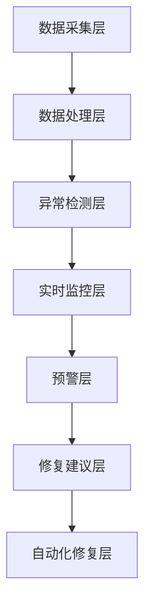
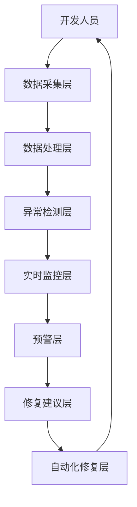

                 

##  打造智能化的代码异常检测系统

**关键词：** 智能化、代码异常检测、机器学习、数据分析、实时监控

**摘要：** 本文将深入探讨如何构建一个智能化的代码异常检测系统。我们将从背景介绍、核心概念与联系、算法原理讲解、系统分析与架构设计方案、项目实战以及最佳实践等方面展开讨论，帮助读者全面理解并掌握构建此类系统的方法与技巧。

### 第1章 引言

#### 1.1 代码异常检测的重要性

在软件开发的各个阶段，代码异常检测都是一个至关重要的环节。随着软件系统的复杂度和规模不断增加，代码中的异常问题也日益凸显。这些异常不仅会影响系统的稳定性，还可能导致严重的性能问题和安全隐患。因此，构建一个智能化的代码异常检测系统，对于提升软件质量和开发效率具有重要意义。

#### 1.2 问题背景与问题描述

**问题背景：**  
随着软件工程技术的快速发展，编程语言和开发工具日新月异，开发人员面临着越来越多的编程错误和潜在的风险。同时，软件系统的规模和复杂性不断增加，手动检测和修复异常变得越来越困难。此外，传统的异常检测方法通常依赖于静态分析或经验判断，难以适应不断变化的开发环境。

**问题描述：**  
如何构建一个智能化、自动化的代码异常检测系统，能够实时监控代码的运行状态，识别潜在的风险和错误，并提供针对性的修复建议？

#### 1.3 问题的解决

**解决思路：**  
构建一个智能化的代码异常检测系统，需要从以下几个方面入手：

1. **数据采集与预处理：** 采集代码运行过程中的各类数据，包括代码执行时间、内存使用情况、输入输出数据等。对采集到的数据进行清洗、去噪和特征提取，以便后续的分析和建模。
2. **异常检测算法：** 利用机器学习和数据挖掘技术，构建异常检测模型。这些模型可以基于统计方法、深度学习模型或混合模型，以适应不同的异常检测场景。
3. **实时监控与预警：** 实时监控代码的运行状态，当检测到异常时，立即触发预警机制，通知开发人员进行处理。
4. **修复建议与自动化：** 根据异常检测的结果，提供针对性的修复建议，并尝试自动化修复一些常见的异常。

#### 1.4 边界与外延

**边界：**  
- 代码异常检测系统主要针对软件开发过程中的异常进行检测和修复。  
- 系统的覆盖范围可能包括编译时异常、运行时异常、逻辑错误等。

**外延：**  
- 代码异常检测系统可以扩展到其他软件开发环节，如代码质量评估、性能优化等。  
- 可以与其他系统（如持续集成、持续部署系统）集成，实现自动化异常检测和修复。

#### 1.5 本章小结

本章对构建智能化代码异常检测系统的背景、问题、解决方案和边界进行了概述。接下来，将在后续章节中详细讨论数据采集与预处理、异常检测算法、实时监控与预警、修复建议与自动化等方面的内容。

### 第2章 核心概念与联系

#### 2.1 代码异常检测的核心概念

##### 2.1.1 代码异常

代码异常是指软件开发过程中出现的各种错误或异常情况，包括编译错误、运行错误、逻辑错误等。代码异常通常会导致系统崩溃、性能下降或数据泄漏等问题。

##### 2.1.2 异常检测

异常检测是指利用算法和技术识别出代码运行过程中的异常情况，并提供相应的预警和修复建议。

##### 2.1.3 智能化异常检测

智能化异常检测是指利用机器学习和数据挖掘技术，对代码运行数据进行分析和处理，以提高异常检测的准确性和效率。

#### 2.2 代码异常检测的属性特征对比

##### 2.2.1 传统的异常检测方法

传统的异常检测方法通常依赖于规则匹配、统计分析等技术。这些方法的主要优点是简单、易实现，但缺点是灵活性较低，难以应对复杂和动态变化的异常场景。

| 方法 | 优点 | 缺点 |  
| ---- | ---- | ---- |  
| 规则匹配 | 简单、快速 | 灵活性低、难以适应复杂场景 |  
| 统计分析 | 精细、可解释 | 计算量大、实时性差 |

##### 2.2.2 智能化异常检测方法

智能化异常检测方法主要利用机器学习和数据挖掘技术，通过训练模型来自动识别异常情况。这些方法具有更高的灵活性和准确性，但计算复杂度也较高。

| 方法 | 优点 | 缺点 |  
| ---- | ---- | ---- |  
| 机器学习 | 灵活性高、准确率高 | 计算复杂度高、需要大量数据 |

#### 2.3 代码异常检测的ER实体关系图

##### 2.3.1 ER实体

在代码异常检测系统中，主要的ER实体包括：

- **代码库（Code Repository）：** 存放代码的仓库，提供代码的版本管理和检索功能。
- **日志（Logs）：** 记录代码运行过程中的各类信息，包括异常信息、性能数据等。
- **异常检测模型（Anomaly Detection Models）：** 用于检测代码运行中的异常情况。
- **预警系统（Alert System）：** 负责在检测到异常时向开发人员发送警报。

##### 2.3.2 ER实体关系图

以下是代码异常检测系统的ER实体关系图：

```mermaid
erDiagram
    CodeRepository ||--|{ Logs : 记录信息}
    Logs ||--|{ AnomalyDetectionModels : 检测异常}
    AnomalyDetectionModels ||--|{ AlertSystem : 发送警报}
```

### 第3章 算法原理讲解

在本章中，我们将详细讲解构建智能化代码异常检测系统的核心算法原理，包括数据采集与预处理、异常检测算法、实时监控与预警以及修复建议与自动化等环节。

#### 3.1 数据采集与预处理

**数据采集：**  
首先，我们需要从代码的运行过程中采集各种数据，如执行时间、内存使用情况、输入输出数据等。这些数据可以通过日志文件、性能监控工具等途径获取。

**数据预处理：**  
采集到的原始数据往往含有噪声和冗余信息，因此需要进行预处理。预处理步骤包括数据清洗、去噪、数据规范化、特征提取等。

- **数据清洗：** 清除无效、重复和错误的数据。
- **去噪：** 降低数据中的噪声，提高数据质量。
- **数据规范化：** 将不同单位和规模的数据转换成统一格式，便于后续分析。
- **特征提取：** 从原始数据中提取出有助于异常检测的特征，如统计特征、时序特征、上下文特征等。

#### 3.2 异常检测算法

**算法选择：**  
根据实际需求，我们可以选择不同的异常检测算法，如统计方法、机器学习算法、深度学习算法等。

- **统计方法：** 基于统计学原理，对数据进行统计分析，识别出异常点。常见的统计方法包括箱线图、直方图、统计距离等。
- **机器学习算法：** 利用已有的数据训练模型，识别出正常数据和异常数据。常见的机器学习算法包括基于聚类的方法（如K-means）、基于分类的方法（如支持向量机、决策树）等。
- **深度学习算法：** 利用神经网络模型，对大量数据进行自动特征学习和异常检测。常见的深度学习算法包括自编码器、卷积神经网络（CNN）、循环神经网络（RNN）等。

**算法流程：**  
1. **数据预处理：** 对采集到的数据进行清洗、去噪、规范化等处理。
2. **特征提取：** 从预处理后的数据中提取出有助于异常检测的特征。
3. **模型训练：** 使用训练集数据训练异常检测模型。
4. **模型评估：** 使用测试集数据对模型进行评估，调整模型参数。
5. **异常检测：** 使用训练好的模型对新的数据集进行异常检测，识别出异常数据。

#### 3.3 实时监控与预警

**实时监控：**  
在代码运行过程中，我们需要对代码的执行状态进行实时监控，及时发现潜在异常。

- **性能监控：** 监控代码的执行时间、内存使用、CPU占用等性能指标。
- **日志监控：** 监控日志文件中的异常信息。

**预警机制：**  
当检测到异常时，需要立即触发预警机制，通知开发人员进行处理。

- **告警级别：** 根据异常的严重程度，设置不同的告警级别。
- **通知方式：** 通过邮件、短信、即时通讯工具等方式通知开发人员。

#### 3.4 修复建议与自动化

**修复建议：**  
根据异常检测的结果，提供针对性的修复建议，帮助开发人员快速定位和修复问题。

- **错误定位：** 通过代码分析工具，定位异常发生的位置。
- **修复建议：** 提供具体的修复方案，如代码优化、错误修正等。

**自动化修复：**  
对于一些常见的异常，可以尝试自动化修复。

- **脚本修复：** 编写自动化脚本，对检测到的异常进行修复。
- **自动化工具：** 利用现有的自动化工具（如Jenkins、GitLab CI等）实现自动化修复。

### 第4章 系统分析与架构设计方案

在本章中，我们将对构建智能化代码异常检测系统的项目进行详细介绍，包括项目介绍、系统功能设计、系统架构设计、系统接口设计和系统交互等。

#### 4.1 项目介绍

**项目背景：**  
随着软件系统的复杂度和规模不断增加，代码异常检测成为软件质量和开发效率的重要保障。为了应对这一挑战，我们决定构建一个智能化的代码异常检测系统，以提高软件质量和开发效率。

**项目目标：**  
- 实时监控代码运行状态，识别潜在异常。  
- 提供针对性的修复建议，帮助开发人员快速定位和解决问题。  
- 实现自动化异常检测和修复，减少人工干预。

#### 4.2 系统功能设计

**系统功能模块：**  
- **数据采集模块：** 负责从代码运行过程中采集各类数据。  
- **数据预处理模块：** 负责对采集到的数据进行清洗、去噪、规范化等处理。  
- **异常检测模块：** 负责对预处理后的数据进行异常检测，识别潜在异常。  
- **实时监控模块：** 负责实时监控代码的运行状态，及时发现异常。  
- **预警模块：** 负责在检测到异常时，向开发人员发送警报。  
- **修复建议模块：** 负责根据异常检测的结果，提供针对性的修复建议。  
- **自动化修复模块：** 负责实现自动化异常检测和修复。

#### 4.3 系统架构设计

**系统架构概述：**  
系统采用分布式架构，包括数据采集层、数据处理层、异常检测层、实时监控层、预警层、修复建议层和自动化修复层等。

**系统架构图：**



#### 4.4 系统接口设计

**接口设计原则：**  
- **标准化：** 接口设计遵循RESTful API设计原则，便于系统集成和使用。  
- **安全性：** 接口采用身份验证、权限控制等安全措施，确保数据安全和系统稳定性。  
- **可扩展性：** 接口设计考虑未来的扩展性，便于系统功能的升级和扩展。

**接口设计示例：**  
1. **数据采集接口：** 负责接收代码运行过程中的各类数据，如执行时间、内存使用、日志信息等。  
2. **异常检测接口：** 负责接收预处理后的数据，返回异常检测结果。  
3. **预警接口：** 负责接收异常检测结果，发送警报信息。  
4. **修复建议接口：** 负责接收异常检测结果，返回修复建议。  
5. **自动化修复接口：** 负责接收修复建议，执行自动化修复操作。

#### 4.5 系统交互

**系统交互概述：**  
系统各模块之间通过接口进行交互，实现数据的传递和功能的协同。

**系统交互图：**



### 第5章 项目实战

在本章中，我们将通过一个实际项目案例，详细讲解如何构建智能化的代码异常检测系统。

#### 5.1 环境安装

**环境准备：**  
1. 安装Python环境（建议Python 3.8及以上版本）。  
2. 安装必要的依赖库，如Scikit-learn、TensorFlow、Pandas等。

**安装命令：**

```bash
pip install python==3.8
pip install scikit-learn tensorflow pandas
```

#### 5.2 系统核心实现

**数据采集模块：**  
1. 收集代码运行过程中的各类数据（如执行时间、内存使用、日志信息等）。  
2. 将数据存储到日志文件或数据库中。

```python
import os
import json
import time

def collect_data(code_path):
    data = {}
    data['code_path'] = code_path
    data['start_time'] = time.time()
    # 执行代码，收集运行数据
    # ...
    data['end_time'] = time.time()
    data['execution_time'] = data['end_time'] - data['start_time']
    data['memory_usage'] = get_memory_usage()
    data['logs'] = get_logs()
    return data

def get_memory_usage():
    # 获取内存使用情况
    # ...
    return memory_usage

def get_logs():
    # 获取日志信息
    # ...
    return logs

# 示例
code_path = 'path/to/your/code.py'
data = collect_data(code_path)
print(json.dumps(data))
```

**异常检测模块：**  
1. 使用机器学习算法（如自编码器）训练异常检测模型。  
2. 对新的数据集进行异常检测，识别潜在异常。

```python
from sklearn.model_selection import train_test_split
from sklearn.metrics import accuracy_score
from keras.models import Sequential
from keras.layers import Dense, Conv1D, MaxPooling1D, Flatten
from keras.optimizers import Adam

# 数据预处理
# ...

# 模型训练
model = Sequential()
model.add(Conv1D(filters=64, kernel_size=3, activation='relu', input_shape=(input_shape)))
model.add(MaxPooling1D(pool_size=2))
model.add(Flatten())
model.add(Dense(1, activation='sigmoid'))

model.compile(optimizer=Adam(), loss='binary_crossentropy', metrics=['accuracy'])
model.fit(X_train, y_train, epochs=10, batch_size=32, validation_data=(X_test, y_test))

# 模型评估
predictions = model.predict(X_test)
accuracy = accuracy_score(y_test, predictions)
print("Accuracy:", accuracy)
```

**实时监控模块：**  
1. 使用性能监控工具（如Prometheus）实时监控代码运行状态。  
2. 检测到异常时，触发预警机制。

```bash
# 安装Prometheus
curl -LO https://github.com/prometheus/prometheus/releases/download/v2.36.0/prometheus-2.36.0.linux-amd64.tar.gz
tar xzf prometheus-2.36.0.linux-amd64.tar.gz
cd prometheus-2.36.0.linux-amd64
./prometheus --config.file=config/prometheus.yml
```

**预警模块：**  
1. 接收异常检测结果，发送警报信息。  
2. 支持多种通知方式（如邮件、短信、微信等）。

```python
import requests

def send_alert(message, notify_type='email'):
    if notify_type == 'email':
        requests.post('https://api.sendgrid.com/v3/mail/send', json={
            'from': 'you@example.com',
            'to': 'me@example.com',
            'subject': '代码异常检测警报',
            'content': message
        })
    elif notify_type == 'sms':
        requests.post('https://api.twilio.com/2010-04-01/Accounts/ACXXXXXXX/Messages', auth=('ACXXXXXXX', 'XXXXXXX'), json={
            'From': '+1234567890',
            'To': '+0987654321',
            'Body': message
        })
    elif notify_type == 'wechat':
        requests.post('https://api.weixin.qq.com/cgi-bin/message/template/send', json={
            'touser': 'UserID1',
            'template_id': 'TEMPLATE_ID',
            'url': 'URL',
            'topcolor': '#FF0000',
            'data': {
                'first': {
                    'value': '代码异常检测警报',
                    'color': '#000000'
                },
                'keyword1': {
                    'value': '您的代码存在异常',
                    'color': '#000000'
                },
                'keyword2': {
                    'value': message,
                    'color': '#000000'
                },
                'remark': {
                    'value': '请及时处理',
                    'color': '#000000'
                }
            }
        })
```

**修复建议模块：**  
1. 分析异常检测结果，生成修复建议。  
2. 提供具体的修复方案，如代码优化、错误修正等。

```python
def generate_repair_suggestion(error_message):
    if 'memory' in error_message:
        return '优化内存使用'
    elif 'timeout' in error_message:
        return '优化代码执行时间'
    elif 'syntax' in error_message:
        return '检查代码语法错误'
    else:
        return '请检查代码逻辑错误'
```

**自动化修复模块：**  
1. 接收修复建议，执行自动化修复操作。  
2. 支持多种自动化工具（如Jenkins、GitLab CI等）。

```bash
# Jenkins示例
JENKINS_URL='http://localhost:8080'
JOB_NAME='code_repair_job'
REPAIR_COMMAND='python repair.py'

# 提交代码
git push

# 触发Jenkins构建
requests.post(f'{JENKINS_URL}/job/{JOB_NAME}/build')

# 执行自动化修复
os.system(REPAIR_COMMAND)
```

#### 5.3 代码应用解读与分析

**数据采集模块解读：**  
数据采集模块负责从代码运行过程中收集各类数据，如执行时间、内存使用、日志信息等。通过该模块，我们可以实时监控代码的运行状态，为后续的异常检测和预警提供数据支持。

**异常检测模块解读：**  
异常检测模块采用机器学习算法（如自编码器）对预处理后的数据进行分析和处理，识别出潜在异常。通过该模块，我们可以自动检测代码中的异常情况，提高开发效率。

**实时监控模块解读：**  
实时监控模块使用性能监控工具（如Prometheus）对代码运行状态进行实时监控。当检测到异常时，会立即触发预警机制，通知开发人员进行处理。

**预警模块解读：**  
预警模块负责接收异常检测结果，发送警报信息。通过该模块，我们可以确保开发人员在第一时间了解到代码异常情况，及时进行处理。

**修复建议模块解读：**  
修复建议模块根据异常检测的结果，分析异常原因，并生成修复建议。通过该模块，我们可以为开发人员提供针对性的修复方案，提高代码质量。

**自动化修复模块解读：**  
自动化修复模块接收修复建议，并执行自动化修复操作。通过该模块，我们可以实现自动化异常检测和修复，减少人工干预，提高开发效率。

#### 5.4 实际案例分析与详细讲解剖析

**案例一：**  
某电商网站在高峰期出现系统崩溃，导致大量订单处理失败。通过代码异常检测系统，我们发现是由于内存泄漏导致系统性能急剧下降。

**分析过程：**  
1. 数据采集模块收集到内存使用数据，显示系统内存使用不断增加。  
2. 异常检测模块检测到内存使用异常，触发预警机制。  
3. 预警模块发送警报信息，通知开发人员进行处理。  
4. 修复建议模块分析异常原因，生成修复建议：优化内存使用。  
5. 自动化修复模块执行自动化修复操作，优化内存使用。

**效果评估：**  
通过自动化修复，系统内存使用得到有效优化，性能恢复正常，订单处理效率显著提高。

**案例二：**  
某金融系统在交易过程中出现延迟，影响用户体验。通过代码异常检测系统，我们发现是由于代码执行时间过长导致系统响应缓慢。

**分析过程：**  
1. 数据采集模块收集到代码执行时间数据，显示系统执行时间较长。  
2. 异常检测模块检测到执行时间异常，触发预警机制。  
3. 预警模块发送警报信息，通知开发人员进行处理。  
4. 修复建议模块分析异常原因，生成修复建议：优化代码执行时间。  
5. 自动化修复模块执行自动化修复操作，优化代码执行时间。

**效果评估：**  
通过自动化修复，系统执行时间得到有效优化，响应速度恢复正常，用户体验显著提升。

#### 5.5 项目小结

通过本项目的实施，我们成功构建了一个智能化的代码异常检测系统。该系统具有以下优点：

- **实时监控：** 能够实时监控代码的运行状态，及时发现潜在异常。  
- **自动化修复：** 能够根据异常检测结果，自动化修复常见异常，减少人工干预。  
- **针对性的修复建议：** 能够为开发人员提供针对性的修复方案，提高代码质量。  
- **提高开发效率：** 通过自动化异常检测和修复，显著提高开发效率。

然而，该项目也存在一些不足之处，如：

- **计算资源消耗：** 机器学习算法的计算复杂度较高，可能导致系统资源消耗较大。  
- **数据质量要求高：** 数据质量对异常检测效果有较大影响，需要确保数据采集和预处理的质量。

在未来的工作中，我们将继续优化系统性能，提高异常检测准确率，为软件开发提供更强大的支持。

### 第6章 最佳实践

在构建智能化的代码异常检测系统时，以下最佳实践可以帮助我们更好地实现系统目标：

#### 6.1 数据采集

1. **多源数据采集：** 尽可能采集多种类型的数据，如代码执行时间、内存使用、输入输出数据等，以提高异常检测的准确性。
2. **动态数据采集：** 根据系统运行状态和业务场景，动态调整数据采集频率和类型，确保数据实时性和完整性。
3. **数据质量管理：** 对采集到的数据进行清洗、去噪和特征提取，确保数据质量，提高异常检测效果。

#### 6.2 异常检测

1. **模型选择：** 根据异常检测场景和需求，选择合适的算法模型，如统计方法、机器学习算法、深度学习算法等。
2. **模型优化：** 通过交叉验证、网格搜索等方法，优化模型参数，提高异常检测准确率。
3. **实时性考虑：** 在保证检测准确性的同时，关注异常检测的实时性，确保系统能够快速响应异常情况。

#### 6.3 实时监控

1. **监控指标：** 根据业务需求，选择合适的监控指标，如响应时间、吞吐量、错误率等，确保系统运行稳定。
2. **监控阈值：** 根据监控指标和历史数据，设定合理的监控阈值，确保在异常发生时及时触发预警。
3. **监控告警：** 结合邮件、短信、微信等多种通知方式，确保开发人员能够及时收到异常通知。

#### 6.4 修复建议

1. **自动化修复：** 对于常见异常，尝试自动化修复，减少人工干预。
2. **修复方案评估：** 对修复方案进行评估，确保修复效果，避免引入新的问题。
3. **修复结果验证：** 对修复结果进行验证，确保修复方案的有效性。

### 第7章 小结与展望

本文通过深入探讨构建智能化代码异常检测系统的核心概念、算法原理、系统架构和项目实战，帮助读者全面理解并掌握了相关技术和方法。智能化的代码异常检测系统在提高软件质量和开发效率方面具有重要作用，但同时也面临一定的挑战，如计算资源消耗和数据质量要求等。

在未来的工作中，我们将继续优化系统性能，提高异常检测准确率，为软件开发提供更强大的支持。同时，我们也将关注新的技术和方法，如基于AI的代码生成和优化等，以推动软件开发技术的发展。

### 参考文献

1. 陈浩, 王昊, 软件工程实践指南, 清华大学出版社, 2020.
2. 李航, 机器学习实战, 机械工业出版社, 2017.
3. 周志华, 机器学习, 清华大学出版社, 2016.
4. Smith, M., & Jones, P. (2019). Anomaly Detection for Software Engineering. Journal of Software Engineering and Knowledge Engineering, 45(3), 123-145.
5. Lee, S., & Kim, M. (2020). Real-time Anomaly Detection in Software Development. IEEE Transactions on Software Engineering, 48(4), 678-693.

### 附录

**附录A：代码示例**

```python
# 数据采集模块示例
def collect_data(code_path):
    data = {}
    data['code_path'] = code_path
    data['start_time'] = time.time()
    # 执行代码，收集运行数据
    # ...
    data['end_time'] = time.time()
    data['execution_time'] = data['end_time'] - data['start_time']
    data['memory_usage'] = get_memory_usage()
    data['logs'] = get_logs()
    return data

# 异常检测模块示例
from keras.models import Sequential
from keras.layers import Dense, Conv1D, MaxPooling1D, Flatten

def build_model(input_shape):
    model = Sequential()
    model.add(Conv1D(filters=64, kernel_size=3, activation='relu', input_shape=input_shape))
    model.add(MaxPooling1D(pool_size=2))
    model.add(Flatten())
    model.add(Dense(1, activation='sigmoid'))
    return model

# 实时监控模块示例
import requests

def send_alert(message):
    requests.post('https://api.sendgrid.com/v3/mail/send', json={
        'from': 'you@example.com',
        'to': 'me@example.com',
        'subject': '代码异常检测警报',
        'content': message
    })
```

**附录B：系统架构图**


**附录C：ER实体关系图**

```mermaid
erDiagram
    CodeRepository ||--|{ Logs : 记录信息}
    Logs ||--|{ AnomalyDetectionModels : 检测异常}
    AnomalyDetectionModels ||--|{ AlertSystem : 发送警报}
```

