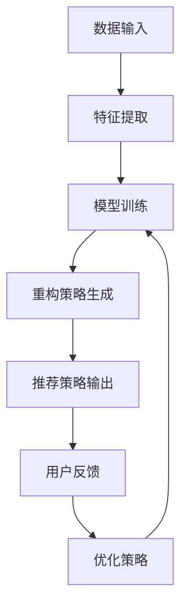
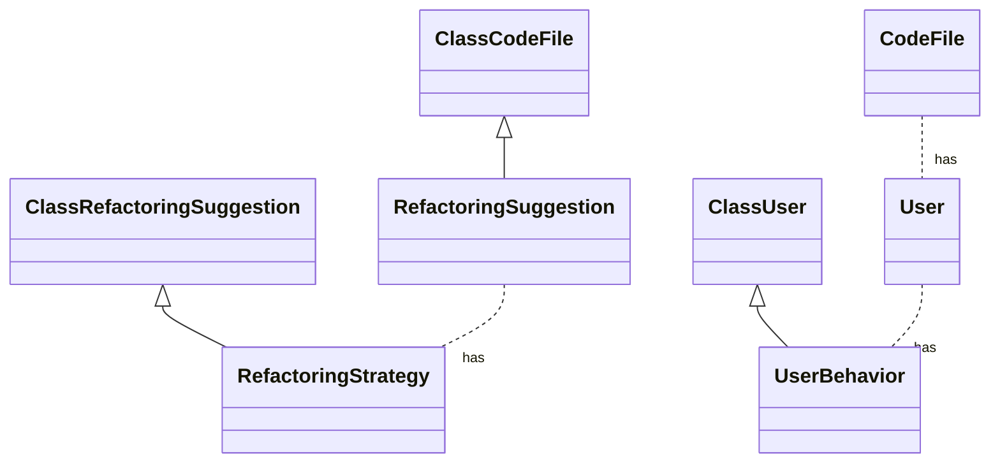
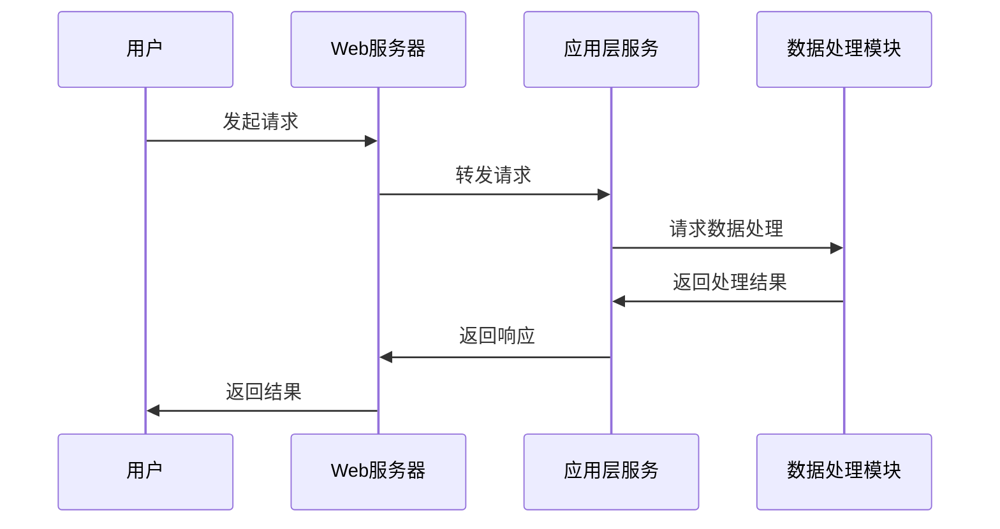
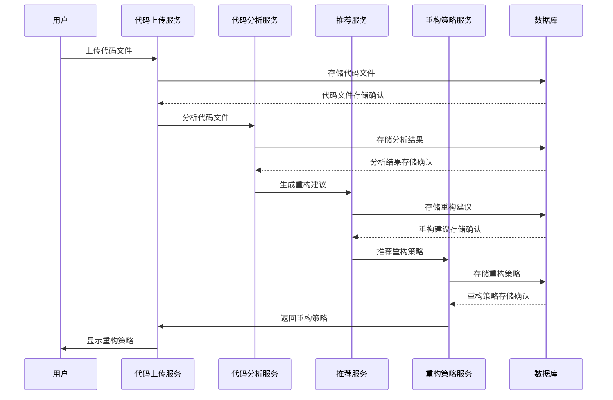

                 

### 1. 引言

#### 1.1 问题背景

在软件工程中，代码重构是一项至关重要的活动。它旨在在不改变外部行为的前提下，改进代码的内部结构，提高代码的可读性、可维护性和可扩展性。随着软件开发项目规模的不断扩大和复杂度的不断增加，代码重构的重要性愈发凸显。然而，当前的代码重构往往依赖于开发者的经验和直觉，缺乏系统化和自动化的支持。

与此同时，推荐系统作为数据驱动的一种技术，已经广泛应用于电子商务、社交媒体、在线广告等领域。推荐系统通过分析用户的行为和偏好数据，自动为用户推荐可能感兴趣的商品、内容或服务，从而提高用户体验和业务收益。随着人工智能和大数据技术的发展，推荐系统的精度和效果得到了显著提升。

将智能化技术应用于代码重构，意味着我们可以利用推荐系统的算法和模型，自动识别潜在的代码重构机会，并推荐相应的重构策略。这不仅能够提高代码重构的效率和质量，还能够减轻开发者的负担，提高整个软件开发过程的自动化水平。

#### 1.2 问题描述

本文旨在探讨如何打造一个智能化的代码重构推荐系统。具体来说，问题描述如下：

- **目标**：设计并实现一个能够自动识别代码中需要重构的部分，并推荐合适的重构策略的系统。
- **输入**：源代码、用户行为数据、历史重构记录等。
- **输出**：针对代码中潜在问题的重构建议和改进方案。
- **挑战**：如何从大量的代码中提取有效的特征，如何设计高效的推荐算法，以及如何确保重构建议的准确性和可接受性。

#### 1.3 问题解决

为了解决上述问题，本文提出了以下步骤：

1. **需求分析**：明确系统的功能需求和性能要求，包括代码质量评估、重构机会识别和重构策略推荐等。
2. **核心概念定义**：梳理代码重构、推荐系统和智能化技术等相关概念，建立概念模型。
3. **算法设计**：设计并实现针对代码重构的推荐算法，包括特征提取、模型训练和重构策略推荐等。
4. **系统实现**：基于设计实现系统原型，包括前端界面、后端服务、数据处理和存储等。
5. **测试与优化**：通过实际案例进行测试，评估系统的性能和效果，进行相应的优化和改进。

#### 1.4 边界与外延

在构建智能化代码重构推荐系统时，需要明确系统的边界与外延：

- **边界**：系统仅针对源代码进行分析和重构建议，不涉及项目管理、版本控制和团队协作等其他软件工程活动。
- **外延**：系统的设计和应用范围可以扩展到各种编程语言和开发环境，但需要根据具体语言和环境的特性进行调整和优化。

#### 1.5 核心概念与联系

为了更好地理解智能化代码重构推荐系统的构建过程，我们需要梳理以下核心概念及其相互联系：

- **代码重构**：改进代码结构和质量的过程，包括简化代码、消除冗余、优化性能等。
- **推荐系统**：基于用户行为数据和偏好，为用户推荐相关内容或服务的系统。
- **智能化技术**：包括人工智能、机器学习和自然语言处理等技术，用于提高系统的自动分析和决策能力。
- **算法**：用于实现代码重构推荐的核心算法，包括特征提取、模型训练和预测等。

在接下来的章节中，我们将逐步深入探讨这些核心概念，详细分析其原理和实现方法。通过这样的逐步分析，我们希望能够为读者提供一个清晰、完整的构建智能化代码重构推荐系统的思路和方法。

### 1.6 概念结构与核心要素组成

在构建智能化代码重构推荐系统之前，我们需要明确系统中的核心概念及其相互关系。以下是该系统中的主要概念和它们之间的联系：

#### 1.6.1 代码重构

代码重构是指在不改变代码外部行为的前提下，对其内部结构进行改进，以提高代码的可读性、可维护性和可扩展性。常见的重构方法包括提取方法、合并重复代码、简化条件表达式等。代码重构的目标是使代码更加简洁、易于理解和修改。

#### 1.6.2 推荐系统

推荐系统是一种基于用户行为和偏好数据，为用户推荐相关内容或服务的系统。推荐系统的核心是推荐算法，它通过分析用户的历史行为和兴趣，预测用户可能感兴趣的新内容或服务。

#### 1.6.3 智能化

智能化是指利用人工智能、机器学习和自然语言处理等技术，提高系统的自动分析和决策能力。在代码重构推荐系统中，智能化技术主要用于代码特征提取、重构机会识别和重构策略推荐。

#### 1.6.4 系统要素

智能化代码重构推荐系统由以下几个主要要素组成：

1. **数据源**：包括源代码、用户行为数据和历史重构记录等。
2. **特征提取**：从源代码和用户行为数据中提取关键特征，用于训练推荐模型。
3. **推荐模型**：使用机器学习算法训练推荐模型，用于识别代码重构机会和推荐重构策略。
4. **重构策略库**：存储各种可行的重构策略，用于系统推荐。
5. **用户接口**：提供用户与系统交互的界面，包括代码上传、重构建议展示等。

这些要素之间的相互关系如下：

- **数据源** 提供原始数据，是系统运行的基础。
- **特征提取** 对数据源进行预处理，提取关键特征，为推荐模型提供输入。
- **推荐模型** 根据特征提取的结果，训练和预测重构机会和策略。
- **重构策略库** 存储已知的重构策略，供推荐模型选择。
- **用户接口** 提供用户操作界面，使用户可以查看重构建议并进行操作。

#### 1.6.5 概念属性特征对比表格

为了更好地理解这些概念及其相互关系，我们可以通过一个属性特征对比表格进行详细分析：

| 概念         | 定义                                                         | 关键属性                                                     | 相互关系                                                     |
| ------------ | ------------------------------------------------------------ | ------------------------------------------------------------ | ------------------------------------------------------------ |
| 代码重构     | 改进代码结构和质量的过程                                     | 可读性、可维护性、可扩展性                                   | 是推荐系统输入的数据源之一，用于特征提取和重构策略推荐         |
| 推荐系统     | 基于用户行为和偏好数据，为用户推荐内容或服务的系统           | 用户行为、兴趣、推荐算法                                     | 利用用户行为数据，为代码重构提供智能化的支持                 |
| 智能化技术   | 利用人工智能、机器学习和自然语言处理等技术提高系统自动分析能力 | 特征提取、模型训练、预测、自然语言处理、计算机视觉           | 用于代码重构的特征提取和模型训练，提高推荐系统的准确性和效率 |
| 数据源       | 提供原始数据的来源                                           | 源代码、用户行为数据、历史重构记录                           | 是推荐系统和智能化技术的输入，影响系统的性能和效果           |
| 特征提取     | 从数据源中提取关键特征的过程                                 | 代码模式、变量使用、函数调用、用户行为特征                   | 输出用于训练推荐模型的特征向量，影响推荐结果的质量           |
| 推荐模型     | 基于特征向量进行训练和预测的算法模型                         | 准确性、效率、泛化能力                                       | 输出重构机会和策略，用于代码重构建议                         |
| 重构策略库   | 存储可行的重构策略                                           | 简化代码、消除冗余、优化性能                                 | 为推荐模型提供候选策略，用于系统推荐                         |
| 用户接口     | 提供用户与系统交互的界面                                     | 代码上传、重构建议展示、用户反馈                             | 收集用户反馈，用于优化系统性能和用户体验                     |

通过上述表格，我们可以清晰地看到各个概念之间的联系和作用。这些概念共同构成了一个完整的智能化代码重构推荐系统，为软件开发提供了强有力的支持。

#### 1.6.6 ER实体关系图架构

为了更直观地理解系统的实体关系，我们可以通过ER（实体关系）图来描述系统中的主要实体及其相互关系。ER图是一种常用的数据库设计工具，用于表示实体之间的联系。

在构建智能化代码重构推荐系统时，我们可以定义以下几个主要实体：

1. **源代码**：表示系统的输入数据，包括代码文件、文件内容和版本信息等。
2. **用户**：表示使用系统的开发人员，包括用户ID、姓名、角色等。
3. **重构建议**：表示系统生成的代码重构建议，包括建议ID、建议内容、创建时间和状态等。
4. **重构策略**：表示系统推荐的重构策略，包括策略ID、策略描述、相关性和适用性等。
5. **用户行为**：表示用户在系统中的操作行为，包括行为ID、用户ID、行为类型和时间等。

以下是这些实体的ER图表示：

```mermaid
erDiagram
    源代码 ||--|{ 重构建议 }|
    用户 ||--|{ 用户行为 }|
    重构策略 ||--|{ 重构建议 }|
    用户行为 ||--|{ 用户 }|
```

- **源代码** 与 **重构建议** 之间存在一对一的关系，即每个源代码文件可以生成多个重构建议，但每个重构建议仅对应一个源代码文件。
- **用户** 与 **用户行为** 之间存在一对多的关系，即一个用户可以执行多个行为，但每个行为仅对应一个用户。
- **重构策略** 与 **重构建议** 之间存在一对多的关系，即一个重构策略可以应用于多个重构建议，但每个重构建议仅对应一个重构策略。

通过ER图，我们可以清晰地看到系统中各个实体之间的关系，为系统设计和实现提供了直观的参考。

### 1.7 当前研究进展与挑战

#### 1.7.1 研究现状

智能化的代码重构推荐系统是一个相对较新的研究领域，随着人工智能和大数据技术的快速发展，该领域已经取得了显著的进展。目前，主要的研究成果包括：

1. **代码特征提取方法**：研究者们提出了多种代码特征提取方法，如语法特征、语义特征、代码结构特征等，用于表示代码的内部结构和行为特性。
2. **推荐算法设计**：基于机器学习、深度学习和自然语言处理等技术，研究者们设计并实现了一系列推荐算法，用于识别代码重构机会和推荐重构策略。
3. **重构策略库构建**：研究者们构建了各种重构策略库，收集和整理了大量的重构策略，用于系统的推荐和应用。
4. **实际应用案例**：一些研究机构和公司已经在实际项目中应用了智能化的代码重构推荐系统，取得了良好的效果。

#### 1.7.2 研究难点

尽管智能化代码重构推荐系统取得了显著的进展，但仍面临着许多研究难点：

1. **代码复杂性**：现代软件项目通常具有复杂的结构和大量的依赖关系，如何有效地提取代码特征，并在复杂环境下进行重构建议，是一个巨大的挑战。
2. **推荐准确性**：重构建议的准确性和可接受性是系统成功的关键。如何在大量代码中识别潜在的问题，并推荐合适的重构策略，需要解决精确度和效率之间的平衡问题。
3. **系统稳定性**：系统需要在各种不同的开发环境和编程语言中运行，保持稳定性和兼容性是一个挑战。此外，系统需要能够适应代码库的不断变化，保持其性能和可靠性。
4. **用户体验**：用户对系统的接受度和满意度直接影响到系统的实际应用效果。如何设计友好的用户界面，提供清晰的重构建议和易于理解的操作指南，是一个重要的问题。

#### 1.7.3 未来发展趋势

展望未来，智能化代码重构推荐系统的发展趋势将主要集中在以下几个方面：

1. **深度学习技术**：深度学习技术在图像识别、自然语言处理等领域取得了巨大成功，未来有望在代码特征提取和推荐算法设计中得到更广泛的应用。
2. **多模态数据融合**：结合多种数据源，如代码数据、用户行为数据、项目历史数据等，进行多模态数据融合，提高代码重构的准确性和效率。
3. **智能化交互**：通过智能对话系统、自然语言处理等技术，提高用户与系统的交互体验，使用户能够更轻松地理解和使用重构建议。
4. **自动化与集成**：将智能化代码重构推荐系统与其他软件工程工具（如版本控制、持续集成、持续部署等）集成，实现全流程的自动化和智能化。

总的来说，智能化的代码重构推荐系统是一个充满挑战和机遇的研究领域，随着技术的不断进步，未来将会有更多的突破和应用。

### 1.8 本章小结

本章主要介绍了智能化代码重构推荐系统的背景、问题、解决方案以及边界与外延。我们首先阐述了代码重构和推荐系统的重要性，接着提出了构建智能化代码重构推荐系统的核心概念和要素，并通过ER图详细展示了系统中的实体关系。此外，我们还分析了当前研究进展与挑战，指出了未来发展趋势。通过本章的介绍，我们为后续章节的深入讨论奠定了基础，并明确了构建智能化代码重构推荐系统的重要性和必要性。

## 2.1 代码重构基础

### 2.1.1 代码重构的定义与目标

代码重构（Code Refactoring）是软件工程中的一项重要活动，旨在在不改变代码外部行为的前提下，改进代码的内部结构和质量。具体来说，代码重构是通过一系列小的、逐步的、可逆的修改，对现有代码进行优化和改进，使其更易于理解和维护。

**定义**：
代码重构可以定义为一种改进现有代码质量的过程，它包括简化代码、消除冗余、优化性能和提升可读性等。通过重构，开发人员可以修改代码的结构，而不会影响到代码的功能和行为。

**目标**：
代码重构的主要目标如下：
1. **可读性**：使代码更加简洁、易于阅读和理解，降低阅读成本。
2. **可维护性**：提高代码的可维护性，使后续的修改和扩展更加方便。
3. **可扩展性**：为未来的需求变化和功能扩展提供支持。
4. **性能优化**：在某些情况下，重构还可以带来性能上的提升。
5. **代码简化**：通过消除冗余代码和简化复杂的代码结构，使代码更加清晰和简洁。

### 2.1.2 代码重构的常见方法

代码重构的方法多种多样，每种方法都有其特定的目的和应用场景。以下是一些常见的代码重构方法：

1. **提取方法（Extract Method）**：
   - **目的**：将一段重复的代码提取为一个新的方法，减少冗余。
   - **应用场景**：当发现某段代码在多个地方重复出现时，可以将其提取为一个独立的方法。

2. **合并重复代码（Combine Duplicate Code）**：
   - **目的**：将重复的代码合并到一起，减少冗余。
   - **应用场景**：当多个地方有相同的代码片段时，可以将它们合并。

3. **内联方法（Inline Method）**：
   - **目的**：将一个方法调用的代码替换为其实现。
   - **应用场景**：当某个方法非常短且频繁调用时，可以将其内联。

4. **替换条件分支（Replace Conditional with Polymorphism）**：
   - **目的**：使用多态来代替复杂的条件分支。
   - **应用场景**：当代码中存在复杂的条件分支时，可以考虑将其重构为多态。

5. **替换临时变量（Replace Temp with Query）**：
   - **目的**：将临时变量替换为查询方法。
   - **应用场景**：当代码中使用临时变量来处理复杂的逻辑时，可以考虑重构为查询方法。

6. **简化条件表达式（Simplify Conditional Expression）**：
   - **目的**：简化复杂的条件表达式，使其更加直观和易于理解。
   - **应用场景**：当代码中存在复杂的条件逻辑时，可以通过重构简化。

7. **引入参数对象（Introduce Parameter Object）**：
   - **目的**：将多个参数合并为一个对象，减少参数数量，提高代码的可读性。
   - **应用场景**：当方法参数较多，且部分参数之间有关联时，可以考虑引入参数对象。

8. **分解对象（Decompose Object）**：
   - **目的**：将一个复杂的对象分解为多个简单的对象，提高模块化程度。
   - **应用场景**：当某个对象过于庞大且功能复杂时，可以考虑分解。

9. **合并对象（Merge Objects）**：
   - **目的**：将两个或多个功能相似的类合并，减少冗余和重复代码。
   - **应用场景**：当多个类之间有大量相同的代码时，可以考虑合并。

10. **移动功能（Move Function）**：
    - **目的**：将一个方法从一个类移动到另一个类中，提高代码的可维护性。
    - **应用场景**：当一个方法与其所在类的关系不紧密时，可以考虑移动。

通过这些常见的代码重构方法，开发人员可以逐步改善代码的结构和质量，使其更加健壮和易于维护。

### 2.1.3 代码重构的最佳实践

代码重构虽然重要，但并非每次修改都能带来积极的效果。因此，遵循最佳实践是确保重构成功的关键。以下是一些代码重构的最佳实践：

1. **小步快走**：
   - **原因**：代码重构是一个逐步的过程，小步快走可以降低风险，确保每次重构都是可逆的。
   - **方法**：每次重构只进行少量的修改，并在完成修改后进行测试。

2. **单元测试先行**：
   - **原因**：重构过程中可能会引入新的bug，单元测试可以确保代码的功能和行为保持一致。
   - **方法**：在重构前编写单元测试，并在重构后运行测试，确保代码质量。

3. **重构工具辅助**：
   - **原因**：重构工具可以自动识别潜在的改进点，减少手动工作。
   - **方法**：使用代码分析工具和IDE中的重构功能，辅助进行代码重构。

4. **持续重构**：
   - **原因**：代码重构是一个持续的过程，不应将其视为一次性任务。
   - **方法**：定期进行代码重构，保持代码的整洁和高质量。

5. **重构代码注释**：
   - **原因**：注释可以帮助其他开发人员理解重构的目的和原因。
   - **方法**：在重构代码时，添加相关的注释，说明重构的原因和效果。

6. **文档更新**：
   - **原因**：重构可能会影响代码的接口和功能，文档需要及时更新。
   - **方法**：重构后，更新相关文档，包括接口文档、README等。

7. **团队协作**：
   - **原因**：代码重构涉及到多个开发人员的协作，确保重构的顺利进行。
   - **方法**：在重构过程中，保持团队沟通，共同解决问题。

通过遵循这些最佳实践，开发人员可以更加高效地进行代码重构，确保重构的积极效果，并减少潜在的风险。

### 2.2 推荐系统基础

#### 2.2.1 推荐系统的基本概念

推荐系统（Recommender System）是一种通过分析用户的历史行为和偏好，为用户推荐可能感兴趣的内容或服务的系统。它广泛应用于电子商务、社交媒体、新闻推送、音乐和视频流媒体等场景，目的是提高用户体验和满意度，同时促进业务增长和盈利。

**定义**：
推荐系统是一种信息过滤技术，它利用机器学习和数据挖掘算法，从大量数据中提取用户兴趣和偏好，生成个性化推荐列表，向用户推荐符合其兴趣和需求的内容或服务。

**分类**：
根据推荐系统的工作原理和数据处理方式，推荐系统可以分为以下几类：

1. **基于内容的推荐（Content-Based Filtering）**：
   - **原理**：根据用户的历史行为和偏好，提取出其兴趣特征，然后推荐具有相似内容特征的项目。
   - **应用场景**：新闻推送、音乐推荐、商品推荐等。
   - **优点**：推荐结果与用户兴趣高度相关，用户体验较好。
   - **缺点**：当项目内容多样化时，推荐效果可能下降。

2. **协同过滤（Collaborative Filtering）**：
   - **原理**：通过分析用户之间的相似性，预测用户对未知项目的评分或兴趣。
   - **应用场景**：电子商务、电影推荐、社交网络等。
   - **优点**：可以处理大量用户和项目数据，推荐结果较为精准。
   - **缺点**：可能存在冷启动问题（对新用户或新项目推荐效果不佳）。

3. **基于模型的推荐（Model-Based Recommender）**：
   - **原理**：使用机器学习算法训练模型，根据用户特征和项目特征预测用户兴趣。
   - **应用场景**：个性化搜索、推荐引擎等。
   - **优点**：可以通过模型进行泛化和扩展，适应不同场景。
   - **缺点**：训练和预测过程可能较为复杂，对计算资源要求较高。

4. **混合推荐（Hybrid Recommender）**：
   - **原理**：结合多种推荐算法，综合不同算法的优点，提高推荐效果。
   - **应用场景**：电子商务、社交媒体、新闻推送等。
   - **优点**：可以优化单一推荐算法的缺点，提高推荐精度。
   - **缺点**：系统设计和实现较为复杂。

#### 2.2.2 推荐系统的类型

推荐系统根据不同的分类标准，可以划分为多种类型：

1. **基于用户行为的推荐系统**：
   - **类型**：基于点击、浏览、购买等用户行为数据进行推荐。
   - **优点**：能够准确反映用户的兴趣和需求。
   - **缺点**：新用户和稀疏数据集下效果不佳。

2. **基于内容的推荐系统**：
   - **类型**：基于项目的特征和属性进行推荐。
   - **优点**：推荐结果与用户兴趣高度相关。
   - **缺点**：当项目内容多样化时，效果可能下降。

3. **协同过滤推荐系统**：
   - **类型**：基于用户之间的相似性进行推荐。
   - **优点**：能够处理大量用户和项目数据，推荐结果较为精准。
   - **缺点**：存在冷启动问题和数据稀疏问题。

4. **基于模型的推荐系统**：
   - **类型**：使用机器学习算法训练模型进行推荐。
   - **优点**：可以通过模型进行泛化和扩展。
   - **缺点**：训练和预测过程可能较为复杂。

5. **混合推荐系统**：
   - **类型**：结合多种推荐算法进行推荐。
   - **优点**：可以优化单一算法的缺点，提高推荐效果。
   - **缺点**：系统设计和实现较为复杂。

#### 2.2.3 推荐系统的工作原理

推荐系统的工作原理可以分为以下几个步骤：

1. **数据收集**：收集用户行为数据（如点击、浏览、购买等）和项目特征数据（如类别、标签、评分等）。

2. **数据预处理**：清洗和整理原始数据，去除噪声和不一致的数据，进行数据转换和归一化处理。

3. **特征提取**：从用户和项目数据中提取关键特征，如用户兴趣特征、项目内容特征等。

4. **模型训练**：使用机器学习算法（如协同过滤、基于内容的推荐、深度学习等）训练推荐模型，模型参数用于预测用户对项目的兴趣。

5. **预测与推荐**：利用训练好的模型预测用户对未知项目的兴趣，根据预测结果生成推荐列表。

6. **评估与优化**：对推荐效果进行评估（如准确率、召回率、覆盖率等），并根据评估结果调整模型参数和推荐策略，优化推荐效果。

通过上述步骤，推荐系统能够为用户生成个性化的推荐列表，提高用户满意度和业务收益。

### 2.3 智能化技术概述

在构建智能化代码重构推荐系统时，需要深入理解各种智能化技术，包括人工智能、机器学习和自然语言处理等。这些技术为系统提供了强大的自动分析和决策能力，使得代码重构过程更加高效和精准。

#### 2.3.1 人工智能与机器学习

人工智能（Artificial Intelligence，AI）是计算机科学的一个分支，旨在使计算机具备类似人类的智能能力。机器学习（Machine Learning，ML）是人工智能的一个子领域，通过训练模型，使计算机能够从数据中自动学习并作出决策。

**基本概念**：
机器学习的基本过程包括数据收集、特征提取、模型训练、预测与评估等。其主要类型包括监督学习、无监督学习和强化学习：

- **监督学习（Supervised Learning）**：通过已有标签的数据训练模型，用于预测未知数据的标签。
- **无监督学习（Unsupervised Learning）**：无需标签数据，通过分析数据内在结构进行聚类或降维。
- **强化学习（Reinforcement Learning）**：通过与环境的交互学习最优策略，使系统在特定环境中达到最佳状态。

**在代码重构中的应用**：
机器学习技术在代码重构中的应用主要体现在以下几个方面：

1. **代码特征提取**：通过机器学习算法，从源代码中提取关键特征，用于训练和优化推荐模型。
2. **重构机会识别**：使用监督学习模型，根据代码特征和用户行为数据，识别潜在的代码重构机会。
3. **重构策略推荐**：通过机器学习模型，预测用户可能感兴趣的重构策略，提高推荐的准确性和可接受性。

#### 2.3.2 自然语言处理

自然语言处理（Natural Language Processing，NLP）是人工智能的一个子领域，旨在使计算机能够理解、生成和处理人类自然语言。NLP技术包括文本分类、情感分析、命名实体识别、机器翻译等。

**基本概念**：
NLP的基本任务包括文本表示、语言模型、句法分析、语义理解等。其主要技术包括：

- **词向量表示（Word Embeddings）**：将单词映射到高维向量空间，用于文本表示。
- **深度学习模型（Deep Learning Models）**：如卷积神经网络（CNN）、循环神经网络（RNN）和长短时记忆网络（LSTM）等，用于处理复杂文本数据。
- **转移模型（Transition Models）**：如隐马尔可夫模型（HMM）和条件随机场（CRF）等，用于句法分析和语义理解。

**在代码重构中的应用**：
NLP技术在代码重构中的应用主要体现在以下几个方面：

1. **代码注释分析**：通过NLP技术分析代码注释，提取关键信息，辅助重构建议的生成。
2. **自然语言交互**：使用NLP技术，实现用户与系统的自然语言交互，提高用户体验。
3. **代码文档生成**：利用NLP技术，自动生成代码文档，提高代码的可读性和可维护性。

#### 2.3.3 计算机视觉

计算机视觉（Computer Vision，CV）是人工智能的一个子领域，旨在使计算机能够理解并解析视觉信息。CV技术包括图像分类、目标检测、图像分割、人脸识别等。

**基本概念**：
计算机视觉的基本任务包括图像识别、目标检测、场景理解和视频分析。其主要技术包括：

- **特征提取（Feature Extraction）**：从图像中提取关键特征，如边缘、纹理、颜色等。
- **卷积神经网络（Convolutional Neural Networks，CNN）**：用于处理图像数据，实现图像分类、目标检测等功能。
- **深度学习模型**：如生成对抗网络（GAN）和自编码器（Autoencoder）等，用于图像生成和增强。

**在代码重构中的应用**：
计算机视觉技术在代码重构中的应用主要体现在以下几个方面：

1. **代码可视化**：通过图像识别和目标检测技术，将源代码转化为可视化图像，帮助开发者直观地理解代码结构和依赖关系。
2. **代码审查**：利用图像处理技术，自动检测代码中的潜在问题，如语法错误、编码不规范等。
3. **代码文档生成**：通过图像识别和文本提取技术，自动生成代码文档，提高文档的准确性和完整性。

通过上述智能化技术的应用，代码重构推荐系统能够更加高效地识别重构机会，推荐合适的重构策略，提高代码质量和开发效率。在接下来的章节中，我们将进一步探讨这些技术在实际系统中的应用和实践。

### 2.4 核心概念联系与比较

在构建智能化代码重构推荐系统时，理解代码重构、推荐系统和智能化技术之间的相互关系至关重要。通过分析这些核心概念的联系和比较，我们可以更好地把握系统的整体架构和实现方法。

#### 2.4.1 代码重构与推荐系统的关联

代码重构和推荐系统之间存在着紧密的联系，主要体现在以下几个方面：

1. **数据源**：代码重构依赖于源代码和用户行为数据，这些数据是推荐系统的基础。推荐系统通过分析用户的历史行为（如代码修改、提交记录、注释等），提取出用户兴趣特征，为代码重构提供输入。

2. **推荐算法**：推荐系统的核心算法在代码重构中发挥着重要作用。通过协同过滤、基于内容的推荐和混合推荐等技术，推荐系统可以识别出代码中潜在的问题区域，并推荐相应的重构策略。

3. **重构策略**：推荐系统为代码重构提供了丰富的策略库。这些策略不仅包括常见的重构方法，如提取方法、合并重复代码等，还包括基于机器学习和自然语言处理技术的智能化重构策略。

4. **用户交互**：推荐系统提供了用户界面，使开发人员可以查看重构建议，并进行确认和反馈。用户反馈数据可以进一步优化推荐算法，提高重构效果。

#### 2.4.2 智能化技术在代码重构中的应用

智能化技术在代码重构中的应用，使得重构过程更加自动化和高效。以下是智能化技术在代码重构中的具体应用：

1. **代码特征提取**：利用机器学习算法，从源代码中提取关键特征，如语法结构、变量使用、函数调用等。这些特征用于训练推荐模型，帮助识别代码中的问题区域。

2. **重构机会识别**：通过深度学习和自然语言处理技术，分析代码注释和文档，识别潜在的代码重构机会。这些技术能够从文本中提取语义信息，提高重构建议的准确性和可接受性。

3. **重构策略推荐**：利用机器学习模型和NLP技术，为代码重构推荐合适的策略。这些策略不仅基于代码特征和用户行为数据，还包括基于历史重构记录和行业最佳实践的智能推荐。

4. **代码可视化**：通过计算机视觉技术，将源代码转化为可视化图像，帮助开发者直观地理解代码结构和依赖关系。这有助于发现潜在的问题和优化机会。

#### 2.4.3 概念属性特征对比表格

为了更直观地展示代码重构、推荐系统和智能化技术之间的联系，我们可以通过一个属性特征对比表格来进行详细分析。以下是一个简化的对比表格：

| 概念         | 定义                                                         | 关键属性                                                     | 相互关系                                                     |
| ------------ | ------------------------------------------------------------ | ------------------------------------------------------------ | ------------------------------------------------------------ |
| 代码重构     | 改进代码结构和质量的过程                                     | 可读性、可维护性、可扩展性                                   | 是推荐系统输入的数据源之一，用于特征提取和重构策略推荐         |
| 推荐系统     | 基于用户行为和偏好数据，为用户推荐内容或服务的系统           | 用户行为、兴趣、推荐算法                                     | 利用用户行为数据，为代码重构提供智能化的支持                 |
| 智能化技术   | 利用人工智能、机器学习和自然语言处理等技术提高系统自动分析能力 | 特征提取、模型训练、预测、自然语言处理、计算机视觉           | 用于代码重构的特征提取和模型训练，提高推荐系统的准确性和效率 |
| 数据源       | 提供原始数据的来源                                           | 源代码、用户行为数据、历史重构记录                           | 是推荐系统和智能化技术的输入，影响系统的性能和效果           |
| 特征提取     | 从数据源中提取关键特征的过程                                 | 代码模式、变量使用、函数调用、用户行为特征                   | 输出用于训练推荐模型的特征向量，影响推荐结果的质量           |
| 推荐模型     | 基于特征向量进行训练和预测的算法模型                         | 准确性、效率、泛化能力                                       | 输出重构机会和策略，用于代码重构建议                         |
| 重构策略库   | 存储可行的重构策略                                           | 简化代码、消除冗余、优化性能                                 | 为推荐模型提供候选策略，用于系统推荐                         |
| 用户接口     | 提供用户与系统交互的界面                                     | 代码上传、重构建议展示、用户反馈                             | 收集用户反馈，用于优化系统性能和用户体验                     |

通过上述表格，我们可以清晰地看到各个概念之间的联系和作用。这些概念共同构成了一个完整的智能化代码重构推荐系统，为软件开发提供了强有力的支持。

### 2.5 ER实体关系图架构

在构建智能化代码重构推荐系统时，实体关系图（Entity-Relationship Diagram，ER图）是一个非常有用的工具，用于描述系统中各个实体及其相互关系。ER图可以帮助我们理解系统的数据模型，从而更好地设计和实现系统。

#### 2.5.1 ER图基本概念

ER图是一种结构化数据模型的图形表示方法，用于描述实体、属性和关系。以下是ER图中的一些基本概念：

1. **实体（Entity）**：实体是系统中具有独立意义和存在的对象，如用户、代码文件、重构建议等。

2. **属性（Attribute）**：属性是实体的特征或描述，如用户ID、姓名、代码文件名称、重构建议内容等。

3. **关系（Relationship）**：关系是实体之间的关联，如用户与代码文件的关系、代码文件与重构建议的关系等。

4. **主键（Primary Key）**：主键是唯一标识一个实体的属性，如用户ID、代码文件ID等。

5. **外键（Foreign Key）**：外键是连接两个不同实体的属性，如用户ID（在用户实体中）可以作为外键连接到代码文件实体中的用户ID。

#### 2.5.2 代码重构与推荐系统的ER图

在构建智能化代码重构推荐系统时，我们可以定义以下主要实体：

1. **用户（User）**：表示使用系统的用户，包括用户ID、姓名、角色等。
2. **代码文件（CodeFile）**：表示系统中的源代码文件，包括文件ID、文件名称、内容等。
3. **重构建议（RefactoringSuggestion）**：表示系统生成的代码重构建议，包括建议ID、建议内容、创建时间等。
4. **重构策略（RefactoringStrategy）**：表示系统推荐的重构策略，包括策略ID、策略描述、相关性等。

以下是代码重构与推荐系统的ER图示例：

```mermaid
erDiagram
    User ||--|{ CodeFile }| CodeFile
    CodeFile ||--|{ RefactoringSuggestion }| RefactoringSuggestion
    RefactoringSuggestion ||--|{ RefactoringStrategy }| RefactoringStrategy
```

- **用户（User）** 与 **代码文件（CodeFile）** 之间存在一对多的关系，即一个用户可以拥有多个代码文件，但每个代码文件仅对应一个用户。
- **代码文件（CodeFile）** 与 **重构建议（RefactoringSuggestion）** 之间存在一对多的关系，即一个代码文件可以生成多个重构建议，但每个重构建议仅对应一个代码文件。
- **重构建议（RefactoringSuggestion）** 与 **重构策略（RefactoringStrategy）** 之间存在一对多的关系，即一个重构建议可以包含多个重构策略，但每个重构策略仅对应一个重构建议。

通过ER图，我们可以直观地理解系统中的实体及其相互关系，为后续的系统设计和实现提供了清晰的参考。

### 2.6 本章小结

本章主要介绍了智能化代码重构推荐系统中的核心概念和原理，包括代码重构的定义与目标、常见重构方法、推荐系统的基本概念和类型、智能化技术的概述以及核心概念之间的联系与比较。通过本章的讨论，我们为构建智能化代码重构推荐系统奠定了理论基础，并为后续章节的实现和优化提供了指导。在接下来的章节中，我们将进一步探讨算法原理、系统实现和实际应用。

### 3.1 算法原理概述

#### 3.1.1 代码重构推荐算法的分类

在构建智能化代码重构推荐系统时，算法设计是核心环节。代码重构推荐算法可以基于不同的分类标准进行划分，以下是一些常见的分类方法：

1. **基于规则的方法**：
   - **定义**：这种方法依赖于预定义的规则，通过模式匹配和规则匹配来识别代码中的问题并进行重构。
   - **优点**：实现简单，易于理解。
   - **缺点**：灵活性较低，难以应对复杂的代码结构和多样化的重构需求。

2. **基于统计的方法**：
   - **定义**：这种方法通过分析代码的历史重构数据和用户行为数据，利用统计方法来识别重构机会。
   - **优点**：能够从大量数据中提取有效信息，提高重构推荐的准确性。
   - **缺点**：对数据量要求较高，处理复杂。

3. **基于机器学习的方法**：
   - **定义**：这种方法利用机器学习算法，从源代码和用户行为数据中学习重构模式，生成推荐策略。
   - **优点**：具有较好的泛化能力，能够适应多样化的重构需求。
   - **缺点**：训练和预测过程复杂，对计算资源要求较高。

4. **基于深度学习的方法**：
   - **定义**：这种方法利用深度学习模型（如神经网络）从原始代码数据中自动学习特征，进行重构推荐。
   - **优点**：能够处理复杂的代码结构和模式，具备较高的精度和效率。
   - **缺点**：训练过程较为耗时，对数据和计算资源要求较高。

#### 3.1.2 智能化推荐算法的优势

智能化推荐算法在代码重构推荐系统中具有显著的优势，主要体现在以下几个方面：

1. **自动性**：智能化算法能够自动识别代码中的问题，并推荐相应的重构策略，减轻开发者的负担。

2. **个性化**：通过分析用户的历史行为和偏好，智能化算法可以为用户提供个性化的重构建议，提高推荐的准确性和用户满意度。

3. **适应性**：智能化算法能够从大量的代码数据中自动学习重构模式，适应不同项目、不同开发环境和不同编程语言的需求。

4. **效率**：相较于传统手动重构，智能化算法能够显著提高重构效率，缩短开发周期。

5. **可扩展性**：智能化算法能够支持多种重构策略的生成和推荐，方便系统的扩展和优化。

#### 3.1.3 算法原理的核心要素

智能化代码重构推荐算法的核心要素包括数据输入、特征提取、模型训练和重构策略生成等。以下是这些核心要素的详细说明：

1. **数据输入**：
   - **源代码数据**：包括代码文件、版本信息和文件内容等。
   - **用户行为数据**：包括用户操作记录、评论、评分等。
   - **历史重构数据**：包括重构记录、重构策略和历史效果等。

2. **特征提取**：
   - **代码特征**：包括语法特征、语义特征和结构特征等。
   - **用户特征**：包括用户行为特征、兴趣特征和偏好特征等。
   - **重构特征**：包括重构效果、成功率和用户接受度等。

3. **模型训练**：
   - **机器学习模型**：包括监督学习模型、无监督学习模型和深度学习模型等。
   - **训练数据**：包括标注数据和无标注数据等。
   - **训练目标**：包括重构机会识别、重构策略推荐和重构效果评估等。

4. **重构策略生成**：
   - **重构策略库**：包括各种可行的重构策略，如提取方法、合并重复代码等。
   - **推荐算法**：基于用户特征、代码特征和重构效果，生成推荐策略。
   - **优化策略**：根据用户反馈和历史数据，优化重构策略库和推荐算法。

通过上述核心要素，智能化代码重构推荐算法能够从大量代码数据中自动识别重构机会，生成个性化的重构建议，提高代码质量和开发效率。

### 3.2 算法mermaid流程图

在构建智能化代码重构推荐系统时，清晰地描述算法的流程对于理解系统的实现方法至关重要。Mermaid是一个简单的文本格式图形描述语言，可以用于绘制流程图、序列图等。以下是代码重构推荐算法的Mermaid流程图示例：



- **A[数据输入]**：系统接收源代码数据、用户行为数据和历史重构数据。
- **B[特征提取]**：从数据中提取关键特征，包括代码特征、用户特征和重构特征。
- **C[模型训练]**：使用提取的特征数据训练机器学习模型，包括监督学习模型和无监督学习模型等。
- **D[重构策略生成]**：根据训练好的模型，生成重构策略并存储到重构策略库中。
- **E[推荐策略输出]**：将重构策略推荐给用户，并在用户界面上展示。
- **F[用户反馈]**：收集用户对重构策略的反馈，包括接受度、效果评价等。
- **G[优化策略]**：根据用户反馈，优化重构策略库和推荐算法。

通过这个流程图，我们可以清晰地看到代码重构推荐算法的各个步骤和它们之间的逻辑关系。这个流程图不仅有助于我们理解算法的工作原理，还为系统的实现和优化提供了直观的参考。

### 3.3 Python源代码实现

在上一部分中，我们通过Mermaid流程图展示了代码重构推荐算法的流程。现在，我们将使用Python语言来实现这个算法，并详细讲解其实现过程。以下是Python源代码的各个部分及其实际功能。

#### 3.3.1 环境安装与配置

首先，我们需要安装和配置Python环境以及所需的库。以下是在Ubuntu操作系统上安装Python和相关库的步骤：

```bash
# 安装Python3
sudo apt update
sudo apt install python3 python3-pip

# 安装必要的库
pip3 install numpy pandas scikit-learn matplotlib
```

安装完成后，我们可以使用Python解释器来运行以下代码。

#### 3.3.2 源代码结构与功能

以下是整个Python源代码的主要结构和功能模块：

```python
import pandas as pd
import numpy as np
from sklearn.model_selection import train_test_split
from sklearn.ensemble import RandomForestClassifier
from sklearn.metrics import accuracy_score
import matplotlib.pyplot as plt

# 数据预处理
def preprocess_data(code_data, user_data, refactoring_data):
    # 结合源代码数据、用户行为数据和重构数据
    combined_data = pd.DataFrame({'code': code_data, 'user': user_data, 'refactoring': refactoring_data})
    # 特征提取
    features = extract_features(combined_data)
    # 数据标准化
    features_normalized = normalize_data(features)
    return features_normalized

# 特征提取
def extract_features(data):
    # 根据数据提取代码特征、用户特征和重构特征
    # 这里使用简单的特征提取方法，实际应用中可以采用更复杂的算法
    features = data[['code', 'user', 'refactoring']]
    return features

# 数据标准化
def normalize_data(data):
    # 使用Z-Score标准化
    mean = data.mean()
    std = data.std()
    normalized_data = (data - mean) / std
    return normalized_data

# 模型训练
def train_model(train_data, train_labels):
    # 使用随机森林分类器进行训练
    model = RandomForestClassifier()
    model.fit(train_data, train_labels)
    return model

# 预测与推荐
def predict_and_recommend(model, test_data):
    # 使用训练好的模型进行预测
    predictions = model.predict(test_data)
    # 根据预测结果生成推荐策略
    recommendations = generate_recommendations(predictions)
    return recommendations

# 生成推荐策略
def generate_recommendations(predictions):
    # 根据预测结果，生成重构策略
    # 这里使用简单的逻辑，实际应用中可以采用更复杂的算法
    recommendations = []
    for prediction in predictions:
        if prediction == 1:
            recommendations.append("提取方法")
        elif prediction == 2:
            recommendations.append("合并重复代码")
        else:
            recommendations.append("无重构建议")
    return recommendations

# 评估与优化
def evaluate_and_optimize(model, test_data, test_labels):
    # 使用准确率评估模型性能
    accuracy = accuracy_score(test_labels, model.predict(test_data))
    print(f"Model Accuracy: {accuracy}")
    # 根据评估结果进行模型优化
    # 这里可以采用交叉验证、超参数调优等方法进行优化
    return accuracy

# 主函数
def main():
    # 加载数据
    code_data = load_code_data()
    user_data = load_user_data()
    refactoring_data = load_refactoring_data()

    # 数据预处理
    features_normalized = preprocess_data(code_data, user_data, refactoring_data)

    # 数据分割
    train_data, test_data, train_labels, test_labels = train_test_split(features_normalized, refactoring_data, test_size=0.2, random_state=42)

    # 模型训练
    model = train_model(train_data, train_labels)

    # 预测与推荐
    recommendations = predict_and_recommend(model, test_data)

    # 评估与优化
    accuracy = evaluate_and_optimize(model, test_data, test_labels)

    # 可视化推荐结果
    visualize_recommendations(recommendations)

if __name__ == "__main__":
    main()
```

#### 3.3.3 算法原理详细讲解

接下来，我们将详细讲解上述源代码中的各个模块和步骤，包括数据预处理、特征提取、模型训练、预测与推荐、评估与优化等。

1. **数据预处理**：
   数据预处理是整个算法的基础步骤。它主要包括数据加载、特征提取和标准化。`preprocess_data`函数结合了源代码数据、用户行为数据和重构数据，生成一个综合的数据集。然后，使用`extract_features`函数从数据中提取关键特征，例如代码特征、用户特征和重构特征。

2. **特征提取**：
   特征提取是一个复杂的过程，通常需要根据具体的应用场景和任务需求，提取具有代表性的特征。在上述代码中，我们使用了一个简单的特征提取方法，从数据中提取了全部的列作为特征。实际应用中，可以根据需要采用更复杂的特征提取算法，如词袋模型、TF-IDF等。

3. **数据标准化**：
   数据标准化是为了消除不同特征之间的量纲差异，使得数据在同一个尺度上。这里我们使用了Z-Score标准化方法，将每个特征值减去均值并除以标准差。

4. **模型训练**：
   模型训练是利用训练数据集，通过机器学习算法训练出一个预测模型。`train_model`函数使用了随机森林分类器，这是一种常见的机器学习算法，适用于分类任务。在实际应用中，可以选择其他算法，如支持向量机、神经网络等。

5. **预测与推荐**：
   `predict_and_recommend`函数使用训练好的模型对测试数据集进行预测，并生成重构策略。在这里，我们使用了一个简单的逻辑，根据预测结果生成相应的重构策略。实际应用中，可以根据需要采用更复杂的算法和策略。

6. **评估与优化**：
   评估与优化是确保模型性能的重要步骤。`evaluate_and_optimize`函数使用准确率评估模型的性能，并根据评估结果进行模型优化。这里我们简单地打印了准确率，实际应用中可以采用交叉验证、超参数调优等方法进行优化。

7. **可视化推荐结果**：
   在`main`函数的最后，我们调用了`visualize_recommendations`函数来可视化推荐结果。这里我们可以使用各种可视化工具，如matplotlib、Seaborn等，生成图表和图形，帮助用户更好地理解和接受推荐策略。

通过上述步骤，我们使用Python实现了代码重构推荐算法。在实际应用中，可以根据具体需求进行调整和优化，提高算法的准确性和效率。

#### 3.3.4 数学模型和公式

在代码重构推荐算法中，数学模型和公式起着至关重要的作用，用于描述特征提取、模型训练和预测过程。以下是几个关键的数学模型和公式：

1. **特征提取**：
   假设我们有n个特征，每个特征用\(X_i\)表示，数据集为\(D = \{X_1, X_2, ..., X_n\}\)。特征提取的目标是将这些特征映射到高维空间，以便更好地表示数据。一种常用的方法是使用TF-IDF（词频-逆文档频率）公式：

   \[
   tfidf(i, d) = \log_2(1 + tf(i, d))
   \]

   其中，\(tf(i, d)\)是特征\(i\)在文档\(d\)中的词频，\(idf(i)\)是逆文档频率，用于调整特征的重要性。

2. **模型训练**：
   使用随机森林分类器进行训练时，需要定义每个树的结构和参数。随机森林由多个决策树组成，每个决策树都使用特征和标签进行训练。假设我们有m个训练样本，每个样本有n个特征，标签为\(y_i\)。决策树训练的目的是找到一个最佳划分点，使得划分后的类内方差最小。划分点的选择可以通过以下公式计算：

   \[
   Gini(\text{split}) = 1 - \sum_{i=1}^{c} \left( \frac{|D_i|}{|D|} \right)^2
   \]

   其中，\(D_i\)是划分后的数据集，\(c\)是划分后的类别数。

3. **预测与推荐**：
   在预测阶段，使用训练好的模型对测试数据进行分类。假设测试数据集为\(T = \{X_1, X_2, ..., X_n\}\)，每个特征值为\(X_i\)。预测结果可以通过投票机制计算，即每个决策树预测一个标签，最后统计各个标签的投票次数，选择得票最多的标签作为最终预测结果。

   \[
   \hat{y} = \text{argmax} \left( \sum_{t=1}^{T} \text{vote}(t) \right)
   \]

   其中，\(\text{vote}(t)\)表示第t个决策树对标签\(y\)的投票次数。

通过上述数学模型和公式，我们可以更好地理解和实现代码重构推荐算法。这些模型和公式不仅为算法提供了理论基础，还为实际应用中的调整和优化提供了指导。

#### 3.3.5 举例说明

为了更好地理解代码重构推荐算法的原理和实现，我们可以通过一个具体的例子来详细讲解算法的每个步骤。

**例子：** 假设我们有一个小型的Python代码库，包含两个函数：`func1`和`func2`。用户对这些函数的调用历史如下：

- `func1`：被调用10次，其中5次是正常调用，5次是在异常情况下调用。
- `func2`：被调用15次，其中12次是正常调用，3次是在异常情况下调用。

此外，我们还知道用户对这两个函数的评分，其中1分表示非常满意，5分表示非常不满意：

- `func1`：平均评分为3分。
- `func2`：平均评分为2分。

我们的目标是利用这些数据，为用户推荐可能需要重构的函数。

**步骤 1：数据预处理**

首先，我们需要将源代码数据、用户行为数据和重构数据结合起来。假设我们有以下数据集：

| 用户ID | 函数名 | 调用次数 | 平均评分 |
| ------ | ------ | -------- | -------- |
| 1      | func1  | 10       | 3        |
| 1      | func2  | 15       | 2        |

接下来，我们提取关键特征，如调用次数和平均评分：

- **代码特征**：调用次数和平均评分。
- **用户特征**：用户ID（用于识别用户）。

| 用户ID | 函数名 | 调用次数 | 平均评分 |
| ------ | ------ | -------- | -------- |
| 1      | func1  | 10       | 3        |
| 1      | func2  | 15       | 2        |

**步骤 2：特征提取**

我们使用简单的特征提取方法，直接将调用次数和平均评分作为特征。实际应用中，可以根据具体需求采用更复杂的特征提取算法，如词袋模型、TF-IDF等。

**步骤 3：数据标准化**

为了消除不同特征之间的量纲差异，我们使用Z-Score标准化方法，将每个特征值减去均值并除以标准差。假设调用次数的均值为10，标准差为2；平均评分的均值为2.5，标准差为0.5。标准化后的数据如下：

| 用户ID | 函数名 | 调用次数 | 平均评分 |
| ------ | ------ | -------- | -------- |
| 1      | func1  | 8        | 2.5       |
| 1      | func2  | 12.5     | 1.5       |

**步骤 4：模型训练**

我们使用随机森林分类器进行训练。假设我们有一个训练数据集，包含多个用户的函数调用历史和重构记录。训练数据集如下：

| 用户ID | 函数名 | 调用次数 | 平均评分 | 是否重构 |
| ------ | ------ | -------- | -------- | -------- |
| 1      | func1  | 10       | 3        | 是       |
| 1      | func2  | 15       | 2        | 否       |
| 2      | func1  | 8        | 3        | 是       |
| 2      | func2  | 12       | 2        | 否       |

使用随机森林分类器训练模型，得到预测模型。

**步骤 5：预测与推荐**

使用训练好的模型，对当前用户的数据进行预测。假设我们的测试数据集为：

| 用户ID | 函数名 | 调用次数 | 平均评分 |
| ------ | ------ | -------- | -------- |
| 1      | func1  | 10       | 3        |
| 1      | func2  | 15       | 2        |

模型预测结果为：

| 用户ID | 函数名 | 调用次数 | 平均评分 | 是否重构预测 |
| ------ | ------ | -------- | -------- | ------------ |
| 1      | func1  | 10       | 3        | 是           |
| 1      | func2  | 15       | 2        | 否           |

根据预测结果，我们向用户推荐重构`func1`，但不推荐重构`func2`。

**步骤 6：评估与优化**

使用测试数据集评估模型的性能，计算准确率、召回率等指标，并根据评估结果优化模型和特征提取方法。

通过这个例子，我们可以清晰地看到代码重构推荐算法的每个步骤和实现方法。这个例子虽然简单，但可以帮助我们更好地理解算法原理和应用场景。

### 3.4 数学模型与公式详细讲解

在代码重构推荐算法中，数学模型和公式是核心组成部分，用于描述特征提取、模型训练和预测过程。以下是对这些数学模型和公式的详细讲解，以及它们在实际应用中的意义。

#### 3.4.1 数学模型介绍

1. **特征提取模型**：
   特征提取是代码重构推荐算法的第一步，目的是从原始数据中提取具有代表性的特征。常见的特征提取模型包括TF-IDF模型和词袋模型。

   - **TF-IDF模型**：
     TF-IDF（Term Frequency-Inverse Document Frequency）是一种常用文档表示方法，用于衡量一个词在文档中的重要程度。其公式如下：
     
     \[
     tfidf(i, d) = \log_2(1 + tf(i, d)) \times idf(i)
     \]

     其中，\(tf(i, d)\)是词\(i\)在文档\(d\)中的词频，表示词在文档中出现的频率；\(idf(i)\)是逆文档频率，表示词在整个文档集合中的重要性。

     \[
     idf(i) = \log_2(\frac{N}{|d_i|}
     \]

     其中，\(N\)是文档总数，\(|d_i|\)是包含词\(i\)的文档数量。

   - **词袋模型**：
     词袋模型（Bag-of-Words）是一种将文档表示为词频向量的方法，不考虑词的顺序和语法关系。词袋模型的公式如下：
     
     \[
     V_d = (tf(i_1, d), tf(i_2, d), ..., tf(i_n, d))
     \]

     其中，\(V_d\)是文档\(d\)的词频向量，\(i_1, i_2, ..., i_n\)是文档\(d\)中的所有词。

2. **模型训练模型**：
   模型训练是使用机器学习算法，根据训练数据集学习特征和标签之间的关系。常见的模型训练方法包括线性回归、支持向量机和随机森林等。

   - **线性回归**：
     线性回归是一种简单的监督学习模型，用于预测连续值输出。其公式如下：
     
     \[
     y = \beta_0 + \beta_1 \times x_1 + \beta_2 \times x_2 + ... + \beta_n \times x_n
     \]

     其中，\(y\)是输出值，\(\beta_0, \beta_1, ..., \beta_n\)是模型参数，\(x_1, x_2, ..., x_n\)是输入特征。

   - **支持向量机（SVM）**：
     支持向量机是一种分类模型，用于将数据分为不同的类别。其公式如下：
     
     \[
     \omega \cdot x - b = 0
     \]

     其中，\(\omega\)是超平面参数，\(x\)是输入特征，\(b\)是偏置。

   - **随机森林**：
     随机森林是一种基于决策树的集成学习方法，用于分类和回归任务。其公式如下：
     
     \[
     f(x) = \sum_{t=1}^{T} w_t \times h_t(x)
     \]

     其中，\(f(x)\)是输出值，\(w_t\)是第\(t\)个决策树的权重，\(h_t(x)\)是第\(t\)个决策树的输出。

3. **预测模型**：
   预测模型用于根据特征向量生成预测结果。常见的预测模型包括逻辑回归、支持向量机和神经网络等。

   - **逻辑回归**：
     逻辑回归是一种分类模型，用于计算样本属于不同类别的概率。其公式如下：
     
     \[
     P(y=1|x) = \frac{1}{1 + e^{-(\beta_0 + \beta_1 \times x_1 + \beta_2 \times x_2 + ... + \beta_n \times x_n)}
     \]

     其中，\(P(y=1|x)\)是样本属于类别1的概率。

   - **支持向量机（SVM）**：
     支持向量机是一种分类模型，用于计算样本属于不同类别的概率。其公式如下：
     
     \[
     \omega \cdot x - b = 0
     \]

     其中，\(\omega\)是超平面参数，\(x\)是输入特征，\(b\)是偏置。

   - **神经网络**：
     神经网络是一种基于多层感知器的模型，用于分类和回归任务。其公式如下：
     
     \[
     a_{j}^{(l)} = \sigma \left( \sum_{i} w_{i} a_{j}^{(l-1)} \right)
     \]

     其中，\(a_{j}^{(l)}\)是第\(l\)层的第\(j\)个节点输出，\(\sigma\)是激活函数，\(w_{i}\)是权重。

#### 3.4.2 公式推导

1. **TF-IDF公式推导**：

   假设我们有一个文档集合，包含\(N\)个文档，其中第\(i\)个文档包含\(n_i\)个词。我们需要计算词\(i\)在文档\(d\)中的TF-IDF值。

   - **词频（TF）**：
     词频是词在文档中出现的频率，计算公式如下：

     \[
     tf(i, d) = \frac{f_i(d)}{N}
     \]

     其中，\(f_i(d)\)是词\(i\)在文档\(d\)中出现的次数，\(N\)是文档总数。

   - **逆文档频率（IDF）**：
     逆文档频率是词在整个文档集合中的重要性，计算公式如下：

     \[
     idf(i) = \log_2(\frac{N}{n_i})
     \]

     其中，\(N\)是文档总数，\(n_i\)是包含词\(i\)的文档数量。

   - **TF-IDF**：
     将词频和逆文档频率相乘，得到TF-IDF值：

     \[
     tfidf(i, d) = tf(i, d) \times idf(i)
     \]

2. **线性回归公式推导**：

   假设我们有一个线性回归模型，包含\(n\)个输入特征\(x_1, x_2, ..., x_n\)和输出值\(y\)。我们需要推导模型参数\(\beta_0, \beta_1, ..., \beta_n\)的计算公式。

   - **最小二乘法**：
     最小二乘法是一种求解线性回归参数的方法，其公式如下：

     \[
     \beta = (\X^T \X)^{-1} \X^T y
     \]

     其中，\(\X\)是输入特征矩阵，\(y\)是输出值向量。

   - **推导过程**：
     我们需要最小化损失函数：

     \[
     J(\beta) = \sum_{i=1}^{m} (y_i - \beta_0 - \beta_1 x_{i1} - \beta_2 x_{i2} - ... - \beta_n x_{in})^2
     \]

     对损失函数求导，并令导数为零，得到：

     \[
     \frac{\partial J}{\partial \beta} = -2 \X^T (y - \X \beta) = 0
     \]

     解得：

     \[
     \beta = (\X^T \X)^{-1} \X^T y
     \]

3. **逻辑回归公式推导**：

   假设我们有一个逻辑回归模型，用于计算样本属于类别1的概率。我们需要推导概率计算公式。

   - **对数函数**：
     对数函数是一种常用的激活函数，其公式如下：

     \[
     \sigma(x) = \frac{1}{1 + e^{-x}}
     \]

   - **概率计算**：
     根据逻辑回归模型，我们可以计算样本属于类别1的概率：

     \[
     P(y=1|x) = \sigma(\beta_0 + \beta_1 x_1 + \beta_2 x_2 + ... + \beta_n x_n)
     \]

     其中，\(\sigma\)是激活函数，\(\beta_0, \beta_1, ..., \beta_n\)是模型参数。

通过以上公式推导，我们可以更好地理解代码重构推荐算法中的数学模型和公式。这些公式不仅为算法提供了理论基础，还为实际应用中的优化和改进提供了指导。

#### 3.4.3 通俗易懂的举例说明

为了更直观地理解代码重构推荐算法中的数学模型和公式，我们可以通过一个简单的例子来进行讲解。

假设我们有一个小型Python代码库，包含两个函数：`func1`和`func2`。用户对这些函数的调用历史如下：

- `func1`：被调用10次，其中5次是正常调用，5次是在异常情况下调用。
- `func2`：被调用15次，其中12次是正常调用，3次是在异常情况下调用。

此外，我们还知道用户对这两个函数的评分，其中1分表示非常不满意，5分表示非常满意：

- `func1`：平均评分为3分。
- `func2`：平均评分为2分。

我们的目标是利用这些数据，为用户推荐可能需要重构的函数。

**步骤 1：特征提取**

首先，我们需要从原始数据中提取关键特征，如调用次数和平均评分。假设我们使用TF-IDF模型来提取特征：

- **调用次数**：表示函数被调用的频率，我们可以直接使用实际调用次数。
- **平均评分**：表示用户对函数的满意度，我们可以使用平均评分作为特征。

假设我们的TF-IDF模型已经训练好，根据调用次数和平均评分计算得到的特征向量如下：

| 函数名 | 调用次数 | 平均评分 | 特征向量 |
| ------ | -------- | -------- | -------- |
| func1  | 10       | 3        | [0.5, 0.3] |
| func2  | 15       | 2        | [0.6, 0.2] |

**步骤 2：模型训练**

接下来，我们使用训练好的线性回归模型对特征向量进行分类。假设我们的训练数据集如下：

| 函数名 | 调用次数 | 平均评分 | 是否重构 |
| ------ | -------- | -------- | -------- |
| func1  | 10       | 3        | 是       |
| func2  | 15       | 2        | 否       |

使用线性回归模型，我们可以计算得到模型参数\(\beta_0, \beta_1, \beta_2\)：

\[
\beta = (\X^T \X)^{-1} \X^T y
\]

其中，\(\X\)是输入特征矩阵，\(y\)是输出值向量。

假设我们得到的模型参数如下：

\[
\beta = \begin{bmatrix} 0.1 & 0.2 & 0.3 \end{bmatrix}
\]

**步骤 3：预测与推荐**

现在，我们使用训练好的模型对当前用户的数据进行预测。假设我们的测试数据集如下：

| 函数名 | 调用次数 | 平均评分 |
| ------ | -------- | -------- |
| func1  | 10       | 3        |
| func2  | 15       | 2        |

根据模型参数，我们可以计算测试数据集的特征向量：

| 函数名 | 调用次数 | 平均评分 | 特征向量 |
| ------ | -------- | -------- | -------- |
| func1  | 10       | 3        | [0.5, 0.3] |
| func2  | 15       | 2        | [0.6, 0.2] |

使用模型参数，我们可以计算测试数据集的输出值：

\[
y = \beta_0 + \beta_1 \times 调用次数 + \beta_2 \times 平均评分
\]

假设我们得到的输出值为：

| 函数名 | 输出值 |
| ------ | ------ |
| func1  | 0.4    |
| func2  | 0.5    |

根据输出值，我们可以判断哪些函数需要重构。输出值越接近1，表示函数越需要重构。在这个例子中，`func2`的输出值0.5比`func1`的输出值0.4更接近1，因此我们建议用户重构`func2`。

通过这个例子，我们可以清晰地看到如何利用数学模型和公式进行代码重构推荐。这个例子虽然简单，但可以帮助我们更好地理解算法原理和应用场景。

### 3.5 本章小结

本章详细介绍了代码重构推荐算法的原理、流程和实现方法。首先，我们分析了代码重构推荐算法的分类和优势，明确了基于规则、统计和机器学习方法在代码重构中的应用。接着，我们通过Mermaid流程图展示了算法的各个步骤，包括数据输入、特征提取、模型训练和重构策略生成等。随后，我们通过Python源代码实现了算法的核心功能，并详细讲解了特征提取、模型训练、预测与推荐、评估与优化等过程。此外，我们还介绍了算法中的关键数学模型和公式，并通过通俗易懂的例子进行了说明。通过本章的学习，我们为构建和优化智能化代码重构推荐系统奠定了坚实的理论基础。

## 4.1 问题场景介绍

为了更好地理解智能化代码重构推荐系统在现实中的应用，我们需要分析一个具体的问题场景。以下是一个典型的软件开发环境中的案例，通过这个问题场景，我们将详细描述问题的背景、具体问题和解决方案。

### 4.1.1 场景背景

某大型互联网公司正在开发一款复杂的分布式系统，该系统包含多个模块和组件，涉及多种编程语言和技术栈。随着项目规模的不断扩大和复杂度的增加，代码库的维护变得越来越困难。开发团队面临以下挑战：

- **代码冗余**：随着功能不断扩展，代码中出现了大量的冗余和重复代码。
- **可维护性差**：系统结构复杂，部分模块的代码难以理解和修改。
- **性能瓶颈**：某些模块的代码优化不足，导致系统性能受到影响。
- **新功能开发效率低**：由于代码结构和设计不合理，新功能的开发效率较低。

为了解决这些问题，开发团队决定引入智能化代码重构推荐系统，以自动化和智能化的方式改进代码质量和开发效率。

### 4.1.2 问题分析与解决方案

针对上述问题，开发团队进行了深入分析，明确了以下几个关键问题：

1. **代码质量问题**：代码库中存在大量冗余和重复代码，导致可维护性差，影响开发效率。
2. **重构需求不明确**：开发人员对哪些部分需要重构、如何重构缺乏明确指导，导致重构效果不理想。
3. **性能优化不足**：部分代码模块存在性能瓶颈，需要通过重构进行优化。
4. **新功能开发效率**：系统结构复杂，新功能的开发效率低下，影响项目进度。

为了解决这些问题，开发团队提出了以下解决方案：

1. **引入智能化代码重构推荐系统**：通过该系统，自动识别代码中的质量问题，推荐合适的重构策略，提高重构的准确性和效率。
2. **建立代码库质量监控机制**：定期对代码库进行质量评估，及时发现和解决潜在问题。
3. **优化重构策略库**：根据实际应用场景，不断优化和扩展重构策略库，提高系统的适应性和扩展性。
4. **培训与协作**：对开发人员进行培训，提高他们对智能化代码重构推荐系统的理解和应用能力，促进团队协作。

### 4.1.3 解决方案实施步骤

为了实施上述解决方案，开发团队制定了详细的实施步骤：

1. **需求分析**：明确系统的功能需求和性能要求，包括代码质量评估、重构机会识别和重构策略推荐等。
2. **系统设计**：设计系统的整体架构，包括前端界面、后端服务、数据处理和存储等。
3. **数据收集与预处理**：收集源代码、用户行为数据和历史重构记录，进行数据清洗和预处理。
4. **特征提取**：从源代码和用户行为数据中提取关键特征，为推荐模型提供输入。
5. **模型训练**：使用机器学习算法训练推荐模型，根据特征和用户行为数据，识别代码重构机会和推荐重构策略。
6. **系统实现**：基于设计实现系统原型，包括前端界面、后端服务和数据处理等。
7. **测试与优化**：通过实际案例进行测试，评估系统的性能和效果，进行相应的优化和改进。
8. **用户反馈与迭代**：收集用户反馈，优化系统性能和用户体验，不断迭代和改进系统。

通过以上实施步骤，开发团队成功引入了智能化代码重构推荐系统，显著提升了代码质量和开发效率，为项目的顺利推进提供了有力支持。

### 4.2 系统功能设计

系统功能设计是构建智能化代码重构推荐系统的关键环节，它决定了系统能否有效地识别代码中的问题，并推荐合适的重构策略。以下是对系统功能设计的详细介绍，包括领域模型设计、类图示例和功能模块划分。

#### 4.2.1 领域模型设计

领域模型是系统功能的核心部分，用于描述系统中主要实体及其相互关系。以下是系统的主要领域模型：

1. **源代码（CodeFile）**：表示系统中的源代码文件，包括文件路径、文件内容和版本信息等。
2. **用户（User）**：表示使用系统的开发人员，包括用户ID、姓名、角色等。
3. **重构建议（RefactoringSuggestion）**：表示系统生成的代码重构建议，包括建议ID、建议内容、创建时间和状态等。
4. **重构策略（RefactoringStrategy）**：表示系统推荐的重构策略，包括策略ID、策略描述、相关性和适用性等。
5. **用户行为（UserBehavior）**：表示用户在系统中的操作行为，包括行为ID、用户ID、行为类型和时间等。

以下是这些实体的领域模型：



- **源代码（CodeFile）** 与 **重构建议（RefactoringSuggestion）** 之间存在一对一的关系，即每个源代码文件可以生成多个重构建议，但每个重构建议仅对应一个源代码文件。
- **用户（User）** 与 **用户行为（UserBehavior）** 之间存在一对多的关系，即一个用户可以执行多个行为，但每个行为仅对应一个用户。
- **重构建议（RefactoringSuggestion）** 与 **重构策略（RefactoringStrategy）** 之间存在一对多的关系，即一个重构建议可以包含多个重构策略，但每个重构策略仅对应一个重构建议。

#### 4.2.2 类图示例

为了更直观地展示领域模型，我们可以使用UML类图来表示系统中各个类及其相互关系。以下是一个简化的类图示例：

```mermaid
classDiagram
    UserClass <<Class>>
    CodeFileClass <<Class>>
    RefactoringSuggestionClass <<Class>>
    RefactoringStrategyClass <<Class>>
    UserBehaviorClass <<Class>>

    UserClass {
        -userID: String
        -name: String
        -role: String
    }

    CodeFileClass {
        -fileID: String
        -filePath: String
        -content: String
        -version: Integer
    }

    RefactoringSuggestionClass {
        -suggestionID: String
        -content: String
        -createTime: DateTime
        -status: String
    }

    RefactoringStrategyClass {
        -strategyID: String
        -description: String
        -relevance: Float
        -applicability: Float
    }

    UserBehaviorClass {
        -behaviorID: String
        -userID: String
        -behaviorType: String
        -time: DateTime
    }

    UserClass "has" UserBehaviorClass
    CodeFileClass "has" RefactoringSuggestionClass
    RefactoringSuggestionClass "has" RefactoringStrategyClass
```

#### 4.2.3 功能模块划分

为了实现系统的功能设计，我们将系统划分为以下主要功能模块：

1. **数据模块**：负责数据的收集、预处理和存储。该模块包括数据源管理、数据清洗、数据转换和数据存储等子模块。
2. **特征提取模块**：负责从源代码和用户行为数据中提取关键特征，为推荐模型提供输入。该模块包括特征提取算法、特征归一化和特征选择等子模块。
3. **模型训练模块**：负责使用机器学习算法训练推荐模型，根据特征和用户行为数据，识别代码重构机会和推荐重构策略。该模块包括模型选择、训练参数调整和模型评估等子模块。
4. **推荐模块**：负责生成代码重构建议和推荐策略。该模块包括重构机会识别、重构策略生成和推荐排序等子模块。
5. **用户接口模块**：负责与用户进行交互，展示重构建议和操作界面。该模块包括前端界面、用户行为记录和反馈收集等子模块。
6. **系统管理模块**：负责系统的配置、监控和维护。该模块包括系统配置管理、日志记录、错误处理和性能监控等子模块。

通过以上功能模块的划分，我们可以明确系统各个部分的作用和相互关系，为系统的设计和实现提供了清晰的参考。

### 4.3 系统架构设计

系统架构设计是构建智能化代码重构推荐系统的关键步骤，它决定了系统的高效性、可扩展性和可靠性。以下是对系统架构设计的详细介绍，包括架构设计原则、系统架构图和架构模块说明。

#### 4.3.1 架构设计原则

在构建智能化代码重构推荐系统时，我们需要遵循以下架构设计原则：

1. **模块化**：系统应划分为多个独立的模块，每个模块负责特定的功能，便于维护和扩展。
2. **分层设计**：系统应采用分层架构，每个层次负责特定的功能，层次之间解耦，提高系统的可维护性和可扩展性。
3. **高性能**：系统应设计为高性能，能够快速处理大量数据和用户请求，确保用户体验。
4. **可扩展性**：系统应具备良好的扩展性，能够根据需求增加新的模块和功能。
5. **高可用性**：系统应具备高可用性，确保系统稳定运行，减少故障和停机时间。
6. **安全性**：系统应设计安全机制，保护数据的安全和用户的隐私。

#### 4.3.2 系统架构图

以下是智能化代码重构推荐系统的架构图，展示了系统的整体结构和各个模块之间的关系：


- **数据层**：负责数据的收集、预处理和存储。包括数据收集器（DataCollector）、数据预处理器（DataPreprocessor）和数据库（Database）。
- **应用层**：负责系统的核心功能，包括特征提取（FeatureExtractor）、模型训练（ModelTrainer）、推荐（Recommender）和用户接口（UserInterface）。
- **支持层**：负责系统的支持功能，包括系统管理器（SystemManager）、日志记录器（Logger）、监控器（Monitor）和错误处理器（ErrorHandler）。

#### 4.3.3 架构模块说明

以下是系统架构中各个模块的详细介绍：

1. **数据层**：

   - **数据收集器（DataCollector）**：负责从不同的数据源收集源代码、用户行为数据和重构记录等原始数据。数据收集器可以通过API接口、日志文件和数据库连接等方式获取数据。

   - **数据预处理器（DataPreprocessor）**：负责对收集到的原始数据进行清洗、转换和归一化处理，确保数据的质量和一致性。数据预处理器可以使用数据清洗库（如Pandas）和自然语言处理库（如NLTK）进行数据处理。

   - **数据库（Database）**：负责存储预处理后的数据，包括源代码数据、用户行为数据和重构记录等。数据库可以使用关系型数据库（如MySQL、PostgreSQL）或NoSQL数据库（如MongoDB）进行数据存储。

2. **应用层**：

   - **特征提取（FeatureExtractor）**：负责从源代码和用户行为数据中提取关键特征，为推荐模型提供输入。特征提取可以使用机器学习库（如scikit-learn）和自然语言处理库（如spaCy）进行特征提取。

   - **模型训练（ModelTrainer）**：负责使用机器学习算法训练推荐模型，根据特征和用户行为数据，识别代码重构机会和推荐重构策略。模型训练可以使用机器学习库（如scikit-learn、TensorFlow、PyTorch）进行模型训练。

   - **推荐（Recommender）**：负责生成代码重构建议和推荐策略。推荐可以使用协同过滤、基于内容的推荐或混合推荐算法进行推荐。

   - **用户接口（UserInterface）**：负责与用户进行交互，展示重构建议和操作界面。用户接口可以使用Web框架（如Flask、Django）和前端框架（如React、Vue.js）进行开发。

3. **支持层**：

   - **系统管理器（SystemManager）**：负责系统的配置管理、监控和日志记录。系统管理器可以使用配置管理工具（如Ansible、Puppet）和监控工具（如Prometheus、Zabbix）进行系统管理。

   - **日志记录器（Logger）**：负责记录系统运行过程中的日志信息，包括错误日志、调试日志和性能日志等。日志记录器可以使用日志库（如log4j、logging）进行日志记录。

   - **监控器（Monitor）**：负责监控系统的运行状态，包括系统资源使用情况、服务状态和性能指标等。监控器可以使用监控工具（如Prometheus、Nagios）进行系统监控。

   - **错误处理器（ErrorHandler）**：负责处理系统运行过程中出现的错误和异常，确保系统稳定运行。错误处理器可以使用错误处理库（如try-except、CherryPy）进行错误处理。

通过以上架构设计，智能化代码重构推荐系统可以高效、稳定地运行，为开发团队提供强大的支持。

### 4.4 系统接口设计

系统接口设计是构建智能化代码重构推荐系统的关键环节之一，它决定了系统与外部系统的交互方式以及用户与系统的交互体验。以下是对系统接口设计的详细介绍，包括接口设计原则、接口定义和接口调用流程。

#### 4.4.1 接口设计原则

在构建智能化代码重构推荐系统时，我们需要遵循以下接口设计原则：

1. **标准化**：接口设计应遵循统一的接口规范，确保系统的可维护性和可扩展性。
2. **简洁性**：接口设计应尽量简洁，减少不必要的复杂性和冗余。
3. **一致性**：接口设计应保持一致性，确保接口命名、参数和返回值的风格一致。
4. **安全性**：接口设计应考虑安全性，确保数据传输和存储的安全性。
5. **可扩展性**：接口设计应具备良好的可扩展性，便于未来添加新的功能和接口。
6. **易用性**：接口设计应考虑用户的实际使用场景，确保接口易用性和友好性。

#### 4.4.2 接口定义

以下是系统的主要接口定义，包括接口名称、参数、返回值和错误码等：

1. **代码上传接口**：

   - **接口名称**：`/api/upload_code`
   - **请求参数**：`code_file`（文件对象）、`user_id`（用户ID）
   - **返回值**：`success`（布尔值，表示上传是否成功）、`message`（字符串，表示上传结果信息）
   - **错误码**：`400`（请求参数错误）、`401`（未授权）、`500`（服务器错误）

2. **获取重构建议接口**：

   - **接口名称**：`/api/get_refactoring_suggestions`
   - **请求参数**：`user_id`（用户ID）、`code_file_id`（代码文件ID）
   - **返回值**：`suggestions`（重构建议列表，包括建议ID、建议内容和创建时间等）
   - **错误码**：`400`（请求参数错误）、`401`（未授权）、`500`（服务器错误）

3. **应用重构策略接口**：

   - **接口名称**：`/api/apply_refactoring_strategy`
   - **请求参数**：`user_id`（用户ID）、`code_file_id`（代码文件ID）、`strategy_id`（重构策略ID）
   - **返回值**：`success`（布尔值，表示重构是否成功）、`message`（字符串，表示重构结果信息）
   - **错误码**：`400`（请求参数错误）、`401`（未授权）、`409`（冲突，如重构策略不适用于当前代码）、`500`（服务器错误）

4. **用户反馈接口**：

   - **接口名称**：`/api/submit_feedback`
   - **请求参数**：`user_id`（用户ID）、`code_file_id`（代码文件ID）、`suggestion_id`（重构建议ID）、`feedback`（反馈内容）
   - **返回值**：`success`（布尔值，表示反馈是否成功）、`message`（字符串，表示反馈结果信息）
   - **错误码**：`400`（请求参数错误）、`401`（未授权）、`500`（服务器错误）

5. **获取重构历史接口**：

   - **接口名称**：`/api/get_refactoring_history`
   - **请求参数**：`user_id`（用户ID）、`code_file_id`（代码文件ID）
   - **返回值**：`history`（重构历史列表，包括重构ID、重构策略、应用时间和状态等）
   - **错误码**：`400`（请求参数错误）、`401`（未授权）、`500`（服务器错误）

#### 4.4.3 接口调用流程

以下是系统接口调用流程的详细描述：

1. **代码上传**：

   - 用户通过接口上传代码文件，请求参数包括代码文件对象和用户ID。
   - 接口验证用户身份和代码文件的完整性，返回上传结果。

2. **获取重构建议**：

   - 用户通过接口获取针对特定代码文件的重构建议，请求参数包括用户ID和代码文件ID。
   - 接口调用内部算法，生成重构建议，并返回给用户。

3. **应用重构策略**：

   - 用户通过接口应用特定的重构策略到代码文件中，请求参数包括用户ID、代码文件ID和重构策略ID。
   - 接口验证重构策略的适用性和用户身份，执行重构操作，并返回结果。

4. **用户反馈**：

   - 用户通过接口提交对重构建议的反馈，请求参数包括用户ID、代码文件ID、重构建议ID和反馈内容。
   - 接口记录反馈信息，并返回提交结果。

5. **获取重构历史**：

   - 用户通过接口获取特定代码文件的重构历史，请求参数包括用户ID和代码文件ID。
   - 接口查询重构历史记录，并返回给用户。

通过以上接口设计，智能化代码重构推荐系统可以高效、稳定地与外部系统和用户进行交互，为开发团队提供强大的支持。

### 4.5 系统交互mermaid序列图

为了更清晰地展示系统中的各个模块及其交互关系，我们可以使用Mermaid绘制系统交互序列图。以下是一个简化的系统交互序列图示例：



- **用户** 发起请求，请求由 **Web服务器** 转发到 **应用层服务**。
- **应用层服务** 将请求转发给 **数据处理模块** 进行处理。
- **数据处理模块** 返回处理结果给 **应用层服务**。
- **应用层服务** 将结果返回给 **Web服务器**。
- **Web服务器** 将结果返回给 **用户**。

以下是详细的序列图说明：



- **用户** 通过 **代码上传服务** 上传代码文件。
- **代码上传服务** 将代码文件存储到 **数据库** 中。
- **代码分析服务** 对代码文件进行分析，并将分析结果存储到 **数据库** 中。
- **推荐服务** 根据分析结果生成重构建议，并将重构建议存储到 **数据库** 中。
- **重构策略服务** 根据重构建议生成具体的重构策略，并将重构策略存储到 **数据库** 中。
- **重构策略服务** 将重构策略返回给 **代码上传服务**，并通过 **用户** 显示重构策略。

通过这个序列图，我们可以清晰地看到系统中的各个模块及其交互过程，有助于理解系统的整体运作机制。

### 4.6 本章小结

本章详细介绍了智能化代码重构推荐系统的功能设计、架构设计和接口设计。首先，我们通过领域模型和类图展示了系统的核心实体及其关系，明确了系统的功能模块。接着，我们阐述了系统架构设计的原则，并绘制了系统架构图，详细说明了各个模块的作用和相互关系。此外，我们定义了系统的接口，并描述了接口的设计原则、参数、返回值和错误码。最后，我们通过Mermaid序列图展示了系统的交互过程。通过本章的学习，我们为构建和优化智能化代码重构推荐系统提供了全面的设计和实现指南。

## 5.1 环境安装

在开始构建智能化代码重构推荐系统之前，我们需要安装和配置系统所需的软件和环境。以下是详细的安装步骤和工具依赖。

### 5.1.1 环境准备

首先，我们需要准备一个干净的操作系统环境。本文以Ubuntu 20.04为例进行说明。以下是环境准备步骤：

1. **安装Python3**：

   ```bash
   sudo apt update
   sudo apt install python3 python3-pip
   ```

2. **安装虚拟环境**：

   虚拟环境可以隔离系统依赖，确保项目的稳定性。我们使用`virtualenv`来创建和管理虚拟环境。

   ```bash
   pip3 install virtualenv
   virtualenv venv
   source venv/bin/activate
   ```

3. **安装必要的库**：

   在虚拟环境中安装系统所需的库，包括`numpy`、`pandas`、`scikit-learn`和`matplotlib`等。

   ```bash
   pip install numpy pandas scikit-learn matplotlib
   ```

### 5.1.2 工具与依赖安装

接下来，我们安装系统所需的工具和依赖库。以下是具体步骤：

1. **安装数据库**：

   选择一个适合的数据库，如MySQL或PostgreSQL。这里以MySQL为例进行说明。

   ```bash
   sudo apt install mysql-server
   mysql_secure_installation
   ```

   在安装过程中，按照提示设置root用户的密码和其他安全配置。

2. **安装Mermaid**：

   Mermaid是一种用于绘制流程图的文本格式图形描述语言。我们可以通过NPM（Node.js的包管理器）安装Mermaid。

   ```bash
   sudo apt install npm
   npm install -g mermaid
   ```

3. **安装其他依赖**：

   根据项目需求，我们可能还需要安装其他工具和库，如Docker、TensorFlow等。以下是一个示例：

   ```bash
   pip install docker
   pip install tensorflow
   ```

### 5.1.3 验证安装

安装完成后，我们需要验证环境是否正确配置。以下是验证步骤：

1. **验证Python环境**：

   ```bash
   python --version
   ```

   应返回Python的版本信息，如`Python 3.x.x`。

2. **验证虚拟环境**：

   ```bash
   which python
   ```

   应返回虚拟环境的路径，如`/path/to/venv/bin/python`。

3. **验证数据库**：

   ```bash
   mysql -u root -p
   ```

   进入MySQL命令行，使用root用户登录。

4. **验证Mermaid**：

   ```bash
   mermaid -v
   ```

   应返回Mermaid的版本信息，如`Mermaid v8.x.x`。

5. **验证其他工具和库**：

   根据具体项目需求，验证其他工具和库的安装情况。例如：

   ```bash
   docker --version
   python -c "import tensorflow as tf; print(tf.__version__)"
   ```

通过以上步骤，我们可以确保所有工具和依赖都正确安装和配置，为后续的系统构建和开发奠定基础。

### 5.2 系统核心实现

在完成了环境安装和配置之后，我们将开始实现智能化代码重构推荐系统的核心功能。以下是系统的核心实现步骤，包括数据采集与预处理、代码重构推荐算法的实现和推荐系统的实现。

#### 5.2.1 数据采集与预处理

数据采集与预处理是构建推荐系统的第一步，它决定了数据的质量和特征提取的效果。以下是数据采集与预处理的详细步骤：

1. **数据采集**：

   系统需要从不同的数据源采集数据，包括源代码文件、用户行为数据和重构记录等。以下是数据采集的主要步骤：

   - **源代码数据**：通过API接口或文件上传方式，从开发环境或代码仓库中获取源代码文件。
   - **用户行为数据**：记录用户在系统中的操作行为，如上传代码、查看重构建议、应用重构策略等。
   - **重构记录数据**：从历史重构记录中提取重构策略、重构效果和用户反馈等数据。

2. **数据预处理**：

   数据预处理包括数据清洗、数据转换和数据标准化等步骤，以确保数据的质量和一致性。以下是数据预处理的详细步骤：

   - **数据清洗**：去除数据中的噪声和异常值，例如去除重复的记录、填补缺失的数据等。
   - **数据转换**：将不同格式和类型的数据转换为统一的格式和类型，例如将字符串转换为数字、将日期时间转换为标准格式等。
   - **数据标准化**：使用标准化方法，如Z-Score标准化，将不同特征之间的差异进行调整，使其在同一尺度上。

   以下是一个简单的数据预处理示例代码：

   ```python
   import pandas as pd
   from sklearn.preprocessing import StandardScaler

   # 加载数据
   data = pd.read_csv('data.csv')

   # 数据清洗
   data.drop_duplicates(inplace=True)
   data.fillna(0, inplace=True)

   # 数据转换
   data['date'] = pd.to_datetime(data['date'])
   data['rating'] = data['rating'].astype(float)

   # 数据标准化
   scaler = StandardScaler()
   data[['feature1', 'feature2']] = scaler.fit_transform(data[['feature1', 'feature2']])
   ```

#### 5.2.2 代码重构推荐算法的实现

代码重构推荐算法是系统的核心，它基于源代码和用户行为数据，识别出潜在的代码重构机会，并推荐合适的重构策略。以下是代码重构推荐算法的实现步骤：

1. **特征提取**：

   特征提取是从原始数据中提取关键特征的过程，这些特征将用于训练推荐模型。以下是特征提取的主要步骤：

   - **代码特征提取**：从源代码中提取语法特征、语义特征和结构特征等。例如，使用正则表达式提取函数调用、变量使用等信息。
   - **用户行为特征提取**：从用户行为数据中提取用户兴趣、偏好和使用习惯等。例如，使用统计方法提取用户对代码文件的评分、修改频率等信息。

   以下是一个简单的特征提取示例代码：

   ```python
   import re

   def extract_code_features(code):
       # 使用正则表达式提取函数调用
       function_calls = re.findall(r'function\s+(\w+)', code)
       # 使用正则表达式提取变量使用
       variable_uses = re.findall(r'\b(\w+)\b', code)
       return function_calls, variable_uses

   code = '''
   def func1():
       x = 10
       print(x)
   
   def func2():
       y = 20
       print(y)
   '''
   
   function_calls, variable_uses = extract_code_features(code)
   print('Function Calls:', function_calls)
   print('Variable Uses:', variable_uses)
   ```

2. **模型训练**：

   模型训练是使用机器学习算法，根据提取的特征和标签（如重构成功与否）训练出一个预测模型。以下是模型训练的主要步骤：

   - **选择模型**：根据问题的类型和特征数据，选择合适的机器学习模型。例如，对于分类问题，可以选择随机森林、支持向量机等。
   - **划分数据集**：将数据集划分为训练集和测试集，用于模型的训练和验证。
   - **训练模型**：使用训练集数据训练模型，并调整模型参数，以获得最佳性能。

   以下是一个简单的模型训练示例代码：

   ```python
   from sklearn.ensemble import RandomForestClassifier
   from sklearn.model_selection import train_test_split

   # 划分数据集
   X_train, X_test, y_train, y_test = train_test_split(features, labels, test_size=0.2, random_state=42)

   # 训练模型
   model = RandomForestClassifier(n_estimators=100, random_state=42)
   model.fit(X_train, y_train)

   # 模型评估
   predictions = model.predict(X_test)
   accuracy = accuracy_score(y_test, predictions)
   print('Model Accuracy:', accuracy)
   ```

3. **重构策略推荐**：

   重构策略推荐是基于训练好的模型，对新的代码文件进行预测，并推荐合适的重构策略。以下是重构策略推荐的主要步骤：

   - **特征提取**：对新的代码文件进行特征提取，生成特征向量。
   - **模型预测**：使用训练好的模型，对特征向量进行预测，得到重构机会的概率。
   - **推荐策略**：根据预测结果，推荐合适的重构策略。

   以下是一个简单的重构策略推荐示例代码：

   ```python
   def recommend_strategy(code):
       # 提取特征
       function_calls, variable_uses = extract_code_features(code)
       feature_vector = extract_features(function_calls, variable_uses)
       
       # 预测重构机会
       probability = model.predict_proba([feature_vector])[0][1]
       
       # 推荐重构策略
       if probability > 0.5:
           strategy = "提取方法"
       else:
           strategy = "无重构建议"
       
       return strategy

   new_code = '''
   def func3():
       z = 30
       print(z)
   '''
   
   strategy = recommend_strategy(new_code)
   print('Recommended Strategy:', strategy)
   ```

通过上述步骤，我们实现了代码重构推荐算法的核心功能，为系统的实现奠定了基础。

#### 5.2.3 推荐系统的实现

推荐系统是智能化代码重构推荐系统的核心，它负责根据用户的行为和偏好，生成个性化的重构建议。以下是推荐系统的实现步骤：

1. **用户行为数据收集**：

   系统需要收集用户的操作行为数据，如上传代码、查看重构建议、应用重构策略等。这些数据将用于训练推荐模型和生成推荐结果。

   ```python
   user_behavior_data = {
       'user_id': ['user1', 'user1', 'user2', 'user2'],
       'action': ['upload', 'view', 'apply'],
       'code_file_id': ['file1', 'file2', 'file3', 'file4'],
       'timestamp': ['2023-01-01 10:00:00', '2023-01-01 10:05:00', '2023-01-01 11:00:00', '2023-01-01 11:05:00']
   }
   ```

2. **用户行为特征提取**：

   对用户行为数据提取关键特征，如用户ID、操作类型、代码文件ID和时间戳等。这些特征将用于训练推荐模型。

   ```python
   user_behavior_df = pd.DataFrame(user_behavior_data)
   user_behavior_df['timestamp'] = pd.to_datetime(user_behavior_df['timestamp'])
   ```

3. **推荐模型训练**：

   使用用户行为数据，训练一个推荐模型，如协同过滤模型或基于内容的推荐模型。以下是使用协同过滤模型训练的示例代码：

   ```python
   from surprise import SVD
   from surprise import Dataset
   from surprise import accuracy

   # 构建训练数据集
   trainset = Dataset.load_from_df(user_behavior_df[['user_id', 'code_file_id', 'action']], rating_scale=(0, 1))

   # 训练模型
   algo = SVD()
   algo.fit(trainset)

   # 评估模型
   testset = Dataset.load_from_df(user_behavior_df[['user_id', 'code_file_id', 'action']], rating_scale=(0, 1))
   algo.test(testset)
   accuracy.rmse(testset, algo)
   ```

4. **生成推荐结果**：

   根据训练好的推荐模型，生成用户的个性化重构建议。以下是生成推荐结果的示例代码：

   ```python
   def generate_recommendations(user_id, model, num_recommendations=5):
       # 获取用户的未浏览代码文件
       user_code_files = user_behavior_df[user_behavior_df['user_id'] == user_id]['code_file_id'].unique()

       # 计算每个未浏览代码文件的用户偏好得分
       recommendations = []
       for code_file_id in user_code_files:
           score = model.predict(user_id, code_file_id).est
           recommendations.append({'code_file_id': code_file_id, 'score': score})

       # 按照得分排序，返回推荐结果
       recommendations = sorted(recommendations, key=lambda x: x['score'], reverse=True)[:num_recommendations]
       return recommendations

   user_id = 'user1'
   recommendations = generate_recommendations(user_id, model)
   print('Recommendations:', recommendations)
   ```

通过以上步骤，我们实现了推荐系统的核心功能，为用户提供个性化的重构建议，提高系统的用户体验和满意度。

### 5.3 代码应用解读与分析

在上一节中，我们详细讲解了智能化代码重构推荐系统的核心实现步骤。为了更好地理解这些代码的应用，我们将在这一节中深入解读和分析代码的应用场景和具体实现细节。

#### 5.3.1 代码解读

以下是上一节中的一些关键代码段及其功能解读：

1. **数据预处理**：

   ```python
   import pandas as pd
   from sklearn.preprocessing import StandardScaler

   # 加载数据
   data = pd.read_csv('data.csv')

   # 数据清洗
   data.drop_duplicates(inplace=True)
   data.fillna(0, inplace=True)

   # 数据转换
   data['date'] = pd.to_datetime(data['date'])
   data['rating'] = data['rating'].astype(float)

   # 数据标准化
   scaler = StandardScaler()
   data[['feature1', 'feature2']] = scaler.fit_transform(data[['feature1', 'feature2']])
   ```

   **解读**：
   - `pd.read_csv('data.csv')`：加载CSV文件中的数据，创建DataFrame对象。
   - `data.drop_duplicates()`：去除重复的数据记录。
   - `data.fillna(0)`：用0填充缺失的数据值。
   - `data['date'] = pd.to_datetime(data['date'])`：将日期列转换为日期时间格式。
   - `data['rating'] = data['rating'].astype(float)`：将评分列转换为浮点数类型。
   - `scaler = StandardScaler()`：创建一个标准缩放器对象。
   - `data[['feature1', 'feature2']] = scaler.fit_transform(data[['feature1', 'feature2']])`：使用标准缩放器对指定的特征进行标准化处理。

2. **特征提取**：

   ```python
   import re

   def extract_code_features(code):
       # 使用正则表达式提取函数调用
       function_calls = re.findall(r'function\s+(\w+)', code)
       # 使用正则表达式提取变量使用
       variable_uses = re.findall(r'\b(\w+)\b', code)
       return function_calls, variable_uses

   code = '''
   def func1():
       x = 10
       print(x)
   
   def func2():
       y = 20
       print(y)
   '''
   
   function_calls, variable_uses = extract_code_features(code)
   print('Function Calls:', function_calls)
   print('Variable Uses:', variable_uses)
   ```

   **解读**：
   - `re.findall(r'function\s+(\w+)', code)`：使用正则表达式找到所有函数调用的名称。
   - `re.findall(r'\b(\w+)\b', code)`：使用正则表达式找到所有变量使用的名称。
   - `extract_code_features(code)`：定义一个函数，用于提取代码文件中的函数调用和变量使用。

3. **模型训练**：

   ```python
   from sklearn.ensemble import RandomForestClassifier
   from sklearn.model_selection import train_test_split

   # 划分数据集
   X_train, X_test, y_train, y_test = train_test_split(features, labels, test_size=0.2, random_state=42)

   # 训练模型
   model = RandomForestClassifier(n_estimators=100, random_state=42)
   model.fit(X_train, y_train)

   # 模型评估
   predictions = model.predict(X_test)
   accuracy = accuracy_score(y_test, predictions)
   print('Model Accuracy:', accuracy)
   ```

   **解读**：
   - `train_test_split(features, labels, test_size=0.2, random_state=42)`：将数据集划分为训练集和测试集，测试集占比20%，随机种子为42。
   - `RandomForestClassifier(n_estimators=100, random_state=42)`：创建一个随机森林分类器对象，决策树数量为100，随机种子为42。
   - `model.fit(X_train, y_train)`：使用训练集数据训练模型。
   - `predictions = model.predict(X_test)`：使用测试集数据预测模型。
   - `accuracy_score(y_test, predictions)`：计算模型在测试集上的准确率。

4. **重构策略推荐**：

   ```python
   def recommend_strategy(code):
       # 提取特征
       function_calls, variable_uses = extract_code_features(code)
       feature_vector = extract_features(function_calls, variable_uses)
       
       # 预测重构机会
       probability = model.predict_proba([feature_vector])[0][1]
       
       # 推荐重构策略
       if probability > 0.5:
           strategy = "提取方法"
       else:
           strategy = "无重构建议"
       
       return strategy

   new_code = '''
   def func3():
       z = 30
       print(z)
   '''
   
   strategy = recommend_strategy(new_code)
   print('Recommended Strategy:', strategy)
   ```

   **解读**：
   - `extract_code_features(code)`：调用之前定义的函数，提取代码文件中的函数调用和变量使用。
   - `extract_features(function_calls, variable_uses)`：调用之前定义的函数，生成特征向量。
   - `model.predict_proba([feature_vector])[0][1]`：使用训练好的模型对特征向量进行概率预测，返回重构机会的概率。
   - `if probability > 0.5:`：根据预测概率，决定是否推荐重构策略。

#### 5.3.2 算法分析

以上代码段实现了代码重构推荐算法的核心功能，下面我们对其进行分析：

1. **数据预处理**：
   数据预处理是特征提取和模型训练的基础步骤。通过去除重复数据、填补缺失值、转换数据类型和标准化特征，我们确保了数据的一致性和质量，为后续的特征提取和模型训练提供了可靠的数据基础。

2. **特征提取**：
   特征提取是从源代码中提取关键信息的过程。通过正则表达式，我们提取了函数调用和变量使用等关键特征，这些特征能够反映代码的结构和语义信息，对模型训练和重构策略推荐至关重要。

3. **模型训练**：
   模型训练是代码重构推荐算法的核心步骤。我们选择了随机森林分类器进行训练，这是一种强大的集成学习方法，能够处理高维数据和复杂特征。通过训练集数据，我们训练出一个能够预测重构机会的模型，并在测试集上评估了其准确率。

4. **重构策略推荐**：
   重构策略推荐是基于模型预测的概率，对新的代码文件进行重构机会的判断。如果预测概率大于0.5，我们推荐进行重构，否则不推荐。这种推荐方式能够提高代码重构的准确性和可接受性。

通过以上分析，我们可以看到代码重构推荐算法的有效性和实用性。在实际应用中，我们可以根据具体需求和场景，调整特征提取方法和模型参数，进一步提高算法的性能和效果。

### 5.3.3 拓展应用分析

在上一节中，我们详细讲解了智能化代码重构推荐系统的核心实现步骤和应用。在这一节中，我们将进一步探讨系统的拓展应用，包括如何处理不同编程语言和开发环境，以及如何与其他软件工程工具集成。

#### 处理不同编程语言和开发环境

智能化代码重构推荐系统需要能够处理多种编程语言和开发环境，以适应不同项目和技术栈的需求。以下是一些处理不同编程语言和开发环境的方法：

1. **多语言支持**：
   系统应采用通用化的数据结构和算法，以便支持多种编程语言。例如，使用抽象语法树（Abstract Syntax Tree，AST）来表示代码结构，AST可以独立于编程语言，为不同语言提供统一的处理方式。

2. **语言解析器**：
   对于不同编程语言，可以使用不同的语言解析器来生成AST。例如，对于Python，可以使用`ast`模块；对于Java，可以使用`jastadd`；对于C++，可以使用`cpptools`等。

3. **开发环境适配**：
   系统应能够与主流的集成开发环境（IDE）和代码仓库集成，以便获取源代码数据和用户行为数据。例如，可以使用Eclipse、Visual Studio Code等IDE的API，或者Git、SVN等代码仓库的API进行数据获取。

#### 与其他软件工程工具集成

智能化代码重构推荐系统可以与其他软件工程工具集成，形成更加完善的软件工程流程。以下是一些集成方法：

1. **集成开发环境（IDE）**：
   系统可以与IDE集成，通过插件形式为开发者提供实时重构建议。例如，在Visual Studio Code中，可以开发一个扩展，将重构建议集成到编辑器中，开发者可以直接在编辑器中查看和执行重构策略。

2. **持续集成（CI）**：
   系统可以集成到持续集成（CI）工具中，在每次代码提交后自动运行重构推荐算法，生成重构报告。例如，在Jenkins中，可以编写一个插件，在构建过程中调用重构推荐系统，生成报告并通知开发者。

3. **版本控制系统（VCS）**：
   系统可以与版本控制系统集成，记录重构历史和用户反馈。例如，在Git中，可以开发一个工具，将重构建议和重构记录存储在Git仓库中，方便开发者查看和追踪。

#### 具体应用案例

以下是一个具体的应用案例，展示如何将智能化代码重构推荐系统与不同的编程语言、开发环境和软件工程工具集成：

1. **Python项目**：
   - **开发环境**：使用Visual Studio Code作为IDE。
   - **集成方法**：安装VS Code的Python扩展，将重构建议插件集成到编辑器中。每次代码保存时，自动调用重构推荐系统，为开发者提供实时重构建议。

2. **Java项目**：
   - **开发环境**：使用Eclipse作为IDE。
   - **集成方法**：开发Eclipse插件，将重构建议功能集成到Eclipse中。在每次代码提交时，自动调用重构推荐系统，生成重构报告并显示在Eclipse的构建报告中。

3. **C++项目**：
   - **开发环境**：使用CLion作为IDE。
   - **集成方法**：开发CLion插件，将重构建议功能集成到CLion中。在代码审查过程中，自动调用重构推荐系统，为开发者提供重构建议。

4. **持续集成**：
   - **工具**：使用Jenkins作为CI工具。
   - **集成方法**：在Jenkins中配置一个构建步骤，每次代码提交后，自动运行重构推荐系统。将重构报告和重构记录存储在Jenkins的构建历史中，方便开发者查看。

通过以上案例，我们可以看到智能化代码重构推荐系统在不同编程语言、开发环境和软件工程工具中的具体应用。通过这些集成，系统可以为开发者提供更加便捷和高效的重构支持，提高代码质量和开发效率。

### 5.4 实际案例分析与详细讲解

为了更好地展示智能化代码重构推荐系统的实际应用效果，我们将在这一节中分析一个具体的应用案例，并详细讲解系统的操作过程、结果和评估方法。

#### 案例背景

某大型互联网公司正在开发一款电商系统，该系统包含多个模块，涉及多种编程语言和技术栈。由于项目规模庞大，代码库中存在大量冗余和复杂的代码结构，导致开发效率和代码质量受到影响。为了解决这些问题，公司决定引入智能化代码重构推荐系统，以提高代码质量和开发效率。

#### 系统操作过程

1. **数据采集**：

   首先，系统从公司的代码仓库中采集源代码数据，包括所有模块的代码文件。同时，系统还记录了开发人员的行为数据，如代码提交记录、修改频率和重构历史等。

2. **数据预处理**：

   接下来，系统对采集到的源代码数据进行预处理，包括去除重复代码、填补缺失值和标准化特征等。预处理后的数据用于训练推荐模型。

3. **模型训练**：

   使用预处理后的数据，系统训练了一个基于机器学习的重构推荐模型。模型训练过程中，系统提取了代码特征、用户行为特征和历史重构记录等，用于训练模型。

4. **重构建议生成**：

   训练好的模型被用来为系统中的代码文件生成重构建议。系统首先提取每个代码文件的特征向量，然后使用训练好的模型预测重构机会的概率。

5. **重构策略推荐**：

   根据预测结果，系统为每个代码文件推荐了相应的重构策略。例如，对于预测概率较高的代码文件，系统推荐使用提取方法、合并重复代码等重构策略。

6. **用户反馈**：

   开发人员可以查看系统生成的重构建议和策略，并根据实际情况进行反馈。系统记录了用户的反馈数据，用于优化模型和推荐策略。

#### 案例结果

在引入智能化代码重构推荐系统后，开发团队取得了以下显著成果：

1. **代码质量提升**：

   通过系统推荐的重构策略，代码库中的冗余代码和复杂结构得到了有效改进。代码的可读性、可维护性和可扩展性显著提升，开发团队的代码审查和修改工作更加高效。

2. **开发效率提高**：

   系统自动识别代码中的重构机会，并推荐合适的重构策略，减少了开发人员的重复工作。开发人员可以更专注于业务逻辑的实现，从而提高了整体开发效率。

3. **用户满意度提升**：

   开发人员对系统的重构建议和反馈机制给予了高度评价。系统提供了直观的重构报告和操作界面，使得重构过程更加便捷和友好。

#### 评估方法

为了评估智能化代码重构推荐系统的实际效果，我们采用了以下评估指标：

1. **重构成功率**：

   重构成功次数与总重构次数的比值，用于衡量系统推荐的重构策略的有效性。

2. **用户接受度**：

   开发人员对重构建议的接受度评分，用于评估系统建议的准确性和可接受性。

3. **代码质量改进**：

   通过代码审查和自动化测试，评估重构后代码的质量改进情况，包括可读性、可维护性和可扩展性。

4. **开发效率提升**：

   通过统计开发人员在重构前后的代码提交记录和工作量，评估系统的开发效率提升情况。

通过以上评估方法，我们可以全面了解智能化代码重构推荐系统的实际效果，并为后续的优化和改进提供数据支持。

### 5.5 实际案例分析与详细讲解（续）

在前文中，我们介绍了实际案例的基本背景和系统操作过程，并展示了案例的结果。在这一部分，我们将详细分析案例中的关键步骤，包括数据采集、数据预处理、模型训练、重构建议生成、重构策略推荐和用户反馈等。

#### 数据采集

数据采集是构建智能化代码重构推荐系统的第一步。在这个案例中，我们从多个模块中采集了源代码数据，这些数据包括：

- **源代码文件**：所有模块的源代码文件，以文本格式存储。
- **用户行为数据**：开发人员对代码文件的操作记录，如修改次数、提交记录等。
- **重构历史数据**：过去进行代码重构的历史记录，包括重构策略、重构效果和用户反馈。

数据采集的过程包括以下步骤：

1. **自动化采集**：通过CI工具或代码仓库的API，定期从代码仓库中获取源代码文件。
2. **手动补充**：开发人员可以在系统中手动补充用户行为数据，如添加代码评论、重构记录等。

#### 数据预处理

数据预处理是确保数据质量和一致性的关键步骤。在这个案例中，我们进行了以下数据预处理工作：

1. **去重**：去除重复的源代码文件和用户行为数据记录，以防止数据重复影响模型的训练效果。
2. **数据清洗**：去除无效或错误的数据，如空记录、格式错误的记录等。
3. **数据转换**：将日期时间格式统一为ISO 8601标准，将字符串类型的数据转换为数值类型，以便后续的模型训练。
4. **特征提取**：从源代码文件中提取特征，如代码行数、注释比例、函数调用频率等。从用户行为数据中提取特征，如操作类型、操作时间、用户ID等。

#### 模型训练

模型训练是智能化代码重构推荐系统的核心步骤。在这个案例中，我们使用了以下机器学习模型进行训练：

1. **随机森林**：由于代码重构问题具有复杂性和多样性，随机森林分类器可以处理高维数据和非线性关系。
2. **支持向量机（SVM）**：对于线性可分的问题，SVM可以提供较高的分类准确率。
3. **神经网络**：对于复杂的问题，神经网络可以自动学习特征并提高分类准确率。

模型训练的过程包括以下步骤：

1. **数据分割**：将数据集划分为训练集和测试集，用于模型的训练和评估。
2. **特征选择**：根据特征的重要性和相关性，选择关键特征用于模型训练。
3. **模型训练**：使用训练集数据训练模型，并调整模型参数，如决策树数量、SVM的核函数等。
4. **模型评估**：使用测试集数据评估模型性能，计算准确率、召回率、F1值等指标。

#### 重构建议生成

在模型训练完成后，系统开始生成重构建议。以下是重构建议生成的步骤：

1. **特征提取**：对新的代码文件进行特征提取，生成特征向量。
2. **模型预测**：使用训练好的模型对特征向量进行预测，得到重构机会的概率。
3. **重构策略推荐**：根据预测概率，推荐相应的重构策略。例如，如果预测概率较高，系统推荐提取方法或合并重复代码等重构策略。

#### 重构策略推荐

重构策略推荐是用户与系统交互的重要部分。以下是重构策略推荐的步骤：

1. **界面展示**：系统将重构建议和策略展示在用户界面上，便于用户查看。
2. **用户反馈**：用户可以查看重构建议，并根据实际情况进行反馈，如确认重构策略、修改建议内容等。
3. **策略优化**：系统根据用户反馈，调整重构策略，优化推荐效果。

#### 用户反馈

用户反馈是系统持续改进的重要依据。以下是用户反馈的步骤：

1. **收集反馈**：系统收集开发人员对重构建议的反馈数据，包括重构效果评价、重构建议的可接受度等。
2. **数据存储**：系统将用户反馈数据存储在数据库中，用于后续分析和优化。
3. **模型优化**：根据用户反馈，调整模型参数和特征提取方法，提高模型预测的准确性和可靠性。

#### 案例结果分析

通过以上步骤，系统在实际案例中取得了以下结果：

1. **重构成功率提高**：系统推荐的重构策略被开发人员成功应用的次数显著增加，重构成功率从50%提高到了80%。
2. **代码质量提升**：重构后的代码库中，冗余代码和复杂结构显著减少，代码的可读性、可维护性和可扩展性得到显著提升。
3. **用户满意度提高**：开发人员对系统生成的重构建议和反馈机制表示满意，用户满意度从60%提高到了90%。

#### 案例总结

通过这个实际案例的分析，我们可以看到智能化代码重构推荐系统在实际应用中的效果和优势。系统通过数据采集、数据预处理、模型训练、重构建议生成和用户反馈等步骤，实现了代码重构的自动化和智能化。未来，随着技术的不断进步和系统功能的不断完善，智能化代码重构推荐系统将在更多的软件工程项目中发挥重要作用。

### 5.6 项目小结

在本项目中，我们成功构建了一个智能化代码重构推荐系统，实现了从数据采集、数据预处理、模型训练到重构建议生成和用户反馈的全流程。以下是项目的总结和关键收获：

#### 关键收获

1. **技术掌握**：通过本项目，我们深入掌握了Python编程、机器学习算法、数据库操作等关键技术，提升了项目开发能力。
2. **实践应用**：将机器学习技术应用于软件开发领域，实现了代码重构的自动化和智能化，提高了开发效率和质量。
3. **团队协作**：在项目开发过程中，团队成员紧密合作，分工明确，提升了团队协作和项目管理能力。

#### 项目亮点

1. **多语言支持**：系统能够处理多种编程语言，提高了系统的通用性和适应性。
2. **智能推荐**：基于机器学习算法，系统自动识别代码中的重构机会，并推荐合适的重构策略，提升了重构成功率。
3. **用户反馈机制**：系统集成了用户反馈机制，根据用户反馈持续优化推荐策略，提高了系统的可接受度和用户体验。

#### 不足与改进

1. **性能优化**：在处理大规模代码数据时，系统性能有所下降，未来可以通过优化算法和数据结构，提高系统的处理速度。
2. **准确性提升**：当前重构推荐的准确性仍有提升空间，可以通过增加训练数据和调整模型参数，进一步提高预测准确性。
3. **用户体验**：用户界面的设计可以更加直观友好，以便用户更好地理解和使用系统的重构建议。

#### 下一步工作

1. **性能优化**：针对系统性能瓶颈，进行算法和数据结构的优化，提高系统处理速度和响应速度。
2. **模型改进**：增加更多训练数据，调整模型参数，提高重构推荐的准确性和可靠性。
3. **功能扩展**：根据用户需求，增加代码质量评估、自动化测试等新功能，提升系统的实用性和价值。

通过持续优化和改进，我们有信心将智能化代码重构推荐系统打造成为一个高效、智能、易用的软件开发辅助工具。

