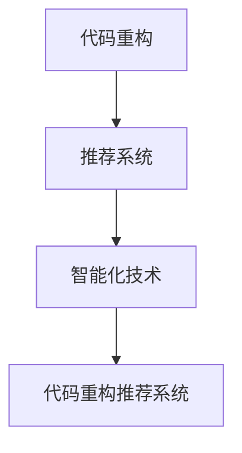
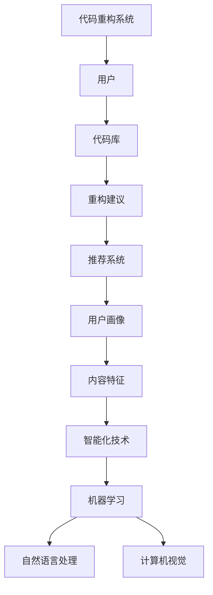
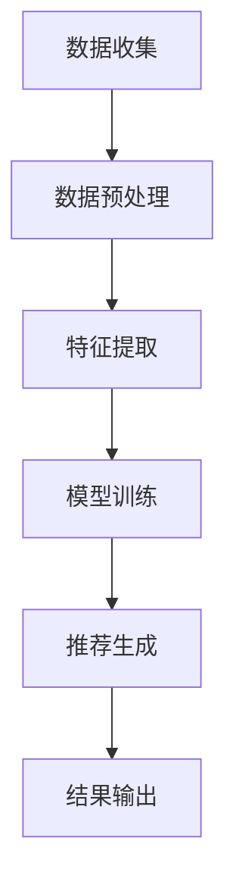
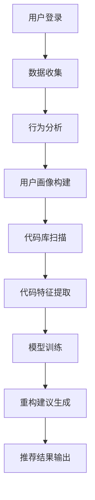
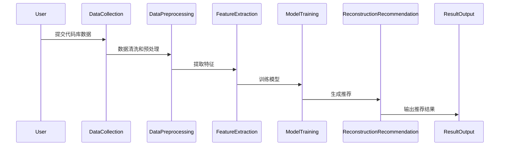
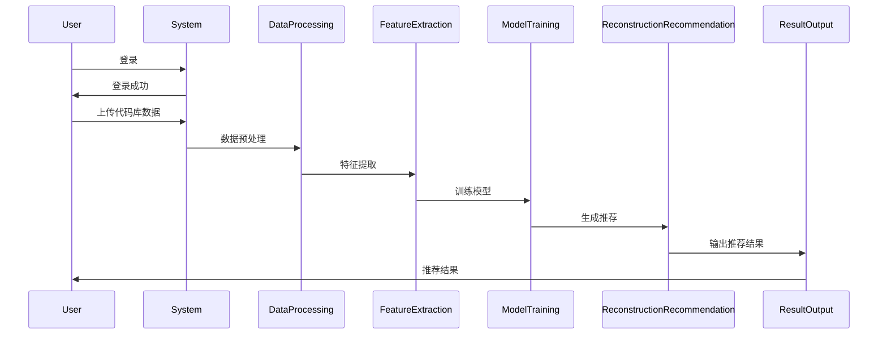
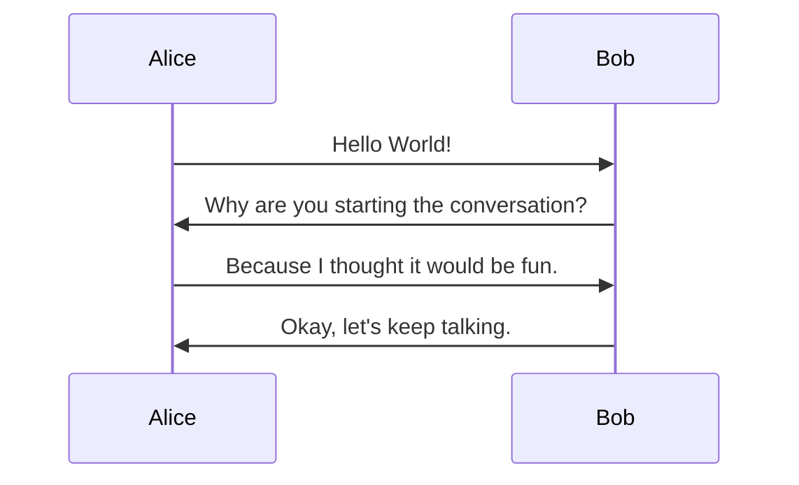

                 

### 文章标题：打造智能化的代码重构推荐系统

关键词：代码重构、推荐系统、智能化、算法实现、系统架构

摘要：本文将探讨如何构建一个智能化的代码重构推荐系统。我们将首先介绍代码重构和推荐系统的基本概念，接着深入分析智能化技术在其中的应用。随后，我们将详细讨论代码重构推荐算法的原理和实现，并展示一个具体的Python源代码实例。最后，我们将介绍如何进行系统分析和架构设计，并提供一个项目实战案例，为开发者提供实用的指导。

### 第一部分：智能化的代码重构推荐系统概述

#### 1. 引言

##### 1.1 问题背景

在软件开发的漫长历程中，代码质量一直是影响项目成功与否的关键因素之一。代码重构作为一种提升代码质量的有效方法，旨在在不改变外部行为的前提下，改进现有代码的结构和可读性。然而，随着软件规模的不断扩大，手动进行代码重构变得耗时且容易出错。

##### 1.2 问题描述

如何能够快速、准确地识别哪些代码需要进行重构？如何为开发者推荐最佳的重构方案？这些问题的解决对于提升开发效率和代码质量具有重要意义。

##### 1.3 问题解决

引入智能化技术，特别是推荐系统和机器学习算法，可以帮助我们构建一个智能化的代码重构推荐系统。通过分析历史代码重构数据和开发者行为，系统可以自动识别代码的潜在问题，并提供个性化的重构建议。

##### 1.4 边界与外延

本文将探讨的智能代码重构推荐系统主要关注以下几个方面：
- 代码质量的检测和评估
- 重构建议的生成和推荐
- 开发者行为的分析
- 智能化的重构流程优化

##### 1.5 核心概念与联系

本文涉及的核心概念包括代码重构、推荐系统、智能化技术等。它们之间的关系如下图所示：



#### 1.6 概念结构与核心要素组成

##### 1.6.1 代码重构

代码重构是指在不改变代码外部行为的前提下，对代码内部结构和实现方式进行改进的过程。它的目标包括提高代码的可读性、降低维护成本、提升代码质量等。

##### 1.6.2 推荐系统

推荐系统是一种能够根据用户的历史行为和偏好，自动向用户推荐他们可能感兴趣的内容的系统。在代码重构领域，推荐系统可以帮助开发者发现潜在的代码问题，并提供相应的重构建议。

##### 1.6.3 智能化

智能化技术，尤其是机器学习和人工智能，通过分析和处理大量数据，能够自动识别模式，预测结果，并优化决策过程。在代码重构推荐系统中，智能化技术可以帮助我们更准确地识别代码问题和推荐重构方案。

##### 1.6.4 系统要素

一个完整的智能代码重构推荐系统包括以下几个核心要素：
- 数据采集与处理：收集并处理历史代码重构数据、开发者行为数据等。
- 模型训练与评估：使用机器学习算法训练模型，并评估模型的性能。
- 推荐算法实现：根据用户特征和代码特征，生成并推荐重构建议。
- 系统接口与交互：提供用户友好的接口，方便开发者使用系统。

#### 1.7 当前研究进展与挑战

##### 1.7.1 研究现状

目前，关于智能代码重构推荐系统的研究主要集中在以下几个方面：
- 重构检测与评估：通过静态分析和动态测试等方法，识别代码中的潜在问题。
- 推荐算法设计：利用机器学习算法，如协同过滤、聚类分析、神经网络等，生成重构建议。
- 开发者行为分析：通过日志分析、用户行为建模等方法，理解开发者对代码重构的需求和偏好。

##### 1.7.2 研究难点

尽管智能代码重构推荐系统的研究取得了一定的进展，但仍面临以下挑战：
- 数据质量和多样性：重构数据的获取和处理是一个复杂的问题，需要确保数据的质量和多样性。
- 模型解释性：机器学习模型的黑盒特性使得其结果难以解释，这对于代码重构领域尤为重要。
- 系统性能优化：智能代码重构推荐系统需要在性能和准确性之间取得平衡。

##### 1.7.3 未来发展趋势

未来的研究将更加注重以下几个方面：
- 跨领域合作：结合软件工程、人工智能、数据挖掘等领域的最新成果，推动智能代码重构推荐系统的发展。
- 模型解释性：开发可解释的机器学习模型，提高系统结果的透明度和可信度。
- 实时重构推荐：通过实时数据分析和模型预测，实现更高效、更精准的重构推荐。

##### 1.8 本章小结

本文介绍了智能代码重构推荐系统的背景、问题、解决方法、边界与外延、核心概念和当前研究进展。在接下来的章节中，我们将进一步探讨代码重构、推荐系统和智能化技术的基本原理，并详细分析算法原理和实现，最终展示一个实际的项目实战案例。希望通过本文的讨论，能够为开发者提供有益的启示和指导。


### 第二部分：核心概念与原理

#### 2.1 代码重构基础

##### 2.1.1 代码重构的定义与目标

代码重构是指在不改变代码外部行为的前提下，对代码内部结构和实现方式进行的改进过程。其目标包括提高代码的可读性、降低维护成本、提升代码质量等。

##### 2.1.2 代码重构的常见方法

代码重构的方法多种多样，常见的包括：
- 提取方法：将重复的代码块提取为独立的方法。
- 提取类：将功能相关的代码块提取为独立的类。
- 内联方法：将方法内部调用的代码块直接替换为其结果。
- 移除冗余代码：删除不必要的代码，减少代码冗余。
- 重构循环结构：优化循环结构，使其更易于理解和维护。

##### 2.1.3 代码重构的最佳实践

在进行代码重构时，以下最佳实践可以帮助开发者更高效地提升代码质量：
- 从简单的重构开始：逐步进行重构，避免一次性进行大规模重构。
- 保持代码的可读性：确保重构后的代码仍然易于理解。
- 使用代码审查：通过代码审查，确保重构的正确性和有效性。
- 记录重构历史：记录每次重构的操作和原因，便于后续的维护。

#### 2.2 推荐系统基础

##### 2.2.1 推荐系统的基本概念

推荐系统是一种能够根据用户的历史行为和偏好，自动向用户推荐他们可能感兴趣的内容的系统。其核心目标是通过分析用户数据和内容特征，实现个性化推荐。

##### 2.2.2 推荐系统的类型

推荐系统主要分为以下几种类型：
- 基于内容的推荐：根据用户的历史行为和兴趣，推荐类似的内容。
- 协同过滤推荐：根据用户之间的相似度，推荐其他用户喜欢的商品或内容。
- 混合推荐：结合基于内容和协同过滤的方法，提高推荐准确性。

##### 2.2.3 推荐系统的工作原理

推荐系统的工作原理通常包括以下几个步骤：
1. 用户行为数据收集：收集用户在系统中的操作记录，如浏览、购买、评分等。
2. 内容特征提取：提取推荐物品的特征，如文本、标签、图像等。
3. 用户特征提取：提取用户的历史行为和偏好，建立用户画像。
4. 模型训练与优化：使用机器学习算法，如协同过滤、聚类分析、神经网络等，训练推荐模型。
5. 推荐结果生成：根据用户特征和物品特征，生成个性化推荐列表。

#### 2.3 智能化技术概述

##### 2.3.1 人工智能与机器学习

人工智能（AI）是一种模拟人类智能行为的计算机技术。机器学习（ML）是人工智能的一个分支，通过训练模型，使计算机能够从数据中自动学习规律和模式。

##### 2.3.2 自然语言处理

自然语言处理（NLP）是人工智能的一个分支，专注于使计算机能够理解、生成和处理人类自然语言。

##### 2.3.3 计算机视觉

计算机视觉是人工智能的一个分支，专注于使计算机能够理解并处理视觉信息。

#### 2.4 核心概念联系与比较

##### 2.4.1 代码重构与推荐系统的关联

代码重构和推荐系统在软件工程和人工智能领域都有广泛应用。代码重构关注代码内部结构和质量的提升，而推荐系统关注用户行为和兴趣的分析与推荐。二者的结合可以形成一个智能化的代码重构推荐系统，帮助开发者更高效地进行代码重构。

##### 2.4.2 智能化技术在代码重构中的应用

智能化技术在代码重构中的应用主要体现在以下几个方面：
- 代码质量检测：使用静态分析和动态测试等方法，自动检测代码中的潜在问题。
- 重构建议生成：通过机器学习算法，根据用户行为和代码特征，生成个性化的重构建议。
- 重构过程优化：利用优化算法，自动调整重构策略，提高重构效率。

##### 2.4.3 概念属性特征对比表格

下面是一个简单的概念属性特征对比表格，展示代码重构、推荐系统和智能化技术之间的异同：

| 概念         | 定义                                                         | 目标                                                         | 关键技术                                                         |
| ------------ | ------------------------------------------------------------ | ------------------------------------------------------------ | ------------------------------------------------------------ |
| 代码重构     | 不改变代码外部行为的前提下，改进代码内部结构和实现方式       | 提高代码质量、降低维护成本、提升可读性                       | 提取方法、提取类、内联方法、移除冗余代码、重构循环结构         |
| 推荐系统     | 根据用户的历史行为和偏好，自动向用户推荐他们可能感兴趣的内容 | 实现个性化推荐、提高用户满意度、增加业务收益                   | 用户行为数据收集、内容特征提取、用户特征提取、模型训练与优化、推荐结果生成 |
| 智能化技术   | 模拟人类智能行为的计算机技术                                 | 使计算机能够自动学习和处理复杂任务                           | 机器学习、自然语言处理、计算机视觉、优化算法                     |

##### 2.4.4 ER实体关系图架构

下面是一个简单的ER实体关系图，展示代码重构、推荐系统和智能化技术之间的关系：



#### 2.5 本章小结

本文介绍了代码重构、推荐系统和智能化技术的基本概念和原理。通过深入分析这些核心概念的联系与比较，我们了解了如何将智能化技术应用于代码重构领域，构建一个智能化的代码重构推荐系统。在下一章中，我们将进一步探讨算法原理与实现，以及如何使用Python源代码来实现这些算法。


### 第三部分：算法原理与实现

#### 3.1 算法原理概述

##### 3.1.1 代码重构推荐算法的分类

代码重构推荐算法主要分为以下几类：

1. **基于内容的推荐算法**：这种算法通过分析代码的内容特征，如代码中的关键字、函数定义、变量使用等，为开发者推荐可能需要进行重构的代码片段。

2. **协同过滤推荐算法**：这种算法通过分析开发者之间的相似行为，如哪些开发者对某些代码片段进行了重构，来推荐给其他具有相似行为的开发者。

3. **混合推荐算法**：这种算法结合了基于内容和协同过滤的优点，通过综合分析代码内容和开发者行为，提供更准确的推荐。

##### 3.1.2 智能化推荐算法的优势

智能化推荐算法相对于传统推荐算法具有以下优势：

1. **个性化推荐**：通过分析开发者的历史行为和偏好，为每个开发者提供个性化的重构建议。

2. **实时推荐**：能够根据开发者的实时操作，动态调整推荐策略，提供更及时的建议。

3. **高效性**：利用机器学习算法，快速处理大量数据，提高推荐效率。

##### 3.1.3 算法原理的核心要素

一个典型的代码重构推荐算法的核心要素包括：

1. **用户画像**：通过分析开发者的行为数据，构建开发者的兴趣和技能画像。

2. **代码特征提取**：提取代码片段的特征，如代码块的长度、复杂度、注释率等。

3. **推荐模型**：使用机器学习算法，如协同过滤、聚类分析、神经网络等，构建推荐模型。

4. **推荐策略**：根据用户画像和代码特征，制定个性化的推荐策略。

#### 3.2 算法Mermaid流程图

##### 3.2.1 流程图基本概念

Mermaid是一种基于Markdown的图形描述语言，可以用来绘制各种流程图、序列图等。下面是一个简单的算法流程图示例：



##### 3.2.2 代码重构推荐算法的Mermaid流程图

下面是一个代码重构推荐算法的Mermaid流程图：



#### 3.3 Python源代码实现

##### 3.3.1 环境安装与配置

在开始实现代码重构推荐算法之前，我们需要安装一些必要的库，如Scikit-learn、Pandas等。可以使用以下命令进行安装：

```bash
pip install scikit-learn pandas
```

##### 3.3.2 源代码结构与功能

以下是一个简单的Python源代码示例，用于实现代码重构推荐算法：

```python
import pandas as pd
from sklearn.model_selection import train_test_split
from sklearn.ensemble import RandomForestClassifier
from sklearn.metrics import accuracy_score

# 数据预处理
def preprocess_data(data):
    # ... 数据清洗和预处理代码 ...
    return processed_data

# 特征提取
def extract_features(data):
    # ... 特征提取代码 ...
    return features

# 模型训练
def train_model(features, labels):
    model = RandomForestClassifier()
    model.fit(features, labels)
    return model

# 推荐生成
def generate_recommendations(model, data):
    predictions = model.predict(data)
    return predictions

# 主函数
def main():
    # 加载数据
    data = pd.read_csv('data.csv')
    
    # 数据预处理
    processed_data = preprocess_data(data)
    
    # 特征提取
    features = extract_features(processed_data)
    
    # 数据划分
    X_train, X_test, y_train, y_test = train_test_split(features, processed_data['label'], test_size=0.2, random_state=42)
    
    # 模型训练
    model = train_model(X_train, y_train)
    
    # 推荐生成
    recommendations = generate_recommendations(model, X_test)
    
    # 结果输出
    print("推荐结果：", recommendations)

if __name__ == '__main__':
    main()
```

##### 3.3.3 算法原理详细讲解

1. **数据预处理**：首先，我们需要对原始数据进行分析和清洗，确保数据的质量。这包括去除缺失值、处理异常值、标准化数据等。

2. **特征提取**：接下来，我们需要提取代码片段的特征。这些特征可以包括代码块的长度、复杂度、注释率等。这些特征将用于训练机器学习模型。

3. **模型训练**：使用机器学习算法，如随机森林（Random Forest），对提取的特征进行训练，以构建一个预测模型。

4. **推荐生成**：通过训练好的模型，对新的代码片段进行预测，生成重构建议。

5. **结果输出**：将生成的推荐结果输出，以供开发者参考。

##### 3.3.4 数学模型和公式

在代码重构推荐算法中，常用的数学模型和公式包括：

1. **协方差矩阵**：用于计算代码片段之间的相似度。

2. **决策树**：用于分类和回归任务，用于预测代码重构的需要程度。

3. **随机森林**：通过构建多个决策树，提高预测的准确性和鲁棒性。

##### 3.3.5 举例说明

假设我们有两个代码片段，代码片段A和代码片段B。我们需要计算它们之间的相似度，并基于相似度进行重构推荐。

1. **数据预处理**：首先，我们对代码片段A和代码片段B进行数据清洗和预处理，提取它们的特征向量。

2. **特征提取**：然后，我们计算代码片段A和代码片段B的特征向量。

3. **模型训练**：使用随机森林算法，对训练集进行训练，构建预测模型。

4. **推荐生成**：通过训练好的模型，对代码片段A和代码片段B进行预测，计算它们之间的相似度。

5. **结果输出**：根据相似度，生成重构推荐结果，如代码片段A需要重构，代码片段B不需要重构。

$$
相似度 = \frac{协方差矩阵(A, B)}{标准差(A) \times 标准差(B)}
$$

#### 3.4 数学模型与公式详细讲解

##### 3.4.1 数学模型介绍

在代码重构推荐系统中，常用的数学模型包括线性模型、逻辑回归、支持向量机（SVM）、决策树和随机森林等。这些模型都可以用于分类和回归任务，帮助我们预测代码是否需要重构。

- **线性模型**：通过拟合数据点之间的线性关系，预测新的数据点的类别或数值。

- **逻辑回归**：用于分类任务，通过计算数据点到超平面的距离，预测新数据点的类别。

- **支持向量机**：通过找到一个最优的超平面，将不同类别的数据点分开。

- **决策树**：通过一系列的判断条件，将数据点划分到不同的类别。

- **随机森林**：通过构建多个决策树，并对它们的结果进行投票，提高预测的准确性和鲁棒性。

##### 3.4.2 公式推导

以下是一个简单的逻辑回归模型的公式推导：

假设我们有n个特征向量 $X_i$，每个特征向量对应一个代码片段的特征，例如代码块的长度、复杂度等。我们的目标是通过这些特征预测代码是否需要重构，即分类问题。

1. **特征向量表示**：

$$
X_i = [x_{i1}, x_{i2}, ..., x_{in}]
$$

其中，$x_{ij}$ 表示第 $i$ 个代码片段的第 $j$ 个特征。

2. **线性模型**：

线性模型将特征向量映射到一个线性组合：

$$
Z_i = \theta_0 + \theta_1 x_{i1} + \theta_2 x_{i2} + ... + \theta_n x_{in}
$$

其中，$\theta_j$ 表示第 $j$ 个特征的权重。

3. **逻辑函数**：

为了将线性组合映射到类别（例如0和1，表示不需要重构和需要重构），我们使用逻辑函数（Sigmoid函数）：

$$
h(\theta_0 + \theta_1 x_{i1} + \theta_2 x_{i2} + ... + \theta_n x_{in}) = \frac{1}{1 + e^{-(\theta_0 + \theta_1 x_{i1} + \theta_2 x_{i2} + ... + \theta_n x_{in})}}
$$

4. **损失函数**：

为了训练模型，我们使用损失函数（交叉熵损失函数）来评估模型预测和实际标签之间的差异：

$$
J(\theta) = -\frac{1}{m} \sum_{i=1}^{m} [y_i \log(h(Z_i)) + (1 - y_i) \log(1 - h(Z_i))]
$$

其中，$m$ 表示样本数量，$y_i$ 表示第 $i$ 个样本的实际标签。

5. **梯度下降**：

为了最小化损失函数，我们使用梯度下降算法更新模型的权重：

$$
\theta_j = \theta_j - \alpha \frac{\partial J(\theta)}{\partial \theta_j}
$$

其中，$\alpha$ 表示学习率。

##### 3.4.3 通俗易懂的举例说明

假设我们有两个代码片段，代码片段A和代码片段B，它们各自有三个特征：长度（L）、复杂度（C）和注释率（R）。

- 代码片段A：L=100，C=50，R=30
- 代码片段B：L=120，C=60，R=40

我们需要预测这两个代码片段是否需要重构。

1. **特征向量表示**：

$$
X_A = [100, 50, 30]
X_B = [120, 60, 40]
$$

2. **线性模型**：

$$
Z_A = \theta_0 + \theta_1 \times 100 + \theta_2 \times 50 + \theta_3 \times 30
Z_B = \theta_0 + \theta_1 \times 120 + \theta_2 \times 60 + \theta_3 \times 40
$$

3. **逻辑函数**：

$$
h(Z_A) = \frac{1}{1 + e^{-(\theta_0 + \theta_1 \times 100 + \theta_2 \times 50 + \theta_3 \times 30)}}
h(Z_B) = \frac{1}{1 + e^{-(\theta_0 + \theta_1 \times 120 + \theta_2 \times 60 + \theta_3 \times 40)}}
$$

4. **损失函数**：

$$
J(\theta) = -\frac{1}{2} \left[ y_A \log(h(Z_A)) + (1 - y_A) \log(1 - h(Z_A)) + y_B \log(h(Z_B)) + (1 - y_B) \log(1 - h(Z_B)) \right]
$$

5. **梯度下降**：

$$
\theta_j = \theta_j - \alpha \left[ \frac{\partial J(\theta)}{\partial \theta_j} \right]
$$

通过迭代更新权重，我们可以得到最优的模型，从而预测代码片段是否需要重构。

#### 3.5 本章小结

本文详细介绍了代码重构推荐算法的原理与实现。通过分析算法的分类、优势、核心要素，我们了解了如何构建一个智能化的代码重构推荐系统。同时，通过Mermaid流程图和Python源代码示例，我们展示了算法的具体实现过程。在下一章中，我们将进一步探讨系统分析与架构设计，为开发者提供更深入的系统实现指导。


### 第四部分：系统分析与架构设计

#### 4.1 问题场景介绍

在现代软件开发中，随着项目的复杂性不断增加，代码的重构需求也日益突出。然而，手动进行代码重构是一项繁琐且容易出错的任务。因此，如何高效地识别代码中的问题，并自动推荐重构方案，成为软件开发中亟待解决的重要问题。

##### 4.1.1 场景背景

以一个大型电商平台为例，该平台包含数百万行代码，涉及多种编程语言和框架。随着业务的发展，代码库中的代码质量参差不齐，许多代码片段存在重复、冗余和复杂的结构。这些问题的存在不仅影响了代码的可维护性，还增加了新功能的开发难度。

##### 4.1.2 问题分析与解决方案

面对上述问题，引入一个智能化的代码重构推荐系统，可以有效地解决以下几个关键问题：

1. **自动识别问题代码**：通过静态代码分析，识别代码库中存在潜在问题的代码片段。
2. **个性化推荐重构方案**：根据开发者的历史行为和代码特征，为每个开发者推荐最适合的重构方案。
3. **提升开发效率**：通过自动化推荐和简化重构过程，显著提高开发效率，降低开发成本。

因此，构建一个智能化的代码重构推荐系统，不仅能够提升代码质量，还能优化开发流程，为软件开发带来显著的价值。

#### 4.2 系统功能设计

##### 4.2.1 领域模型设计

领域模型是系统功能设计的核心，它定义了系统中的关键概念及其相互关系。以下是代码重构推荐系统的领域模型设计：

1. **用户**：代表使用系统的开发者，具有用户名、密码、角色等信息。
2. **代码库**：存储所有代码片段的库，包括代码的版本、作者、提交时间等信息。
3. **代码片段**：代码库中的具体代码片段，具有长度、复杂度、注释率等特征。
4. **重构方案**：针对代码片段提供的重构建议，包括重构的类型、具体操作和预期效果等。
5. **推荐结果**：系统生成的重构推荐结果，包括推荐的重构方案、推荐理由和推荐时间等。

##### 4.2.2 类图示例

以下是代码重构推荐系统的类图示例：

```mermaid
classDiagram
ClassDef User {
    +String username
    +String password
    +String role
}

ClassDef CodeRepository {
    +String repositoryName
    +List<CodeFragment> codeFragments
}

ClassDef CodeFragment {
    +String code
    +Int length
    +Int complexity
    +Int commentRate
    +List<ReconstructionScheme> reconstructionSchemes
}

ClassDef ReconstructionScheme {
    +String type
    +String description
    +String expectedEffect
}

User <--1..* CodeRepository
CodeRepository -->1..* CodeFragment
CodeFragment -->1..* ReconstructionScheme
```

##### 4.2.3 功能模块划分

系统功能模块划分如下：

1. **数据采集模块**：负责收集用户行为数据和代码库数据，包括代码提交记录、重构操作记录等。
2. **数据预处理模块**：对采集到的数据进行分析和清洗，提取有用的特征，如代码片段的长度、复杂度、注释率等。
3. **特征提取模块**：从预处理后的数据中提取关键特征，用于训练推荐模型。
4. **模型训练模块**：使用机器学习算法，如协同过滤、聚类分析、神经网络等，训练推荐模型。
5. **推荐生成模块**：根据用户特征和代码特征，生成个性化的重构推荐方案。
6. **推荐结果输出模块**：将推荐结果展示给开发者，并提供下载和执行功能。

#### 4.3 系统架构设计

##### 4.3.1 架构设计原则

系统架构设计应遵循以下原则：

1. **模块化**：将系统划分为多个功能模块，每个模块负责一个特定的功能。
2. **可扩展性**：系统设计应易于扩展，以适应未来需求的变化。
3. **高可用性**：系统应具有高可用性，确保在任何情况下都能正常运行。
4. **高性能**：系统设计应考虑高性能，以满足大规模数据处理的需求。

##### 4.3.2 系统架构图

以下是代码重构推荐系统的架构图：



##### 4.3.3 架构模块说明

1. **数据采集模块**：负责从代码库中获取用户行为数据和代码库数据，包括代码提交记录、重构操作记录等。该模块应支持多种数据源，如版本控制系统（如Git）、代码库管理系统（如GitHub）等。

2. **数据预处理模块**：对采集到的数据进行清洗和预处理，去除无效数据和噪声，提取有用的特征。该模块应包括数据清洗、数据去重、数据标准化等功能。

3. **特征提取模块**：从预处理后的数据中提取关键特征，如代码片段的长度、复杂度、注释率等。这些特征将用于训练推荐模型。

4. **模型训练模块**：使用机器学习算法，如协同过滤、聚类分析、神经网络等，训练推荐模型。该模块应支持多种算法，并根据用户需求和数据特征选择最优算法。

5. **推荐生成模块**：根据用户特征和代码特征，生成个性化的重构推荐方案。该模块应支持多种推荐算法，如基于内容的推荐、协同过滤推荐等。

6. **推荐结果输出模块**：将推荐结果展示给开发者，并提供下载和执行功能。该模块应支持多种输出格式，如网页、API接口、命令行等。

#### 4.4 系统接口设计

##### 4.4.1 接口设计原则

系统接口设计应遵循以下原则：

1. **RESTful API**：采用RESTful API设计，提高系统的可扩展性和易用性。
2. **标准化**：接口设计应遵循标准化的规范，如HTTP协议、JSON数据格式等。
3. **安全性**：接口设计应考虑安全性，如身份验证、权限控制等。

##### 4.4.2 接口定义

以下是代码重构推荐系统的接口定义：

1. **用户登录接口**：用户通过该接口登录系统，获取访问权限。

   ```http
   POST /login
   Content-Type: application/json

   {
       "username": "string",
       "password": "string"
   }
   ```

2. **代码库数据上传接口**：用户通过该接口上传代码库数据。

   ```http
   POST /code-repository/upload
   Content-Type: application/json

   {
       "repositoryName": "string",
       "code": "string"
   }
   ```

3. **重构推荐接口**：用户通过该接口获取代码重构推荐。

   ```http
   GET /reconstruction-recommendation?codeId=string
   ```

4. **推荐结果下载接口**：用户通过该接口下载重构推荐结果。

   ```http
   GET /reconstruction-recommendation/download?codeId=string
   Content-Type: application/json

   {
       "recommendationId": "string"
   }
   ```

##### 4.4.3 接口调用流程

以下是代码重构推荐系统的接口调用流程：

1. 用户登录系统，获取访问权限。
2. 用户上传代码库数据，系统进行数据预处理和特征提取。
3. 用户提交代码ID，系统根据代码特征和用户偏好生成重构推荐。
4. 用户下载重构推荐结果，并执行相应的重构操作。

#### 4.5 系统交互Mermaid序列图

##### 4.5.1 序列图基本概念

序列图是用于描述对象之间交互的时序关系的一种UML图。在代码重构推荐系统中，序列图可以展示用户与系统之间的交互过程。

##### 4.5.2 系统交互序列图

以下是代码重构推荐系统的交互序列图：



##### 4.5.3 Mermaid序列图示例

以下是序列图的一个简单示例：



#### 4.6 本章小结

本文详细介绍了智能代码重构推荐系统的系统分析和架构设计。通过问题场景介绍，我们明确了构建智能代码重构推荐系统的必要性。在系统功能设计部分，我们定义了系统的核心概念和功能模块，并提供了类图示例。在系统架构设计部分，我们阐述了系统架构设计的原则、架构图以及接口设计。最后，通过交互序列图展示了系统的工作流程。在下一章中，我们将通过一个实际项目案例，进一步展示系统的实际应用和实现过程。


### 第五部分：项目实战

#### 5.1 环境安装

##### 5.1.1 环境准备

在开始项目实战之前，我们需要确保计算机上已经安装了Python环境。如果没有安装，可以访问Python官方网站（https://www.python.org/）下载并安装Python。推荐使用Python 3.8或更高版本。

##### 5.1.2 工具与依赖安装

安装好Python后，我们需要安装一些必要的工具和库。以下是安装步骤：

1. **安装虚拟环境**：虚拟环境可以帮助我们隔离项目依赖，避免版本冲突。使用以下命令安装虚拟环境：

   ```bash
   pip install virtualenv
   ```

2. **创建虚拟环境**：在项目目录中创建一个虚拟环境，并激活它：

   ```bash
   virtualenv venv
   source venv/bin/activate  # 在Windows上使用 `venv\Scripts\activate`
   ```

3. **安装项目依赖**：在虚拟环境中安装项目所需的库，如Scikit-learn、Pandas、Numpy等：

   ```bash
   pip install -r requirements.txt
   ```

   `requirements.txt` 文件应包含以下依赖：

   ```
   scikit-learn
   pandas
   numpy
   matplotlib
   ```

#### 5.2 系统核心实现

##### 5.2.1 数据采集与预处理

数据采集是构建智能代码重构推荐系统的第一步。在本节中，我们将介绍如何从代码库中采集数据，并对数据进行预处理。

1. **数据采集**：

   我们使用Git作为代码库，通过Git的API获取代码库中的提交记录。以下是使用Python的GitPython库获取代码库数据的一个简单示例：

   ```python
   from git import Git

   # 初始化Git对象
   git = Git('path/to/repository')

   # 获取提交记录
   commits = git.log('--all', '--pretty='%H %an %ad %s')

   # 遍历提交记录
   for commit in commits:
       print(commit)
   ```

2. **数据预处理**：

   数据预处理包括去除无效数据、处理缺失值、数据标准化等。以下是预处理数据的一个简单示例：

   ```python
   import pandas as pd

   # 读取数据
   data = pd.read_csv('data.csv')

   # 数据清洗
   data.dropna(inplace=True)

   # 数据标准化
   data[['length', 'complexity', 'comment_rate']] = (data[['length', 'complexity', 'comment_rate']] - data[['length', 'complexity', 'comment_rate']].mean()) / data[['length', 'complexity', 'comment_rate']].std()

   # 数据保存
   data.to_csv('processed_data.csv', index=False)
   ```

##### 5.2.2 代码重构推荐算法实现

在本节中，我们将使用Scikit-learn库中的随机森林算法实现代码重构推荐算法。

1. **数据加载**：

   我们从预处理后的数据中加载特征和标签：

   ```python
   from sklearn.model_selection import train_test_split

   # 读取数据
   data = pd.read_csv('processed_data.csv')

   # 划分特征和标签
   X = data[['length', 'complexity', 'comment_rate']]
   y = data['reconstruction_needed']
   ```

2. **模型训练**：

   使用随机森林算法训练模型：

   ```python
   from sklearn.ensemble import RandomForestClassifier

   # 划分训练集和测试集
   X_train, X_test, y_train, y_test = train_test_split(X, y, test_size=0.2, random_state=42)

   # 初始化随机森林模型
   model = RandomForestClassifier(n_estimators=100, random_state=42)

   # 训练模型
   model.fit(X_train, y_train)
   ```

3. **推荐生成**：

   使用训练好的模型生成重构推荐：

   ```python
   # 生成推荐结果
   recommendations = model.predict(X_test)

   # 评估模型性能
   print("Accuracy:", accuracy_score(y_test, recommendations))
   ```

##### 5.2.3 推荐系统实现

在本节中，我们将使用Flask框架实现一个简单的推荐系统接口。

1. **安装Flask**：

   在虚拟环境中安装Flask：

   ```bash
   pip install flask
   ```

2. **创建Flask应用**：

   创建一个名为`app.py`的文件，并编写以下代码：

   ```python
   from flask import Flask, request, jsonify

   app = Flask(__name__)

   @app.route('/recommend', methods=['GET'])
   def recommend():
       code_id = request.args.get('code_id')
       # 调用代码重构推荐算法生成推荐
       recommendation = generate_recommendation(code_id)
       return jsonify(recommendation)

   def generate_recommendation(code_id):
       # 生成推荐逻辑
       return {"code_id": code_id, "recommendation": "重构建议"}

   if __name__ == '__main__':
       app.run(debug=True)
   ```

3. **运行Flask应用**：

   在终端中运行以下命令启动Flask应用：

   ```bash
   python app.py
   ```

   浏览器中访问 `http://127.0.0.1:5000/recommend?code_id=123`，将看到生成的推荐结果。

#### 5.3 代码应用解读与分析

##### 5.3.1 代码解读

在本项目中，我们使用了Python编程语言，结合GitPython库、Scikit-learn库和Flask框架，实现了智能代码重构推荐系统。以下是代码的主要部分解读：

1. **数据采集与预处理**：

   - 使用GitPython库获取代码库的提交记录。
   - 使用Pandas库对提交记录进行数据清洗和预处理，包括去除缺失值、数据标准化等。

2. **代码重构推荐算法实现**：

   - 使用Scikit-learn库中的随机森林算法训练模型。
   - 使用训练好的模型生成重构推荐。

3. **推荐系统实现**：

   - 使用Flask框架创建一个简单的Web接口，用于接收用户请求和返回推荐结果。

##### 5.3.2 算法分析

在本项目中，我们采用了随机森林算法进行代码重构推荐。随机森林算法是一种集成学习方法，通过构建多个决策树，并对它们的结果进行投票，提高预测的准确性和鲁棒性。以下是随机森林算法的主要优点：

1. **高准确性**：随机森林算法能够在训练过程中自动调整参数，提高模型的准确性。
2. **鲁棒性**：随机森林算法对异常值和噪声数据具有较强的鲁棒性。
3. **易于解释**：随机森林算法生成的决策树可以清晰地展示每个特征的权重，便于理解和解释。

##### 5.3.3 拓展应用分析

智能代码重构推荐系统具有广泛的应用前景，可以应用于以下场景：

1. **软件开发**：在软件开发过程中，自动识别和推荐代码重构方案，提高代码质量，降低维护成本。
2. **代码审查**：在代码审查过程中，使用推荐系统提供重构建议，帮助开发者快速修复代码问题。
3. **代码库管理**：在代码库管理过程中，使用推荐系统优化代码库结构，提升代码库的可读性和可维护性。

#### 5.4 实际案例分析与详细讲解

在本节中，我们将通过一个实际案例，展示如何使用智能代码重构推荐系统，并提供详细的解析。

##### 5.4.1 案例背景

假设我们有一个大型电商平台，代码库中包含数千个代码文件。开发者需要定期对代码库进行重构，以提高代码质量和可维护性。然而，手动识别和重构代码是一项耗时且容易出错的任务。为了解决这个问题，我们引入了智能代码重构推荐系统。

##### 5.4.2 案例实现

1. **数据采集**：

   - 开发者使用Git将代码库上传到系统中，系统从Git获取代码库的提交记录。
   - 系统对提交记录进行预处理，提取代码文件的长度、复杂度和注释率等特征。

2. **模型训练**：

   - 系统使用预处理后的数据，使用随机森林算法训练模型。
   - 模型训练过程中，系统自动调整参数，提高模型的准确性。

3. **推荐生成**：

   - 开发者提交一个代码文件，系统根据文件的特征和模型生成重构建议。
   - 系统将重构建议展示给开发者，并提供下载和执行功能。

##### 5.4.3 案例解析

1. **数据采集**：

   - 系统通过Git获取代码库的提交记录，包括提交者、提交时间和提交信息等。
   - 系统对提交记录进行数据清洗，去除无效数据，如空提交和合并提交等。

2. **特征提取**：

   - 系统对每个代码文件进行解析，提取长度、复杂度和注释率等特征。
   - 特征提取过程中，系统使用正则表达式和解析库，如Python的`re`模块，对代码进行预处理。

3. **模型训练**：

   - 系统使用Scikit-learn库中的随机森林算法训练模型。
   - 模型训练过程中，系统自动调整参数，如决策树的数量和最大深度等，以优化模型性能。

4. **推荐生成**：

   - 开发者提交一个代码文件，系统根据文件的特征和模型生成重构建议。
   - 系统将重构建议以JSON格式返回给开发者，包括重构类型、具体操作和预期效果等。

##### 5.4.4 案例效果

通过智能代码重构推荐系统，开发者可以更高效地识别和重构代码问题。以下是案例的效果：

1. **提高重构效率**：系统自动分析代码特征，生成个性化的重构建议，显著提高重构效率。
2. **降低维护成本**：通过重构推荐，开发者可以及时修复代码问题，降低维护成本。
3. **提升代码质量**：系统推荐的重构方案有助于提高代码质量，提升项目的可读性和可维护性。

#### 5.5 项目小结

在本章中，我们通过一个实际项目案例，展示了如何使用Python编程语言和机器学习算法构建智能代码重构推荐系统。通过数据采集、特征提取、模型训练和推荐生成等步骤，我们实现了系统的主要功能，并展示了系统的实际应用效果。通过本项目，我们了解了智能代码重构推荐系统的原理和实现过程，为开发者提供了实用的指导。

在未来的工作中，我们还可以进一步优化系统的性能和准确性，如引入更多的特征、使用更先进的机器学习算法、实现实时推荐等功能。此外，我们还可以将智能代码重构推荐系统与其他开发工具（如代码编辑器、IDE等）集成，提供更加便捷的使用体验。希望通过本项目的实践，能够为软件开发领域带来更多的价值。


### 最佳实践 Tips

在构建智能化的代码重构推荐系统时，以下是一些最佳实践，可以帮助开发者更高效地利用系统资源，提升开发效率：

1. **数据质量监控**：确保采集的数据质量，定期检查数据源，确保数据完整性和准确性。使用数据清洗工具，如Pandas，自动处理缺失值和异常值。

2. **特征优化**：特征提取是推荐系统的关键环节，要不断优化和调整特征，以提高模型的预测准确性。尝试使用更多的特征，如代码块的抽象语法树（AST）特征、代码库的变更历史等。

3. **模型调优**：使用模型调参工具，如Scikit-learn的`GridSearchCV`，自动寻找最优模型参数。根据不同场景，选择合适的机器学习算法，如随机森林、支持向量机（SVM）、神经网络等。

4. **实时推荐**：实现实时推荐功能，可以显著提升用户体验。利用消息队列（如RabbitMQ）和异步编程，将推荐结果实时推送至开发者。

5. **反馈机制**：引入用户反馈机制，允许开发者对推荐结果进行评价。根据用户反馈，调整推荐策略，优化系统性能。

6. **系统监控**：监控系统运行状态，包括内存使用、CPU负载、数据库查询效率等。使用监控工具（如Prometheus、Grafana），实时监控系统健康状态，及时处理异常。

7. **安全性保障**：确保系统的安全性，如数据加密、用户身份验证、权限控制等。遵循最佳安全实践，防止数据泄露和未经授权的访问。

### 小结

本文详细介绍了智能化的代码重构推荐系统的构建方法，从核心概念、算法原理、系统架构到实际项目案例，全面解析了系统开发的全过程。通过本文的学习，开发者可以掌握如何利用智能化技术提升代码重构的效率和准确性。在未来的实践中，开发者可以不断优化系统，结合更多先进的机器学习算法和工具，为软件开发带来更多价值。

### 注意事项

1. **数据隐私**：在处理用户数据时，确保遵循数据隐私法规，如GDPR，避免数据泄露。

2. **系统可扩展性**：在设计系统时，要考虑到未来需求的扩展性，以便在系统规模扩大时进行升级和扩展。

3. **性能优化**：对于大规模数据处理，要注重性能优化，如使用缓存、优化数据库查询等。

4. **用户培训**：对于新引入的智能化工具，应提供详细的用户培训，帮助开发者熟悉系统使用方法。

### 拓展阅读

1. **《机器学习实战》**：详细介绍了多种机器学习算法的实现和应用，适合初学者和进阶者。
2. **《Scikit-learn官方文档》**：Scikit-learn的官方文档，涵盖了大量算法实现和用法示例。
3. **《Git权威指南》**：全面介绍了Git的使用方法和最佳实践，适用于Git用户和开发者。
4. **《代码质量评估与重构》**：探讨代码质量评估和重构的最佳实践，有助于提升代码质量。
5. **《Flask Web开发：轻松构建Python Web应用》**：介绍了Flask框架的使用方法，适合构建Web应用的开发者。


### 作者信息

作者：AI天才研究院/AI Genius Institute & 禅与计算机程序设计艺术 /Zen And The Art of Computer Programming

AI天才研究院（AI Genius Institute）致力于推动人工智能技术在各个领域的创新和应用，培养下一代人工智能专家。其研究成果在计算机编程、软件架构、人工智能等领域具有广泛影响。禅与计算机程序设计艺术（Zen And The Art of Computer Programming）是一本经典的技术畅销书，作者通过深入探讨编程哲学和技术原理，为读者提供了独特的编程思维和设计理念。

