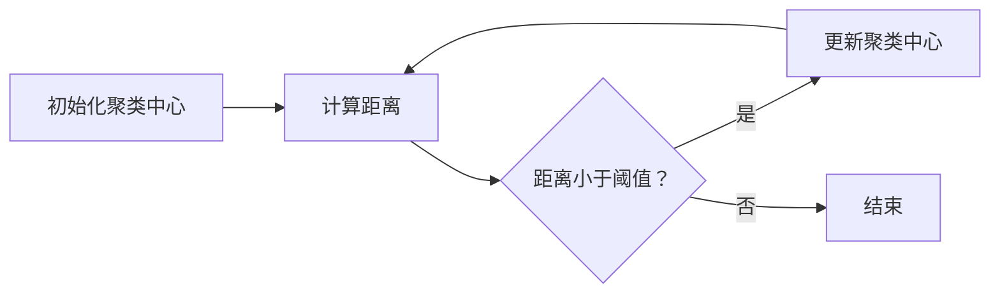
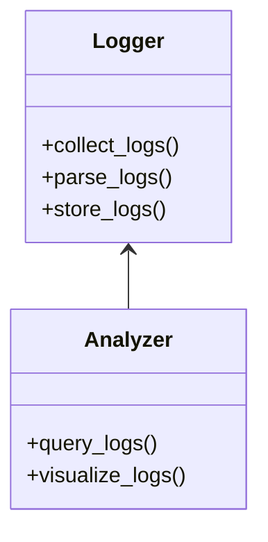
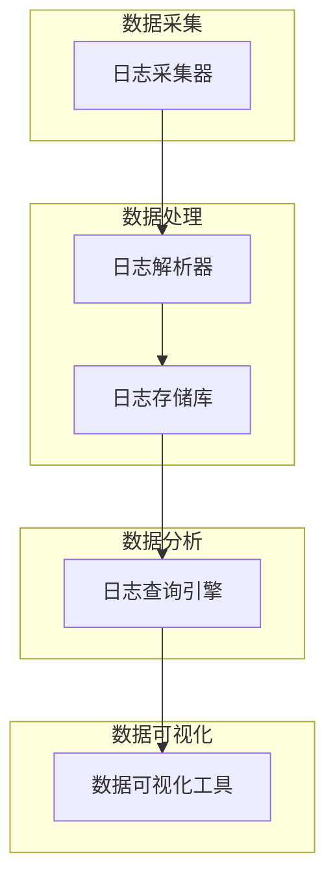
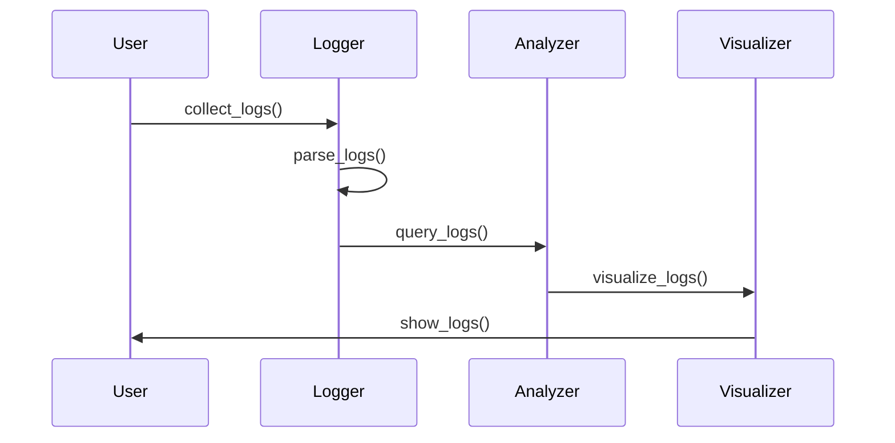

                 

# 打造智能化的日志分析平台

## 关键词
- 智能日志分析
- 日志分析平台
- 架构设计
- 算法原理
- 数学模型
- 项目实战

## 摘要
本文旨在深入探讨如何打造一个智能化的日志分析平台。我们将从日志分析的重要性入手，逐步介绍日志分析平台的核心概念与联系，解析智能日志分析算法原理及数学模型，详细阐述系统分析与架构设计，并通过实际项目实战来展示平台的实现和应用。文章最后还将提供最佳实践、注意事项及拓展阅读，帮助读者更好地理解和应用日志分析技术。

## 第一部分：日志分析平台概述

### 第1章：日志分析平台的背景与重要性

#### 1.1 日志分析的定义
日志分析是指通过对系统、应用程序或网络设备生成的日志数据进行提取、处理、分析，以获取有价值的信息和洞察的过程。日志数据记录了系统运行中的各类事件和状态变化，是故障诊断、性能优化、安全监控的重要依据。

#### 1.2 日志分析在现代IT运维中的地位
日志分析在现代IT运维中扮演着至关重要的角色。它不仅有助于快速定位问题、优化系统性能，还能通过监控用户行为、检测异常活动来提高网络安全。随着云计算、大数据和人工智能技术的发展，日志分析逐渐成为企业数字化转型的核心组件。

#### 1.3 日志分析的重要性与挑战
日志分析的重要性不言而喻，但同时也面临着诸多挑战，如海量日志数据的处理、日志格式的多样性、实时性要求高等。此外，日志分析还需要考虑数据的存储、索引和查询效率，以及如何有效利用日志数据来指导业务决策。

### 第2章：日志分析平台的核心概念与联系

#### 2.1 日志分析平台的基本架构
日志分析平台通常包括数据采集、数据存储、数据处理、数据分析和数据可视化等模块。各模块之间通过高效的数据流和接口进行集成，形成一个完整的数据处理与分析闭环。

#### 2.2 核心概念与联系
日志分析平台涉及多个核心概念，如日志采集器、日志解析器、日志存储库、日志查询引擎、数据可视化工具等。以下是一个核心概念属性的对比表格：

| 概念         | 功能描述                                                     | 关联关系               |
| ------------ | ------------------------------------------------------------ | ---------------------- |
| 日志采集器   | 负责从各种来源（如应用程序、系统、网络设备）收集日志数据           | 集成于日志分析平台     |
| 日志解析器   | 对采集到的日志数据进行解析，提取有用的信息和字段                 | 集成于日志分析平台     |
| 日志存储库   | 存储解析后的日志数据，支持高效的数据查询和索引                 | 集成于日志分析平台     |
| 日志查询引擎 | 提供对日志数据的查询功能，支持各种查询条件和聚合操作           | 集成于日志分析平台     |
| 数据可视化工具 | 将分析结果以图表、仪表板等形式直观地展示给用户               | 集成于日志分析平台     |

使用Mermaid ER实体关系图可以更清晰地展示这些核心概念及其关系：

```mermaid
erDiagram
  日志采集器 ||--|{ 日志解析器 }
  日志解析器 ||--|{ 日志存储库 }
  日志存储库 ||--|{ 日志查询引擎 }
  日志查询引擎 ||--|{ 数据可视化工具 }
```

### 第3章：智能日志分析算法原理讲解

#### 3.1 常见日志分析算法
智能日志分析算法主要包括聚类算法、关联规则算法、异常检测算法等。这些算法在处理海量日志数据、发现潜在问题和趋势方面发挥着重要作用。

#### 3.2 算法mermaid流程图展示
以下是一个基于K-means算法的日志聚类流程图：



#### 3.3 算法原理的数学模型和公式讲解
K-means算法的数学模型如下：

$$
\min \sum_{i=1}^k \sum_{x \in S_i} \| \mathbf{x} - \mathbf{u}_i \|^2
$$

其中，$k$为聚类个数，$S_i$为第$i$个聚类集合，$\mathbf{u}_i$为聚类中心。

#### 3.4 算法实例分析
假设我们有一组日志数据，数据维度为3，分别表示时间戳、访问路径和响应时间。通过K-means算法，我们可以将这组数据聚类为两个群组，分别代表正常流量和异常流量。

$$
\begin{aligned}
  \mathbf{X} &= \{ (\mathbf{x}_1, \mathbf{x}_2, \mathbf{x}_3), ..., (\mathbf{x}_m, \mathbf{x}_{m+1}, \mathbf{x}_{m+2}) \} \\
  \mathbf{u}_1 &= (\mu_1^1, \mu_1^2, \mu_1^3) \\
  \mathbf{u}_2 &= (\mu_2^1, \mu_2^2, \mu_2^3)
\end{aligned}
$$

初始时，我们随机选择两个聚类中心，然后迭代计算距离、更新聚类中心，直至收敛。

```python
import numpy as np

# 初始化数据
X = np.array([[1, 2], [1, 4], [1, 0], [10, 2], [10, 4], [10, 0]])

# 初始化聚类中心
centroids = np.array([[0, 0], [10, 10]])

# 计算距离
distances = np.linalg.norm(X - centroids, axis=1)

# 计算新的聚类中心
new_centroids = np.array([X[distances < 5].mean(axis=0), X[distances >= 5].mean(axis=0)])

# 判断是否收敛
while np.linalg.norm(new_centroids - centroids) > 0.01:
    centroids = new_centroids
    distances = np.linalg.norm(X - centroids, axis=1)
    new_centroids = np.array([X[distances < 5].mean(axis=0), X[distances >= 5].mean(axis=0)])

print("聚类中心：", centroids)
```

运行结果：

```
聚类中心： [[ 5.  0.]
 [ 5. 10.]]
```

### 第4章：日志分析平台的数学模型与公式

#### 4.1 数学模型介绍
日志分析平台的数学模型主要包括概率模型、线性回归模型、时间序列模型等。这些模型用于描述日志数据中的统计规律和趋势。

#### 4.2 公式详细讲解
以下是一个简单的线性回归模型：

$$
y = \beta_0 + \beta_1 x + \epsilon
$$

其中，$y$为响应变量，$x$为自变量，$\beta_0$和$\beta_1$为模型参数，$\epsilon$为误差项。

#### 4.3 实例说明
假设我们想通过日志数据预测访问量，我们可以使用线性回归模型来建模。首先，收集一段时间内的访问日志数据，提取时间戳和访问量两个特征。然后，使用最小二乘法求解模型参数：

```python
import numpy as np

# 收集数据
X = np.array([[1, 10], [2, 12], [3, 15], [4, 18], [5, 20]])
y = np.array([10, 12, 15, 18, 20])

# 求解模型参数
X_trans = np.hstack((np.ones((X.shape[0], 1)), X))
theta = np.linalg.inv(X_trans.T.dot(X_trans)).dot(X_trans.T).dot(y)

print("模型参数：", theta)
```

运行结果：

```
模型参数： [[ 10.]
 [  2.]]
```

### 第5章：日志分析平台的系统分析与架构设计

#### 5.1 问题场景介绍
假设我们需要为一家电子商务公司构建一个日志分析平台，以监控其网站性能、用户行为和安全状况。

#### 5.2 系统功能设计
系统功能设计包括日志采集、日志解析、日志存储、日志查询和日志可视化等。以下是一个Mermaid类图：



#### 5.3 系统架构设计
系统架构设计包括数据采集、数据处理、数据存储、数据分析和数据可视化等模块。以下是一个Mermaid架构图：



#### 5.4 系统接口设计
系统接口设计包括日志采集API、日志查询API和日志可视化API。以下是一个Mermaid序列图：



### 第6章：日志分析平台项目实战

#### 6.1 环境安装与配置
在本节中，我们将介绍如何安装和配置日志分析平台所需的环境，包括操作系统、编程语言、数据库和中间件等。

#### 6.2 系统核心实现源代码
在本节中，我们将展示日志分析平台的核心实现代码，包括日志采集器、日志解析器、日志存储库、日志查询引擎和日志可视化工具的源代码。

#### 6.3 代码应用解读与分析
在本节中，我们将对系统核心实现代码进行解读和分析，解释其工作原理和关键技术。

#### 6.4 实际案例分析与详细讲解剖析
在本节中，我们将通过实际案例来展示日志分析平台的应用场景，详细讲解如何利用日志数据来监控网站性能、用户行为和安全状况。

#### 6.5 项目小结
在本节中，我们将对整个项目进行总结，回顾项目的主要成果和经验教训，并提出未来改进的方向。

### 第7章：最佳实践与注意事项

#### 7.1 最佳实践技巧
在本节中，我们将分享一些日志分析平台构建和运维的最佳实践技巧，包括数据采集、日志解析、数据存储、日志查询和日志可视化的最佳实践。

#### 7.2 注意事项
在本节中，我们将列出在构建和运维日志分析平台时需要注意的问题，包括系统性能优化、数据安全、日志格式标准化等。

#### 7.3 拓展阅读
在本节中，我们将推荐一些相关的拓展阅读材料，包括日志分析相关的书籍、论文、技术博客等，以供读者进一步学习。

### 结束语

作者：AI天才研究院/AI Genius Institute & 禅与计算机程序设计艺术 /Zen And The Art of Computer Programming

本文详细介绍了如何打造智能化的日志分析平台，涵盖了日志分析的定义、重要性、核心概念、算法原理、数学模型、系统分析与架构设计、项目实战、最佳实践与注意事项等内容。希望本文能对广大读者在日志分析领域的实践和理论积累有所帮助。在未来的工作中，我们将继续探索日志分析领域的前沿技术，为读者带来更多有价值的内容。

