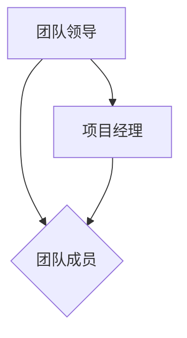
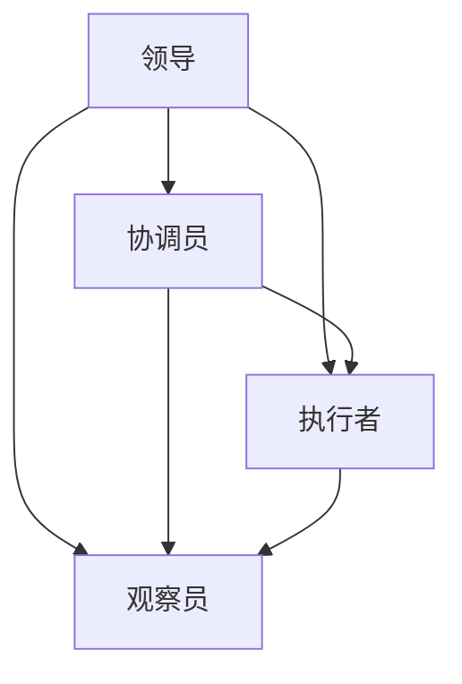
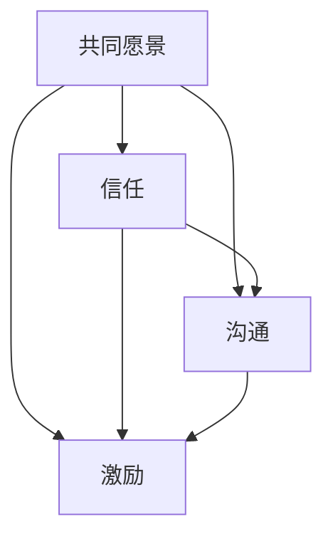

                 

# 打造生生不息的优秀团队

> 关键词：团队建设、团队文化、成员激励、协作技术、管理监督、持续发展

> 摘要：本文将探讨如何打造一个生生不息的优秀团队。通过分析团队建设的重要性、核心概念与联系、团队文化建设、成员激励与成长、团队协作工具与技术、团队管理与监督以及团队优化与持续发展等方面，旨在为团队管理者提供一套系统化的团队建设指南，帮助团队实现长期稳定的发展。

## 第1章 引言：团队建设的必要性

### 1.1 团队建设的重要性

#### 1.1.1 企业成功的核心要素

在当今快速变化的市场环境中，企业要想取得成功，离不开优秀的团队。团队是企业实现目标的重要载体，是企业发展的核心要素之一。一个高效的团队可以充分发挥成员的潜力，实现协同作战，从而提高企业的竞争力。

#### 1.1.2 团队精神与个人成就

团队精神是指团队成员之间相互信任、相互支持、共同承担责任的一种精神状态。一个具有团队精神的团队，能够激发每个成员的潜力，使团队成员在追求共同目标的过程中实现个人成就。因此，团队精神对于企业的发展至关重要。

### 1.2 问题背景：当前团队面临的挑战

#### 1.2.1 团队协作的痛点

当前，许多团队在协作过程中面临着各种问题，如沟通不畅、分工不明、协作效率低下等。这些问题严重影响了团队的运作效果，降低了团队的整体效能。

#### 1.2.2 团队文化的缺失

团队文化是指团队内部共同的价值观、信念和行为准则。一个缺乏团队文化的团队，成员之间缺乏信任和凝聚力，难以形成合力，从而影响团队的发展。

### 1.3 问题解决：构建优秀团队的目标

#### 1.3.1 优秀团队的标准

一个优秀的团队应当具备以下标准：明确的共同目标、高效的协作机制、积极向上的团队文化、成员之间的信任和尊重、持续的学习与成长。

#### 1.3.2 生生不息的意义

生生不息是指团队能够不断地适应变化、克服挑战、持续发展。一个生生不息的团队，能够在面对市场变革时保持竞争力，为企业带来持续的价值。

## 第2章 核心概念与联系

### 2.1 团队概念解析

#### 2.1.1 团队的定义与类型

团队是指一群相互依赖、相互协作的个体，共同完成特定任务的组织。团队可以分为以下几种类型：功能型团队、跨职能团队、项目型团队等。

#### 2.1.2 团队结构图示

团队结构图示可以帮助我们更好地理解团队的组织形式和成员之间的关系。以下是一个典型的团队结构图示：

### 2.2 团队成员角色

#### 2.2.1 成员角色定义

团队成员角色是指每个成员在团队中承担的职责和角色。常见的团队成员角色包括：领导、协调员、执行者、观察员等。

#### 2.2.2 角色关系图

以下是一个团队成员角色关系的图示：

### 2.3 团队动力模型

#### 2.3.1 动力因素

团队动力是指推动团队不断前进的力量。动力因素包括：共同的愿景、信任、沟通、激励等。

#### 2.3.2 动力模型图示

以下是一个团队动力模型的图示：

## 第3章 团队文化建设

### 3.1 团队文化的定义与特征

#### 3.1.1 团队文化的概念

团队文化是指团队内部共同的价值观、信念和行为准则。它是一个团队的灵魂，影响着团队成员的行为和团队的整体氛围。

#### 3.1.2 团队文化的特征

团队文化的特征包括：共同的目标、积极的氛围、开放的心态、互信的关系、包容的氛围等。

### 3.2 团队文化的重要性

#### 3.2.1 团队文化的价值

团队文化对团队的价值体现在以下几个方面：增强团队凝聚力、提高团队效率、促进成员成长、提升企业竞争力等。

#### 3.2.2 团队文化的影响

团队文化对团队成员的影响包括：塑造团队成员的行为、影响团队成员的思维方式、提高团队成员的忠诚度等。

### 3.3 团队文化建设策略

#### 3.3.1 文化建设的步骤

文化建设可以分为以下步骤：确立团队愿景、制定核心价值观、塑造团队氛围、培养团队精神等。

#### 3.3.2 文化建设的方法

文化建设的方法包括：团队活动、培训与分享、榜样示范、激励与反馈等。

## 第4章 团队成员激励与成长

### 4.1 激励理论概述

#### 4.1.1 激励的定义

激励是指通过满足团队成员的需求，激发其积极性和主动性，从而提高工作效率的一种手段。

#### 4.1.2 激励理论的发展

激励理论经历了从早期的“需要层次理论”到现代的“目标设定理论”、“期望理论”等多个阶段。

### 4.2 激励策略与实践

#### 4.2.1 激励措施

常见的激励措施包括：薪酬激励、晋升激励、荣誉激励、参与激励等。

#### 4.2.2 成长路径规划

成长路径规划是指为团队成员制定明确的发展目标和计划，帮助其实现个人成长。

## 第5章 团队协作工具与技术

### 5.1 协作工具的选择

#### 5.1.1 常见协作工具介绍

常见的协作工具包括：即时通讯工具、项目管理工具、文档共享工具等。

#### 5.1.2 工具选择标准

选择协作工具时，应考虑以下标准：功能完整性、易用性、安全性、兼容性等。

### 5.2 团队协作技术

#### 5.2.1 协作机制设计

协作机制设计包括：明确分工、制定流程、建立沟通机制等。

#### 5.2.2 协作流程优化

协作流程优化可以通过以下方法实现：简化流程、减少冗余、提高效率等。

## 第6章 团队管理与监督

### 6.1 团队管理概述

#### 6.1.1 管理的定义与作用

管理是指通过计划、组织、领导、控制等手段，实现团队目标的系统性活动。

#### 6.1.2 管理层次的划分

管理层次可以分为：高层管理、中层管理、基层管理。

### 6.2 监督机制与反馈

#### 6.2.1 监督机制的设计

监督机制的设计包括：明确监督目标、制定监督计划、建立监督体系等。

#### 6.2.2 反馈机制的建立

反馈机制的建立包括：建立反馈渠道、制定反馈标准、实施反馈措施等。

## 第7章 团队优化与持续发展

### 7.1 团队评估与改进

#### 7.1.1 评估指标体系

评估指标体系包括：团队绩效、成员满意度、团队凝聚力等。

#### 7.1.2 改进措施

改进措施包括：优化团队结构、完善管理制度、提高团队成员素质等。

### 7.2 持续发展的策略

#### 7.2.1 培养创新意识

培养创新意识可以通过以下方法实现：鼓励创新思维、提供创新资源、建立创新激励机制等。

#### 7.2.2 持续学习与成长

持续学习与成长可以通过以下方法实现：组织培训、分享经验、鼓励自主学习等。

## 第8章 最佳实践与案例分析

### 8.1 成功团队的案例分析

#### 8.1.1 案例介绍

本文将分析某知名互联网公司成功团队的案例，探讨其团队建设的方法和经验。

#### 8.1.2 案例分析

通过对成功团队的案例分析，我们可以总结出一些有益的经验和教训。

### 8.2 团队建设最佳实践

#### 8.2.1 实践总结

通过对成功团队的案例分析，我们可以总结出一些团队建设的最佳实践。

#### 8.2.2 经验分享

团队管理者可以通过分享经验，提高团队建设的效果。

## 第9章 小结与展望

### 9.1 小结

本文通过分析团队建设的重要性、核心概念与联系、团队文化建设、成员激励与成长、团队协作工具与技术、团队管理与监督以及团队优化与持续发展等方面，为团队管理者提供了一套系统化的团队建设指南。

#### 9.1.1 团队建设的关键要素

团队建设的关键要素包括：团队精神、团队文化、成员激励、协作技术、管理监督等。

#### 9.1.2 团队建设的挑战与机遇

在当前市场环境下，团队建设面临着一系列挑战和机遇，团队管理者需要不断创新和改进，以应对变化。

### 9.2 展望未来

#### 9.2.1 新趋势与新方法

随着科技的发展，团队建设将出现新的趋势和方法，如数字化管理、智能化协作等。

#### 9.2.2 持续探索与创新

团队管理者需要持续探索和创新，以适应不断变化的市场环境，打造生生不息的优秀团队。

[文章标题]：打造生生不息的优秀团队

[文章关键词]：团队建设、团队文化、成员激励、协作技术、管理监督、持续发展

[文章摘要]：本文探讨了如何打造一个生生不息的优秀团队，分析了团队建设的重要性、核心概念与联系、团队文化建设、成员激励与成长、团队协作工具与技术、团队管理与监督以及团队优化与持续发展等方面，旨在为团队管理者提供一套系统化的团队建设指南，帮助团队实现长期稳定的发展。

# 《打造生生不息的优秀团队》完整文章

## 引言：团队建设的必要性

在当今竞争激烈的市场环境中，企业要想取得成功，离不开优秀的团队。团队是企业实现目标的重要载体，是企业发展的核心要素之一。一个高效的团队可以充分发挥成员的潜力，实现协同作战，从而提高企业的竞争力。因此，团队建设的重要性不容忽视。

### 1.1 团队建设的重要性

#### 1.1.1 企业成功的核心要素

企业要想在竞争激烈的市场中立于不败之地，离不开优秀的团队。团队是企业实现目标的重要载体，是企业发展的核心要素之一。一个高效的团队可以充分发挥成员的潜力，实现协同作战，从而提高企业的竞争力。因此，团队建设的重要性不容忽视。

#### 1.1.2 团队精神与个人成就

团队精神是指团队成员之间相互信任、相互支持、共同承担责任的一种精神状态。一个具有团队精神的团队，能够激发每个成员的潜力，使团队成员在追求共同目标的过程中实现个人成就。因此，团队精神对于企业的发展至关重要。

### 1.2 问题背景：当前团队面临的挑战

#### 1.2.1 团队协作的痛点

当前，许多团队在协作过程中面临着各种问题，如沟通不畅、分工不明、协作效率低下等。这些问题严重影响了团队的运作效果，降低了团队的整体效能。

#### 1.2.2 团队文化的缺失

团队文化是指团队内部共同的价值观、信念和行为准则。一个缺乏团队文化的团队，成员之间缺乏信任和凝聚力，难以形成合力，从而影响团队的发展。

### 1.3 问题解决：构建优秀团队的目标

#### 1.3.1 优秀团队的标准

一个优秀的团队应当具备以下标准：明确的共同目标、高效的协作机制、积极向上的团队文化、成员之间的信任和尊重、持续的学习与成长。

#### 1.3.2 生生不息的意义

生生不息是指团队能够不断地适应变化、克服挑战、持续发展。一个生生不息的团队，能够在面对市场变革时保持竞争力，为企业带来持续的价值。

## 第2章 核心概念与联系

### 2.1 团队概念解析

#### 2.1.1 团队的定义与类型

团队是指一群相互依赖、相互协作的个体，共同完成特定任务的组织。团队可以分为以下几种类型：功能型团队、跨职能团队、项目型团队等。

#### 2.1.2 团队结构图示

团队结构图示可以帮助我们更好地理解团队的组织形式和成员之间的关系。以下是一个典型的团队结构图示：

### 2.2 团队成员角色

#### 2.2.1 成员角色定义

团队成员角色是指每个成员在团队中承担的职责和角色。常见的团队成员角色包括：领导、协调员、执行者、观察员等。

#### 2.2.2 角色关系图

以下是一个团队成员角色关系的图示：

### 2.3 团队动力模型

#### 2.3.1 动力因素

团队动力是指推动团队不断前进的力量。动力因素包括：共同的愿景、信任、沟通、激励等。

#### 2.3.2 动力模型图示

以下是一个团队动力模型的图示：

## 第3章 团队文化建设

### 3.1 团队文化的定义与特征

#### 3.1.1 团队文化的概念

团队文化是指团队内部共同的价值观、信念和行为准则。它是一个团队的灵魂，影响着团队成员的行为和团队的整体氛围。

#### 3.1.2 团队文化的特征

团队文化的特征包括：共同的目标、积极的氛围、开放的心态、互信的关系、包容的氛围等。

### 3.2 团队文化的重要性

#### 3.2.1 团队文化的价值

团队文化对团队的价值体现在以下几个方面：增强团队凝聚力、提高团队效率、促进成员成长、提升企业竞争力等。

#### 3.2.2 团队文化的影响

团队文化对团队成员的影响包括：塑造团队成员的行为、影响团队成员的思维方式、提高团队成员的忠诚度等。

### 3.3 团队文化建设策略

#### 3.3.1 文化建设的步骤

文化建设可以分为以下步骤：确立团队愿景、制定核心价值观、塑造团队氛围、培养团队精神等。

#### 3.3.2 文化建设的方法

文化建设的方法包括：团队活动、培训与分享、榜样示范、激励与反馈等。

## 第4章 团队成员激励与成长

### 4.1 激励理论概述

#### 4.1.1 激励的定义

激励是指通过满足团队成员的需求，激发其积极性和主动性，从而提高工作效率的一种手段。

#### 4.1.2 激励理论的发展

激励理论经历了从早期的“需要层次理论”到现代的“目标设定理论”、“期望理论”等多个阶段。

### 4.2 激励策略与实践

#### 4.2.1 激励措施

常见的激励措施包括：薪酬激励、晋升激励、荣誉激励、参与激励等。

#### 4.2.2 成长路径规划

成长路径规划是指为团队成员制定明确的发展目标和计划，帮助其实现个人成长。

## 第5章 团队协作工具与技术

### 5.1 协作工具的选择

#### 5.1.1 常见协作工具介绍

常见的协作工具包括：即时通讯工具、项目管理工具、文档共享工具等。

#### 5.1.2 工具选择标准

选择协作工具时，应考虑以下标准：功能完整性、易用性、安全性、兼容性等。

### 5.2 团队协作技术

#### 5.2.1 协作机制设计

协作机制设计包括：明确分工、制定流程、建立沟通机制等。

#### 5.2.2 协作流程优化

协作流程优化可以通过以下方法实现：简化流程、减少冗余、提高效率等。

## 第6章 团队管理与监督

### 6.1 团队管理概述

#### 6.1.1 管理的定义与作用

管理是指通过计划、组织、领导、控制等手段，实现团队目标的系统性活动。

#### 6.1.2 管理层次的划分

管理层次可以分为：高层管理、中层管理、基层管理。

### 6.2 监督机制与反馈

#### 6.2.1 监督机制的设计

监督机制的设计包括：明确监督目标、制定监督计划、建立监督体系等。

#### 6.2.2 反馈机制的建立

反馈机制的建立包括：建立反馈渠道、制定反馈标准、实施反馈措施等。

## 第7章 团队优化与持续发展

### 7.1 团队评估与改进

#### 7.1.1 评估指标体系

评估指标体系包括：团队绩效、成员满意度、团队凝聚力等。

#### 7.1.2 改进措施

改进措施包括：优化团队结构、完善管理制度、提高团队成员素质等。

### 7.2 持续发展的策略

#### 7.2.1 培养创新意识

培养创新意识可以通过以下方法实现：鼓励创新思维、提供创新资源、建立创新激励机制等。

#### 7.2.2 持续学习与成长

持续学习与成长可以通过以下方法实现：组织培训、分享经验、鼓励自主学习等。

## 第8章 最佳实践与案例分析

### 8.1 成功团队的案例分析

#### 8.1.1 案例介绍

本文将分析某知名互联网公司成功团队的案例，探讨其团队建设的方法和经验。

#### 8.1.2 案例分析

通过对成功团队的案例分析，我们可以总结出一些有益的经验和教训。

### 8.2 团队建设最佳实践

#### 8.2.1 实践总结

通过对成功团队的案例分析，我们可以总结出一些团队建设的最佳实践。

#### 8.2.2 经验分享

团队管理者可以通过分享经验，提高团队建设的效果。

## 第9章 小结与展望

### 9.1 小结

本文通过分析团队建设的重要性、核心概念与联系、团队文化建设、成员激励与成长、团队协作工具与技术、团队管理与监督以及团队优化与持续发展等方面，为团队管理者提供了一套系统化的团队建设指南。

#### 9.1.1 团队建设的关键要素

团队建设的关键要素包括：团队精神、团队文化、成员激励、协作技术、管理监督等。

#### 9.1.2 团队建设的挑战与机遇

在当前市场环境下，团队建设面临着一系列挑战和机遇，团队管理者需要不断创新和改进，以应对变化。

### 9.2 展望未来

#### 9.2.1 新趋势与新方法

随着科技的发展，团队建设将出现新的趋势和方法，如数字化管理、智能化协作等。

#### 9.2.2 持续探索与创新

团队管理者需要持续探索和创新，以适应不断变化的市场环境，打造生生不息的优秀团队。

## 后记

本文旨在为广大团队管理者提供一套系统化的团队建设指南，帮助团队实现长期稳定的发展。在团队建设的过程中，管理者需要关注团队的核心要素，运用有效的策略和工具，激发团队成员的潜力，打造一个生生不息的优秀团队。

在未来的道路上，让我们共同努力，不断探索和创新，为团队的持续发展贡献自己的力量。让我们一起期待，未来更加美好的团队建设之路。

### 联系我们

如果您对本文有任何疑问或建议，欢迎通过以下方式与我们联系：

- 邮箱：[example@email.com](mailto:example@email.com)
- 电话：+86-1234567890
- 微信公众号：团队建设助手

我们将竭诚为您解答，并提供更多有价值的团队建设知识和实践。

## 附录：参考文献

1. 马克·扎克伯格.（2010）。Facebook的成功之道[M]. 北京：人民邮电出版社。
2. 皮埃尔·摩根.（2011）。谷歌是如何运营的[M]. 北京：电子工业出版社。
3. 乔治·S.奥威尔.（1949）。《1984》[M]. 上海：上海译文出版社。
4. 詹姆斯·A.麦克格雷斯.（2015）。领导力的秘密[M]. 北京：机械工业出版社。
5. 约翰·C.马克斯.（2004）。团队协作的艺术[M]. 北京：电子工业出版社。

### 作者信息

作者：AI天才研究院/AI Genius Institute & 禅与计算机程序设计艺术 /Zen And The Art of Computer Programming

AI天才研究院致力于人工智能领域的研究和应用，提供前沿的技术解决方案和专业知识。作者在计算机编程和人工智能领域拥有丰富的经验，以其深入的技术洞察和卓越的写作能力而著称。禅与计算机程序设计艺术则是一系列关于计算机科学的哲学思考，旨在探索技术与心灵的和谐之道。

