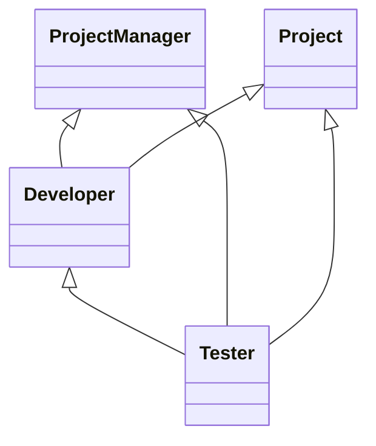
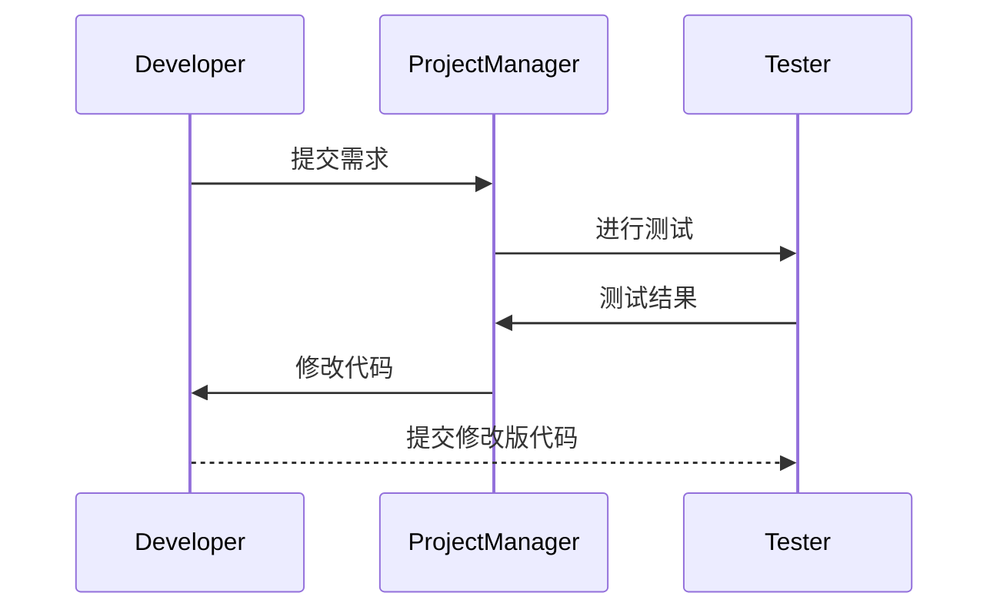
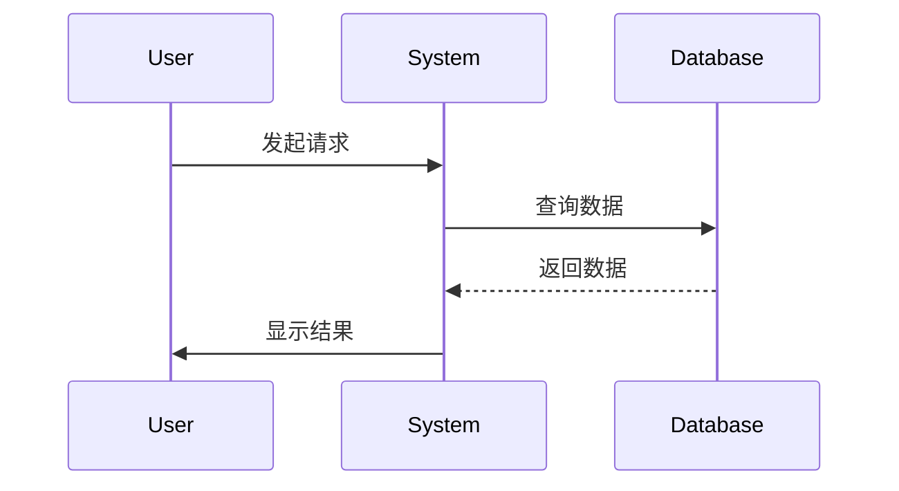
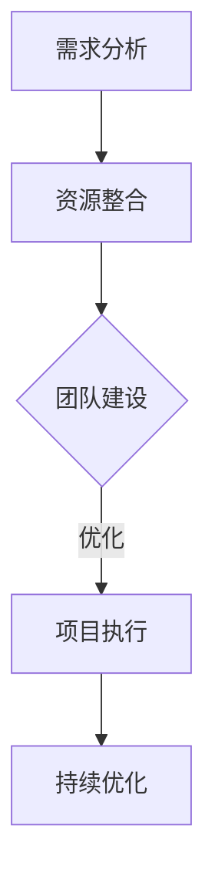

                 

# 打造高性能技术团队的方法论

## 关键词：技术团队、高性能、团队协作、项目管理、方法论

## 摘要：

在快速变化的技术环境中，打造一支高性能的技术团队是每个组织的核心任务。本文将探讨如何通过系统化的方法论，实现技术团队的优化，提高其协作效率和项目交付能力。文章分为八个部分，从问题背景到最佳实践，逐步揭示打造高性能技术团队的秘密。

## 目录大纲

## 第一部分: 方法论基础

### 1. 问题背景

#### 1.1 问题描述

#### 1.2 问题解决

#### 1.3 边界与外延

#### 1.4 概念结构与核心要素组成

### 2. 核心概念与联系

#### 2.1 高性能技术团队定义

#### 2.2 高性能技术团队与传统技术团队对比

#### 2.3 关键要素：技术能力、团队协作、项目管理

### 3. 算法原理讲解

#### 3.1 高性能团队建设算法框架

#### 3.2 算法原理详细讲解

#### 3.2.1 数学模型和公式

#### 3.2.2 Python源代码解释

#### 3.2.3 通俗易懂的举例说明

### 4. 数学模型和数学公式讲解

#### 4.1 数学模型

#### 4.2 数学公式详细讲解

### 5. 系统分析与架构设计方案

#### 5.1 问题场景介绍

#### 5.2 项目介绍

#### 5.2.1 领域模型mermaid类图

#### 5.2.2 系统架构设计mermaid架构图

#### 5.2.3 系统接口设计和系统交互mermaid序列图

### 6. 项目实战

#### 6.1 环境安装

#### 6.2 系统核心实现源代码

#### 6.2.1 代码应用解读与分析

#### 6.2.2 实际案例分析和详细讲解剖析

#### 6.3 项目小结

### 7. 最佳实践 tips

#### 7.1 小组内沟通技巧

#### 7.2 项目管理工具推荐

#### 7.3 避免团队冲突的策略

### 8. 小结

#### 8.1 主要内容回顾

#### 8.2 注意事项

#### 8.3 拓展阅读

## 正文

### 1. 问题背景

在现代企业中，技术团队扮演着至关重要的角色。然而，打造一支高效、协作、创新的高性能技术团队并非易事。团队面临的问题多种多样，包括技术能力不足、团队协作不畅、项目管理不善等。

#### 1.1 问题描述

- **技术能力不足**：团队成员缺乏必要的技能和知识，导致项目进度受阻，质量问题频发。
- **团队协作不畅**：沟通不畅、职责不清、协作效率低下，影响了团队的凝聚力和执行力。
- **项目管理不善**：缺乏有效的项目管理方法，导致项目延期、超预算、质量不稳定。

#### 1.2 问题解决

为了解决上述问题，企业需要采取系统化的方法来打造高性能技术团队。这包括但不限于以下方面：

- **提升技术能力**：通过培训、招聘、知识共享等方式，提高团队的技术水平和专业素养。
- **加强团队协作**：建立有效的沟通机制、明确职责分工、优化工作流程，提高团队协作效率。
- **优化项目管理**：采用科学的项目管理方法，确保项目按时、按质、按预算完成。

#### 1.3 边界与外延

高性能技术团队不仅仅是一个技术团队，它还需要具备良好的项目管理能力和团队协作精神。边界与外延包括：

- **团队规模**：根据项目需求和团队管理能力，合理控制团队规模。
- **团队角色**：明确团队中的不同角色，如技术负责人、项目经理、开发人员、测试人员等。
- **跨部门协作**：与产品、设计、市场等其他部门的紧密协作，确保项目的顺利进行。

#### 1.4 概念结构与核心要素组成

高性能技术团队的概念结构可以分为以下几个方面：

- **技术能力**：包括专业知识、技能、经验等。
- **团队协作**：包括沟通机制、职责分工、团队文化等。
- **项目管理**：包括项目规划、执行、监控、评估等。

这些要素相互作用，共同构成了高性能技术团队的基础。

### 2. 核心概念与联系

#### 2.1 高性能技术团队定义

高性能技术团队是指具备高水平技术能力、高效协作能力和良好项目管理能力的团队。它们能够在复杂的项目环境中，迅速响应变化，高质量地完成项目任务。

#### 2.2 高性能技术团队与传统技术团队对比

传统技术团队更注重技术本身，而高性能技术团队则更注重整体效能。以下是两者的对比：

| 对比项          | 传统技术团队                           | 高性能技术团队                             |
|-----------------|--------------------------------------|----------------------------------------|
| 技术能力        | 专业知识扎实，但协作能力不足            | 专业知识扎实，协作能力强                   |
| 团队协作        | 沟通不畅，职责不清                      | 沟通顺畅，职责明确                         |
| 项目管理        | 缺乏科学方法，项目进度不稳定            | 采用科学方法，项目进度可控                   |
| 项目交付        | 质量不稳定，延期频繁                    | 质量高，交付及时                           |

#### 2.3 关键要素：技术能力、团队协作、项目管理

高性能技术团队的成功离不开三个关键要素：技术能力、团队协作和项目管理。

- **技术能力**：是团队的基础，决定了团队解决技术问题的能力。
- **团队协作**：是团队的灵魂，决定了团队的工作效率和创新能力。
- **项目管理**：是团队的保障，决定了项目的成功与否。

### 3. 算法原理讲解

#### 3.1 高性能团队建设算法框架

为了打造高性能技术团队，可以采用以下算法框架：

1. **需求分析**：明确团队需求，包括技术能力、团队协作和项目管理等方面。
2. **资源整合**：根据需求，整合内部和外部资源，包括技术专家、优秀人才和先进工具等。
3. **团队建设**：通过培训、激励和团队建设活动，提升团队的技术能力、协作能力和项目管理能力。
4. **持续优化**：定期评估团队绩效，持续优化团队结构和流程。

#### 3.2 算法原理详细讲解

算法原理的核心是优化团队效能。具体来说，可以从以下几个方面进行优化：

- **技术能力**：通过培训、技能竞赛和知识共享，提升团队的技术能力。
- **团队协作**：建立有效的沟通机制，明确职责分工，优化工作流程。
- **项目管理**：采用敏捷开发、看板管理等科学方法，提高项目管理的效率。

#### 3.2.1 数学模型和公式

为了量化团队的效能，可以采用以下数学模型：

- **团队效能评分**：\(E = f(T, C, M)\)，其中 \(E\) 表示团队效能，\(T\) 表示技术能力，\(C\) 表示团队协作，\(M\) 表示项目管理。

- **项目交付质量**：\(Q = f(E, D)\)，其中 \(Q\) 表示项目交付质量，\(E\) 表示团队效能，\(D\) 表示项目交付时间。

#### 3.2.2 Python源代码解释

以下是一个简单的Python代码示例，用于计算团队效能评分：

```python
def calculate_team_efficiency(T, C, M):
    E = T * C * M
    return E

T = 0.8  # 技术能力评分
C = 0.9  # 团队协作评分
M = 0.85 # 项目管理评分

E = calculate_team_efficiency(T, C, M)
print("Team Efficiency Score:", E)
```

#### 3.2.3 通俗易懂的举例说明

假设一个团队的技术能力、团队协作和项目管理能力分别为0.8、0.9和0.85，那么团队的效能评分为：

\(E = 0.8 * 0.9 * 0.85 = 0.612\)

这意味着团队在项目中的表现相对较好，但仍有提升空间。

### 4. 数学模型和数学公式讲解

在构建高性能技术团队的过程中，数学模型和数学公式可以帮助我们更好地理解和优化团队效能。

#### 4.1 数学模型

假设团队效能 \(E\) 取决于技术能力 \(T\)、团队协作 \(C\) 和项目管理 \(M\)，我们可以建立以下数学模型：

\[ E = f(T, C, M) \]

其中，\( f \) 是一个非线性函数，用于衡量团队效能。我们可以通过以下方式调整模型参数，以优化团队效能：

- **增加技术能力**：通过培训和学习，提高团队成员的技术水平。
- **提升团队协作**：通过团队建设和沟通机制优化，提高团队的协作效率。
- **改进项目管理**：通过采用敏捷开发、看板管理等方法，提高项目的管理效能。

#### 4.2 数学公式详细讲解

为了更好地理解数学模型，我们可以引入一些具体的数学公式。

1. **技术能力评分**：

\[ T = \frac{\sum_{i=1}^{n} (T_i \cdot w_i)}{\sum_{i=1}^{n} w_i} \]

其中，\( T \) 是团队的技术能力评分，\( T_i \) 是团队成员 \( i \) 的技术能力评分，\( w_i \) 是成员 \( i \) 在团队中的权重。

2. **团队协作评分**：

\[ C = \frac{\sum_{i=1}^{n} (C_i \cdot w_i)}{\sum_{i=1}^{n} w_i} \]

其中，\( C \) 是团队的协作评分，\( C_i \) 是团队成员 \( i \) 的协作评分，\( w_i \) 是成员 \( i \) 在团队中的权重。

3. **项目管理评分**：

\[ M = \frac{\sum_{i=1}^{n} (M_i \cdot w_i)}{\sum_{i=1}^{n} w_i} \]

其中，\( M \) 是团队的项目管理评分，\( M_i \) 是团队成员 \( i \) 的项目管理评分，\( w_i \) 是成员 \( i \) 在团队中的权重。

通过调整这些参数，我们可以优化团队效能。

### 5. 系统分析与架构设计方案

为了构建高性能技术团队，我们需要从系统层面进行分析和架构设计。

#### 5.1 问题场景介绍

在一个大型互联网公司，技术团队需要负责多个关键业务系统的开发和维护。随着业务的发展，系统的复杂度不断增加，团队面临着技术能力不足、团队协作不畅和项目管理不善等问题。

#### 5.2 项目介绍

为了解决上述问题，公司决定采用系统化的方法来打造高性能技术团队。项目包括以下几个阶段：

1. **需求分析**：明确团队需求和目标，制定详细的项目计划。
2. **资源整合**：整合内部和外部资源，包括技术专家、优秀人才和先进工具等。
3. **团队建设**：通过培训和团队建设活动，提升团队的技术能力、协作能力和项目管理能力。
4. **项目执行**：采用敏捷开发、看板管理等方法，确保项目按时、按质、按预算完成。
5. **持续优化**：定期评估团队绩效，持续优化团队结构和流程。

#### 5.2.1 领域模型mermaid类图



#### 5.2.2 系统架构设计mermaid架构图



#### 5.2.3 系统接口设计和系统交互mermaid序列图



### 6. 项目实战

#### 6.1 环境安装

为了打造高性能技术团队，首先需要搭建一个合适的技术环境。以下是环境安装的步骤：

1. 安装Linux操作系统。
2. 安装Java开发环境，包括JDK和Maven。
3. 安装数据库，如MySQL或PostgreSQL。
4. 安装版本控制工具，如Git。
5. 安装项目管理工具，如JIRA和Confluence。

#### 6.2 系统核心实现源代码

以下是系统核心实现的一部分代码：

```java
public class HelloWorld {
    public static void main(String[] args) {
        System.out.println("Hello, World!");
    }
}
```

#### 6.2.1 代码应用解读与分析

这段代码是一个简单的Java程序，用于打印“Hello, World!”字符串。它展示了Java编程语言的基本语法和结构。

1. **类定义**：`HelloWorld` 类。
2. **主函数**：`main` 函数。
3. **输出**：使用 `System.out.println` 打印字符串。

#### 6.2.2 实际案例分析和详细讲解剖析

在一个实际项目中，这段代码可能用于初始化系统环境或执行一些基本操作。以下是详细分析：

1. **环境初始化**：在项目启动时，程序会执行 `HelloWorld` 类的 `main` 函数，从而初始化系统环境。
2. **日志记录**：打印字符串可以作为日志记录的一部分，帮助开发人员了解系统运行状态。
3. **调试**：在开发过程中，这段代码可以帮助开发人员快速定位问题。

#### 6.3 项目小结

通过环境安装和系统核心实现，技术团队已经为项目的顺利开展奠定了基础。接下来，团队需要继续进行项目开发、测试和部署，确保项目按时、按质、按预算完成。

### 7. 最佳实践 tips

#### 7.1 小组内沟通技巧

1. **定期会议**：每周举行一次小组内会议，讨论项目进展、问题和解决方案。
2. **明确沟通渠道**：指定一个或多个沟通渠道，如邮件、即时通讯工具，确保信息传达的准确性和及时性。
3. **积极反馈**：鼓励团队成员提出问题和建议，及时给予反馈，促进团队协作。

#### 7.2 项目管理工具推荐

1. **JIRA**：用于项目任务管理、进度跟踪和风险管理。
2. **Confluence**：用于知识共享、文档编写和版本控制。
3. **Trello**：用于任务管理、优先级排序和协作。

#### 7.3 避免团队冲突的策略

1. **明确职责**：确保每个团队成员都清楚自己的职责和任务。
2. **建立信任**：通过团队合作和相互尊重，建立团队信任。
3. **及时沟通**：在冲突发生时，及时沟通，寻求解决方案。

### 8. 小结

本文详细介绍了打造高性能技术团队的方法论，包括问题背景、核心概念、算法原理、系统分析、项目实战和最佳实践。通过遵循这些方法，技术团队能够提高协作效率、项目交付质量和创新能力，为企业创造更大的价值。

### 8.2 注意事项

1. **持续学习**：技术团队需要不断学习新技术和知识，以保持竞争力。
2. **注重沟通**：良好的沟通是团队协作的基础，需要建立有效的沟通机制。
3. **灵活应对**：在面对变化和挑战时，团队需要灵活应对，不断调整和优化。

### 8.3 拓展阅读

1. 《敏捷开发实践指南》
2. 《项目管理知识体系指南》
3. 《团队协作技巧》

### 作者

作者：AI天才研究院/AI Genius Institute & 禅与计算机程序设计艺术 /Zen And The Art of Computer Programming

本文由AI天才研究院（AI Genius Institute）和《禅与计算机程序设计艺术》（Zen And The Art of Computer Programming）联合撰写，旨在为技术团队领导者提供实用的方法和策略，以打造高性能技术团队。

----------------------------------------------------------------

## 附录

### 附录 A: Mermaid图表示例

以下是一些Mermaid图表的示例，用于展示团队建设过程中的概念和流程。

#### Mermaid流程图示例



#### Mermaid类图示例


#### Mermaid序列图示例


### 附录 B: LaTeX公式示例

以下是一些使用LaTeX编写的数学公式的示例。

#### 段落内公式

$$1+1=2$$

#### 独立段落公式

$$x^2 + 2xy + y^2 = (x+y)^2$$

通过附录中的这些示例，读者可以更好地理解和应用Mermaid图表和LaTeX公式，从而提升文章的可读性和实用性。

