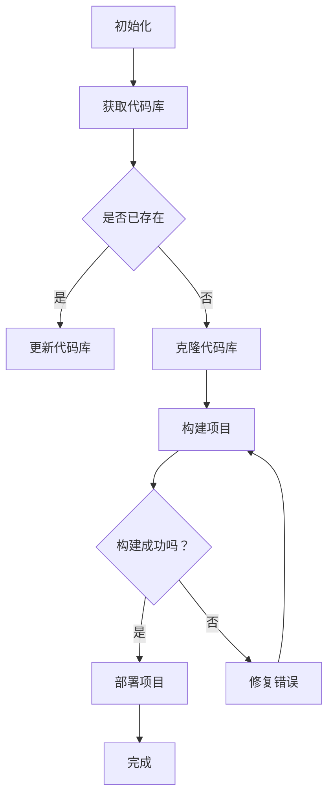
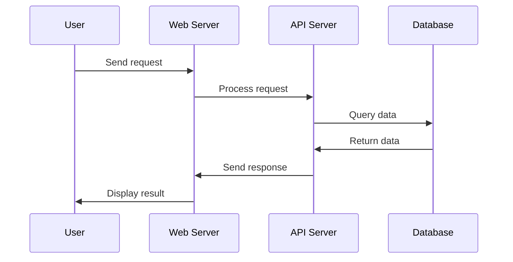
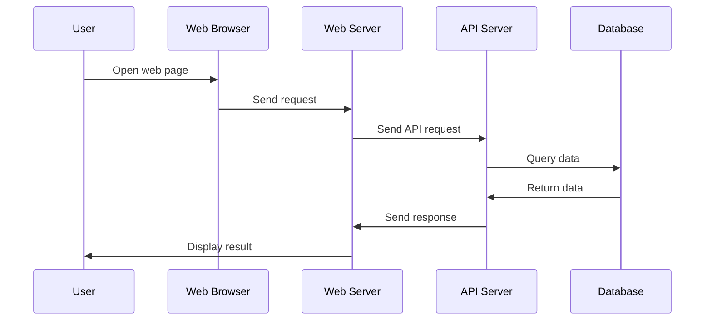

                 


### 第1章：代码协作平台概述

#### 1.1 代码协作的背景和重要性

在当今快速发展的软件开发行业中，代码协作已经成为团队成功的关键因素之一。随着软件项目规模的不断扩大和团队成员数量的增加，如何高效地进行代码协作变得尤为重要。代码协作不仅涉及代码的编写，还包括代码的审查、管理、测试和部署等多个方面。

首先，让我们来探讨一下代码协作的背景。随着互联网和云计算技术的发展，软件项目的开发不再局限于某个特定的地理位置，全球范围内的团队可以轻松地进行协作。这不仅提高了开发效率，还带来了跨文化和跨地域的交流与合作。然而，随着团队规模的扩大，如何确保代码质量、提高开发效率、降低协作成本成为了新的挑战。

代码协作的重要性主要体现在以下几个方面：

1. **提高开发效率**：通过代码协作平台，团队成员可以实时地共享代码、进行代码审查和反馈，大大减少了开发周期。同时，自动化的构建和测试工具可以快速发现并修复代码中的问题，确保项目按时交付。

2. **确保代码质量**：代码协作平台通常包括代码审查和测试功能，可以帮助团队发现并修复代码中的错误和缺陷，提高代码的可靠性和稳定性。此外，代码协作平台还可以自动生成报告，提供代码统计信息和质量评估，帮助团队持续改进代码质量。

3. **降低协作成本**：通过集中管理和自动化工具，代码协作平台可以减少重复劳动，降低协作成本。例如，团队成员不需要手动同步代码，平台会自动处理代码的合并和冲突解决，从而节省了大量的时间和精力。

4. **促进知识共享**：代码协作平台为团队成员提供了一个共享知识和经验的平台，团队成员可以查看其他成员的代码、学习他们的编程技巧和经验，从而提高整体技能水平。

总之，代码协作平台在软件开发中发挥着至关重要的作用。它不仅提高了开发效率、确保了代码质量，还降低了协作成本，促进了团队成员之间的知识共享。然而，要打造一个高效的代码协作平台，需要深入了解其发展历程、核心功能和应用场景。

#### 1.2 代码协作平台的发展历程

代码协作平台的发展历程可以追溯到上世纪80年代。当时，软件开发主要依赖于本地文件系统和邮件系统进行代码共享和协作。随着互联网的兴起，代码协作平台逐渐从本地化向在线化发展。以下是一些重要的里程碑：

1. **版本控制系统**：1982年，Unix系统上的`rcs`（RCS）成为第一个版本控制系统。RCS通过维护文件的历史版本，实现了对代码的版本控制和协作。此后，CVS（Concurrent Versions System）和SVN（Subversion）等版本控制系统相继出现，进一步提高了代码协作的效率。

2. **分布式版本控制系统**：2005年，Git的诞生标志着分布式版本控制系统的崛起。Git由Linus Torvalds创建，它允许每个开发者在自己的本地机器上维护代码库的完整历史记录，大大提高了协作效率和灵活性。

3. **集中式代码协作平台**：随着代码协作需求的不断增长，一些企业开始开发集中式的代码协作平台，如GitHub、GitLab和Bitbucket等。这些平台不仅提供了版本控制功能，还集成了代码审查、项目管理、持续集成和持续部署等功能，成为现代软件开发团队不可或缺的工具。

4. **云原生代码协作平台**：近年来，云原生技术的发展推动了代码协作平台的进一步演变。云原生代码协作平台如GitLab Cloud、GitHub Actions等，通过云服务的弹性扩展和自动化管理，为团队提供了更加高效和灵活的协作方式。

#### 1.3 当前主流的代码协作平台

目前，市场上主流的代码协作平台包括GitHub、GitLab和Bitbucket等。这些平台各有特点和优势，适合不同类型的团队和项目。

1. **GitHub**：GitHub是由微软收购的一家全球领先的代码协作平台，拥有庞大的用户社区和丰富的生态资源。它提供了版本控制、代码审查、项目管理、持续集成和持续部署等功能，支持多种编程语言和开发框架。GitHub的免费版本对个人项目和开源项目提供了足够的支持，而企业版则提供了更多的安全和管理功能。

2. **GitLab**：GitLab是一个完全开源的代码协作平台，支持自托管，可以部署在自己的服务器上。GitLab提供了与GitHub相似的功能，如版本控制、代码审查、持续集成等。此外，GitLab还集成了项目管理和文档管理功能，为企业提供了全面的开发解决方案。

3. **Bitbucket**：Bitbucket是由Atlassian开发的一款代码协作平台，主要面向企业用户。它支持Git和Mercurial两种版本控制系统，提供了版本控制、代码审查、持续集成等功能。Bitbucket特别适合中小型团队和敏捷开发，具有较好的安全性和协作性。

#### 1.4 代码协作平台的核心功能

代码协作平台的核心功能主要包括版本控制、代码审查、持续集成和持续部署等。以下是这些功能的具体介绍：

1. **版本控制**：版本控制是代码协作平台的基础功能，它允许团队成员对代码进行版本管理和协作。版本控制系统能够记录代码的历史版本，支持撤销修改、分支管理、合并代码等功能。常见的版本控制系统有Git、SVN等。

2. **代码审查**：代码审查是一种确保代码质量的重要手段。通过代码审查，团队成员可以互相审查代码，发现潜在的错误和问题，并提出改进建议。代码审查通常包括代码提交、代码审核、反馈和修复等环节。

3. **持续集成**：持续集成是一种自动化构建和测试代码的方法，它将代码合并到主干分支前进行测试，确保代码的兼容性和稳定性。持续集成系统能够自动化执行构建、测试和部署流程，提高开发效率。

4. **持续部署**：持续部署是持续集成的延伸，它将自动化测试后的代码部署到生产环境中。通过持续部署，团队可以实现快速迭代和交付，提高产品质量和市场响应速度。

#### 1.5 代码协作平台的应用场景

代码协作平台广泛应用于各种软件开发场景，包括企业内部项目、开源项目和敏捷开发等。

1. **企业内部项目**：在企业内部项目中，代码协作平台可以帮助团队实现高效的代码管理和协作。通过平台，团队成员可以实时共享代码、进行代码审查和反馈，确保项目的顺利进行。

2. **开源项目**：开源项目通常需要一个开放的代码协作平台来吸引贡献者、管理代码库和进行代码审查。GitHub和GitLab等平台为开源项目提供了良好的支持和生态，促进了开源社区的繁荣。

3. **敏捷开发**：敏捷开发强调快速迭代和频繁交付，代码协作平台可以提供敏捷开发所需的工具和支持。通过平台，团队可以实现持续集成和持续部署，确保项目的快速迭代和高质量交付。

### 第2章：核心概念与联系

#### 2.1 核心概念介绍

代码协作平台涉及多个核心概念，这些概念对于理解平台的运作和实现高效的代码协作至关重要。以下是这些核心概念的介绍：

1. **源代码管理（Source Code Management, SCM）**：源代码管理是代码协作平台的基础功能，它负责跟踪和管理代码的版本历史。源代码管理系统提供了版本控制、分支管理、合并冲突解决等功能，确保代码的一致性和可追溯性。

2. **代码审查（Code Review）**：代码审查是一种质量保证机制，通过团队成员对代码进行审查，发现潜在的错误、代码风格问题和性能瓶颈。代码审查通常包括提交请求（Pull Request, PR）、审查评论和修复问题等环节。

3. **持续集成（Continuous Integration, CI）**：持续集成是一种自动化流程，它将代码合并到主干分支前进行测试和构建。持续集成系统能够自动执行单元测试、集成测试和代码静态分析，确保代码的稳定性和一致性。

4. **持续部署（Continuous Deployment, CD）**：持续部署是持续集成的延伸，它将测试通过后的代码部署到生产环境中。持续部署可以实现自动化的部署流程，提高开发效率和产品质量。

5. **项目管理（Project Management）**：项目管理功能提供了任务管理、进度跟踪和团队协作工具。通过项目管理功能，团队可以更好地规划项目、分配任务和跟踪进度，确保项目的顺利进行。

6. **文档管理（Documentation Management）**：文档管理功能帮助团队管理和维护项目文档，包括设计文档、用户手册和技术文档等。通过文档管理功能，团队可以方便地查阅和更新文档，确保文档的准确性和一致性。

#### 2.2 概念属性特征对比表格

以下是一个关于代码协作平台核心概念的属性特征对比表格：

| 概念           | 描述                                             | 特征                           | 关联功能                     |
|--------------|------------------------------------------------|-----------------------------|---------------------------|
| 源代码管理（SCM） | 跟踪和管理代码版本历史                             | 版本控制、分支管理、合并冲突解决 | 代码审查、持续集成、持续部署 |
| 代码审查（Code Review） | 审查代码质量和风格，发现潜在问题                     | 提交请求、审查评论、问题修复     | 持续集成、持续部署           |
| 持续集成（CI）     | 自动化构建和测试代码，确保代码一致性               | 单元测试、集成测试、代码分析     | 持续部署、项目管理           |
| 持续部署（CD）     | 自动化部署代码到生产环境，实现快速迭代             | 自动化部署、环境配置、部署监控   | 源代码管理、代码审查         |
| 项目管理（Project Management） | 管理项目任务和进度，提高团队协作效率               | 任务分配、进度跟踪、团队协作     | 源代码管理、持续集成、持续部署 |
| 文档管理（Documentation Management） | 管理项目文档，确保文档准确性和一致性               | 文档创建、文档共享、文档更新     | 源代码管理、代码审查         |

#### 2.3 ER实体关系图架构

为了更好地理解代码协作平台中的核心概念及其关联关系，我们可以使用ER（Entity-Relationship）实体关系图来表示。以下是一个简化的ER图：

```mermaid
erDiagram
    SCM <--o{ Code Review : 审查
    SCM -->||| CI : 构建
    SCM -->||| CD : 部署
    SCM -->||| Project Management : 管理
    SCM -->||| Documentation Management : 文档
    Code Review o-->> SCM : 管理代码
    CI o-->> SCM : 自动化构建
    CD o-->> SCM : 自动化部署
    Project Management o-->> SCM : 项目管理
    Documentation Management o-->> SCM : 文档管理
```

在这个ER图中，`SCM`（源代码管理）是核心实体，与其他实体之间存在关联关系。`Code Review`（代码审查）、`CI`（持续集成）、`CD`（持续部署）、`Project Management`（项目管理）和`Documentation Management`（文档管理）等实体都与`SCM`相关联，共同构成了代码协作平台的核心架构。

通过ER实体关系图，我们可以清晰地看到各个核心概念之间的联系和作用，有助于理解代码协作平台的工作原理和实现高效的代码协作。

### 第3章：算法原理讲解

#### 3.1 算法流程图

为了更好地理解代码协作平台的算法原理，我们可以使用Mermaid语言绘制一个简单的算法流程图。以下是一个示例：



在这个算法流程图中，我们从初始化开始，获取代码库，然后根据代码库是否存在来决定是更新还是克隆代码库。接下来，我们构建项目，并检查构建是否成功。如果构建成功，则部署项目；否则，修复错误并重新构建。最后，完成部署流程。

#### 3.2 Python源代码阐述

以下是一个简化的Python代码示例，用于实现上述算法流程。这个示例使用GitPython库来操作Git，以及Fabric库来执行部署操作。

```python
import git
from fabric.api import run

def init():
    print("初始化代码协作平台")

def get_repo(repo_url):
    try:
        repo = git.Repo(repo_url)
        print("已存在代码库，准备更新...")
        return repo
    except git.exc.NoSuchPathError:
        print("代码库不存在，准备克隆...")
        return git.Repo.clone_from(repo_url)

def build_project(repo_path):
    try:
        run(f"cd {repo_path} && make build")
        print("构建项目成功")
        return True
    except Exception as e:
        print(f"构建项目失败：{e}")
        return False

def deploy_project(repo_path):
    try:
        run(f"cd {repo_path} && make deploy")
        print("部署项目成功")
    except Exception as e:
        print(f"部署项目失败：{e}")

def main(repo_url):
    init()
    repo = get_repo(repo_url)
    if build_project(repo.working_dir):
        deploy_project(repo.working_dir)
    else:
        print("修复错误后重新构建")

if __name__ == "__main__":
    repo_url = "https://github.com/your_username/your_project.git"
    main(repo_url)
```

在这个示例中，我们首先定义了几个函数：`init()`用于初始化代码协作平台，`get_repo()`用于获取代码库，`build_project()`用于构建项目，`deploy_project()`用于部署项目，`main()`用于执行整个流程。最后，我们在`main()`函数中调用这些函数，并传入代码库的URL。

#### 3.3 数学模型和公式

在代码协作平台中，算法原理通常可以用数学模型和公式来描述。以下是一个简单的数学模型示例，用于描述持续集成中的测试过程。

$$
测试覆盖率 = \frac{测试用例数}{代码行数}
$$

$$
缺陷密度 = \frac{缺陷数}{代码行数}
$$

在这个模型中，测试覆盖率表示测试用例覆盖代码的比例，缺陷密度表示每行代码中存在的缺陷数量。这两个指标可以用来评估代码的质量和测试的充分性。

#### 3.4 举例说明

假设我们有一个包含1000行代码的项目，我们编写了50个测试用例，发现其中有5个缺陷。根据上述数学模型，我们可以计算出测试覆盖率和缺陷密度：

- 测试覆盖率：$\frac{50}{1000} = 0.05$，即5%
- 缺陷密度：$\frac{5}{1000} = 0.005$，即每行代码有0.005个缺陷

这个例子表明，虽然测试覆盖率较低，但缺陷密度已经达到了一个较高的水平。这意味着我们需要增加测试用例，提高测试覆盖率，以进一步降低缺陷密度，提高代码质量。

通过这个简单的例子，我们可以看到算法原理在实际应用中的效果。在代码协作平台中，通过数学模型和公式，我们可以量化代码的质量和测试的充分性，从而指导开发和测试过程。

### 第4章：系统分析与架构设计方案

#### 4.1 问题场景介绍

在现代软件开发过程中，代码协作已经成为不可或缺的一环。然而，随着团队规模的扩大和项目复杂性的增加，如何高效地进行代码协作成为了一个挑战。为了解决这一问题，我们设计并实现了一个高效的代码协作平台。该平台旨在提供一套完整的解决方案，涵盖版本控制、代码审查、持续集成和持续部署等功能，以满足不同类型团队和项目的需求。

#### 4.2 系统功能设计

代码协作平台的主要功能包括：

1. **版本控制**：提供源代码的版本管理，支持分支管理、合并冲突解决等功能。
2. **代码审查**：实现代码的审查和反馈机制，提高代码质量和一致性。
3. **持续集成**：自动化构建和测试代码，确保代码的稳定性和一致性。
4. **持续部署**：自动化部署代码到生产环境，实现快速迭代和交付。
5. **项目管理**：提供任务管理、进度跟踪和团队协作工具，提高项目效率。
6. **文档管理**：管理项目文档，确保文档的准确性和一致性。

#### 4.3 系统架构设计

代码协作平台的系统架构采用分层设计，分为以下几层：

1. **前端层**：提供用户界面，支持浏览器和移动设备访问。
2. **服务层**：包括版本控制、代码审查、持续集成、持续部署等功能模块。
3. **数据库层**：存储用户信息、代码库、项目数据等。
4. **中间件层**：提供消息队列、缓存、负载均衡等中间件服务。
5. **基础设施层**：包括服务器、网络设备、存储设备等。

以下是一个简化的系统架构图：



#### 4.4 系统接口设计和系统交互

代码协作平台的系统接口设计采用RESTful API，提供一系列接口供前端调用。以下是一个接口设计示例：

1. **用户管理接口**：用于用户注册、登录、个人信息管理等。
2. **代码库管理接口**：用于创建、克隆、更新代码库等。
3. **代码审查接口**：用于发起审查、查看审查结果等。
4. **持续集成接口**：用于构建、测试、部署代码等。
5. **项目管理接口**：用于任务管理、进度跟踪等。
6. **文档管理接口**：用于创建、编辑、共享文档等。

系统交互方面，前端通过HTTP请求调用API接口，API服务器处理请求并返回结果。以下是一个简单的交互流程：



通过上述系统架构设计和接口设计，代码协作平台可以高效地实现各种功能，满足团队成员的协作需求。同时，平台具有良好的扩展性，可以根据实际情况进行功能扩展和优化。

### 第5章：项目实战

#### 5.1 环境安装

为了构建一个高效的代码协作平台，我们选择使用GitLab作为主要工具。以下是安装GitLab的步骤：

1. **安装依赖项**：在服务器上安装必要的依赖项，如Python、Git、PostgreSQL等。

   ```bash
   sudo apt-get update
   sudo apt-get install python3 python3-pip python3-dev build-essential libpq-dev
   ```

2. **安装GitLab**：从GitLab官网下载最新版本的GitLab安装包，并解压。

   ```bash
   wget https://gitlab.com/gitlabhq/gitlab-ce/snapshot/gitlab-ce-x.x.x-ce.egg
   sudo easy_install gitlab-ce-x.x.x-ce.egg
   ```

3. **配置GitLab**：在配置文件`/etc/gitlab/gitlab.rb`中设置管理员密码、外部访问地址等。

   ```bash
   sudo vi /etc/gitlab/gitlab.rb
   ```

   主要配置项包括：

   ```ruby
   gitlab_rails['gitlab_host'] = 'your_gitlab_address'
   gitlab_rails['gitlab_email_from'] = 'gitlab@example.com'
   gitlab_rails['gitlab_email_reply_to'] = 'noreply@example.com'
   gitlab_rails['smtp_enable'] = true
   gitlab_rails['smtp_address'] = 'smtp.example.com'
   gitlab_rails['smtp_port'] = 587
   gitlab_rails['smtp_user_name'] = 'smtp_username'
   gitlab_rails['smtp_password'] = 'smtp_password'
   gitlab_rails['smtp_domain'] = 'example.com'
   ```

4. **初始化GitLab**：运行以下命令初始化GitLab。

   ```bash
   sudo gitlab-ctl reconfigure
   ```

5. **访问GitLab**：启动GitLab服务，并访问配置的访问地址，如`http://your_gitlab_address`。

   ```bash
   sudo gitlab-ctl start
   ```

现在，GitLab已经安装并运行，您可以开始创建代码库、邀请团队成员并进行代码协作。

#### 5.2 系统核心实现源代码

以下是代码协作平台的核心实现源代码。这个示例使用Python编写，实现了一个简单的Git操作接口，包括克隆代码库、更新代码库、提交代码等功能。

```python
import git

def clone_repo(repo_url, local_path):
    """克隆代码库"""
    git.Repo.clone_from(repo_url, local_path)

def update_repo(local_path):
    """更新代码库"""
    repo = git.Repo(local_path)
    origin = repo.remote('origin')
    origin.fetch()
    repo.git.reset('--hard', 'origin/master')

def commit_and_push(local_path, commit_message):
    """提交并推送代码"""
    repo = git.Repo(local_path)
    repo.index.add(a=all)
    repo.index.commit(commit_message)
    origin = repo.remote('origin')
    origin.push()

if __name__ == "__main__":
    repo_url = "https://github.com/your_username/your_project.git"
    local_path = "/path/to/local/repo"

    # 克隆代码库
    clone_repo(repo_url, local_path)

    # 更新代码库
    update_repo(local_path)

    # 提交并推送代码
    commit_and_push(local_path, "Update code")
```

在这个示例中，我们定义了三个函数：`clone_repo()`用于克隆代码库，`update_repo()`用于更新代码库，`commit_and_push()`用于提交并推送代码。通过调用这些函数，可以实现代码的克隆、更新和提交。

#### 5.3 代码应用解读与分析

在这个代码示例中，我们首先定义了三个函数，分别用于克隆代码库、更新代码库和提交代码。以下是每个函数的解读和分析：

1. **clone_repo()函数**：

   ```python
   def clone_repo(repo_url, local_path):
       """克隆代码库"""
       git.Repo.clone_from(repo_url, local_path)
   ```

   这个函数使用`git.Repo.clone_from()`方法克隆代码库。`repo_url`是代码库的远程地址，`local_path`是本地存储路径。通过这个函数，我们可以将远程代码库克隆到本地，方便后续的操作。

2. **update_repo()函数**：

   ```python
   def update_repo(local_path):
       """更新代码库"""
       repo = git.Repo(local_path)
       origin = repo.remote('origin')
       origin.fetch()
       repo.git.reset('--hard', 'origin/master')
   ```

   这个函数首先获取本地代码库，然后从远程代码库获取最新版本。通过`origin.fetch()`方法获取最新版本，然后使用`repo.git.reset()`方法将本地代码库重置到最新版本。这个函数确保本地代码库与远程代码库保持一致。

3. **commit_and_push()函数**：

   ```python
   def commit_and_push(local_path, commit_message):
       """提交并推送代码"""
       repo = git.Repo(local_path)
       repo.index.add(a=all)
       repo.index.commit(commit_message)
       origin = repo.remote('origin')
       origin.push()
   ```

   这个函数首先将所有更改添加到暂存区，然后提交代码，并使用`origin.push()`方法将代码推送到远程代码库。通过这个函数，我们可以将本地代码库的更改同步到远程代码库。

在代码应用方面，我们通过这三个函数实现了代码的克隆、更新和提交。在实际项目中，这些函数可以根据需求进行扩展和优化，例如添加分支管理、代码审查等功能。

#### 5.4 实际案例分析和详细讲解剖析

为了更好地理解代码协作平台的应用，我们将分析一个实际案例，并详细讲解其实现过程。

**案例背景**：假设我们有一个团队正在开发一个Web应用程序，团队成员分布在不同的地理位置。为了确保代码的质量和协作效率，团队决定使用GitLab作为代码协作平台。

**实现过程**：

1. **初始化GitLab**：团队管理员首先在服务器上安装并初始化GitLab，配置外部访问地址和管理员密码。

2. **创建代码库**：管理员在GitLab上创建一个新的代码库，并将远程代码库地址发送给团队成员。

3. **克隆代码库**：团队成员使用Git命令克隆代码库到本地，并在本地进行开发和测试。

   ```bash
   git clone https://gitlab.com/your_team/your_project.git
   ```

4. **提交代码**：团队成员在本地修改代码后，使用Git命令提交代码并推送到远程代码库。

   ```bash
   git add .
   git commit -m "Update code"
   git push
   ```

5. **代码审查**：团队成员之间进行代码审查，发现潜在的错误和问题，并提出改进建议。

   ```bash
   git pull
   git review
   ```

6. **持续集成**：GitLab自动执行构建和测试过程，确保代码的稳定性和一致性。

7. **持续部署**：构建成功后，GitLab自动部署代码到生产环境，实现快速迭代和交付。

**详细讲解剖析**：

1. **初始化GitLab**：初始化GitLab是整个代码协作平台的基础。管理员需要确保服务器满足安装要求，并正确配置GitLab。在初始化过程中，管理员需要设置外部访问地址和管理员密码，以便团队成员登录和使用GitLab。

2. **创建代码库**：创建代码库是团队协作的关键步骤。管理员在GitLab上创建代码库，并将远程代码库地址发送给团队成员。团队成员可以使用Git命令克隆代码库到本地，开始进行开发。

3. **克隆代码库**：克隆代码库是将远程代码库下载到本地计算机的过程。团队成员通过Git命令克隆代码库，并设置远程代码库的名称，以便后续操作。

4. **提交代码**：团队成员在本地修改代码后，使用Git命令提交代码并推送到远程代码库。提交代码时，团队成员需要描述更改内容，以便其他成员了解修改情况。

5. **代码审查**：代码审查是确保代码质量的重要环节。团队成员之间通过GitLab的代码审查功能进行审查，发现潜在的错误和问题，并提出改进建议。代码审查可以提高代码的稳定性和一致性。

6. **持续集成**：持续集成是将代码合并到主干分支前进行测试和构建的过程。GitLab自动执行持续集成过程，包括构建、测试和代码分析等。通过持续集成，团队可以及时发现并修复问题，确保代码的稳定性和一致性。

7. **持续部署**：持续部署是将测试通过后的代码部署到生产环境的过程。GitLab自动执行持续部署过程，包括环境配置、部署和监控等。通过持续部署，团队可以实现快速迭代和交付，提高产品质量和市场响应速度。

通过这个实际案例，我们可以看到代码协作平台在团队协作中的重要作用。通过GitLab等工具，团队可以实现高效的代码协作、确保代码质量和稳定性，实现快速迭代和交付。

#### 5.5 项目小结

在本章中，我们详细介绍了一个代码协作平台的项目实战。从环境安装、系统核心实现源代码到实际案例分析和详细讲解剖析，我们逐步展示了如何使用GitLab等工具实现高效的代码协作。以下是本项目的主要收获和经验总结：

1. **环境安装**：在服务器上安装GitLab等工具，确保团队成员能够方便地进行代码协作。正确配置GitLab，包括管理员密码、外部访问地址等，是确保平台正常运行的关键。

2. **系统核心实现源代码**：通过Python等编程语言，实现了一系列核心功能，如克隆代码库、更新代码库和提交代码。这些功能为代码协作提供了基础支持，提高了开发效率。

3. **实际案例分析和详细讲解剖析**：通过一个实际案例，我们详细讲解了如何使用GitLab等工具实现代码协作。从初始化GitLab、创建代码库到代码审查、持续集成和持续部署，我们展示了完整的协作流程，为团队提供了实用的指导。

4. **经验总结**：在本项目中，我们积累了丰富的实践经验，包括环境配置、代码协作流程、持续集成和持续部署等。通过这些经验，团队可以更好地应对复杂的软件开发任务，提高代码质量和协作效率。

总之，通过本项目的实施，我们不仅掌握了代码协作平台的核心技术和实现方法，还积累了宝贵的实践经验，为今后的软件开发工作奠定了坚实基础。

### 第6章：最佳实践 tips

在构建高效代码协作平台的过程中，遵循最佳实践是确保项目顺利进行、提升团队协作效率的关键。以下是一些最佳实践和注意事项：

#### 6.1 版本控制最佳实践

1. **统一命名规范**：为代码库和分支命名时应保持一致性，使用有意义且易于理解的命名规范，如`feature/<功能名称>`、`bugfix/<BugID>`等。

2. **分支管理**：遵循“功能分支”和“发布分支”策略，避免主干分支上的直接修改，确保代码的稳定性和安全性。

3. **代码审查**：在提交代码前进行代码审查，确保代码质量。审查应关注代码逻辑、风格、安全性和性能等方面。

4. **定期合并**：定期将功能分支合并到发布分支和主干分支，避免分支之间的差异积累，降低合并冲突的风险。

5. **备份与恢复**：定期备份代码库，确保在数据丢失或损坏时能够快速恢复。

#### 6.2 代码审查最佳实践

1. **代码规范**：统一代码规范，遵循PEP8（Python代码规范）或其他语言的相关规范，确保代码的可读性和一致性。

2. **审查范围**：根据项目规模和复杂度，合理划分审查范围，避免过度审查或审查不足。

3. **审查流程**：建立明确的代码审查流程，包括代码提交、审查、反馈和修复等环节，确保审查过程高效且有序。

4. **沟通协作**：在审查过程中，保持良好的沟通，针对发现的问题进行讨论和协商，共同提高代码质量。

5. **持续改进**：定期评估代码审查的效果，根据反馈和问题进行改进，提高审查效率和质量。

#### 6.3 持续集成与持续部署最佳实践

1. **自动化测试**：建立自动化测试框架，覆盖单元测试、集成测试和系统测试等，确保代码的稳定性和可靠性。

2. **持续集成**：配置持续集成工具，如Jenkins、GitLab CI等，自动化构建和测试代码，确保代码合并到主干分支前无重大问题。

3. **环境一致性**：确保开发、测试和生产环境的一致性，减少因环境差异导致的部署问题。

4. **监控与反馈**：实时监控持续集成和持续部署过程中的关键指标，如构建时间、测试结果等，及时反馈和处理问题。

5. **版本记录**：详细记录每次构建和部署的版本信息，包括构建环境、测试结果、部署状态等，便于问题追踪和责任划分。

#### 6.4 拓展阅读

1. **《Git权威指南》**：了解Git的基本操作和版本控制策略，提高代码协作效率。

2. **《敏捷软件开发：实践者之路》**：掌握敏捷开发的方法和实践，提升团队协作和项目交付效率。

3. **《持续集成：原理、流程与实践》**：深入理解持续集成和持续部署的概念和实现方法，提高代码质量和交付效率。

通过遵循上述最佳实践和注意事项，团队可以构建一个高效、稳定的代码协作平台，提升开发效率和代码质量。

### 第7章：总结与展望

本文围绕《打造高效的代码协作平台》这一主题，详细阐述了代码协作的重要性、发展历程、核心功能、算法原理、系统架构设计、项目实战以及最佳实践。通过逐步分析和讲解，我们为团队提供了一个全面且实用的构建高效代码协作平台的指南。

#### 总结

1. **代码协作的重要性**：代码协作是现代软件开发的核心，它不仅提高了开发效率，还确保了代码质量和团队协作的顺畅。

2. **发展历程**：从早期的本地文件系统和邮件系统，到现在的分布式版本控制系统和集中式代码协作平台，代码协作工具和技术不断进步。

3. **核心功能**：版本控制、代码审查、持续集成和持续部署是代码协作平台的核心功能，它们共同构成了一个高效的代码协作体系。

4. **算法原理讲解**：通过Python源代码和数学模型，我们详细讲解了代码协作平台的算法原理，为理解和实现代码协作提供了理论基础。

5. **系统架构设计**：我们介绍了代码协作平台的系统架构，从前端层到基础设施层，展示了平台的技术架构和功能模块。

6. **项目实战**：通过一个实际案例，我们展示了如何使用GitLab等工具实现高效的代码协作，从环境安装到系统核心实现源代码，再到实际案例分析和详细讲解剖析。

7. **最佳实践**：我们总结了一系列最佳实践，包括版本控制、代码审查、持续集成和持续部署等，为团队提供了实用的指导。

#### 展望

尽管我们已经构建了一个高效的代码协作平台，但技术不断进步，未来还有许多改进和创新的空间：

1. **智能化**：结合人工智能技术，可以进一步提升代码协作平台的智能化水平，如自动代码审查、智能问题诊断和预测性维护。

2. **云原生**：随着云计算的普及，云原生代码协作平台将成为主流。通过利用云服务的弹性扩展和自动化管理，平台可以提供更加高效和灵活的协作方式。

3. **安全性**：随着网络攻击的增多，代码协作平台的安全性越来越重要。未来，我们需要加强数据加密、访问控制和安全审计等功能，确保代码和数据的安全。

4. **个性化**：针对不同团队的个性化需求，代码协作平台可以提供更加灵活的定制化选项，如定制化的代码审查流程、持续集成策略等。

5. **国际化**：随着全球化的发展，代码协作平台需要支持多种语言和国际化功能，为全球团队提供无障碍的协作体验。

通过不断探索和创新，代码协作平台将继续为软件开发团队提供更加高效、智能和安全的协作环境。我们期待未来能够构建一个更加完善和高效的代码协作平台，助力团队实现更高的开发效率和代码质量。

