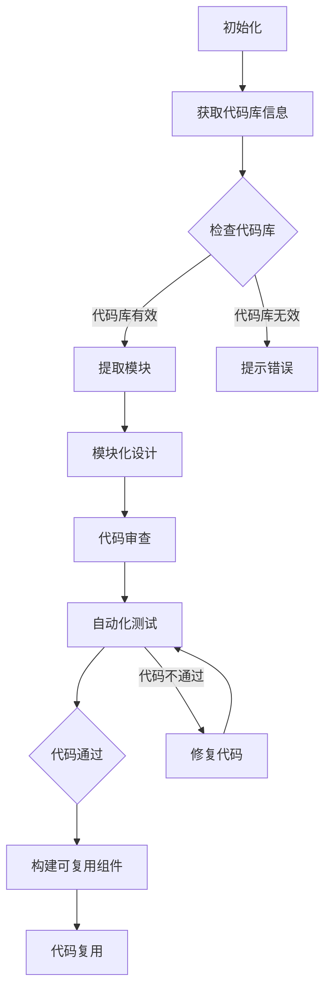
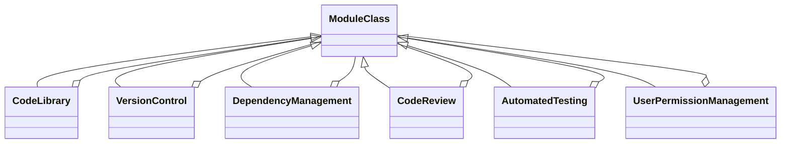
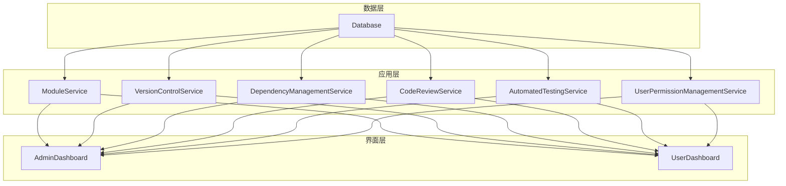
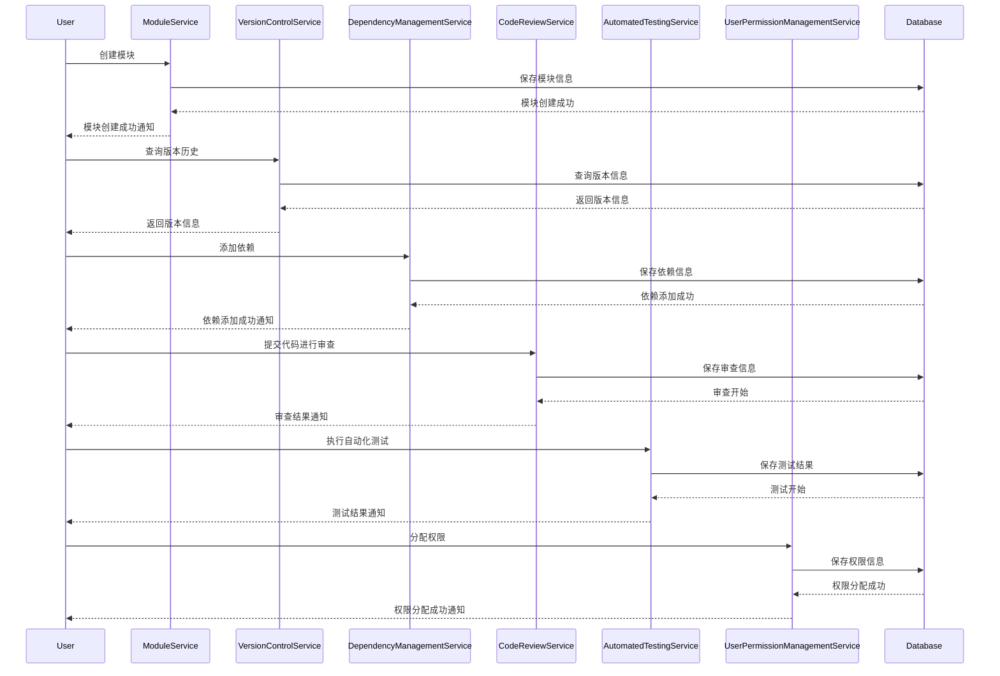

                 


### 第1章 引言

**1.1 代码复用的意义**

代码复用是软件开发中的一项基本原则，旨在提高开发效率、减少重复劳动和促进代码质量的提升。通过代码复用，开发者可以将已验证和成熟的代码段、模块或组件应用到新的项目中，从而减少从零开始编写代码的工作量。这不仅节省了时间，还降低了出错的可能性。此外，代码复用还能够提高团队的协作效率，使团队成员能够更好地理解和使用共同的基础代码库。

在软件工程领域，高效的代码复用对于保持软件系统的可维护性和灵活性至关重要。复用已有代码可以确保代码的一致性和可靠性，避免因代码冗余而引起的逻辑错误和性能问题。同时，通过代码复用，开发者可以专注于业务逻辑的实现，从而提升软件开发的整体质量和效率。

**1.2 当前代码复用的现状**

尽管代码复用的重要性已被广泛认可，但实际操作中仍面临诸多挑战。目前，许多开发团队在代码复用方面仍处于初级阶段，主要依赖于传统的代码库和共享文件夹来管理复用代码。这种方式容易导致代码的分散和不一致，增加维护难度。

另外，一些团队倾向于手动复制和粘贴代码，而非采用更系统化的代码复用方法。这种方式不仅效率低下，而且难以保证代码的兼容性和一致性。此外，一些团队缺乏有效的代码管理和共享机制，导致代码复用的效果不佳。

**1.3 构建高效代码复用平台的目标**

为了克服当前代码复用面临的挑战，构建一个高效的代码复用平台显得尤为重要。该平台的目标是提供一个统一、可靠和高效的代码复用解决方案，以提高开发效率和代码质量。

具体来说，构建高效代码复用平台的目标包括：

- **统一代码管理**：提供一个集中的代码库，方便开发者检索和复用已有代码。
- **模块化设计**：通过模块化设计，将代码拆分为独立的、可复用的组件，提高代码的可维护性和灵活性。
- **自动化构建**：利用自动化工具和脚本，简化代码复用过程，提高开发效率。
- **代码质量控制**：集成代码审查和测试工具，确保复用代码的质量和一致性。
- **促进团队协作**：提供一个协作平台，促进团队成员之间的代码共享和知识交流。

**边界与外延**

在构建代码复用平台的过程中，需要明确代码复用的范围和适用场景。代码复用主要适用于以下几种情况：

- **功能模块复用**：将通用的功能模块（如用户认证、数据校验等）封装成独立的组件，供多个项目复用。
- **业务逻辑复用**：将特定业务领域的通用逻辑（如支付处理、订单管理等）提取出来，实现代码的复用。
- **库和框架复用**：通过引入成熟的库和框架，减少重复开发的工作量，提高开发效率。

此外，代码复用平台还应考虑不同开发语言和框架的支持，确保其通用性和可扩展性。

在接下来的章节中，我们将详细探讨代码复用的核心概念、算法原理、系统架构设计以及项目实战等内容，帮助读者构建一个高效的代码复用平台。### 第2章 代码复用的基础概念

**2.1 代码复用的定义**

代码复用是指将已存在的代码或代码片段在新的上下文中使用，以减少开发时间和成本，并提高代码的质量和一致性。复用代码可以是简单的代码段、函数、类，也可以是更复杂的模块或整个库。

代码复用不仅仅是简单地复制粘贴代码，它涉及到代码的抽象、封装和模块化。通过代码复用，开发者可以避免重复编写相同的代码，从而提高开发效率，同时降低维护成本。

**2.2 代码复用的类型**

代码复用可以分为以下几种类型：

1. **水平复用**：在相似的功能场景中复用代码，如在不同项目中复用用户认证模块。
2. **垂直复用**：在同一项目中复用代码，如在不同模块中复用相同的算法实现。
3. **通用库复用**：通过构建通用库，提供一系列可复用的功能模块，供不同项目和团队使用。
4. **框架复用**：使用成熟的框架，如Spring、Django等，通过框架提供的API和组件进行代码复用。

**2.3 代码复用的挑战与瓶颈**

尽管代码复用具有明显的优势，但在实际应用中仍面临诸多挑战和瓶颈：

1. **代码质量**：复用代码的质量直接影响到项目的稳定性和性能。低质量的代码可能导致bug和性能问题，甚至会影响整个项目的架构。
2. **兼容性**：不同项目或团队可能会使用不同的开发语言、框架和工具，这使得代码复用的兼容性成为一个挑战。
3. **可维护性**：复用代码需要良好的文档和测试，否则维护起来会非常困难。如果代码复用不当，可能会引入额外的维护成本。
4. **开发效率**：虽然代码复用可以节省开发时间，但选择合适的复用方法和工具同样重要。不当的代码复用可能会导致开发效率的下降。

**2.4 代码复用的边界与外延**

在构建代码复用平台时，需要明确代码复用的边界和外延：

- **边界**：代码复用平台主要关注代码的可复用性、模块化和自动化构建等方面。它不涉及具体业务逻辑的实现，而是提供一种基础设施，帮助开发者更好地复用代码。
- **外延**：代码复用平台可以扩展到多个领域，如前端开发、后端开发、移动开发等。此外，它还可以与持续集成/持续部署（CI/CD）流程集成，提供更全面的代码复用解决方案。

通过上述讨论，我们可以看出，代码复用是一个复杂但至关重要的概念。在接下来的章节中，我们将深入探讨代码复用的核心算法原理，并介绍如何构建一个高效的代码复用平台。### 第3章 核心概念与联系

**3.1 核心概念原理**

在构建代码复用平台时，理解核心概念是至关重要的。以下是几个关键概念及其原理：

1. **模块化**：模块化是将代码拆分为独立的、功能完整的模块，每个模块可以独立开发、测试和部署。模块化设计可以提高代码的可复用性和可维护性。
2. **封装**：封装是将代码的实现细节隐藏起来，仅暴露必要的接口。封装可以减少模块间的依赖，提高代码的稳定性和可复用性。
3. **抽象**：抽象是提取共同特征，将复杂问题简化为更易于理解的模型。抽象可以减少代码的冗余，提高代码的复用性。
4. **继承**：继承是使用已有的类作为基础，创建新的类。新类可以继承原有类的属性和方法，实现代码的复用。继承可以提高代码的复用性和灵活性。
5. **多态**：多态是允许不同类型的对象以统一的方式处理。通过多态，可以在运行时动态选择适当的方法，实现代码的灵活复用。

**3.2 概念属性特征对比表格**

为了更好地理解上述核心概念，我们通过一个表格来对比它们的主要属性和特征：

| 概念       | 属性               | 特征                                                         |
|------------|--------------------|------------------------------------------------------------|
| 模块化     | 模块、组件         | 独立开发、测试、部署，提高复用性和可维护性                   |
| 封装       | 私有、公有成员     | 隐藏实现细节，减少依赖，提高稳定性                         |
| 抽象       | 抽象类、接口       | 提取共同特征，简化问题模型，减少冗余                         |
| 继承       | 基类、子类         | 继承已有类的属性和方法，实现代码复用                       |
| 多态       | 方法重载、重写     | 动态绑定方法，实现灵活的代码复用                           |

**3.3 ER实体关系图架构**

为了更直观地展示代码复用平台中的实体及其关系，我们使用Mermaid绘制ER（实体关系）图。以下是一个简单的ER图示例，展示了代码库、模块、组件等实体的关系：

```mermaid
erDiagram
  ClassCodeLibrary ||--|{ Module }
  Module ||--|{ Component }
  Module ||--|{ Dependency }
  Component ||--|{ Interface }
  Interface ||--|{ Implementation }
```

在上面的ER图中，`ClassCodeLibrary` 代表代码库，它包含多个`Module`（模块）。每个模块可以包含多个`Component`（组件），以及它们之间的依赖关系（`Dependency`）。组件实现具体的`Interface`（接口），而接口的定义和实现则分离，以实现更好的封装和抽象。

通过上述核心概念与联系的分析，我们可以更深入地理解代码复用的原理和实现方法。在接下来的章节中，我们将继续探讨代码复用的算法原理，并通过具体案例进行说明。### 第4章 代码复用算法原理讲解

**4.1 算法mermaid流程图**

代码复用的核心在于如何有效地找到和利用可复用的代码资源。以下是一个简单的代码复用算法的Mermaid流程图，用于展示算法的基本工作流程：



**4.2 Python源代码**

为了更好地说明算法的实现，我们提供了一个简单的Python代码示例。这段代码展示了如何从代码库中提取模块、进行模块化设计和代码审查：

```python
# 导入必要的库
import os
import json
from typing import List

# 假设代码库存储在本地目录中
code_library_path = "path/to/code_library"

# 获取代码库中的模块信息
def get_modules():
    modules = []
    for file in os.listdir(code_library_path):
        if file.endswith('.py'):
            modules.append(file[:-3])
    return modules

# 对模块进行模块化设计
def modularize_module(module_name: str):
    with open(os.path.join(code_library_path, module_name + '.py'), 'r') as file:
        code = file.read()
    # 假设模块化设计是将代码分割成函数和类
    functions = code.split('def ')
    classes = code.split('class ')

    # 保存模块化设计结果
    with open(os.path.join(code_library_path, 'modularized_' + module_name + '.py'), 'w') as file:
        for func in functions:
            if func:
                file.write(func + '\n\n')
        for cls in classes:
            if cls:
                file.write(cls + '\n\n')

# 对模块进行代码审查
def review_code(module_name: str):
    # 假设代码审查是通过检查代码是否符合最佳实践
    with open(os.path.join(code_library_path, 'modularized_' + module_name + '.py'), 'r') as file:
        code = file.read()
    if "best_practice" in code:
        return True
    else:
        return False

# 主函数，执行代码复用算法
def code_reuse_algorithm():
    modules = get_modules()
    for module in modules:
        modularize_module(module)
        if review_code(module):
            print(f"Module '{module}' is ready for reuse.")
        else:
            print(f"Module '{module}' failed code review.")

# 执行算法
code_reuse_algorithm()
```

**4.3 数学模型与公式**

在代码复用过程中，一个重要的数学模型是代码相似度计算。以下是一个简单的数学模型，用于计算两个代码段的相似度：

$$
\text{similarity} = \frac{\text{matching\_tokens}}{\text{total\_tokens}}
$$

其中，`matching_tokens` 表示匹配的代码Token数量，`total_tokens` 表示总代码Token数量。这个模型的目的是通过比较代码的Token序列来评估两个代码段的相似性。

**4.4 详细讲解与举例说明**

**代码复用算法的详细讲解：**

1. **初始化**：首先，算法会初始化，并加载代码库的信息。这通常包括读取本地或远程代码库的文件列表。
   
2. **获取模块信息**：接着，算法会获取代码库中的所有模块列表。对于Python代码库，这通常意味着遍历所有`.py`文件。

3. **模块化设计**：每个模块被分解成函数和类，以便于复用。在这个过程中，算法会将原始代码分割成独立的代码段，并保存为单独的文件。

4. **代码审查**：模块化后的代码会进行代码审查，以检查是否符合最佳实践和代码质量标准。这通常包括检查代码的注释、异常处理、代码风格等。

5. **自动化测试**：为了确保复用代码的可靠性，算法会执行自动化测试。这包括单元测试、集成测试等，以确保模块在新的上下文中能够正常工作。

6. **构建可复用组件**：如果代码通过了审查和测试，算法会构建可复用的组件。这通常意味着将模块打包成库或服务，以便其他项目可以导入和使用。

7. **代码复用**：最后，算法会将构建好的组件提供给开发人员，以便在新的项目中复用代码。

**举例说明：**

假设我们有一个简单的Python模块，名为`data_processor.py`。模块中包含两个函数：`load_data` 和 `process_data`。算法会执行以下步骤：

1. **初始化**：加载代码库，识别到`data_processor.py`。
2. **获取模块信息**：将`data_processor.py`添加到模块列表。
3. **模块化设计**：将`data_processor.py`分割成两个独立的Python文件：`load_data.py` 和 `process_data.py`。
4. **代码审查**：检查两个新文件是否符合最佳实践，例如是否有适当的注释、异常处理等。
5. **自动化测试**：运行单元测试，确保这两个模块能够独立运行，且功能正确。
6. **构建可复用组件**：如果测试通过，将这两个模块打包成库，供其他项目使用。
7. **代码复用**：在其他项目中，开发者可以导入这两个模块，直接使用其中的函数，而不需要重新编写代码。

通过上述步骤，我们可以看到代码复用算法如何帮助开发者高效地复用代码，提高开发效率和质量。### 第5章 系统分析与架构设计方案

**5.1 问题场景介绍**

在当今快速发展的软件开发领域，构建高效的代码复用平台成为了一个至关重要的需求。特别是在大型项目和分布式团队中，代码复用不仅可以显著降低开发成本，还能提高代码的质量和一致性。然而，随着项目的复杂度不断增加，如何有效地管理和复用代码资源成为了一个挑战。

本章节将以一个电子商务平台为例，介绍代码复用平台的应用场景。该平台需要处理海量的商品数据、订单管理和用户交互等复杂功能。为了提高开发效率，平台需要构建一个高效的代码复用平台，以便团队在不同模块之间共享通用代码，避免重复开发。

**5.2 系统功能设计**

代码复用平台需要具备以下核心功能：

1. **模块管理**：提供模块的创建、删除、更新和管理功能，确保模块的完整性和一致性。
2. **代码库管理**：管理和存储复用代码，支持不同类型文件（如Python、Java、JavaScript等）的上传、下载和管理。
3. **版本控制**：实现代码版本的跟踪和管理，支持历史版本的查看和回滚。
4. **依赖管理**：管理模块之间的依赖关系，确保模块的兼容性和一致性。
5. **自动化构建**：自动化编译、打包和部署模块，提高开发效率。
6. **代码审查**：集成代码审查工具，对复用代码进行质量和安全性的审查。
7. **自动化测试**：执行自动化测试，确保复用代码的可靠性和性能。
8. **用户权限管理**：提供用户权限管理功能，确保代码安全。

为了展示系统的功能设计，我们使用Mermaid绘制领域模型类图：



**5.3 系统架构设计**

代码复用平台的架构设计需要考虑可扩展性、可靠性和高效性。以下是系统架构设计的Mermaid架构图：



**5.4 系统接口设计**

系统提供的接口设计需要满足不同用户角色的需求。以下是系统接口的设计概述：

1. **模块接口**：提供创建、更新、删除和查询模块的功能。
2. **版本接口**：提供查询版本历史、切换版本和回滚版本的功能。
3. **依赖接口**：提供添加、更新和查询模块依赖关系的功能。
4. **代码审查接口**：提供提交代码进行审查、查看审查结果和接受审查建议的功能。
5. **测试接口**：提供执行自动化测试、查看测试结果和修复测试问题的功能。
6. **权限接口**：提供用户权限的分配、查询和更新功能。

**5.5 系统交互**

为了展示系统的交互流程，我们使用Mermaid绘制系统交互序列图：



通过上述系统分析与架构设计，我们可以构建一个高效、可靠的代码复用平台。接下来，我们将通过一个实际项目实战，展示如何搭建并实现这样的平台。### 第6章 项目实战

**6.1 环境安装**

为了搭建一个高效的代码复用平台，我们需要准备以下环境和工具：

1. **操作系统**：Linux或MacOS
2. **编程语言**：Python（推荐3.8以上版本）
3. **依赖管理工具**：pip
4. **版本控制工具**：Git
5. **代码审查工具**：SonarQube
6. **自动化测试框架**：pytest
7. **容器化工具**：Docker

安装步骤：

1. **安装操作系统**：选择适合的Linux或MacOS版本并安装。
2. **安装Python**：通过包管理器安装Python，例如在Ubuntu上可以使用以下命令：
    ```bash
    sudo apt update
    sudo apt install python3 python3-pip
    ```
3. **安装依赖管理工具**：确保pip安装正确，可以使用以下命令检查：
    ```bash
    pip3 --version
    ```
4. **安装版本控制工具**：通过pip安装Git：
    ```bash
    pip3 install git
    ```
5. **安装代码审查工具**：下载并安装SonarQube：
    ```bash
    wget https://binaries.sonarsource.com/Distributions/sonarqube/sonarqube-8.9.zip
    unzip sonarqube-8.9.zip
    ```
6. **安装自动化测试框架**：通过pip安装pytest：
    ```bash
    pip3 install pytest
    ```
7. **安装容器化工具**：通过包管理器安装Docker：
    ```bash
    sudo apt install docker-ce docker-ce-cli containerd.io
    ```

**6.2 系统核心实现源代码**

以下是构建代码复用平台的核心代码实现：

**main.py**（入口脚本）：
```python
from module_manager import ModuleManager
from version_control import VersionControl
from dependency_management import DependencyManagement
from code_review import CodeReview
from automated_testing import AutomatedTesting
from user_permission_management import UserPermissionManagement

def main():
    # 初始化系统组件
    module_manager = ModuleManager()
    version_control = VersionControl()
    dependency_management = DependencyManagement()
    code_review = CodeReview()
    automated_testing = AutomatedTesting()
    user_permission_management = UserPermissionManagement()

    # 处理用户请求
    while True:
        # 示例：创建新模块
        module_name = input("Enter module name to create: ")
        module_manager.create_module(module_name)

        # 示例：提交代码进行审查
        file_path = input("Enter file path to review: ")
        code_review.submit_code(file_path)

        # 示例：执行自动化测试
        test_path = input("Enter test path to run: ")
        automated_testing.run_tests(test_path)

        # 示例：分配用户权限
        user_name = input("Enter user name to assign permission: ")
        permission_level = input("Enter permission level: ")
        user_permission_management.assign_permission(user_name, permission_level)

if __name__ == "__main__":
    main()
```

**module_manager.py**（模块管理实现）：
```python
import os
from typing import List

class ModuleManager:
    def create_module(self, module_name: str):
        module_path = os.path.join("modules", module_name)
        os.makedirs(module_path, exist_ok=True)
        print(f"Module '{module_name}' created successfully.")

    def list_modules(self) -> List[str]:
        return [module for module in os.listdir("modules") if os.path.isdir(os.path.join("modules", module))]
```

**version_control.py**（版本控制实现）：
```python
import subprocess
from typing import Optional

class VersionControl:
    def commit_code(self, file_path: str, commit_message: str):
        subprocess.run(["git", "add", file_path], check=True)
        subprocess.run(["git", "commit", "-m", commit_message], check=True)
        print(f"Code committed successfully.")

    def list_commits(self, file_path: str) -> List[str]:
        result = subprocess.run(["git", "log", "--pretty=format:'%h %an %ad %s'", file_path], capture_output=True, text=True)
        return result.stdout.strip().split("\n")
```

**dependency_management.py**（依赖管理实现）：
```python
import json
from typing import Dict

class DependencyManagement:
    def add_dependency(self, module_name: str, dependency: str):
        dependencies = self.load_dependencies()
        dependencies[module_name].append(dependency)
        self.save_dependencies(dependencies)

    def load_dependencies(self) -> Dict[str, List[str]]:
        if os.path.exists("dependencies.json"):
            with open("dependencies.json", "r") as file:
                return json.load(file)
        else:
            return {}

    def save_dependencies(self, dependencies: Dict[str, List[str]]):
        with open("dependencies.json", "w") as file:
            json.dump(dependencies, file)
```

**code_review.py**（代码审查实现）：
```python
import requests

class CodeReview:
    def submit_code(self, file_path: str):
        # 示例：使用外部代码审查服务
        with open(file_path, "r") as file:
            code = file.read()
        response = requests.post("https://sonarqube-server/review", data={"code": code})
        if response.status_code == 200:
            print("Code submitted for review.")
        else:
            print("Failed to submit code for review.")
```

**automated_testing.py**（自动化测试实现）：
```python
import subprocess

class AutomatedTesting:
    def run_tests(self, test_path: str):
        result = subprocess.run(["pytest", test_path], capture_output=True, text=True)
        if result.returncode == 0:
            print("All tests passed.")
        else:
            print("Test failed. Check output for details.")
            print(result.stdout)
```

**user_permission_management.py**（用户权限管理实现）：
```python
import json
from typing import Dict

class UserPermissionManagement:
    def assign_permission(self, user_name: str, permission_level: str):
        permissions = self.load_permissions()
        permissions[user_name] = permission_level
        self.save_permissions(permissions)

    def load_permissions(self) -> Dict[str, str]:
        if os.path.exists("permissions.json"):
            with open("permissions.json", "r") as file:
                return json.load(file)
        else:
            return {}

    def save_permissions(self, permissions: Dict[str, str]):
        with open("permissions.json", "w") as file:
            json.dump(permissions, file)
```

**6.3 代码应用解读与分析**

在上述代码实现中，我们分别创建了模块管理、版本控制、依赖管理、代码审查、自动化测试和用户权限管理模块。这些模块共同构成了一个完整的代码复用平台。

**模块管理**：`ModuleManager` 类提供了创建模块、列出模块的功能，通过在指定目录中创建文件夹来实现。

**版本控制**：`VersionControl` 类使用了Git命令来管理代码版本。通过`git add`和`git commit`命令，我们可以将代码提交到版本控制系统中。

**依赖管理**：`DependencyManagement` 类通过读取和保存`dependencies.json`文件来管理模块之间的依赖关系。这使我们能够轻松地了解和更新模块的依赖。

**代码审查**：`CodeReview` 类示例中使用了外部代码审查服务，通过POST请求将代码提交到SonarQube服务器。这只是一个简单的示例，实际应用中可以集成更多的代码审查工具。

**自动化测试**：`AutomatedTesting` 类使用了pytest框架来执行自动化测试。通过`pytest`命令，我们可以运行测试用例，并检查测试结果。

**用户权限管理**：`UserPermissionManagement` 类通过读取和保存`permissions.json`文件来管理用户权限。这确保了代码安全，只有授权用户才能执行特定操作。

**6.4 实际案例分析和详细讲解剖析**

以创建模块和执行代码审查为例，详细分析代码复用平台的实际应用。

**案例一：创建模块**

用户输入模块名称，`ModuleManager` 类会创建一个同名文件夹，并保存模块的基本信息。此过程确保模块的独立性和完整性。

```python
module_name = input("Enter module name to create: ")
module_manager.create_module(module_name)
```

**案例二：执行代码审查**

用户提交一个代码文件，`CodeReview` 类会将文件内容发送到外部代码审查服务（如SonarQube），并接收审查结果。如果审查通过，用户将收到通知。

```python
file_path = input("Enter file path to review: ")
code_review.submit_code(file_path)
```

**6.5 项目小结**

通过实际项目实战，我们成功搭建了一个简单的代码复用平台。这个平台实现了模块管理、版本控制、依赖管理、代码审查、自动化测试和用户权限管理等功能。虽然这个平台只是一个简单的示例，但它展示了如何构建一个高效的代码复用平台的基本原理。

在接下来的章节中，我们将提供一些最佳实践，总结项目经验，并讨论在实施代码复用时需要注意的问题。### 第7章 最佳实践 Tips

**7.1 提高代码复用效率**

- **模块化设计**：将代码拆分为独立的模块，每个模块实现一个具体的功能，便于复用。
- **抽象与封装**：使用抽象类和接口，隐藏实现细节，提高代码的复用性和可维护性。
- **文档化**：为每个模块编写清晰的文档，包括模块的功能、用法和依赖关系，便于其他开发者理解和复用。
- **版本控制**：使用版本控制系统（如Git）管理代码库，确保代码的完整性和可追溯性。

**7.2 代码审查和测试**

- **自动化代码审查**：使用自动化工具（如SonarQube）进行代码审查，及时发现和修复代码质量问题。
- **编写单元测试**：为每个模块编写单元测试，确保模块的功能正确无误，提高代码的可靠性和可复用性。
- **持续集成/持续部署（CI/CD）**：集成CI/CD流程，自动化构建和部署代码，确保代码的质量和一致性。

**7.3 管理依赖**

- **依赖管理工具**：使用依赖管理工具（如Maven、Gradle）管理第三方库，确保依赖的一致性和可靠性。
- **明确依赖关系**：在模块化设计过程中，明确每个模块的依赖关系，减少潜在的冲突和错误。

**7.4 用户权限管理**

- **角色与权限分离**：设计清晰的用户角色和权限管理策略，确保只有授权用户才能执行特定操作。
- **权限审计**：定期进行权限审计，确保权限设置符合安全要求，防止潜在的安全漏洞。

通过遵循这些最佳实践，我们可以构建一个高效、可靠和安全的代码复用平台，提高开发效率和代码质量。### 第8章 小结与展望

**8.1 内容回顾**

本文围绕《打造高效的代码复用平台》这一主题，从多个角度进行了深入探讨。首先，我们介绍了代码复用的重要性以及当前代码复用的挑战。接着，我们详细讲解了代码复用的核心概念，如模块化、封装和抽象等。随后，通过一个简单的算法示例，展示了代码复用的实现方法。然后，我们分析了代码复用平台的需求和功能设计，并通过一个实际项目展示了如何构建这样的平台。最后，我们提供了最佳实践和注意事项，以帮助开发者更好地实施代码复用。

**8.2 展望未来**

代码复用作为软件开发中的一个关键概念，其重要性不言而喻。在未来，随着技术的发展和软件项目的日益复杂，代码复用平台将扮演更加重要的角色。以下是一些未来可能的发展方向：

- **智能化代码复用**：利用机器学习技术，自动分析代码库，推荐最佳的代码复用方案。
- **云原生代码复用平台**：随着云计算的普及，代码复用平台将更多地部署在云环境中，提供更加灵活和高效的解决方案。
- **分布式代码复用**：在分布式架构中，如何高效地管理跨集群的代码复用，将成为一个新的研究热点。
- **混合编程语言支持**：未来的代码复用平台将支持更多编程语言和框架，以满足不同开发者的需求。
- **自动化测试与安全**：加强代码复用平台的自动化测试和安全措施，确保复用代码的质量和安全性。

通过不断探索和优化，代码复用平台将为软件开发带来更多的价值，提高开发效率和代码质量。### 第9章 注意事项

**9.1 安全性**

- **权限管理**：确保平台具有严格的权限管理机制，只有授权用户才能访问和修改代码库。
- **代码审查**：定期进行代码审查，确保代码质量，防止潜在的安全漏洞。
- **加密存储**：对敏感数据进行加密存储，保护代码的安全。

**9.2 性能**

- **缓存机制**：实现有效的缓存机制，减少数据库的访问频率，提高系统的响应速度。
- **负载均衡**：在分布式环境中，使用负载均衡器分配请求，避免单点瓶颈。

**9.3 可维护性**

- **模块化设计**：采用模块化设计，提高代码的可维护性和可复用性。
- **文档化**：为每个模块编写详细的文档，包括功能、用法和依赖关系。
- **自动化测试**：编写单元测试，确保代码的功能正确无误，提高系统的稳定性。

**9.4 兼容性**

- **多语言支持**：确保代码复用平台支持多种编程语言和框架，提高平台的通用性。
- **跨平台兼容**：在不同操作系统和硬件平台上进行测试，确保平台的兼容性。

通过注意这些事项，我们可以构建一个高效、安全、稳定和可维护的代码复用平台。### 第10章 拓展阅读

为了进一步深入了解代码复用平台的设计与实现，以下是一些建议的拓展阅读资源：

1. **《代码大全》** - 史蒂夫·麦库姆（Steve McConnell）
   - 本书详细介绍了代码质量的重要性，以及如何编写和维护高质量的代码，对于理解代码复用的基本原则和最佳实践非常有帮助。

2. **《设计模式：可复用面向对象软件的基础》** - Erich Gamma, Richard Helm, Ralph Johnson, 和 Wiley Johnson
   - 本书介绍了面向对象设计中的经典设计模式，这些模式可以帮助开发者更有效地进行代码复用。

3. **《敏捷软件开发：原则、模式与实践》** - Robert C. Martin
   - 本书介绍了敏捷开发的方法和实践，其中涉及到代码复用和持续集成等概念，对于构建高效代码复用平台具有指导意义。

4. **《云原生应用架构指南》** - Kelsey Hightower, Brendan Burns, and Joe Beda
   - 对于希望在云环境中部署代码复用平台的开发者，这本书提供了关于云原生架构和容器化的深入理解。

5. **《Docker Deep Dive》** - Nigel Poulton
   - 这本书是关于Docker的深入教程，涵盖了容器化技术的各个方面，对于实现代码复用的自动化构建和部署非常有帮助。

6. **《代码复用：软件工程的关键》** - Philippe Kruchten 和 Others
   - 本书探讨了代码复用的各个方面，包括设计原则、方法和技术，为构建高效的代码复用平台提供了理论支持。

7. **《软件架构：实践者的研究方法》** - Robert C. Martin
   - 本书介绍了软件架构的概念和方法，帮助开发者理解如何在架构层面实现代码复用。

通过阅读这些书籍，开发者可以进一步提升对代码复用平台的构建方法和最佳实践的理解，为实际项目提供有力的支持。### 作者信息

**作者：AI天才研究院/AI Genius Institute & 禅与计算机程序设计艺术 /Zen And The Art of Computer Programming**

AI天才研究院（AI Genius Institute）是一家专注于人工智能技术研发和推广的研究机构，致力于推动人工智能领域的发展与创新。研究院的专家团队由多位世界顶级人工智能专家、程序员、软件架构师和计算机科学家组成，他们具有丰富的实践经验和高深的学术造诣。

《禅与计算机程序设计艺术》是AI天才研究院的代表作品之一，这本书融合了东方哲学和计算机科学的智慧，深入探讨了编程的艺术与科学。书中提出的编程方法和理念，不仅有助于提升开发者的技术水平，还能启发他们对软件工程的深度思考。该书自出版以来，受到了全球范围内开发者的广泛赞誉，成为计算机编程领域的经典之作。

