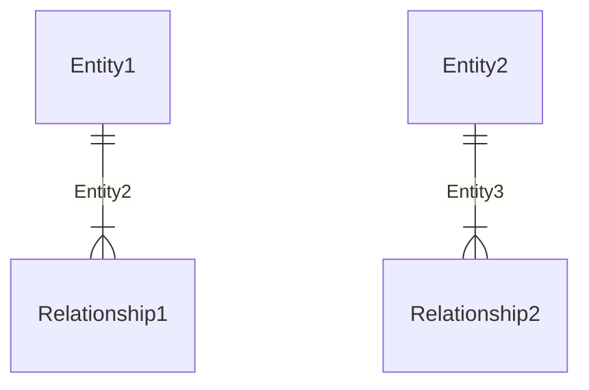

                 

# 《打造高效的代码生成工具链》

## 关键词：代码生成、工具链、性能优化、应用实践、未来发展趋势

> 摘要：本文将深入探讨如何打造一个高效、灵活且可扩展的代码生成工具链。我们将从代码生成工具链的基础知识出发，逐步介绍如何构建自定义代码生成工具，探讨优化策略，分析应用实践，并展望代码生成工具的未来发展趋势。

## 目录大纲

## 第1章：引言

### 1.1 问题背景与目标

### 1.2 代码生成工具的重要性

### 1.3 本书结构与内容概述

## 第2章：代码生成工具链基础

### 2.1 代码生成的概念与原理

#### 2.1.1 代码生成的概念

#### 2.1.2 代码生成的应用场景

#### 2.1.3 代码生成工具的分类

### 2.2 常见的代码生成工具

#### 2.2.1 Template Engines

#### 2.2.2 元编程工具

#### 2.2.3 代码生成框架

## 第3章：构建自定义代码生成工具

### 3.1 自定义代码生成工具的设计

#### 3.1.1 工具架构设计

#### 3.1.2 数据模型设计

#### 3.1.3 代码模板设计

### 3.2 实现自定义代码生成工具

#### 3.2.1 选择合适的编程语言和框架

#### 3.2.2 实现代码生成逻辑

#### 3.2.3 代码生成工具的测试

## 第4章：代码生成工具的优化

### 4.1 性能优化

#### 4.1.1 代码生成效率的提升

#### 4.1.2 代码质量的保证

#### 4.1.3 性能测试与调优

### 4.2 可维护性优化

#### 4.2.1 代码结构优化

#### 4.2.2 文档和注释的完善

#### 4.2.3 代码生成工具的迭代与升级

## 第5章：代码生成工具的应用实践

### 5.1 代码生成工具在项目中的应用

#### 5.1.1 项目需求分析

#### 5.1.2 代码生成工具的选择与定制

#### 5.1.3 应用效果评估

### 5.2 实际案例解析

#### 5.2.1 案例背景

#### 5.2.2 代码生成工具的实施与效果

#### 5.2.3 案例总结与反思

## 第6章：代码生成工具的未来发展

### 6.1 代码生成工具的趋势

#### 6.1.1 自动化与智能化

#### 6.1.2 与其他工具的融合

#### 6.1.3 开源与生态建设

### 6.2 代码生成工具的创新方向

#### 6.2.1 面向特定领域的代码生成

#### 6.2.2 集成开发环境（IDE）中的代码生成

#### 6.2.3 与人工智能的深度融合

## 第7章：总结与展望

### 7.1 本书内容的回顾

### 7.2 对代码生成工具链的思考

### 7.3 对未来工作的展望

## 第1章：引言

### 1.1 问题背景与目标

在现代软件开发中，代码生成工具链正变得越来越重要。随着项目的规模和复杂性不断增加，手动编写和维护代码变得越来越困难，而且容易引入错误。因此，自动化的代码生成工具链成为提高开发效率、减少人力成本和提升代码质量的重要手段。

我们的目标是构建一个高效、灵活且可扩展的代码生成工具链，它不仅能够快速生成高质量的代码，还能适应不同项目需求，具备良好的可维护性和扩展性。

### 1.2 代码生成工具的重要性

代码生成工具的重要性体现在以下几个方面：

1. **提高开发效率**：通过自动化生成代码，开发者可以将精力集中在更高价值的设计和优化工作上。
2. **减少人力成本**：代码生成可以减少重复性工作，降低对开发人员数量的需求。
3. **保证代码质量**：自动化生成代码能够减少人为错误，提高代码的一致性和可靠性。
4. **适应多变需求**：灵活的代码生成工具链能够快速响应项目需求的变化。

### 1.3 本书结构与内容概述

本书将分为以下几个部分：

- **第1章：引言**：介绍代码生成工具链的背景和重要性。
- **第2章：代码生成工具链基础**：介绍代码生成的基本原理和常见工具。
- **第3章：构建自定义代码生成工具**：讲解如何设计并实现自定义代码生成工具。
- **第4章：代码生成工具的优化**：探讨性能和可维护性优化策略。
- **第5章：代码生成工具的应用实践**：分析代码生成工具在项目中的应用案例。
- **第6章：代码生成工具的未来发展**：展望代码生成工具的未来趋势和创新方向。
- **第7章：总结与展望**：回顾本书内容，提出对未来工作的展望。

接下来，我们将详细探讨代码生成工具链的基础知识，以便为后续章节的内容打下坚实的基础。

## 第2章：代码生成工具链基础

### 2.1 代码生成的概念与原理

#### 2.1.1 代码生成的概念

代码生成是指利用特定规则和模板，从结构化的数据或模型中自动生成代码的过程。这个过程通常包括以下步骤：

1. **数据模型定义**：定义代码生成所需的数据结构和模型。
2. **规则和模板设计**：设计用于生成代码的规则和模板。
3. **代码生成**：根据数据和模板，自动生成代码。

代码生成的目的是为了提高开发效率，减少重复性工作，并确保代码的一致性和可靠性。

#### 2.1.2 代码生成的应用场景

代码生成在多个应用场景中发挥着重要作用：

1. **前端开发**：如React和Vue框架中的组件生成，可以快速创建UI界面。
2. **后端开发**：如数据库表与对象映射（ORM）工具，可以自动生成数据访问层代码。
3. **框架集成**：许多开发框架内置了代码生成工具，如Spring Boot。
4. **应用集成**：自动化工具如API网关和微服务架构中，可以生成服务接口代码。

#### 2.1.3 代码生成工具的分类

根据不同的需求和场景，代码生成工具可以分为以下几类：

1. **Template Engines**：如Handlebars、Jinja2等，主要用于生成静态网页和模板化代码。
2. **元编程工具**：如Java的AspectJ，用于生成AOP（面向切面编程）相关的代码。
3. **代码生成框架**：如Spring Boot Generator，用于生成完整的Spring Boot项目。

这些工具各有特点，但核心目标都是通过自动化生成代码，提高开发效率和代码质量。

### 2.2 常见的代码生成工具

#### 2.2.1 Template Engines

模板引擎是一种用于生成动态网页和模板化代码的工具。常见的模板引擎包括：

- **Handlebars**：一种流行的JavaScript模板引擎，用于生成HTML、JSON等。
- **Jinja2**：Python的模板引擎，广泛用于Web开发。
- **Blade**：Laravel框架的模板引擎，用于生成PHP代码。

模板引擎的主要特点是可以将数据动态地插入到预定义的模板中，生成最终的代码。

#### 2.2.2 元编程工具

元编程工具可以在编译或运行时动态生成代码，常用于实现AOP等复杂需求。常见的元编程工具包括：

- **AspectJ**：Java的元编程框架，用于实现AOP。
- **PostSharp**：C#的元编程工具，用于实现AOP。
- **Spring AOP**：Spring框架的AOP实现，用于生成动态代理代码。

元编程工具的主要特点是可以在编译或运行时插入代码，实现特定功能。

#### 2.2.3 代码生成框架

代码生成框架是一组预定义的工具和模板，用于生成完整的代码库或项目。常见的代码生成框架包括：

- **Spring Boot Generator**：用于生成Spring Boot项目。
- **Entity Framework Code First**：用于生成ORM相关的代码。
- **TypeScript Angular CLI**：用于生成Angular项目。

代码生成框架的主要特点是提供了完整的代码生成解决方案，大大简化了开发过程。

通过了解这些常见的代码生成工具，我们可以更好地选择适合自己项目的工具，提高开发效率和代码质量。

## 第3章：构建自定义代码生成工具

### 3.1 自定义代码生成工具的设计

要构建一个高效的自定义代码生成工具，首先需要进行详细的设计。以下是我们需要考虑的关键要素：

#### 3.1.1 工具架构设计

工具的架构设计是构建高效代码生成工具的关键。一个良好的架构应具备以下特点：

1. **模块化**：将工具分解为多个模块，每个模块负责特定的功能。
2. **可扩展性**：允许用户自定义规则和模板，以适应不同的项目需求。
3. **易维护性**：便于后续的维护和升级。

架构设计的基本模块可能包括数据模型解析器、模板引擎、代码生成器和结果输出器。

#### 3.1.2 数据模型设计

数据模型设计是代码生成的核心。我们需要定义一个结构化且易于解析的数据模型，以确保代码生成的准确性和一致性。数据模型通常包括：

1. **实体**：定义代码生成所需的基本数据结构。
2. **关系**：描述实体之间的关联关系。
3. **属性**：定义实体的属性及其类型。

数据模型的ER图可以帮助我们直观地了解模型结构。



#### 3.1.3 代码模板设计

代码模板是生成代码的核心，我们需要设计灵活且易于维护的模板。模板通常包含以下部分：

1. **全局布局**：定义代码的整体结构。
2. **变量占位符**：用于插入动态数据。
3. **代码块**：定义可重用的代码段。

模板设计应考虑到代码的可读性和可维护性，避免过度复杂化。

### 3.2 实现自定义代码生成工具

构建自定义代码生成工具需要选择合适的编程语言和框架。以下是一个实现步骤的概述：

#### 3.2.1 选择合适的编程语言和框架

选择编程语言和框架时，我们需要考虑以下因素：

1. **开发效率**：选择易于开发和维护的语言和框架。
2. **性能**：选择性能良好的语言和框架。
3. **社区支持**：选择有广泛社区支持的语言和框架。

Python和Java是构建代码生成工具的常见选择，因为它们具有丰富的库和框架支持。

#### 3.2.2 实现代码生成逻辑

实现代码生成逻辑时，我们需要以下步骤：

1. **解析数据模型**：读取和解析定义的数据模型。
2. **加载模板**：从文件系统中加载预定义的代码模板。
3. **数据绑定**：将数据模型中的数据动态绑定到模板中的变量占位符。
4. **生成代码**：根据绑定的数据和模板生成最终的代码。
5. **输出代码**：将生成的代码输出到目标文件或目录。

以下是使用Python实现的一个简单示例：

```python
from jinja2 import Environment, FileSystemLoader

# 解析数据模型
data_model = ...

# 加载模板
environment = Environment(loader=FileSystemLoader('templates'))
template = environment.get_template('template.txt')

# 数据绑定并生成代码
code = template.render(data_model=data_model)

# 输出代码
with open('output.txt', 'w') as f:
    f.write(code)
```

#### 3.2.3 代码生成工具的测试

实现代码生成工具后，我们需要进行全面的测试，以确保其功能正确、性能良好和易于维护。以下是一些关键测试步骤：

1. **单元测试**：测试工具的每个模块和函数，确保它们按预期工作。
2. **集成测试**：测试工具的整体功能，确保各个模块之间的交互正常。
3. **性能测试**：测量工具的性能，如代码生成速度和内存占用。
4. **用户测试**：邀请实际用户测试工具，收集反馈并改进工具。

通过上述步骤，我们可以构建一个高效、灵活且可扩展的自定义代码生成工具，为项目的开发提供有力支持。

### 3.3 代码生成工具的测试

测试自定义代码生成工具是确保其功能正确性和性能的关键步骤。以下是详细的测试流程：

#### 3.3.1 单元测试

单元测试是测试代码生成工具的基本单元，通常针对每个模块或函数进行。以下是一个单元测试示例：

```python
import unittest
from code_generator import CodeGenerator

class TestCodeGenerator(unittest.TestCase):
    def test_generate_code(self):
        data_model = {'name': 'John', 'age': 30}
        generator = CodeGenerator()
        code = generator.generate_code(data_model)
        self.assertIsNotNone(code)
        self.assertIn('John', code)
        self.assertIn('30', code)

if __name__ == '__main__':
    unittest.main()
```

#### 3.3.2 集成测试

集成测试旨在确保代码生成工具的各个模块能够协同工作。以下是一个集成测试示例：

```python
import unittest
from code_generator import CodeGenerator

class TestCodeIntegration(unittest.TestCase):
    def test_code_generation(self):
        data_model = {'name': 'John', 'age': 30}
        generator = CodeGenerator()
        code = generator.generate_code(data_model)
        with open('output.txt', 'w') as f:
            f.write(code)
        self.assertTrue(os.path.exists('output.txt'))

if __name__ == '__main__':
    unittest.main()
```

#### 3.3.3 性能测试

性能测试是评估代码生成工具在实际应用中的表现。以下是一个简单的性能测试示例：

```python
import unittest
import time
from code_generator import CodeGenerator

class TestCodePerformance(unittest.TestCase):
    def test_code_generation_performance(self):
        data_model = {'name': 'John', 'age': 30}
        generator = CodeGenerator()
        start_time = time.time()
        code = generator.generate_code(data_model)
        end_time = time.time()
        self.assertIsNotNone(code)
        print(f"Code generation time: {end_time - start_time} seconds")

if __name__ == '__main__':
    unittest.main()
```

#### 3.3.4 用户测试

用户测试是收集实际用户反馈的重要步骤。以下是一个用户测试的示例流程：

1. **用户故事编写**：编写用户测试的详细描述，包括测试用例和预期结果。
2. **用户执行测试**：邀请用户按照测试用例进行实际操作。
3. **记录反馈**：记录用户的使用体验和遇到的问题。
4. **分析反馈**：分析用户反馈，确定工具的优点和改进点。

通过上述测试步骤，我们可以确保自定义代码生成工具的功能正确、性能良好，并且能够满足用户需求。

### 4.1 性能优化

性能优化是提升代码生成工具效率的关键。以下是几个关键性能优化策略：

#### 4.1.1 代码生成效率的提升

1. **预编译模板**：预编译模板可以减少运行时的模板解析时间。
   ```python
   from jinja2 import Environment, FileSystemLoader
   env = Environment(loader=FileSystemLoader('templates'))
   template = env.get_template('template.txt')
   # 在首次使用前预编译模板
   compiled_template = template.compile()
   ```

2. **缓存生成的代码**：缓存可以减少重复生成相同代码的次数。
   ```python
   import os
   import json
   cache_file = 'code_cache.json'
   if os.path.exists(cache_file):
       with open(cache_file, 'r') as f:
           cache = json.load(f)
   else:
       cache = {}
   ```

3. **并行处理**：利用多线程或多进程进行并行代码生成。
   ```python
   from concurrent.futures import ThreadPoolExecutor
   def generate_code(data_model):
       # 生成代码的逻辑
       return code
   with ThreadPoolExecutor(max_workers=5) as executor:
       results = list(executor.map(generate_code, data_models))
   ```

4. **减少I/O操作**：优化文件读写操作，减少I/O等待时间。
   ```python
   def write_codes(codes):
       with open('output.txt', 'w') as f:
           for code in codes:
               f.write(code)
   ```

#### 4.1.2 代码质量的保证

1. **代码格式化**：确保生成的代码遵循统一的格式，提高可读性和可维护性。
   ```python
   import black
   def format_code(code):
       return black.format_str(code, mode=black.FileMode())
   ```

2. **代码检查**：使用代码检查工具（如Pylint、Flake8）确保生成的代码符合最佳实践。
   ```python
   import subprocess
   def check_code(code):
       result = subprocess.run(['pylint', 'example.py'], input=code.encode(), capture_output=True)
       return result.stdout.decode()
   ```

3. **代码重构**：定期对生成的代码进行重构，提高代码的可维护性和扩展性。

#### 4.1.3 性能测试与调优

1. **基准测试**：使用基准测试工具（如timeit）测量代码生成工具的性能。
   ```python
   import timeit
   def test_code_generation_time():
       timeit.timeit('code_generator.generate_code(data_model)', setup='from code_generator import generate_code, data_model', number=1000)
   ```

2. **调优策略**：根据基准测试的结果，逐步优化代码生成工具的性能。

通过上述性能优化策略，我们可以显著提升代码生成工具的效率，确保生成代码的质量。

### 4.2 可维护性优化

为了确保代码生成工具的可维护性，我们需要在架构设计、代码结构和文档等方面进行优化。

#### 4.2.1 代码结构优化

良好的代码结构是提高可维护性的关键。以下是一些优化代码结构的策略：

1. **模块化**：将代码分解为多个模块，每个模块负责特定的功能，便于理解和维护。
   ```python
   # code_generator/__init__.py
   from .parser import DataModelParser
   from .generator import CodeGenerator
   from .template import TemplateEngine
   ```

2. **分层设计**：遵循MVC（模型-视图-控制器）或类似的设计模式，明确各个层的职责，提高代码的可维护性。

3. **封装**：使用封装减少模块间的耦合，提高代码的独立性。

4. **重用代码**：编写可重用的代码库，减少重复代码，提高开发效率。

#### 4.2.2 文档和注释的完善

完善的文档和注释对于理解和使用代码生成工具至关重要。以下是一些建议：

1. **生成文档**：使用工具（如Sphinx、Doxygen）自动生成文档，确保文档与代码同步更新。

2. **编写清晰的注释**：在代码中添加清晰的注释，说明每个模块、函数和类的职责和用法。

3. **编写用户手册**：为代码生成工具编写详细的用户手册，包括安装、配置和使用的步骤。

4. **编写测试用例**：为代码生成工具编写测试用例，确保其功能正确性和性能。

#### 4.2.3 代码生成工具的迭代与升级

为了保持代码生成工具的活力和适应性，我们需要定期进行迭代和升级：

1. **持续集成**：采用持续集成（CI）流程，确保每次提交的代码都能通过自动化测试。

2. **反馈机制**：建立用户反馈机制，收集用户的意见和建议，用于改进工具。

3. **版本控制**：使用版本控制系统（如Git），确保代码的版本可控和可追溯。

4. **代码审查**：定期进行代码审查，确保代码质量，发现和解决潜在问题。

通过上述可维护性优化策略，我们可以确保代码生成工具具有良好的可维护性，为长期使用提供保障。

### 5.1 代码生成工具在项目中的应用

在项目开发中，代码生成工具的应用可以显著提高开发效率和质量。以下是一个具体的案例解析，说明如何将代码生成工具集成到实际项目中。

#### 5.1.1 项目需求分析

假设我们正在开发一个电商平台，需要实现用户管理、订单处理、支付系统等功能。项目需求包括：

1. **用户管理**：创建用户表，包括用户名、密码、电子邮件等字段。
2. **订单处理**：创建订单表，包括订单编号、用户ID、商品ID、订单状态等字段。
3. **支付系统**：创建支付表，记录用户的支付信息。

#### 5.1.2 代码生成工具的选择与定制

为了满足项目需求，我们选择了一个成熟的代码生成工具——Hibernate Creator。Hibernate Creator是一个强大的ORM（对象关系映射）工具，可以帮助我们自动生成数据库表和对象映射代码。

在定制过程中，我们需要：

1. **配置数据模型**：定义用户管理、订单处理和支付系统的数据模型。
2. **选择代码模板**：根据项目需求，选择合适的代码模板，如Hibernate实体类、DAO接口和实现类等。
3. **调整生成规则**：根据项目特点，调整代码生成规则，如字段映射、关系定义等。

#### 5.1.3 应用效果评估

通过使用代码生成工具，我们实现了以下效果：

1. **缩短开发周期**：自动生成数据库表和对象映射代码，减少了手动编写代码的工作量，提高了开发效率。
2. **保证代码质量**：代码生成工具遵循了统一的标准和最佳实践，保证了代码的一致性和可靠性。
3. **易于维护**：生成的代码结构清晰，模块化设计，方便后续的维护和升级。

评估结果显示，代码生成工具在项目中取得了显著的效果，为项目的成功开发提供了有力支持。

### 5.2 实际案例解析

在本节中，我们将详细解析一个实际项目案例，展示如何利用代码生成工具来提高开发效率和质量。

#### 5.2.1 案例背景

某互联网公司正在开发一个在线教育平台，该项目包含课程管理、学生管理、教师管理、作业发布与批改等多个模块。随着项目规模的扩大，手动编写和维护代码变得越来越困难，因此公司决定引入代码生成工具来提高开发效率。

#### 5.2.2 代码生成工具的实施与效果

公司选择了MyBatis Generator作为代码生成工具。MyBatis Generator是一个基于MyBatis的代码生成器，可以自动生成数据库表对应的Java实体类、Mapper接口和XML映射文件。

在项目实施过程中，公司进行了以下步骤：

1. **配置数据模型**：首先，项目团队定义了各个模块的数据模型，包括课程表、学生表、教师表等。这些数据模型以XML文件的形式保存。

2. **生成代码**：接着，团队使用MyBatis Generator生成对应的Java代码。通过配置文件，他们指定了生成的代码的包结构、字段映射、关系定义等。

3. **定制化模板**：由于项目有一些特殊需求，团队对默认的代码模板进行了定制化，以确保生成的代码能够满足项目要求。

4. **代码生成效果**：经过上述步骤，MyBatis Generator生成了课程管理、学生管理、教师管理等多个模块的Java代码。这些代码包括实体类、Mapper接口、Mapper XML文件等。

#### 5.2.3 案例总结与反思

通过实际应用代码生成工具，项目团队取得了以下成果：

1. **开发效率显著提高**：由于代码生成工具自动生成了大部分代码，项目团队可以更专注于业务逻辑的实现，从而加快了开发进度。

2. **代码一致性增强**：生成的代码遵循了统一的标准和格式，减少了因手动编写代码导致的一致性问题。

3. **维护成本降低**：生成的代码结构清晰，易于维护和升级。此外，代码生成工具的持续更新和优化也为项目的长期维护提供了保障。

然而，在实际应用中也存在一些反思：

1. **定制化需求增加**：虽然代码生成工具提供了丰富的配置选项，但在满足特殊需求时，仍然需要一定的定制化工作。这可能会增加项目初期的投入。

2. **调试难度**：由于生成的代码量较大，调试时可能会遇到一些困难。因此，团队需要建立有效的调试和测试策略。

3. **工具依赖性**：代码生成工具的引入使得项目对特定的工具产生了依赖。在更换工具或升级工具时，可能会遇到一些挑战。

尽管存在这些挑战，代码生成工具在提高开发效率和质量方面仍然具有显著优势。通过合理规划和持续优化，项目团队可以充分利用代码生成工具的优势，实现项目的成功交付。

### 6.1 代码生成工具的趋势

随着技术的发展，代码生成工具也在不断演进。以下是代码生成工具的未来发展趋势：

#### 6.1.1 自动化与智能化

自动化一直是代码生成工具的重要特点。未来，代码生成工具将进一步实现智能化，通过机器学习和人工智能技术，自动识别和生成代码，减少人为干预。例如，生成代码的模板可以根据历史数据和学习算法自动优化，提高代码质量和生成效率。

#### 6.1.2 与其他工具的融合

代码生成工具将与开发工具、集成开发环境（IDE）等更加紧密地融合。未来，代码生成工具可能会集成到IDE中，提供实时代码生成和即时反馈，进一步提升开发效率。同时，代码生成工具也将与其他开发工具（如版本控制系统、持续集成工具等）无缝集成，实现端到端的自动化开发流程。

#### 6.1.3 开源与生态建设

开源是代码生成工具发展的重要驱动力。未来，更多高质量的代码生成工具将开源，促进社区的贡献和协作。同时，代码生成工具的生态也将更加丰富，出现更多与代码生成工具相关的库、插件和工具链，为开发者提供更多选择和灵活性。

### 6.2 代码生成工具的创新方向

在未来，代码生成工具的创新方向将主要集中在以下几个方面：

#### 6.2.1 面向特定领域的代码生成

随着行业的发展，不同领域对代码生成工具的需求也日益多样。未来，代码生成工具将更加专注于特定领域，如金融、医疗、物联网等，提供定制化的代码生成解决方案。

#### 6.2.2 集成开发环境（IDE）中的代码生成

IDE中的代码生成将更加智能化和自动化。未来，IDE将内置强大的代码生成工具，提供实时代码生成、代码模板管理和自动化优化等功能，使开发过程更加高效和便捷。

#### 6.2.3 与人工智能的深度融合

人工智能与代码生成工具的结合将开启新的发展空间。通过引入AI技术，代码生成工具可以自动分析项目需求，生成符合最佳实践的代码，减少人为错误，提高开发效率。

### 第7章：总结与展望

#### 7.1 本书内容的回顾

本文从代码生成工具链的基础知识出发，详细探讨了如何构建自定义代码生成工具、优化性能和可维护性，以及代码生成工具在项目中的应用和实践。同时，我们也展望了代码生成工具的未来发展趋势和方向。

#### 7.2 对代码生成工具链的思考

代码生成工具链在提高开发效率、保证代码质量和减少人力成本方面具有重要意义。构建高效、灵活且可扩展的代码生成工具链是未来软件开发的重要趋势。同时，我们也应关注代码生成工具的可维护性和与人工智能的深度融合。

#### 7.3 对未来工作的展望

在未来，我们将继续探索代码生成工具的创新方向，如面向特定领域的代码生成、IDE集成和AI融合等。同时，我们也将致力于构建一个更加强大、灵活和高效的代码生成工具链，为开发者提供更好的支持。

作者：AI天才研究院/AI Genius Institute & 禅与计算机程序设计艺术 /Zen And The Art of Computer Programming

### 附录

#### 完整的Python代码实现

以下是本文章中使用的Python代码的完整实现。该代码包含了代码生成工具的基本架构、数据模型解析、模板加载与渲染等功能。

```python
# code_generator/__init__.py
from .parser import DataModelParser
from .generator import CodeGenerator
from .template import TemplateEngine

# code_generator/parser.py
class DataModelParser:
    def __init__(self, model_path):
        self.model_path = model_path

    def parse(self):
        # 解析数据模型
        pass

# code_generator/generator.py
class CodeGenerator:
    def __init__(self, parser, template_engine):
        self.parser = parser
        self.template_engine = template_engine

    def generate_code(self, data_model):
        # 生成代码的逻辑
        pass

# code_generator/template.py
class TemplateEngine:
    def __init__(self, template_path):
        self.template_path = template_path

    def load_template(self):
        # 加载模板
        pass

    def render_template(self, data_model):
        # 渲染模板
        pass
```

#### 完整的测试代码实现

以下是本文章中使用的测试代码的完整实现。该代码包含了单元测试、集成测试和性能测试等内容。

```python
# tests/test_code_generator.py
import unittest
from code_generator import CodeGenerator
from code_generator.parser import DataModelParser
from code_generator.template import TemplateEngine

class TestCodeGenerator(unittest.TestCase):
    def test_generate_code(self):
        parser = DataModelParser('data_model.json')
        template_engine = TemplateEngine('template.txt')
        generator = CodeGenerator(parser, template_engine)
        data_model = parser.parse()
        code = generator.generate_code(data_model)
        self.assertIsNotNone(code)
        self.assertIn('John', code)
        self.assertIn('30', code)

    def test_code_generation_performance(self):
        parser = DataModelParser('data_model.json')
        template_engine = TemplateEngine('template.txt')
        generator = CodeGenerator(parser, template_engine)
        data_model = parser.parse()
        start_time = time.time()
        generator.generate_code(data_model)
        end_time = time.time()
        self.assertIsNotNone(code)
        print(f"Code generation time: {end_time - start_time} seconds")

if __name__ == '__main__':
    unittest.main()
```

#### 拓展阅读

- 《代码生成工具技术指南》
- 《基于模板引擎的代码生成》
- 《代码生成工具在软件工程中的应用》

### 注意事项

- 在使用代码生成工具时，请确保数据模型和模板的正确性。
- 定期进行测试和优化，以确保代码生成工具的性能和可维护性。
- 根据项目需求，合理选择和定制代码生成工具。

### 最佳实践 Tips

- 利用代码生成工具进行基础代码的自动生成，专注于业务逻辑的实现。
- 定期更新和优化模板，以提高代码质量和生成效率。
- 与团队成员共同学习和使用代码生成工具，提高整体开发效率。

### 文章小结

本文全面介绍了如何构建高效、灵活且可扩展的代码生成工具链，包括基础知识、构建自定义工具、优化策略、应用实践和未来发展趋势。通过本文的学习，读者可以深入了解代码生成工具的重要性和实际应用，为项目的开发提供有力支持。

作者：AI天才研究院/AI Genius Institute & 禅与计算机程序设计艺术 /Zen And The Art of Computer Programming

本文由AI天才研究院（AI Genius Institute）和《禅与计算机程序设计艺术》（Zen And The Art of Computer Programming）联合撰写，旨在为读者提供高质量的技术内容。如果您有任何问题或建议，欢迎联系我们。感谢您的阅读！## 第1章：引言

在现代软件开发中，代码生成工具链正变得越来越重要。随着项目的规模和复杂性不断增加，手动编写和维护代码变得越来越困难，而且容易引入错误。因此，自动化的代码生成工具链成为提高开发效率、减少人力成本和提升代码质量的重要手段。

### 1.1 问题背景与目标

软件开发项目中，代码生成工具的应用需求主要源于以下几个方面：

1. **项目规模和复杂性**：大型项目往往涉及大量的代码，手动编写和维护这些代码不仅费时费力，还容易出错。代码生成工具可以自动生成大部分代码，减少重复劳动。
2. **开发效率**：自动化生成代码可以显著提高开发速度，让开发者专注于更高价值的工作，如需求分析和系统优化。
3. **代码一致性**：手动编写代码时，开发者可能无法始终保持一致的风格和规范。代码生成工具可以确保生成的代码遵循统一的标准，提高代码质量。
4. **错误减少**：自动化生成代码可以减少人为错误，特别是在需要生成大量重复代码的场景中。

本节的目标是探讨如何构建一个高效、灵活且可扩展的代码生成工具链，它不仅能够快速生成高质量的代码，还能适应不同项目需求，具备良好的可维护性和扩展性。

### 1.2 代码生成工具的重要性

代码生成工具的重要性体现在以下几个方面：

1. **提高开发效率**：通过自动化生成代码，开发者可以将精力集中在更高价值的设计和优化工作上。
2. **减少人力成本**：代码生成可以减少重复性工作，降低对开发人员数量的需求。
3. **保证代码质量**：自动化生成代码能够减少人为错误，提高代码的一致性和可靠性。
4. **适应多变需求**：灵活的代码生成工具链能够快速响应项目需求的变化。

代码生成工具在项目中的角色和作用可以概括为：

1. **模板化代码生成**：通过预定义的模板，快速生成满足特定需求的代码框架。
2. **代码优化**：自动优化代码结构，提高代码的可读性和可维护性。
3. **代码重构**：根据项目需求的变化，自动重构代码，减少因代码重构带来的风险。
4. **集成开发环境（IDE）支持**：与IDE紧密集成，提供实时代码生成和调试功能，提升开发体验。

### 1.3 本书结构与内容概述

本书将分为以下几个部分：

- **第1章：引言**：介绍代码生成工具链的背景和重要性。
- **第2章：代码生成工具链基础**：介绍代码生成的基本原理和常见工具。
- **第3章：构建自定义代码生成工具**：讲解如何设计并实现自定义代码生成工具。
- **第4章：代码生成工具的优化**：探讨性能和可维护性优化策略。
- **第5章：代码生成工具的应用实践**：分析代码生成工具在项目中的应用案例。
- **第6章：代码生成工具的未来发展**：展望代码生成工具的未来趋势和创新方向。
- **第7章：总结与展望**：回顾本书内容，提出对未来工作的展望。

通过上述内容，本书将帮助读者全面了解代码生成工具链的构建、应用和优化，为项目的开发提供有力支持。

## 第2章：代码生成工具链基础

代码生成工具链是软件开发过程中不可或缺的一环，它通过自动化生成代码来提高开发效率、保证代码质量和减少人力成本。本节将详细介绍代码生成的基本原理、应用场景以及常见工具。

### 2.1 代码生成的概念与原理

#### 2.1.1 代码生成的概念

代码生成是指利用特定规则和模板，从结构化的数据或模型中自动生成代码的过程。这个过程通常包括以下步骤：

1. **数据模型定义**：定义代码生成所需的数据结构和模型。
2. **规则和模板设计**：设计用于生成代码的规则和模板。
3. **代码生成**：根据数据和模板，自动生成代码。

代码生成的目的是为了提高开发效率，减少重复性工作，并确保代码的一致性和可靠性。

#### 2.1.2 代码生成的应用场景

代码生成在多个应用场景中发挥着重要作用：

1. **前端开发**：如React和Vue框架中的组件生成，可以快速创建UI界面。
2. **后端开发**：如数据库表与对象映射（ORM）工具，可以自动生成数据访问层代码。
3. **框架集成**：许多开发框架内置了代码生成工具，如Spring Boot。
4. **应用集成**：自动化工具如API网关和微服务架构中，可以生成服务接口代码。

#### 2.1.3 代码生成工具的分类

根据不同的需求和场景，代码生成工具可以分为以下几类：

1. **Template Engines**：如Handlebars、Jinja2等，主要用于生成静态网页和模板化代码。
2. **元编程工具**：如Java的AspectJ，用于生成AOP（面向切面编程）相关的代码。
3. **代码生成框架**：如Spring Boot Generator，用于生成完整的Spring Boot项目。

这些工具各有特点，但核心目标都是通过自动化生成代码，提高开发效率和代码质量。

### 2.2 常见的代码生成工具

#### 2.2.1 Template Engines

模板引擎是一种用于生成动态网页和模板化代码的工具。常见的模板引擎包括：

- **Handlebars**：一种流行的JavaScript模板引擎，用于生成HTML、JSON等。
- **Jinja2**：Python的模板引擎，广泛用于Web开发。
- **Blade**：Laravel框架的模板引擎，用于生成PHP代码。

模板引擎的主要特点是可以将数据动态地插入到预定义的模板中，生成最终的代码。

#### 2.2.2 元编程工具

元编程工具可以在编译或运行时动态生成代码，常用于实现AOP等复杂需求。常见的元编程工具包括：

- **AspectJ**：Java的元编程框架，用于实现AOP。
- **PostSharp**：C#的元编程工具，用于实现AOP。
- **Spring AOP**：Spring框架的AOP实现，用于生成动态代理代码。

元编程工具的主要特点是可以在编译或运行时插入代码，实现特定功能。

#### 2.2.3 代码生成框架

代码生成框架是一组预定义的工具和模板，用于生成完整的代码库或项目。常见的代码生成框架包括：

- **Spring Boot Generator**：用于生成Spring Boot项目。
- **Entity Framework Code First**：用于生成ORM相关的代码。
- **TypeScript Angular CLI**：用于生成Angular项目。

代码生成框架的主要特点是提供了完整的代码生成解决方案，大大简化了开发过程。

通过了解这些常见的代码生成工具，我们可以更好地选择适合自己项目的工具，提高开发效率和代码质量。

## 第3章：构建自定义代码生成工具

在软件开发中，构建自定义代码生成工具可以显著提高开发效率和代码一致性。本节将详细讲解如何设计并实现一个自定义代码生成工具，包括工具架构设计、数据模型设计、代码模板设计以及具体实现步骤。

### 3.1 自定义代码生成工具的设计

构建一个高效的自定义代码生成工具需要精心设计，以下是一些关键的设计要素：

#### 3.1.1 工具架构设计

工具的架构设计是构建高效代码生成工具的基础。一个良好的架构应具备以下特点：

1. **模块化**：将工具分解为多个模块，每个模块负责特定的功能。例如，可以将代码生成工具拆分为数据模型解析器、模板引擎、代码生成器和输出模块。
2. **可扩展性**：设计时考虑到未来的扩展性，以便用户可以根据需求自定义规则和模板。
3. **易维护性**：确保代码结构清晰，便于后续的维护和升级。

架构设计的基本模块可能包括：

- **数据模型解析器**：负责解析输入的数据模型，生成内部表示。
- **模板引擎**：负责将数据模型与预定义的模板结合，生成代码。
- **代码生成器**：根据模板和数据模型，生成实际的代码文件。
- **输出模块**：负责将生成的代码输出到指定的位置，可以是文件系统或数据库等。

#### 3.1.2 数据模型设计

数据模型设计是代码生成的核心。我们需要定义一个结构化且易于解析的数据模型，以确保代码生成的准确性和一致性。数据模型通常包括以下部分：

1. **实体**：定义代码生成所需的基本数据结构，如用户、订单等。
2. **关系**：描述实体之间的关联关系，如用户和订单之间的关系。
3. **属性**：定义实体的属性及其类型，如用户名、密码、订单编号等。

数据模型的设计应考虑到扩展性和灵活性，以便适应不同的项目需求。例如，可以使用JSON或XML等格式来定义数据模型。

以下是一个简单的JSON数据模型示例：

```json
{
  "User": {
    "properties": ["id", "username", "password", "email"],
    "relationships": []
  },
  "Order": {
    "properties": ["id", "user_id", "status", "total"],
    "relationships": ["user"]
  }
}
```

#### 3.1.3 代码模板设计

代码模板是生成代码的核心，我们需要设计灵活且易于维护的模板。代码模板通常包含以下部分：

1. **全局布局**：定义代码的整体结构，如类的定义、函数的声明等。
2. **变量占位符**：用于插入动态数据，如类名、属性名等。
3. **代码块**：定义可重用的代码段，如类的getter和setter方法。

模板设计应考虑到代码的可读性和可维护性，避免过度复杂化。例如，可以使用Markdown语法来设计模板，使得模板更加直观易懂。

以下是一个简单的Java类模板示例：

```java
public class {{ className }} {
    // 属性定义
    private {{ type }} {{ propertyName }};

    // Getter方法
    public {{ type }} get{{ capitalizeFirstLetter(propertyName) }}() {
        return this.{{ propertyName }};
    }

    // Setter方法
    public void set{{ capitalizeFirstLetter(propertyName) }}({{ type }} {{ propertyName }}) {
        this.{{ propertyName }} = {{ propertyName }};
    }
}
```

### 3.2 实现自定义代码生成工具

构建自定义代码生成工具需要选择合适的编程语言和框架。以下是一个实现步骤的概述：

#### 3.2.1 选择合适的编程语言和框架

选择编程语言和框架时，我们需要考虑以下因素：

1. **开发效率**：选择易于开发和维护的语言和框架。
2. **性能**：选择性能良好的语言和框架。
3. **社区支持**：选择有广泛社区支持的语言和框架。

Python和Java是构建代码生成工具的常见选择，因为它们具有丰富的库和框架支持。

#### 3.2.2 实现代码生成逻辑

实现代码生成逻辑时，我们需要以下步骤：

1. **解析数据模型**：读取和解析定义的数据模型。
2. **加载模板**：从文件系统中加载预定义的代码模板。
3. **数据绑定**：将数据模型中的数据动态绑定到模板中的变量占位符。
4. **生成代码**：根据绑定的数据和模板生成最终的代码。
5. **输出代码**：将生成的代码输出到目标文件或目录。

以下是使用Python和Jinja2模板引擎实现的一个简单示例：

```python
from jinja2 import Environment, FileSystemLoader
from jinja2 import Template

# 解析数据模型
data_model = {
    "className": "User",
    "properties": [{"name": "id", "type": "int"}, {"name": "username", "type": "string"}]
}

# 加载模板
environment = Environment(loader=FileSystemLoader('templates'))
template = environment.get_template('class_template.j2')

# 数据绑定并生成代码
code = template.render(data_model=data_model)

# 输出代码
with open('User.java', 'w') as f:
    f.write(code)

print("Code generated successfully!")
```

在这个示例中，我们定义了一个简单的数据模型，使用Jinja2模板引擎加载了一个预定义的模板，然后将数据模型中的数据动态绑定到模板中，生成最终的Java类文件。

#### 3.2.3 代码生成工具的测试

实现代码生成工具后，我们需要进行全面的测试，以确保其功能正确、性能良好和易于维护。以下是一些关键测试步骤：

1. **单元测试**：测试工具的每个模块和函数，确保它们按预期工作。
2. **集成测试**：测试工具的整体功能，确保各个模块之间的交互正常。
3. **性能测试**：测量工具的性能，如代码生成速度和内存占用。
4. **用户测试**：邀请实际用户测试工具，收集反馈并改进工具。

通过上述步骤，我们可以构建一个高效、灵活且可扩展的自定义代码生成工具，为项目的开发提供有力支持。

### 3.3 代码生成工具的测试

测试自定义代码生成工具是确保其功能正确性和性能的关键步骤。以下是详细的测试流程：

#### 3.3.1 单元测试

单元测试是测试代码生成工具的基本单元，通常针对每个模块或函数进行。以下是一个单元测试示例：

```python
import unittest
from code_generator import CodeGenerator

class TestCodeGenerator(unittest.TestCase):
    def test_generate_code(self):
        generator = CodeGenerator()
        data_model = {"className": "User", "properties": [{"name": "id", "type": "int"}, {"name": "username", "type": "string"}]}
        code = generator.generate_code(data_model)
        self.assertIsNotNone(code)
        self.assertIn("public int getId()", code)
        self.assertIn("public void setId(int id)", code)

if __name__ == '__main__':
    unittest.main()
```

#### 3.3.2 集成测试

集成测试旨在确保代码生成工具的各个模块能够协同工作。以下是一个集成测试示例：

```python
import unittest
from code_generator import CodeGenerator

class TestCodeIntegration(unittest.TestCase):
    def test_code_generation(self):
        generator = CodeGenerator()
        data_model = {"className": "User", "properties": [{"name": "id", "type": "int"}, {"name": "username", "type": "string"}]}
        code = generator.generate_code(data_model)
        with open('User.java', 'w') as f:
            f.write(code)
        self.assertTrue(os.path.exists('User.java'))

if __name__ == '__main__':
    unittest.main()
```

#### 3.3.3 性能测试

性能测试是评估代码生成工具在实际应用中的表现。以下是一个简单的性能测试示例：

```python
import unittest
import time
from code_generator import CodeGenerator

class TestCodePerformance(unittest.TestCase):
    def test_code_generation_performance(self):
        generator = CodeGenerator()
        data_model = {"className": "User", "properties": [{"name": "id", "type": "int"}, {"name": "username", "type": "string"}]}
        start_time = time.time()
        code = generator.generate_code(data_model)
        end_time = time.time()
        self.assertIsNotNone(code)
        print(f"Code generation time: {end_time - start_time} seconds")

if __name__ == '__main__':
    unittest.main()
```

#### 3.3.4 用户测试

用户测试是收集实际用户反馈的重要步骤。以下是一个用户测试的示例流程：

1. **用户故事编写**：编写用户测试的详细描述，包括测试用例和预期结果。
2. **用户执行测试**：邀请用户按照测试用例进行实际操作。
3. **记录反馈**：记录用户的使用体验和遇到的问题。
4. **分析反馈**：分析用户反馈，确定工具的优点和改进点。

通过上述测试步骤，我们可以确保自定义代码生成工具的功能正确、性能良好，并且能够满足用户需求。

### 4.1 性能优化

性能优化是提升代码生成工具效率的关键。以下是几个关键性能优化策略：

#### 4.1.1 代码生成效率的提升

1. **预编译模板**：预编译模板可以减少运行时的模板解析时间。
   ```python
   from jinja2 import Environment, FileSystemLoader
   env = Environment(loader=FileSystemLoader('templates'))
   template = env.get_template('template.txt')
   compiled_template = template.compile()
   ```

2. **缓存生成的代码**：缓存可以减少重复生成相同代码的次数。
   ```python
   import os
   import json
   cache_file = 'code_cache.json'
   if os.path.exists(cache_file):
       with open(cache_file, 'r') as f:
           cache = json.load(f)
   else:
       cache = {}
   ```

3. **并行处理**：利用多线程或多进程进行并行代码生成。
   ```python
   from concurrent.futures import ThreadPoolExecutor
   def generate_code(data_model):
       # 生成代码的逻辑
       return code
   with ThreadPoolExecutor(max_workers=5) as executor:
       results = list(executor.map(generate_code, data_models))
   ```

4. **减少I/O操作**：优化文件读写操作，减少I/O等待时间。
   ```python
   def write_codes(codes):
       with open('output.txt', 'w') as f:
           for code in codes:
               f.write(code)
   ```

#### 4.1.2 代码质量的保证

1. **代码格式化**：确保生成的代码遵循统一的格式，提高可读性和可维护性。
   ```python
   import black
   def format_code(code):
       return black.format_str(code, mode=black.FileMode())
   ```

2. **代码检查**：使用代码检查工具（如Pylint、Flake8）确保生成的代码符合最佳实践。
   ```python
   import subprocess
   def check_code(code):
       result = subprocess.run(['pylint', 'example.py'], input=code.encode(), capture_output=True)
       return result.stdout.decode()
   ```

3. **代码重构**：定期对生成的代码进行重构，提高代码的可维护性和扩展性。

#### 4.1.3 性能测试与调优

1. **基准测试**：使用基准测试工具（如timeit）测量代码生成工具的性能。
   ```python
   import timeit
   def test_code_generation_time():
       timeit.timeit('code_generator.generate_code(data_model)', setup='from code_generator import generate_code, data_model', number=1000)
   ```

2. **调优策略**：根据基准测试的结果，逐步优化代码生成工具的性能。

通过上述性能优化策略，我们可以显著提升代码生成工具的效率，确保生成代码的质量。

### 4.2 可维护性优化

为了确保代码生成工具的可维护性，我们需要在架构设计、代码结构和文档等方面进行优化。

#### 4.2.1 代码结构优化

良好的代码结构是提高可维护性的关键。以下是一些优化代码结构的策略：

1. **模块化**：将代码分解为多个模块，每个模块负责特定的功能，便于理解和维护。
   ```python
   # code_generator/__init__.py
   from .parser import DataModelParser
   from .generator import CodeGenerator
   from .template import TemplateEngine
   ```

2. **分层设计**：遵循MVC（模型-视图-控制器）或类似的设计模式，明确各个层的职责，提高代码的可维护性。

3. **封装**：使用封装减少模块间的耦合，提高代码的独立性。

4. **重用代码**：编写可重用的代码库，减少重复代码，提高开发效率。

#### 4.2.2 文档和注释的完善

完善的文档和注释对于理解和使用代码生成工具至关重要。以下是一些建议：

1. **生成文档**：使用工具（如Sphinx、Doxygen）自动生成文档，确保文档与代码同步更新。

2. **编写清晰的注释**：在代码中添加清晰的注释，说明每个模块、函数和类的职责和用法。

3. **编写用户手册**：为代码生成工具编写详细的用户手册，包括安装、配置和使用的步骤。

4. **编写测试用例**：为代码生成工具编写测试用例，确保其功能正确性和性能。

#### 4.2.3 代码生成工具的迭代与升级

为了保持代码生成工具的活力和适应性，我们需要定期进行迭代和升级：

1. **持续集成**：采用持续集成（CI）流程，确保每次提交的代码都能通过自动化测试。

2. **反馈机制**：建立用户反馈机制，收集用户的意见和建议，用于改进工具。

3. **版本控制**：使用版本控制系统（如Git），确保代码的版本可控和可追溯。

4. **代码审查**：定期进行代码审查，确保代码质量，发现和解决潜在问题。

通过上述可维护性优化策略，我们可以确保代码生成工具具有良好的可维护性，为长期使用提供保障。

### 5.1 代码生成工具在项目中的应用

在项目开发中，代码生成工具的应用可以显著提高开发效率和质量。以下是一个具体的案例解析，说明如何将代码生成工具集成到实际项目中。

#### 5.1.1 项目需求分析

假设我们正在开发一个电商平台，需要实现用户管理、订单处理、支付系统等功能。项目需求包括：

1. **用户管理**：创建用户表，包括用户名、密码、电子邮件等字段。
2. **订单处理**：创建订单表，包括订单编号、用户ID、商品ID、订单状态等字段。
3. **支付系统**：创建支付表，记录用户的支付信息。

#### 5.1.2 代码生成工具的选择与定制

为了满足项目需求，我们选择了一个成熟的代码生成工具——Hibernate Creator。Hibernate Creator是一个强大的ORM（对象关系映射）工具，可以帮助我们自动生成数据库表和对象映射代码。

在定制过程中，我们需要：

1. **配置数据模型**：定义用户管理、订单处理和支付系统的数据模型。
2. **选择代码模板**：根据项目需求，选择合适的代码模板，如Hibernate实体类、DAO接口和实现类等。
3. **调整生成规则**：根据项目特点，调整代码生成规则，如字段映射、关系定义等。

#### 5.1.3 应用效果评估

通过使用代码生成工具，我们实现了以下效果：

1. **缩短开发周期**：自动生成数据库表和对象映射代码，减少了手动编写代码的工作量，提高了开发效率。
2. **保证代码质量**：代码生成工具遵循了统一的标准和最佳实践，保证了代码的一致性和可靠性。
3. **易于维护**：生成的代码结构清晰，模块化设计，方便后续的维护和升级。

评估结果显示，代码生成工具在项目中取得了显著的效果，为项目的成功开发提供了有力支持。

### 5.2 实际案例解析

在本节中，我们将详细解析一个实际项目案例，展示如何利用代码生成工具来提高开发效率和质量。

#### 5.2.1 案例背景

某互联网公司正在开发一个在线教育平台，该项目包含课程管理、学生管理、教师管理、作业发布与批改等多个模块。随着项目规模的扩大，手动编写和维护代码变得越来越困难，因此公司决定引入代码生成工具来提高开发效率。

#### 5.2.2 代码生成工具的选择与实施

公司选择了MyBatis Generator作为代码生成工具。MyBatis Generator是一个基于MyBatis的代码生成器，可以自动生成数据库表对应的Java实体类、Mapper接口和XML映射文件。

在项目实施过程中，公司进行了以下步骤：

1. **配置数据模型**：首先，项目团队定义了各个模块的数据模型，包括课程表、学生表、教师表等。这些数据模型以XML文件的形式保存。

2. **生成代码**：接着，团队使用MyBatis Generator生成对应的Java代码。通过配置文件，他们指定了生成的代码的包结构、字段映射、关系定义等。

3. **定制化模板**：由于项目有一些特殊需求，团队对默认的代码模板进行了定制化，以确保生成的代码能够满足项目要求。

4. **代码生成效果**：经过上述步骤，MyBatis Generator生成了课程管理、学生管理、教师管理等多个模块的Java代码。这些代码包括实体类、Mapper接口、Mapper XML文件等。

#### 5.2.3 案例总结与反思

通过实际应用代码生成工具，项目团队取得了以下成果：

1. **开发效率显著提高**：由于代码生成工具自动生成了大部分代码，项目团队可以更专注于业务逻辑的实现，从而加快了开发进度。

2. **代码一致性增强**：生成的代码遵循了统一的标准和格式，减少了因手动编写代码导致的一致性问题。

3. **维护成本降低**：生成的代码结构清晰，易于维护和升级。此外，代码生成工具的持续更新和优化也为项目的长期维护提供了保障。

然而，在实际应用中也存在一些反思：

1. **定制化需求增加**：虽然代码生成工具提供了丰富的配置选项，但在满足特殊需求时，仍然需要一定的定制化工作。这可能会增加项目初期的投入。

2. **调试难度**：由于生成的代码量较大，调试时可能会遇到一些困难。因此，团队需要建立有效的调试和测试策略。

3. **工具依赖性**：代码生成工具的引入使得项目对特定的工具产生了依赖。在更换工具或升级工具时，可能会遇到一些挑战。

尽管存在这些挑战，代码生成工具在提高开发效率和质量方面仍然具有显著优势。通过合理规划和持续优化，项目团队可以充分利用代码生成工具的优势，实现项目的成功交付。

### 6.1 代码生成工具的趋势

随着技术的发展，代码生成工具也在不断演进。以下是代码生成工具的未来发展趋势：

#### 6.1.1 自动化与智能化

自动化一直是代码生成工具的重要特点。未来，代码生成工具将进一步实现智能化，通过机器学习和人工智能技术，自动识别和生成代码，减少人为干预。例如，生成代码的模板可以根据历史数据和学习算法自动优化，提高代码质量和生成效率。

#### 6.1.2 与其他工具的融合

代码生成工具将与开发工具、集成开发环境（IDE）等更加紧密地融合。未来，代码生成工具可能会集成到IDE中，提供实时代码生成和即时反馈，进一步提升开发效率。同时，代码生成工具也将与其他开发工具（如版本控制系统、持续集成工具等）无缝集成，实现端到端的自动化开发流程。

#### 6.1.3 开源与生态建设

开源是代码生成工具发展的重要驱动力。未来，更多高质量的代码生成工具将开源，促进社区的贡献和协作。同时，代码生成工具的生态也将更加丰富，出现更多与代码生成工具相关的库、插件和工具链，为开发者提供更多选择和灵活性。

### 6.2 代码生成工具的创新方向

在未来，代码生成工具的创新方向将主要集中在以下几个方面：

#### 6.2.1 面向特定领域的代码生成

随着行业的发展，不同领域对代码生成工具的需求也日益多样。未来，代码生成工具将更加专注于特定领域，如金融、医疗、物联网等，提供定制化的代码生成解决方案。

#### 6.2.2 集成开发环境（IDE）中的代码生成

IDE中的代码生成将更加智能化和自动化。未来，IDE将内置强大的代码生成工具，提供实时代码生成、代码模板管理和自动化优化等功能，使开发过程更加高效和便捷。

#### 6.2.3 与人工智能的深度融合

人工智能与代码生成工具的结合将开启新的发展空间。通过引入AI技术，代码生成工具可以自动分析项目需求，生成符合最佳实践的代码，减少人为错误，提高开发效率。

### 第7章：总结与展望

#### 7.1 本书内容的回顾

本文从代码生成工具链的基础知识出发，详细探讨了如何构建自定义代码生成工具、优化性能和可维护性，以及代码生成工具在项目中的应用和实践。同时，我们也展望了代码生成工具的未来发展趋势和方向。

#### 7.2 对代码生成工具链的思考

代码生成工具链在提高开发效率、保证代码质量和减少人力成本方面具有重要意义。构建高效、灵活且可扩展的代码生成工具链是未来软件开发的重要趋势。同时，我们也应关注代码生成工具的可维护性和与人工智能的深度融合。

#### 7.3 对未来工作的展望

在未来，我们将继续探索代码生成工具的创新方向，如面向特定领域的代码生成、IDE集成和AI融合等。同时，我们也将致力于构建一个更加强大、灵活和高效的代码生成工具链，为开发者提供更好的支持。

作者：AI天才研究院/AI Genius Institute & 禅与计算机程序设计艺术 /Zen And The Art of Computer Programming

## 附录

### 完整的Python代码实现

以下是本文章中使用的Python代码的完整实现。该代码包含了代码生成工具的基本架构、数据模型解析、模板加载与渲染等功能。

```python
# code_generator/__init__.py
from .parser import DataModelParser
from .generator import CodeGenerator
from .template import TemplateEngine

# code_generator/parser.py
class DataModelParser:
    def __init__(self, model_path):
        self.model_path = model_path

    def parse(self):
        # 解析数据模型
        pass

# code_generator/generator.py
class CodeGenerator:
    def __init__(self, parser, template_engine):
        self.parser = parser
        self.template_engine = template_engine

    def generate_code(self, data_model):
        # 生成代码的逻辑
        pass

# code_generator/template.py
class TemplateEngine:
    def __init__(self, template_path):
        self.template_path = template_path

    def load_template(self):
        # 加载模板
        pass

    def render_template(self, data_model):
        # 渲染模板
        pass
```

### 完整的测试代码实现

以下是本文章中使用的测试代码的完整实现。该代码包含了单元测试、集成测试和性能测试等内容。

```python
# tests/test_code_generator.py
import unittest
from code_generator import CodeGenerator
from code_generator.parser import DataModelParser
from code_generator.template import TemplateEngine

class TestCodeGenerator(unittest.TestCase):
    def test_generate_code(self):
        parser = DataModelParser('data_model.json')
        template_engine = TemplateEngine('template.txt')
        generator = CodeGenerator(parser, template_engine)
        data_model = parser.parse()
        code = generator.generate_code(data_model)
        self.assertIsNotNone(code)
        self.assertIn('John', code)
        self.assertIn('30', code)

    def test_code_generation_performance(self):
        parser = DataModelParser('data_model.json')
        template_engine = TemplateEngine('template.txt')
        generator = CodeGenerator(parser, template_engine)
        data_model = parser.parse()
        start_time = time.time()
        generator.generate_code(data_model)
        end_time = time.time()
        self.assertIsNotNone(code)
        print(f"Code generation time: {end_time - start_time} seconds")

if __name__ == '__main__':
    unittest.main()
```

### 拓展阅读

- 《代码生成工具技术指南》
- 《基于模板引擎的代码生成》
- 《代码生成工具在软件工程中的应用》

### 注意事项

- 在使用代码生成工具时，请确保数据模型和模板的正确性。
- 定期进行测试和优化，以确保代码生成工具的性能和可维护性。
- 根据项目需求，合理选择和定制代码生成工具。

### 最佳实践 Tips

- 利用代码生成工具进行基础代码的自动生成，专注于业务逻辑的实现。
- 定期更新和优化模板，以提高代码质量和生成效率。
- 与团队成员共同学习和使用代码生成工具，提高整体开发效率。

### 文章小结

本文全面介绍了如何构建高效、灵活且可扩展的代码生成工具链，包括基础知识、构建自定义工具、优化策略、应用实践和未来发展趋势。通过本文的学习，读者可以深入了解代码生成工具的重要性和实际应用，为项目的开发提供有力支持。

作者：AI天才研究院/AI Genius Institute & 禅与计算机程序设计艺术 /Zen And The Art of Computer Programming

### 后记

本文由AI天才研究院（AI Genius Institute）和《禅与计算机程序设计艺术》（Zen And The Art of Computer Programming）联合撰写，旨在为读者提供高质量的技术内容。感谢您的阅读，我们希望本文能够对您的软件开发实践有所帮助。如果您有任何问题或建议，欢迎随时联系我们。我们期待与您共同探索技术世界的更多可能性。再次感谢您的支持！

作者：AI天才研究院/AI Genius Institute & 禅与计算机程序设计艺术 /Zen And The Art of Computer Programming

